<!--
CO_OP_TRANSLATOR_METADATA:
{
  "original_hash": "c688385d15dd3645e924ea0ffee8967f",
  "translation_date": "2026-01-06T16:09:04+00:00",
  "source_file": "2-js-basics/3-making-decisions/README.md",
  "language_code": "hi"
}
-->
# JavaScript बुनियादी बातें: निर्णय लेना

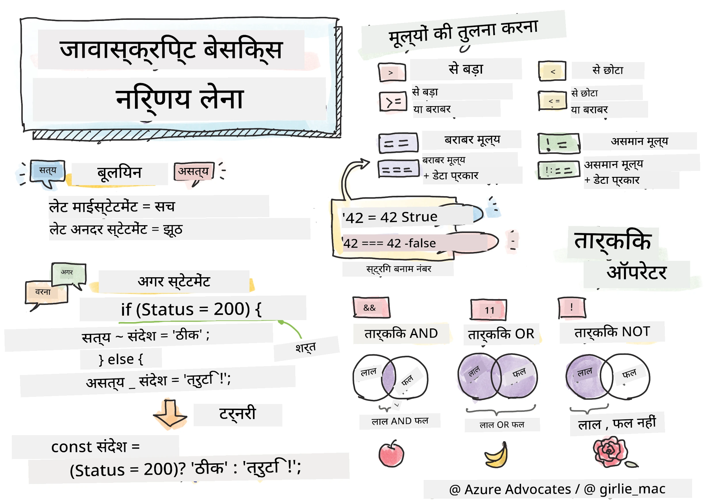

> स्केचनोट द्वारा [Tomomi Imura](https://twitter.com/girlie_mac)

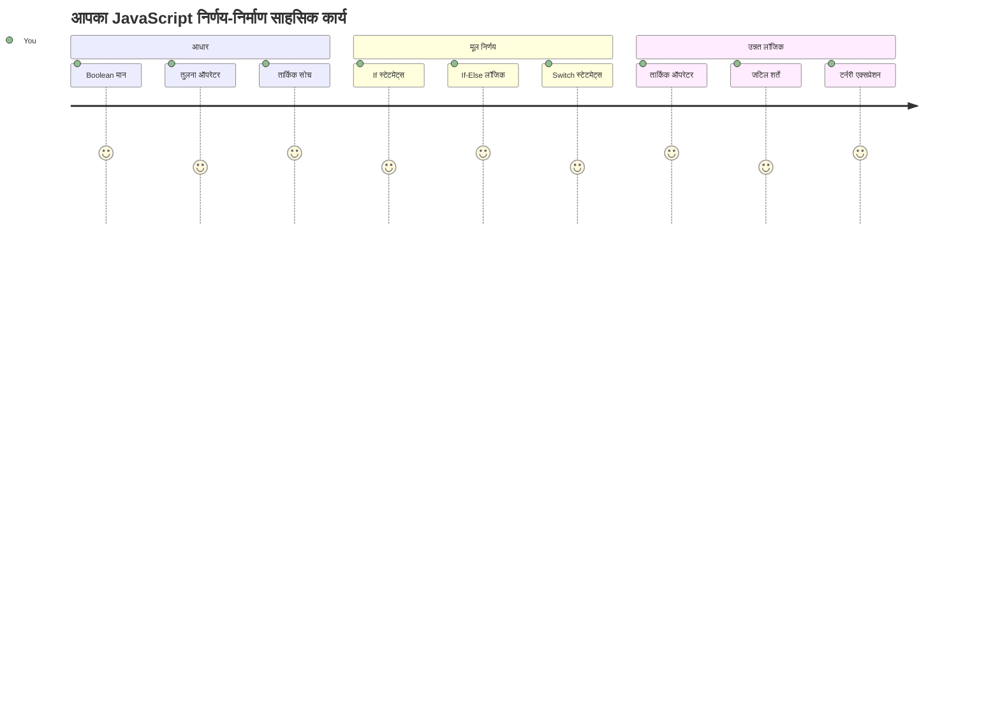
क्या आपने कभी सोचा है कि एप्लिकेशन कैसे स्मार्ट निर्णय लेते हैं? जैसे एक नेविगेशन सिस्टम सबसे तेज रास्ता कैसे चुनता है, या एक थर्मोस्टेट गर्मी कब चालू करता है? यह प्रोग्रामिंग में निर्णय लेने की मूल अवधारणा है।

जैसे कि चार्ल्स बैबेज के एनालिटिकल इंजन को विभिन्न ऑपरेशनों के क्रमों का पालन करने के लिए डिज़ाइन किया गया था, जो स्थितियों पर आधारित थे, आधुनिक जावास्क्रिप्ट प्रोग्राम को भी विभिन्न परिस्थितियों के आधार पर चयन करना होता है। इस शाखा क्षमता और निर्णय लेने की क्षमता से स्थैतिक कोड को प्रतिक्रियाशील, बुद्धिमान एप्लिकेशन में बदल दिया जाता है।

इस पाठ में, आप अपने प्रोग्रामों में सशर्त लॉजिक को लागू करना सीखेंगे। हम सशर्त कथन, तुलना ऑपरेटर, और तार्किक अभिव्यक्तियों का पता लगाएंगे जो आपके कोड को स्थितियों का मूल्यांकन करने और उपयुक्त प्रतिक्रिया देने की अनुमति देते हैं।

## प्री-लेक्चर क्विज़

[प्री-लेक्चर क्विज़](https://ff-quizzes.netlify.app/web/quiz/11)

निर्णय लेने और प्रोग्राम फ्लो को नियंत्रित करने की क्षमता प्रोग्रामिंग का एक मूलभूत पहलू है। इस खंड में Boolean मानों और सशर्त लॉजिक का उपयोग करके अपने जावास्क्रिप्ट प्रोग्रामों के निष्पादन पथ को नियंत्रित करना शामिल है।

[](https://youtube.com/watch?v=SxTp8j-fMMY "Making Decisions")

> 🎥 निर्णय लेने के बारे में वीडियो के लिए ऊपर दी गई छवि पर क्लिक करें।

> आप यह पाठ [Microsoft Learn](https://docs.microsoft.com/learn/modules/web-development-101-if-else/?WT.mc_id=academic-77807-sagibbon) पर भी ले सकते हैं!

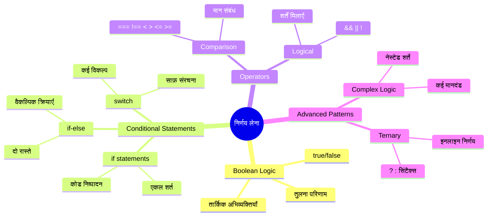
## बूलियन पर संक्षिप्त पुनरावलोकन

निर्णय लेने की खोज करने से पहले, चलिए पिछले पाठ से Boolean मानों को फिर से देखते हैं। गणितज्ञ जॉर्ज बूल के नाम पर, ये मान बाइनरी स्थितियों का प्रतिनिधित्व करते हैं – या तो `true` या `false`। यहां कोई अस्पष्टता नहीं है, कोई मध्य स्तर नहीं है।

ये बाइनरी मान सभी कम्प्यूटेशनल लॉजिक की नींव बनाते हैं। आपके प्रोग्राम का हर निर्णय अंततः एक Boolean मूल्यांकन में संक्षिप्त हो जाता है।

Boolean चर बनाना सरल है:

```javascript
let myTrueBool = true;
let myFalseBool = false;
```

यह स्पष्ट Boolean मानों के साथ दो चर बनाता है।

✅ बूलियन का नाम अंग्रेज़ गणितज्ञ, दार्शनिक और तर्कशास्त्री जॉर्ज बूल (1815–1864) के नाम पर रखा गया है।

## तुलना ऑपरेटर और बूलियन्स

व्यवहार में, आप शायद ही कभी Boolean मान मैन्युअली सेट करते हैं। इसके बजाय, आप उन्हें शर्तों का मूल्यांकन करके उत्पन्न करेंगे: "क्या यह संख्या उस संख्या से बड़ी है?" या "क्या ये मान बराबर हैं?"

तुलना ऑपरेटर ये मूल्यांकन संभव बनाते हैं। वे मानों की तुलना करते हैं और ऑपरेण्ड के बीच संबंध के आधार पर Boolean परिणाम लौटाते हैं।

| प्रतीक | विवरण                                                                                                                                                  | उदाहरण            |
| ------ | -------------------------------------------------------------------------------------------------------------------------------------------------------- | ------------------ |
| `<`    | **छोटा है**: दो मानों की तुलना करता है और यदि बाएं वाला दाएं वाले से छोटा है तो `true` Boolean प्रकार लौटाता है                                    | `5 < 6 // true`    |
| `<=`   | **छोटा या बराबर है**: दो मानों की तुलना करता है और यदि बाएं वाला दाएं वाले से छोटा या बराबर है तो `true` Boolean प्रकार लौटाता है                   | `5 <= 6 // true`   |
| `>`    | **बड़ा है**: दो मानों की तुलना करता है और यदि बाएं वाला दाएं वाले से बड़ा है तो `true` Boolean प्रकार लौटाता है                                      | `5 > 6 // false`   |
| `>=`   | **बड़ा या बराबर है**: दो मानों की तुलना करता है और यदि बाएं वाला दाएं वाले से बड़ा या बराबर है तो `true` Boolean प्रकार लौटाता है                   | `5 >= 6 // false`  |
| `===`  | **सख्त समानता**: दो मानों की तुलना करता है और यदि बाएं और दाएं वाले समान हैं AND उनका प्रकार भी समान है तो `true` Boolean प्रकार लौटाता है         | `5 === 6 // false` |
| `!==`  | **असमानता**: दो मानों की तुलना करता है और सख्त समानता के विपरीत Boolean मान लौटाता है                                                               | `5 !== 6 // true`  |

✅ अपने ब्राउज़र के कंसोल में कुछ तुलना लिखकर अपनी जानकारी जांचें। क्या कोई वापस किया गया डेटा आपको आश्चर्यचकित करता है?

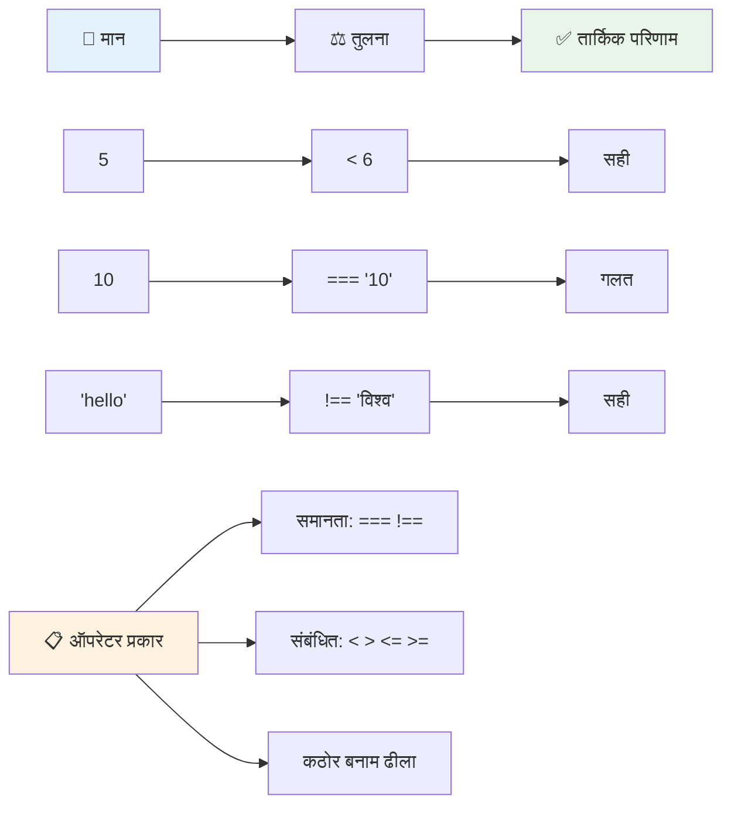
### 🧠 **तुलना मास्टरी जांच: बूलियन लॉजिक समझना**

**अपनी तुलना समझ का परीक्षण करें:**
- आप क्यों सोचते हैं कि `===` (सख्त समानता) आमतौर पर `==` (ढीली समानता) से बेहतर है?
- क्या आप अनुमान लगा सकते हैं कि `5 === '5'` क्या लौटाएगा? और `5 == '5'`?
- `!==` और `!=` में क्या अंतर है?

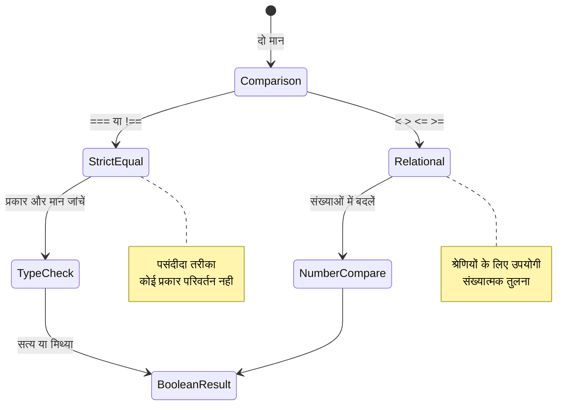
> **प्रो टिप**: समानता जांच के लिए हमेशा `===` और `!==` का उपयोग करें जब तक कि आपको विशेष रूप से प्रकार रूपांतरण की आवश्यकता न हो। यह अप्रत्याशित व्यवहार को रोकता है!

## If स्टेटमेंट

`if` स्टेटमेंट आपके कोड में एक प्रश्न पूछने जैसा है। "यदि यह शर्त सही है, तो यह काम करें।" यह शायद जावास्क्रिप्ट में निर्णय लेने के लिए सबसे महत्वपूर्ण उपकरण है।

यह इस प्रकार काम करता है:

```javascript
if (condition) {
  // शर्त सच है। इस ब्लॉक में कोड चलेगा।
}
```

शर्त को कोष्ठकों के अंदर रखा जाता है, और यदि यह `true` है, तो जावास्क्रिप्ट कर्ली ब्रेसेस के अंदर कोड चलाता है। यदि यह `false` है, तो जावास्क्रिप्ट पूरे ब्लॉक को छोड़ देता है।

आप अक्सर इन शर्तों को बनाने के लिए तुलना ऑपरेटर का उपयोग करेंगे। चलिए एक व्यावहारिक उदाहरण देखें:

```javascript
let currentMoney = 1000;
let laptopPrice = 800;

if (currentMoney >= laptopPrice) {
  // शर्त सत्य है। इस ब्लॉक में कोड चलेगा।
  console.log("Getting a new laptop!");
}
```

चूंकि `1000 >= 800` का मूल्यांकन `true` होता है, ब्लॉक के अंदर का कोड निष्पादित होता है, और कंसोल में "नई लैपटॉप खरीदना!" प्रदर्शित होता है।

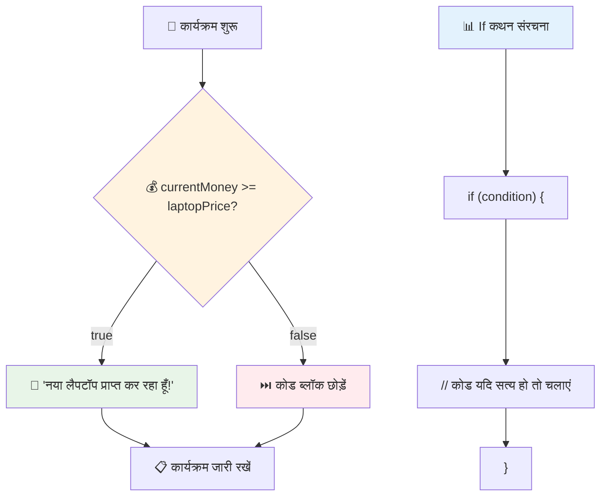
## If..Else स्टेटमेंट

लेकिन क्या होगा यदि आप चाहते हैं कि जब शर्त गलत हो तो आपका प्रोग्राम कुछ अलग करे? यही वह जगह है जहाँ `else` काम आता है – यह एक बैकअप योजना की तरह है।

`else` स्टेटमेंट आपको यह कहने का तरीका देता है कि "यदि यह शर्त सही नहीं है, तो इसके बजाय यह काम करें।"

```javascript
let currentMoney = 500;
let laptopPrice = 800;

if (currentMoney >= laptopPrice) {
  // स्थिति सही है। इस ब्लॉक में कोड चलेगा।
  console.log("Getting a new laptop!");
} else {
  // स्थिति गलत है। इस ब्लॉक में कोड चलेगा।
  console.log("Can't afford a new laptop, yet!");
}
```

अब चूंकि `500 >= 800` गलत है, जावास्क्रिप्ट पहला ब्लॉक छोड़ देता है और उसके बजाय `else` ब्लॉक चलाता है। आपको कंसोल में "अभी नई लैपटॉप खरीदने का बजट नहीं है!" दिखाई देगा।

✅ इस कोड और निम्न कोड को ब्राउज़र कंसोल में चलाकर अपनी समझ जांचें। `currentMoney` और `laptopPrice` वेरिएबल के मान बदलकर `console.log()` के आउटपुट को परिवर्तित करें।

### 🎯 **If-Else लॉजिक जांच: शाखाएं**

**अपनी सशर्त लॉजिक समझ का मूल्यांकन करें:**
- अगर `currentMoney` ठीक `laptopPrice` के बराबर है तो क्या होगा?
- क्या आप कोई वास्तविक जीवन का परिदृश्य सोच सकते हैं जहाँ if-else लॉजिक उपयोगी होगा?
- आप इसे कैसे बढ़ा सकते हैं ताकि कई मूल्य सीमा को संभाला जा सके?

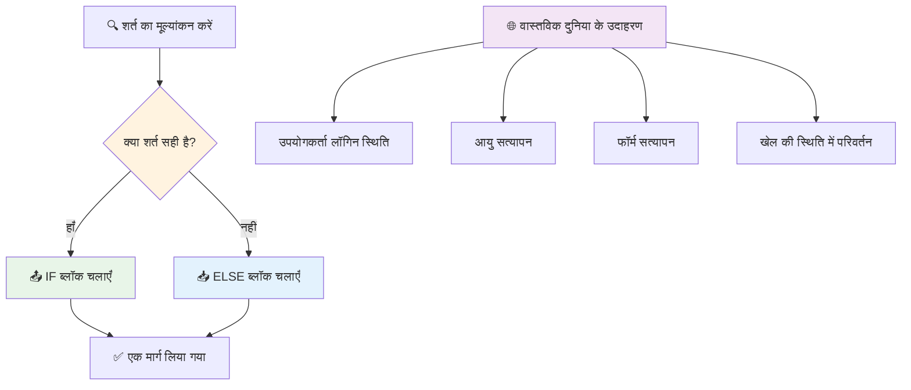
> **महत्वपूर्ण ज्ञान**: If-else यह सुनिश्चित करता है कि ठीक एक ही पथ लिया जाए। यह गारंटी देता है कि आपका प्रोग्राम किसी भी शर्त के लिए हमेशा प्रतिक्रिया देता है!

## Switch स्टेटमेंट

कभी-कभी आपको एक मान की तुलना कई विकल्पों से करनी होती है। जबकि आप कई `if..else` स्टेटमेंट्स को कड़ी से जोड़ सकते हैं, यह तरीका बोझिल हो जाता है। `switch` स्टेटमेंट कई विशिष्ट मानों को संभालने के लिए एक साफ-सुथरी संरचना प्रदान करता है।

यह अवधारणा प्रारंभिक टेलीफोन एक्सचेंज में इस्तेमाल होने वाले मैकेनिकल स्विचिंग सिस्टम से मिलती-जुलती है – एक इनपुट मान यह निर्धारित करता है कि निष्पादन किस विशिष्ट पथ का अनुसरण करता है।

```javascript
switch (expression) {
  case x:
    // कोड ब्लॉक
    break;
  case y:
    // कोड ब्लॉक
    break;
  default:
    // कोड ब्लॉक
}
```

यह इस प्रकार संरचित है:
- जावास्क्रिप्ट अभिव्यक्ति का एक बार मूल्यांकन करता है
- यह हर `case` को देखता है ताकि मेल मिले
- जब मेल मिलता है, तो वह कोड ब्लॉक रन करता है
- `break` जावास्क्रिप्ट को रोकने और स्विच से बाहर निकलने का संकेत देता है
- अगर कोई मेल नहीं मिलता है, तो यह `default` ब्लॉक चलाता है (अगर आप रखते हैं)

```javascript
// सप्ताह के दिन के लिए स्विच स्टेटमेंट का उपयोग करते हुए कार्यक्रम
let dayNumber = 2;
let dayName;

switch (dayNumber) {
  case 1:
    dayName = "Monday";
    break;
  case 2:
    dayName = "Tuesday";
    break;
  case 3:
    dayName = "Wednesday";
    break;
  default:
    dayName = "Unknown day";
    break;
}
console.log(`Today is ${dayName}`);
```

इस उदाहरण में, जावास्क्रिप्ट देखता है कि `dayNumber` `2` है, मेल खाने वाला `case 2` पाता है, `dayName` को "Tuesday" सेट करता है, और फिर स्विच से बाहर निकल जाता है। परिणाम? "Today is Tuesday" कंसोल में लॉग होता है।

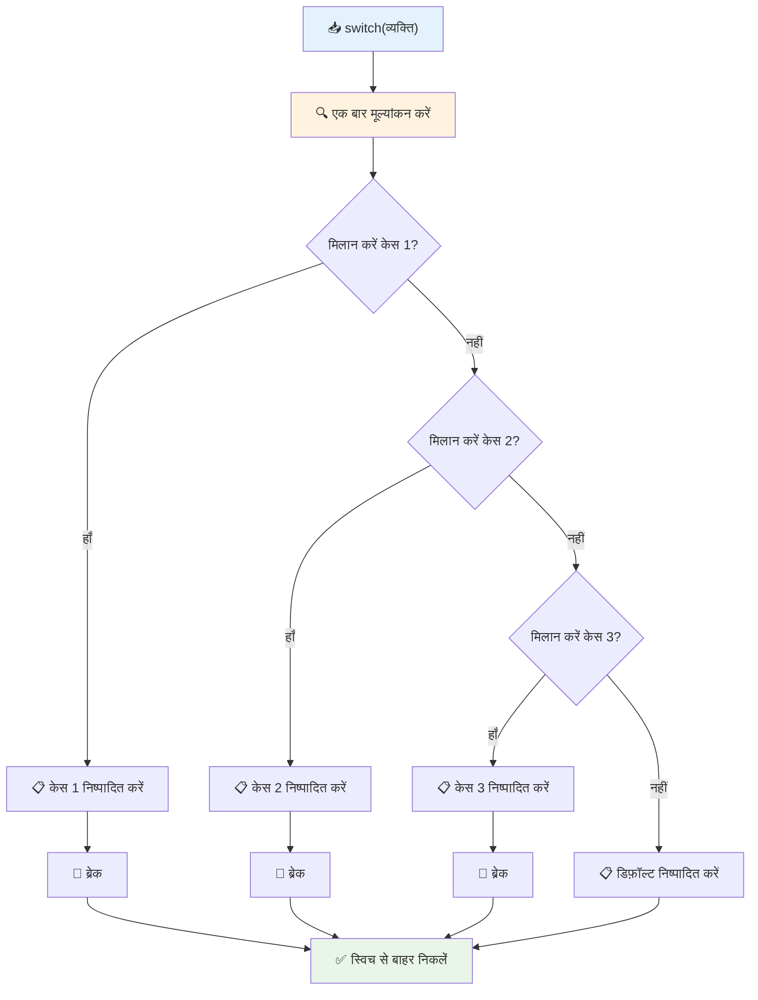
✅ इस कोड और निम्नलिखित कोड को ब्राउज़र कंसोल में चलाकर अपनी समझ की जांच करें। वैरिएबल `a` के मान बदलकर `console.log()` के आउटपुट को परिवर्तित करें।

### 🔄 **Switch स्टेटमेंट मास्टरी: कई विकल्प**

**अपनी स्विच की समझ का परीक्षण करें:**
- क्या होता है यदि आप `break` स्टेटमेंट भूल जाते हैं?
- आप कब कई `if-else` स्टेटमेंट के बजाय `switch` का उपयोग करेंगे?
- यदि आपको लगता है कि आपने सभी संभावनाएं कवर कर ली हैं, तब भी `default` केस क्यों उपयोगी है?

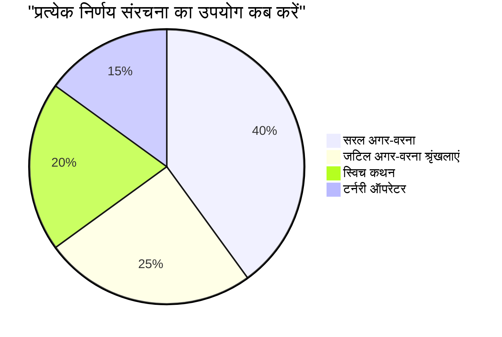
> **श्रेष्ठ अभ्यास**: जब एक वैरिएबल की तुलना कई विशिष्ट मानों से करनी हो तो `switch` का उपयोग करें। रेंज चेक या जटिल शर्तों के लिए `if-else` का उपयोग करें!

## तार्किक ऑपरेटर और बूलियन

जटिल निर्णयों के लिए अक्सर एक साथ कई शर्तों का मूल्यांकन करना पड़ता है। जिस तरह Boolean बीजगणित गणितज्ञों को तार्किक अभिव्यक्तियों को संयोजित करने की अनुमति देता है, प्रोग्रामिंग तार्किक ऑपरेटर प्रदान करता है जो कई Boolean शर्तों को जोड़ते हैं।

ये ऑपरेटर सरल true/false मूल्यांकन को जोड़कर परिष्कृत सशर्त लॉजिक को सक्षम बनाते हैं।

| प्रतीक | विवरण                                                                                     | उदाहरण                                                               |
| ------ | ------------------------------------------------------------------------------------------ | -------------------------------------------------------------------- |
| `&&`   | **तार्किक AND**: दो Boolean अभिव्यक्तियों की तुलना करता है। तभी true लौटाता है जब दोनों पक्ष true हों | `(5 > 3) && (5 < 10) // दोनों पक्ष true. true लौटाता है`             |
| `\|\|` | **तार्किक OR**: दो Boolean अभिव्यक्तियों की तुलना करता है। तब true लौटाता है जब कम से कम एक पक्ष true हो | `(5 > 10) \|\| (5 < 10) // एक पक्ष false, दूसरा true. true लौटाता है`  |
| `!`    | **तार्किक NOT**: Boolean अभिव्यक्ति का विपरीत मान लौटाता है                               | `!(5 > 10) // 5 10 से बड़ा नहीं है, इसलिए "!" इसे true बनाता है`     |

ये ऑपरेटर आपको शर्तों को उपयोगी तरीकों से जोड़ने देते हैं:
- AND (`&&`) का मतलब है दोनों शर्तें सही होनी चाहिए
- OR (`||`) का मतलब है कम से कम एक शर्त सही होनी चाहिए  
- NOT (`!`) true को false में और विपरीत में बदल देता है

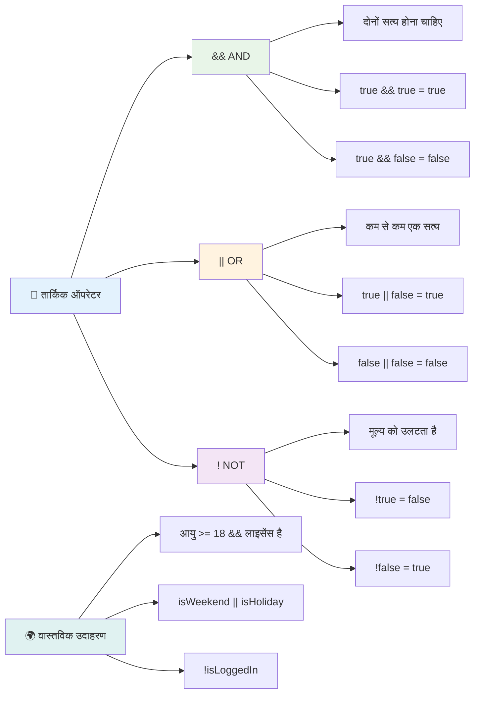
## तार्किक ऑपरेटर के साथ स्थितियां और निर्णय

आइए एक अधिक यथार्थवादी उदाहरण के साथ इन तार्किक ऑपरेटर को देखें:

```javascript
let currentMoney = 600;
let laptopPrice = 800;
let laptopDiscountPrice = laptopPrice - (laptopPrice * 0.2); // लैपटॉप की कीमत 20 प्रतिशत की छूट पर

if (currentMoney >= laptopPrice || currentMoney >= laptopDiscountPrice) {
  // स्थिति सही है। इस ब्लॉक में कोड चलेगा।
  console.log("Getting a new laptop!");
} else {
  // स्थिति गलत है। इस ब्लॉक में कोड चलेगा।
  console.log("Can't afford a new laptop, yet!");
}
```

इस उदाहरण में: हम 20% छूट कीमत (640) की गणना करते हैं, फिर मूल्यांकन करते हैं कि क्या हमारे पास उपलब्ध धन पूरी कीमत OR छूट कीमत दोनों में से किसी एक को कवर करता है। चूंकि 600 छूट कीमत सीमा 640 से कम है, इसलिए शर्त true नहीं होती।

### 🧮 **तार्किक ऑपरेटर जांच: शर्तों को संयोजित करना**

**अपने तार्किक ऑपरेटर की समझ का परीक्षण करें:**
- `A && B` अभिव्यक्ति में यदि A गलत है तो क्या होता है? क्या B भी मूल्यांकन होता है?
- क्या आप ऐसी स्थिति सोच सकते हैं जहाँ आपको तीनों ऑपरेटर (&&, ||, !) एक साथ उपयोग करने होंगे?
- `!user.isActive` और `user.isActive !== true` में क्या अंतर है?

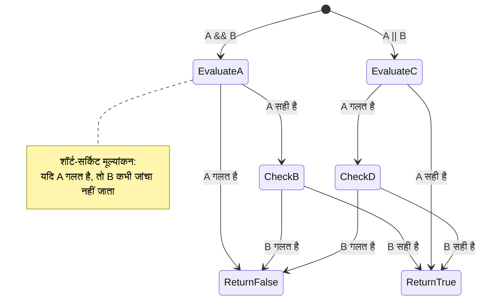
> **परफॉर्मेंस टिप**: जावास्क्रिप्ट "short-circuit evaluation" का उपयोग करता है - `A && B` में, यदि A गलत है, तो B का मूल्यांकन नहीं होता। अपने फायदे के लिए इसका उपयोग करें!

### नेगेशन ऑपरेटर

कभी-कभी यह सोचना आसान होता है कि जब कोई चीज सही नहीं हो। जैसे "क्या उपयोगकर्ता लॉग इन है?" पूछने के बजाय, आप पूछना चाहते हैं "क्या उपयोगकर्ता लॉग इन नहीं है?" निषेध चिन्ह (`!`) ऑपरेटर आपके लिए लॉजिक उलट देता है।

```javascript
if (!condition) {
  // चलती है अगर स्थिति गलत है
} else {
  // चलती है अगर स्थिति सही है
}
```

`!` ऑपरेटर ऐसा है जैसे कहना "इसके विपरीत..." – यदि कुछ `true` है, तो `!` इसे `false` बना देता है, और इसके विपरीत।

### टर्नरी एक्सप्रेशंस

सरल सशर्त असाइनमेंट के लिए, जावास्क्रिप्ट **टर्नरी ऑपरेटर** प्रदान करता है। यह संक्षिप्त सिंटैक्स एक लाइन में सशर्त अभिव्यक्ति लिखने की अनुमति देता है, जब आपको किसी शर्त के आधार पर दो मानों में से एक असाइन करना हो तो यह उपयोगी होता है।

```javascript
let variable = condition ? returnThisIfTrue : returnThisIfFalse;
```

यह ऐसा पढ़ता है: "क्या यह शर्त सही है? यदि हाँ, तो इस मान का उपयोग करें। यदि नहीं, तो उस मान का।"

निम्नलिखित अधिक ठोस उदाहरण है:

```javascript
let firstNumber = 20;
let secondNumber = 10;
let biggestNumber = firstNumber > secondNumber ? firstNumber : secondNumber;
```

✅ इस कोड को कुछ बार पढ़ें। क्या आपको समझ आता है कि ये ऑपरेटर कैसे काम कर रहे हैं?

यह लाइन कह रही है: "क्या `firstNumber`, `secondNumber` से बड़ा है? यदि हाँ, तो `biggestNumber` में `firstNumber` डालो। यदि नहीं, तो `secondNumber` डालो।"

टर्नरी ऑपरेटर पारंपरिक `if..else` स्टेटमेंट को लिखने का एक छोटा तरीका है:

```javascript
let biggestNumber;
if (firstNumber > secondNumber) {
  biggestNumber = firstNumber;
} else {
  biggestNumber = secondNumber;
}
```

दोनों तरीकों से समान परिणाम मिलते हैं। टर्नरी ऑपरेटर संक्षिप्तता प्रदान करता है, जबकि पारंपरिक if-else संरचना जटिल स्थितियों के लिए अधिक पठनीय हो सकती है।

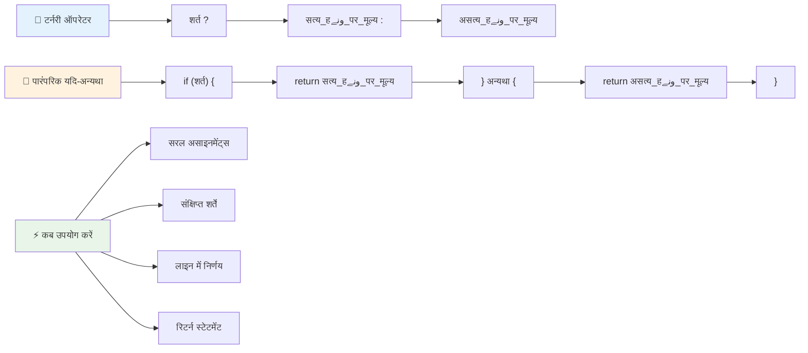
---

## 🚀 चुनौती

एक प्रोग्राम बनाएं जो पहले तार्किक ऑपरेटरों के साथ लिखा गया हो, और फिर एक टर्नरी एक्सप्रेशन का उपयोग करके फिर से लिखें। आपकी प्राथमिकता कौन सा सिंटैक्स है?

---

## GitHub Copilot Agent चुनौती 🚀

Agent मोड का उपयोग करके निम्नलिखित चुनौती पूरी करें:

**विवरण:** एक व्यापक ग्रेड कैल्कुलेटर बनाएं जो इस पाठ के कई निर्णय लेने की अवधारणाओं को दर्शाता हो, जिसमें if-else स्टेटमेंट, switch स्टेटमेंट, तार्किक ऑपरेटर, और टर्नरी एक्सप्रेशन शामिल हों।

**प्रॉम्प्ट:** एक जावास्क्रिप्ट प्रोग्राम लिखें जो छात्र के संख्यात्मक स्कोर (0-100) को लेकर उनके लेटर ग्रेड का निर्धारण करता है निम्नलिखित मानदंडों के अनुसार:
- A: 90-100
- B: 80-89  
- C: 70-79
- D: 60-69
- F: 60 से नीचे

आवश्यकताएँ:  
1. लेटर ग्रेड निर्धारित करने के लिए if-else स्टेटमेंट का उपयोग करें
2. लॉजिकल ऑपरेटर का उपयोग करें ताकि यह जांचा जा सके कि छात्र पास हुआ है (ग्रेड >= 60) और सम्मान भी प्राप्त किया है (ग्रेड >= 90)
3. प्रत्येक पत्र ग्रेड के लिए विशिष्ट प्रतिक्रिया प्रदान करने के लिए स्विच स्टेटमेंट का उपयोग करें
4. यह निर्धारित करने के लिए टर्नरी ऑपरेटर का उपयोग करें कि क्या छात्र अगले कोर्स के लिए पात्र है (ग्रेड >= 70)
5. सुनिश्चित करने के लिए इनपुट सत्यापन शामिल करें कि स्कोर 0 और 100 के बीच है

अपने प्रोग्राम को विभिन्न स्कोर के साथ परीक्षण करें, जिसमें 59, 60, 89, 90 जैसे किनारे के मामले और अमान्य इनपुट शामिल हैं।

[agent mode](https://code.visualstudio.com/blogs/2025/02/24/introducing-copilot-agent-mode) के बारे में अधिक जानें।

## पोस्ट-लेक्चर क्विज़

[पोस्ट-लेक्चर क्विज़](https://ff-quizzes.netlify.app/web/quiz/12)

## समीक्षा और स्व-अध्ययन

उपयोगकर्ता के लिए उपलब्ध कई ऑपरेटरों के बारे में अधिक पढ़ें [MDN पर](https://developer.mozilla.org/docs/Web/JavaScript/Reference/Operators)।

Josh Comeau के अद्भुत [ऑपरेटर लुकअप](https://joshwcomeau.com/operator-lookup/) को देखें!

## असाइनमेंट

[ऑपरेटर](assignment.md)

---

## 🧠 **आपके निर्णय लेने के उपकरण किट सारांश**

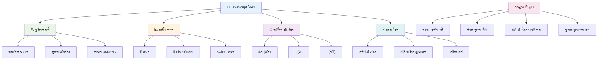
---

## 🚀 आपकी JavaScript निर्णय लेने की महारत की समयरेखा

### ⚡ **अगले 5 मिनट में आप क्या कर सकते हैं**
- [ ] अपने ब्राउज़र कंसोल में तुलना ऑपरेटर्स का अभ्यास करें
- [ ] एक साधारण if-else स्टेटमेंट लिखें जो आपकी उम्र जांचता है
- [ ] चुनौती लें: if-else को टर्नरी ऑपरेटर का उपयोग करके पुनः लिखें
- [ ] अलग-अलग "सत्य" और "असत्य" मूल्यों के साथ क्या होता है, इसका परीक्षण करें

### 🎯 **इस घंटे में आप क्या हासिल कर सकते हैं**
- [ ] पोस्ट-लेसन क्विज़ पूरा करें और किसी भी भ्रमित करने वाली अवधारणा की समीक्षा करें
- [ ] GitHub Copilot चुनौती से व्यापक ग्रेड गणक बनाएं
- [ ] किसी वास्तविक दुनिया की स्थिति के लिए एक सरल निर्णय वृक्ष बनाएं (जैसे क्या पहनना है चुनना)
- [ ] लॉजिकल ऑपरेटर के साथ एक से अधिक शर्तों को संयोजित करने का अभ्यास करें
- [ ] विभिन्न उपयोग मामलों के लिए स्विच स्टेटमेंट के साथ प्रयोग करें

### 📅 **आपके एक सप्ताह के लॉजिक कौशल**
- [ ] रचनात्मक उदाहरणों के साथ ऑपरेटर असाइनमेंट पूरा करें
- [ ] विभिन्न कंडीशनल संरचनाओं का उपयोग करते हुए एक मिनी क्विज एप्लिकेशन बनाएं
- [ ] एक फॉर्म वेलीडेटर बनाएं जो कई इनपुट शर्तों की जांच करता हो
- [ ] Josh Comeau के [ऑपरेटर लुकअप](https://joshwcomeau.com/operator-lookup/) अभ्यास करें
- [ ] मौजूदा कोड को अधिक उपयुक्त कंडीशनल संरचनाओं का उपयोग करने के लिए पुनर्गठित करें
- [ ] शॉर्ट-सर्किट मूल्यांकन और प्रदर्शन प्रभाव का अध्ययन करें

### 🌟 **आपका महीने भर का परिवर्तन**
- [ ] जटिल नेस्टेड शर्तों में महारत हासिल करें और कोड की पठनीयता बनाए रखें
- [ ] परिष्कृत निर्णय लेने के तर्क के साथ एक एप्लिकेशन बनाएं
- [ ] मौजूदा प्रोजेक्ट्स में conditional logic बेहतर बनाकर ओपन सोर्स में योगदान दें
- [ ] किसी और को विभिन्न कंडीशनल संरचनाओं और कब किसका उपयोग करें, यह सिखाएं
- [ ] कंडीशनल लॉजिक के लिए फंक्शनल प्रोग्रामिंग दृष्टिकोण खोजें
- [ ] कंडीशनल सर्वोत्तम प्रथाओं के लिए एक व्यक्तिगत संदर्भ गाइड बनाएं

### 🏆 **अंतिम निर्णय लेने वाले चैम्पियन चेक-इन**

**अपने तार्किक सोच की महारत का जश्न मनाएं:**
- आपने अब तक सबसे जटिल निर्णय लॉजिक क्या सफलतापूर्वक लागू किया है?
- कौन सी कंडीशनल संरचना आपके लिए सबसे स्वाभाविक लगती है और क्यों?
- लॉजिकल ऑपरेटर के बारे में सीखने ने आपकी समस्या-समाधान विधि को कैसे बदला है?
- कौन सा वास्तविक दुनिया का अनुप्रयोग परिष्कृत निर्णय लेने वाले लॉजिक से लाभान्वित होगा?

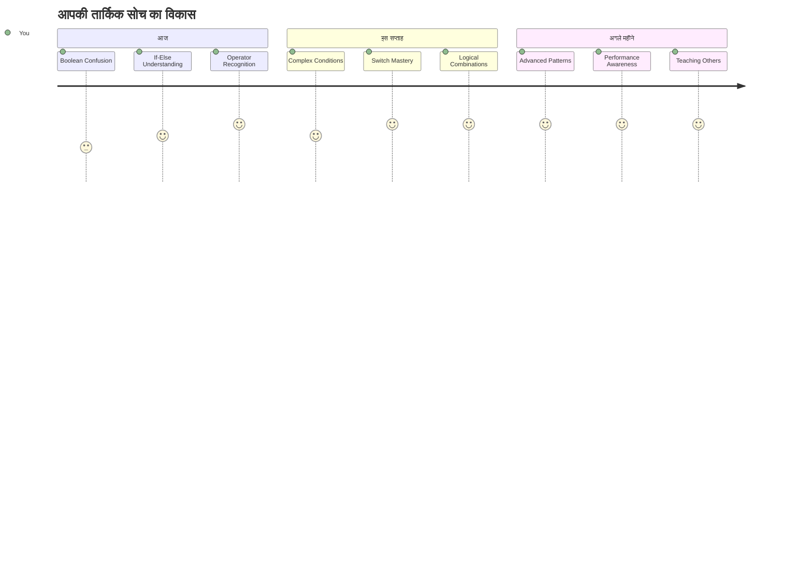
> 🧠 **आपने डिजिटल निर्णय लेने की कला में महारत हासिल कर ली है!** हर इंटरैक्टिव एप्लिकेशन उपयोगकर्ता क्रियाओं और बदलती परिस्थितियों के अनुसार बुद्धिमानी से प्रतिक्रिया देने के लिए कंडीशनल लॉजिक पर निर्भर करता है। अब आप समझते हैं कि अपने प्रोग्राम को कैसे सोचने, मूल्यांकन करने और उपयुक्त प्रतिक्रियाएं चुनने के लिए बनाना है। यह तार्किक आधार हर डायनामिक एप्लिकेशन को शक्ति देगा जो आप बनाएंगे! 🎉

---

<!-- CO-OP TRANSLATOR DISCLAIMER START -->
**अस्वीकरण**:
इस दस्तावेज़ का अनुवाद AI अनुवाद सेवा [Co-op Translator](https://github.com/Azure/co-op-translator) का उपयोग करके किया गया है। जबकि हम सटीकता के लिए प्रयासरत हैं, कृपया ध्यान दें कि स्वचालित अनुवाद में त्रुटियाँ या अशुद्धियाँ हो सकती हैं। मूल दस्तावेज़ अपनी मूल भाषा में आधिकारिक स्रोत माना जाना चाहिए। महत्वपूर्ण जानकारी के लिए पेशेवर मानव अनुवाद की सलाह दी जाती है। इस अनुवाद के उपयोग से उत्पन्न किसी भी गलतफहमी या गलत व्याख्या के लिए हम उत्तरदायी नहीं हैं।
<!-- CO-OP TRANSLATOR DISCLAIMER END -->