<!--
CO_OP_TRANSLATOR_METADATA:
{
  "original_hash": "1710a50a519a6e4a1b40a5638783018d",
  "translation_date": "2026-01-06T16:12:02+00:00",
  "source_file": "2-js-basics/4-arrays-loops/README.md",
  "language_code": "hi"
}
-->
# JavaScript मूल बातें: Arrays और Loops


> स्केचनोट [Tomomi Imura](https://twitter.com/girlie_mac) द्वारा

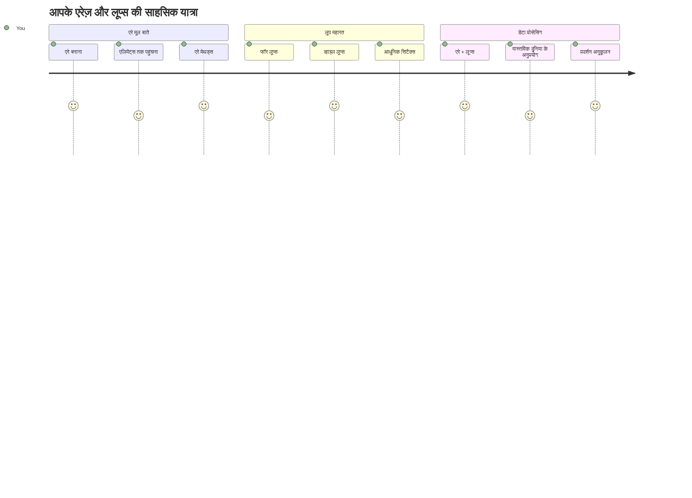
## प्री-लेक्चर क्विज़
[प्री-लेक्चर क्विज़](https://ff-quizzes.netlify.app/web/quiz/13)

क्या आपने कभी सोचा है कि वेबसाइट्स शॉपिंग कार्ट आइटम्स को कैसे ट्रैक करती हैं या आपका फ्रेंड लिस्ट कैसे दिखाती हैं? यहीं पर arrays और loops काम में आते हैं। Arrays डिजिटल कंटेनरों की तरह होते हैं जो कई जानकारी के टुकड़े रखते हैं, जबकि loops आपको सभी डेटा के साथ कुशलता से काम करने देते हैं बिना बार-बार कोड लिखे।

इन दोनों कॉन्सेप्ट्स का संयोजन आपके प्रोग्रामों में जानकारी को संभालने की नींव बनाता है। आप सीखेंगे कि कैसे हर एक स्टेप मैन्युअल रूप से लिखने से कैसे स्मार्ट और प्रभावी कोड बना सकते हैं जो सैकड़ों या हजारों आइटम्स को तेज़ी से प्रोसेस कर सकता है।

इस पाठ के अंत तक, आप समझ जाएंगे कि कुछ लाइनों के कोड द्वारा कैसे जटिल डेटा टास्क किए जा सकते हैं। आइए इन आवश्यक प्रोग्रामिंग कॉन्सेप्ट्स को एक्सप्लोर करें।

[](https://youtube.com/watch?v=1U4qTyq02Xw "Arrays")

[](https://www.youtube.com/watch?v=Eeh7pxtTZ3k "Loops")

> 🎥 उपरोक्त छवियों पर क्लिक करें arrays और loops के वीडियो के लिए।

> आप यह पाठ [Microsoft Learn](https://docs.microsoft.com/learn/modules/web-development-101-arrays/?WT.mc_id=academic-77807-sagibbon) पर भी ले सकते हैं!

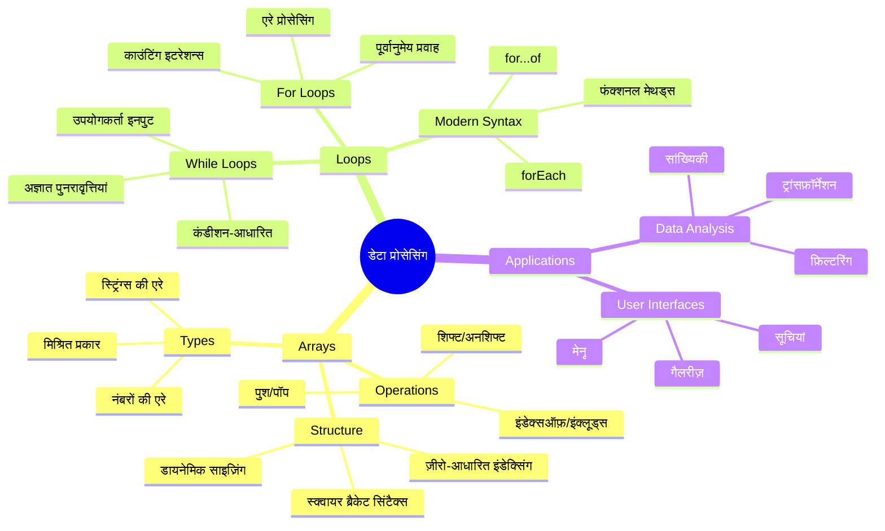
## Arrays

Arrays को एक डिजिटल फाइलिंग कैबिनेट की तरह सोचें - जहाँ एक ड्रॉअर में एक दस्तावेज़ संग्रहीत करने की बजाय, आप कई संबंधित आइटम को एक संरचित कंटेनर में व्यवस्थित कर सकते हैं। प्रोग्रामिंग की भाषा में, arrays आपको एक संगठित पैकेज में कई सूचनाओं को स्टोर करने देते हैं।

चाहे आप एक फोटो गैलरी बना रहे हों, एक टू-डू लिस्ट मैनेज कर रहे हों, या गेम में हाई स्कोर ट्रैक कर रहे हों, arrays डेटा संगठन की नींव प्रदान करते हैं। आइए देखें वे कैसे काम करते हैं।

✅ Arrays हमारे चारों ओर हैं! क्या आप एक वास्तविक जीवन का उदाहरण सोच सकते हैं, जैसे सोलर पैनल एरे?

### Arrays बनाना

Array बनाना बहुत सरल है - बस स्क्वायर ब्रैकेट्स का इस्तेमाल करें!

```javascript
// खाली ऐरे - जैसे कोई खाली शॉपिंग कार्ट जो आइटम्स के इंतजार में हो
const myArray = [];
```

**यहाँ क्या हो रहा है?**
आपने बस उन स्क्वायर ब्रैकेट्स `[]` का उपयोग करके एक खाली कंटेनर बनाया है। इसे एक खाली पुस्तकालय की शेल्फ़ की तरह सोचें - यह उस पर आप जो भी पुस्तकें रखना चाहें, उसके लिए तैयार है।

आप अपने array को शुरू से ही प्रारंभिक मानों से भी भर सकते हैं:

```javascript
// आपकी आइसक्रीम की दुकान का फ्लेवर मेनू
const iceCreamFlavors = ["Chocolate", "Strawberry", "Vanilla", "Pistachio", "Rocky Road"];

// एक उपयोगकर्ता की प्रोफ़ाइल जानकारी (विभिन्न प्रकार के डेटा को मिलाते हुए)
const userData = ["John", 25, true, "developer"];

// आपकी पसंदीदा कक्षा के लिए टेस्ट स्कोर
const scores = [95, 87, 92, 78, 85];
```

**ध्यान देने वाली अच्छी बातें:**
- आप टेक्स्ट, संख्याएँ, या true/false मान एक ही array में रख सकते हैं
- केवल प्रत्येक आइटम को कॉमा से अलग करें - आसान!
- Arrays संबंधित जानकारी को एक साथ रखने के लिए परफेक्ट हैं

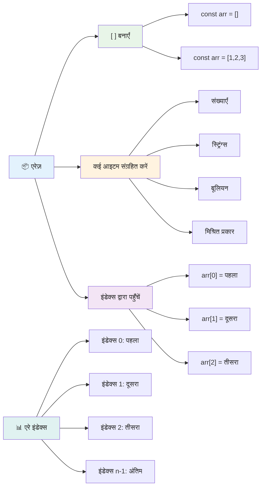
### Array इंडेक्सिंग

यहाँ कुछ ऐसा है जो शुरुआत में थोड़ा अजीब लग सकता है: arrays अपने आइटम्स को 0 से नंबर करते हैं, ना कि 1 से। यह शून्य-आधारित इंडेक्सिंग कंप्यूटर मेमोरी के काम करने वाले तरीके से प्रभावित है - यह कंप्यूटरिंग भाषाओं जैसे C के प्रारंभिक दिनों से एक प्रोग्रामिंग कन्वेंशन रहा है। Array का प्रत्येक स्थान अपने स्वयं के एड्रेस नंबर को प्राप्त करता है जिसे **index** कहते हैं।

| इंडेक्स | मान | विवरण |
|-------|-------|-------------|
| 0 | "Chocolate" | पहला तत्व |
| 1 | "Strawberry" | दूसरा तत्व |
| 2 | "Vanilla" | तीसरा तत्व |
| 3 | "Pistachio" | चौथा तत्व |
| 4 | "Rocky Road" | पाँचवाँ तत्व |

✅ क्या यह आपको आश्चर्यचकित करता है कि arrays 0 से शुरू होते हैं? कुछ प्रोग्रामिंग भाषाओं में, इंडेक्स 1 से शुरू होते हैं। इसके पीछे एक दिलचस्प इतिहास है, जिसे आप [विकिपीडिया पर पढ़ सकते हैं](https://en.wikipedia.org/wiki/Zero-based_numbering)।

**Array एलिमेंट्स तक पहुँच:**

```javascript
const iceCreamFlavors = ["Chocolate", "Strawberry", "Vanilla", "Pistachio", "Rocky Road"];

// ब्रैकेट नोटेशन का उपयोग करके व्यक्तिगत तत्वों तक पहुँचें
console.log(iceCreamFlavors[0]); // "चॉकलेट" - पहला तत्व
console.log(iceCreamFlavors[2]); // "वनीला" - तीसरा तत्व
console.log(iceCreamFlavors[4]); // "रॉकी रोड" - अंतिम तत्व
```

**यहाँ क्या हो रहा है:**
- **इस्तेमाल करता है** स्क्वायर ब्रैकेट नोटेशन इंडेक्स नंबर के साथ एलिमेंट तक पहुँचने के लिए
- **रिटर्न करता है** उस खास स्थान पर जो मान स्टोर है
- **गिनती शुरू करता है** 0 से, जिससे पहला एलिमेंट इंडेक्स 0 होता है

**Array एलिमेंट्स को संशोधित करना:**

```javascript
// एक मौजूदा मान बदलें
iceCreamFlavors[4] = "Butter Pecan";
console.log(iceCreamFlavors[4]); // "बटर पेकान"

// अंत में एक नया तत्व जोड़ें
iceCreamFlavors[5] = "Cookie Dough";
console.log(iceCreamFlavors[5]); // "कूकी डो"
```

**ऊपर दिए गए में हमने:**
- **संशोधित किया** इंडेक्स 4 पर मौजूद "Rocky Road" को "Butter Pecan" में
- **जोड़ा** नया एलिमेंट "Cookie Dough" इंडेक्स 5 पर
- **स्वतः बढ़ाई** array की लंबाई जब सीमा से बाहर जोड़ा गया

### Array Length और सामान्य मेथड्स

Arrays में अंतर्निहित प्रॉपर्टीज़ और मेथड्स होती हैं जो डेटा के साथ काम करना बहुत आसान बनाती हैं।

**Array लंबाई पता करना:**

```javascript
const iceCreamFlavors = ["Chocolate", "Strawberry", "Vanilla", "Pistachio", "Rocky Road"];
console.log(iceCreamFlavors.length); // 5

// जैसे-जैसे array बदलता है लंबाई स्वतः अपडेट होती है
iceCreamFlavors.push("Mint Chip");
console.log(iceCreamFlavors.length); // 6
```

**मुख्य बातें याद रखें:**
- **रिटर्न करता है** array के टोटल आइटम की संख्या
- **स्वतः अपडेट होता है** जब आइटम जोड़े या हटाए जाते हैं
- **प्रदान करता है** डायनामिक काउंट जो loops और सत्यापन के लिए उपयोगी है

**अत्यावश्यक Array मेथड्स:**

```javascript
const fruits = ["apple", "banana", "orange"];

// तत्व जोड़ें
fruits.push("grape");           // अंत में जोड़ता है: ["apple", "banana", "orange", "grape"]
fruits.unshift("strawberry");   // शुरुआत में जोड़ता है: ["strawberry", "apple", "banana", "orange", "grape"]

// तत्व हटाएं
const lastFruit = fruits.pop();        // "grape" हटाता है और लौटाता है
const firstFruit = fruits.shift();     // "strawberry" हटाता है और लौटाता है

// तत्व खोजें
const index = fruits.indexOf("banana"); // 1 लौटाता है ("banana" की स्थिति)
const hasApple = fruits.includes("apple"); // सत्य लौटाता है
```

**इन मेथड्स को समझना:**
- `push()` (अंत में) और `unshift()` (शुरुआत में) से आइटम जोड़ता है
- `pop()` (अंत में) और `shift()` (शुरुआत में) से आइटम हटाता है
- `indexOf()` से आइटम ढूंढ़ता है और `includes()` से अस्तित्व जांचता है
- हटाए गए elements या पोजीशन इंडेक्स जैसे उपयोगी मान वापस करता है

✅ खुद आज़माइए! अपने ब्राउज़र के कंसोल में अपना खुद का एक array बनाकर उससे खेलें।

### 🧠 **Array मूल बातें जांच: अपने डेटा को व्यवस्थित करना**

**अपने array की समझ कैसे जांचें:**
- आप क्यों सोचते हैं कि arrays 0 से गिनती शुरू करते हैं, 1 से नहीं?
- क्या होता है अगर आप किसी ऐसे इंडेक्स का एक्सेस करें जो मौजूद नहीं है (जैसे `arr[100]` जब array में 5 आइटम हों)?
- क्या आप तीन वास्तविक दुनिया के उदाहरण सोच सकते हैं जहाँ arrays उपयोगी होंगे?

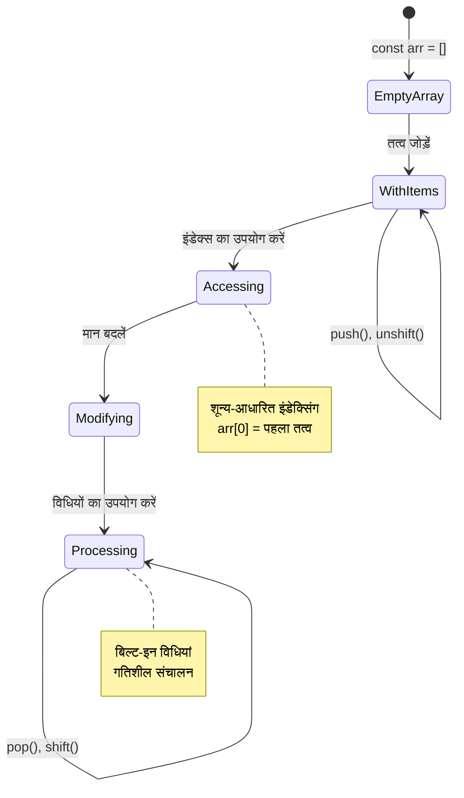
> **वास्तविक दुनिया की समझ:** Arrays प्रोग्रामिंग में हर जगह हैं! सोशल मीडिया फ़ीड्स, शॉपिंग कार्ट्स, फोटो गैलरी, प्लेलिस्ट गाने - ये सब arrays के पीछे काम करते हैं!

## Loops

सोचिए कि चार्ल्स डिकेंस के उपन्यासों में प्रसिद्ध सजा जहाँ छात्रों को स्लेट पर बार-बार पंक्तियाँ लिखनी पड़ती थीं। कल्पना करें कि आप किसी को केवल आदेश दे सकें कि "इस वाक्य को 100 बार लिखो" और यह अपने आप हो जाए। यही loops आपके कोड के लिए करते हैं।

Loops ऐसे हैं जैसे आपके पास एक थकता नहीं सहायक हो जो बिना गलती के काम दोहराता रहता है। चाहे आपको शॉपिंग कार्ट के हर आइटम को चेक करना हो या किसी एल्बम के सभी फ़ोटो दिखाने हों, loops दोहराव को कुशलतापूर्वक संभालते हैं।

JavaScript कई प्रकार के loops प्रदान करता है। आइए प्रत्येक को देखें और समझें कि उन्हें कब उपयोग करना चाहिए।

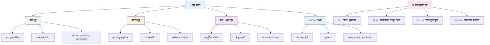
### For Loop

`for` loop ऐसा है जैसे टाइमर सेट करना - आपको पता होता है कि किसी काम को कितनी बार करना है। यह सुपर ऑर्गनाइज़्ड और प्रेडिक्टेबल होता है, जो इसके perfect बनाता है जब आप arrays के साथ काम कर रहे हों या गिनती करनी हो।

**For loop संरचना:**

| घटक | उद्देश्य | उदाहरण |
|-----------|---------|----------|
| **Initialization** | प्रारंभिक बिंदु सेट करना | `let i = 0` |
| **Condition** | कब जारी रखना है | `i < 10` |
| **Increment** | कैसे अपडेट करना है | `i++` |

```javascript
// 0 से 9 तक गिनती
for (let i = 0; i < 10; i++) {
  console.log(`Count: ${i}`);
}

// अधिक व्यावहारिक उदाहरण: स्कोर संसाधित करना
const testScores = [85, 92, 78, 96, 88];
for (let i = 0; i < testScores.length; i++) {
  console.log(`Student ${i + 1}: ${testScores[i]}%`);
}
```

**कदम दर कदम, यहाँ क्या हो रहा है:**
- शुरुआत में काउंटर वेरिएबल `i` को 0 वैल्यू देता है
- हर पुनरावृति से पहले शर्त `i < 10` की जांच करता है
- जब शर्त सही होती है तब कोड ब्लॉक को एक्सीक्यूट करता है
- हर पुनरावृति के बाद `i++` से `i` को 1 से बढ़ाता है
- जब शर्त गलत हो जाती है (जब `i` 10 पहुँचता है) तो बंद हो जाता है

✅ इस कोड को ब्राउज़र कंसोल में चलाएं। क्या होता है जब आप काउंटर, शर्त, या पुनरावृत्ति एक्सप्रेशन में छोटे बदलाव करते हैं? क्या आप इसे उल्टा कर सकते हैं, काउंटडाउन बनाते हुए?

### 🗓️ **For Loop महारत परीक्षा: नियंत्रित दोहराव**

**अपने for loop की समझ की जाँच करें:**
- for loop के तीन भाग क्या हैं और प्रत्येक क्या करता है?
- आप कैसे array में उल्टी दिशा से loop करेंगे?
- क्या होता है अगर आप increment पार्ट (`i++`) भूल जाते हैं?

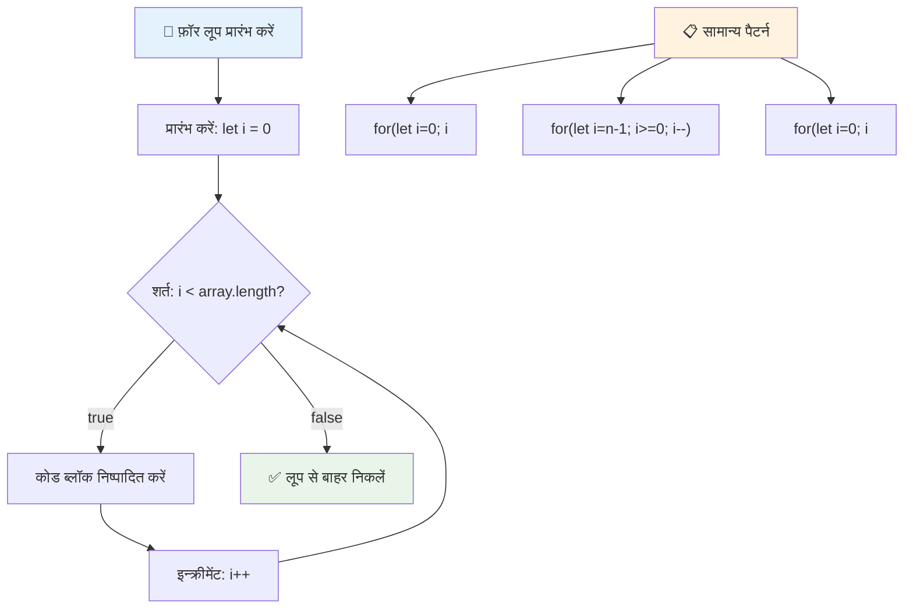
> **Loop ज्ञान:** जब आपको पता होता है कि किसी काम को कितनी बार दोहराना है तो for loops सबसे बेहतरीन होते हैं। वे array प्रोसेसिंग के लिए सबसे आम विकल्प हैं!

### While Loop

`while` loop ऐसा है जैसे कह रहे हों "जब तक यह शर्त सही है तब तक करते रहो" - आपको नहीं पता होता कि यह कितनी बार चलेगा, लेकिन पता होता है कि कब रुकना है। यह तब परफेक्ट होता है जब आपको उपयोगकर्ता से इनपुट मांगते रहना हो या डेटा खोजते रहना हो जब तक कुछ न मिल जाए।

**While loop की विशेषताएँ:**
- शर्त सही होने तक चलता रहता है
- मैन्युअल रूप से किसी भी काउंटर वेरिएबल को मैनेज करने की जरूरत होती है
- हर पुनरावृति से पहले शर्त की जांच करता है
- अगर शर्त कभी गलत न हो तो अनंत loops का खतरा होता है

```javascript
// बुनियादी गिनती का उदाहरण
let i = 0;
while (i < 10) {
  console.log(`While count: ${i}`);
  i++; // इन्क्रीमेंट करना न भूलें!
}

// अधिक व्यावहारिक उदाहरण: उपयोगकर्ता इनपुट संसाधित करना
let userInput = "";
let attempts = 0;
const maxAttempts = 3;

while (userInput !== "quit" && attempts < maxAttempts) {
  userInput = prompt(`Enter 'quit' to exit (attempt ${attempts + 1}):`);
  attempts++;
}

if (attempts >= maxAttempts) {
  console.log("Maximum attempts reached!");
}
```

**इन उदाहरणों को समझें:**
- काउंटर वेरिएबल `i` को लूप के अंदर मैन्युअल रूप से नियंत्रित करता है
- असीमित loops से बचने के लिए काउंटर बढ़ाता है
- उपयोगकर्ता इनपुट और प्रयास सिमित करने के व्यावहारिक उदाहरण दिखाता है
- अंतहीन निष्पादन से बचाव के लिए सुरक्षा तंत्र शामिल करता है

### ♾️ **While Loop ज्ञान परीक्षा: शर्त-आधारित दोहराव**

**अपने while loop की समझ की जाँच करें:**
- while loops का मुख्य खतरा क्या है?
- आप किस स्थिति में for loop के बजाय while loop चुनेंगे?
- आप अनंत loops को कैसे रोक सकते हैं?

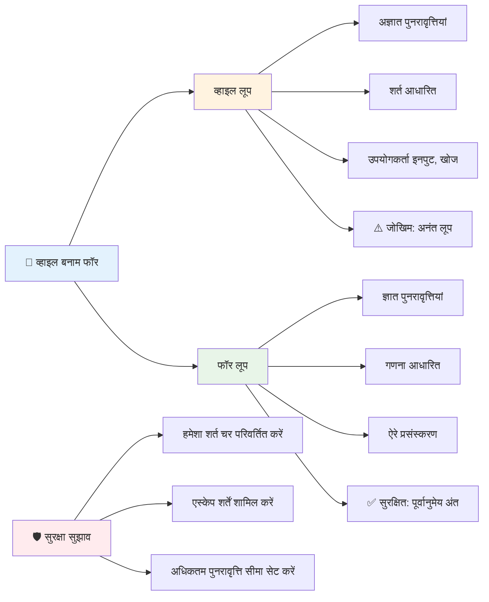
> **सुरक्षा पहले:** While loops शक्तिशाली होते हैं लेकिन शर्त प्रबंधन में सावधानी की जरूरत होती है। हमेशा सुनिश्चित करें कि आपका लूप शर्त अंततः गलत हो जाएगी!

### आधुनिक Loop विकल्प

JavaScript आधुनिक loop सिंटैक्स प्रदान करता है जो आपके कोड को अधिक पठनीय और त्रुटि-रहित बना सकता है।

**For...of Loop (ES6+):**

```javascript
const colors = ["red", "green", "blue", "yellow"];

// आधुनिक तरीका - साफ और सुरक्षित
for (const color of colors) {
  console.log(`Color: ${color}`);
}

// पारंपरिक फॉर लूप के साथ तुलना करें
for (let i = 0; i < colors.length; i++) {
  console.log(`Color: ${colors[i]}`);
}
```

**for...of के मुख्य फायदे:**
- इंडेक्स प्रबंधन और ऑफ-बाय-वन त्रुटियों को खत्म करता है
- सीधे array एलिमेंट्स तक पहुंच प्रदान करता है
- कोड पठनीयता में सुधार करता है और सिंटैक्स जटिलता कम करता है

**forEach मेथड:**

```javascript
const prices = [9.99, 15.50, 22.75, 8.25];

// फंक्शनल प्रोग्रामिंग स्टाइल के लिए forEach का उपयोग
prices.forEach((price, index) => {
  console.log(`Item ${index + 1}: $${price.toFixed(2)}`);
});

// सरल ऑपरेशन्स के लिए एロー फंक्शन्स के साथ forEach
prices.forEach(price => console.log(`Price: $${price}`));
```

**forEach के बारे में जानने योग्य:**
- हर array एलिमेंट के लिए एक फ़ंक्शन को चलाता है
- एलिमेंट वैल्यू और इंडेक्स दोनों को पैरामीटर के रूप में प्रदान करता है
- शुरुआत में रोकना संभव नहीं (पारंपरिक loops की तरह)
- undefined रिटर्न करता है (यह नया array नहीं बनाता)

✅ आप for loop और while loop में से क्यों चुनेंगे? StackOverflow पर 17K दर्शकों ने यही सवाल किया था, और कुछ राय [आपके लिए रोचक हो सकती हैं](https://stackoverflow.com/questions/39969145/while-loops-vs-for-loops-in-javascript)।

### 🎨 **आधुनिक Loop सिंटैक्स जांच: ES6+ को अपनाना**

**अपने आधुनिक JavaScript ज्ञान का मूल्यांकन करें:**
- `for...of` के पारंपरिक for loops पर क्या फायदे हैं?
- आप कब पारंपरिक for loops को प्राथमिकता देंगे?
- `forEach` और `map` में क्या अंतर है?

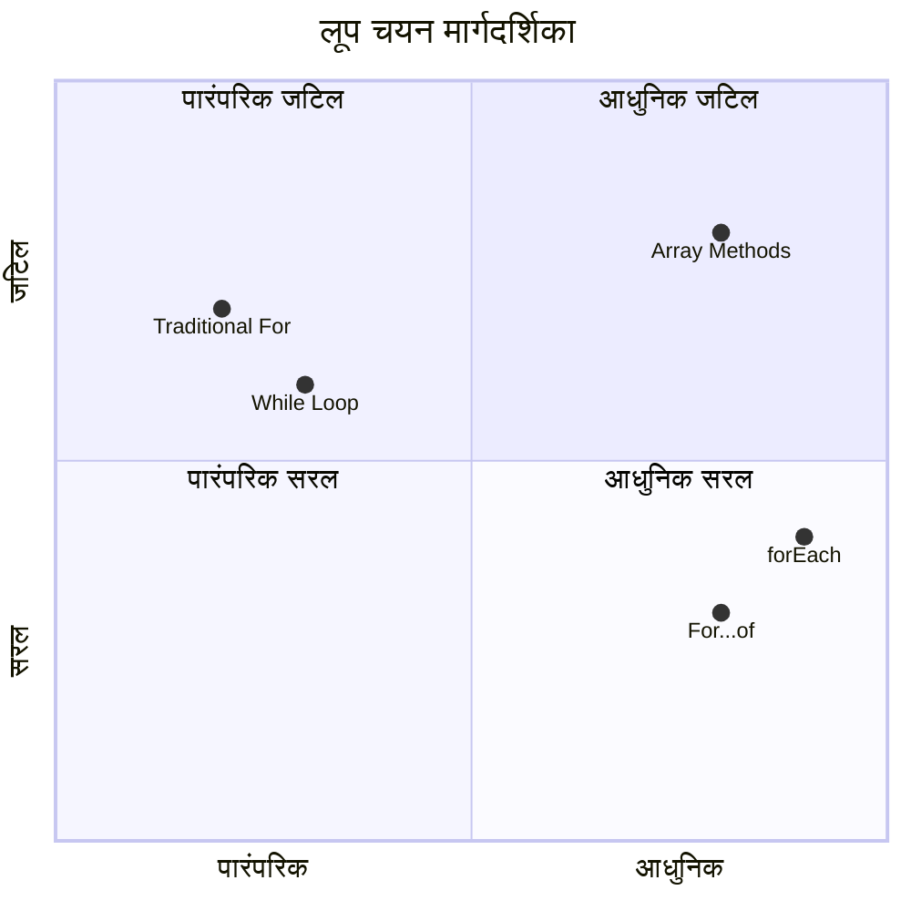
> **आधुनिक प्रवृत्ति:** ES6+ सिंटैक्स जैसे `for...of` और `forEach` array पुनरावृत्ति के लिए प्रिय हो रहे हैं क्योंकि ये साफ़-सुथरे और त्रुटि-रहित हैं!

## Loops और Arrays

Arrays को loops के साथ मिलाकर शक्तिशाली डेटा प्रोसेसिंग क्षमताएं बनती हैं। यह संयोजन कई प्रोग्रामिंग कार्यों की नींव है, जैसे सूचियाँ दिखाना या सांख्यकीय गणना करना।

**परंपरागत Array प्रोसेसिंग:**

```javascript
const iceCreamFlavors = ["Chocolate", "Strawberry", "Vanilla", "Pistachio", "Rocky Road"];

// क्लासिक फॉर लूप तरीका
for (let i = 0; i < iceCreamFlavors.length; i++) {
  console.log(`Flavor ${i + 1}: ${iceCreamFlavors[i]}`);
}

// आधुनिक फॉर...ऑफ तरीका
for (const flavor of iceCreamFlavors) {
  console.log(`Available flavor: ${flavor}`);
}
```

**आइए प्रत्येक दृष्टिकोण को समझें:**
- लूप सीमा निर्धारित करने के लिए array length प्रॉपर्टी का उपयोग करता है
- पारंपरिक for loops में इंडेक्स के द्वारा एलिमेंट्स को एक्सेस करता है
- for...of loops में सीधे एलिमेंट एक्सेस प्रदान करता है
- प्रत्येक array एलिमेंट को ठीक एक बार प्रोसेस करता है

**व्यावहारिक डेटा प्रोसेसिंग उदाहरण:**

```javascript
const studentGrades = [85, 92, 78, 96, 88, 73, 89];
let total = 0;
let highestGrade = studentGrades[0];
let lowestGrade = studentGrades[0];

// एक ही लूप के साथ सभी ग्रेड प्रक्रिया करें
for (let i = 0; i < studentGrades.length; i++) {
  const grade = studentGrades[i];
  total += grade;
  
  if (grade > highestGrade) {
    highestGrade = grade;
  }
  
  if (grade < lowestGrade) {
    lowestGrade = grade;
  }
}

const average = total / studentGrades.length;
console.log(`Average: ${average.toFixed(1)}`);
console.log(`Highest: ${highestGrade}`);
console.log(`Lowest: ${lowestGrade}`);
```

**यह कोड इस तरह काम करता है:**
- योग और अत्यधिक मानों के लिए ट्रैकिंग वेरिएबल सेट करता है
- एक कुशल लूप के साथ प्रत्येक ग्रेड को प्रोसेस करता है
- औसत गणना के लिए कुल जमा करता है
- प्रत्येक पुनरावृति में उच्चतम और निम्नतम मान ट्रैक करता है
- लूप पूरा होने के बाद अंतिम सांख्यिकी गणना करता है

✅ अपने ब्राउज़र कंसोल में अपनी बनाई हुई array पर लूपिंग का प्रयोग करके देखें।

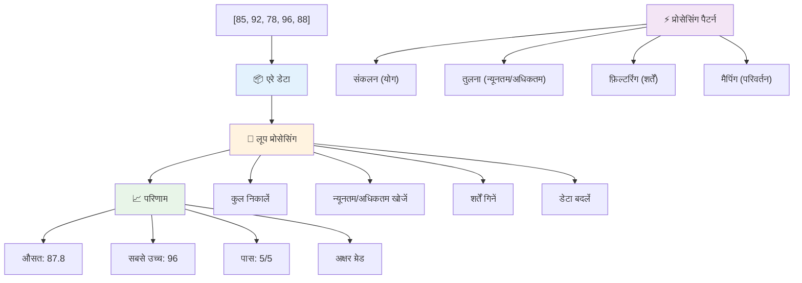
---

## GitHub Copilot एजेंट चुनौती 🚀

एजेंट मोड का उपयोग करके निम्नलिखित चुनौती पूरी करें:

**विवरण:** Arrays और loops को मिलाकर एक व्यापक डेटा प्रोसेसिंग फ़ंक्शन बनाएं जो एक डेटा सेट का विश्लेषण करे और सार्थक अंतर्दृष्टि उत्पन्न करे।

**प्रॉम्प्ट:** एक फ़ंक्शन `analyzeGrades` बनाएं जो एक array ले जो छात्र ग्रेड ऑब्जेक्ट्स (प्रत्येक में नाम और स्कोर विशेषताएँ हों) को इनपुट लेता हो और एक वस्तु लौटाए जिसमें उच्चतम स्कोर, निम्नतम स्कोर, औसत स्कोर, पास हुए छात्रों की गिनती (स्कोर >= 70), और औसत से ऊपर स्कोर करने वाले छात्रों के नाम की array शामिल हो। अपनी समाधान में कम से कम दो अलग-अलग loop प्रकारों का उपयोग करें।

यहाँ [agent mode](https://code.visualstudio.com/blogs/2025/02/24/introducing-copilot-agent-mode) के बारे में और जानें।

## 🚀 चुनौती
JavaScript कई आधुनिक एरे मेथड प्रदान करता है जो विशिष्ट कार्यों के लिए परंपरागत लूप्स को बदल सकते हैं। [forEach](https://developer.mozilla.org/docs/Web/JavaScript/Reference/Global_Objects/Array/forEach), [for-of](https://developer.mozilla.org/docs/Web/JavaScript/Reference/Statements/for...of), [map](https://developer.mozilla.org/docs/Web/JavaScript/Reference/Global_Objects/Array/map), [filter](https://developer.mozilla.org/docs/Web/JavaScript/Reference/Global_Objects/Array/filter), और [reduce](https://developer.mozilla.org/docs/Web/JavaScript/Reference/Global_Objects/Array/reduce) का अन्वेषण करें।

**आपकी चुनौती:** कम से कम तीन अलग-अलग एरे मेथड्स का उपयोग करके छात्र ग्रेड्स का उदाहरण पुनः तैयार करें। देखें कि आधुनिक JavaScript सिंटैक्स के साथ कोड कितना साफ और अधिक पठनीय बन जाता है।

## Post-Lecture Quiz
[Post-lecture quiz](https://ff-quizzes.netlify.app/web/quiz/14)


## Review & Self Study

JavaScript में Arrays के साथ कई मेथड्स जुड़े हुए हैं, जो डेटा हेरफेर के लिए अत्यंत उपयोगी हैं। [इन मेथड्स के बारे में पढ़ें](https://developer.mozilla.org/docs/Web/JavaScript/Reference/Global_Objects/Array) और अपने बनाए गए किसी एरे पर कुछ मेथड्स जैसे push, pop, slice, और splice आज़माएँ।

## Assignment

[Loop an Array](assignment.md)

---

## 📊 **आपका Arrays & Loops टूलकिट सारांश**

```mermaid
graph TD
    A["🎯 एरेज़ और लूप्स में महारत"] --> B["📦 एरे के बुनियादी सिद्धांत"]
    A --> C["🔄 लूप के प्रकार"]
    A --> D["🔗 डेटा प्रसंस्करण"]
    A --> E["🎨 आधुनिक तकनीकें"]
    
    B --> B1["निर्माण: [ ]"]
    B --> B2["इंडेक्सिंग: arr[0]"]
    B --> B3["मेथड्स: push, pop"]
    B --> B4["गुण: length"]
    
    C --> C1["For: ज्ञात पुनरावृत्तियाँ"]
    C --> C2["While: शर्त पर आधारित"]
    C --> C3["For...of: प्रत्यक्ष पहुँच"]
    C --> C4["forEach: कार्यात्मक"]
    
    D --> D1["सांख्यिकी गणना"]
    D --> D2["डेटा रूपांतरण"]
    D --> D3["फ़िल्टरिंग और खोज"]
    D --> D4["रियल-टाइम प्रसंस्करण"]
    
    E --> E1["एरो फ़ंक्शन"]
    E --> E2["मेथड चेनिंग"]
    E --> E3["डिस्ट्रक्चरिंग"]
    E --> E4["टेम्प्लेट लिटेरल्स"]
    
    F["💡 मुख्य लाभ"] --> F1["प्रभावी डेटा प्रबंधन"]
    F --> F2["कोड पुनरावृत्ति में कमी"]
    F --> F3["स्केलेबल समाधान"]
    F --> F4["स्वच्छ सिनटैक्स"]
    
    style A fill:#e3f2fd
    style B fill:#e8f5e8
    style C fill:#fff3e0
    style D fill:#f3e5f5
    style E fill:#e0f2f1
    style F fill:#fce4ec
```
---

## 🚀 आपके Arrays & Loops मास्टरी टाइमलाइन

### ⚡ **अगले 5 मिनट में आप क्या कर सकते हैं**
- [ ] अपनी पसंदीदा फिल्मों की एक एरे बनाएं और विशिष्ट तत्वों तक पहुँचें
- [ ] 1 से 10 तक गिनने वाला for लूप लिखें
- [ ] लेसन में दिए आधुनिक एरे मेथड्स की चुनौती आज़माएं
- [ ] अपने ब्राउज़र कंसोल में एरे इंडेक्सिंग का अभ्यास करें

### 🎯 **इस घंटे में आप क्या हासिल कर सकते हैं**
- [ ] पोस्ट-लेसन क्विज़ पूरा करें और कठिन अवधारणाओं की समीक्षा करें
- [ ] GitHub Copilot चुनौती से व्यापक ग्रेड विश्लेषक बनाएं
- [ ] एक सरल शॉपिंग कार्ट बनाएं जो आइटम जोड़ता और हटाता हो
- [ ] विभिन्न लूप प्रकारों के बीच परिवर्तन का अभ्यास करें
- [ ] `push`, `pop`, `slice`, और `splice` जैसे एरे मेथड्स के साथ प्रयोग करें

### 📅 **आपकी सप्ताह भर की डेटा प्रोसेसिंग यात्रा**
- [ ] "Loop an Array" असाइन्मेंट को रचनात्मक सुधारों के साथ पूरा करें
- [ ] एरे और लूप्स का उपयोग करके टू-डू लिस्ट एप्लिकेशन बनाएं
- [ ] संख्यात्मक डेटा के लिए एक सरल सांख्यिकी कैलकुलेटर बनाएं
- [ ] [MDN एरे मेथड्स](https://developer.mozilla.org/docs/Web/JavaScript/Reference/Global_Objects/Array) के साथ अभ्यास करें
- [ ] एक फोटो गैलरी या म्यूजिक प्लेलिस्ट इंटरफ़ेस बनाएं
- [ ] `map`, `filter`, और `reduce` के साथ फंक्शनल प्रोग्रामिंग का अन्वेषण करें

### 🌟 **आपका महीने भर का परिवर्तन**
- [ ] उन्नत एरे ऑपरेशंस और प्रदर्शन अनुकूलन में महारत हासिल करें
- [ ] पूर्ण डेटा विज़ुअलाइज़ेशन डैशबोर्ड बनाएं
- [ ] डेटा प्रोसेसिंग से संबंधित ओपन सोर्स प्रोजेक्ट्स में योगदान दें
- [ ] व्यावहारिक उदाहरणों के साथ दूसरों को एरे और लूप्स सिखाएं
- [ ] पुन: उपयोग योग्य डेटा प्रोसेसिंग फंक्शंस की व्यक्तिगत लाइब्रेरी बनाएं
- [ ] एरे पर आधारित एल्गोरिदम और डेटा संरचनाओं का अन्वेषण करें

### 🏆 **अंतिम डेटा प्रोसेसिंग चैम्पियन चेक-इन**

**अपने एरे और लूप मास्टरी का जश्न मनाएं:**
- आपने वास्तविक दुनिया के अनुप्रयोगों के लिए सबसे उपयोगी एरे ऑपरेशन क्या सीखा है?
- कौन सा लूप प्रकार आपको सबसे प्राकृतिक लगता है और क्यों?
- एरे और लूप्स को समझने से आपका डेटा व्यवस्थित करने का दृष्टिकोण कैसे बदला है?
- आप अगला कौन सा जटिल डेटा प्रोसेसिंग कार्य करना चाहेंगे?

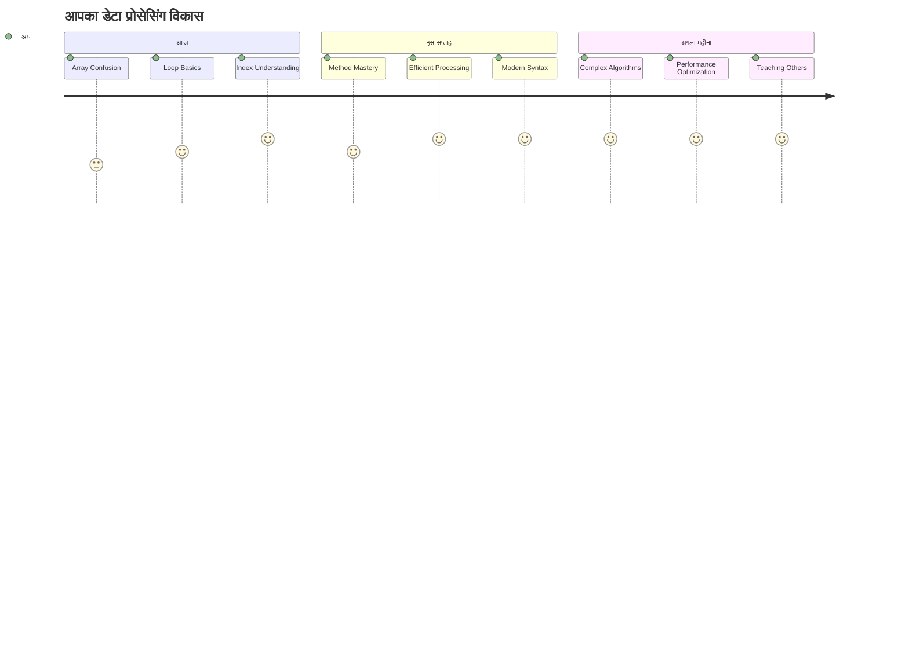
> 📦 **आपने डेटा संगठन और प्रोसेसिंग की शक्ति को अनलॉक कर लिया है!** एरे और लूप लगभग प्रत्येक एप्लिकेशन की नींव हैं जो आप कभी भी बनाएंगे। सरल सूचियों से लेकर जटिल डेटा विश्लेषण तक, अब आपके पास जानकारी को कुशलतापूर्वक और सुंदर रूप से संभालने के उपकरण हैं। हर गतिशील वेबसाइट, मोबाइल ऐप, और डेटा-आधारित एप्लिकेशन इन बुनियादी अवधारणाओं पर निर्भर करता है। स्केलेबल डेटा प्रोसेसिंग की दुनिया में आपका स्वागत है! 🎉

---

<!-- CO-OP TRANSLATOR DISCLAIMER START -->
**अस्वीकरण**:
यह दस्तावेज़ AI अनुवाद सेवा [Co-op Translator](https://github.com/Azure/co-op-translator) का उपयोग करके अनुवादित किया गया है। यद्यपि हम सटीकता के लिए प्रयासरत हैं, कृपया ध्यान दें कि स्वचालित अनुवादों में त्रुटियाँ या अशुद्धियाँ हो सकती हैं। मूल भाषा में मूल दस्तावेज़ को अधिकारिक स्रोत माना जाना चाहिए। महत्वपूर्ण जानकारी के लिए पेशेवर मानव अनुवाद की सलाह दी जाती है। इस अनुवाद के उपयोग से उत्पन्न किसी भी गलतफहमी या गलत व्याख्या के लिए हम जिम्मेदार नहीं हैं।
<!-- CO-OP TRANSLATOR DISCLAIMER END -->