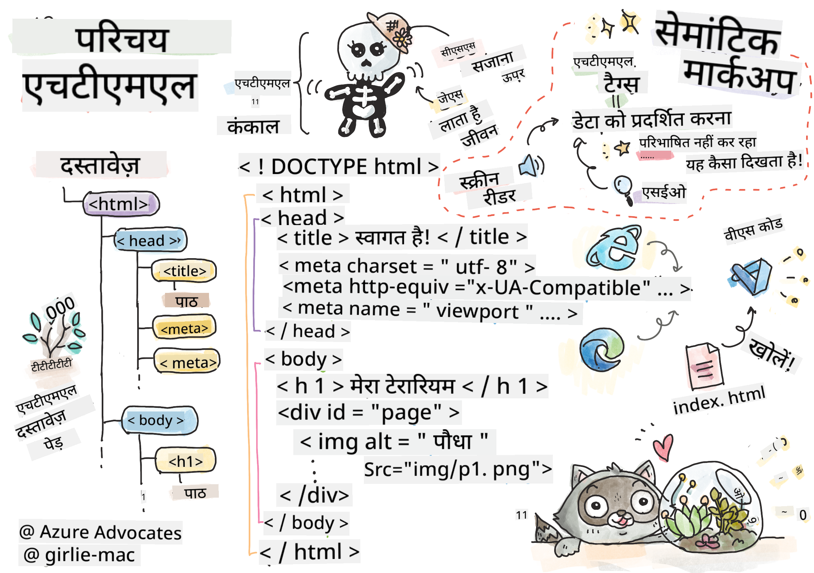
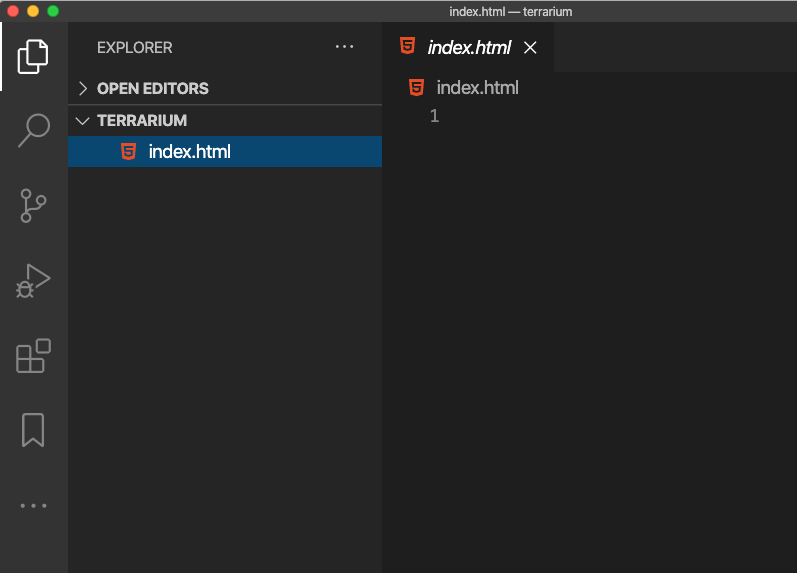

<!--
CO_OP_TRANSLATOR_METADATA:
{
  "original_hash": "89f7f9f800ce7c9f149e98baaae8491a",
  "translation_date": "2025-08-29T15:59:49+00:00",
  "source_file": "3-terrarium/1-intro-to-html/README.md",
  "language_code": "hi"
}
-->
# टेरारियम प्रोजेक्ट भाग 1: HTML का परिचय


> स्केच नोट [टोमोमी इमुरा](https://twitter.com/girlie_mac) द्वारा

## प्री-लेक्चर क्विज़

[प्री-लेक्चर क्विज़](https://ff-quizzes.netlify.app/web/quiz/15)

> वीडियो देखें

> 
> [](https://www.youtube.com/watch?v=1TvxJKBzhyQ)

### परिचय

HTML, या हाइपरटेक्स्ट मार्कअप लैंग्वेज, वेब का 'कंकाल' है। अगर CSS आपके HTML को 'सजाती' है और JavaScript इसे जीवन देती है, तो HTML आपके वेब एप्लिकेशन का शरीर है। HTML की सिंटैक्स भी इस विचार को दर्शाती है, क्योंकि इसमें "head", "body", और "footer" टैग शामिल हैं।

इस पाठ में, हम HTML का उपयोग करके अपने वर्चुअल टेरारियम के इंटरफेस का 'कंकाल' बनाएंगे। इसमें एक शीर्षक और तीन कॉलम होंगे: एक दायां और एक बायां कॉलम जहां ड्रैग करने योग्य पौधे होंगे, और एक केंद्र क्षेत्र जो असल में कांच जैसा टेरारियम होगा। इस पाठ के अंत तक, आप कॉलम में पौधों को देख पाएंगे, लेकिन इंटरफेस थोड़ा अजीब लगेगा; चिंता न करें, अगले भाग में आप CSS स्टाइल्स जोड़कर इसे बेहतर बनाएंगे।

### कार्य

अपने कंप्यूटर पर 'terrarium' नाम का एक फ़ोल्डर बनाएं और उसके अंदर 'index.html' नाम की एक फाइल बनाएं। आप यह Visual Studio Code में कर सकते हैं। अपने टेरारियम फ़ोल्डर को खोलें, एक नई VS Code विंडो खोलें, 'open folder' पर क्लिक करें, और अपने नए फ़ोल्डर पर जाएं। Explorer पैन में छोटे 'file' बटन पर क्लिक करें और नई फाइल बनाएं:



या

Git Bash में ये कमांड्स चलाएं:
* `mkdir terrarium`
* `cd terrarium`
* `touch index.html`
* `code index.html` या `nano index.html`

> index.html फाइलें ब्राउज़र को यह संकेत देती हैं कि यह फ़ोल्डर की डिफ़ॉल्ट फाइल है; जैसे URLs `https://anysite.com/test` एक फ़ोल्डर संरचना का उपयोग कर सकते हैं जिसमें `test` नाम का फ़ोल्डर और उसके अंदर `index.html` हो; URL में `index.html` दिखाना ज़रूरी नहीं है।

---

## DocType और html टैग्स

HTML फाइल की पहली लाइन उसका DocType होती है। यह थोड़ा अजीब लग सकता है कि यह लाइन फाइल के सबसे ऊपर होनी चाहिए, लेकिन यह पुराने ब्राउज़रों को बताती है कि पेज को वर्तमान HTML स्पेसिफिकेशन के अनुसार स्टैंडर्ड मोड में रेंडर करना है।

> टिप: VS Code में, आप किसी टैग पर होवर कर सकते हैं और MDN रेफरेंस गाइड्स से उसके उपयोग की जानकारी प्राप्त कर सकते हैं।

दूसरी लाइन `<html>` टैग की ओपनिंग टैग होनी चाहिए, और उसके तुरंत बाद उसकी क्लोजिंग टैग `</html>`। ये टैग्स आपके इंटरफेस के रूट एलिमेंट्स हैं।

### कार्य

अपने `index.html` फाइल के शीर्ष पर ये लाइनें जोड़ें:

```HTML
<!DOCTYPE html>
<html></html>
```

✅ DocType को एक क्वेरी स्ट्रिंग के साथ सेट करके कुछ अलग मोड्स निर्धारित किए जा सकते हैं: [Quirks Mode और Standards Mode](https://developer.mozilla.org/docs/Web/HTML/Quirks_Mode_and_Standards_Mode)। ये मोड्स पुराने ब्राउज़रों (जैसे Netscape Navigator 4 और Internet Explorer 5) को सपोर्ट करने के लिए उपयोग किए जाते थे, जो अब आमतौर पर उपयोग नहीं होते। आप स्टैंडर्ड DocType डिक्लेरेशन का उपयोग कर सकते हैं।

---

## डॉक्यूमेंट का 'head'

HTML डॉक्यूमेंट का 'head' क्षेत्र आपके वेब पेज की महत्वपूर्ण जानकारी, जिसे [मेटाडेटा](https://developer.mozilla.org/docs/Web/HTML/Element/meta) भी कहा जाता है, शामिल करता है। हमारे मामले में, हम वेब सर्वर को, जिसे यह पेज रेंडर करने के लिए भेजा जाएगा, ये चार चीजें बताते हैं:

-   पेज का शीर्षक
-   पेज मेटाडेटा जिसमें शामिल हैं:
    -   'कैरेक्टर सेट', जो बताता है कि पेज में कौन सा कैरेक्टर एन्कोडिंग उपयोग किया गया है
    -   ब्राउज़र जानकारी, जिसमें `x-ua-compatible` शामिल है जो इंगित करता है कि IE=edge ब्राउज़र समर्थित है
    -   जानकारी कि जब पेज लोड हो तो व्यूपोर्ट कैसे व्यवहार करे। व्यूपोर्ट को 1 की प्रारंभिक स्केल पर सेट करना पेज के पहले लोड होने पर ज़ूम स्तर को नियंत्रित करता है।

### कार्य

अपने डॉक्यूमेंट में `<html>` टैग्स के बीच एक 'head' ब्लॉक जोड़ें।

```html
<head>
	<title>Welcome to my Virtual Terrarium</title>
	<meta charset="utf-8" />
	<meta http-equiv="X-UA-Compatible" content="IE=edge" />
	<meta name="viewport" content="width=device-width, initial-scale=1" />
</head>
```

✅ क्या होगा अगर आप व्यूपोर्ट मेटा टैग को इस तरह सेट करें: `<meta name="viewport" content="width=600">`? [Viewport](https://developer.mozilla.org/docs/Web/HTML/Viewport_meta_tag) के बारे में और पढ़ें।

---

## डॉक्यूमेंट का `body`

### HTML टैग्स

HTML में, आप अपने .html फाइल में टैग्स जोड़कर वेब पेज के एलिमेंट्स बनाते हैं। प्रत्येक टैग में आमतौर पर एक ओपनिंग और क्लोजिंग टैग होती है, जैसे: `<p>hello</p>` पैराग्राफ को इंगित करने के लिए। अपने इंटरफेस का बॉडी बनाने के लिए `<html>` टैग्स के अंदर `<body>` टैग्स का एक सेट जोड़ें; अब आपका मार्कअप इस तरह दिखेगा:

### कार्य

```html
<!DOCTYPE html>
<html>
	<head>
		<title>Welcome to my Virtual Terrarium</title>
		<meta charset="utf-8" />
		<meta http-equiv="X-UA-Compatible" content="IE=edge" />
		<meta name="viewport" content="width=device-width, initial-scale=1" />
	</head>
	<body></body>
</html>
```

अब, आप अपने पेज का निर्माण शुरू कर सकते हैं। आमतौर पर, आप पेज में अलग-अलग एलिमेंट्स बनाने के लिए `<div>` टैग्स का उपयोग करते हैं। हम `<div>` एलिमेंट्स की एक श्रृंखला बनाएंगे जो इमेजेस को समाहित करेंगे।

### इमेजेस

एक HTML टैग जिसे क्लोजिंग टैग की आवश्यकता नहीं होती, वह `` टैग है, क्योंकि इसमें एक `src` एलिमेंट होता है जो पेज को आइटम रेंडर करने के लिए सभी जानकारी प्रदान करता है।

अपने ऐप में `images` नाम का एक फ़ोल्डर बनाएं और उसमें [स्रोत कोड फ़ोल्डर](../../../../3-terrarium/solution/images) की सभी इमेजेस जोड़ें; (पौधों की 14 इमेजेस हैं)।

### कार्य

इन पौधों की इमेजेस को `<body></body>` टैग्स के बीच दो कॉलम में जोड़ें:

```html
<div id="page">
	<div id="left-container" class="container">
		<div class="plant-holder">
			
		</div>
		<div class="plant-holder">
			
		</div>
		<div class="plant-holder">
			
		</div>
		<div class="plant-holder">
			
		</div>
		<div class="plant-holder">
			
		</div>
		<div class="plant-holder">
			
		</div>
		<div class="plant-holder">
			
		</div>
	</div>
	<div id="right-container" class="container">
		<div class="plant-holder">
			
		</div>
		<div class="plant-holder">
			
		</div>
		<div class="plant-holder">
			
		</div>
		<div class="plant-holder">
			
		</div>
		<div class="plant-holder">
			
		</div>
		<div class="plant-holder">
			
		</div>
		<div class="plant-holder">
			
		</div>
	</div>
</div>
```

> नोट: स्पैन बनाम डिव। डिव्स को 'ब्लॉक' एलिमेंट्स माना जाता है, और स्पैन्स को 'इनलाइन'। क्या होगा अगर आप इन डिव्स को स्पैन्स में बदल दें?

इस मार्कअप के साथ, पौधे अब स्क्रीन पर दिखाई देंगे। यह थोड़ा खराब दिखता है, क्योंकि इन्हें अभी तक CSS का उपयोग करके स्टाइल नहीं किया गया है, और हम इसे अगले पाठ में करेंगे।

प्रत्येक इमेज में alt टेक्स्ट होता है जो तब दिखाई देगा जब आप इमेज को देख या रेंडर नहीं कर सकते। यह एक महत्वपूर्ण एट्रिब्यूट है जिसे एक्सेसिबिलिटी के लिए शामिल करना चाहिए। भविष्य के पाठों में एक्सेसिबिलिटी के बारे में और जानें; फिलहाल, याद रखें कि alt एट्रिब्यूट इमेज के लिए वैकल्पिक जानकारी प्रदान करता है अगर किसी कारणवश उपयोगकर्ता इसे नहीं देख सकता (धीमा कनेक्शन, src एट्रिब्यूट में त्रुटि, या उपयोगकर्ता स्क्रीन रीडर का उपयोग करता है)।

✅ क्या आपने देखा कि प्रत्येक इमेज में एक ही alt टैग है? क्या यह अच्छी प्रैक्टिस है? क्यों या क्यों नहीं? क्या आप इस कोड को बेहतर बना सकते हैं?

---

## सेमांटिक मार्कअप

सामान्यतः, HTML लिखते समय अर्थपूर्ण 'सेमांटिक्स' का उपयोग करना बेहतर होता है। इसका क्या मतलब है? इसका मतलब है कि आप HTML टैग्स का उपयोग उस प्रकार के डेटा या इंटरैक्शन को दर्शाने के लिए करते हैं जिसके लिए उन्हें डिज़ाइन किया गया था। उदाहरण के लिए, पेज के मुख्य शीर्षक टेक्स्ट को `<h1>` टैग का उपयोग करना चाहिए।

अपने ओपनिंग `<body>` टैग के ठीक नीचे निम्न पंक्ति जोड़ें:

```html
<h1>My Terrarium</h1>
```

सेमांटिक मार्कअप का उपयोग करना, जैसे कि हेडर्स को `<h1>` और अनऑर्डर्ड लिस्ट्स को `<ul>` के रूप में रेंडर करना, स्क्रीन रीडर्स को पेज के माध्यम से नेविगेट करने में मदद करता है। सामान्यतः, बटन को `<button>` के रूप में लिखा जाना चाहिए और लिस्ट्स को `<li>` के रूप में। जबकि यह _संभव_ है कि विशेष रूप से स्टाइल किए गए `<span>` एलिमेंट्स के साथ क्लिक हैंडलर्स का उपयोग करके बटन की नकल की जाए, यह विकलांग उपयोगकर्ताओं के लिए बेहतर है कि वे टेक्नोलॉजी का उपयोग करके पेज पर बटन का पता लगाएं और इसके साथ इंटरैक्ट करें, अगर एलिमेंट बटन के रूप में दिखाई देता है। इस कारण से, जितना संभव हो सेमांटिक मार्कअप का उपयोग करने का प्रयास करें।

✅ एक स्क्रीन रीडर और [यह कैसे वेब पेज के साथ इंटरैक्ट करता है](https://www.youtube.com/watch?v=OUDV1gqs9GA) देखें। क्या आप देख सकते हैं कि गैर-सेमांटिक मार्कअप उपयोगकर्ता को क्यों निराश कर सकता है?

## टेरारियम

इस इंटरफेस का अंतिम भाग मार्कअप बनाना है जिसे स्टाइल करके टेरारियम बनाया जाएगा।

### कार्य:

अंतिम `</div>` टैग के ऊपर यह मार्कअप जोड़ें:

```html
<div id="terrarium">
	<div class="jar-top"></div>
	<div class="jar-walls">
		<div class="jar-glossy-long"></div>
		<div class="jar-glossy-short"></div>
	</div>
	<div class="dirt"></div>
	<div class="jar-bottom"></div>
</div>
```

✅ भले ही आपने यह मार्कअप स्क्रीन पर जोड़ा हो, आप कुछ भी रेंडर होते हुए नहीं देखते। क्यों?

---

## 🚀चुनौती

HTML में कुछ पुराने 'वाइल्ड' टैग्स हैं जो अभी भी मज़ेदार हैं, हालांकि आपको [इन टैग्स](https://developer.mozilla.org/docs/Web/HTML/Element#Obsolete_and_deprecated_elements) जैसे डिप्रिकेटेड टैग्स का उपयोग अपने मार्कअप में नहीं करना चाहिए। फिर भी, क्या आप पुराने `<marquee>` टैग का उपयोग करके h1 शीर्षक को क्षैतिज रूप से स्क्रॉल कर सकते हैं? (अगर आप ऐसा करते हैं, तो इसे बाद में हटा देना न भूलें)

## पोस्ट-लेक्चर क्विज़

[पोस्ट-लेक्चर क्विज़](https://ff-quizzes.netlify.app/web/quiz/16)

## समीक्षा और स्व-अध्ययन

HTML वह 'परीक्षित और प्रमाणित' बिल्डिंग ब्लॉक सिस्टम है जिसने वेब को आज के रूप में विकसित करने में मदद की है। इसके इतिहास के बारे में थोड़ा जानें और कुछ पुराने और नए टैग्स का अध्ययन करें। क्या आप यह पता लगा सकते हैं कि कुछ टैग्स को डिप्रिकेट क्यों किया गया और कुछ को जोड़ा गया? भविष्य में कौन से टैग्स पेश किए जा सकते हैं?

वेब और मोबाइल डिवाइस के लिए साइट्स बनाने के बारे में और जानें [Microsoft Learn](https://docs.microsoft.com/learn/modules/build-simple-website/?WT.mc_id=academic-77807-sagibbon) पर।

## असाइनमेंट

[अपना HTML अभ्यास करें: एक ब्लॉग मॉकअप बनाएं](assignment.md)

---

**अस्वीकरण**:  
यह दस्तावेज़ AI अनुवाद सेवा [Co-op Translator](https://github.com/Azure/co-op-translator) का उपयोग करके अनुवादित किया गया है। जबकि हम सटीकता सुनिश्चित करने का प्रयास करते हैं, कृपया ध्यान दें कि स्वचालित अनुवाद में त्रुटियां या अशुद्धियां हो सकती हैं। मूल दस्तावेज़, जो इसकी मूल भाषा में है, को आधिकारिक स्रोत माना जाना चाहिए। महत्वपूर्ण जानकारी के लिए, पेशेवर मानव अनुवाद की सिफारिश की जाती है। इस अनुवाद के उपयोग से उत्पन्न किसी भी गलतफहमी या गलत व्याख्या के लिए हम उत्तरदायी नहीं हैं।