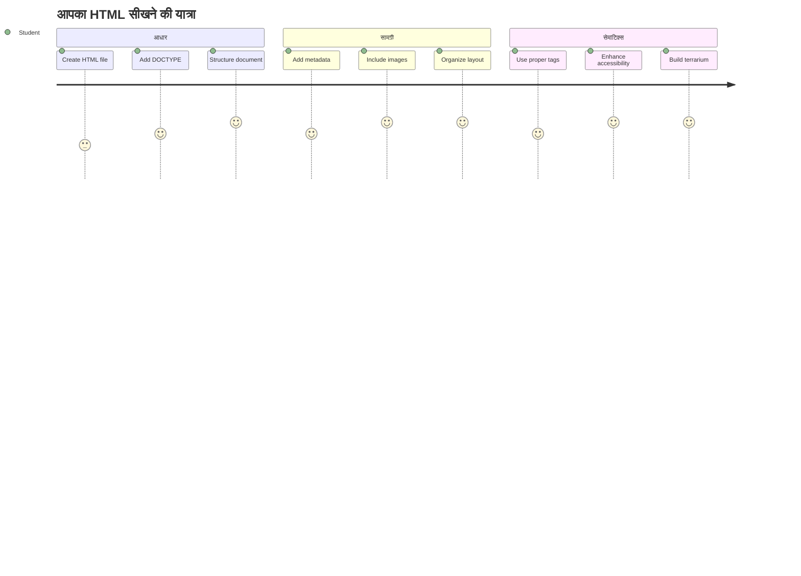
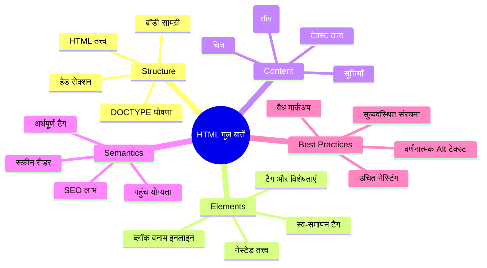
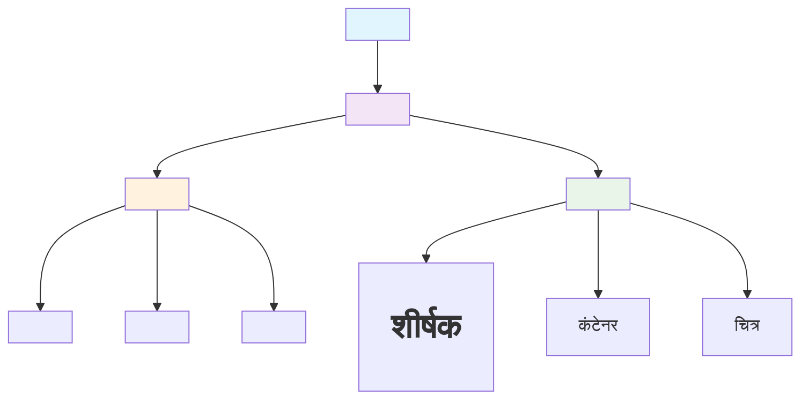
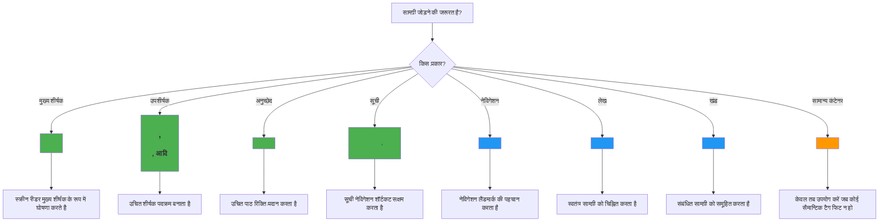
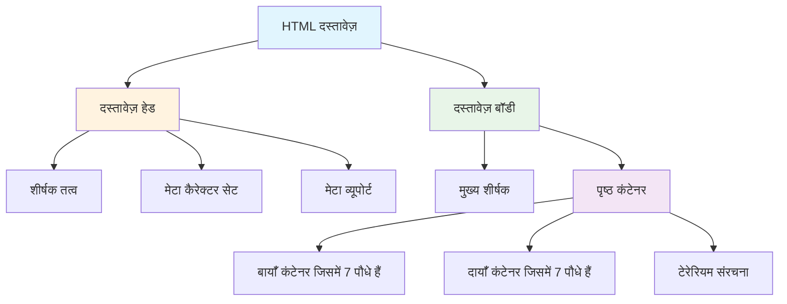
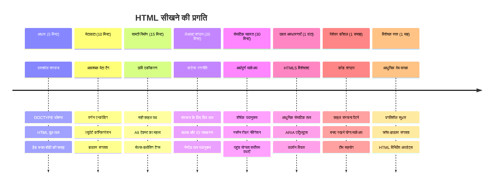

<!--
CO_OP_TRANSLATOR_METADATA:
{
  "original_hash": "3fcfa99c4897e051b558b5eaf1e8cc74",
  "translation_date": "2026-01-06T16:57:38+00:00",
  "source_file": "3-terrarium/1-intro-to-html/README.md",
  "language_code": "hi"
}
-->
# Terrarium Project Part 1: HTML का परिचय



> स्केचनोट द्वारा [Tomomi Imura](https://twitter.com/girlie_mac)

HTML, या हाइपरटेक्स्ट मार्कअप भाषा, हर उस वेबसाइट की नींव है जिसे आपने कभी देखा है। HTML को ऐसे समझें जैसे कंकाल जो वेब पेजों को संरचना देता है – यह निर्धारित करता है कि सामग्री कहाँ जाती है, यह कैसे संगठित है, और प्रत्येक भाग क्या दर्शाता है। जबकि बाद में CSS आपके HTML को रंग और लेआउट से "सजाएगा", और जावास्क्रिप्ट इसे इंटरैक्टिविटी के साथ जीवन में लाएगा, HTML वह मूल संरचना प्रदान करता है जो सब कुछ संभव बनाती है।

इस पाठ में, आप एक वर्चुअल टेरारियम इंटरफ़ेस के लिए HTML संरचना बनाएंगे। यह व्यावहारिक प्रोजेक्ट आपको बुनियादी HTML अवधारणाएं सिखाएगा जबकि कुछ दृश्यात्मक रूप से आकर्षक बनाएगा। आप यह सीखेंगे कि कैसे सैमान्टिक एलिमेंट्स का उपयोग करके कंटेंट को व्यवस्थित करें, तस्वीरों के साथ काम करें, और एक इंटरैक्टिव वेब एप्लिकेशन के लिए आधार तैयार करें।

इस पाठ के अंत तक, आपके पास एक कार्यशील HTML पेज होगा जो पौधों की तस्वीरें व्यवस्थित स्तंभों में प्रदर्शित करेगा, जो अगले पाठ में स्टाइलिंग के लिए तैयार होगा। यदि यह शुरू में साधारण दिखे तो चिंता न करें – यही HTML को CSS से दृश्य सुंदरीकरण से पहले करना चाहिए।


## पूर्व-व्याख्यान क्विज़

[पूर्व-व्याख्यान क्विज़](https://ff-quizzes.netlify.app/web/quiz/15)

> 📺 **देखें और सीखें**: इस सहायक वीडियो अवलोकन को देखें
> 
> [](https://www.youtube.com/watch?v=1TvxJKBzhyQ)

## अपने प्रोजेक्ट की सेटअप

HTML कोड में जाने से पहले, आइए अपने टेरारियम प्रोजेक्ट के लिए एक उचित कार्यक्षेत्र सेट अप करें। शुरुआत से ही एक व्यवस्थित फ़ाइल संरचना बनाना एक महत्वपूर्ण आदत है जो आपके वेब विकास यात्रा में अच्छी सेवा देगी।

### कार्य: अपना प्रोजेक्ट स्ट्रक्चर बनाएं

आप अपने टेरारियम प्रोजेक्ट के लिए एक समर्पित फ़ोल्डर बनाएंगे और अपनी पहली HTML फ़ाइल जोड़ेंगे। आप निम्न दो तरीकों में से किसी एक का उपयोग कर सकते हैं:

**विकल्प 1: Visual Studio Code का उपयोग करना**
1. Visual Studio Code खोलें
2. "File" → "Open Folder" पर क्लिक करें या `Ctrl+K, Ctrl+O` (Windows/Linux) या `Cmd+K, Cmd+O` (Mac) का उपयोग करें
3. `terrarium` नामक नया फ़ोल्डर बनाएं और उसे सेलेक्ट करें
4. एक्सप्लोरर पैन में, "New File" आइकन पर क्लिक करें
5. अपनी फ़ाइल का नाम `index.html` रखें


**विकल्प 2: टर्मिनल कमांड का उपयोग करना**
```bash
mkdir terrarium
cd terrarium
touch index.html
code index.html
```

**ये कमांड्स जो कर रहे हैं उसे समझें:**
- आपके प्रोजेक्ट के लिए एक नया डायरेक्टरी `terrarium` बनाता है
- terrarium डायरेक्टरी में नेविगेट करता है
- एक खाली `index.html` फ़ाइल बनाता है
- फ़ाइल को संपादन के लिए Visual Studio Code में खोलता है

> 💡 **प्रो टिप**: वेब विकास में फ़ाइल का नाम `index.html` विशेष होता है। जब कोई वेबसाइट पर जाता है, ब्राउज़र स्वचालित रूप से `index.html` को अपने डिफ़ॉल्ट पेज के रूप में देखता है। इसका मतलब है कि URL जैसे `https://mysite.com/projects/` स्वतः ही `projects` फ़ोल्डर से `index.html` फाइल प्रदर्शित करेगा बिना URL में फ़ाइल नाम लिखे।

## HTML दस्तावेज़ संरचना को समझना

हर HTML दस्तावेज़ एक विशिष्ट संरचना का पालन करता है जिसे ब्राउज़र को समझना और ठीक से दिखाना ज़रूरी होता है। इसे आप एक औपचारिक पत्र की तरह सोचें – इसमें आवश्यक तत्व एक विशेष क्रम में होते हैं जो रिसीवर (इस मामले में ब्राउज़र) को सामग्री को सही से संसाधित करने में मदद करता है।


आइए हर HTML दस्तावेज़ के लिए आवश्यक नींव जोड़कर शुरू करें।

### DOCTYPE घोषणा और मूल तत्व

किसी भी HTML फ़ाइल की पहली दो पंक्तियाँ दस्तावेज़ का ब्राउज़र के लिए "परिचय" होती हैं:

```html
<!DOCTYPE html>
<html></html>
```

**यह कोड क्या करता है, समझें:**
- `<!DOCTYPE html>` का उपयोग करके दस्तावेज़ प्रकार को HTML5 घोषित करता है
- `<html>` रूट एलिमेंट बनाता है जिसमें पूरा पेज कंटेंट शामिल होगा
- आधुनिक वेब मानकों को स्थापित करता है ताकि ब्राउज़र सही तरीके से रेंडर करें
- विभिन्न ब्राउज़रों और उपकरणों में स्थिर और संगत प्रदर्शन सुनिश्चित करता है

> 💡 **VS Code टिप**: VS Code में किसी भी HTML टैग पर होवर करें, आपको MDN Web Docs से उपयोगी जानकारी, उपयोग के उदाहरण, और ब्राउज़र संगतता विवरण दिखेगा।

> 📚 **और जानें**: DOCTYPE घोषणा ब्राउज़रों को "quirks mode" में प्रवेश करने से रोकती है, जो पुराने वेबसाइट सपोर्ट के लिए इस्तेमाल होती थी। आधुनिक वेब विकास सरल `<!DOCTYPE html>` घोषणा का उपयोग करता है ताकि [मानक-अनुरूप रेंडरिंग](https://developer.mozilla.org/docs/Web/HTML/Quirks_Mode_and_Standards_Mode) सुनिश्चित की जा सके।

### 🔄 **शैक्षिक जाँच**
**रुकें और सोचें**: आगे बढ़ने से पहले सुनिश्चित करें कि आप समझते हैं:
- ✅ हर HTML दस्तावेज़ को DOCTYPE घोषणा की आवश्यकता क्यों होती है
- ✅ `<html>` मूल तत्व में क्या होता है
- ✅ यह संरचना ब्राउज़र को पेज को सही ढंग से रेंडर करने में कैसे मदद करती है

**त्वरित स्वयं-परीक्षा**: क्या आप अपनी भाषा में समझा सकते हैं कि "मानक-अनुरूप रेंडरिंग" का क्या अर्थ है?

## आवश्यक दस्तावेज़ मेटाडेटा जोड़ना

एक HTML दस्तावेज़ का `<head>` अनुभाग वह महत्वपूर्ण जानकारी रखता है जिसे ब्राउज़र और सर्च इंजन को चाहिए, परंतु विज़िटर सीधे पेज पर नहीं देखते। इसे "परदे के पीछे" की जानकारी समझें जो आपकी वेबपेज को सही काम करने और विभिन्न उपकरणों और प्लेटफॉर्म पर ठीक से दिखने में मदद करती है।

यह मेटाडेटा ब्राउज़रों को बताता है कि पेज कैसे दिखाना है, कौन सा कैरेक्टर एनकोडिंग इस्तेमाल करना है, और विभिन्न स्क्रीन आकारों को कैसे संभालना है – ये सभी पेशेवर और सुलभ वेब पेज बनाने के लिए महत्वपूर्ण होते हैं।

### कार्य: दस्तावेज़ हेड जोड़ें

अपने `<html>` टैग के खुले और बंद टैग के बीच यह `<head>` सेक्शन डालें:

```html
<head>
	<title>Welcome to my Virtual Terrarium</title>
	<meta charset="utf-8" />
	<meta http-equiv="X-UA-Compatible" content="IE=edge" />
	<meta name="viewport" content="width=device-width, initial-scale=1" />
</head>
```

**प्रत्येक एलिमेंट क्या करता है, तोड़कर देखें:**
- ब्राउज़र टैब और सर्च परिणामों में दिखने वाला पेज शीर्षक सेट करता है
- विश्व स्तर पर सही टेक्स्ट डिस्प्ले के लिए UTF-8 कैरेक्टर एनकोडिंग निर्दिष्ट करता है
- Internet Explorer के आधुनिक संस्करणों के साथ अनुकूलता सुनिश्चित करता है
- डिवाइस की चौड़ाई से मेल खाने के लिए व्यूपोर्ट निर्धारित करता है जिससे रेस्पॉन्सिव डिजाइन काम करे
- सामग्री को प्राकृतिक आकार में दिखाने के लिए प्रारंभिक ज़ूम स्तर नियंत्रित करता है

> 🤔 **इस बारे में सोचें**: यदि आप इस तरह का viewport मेटा टैग सेट करें: `<meta name="viewport" content="width=600">` तो क्या होगा? इससे पेज हमेशा 600 पिक्सेल चौड़ा दिखेगा, जिससे रेस्पॉन्सिव डिजाइन टूट जाएगी! अधिक जानने के लिए [सही व्यूपोर्ट कॉन्फिगरेशन](https://developer.mozilla.org/docs/Web/HTML/Viewport_meta_tag) देखें।

## दस्तावेज़ बॉडी बनाना

`<body>` तत्व आपके वेबपेज की सारी दृश्य सामग्री रखता है – वे सब कुछ जो उपयोगकर्ता देखेंगे और इंटरैक्ट करेंगे। जबकि `<head>` सेक्शन ब्राउज़र को निर्देश देता है, `<body>` में वास्तविक सामग्री होती है: टेक्स्ट, चित्र, बटन, और अन्य तत्व जो आपके यूजर इंटरफेस बनाते हैं।

आइए बॉडी संरचना जोड़ें और समझें कि HTML टैग कैसे मिलकर सार्थक सामग्री बनाते हैं।

### HTML टैग संरचना को समझना

HTML जोड़ियाँ टैग का उपयोग करता है। अधिकांश टैग के एक उद्घाटन टैग जैसे `<p>` और एक समापन टैग जैसे `</p>` होते हैं, दोनों के बीच सामग्री होती है: `<p>Hello, world!</p>`। यह एक पैराग्राफ एलिमेंट बनाता है जिसमें "Hello, world!" टेक्स्ट होता है।

### कार्य: बॉडी एलिमेंट जोड़ें

अपने HTML फ़ाइल को `<body>` एलिमेंट जोड़ने के लिए अपडेट करें:

```html
<!DOCTYPE html>
<html>
	<head>
		<title>Welcome to my Virtual Terrarium</title>
		<meta charset="utf-8" />
		<meta http-equiv="X-UA-Compatible" content="IE=edge" />
		<meta name="viewport" content="width=device-width, initial-scale=1" />
	</head>
	<body></body>
</html>
```

**यह पूरी संरचना क्या प्रदान करती है:**
- मूल HTML5 दस्तावेज़ फ्रेमवर्क स्थापित करता है
- ब्राउज़र द्वारा ठीक से रेंडरिंग के लिए आवश्यक मेटाडेटा शामिल करता है
- आपकी दृश्य सामग्री के लिए एक खाली बॉडी बनाता है
- आधुनिक वेब विकास के सर्वोत्तम अभ्यासों का पालन करता है

अब आप अपने टेरारियम के दृश्य तत्व जोड़ने के लिए तैयार हैं। हम विभिन्न कंटेंट सेक्शन को व्यवस्थित करने के लिए कंटेनर के रूप में `<div>` एलिमेंट्स और पौधों की तस्वीरें दिखाने के लिए `` एलिमेंट्स का उपयोग करेंगे।

### चित्रों और लेआउट कंटेनरों के साथ काम करना

HTML में चित्र विशेष होते हैं क्योंकि वे "self-closing" टैग का उपयोग करते हैं। `<p></p>` जैसे तत्वों के विपरीत जो सामग्री के चारों ओर होते हैं, `` टैग में सारी जानकारी स्वयं टैग के भीतर एट्रिब्यूट्स जैसे `src` (इमेज फाइल पाथ) और `alt` (सुलभता के लिए वैकल्पिक पाठ) के साथ होती है।

HTML में चित्र जोड़ने से पहले, आपको अपने प्रोजेक्ट फाइलों को सही तरीके से व्यवस्थित करना होगा, एक images फ़ोल्डर बनाकर और पौधों की ग्राफिक्स को उसमें जोड़कर।

**पहले, अपनी तस्वीरें सेट करें:**
1. अपने टेरारियम प्रोजेक्ट फ़ोल्डर के अंदर `images` नामक एक फ़ोल्डर बनाएं
2. [solution folder](../../../../3-terrarium/solution/images) से पौधों की चित्रे डाउनलोड करें (कुल 14 पौधों की चित्रें)
3. सभी पौधों की तस्वीरें अपने नए `images` फ़ोल्डर में कॉपी करें

### कार्य: पौधे प्रदर्शन लेआउट बनाएं

अब अपने `<body></body>` टैग्स के बीच पौधों की तस्वीरों को दो स्तंभों में व्यवस्थित करके जोड़ें:

```html
<div id="page">
	<div id="left-container" class="container">
		<div class="plant-holder">
			
		</div>
		<div class="plant-holder">
			
		</div>
		<div class="plant-holder">
			
		</div>
		<div class="plant-holder">
			
		</div>
		<div class="plant-holder">
			
		</div>
		<div class="plant-holder">
			
		</div>
		<div class="plant-holder">
			
		</div>
	</div>
	<div id="right-container" class="container">
		<div class="plant-holder">
			
		</div>
		<div class="plant-holder">
			
		</div>
		<div class="plant-holder">
			
		</div>
		<div class="plant-holder">
			
		</div>
		<div class="plant-holder">
			
		</div>
		<div class="plant-holder">
			
		</div>
		<div class="plant-holder">
			
		</div>
	</div>
</div>
```

**कदम दर कदम, इस कोड में क्या हो रहा है:**
- एक मुख्य पेज कंटेनर `id="page"` के साथ बनाता है जो सारी सामग्री रखता है
- दो कॉलम कंटेनर बनाता है: `left-container` और `right-container`
- बाएं स्तंभ में 7 पौधे और दाहिने स्तंभ में 7 पौधे व्यवस्थित करता है
- प्रत्येक पौधे की छवि को `plant-holder` डिव में लपेटता है ताकि व्यक्तिगत स्थिति मिल सके
- अगले पाठ में CSS स्टाइलिंग के लिए लगातार क्लास नाम लागू करता है
- बाद में जावास्क्रिप्ट इंटरैक्शन के लिए प्रत्येक पौधे की छवि को अनोखी आईडी देता है
- उचित फाइल पाथस के साथ images फ़ोल्डर की ओर ईशारा करता है

> 🤔 **इस बारे में सोचें**: ध्यान दें कि सभी छवियों का alt टेक्स्ट अभी समान "plant" है। यह सुलभता के लिए आदर्श नहीं है। स्क्रीन रीडर उपयोगकर्ता 14 बार "plant" सुनेंगे बिना यह जाने कि कौन सा पौधा कौन सा है। क्या आप प्रत्येक छवि के लिए बेहतर, अधिक वर्णनात्मक alt टेक्स्ट के बारे में सोच सकते हैं?

> 📝 **HTML एलिमेंट प्रकार**: `<div>` तत्व "ब्लॉक-लेवल" होते हैं और पूरी चौड़ाई लेते हैं, जबकि `<span>` तत्व "इनलाइन" होते हैं और केवल आवश्यक चौड़ाई लेते हैं। यदि आप इन सभी `<div>` टैग्स को `<span>` टैग्स में बदल दें तो क्या होगा आप सोचते हैं?

### 🔄 **शैक्षिक जाँच**
**संरचना समझना**: अपनी HTML संरचना का एक पल के लिए अवलोकन करें:
- ✅ क्या आप अपने लेआउट में मुख्य कंटेनर पहचान सकते हैं?
- ✅ क्या आप समझते हैं कि प्रत्येक छवि को अनोखी आईडी क्यों मिली है?
- ✅ आप `plant-holder` डिव का उद्देश्य कैसे वर्णित करेंगे?

**दृश्य निरीक्षण**: अपनी HTML फ़ाइल किसी ब्राउज़र में खोलें। आपको दिखना चाहिए:
- एक बेसिक पौधों की तस्वीरों की सूची
- दो स्तंभों में व्यवस्थित तस्वीरें
- सरल, बिना स्टाइल की गई लेआउट

**याद रखें**: यह सादा रूप ठीक उसी प्रकार का होता है जैसा CSS स्टाइलिंग से पहले HTML होना चाहिए!

यह मार्कअप जोड़ने के साथ, पौधे स्क्रीन पर दिखाई देंगे, हालांकि वे अभी चमकदार नहीं दिखेंगे – यही काम CSS अगले पाठ में करेगा! फिलहाल, आपके पास एक ठोस HTML आधार है जो आपकी सामग्री को सही ढंग से व्यवस्थित करता है और सुलभता के सर्वोत्तम अभ्यासों का पालन करता है।

## सुलभता के लिए सैमान्टिक HTML का उपयोग

सैमान्टिक HTML का मतलब है HTML तत्वों को उनके अर्थ और उद्देश्य के आधार पर चुनना, केवल उनके दृश्यमान रूप से नहीं। जब आप सैमान्टिक मार्कअप का उपयोग करते हैं, तो आप अपनी सामग्री की संरचना और अर्थ को ब्राउज़र, सर्च इंजन, और सहायक तकनीकों जैसे स्क्रीन रीडर को संप्रेषित कर रहे होते हैं।


यह तरीका आपकी वेबसाइटों को विकलांग उपयोगकर्ताओं के लिए अधिक सुलभ बनाता है और सर्च इंजन को आपकी सामग्री को बेहतर तरीके से समझने में मदद करता है। यह आधुनिक वेब विकास का एक मौलिक सिद्धांत है जो सभी के लिए बेहतर अनुभव बनाता है।

### एक सैमान्टिक पेज शीर्षक जोड़ना

आइए अपने टेरारियम पेज के लिए उचित शीर्षक जोड़ें। इसे अपने खुले `<body>` टैग के ठीक बाद डालें:

```html
<h1>My Terrarium</h1>
```

**सैमान्टिक मार्कअप क्यों महत्वपूर्ण है:**
- स्क्रीन रीडर को पेज संरचना नेविगेट और समझने में मदद करता है
- सामग्री पदानुक्रम को स्पष्ट करके SEO (सर्च इंजन अनुकूलन) में सुधार करता है
- दृष्टिहीन या संज्ञानात्मक विविधता वाले उपयोगकर्ताओं के लिए सुलभता बढ़ाता है
- सभी उपकरणों और प्लेटफ़ॉर्म पर बेहतर उपयोगकर्ता अनुभव बनाता है
- पेशेवर विकास के लिए वेब मानकों और सर्वोत्तम अभ्यासों का पालन करता है

**सैमान्टिक और गैर-सैमान्टिक विकल्पों के उदाहरण:**

| उद्देश्य | ✅ सैमान्टिक विकल्प | ❌ गैर-सैमान्टिक विकल्प |
|---------|-------------------|------------------------|
| मुख्य शीर्षक | `<h1>Title</h1>` | `<div class="big-text">Title</div>` |
| नेविगेशन | `<nav><ul><li></li></ul></nav>` | `<div class="menu"><div></div></div>` |
| बटन | `<button>Click me</button>` | `<span onclick="...">Click me</span>` |
| लेख सामग्री | `<article><p></p></article>` | `<div class="content"><div></div></div>` |

> 🎥 **इसे क्रियान्वित देखें**: [कैसे स्क्रीन रीडर वेब पेजों के साथ इंटरैक्ट करते हैं](https://www.youtube.com/watch?v=OUDV1gqs9GA) ये वीडियो देखें ताकि आप समझ सकें कि सैमान्टिक मार्कअप सुलभता के लिए कितना ज़रूरी है। सही HTML संरचना उपयोगकर्ताओं को प्रभावी नेविगेशन में कैसे मदद करती है, देखें।

## टेरारियम कंटेनर बनाना

अब टेरारियम के लिए HTML संरचना जोड़ते हैं – कांच का कंटेनर जहाँ पौधे अंततः रखे जाएंगे। यह सेक्शन एक महत्वपूर्ण अवधारणा दिखाता है: HTML संरचना प्रदान करता है, लेकिन CSS स्टाइलिंग के बिना ये एलिमेंट्स अभी दिखाई नहीं देंगे।

टेरारियम मार्कअप वर्णनात्मक क्लास नामों का उपयोग करता है जो अगले पाठ में CSS स्टाइलिंग को सहज और बनाए रखने योग्य बनाएगा।

### कार्य: टेरारियम संरचना जोड़ें

इस मार्कअप को अंतिम `</div>` टैग के ऊपर डालें (पेज कंटेनर के क्लोजिंग टैग से पहले):

```html
<div id="terrarium">
	<div class="jar-top"></div>
	<div class="jar-walls">
		<div class="jar-glossy-long"></div>
		<div class="jar-glossy-short"></div>
	</div>
	<div class="dirt"></div>
	<div class="jar-bottom"></div>
</div>
```

**इस टेरारियम संरचना को समझना:**
- स्टाइलिंग के लिए अद्वितीय आईडी के साथ एक मुख्य टेरारियम कंटेनर बनाता है
- **परिभाषित करता है** प्रत्येक दृश्य घटक के लिए अलग-अलग तत्व (टॉप, दीवारें, मिट्टी, नीचे)
- **शामिल करता है** कांच की परावर्तन प्रभावों के लिए नेस्टेड तत्व (चमकदार तत्व)
- **उपयोग करता है** वर्णनात्मक क्लास नाम जो प्रत्येक तत्व के उद्देश्य को स्पष्ट रूप से दर्शाते हैं
- **तैयार करता है** सीएसएस स्टाइलिंग के लिए संरचना जो कांच के टेरारियम की उपस्थिति बनाएगी

> 🤔 **कुछ ध्यान दिया?**: भले ही आपने यह मार्कअप जोड़ा है, लेकिन आप पेज पर कुछ नया नहीं देखते! यह पूरी तरह से दर्शाता है कि HTML संरचना प्रदान करता है जबकि CSS रूप प्रदान करता है। ये `<div>` तत्व मौजूद हैं लेकिन अभी तक कोई दृश्य स्टाइलिंग नहीं है – वह अगले पाठ में आएगा!


### 🔄 **शैक्षिक चेक-इन**
**HTML संरचना में महारत**: आगे बढ़ने से पहले, सुनिश्चित करें कि आप कर सकते हैं:
- ✅ HTML संरचना और दृश्य रूप के बीच का अंतर समझाएं
- ✅ सेमांटिक बनाम नॉन-सेमांटिक HTML तत्वों की पहचान करें
- ✅ सही मार्कअप से पहुंच योग्यता में कैसे लाभ होता है, वर्णन करें
- ✅ पूरी दस्तावेज़ पेड़ संरचना को पहचानें

**अपनी समझ का परीक्षण करें**: अपने HTML फ़ाइल को ब्राउज़र में जावास्क्रिप्ट बंद करके और CSS हटाकर खोलने की कोशिश करें। यह आपको दिखाता है कि आपने किस शुद्ध सेमांटिक संरचना बनाई है!

---

## GitHub Copilot एजेंट चैलेंज

एजेंट मोड का उपयोग करके निम्नलिखित चुनौती पूरी करें:

**विवरण:** एक पौधे की देखभाल गाइड सेक्शन के लिए सेमांटिक HTML संरचना बनाएं जिसे टेरारियम प्रोजेक्ट में जोड़ा जा सकता है।

**प्रॉम्प्ट:** एक सेमांटिक HTML सेक्शन बनाएं जिसमें मुख्य शीर्षक "Plant Care Guide" हो, तीन उपखंड हों जिनके शीर्षक "Watering", "Light Requirements", और "Soil Care" हों, प्रत्येक में पौधे की देखभाल की जानकारी वाला पैराग्राफ हो। सामग्री को उपयुक्त रूप से संरचित करने के लिए उचित सेमांटिक HTML टैग जैसे `<section>`, `<h2>`, `<h3>`, और `<p>` का उपयोग करें।

एजेंट मोड के बारे में अधिक जानें [यहाँ](https://code.visualstudio.com/blogs/2025/02/24/introducing-copilot-agent-mode)।

## HTML इतिहास चुनौती का अन्वेषण करें

**वेब विकास के बारे में जानना**

HTML ने महत्वपूर्ण विकास किया है जब से टिम बर्नर्स-ली ने 1990 में CERN में पहला वेब ब्राउज़र बनाया था। कुछ पुराने टैग जैसे `<marquee>` अब निष्क्रिय हैं क्योंकि वे आधुनिक पहुंच मानकों और उत्तरदायी डिजाइन सिद्धांतों के साथ अच्छे से काम नहीं करते।

**यह प्रयोग करें:**
1. अस्थायी रूप से अपने `<h1>` शीर्षक को `<marquee>` टैग में लपेटें: `<marquee><h1>My Terrarium</h1></marquee>`
2. पृष्ठ को ब्राउज़र में खोलें और स्क्रॉलिंग प्रभाव का अवलोकन करें
3. सोचें कि यह टैग क्यों निष्क्रिय कर दिया गया था (संकेत: उपयोगकर्ता अनुभव और पहुंच योग्यता के बारे में सोचें)
4. `<marquee>` टैग को हटा दें और सेमांटिक मार्कअप पर लौटें

**प्रतिबिंब प्रश्न:**
- स्क्रॉलिंग शीर्षक दृष्टिहीन उपयोगकर्ताओं या गति संवेदनशीलता वाले उपयोगकर्ताओं को कैसे प्रभावित कर सकता है?
- किन आधुनिक CSS तकनीकों से समान दृश्य प्रभाव अधिक सुलभ तरीके से प्राप्त किया जा सकता है?
- पुराने तत्वों के बजाय वर्तमान वेब मानकों का उपयोग क्यों महत्वपूर्ण है?

वेब मानकों के विकास और उपयोगकर्ता अनुभव सुधारने के लिए [पुराने और निष्क्रिय HTML तत्वों](https://developer.mozilla.org/docs/Web/HTML/Element#Obsolete_and_deprecated_elements) के बारे में अधिक जानें।

## पोस्ट-लेक्चर क्विज़

[पोस्ट-लेक्चर क्विज़](https://ff-quizzes.netlify.app/web/quiz/16)

## पुनरावलोकन और स्वाध्याय

**अपने HTML ज्ञान को गहरा करें**

HTML वेब की नींव रहा है 30 से अधिक वर्षों से, जो एक सरल दस्तावेज़ मार्कअप भाषा से इंटरैक्टिव अनुप्रयोगों के निर्माण के लिए एक परिष्कृत मंच में विकसित हुआ है। इस विकास को समझना आपको आधुनिक वेब मानकों की सराहना करने और बेहतर विकास निर्णय लेने में मदद करता है।

**अनुशंसित शिक्षा पथ:**

1. **HTML इतिहास और विकास**
   - HTML 1.0 से HTML5 तक की समयरेखा पर शोध करें
   - जानें कि किन टैग्स को क्यों निष्क्रिय किया गया (पहुँच योग्यता, मोबाइल अनुकूलता, रखरखाव)
   - उभरती HTML विशेषताएँ और प्रस्तावों की जांच करें

2. **सेमांटिक HTML गहराई से**
   - [HTML5 सेमांटिक तत्वों](https://developer.mozilla.org/docs/Web/HTML/Element) की पूर्ण सूची का अध्ययन करें
   - जानें कब `<article>`, `<section>`, `<aside>`, और `<main>` का उपयोग करना है
   - बेहतर पहुंच योग्यता के लिए ARIA गुणों के बारे में जानें

3. **आधुनिक वेब विकास**
   - Microsoft Learn पर [उत्तरदायी वेबसाइटों का निर्माण](https://docs.microsoft.com/learn/modules/build-simple-website/?WT.mc_id=academic-77807-sagibbon) खोजें
   - समझें कि HTML CSS और JavaScript के साथ कैसे एकीकृत होता है
   - वेब प्रदर्शन और SEO सर्वोत्तम प्रथाओं के बारे में जानें

**प्रतिबिंब प्रश्न:**
- आपने कौन से निष्क्रिय HTML टैग खोजे, और वे क्यों हटाए गए?
- भविष्य के संस्करणों के लिए कौन-सी नई HTML विशेषताएं प्रस्तावित की जा रही हैं?
- सेमांटिक HTML वेब पहुंच योग्यता और SEO में कैसे योगदान देता है?

### ⚡ **अगले 5 मिनट में आप क्या कर सकते हैं**
- [ ] DevTools (F12) खोलें और अपनी पसंदीदा वेबसाइट की HTML संरचना का निरीक्षण करें
- [ ] एक सरल HTML फ़ाइल बनाएं जिसमें मूल टैग हों: `<h1>`, `<p>`, और ``
- [ ] अपने HTML को W3C HTML वैलिडेटर ऑनलाइन से मान्य करें
- [ ] अपनी HTML में `<!-- comment -->` का उपयोग करके टिप्पणी जोड़ने का प्रयास करें

### 🎯 **इस घंटे में आप क्या पूरा कर सकते हैं**
- [ ] पोस्ट-पाठ क्विज़ पूरा करें और सेमांटिक HTML अवधारणाओं की समीक्षा करें
- [ ] उचित HTML संरचना का उपयोग करके अपने बारे में एक सरल वेबपेज बनाएं
- [ ] विभिन्न शीर्षक स्तरों और टेक्स्ट स्वरूपण टैग्स के साथ प्रयोग करें
- [ ] मल्टीमीडिया एकीकरण के अभ्यास के लिए इमेज और लिंक जोड़ें
- [ ] उन HTML5 विशेषताओं का अन्वेषण करें जिन्हें आपने अभी तक नहीं आजमाया है

### 📅 **आपकी सप्ताह भर की HTML यात्रा**
- [ ] सेमांटिक मार्कअप के साथ टेरारियम प्रोजेक्ट असाइनमेंट पूरा करें
- [ ] ARIA लेबल और भूमिकाओं का उपयोग करके एक पहुंच योग्य वेबपेज बनाएं
- [ ] विभिन्न इनपुट प्रकारों के साथ फॉर्म निर्माण का अभ्यास करें
- [ ] HTML5 API जैसे localStorage या geolocation का अन्वेषण करें
- [ ] उत्तरदायी HTML पैटर्न और मोबाइल-फर्स्ट डिज़ाइन का अध्ययन करें
- [ ] सर्वोत्तम प्रैक्टिस के लिए अन्य डेवलपर्स के HTML कोड की समीक्षा करें

### 🌟 **आपका महीने भर का वेब आधार**
- [ ] अपने HTML कौशल को दर्शाता हुआ पोर्टफोलियो वेबसाइट बनाएं
- [ ] Handlebars जैसे फ्रेमवर्क के साथ HTML टेम्पलेटिंग सीखें
- [ ] HTML दस्तावेज़ीकरण सुधार कर ओपन सोर्स प्रोजेक्ट में योगदान दें
- [ ] कस्टम तत्व जैसे उन्नत HTML सिद्धांतों में महारत हासिल करें
- [ ] HTML को CSS फ्रेमवर्क और JavaScript लाइब्रेरीज़ के साथ एकीकृत करें
- [ ] HTML के मूल सिद्धांत सीख रहे अन्य लोगों का मार्गदर्शन करें

## 🎯 आपका HTML महारत समयरेखा


### 🛠️ आपका HTML टूलकिट सारांश

इस पाठ को पूरा करने के बाद, अब आपके पास है:
- **दस्तावेज़ संरचना**: उचित DOCTYPE के साथ पूर्ण HTML5 आधार
- **सेमांटिक मार्कअप**: अर्थपूर्ण टैग जो पहुंच योग्यता और SEO को बढ़ाते हैं
- **छवि एकीकरण**: उचित फ़ाइल संगठन और alt टेक्स्ट अभ्यास
- **लेआउट कंटेनर**: वर्णनात्मक क्लास नामों के साथ रणनीतिक div उपयोग
- **पहुंच योग्यता जागरूकता**: स्क्रीन रीडर नेविगेशन की समझ
- **आधुनिक मानक**: वर्तमान HTML5 अभ्यास और निष्क्रिय टैग ज्ञान
- **परियोजना आधार**: CSS स्टाइलिंग और JavaScript इंटरैक्टिविटी के लिए मजबूत आधार

**अगले कदम**: आपका HTML संरचना CSS स्टाइलिंग के लिए तैयार है! आपने जो सेमांटिक आधार बनाया है वह अगले पाठ को समझना बहुत आसान बना देगा।

## असाइनमेंट

[अपने HTML का अभ्यास करें: एक ब्लॉग मॉकअप बनाएं](assignment.md)

---

<!-- CO-OP TRANSLATOR DISCLAIMER START -->
**अस्वीकरण**:  
यह दस्तावेज़ AI अनुवाद सेवा [Co-op Translator](https://github.com/Azure/co-op-translator) का उपयोग करके अनुवादित किया गया है। जबकि हम सटीकता के लिए प्रयासरत हैं, कृपया ध्यान दें कि स्वचालित अनुवाद में त्रुटि या गलतियां हो सकती हैं। मूल दस्तावेज़ को उसकी मूल भाषा में आधिकारिक स्रोत माना जाना चाहिए। महत्वपूर्ण जानकारी के लिए, पेशेवर मानव अनुवाद की सलाह दी जाती है। इस अनुवाद के उपयोग से उत्पन्न किसी भी गलतफहमी या गलत व्याख्या के लिए हम जिम्मेदार नहीं हैं।
<!-- CO-OP TRANSLATOR DISCLAIMER END -->