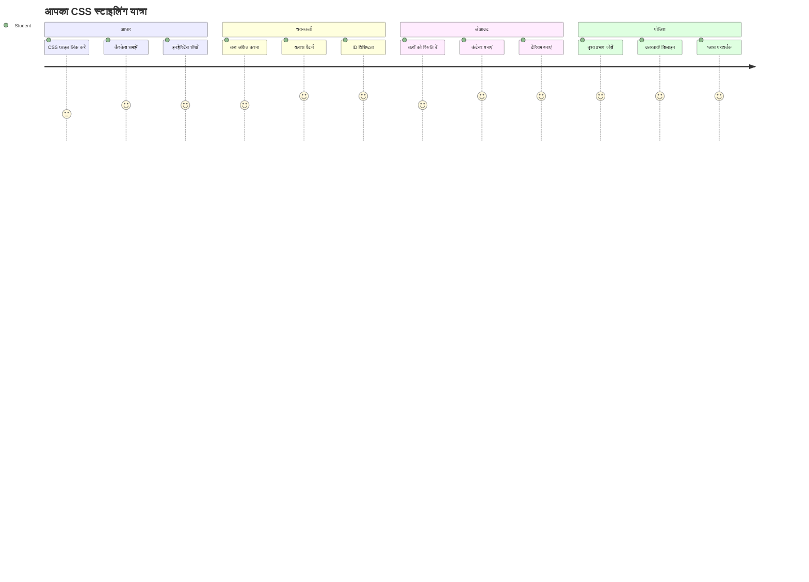
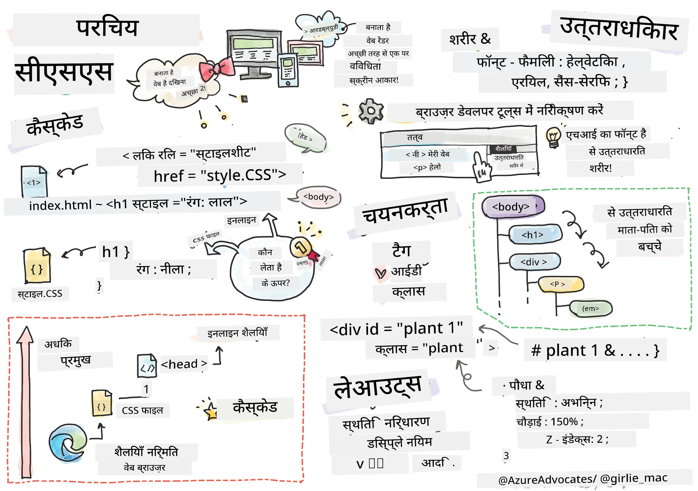
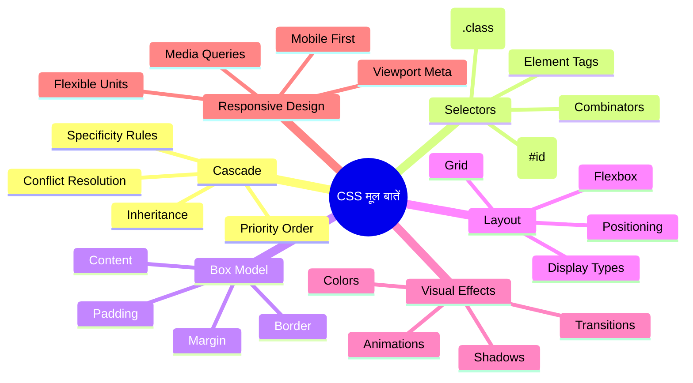
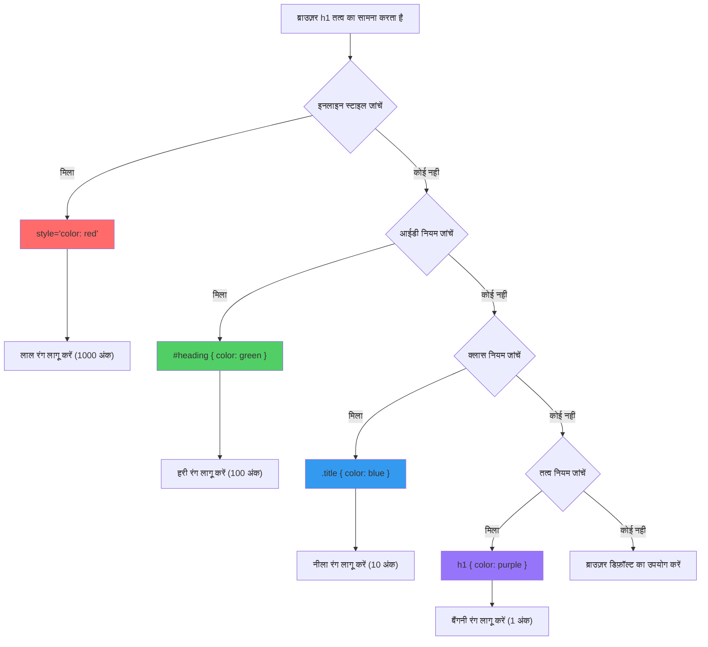
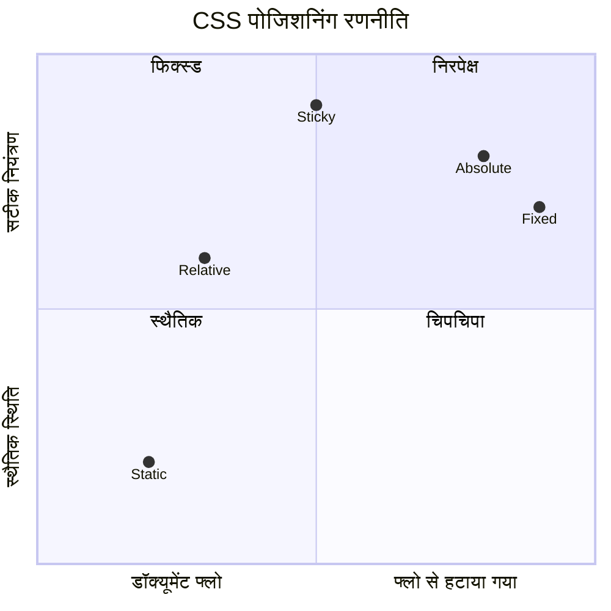
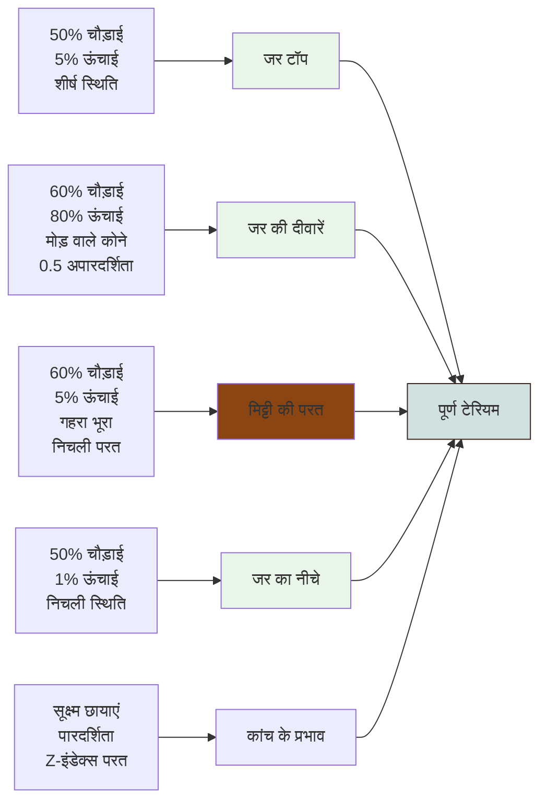
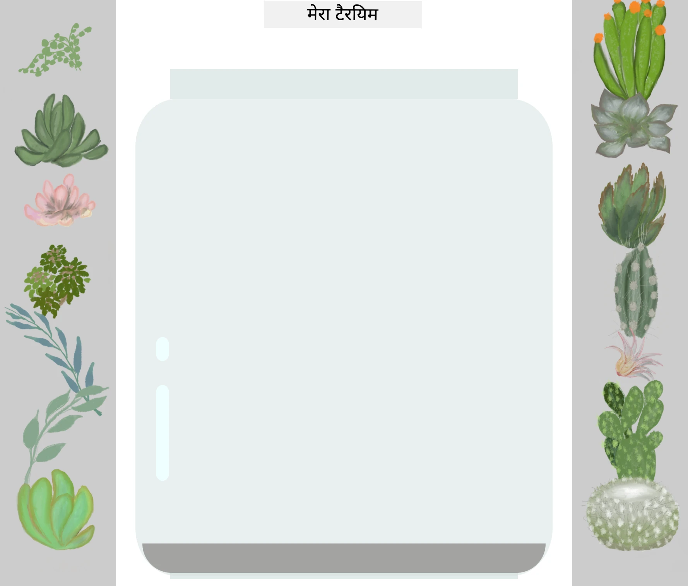
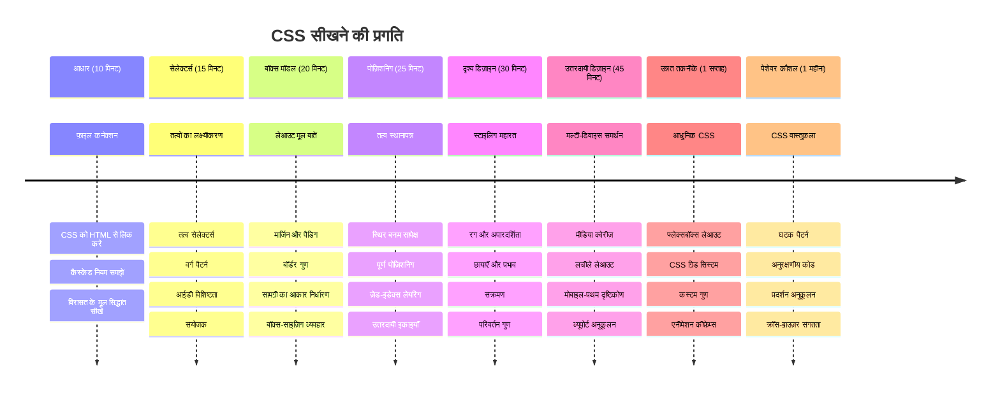

<!--
CO_OP_TRANSLATOR_METADATA:
{
  "original_hash": "e39f3a4e3bcccf94639e3af1248f8a4d",
  "translation_date": "2026-01-06T17:04:25+00:00",
  "source_file": "3-terrarium/2-intro-to-css/README.md",
  "language_code": "hi"
}
-->
# टेरारियम प्रोजेक्ट पार्ट 2: CSS का परिचय



> स्केचनोट द्वारा [टोमोमी इमुरा](https://twitter.com/girlie_mac)

याद है आपका HTML टेरारियम कितना साधारण दिखता था? CSS वह जगह है जहाँ हम उस सादे ढांचे को कुछ और आकर्षक रूप में बदलते हैं।

अगर HTML एक घर की फ्रेम बनाना है, तो CSS वह सब कुछ है जो उसे घर जैसा महसूस कराता है - पेंट के रंग, फर्नीचर की व्यवस्था, लाइटिंग, और कमरे कैसे आपस में जुड़े होते हैं। सोचिए कि वर्साय पैलेस कैसे एक साधारण शिकारी का लॉज था, लेकिन डेकोरेशन और लेआउट पर ध्यान देने से वह दुनिया की सबसे भव्य इमारतों में से एक बन गया।

आज, हम आपके टेरारियम को कार्यात्मक से परिष्कृत बनाने जा रहे हैं। आप सीखेंगे कि तत्वों को सटीक रूप से कैसे स्थित किया जाता है, लेआउट को अलग-अलग स्क्रीन आकारों के हिसाब से कैसे अनुकूलित किया जाता है, और वह दृश्य अपील कैसे बनाई जाती है जो वेबसाइट्स को आकर्षक बनाती है।

इस पाठ के अंत तक, आप देखेंगे कि रणनीतिक CSS स्टाइलिंग आपके प्रोजेक्ट को कितना बेहतर बना सकती है। चलिए आपके टेरारियम में कुछ स्टाइल जोड़ते हैं।


## प्री-लेक्चर क्विज़

[प्री-लेक्चर क्विज़](https://ff-quizzes.netlify.app/web/quiz/17)

## CSS के साथ शुरुआत

अक्सर CSS को केवल "चीजों को सुंदर बनाने" के रूप में देखा जाता है, लेकिन इसका उद्देश्य कहीं अधिक व्यापक है। CSS बिलकुल एक फिल्म के निर्देशक की तरह है - आप केवल यह नियंत्रित नहीं करते कि सब कुछ कैसा दिखे, बल्कि यह भी कि यह कैसे मूव करे, इंटरैक्शन पर कैसे प्रतिक्रिया दे, और विभिन्न परिस्थितियों के अनुसार कैसे अनुकूलित हो।

आधुनिक CSS असाधारण रूप से सक्षम है। आप ऐसा कोड लिख सकते हैं जो फोन, टैबलेट, और डेस्कटॉप कंप्यूटर के लिए लेआउट को स्वचालित रूप से समायोजित करता है। आप स्मूद एनीमेशन बना सकते हैं जो उपयोगकर्ताओं का ध्यान सही जगह पर ले जाएं। जब सब कुछ साथ में काम करता है, तो परिणाम बहुत ही प्रभावशाली हो सकते हैं।

> 💡 **प्रो टिप**: CSS लगातार नए फीचर्स और क्षमताओं के साथ विकसित हो रहा है। हमेशा [CanIUse.com](https://caniuse.com) चेक करें ताकि आप नवीनतम CSS फीचर्स के लिए ब्राउज़र सपोर्ट की पुष्टि कर सकें, खासकर जब उन्हें प्रोडक्शन प्रोजेक्ट्स में इस्तेमाल करना हो।

**इस पाठ में हम निम्नलिखित करेंगे:**
- **आपके टेरारियम के लिए आधुनिक CSS तकनीकों का उपयोग करके पूर्ण दृश्य डिज़ाइन बनाएंगे**
- **कैस्केड, इनहेरीटेंस, और CSS सेलेक्टर्स जैसे मौलिक अवधारणाओं का पता लगाएंगे**
- **जवाबदेह पोजीशनिंग और लेआउट रणनीतियों को लागू करेंगे**
- **CSS शेप्स और स्टाइलिंग का उपयोग करके टेरारियम कंटेनर बनाएंगे**

### पूर्वापेक्षा

आपने पिछले पाठ से अपने टेरारियम की HTML संरचना पूरी कर ली होनी चाहिए और इसे स्टाइल करने के लिए तैयार रखना चाहिए।

> 📺 **वीडियो संसाधन**: इस सहायक वीडियो वॉकथ्रू को देखें
>
> [](https://www.youtube.com/watch?v=6yIdOIV9p1I)

### अपनी CSS फाइल सेटअप करना

स्टाइलिंग शुरू करने से पहले, हमें CSS को हमारे HTML से जोड़ना होगा। यह कनेक्शन ब्राउज़र को बताता है कि टेरारियम के लिए स्टाइलिंग निर्देश कहाँ से लाने हैं।

अपने टेरारियम फ़ोल्डर में, `style.css` नाम की नई फाइल बनाएं, फिर इसे अपने HTML दस्तावेज़ के `<head>` सेक्शन में लिंक करें:

```html
<link rel="stylesheet" href="./style.css" />
```

**यह कोड क्या करता है:**
- **आपके HTML और CSS फाइलों के बीच कनेक्शन बनाता है**
- **ब्राउज़र को बताता है कि `style.css` से स्टाइल लोड और लागू करें**
- **`rel="stylesheet"` एट्रिब्यूट का उपयोग करता है ताकि यह CSS फाइल हो यह स्पष्ट हो**
- **फ़ाइल पथ को `href="./style.css"` के साथ संदर्भित करता है**

## CSS कैस्केड को समझना

क्या आपने कभी सोचा है कि CSS को "Cascading Style Sheets" क्यों कहा जाता है? स्टाइल्स जैसे झरने की तरह नीचे गिरते हैं, और कभी-कभी वे एक-दूसरे के साथ टकराते भी हैं।

सोचिए सैन्य कमांड संरचनाओं को - एक जनरल आदेश कह सकता है "सभी सैनिक हरे रंग के कपड़े पहनें," लेकिन आपके यूनिट के लिए एक विशेष आदेश कह सकता है "समारोह के लिए ड्रेस ब्लू पहनें।" अधिक विशिष्ट निर्देश को प्राथमिकता मिलती है। CSS भी इसी तार्किक संरचना का पालन करता है, और इस पदानुक्रम को समझना डिबगिंग को काफी आसान बनाता है।

### कैस्केड प्राथमिकता के साथ प्रयोग

आइए कैस्केड को क्रिया में देखें एक स्टाइल संघर्ष बनाकर। पहले, अपने `<h1>` टैग में एक इनलाइन स्टाइल जोड़ें:

```html
<h1 style="color: red">My Terrarium</h1>
```

**यह कोड क्या करता है:**
- **`<h1>` एलिमेंट पर सीधे लाल रंग लागू करता है, इनलाइन स्टाइलिंग का उपयोग कर**
- **`style` एट्रिब्यूट का उपयोग करता है ताकि CSS सीधे HTML में एम्बेड हो**
- **इस खास एलिमेंट के लिए उच्चतम प्राथमिकता वाला स्टाइल नियम बनाता है**

अगले, अपने `style.css` फाइल में यह नियम जोड़ें:

```css
h1 {
  color: blue;
}
```

**ऊपर क्या किया गया:**
- **एक CSS नियम परिभाषित किया जो सभी `<h1>` एलिमेंट्स को लक्षित करता है**
- **एक बाहरी स्टाइलशीट द्वारा टेक्स्ट का रंग नीला सेट किया**
- **इनलाइन स्टाइल की तुलना में कम प्राथमिकता वाला नियम बनाया**

✅ **ज्ञान जांच**: आपकी वेब ऐप में कौन सा रंग दिखेगा? वह रंग क्यों विजेता है? क्या आप ऐसे परिदृश्यों के बारे में सोच सकते हैं जहाँ आप स्टाइल्स को ओवरराइड करना चाहेंगे?


> 💡 **CSS प्राथमिकता क्रम (सबसे अधिक से सबसे कम):**
> 1. **इनलाइन स्टाइल्स** (style एट्रिब्यूट)
> 2. **IDs** (#myId)
> 3. **क्लासेस** (.myClass) और एट्रिब्यूट्स
> 4. **एलिमेंट सेलेक्टर्स** (h1, div, p)
> 5. **ब्राउज़र डिफॉल्ट्स**

## CSS इनहेरीटेंस क्रिया में

CSS इनहेरीटेंस बिलकुल जेनेटिक्स की तरह काम करता है - तत्व अपने पैरेंट तत्वों से कुछ गुण प्राप्त करते हैं। यदि आप बॉडी एलिमेंट पर फ़ॉन्ट परिवार सेट करते हैं, तो उसके अंदर की सारी टेक्स्ट अपने आप वही फ़ॉन्ट उपयोग करती हैं। यह कुछ-कुछ हब्सबर्ग परिवार के विशिष्ट जबड़े के आकार की तरह है, जो पीढ़ियों से निर्दिष्ट किए बिना ही दिखाई देता रहा।

हालांकि, सब कुछ विरासत में नहीं मिलता। टेक्स्ट स्टाइल्स जैसे फ़ॉन्ट और रंग विरासत में मिलते हैं, लेकिन लेआउट गुण जैसे मार्जिन और बॉर्डर नहीं मिलते। जैसे बच्चे शारीरिक लक्षण तो विरासत में पा सकते हैं लेकिन माता-पिता की फेशन पसंद नहीं।

### फ़ॉन्ट इनहेरीटेंस देखना

आइए इनहेरीटेंस को क्रिया में देखें बॉडी एलिमेंट पर फ़ॉन्ट परिवार सेट करके:

```css
body {
  font-family: 'Segoe UI', Tahoma, Geneva, Verdana, sans-serif;
}
```

**यहाँ क्या होता है:**
- **पूरे पेज के लिए फ़ॉन्ट परिवार सेट करता है बॉडी को लक्षित करके**
- **फ़ॉन्ट स्टैक का उपयोग करता है जिसमें ब्राउज़र संगतता के लिए फ़ॉलबैक विकल्प हैं**
- **आधुनिक सिस्टम फ़ॉन्ट्स का उपयोग करता है जो विभिन्न ऑपरेटिंग सिस्टम्स पर शानदार दिखते हैं**
- **सुनिश्चित करता है कि सभी चाइल्ड एलिमेंट्स इस फ़ॉन्ट को विरासत में पाए जब तक कि विशेष रूप से ओवरराइड न किया गया हो**

अपने ब्राउज़र के डेवलपर टूल्स (F12) खोलें, Elements टैब में जाएं, और अपने `<h1>` एलिमेंट का निरीक्षण करें। आप देखेंगे कि यह बॉडी से फ़ॉन्ट परिवार विरासत में लेता है:


✅ **प्रयोग का समय**: बॉडी पर `color`, `line-height`, या `text-align` जैसे अन्य विरासत में मिलने वाले गुण सेट करके देखें। आपके हेडिंग और अन्य एलिमेंट्स पर क्या प्रभाव पड़ता है?

> 📝 **विरासत में मिलने वाले गुणों में शामिल हैं**: `color`, `font-family`, `font-size`, `line-height`, `text-align`, `visibility`
>
> **विरासत में न मिलने वाले गुणों में शामिल हैं**: `margin`, `padding`, `border`, `width`, `height`, `position`

### 🔄 **शैक्षिक चेक-इन**
**CSS आधार समझ:**
- ✅ कैस्केड और इनहेरीटेंस के बीच अंतर समझा सकते हैं
- ✅ भविष्यवाणी कर सकते हैं कि विशिष्टता संघर्ष में कौन सा स्टाइल विजेता होगा
- ✅ पहचान सकते हैं कि कौन से गुण पैरेंट से विरासत में मिलते हैं
- ✅ CSS फाइलों को HTML से सही तरीके से कनेक्ट कर सकते हैं

**त्वरित परीक्षा**: यदि आपके पास ये स्टाइल्स हैं, तो `<div class="special">` के अंदर `<h1>` का रंग क्या होगा?
```css
div { color: blue; }
.special { color: green; }
h1 { color: red; }
```
*उत्तर: लाल (एलिमेंट सेलेक्टर सीधे h1 को लक्षित करता है)*

## CSS सेलेक्टर्स में महारत

CSS सेलेक्टर्स आपके लिए विशिष्ट तत्वों को स्टाइल करने का तरीका हैं। ये सटीक निर्देशों की तरह काम करते हैं - "घर" कहने के बजाय, आप कह सकते हैं "मेपल स्ट्रीट पर लाल दरवाज़े वाला नीला घर"।

CSS आपको विशिष्ट होने के कई तरीके देता है, और सही सेलेक्टर चुनना काम के लिए सही उपकरण चुनने जैसा है। कभी-कभी आपको पूरे मोहल्ले के सभी दरवाज़ों को स्टाइल करना होता है, तो कभी केवल एक विशिष्ट दरवाज़ा।

### एलीमेंट सेलेक्टर्स (टैग्स)

एलीमेंट सेलेक्टर्स HTML तत्वों को उनके टैग नाम से लक्षित करते हैं। ये बेस स्टाइल्स सेट करने के लिए आदर्श हैं जो पूरे पेज पर लागू हों:

```css
body {
  font-family: 'Segoe UI', Tahoma, Geneva, Verdana, sans-serif;
  margin: 0;
  padding: 0;
}

h1 {
  color: #3a241d;
  text-align: center;
  font-size: 2.5rem;
  margin-bottom: 1rem;
}
```

**इन स्टाइल्स को समझना:**
- **`body` सेलेक्टर के साथ पूरे पेज पर सुसंगत टाइपोग्राफी सेट करता है**
- **बेहतर नियंत्रण के लिए ब्राउज़र के डिफॉल्ट मार्जिन और पैडिंग को हटाता है**
- **सभी हेडिंग एलिमेंट्स को रंग, संरेखण, और रिक्ति प्रदान करता है**
- **स्केलेबल और एक्सेसिबल फॉन्ट साइज़िंग के लिए `rem` यूनिट्स का उपयोग करता है**

हालांकि एलीमेंट सेलेक्टर्स सामान्य स्टाइलिंग के लिए अच्छे हैं, आपको टेरारियम में पौधों जैसे व्यक्तिगत घटकों को स्टाइल करने के लिए अधिक विशिष्ट सेलेक्टर्स की आवश्यकता होगी।

### अनूठे तत्वों के लिए ID सेलेक्टर्स

ID सेलेक्टर्स `#` सिंबल का उपयोग करते हैं और विशिष्ट `id` एट्रिब्यूट वाले तत्वों को लक्षित करते हैं। क्योंकि IDs पेज पर अद्वितीय होने चाहिए, वे व्यक्तिगत, विशेष तत्वों जैसे हमारे बाएं और दाएं पौधे कंटेनरों को स्टाइल करने के लिए आदर्श हैं।

आइए अपने टेरारियम के साइड कंटेनरों के लिए स्टाइलिंग बनाएं जहाँ पौधे रखे जाएंगे:

```css
#left-container {
  background-color: #f5f5f5;
  width: 15%;
  left: 0;
  top: 0;
  position: absolute;
  height: 100vh;
  padding: 1rem;
  box-sizing: border-box;
}

#right-container {
  background-color: #f5f5f5;
  width: 15%;
  right: 0;
  top: 0;
  position: absolute;
  height: 100vh;
  padding: 1rem;
  box-sizing: border-box;
}
```

**यह कोड क्या पूरा करता है:**
- **`absolute` पोजीशनिंग का उपयोग करके कंटेनरों को स्क्रीन के बाएँ और दाएँ किनारों पर स्थित करता है**
- **उत्तरदायी ऊंचाई के लिए `vh` (व्यूपोर्ट हाइट) यूनिट्स का उपयोग करता है जो स्क्रीन आकार के अनुसार अनुकूलित होती है**
- **`box-sizing: border-box` लागू करता है ताकि पैडिंग कुल चौड़ाई में शामिल हो**
- **शून्य मानों से अनावश्यक `px` यूनिट्स हटाता है ताकि कोड साफ़ रहे**
- **एक सौम्य बैकग्राउंड रंग सेट करता है जो तीव्र ग्रे की तुलना में आंखों के लिए आसान है**

✅ **कोड गुणवत्ता चुनौती**: देखें कि यह CSS DRY (Do Not Repeat Yourself) सिद्धांत का उल्लंघन करता है। क्या आप इसे ID और क्लास का उपयोग करके पुनः लिख सकते हैं?

**बेहतर तरीका:**
```html
<div id="left-container" class="container"></div>
<div id="right-container" class="container"></div>
```

```css
.container {
  background-color: #f5f5f5;
  width: 15%;
  top: 0;
  position: absolute;
  height: 100vh;
  padding: 1rem;
  box-sizing: border-box;
}

#left-container {
  left: 0;
}

#right-container {
  right: 0;
}
```

### पुनः प्रयोज्य स्टाइल्स के लिए क्लास सेलेक्टर्स

क्लास सेलेक्टर्स `.` सिंबल का उपयोग करते हैं और तब आदर्श होते हैं जब आप समान स्टाइल्स को कई तत्वों पर लागू करना चाहते हैं। IDs के विपरीत, क्लासेस को आप अपने HTML में कहीं भी फिर से उपयोग कर सकते हैं, जिससे वे स्थिर स्टाइलिंग पैटर्न के लिए आदर्श होते हैं।

अपने टेरारियम में, प्रत्येक पौधे को समान स्टाइलिंग चाहिए लेकिन अलग-अलग पोजीशनिंग भी। हम साझा स्टाइलिंग के लिए क्लासेस और अनूठी पोजीशनिंग के लिए IDs का संयोजन इस्तेमाल करेंगे।

**यहाँ हर पौधे की HTML संरचना है:**
```html
<div class="plant-holder">
  
</div>
```

**मुख्य तत्व समझाया गया:**
- **सभी पौधों के लिए कंटेनर स्टाइलिंग के लिए `class="plant-holder"` का उपयोग**
- **साझा छवि स्टाइलिंग और व्यवहार के लिए `class="plant"` लागू करता है**
- **अद्वितीय पोजीशनिंग और जावास्क्रिप्ट इंटरैक्शन के लिए `id="plant1"` शामिल करता है**
- **स्क्रीन रीडर पहुँच के लिए वर्णनात्मक alt टेक्स्ट प्रदान करता है**

अब अपनी `style.css` फाइल में ये स्टाइल्स जोड़ें:

```css
.plant-holder {
  position: relative;
  height: 13%;
  left: -0.6rem;
}

.plant {
  position: absolute;
  max-width: 150%;
  max-height: 150%;
  z-index: 2;
  transition: transform 0.3s ease;
}

.plant:hover {
  transform: scale(1.05);
}
```

**इन स्टाइल्स को तोड़कर समझना:**
- **पोजीशनिंग संदर्भ स्थापित करने के लिए पौधे होल्डर के लिए रिलेटिव पोजीशनिंग बनाता है**
- **हर पौधे होल्डर की ऊंचाई 13% सेट करता है, जिससे सभी पौधे लंबवत बिना स्क्रॉल के फिट हों**
- **होल्डर्स को थोड़ा बाएं शिफ्ट करता है ताकि पौधे उनके कंटेनरों के भीतर बेहतर केंद्रित हों**
- **`max-width` और `max-height` गुणों के साथ पौधों को उत्तरदायी रूप से स्केल होने देता है**
- **`z-index` का उपयोग करता है ताकि पौधे अन्य तत्वों के ऊपर दिखाई दें**
- **बेहतर यूजर इंटरैक्शन के लिए CSS ट्रांज़िशन के साथ एक सूक्ष्म होवर प्रभाव जोड़ता है**

✅ **महत्वपूर्ण सोच**: हमें `.plant-holder` और `.plant` दोनों सेलेक्टर्स की आवश्यकता क्यों है? यदि हम केवल एक का उपयोग करते तो क्या होता?

> 💡 **डिज़ाइन पैटर्न**: कंटेनर (`.plant-holder`) लेआउट और पोजीशनिंग नियंत्रित करता है, जबकि कंटेंट (`.plant`) दिखावट और स्केलिंग नियंत्रित करता है। ऐसा विभाजन कोड को अधिक रखरखाव योग्य और लचीला बनाता है।

## CSS पोजीशनिंग को समझना

CSS पोजीशनिंग बिल्कुल एक नाटक के स्टेज डायरेक्टर की तरह है - आप निर्देश देते हैं कि हर अभिनेता कहाँ खड़ा होगा और वह मंच पर कैसे मूव करेगा। कुछ अभिनेता सामान्य व्यवस्था का पालन करते हैं, जबकि कुछ को नाटकीय प्रभाव के लिए विशेष पोजीशनिंग चाहिए।

एक बार जब आप पोजीशनिंग समझ जाते हैं, तो कई लेआउट चुनौतियां आसान हो जाती हैं। उदाहरण के लिए, एक नेविगेशन बार जो स्क्रॉल करते समय शीर्ष पर स्थिर रहता है? पोजीशनिंग उस काम को संभालती है। एक टूलटिप जो विशेष स्थान पर प्रकट होती है? वह भी पोजीशनिंग है।

### पाँच पोजीशन मान


| पोजीशन मान | व्यवहार | उपयोग का मामला |
|----------------|----------|----------|
| `static` | डिफ़ॉल्ट फ्लो, top/left/right/bottom को अनदेखा करता है | सामान्य दस्तावेज़ लेआउट |
| `relative` | अपने सामान्य स्थान के सापेक्ष स्थित | छोटे समायोजन, पोजीशनिंग संदर्भ बनाना |
| `absolute` | निकटतम पोजीशन किए गए पूर्वज के सापेक्ष स्थित | सटीक स्थान, ओवरले |
| `fixed` | व्यूपोर्ट के सापेक्ष स्थित | नेविगेशन बार्स, फ्लोटिंग एलिमेंट्स |
| `sticky` | स्क्रॉल के आधार पर relative और fixed के बीच स्विच करता है | ऐसे हेडर जो स्क्रॉल करते समय चिपक जाते हैं |

### हमारे टेरारियम में पोजीशनिंग

हमारे टेरारियम में पोजीशनिंग प्रकारों के सामरिक संयोजन का उपयोग किया जाता है ताकि वांछित लेआउट बनाया जा सके:

```css
/* Container positioning */
.container {
  position: absolute; /* Removes from normal flow */
  /* ... other styles ... */
}

/* Plant holder positioning */
.plant-holder {
  position: relative; /* Creates positioning context */
  /* ... other styles ... */
}

/* Plant positioning */
.plant {
  position: absolute; /* Allows precise placement within holder */
  /* ... other styles ... */
}
```

**पोजीशनिंग रणनीति को समझना:**
- **एब्सोल्यूट कंटेनर सामान्य दस्तावेज़ फ्लो से बाहर होते हैं और स्क्रीन किनारों पर पिन होते हैं**
- **रिलेटिव पौधे होल्डर पोजीशनिंग संदर्भ बनाते हैं जब कि दस्तावेज़ फ्लो में रहते हैं**
- **एब्सोल्यूट पौधे अपने रिलेटिव कंटेनरों के भीतर सटीक रूप से स्थित हो सकते हैं**
- **यह संयोजन पौधों को लंबवत स्टैक करने की अनुमति देता है जबकि वे व्यक्तिगत रूप से पोजीशन किए जा सकते हैं**

> 🎯 **महत्व क्यों**: पौधे एलिमेंट्स को अगले पाठ में ड्रैग करने योग्य बनाने के लिए एब्सोल्यूट पोजीशनिंग की आवश्यकता होगी। एब्सोल्यूट पोजीशनिंग उन्हें सामान्य लेआउट फ्लो से बाहर निकाल देती है, जिससे ड्रैग-एन-ड्रॉप इंटरैक्शन संभव होते हैं।

✅ **प्रयोग का समय**: पोजीशनिंग मान बदलकर परिणामों का अवलोकन करें:
- यदि आप `.container` को `absolute` से `relative` में बदल दें तो क्या होता है?
- यदि `.plant-holder` `relative` के बजाय `absolute` का उपयोग करता है तो लेआउट कैसे बदलता है?
- जब आप `.plant` को `relative` पोजीशनिंग में बदलते हैं तो क्या होता है?

### 🔄 **शैक्षिक जाँच-पड़ताल**
**CSS पोजीशनिंग मास्टरी**: अपनी समझ की पुष्टि करें:
- ✅ क्या आप समझा सकते हैं कि ड्रैग-एंड-ड्रॉप के लिए पौधों को absolute पोजीशनिंग क्यों चाहिए?
- ✅ क्या आप समझते हैं कि रिलेवेंट कंटेनर पोजीशनिंग संदर्भ कैसे बनाते हैं?
- ✅ साइड कंटेनर absolute पोजीशनिंग क्यों उपयोग करते हैं?
- ✅ अगर आपने पूरी तरह से पोजीशन घोषणाएं हटा दीं तो क्या होगा?

**यथार्थ दुनिया से संबंध**: सोचें कि CSS पोजीशनिंग वास्तविक दुनिया की लेआउट से कैसे मेल खाती है:
- **Static**: एक शेल्फ पर किताबें (प्राकृतिक क्रम)
- **Relative**: एक किताब को थोड़ा हिलाना लेकिन उसकी जगह बनाए रखना
- **Absolute**: एक बुकमार्क को सटीक पेज नंबर पर रखना
- **Fixed**: एक चिपकने वाला नोट जो पृष्ठ पलटते समय भी दिखता रहता है

## CSS से टेरारियम बनाना

अब हम केवल CSS का उपयोग करके एक कांच का जार बनाएंगे - कोई चित्र या ग्राफिक्स सॉफ्टवेयर आवश्यक नहीं।

पोजीशनिंग और पारदर्शिता का उपयोग करके यथार्थवादी दिखने वाले कांच, छायाएं, और गहराई प्रभाव बनाना CSS की दृश्य क्षमताओं को प्रदर्शित करता है। यह तकनीक बाउहाउस आंदोलन के वास्तुकारों के सरल ज्यामितीय रूपों से जटिल, सुंदर संरचनाएं बनाने के तरीके जैसा है। एक बार जब आप इन सिद्धांतों को समझ लेते हैं, तो आप कई वेब डिज़ाइनों के पीछे के CSS तकनीकों को पहचानेंगे।


### कांच के जार के घटक बनाना

आइए टेरारियम जार को टुकड़ों में बनाएं। प्रत्येक भाग उत्तरदायी डिज़ाइन के लिए absolute पोजीशनिंग और प्रतिशत-आधारित आकार का उपयोग करता है:

```css
.jar-walls {
  height: 80%;
  width: 60%;
  background: #d1e1df;
  border-radius: 1rem;
  position: absolute;
  bottom: 0.5%;
  left: 20%;
  opacity: 0.5;
  z-index: 1;
  box-shadow: inset 0 0 2rem rgba(0, 0, 0, 0.1);
}

.jar-top {
  width: 50%;
  height: 5%;
  background: #d1e1df;
  position: absolute;
  bottom: 80.5%;
  left: 25%;
  opacity: 0.7;
  z-index: 1;
  border-radius: 0.5rem 0.5rem 0 0;
}

.jar-bottom {
  width: 50%;
  height: 1%;
  background: #d1e1df;
  position: absolute;
  bottom: 0;
  left: 25%;
  opacity: 0.7;
  border-radius: 0 0 0.5rem 0.5rem;
}

.dirt {
  width: 60%;
  height: 5%;
  background: #3a241d;
  position: absolute;
  border-radius: 0 0 1rem 1rem;
  bottom: 1%;
  left: 20%;
  opacity: 0.7;
  z-index: -1;
}
```

**टेरारियम निर्माण को समझना:**
- **उपयोग करता है** स्क्रीन के सभी आकारों पर उत्तरदायी स्केलिंग के लिए प्रतिशत-आधारित माप
- **तैनात करता है** तत्वों को absolute रूप से क्रमबद्ध और ठीक से संरेखित करने के लिए
- **लागू करता है** अलग-अलग अपारदर्शिता मान ताकि कांच के पारदर्शिता प्रभाव बन सकें
- **निष्पादित करता है** `z-index` परत को ताकि पौधे जार के अंदर दिखें
- **जोड़ता है** सूक्ष्म बॉक्स-शैडो और परिष्कृत बॉर्डर-रेडियस अधिक यथार्थवादी दिखने के लिए

### प्रतिशत के साथ उत्तरदायी डिज़ाइन

ध्यान दें कि सभी माप प्रतिशत का उपयोग करते हैं न कि फिक्स्ड पिक्सेल मान:

**यह महत्वपूर्ण क्यों है:**
- **सुनिश्चित करता है** कि टेरारियम किसी भी स्क्रीन साइज पर समानुपातिक रूप से स्केल हो
- **रखता है** जार के घटकों के बीच दृश्य संबंध
- **प्रदान करता है** मोबाइल फ़ोनों से लेकर बड़े डेस्कटॉप मॉनिटर तक एक समान अनुभव
- **अनुमति देता है** डिज़ाइन को बिना दृश्य लेआउट को तोड़े ढालने की

### CSS इकाइयाँ क्रियान्वित

हम `rem` इकाइयों का उपयोग कर रहे हैं बॉर्डर-रेडियस के लिए, जो रूट फ़ॉन्ट आकार के सापेक्ष स्केल होती हैं। यह अधिक सुलभ डिज़ाइन बनाता है जो उपयोगकर्ता के फ़ॉन्ट प्राथमिकताओं का सम्मान करता है। [CSS सापेक्ष इकाइयों](https://www.w3.org/TR/css-values-3/#font-relative-lengths) के बारे में अधिक जानें आधिकारिक विनिर्देश में।

✅ **दृश्य प्रयोग**: इन मानों को संशोधित करके प्रभाव देखें:
- जार अपारदर्शिता को 0.5 से 0.8 में बदलें – यह कांच के दिखावट को कैसे प्रभावित करता है?
- मिट्टी का रंग `#3a241d` से `#8B4513` में बदलें – इसका दृश्य प्रभाव क्या है?
- मिट्टी का `z-index` 2 करें – परतों पर क्या प्रभाव पड़ता है?

### 🔄 **शैक्षिक जाँच-पड़ताल**
**CSS दृश्य डिज़ाइन की समझ**: अपनी दृश्य CSS समझ की पुष्टि करें:
- ✅ प्रतिशत-आधारित माप उत्तरदायी डिज़ाइन कैसे बनाते हैं?
- ✅ अपारदर्शिता कांच के पारदर्शिता प्रभाव कैसे बनाती है?
- ✅ z-index परतों में क्या भूमिका निभाता है?
- ✅ बॉर्डर-रेडियस मान जार का आकार कैसे बनाते हैं?

**डिज़ाइन सिद्धांत**: ध्यान दें कि हम सरल आकारों से कैसे जटिल दृश्य बना रहे हैं:
1. **आयत** → **घुमावदार आयत** → **जार घटक**
2. **साधारण रंग** → **अपारदर्शिता** → **कांच प्रभाव**
3. **व्यक्तिगत तत्व** → **परतबद्ध संरचना** → **3D उपस्थिति**

---

## GitHub Copilot एजेंट चुनौती 🚀

एजेंट मोड का उपयोग करके निम्न चुनौती पूरी करें:

**विवरण:** एक CSS एनिमेशन बनाएं जो टेरारियम पौधों को धीरे-धीरे एक तरफ से दूसरी तरफ हिलाए, प्राकृतिक हवा का प्रभाव अनुकरण करते हुए। इससे आपको CSS एनिमेशन, ट्रांसफॉर्म और कीफ्रेम्स का अभ्यास होगा साथ ही आपके टेरारियम की दृश्य अपील बढ़ेगी।

**प्रॉम्प्ट:** CSS कीफ्रेम एनिमेशन जोड़ें जो टेरारियम में पौधों को धीरे-धीरे बाईं और दाईं ओर झुकाता है। प्रत्येक पौधे को थोड़ा-थोड़ा (2-3 डिग्री) घुमाने वाला स्विंगिंग एनिमेशन बनाएं जिसकी अवधि 3-4 सेकंड हो, और इसे `.plant` क्लास पर लागू करें। सुनिश्चित करें कि एनिमेशन असीमित रूप से लूप हो और उसमें प्राकृतिक गति के लिए easing फ़ंक्शन हो।

[एजेंट मोड](https://code.visualstudio.com/blogs/2025/02/24/introducing-copilot-agent-mode) के बारे में अधिक जानें।

## 🚀 चुनौती: ग्लास पर परावर्तन जोड़ना

तैयार हैं अपने टेरारियम में यथार्थवादी ग्लास परावर्तन जोड़ने के लिए? यह तकनीक डिज़ाइन में गहराई और यथार्थवाद जोड़ती है।

आप सूक्ष्म हाइलाइट बनाएंगे जो दिखाते हैं कि प्रकाश कैसे कांच की सतहों से परावर्तित होता है। यह तरीका पुनर्जागरण चित्रकार जन वैन ऐक की त्रि-आयामी कांच तस्वीरें बनाने के लिए प्रकाश और परावर्तन के उपयोग जैसा है। यह रहा आपका लक्ष्य:



**आपकी चुनौती:**
- **बनाएं** कांच के परावर्तन के लिए सूक्ष्म सफेद या हल्के रंग के अंडाकार आकार
- **स्थिति दें** उन्हें जार के बाईं ओर रणनीतिक रूप से
- **लागू करें** यथार्थवादी प्रकाश परावर्तन के लिए उपयुक्त अपारदर्शिता और ब्लर प्रभाव
- **उपयोग करें** `border-radius` जैविक, बुलबुले जैसे आकार बनाने के लिए
- **प्रयोग करें** ग्रेडिएंट या बॉक्स-शैडो अधिक यथार्थवाद के लिए

## पोस्ट-लेक्चर क्विज़

[Post-lecture quiz](https://ff-quizzes.netlify.app/web/quiz/18)

## अपने CSS ज्ञान का विस्तार करें

CSS शुरुआत में जटिल लग सकता है, लेकिन इन मूल अवधारणाओं को समझना अधिक उन्नत तकनीकों के लिए मज़बूत आधार प्रदान करता है।

**आपके अगले CSS अध्ययन क्षेत्र:**
- **Flexbox** - तत्वों के संरेखण और वितरण को आसान बनाता है
- **CSS Grid** - जटिल लेआउट बनाने के लिए शक्तिशाली उपकरण प्रदान करता है
- **CSS Variables** - पुनरावृत्ति को कम करता है और रखरखाव को बेहतर बनाता है
- **Responsive design** - सुनिश्चित करता है कि साइटें विभिन्न स्क्रीन आकारों पर अच्छी कार्य करें

### इंटरैक्टिव लर्निंग संसाधन

इन रोचक, व्यावहारिक खेलों के साथ इन अवधारणाओं का अभ्यास करें:
- 🐸 [Flexbox Froggy](https://flexboxfroggy.com/) - मजेदार चुनौतियों के माध्यम से Flexbox में माहिर बनें
- 🌱 [Grid Garden](https://codepip.com/games/grid-garden/) - CSS Grid को आभासी गाजर उगाकर सीखें
- 🎯 [CSS Battle](https://cssbattle.dev/) - कोडिंग चुनौतियों के साथ अपनी CSS कौशल जांचें

### अतिरिक्त अध्ययन

विस्तृत CSS मूल बातें जानने के लिए यह Microsoft Learn मॉड्यूल पूरा करें: [Style your HTML app with CSS](https://docs.microsoft.com/learn/modules/build-simple-website/4-css-basics/?WT.mc_id=academic-77807-sagibbon)

### ⚡ **अगले 5 मिनट में आप क्या कर सकते हैं**
- [ ] DevTools खोलें और Elements पैनल का उपयोग कर किसी भी वेबसाइट पर CSS शैलियों का निरीक्षण करें
- [ ] एक साधारण CSS फ़ाइल बनाएं और इसे HTML पेज से लिंक करें
- [ ] रंगों को बदलने का प्रयास करें: हेक्स, RGB, और नामांकित रंगों का उपयोग करके
- [ ] बॉक्स मॉडल का अभ्यास करें padding और margin जोड़कर एक div में

### 🎯 **इस घंटे में आप क्या पूरा कर सकते हैं**
- [ ] पोस्ट-लेसन क्विज़ पूरा करें और CSS मूल बातें समीक्षा करें
- [ ] अपने HTML पेज को फॉन्ट, रंग, और रिक्ति के साथ स्टाइल करें
- [ ] Flexbox या Grid का उपयोग करके सरल लेआउट बनाएं
- [ ] CSS ट्रांजिशन के साथ स्मूथ इफेक्ट्स का प्रयोग करें
- [ ] मीडिया क्वेरी के साथ उत्तरदायी डिज़ाइन का अभ्यास करें

### 📅 **आपकी सप्ताह भर की CSS यात्रा**
- [ ] रचनात्मकता के साथ टेरारियम स्टाइलिंग असाइनमेंट पूरा करें
- [ ] फोटो गैलरी लेआउट बना कर CSS Grid में माहिर बनें
- [ ] CSS एनिमेशन सीखें जिससे आपके डिज़ाइन जीवंत हों
- [ ] Sass या Less जैसे CSS प्रीप्रोसेसर एक्सप्लोर करें
- [ ] डिज़ाइन सिद्धांतों का अध्ययन करें और उन्हें अपने CSS में लागू करें
- [ ] ऑनलाइन मिलने वाले दिलचस्प डिजाइनों का विश्लेषण और पुनर्रचना करें

### 🌟 **आपकी मासिक डिज़ाइन मास्टरी**
- [ ] पूर्ण उत्तरदायी वेबसाइट डिज़ाइन सिस्टम बनाएं
- [ ] Tailwind जैसे CSS-in-JS या यूटिलिटी-फर्स्ट फ्रेमवर्क सीखें
- [ ] CSS सुधारों के साथ ओपन सोर्स प्रोजेक्ट्स में योगदान करें
- [ ] उन्नत CSS अवधारणाओं में महारत हासिल करें जैसे CSS कस्टम प्रॉपर्टीज़ और containment
- [ ] मॉड्यूलर CSS के साथ पुन: प्रयोज्य कंपोनेंट लाइब्रेरी बनाएं
- [ ] CSS सीख रहे अन्य लोगों का मेंटरशिप करें और डिज़ाइन ज्ञान साझा करें

## 🎯 आपकी CSS मास्टरी टाइमलाइन


### 🛠️ आपकी CSS टूलकिट सारांश

इस पाठ को पूरा करने के बाद, आपके पास अब है:
- **कैस्केड समझ**: कैसे शैलियां एक-दूसरे से विरासत में मिलती हैं और ओवरराइड होती हैं
- **सेलेक्टर मास्टरी**: तत्वों, क्लासों, और IDs के साथ सटीक लक्षित करना
- **पोजीशनिंग कौशल**: रणनीतिक तत्व स्थान और परतबद्धता
- **दृश्य डिज़ाइन**: कांच प्रभाव, छायाएं, और पारदर्शिता बनाना
- **उत्तरदायी तकनीकें**: प्रतिशत-आधारित लेआउट जो किसी भी स्क्रीन के अनुसार ढलते हैं
- **कोड संगठन**: साफ-सुथरा, रखरखाव योग्य CSS संरचना
- **आधुनिक अभ्यास**: सापेक्ष इकाइयों का उपयोग और सुलभ डिज़ाइन पैटर्न

**अगले कदम**: आपका टेरारियम अब दोनों संरचना (HTML) और शैली (CSS) रखता है। अंतिम पाठ में हम JavaScript के साथ इंटरैक्टिविटी जोड़ेंगे!

## असाइनमेंट

[CSS Refactoring](assignment.md)

---

<!-- CO-OP TRANSLATOR DISCLAIMER START -->
**अस्वीकरण**:
इस दस्तावेज़ का अनुवाद AI अनुवाद सेवा [Co-op Translator](https://github.com/Azure/co-op-translator) का उपयोग करके किया गया है। जबकि हम सटीकता के लिए प्रयासरत हैं, कृपया ध्यान दें कि स्वचालित अनुवाद में त्रुटियाँ या अशुद्धियाँ हो सकती हैं। मूल दस्तावेज़ अपनी मूल भाषा में ही अधिकारिक स्रोत माना जाना चाहिए। महत्त्वपूर्ण जानकारी के लिए, पेशेवर मानव अनुवाद की सलाह दी जाती है। इस अनुवाद के उपयोग से उत्पन्न किसी भी गलतफहमी या व्याख्या के लिए हम उत्तरदायी नहीं हैं।
<!-- CO-OP TRANSLATOR DISCLAIMER END -->