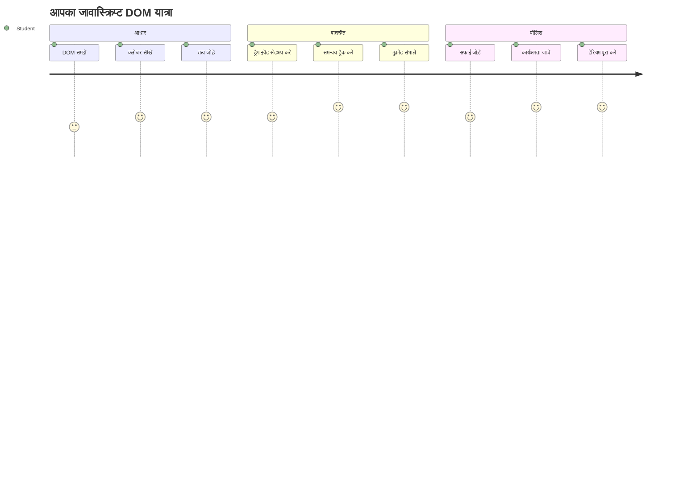
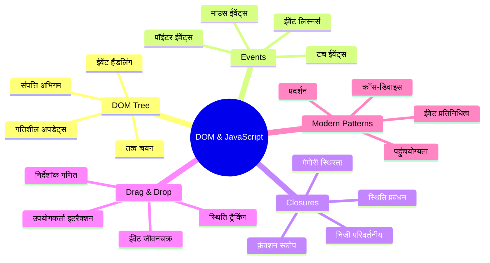
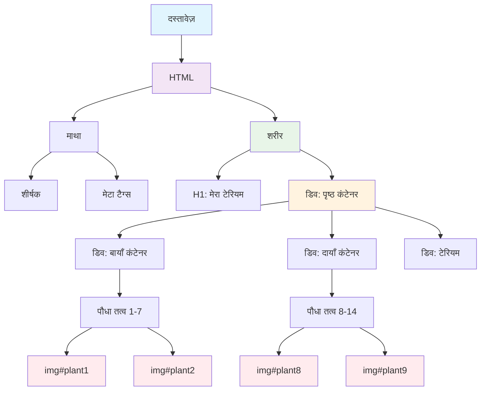
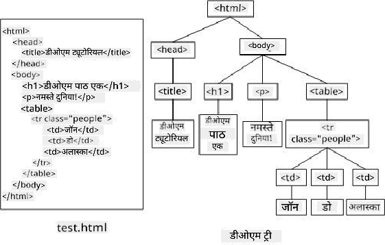
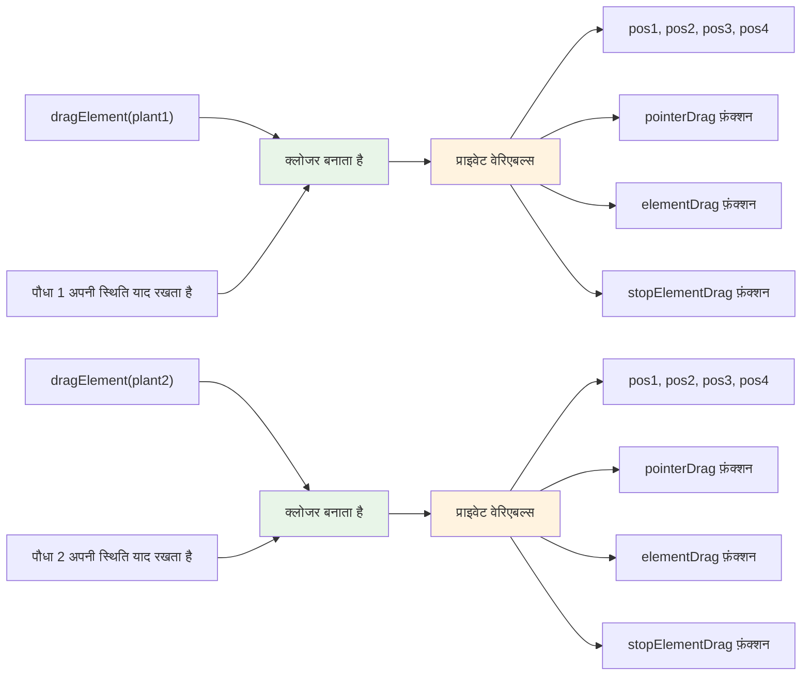
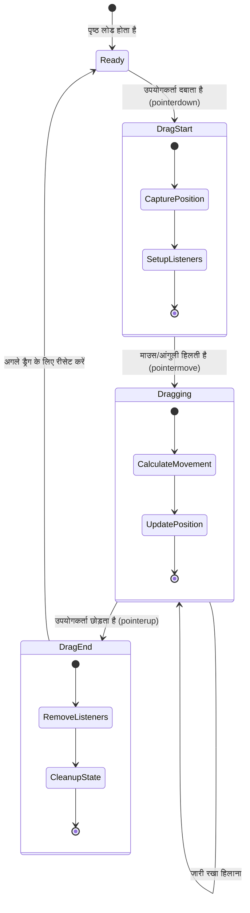
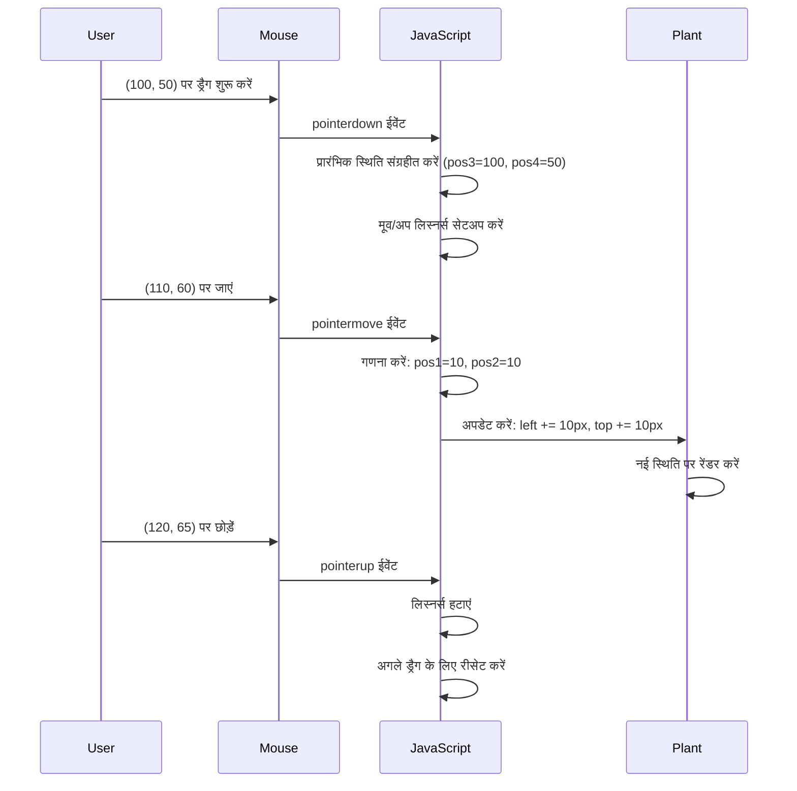
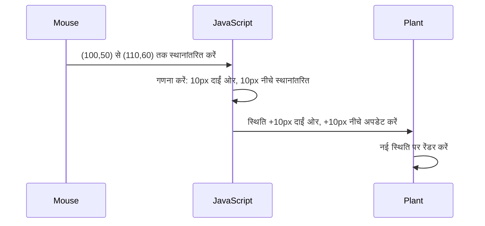
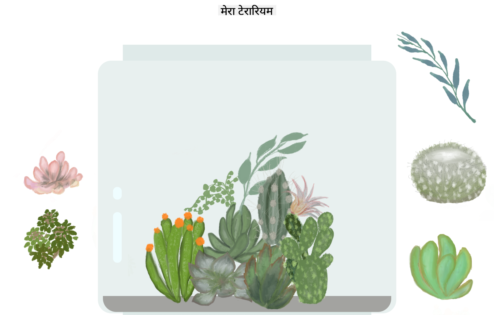
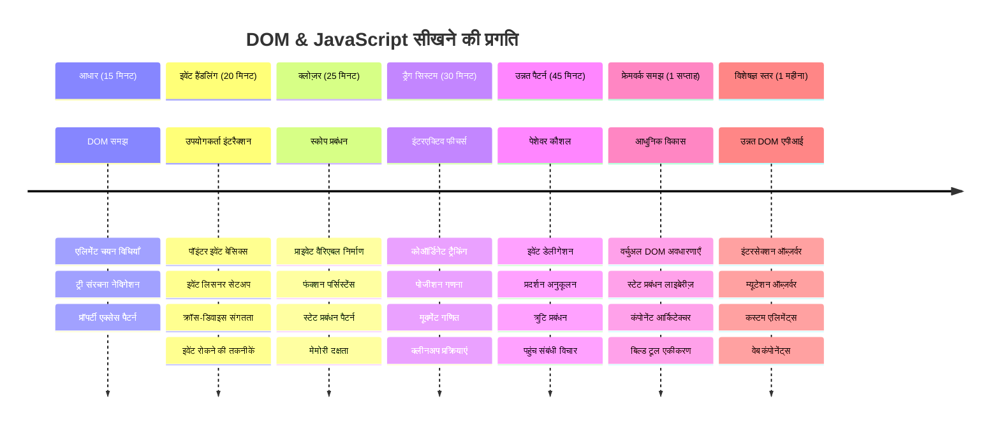

<!--
CO_OP_TRANSLATOR_METADATA:
{
  "original_hash": "973e48ad87d67bf5bb819746c9f8e302",
  "translation_date": "2026-01-06T17:00:24+00:00",
  "source_file": "3-terrarium/3-intro-to-DOM-and-closures/README.md",
  "language_code": "hi"
}
-->
# टेरियम परियोजना भाग 3: DOM मैनिपुलेशन और जावास्क्रिप्ट क्लोज़र्स



> स्केचनोट द्वारा [Tomomi Imura](https://twitter.com/girlie_mac)

वेब विकास के सबसे आकर्षक पहलुओं में से एक में आपका स्वागत है - चीज़ों को इंटरैक्टिव बनाना! डाक्यूमेंट ऑब्जेक्ट मॉडल (DOM) आपके HTML और JavaScript के बीच का पुल है, और आज हम इसका उपयोग आपके टेरियम को जीवन में लाने के लिए करेंगे। जब टिम बर्नर्स-ली ने पहला वेब ब्राउज़र बनाया, तो उन्होंने एक ऐसा वेब कल्पना किया जहाँ दस्तावेज़ गतिशील और इंटरैक्टिव हो सकते हैं - यही DOM उस दृष्टि को संभव बनाता है।

हम जावास्क्रिप्ट क्लोज़र्स भी एक्सप्लोर करेंगे, जो शुरू में intimidating लग सकते हैं। क्लोज़र्स को "मेमोरी पॉकेट्स" के रूप में सोचें जहाँ आपके फ़ंक्शन महत्वपूर्ण जानकारी याद रख सकते हैं। ऐसा जैसे आपके टेरियम के हर पौधे के पास अपना डेटा रिकॉर्ड हो जो उसकी स्थिति को ट्रैक करता हो। इस पाठ के अंत तक, आप समझ जाएंगे कि ये कितने प्राकृतिक और उपयोगी हैं।

यहाँ हम जो बना रहे हैं: एक टेरियम जहाँ यूजर्स किसी भी जगह पौधों को ड्रैग और ड्रॉप कर सकते हैं। आप DOM मैनिपुलेशन तकनीकों को सीखेंगे जो सब कुछ संचालित करती हैं, ड्रैग-एंड-ड्रॉप फाइल अपलोड से लेकर इंटरैक्टिव गेम्स तक। चलिए आपके टेरियम को जीवित करते हैं।


## प्री-लेक्चर क्विज

[प्री-लेक्चर क्विज](https://ff-quizzes.netlify.app/web/quiz/19)

## DOM को समझना: आपके इंटरैक्टिव वेब पेज का द्वार

डाक्यूमेंट ऑब्जेक्ट मॉडल (DOM) वह तरीका है जिससे जावास्क्रिप्ट आपके HTML एलिमेंट्स के साथ संवाद करता है। जब आपका ब्राउज़र एक HTML पेज लोड करता है, तो वह उस पेज का एक संरचित प्रतिनिधित्व मेमोरी में बनाता है - यही DOM है। इसे एक परिवार वृक्ष के रूप में सोचें जहाँ हर HTML एलिमेंट एक परिवार का सदस्य होता है जिसे जावास्क्रिप्ट एक्सेस, मोडिफाई, या पुनः व्यवस्थित कर सकता है।

DOM मैनिपुलेशन स्थिर पेजों को इंटरैक्टिव वेबसाइट्स में बदल देता है। जब भी आप देखते हैं कि कोई बटन होवर करने पर रंग बदलता है, बिना पेज रीफ़्रेश के कंटेंट अपडेट होता है, या आप एलिमेंट्स को ड्रैग कर सकते हैं, तो वह DOM मैनिपुलेशन का काम है।




> DOM और HTML मार्कअप का एक प्रतिनिधित्व जो इसे संदर्भित करता है। [Olfa Nasraoui](https://www.researchgate.net/publication/221417012_Profile-Based_Focused_Crawler_for_Social_Media-Sharing_Websites) से

**DOM को शक्तिशाली बनाने वाली बातें:**
- **प्रदान करता है** आपके पेज के किसी भी एलिमेंट तक पहुँचने का संरचित तरीका
- **सक्षम बनाता है** बिना पेज रिफ्रेश के कंटेंट अपडेट को
- **अनुमति देता है** उपयोगकर्ता इंटरैक्शन जैसे क्लिक और ड्रैग के लिए रियल-टाइम प्रतिक्रिया
- **बनाता है** आधुनिक इंटरैक्टिव वेब एप्लिकेशन का आधार

## जावास्क्रिप्ट क्लोज़र्स: संगठित, शक्तिशाली कोड बनाना

एक [जावास्क्रिप्ट क्लोज़र](https://developer.mozilla.org/docs/Web/JavaScript/Closures) ऐसा है जैसे किसी फ़ंक्शन को उसकी अपनी निजी कार्यक्षेत्र और स्थायी मेमोरी देना। सोचें कैसे गैलापागोस द्वीपों पर डार्विन के फिंच पक्षियों ने अपने विशिष्ट पर्यावरण के आधार पर विशेष चोंच विकसित कीं - क्लोज़र भी इसी तरह काम करते हैं, विशेष फ़ंक्शंस बनाते हैं जो अपने विशिष्ट संदर्भ को "याद" रखते हैं, यहाँ तक कि उनके पैरेंट फ़ंक्शन के समाप्त होने के बाद भी।

हमारे टेरियम में, क्लोज़र्स प्रत्येक पौधे को अपनी स्थिति स्वतंत्र रूप से याद रखने में मदद करते हैं। यह पैटर्न पेशेवर जावास्क्रिप्ट विकास में व्यापक रूप से उपयोग होता है, जिससे यह एक महत्वपूर्ण अवधारणा बन जाती है।


> 💡 **क्लोज़र्स को समझना**: क्लोज़र्स जावास्क्रिप्ट में एक महत्वपूर्ण विषय हैं, और कई डेवलपर्स उन्हें वर्षों तक उपयोग करते हैं इससे पहले कि वे सारे सैद्धांतिक पहलुओं को पूरी तरह समझें। आज, हम व्यावहारिक अनुप्रयोग पर ध्यान केंद्रित करेंगे - आप देखेंगे कि क्लोज़र्स प्राकृतिक रूप से हमारे इंटरैक्टिव फीचर्स बनाते समय उभरते हैं। समझ तब विकसित होगी जब आप देखेंगे कि वे वास्तविक समस्याओं को कैसे हल करते हैं।


> DOM और HTML मार्कअप का एक प्रतिनिधित्व जो इसे संदर्भित करता है। [Olfa Nasraoui](https://www.researchgate.net/publication/221417012_Profile-Based_Focused_Crawler_for_Social_Media-Sharing_Websites) से

इस पाठ में, हम अपना इंटरैक्टिव टेरियम प्रोजेक्ट पूरा करेंगे, जिसमें जावास्क्रिप्ट बनाएंगे जो उपयोगकर्ता को पेज पर पौधों को मैनिपुलेट करने की अनुमति देगा।

## शुरू करने से पहले: सफलता के लिए सेटअप

आपको पिछली टेरियम पाठों से अपने HTML और CSS फाइलों की जरूरत होगी - हम उस स्थिर डिज़ाइन को इंटरैक्टिव बना रहे हैं। यदि आप पहली बार जुड़ रहे हैं, तो पहले वे पाठ पूरे करना महत्वपूर्ण संदर्भ प्रदान करेगा।

हम जो बनाएंगे:
- **स्मूथ ड्रैग-एंड-ड्रॉप** सभी टेरियम पौधों के लिए
- **समन्वय ट्रैकिंग** ताकि पौधे अपनी स्थिति याद रखें
- **एक पूर्ण इंटरैक्टिव इंटरफ़ेस** वेनिला जावास्क्रिप्ट के साथ
- **साफ-सुथरा, व्यवस्थित कोड** क्लोज़र पैटर्न का उपयोग करके

## अपने जावास्क्रिप्ट फ़ाइल को सेटअप करना

आइए वह जावास्क्रिप्ट फ़ाइल बनाएं जो आपके टेरियम को इंटरैक्टिव बनाएगी।

**चरण 1: अपनी स्क्रिप्ट फ़ाइल बनाएं**

अपने टेरियम फ़ोल्डर में एक नई फ़ाइल बनाएं जिसका नाम `script.js` हो।

**चरण 2: जावास्क्रिप्ट को अपने HTML से लिंक करें**

अपने `index.html` फ़ाइल के `<head>` सेक्शन में यह स्क्रिप्ट टैग जोड़ें:

```html
<script src="./script.js" defer></script>
```

**`defer` एट्रिब्यूट महत्वपूर्ण क्यों है:**
- **सुनिश्चित करता है** कि आपका जावास्क्रिप्ट तब तक प्रतीक्षा करे जब तक पूरी HTML लोड न हो जाए
- **रोकता है** ऐसी त्रुटियाँ जहाँ जावास्क्रिप्ट उन एलिमेंट्स को ढूंढने की कोशिश करता है जो अभी तैयार नहीं हैं
- **गारंटी देता है** कि आपके सभी पौधे के एलिमेंट्स इंटरैक्शन के लिए उपलब्ध हैं
- **बेहतर प्रदर्शन देता है** पेज के नीचे स्क्रिप्ट्स रखने की तुलना में

> ⚠️ **महत्वपूर्ण सूचना**: `defer` एट्रिब्यूट सामान्य टाइमिंग समस्याओं को रोकता है। इसके बिना, जावास्क्रिप्ट HTML एलिमेंट्स को लोड होने से पहले एक्सेस करने की कोशिश कर सकता है, जिससे त्रुटियाँ हो सकती हैं।

---

## जावास्क्रिप्ट को अपने HTML एलिमेंट्स से जोड़ना

एलिमेंट्स को ड्रैग करने योग्य बनाने से पहले, जावास्क्रिप्ट को उन्हें DOM में ढूंढ़ना होगा। इसे एक पुस्तकालय कैटलॉग सिस्टम की तरह सोचें - जब आपके पास कैटलॉग नंबर होता है, आप ठीक वही किताब पा सकते हैं जिसकी आपको जरूरत है और उसके सभी कंटेंट तक पहुंच सकते हैं।

हम संबंध बनाने के लिए `document.getElementById()` मेथड का उपयोग करेंगे। यह एक सटीक फाइलिंग सिस्टम की तरह है - आप एक ID प्रदान करते हैं, और यह ठीक आपकी HTML में जरूरी एलिमेंट को ढूंढ़ लेता है।

### सभी पौधों के लिए ड्रैग फ़ंक्शनलिटी सक्षम करना

अपने `script.js` फ़ाइल में यह कोड जोड़ें:

```javascript
// सभी 14 पौधों के लिए ड्रैग कार्यक्षमता सक्षम करें
dragElement(document.getElementById('plant1'));
dragElement(document.getElementById('plant2'));
dragElement(document.getElementById('plant3'));
dragElement(document.getElementById('plant4'));
dragElement(document.getElementById('plant5'));
dragElement(document.getElementById('plant6'));
dragElement(document.getElementById('plant7'));
dragElement(document.getElementById('plant8'));
dragElement(document.getElementById('plant9'));
dragElement(document.getElementById('plant10'));
dragElement(document.getElementById('plant11'));
dragElement(document.getElementById('plant12'));
dragElement(document.getElementById('plant13'));
dragElement(document.getElementById('plant14'));
```

**यह कोड क्या करता है:**
- **DOM में** प्रत्येक पौधे के एलिमेंट को उसकी यूनिक ID से खोजता है
- **प्रत्येक HTML एलिमेंट** का जावास्क्रिप्ट संदर्भ प्राप्त करता है
- **प्रत्येक एलिमेंट को** `dragElement` फ़ंक्शन (जो हम अगली बार बनाएंगे) को पास करता है
- **हर पौधे को** ड्रैग-एंड-ड्रॉप इंटरैक्शन के लिए तैयार करता है
- **आपकी HTML संरचना को** जावास्क्रिप्ट की कार्यक्षमता से जोड़ता है

> 🎯 **क्लासेस के बजाय IDs क्यों उपयोग करें?** IDs विशिष्ट एलिमेंट्स के लिए अद्वितीय पहचानकर्ता प्रदान करते हैं, जबकि CSS क्लासेस समूहों के स्टाइलिंग के लिए डिज़ाइन किए गए हैं। जब जावास्क्रिप्ट को व्यक्तिगत एलिमेंट्स को मैनिपुलेट करना होता है, तब IDs हमें आवश्यक सटीकता और प्रदर्शन देती हैं।

> 💡 **प्रो टिप**: ध्यान दें कि हम `dragElement()` को प्रत्येक पौधे के लिए अलग-अलग कॉल कर रहे हैं। यह तरीका सुनिश्चित करता है कि प्रत्येक पौधे का अपना स्वतंत्र ड्रैगिंग व्यवहार हो, जो स्मूथ उपयोगकर्ता इंटरैक्शन के लिए आवश्यक है।

### 🔄 **शैक्षिक जांच**
**DOM कनेक्शन की समझ**: ड्रैग फ़ंक्शनलिटी पर जाने से पहले सुनिश्चित करें कि आप:
- ✅ समझा सकते हैं कि `document.getElementById()` HTML एलिमेंट्स को कैसे ढूंढता है
- ✅ समझते हैं कि हम प्रत्येक पौधे के लिए यूनिक IDs क्यों उपयोग करते हैं
- ✅ `defer` एट्रिब्यूट का स्क्रिप्ट टैग में उद्देश्य क्या है
- ✅ समझते हैं कि जावास्क्रिप्ट और HTML DOM के माध्यम से कैसे जुड़ते हैं

**त्वरित आत्म-परीक्षा**: अगर दो एलिमेंट्स की एक ही ID हो तो क्या होगा? `getElementById()` केवल एक एलिमेंट क्यों लौटाता है?
*उत्तर: IDs अद्वितीय होनी चाहिए; यदि डुप्लिकेट हों, तो केवल पहला एलिमेंट लौटाया जाता है*

---

## ड्रैग एलिमेंट क्लोज़र का निर्माण

अब हम अपने ड्रैगिंग फ़ंक्शनलिटी का मुख्य हिस्सा बनाएंगे: एक क्लोज़र जो प्रत्येक पौधे के लिए ड्रैगिंग व्यवहार को प्रबंधित करेगा। इस क्लोज़र में कई आंतरिक फ़ंक्शन होंगे जो माउस मूवमेंट ट्रैकिंग और एलिमेंट की स्थिति अपडेट करने के लिए मिलकर काम करेंगे।

क्लोज़र्स इसके लिए परफेक्ट हैं क्योंकि वे हमें "प्राइवेट" वेरिएबल्स बनाने देते हैं जो फ़ंक्शन कॉल के बीच बने रहते हैं, जिससे प्रत्येक पौधे के पास स्वतंत्र समन्वय ट्रैकिंग सिस्टम होता है।

### एक सरल उदाहरण के साथ क्लोज़र्स को समझना

मैं एक सरल उदाहरण के साथ क्लोज़र्स दिखाता हूँ जो इस अवधारणा को समझाता है:

```javascript
function createCounter() {
    let count = 0; // यह एक निजी चर की तरह है
    
    function increment() {
        count++; // आंतरिक फ़ंक्शन बाहरी चर को याद रखता है
        return count;
    }
    
    return increment; // हम आंतरिक फ़ंक्शन वापस दे रहे हैं
}

const myCounter = createCounter();
console.log(myCounter()); // 1
console.log(myCounter()); // 2
```

**इस क्लोज़र पैटर्न में क्या हो रहा है:**
- **एक प्राइवेट `count` वेरिएबल बनाता है** जो केवल इस क्लोज़र के भीतर मौजूद है
- **आंतरिक फ़ंक्शन** उस बाहरी वेरिएबल को एक्सेस और मॉडिफाई कर सकता है (क्लोज़र मेकैनिज़्म)
- **जब हम आंतरिक फ़ंक्शन को रिटर्न करते हैं**, तो यह उस निजी डाटा से अपनी कनेक्शन बनाये रखता है
- **यहाँ तक कि** `createCounter()` के निष्पादन के बाद भी `count` मौजूद रहता है और अपनी मान याद रखता है

### ड्रैग फ़ंक्शनलिटी के लिए क्लोज़र्स क्यों परफेक्ट हैं

हमारे टेरियम के लिए, प्रत्येक पौधे को अपनी वर्तमान स्थिति के समन्वय याद रखने की जरूरत है। क्लोज़र्स सही समाधान प्रदान करते हैं:

**हमारे प्रोजेक्ट के लिए प्रमुख फायदे:**
- **प्रत्येक पौधे के लिए निजी पोस्टिशन वेरिएबल्स बनाए रखते हैं**
- **ड्रैग इवेंट्स के बीच समन्वय डेटा संरक्षित करते हैं**
- **विभिन्न ड्रैगेबल एलिमेंट्स के बीच वैरिएबल टकराव रोकते हैं**
- **साफ-सुथरा, संगठित कोड संरचना बनाते हैं**

> 🎯 **सीखने का लक्ष्य**: आपको अभी क्लोज़र्स का हर पहलू मास्टर करने की जरूरत नहीं है। ध्यान दें कि वे हमारे कोड को कैसे संगठन देते हैं और ड्रैगिंग फ़ंक्शनलिटी के लिए स्टेट बनाए रखते हैं।


### `dragElement` फ़ंक्शन का निर्माण

अब हम मुख्य फ़ंक्शन बनाएंगे जो सारे ड्रैगिंग लॉजिक को संभालेगा। अपने पौधे के एलिमेंट घोषणाओं के नीचे यह फ़ंक्शन जोड़ें:

```javascript
function dragElement(terrariumElement) {
    // स्थिति ट्रैकिंग वेरिएबल्स को प्रारंभ करें
    let pos1 = 0,  // पिछली माउस X स्थिति
        pos2 = 0,  // पिछली माउस Y स्थिति
        pos3 = 0,  // वर्तमान माउस X स्थिति
        pos4 = 0;  // वर्तमान माउस Y स्थिति
    
    // प्रारंभिक ड्रैग इवेंट लिस्नर सेट करें
    terrariumElement.onpointerdown = pointerDrag;
}
```

**स्थिति ट्रैकिंग सिस्टम की समझ:**
- **`pos1` और `pos2`**: पुराने और नए माउस पोजीशन के बीच का अंतर स्टोर करते हैं
- **`pos3` और `pos4`**: वर्तमान माउस कोऑर्डिनेट्स को ट्रैक करते हैं
- **`terrariumElement`**: विशिष्ट पौधे का एलिमेंट जिसे हम ड्रैगेबल बना रहे हैं
- **`onpointerdown`**: वह इवेंट जो यूजर के ड्रैगिंग शुरू करने पर ट्रिगर होता है

**क्लोज़र पैटर्न कैसे काम करता है:**
- **प्रत्येक पौधे के लिए प्राइवेट पोजीशन वेरिएबल बनाता है**
- **इन वेरिएबल्स को ड्रैगिंग लाइफसाइकल के दौरान बनाये रखता है**
- **सुनिश्चित करता है कि प्रत्येक पौधा अपनी कोऑर्डिनेट्स स्वतंत्र रूप से ट्रैक करे**
- **`dragElement` फ़ंक्शन के माध्यम से एक साफ इंटरफ़ेस प्रदान करता है**

### पॉइंटर इवेंट्स क्यों उपयोग करें?

आप सोच सकते हैं कि हम `onclick` की बजाय `onpointerdown` क्यों उपयोग कर रहे हैं। यहाँ कारण है:

| इवेंट प्रकार | सबसे अच्छा है | पकड़ क्या है |
|------------|------------|------------|
| `onclick` | सिंपल बटन क्लिक | ड्रैगिंग हैंडल नहीं कर सकता (सिर्फ क्लिक और रिलीज) |
| `onpointerdown` | माउस और टच दोनों | नया है, लेकिन इन दिनों काफी समर्थित है |
| `onmousedown` | केवल डेस्कटॉप माउस | मोबाइल यूज़र्स को बाहर छोड़ देता है |

**पॉइंटर इवेंट्स हमारे लिए क्यों परफेक्ट हैं:**
- **चाहे कोई माउस, अंगूठा, या स्टायलस उपयोग कर रहा हो, ये अच्छा काम करते हैं**
- **लैपटॉप, टैबलेट, या फोन पर समान अनुभव देते हैं**
- **असली ड्रैगिंग गति को संभालते हैं (सिर्फ क्लिक नहीं)**
- **आधुनिक वेब ऐप्स की उम्मीद के अनुसार स्मूथ अनुभव बनाते हैं**

> 💡 **भविष्य की तैयारी**: पॉइंटर इवेंट्स उपयोगकर्ता इंटरैक्शन को संभालने का आधुनिक तरीका है। माउस और टच के लिए अलग कोड लिखने की जरूरत नहीं, दोनों मुफ्त में मिलते हैं। बढ़िया है, है ना?

### 🔄 **शैक्षिक जांच**
**इवेंट हैंडलिंग की समझ**: रुकें और इवेंट्स को समझें:
- ✅ हम माउस इवेंट्स की जगह पॉइंटर इवेंट्स क्यों उपयोग करते हैं?
- ✅ क्लोज़र वेरिएबल्स फ़ंक्शन कॉल्स के बीच कैसे बने रहते हैं?
- ✅ स्मूथ ड्रैगिंग में `preventDefault()` की क्या भूमिका है?
- ✅ हम डॉक्यूमेंट पर लिस्नर्स क्यों अटैच करते हैं न कि व्यक्तिगत एलिमेंट्स पर?

**वास्तविक दुनिया से जुड़ाव**: सोचें कि आप दैनिक रूप से किन ड्रैग-एंड-ड्रॉप इंटरफेस का उपयोग करते हैं:
- **फाइल अपलोड्स**: फाइल्स को ब्राउज़र विंडो में ड्रैग करना
- **कानबन बोर्ड्स**: कॉलम्स के बीच टास्क्स को मूव करना
- **इमेज गैलरीज**: फोटो की क्रमबद्धता बदलना
- **मोबाइल इंटरफेस**: टचस्क्रीन पर स्वाइप और ड्रैग करना

---

## `pointerDrag` फ़ंक्शन: ड्रैग की शुरुआत कैप्चर करना

जब यूजर किसी पौधे पर प्रेस डाउन करता है (चाहे माउस क्लिक हो या फिंगर टच), तो `pointerDrag` फ़ंक्शन एक्शन में आता है। यह फ़ंक्शन प्रारंभिक कोऑर्डिनेट्स को कैप्चर करता है और ड्रैगिंग सिस्टम सेट कर देता है।

इस फ़ंक्शन को अपने `dragElement` क्लोज़र के अंदर, लाइन `terrariumElement.onpointerdown = pointerDrag;` के ठीक बाद जोड़ें:

```javascript
function pointerDrag(e) {
    // डिफ़ॉल्ट ब्राउज़र व्यवहार (जैसे टेक्स्ट चयन) को रोकें
    e.preventDefault();
    
    // प्रारंभिक माउस/टच स्थिति को कैप्चर करें
    pos3 = e.clientX;  // एक्स निर्देशांक जहां ड्रैग शुरू हुआ
    pos4 = e.clientY;  // वाई निर्देशांक जहां ड्रैग शुरू हुआ
    
    // ड्रैगिंग प्रक्रिया के लिए इवेंट लिस्नर सेट करें
    document.onpointermove = elementDrag;
    document.onpointerup = stopElementDrag;
}
```

**कदम दर कदम, यह हो रहा है:**
- **ब्राउज़र के डिफ़ॉल्ट व्यवहारों को रोकता है** जो ड्रैगिंग में हस्तक्षेप कर सकते हैं
- **सही कोऑर्डिनेट्स रिकॉर्ड करता है** जहाँ से यूजर ने ड्रैग शुरू किया
- **ड्रैग मूवमेंट के लिए इवेंट लिस्नर्स सेट करता है**
- **माउस/फिंगर मूवमेंट को पूरे डॉक्यूमेंट में ट्रैक करने के लिए सिस्टम तैयार करता है**

### इवेंट प्रिवेंशन की समझ

`e.preventDefault()` लाइन स्मूथ ड्रैगिंग के लिए बहुत जरूरी है:

**प्रिवेंशन न होने पर ब्राउज़र:**
- **पेज पर ड्रैग करते समय टेक्स्ट सिलेक्ट कर सकते हैं**
- **राइट-क्लिक ड्रैग पर कंटेक्स्ट मेनू ट्रिगर कर सकते हैं**
- **हमारे कस्टम ड्रैगिंग व्यवहार में हस्तक्षेप कर सकते हैं**
- **ड्रैग ऑपरेशन के दौरान विजुअल आर्टिफैक्ट्स बना सकते हैं**

> 🔍 **प्रयोग**: इस पाठ को पूरा करने के बाद `e.preventDefault()` हटाकर देखें और देखें कि ड्रैगिंग अनुभव कैसे प्रभावित होता है। आप जल्दी समझ जाएंगे कि यह लाइन क्यों आवश्यक है!

### समन्वय ट्रैकिंग सिस्टम

`e.clientX` और `e.clientY` प्रॉपर्टीज हमें माउस/टच कोऑर्डिनेट्स बहुत सटीक रूप से देती हैं:

| प्रॉपर्टी | क्या मापती है | उपयोग का मामला |
|----------|--------------|---------------|
| `clientX` | व्यूपोर्ट के सापेक्ष क्षैतिज स्थिति | बाएं-दाएं मूवमेंट ट्रैक करना |
| `clientY` | व्यूपोर्ट के सापेक्ष ऊर्ध्वाधर स्थिति | ऊपर-नीचे मूवमेंट ट्रैक करना |
**इन निर्देशांकों को समझना:**
- **पिक्सेल-परफेक्ट स्थिति** जानकारी प्रदान करता है
- **रियल-टाइम में अपडेट** करता है जब उपयोगकर्ता अपने पॉइंटर को हिलाता है
- **विभिन्न स्क्रीन आकारों और ज़ूम स्तरों पर स्थिर** रहता है
- **मुलायम, प्रतिक्रियाशील ड्रैग इंटरैक्शन सक्षम करता है**

### दस्तावेज़-स्तरीय इवेंट लिसनर्स सेट करना

ध्यान दें कि हम मूव और स्टॉप इवेंट्स को केवल प्लांट तत्व पर नहीं बल्कि पूरे `document` पर संलग्न करते हैं:

```javascript
document.onpointermove = elementDrag;
document.onpointerup = stopElementDrag;
```

**क्यों डॉक्यूमेंट से जोड़ा जाता है:**
- **ट्रैकिंग जारी रहती है** भले ही माउस प्लांट तत्व छोड़ दे
- **ड्रैग में बाधा नहीं आती** अगर उपयोगकर्ता तेज़ी से हिलता है
- **पूरी स्क्रीन पर चिकनी ड्रैगिंग प्रदान करता है**
- **ऐसे केस संभालता है** जहाँ कर्सर ब्राउज़र विंडो के बाहर चला जाता है

> ⚡ **प्रदर्शन नोट**: ड्रैगिंग बंद होते ही हम इन डॉक्यूमेंट-स्तरीय लिसनर्स को साफ़ करेंगे ताकि मेमोरी लीक और प्रदर्शन समस्याएँ न हों।

## ड्रैग सिस्टम पूरा करना: मूवमेंट और क्लीनअप

अब हम दो शेष फंक्शन जोड़ेंगे जो वास्तविक ड्रैग मूवमेंट को संभालते हैं और ड्रैगिंग बंद होने पर साफ-सफाई करते हैं। ये फंक्शन्स मिलकर आपके टेरियम में चिकनी, प्रतिक्रियाशील प्लांट मूवमेंट बनाते हैं।

### elementDrag फ़ंक्शन: मूवमेंट ट्रैक करना

`pointerDrag` के बंद होने वाले कर्ली ब्रैकेट के तुरंत बाद `elementDrag` फंक्शन जोड़ें:

```javascript
function elementDrag(e) {
    // अंतिम घटना के बाद से चली गई दूरी की गणना करें
    pos1 = pos3 - e.clientX;  // क्षैतिज दूरी चली गई
    pos2 = pos4 - e.clientY;  // ऊर्ध्वाधर दूरी चली गई
    
    // वर्तमान स्थिति ट्रैकिंग अपडेट करें
    pos3 = e.clientX;  // नया वर्तमान X स्थिति
    pos4 = e.clientY;  // नया वर्तमान Y स्थिति
    
    // तत्व की स्थिति पर आंदोलन लागू करें
    terrariumElement.style.top = (terrariumElement.offsetTop - pos2) + 'px';
    terrariumElement.style.left = (terrariumElement.offsetLeft - pos1) + 'px';
}
```

**निर्देशांक गणित को समझना:**
- **`pos1` और `pos2`**: पिछली अपडेट से माउस ने कितना हिलाया है यह गणना करते हैं
- **`pos3` और `pos4`**: अगली गणना के लिए वर्तमान माउस स्थिति संग्रहीत करते हैं
- **`offsetTop` और `offsetLeft`**: पेज पर एलिमेंट की वर्तमान स्थिति प्राप्त करते हैं
- **घटाव लॉजिक**: माउस जितना हिला है उतना ही एलिमेंट को स्थानांतरित करता है


**यहाँ मूवमेंट गणना का विवरण है:**
1. **पुरानी और नई माउस पोजीशन के बीच का अंतर मापता है**
2. **माउस मूवमेंट के आधार पर एलिमेंट को कितना स्थानांतरित करना है गणना करता है**
3. **रियल-टाइम में एलिमेंट के CSS पोजिशन प्रॉपर्टीज अपडेट करता है**
4. **अगली मूवमेंट गणना के लिए नए पोजीशन को बेसलाइन के रूप में संग्रहीत करता है**

### गणित का दृश्य प्रतिनिधित्व


### stopElementDrag फ़ंक्शन: सफ़ाई करना

`elementDrag` के बंद कर्ली ब्रैकेट के बाद क्लीनअप फ़ंक्शन जोड़ें:

```javascript
function stopElementDrag() {
    // दस्तावेज़-स्तरीय इवेंट लिस्नरों को हटाएं
    document.onpointerup = null;
    document.onpointermove = null;
}
```

**क्लीनअप क्यों आवश्यक है:**
- लम्बे समय तक चलने वाले इवेंट लिसनर्स से मेमोरी लीक को रोकता है
- उपयोगकर्ता ने प्लांट छोड़ते ही ड्रैगिंग व्यवहार बंद करता है
- अन्य एलिमेंट को स्वतंत्र रूप से ड्रैग करने की अनुमति देता है
- अगले ड्रैग ऑपरेशन के लिए सिस्टम को रीसेट करता है

**क्लीनअप न करने पर क्या होता है:**
- ड्रैगिंग बंद होने के बाद भी इवेंट लिसनर्स चलते रहते हैं
- अनावश्यक लिसनर्स जमा होने से प्रदर्शन गिरता है
- अन्य एलिमेंट्स के साथ इंटरैक्शन में असामान्य व्यवहार होता है
- ब्राउज़र संसाधनों को अनावश्यक इवेंट हैंडलिंग पर खो दिया जाता है

### CSS पोजिशन प्रॉपर्टीज को समझना

हमारा ड्रैगिंग सिस्टम दो प्रमुख CSS प्रॉपर्टीज को नियंत्रित करता है:

| प्रॉपर्टी | यह क्या नियंत्रित करता है | हम इसे कैसे उपयोग करते हैं |
|----------|------------------|----------------|
| `top` | ऊपर की किनारे से दूरी | ड्रैग के दौरान ऊर्ध्वाधर स्थिति निर्धारण |
| `left` | बाईं किनारे से दूरी | ड्रैग के दौरान क्षैतिज स्थिति निर्धारण |

**ऑफसेट प्रॉपर्टीज के बारे में मुख्य जानकारी:**
- **`offsetTop`**: पोजिशन्ड पैरेंट एलिमेंट के ऊपर से वर्तमान दूरी
- **`offsetLeft`**: पोजिशन्ड पैरेंट एलिमेंट के बाएँ से वर्तमान दूरी
- **पोजिशनिंग संदर्भ**: ये मान निकटतम पोजिशन्ड पूर्वज के सापेक्ष होते हैं
- **रियल-टाइम अपडेट्स**: CSS प्रॉपर्टीज बदलने पर तुरंत बदल जाता है

> 🎯 **डिजाइन दर्शन**: यह ड्रैग सिस्टम जानबूझकर लचीला है – इसमें कोई "ड्रॉप जोन" या प्रतिबंध नहीं हैं। उपयोगकर्ता पौधों को कहीं भी रख सकते हैं, जिससे उन्हें अपने टेरियम डिज़ाइन पर पूरी रचनात्मक स्वतंत्रता मिलती है।

## सब कुछ एक साथ लाना: आपकी पूर्ण ड्रैग सिस्टम

बधाई हो! आपने वेनिला जावास्क्रिप्ट का उपयोग करके एक परिष्कृत ड्रैग-एंड-ड्रॉप सिस्टम बनाया है। आपका पूरा `dragElement` फंक्शन अब एक शक्तिशाली क्लोजर है जो प्रबंधित करता है:

**आपका क्लोजर क्या करता है:**
- प्रत्येक पौधे के लिए निजी पोजिशन वेरिएबल्स बनाए रखता है
- ड्रैग जीवनचक्र को शुरू से अंत तक संभालता है
- पूरे स्क्रीन पर चिकनी, प्रतिक्रियाशील मूवमेंट प्रदान करता है
- मेमोरी लीक को रोकने के लिए संसाधनों की ठीक से सफ़ाई करता है
- टेरियम डिजाइन के लिए सहज और रचनात्मक इंटरफ़ेस बनाता है

### अपने इंटरैक्टिव टेरियम का परीक्षण

अब अपने इंटरैक्टिव टेरियम का परीक्षण करें! अपने `index.html` फ़ाइल को वेब ब्राउज़र में खोलें और कार्यक्षमता आज़माएं:

1. किसी भी पौधे पर **क्लिक करें और दबाए रखें** ड्रैग शुरू करने के लिए
2. **माउस या उंगली हिलाएं** और देखें पौधा सुचारू रूप से आपके साथ चलता है
3. **रिलीज़ करें** पौधे को उसकी नई स्थिति में छोड़ने के लिए
4. अलग-अलग व्यवस्थाओं के साथ **परिक्षण करें** और इंटरफ़ेस का पता लगाएं

🥇 **उपलब्धि**: आपने एक पूर्ण इंटरैक्टिव वेब एप्लिकेशन बनाया है जिसमें वे मुख्य अवधारणाएँ निहित हैं जिनका उपयोग पेशेवर डेवलपर्स दिन-प्रतिदिन करते हैं। यह ड्रैग-एंड-ड्रॉप कार्यक्षमता वही सिद्धांत इस्तेमाल करती है जो फ़ाइल अपलोड, कानबन बोर्ड और अन्य इंटरैक्टिव इंटरफेस में होता है।

### 🔄 **शैक्षिक जाँच**
**पूर्ण सिस्टम समझ**: अपने ड्रैग सिस्टम में महारत की पुष्टि करें:
- ✅ क्लोजर कैसे प्रत्येक पौधे की स्वतंत्र स्थिति बनाए रखता है?
- ✅ चिकनी मूवमेंट के लिए निर्देर्शांक गणित क्यों आवश्यक है?
- ✅ यदि हमने इवेंट लिसनर्स की सफाई नहीं की तो क्या होगा?
- ✅ यह पैटर्न अधिक जटिल इंटरैक्शन के लिए कैसे स्केल होता है?

**कोड गुणवत्ता प्रतिबिंब**: अपनी संपूर्ण समाधान की समीक्षा करें:
- **मॉड्यूलर डिज़ाइन**: प्रत्येक पौधे को अपनी क्लोजर इंस्टेंस मिलता है
- **इवेंट दक्षता**: लिसनर्स का उचित सेटअप और क्लीनअप
- **क्रॉस-डिवाइस समर्थन**: डेस्कटॉप और मोबाइल दोनों पर काम करता है
- **प्रदर्शन जागरूकता**: कोई मेमोरी लीक या अनावश्यक गणनाएँ नहीं



---

## GitHub Copilot एजेंट चुनौती 🚀

एजेंट मोड का उपयोग करके निम्न चुनौती पूरी करें:

**विवरण:** टेरियम प्रोजेक्ट में एक रीसेट फ़ंक्शनैलिटी जोड़ें जो सभी पौधों को उनके मूल स्थानों पर चिकनी एनिमेशन के साथ लौटाती हो।

**प्रॉम्प्ट:** एक रीसेट बटन बनाएं, जिसे क्लिक करने पर सभी पौधे CSS ट्रांजिशन का उपयोग करके उनके मूल साइडबार पोजीशंस पर 1 सेकंड में एनिमेट होकर वापस चले जाएं। फ़ंक्शन को पेज लोड होने पर मूल पोजीशन स्टोर करनी चाहिए और रीसेट बटन दबाए जाने पर पौधों को सम्मानित गति से उनके स्थान पर वापस ले जाना चाहिए।

[agent mode](https://code.visualstudio.com/blogs/2025/02/24/introducing-copilot-agent-mode) के बारे में और जानें।

## 🚀 अतिरिक्त चुनौती: अपने कौशल बढ़ाएं

अपने टेरियम को अगले स्तर पर ले जाने के लिए ये सुधार आज़माएं:

**रचनात्मक विस्तार:**
- किसी पौधे पर **डबल-क्लिक** करें ताकि वह सामने आ जाए (z-index का उपयोग)
- पौधों पर होवर करते समय **हल्का ग्लो** जैसा विज़ुअल फीडबैक जोड़ें
- पौधों को टेरियम के बाहर ड्रैग करने से रोकने के लिए **सीमाएं लागू करें**
- **सेव फ़ंक्शन बनाएं** जो प्लांट की स्थिति को localStorage में याद रखे
- पौधे उठाने और रखने पर **ध्वनि प्रभाव जोड़ें**

> 💡 **शिक्षा का अवसर**: इन प्रत्येक चुनौतियों से आपको नए DOM हेरफेर, ईवेंट हैंडलिंग और उपयोगकर्ता अनुभव डिज़ाइन के पहलू सीखने को मिलेंगे।

## पोस्ट-लेक्चर क्विज़

[पोस्ट-लेक्चर क्विज़](https://ff-quizzes.netlify.app/web/quiz/20)

## समीक्षा और आत्म-अध्ययन: अपनी समझ को गहरा करना

आपने DOM हेरफेर और क्लोजर्स की बुनियादी बातों में महारत हासिल की है, लेकिन हमेशा और जानने को है! यहां कुछ रास्ते दिए गए हैं जो आपके ज्ञान और कौशल को बढ़ा सकते हैं।

### वैकल्पिक ड्रैग और ड्रॉप तरीके

हमने अधिकतम लचीलापन के लिए पॉइंटर इवेंट्स का उपयोग किया, लेकिन वेब डेवलपमेंट में कई तरीके उपलब्ध हैं:

| तरीका | किसके लिए श्रेष्ठ | सीखने का मूल्य |
|----------|----------|----------------|
| [HTML Drag and Drop API](https://developer.mozilla.org/docs/Web/API/HTML_Drag_and_Drop_API) | फ़ाइल अपलोड, औपचारिक ड्रैग जोन | नेटिव ब्राउज़र क्षमताओं को समझना |
| [Touch Events](https://developer.mozilla.org/docs/Web/API/Touch_events) | मोबाइल-विशेष इंटरैक्शन | मोबाइल-फर्स्ट विकास पैटर्न |
| CSS `transform` प्रॉपर्टीज़ | चिकनी एनिमेशन | प्रदर्शन अनुकूलन तकनीकें |

### उन्नत DOM हेरफेर विषय

**आपके सीखने की अगली कड़ी:**
- **ईवेंट डेलिगेशन**: कई एलिमेंट्स के लिए कुशलतापूर्वक हैंडलिंग
- **Intersection Observer**: जब एलिमेंट दिखने/छिपने लगते हैं पता लगाना
- **Mutation Observer**: DOM संरचना में परिवर्तनों पर नजर रखना
- **Web Components**: पुन: उपयोग योग्य, समाविष्ट UI एलिमेंट बनाना
- **वर्चुअल DOM अवधारणाएं**: फ्रेमवर्क्स DOM अपडेट्स कैसे ऑप्टिमाइज़ करते हैं समझना

### जारी सीखने के लिए आवश्यक संसाधन

**तकनीकी दस्तावेज़:**
- [MDN Pointer Events Guide](https://developer.mozilla.org/docs/Web/API/Pointer_events) - व्यापक पॉइंटर इवेंट संदर्भ
- [W3C Pointer Events Specification](https://www.w3.org/TR/pointerevents1/) - आधिकारिक मानक दस्तावेज़
- [JavaScript Closures Deep Dive](https://developer.mozilla.org/docs/Web/JavaScript/Closures) - उन्नत क्लोजर पैटर्न

**ब्राउज़र संगतता:**
- [CanIUse.com](https://caniuse.com/) - ब्राउज़र में फीचर सपोर्ट जांचने के लिए
- [MDN Browser Compatibility Data](https://github.com/mdn/browser-compat-data) - विस्तृत संगतता जानकारी

**प्रैक्टिस के अवसर:**
- **पज़ल गेम बनाएं** समान ड्रैग मैकेनिक्स के साथ
- **कानबन बोर्ड बनाएं** ड्रैग-एंड-ड्रॉप टास्क प्रबंधन के लिए
- **इमेज गैलरी डिज़ाइन करें** ड्रैगेबल फोटो व्यवस्था के साथ
- **टच जेस्चर्स के साथ प्रयोग करें** मोबाइल इंटरफ़ेस के लिए

> 🎯 **अध्ययन रणनीति**: इन अवधारणाओं को मजबूत बनाने का सर्वोत्तम तरीका है अभ्यास। ड्रैगेबल इंटरफ़ेस के विभिन्न संस्करण बनाएं – हर प्रोजेक्ट आपको उपयोगकर्ता इंटरैक्शन और DOM हेरफेर के नए पहलू सिखाएगा।

### ⚡ **अगले 5 मिनट में आप क्या कर सकते हैं**
- [ ] ब्राउज़र DevTools खोलें और कंसोल में `document.querySelector('body')` टाइप करें
- [ ] किसी वेबपेज के टेक्स्ट को `innerHTML` या `textContent` से बदलने की कोशिश करें
- [ ] किसी भी बटन या लिंक पर क्लिक इवेंट लिसनर जोड़ें
- [ ] Elements पैनल में DOM ट्री संरचना का निरीक्षण करें

### 🎯 **इस घंटे में आप क्या हासिल कर सकते हैं**
- [ ] पोस्ट-पाठ क्विज़ पूरा करें और DOM हेरफेर अवधारणाओं की समीक्षा करें
- [ ] एक इंटरैक्टिव वेबपेज बनाएं जो उपयोगकर्ता के क्लिक पर प्रतिक्रिया करे
- [ ] विभिन्न इवेंट प्रकारों (क्लिक, माउसओवर, कीप्रेस) के साथ ईवेंट हैंडलिंग का अभ्यास करें
- [ ] DOM हेरफेर द्वारा साधारण टू-डू सूची या काउंटर बनाएं
- [ ] HTML एलिमेंट्स और JavaScript ऑब्जेक्ट्स के बीच संबंध पता करें

### 📅 **आपकी सप्ताह भर की JavaScript यात्रा**
- [ ] ड्रैग-एंड-ड्रॉप कार्यक्षमता के साथ इंटरैक्टिव टेरियम प्रोजेक्ट पूरा करें
- [ ] कुशल ईवेंट हैंडलिंग के लिए इवेंट डेलिगेशन की महारत हासिल करें
- [ ] इवेंट लूप और एसिंक्रोनस जावास्क्रिप्ट सीखें
- [ ] निजी स्टेट के साथ मॉड्यूल बनाकर क्लोजर्स का अभ्यास करें
- [ ] Intersection Observer जैसे आधुनिक DOM APIs एक्सप्लोर करें
- [ ] फ्रेमवर्क्स का उपयोग किए बिना इंटरैक्टिव कॉम्पोनेन्ट बनाएं

### 🌟 **आपकी माह-भर की JavaScript महारत**
- [ ] वेनिला JavaScript का उपयोग करके एक जटिल सिंगल-पेज एप्लिकेशन बनाएं
- [ ] कोई आधुनिक फ्रेमवर्क (React, Vue, या Angular) सीखें और इसे वेनिला DOM से तुलना करें
- [ ] ओपन सोर्स JavaScript प्रोजेक्ट्स में योगदान दें
- [ ] वेब कॉम्पोनेंट्स और कस्टम एलिमेंट्स जैसे उन्नत कॉन्सेप्ट मास्टर करें
- [ ] परफॉर्मेंट वेब एप्लिकेशन बनाएं जिसमें ऑप्टिमल DOM पैटर्न हों
- [ ] DOM हेरफेर और JavaScript बुनियादी बातें दूसरों को सिखाएं

## 🎯 आपकी JavaScript DOM महारत टाइमलाइन


### 🛠️ आपकी JavaScript टूलकिट सारांश

इस पाठ को पूरा करने के बाद, आपके पास है:
- **DOM महारत**: एलिमेंट चयन, प्रॉपर्टी हेरफेर, और ट्री नेविगेशन
- **ईवेंट विशेषज्ञता**: पॉइंटर इवेंट्स के साथ क्रॉस-डिवाइस इंटरैक्शन हैंडलिंग
- **क्लोजर समझ**: निजी स्टेट प्रबंधन और फंक्शन परसिस्टेंस
- **इंटरैक्टिव सिस्टम**: शुरू से पूरा ड्रैग-एंड-ड्रॉप कार्यान्वयन
- **प्रदर्शन जागरूकता**: उचित इवेंट क्लीनअप और मेमोरी प्रबंधन
- **आधुनिक पैटर्न**: पेशेवर विकास में उपयोग की जाने वाली कोड संगठन तकनीकें
- **उपयोगकर्ता अनुभव**: सहज, प्रतिक्रियाशील इंटरफेस बनाना

**प्रोफेशनल स्किल्स मिलीं**: आपने उन्हीं तकनीकों का उपयोग करते हुए फीचर्स बनाए हैं जैसे कि:
- **Trello/कानबन बोर्ड**: कॉलम्स के बीच कार्ड ड्रैग करना
- **फाइल अपलोड सिस्टम**: ड्रैग-एंड-ड्रॉप फ़ाइल हैंडलिंग
- **इमेज गैलरीज**: फोटो व्यवस्था इंटरफेस
- **मोबाइल ऐप्स**: टच आधारित इंटरैक्शन पैटर्न

**अगला स्तर**: आप React, Vue या Angular जैसे आधुनिक फ्रेमवर्क्स में एक्सप्लोर करने के लिए तैयार हैं, जो इन मूल DOM हेरफेर अवधारणाओं पर आधारित हैं!

## असाइनमेंट

[DOM के साथ थोड़ा और काम करें](assignment.md)

---

<!-- CO-OP TRANSLATOR DISCLAIMER START -->
**अस्वीकरण**:  
यह दस्तावेज़ AI अनुवाद सेवा [Co-op Translator](https://github.com/Azure/co-op-translator) का उपयोग करके अनुवादित किया गया है। जबकि हम सटीकता के लिए प्रयासरत हैं, कृपया ध्यान दें कि स्वचालित अनुवाद में त्रुटियाँ या गलतियां हो सकती हैं। मूल दस्तावेज़ अपनी मूल भाषा में ही अधिकारिक स्रोत माना जाना चाहिए। महत्वपूर्ण सूचनाओं के लिए, पेशेवर मानव अनुवाद की सलाह दी जाती है। इस अनुवाद के उपयोग से उत्पन्न किसी भी गलतफहमी या गलत व्याख्या के लिए हम उत्तरदायी नहीं हैं।
<!-- CO-OP TRANSLATOR DISCLAIMER END -->