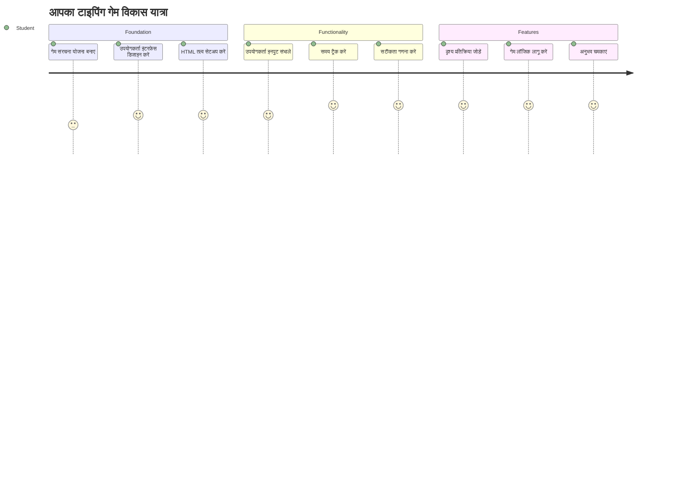
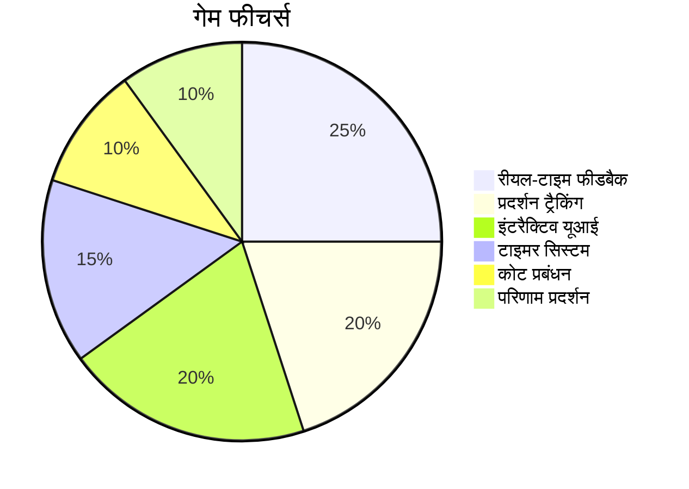
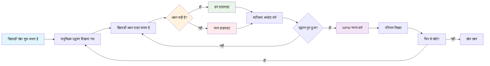
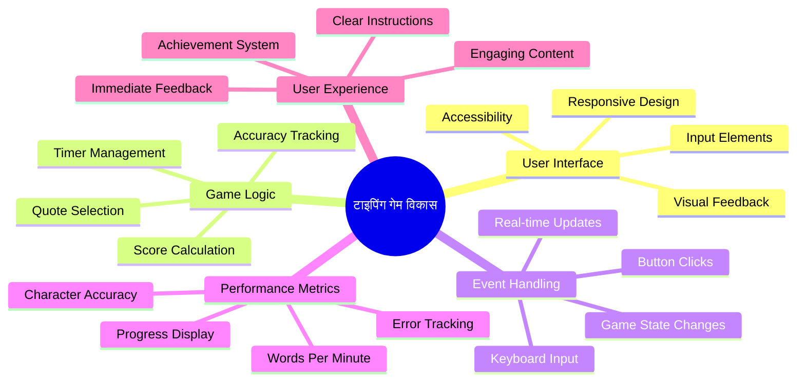
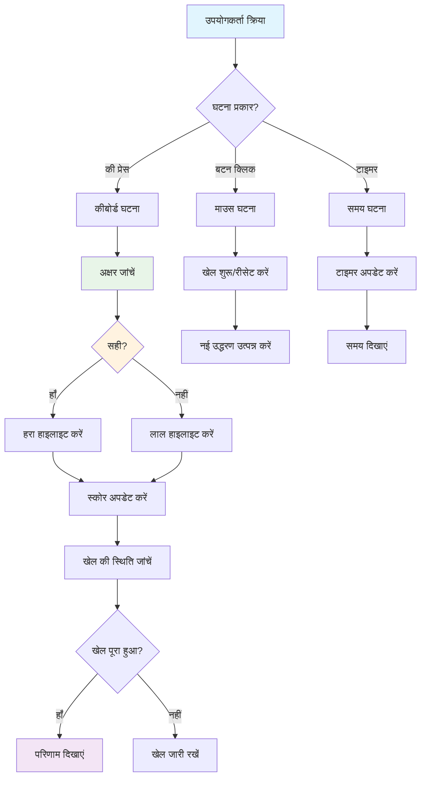
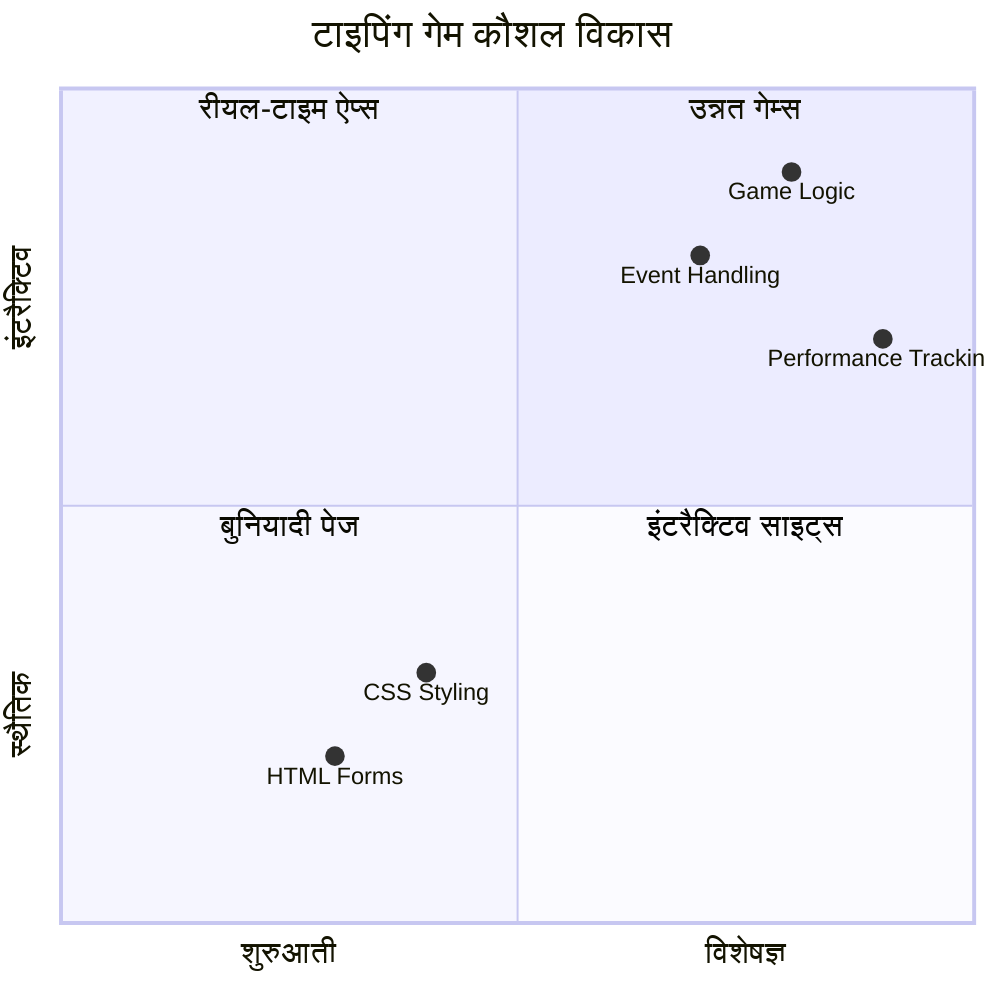
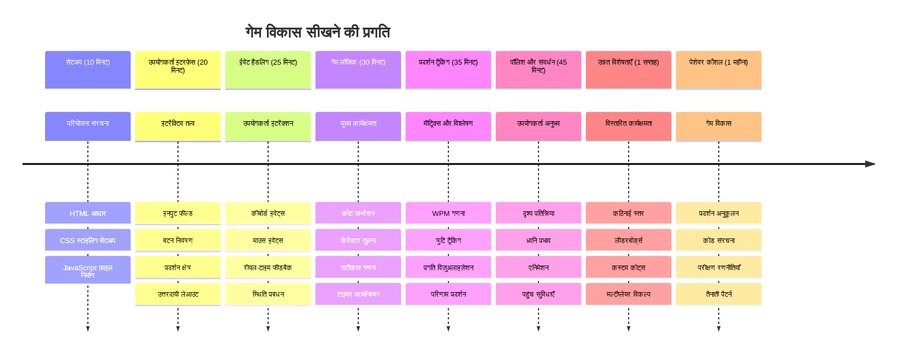

<!--
CO_OP_TRANSLATOR_METADATA:
{
  "original_hash": "efa2ab875b8bb5a7883816506da6b6d2",
  "translation_date": "2026-01-06T15:56:32+00:00",
  "source_file": "4-typing-game/README.md",
  "language_code": "hi"
}
-->
# Event-Driven Programming - एक टाइपिंग खेल बनाएं

## परिचय

यह हर डेवलपर जानता है लेकिन शायद ही कभी बात करता है: तेज़ टाइप करना एक सुपरपावर है! 🚀 सोचिए - जितनी जल्दी आप अपने विचारों को अपने मस्तिष्क से कोड एडिटर तक पहुंचा सकते हैं, उतनी ही अधिक आपकी रचनात्मकता प्रवाहित हो सकती है। यह आपकी सोच और स्क्रीन के बीच एक सीधी पाइपलाइन की तरह है।

क्या आप इस कौशल को बढ़ाने के सबसे अच्छे तरीकों में से एक जानना चाहते हैं? आपने सही अनुमान लगाया - हम एक गेम बनाने वाले हैं!

> आइए साथ मिलकर एक शानदार टाइपिंग गेम बनाते हैं!

क्या आप उन सभी जावास्क्रिप्ट, HTML, और CSS कौशलों को लागू करने के लिए तैयार हैं जिन्हें आप सीख रहे हैं? हम एक टाइपिंग गेम बनाएंगे जो आपको प्रसिद्ध जासूस [शर्लक होम्स](https://en.wikipedia.org/wiki/Sherlock_Holmes) से यादृच्छिक उद्धरणों के साथ चुनौती देगा। यह गेम आपकी टाइपिंग की गति और सटीकता को ट्रैक करेगा - और विश्वास करें, यह आप सोच सकते हैं उससे ज्यादा नशेड़ी होगा!

## आपको क्या जानना होगा

शुरू करने से पहले, सुनिश्चित करें कि आप इन अवधारणाओं से परिचित हैं (अगर आपकी याददाश्त थोड़ी कमजोर हो, तो चिंता न करें - हम सभी वहां से गुजरे हैं!):

- टेक्स्ट इनपुट और बटन नियंत्रण बनाना
- CSS और क्लासेस के माध्यम से स्टाइल सेट करना  
- जावास्क्रिप्ट की मूल बातें
  - एक एरे बनाना
  - एक यादृच्छिक संख्या बनाना
  - वर्तमान समय प्राप्त करना

अगर इनमें से कोई भी थोड़ा धुंधला लगे, तो यह बिलकुल ठीक है! कभी-कभी अपने ज्ञान को मजबूत करने का सबसे अच्छा तरीका है कि आप सीधे एक प्रोजेक्ट में कूद जाएं और धीरे-धीरे चीजों को समझें।

### 🔄 **शिक्षण जांच**
**बुनियादी मूल्यांकन**: विकास शुरू करने से पहले, सुनिश्चित करें कि आप समझते हैं:
- ✅ HTML फॉर्म और इनपुट एलिमेंट्स कैसे काम करते हैं
- ✅ CSS क्लासेस और डायनामिक स्टाइलिंग
- ✅ जावास्क्रिप्ट इवेंट लिसनर्स और हैंडलर्स
- ✅ एरे मैनिपुलेशन और रैंडम चयन
- ✅ समय मापन और गणना

**त्वरित स्व-परीक्षा**: क्या आप समझा सकते हैं कि ये अवधारणाएं एक इंटरैक्टिव गेम में कैसे मिलती हैं?
- **इवेंट्स** तब ट्रिगर होते हैं जब उपयोगकर्ता एलिमेंट्स के साथ इंटरैक्ट करते हैं
- **हैंडलर्स** उन ईवेंट्स को प्रोसेस करते हैं और गेम की स्थिति अपडेट करते हैं
- **CSS** उपयोगकर्ता क्रियाओं के लिए दृश्य फीडबैक प्रदान करता है
- **टाइमिंग** प्रदर्शन मापन और गेम प्रगति को सक्षम बनाता है

## आइए इसे बनाएं!

[घटना-चालित प्रोग्रामिंग का उपयोग करके एक टाइपिंग गेम बनाना](./typing-game/README.md)

### ⚡ **अगले 5 मिनट में क्या कर सकते हैं**
- [ ] अपना ब्राउज़र कंसोल खोलें और `addEventListener` के साथ कीबोर्ड ईवेंट सुनने का प्रयास करें
- [ ] एक सरल HTML पेज बनाएं जिसमें एक इनपुट फ़ील्ड हो और टाइपिंग डिटेक्शन का परीक्षण करें
- [ ] टाइप किए गए टेक्स्ट की तुलना लक्ष्य टेक्स्ट से करके स्ट्रिंग मैनिपुलेशन का अभ्यास करें
- [ ] समय कार्यों को समझने के लिए `setTimeout` के साथ प्रयोग करें

### 🎯 **इस घंटे में आप क्या हासिल कर सकते हैं**
- [ ] पोस्ट-लेसन क्विज़ पूरा करें और इवेंट-ड्रिवन प्रोग्रामिंग को समझें
- [ ] वर्ड वेलिडेशन के साथ टाइपिंग गेम का एक बुनियादी संस्करण बनाएं
- [ ] सही और गलत टाइपिंग के लिए दृश्य फीडबैक जोड़ें
- [ ] गति और सटीकता के आधार पर एक साधारण स्कोरिंग सिस्टम लागू करें
- [ ] अपनी गेम को CSS के साथ स्टाइल करें ताकि यह देखने में आकर्षक हो

### 📅 **आपका सप्ताहभर का गेम डेवलपमेंट**
- [ ] सभी सुविधाओं और पॉलिश के साथ पूरा टाइपिंग गेम पूरा करें
- [ ] विभिन्न शब्द जटिलताओं के साथ कठिनाई स्तर जोड़ें
- [ ] उपयोगकर्ता के आँकड़े ट्रैकिंग लागू करें (WPM, समय के अनुसार सटीकता)
- [ ] बेहतर उपयोगकर्ता अनुभव के लिए ध्वनि प्रभाव और एनिमेशन बनाएं
- [ ] अपने गेम को मोबाइल-रिस्पॉन्सिव बनाएं ताकि यह टच डिवाइसों पर भी काम करे
- [ ] ऑनलाइन अपना गेम साझा करें और उपयोगकर्ताओं से प्रतिक्रिया एकत्र करें

### 🌟 **आपका महीनेभर का इंटरैक्टिव डेवलपमेंट**
- [ ] विभिन्न इंटरैक्शन पैटर्न की खोज करने वाले कई गेम बनाएं
- [ ] गेम लूप्स, स्टेट मैनेजमेंट, और प्रदर्शन अनुकूलन के बारे में जानें
- [ ] ओपन सोर्स गेम डेवलपमेंट प्रोजेक्ट्स में योगदान करें
- [ ] उन्नत टाइमिंग अवधारणाओं और स्मूथ एनिमेशन में महारत हासिल करें
- [ ] विभिन्न इंटरैक्टिव एप्लिकेशन दिखाने के लिए एक पोर्टफोलियो बनाएं
- [ ] गेम डेवलपमेंट और उपयोगकर्ता इंटरैक्शन में रुचि रखने वाले अन्य लोगों को मार्गदर्शन दें

## 🎯 आपकी टाइपिंग गेम मास्टरी टाइमलाइन

### 🛠️ आपका गेम डेवलपमेंट टूलकिट सारांश

इस प्रोजेक्ट को पूरा करने के बाद, आप महारत हासिल कर लेंगे:
- **इवेंट-चालित प्रोग्रामिंग**: प्रतिक्रियाशील उपयोगकर्ता इंटरफेस जो इनपुट पर प्रतिक्रिया करते हैं
- **रियल-टाइम फीडबैक**: तत्काल दृश्य और प्रदर्शन अपडेट
- **प्रदर्शन मापन**: सटीक समय और स्कोरिंग सिस्टम
- **गेम स्टेट मैनेजमेंट**: एप्लीकेशन फ्लो और उपयोगकर्ता अनुभव को नियंत्रित करना
- **इंटरैक्टिव डिजाइन**: आकर्षक, लत लगाने वाले उपयोगकर्ता अनुभव बनाना
- **मॉर्डन वेब API**: समृद्ध इंटरैक्शन के लिए ब्राउज़र क्षमताओं का उपयोग
- **एक्सेसिबिलिटी पैटर्न**: सभी उपयोगकर्ताओं के लिए समावेशी डिज़ाइन

**वास्तविक दुनिया के अनुप्रयोग**: ये कौशल सीधे लागू होते हैं:
- **वेब एप्लीकेशंस**: कोई भी इंटरैक्टिव इंटरफेस या डैशबोर्ड
- **शैक्षिक सॉफ़्टवेयर**: लर्निंग प्लेटफ़ॉर्म और कौशल मूल्यांकन उपकरण
- **उत्पादकता उपकरण**: टेक्स्ट एडिटर्स, IDEs, और सहयोग सॉफ़्टवेयर
- **गेमिंग इंडस्ट्री**: ब्राउज़र गेम्स और इंटरैक्टिव एंटरटेनमेंट
- **मोबाइल डेवलपमेंट**: टच-आधारित इंटरफेस और जेस्चर हैंडलिंग

**अगला स्तर**: आप उन्नत गेम फ्रेमवर्क्स, रियल-टाइम मल्टीप्लेयर सिस्टम्स, या जटिल इंटरैक्टिव एप्लिकेशन का अन्वेषण करने के लिए तैयार हैं!

## क्रेडिट्स

♥️ के साथ लिखा गया [Christopher Harrison](http://www.twitter.com/geektrainer) द्वारा

---

<!-- CO-OP TRANSLATOR DISCLAIMER START -->
**अस्वीकरण**:
इस दस्तावेज़ का अनुवाद एआई अनुवाद सेवा [Co-op Translator](https://github.com/Azure/co-op-translator) का उपयोग करके किया गया है। जबकि हम सटीकता के लिए प्रयासरत हैं, कृपया ध्यान दें कि स्वचालित अनुवाद में त्रुटियाँ या असंगतियाँ हो सकती हैं। मूल दस्तावेज़ इसकी मूल भाषा में आधिकारिक स्रोत माना जाना चाहिए। महत्वपूर्ण जानकारी के लिए, पेशेवर मानव अनुवाद की सिफारिश की जाती है। इस अनुवाद के उपयोग से उत्पन्न किसी भी गलतफहमी या गलत व्याख्या के लिए हम जिम्मेदार नहीं हैं।
<!-- CO-OP TRANSLATOR DISCLAIMER END -->