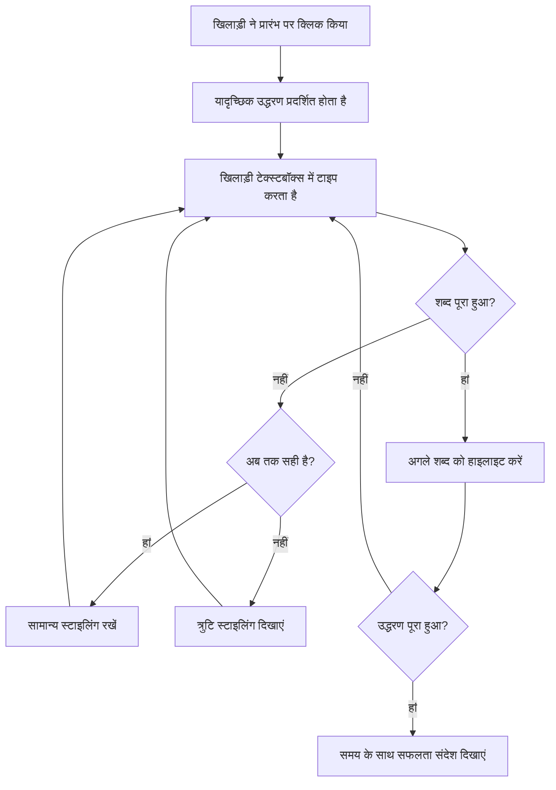
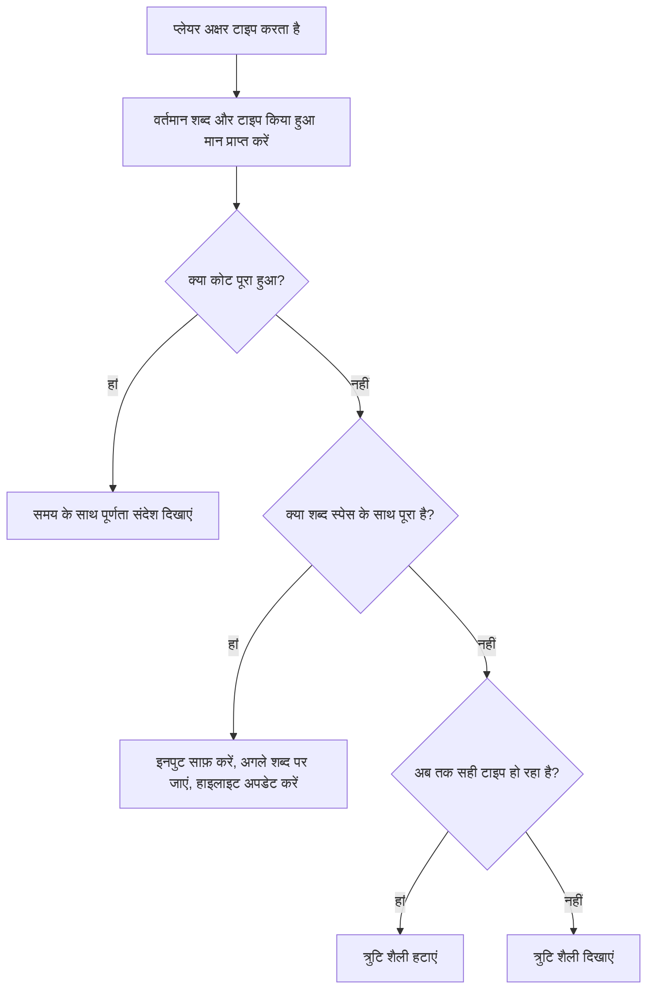
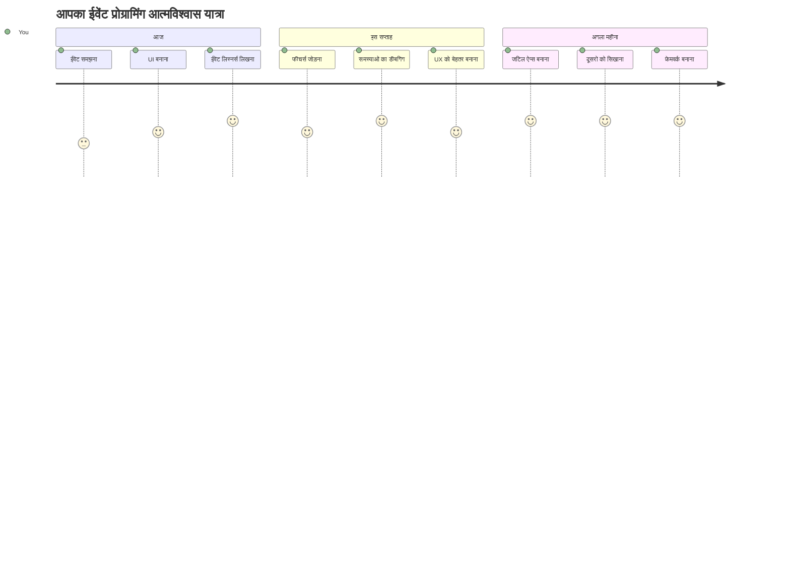

<!--
CO_OP_TRANSLATOR_METADATA:
{
  "original_hash": "da8bc72041a2bb3826a54654ee1a8844",
  "translation_date": "2026-01-06T16:55:08+00:00",
  "source_file": "4-typing-game/typing-game/README.md",
  "language_code": "hi"
}
-->
# घटनाओं का उपयोग करके एक गेम बनाना

क्या आपने कभी सोचा है कि वेबसाइटें कैसे जानती हैं कि आप कब एक बटन क्लिक करते हैं या टेक्स्ट बॉक्स में टाइप करते हैं? यही है घटना-चालित प्रोग्रामिंग का जादू! इस आवश्यक कौशल को सीखने का सबसे अच्छा तरीका है कुछ उपयोगी बनाना - एक टाइपिंग स्पीड गेम जो आपके हर कीस्ट्रोक पर प्रतिक्रिया करता है।

आप सीधे देखेंगे कि वेब ब्राउज़र आपके जावास्क्रिप्ट कोड से कैसे "बात करते हैं"। हर बार जब आप क्लिक करते हैं, टाइप करते हैं, या माउस मूव करते हैं, ब्राउज़र आपके कोड को छोटे संदेश भेजता है (इसे हम इवेंट कहते हैं), और आप तय करते हैं कि इसका जवाब कैसे देना है!

जब हम यहाँ समाप्त करेंगे, तब तक आपने एक वास्तविक टाइपिंग गेम बना लिया होगा जो आपकी गति और सटीकता को ट्रैक करता है। इससे भी महत्वपूर्ण बात यह है कि आप उन मूलभूत अवधारणाओं को समझेंगे जो हर इंटरैक्टिव वेबसाइट को शक्ति देती हैं जो आपने कभी उपयोग की है। चलिए शुरू करते हैं!

## प्री-लेक्चर क्विज़

[Pre-lecture quiz](https://ff-quizzes.netlify.app/web/quiz/21)

## घटना-चालित प्रोग्रामिंग

अपने पसंदीदा ऐप या वेबसाइट के बारे में सोचें - कौन सी चीज़ इसे जीवंत और प्रतिक्रियाशील बनाती है? यह उस पर निर्भर करता है कि वह आपके कार्यों पर कैसे प्रतिक्रिया करता है! हर टैप, क्लिक, स्वाइप, या कीस्ट्रोक एक "इवेंट" बनाता है, और यही वह जगह है जहाँ वेब विकास का असली जादू होता है।

यहाँ वेब के लिए प्रोग्रामिंग को इतना दिलचस्प बनाने वाली बात है: हमें कभी पता नहीं होता कि कोई कब उस बटन पर क्लिक करेगा या टेक्स्ट बॉक्स में टाइप करना शुरू करेगा। वे तुरंत क्लिक कर सकते हैं, पाँच मिनट इंतजार कर सकते हैं, या हो सकता है कि कभी क्लिक ही न करें! यह अनिश्चितता हमें अपने कोड लिखने के तरीके के बारे में अलग तरह से सोचने के लिए प्रेरित करती है।

रेसिपी की तरह ऊपर से नीचे चलने वाला कोड लिखने की बजाय, हम ऐसा कोड लिखते हैं जो धैर्यपूर्वक कुछ होने का इंतजार करता है। यह वैसा ही है जैसे 1800 के दशक के टेलिग्राफ ऑपरेटर मशीनों के पास बैठा करते थे, ready to respond the moment a message came through the wire।

तो "इवेंट" वास्तव में क्या है? सरल शब्दों में, यह कुछ ऐसा है जो होता है! जब आप एक बटन क्लिक करते हैं - वह एक इवेंट है। जब आप एक अक्षर टाइप करते हैं - वह भी एक इवेंट है। जब आप माउस हिलाते हैं - वह एक और इवेंट है।

इवेंट-चालित प्रोग्रामिंग हमें हमारे कोड को सुनने और प्रतिक्रिया देने के लिए सेटअप करने देती है। हम विशेष फ़ंक्शन बनाते हैं जिन्हें **इवेंट लिस्नर्स** कहा जाता है जो धैर्यपूर्वक विशिष्ट चीज़ों के होने का इंतजार करते हैं, और जब वे होते हैं तो तुरंत क्रिया में उतरते हैं।

इवेंट लिस्नर्स को ऐसा समझिए जैसे आपके कोड के लिए एक डोरबेल हो। आप डोरबेल (`addEventListener()`) सेट करते हैं, यह बताते हैं कि किस आवाज़ को सुनना है (जैसे 'click' या 'keypress'), और फिर यह स्पष्ट करते हैं कि जब कोई इसे बजाए तो क्या होना चाहिए (आपका कस्टम फ़ंक्शन)।

**इवेंट लिस्नर्स इस तरह काम करते हैं:**
- उपयोगकर्ता की विशिष्ट क्रियाओं जैसे क्लिक, कीस्ट्रोक, या माउस मूवमेंट को **सुनते** हैं
- जब निर्दिष्ट इवेंट होता है तब आपका कस्टम कोड **चलाते** हैं
- उपयोगकर्ता की बातचीत का तुरंत **प्रतिक्रिया** देते हैं, एक सहज अनुभव बनाते हैं
- अलग-अलग लिस्नर्स के माध्यम से एक ही एलिमेंट पर कई इवेंट्स को **संसाधित** करते हैं

> **NOTE:** यह बताना आवश्यक है कि इवेंट लिस्नर्स बनाने के कई तरीके हैं। आप गुमनाम फ़ंक्शन (anonymous functions) का उपयोग कर सकते हैं, या नामित ones बना सकते हैं। आप विभिन्न शॉर्टकट्स का उपयोग कर सकते हैं, जैसे कि `click` प्रॉपर्टी सेट करना, या `addEventListener()` का उपयोग करना। हमारे अभ्यास में हम `addEventListener()` और गुमनाम फ़ंक्शन पर ध्यान केंद्रित करेंगे, क्योंकि यह संभवतः वेब डेवलपर्स द्वारा सबसे अधिक इस्तेमाल की जाने वाली तकनीक है। यह सबसे लचीली भी है, क्योंकि `addEventListener()` सभी इवेंट्स के लिए काम करता है, और इवेंट नाम पैरामीटर के रूप में दिया जा सकता है।

### सामान्य इवेंट्स

जबकि वेब ब्राउज़र दर्जनों अलग-अलग इवेंट्स ऑफर करते हैं जिन्हें आप सुन सकते हैं, अधिकांश इंटरैक्टिव एप्लिकेशन केवल कुछ आवश्यक इवेंट्स पर निर्भर होते हैं। इन मूल इवेंट्स को समझना आपको जटिल उपयोगकर्ता इंटरैक्शन बनाने की नींव देगा।

आपके लिए सुनने के लिए [दर्जनों इवेंट्स](https://developer.mozilla.org/docs/Web/Events) उपलब्ध हैं जब आप एक एप्लिकेशन बना रहे होते हैं। मूलतः, पेज पर उपयोगकर्ता द्वारा किया गया कुछ भी एक इवेंट उत्पन्न करता है, जो आपको यह सुनिश्चित करने के लिए बहुत शक्ति देता है कि वे इच्छित अनुभव प्राप्त करें। सौभाग्य से, आपको आमतौर पर केवल कुछ इवेंट्स की आवश्यकता होती है। यहाँ कुछ सामान्य इवेंट्स (जिनमें से दो हम अपने गेम में उपयोग करेंगे) हैं:

| इवेंट | विवरण | सामान्य उपयोग केस |
|-------|-------------|------------------|
| `click` | उपयोगकर्ता ने किसी चीज़ पर क्लिक किया | बटन, लिंक, इंटरैक्टिव एलिमेंट्स |
| `contextmenu` | उपयोगकर्ता ने दाहिना माउस बटन क्लिक किया | कस्टम राइट-क्लिक मेन्यू |
| `select` | उपयोगकर्ता ने कुछ टेक्स्ट हाइलाइट किया | टेक्स्ट एडिटिंग, कॉपी ऑपरेशंस |
| `input` | उपयोगकर्ता ने कुछ टेक्स्ट इनपुट किया | फॉर्म वेलिडेशन, रियल-टाइम सर्च |

**इन इवेंट प्रकारों को समझना:**
- उपयोगकर्ता के आपकी पेज पर विशिष्ट एलिमेंट्स के साथ इंटरैक्ट करने पर **ट्रिगर** होता है
- इवेंट ऑब्जेक्ट्स के माध्यम से उपयोगकर्ता की क्रिया के बारे में विस्तृत जानकारी **प्रदान** करता है
- प्रतिक्रियाशील, इंटरैक्टिव वेब एप्लिकेशन बनाने में आपकी मदद **करता** है
- विभिन्न ब्राउज़रों और उपकरणों पर सुसंगत रूप से **काम** करता है

## गेम बनाना

अब जब आप समझ गए हैं कि इवेंट्स कैसे काम करते हैं, आइए इस ज्ञान को अभ्यास में लगाएं और कुछ उपयोगी बनाएं। हम एक टाइपिंग स्पीड गेम बनाएंगे जो इवेंट हैंडलिंग को दिखाता है और आपको एक महत्वपूर्ण डेवलपर कौशल विकसित करने में मदद करता है।

हम एक गेम बनाएंगे ताकि यह पता चले कि जावास्क्रिप्ट में इवेंट्स कैसे काम करते हैं। हमारा गेम खिलाड़ी की टाइपिंग कौशल का परीक्षण करेगा, जो कि एक सबसे कम आंका गया कौशल है जिसे हर डेवलपर के पास होना चाहिए। मजेदार तथ्य: QWERTY कीबोर्ड लेआउट जिसे हम आज उपयोग करते हैं, वास्तव में 1870 के दशक में टाइपराइटर्स के लिए डिज़ाइन किया गया था - और अच्छी टाइपिंग कौशल आज भी प्रोग्रामर्स के लिए उतनी ही महत्वपूर्ण है! गेम का सामान्य प्रवाह इस तरह होगा:


**हमारा गेम इस तरह काम करेगा:**
- **शुरू होता है** जब खिलाड़ी स्टार्ट बटन क्लिक करता है और एक रैंडम उद्धरण दिखाता है
- **रियल-टाइम में** शब्द-दर-शब्द खिलाड़ी की टाइपिंग प्रगति को ट्रैक करता है
- खिलाड़ी का ध्यान आकर्षित करने के लिए वर्तमान शब्द को **हाइलाइट** करता है
- टाइपिंग त्रुटियों के लिए तुरंत दृश्य फीडबैक **प्रदान** करता है
- उद्धरण पूरा होने पर कुल समय की **गणना** करता है और दिखाता है

आइए अपना गेम बनाएं, और इवेंट्स के बारे में सीखें!

### फाइल संरचना

कोडिंग शुरू करने से पहले, आइए व्यवस्थित हों! शुरुआत से ही साफ-सुथरी फाइल संरचना आपके लिए बाद में सिरदर्द बचाएगी और आपके प्रोजेक्ट को अधिक पेशेवर बनाएगी। 😊

हम केवल तीन फाइलों के साथ चीजों को सरल रखेंगे: `index.html` हमारे पेज के ढांचे के लिए, `script.js` हमारे सभी गेम लॉजिक के लिए, और `style.css` जिससे सब खूबसूरत दिखेगा। यह वह क्लासिक तिकड़ी है जो वेब के अधिकांश हिस्सों को संचालित करती है!

**कंसोल या टर्मिनल विंडो खोलकर निम्नलिखित कमांड जारी करके अपने कार्य के लिए नया फ़ोल्डर बनाएं:**

```bash
# लिनक्स या मैकओएस
mkdir typing-game && cd typing-game

# विंडोज़
md typing-game && cd typing-game
```

**ये कमांड करते क्या हैं:**
- आपके प्रोजेक्ट फाइलों के लिए `typing-game` नामक नया डायरेक्टरी बनाता है
- स्वचालित रूप से नई बनाई गई डायरेक्टरी में नेविगेट करता है
- आपके गेम डेवलपमेंट के लिए एक साफ कार्यक्षेत्र सेट करता है

**Visual Studio Code खोलें:**

```bash
code .
```

**यह कमांड:**
- वर्तमान डायरेक्टरी में Visual Studio Code लॉन्च करता है
- आपके प्रोजेक्ट फ़ोल्डर को एडिटर में खोलता है
- आपको सभी डेवलपमेंट टूल्स तक पहुँच प्रदान करता है

**Visual Studio Code में उस फ़ोल्डर में इन नामों के साथ तीन फाइलें जोड़ें:**
- `index.html` - आपके गेम की संरचना और सामग्री को रखता है
- `script.js` - सभी गेम लॉजिक और इवेंट लिस्नर्स को संभालता है
- `style.css` - दृश्य स्वरूप और स्टाइलिंग को परिभाषित करता है

## यूजर इंटरफेस बनाएँ

अब चलिए वह मंच बनाते हैं जहाँ हमारा सारा गेम क्रिया होगी! इसे ऐसे समझें जैसे आप एक स्पेसशिप के कंट्रोल पैनल को डिजाइन कर रहे हों - हमें यह सुनिश्चित करना होगा कि हमारे खिलाड़ियों को जो कुछ भी चाहिए वह ठीक वहीं हो जहाँ वे उम्मीद करते हैं।

आइए पता लगाएं कि हमारे गेम को वास्तव में क्या चाहिए। यदि आप टाइपिंग गेम खेल रहे हों, तो स्क्रीन पर आपको क्या देखना चाहिए? हमें यह चाहिए:

| UI एलिमेंट | उद्देश्य | HTML एलिमेंट |
|------------|---------|-------------|
| उद्धरण प्रदर्शन | टाइप करने के लिए टेक्स्ट दिखाता है | `<p>` with `id="quote"` |
| संदेश क्षेत्र | स्थिति और सफलता संदेश दिखाता है | `<p>` with `id="message"` |
| टेक्स्ट इनपुट | जहाँ खिलाड़ी उद्धरण टाइप करते हैं | `<input>` with `id="typed-value"` |
| स्टार्ट बटन | गेम शुरू करता है | `<button>` with `id="start"` |

**UI संरचना को समझना:**
- सामग्री को तार्किक रूप से ऊपर से नीचे तक **व्यवस्थित** करता है
- जावास्क्रिप्ट के टारगेटिंग के लिए एलिमेंट्स को विशिष्ट IDs **आवंटित** करता है
- बेहतर उपयोगकर्ता अनुभव के लिए स्पष्ट दृश्य पदानुक्रम प्रदान करता है
- पहुंच योग्यता के लिए सेमान्टिक HTML एलिमेंट्स शामिल करता है

इनमें से हर एक को IDs की जरूरत होगी ताकि हम अपने जावास्क्रिप्ट में इनके साथ काम कर सकें। हम CSS और जावास्क्रिप्ट फाइलों के संदर्भ भी जोड़ेंगे जिन्हें हम बनाने वाले हैं।

`index.html` नाम की एक नई फाइल बनाएँ। निम्नलिखित HTML जोड़ें:

```html
<!-- inside index.html -->
<html>
<head>
  <title>Typing game</title>
  <link rel="stylesheet" href="style.css">
</head>
<body>
  <h1>Typing game!</h1>
  <p>Practice your typing skills with a quote from Sherlock Holmes. Click **start** to begin!</p>
  <p id="quote"></p> <!-- This will display our quote -->
  <p id="message"></p> <!-- This will display any status messages -->
  <div>
    <input type="text" aria-label="current word" id="typed-value" /> <!-- The textbox for typing -->
    <button type="button" id="start">Start</button> <!-- To start the game -->
  </div>
  <script src="script.js"></script>
</body>
</html>
```

**इस HTML संरचना का उद्देश्य स्पष्ट करना:**
- `<head>` में CSS स्टाइलशीट को लिंक करता है ताकि स्टाइलिंग हो सके
- उपयोगकर्ताओं के लिए स्पष्ट शीर्षक और निर्देश बनाता है
- डायनामिक सामग्री के लिए विशिष्ट IDs के साथ प्लेसहोल्डर पैराग्राफ बनाता है
- पहुँच योग्यता (accessibility) गुणों के साथ इनपुट फील्ड शामिल करता है
- गेम शुरू करने के लिए स्टार्ट बटन प्रदान करता है
- सर्वोत्तम प्रदर्शन के लिए अंत में जावास्क्रिप्ट फाइल लोड करता है

### एप्लिकेशन लॉन्च करें

डेवलपमेंट के दौरान अपने एप्लिकेशन को अक्सर टेस्ट करना आपको जल्दी मुद्दे पकड़ने और अपने प्रगति को रियल-टाइम में देखने में मदद करता है। लाइव सर्वर एक अमूल्य साधन है जो हर बार आप परिवर्तन सहेजें तो स्वतः ही आपके ब्राउज़र को ताज़ा करता है, जिससे विकास प्रक्रिया बहुत अधिक कुशल हो जाती है।

बातचीत करते हुए विकसित करना सबसे अच्छा होता है ताकि आप देख सकें चीज़ें कैसी दिख रही हैं। चलिए अपना एप्लिकेशन लॉन्च करते हैं। Visual Studio Code के लिए एक अद्भुत एक्सटेंशन है जिसका नाम [Live Server](https://marketplace.visualstudio.com/items?itemName=ritwickdey.LiveServer&WT.mc_id=academic-77807-sagibbon) है, जो आपके एप्लिकेशन को स्थानीय रूप से होस्ट करेगा और हर बार जब आप सेव करेंगे तो ब्राउज़र को रिफ्रेश करेगा।

**[Live Server](https://marketplace.visualstudio.com/items?itemName=ritwickdey.LiveServer&WT.mc_id=academic-77807-sagibbon) को लिंक के माध्यम से जाकर और Install पर क्लिक करके इंस्टॉल करें:**

**इंस्टॉलेशन के दौरान यह होता है:**
- आपका ब्राउज़र Visual Studio Code खोलने का अनुरोध करता है
- आपको एक्सटेंशन इंस्टालेशन प्रक्रिया के माध्यम से मार्गदर्शन करता है
- सेटअप पूरा करने के लिए Visual Studio Code को पुनः आरंभ करने की आवश्यकता हो सकती है

**इंस्टॉल होने के बाद, Visual Studio Code में Ctrl-Shift-P (या Cmd-Shift-P) दबाकर कमांड पैलेट खोलें:**

**कमांड पैलेट को समझना:**
- सभी VS Code कमांड्स तक त्वरित पहुँच प्रदान करता है
- टाइप करते समय कमांड्स को खोजता है
- तेज़ विकास के लिए कीबोर्ड शॉर्टकट्स प्रदान करता है

**"Live Server: Open with Live Server" टाइप करें:**

**Live Server करता क्या है:**
- आपके प्रोजेक्ट के लिए एक स्थानीय विकास सर्वर शुरू करता है
- फाइलें सेव करते ही ब्राउज़र को स्वतः रिफ्रेश करता है
- आपकी फाइलों को स्थानीय URL (आमतौर पर `localhost:5500`) से सर्व करता है

**ब्राउज़र खोलें और `https://localhost:5500` पर जाएं:**

अब आपको आपका बनाया हुआ पेज दिखाई देना चाहिए! चलिए कुछ कार्यक्षमता जोड़ते हैं।

## CSS जोड़ें

अब चीज़ों को अच्छा बनाने के लिए इन्हें स्टाइल करते हैं! दृश्य फीडबैक यूजर इंटरफेस के लिए कंप्यूटिंग के शुरुआती दिनों से महत्वपूर्ण रहा है। 1980 के दशक में शोधकर्ताओं ने पाया कि तुरंत दृश्य फीडबैक उपयोगकर्ता के प्रदर्शन में नाटकीय सुधार करता है और त्रुटियों को कम करता है। हम बिल्कुल यही करने वाले हैं।

हमारे गेम को पूरी तरह स्पष्ट होना चाहिए कि क्या हो रहा है। खिलाड़ियों को तुरंत पता चलना चाहिए कि उन्हें कौन सा शब्द टाइप करना है, और यदि वे गलती करते हैं, तो उन्हें वह तुरंत दिखना चाहिए। चलिए कुछ सरल लेकिन प्रभावी स्टाइलिंग बनाते हैं:

`style.css` नाम की एक नई फाइल बनाएँ और निम्नलिखित सिंटैक्स जोड़ें।

```css
/* inside style.css */
.highlight {
  background-color: yellow;
}

.error {
  background-color: lightcoral;
  border: red;
}
```

**इन CSS क्लासेस को समझना:**
- स्पष्ट दृश्य मार्गदर्शन के लिए वर्तमान शब्द को पीले पृष्ठभूमि के साथ **हाइलाइट** करता है
- टाइपिंग त्रुटियों के लिए हल्के कोरल रंग की पृष्ठभूमि रंग के साथ **संकेत** करता है
- उपयोगकर्ता की टाइपिंग प्रवाह को बाधित किए बिना तुरंत **प्रतिक्रिया** प्रदान करता है
- पहुंच योग्यता और स्पष्ट दृश्य संचार के लिए विपरीत रंगों का उपयोग करता है

✅ जहां तक CSS की बात है, आप अपनी पेज को अपनी पसंद के अनुसार लेआउट कर सकते हैं। थोड़ा समय लें और पेज को आकर्षक बनाएं:

- अलग फ़ॉन्ट चुनें
- हेडर्स को रंगीन बनाएं
- आइटम के आकार समायोजित करें

## जावास्क्रिप्ट

यहाँ चीजें दिलचस्प हो जाती हैं! 🎉 हमारे पास HTML संरचना और CSS स्टाइलिंग है, लेकिन अभी हमारा गेम एक खूबसूरत कार की तरह है जिसमें इंजन नहीं है। जावास्क्रिप्ट वह इंजन होगा - यह वह है जो सब कुछ वास्तव में काम करता है और खिलाड़ियों द्वारा किए गए कार्यों पर प्रतिक्रिया देता है।

यहाँ आप देखेंगे कि आपकी रचना जीवन में कैसे आती है। हम इसे चरणबद्ध तरीके से करेंगे ताकि कुछ भी भारी न लगे:

| चरण | उद्देश्य | आप क्या सीखेंगे |
|------|---------|------------------|
| [कॉनस्टेंट्स बनाना](../../../../4-typing-game/typing-game) | उद्धरण और DOM संदर्भ सेट करना | वेरिएबल प्रबंधन और DOM चयन |
| [गेम शुरू करने के लिए इवेंट लिस्नर](../../../../4-typing-game/typing-game) | गेम प्रारंभ प्रबंधन | इवेंट हैंडलिंग और UI अपडेट्स |
| [टाइपिंग के लिए इवेंट लिस्नर](../../../../4-typing-game/typing-game) | रियल-टाइम में उपयोगकर्ता इनपुट प्रसंस्करण | इनपुट सत्यापन और डायनामिक फीडबैक |

**यह संरचित दृष्टिकोण आपकी मदद करता है:**
- अपना कोड तार्किक, प्रबंधनीय भागों में **व्यवस्थित** करें
- आसान डिबगिंग के लिए कार्यक्षमता को क्रमिक रूप से **निर्मित** करें
- समझें कि आपके एप्लिकेशन के विभिन्न भाग कैसे मिलकर काम करते हैं
- भविष्य की परियोजनाओं के लिए पुन: उपयोगी पैटर्न बनाएं

लेकिन पहले, `script.js` नाम की एक नई फाइल बनाएँ।

### कॉन्स्टेंट्स जोड़ें

एक्शन में जाने से पहले, आइए अपने सभी संसाधनों को इकट्ठा करें! ठीक वैसे ही जैसे NASA मिशन कंट्रोल सभी निगरानी प्रणालियों को लॉन्च से पहले सेट करता है, आपके पास सब कुछ तैयार और तैयार होना आसान होता है। इससे हमें बाद में चीज़ों की खोज करने से बचाता है और टाइपो की संभावना को कम करता है।

यहाँ वह है जिसे हमें पहले सेटअप करना है:

| डेटा प्रकार | उद्देश्य | उदाहरण |
| उद्धरणों का ऐरे | गेम के लिए सभी संभावित उद्धरण संग्रहित करें | `['Quote 1', 'Quote 2', ...]` |
| शब्दों का ऐरे | वर्तमान उद्धरण को व्यक्तिगत शब्दों में विभाजित करें | `['When', 'you', 'have', ...]` |
| शब्द सूचकांक | यह ट्रैक करें कि खिलाड़ी कौन सा शब्द टाइप कर रहा है | `0, 1, 2, 3...` |
| प्रारंभ समय | स्कोरिंग के लिए बीता हुआ समय गणना करें | `Date.now()` |

**हमें अपने UI तत्वों के संदर्भ भी चाहिए:**
| तत्व | ID | उद्देश्य |
|---------|----|---------|
| टेक्स्ट इनपुट | `typed-value` | जहां खिलाड़ी टाइप करते हैं |
| उद्धरण प्रदर्शन | `quote` | टाइप करने के लिए उद्धरण दिखाता है |
| संदेश क्षेत्र | `message` | स्थिति अपडेट दिखाता है |

```javascript
// script.js के अंदर
// हमारे सभी उद्धरण
const quotes = [
    'When you have eliminated the impossible, whatever remains, however improbable, must be the truth.',
    'There is nothing more deceptive than an obvious fact.',
    'I ought to know by this time that when a fact appears to be opposed to a long train of deductions it invariably proves to be capable of bearing some other interpretation.',
    'I never make exceptions. An exception disproves the rule.',
    'What one man can invent another can discover.',
    'Nothing clears up a case so much as stating it to another person.',
    'Education never ends, Watson. It is a series of lessons, with the greatest for the last.',
];
// शब्दों की सूची और उस शब्द का सूचकांक संग्रहीत करें जिसे खिलाड़ी वर्तमान में टाइप कर रहा है
let words = [];
let wordIndex = 0;
// शुरू करने का समय
let startTime = Date.now();
// पृष्ठ तत्व
const quoteElement = document.getElementById('quote');
const messageElement = document.getElementById('message');
const typedValueElement = document.getElementById('typed-value');
```

**इस सेटअप कोड से जो कुछ हासिल होता है उसका विवरण:**
- **संग्रहीत करता है** शेरलॉक होम्स के उद्धरणों का एक ऐरे `const` का उपयोग करते हुए क्योंकि उद्धरण बदलेंगे नहीं
- **शुरू करता है** ट्रैकिंग वेरिएबल्स को `let` से क्योंकि ये गेमप्ले के दौरान अपडेट होंगे
- **पकड़ता है** DOM तत्वों के संदर्भ `document.getElementById()` के जरिए प्रभावी पहुँच के लिए
- **स्थापित करता है** सभी गेम कार्यक्षमता का आधार स्पष्ट, वर्णनात्मक वेरिएबल नामों के साथ
- **व्यवस्थित करता है** संबंधित डेटा और तत्वों को तर्कसंगत रूप से आसान कोड देखभाल के लिए

✅ आगे बढ़ें और अपने गेम में अधिक उद्धरण जोड़ें

> 💡 **प्रो टिप**: हम कोड में जब भी चाहें तत्व प्राप्त कर सकते हैं `document.getElementById()` का उपयोग कर। क्योंकि हम इन तत्वों को नियमित रूप से संदर्भित करेंगे, स्ट्रिंग लिटरेलेट्स में टाइपो से बचने के लिए हम कॉन्स्टेंट्स का उपयोग करेंगे। [Vue.js](https://vuejs.org/) या [React](https://reactjs.org/) जैसे फ्रेमवर्क्स आपकी कोड केंद्रियकरण को बेहतर प्रबंधित करने में मदद कर सकते हैं।
>
**यह दृष्टिकोण इतनी अच्छी तरह काम करता है क्योंकि:**
- **रोकता है** कई बार तत्व संदर्भित करते समय वर्तनी त्रुटियाँ
- **सुधारता है** कोड पठनीयता वर्णनात्मक स्थिर नामों के साथ
- **सक्षम बनाता है** बेहतर IDE समर्थन ऑटोकंप्लीट और त्रुटि जाँच के साथ
- **साधारण बनाता है** फिर से नामकरण अगर बाद में एलिमेंट IDs बदलें

`const`, `let` और `var` का उपयोग करने पर एक वीडियो देखने के लिए एक मिनट लें

[](https://youtube.com/watch?v=JNIXfGiDWM8 "परिवर्तनीयों के प्रकार")

> 🎥 ऊपर की छवि पर क्लिक करें एक वीडियो के लिए जो परिवर्तनीयों के बारे में है।

### प्रारंभ लॉजिक जोड़ें

यहाँ सब कुछ क्लिक में आता है! 🚀 आप अपना पहला वास्तविक इवेंट लिसनर लिखने वाले हैं, और अपने कोड को बटन क्लिक पर प्रतिक्रिया देते देखना बहुत संतोषजनक होता है।

सोचिए: कहीं ना कहीं, कोई खिलाड़ी "स्टार्ट" बटन पर क्लिक करने वाला है, और आपका कोड उनके लिए तैयार होना चाहिए। हमें पता नहीं कब वे क्लिक करेंगे - तुरंत या कॉफी लेने के बाद - लेकिन जब वह होगा, आपकी खेल जीवन्त हो जाएगा।

जब उपयोगकर्ता `start` पर क्लिक करता है, हमें एक उद्धरण चुनना है, यूजर इंटरफ़ेस सेटअप करना है, और वर्तमान शब्द और समय के लिए ट्रैकिंग सेटअप करनी है। नीचे वह जावास्क्रिप्ट है जो आपको जोड़ना होगा; हम स्क्रिप्ट ब्लॉक के ठीक बाद इसे समझाते हैं।

```javascript
// script.js के अंत में
document.getElementById('start').addEventListener('click', () => {
  // एक उद्धरण प्राप्त करें
  const quoteIndex = Math.floor(Math.random() * quotes.length);
  const quote = quotes[quoteIndex];
  // उद्धरण को शब्दों की एक सूची में डालें
  words = quote.split(' ');
  // ट्रैकिंग के लिए शब्द सूचकांक रीसेट करें
  wordIndex = 0;

  // UI अपडेट्स
  // एक span तत्वों की सूची बनाएं ताकि हम एक क्लास सेट कर सकें
  const spanWords = words.map(function(word) { return `<span>${word} </span>`});
  // स्ट्रिंग में परिवर्तित करें और इसे quote display पर innerHTML के रूप में सेट करें
  quoteElement.innerHTML = spanWords.join('');
  // पहले शब्द को हाइलाइट करें
  quoteElement.childNodes[0].className = 'highlight';
  // किसी भी पूर्व संदेशों को साफ करें
  messageElement.innerText = '';

  // टेक्स्टबॉक्स सेटअप करें
  // टेक्स्टबॉक्स को साफ करें
  typedValueElement.value = '';
  // फोकस सेट करें
  typedValueElement.focus();
  // इवेंट हैंडलर सेट करें

  // टाइमर शुरू करें
  startTime = new Date().getTime();
});
```

**आइए कोड को तार्किक भागों में विभाजित करें:**

**📊 शब्द ट्रैकिंग सेटअप:**
- **चुनता है** एक यादृच्छिक उद्धरण `Math.floor()` और `Math.random()` का उपयोग कर विविधता के लिए
- **बदलता है** उद्धरण को व्यक्तिगत शब्दों के ऐरे में `split(' ')` से
- **रीसेट करता है** `wordIndex` को 0 क्योंकि खिलाड़ी पहले शब्द से शुरू करते हैं
- **तैयार करता है** खेल की स्थिति एक नए राउंड के लिए

**🎨 UI सेटअप और प्रदर्शन:**
- **बनाता है** `<span>` तत्वों का एक ऐरे, हर शब्द को व्यक्तिगत स्टाइलिंग के लिए लपेटता है
- **जोड़ता है** स्पैन तत्वों को एक स्ट्रिंग में प्रभावशाली DOM अपडेट के लिए
- **हाइलाइट करता है** पहला शब्द `highlight` CSS क्लास जोड़कर
- **साफ़ करता है** पिछले गेम संदेश किसी भी पूर्व की स्थिति से छुटकारा पाने के लिए

**⌨️ टेक्स्टबॉक्स तैयारी:**
- **साफ़ करता है** इनपुट फ़ील्ड का कोई भी पहले से लिखा हुआ टेक्स्ट
- **केंद्रित करता है** टेक्स्टबॉक्स को ताकि खिलाड़ी तुरंत टाइप कर सकें
- **तैयार करता है** नए गेम सत्र के लिए इनपुट क्षेत्र

**⏱️ टाइमर प्रारंभ:**
- **पकड़ता है** वर्तमान टाइमस्टैम्प `new Date().getTime()` का उपयोग कर
- **सक्षम बनाता है** टाइपिंग गति और पूर्णता समय की सटीक गणना
- **शुरू करता है** प्रदर्शन ट्रैकिंग खेल सत्र के लिए

### टाइपिंग लॉजिक जोड़ें

यहाँ हम अपने खेल का दिल संभालते हैं! यदि यह पहली बार थोड़ा बहुत लगे, तो चिंता न करें - हम हर भाग समझाएंगे, और अंत तक आप देखेंगे कि यह सब कितना तार्किक है।

हम जो बना रहे हैं वह काफी उन्नत है: हर बार कोई अक्षर टाइप करता है, हमारा कोड जांचेगा कि उन्होंने क्या टाइप किया, प्रतिक्रिया देगा, और तय करेगा आगे क्या होना चाहिए। यह 1970 के दशक के प्रारंभिक वर्ड प्रोसेसर जैसे WordStar की तरह है जो टाइपिस्टों को वास्तविक समय प्रतिक्रिया देते थे।

```javascript
// script.js के अंत में
typedValueElement.addEventListener('input', () => {
  // वर्तमान शब्द प्राप्त करें
  const currentWord = words[wordIndex];
  // वर्तमान मान प्राप्त करें
  const typedValue = typedValueElement.value;

  if (typedValue === currentWord && wordIndex === words.length - 1) {
    // वाक्य का अंत
    // सफलता प्रदर्शित करें
    const elapsedTime = new Date().getTime() - startTime;
    const message = `CONGRATULATIONS! You finished in ${elapsedTime / 1000} seconds.`;
    messageElement.innerText = message;
  } else if (typedValue.endsWith(' ') && typedValue.trim() === currentWord) {
    // शब्द का अंत
    // नए शब्द के लिए typedValueElement साफ़ करें
    typedValueElement.value = '';
    // अगले शब्द पर जाएं
    wordIndex++;
    // उद्धरण में सभी तत्वों के लिए क्लास नाम रीसेट करें
    for (const wordElement of quoteElement.childNodes) {
      wordElement.className = '';
    }
    // नए शब्द को हाइलाइट करें
    quoteElement.childNodes[wordIndex].className = 'highlight';
  } else if (currentWord.startsWith(typedValue)) {
    // वर्तमान में सही
    // अगले शब्द को हाइलाइट करें
    typedValueElement.className = '';
  } else {
    // त्रुटि स्थिति
    typedValueElement.className = 'error';
  }
});
```

**टाइपिंग लॉजिक प्रवाह को समझना:**

यह फ़ंक्शन एक वॉटरफॉल दृष्टिकोण का उपयोग करता है, जॉंचता है सबसे विशिष्ट से सबसे सामान्य स्थिति तक। आइए प्रत्येक परिदृश्य विस्तार से देखें:


**🏁 उद्धरण पूरा (परिदृश्य 1):**
- **जांचता है** यदि टाइप किया गया मान वर्तमान शब्द से मेल खाता है और हम अंतिम शब्द पर हैं
- **गणना करता है** बीता हुआ समय प्रारंभ समय को वर्तमान समय से घटा कर
- **मिक्रोसेकंड को सेकंड में बदलता है** 1,000 से विभाजित कर
- **प्रदर्शित करता है** बधाई संदेश पूर्णता समय के साथ

**✅ शब्द पूरा (परिदृश्य 2):**
- **पता लगाता है** जब इनपुट अंत में एक स्पेस होता है, तब शब्द पूरा हुआ
- **सत्यापित करता है** कि ट्रिम किया गया इनपुट वर्तमान शब्द के बिल्कुल समान है
- **साफ़ करता है** अगला शब्द टाइप करने के लिए इनपुट फ़ील्ड
- **आगे बढ़ता है** अगले शब्द पर `wordIndex` बढ़ाकर
- **अपडेट करता है** दृश्य हाइलाइटिंग वह सभी क्लासें हटाकर जो नई शब्द को हाइलाइट करती हैं

**📝 टाइपिंग प्रगति में (परिदृश्य 3):**
- **पुष्टि करता है** कि वर्तमान शब्द टाइप किए गए अक्षरों से शुरू होता है
- **हटाता है** कोई भी त्रुटि स्टाइलिंग ताकि इनपुट सही दिखे
- **अनुमति देता है** टाइपिंग जारी रखने की बिना रुकावट के

**❌ त्रुटि स्थिति (परिदृश्य 4):**
- **ट्रिगर होता है** जब टाइप किया हुआ टेक्स्ट अपेक्षित शब्द के आरंभ से मेल नहीं खाता
- **लगाता है** त्रुटि CSS क्लास तत्काल दृश्य प्रतिक्रिया के लिए
- **मदद करता है** खिलाड़ियों को जल्दी पहचानने और सुधारने में गलती

## अपने एप्लिकेशन का परीक्षण करें

देखिए आपने क्या हासिल किया! 🎉 आपने तत्त्व संचालित प्रोग्रामिंग का उपयोग करके एक वास्तविक, काम करने वाला टाइपिंग गेम बनाया है। इसके लिए एक पल निकालकर सराहना करें - यह कोई छोटी उपलब्धि नहीं है!

अब परीक्षण चरण आता है! क्या यह अपेक्षित रूप से काम करेगा? क्या हमने कुछ छोड़ा? बात यह है: अगर कोई चीज तुरंत पूरी तरह काम नहीं करती, तो यह पूरी तरह सामान्य है। अनुभवी डेवलपर्स भी अपने कोड में नियमित रूप से बग पाते हैं। यह सब विकास प्रक्रिया का हिस्सा है!

`start` पर क्लिक करें, और टाइप करना शुरू करें! यह कुछ वैसा ही दिखना चाहिए जैसा हमने पहले एनीमेशन में देखा था।


**अपने एप्लिकेशन में क्या परीक्षण करें:**
- **सुनिश्चित करें** कि स्टार्ट दबाने पर एक यादृच्छिक उद्धरण दिखाई देता है
- **पुष्टि करें** कि टाइपिंग वर्तमान शब्द को सही ढंग से हाइलाइट करती है
- **चेक करें** कि गलत टाइपिंग पर त्रुटि स्टाइलिंग दिखती है
- **सुनिश्चित करें** कि शब्द पूरे करने पर हाइलाइट ठीक से आगे बढ़ती है
- **परीक्षण करें** कि उद्धरण पूरा होने पर पूर्णता संदेश और समय दिखता है

**सामान्य डिबगिंग सुझाव:**
- **ब्राउज़र कंसोल (F12) में जावास्क्रिप्ट त्रुटियाँ जांचें**
- **सुनिश्चित करें** सभी फाइल नाम बिल्कुल मिलते हैं (केस-सेंसिटिव)
- **पुष्टि करें** लाइव सर्वर चल रहा है और ठीक से रिफ्रेश हो रहा है
- **अलग-अलग उद्धरण पर परीक्षण करें** यादृच्छिक चयन की पुष्टि के लिए

---

## GitHub Copilot एजेंट चुनौती 🎮

निम्नलिखित चुनौती को पूरा करने के लिए एजेंट मोड उपयोग करें:

**विवरण:** टाइपिंग गेम को एक कठिनाई प्रणाली के साथ बढ़ाएँ जो खिलाड़ी के प्रदर्शन के आधार पर खेल को समायोजित करती है। यह चुनौती आपको उन्नत इवेंट हैंडलिंग, डेटा विश्लेषण, और गतिशील UI अपडेट का अभ्यास कराएगी।

**प्रांप्ट:** एक कठिनाई समायोजन प्रणाली बनाएं जो:
1. ट्रैक करे खिलाड़ी की टाइपिंग गति (शब्द प्रति मिनट) और सटीकता प्रतिशत
2. स्वचालित रूप से तीन कठिनाई स्तरों को समायोजित करे: आसान (सरल उद्धरण), मध्यम (वर्तमान उद्धरण), कठिन (विराम चिह्नों के साथ जटिल उद्धरण)
3. UI पर वर्तमान कठिनाई स्तर और खिलाड़ी आँकड़े दर्शाए
4. एक स्ट्रीक काउंटर लागू करे जो 3 लगातार अच्छे प्रदर्शन के बाद कठिनाई बढ़ाए
5. दृश्य प्रतिक्रिया (रंग, एनीमेशन) जोड़ें जो कठिनाई परिवर्तनों को दर्शाए

इस फ़ीचर को लागू करने के लिए आवश्यक HTML तत्व, CSS शैलियाँ, और जावास्क्रिप्ट फ़ंक्शन्स जोड़ें। उचित त्रुटि हैंडलिंग शामिल करें और सुनिश्चित करें कि गेम ARIA लेबल के साथ सुलभ बनी रहे।

[ एजेंट मोड के बारे में अधिक जानें](https://code.visualstudio.com/blogs/2025/02/24/introducing-copilot-agent-mode)।

## 🚀 चुनौती

अपने टाइपिंग गेम को अगले स्तर पर ले जाने के लिए तैयार हैं? इवेंट हैंडलिंग और DOM मैनिपुलेशन की समझ को गहरा करने के लिए इन उन्नत फीचर्स को लागू करने का प्रयास करें:

**अधिक कार्यक्षमता जोड़ें:**

| फीचर | विवरण | आप क्या अभ्यास करेंगे |
|---------|-------------|------------------------|
| **इनपुट नियंत्रण** | पूरा होने पर `input` इवेंट लिसनर को अक्षम करें, और बटन क्लिक पर पुनः सक्षम करें | इवेंट प्रबंधन और स्थिति नियंत्रण |
| **UI स्थिति प्रबंधन** | खिलाड़ी उद्धरण पूरा करने पर टेक्स्टबॉक्स अक्षम करें | DOM प्रॉपर्टी मैनिपुलेशन |
| **मॉडल डायलॉग** | सफलता संदेश के साथ एक मॉडल डायलॉग बॉक्स दिखाएं | उन्नत UI पैटर्न और सुलभता |
| **हाई स्कोर सिस्टम** | `localStorage` का उपयोग कर हाई स्कोर संग्रहित करें | ब्राउज़र स्टोरेज API और डेटा स्थिरता |

**कार्यान्वयन सुझाव:**
- **अनुसंधान करें** `localStorage.setItem()` और `localStorage.getItem()` स्थायी भंडारण के लिए
- **अभ्यास करें** इवेंट लिसनर को गतिशील रूप से जोड़ने और हटाने का
- **एक्सप्लोर करें** HTML डायलॉग एलिमेंट्स या CSS मॉडल पैटर्न
- **सुलभता पर विचार करें** जब फॉर्म कंट्रोल अक्षम और सक्षम करें

## पोस्ट-लेक्चर क्विज

[पोस्ट-लेक्चर क्विज](https://ff-quizzes.netlify.app/web/quiz/22)

---

## 🚀 आपका टाइपिंग गेम मास्टरी टाइमलाइन

### ⚡ **अगले 5 मिनट में आप क्या कर सकते हैं**
- [ ] विभिन्न उद्धरणों के साथ अपना टाइपिंग गेम परीक्षण करें ताकि यह सुनिश्चित हो कि यह सुचारु रूप से काम करता है
- [ ] CSS स्टाइलिंग के साथ प्रयोग करें - हाइलाइट और त्रुटि रंग बदलने का प्रयास करें
- [ ] अपने ब्राउज़र के डेवलपर टूल्स (F12) खोलें और खेलते समय कंसोल देखें
- [ ] खुद को चुनौती दें कि एक उद्धरण यथासंभव तेज़ी से पूरा करें

### ⏰ **इस घंटे में आप क्या हासिल कर सकते हैं**
- [ ] ऐरे में अधिक उद्धरण जोड़ें (शायद आपकी पसंदीदा किताबों या फिल्मों से)
- [ ] चुनौती अनुभाग से स्थानीय भंडारण हाई स्कोर सिस्टम लागू करें
- [ ] प्रति मिनट शब्द गणक बनाएं जो हर गेम के बाद प्रदर्शित हो
- [ ] सही टाइपिंग, त्रुटि, और पूर्णता के लिए ध्वनि प्रभाव जोड़ें

### 📅 **आपका सप्ताह भर का साहसिक कार्य**
- [ ] मल्टीप्लेयर संस्करण बनाएं जहाँ दोस्त साइड-बाय-साइड प्रतिस्पर्धा कर सकें
- [ ] विभिन्न उद्धरण जटिलताओं के साथ कठिनाई स्तर बनाएं
- [ ] एक प्रगति बार जोड़ें जो दिखाए कि उद्धरण कितना पूरा हुआ है
- [ ] व्यक्तिगत आँकड़े ट्रैकिंग के साथ उपयोगकर्ता खाते लागू करें
- [ ] कस्टम थीम डिज़ाइन करें और उपयोगकर्ताओं को अपनी पसंद के अनुसार स्टाइल चुनने दें

### 🗓️ **आपका मासिक रूपांतरण**
- [ ] एक टाइपिंग कोर्स बनाएं जिसमें प्रगतिशील रूप से उचित फिंगर प्लेसमेंट सिखाए जाएं
- [ ] विश्लेषिकी बनाएं जो दिखाए कि कौन से अक्षर या शब्द सबसे अधिक त्रुटियाँ पैदा करते हैं
- [ ] विभिन्न भाषाओं और कीबोर्ड लेआउट्स के लिए समर्थन जोड़ें
- [ ] शैक्षिक API के साथ एकीकरण करें ताकि साहित्य डेटाबेस से उद्धरण लाए जा सकें
- [ ] अपना संवर्धित टाइपिंग गेम दूसरों के उपयोग और आनंद के लिए प्रकाशित करें

### 🎯 **अंतिम प्रतिबिंब विधानसभा**

**आगे बढ़ने से पहले, जश्न मनाने के लिए एक पल लें:**
- इस गेम को बनाते हुए सबसे संतोषजनक क्षण क्या था?
- इवेंट-ड्रिवन प्रोग्रामिंग के बारे में अब आपकी भावना शुरूआत से कैसे बदली है?
- ऐसा कौन सा फीचर है जिसे आप उत्सुकता से जोड़ना चाहते हैं ताकि यह गेम खास आपकी हो?
- आप इवेंट हैंडलिंग के सिद्धांतों को अन्य परियोजनाओं में कैसे लागू कर सकते हैं?


> 🌟 **याद रखें**: आपने अभी वे मुख्य अवधारणाएं सीख ली हैं जो हर इंटरैक्टिव वेबसाइट और एप्लिकेशन को चलाती हैं। इवेंट-ड्रिवन प्रोग्रामिंग वह जादू है जो वेब को जीवंत और प्रतिक्रियाशील बनाता है। जब भी आप एक ड्रॉपडाउन मेनू, एक फ़ॉर्म जो टाइप करते समय वैधता जांचता है, या एक गेम जो आपके क्लिक पर प्रतिक्रिया देता है देखते हैं, अब आप इसके पीछे की जादूगरी समझते हैं। आप केवल कोड सीख नहीं रहे - आप ऐसे अनुभव बनाना सीख रहे हैं जो सहज और आकर्षक लगते हैं! 🎉

---

## समीक्षा और स्व-अध्ययन

वेब ब्राउज़र के माध्यम से डेवलपर को उपलब्ध [सभी इवेंट्स](https://developer.mozilla.org/docs/Web/Events) पढ़ें, और उन परिदृश्यों पर विचार करें जिनमें आप प्रत्येक का उपयोग करेंगे।

## असाइनमेंट

[एक नया कीबोर्ड गेम बनाएं](assignment.md)

---

<!-- CO-OP TRANSLATOR DISCLAIMER START -->
**अस्वीकरण**:  
इस दस्तावेज़ का अनुवाद एआई अनुवाद सेवा [Co-op Translator](https://github.com/Azure/co-op-translator) का उपयोग करके किया गया है। जहाँ हम सटीकता के लिए प्रयासरत हैं, कृपया ध्यान रखें कि स्वचालित अनुवादों में त्रुटियाँ या अशुद्धियाँ हो सकती हैं। मूल भाषा में दिया गया दस्तावेज़ प्रामाणिक स्रोत माना जाना चाहिए। महत्वपूर्ण जानकारी के लिए, पेशेवर मानव अनुवाद की सलाह दी जाती है। इस अनुवाद के उपयोग से उत्पन्न किसी भी गलत समझ या गलत व्याख्या के लिए हम जिम्मेदार नहीं हैं।
<!-- CO-OP TRANSLATOR DISCLAIMER END -->