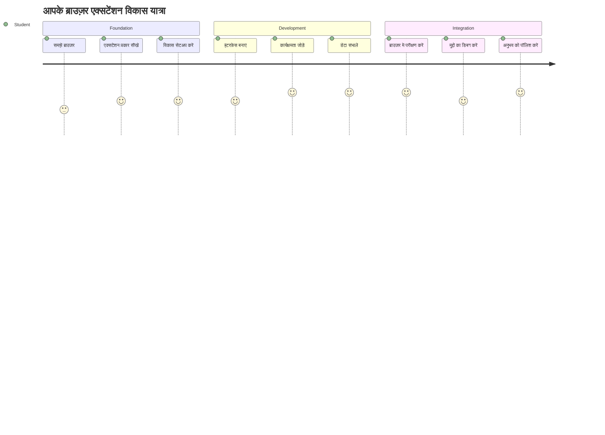
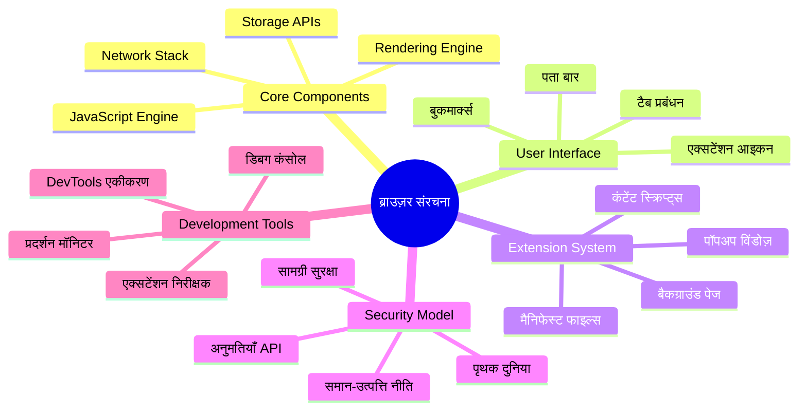
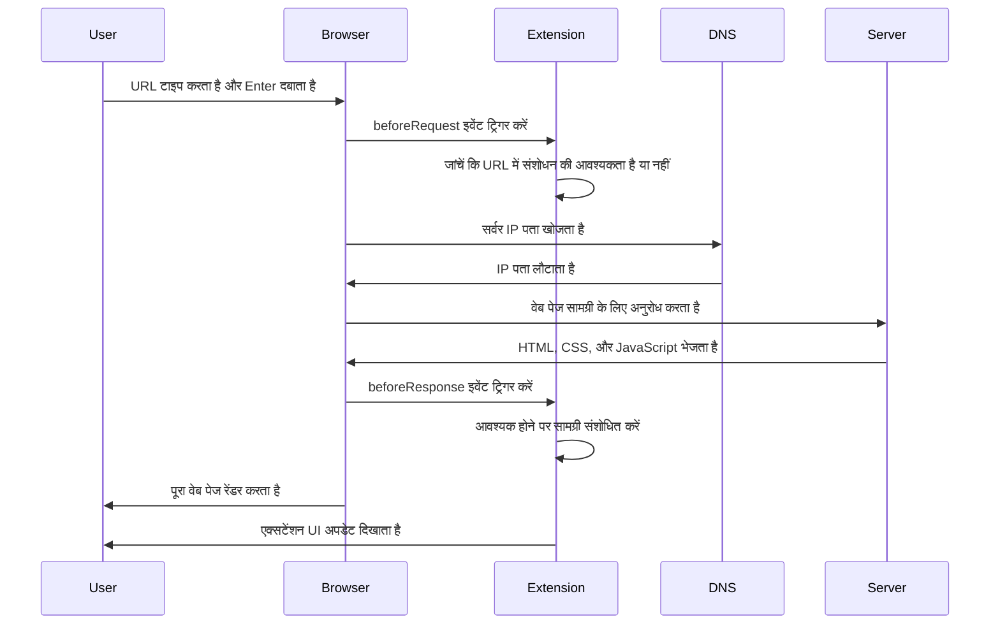
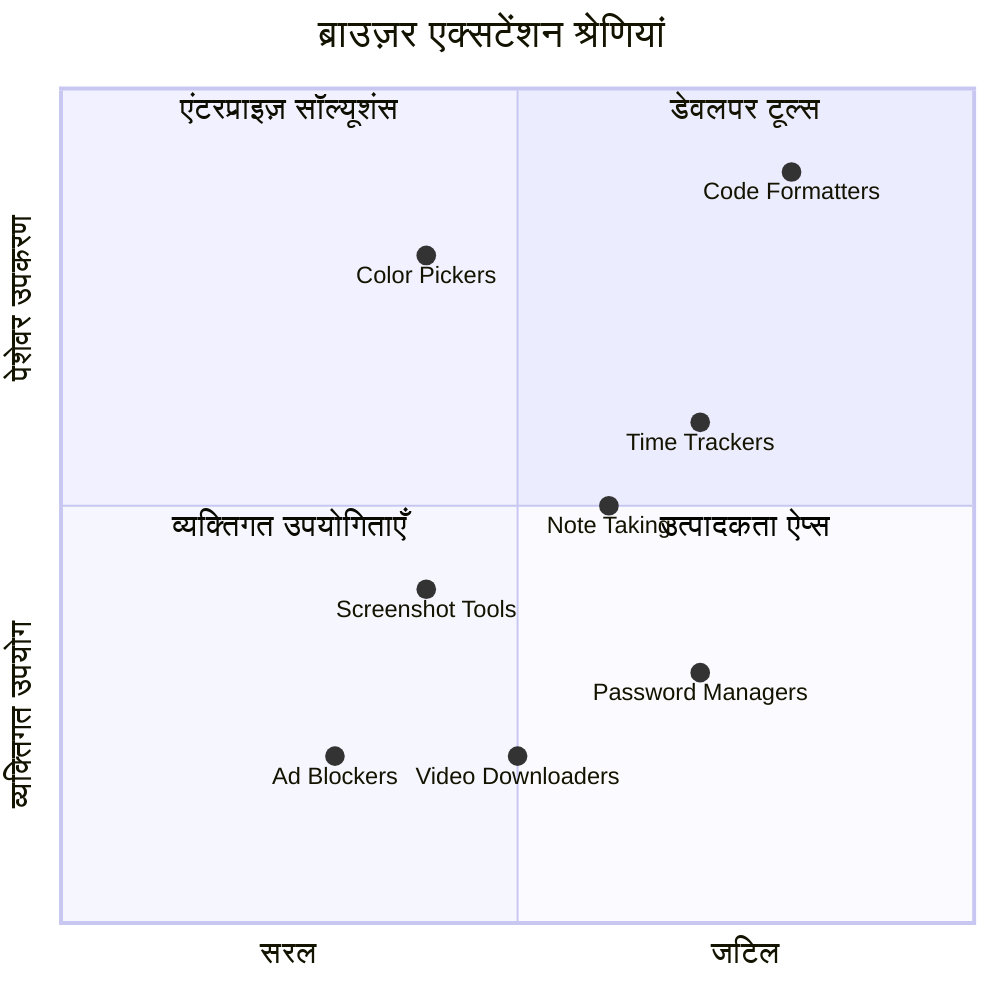
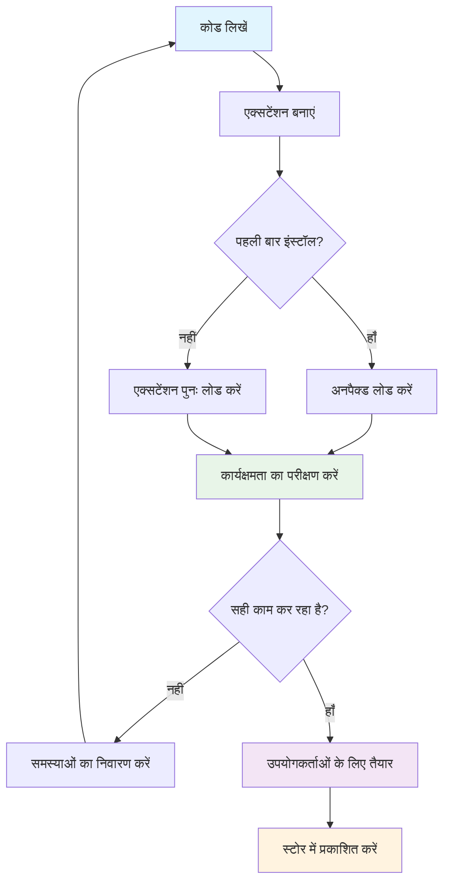
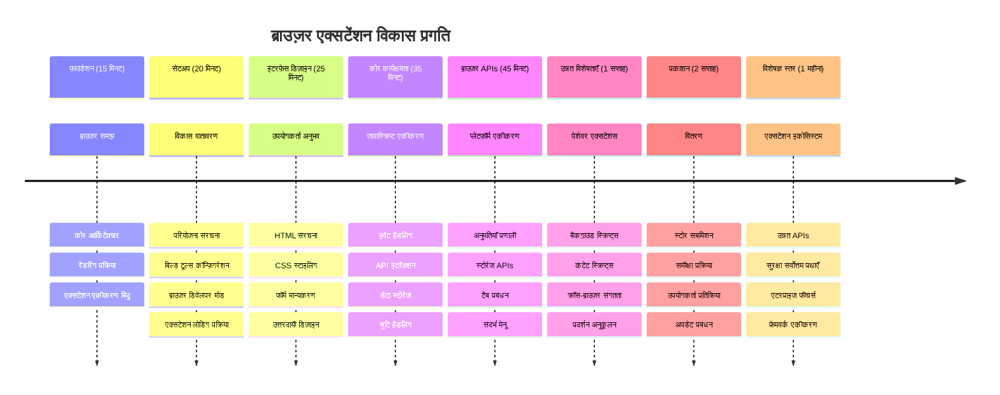

<!--
CO_OP_TRANSLATOR_METADATA:
{
  "original_hash": "00aa85715e1efd4930c17a23e3012e69",
  "translation_date": "2026-01-06T16:39:14+00:00",
  "source_file": "5-browser-extension/1-about-browsers/README.md",
  "language_code": "hi"
}
-->
# ब्राउज़र एक्सटेंशन प्रोजेक्ट भाग 1: ब्राउज़र्स के बारे में सब कुछ



> स्केचनोट द्वारा [Wassim Chegham](https://dev.to/wassimchegham/ever-wondered-what-happens-when-you-type-in-a-url-in-an-address-bar-in-a-browser-3dob)

## प्री-लेक्चर क्विज़

[प्री-लेक्चर क्विज़](https://ff-quizzes.netlify.app/web/quiz/23)

### परिचय

ब्राउज़र एक्सटेंशन्स छोटे-छोटे अनुप्रयोग होते हैं जो आपके वेब ब्राउज़िंग अनुभव को बेहतर बनाते हैं। जैसे टिम बर्नर्स-ली की मूल कल्पना एक इंटरैक्टिव वेब की थी, एक्सटेंशन्स ब्राउज़र की क्षमताओं को केवल साधारण दस्तावेज़ देखने से आगे बढ़ाते हैं। पासवर्ड प्रबंधकों से जो आपके खातों को सुरक्षित रखते हैं तक रंग चयनकों तक, जो डिजाइनरों को सही रंग लेने में मदद करते हैं, एक्सटेंशन्स रोज़मर्रा की ब्राउज़िंग चुनौतियों का समाधान करते हैं।

आपका पहला एक्सटेंशन बनाने से पहले, चलिए समझते हैं कि ब्राउज़र कैसे काम करते हैं। जैसे अलेक्जेंडर ग्राहम बेल को टेलीफोन आविष्कार करने से पहले ध्वनि संचरण समझना ज़रूरी था, वैसे ही ब्राउज़र के मूल सिद्धांत जानना आपको एक्सटेंशन्स बनाने में मदद करेगा जो मौजूदा ब्राउज़र सिस्टम के साथ सुचारू रूप से काम करें।

इस पाठ के अंत तक, आप ब्राउज़र आर्किटेक्चर समझेंगे और अपना पहला एक्सटेंशन बनाना शुरू कर देंगे।


## वेब ब्राउज़र्स को समझना

वेब ब्राउज़र मूल रूप से एक परिष्कृत दस्तावेज़ व्याख्याता होता है। जब आप पता पट्टी में "google.com" टाइप करते हैं, तो ब्राउज़र कई जटिल चरणों को पूरा करता है - दुनिया भर के सर्वरों से सामग्री का अनुरोध करना, फिर उस कोड को पार्स और रेंडर करना ताकि आप इंटरैक्टिव वेब पृष्ठ देख सकें।

यह प्रक्रिया उसी तरह है जैसे पहला वेब ब्राउज़र, WorldWideWeb, 1990 में टिम बर्नर्स-ली द्वारा डिज़ाइन किया गया था ताकि हाइपरलिंक्ड दस्तावेज़ सभी के लिए सुलभ हों।

✅ **थोड़ा इतिहास**: पहला ब्राउज़र 'WorldWideWeb' था और इसे सर टिमोथी बर्नर्स-ली ने 1990 में बनाया था।


> कुछ शुरुआती ब्राउज़र्स, द्वारा [Karen McGrane](https://www.slideshare.net/KMcGrane/week-4-ixd-history-personal-computing)

### ब्राउज़र्स वेब सामग्री को कैसे प्रोसेस करते हैं

यूआरएल दर्ज करने और webpage देखने के बीच की प्रक्रिया में कई समन्वित चरण होते हैं जो सेकंडों में होते हैं:


**यह प्रक्रिया क्या करती है:**
- **मानव-पठनीय** URL को DNS लुकअप के ज़रिए सर्वर IP एड्रेस में ट्रांसलेट करता है
- **HTTP या HTTPS प्रोटोकॉल** का उपयोग कर वेब सर्वर के साथ सुरक्षित कनेक्शन स्थापित करता है
- सर्वर से विशिष्ट वेब पेज सामग्री **अनुरोध करता है**
- सर्वर से HTML मार्कअप, CSS स्टाइलिंग, और जावास्क्रिप्ट कोड **प्राप्त करता है**
- सभी सामग्री को उस इंटरैक्टिव वेब पेज में **रेंडर करता है** जिसे आप देखते हैं

### ब्राउज़र के मुख्य फीचर्स

आधुनिक ब्राउज़र कई सुविधाएं प्रदान करते हैं जिनका उपयोग एक्सटेंशन डेवलपर्स कर सकते हैं:

| फीचर | उद्देश्य | एक्सटेंशन के अवसर |
|---------|---------|------------------------|
| **रेंडरिंग इंजन** | HTML, CSS, और जावास्क्रिप्ट दिखाना | सामग्री संशोधन, स्टाइलिंग इनजेक्शन |
| **जावास्क्रिप्ट इंजन** | जावास्क्रिप्ट कोड चलाना | कस्टम स्क्रिप्ट्स, API इंटरैक्शन |
| **लोकल स्टोरेज** | डेटा स्थानीय रूप से सहेजना | उपयोगकर्ता प्राथमिकताएं, कैश्ड डेटा |
| **नेटवर्क स्टैक** | वेब अनुरोधों को संभालना | अनुरोध मॉनिटरिंग, डेटा विश्लेषण |
| **सुरक्षा मॉडल** | उपयोगकर्ताओं को हानिकारक सामग्री से सुरक्षा | सामग्री फ़िल्टरिंग, सुरक्षा संवर्द्धन |

**इन फीचर्स को समझने से आप:**
- अपने एक्सटेंशन के लिए सबसे अधिक मूल्य कहां जोड़ सकते हैं, **पहचान सकते हैं**
- अपने एक्सटेंशन की कार्यक्षमता के लिए सही ब्राउज़र API चुन सकते हैं
- ब्राउज़र सिस्टम के साथ कुशलतापूर्वक काम करने वाले एक्सटेंशन्स डिजाइन कर सकते हैं
- यह सुनिश्चित कर सकते हैं कि आपका एक्सटेंशन ब्राउज़र की सुरक्षा सर्वोत्तम प्रथाओं का पालन करता है

### क्रॉस-ब्राउज़र डेवलपमेंट विचार

अलग-अलग ब्राउज़र मानकों को थोड़े-बहुत भिन्न तरीकों से लागू करते हैं, जैसे अलग-अलग प्रोग्रामिंग भाषाएं एक ही एल्गोरिदम को अलग तरह से संभालती हैं। Chrome, Firefox, और Safari के अलग-अलग गुण होते हैं जिनका विकास करते समय ध्यान रखना होता है।

> 💡 **प्रो टिप**: यह जांचने के लिए [caniuse.com](https://www.caniuse.com) का उपयोग करें कि विभिन्न ब्राउज़र्स में कौन सी वेब तकनीकें समर्थित हैं। यह आपके एक्सटेंशन की सुविधाओं की योजना बनाते समय बेहद मूल्यवान है!

**एक्सटेंशन विकास के लिए प्रमुख विचार:**
- अपने एक्सटेंशन का परीक्षण Chrome, Firefox, और Edge ब्राउज़रों पर करें
- अलग-अलग ब्राउज़र एक्सटेंशन API और मेनिफेस्ट फॉर्मेट के अनुसार अनुकूलन करें
- विभिन्न प्रदर्शन विशेषताओं और सीमाओं को संभालें
- ब्राउज़र-विशिष्ट फीचर्स के लिए फ़ैल्बैक प्रदान करें जो उपलब्ध नहीं हो सकते

✅ **विश्लेषण सूझाव**: आप वेब विकास परियोजनाओं में एनालिटिक्स पैकेज इंस्टॉल करके जान सकते हैं कि आपके उपयोगकर्ता किस ब्राउज़र को प्राथमिकता देते हैं। यह डेटा पहले किन ब्राउज़रों का समर्थन करना चाहिए यह निर्धारित करने में आपकी मदद करता है।

## ब्राउज़र एक्सटेंशन्स को समझना

ब्राउज़र एक्सटेंशन्स आम वेब ब्राउज़िंग चुनौतियों को हल करते हैं और ब्राउज़र इंटरफ़ेस में सीधे कार्यक्षमता जोड़ते हैं। अलग एप्लिकेशन या जटिल वर्कफ़्लोज़ की आवश्यकता के बजाय, एक्सटेंशन्स तुरंत उपकरणों और विशेषताओं तक पहुंच प्रदान करते हैं।

यह अवधारणा इस तरह है जैसे प्रारंभिक कंप्यूटर पायनियर डगलस एंगलबार्ट ने तकनीक के माध्यम से मानव क्षमताओं को बढ़ाने का लक्ष्य रखा था - एक्सटेंशन्स आपके ब्राउज़र की मूल कार्यक्षमता को बढ़ाते हैं।


**लोकप्रिय एक्सटेंशन श्रेणियां और उनके लाभ:**
- **उत्पादकता उपकरण**: टास्क मैनेजर्स, नोट-लेने वाले ऐप्स, और समय ट्रैकर जो आपको संगठित रखते हैं
- **सुरक्षा संवर्द्धन**: पासवर्ड मैनेजर, विज्ञापन ब्लॉकर्स, और गोपनीयता उपकरण जो आपके डेटा की सुरक्षा करते हैं
- **डेवलपर टूल्स**: कोड फॉर्मेटर्स, रंग चयनकर्ता, और डिबगिंग यूटिलिटीज जो विकास को सुगम बनाते हैं
- **सामग्री संवर्द्धन**: रीडिंग मोड, वीडियो डाउनलोडर, और स्क्रीनशॉट उपकरण जो आपके वेब अनुभव को बेहतर बनाते हैं

✅ **प्रतिबिंब प्रश्न**: आपके पसंदीदा ब्राउज़र एक्सटेंशन्स कौन से हैं? वे कौन से खास कार्य करते हैं, और वे आपके ब्राउज़िंग अनुभव को कैसे सुधारते हैं?

### 🔄 **शैक्षिक जांच**
**ब्राउज़र आर्किटेक्चर समझना**: एक्सटेंशन विकास पर जाने से पहले यह सुनिश्चित करें कि आप:
- ✅ समझा सकते हैं कि ब्राउज़र वेब अनुरोधों को कैसे प्रोसेस करते हैं और सामग्री कैसे रेंडर करते हैं
- ✅ ब्राउज़र आर्किटेक्चर के मुख्य घटकों की पहचान कर सकते हैं
- ✅ समझ सकते हैं कि एक्सटेंशन्स ब्राउज़र कार्यक्षमता के साथ कैसे एकीकृत होते हैं
- ✅ पहचान सकते हैं कि उपयोगकर्ताओं की सुरक्षा के लिए सुरक्षा मॉडल कैसे काम करता है

**त्वरित आत्म-परीक्षा**: क्या आप यूआरएल टाइप करने से लेकर वेबपेज देखने तक के रास्ते को समझा सकते हैं?
1. **DNS लुकअप** URL को IP एड्रेस में बदलता है
2. **HTTP अनुरोध** सर्वर से सामग्री प्राप्त करता है
3. **पार्सिंग** HTML, CSS, और जावास्क्रिप्ट को प्रोसेस करता है
4. **रेंडरिंग** अंतिम वेबपेज दिखाता है
5. **एक्सटेंशन्स** कई चरणों में सामग्री को संशोधित कर सकते हैं

## एक्सटेंशन्स इंस्टॉल और प्रबंधित करना

एक्सटेंशन इंस्टॉलेशन प्रक्रिया को समझना आपको यह पूर्वानुमान लगाने में मदद करता है कि उपयोगकर्ता आपके एक्सटेंशन को इंस्टॉल करते समय क्या अनुभव करेंगे। इंस्टॉलेशन प्रक्रिया आधुनिक ब्राउज़रों में मानकीकृत है, इंटरफ़ेस डिज़ाइन में केवल मामूली अंतर होते हैं।


> **महत्वपूर्ण**: सुनिश्चित करें कि "डेवलपर मोड" चालू है और जब अपने एक्सटेंशन्स का परीक्षण कर रहे हों तो अन्य स्टोर से एक्सटेंशन्स की अनुमति दें।

### विकास एक्सटेंशन इंस्टॉलेशन प्रक्रिया

जब आप अपने स्वयं के एक्सटेंशन्स विकसित और परीक्षण कर रहे हों, तो इस कार्यप्रवाह का पालन करें:


```bash
# चरण 1: अपना एक्सटेंशन बनाएं
npm run build
```

**यह कमांड क्या करता है:**
- आपके स्रोत कोड को ब्राउज़र-तैयार फ़ाइलों में **कंपाइल करता है**
- जावास्क्रिप्ट मॉड्यूल्स को ऑप्टिमाइज़्ड पैकेजों में **बंडल करता है**
- `/dist` फ़ोल्डर में अंतिम एक्सटेंशन फ़ाइलें **जनरेट करता है**
- आपके एक्सटेंशन को इंस्टॉल और परीक्षण के लिए **तैयार करता है**

**चरण 2: ब्राउज़र एक्सटेंशन्स पर जाएं**
1. अपने ब्राउज़र के एक्सटेंशन्स प्रबंधन पृष्ठ को **खोलें**
2. ऊपर दाएं कोने में "सेटिंग्स और अन्य" बटन (`...` आइकन) पर **क्लिक करें**
3. ड्रॉपडाउन मेनू से "Extensions" चुनें

**चरण 3: अपना एक्सटेंशन लोड करें**
- **नई इंस्टॉलेशन्स के लिए**: `load unpacked` चुनें और अपनी `/dist` फ़ोल्डर का चयन करें
- **अपडेट्स के लिए**: अपने पहले से इंस्टॉल किए एक्सटेंशन के पास `reload` पर क्लिक करें
- **परीक्षण के लिए**: "डेवलपर मोड" को सक्षम करें ताकि अतिरिक्त डिबगिंग विकल्प मिल सकें

### प्रोडक्शन एक्सटेंशन इंस्टॉलेशन

> ✅ **नोट**: ये विकास निर्देश केवल उन एक्सटेंशन्स के लिए हैं जिन्हें आप खुद बनाते हैं। प्रकाशित एक्सटेंशन्स इंस्टॉल करने के लिए आधिकारिक ब्राउज़र एक्सटेंशन स्टोर देखें जैसे [Microsoft Edge Add-ons store](https://microsoftedge.microsoft.com/addons/Microsoft-Edge-Extensions-Home)।

**फर्क को समझना:**
- **विकास इंस्टॉलेशन्स** आपको विकास के दौरान अप्रकाशित एक्सटेंशन्स का परीक्षण करने देते हैं
- **स्टोर इंस्टॉलेशन्स** स्वीकृत, प्रकाशित एक्सटेंशन्स होते हैं जिनमें स्वचालित अपडेट्स होते हैं
- **साइडलोडिंग** आधिकारिक स्टोर के बाहर से एक्सटेंशन्स इंस्टॉल करने की अनुमति देता है (डेवलपर मोड आवश्यक)

## अपना कार्बन फुटप्रिंट एक्सटेंशन बनाना

हम एक ऐसा ब्राउज़र एक्सटेंशन बनाएंगे जो आपके क्षेत्र के ऊर्जा उपयोग के कार्बन फुटप्रिंट को प्रदर्शित करता है। यह परियोजना एक्सटेंशन विकास की मौलिक अवधारणाओं को दर्शाती है और पर्यावरण जागरूकता के लिए एक व्यावहारिक उपकरण बनाती है।

यह दृष्टिकोण "करके सीखने" के सिद्धांत का अनुसरण करता है, जो जॉन ड्यूवी की शैक्षिक थ्योरी से प्रभावी साबित हुआ है - तकनीकी कौशल को सार्थक वास्तविक दुनिया के अनुप्रयोगों के साथ जोड़ना।

### परियोजना आवश्यकताएं

विकास शुरू करने से पहले, आवश्यक संसाधनों और निर्भरताओं को एकत्र करें:

**आवश्यक API एक्सेस:**
- **[CO2 Signal API key](https://www.co2signal.com/)**: अपनी ईमेल दर्ज करें और अपना मुफ्त API key प्राप्त करें
- **[Region code](http://api.electricitymap.org/v3/zones)**: [Electricity Map](https://www.electricitymap.org/map) से अपने क्षेत्र का कोड खोजें (उदाहरण के लिए, बोस्टन का कोड 'US-NEISO' है)

**डेवलपमेंट टूल्स:**
- **[Node.js और NPM](https://www.npmjs.com)**: परियोजना निर्भरताओं को इंस्टॉल करने के लिए पैकेज प्रबंधन टूल
- **[स्टार्टर कोड](../../../../5-browser-extension/start)**: विकास शुरू करने के लिए `start` फ़ोल्डर डाउनलोड करें

✅ **अधिक जानें**: पैकेज प्रबंधन कौशल बढ़ाने के लिए यह [व्यापक Learn मॉड्यूल](https://docs.microsoft.com/learn/modules/create-nodejs-project-dependencies/?WT.mc_id=academic-77807-sagibbon) देखें

### परियोजना संरचना को समझना

परियोजना की संरचना को समझना विकास कार्य को प्रभावी ढंग से व्यवस्थित करने में मदद करता है। जैसे कि अलेक्जेंड्रिया की लाइब्रेरी को ज्ञान पुनःप्राप्ति के लिए व्यवस्थित किया गया था, वैसे ही एक सुव्यवस्थित कोडबेस विकास को अधिक कुशल बनाता है:

```
project-root/
├── dist/                    # Built extension files
│   ├── manifest.json        # Extension configuration
│   ├── index.html           # User interface markup
│   ├── background.js        # Background script functionality
│   └── main.js              # Compiled JavaScript bundle
├── src/                     # Source development files
│   └── index.js             # Your main JavaScript code
├── package.json             # Project dependencies and scripts
└── webpack.config.js        # Build configuration
```

**प्रत्येक फ़ाइल क्या करती है:**
- **`manifest.json`**: एक्सटेंशन मेटाडेटा, अनुमतियों, और प्रवेश बिंदुओं को परिभाषित करता है
- **`index.html`**: उस यूजर इंटरफ़ेस को बनाता है जो उपयोगकर्ताओं द्वारा एक्सटेंशन पर क्लिक करने पर दिखाई देता है
- **`background.js`**: पृष्ठभूमि कार्यों और ब्राउज़र इवेंट लिस्नर्स को संभालता है
- **`main.js`**: बिल्ड प्रक्रिया के बाद अंतिम बंडल्ड जावास्क्रिप्ट होता है
- **`src/index.js`**: आपका मुख्य विकास कोड जिसमें से `main.js` बनाया जाता है

> 💡 **संगठन टिप**: विकास के दौरान आसान संदर्भ के लिए अपनी API key और क्षेत्र कोड को एक सुरक्षित नोट में स्टोर करें। आपको इन्हें अपने एक्सटेंशन की कार्यक्षमता का परीक्षण करने के लिए चाहिए होगा।

✅ **सुरक्षा नोट**: API keys या संवेदनशील क्रेडेंशियल्स को कभी भी अपने कोड रिपॉजिटरी में कमिट न करें। हम अगली स्टेप्स में इनको सुरक्षित रखने के तरीके दिखाएंगे।

## एक्सटेंशन इंटरफ़ेस बनाना

अब हम यूजर इंटरफ़ेस घटक बनाएंगे। यह एक्सटेंशन दो स्क्रीन वाला 접근 अपनाता है: शुरूआती सेटअप के लिए एक कॉन्फ़िगरेशन स्क्रीन और डेटा डिस्प्ले के लिए एक परिणाम स्क्रीन।

यह इंटरफ़ेस डिज़ाइन में प्रयुक्त प्रोग्रेसिव डिसक्लोज़र सिद्धांत का पालन करता है - जानकारी और विकल्पों को क्रमबद्ध रूप से खोलना ताकि उपयोगकर्ता अभिभूत न हों।

### एक्सटेंशन व्यूज़ का अवलोकन

**सेटअप व्यू** - पहली बार उपयोगकर्ता की कॉन्फ़िगरेशन:


**परिणाम व्यू** - कार्बन पदचिह्न डेटा प्रदर्शन:


### कॉन्फ़िगरेशन फॉर्म बनाना

सेटअप फॉर्म पहली बार उपयोग के दौरान उपयोगकर्ता कॉन्फ़िगरेशन डेटा जमा करता है। सेटअप पूरा होने पर यह जानकारी ब्राउज़र स्टोरेज में भविष्य के सत्रों के लिए बनी रहती है।

`/dist/index.html` फ़ाइल में इस फॉर्म संरचना को जोड़ें:

```html
<form class="form-data" autocomplete="on">
    <div>
        <h2>New? Add your Information</h2>
    </div>
    <div>
        <label for="region">Region Name</label>
        <input type="text" id="region" required class="region-name" />
    </div>
    <div>
        <label for="api">Your API Key from tmrow</label>
        <input type="text" id="api" required class="api-key" />
    </div>
    <button class="search-btn">Submit</button>
</form>
```

**यह फॉर्म क्या करता है:**
- उचित लेबल और इनपुट संबधों के साथ एक सैमान्टिक फॉर्म संरचना बनाता है
- बेहतर उपयोगकर्ता अनुभव के लिए ब्राउज़र ऑटोकंप्लीट सुविधा सक्षम करता है
- सबमिशन से पहले दोनों फ़ील्ड भरना आवश्यक करता है (`required` एट्रिब्यूट का उपयोग)
- आसान स्टाइलिंग और जावास्क्रिप्ट टार्गेटिंग के लिए इनपुट को वर्णनात्मक क्लास नामों से व्यवस्थित करता है
- उपयोगकर्ताओं को जो पहली बार एक्सटेंशन सेट कर रहे हैं, उन्हें स्पष्ट निर्देश प्रदान करता है

### परिणाम प्रदर्शित करना बनाना

अगले, परिणाम क्षेत्र बनाएँ जो कार्बन फुटप्रिंट डेटा दिखाएगा। फॉर्म के नीचे यह HTML जोड़ें:

```html
<div class="result">
    <div class="loading">loading...</div>
    <div class="errors"></div>
    <div class="data"></div>
    <div class="result-container">
        <p><strong>Region: </strong><span class="my-region"></span></p>
        <p><strong>Carbon Usage: </strong><span class="carbon-usage"></span></p>
        <p><strong>Fossil Fuel Percentage: </strong><span class="fossil-fuel"></span></p>
    </div>
    <button class="clear-btn">Change region</button>
</div>
```

**यह संरचना क्या प्रदान करती है:**
- **`loading`**: API डेटा प्राप्त करते समय लोडिंग संदेश दिखाता है
- **`errors`**: यदि API कॉल विफल हों या डेटा अमान्य हो तो त्रुटि संदेश दिखाता है
- **`data`**: विकास के दौरान डिबगिंग के लिए कच्चा डेटा रखता है
- **`result-container`**: उपयोगकर्ताओं को स्वरूपित कार्बन फुटप्रिंट जानकारी प्रस्तुत करता है
- **`clear-btn`**: उपयोगकर्ताओं को अपना क्षेत्र बदलने और एक्सटेंशन को पुनः कॉन्फ़िगर करने की अनुमति देता है

### बिल्ड प्रक्रिया सेट करना

अब परियोजना निर्भरताओं को इंस्टॉल करें और बिल्ड प्रक्रिया का परीक्षण करें:

```bash
npm install
```

**यह इंस्टॉलेशन प्रक्रिया क्या करती है:**
- `package.json` में निर्दिष्ट वेबपैक और अन्य विकास निर्भरताओं को डाउनलोड करती है
- आधुनिक जावास्क्रिप्ट को कंपाइल करने के लिए बिल्ड टूलचेन को कॉन्फ़िगर करती है
- एक्सटेंशन बनाने और परीक्षण के लिए विकास वातावरण तैयार करता है
- कोड बंडलिंग, अनुकूलन, और क्रॉस-ब्राउज़र संगतता सुविधाएं सक्षम करती है

> 💡 **बिल्ड प्रक्रिया का ज्ञान**: वेबपैक आपके स्रोत कोड को `/src/index.js` से `/dist/main.js` में बंडल करता है। यह प्रक्रिया आपके कोड को उत्पादन के लिए अनुकूलित करती है और ब्राउज़र संगतता सुनिश्चित करती है।

### अपनी प्रगति का परीक्षण करें

इस बिंदु पर, आप अपना एक्सटेंशन परीक्षण कर सकते हैं:
1. **रन करें** बिल्ड कमांड ताकि आपका कोड संकलित हो
2. **लोड करें** डेवलपर मोड में अपने ब्राउज़र में एक्सटेंशन
3. **सत्यापित करें** कि फॉर्म सही ढंग से प्रदर्शित हो रहा है और पेशेवर दिखता है
4. **जांचें** कि सभी फॉर्म तत्व ठीक से संरेखित और कार्यशील हैं

**आपने जो हासिल किया है:**
- **बनाया** अपने एक्सटेंशन के लिए बुनियादी HTML संरचना
- **निर्मित किया** कॉन्फ़िगरेशन और परिणाम इंटरफेस सही सेमांटिक मार्कअप के साथ
- **सेट अप किया** एक आधुनिक विकास कार्य प्रवाह उद्योग-मानक उपकरणों का उपयोग करके
- **तैयार किया** इंटरएक्टिव जावास्क्रिप्ट कार्यक्षमता जोड़ने के लिए आधार

### 🔄 **शैक्षिक चेक-इन**
**एक्सटेंशन विकास प्रगति**: जारी रखने से पहले अपनी समझ की पुष्टि करें:
- ✅ क्या आप परियोजना संरचना में प्रत्येक फ़ाइल के उद्देश्य को समझा सकते हैं?
- ✅ क्या आप समझते हैं कि बिल्ड प्रक्रिया आपके स्रोत कोड को कैसे बदलती है?
- ✅ हम कॉन्फ़िगरेशन और परिणामों को अलग-अलग यूआई सेक्शनों में क्यों विभाजित करते हैं?
- ✅ फॉर्म संरचना उपयोगिता और पहुँच दोनों को कैसे समर्थन देती है?

**विकास कार्यप्रवाह की समझ**: अब आपको सक्षम होना चाहिए:
1. **परिवर्तन करें** HTML और CSS में अपने एक्सटेंशन इंटरफ़ेस के लिए
2. **रन करें** बिल्ड कमांड अपनी परिवर्तनों को संकलित करने के लिए
3. **रीलोड करें** एक्सटेंशन अपने ब्राउज़र में अपडेट्स जांचने के लिए
4. **डिबग करें** समस्याओं को ब्राउज़र डेवलपर टूल्स का उपयोग करके

आपने ब्राउज़र एक्सटेंशन विकास के पहले चरण को पूरा कर लिया है। जिस तरह राइट ब्रदर्स को उड़ान पाने से पहले एयरोडायनामिक्स को समझना पड़ा, उसी तरह इन बुनियादी अवधारणाओं को समझना आपको अगली पाठ में अधिक जटिल इंटरएक्टिव फीचर्स बनाने के लिए तैयार करता है।

## GitHub Copilot एजेंट चुनौती 🚀

एजेंट मोड का उपयोग करके निम्नलिखित चुनौती पूरी करें:

**विवरण:** ब्राउज़र एक्सटेंशन को बढ़ाएं फॉर्म वैधता और उपयोगकर्ता प्रतिक्रिया सुविधाएँ जोड़कर ताकि API कुंजी और क्षेत्र कोड दर्ज करते समय उपयोगकर्ता अनुभव बेहतर हो।

**प्रॉम्प्ट:** जावास्क्रिप्ट सत्यापन फ़ंक्शन बनाएं जो जांचे कि API कुंजी फ़ील्ड में कम से कम 20 अक्षर हैं और क्षेत्र कोड सही फॉर्मेट (जैसे 'US-NEISO') का पालन करता है। वैध इनपुट के लिए इनपुट बॉर्डर का रंग हरा और अमान्य इनपुट के लिए लाल करें। साथ ही सुरक्षा के लिए API कुंजी दिखाने/छिपाने के लिए टॉगल सुविधा भी जोड़ें।

अधिक जानें [agent mode](https://code.visualstudio.com/blogs/2025/02/24/introducing-copilot-agent-mode) के बारे में।

## 🚀 चुनौती

किसी ब्राउज़र एक्सटेंशन स्टोर को देखें और एक एक्सटेंशन अपने ब्राउज़र में इंस्टॉल करें। आप इसके फ़ाइलों को रोचक तरीकों से देख सकते हैं। आपने क्या खोजा?

## पोस्ट-लेक्चर क्विज़

[पोस्ट-लेक्चर क्विज़](https://ff-quizzes.netlify.app/web/quiz/24)

## समीक्षा एवं स्व-अध्ययन

इस पाठ में आपने वेब ब्राउज़र के इतिहास के बारे में थोड़ा जाना; इस अवसर का उपयोग करें और पढ़ें कि विश्वव्यापी वेब के आविष्कारकों ने इसके उपयोग की कल्पना कैसे की थी। कुछ उपयोगी साइटें हैं:

[वेब ब्राउज़र्स का इतिहास](https://www.mozilla.org/firefox/browsers/browser-history/)

[वेब का इतिहास](https://webfoundation.org/about/vision/history-of-the-web/)

[टिम बर्नर्स-ली के साथ एक इंटरव्यू](https://www.theguardian.com/technology/2019/mar/12/tim-berners-lee-on-30-years-of-the-web-if-we-dream-a-little-we-can-get-the-web-we-want)

### ⚡ **आप अगले 5 मिनट में क्या कर सकते हैं**
- [ ] क्रोम/एज एक्सटेंशन्स पेज (chrome://extensions) खोलें और देखें आपने क्या इंस्टॉल किया है
- [ ] वेबपेज लोड करते समय अपने ब्राउज़र के देवटूल्स के नेटवर्क टैब को देखें
- [ ] पेज सोर्स देखें (Ctrl+U) HTML संरचना देखने के लिए
- [ ] किसी भी वेबपेज तत्व का निरीक्षण करें और देवटूल्स में उसका CSS बदलें

### 🎯 **आप इस घंटे में क्या प्राप्त कर सकते हैं**
- [ ] पोस्ट-लेसन क्विज़ पूरा करें और ब्राउज़र मूल बातें समझें
- [ ] ब्राउज़र एक्सटेंशन के लिए एक बेसिक manifest.json फ़ाइल बनाएं
- [ ] एक साधारण "Hello World" एक्सटेंशन बनाएं जो पॉपअप दिखाता है
- [ ] डेवलपर मोड में अपना एक्सटेंशन लोड करके टेस्ट करें
- [ ] अपने लक्ष्य ब्राउज़र के लिए एक्सटेंशन दस्तावेज़ीकरण एक्स्प्लोर करें

### 📅 **आपका सप्ताह-दिवसीय एक्सटेंशन सफर**
- [ ] एक कार्यात्मक ब्राउज़र एक्सटेंशन बनाएं जो वास्तविक उपयोगिता प्रदान करे
- [ ] कंटेंट स्क्रिप्ट्स, बैकग्राउंड स्क्रिप्ट्स, और पॉपअप इंटरेक्शन के बारे में जानें
- [ ] ब्राउज़र APIs जैसे स्टोरेज, टैब्स, और मैसेजिंग में महारत हासिल करें
- [ ] अपने एक्सटेंशन के लिए उपयोगकर्ता-मित्र इंटरफेस डिज़ाइन करें
- [ ] अपने एक्सटेंशन का विभिन्न वेबसाइट्स और परिस्थितियों में परीक्षण करें
- [ ] अपने एक्सटेंशन को ब्राउज़र के एक्सटेंशन स्टोर में प्रकाशित करें

### 🌟 **आपका महीने-दिवसीय ब्राउज़र विकास**
- [ ] कई एक्सटेंशन्स बनाएं जो विभिन्न उपयोगकर्ता समस्याओं को हल करें
- [ ] उन्नत ब्राउज़र APIs और सुरक्षा सर्वोत्तम अभ्यास सीखें
- [ ] ओपन सोर्स ब्राउज़र एक्सटेंशन प्रोजेक्ट्स में योगदान दें
- [ ] क्रॉस-ब्राउज़र संगतता और प्रगतिशील संवर्धन में महारत हासिल करें
- [ ] अन्य डेवलपर्स के लिए एक्सटेंशन विकास टूल्स और टेम्पलेट बनाएं
- [ ] एक एक्सटेंशन विशेषज्ञ बनें जो अन्य डेवलपर्स की सहायता करता है

## 🎯 आपका ब्राउज़र एक्सटेंशन मास्टरी टाइमलाइन


### 🛠️ आपके एक्सटेंशन विकास टूलकिट का सारांश

इस पाठ को पूरा करने के बाद, आपके पास अब है:
- **ब्राउज़र आर्किटेक्चर ज्ञान**: रेंडरिंग इंजन, सुरक्षा मॉडल, और एक्सटेंशन एकीकरण की समझ
- **विकास पर्यावरण**: वेबपैक, NPM, और डिबगिंग क्षमताओं के साथ आधुनिक टूलचेन
- **UI/UX आधार**: प्रगतिशील खुलासे पैटर्न के साथ सिमेंटिक HTML संरचना
- **सुरक्षा जागरूकता**: ब्राउज़र अनुमतियों और सुरक्षित विकास प्रथाओं की समझ
- **क्रॉस-ब्राउज़र अवधारणाएं**: संगतता विचार और परीक्षण दृष्टिकोणों का ज्ञान
- **API एकीकरण**: बाहरी डेटा स्रोतों के साथ काम करने की नींव
- **पेशेवर कार्यप्रवाह**: उद्योग-मानक विकास और परीक्षण प्रक्रियाएं

**वास्तविक विश्व अनुप्रयोग**: ये कौशल सीधे लागू होते हैं:
- **वेब विकास**: सिंगल-पेज एप्लिकेशन और प्रगतिशील वेब ऐप्स
- **डेस्कटॉप एप्लिकेशन**: इलेक्ट्रॉन और वेब-आधारित डेस्कटॉप सॉफ़्टवेयर
- **मोबाइल विकास**: हाइब्रिड ऐप्स और वेब-आधारित मोबाइल समाधान
- **एंटरप्राइज़ टूल्स**: आंतरिक उत्पादकता एप्लिकेशंस और कार्यप्रवाह स्वचालन
- **ओपन सोर्स**: ब्राउज़र एक्सटेंशन प्रोजेक्ट्स और वेब मानकों में योगदान

**अगला स्तर**: आप इंटरएक्टिव कार्यक्षमता जोड़ने, ब्राउज़र APIs के साथ काम करने, और ऐसे एक्सटेंशन्स बनाने के लिए तैयार हैं जो वास्तविक उपयोगकर्ता समस्याओं को हल करें!

## असाइनमेंट

[अपने एक्सटेंशन को पुनःस्टाइल करें](assignment.md)

---

<!-- CO-OP TRANSLATOR DISCLAIMER START -->
**अस्वीकरण**:  
इस दस्तावेज़ का अनुवाद एआई अनुवाद सेवा [Co-op Translator](https://github.com/Azure/co-op-translator) का उपयोग करके किया गया है। जबकि हम सटीकता के लिए प्रयासरत हैं, कृपया ध्यान रखें कि स्वचालित अनुवादों में त्रुटियाँ या असंगतियाँ हो सकती हैं। मूल दस्तावेज़ उसकी मूल भाषा में प्रामाणिक स्रोत माना जाना चाहिए। महत्वपूर्ण जानकारी के लिए, पेशेवर मानव अनुवाद की सिफारिश की जाती है। इस अनुवाद के उपयोग से उत्पन्न किसी भी गलतफहमी या गलत व्याख्या के लिए हम जिम्मेदार नहीं हैं।
<!-- CO-OP TRANSLATOR DISCLAIMER END -->