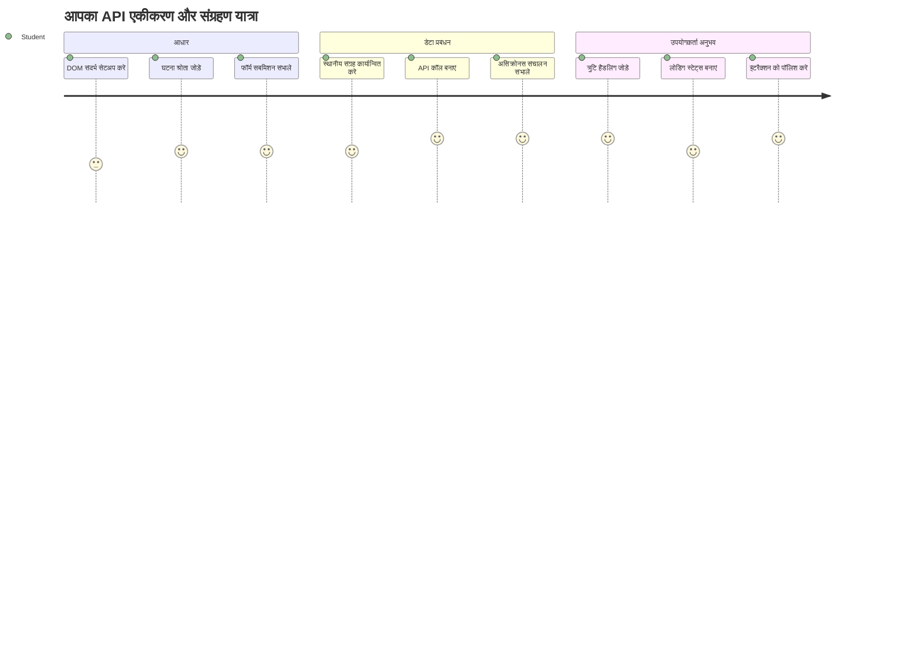
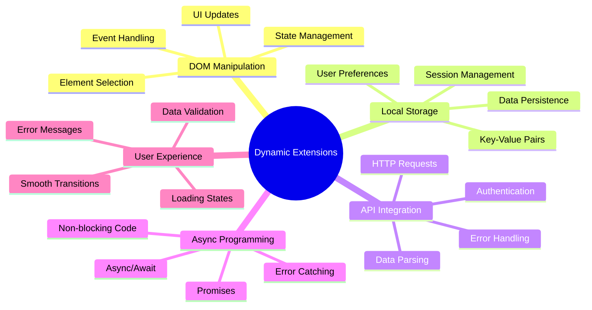
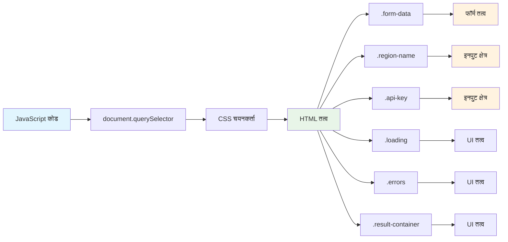
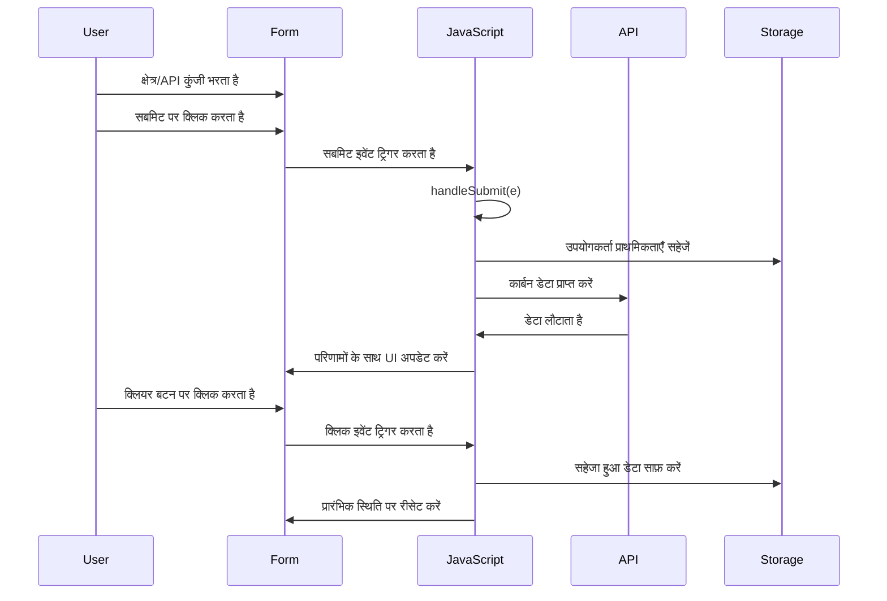
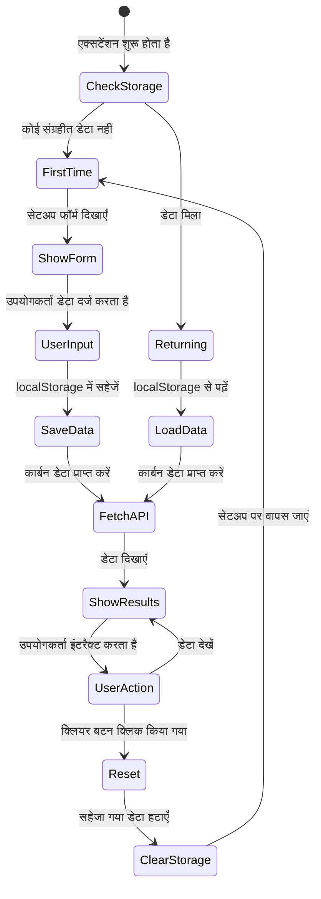
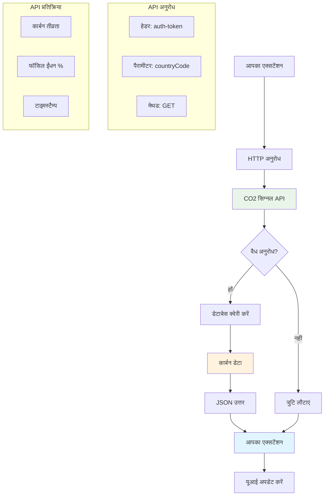
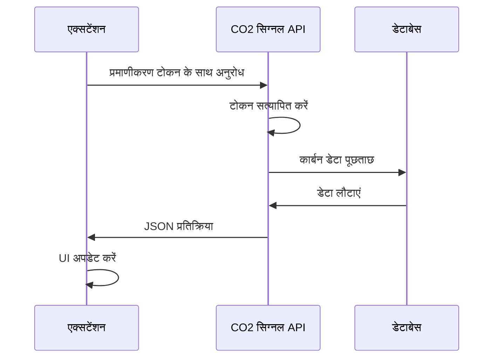
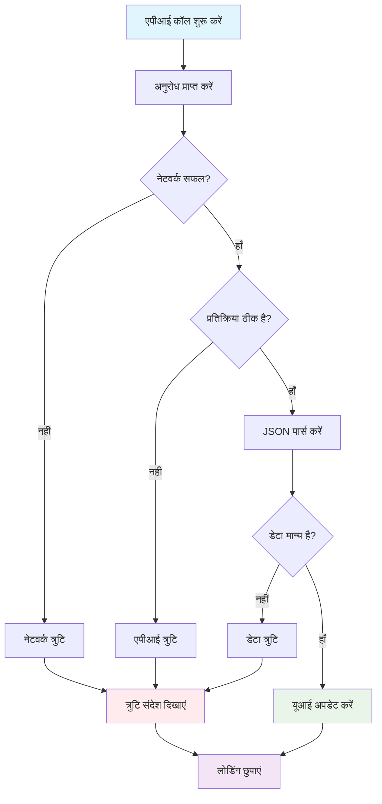
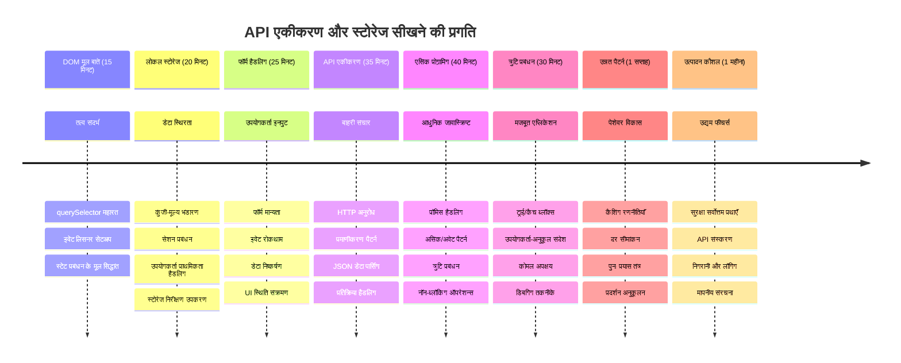

<!--
CO_OP_TRANSLATOR_METADATA:
{
  "original_hash": "2b6203a48c48d8234e0948353b47d84e",
  "translation_date": "2026-01-06T16:32:54+00:00",
  "source_file": "5-browser-extension/2-forms-browsers-local-storage/README.md",
  "language_code": "hi"
}
-->
# ब्राउज़र एक्सटेंशन प्रोजेक्ट भाग 2: एक API कॉल करें, लोकल स्टोरेज का उपयोग करें


## प्री-लेक्चर क्विज़

[प्री-लेक्चर क्विज़](https://ff-quizzes.netlify.app/web/quiz/25)

## परिचय

याद है वह ब्राउज़र एक्सटेंशन जिसकी आपने शुरुआत की थी? अभी आपके पास एक अच्छा दिखने वाला फ़ॉर्म है, लेकिन यह मूल रूप से स्थिर है। आज हम इसे जीवन्त बनाएंगे असली डेटा से जोड़कर और इसे याददाश्त देंगे।

सोचें अपोलो मिशन कंट्रोल कम्प्यूटर्स के बारे में - वे सिर्फ स्थिर जानकारी प्रदर्शित नहीं करते थे। वे लगातार अंतरिक्ष यान से संवाद करते थे, टेलीमेट्री डेटा के साथ अपडेट होते थे, और महत्वपूर्ण मिशन पैरामीटर्स को याद रखते थे। आज हम ऐसी ही गतिशील व्यवहार बना रहे हैं। आपका एक्सटेंशन इंटरनेट से वास्तविक पर्यावरणीय डेटा प्राप्त करेगा, और आपकी सेटिंग्स को अगली बार के लिए याद रखेगा।

API एकीकरण जटिल लग सकता है, लेकिन वास्तव में यह आपके कोड को अन्य सेवाओं से संवाद करना सिखाने जैसा है। चाहे आप मौसम डेटा ला रहे हों, सोशल मीडिया फीड्स या आज हम जो करेंगे, कार्बन फुटप्रिंट जानकारी, सभी डिजिटल कनेक्शन स्थापित करने के बारे में है। हम यह भी देखेंगे कि ब्राउज़र कैसे जानकारी को स्थायी बना सकते हैं - जैसे पुस्तकालय कार्ड कैटलॉग का उपयोग करते हैं यह याद रखने के लिए कि किताबें कहाँ रखी हैं।

इस पाठ के अंत तक, आपके पास एक ब्राउज़र एक्सटेंशन होगा जो वास्तविक डेटा लाता है, उपयोगकर्ता प्राथमिकताएँ संग्रहीत करता है, और एक सहज अनुभव प्रदान करता है। चलिए शुरू करते हैं!


✅ उचित फ़ाइलों में क्रमांकित हिस्सों का पालन करें ताकि पता चले कि कोड कहाँ रखना है

## एक्सटेंशन में नियंत्रण करने के लिए तत्व सेट करें

आपके जावास्क्रिप्ट को इंटरफेस में बदलाव करने से पहले, इसे विशेष HTML तत्वों के संदर्भ चाहिए। इसे ऐसे समझें जैसे टेलीस्कोप को विशिष्ट तारों की तरफ मोड़ना - गैलीलियो ने बृहस्पति के चंद्रमाओं का अध्ययन करने से पहले बृहस्पति को ढूंढकर फोकस करना पड़ा था।

आपकी `index.js` फाइल में, हम `const` वेरिएबल बनाएंगे जो प्रत्येक महत्वपूर्ण फॉर्म तत्व के संदर्भों को कैप्चर करेंगे। यह वैसे ही है जैसे वैज्ञानिक अपने उपकरणों को लेबल करते हैं - हर बार पूरे प्रयोगशाला में खोजने के बजाय, वे सीधे उस तक पहुँच सकते हैं जिसकी उन्हें जरूरत है।


```javascript
// फ़ॉर्म फ़ील्ड्स
const form = document.querySelector('.form-data');
const region = document.querySelector('.region-name');
const apiKey = document.querySelector('.api-key');

// परिणाम
const errors = document.querySelector('.errors');
const loading = document.querySelector('.loading');
const results = document.querySelector('.result-container');
const usage = document.querySelector('.carbon-usage');
const fossilfuel = document.querySelector('.fossil-fuel');
const myregion = document.querySelector('.my-region');
const clearBtn = document.querySelector('.clear-btn');
```

**यह कोड क्या करता है:**
- **कैप्चर करता है** `document.querySelector()` के साथ CSS क्लास सेलेक्टर्स उपयोग करके फॉर्म तत्वों को
- **निर्माण करता है** क्षेत्र नाम और API कुंजी के इनपुट फ़ील्ड्स के संदर्भ
- **स्थापित करता है** परिणाम प्रदर्शन तत्वों को कार्बन उपयोग डेटा के लिए
- **सेटअप करता है** लोडिंग इंडिकेटर और त्रुटि संदेश जैसे UI तत्वों तक पहुँच
- **संग्रहित करता है** प्रत्येक तत्व का संदर्भ एक `const` वेरिएबल में ताकि पूरे कोड में आसानी से पुनः उपयोग किया जा सके

## इवेंट लिसनर्स जोड़ें

अब हम आपके एक्सटेंशन को उपयोगकर्ता क्रियाओं के प्रति प्रतिक्रियाशील बनाएंगे। इवेंट लिसनर्स आपके कोड का तरीका हैं उपयोगकर्ता इंटरैक्शन की निगरानी करने का। इन्हें ऐसे समझें जैसे प्रारंभिक टेलीफोन एक्सचेंज ऑपरेटर - वे आने वाली कॉल सुनते और कनेक्शन के लिए सही सर्किट जोड़ते थे।


```javascript
form.addEventListener('submit', (e) => handleSubmit(e));
clearBtn.addEventListener('click', (e) => reset(e));
init();
```

**इन अवधारणाओं को समझना:**
- **अटैच करता है** सबमिट लिसनर को फ़ॉर्म से जो तब ट्रिगर होता है जब उपयोगकर्ता Enter दबाते हैं या सबमिट करते हैं
- **कनेक्ट करता है** क्लिक लिसनर को क्लियर बटन से फॉर्म रीसेट के लिए
- **इवेंट ऑब्जेक्ट `(e)` पास करता है** हैंडलर फंक्शंस को अतिरिक्त नियंत्रण के लिए
- **`init()` फ़ंक्शन को तुरंत कॉल करता है** एक्सटेंशन की प्रारंभिक स्थिति सेट करने के लिए

✅ ध्यान दें कि यहाँ संक्षिप्त एरो फंक्शन सिंटैक्स उपयोग हुआ है। यह आधुनिक जावास्क्रिप्ट तरीका पारंपरिक फंक्शन एक्सप्रेशन्स से अधिक साफ-सुथरा है, लेकिन दोनों काम करते हैं!

### 🔄 **शैक्षिक जांच**
**इवेंट हैंडलिंग समझ**: इनिशियलाइजेशन से पहले सुनिश्चित करें कि आप:
- ✅ बता सकते हैं कि `addEventListener` उपयोगकर्ता क्रियाओं को जावास्क्रिप्ट फंक्शंस से कैसे जोड़ता है
- ✅ समझते हैं कि हम इवेंट ऑब्जेक्ट `(e)` हैंडलर फंक्शंस को क्यों पास करते हैं
- ✅ पहचान सकते हैं `submit` और `click` इवेंट में क्या अंतर है
- ✅ बता सकते हैं `init()` फ़ंक्शन कब चलता है और क्यों

**त्वरित आत्म-परीक्षा**: यदि आपने फ़ॉर्म सबमिशन में `e.preventDefault()` भूल गए तो क्या होगा?
*उत्तर: पेज रीलोड होगा, सभी जावास्क्रिप्ट स्टेट खो जाएगी और उपयोगकर्ता अनुभव बाधित होगा*

## इनिशियलाइज़ेशन और रीसेट फंक्शंस बनाएं

आइए आपके एक्सटेंशन के लिए इनिशियलाइज़ेशन लॉजिक बनाते हैं। `init()` फ़ंक्शन एक जहाज की नेविगेशन प्रणाली की तरह है जो अपने उपकरणों की जाँच करती है - यह वर्तमान स्थिति निर्धारित करता है और इंटरफेस को अनुकूलित करता है। यह देखता है कि क्या किसी ने आपका एक्सटेंशन पहले प्रयोग किया है और उनके पिछले सेटिंग्स लोड करता है।

`reset()` फ़ंक्शन उपयोगकर्ताओं को नया आरंभ प्रदान करता है - जैसे वैज्ञानिक अपने उपकरणों को प्रयोगों के बीच रीसेट करते हैं ताकि साफ डेटा सुनिश्चित किया जा सके।

```javascript
function init() {
	// जांचें कि उपयोगकर्ता ने पहले से API प्रमाण पत्र सहेजे हैं या नहीं
	const storedApiKey = localStorage.getItem('apiKey');
	const storedRegion = localStorage.getItem('regionName');

	// एक्सटेंशन आइकन को सामान्य हरे रंग में सेट करें (भविष्य के पाठ के लिए प्लेसहोल्डर)
	// TODO: अगले पाठ में आइकन अपडेट को लागू करें

	if (storedApiKey === null || storedRegion === null) {
		// पहली बार उपयोगकर्ता: सेटअप फॉर्म दिखाएं
		form.style.display = 'block';
		results.style.display = 'none';
		loading.style.display = 'none';
		clearBtn.style.display = 'none';
		errors.textContent = '';
	} else {
		// लौटने वाला उपयोगकर्ता: उनके सहेजे गए डेटा को स्वचालित रूप से लोड करें
		displayCarbonUsage(storedApiKey, storedRegion);
		results.style.display = 'none';
		form.style.display = 'none';
		clearBtn.style.display = 'block';
	}
}

function reset(e) {
	e.preventDefault();
	// संग्रहीत क्षेत्र को साफ करें ताकि उपयोगकर्ता नया स्थान चुन सके
	localStorage.removeItem('regionName');
	// प्रारंभिक प्रक्रिया को पुनः शुरू करें
	init();
}
```

**यहाँ क्या हो रहा है:**
- **प्राप्त करता है** संग्रहीत API कुंजी और क्षेत्र को ब्राउज़र के लोकल स्टोरेज से
- **जाँचता है** कि यह प्रथम बार उपयोगकर्ता है (कोई संग्रहित क्रेडेंशियल्स नहीं) या पुनः आने वाला उपयोगकर्ता
- **दिखाता है** नए उपयोगकर्ताओं के लिए सेटअप फॉर्म और छुपाता है अन्य इंटरफेस तत्व
- **स्वचालित रूप से लोड करता है** वापस आने वाले उपयोगकर्ताओं के लिए सहेजा गया डेटा और दिखाता है रीसेट विकल्प
- **प्रबंधित करता है** उपयोगकर्ता इंटरफेस की स्थिति उपलब्ध डेटा के आधार पर

**लोकल स्टोरेज के बारे में महत्वपूर्ण बातें:**
- **स्थायी करता है** ब्राउज़र सत्रों के बीच डेटा (सेशन स्टोरेज के विपरीत)
- **संग्रहित करता है** डेटा को कुंजी-मूल्य जोड़े के रूप में `getItem()` और `setItem()` का उपयोग कर
- **`null` लौटाता है** जब किसी कुंजी के लिए डेटा मौजूद नहीं होता
- **सरल तरीका प्रदान करता है** उपयोगकर्ता प्राथमिकताओं और सेटिंग्स को याद रखने के लिए

> 💡 **ब्राउज़र स्टोरेज समझना**: [LocalStorage](https://developer.mozilla.org/docs/Web/API/Window/localStorage) आपके एक्सटेंशन को दी गई स्थायी मेमोरी है। कल्पना करें कैसे प्राचीन अलेक्जेंड्रिया की लाइब्रेरी स्क्रॉल्स संग्रहीत करती थी - जानकारी तब भी उपलब्ध रहती थी जब विद्वान चले जाते और वापस लौटते थे।
>
> **मुख्य विशेषताएँ:**
> - **स्थायी रहती है** भले ही आप ब्राउज़र बंद कर दें
> - **कंप्यूटर रीस्टार्ट और ब्राउज़र क्रैश से सुरक्षित**
> - **उपयोगकर्ता प्राथमिकताओं के लिए पर्याप्त संग्रहण स्थान**
> - **नेटवर्क विलंब के बिना त्वरित पहुँच उपलब्ध**

> **महत्वपूर्ण नोट**: आपका ब्राउज़र एक्सटेंशन अपनी अलग-थलग लोकल स्टोरेज रखता है जो नियमित वेब पेजेस से अलग है। यह सुरक्षा प्रदान करता है और अन्य वेबसाइटों से टकराव को रोकता है।

आप डेवलपर टूल्स (F12) खोलकर, **Application** टैब पर जाकर, और **Local Storage** सेक्शन विस्तारित करके अपना संग्रहित डेटा देख सकते हैं।




> ⚠️ **सुरक्षा विचार**: प्रोडक्शन एप्लिकेशन में API कुंजी लोकलस्टोरेज में रखना सुरक्षा जोखिम पैदा करता है क्योंकि जावास्क्रिप्ट इस डेटा तक पहुँच सकता है। सीखने के लिए यह ठीक है, लेकिन असली एप्लिकेशन संवेदनशील क्रेडेंशियल्स के लिए सुरक्षित सर्वर-साइड स्टोरेज का उपयोग करना चाहिए।

## फॉर्म सबमिशन हैंडल करें

अब हम संभालेंगे जब कोई आपका फॉर्म सबमिट करता है। डिफ़ॉल्ट रूप से, ब्राउज़र फॉर्म सबमिट होने पर पेज को रीलोड कर देता है, लेकिन हम इस व्यवहार को रोकेंगे ताकि एक सहज अनुभव बने।

यह तरीका मिशन कंट्रोल द्वारा स्पेसक्राफ्ट संचार को संभालने जैसा है - हर ट्रांसमिशन के लिए पूरे सिस्टम को रीसेट करने के बजाय, वे निरंतर संचालन बनाए रखते हैं और नई जानकारी संसाधित करते हैं।

एक फ़ंक्शन बनाएं जो फॉर्म सबमिशन इवेंट को पकड़ता है और उपयोगकर्ता इनपुट निकालता है:

```javascript
function handleSubmit(e) {
	e.preventDefault();
	setUpUser(apiKey.value, region.value);
}
```

**ऊपर हमने:**
- **रोक दिया** डिफ़ॉल्ट फॉर्म सबमिशन व्यवहार जो पेज रीलोड करता
- **निकाला** API कुंजी और क्षेत्र फ़ील्ड से उपयोगकर्ता इनपुट मान
- **पास किया** फॉर्म डेटा को `setUpUser()` फ़ंक्शन के लिए प्रोसेसिंग हेतु
- **सुनिश्चित किया** सिंगल-पेज एप्लिकेशन व्यवहार बिना पेज रीलोड के

✅ याद रखें आपके HTML फॉर्म फ़ील्ड में `required` एट्रिब्यूट शामिल है, इसलिए ब्राउज़र स्वतः सुनिश्चित करता है कि उपयोगकर्ता API कुंजी और क्षेत्र दोनों दें इससे पहले कि यह फ़ंक्शन चले।

## उपयोगकर्ता प्राथमिकताएँ सेट करें

`setUpUser` फ़ंक्शन उपयोगकर्ता के क्रेडेंशियल्स को सहेजने और पहली API कॉल शुरू करने के लिए जिम्मेदार है। यह सेटअप से परिणाम दिखाने तक के लिए एक सहज संक्रमण बनाता है।

```javascript
function setUpUser(apiKey, regionName) {
	// भविष्य के सत्रों के लिए उपयोगकर्ता प्रमाण-पत्र सहेजें
	localStorage.setItem('apiKey', apiKey);
	localStorage.setItem('regionName', regionName);
	
	// लोडिंग स्थिति दिखाने के लिए UI अपडेट करें
	loading.style.display = 'block';
	errors.textContent = '';
	clearBtn.style.display = 'block';
	
	// उपयोगकर्ता के प्रमाण-पत्र के साथ कार्बन उपयोग डेटा प्राप्त करें
	displayCarbonUsage(apiKey, regionName);
}
```

**क्रमवार, यह हो रहा है:**
- **सहेजता है** API कुंजी और क्षेत्र नाम लोकल स्टोरेज में भविष्य के उपयोग के लिए
- **दिखाता है** लोडिंग इंडिकेटर ताकि उपयोगकर्ता को पता चले डेटा लोड हो रहा है
- **मिटाता है** पुराने किसी भी त्रुटि संदेश को प्रदर्शन से
- **प्रकट करता है** क्लियर बटन ताकि उपयोगकर्ता बाद में अपनी सेटिंग्स रीसेट कर सकें
- **शुरू करता है** API कॉल जो वास्तविक कार्बन उपयोग डेटा लाता है

यह फ़ंक्शन डेटा स्थिरता और UI अपडेट को एक समन्वित क्रिया में प्रबंधित करके निरंतर उपयोगकर्ता अनुभव बनाता है।

## कार्बन उपयोग डेटा प्रदर्शित करें

अब हम आपके एक्सटेंशन को बाहरी डेटा स्रोतों से API के माध्यम से जोड़ेंगे। इसका अर्थ है आपका एक्सटेंशन एक स्टैंडअलोन टूल से बदलकर इंटरनेट से वास्तविक समय की जानकारी प्राप्त करने वाला होगा।

**API समझना**

[APIs](https://www.webopedia.com/TERM/A/API.html) अलग-अलग एप्लिकेशन कैसे एक दूसरे से संवाद करते हैं, इसका तरीका हैं। इन्हें ऐसे समझें जैसे 19वीं सदी के टेलीग्राफ सिस्टम जो दूर-दराज़ शहरों को जोड़ता था - ऑपरेटर दूर स्टेशन को अनुरोध भेजते और जवाब प्राप्त करते थे। जब भी आप सोशल मीडिया देखते हैं, वॉयस असिस्टेंट को प्रश्न पूछते हैं, या डिलीवरी एप का उपयोग करते हैं, API ऐसे डेटा एक्सचेंजों की सुविधा देता है।


**REST API के बारे में मुख्य बातें:**
- **REST** का अर्थ है 'Representational State Transfer'
- **उपयोग करता है** मानक HTTP विधियाँ (GET, POST, PUT, DELETE) डेटा के साथ इंटरैक्शन के लिए
- **डेटा लौटाता है** अनुमानित स्वरूपों में, आमतौर पर JSON में
- **प्रदान करता है** एकसमान, URL-आधारित एंडपॉइंट्स विभिन्न अनुरोध प्रकारों के लिए

✅ [CO2 Signal API](https://www.co2signal.com/) जो हम उपयोग करेंगे विश्वव्यापी विद्युत ग्रिड से वास्तविक समय का कार्बन तीव्रता डेटा प्रदान करता है। यह उपयोगकर्ताओं को उनके बिजली उपयोग के पर्यावरणीय प्रभाव को समझने में मदद करता है!

> 💡 **असिंक्रोनस जावास्क्रिप्ट समझना**: [`async` कीवर्ड](https://developer.mozilla.org/docs/Web/JavaScript/Reference/Statements/async_function) आपके कोड को कई ऑपरेशंस को एक साथ संभालने में सक्षम बनाता है। जब आप सर्वर से डेटा मांगते हैं, तो आप नहीं चाहते कि आपका पूरा एक्सटेंशन फ्रीज़ हो जाए - यह ऐसे होगा जैसे एयर ट्रैफिक कंट्रोल एक विमान के जवाब तक सभी ऑपरेशन रोक दे।
>
> **मुख्य लाभ:**
> - **एक्सटेंशन की प्रतिक्रियाशीलता बनाए रखता है** जब डेटा लोड हो रहा हो
> - **अन्य कोड को जारी रखने देता है** नेटवर्क अनुरोध के दौरान भी
> - **पारंपरिक कॉलबैक पैटर्न की तुलना में अधिक पठनीय कोड**
> - **नेटवर्क समस्याओं के लिए बेहतर त्रुटि प्रबंधन सक्षम करता है**

यहाँ एक त्वरित वीडियो है `async` के बारे में:

[](https://youtube.com/watch?v=YwmlRkrxvkk "Async and Await for managing promises")

> 🎥 ऊपर चित्र पर क्लिक करें async/await के बारे में वीडियो देखने के लिए।

### 🔄 **शैक्षिक जांच**
**Async प्रोग्रामिंग समझना**: API फ़ंक्शन में उतरने से पहले यह सुनिश्चित करें कि आप समझते हैं:
- ✅ हम पूरी एक्सटेंशन को ब्लॉक किए बिना `async/await` क्यों उपयोग करते हैं
- ✅ `try/catch` ब्लॉक नेटवर्क त्रुटियों को कैसे संभालते हैं
- ✅ सिंक्रोनस और असिंक्रोनस कार्यों में क्या अंतर है
- ✅ API कॉल क्यों असफल हो सकते हैं और उन असफलताओं को कैसे संभालें

**वास्तविक दुनिया के उदाहरण**: ये रोजमर्रा के असिंक्रोनस उदाहरण सोचें:
- **खाना ऑर्डर करना**: आप किचन के पास इंतजार नहीं करते - रसीद लेते हैं और अन्य काम करते रहते हैं
- **ईमेल भेजना**: आपका ईमेल ऐप सेंडिंग के दौरान फ्रीज़ नहीं होता - आप और ईमेल बना सकते हैं
- **वेब पेज लोडिंग**: इमेजेज़ क्रमिक रूप से लोड होती हैं जबकि आप पहले से टेक्स्ट पढ़ सकते हैं

**API प्रमाणीकरण फ्लो**:

कार्बन उपयोग डेटा लाने और प्रदर्शित करने का फ़ंक्शन बनाएं:

```javascript
// आधुनिक fetch API दृष्टिकोण (कोई बाहरी निर्भरता आवश्यक नहीं)
async function displayCarbonUsage(apiKey, region) {
	try {
		// CO2 सिग्नल API से कार्बन तीव्रता डेटा प्राप्त करें
		const response = await fetch('https://api.co2signal.com/v1/latest', {
			method: 'GET',
			headers: {
				'auth-token': apiKey,
				'Content-Type': 'application/json'
			},
			// विशिष्ट क्षेत्र के लिए क्वेरी पैरामीटर जोड़ें
			...new URLSearchParams({ countryCode: region }) && {
				url: `https://api.co2signal.com/v1/latest?countryCode=${region}`
			}
		});

		// जांचें कि API अनुरोध सफल था या नहीं
		if (!response.ok) {
			throw new Error(`API request failed: ${response.status}`);
		}

		const data = await response.json();
		const carbonData = data.data;

		// गोलाकार कार्बन तीव्रता मान की गणना करें
		const carbonIntensity = Math.round(carbonData.carbonIntensity);

		// प्राप्त डेटा के साथ उपयोगकर्ता इंटरफ़ेस अपडेट करें
		loading.style.display = 'none';
		form.style.display = 'none';
		myregion.textContent = region.toUpperCase();
		usage.textContent = `${carbonIntensity} grams (grams CO₂ emitted per kilowatt hour)`;
		fossilfuel.textContent = `${carbonData.fossilFuelPercentage.toFixed(2)}% (percentage of fossil fuels used to generate electricity)`;
		results.style.display = 'block';

		// TODO: calculateColor(carbonIntensity) - अगले पाठ में लागू करें

	} catch (error) {
		console.error('Error fetching carbon data:', error);
		
		// उपयोगकर्ता के अनुकूल त्रुटि संदेश दिखाएं
		loading.style.display = 'none';
		results.style.display = 'none';
		errors.textContent = 'Sorry, we couldn\'t fetch data for that region. Please check your API key and region code.';
	}
}
```

**यहाँ क्या हो रहा है:**
- **आधुनिक `fetch()` API उपयोग करता है** बाहरी लाइब्रेरी जैसे Axios के बजाय, ताकि कोड साफ और बिना निर्भरता का रहे
- **सही त्रुटि जांच करता है** `response.ok` के साथ ताकि API विफलताएँ जल्दी पकड़ ली जाएं
- **`async/await` का उपयोग करके असिंक्रोनस ऑपरेशंस संभालता है** जिससे कोड प्रवाह पढ़ने में आसान हो
- **CO2 Signal API के साथ `auth-token` हेडर का उपयोग कर प्रमाणीकरण करता है**
- **JSON प्रतिक्रिया को पार्स करता है और कार्बन तीव्रता जानकारी निकालता है**
- **कैसे कई UI तत्व अपडेट करता है पर्यावरणीय डेटा के साथ फॉर्मेट करके**
- **API कॉल विफल होने पर उपयोगकर्ता के अनुकूल त्रुटि संदेश प्रदर्शित करता है**

**आधुनिक जावास्क्रिप्ट अवधारणाएँ प्रदर्शित करता है:**
- **${} सिंटैक्स के साथ टेम्प्लेट लिटरेल्स** साफ स्ट्रिंग फॉर्मेटिंग के लिए
- **try/catch ब्लॉक्स के साथ त्रुटि प्रबंधन** मजबूत एप्लिकेशन के लिए
- **async/await पैटर्न** नेटवर्क अनुरोधों को सहजता से संभालने के लिए
- **ऑब्जेक्ट डेस्ट्रक्चरिंग** API प्रतिक्रियाओं से विशिष्ट डेटा निकालने के लिए
- **मेथड चेनिंग** एक से अधिक DOM मैनिपुलेशन के लिए

✅ यह फ़ंक्शन कई महत्वपूर्ण वेब विकास अवधारणाओं को दर्शाता है - बाहरी सर्वरों से संवाद, प्रमाणीकरण, डेटा प्रोसेसिंग, इंटरफेस अपडेट, और त्रुटि प्रबंधन। ये वे मूल कौशल हैं जो पेशेवर डेवलपर्स नियमित रूप से उपयोग करते हैं।


### 🔄 **शैक्षिक जांच**
**पूरा सिस्टम समझना**: पूरे फ्लो में आपकी महारत का सत्यापन करें:
- ✅ कैसे DOM संदर्भ जावास्क्रिप्ट को इंटरफेस नियंत्रित करने देते हैं
- ✅ क्यों लोकल स्टोरेज ब्राउज़र सत्रों के बीच स्थिरता बनाता है
- ✅ कैसे async/await API कॉल्स को एक्सटेंशन को फ्रीज़ किए बिना बनाता है
- ✅ API कॉल विफल होने पर क्या होता है और त्रुटियाँ कैसे संभाली जाती हैं
- ✅ क्यों उपयोगकर्ता अनुभव में लोडिंग स्थिति और त्रुटि संदेश शामिल होते हैं

🎉 **आपने जो हासिल किया है:** आपने एक ब्राउज़र एक्सटेंशन बनाया है जो:
- **इंटरनेट से जुड़ता है** और वास्तविक पर्यावरणीय डेटा प्राप्त करता है
- **उपयोगकर्ता सेटिंग्स को स्थायी करता है** सत्रों के बीच
- **त्रुटियों को सहजता से संभालता है** बिना क्रैश किए
- **एक Smooth, प्रोफेशनल उपयोगकर्ता अनुभव प्रदान करता है**

अपना कार्य `npm run build` चलाकर और अपने एक्सटेंशन को ब्राउज़र में रिफ्रेश करके टेस्ट करें। अब आपके पास एक कार्यशील कार्बन फुटप्रिंट ट्रैकर है। अगला पाठ एक्सटेंशन को पूरा करने के लिए डायनामिक आइकन कार्यक्षमता जोड़ेगा।

---

## GitHub Copilot Agent Challenge 🚀

निम्नलिखित चुनौती पूरी करने के लिए Agent मोड का उपयोग करें:
**विवरण:** ब्राउज़र एक्सटेंशन को त्रुटि हैंडलिंग सुधारों और उपयोगकर्ता अनुभव सुविधाओं को जोड़कर बेहतर बनाएं। यह चुनौती आपको आधुनिक जावास्क्रिप्ट पैटर्न का उपयोग करके API के साथ काम करने, लोकल स्टोरेज, और DOM मैनिपुलेशन का अभ्यास करने में मदद करेगी।

**प्रॉम्प्ट:** displayCarbonUsage फ़ंक्शन का एक संवर्धित संस्करण बनाएं जिसमें शामिल हो: 1) असफल API कॉल के लिए एक्सपोनेंशियल बैकऑफ के साथ रीट्राई मैकेनिज्म, 2) API कॉल करने से पहले रीजन कोड के लिए इनपुट वैलिडेशन, 3) प्रगति संकेतकों के साथ लोडिंग एनीमेशन, 4) API प्रतिक्रियाओं को localStorage में कैश करना और समाप्ति टाइमस्टैम्प (30 मिनट के लिए कैश करें), और 5) पहले किए गए API कॉल से ऐतिहासिक डेटा प्रदर्शित करने की सुविधा। साथ ही सभी फ़ंक्शन पैरामीटर्स और रिटर्न टाइप्स का डॉक्यूमेंटेशन करने के लिए उपयुक्त TypeScript-शैली के JSDoc टिप्पणियाँ जोड़ें।

[agent mode](https://code.visualstudio.com/blogs/2025/02/24/introducing-copilot-agent-mode) के बारे में और जानें।

## 🚀 चुनौती

API की अपनी समझ का विस्तार करें और वेब विकास के लिए उपलब्ध ब्राउज़र-आधारित API की संपदा का अन्वेषण करें। इनमें से किसी एक ब्राउज़र API को चुनें और एक छोटा डेमो बनाएं:

- [Geolocation API](https://developer.mozilla.org/docs/Web/API/Geolocation_API) - उपयोगकर्ता का वर्तमान स्थान प्राप्त करें
- [Notification API](https://developer.mozilla.org/docs/Web/API/Notifications_API) - डेस्कटॉप सूचनाएँ भेजें
- [HTML Drag and Drop API](https://developer.mozilla.org/docs/Web/API/HTML_Drag_and_Drop_API) - इंटरैक्टिव ड्रैग इंटरफेस बनाएं
- [Web Storage API](https://developer.mozilla.org/docs/Web/API/Web_Storage_API) - उन्नत लोकल स्टोरेज तकनीकें
- [Fetch API](https://developer.mozilla.org/docs/Web/API/Fetch_API) - XMLHttpRequest का आधुनिक विकल्प

**संदर्भ प्रश्न विचार करने के लिए:**
- यह API वास्तविक दुनिया की कौन सी समस्याओं को हल करता है?
- यह API त्रुटियों और एज केसों को कैसे संभालता है?
- इस API का उपयोग करते समय कौन से सुरक्षा विचार होते हैं?
- यह API विभिन्न ब्राउज़रों में कितना व्यापक रूप से समर्थित है?

अपने शोध के बाद, पहचानें कि कौन से गुण एक API को डेवलपर-अनुकूल और विश्वसनीय बनाते हैं।

## लेक्चर के बाद का क्विज़

[Post-lecture quiz](https://ff-quizzes.netlify.app/web/quiz/26)

## समीक्षा और स्व-अध्ययन

आपने इस पाठ में LocalStorage और API के बारे में सीखा, जो दोनों पेशेवर वेब डेवलपर के लिए बहुत उपयोगी हैं। क्या आप सोच सकते हैं कि ये दोनों चीजें कैसे साथ काम करती हैं? सोचें कि आप एक वेबसाइट का वास्तुकला कैसे बनाएंगे जो API द्वारा उपयोग किए जाने वाले आइटम स्टोर करेगा।

### ⚡ **अगले 5 मिनट में आप क्या कर सकते हैं**
- [ ] DevTools के Application टैब को खोलें और किसी भी वेबसाइट पर localStorage का अन्वेषण करें
- [ ] एक सरल HTML फॉर्म बनाएं और ब्राउज़र में फॉर्म वैलिडेशन का परीक्षण करें
- [ ] ब्राउज़र कंसोल में localStorage का उपयोग करके डेटा संग्रहित और पुनः प्राप्त करने का प्रयास करें
- [ ] नेटवर्क टैब का उपयोग करके सबमिट किए जा रहे फॉर्म डेटा का निरीक्षण करें

### 🎯 **इस घंटे में आप क्या हासिल कर सकते हैं**
- [ ] पोस्ट-लेसन क्विज़ पूरा करें और फॉर्म हैंडलिंग अवधारणाओं को समझें
- [ ] एक ब्राउज़र एक्सटेंशन फॉर्म बनाएं जो उपयोगकर्ता की प्राथमिकताओं को सहेजता है
- [ ] सहायक त्रुटि संदेशों के साथ क्लाइंट-साइड फॉर्म वैलिडेशन लागू करें
- [ ] एक्सटेंशन डेटा स्थिरता के लिए chrome.storage API का अभ्यास करें
- [ ] एक उपयोगकर्ता इंटरफ़ेस बनाएँ जो सहेजे गए उपयोगकर्ता सेटिंग्स के अनुसार प्रतिक्रिया देता है

### 📅 **आपका सप्ताह भर का एक्सटेंशन निर्माण**
- [ ] फॉर्म कार्यक्षमता के साथ एक पूर्ण विशेषताओं वाला ब्राउज़र एक्सटेंशन पूरा करें
- [ ] विभिन्न संग्रह विकल्पों में महारत हासिल करें: स्थानीय, सिंक, और सेशन स्टोरेज
- [ ] ऑटोकम्प्लीट और वैलिडेशन जैसी उन्नत फॉर्म विशेषताएं लागू करें
- [ ] उपयोगकर्ता डेटा के लिए आयात/निर्यात कार्यक्षमता जोड़ें
- [ ] विभिन्न ब्राउज़रों में अपने एक्सटेंशन का अच्छी तरह परीक्षण करें
- [ ] अपने एक्सटेंशन के उपयोगकर्ता अनुभव और त्रुटि हैंडलिंग को परिष्कृत करें

### 🌟 **आपका महीने भर का वेब API मास्टरी**
- [ ] विभिन्न ब्राउज़र स्टोरेज API का उपयोग करके जटिल अनुप्रयोग बनाएं
- [ ] ऑफ़लाइन-प्रथम विकास पैटर्न के बारे में जानें
- [ ] डेटा स्थिरता से जुड़ी ओपन सोर्स परियोजनाओं में योगदान दें
- [ ] गोपनीयता-केंद्रित विकास और GDPR अनुपालन में महारत हासिल करें
- [ ] फॉर्म हैंडलिंग और डेटा प्रबंधन के लिए पुन: उपयोग करने योग्य पुस्तकालय बनाएं
- [ ] वेब API और एक्सटेंशन विकास के बारे में ज्ञान साझा करें

## 🎯 आपका एक्सटेंशन विकास मास्टरी टाइमलाइन


### 🛠️ आपका पूर्ण-स्टैक विकास टूलकिट सारांश

इस पाठ को पूरा करने के बाद, आपके पास अब है:
- **DOM मास्टरी**: सटीक तत्व लक्ष्यीकरण और मैनिपुलेशन
- **स्टोरेज विशेषज्ञता**: localStorage के साथ स्थायी डेटा प्रबंधन
- **API एकीकरण**: वास्तविक समय डेटा फ़ेचिंग और प्रमाणीकरण
- **असिंक प्रोग्रामिंग**: आधुनिक जावास्क्रिप्ट के साथ नॉन-ब्लॉकिंग ऑपरेशंस
- **त्रुटि हैंडलिंग**: मजबूत एप्लिकेशन जो विफलताओं को सहजता से संभालते हैं
- **उपयोगकर्ता अनुभव**: लोडिंग अवस्था, वैलिडेशन, और सुचारू इंटरैक्शंस
- **आधुनिक पैटर्न**: fetch API, async/await, और ES6+ विशेषताएं

**प्रोफेशनल कौशल सीखे गए**: आपने पैटर्न लागू किए हैं जैसे:
- **वेब एप्लिकेशन**: बाहरी डेटा स्रोतों के साथ सिंगल-पेज ऐप्स
- **मोबाइल विकास**: API-चालित ऐप्स ऑफ़लाइन क्षमताओं के साथ
- **डेस्कटॉप सॉफ्टवेयर**: Electron ऐप्स स्थायी स्टोरेज के साथ
- **एंटरप्राइज़ सिस्टम्स**: प्रमाणीकरण, कैशिंग, और त्रुटि हैंडलिंग
- **आधुनिक फ्रेमवर्क**: React/Vue/Angular डेटा प्रबंधन पैटर्न

**अगला स्तर**: आप उन्नत विषयों जैसे कैशिंग रणनीतियों, वास्तविक-समय WebSocket कनेक्शन, या जटिल स्टेट मैनेजमेंट को एक्सप्लोर करने के लिए तैयार हैं!

## असाइनमेंट

[Adopt an API](assignment.md)

---

<!-- CO-OP TRANSLATOR DISCLAIMER START -->
**अस्वीकरण**:  
इस दस्तावेज़ का अनुवाद AI अनुवाद सेवा [Co-op Translator](https://github.com/Azure/co-op-translator) का उपयोग करके किया गया है। जबकि हम सटीकता के लिए प्रयासरत हैं, कृपया ध्यान दें कि स्वचालित अनुवादों में त्रुटियाँ या असंगतियाँ हो सकती हैं। मूल दस्तावेज़ उसकी मातृ भाषा में ही अधिकारिक स्रोत माना जाना चाहिए। महत्वपूर्ण जानकारी के लिए, पेशेवर मानव अनुवाद की सलाह दी जाती है। इस अनुवाद के उपयोग से उत्पन्न किसी भी गलतफहमी या गलत व्याख्या के लिए हम उत्तरदायी नहीं हैं।
<!-- CO-OP TRANSLATOR DISCLAIMER END -->