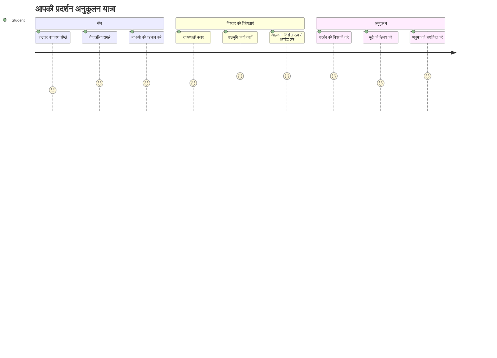
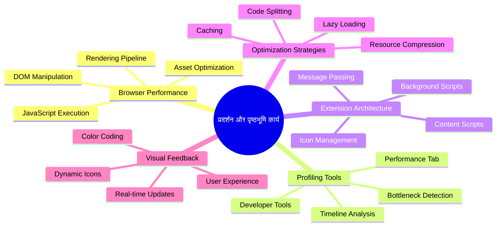
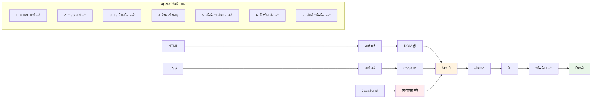
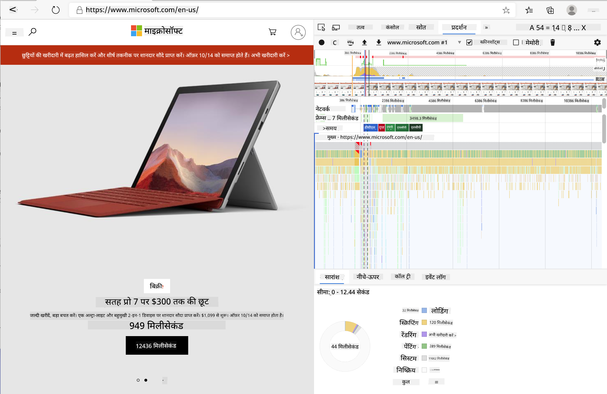
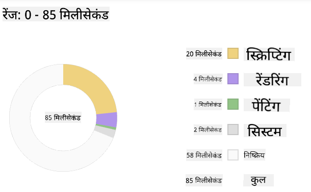
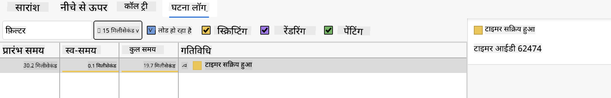
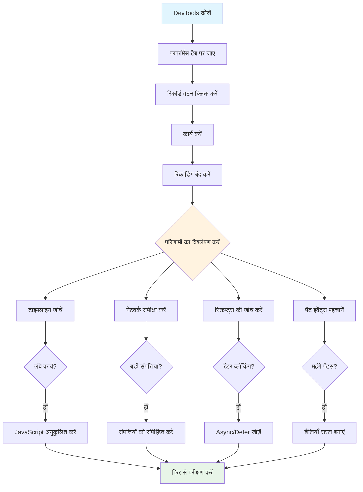
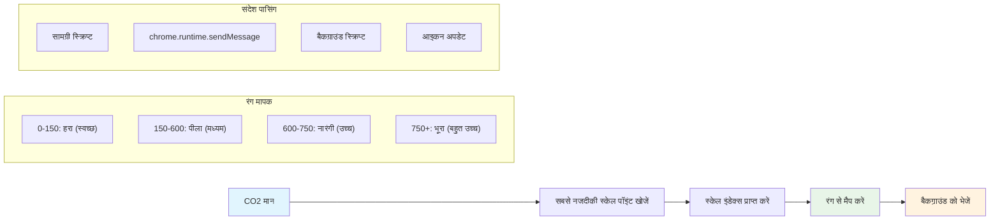
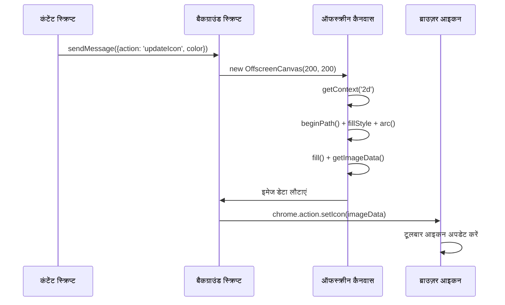
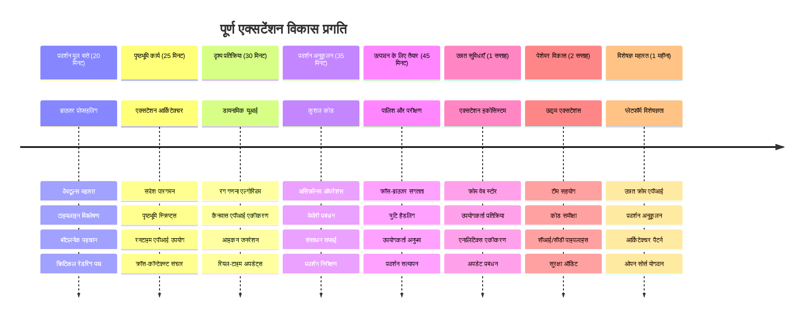

<!--
CO_OP_TRANSLATOR_METADATA:
{
  "original_hash": "b275fed2c6fc90d2b9b6661a3225faa2",
  "translation_date": "2026-01-06T16:36:10+00:00",
  "source_file": "5-browser-extension/3-background-tasks-and-performance/README.md",
  "language_code": "hi"
}
-->
# ब्राउज़र एक्सटेंशन प्रोजेक्ट भाग 3: पृष्ठभूमि कार्यों और प्रदर्शन के बारे में जानें


क्या आपने कभी सोचा है कि कुछ ब्राउजर एक्सटेंशन क्यों जल्दी और प्रतिक्रियाशील महसूस होते हैं जबकि दूसरे सुस्त कैसे लगते हैं? इसका रहस्य पर्दे के पीछे हो रही चीजों में छिपा है। जब उपयोगकर्ता आपके एक्सटेंशन के इंटरफ़ेस पर क्लिक करते हैं, तब पृष्ठभूमि में डेटा प्राप्त करने, आइकन अपडेट करने और सिस्टम संसाधनों का प्रबंधन करने वाली प्रक्रियाएं चुपचाप चल रही होती हैं।

यह ब्राउज़र एक्सटेंशन श्रृंखला का हमारा अंतिम पाठ है, और हम आपके कार्बन फुटप्रिंट ट्रैकर को सुचारू रूप से काम करने वाला बनाएंगे। आप डायनामिक आइकन अपडेट जोड़ेंगे और प्रदर्शन समस्याओं को तब पहचानना सीखेंगे जब वे बड़ी समस्या बनने से पहले हों। यह एक रेस कार को ट्यून करने जैसा है - छोटे-छोटे अनुकूलन सब कुछ चलाने के तरीके में बड़ा फर्क डाल सकते हैं।

जब हम समाप्त कर लेंगे, तो आपके पास एक पूर्ण एक्सटेंशन होगा और आप उन प्रदर्शन सिद्धांतों को समझेंगे जो अच्छे वेब ऐप्स को महान वेब ऐप्स से अलग करते हैं। आइए ब्राउज़र अनुकूलन की दुनिया में गोता लगाएँ।

## प्री-लेक्चर क्विज़

[प्री-लेक्चर क्विज़](https://ff-quizzes.netlify.app/web/quiz/27)

### परिचय

हमारे पिछले पाठों में, आपने एक फॉर्म बनाया, उसे API से जोड़ा, और असिंक्रोनस डेटा प्राप्ति से निपटा। आपका एक्सटेंशन अच्छे से आकार ले रहा है।

अब हमें अंतिम स्पर्श जोड़ने हैं - जैसे कि एक्सटेंशन आइकन को कार्बन डेटा के आधार पर रंग बदलना। यह मुझे याद दिलाता है कि NASA को अपोलो अंतरिक्ष यान पर हर सिस्टम को अनुकूलित करना पड़ा था। वे किसी भी बेकार चक्र या मेमोरी की व्यय सहन नहीं कर सकते थे क्योंकि प्रदर्शन पर जीवन निर्भर था। जबकि हमारा ब्राउज़र एक्सटेंशन इतना महत्वपूर्ण नहीं है, वही सिद्धांत लागू होते हैं - कुशल कोड बेहतर उपयोगकर्ता अनुभव बनाता है।


## वेब प्रदर्शन के मूल तत्व

जब आपका कोड कुशलतापूर्वक चलता है, तो लोग वास्तव में *अंतर महसूस* कर सकते हैं। आप जानते हैं कि वह क्षण जब कोई पेज तुरंत लोड हो जाता है या एनीमेशन सुचारू रूप से चलता है? यही अच्छा प्रदर्शन है।

प्रदर्शन केवल गति के बारे में नहीं है - यह सहज और बाधारहित वेब अनुभव बनाने के बारे में है। कंप्यूटिंग के शुरुआती दिनों में, ग्रेस हॉपर ने प्रसिद्ध रूप से अपनी मेज पर एक नैनोसेकंड (लगभग एक फुट लंबा तार) रखा था ताकि दिखाया जा सके कि एक अरबवें हिस्से में प्रकाश कितना दूर चलता है। यह उनके लिए यह समझाने का तरीका था कि कंप्यूटिंग में हर माइक्रोसेकंड क्यों महत्वपूर्ण है। आइए उन पता लगाने वाले उपकरणों को देखें जो आपको समझने में मदद करते हैं कि क्या चीज़ धीमी कर रही है।

> "वेबसाइट प्रदर्शन दो चीजों के बारे में है: पेज कितनी तेजी से लोड होता है, और उस पर कोड कितनी तेजी से चलता है।" -- [Zack Grossbart](https://www.smashingmagazine.com/2012/06/javascript-profiling-chrome-developer-tools/)

यह विषय कि आपकी वेबसाइट को हर तरह के उपकरणों, हर तरह के उपयोगकर्ताओं के लिए, हर परिस्थिति में तेज़ कैसे बनाया जाए, सहज रूप से बहुत विशाल है। जब आप एक मानक वेब प्रोजेक्ट या ब्राउज़र एक्सटेंशन बनाते हैं, तो ध्यान रखने के लिए कुछ बातें यहाँ दी गई हैं।

आपकी साइट को अनुकूलित करने का पहला कदम है यह समझना कि वास्तव में पर्दे के नीचे क्या हो रहा है। सौभाग्य से, आपके ब्राउज़र में शक्तिशाली पता लगाने वाले उपकरण अंतर्निहित होते हैं।


एज में डेवलपर टूल खोलने के लिए, ऊपर दाईं ओर तीन डॉट्स पर क्लिक करें, फिर More Tools > Developer Tools पर जाएं। या कीबोर्ड शॉर्टकट का उपयोग करें: Windows पर `Ctrl` + `Shift` + `I` या Mac पर `Option` + `Command` + `I`। वहां पहुंचने के बाद, Performance टैब पर क्लिक करें - यहीं आपकी जांच होगी।

**यहाँ आपका प्रदर्शन जांच उपकरण किट है:**
- **खोलें** Developer Tools (इन्हें आप एक डेवलपर के रूप में हमेशा उपयोग करेंगे!)
- **जाएं** Performance टैब पर - इसे अपने वेब ऐप के फिटनेस ट्रैकर के रूप में सोचें
- **दबाएं** रिकॉर्ड बटन और देखें कि आपका पेज कैसे काम करता है
- **अध्ययन करें** परिणामों को यह पता लगाने के लिए कि क्या चीज़ धीमी कर रही है

आइए इसे आज़माएँ। कोई वेबसाइट खोलें (Microsoft.com अच्छा विकल्प है) और 'रिकॉर्ड' बटन पर क्लिक करें। अब पेज रिफ्रेश करें और प्रोफाइलर को सब कुछ कैप्चर करते देखें। जब आप रिकॉर्डिंग बंद करेंगे, तो आपको ब्राउज़र के 'स्क्रिप्ट', 'रेंडर' और 'पेंट' करने के विस्तृत विवरण दिखाई देंगे। यह मुझे याद दिलाता है कि कैसे मिशन कंट्रोल एक रॉकेट लॉन्च के दौरान हर सिस्टम की निगरानी करता है - आपको वास्तविक समय के डेटा मिलते हैं कि क्या हो रहा है और कब।



✅ [Microsoft Documentation](https://docs.microsoft.com/microsoft-edge/devtools-guide/performance/?WT.mc_id=academic-77807-sagibbon) में और भी बहुत जानकारी है यदि आप गहराई से जानना चाहते हैं

> प्रो टिप: परीक्षण से पहले अपने ब्राउज़र कैश को क्लियर करें ताकि आप देख सकें कि आपकी साइट नए विज़िटर के लिए कैसे प्रदर्शन करती है - यह आमतौर पर पुनः उपयोगकर्ताओं से काफी अलग होता है!

प्रोफ़ाइल टाइमलाइन के तत्वों को चुनकर उन घटनाओं पर ज़ूम करें जो पेज लोड के दौरान होती हैं।

प्रोफ़ाइल टाइमलाइन का हिस्सा चुनकर अपने पेज के प्रदर्शन का स्नैपशॉट प्राप्त करें और सारांश पैन देखें:



देखें कि ईवेंट लॉग पैनल में कोई घटना 15 मिलीसेकंड से अधिक समय तो नहीं ले रही है:



✅ अपने प्रोफाइलर को जानें! इस साइट पर डेवलपर टूल खोलें और देखें कि क्या कोई बाधा है। सबसे धीमा लोड होने वाला संसाधन कौन सा है? सबसे तेज़?


## प्रोफाइलिंग करते समय क्या देखें

प्रोफाइलर चलाना तो बस शुरुआत है - असली कौशल यह जानना है कि वे रंगीन चार्ट वास्तव में क्या बता रहे हैं। चिंता मत करें, आप इन्हें पढ़ना सीख जाएंगे। अनुभवी डेवलपर्स समस्या बनने से पहले चेतावनी संकेतों को पहचानना सीख चुके हैं।

आइए सामान्य संदेहियों की बात करें - वे प्रदर्शन की समस्याएँ जो वेब प्रोजेक्ट्स में चुपके से आ जाती हैं। जैसे मैरी क्यूरी को अपनी प्रयोगशाला में रेडिएशन स्तर सावधानी से मॉनीटर करना पड़ता था, वैसे ही हमें कुछ पैटर्न देखना होगा जो समस्या की शुरुआत बताते हैं। इन्हें जल्दी पकड़ना आपको (और आपके उपयोगकर्ताओं को) बहुत सारी निराशा से बचाएगा।

**संसाधन आकार**: वेबसाइटें वर्षों में "भारी" होती जा रही हैं, और इसका बड़ा हिस्सा छवियों से आता है। ऐसा है जैसे हम अपनी डिजिटल सूटकेस में लगातार अधिक और अधिक सामान भर रहे हों।

✅ [Internet Archive](https://httparchive.org/reports/page-weight) देखें कि पेज के आकार समय के साथ कैसे बढ़े हैं - यह काफी जानकारीपूर्ण है।

**संसाधनों को अनुकूलित रखने के तरीके:**
- **कंप्रेस** करें उन छवियों को! आधुनिक फॉर्मेट जैसे WebP फ़ाइल आकार को काफी कम कर सकते हैं
- **हर डिवाइस के लिए** सही छवि आकार परोसें - बड़े डेस्कटॉप इमेजेस फोन पर भेजने की जरूरत नहीं
- **अपना CSS और JavaScript मिनीफाई करें** - हर बाइट मायने रखता है
- **लेज़ी लोडिंग** का उपयोग करें ताकि चित्र तभी डाउनलोड हों जब उपयोगकर्ता वास्तव में नीचे स्क्रॉल करें

**DOM ट्रैवर्सल**: ब्राउज़र को आपके लिखे गए कोड के आधार पर अपना डॉक्यूमेंट ऑब्जेक्ट मॉडल बनाना होता है, इसलिए अच्छा प्रदर्शन बनाने के लिए आवश्यक टैग ही रखना चाहिए और केवल वही स्टाइलिंग करनी चाहिए जो पेज जरूरत हो। इस बात तक, पेज से जुड़ा अतिरिक्त CSS भी अनुकूलित किया जा सकता है; केवल एक पेज पर उपयोग होने वाले स्टाइल्स मुख्य स्टाइलशीट में शामिल नहीं होने चाहिए।

**DOM अनुकूलन के प्रमुख रणनीतियाँ:**
- **HTML एलिमेंट्स और नेस्टिंग स्तरों की संख्या न्यूनतम करना**
- **अनुपयोग किए गए CSS नियम हटाना और स्टाइलशीट्स का कुशल समेकन**
- **CSS को इस तरह व्यवस्थित करना कि प्रत्येक पेज के लिए केवल आवश्यक लोड हो**
- **ब्रााउसर्स के बेहतर पार्सिंग के लिए HTML को सेमान्टिक रूप से संरचित करना**

**JavaScript**: हर JavaScript डेवलपर को 'रेंडर-ब्लॉकिंग' स्क्रिप्ट्स पर ध्यान देना चाहिए जिन्हें DOM पार्सिंग और पेंटिंग से पहले लोड किया जाना जरूरी होता है। अपने इनलाइन स्क्रिप्ट्स में `defer` का उपयोग करने पर विचार करें (जैसा Terrarium मॉड्यूल में किया जाता है)।

**आधुनिक JavaScript अनुकूलन तकनीकें:**
- **`defer` एट्रिब्यूट का उपयोग** करके स्क्रिप्ट्स DOM पार्सिंग के बाद लोड करना
- **कोड स्प्लिटिंग लागू करना** ताकि केवल आवश्यक JavaScript लोड हो
- **गैर-महत्वपूर्ण कार्यक्षमता के लिए लेज़ी लोडिंग उपयोग करना**
- **जहां संभव हो, भारी लाइब्रेरी और फ्रेमवर्क के उपयोग को कम करना**

✅ आप कुछ साइटों को [Site Speed Test वेबसाइट](https://www.webpagetest.org/) पर आज़मा सकते हैं ताकि साइट प्रदर्शन जाँच के सामान्य तरीकों को जान सकें।

### 🔄 **शैक्षिक जाँच-पड़ताल**
**प्रदर्शन की समझ**: एक्सटेंशन फीचर्स बनाने से पहले सुनिश्चित करें कि आप:
- ✅ HTML से पिक्सेल तक के क्रिटिकल रेंडरिंग पाथ को समझा सकते हैं
- ✅ वेब ऐप में सामान्य प्रदर्शन बाधाओं की पहचान कर सकते हैं
- ✅ ब्राउज़र डेवलपर टूल के उपयोग से पेज प्रदर्शन का प्रोफाइलिंग कर सकते हैं
- ✅ समझ सकते हैं कि संसाधन का आकार और DOM जटिलता गति को कैसे प्रभावित करती है

**त्वरित आत्म-परीक्षा**: जब आपके पास रेंडर-ब्लॉकिंग JavaScript होता है तब क्या होता है?
*उत्तर: ब्राउज़र को स्क्रिप्ट डाउनलोड और निष्पादित करना पड़ता है इससे पहले कि वह HTML पार्स करना और पेज रेंडर करना जारी रख सके*

**वास्तविक दुनिया में प्रदर्शन प्रभाव**:
- **100ms देरी**: उपयोगकर्ता धीमा महसूस करते हैं
- **1 सेकंड देरी**: उपयोगकर्ता ध्यान खोने लगते हैं
- **3+ सेकंड**: 40% उपयोगकर्ता पेज छोड़ देते हैं
- **मोबाइल नेटवर्क**: प्रदर्शन और भी महत्वपूर्ण होता है

अब जब आपके पास यह विचार है कि ब्राउज़र उन संसाधनों को कैसे रेंडर करता है जो आप उसे भेजते हैं, तो आइए वे अंतिम चीजें देखें जो आपके एक्सटेंशन को पूरा करने के लिए करनी हैं:

### रंग गणना करने वाला फ़ंक्शन बनाएं

अब हम एक ऐसा फ़ंक्शन बनाएंगे जो संख्यात्मक डेटा को अर्थपूर्ण रंगों में बदलता है। इसे ट्रैफिक लाइट सिस्टम की तरह सोचें - हरित (ग्रीन) साफ ऊर्जा के लिए, लाल ज़्यादा कार्बन तीव्रता के लिए।

यह फ़ंक्शन हमारी API से CO2 डेटा लेकर यह निर्धारित करेगा कि पर्यावरणीय प्रभाव का सबसे उपयुक्त रंग कौन सा है। यह वैसा ही है जैसे वैज्ञानिक जटिल डेटा पैटर्न को विज़ुअलाइज़ करने के लिए हीट मैप्स में रंग कोडिंग करते हैं - महासागर तापमान से लेकर तारा निर्माण तक। इसे `/src/index.js` में जोड़ें, ठीक उन `const` वेरिएबल्स के बाद जो हमने पहले सेट किए थे:


```javascript
function calculateColor(value) {
	// CO2 तीव्रता पैमाना परिभाषित करें (ग्राम प्रति kWh)
	const co2Scale = [0, 150, 600, 750, 800];
	// हरे (स्वच्छ) से गहरे भूरे (उच्च कार्बन) तक संबंधित रंग
	const colors = ['#2AA364', '#F5EB4D', '#9E4229', '#381D02', '#381D02'];

	// हमारे इनपुट के सबसे निकटतम पैमाना मान खोजें
	const closestNum = co2Scale.sort((a, b) => {
		return Math.abs(a - value) - Math.abs(b - value);
	})[0];
	
	console.log(`${value} is closest to ${closestNum}`);
	
	// रंग मानचित्रण के लिए सूचकांक खोजें
	const num = (element) => element > closestNum;
	const scaleIndex = co2Scale.findIndex(num);

	const closestColor = colors[scaleIndex];
	console.log(scaleIndex, closestColor);

	// पृष्ठभूमि स्क्रिप्ट को रंग अद्यतन संदेश भेजें
	chrome.runtime.sendMessage({ action: 'updateIcon', value: { color: closestColor } });
}
```

**इस चालाक छोटे फ़ंक्शन का विश्लेषण:**
- **दो एरे सेट करता है** - एक CO2 स्तर के लिए, दूसरा रंगों के लिए (ग्रीन = साफ, ब्राउन = गंदा!)
- **क्लोज़ेस्ट मैच खोजता है** हमारे वास्तविक CO2 मान के लिए कुछ स्मार्ट एरे सॉर्टिंग का उपयोग करके
- **मेल खाते रंग को प्राप्त करता है** findIndex() मेथड का उपयोग करके
- **Chrome के बैकग्राउंड स्क्रिप्ट को संदेश भेजता है** हमारे चुने हुए रंग के साथ
- **टेम्पलेट लिटरेल्स (बैकटिक्स) का उपयोग करता है** स्ट्रिंग फॉर्मेटिंग के लिए साफ-सुथरा
- **const घोषणाओं से** सब कुछ व्यवस्थित रखता है

`chrome.runtime` [API](https://developer.chrome.com/extensions/runtime) आपके एक्सटेंशन की नसों की तरह है - यह सभी पर्दे के पीछे की संचार और कार्यों को संभालता है:

> "chrome.runtime API का उपयोग पृष्ठभूमि पेज को प्राप्त करने, मैनिफेस्ट के विवरण लौटाने, और ऐप या एक्सटेंशन लाइफसायकल में घटनाओं को सुनने और प्रतिक्रिया देने के लिए करें। आप इस API का उपयोग URL के सापेक्ष पथ को पूर्ण योग्य URL में बदलने के लिए भी कर सकते हैं।"

**Chrome Runtime API क्यों उपयोगी है:**
- **आपके एक्सटेंशन के विभिन्न भागों को बातचीत करने देता है**
- **यूजर इंटरफ़ेस को फ्रीज किए बिना पृष्ठभूमि कार्यों को संभालता है**
- **आपके एक्सटेंशन के लाइफसायकल इवेंट्स का प्रबंधन करता है**
- **स्क्रिप्ट्स के बीच संदेश पारित करना बहुत आसान बनाता है**

✅ यदि आप यह ब्राउज़र एक्सटेंशन Edge के लिए विकसित कर रहे हैं, तो यह आश्चर्यचकित कर सकता है कि आप एक क्रोम API का उपयोग कर रहे हैं। नया Edge ब्राउज़र संस्करण Chromium ब्राउज़र इंजन पर चलता है, इसलिए आप इन उपकरणों का लाभ उठा सकते हैं।


> **प्रो टिप**: यदि आप किसी ब्राउज़र एक्सटेंशन को प्रोफाइल करना चाहते हैं, तो अपने एक्सटेंशन के अंदर से डेवलपर टूल लॉन्च करें, क्योंकि यह उसका अपना अलग ब्राउज़र इंस्टेंस होता है। इससे आपको एक्सटेंशन-विशिष्ट प्रदर्शन मीट्रिक्स तक पहुँच मिलती है।

### डिफ़ॉल्ट आइकन रंग सेट करें

असल डेटा प्राप्त करने से पहले, आइए अपने एक्सटेंशन को एक शुरुआती बिंदु दें। कोई भी खाली या टूटा हुआ आइकन देखकर खुश नहीं होता। हम एक हरा रंग सेट करेंगे ताकि उपयोगकर्ता इंस्टॉल करते ही एक्सटेंशन काम कर रहा हो यह जान सकें।

अपने `init()` फ़ंक्शन में, उस डिफ़ॉल्ट हरे आइकन को सेट करें:

```javascript
chrome.runtime.sendMessage({
	action: 'updateIcon',
	value: {
		color: 'green',
	},
});
```

**यह प्रारंभिक सेटअप क्या करता है:**
- **डिफ़ॉल्ट स्थिति के रूप में एक तटस्थ हरा रंग सेट करता है**
- **एक्सटेंशन लोड होते ही तत्काल विज़ुअल फीडबैक प्रदान करता है**
- **बैकग्राउंड स्क्रिप्ट के साथ संचार पैटर्न स्थापित करता है**
- **उपयोगकर्ताओं को डेटा लोड होने से पहले कार्यात्मक एक्सटेंशन दिखाता है**

### फ़ंक्शन कॉल करें, कॉल निष्पादित करें

अब आइए सब कुछ जोड़ते हैं ताकि जब ताजा CO2 डेटा आए, तो आपका आइकन स्वचालित रूप से सही रंग में अपडेट हो जाए। यह किसी इलेक्ट्रॉनिक डिवाइस में अंतिम सर्किट जोड़ने जैसा है - अचानक सारे घटक एक सिस्टम के रूप में काम करने लगते हैं।

API से CO2 डेटा मिलने के तुरंत बाद यह लाइन जोड़ें:

```javascript
// API से CO2 डेटा प्राप्त करने के बाद
// let CO2 = data.data[0].intensity.actual;
calculateColor(CO2);
```

**यह एकीकरण क्या करता है:**
- **API डेटा प्रवाह को विज़ुअल संकेतक प्रणाली से जोड़ता है**
- **जब नया डेटा आता है तो स्वचालित रूप से आइकन अपडेट करता है**
- **वर्तमान कार्बन तीव्रता पर आधारित वास्तविक समय विज़ुअल फीडबैक सुनिश्चित करता है**
- **डेटा प्राप्ति और प्रदर्शन लॉजिक के बीच अलगाव बनाए रखता है**

और अंत में, `/dist/background.js` में, इन पृष्ठभूमि क्रिया कॉल्स के लिए श्रोता जोड़ें:

```javascript
// कंटेंट स्क्रिप्ट से संदेश सुनें
chrome.runtime.onMessage.addListener(function (msg, sender, sendResponse) {
	if (msg.action === 'updateIcon') {
		chrome.action.setIcon({ imageData: drawIcon(msg.value) });
	}
});

// Canvas API का उपयोग करके डायनेमिक आइकन बनाएं
// एनर्जी लॉलीपॉप एक्सटेंशन से उधार लिया गया - बढ़िया फीचर!
function drawIcon(value) {
	// बेहतर प्रदर्शन के लिए एक ऑफस्क्रीन कैनवास बनाएं
	const canvas = new OffscreenCanvas(200, 200);
	const context = canvas.getContext('2d');

	// कार्बन तीव्रता दर्शाने के लिए एक रंगीन वृत्त बनाएं
	context.beginPath();
	context.fillStyle = value.color;
	context.arc(100, 100, 50, 0, 2 * Math.PI);
	context.fill();

	// ब्राउज़र आइकन के लिए इमेज डेटा लौटाएं
	return context.getImageData(50, 50, 100, 100);
}
```

**यह बैकग्राउंड स्क्रिप्ट क्या करता है:**
- **मुख्य स्क्रिप्ट से संदेश सुनता है** (जैसे एक रिसेप्शनिस्ट कॉल उठाता हो)
- **उन 'updateIcon' अनुरोधों को संसाधित करता है** जो टूलबार आइकन बदलने को कहते हैं
- **Canvas API का उपयोग करते हुए नए आइकन बना चलता है**
- **एक सरल रंगीन घेरा बनाता है जो वर्तमान कार्बन तीव्रता दिखाता है**
- **आपके ब्राउज़र टूलबार को ताजगी से अपडेट करता है**
- **स्मूद प्रदर्शन के लिए OffscreenCanvas का उपयोग करता है (कोई UI रोकावट नहीं)**

✅ आप [स्पेस गेम पाठों](../../6-space-game/2-drawing-to-canvas/README.md) में Canvas API के बारे में और जानेंगे।


### 🔄 **शैक्षिक जाँच-पड़ताल**
**पूरा एक्सटेंशन समझना**: पूरे सिस्टम में दक्षता की पुष्टि करें:
- ✅ विभिन्न एक्सटेंशन स्क्रिप्ट्स में संदेश पारित कैसे होता है?
- ✅ प्रदर्शन के लिए नियमित Canvas के बजाय OffscreenCanvas का उपयोग क्यों करते हैं?
- ✅ क्रोम रनटाइम API एक्सटेंशन आर्किटेक्चर में क्या भूमिका निभाता है?
- ✅ कलर कैलकुलेशन एल्गोरिद्म डेटा को विज़ुअल फीडबैक में कैसे मैप करता है?

**परफॉर्मेंस विचार-विमर्श**: आपका एक्सटेंशन अब प्रदर्शित करता है:
- **प्रभावी मैसेजिंग**: स्क्रिप्ट संदर्भों के बीच साफ-सुथरा संचार
- **ऑप्टिमाइज़्ड रेंडरिंग**: OffscreenCanvas UI ब्लॉकिंग को रोकता है
- **रियल-टाइम अपडेट्स**: लाइव डेटा के आधार पर डायनेमिक आइकन परिवर्तन
- **मेमोरी प्रबंधन**: उचित सफाई और संसाधन प्रबंधन

**अपने एक्सटेंशन का परीक्षण करने का समय:**
- `npm run build` के साथ सब कुछ **बिल्ड** करें
- ब्राउज़र में अपना एक्सटेंशन **रीलोड** करें (यह स्टेप न भूलें)
- अपना एक्सटेंशन **खोलें** और देखें कि आइकन के रंग कैसे बदलते हैं
- देखें कि यह दुनिया भर के असली कार्बन डेटा पर कैसे प्रतिक्रिया देता है

अब आप एक नज़र में जान पाएंगे कि वह कपड़े धोने का समय अच्छा है या आपको साफ-सुथरी ऊर्जा के लिए इंतजार करना चाहिए। आपने अभी कुछ वास्तव में उपयोगी बनाया है और ब्राउज़र के प्रदर्शन के बारे में भी जाना है।

## GitHub Copilot एजेंट चुनौती 🚀

एजेंट मोड का उपयोग करके निम्नलिखित चुनौती पूरी करें:

**विवरण:** ब्राउज़र एक्सटेंशन की प्रदर्शन निगरानी क्षमताओं को बढ़ाएं और एक फीचर जोड़ें जो एक्सटेंशन के विभिन्न घटकों के लोड समय को ट्रैक और प्रदर्शित करता है।

**प्रॉम्प्ट:** एक प्रदर्शन निगरानी प्रणाली बनाएं जो API से CO2 डेटा प्राप्त करने, रंगों की गणना करने, और आइकन को अपडेट करने में लगने वाले समय को मापती और लॉग करती हो। एक फ़ंक्शन `performanceTracker` जोड़ें जो Performance API का उपयोग करके इन ऑपरेशनों को मापे और परिणामों को ब्राउज़र कॉन्सोल में टाइमस्टैम्प्स और अवधि मीट्रिक्स के साथ प्रदर्शित करे।

[agent मोड](https://code.visualstudio.com/blogs/2025/02/24/introducing-copilot-agent-mode) के बारे में अधिक जानें।

## 🚀 चुनौती

यहाँ एक रोचक जासूसी मिशन है: कुछ ऐसे ओपन सोर्स वेबसाइट्स चुनें जो वर्षों से मौजूद हैं (जैसे Wikipedia, GitHub, या Stack Overflow) और उनके कमिट इतिहास में उत्खनन करें। क्या आप पता लगा सकते हैं कि उन्होंने प्रदर्शन सुधार कहाँ किए? कौन सी समस्याएँ बार-बार उभरती रहीं?

**आपकी जांच करने की विधि:**
- कमिट संदेशों में "optimize," "performance," या "faster" जैसे शब्द खोजें
- पैटर्न देखें - क्या वे एक ही प्रकार की समस्याएँ लगातार ठीक कर रहे हैं?
- सामान्य कारणों की पहचान करें जो वेबसाइट को स्लो करते हैं
- अपने निष्कर्ष साझा करें - अन्य डेवलपर्स असली दुनिया के उदाहरणों से सीखते हैं

## पोस्ट-लेक्चर क्विज़

[पोस्ट-लेक्चर क्विज़](https://ff-quizzes.netlify.app/web/quiz/28)

## समीक्षा एवं आत्म-अध्ययन

[परफॉर्मेंस न्यूज़लेटर](https://perf.email/) के लिए साइन अप करने पर विचार करें।

ब्राउज़र के वेब टूल्स में परफॉर्मेंस टैब के जरिए देखें कि ब्राउज़र वेब परफॉर्मेंस को कैसे मापते हैं। क्या आपको कोई मुख्य अंतर दिखाई देते हैं?

### ⚡ **अगले 5 मिनट में आप क्या कर सकते हैं**
- [ ] ब्राउज़र टास्क मैनेजर खोलें (Chrome में Shift+Esc) और एक्सटेंशन संसाधन उपयोग देखें
- [ ] DevTools के Performance टैब में वेबपेज प्रदर्शन रिकॉर्ड और विश्लेषण करें
- [ ] ब्राउज़र के Extensions पेज पर देखें कि कौन से एक्सटेंशन्स स्टार्टअप समय प्रभावित करते हैं
- [ ] अस्थायी रूप से एक्सटेंशन्स को डिसेबल करके प्रदर्शन में फर्क देखें

### 🎯 **इस घंटे में आप क्या हासिल कर सकते हैं**
- [ ] पोस्ट-लेसन क्विज़ पूरा करें और परफॉर्मेंस अवधारणाएँ समझें
- [ ] अपने ब्राउज़र एक्सटेंशन के लिए बैकग्राउंड स्क्रिप्ट लागू करें
- [ ] कुशल बैकग्राउंड कार्यों के लिए browser.alarms सीखें
- [ ] कंटेंट स्क्रिप्ट्स और बैकग्राउंड स्क्रिप्ट्स के बीच मैसेज पासिंग का अभ्यास करें
- [ ] अपने एक्सटेंशन के संसाधन उपयोग को मापें और ऑप्टिमाइज़ करें

### 📅 **आपका सप्ताहभर का परफॉर्मेंस सफर**
- [ ] बैकग्राउंड फ़ंक्शनालिटी के साथ उच्च-प्रदर्शन ब्राउज़र एक्सटेंशन बनाएं
- [ ] सर्विस वर्कर्स और आधुनिक एक्सटेंशन आर्किटेक्चर में महारत हासिल करें
- [ ] कुशल डेटा सिंक्रोनाइज़ेशन और कैशिंग रणनीतियाँ लागू करें
- [ ] एक्सटेंशन परफॉर्मेंस के लिए उन्नत डिबगिंग तकनीक सीखें
- [ ] अपनी एक्सटेंशन को कार्यक्षमता और संसाधन दक्षता दोनों के लिए ऑप्टिमाइज़ करें
- [ ] एक्सटेंशन परफॉर्मेंस परिदृश्यों के लिए व्यापक परीक्षण बनाएँ

### 🌟 **आपकी एक महीने की ऑप्टिमाइज़ेशन महारत**
- [ ] एंटरप्राइज़-ग्रेड ब्राउज़र एक्सटेंशन्स बनाएं जो बेहतर प्रदर्शन दिखाएं
- [ ] वेब वर्कर्स, सर्विस वर्कर्स, और आधुनिक वेब प्रदर्शन के बारे में जानें
- [ ] प्रदर्शन अनुकूलन पर केंद्रित ओपन सोर्स प्रोजेक्ट्स में योगदान दें
- [ ] ब्राउज़र आंतरिक संरचनाओं और उन्नत डिबगिंग तकनीकों में दक्षता हासिल करें
- [ ] प्रदर्शन निगरानी उपकरण और सर्वोत्तम प्रथाओं के गाइड बनाएं
- [ ] एक प्रदर्शन विशेषज्ञ बनें जो वेब अनुप्रयोगों को अनुकूलित करने में मदद करता है

## 🎯 आपका ब्राउज़र एक्सटेंशन मास्टरी टाइमलाइन


### 🛠️ आपका संपूर्ण एक्सटेंशन विकास टूलकिट

इस त्रयी को पूरा करने के बाद, आपने महारत हासिल की है:
- **ब्राउज़र आर्किटेक्चर**: एक्सटेंशन्स ब्राउज़र सिस्टम्स के साथ कैसे एकीकृत होते हैं, इसकी गहरी समझ
- **परफॉर्मेंस प्रोफाइलिंग**: डेवलपर टूल्स का उपयोग करके बॉटलनेक्स पहचानना और सुधारना
- **एसिंक्रोनस प्रोग्रामिंग**: प्रतिक्रियाशील, नॉन-ब्लॉकिंग ऑपरेशन्स के लिए आधुनिक JavaScript पैटर्न्स
- **API इंटीग्रेशन**: प्रमाणीकरण और त्रुटि प्रबंधन के साथ बाहरी डेटा प्राप्त करना
- **विज़ुअल डिजाइन**: डायनेमिक UI अपडेट्स और कैनवास-आधारित ग्राफिक्स निर्माण
- **मैसेज पासिंग**: एक्सटेंशन आर्किटेक्चर में स्क्रिप्ट्स के बीच संचार
- **यूज़र एक्सपीरियंस**: लोडिंग स्टेट्स, त्रुटि प्रबंधन, और सहज इंटरैक्शन
- **प्रोडक्शन स्किल्स**: रियल-वर्ल्ड डिप्लॉयमेंट के लिए टेस्टिंग, डिबगिंग, और ऑप्टिमाइजेशन

**वास्तविक दुनिया के अनुप्रयोग**: आपकी एक्सटेंशन विकास क्षमताएं सीधे लागू होती हैं:
- **प्रोग्रेसिव वेब ऐप्स**: समान आर्किटेक्चर और प्रदर्शन पैटर्न्स
- **इलेक्ट्रॉन डेस्कटॉप ऐप्स**: वेब तकनीकों का उपयोग करने वाले क्रॉस-प्लेटफॉर्म ऐप्स
- **मोबाइल हाइब्रिड ऐप्स**: Cordova/PhoneGap विकास वेब API का उपयोग करके
- **एंटरप्राइज़ वेब ऐप्लिकेशन्स**: जटिल डैशबोर्ड और उत्पादकता टूल्स
- **क्रोम DevTools एक्सटेंशन्स**: उन्नत डेवलपर टूलिंग और डिबगिंग
- **वेब API इंटीग्रेशन**: कोई भी एप्लिकेशन जो बाहरी सेवाओं से संवाद करता है

**पेशेवर प्रभाव**: अब आप कर सकते हैं:
- **परिकल्पना से लेकर डिप्लॉयमेंट तक** पूर्णत: पेशेवर ब्राउज़र एक्सटेंशन्स बनाएं
- **प्रदर्शन प्रोफाइलिंग टूल्स** का उपयोग करके वेब ऐप्लिकेशन के प्रदर्शन को बेहतर बनाएं
- **स्केलेबल सिस्टम्स के आर्किटेक्चर** के लिए उचित चिंता के पृथक्करण को लागू करें
- जटिल एसिंक्रोनस ऑपरेशन्स और跨-संदर्भ संचार को डिबग करें
- ओपन सोर्स एक्सटेंशन प्रोजेक्ट्स और ब्राउज़र मानकों में योगदान करें

**अगले स्तर के अवसर**:
- **क्रोम वेब स्टोर डेवलपर**: लाखों उपयोगकर्ताओं के लिए एक्सटेंशंस पब्लिश करें
- **वेब प्रदर्शन इंजीनियर**: अनुकूलन और उपयोगकर्ता अनुभव में विशेषज्ञता
- **ब्राउज़र प्लेटफ़ॉर्म डेवलपर**: ब्राउज़र इंजन विकास में योगदान दें
- **एक्सटेंशन फ्रेमवर्क क्रिएटर**: अन्य डेवलपर्स की मदद करने वाले टूल्स बनाएं
- **डेवलपर रिलेशंस**: शिक्षण और सामग्री निर्माण के जरिए ज्ञान साझा करें

🌟 **उपलब्धि अनलॉक्ड**: आपने एक संपूर्ण, कार्यात्मक ब्राउज़र एक्सटेंशन बनाया है जो पेशेवर विकास प्रथाओं और आधुनिक वेब मानकों को दर्शाता है!

## असाइनमेंट

[परफॉर्मेंस के लिए किसी साइट का विश्लेषण करें](assignment.md)

---

<!-- CO-OP TRANSLATOR DISCLAIMER START -->
**अस्वीकरण**:  
यह दस्तावेज़ AI अनुवाद सेवा [Co-op Translator](https://github.com/Azure/co-op-translator) का उपयोग करके अनूदित किया गया है। हम सटीकता के लिए प्रयास करते हैं, लेकिन कृपया ध्यान दें कि स्वचालित अनुवाद में त्रुटियाँ या असंगतियाँ हो सकती हैं। मूल दस्तावेज़ अपनी मूल भाषा में प्राधिकृत स्रोत माना जाना चाहिए। महत्वपूर्ण जानकारी के लिए, पेशेवर मानव अनुवाद की सलाह दी जाती है। इस अनुवाद के उपयोग से होने वाली किसी भी गलतफहमी या गलत व्याख्या के लिए हम जवाबदेह नहीं हैं।
<!-- CO-OP TRANSLATOR DISCLAIMER END -->