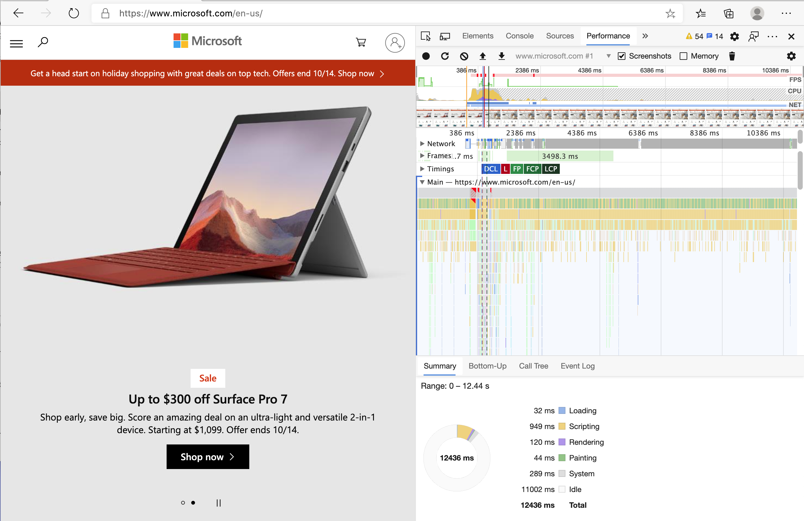

<!--
CO_OP_TRANSLATOR_METADATA:
{
  "original_hash": "b91cbf14240ee59411b96448b994ace1",
  "translation_date": "2025-10-03T12:18:36+00:00",
  "source_file": "5-browser-extension/3-background-tasks-and-performance/README.md",
  "language_code": "hi"
}
-->
# ब्राउज़र एक्सटेंशन प्रोजेक्ट भाग 3: बैकग्राउंड टास्क और प्रदर्शन के बारे में जानें

## प्री-लेक्चर क्विज़

[प्री-लेक्चर क्विज़](https://ff-quizzes.netlify.app/web/quiz/27)

### परिचय

इस मॉड्यूल के पिछले दो पाठों में, आपने एक फॉर्म और डेटा प्रदर्शित करने के लिए एक क्षेत्र बनाने का तरीका सीखा, जिसे API से प्राप्त किया गया था। यह वेब पर एक वेब उपस्थिति बनाने का एक बहुत ही सामान्य तरीका है। आपने डेटा को असिंक्रोनस रूप से प्राप्त करने का तरीका भी सीखा। आपका ब्राउज़र एक्सटेंशन लगभग पूरा हो चुका है।

अब कुछ बैकग्राउंड टास्क को प्रबंधित करना बाकी है, जिसमें एक्सटेंशन के आइकन का रंग रिफ्रेश करना शामिल है। यह जानने का सही समय है कि ब्राउज़र इस प्रकार के कार्यों को कैसे प्रबंधित करता है। आइए इन ब्राउज़र टास्क को आपके वेब एसेट्स के प्रदर्शन के संदर्भ में सोचें जब आप इन्हें बना रहे हों।

## वेब प्रदर्शन की मूल बातें

> "वेबसाइट प्रदर्शन दो चीजों के बारे में है: पेज कितनी तेजी से लोड होता है, और उस पर कोड कितनी तेजी से चलता है।" -- [ज़ैक ग्रॉसबार्ट](https://www.smashingmagazine.com/2012/06/javascript-profiling-chrome-developer-tools/)

वेबसाइट्स को हर प्रकार के डिवाइस, हर प्रकार के उपयोगकर्ता, और हर प्रकार की स्थिति में तेज़ बनाने के तरीके का विषय काफी व्यापक है। यहां कुछ महत्वपूर्ण बिंदु दिए गए हैं जिन्हें आपको एक सामान्य वेब प्रोजेक्ट या ब्राउज़र एक्सटेंशन बनाते समय ध्यान में रखना चाहिए।

सबसे पहली चीज जो आपको सुनिश्चित करनी चाहिए कि आपकी साइट कुशलता से चल रही है, वह है इसके प्रदर्शन के बारे में डेटा इकट्ठा करना। इसका पहला स्थान आपके वेब ब्राउज़र के डेवलपर टूल्स में है। Edge में, आप "सेटिंग्स और अधिक" बटन (ब्राउज़र के ऊपर दाईं ओर तीन डॉट्स आइकन) का चयन कर सकते हैं, फिर More Tools > Developer Tools पर नेविगेट करें और Performance टैब खोलें। आप Windows पर `Ctrl` + `Shift` + `I` या Mac पर `Option` + `Command` + `I` कीबोर्ड शॉर्टकट का उपयोग करके डेवलपर टूल्स खोल सकते हैं।

Performance टैब में एक प्रोफाइलिंग टूल होता है। एक वेबसाइट खोलें (उदाहरण के लिए, [https://www.microsoft.com](https://www.microsoft.com/?WT.mc_id=academic-77807-sagibbon)) और 'Record' बटन पर क्लिक करें, फिर साइट को रिफ्रेश करें। रिकॉर्डिंग को किसी भी समय रोकें, और आप उन रूटीन को देख पाएंगे जो साइट को 'स्क्रिप्ट', 'रेंडर', और 'पेंट' करने के लिए उत्पन्न होते हैं:



✅ [Microsoft Documentation](https://docs.microsoft.com/microsoft-edge/devtools-guide/performance/?WT.mc_id=academic-77807-sagibbon) पर Edge के Performance पैनल के बारे में जानें।

> टिप: अपनी वेबसाइट के स्टार्टअप समय का सटीक रीडिंग प्राप्त करने के लिए, अपने ब्राउज़र का कैश साफ़ करें।

प्रोफाइल टाइमलाइन के तत्वों का चयन करें ताकि आप उन घटनाओं को ज़ूम कर सकें जो आपके पेज लोड होने के दौरान होती हैं।

प्रोफाइल टाइमलाइन के एक हिस्से का चयन करके और सारांश पैन को देखकर अपने पेज के प्रदर्शन का स्नैपशॉट प्राप्त करें:


इवेंट लॉग पैन की जांच करें कि क्या कोई इवेंट 15 मिलीसेकंड से अधिक समय ले रहा है:


✅ अपने प्रोफाइलर को जानें! इस साइट पर डेवलपर टूल्स खोलें और देखें कि क्या कोई बाधा है। सबसे धीमी लोडिंग एसेट कौन सा है? सबसे तेज़ कौन सा है?

## प्रोफाइलिंग जांच

सामान्य तौर पर, कुछ "समस्या क्षेत्र" होते हैं जिन्हें हर वेब डेवलपर को साइट बनाते समय ध्यान में रखना चाहिए ताकि प्रोडक्शन में तैनाती के समय अप्रिय आश्चर्य से बचा जा सके।

**एसेट साइज**: पिछले कुछ वर्षों में वेब 'भारी' और इसलिए धीमा हो गया है। इस वजन का कुछ हिस्सा इमेजेज के उपयोग से संबंधित है।

✅ [Internet Archive](https://httparchive.org/reports/page-weight) पर पेज वेट का ऐतिहासिक दृश्य और अधिक देखें।

एक अच्छा अभ्यास यह सुनिश्चित करना है कि आपकी इमेजेज ऑप्टिमाइज़ की गई हैं और आपके उपयोगकर्ताओं के लिए सही आकार और रिज़ॉल्यूशन में दी गई हैं।

**DOM ट्रैवर्सल्स**: ब्राउज़र को आपके द्वारा लिखे गए कोड के आधार पर अपना Document Object Model बनाना होता है, इसलिए अच्छे पेज प्रदर्शन के हित में अपने टैग्स को न्यूनतम रखना चाहिए, केवल वही उपयोग और स्टाइल करना चाहिए जो पेज को चाहिए। इस बिंदु पर, पेज से संबंधित अतिरिक्त CSS को ऑप्टिमाइज़ किया जा सकता है; उदाहरण के लिए, जो स्टाइल केवल एक पेज पर उपयोग किए जाने चाहिए, उन्हें मुख्य स्टाइल शीट में शामिल करने की आवश्यकता नहीं है।

**जावास्क्रिप्ट**: हर जावास्क्रिप्ट डेवलपर को 'रेंडर-ब्लॉकिंग' स्क्रिप्ट्स पर ध्यान देना चाहिए जिन्हें DOM को ट्रैवर्स और ब्राउज़र में पेंट करने से पहले लोड करना आवश्यक है। अपने इनलाइन स्क्रिप्ट्स के साथ `defer` का उपयोग करने पर विचार करें (जैसा कि Terrarium मॉड्यूल में किया गया है)।

✅ साइट प्रदर्शन निर्धारित करने के लिए किए जाने वाले सामान्य जांचों के बारे में अधिक जानने के लिए [Site Speed Test वेबसाइट](https://www.webpagetest.org/) पर कुछ साइट्स आज़माएं।

अब जब आपको यह समझ आ गया है कि ब्राउज़र आपके द्वारा भेजे गए एसेट्स को कैसे रेंडर करता है, तो आइए उन अंतिम कुछ चीजों को देखें जो आपको अपने एक्सटेंशन को पूरा करने के लिए करनी हैं:

### रंग की गणना करने के लिए एक फ़ंक्शन बनाएं

`/src/index.js` में काम करते हुए, उन `const` वेरिएबल्स की श्रृंखला के बाद एक फ़ंक्शन `calculateColor()` जोड़ें जिन्हें आपने DOM तक पहुंच प्राप्त करने के लिए सेट किया था:

```JavaScript
function calculateColor(value) {
	let co2Scale = [0, 150, 600, 750, 800];
	let colors = ['#2AA364', '#F5EB4D', '#9E4229', '#381D02', '#381D02'];

	let closestNum = co2Scale.sort((a, b) => {
		return Math.abs(a - value) - Math.abs(b - value);
	})[0];
	console.log(value + ' is closest to ' + closestNum);
	let num = (element) => element > closestNum;
	let scaleIndex = co2Scale.findIndex(num);

	let closestColor = colors[scaleIndex];
	console.log(scaleIndex, closestColor);

	chrome.runtime.sendMessage({ action: 'updateIcon', value: { color: closestColor } });
}
```

यहां क्या हो रहा है? आप एक मान (कार्बन इंटेंसिटी) पास करते हैं जिसे आपने पिछले पाठ में पूरा किए गए API कॉल से प्राप्त किया था, और फिर आप यह गणना करते हैं कि इसका मान colors array में प्रस्तुत इंडेक्स के कितना करीब है। फिर आप उस सबसे करीब रंग मान को chrome runtime पर भेजते हैं।

chrome.runtime में [एक API](https://developer.chrome.com/extensions/runtime) है जो सभी प्रकार के बैकग्राउंड टास्क को संभालता है, और आपका एक्सटेंशन इसका उपयोग कर रहा है:

> "chrome.runtime API का उपयोग बैकग्राउंड पेज को प्राप्त करने, मैनिफेस्ट के बारे में विवरण लौटाने, और ऐप या एक्सटेंशन लाइफसाइक्ल में घटनाओं के लिए सुनने और प्रतिक्रिया देने के लिए करें। आप इस API का उपयोग URLs के सापेक्ष पथ को पूरी तरह से योग्य URLs में बदलने के लिए भी कर सकते हैं।"

✅ यदि आप इस ब्राउज़र एक्सटेंशन को Edge के लिए विकसित कर रहे हैं, तो यह आपको आश्चर्यचकित कर सकता है कि आप chrome API का उपयोग कर रहे हैं। Edge ब्राउज़र के नए संस्करण Chromium ब्राउज़र इंजन पर चलते हैं, इसलिए आप इन टूल्स का लाभ उठा सकते हैं।

> ध्यान दें, यदि आप ब्राउज़र एक्सटेंशन को प्रोफाइल करना चाहते हैं, तो इसे एक्सटेंशन के भीतर से लॉन्च करें, क्योंकि यह अपना अलग ब्राउज़र इंस्टेंस है।

### डिफ़ॉल्ट आइकन रंग सेट करें

अब, `init()` फ़ंक्शन में, आइकन को शुरू में सामान्य हरे रंग में सेट करें, फिर से chrome के `updateIcon` एक्शन को कॉल करके:

```JavaScript
chrome.runtime.sendMessage({
	action: 'updateIcon',
		value: {
			color: 'green',
		},
});
```
### फ़ंक्शन को कॉल करें, कॉल को निष्पादित करें

अगले चरण में, उस फ़ंक्शन को कॉल करें जिसे आपने अभी बनाया है, इसे C02Signal API द्वारा लौटाए गए प्रॉमिस में जोड़कर:

```JavaScript
//let CO2...
calculateColor(CO2);
```

और अंत में, `/dist/background.js` में, इन बैकग्राउंड एक्शन कॉल्स के लिए लिसनर जोड़ें:

```JavaScript
chrome.runtime.onMessage.addListener(function (msg, sender, sendResponse) {
	if (msg.action === 'updateIcon') {
		chrome.action.setIcon({ imageData: drawIcon(msg.value) });
	}
});
//borrowed from energy lollipop extension, nice feature!
function drawIcon(value) {
	let canvas = new OffscreenCanvas(200, 200);
	let context = canvas.getContext('2d');

	context.beginPath();
	context.fillStyle = value.color;
	context.arc(100, 100, 50, 0, 2 * Math.PI);
	context.fill();

	return context.getImageData(50, 50, 100, 100);
}
```

इस कोड में, आप बैकएंड टास्क मैनेजर पर आने वाले किसी भी संदेश के लिए एक लिसनर जोड़ रहे हैं। यदि इसे 'updateIcon' कहा जाता है, तो अगला कोड सही रंग का आइकन बनाने के लिए Canvas API का उपयोग करके चलाया जाता है।

✅ आप Canvas API के बारे में [Space Game पाठों](../../6-space-game/2-drawing-to-canvas/README.md) में अधिक जानेंगे।

अब, अपने एक्सटेंशन को फिर से बनाएं (`npm run build`), इसे रिफ्रेश करें और लॉन्च करें, और रंग बदलते हुए देखें। क्या यह काम करने का सही समय है या बर्तन धोने का? अब आप जानते हैं!

बधाई हो, आपने एक उपयोगी ब्राउज़र एक्सटेंशन बनाया है और यह भी सीखा है कि ब्राउज़र कैसे काम करता है और उसके प्रदर्शन को कैसे प्रोफाइल किया जाता है।

---

## 🚀 चुनौती

कुछ ओपन सोर्स वेबसाइटों की जांच करें जो लंबे समय से मौजूद हैं, और उनके GitHub इतिहास के आधार पर देखें कि क्या आप यह निर्धारित कर सकते हैं कि उन्हें वर्षों में प्रदर्शन के लिए कैसे ऑप्टिमाइज़ किया गया था, यदि किया गया हो। सबसे सामान्य समस्या क्षेत्र क्या है?

## पोस्ट-लेक्चर क्विज़

[पोस्ट-लेक्चर क्विज़](https://ff-quizzes.netlify.app/web/quiz/28)

## समीक्षा और स्व-अध्ययन

एक [प्रदर्शन न्यूज़लेटर](https://perf.email/) के लिए साइन अप करने पर विचार करें।

ब्राउज़र द्वारा वेब प्रदर्शन को मापने के तरीकों की जांच करें, उनके वेब टूल्स में प्रदर्शन टैब को देखकर। क्या आपको कोई बड़ा अंतर दिखाई देता है?

## असाइनमेंट

[साइट का प्रदर्शन विश्लेषण करें](assignment.md)

---

**अस्वीकरण**:  
यह दस्तावेज़ AI अनुवाद सेवा [Co-op Translator](https://github.com/Azure/co-op-translator) का उपयोग करके अनुवादित किया गया है। जबकि हम सटीकता सुनिश्चित करने का प्रयास करते हैं, कृपया ध्यान दें कि स्वचालित अनुवाद में त्रुटियां या अशुद्धियां हो सकती हैं। मूल भाषा में उपलब्ध मूल दस्तावेज़ को प्रामाणिक स्रोत माना जाना चाहिए। महत्वपूर्ण जानकारी के लिए, पेशेवर मानव अनुवाद की सिफारिश की जाती है। इस अनुवाद के उपयोग से उत्पन्न किसी भी गलतफहमी या गलत व्याख्या के लिए हम उत्तरदायी नहीं हैं।