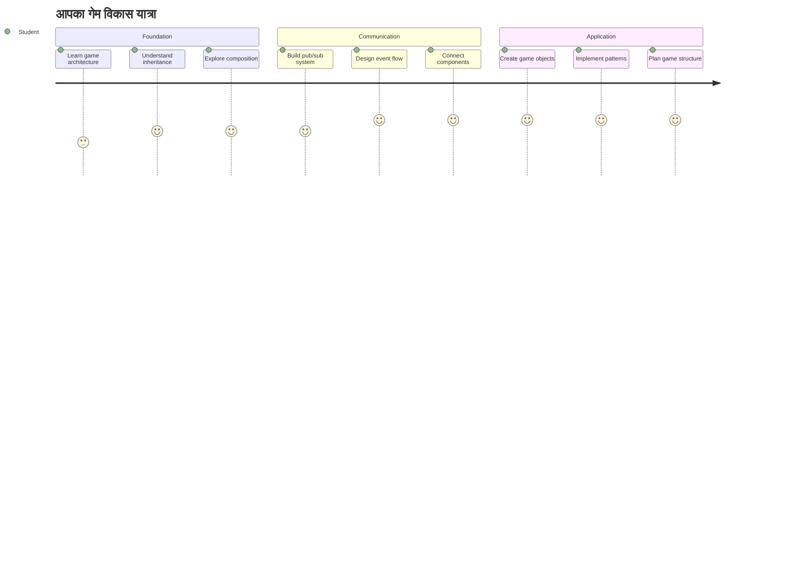
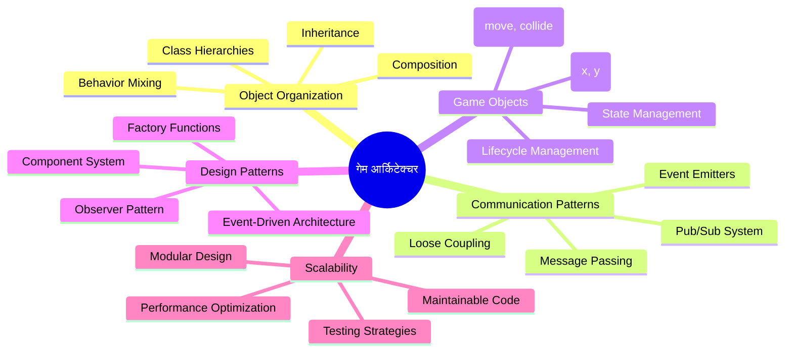
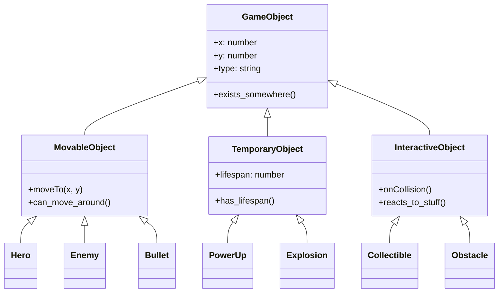
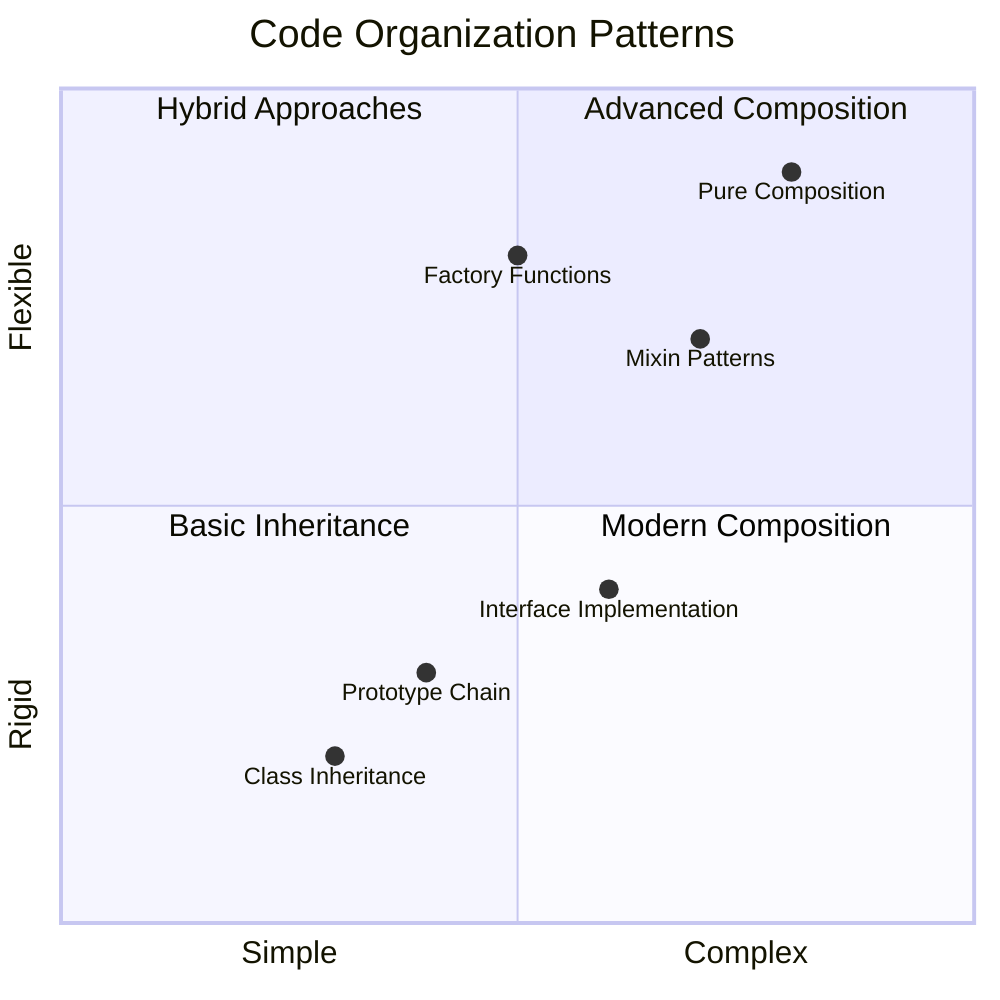
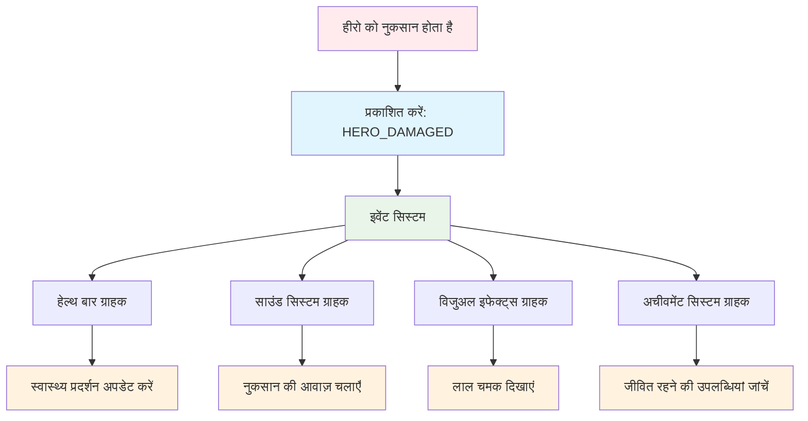
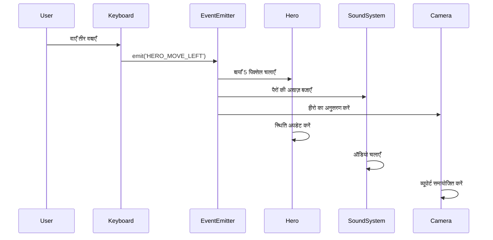
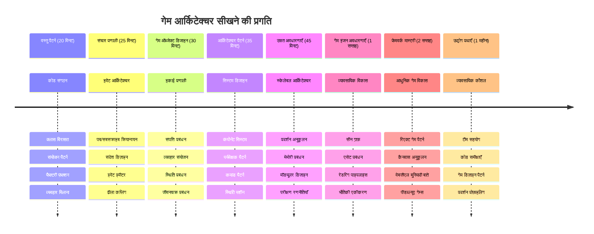

<!--
CO_OP_TRANSLATOR_METADATA:
{
  "original_hash": "a6332a7bb4d0be3bfd24199c83993777",
  "translation_date": "2026-01-06T16:27:07+00:00",
  "source_file": "6-space-game/1-introduction/README.md",
  "language_code": "hi"
}
-->
# अंतरिक्ष खेल बनाएं भाग 1: परिचय




जैसे NASA का मिशन नियंत्रण कई सिस्टमों का संयोजन करता है एक अंतरिक्ष लॉन्च के दौरान, हम एक अंतरिक्ष खेल बनाएंगे जो दिखाता है कि एक प्रोग्राम के विभिन्न भाग कैसे सहजता से मिलकर काम कर सकते हैं। कुछ ऐसा बनाते हुए जिसे आप वास्तव में खेल सकते हैं, आप आवश्यक प्रोग्रामिंग अवधारणाएँ सीखेंगे जो किसी भी सॉफ़्टवेयर परियोजना पर लागू होती हैं।

हम कोड को व्यवस्थित करने के दो मौलिक दृष्टिकोण: विरासत (inheritance) और संघटन (composition) का पता लगाएंगे। ये केवल शैक्षणिक अवधारणाएं नहीं हैं – यही पैटर्न वीडियो गेम से लेकर बैंकिंग सिस्टम तक सब कुछ चलाते हैं। हम एक संचार प्रणाली जिसे pub/sub कहा जाता है भी लागू करेंगे जो अंतरिक्ष यान में उपयोग किए जाने वाले संचार नेटवर्क की तरह काम करता है, जिससे विभिन्न घटक बिना निर्भरता बनाए जानकारी साझा कर सकते हैं।

इस श्रृंखला के अंत तक, आप समझ जाएंगे कि कैसे ऐसे एप्लिकेशन बनाए जाएं जो स्केल कर सकें और विकास कर सकें – चाहे आप गेम, वेब एप्लिकेशन, या कोई अन्य सॉफ़्टवेयर सिस्टम बना रहे हों।


## पूर्व-व्याख्यान क्विज़

[पूर्व-व्याख्यान क्विज़](https://ff-quizzes.netlify.app/web/quiz/29)

## खेल विकास में विरासत और संघटन

जैसे-जैसे परियोजनाएं जटिल होती हैं, कोड संगठन महत्वपूर्ण हो जाता है। जो कुछ सरल स्क्रिप्ट के रूप में शुरू होता है, वह बिना उचित संरचना के बनाए रखना मुश्किल हो सकता है – ठीक वैसे ही जैसे अपोलो मिशन में हजारों घटकों के बीच सावधानीपूर्वक समन्वय की जरूरत थी।

हम कोड को व्यवस्थित करने के दो मौलिक दृष्टिकोणों का पता लगाएंगे: विरासत और संघटन। प्रत्येक के अपने विशिष्ट लाभ हैं, और दोनों को समझकर आप अलग-अलग परिस्थितियों के लिए सही तरीका चुन सकते हैं। हम इन अवधारणाओं को हमारे अंतरिक्ष खेल के माध्यम से प्रदर्शित करेंगे, जहाँ नायक, दुश्मन, पावर-अप्स, और अन्य वस्तुएं कुशलतापूर्वक बातचीत करनी होती हैं।

✅ सबसे प्रसिद्ध प्रोग्रामिंग किताबों में से एक [डिज़ाइन पैटर्न](https://en.wikipedia.org/wiki/Design_Patterns) से संबंधित है।

किसी भी गेम में, आपके पास `गेम ऑब्जेक्ट्स` होते हैं – इंटरैक्टिव तत्व जो आपके गेम की दुनिया को आबाद करते हैं। नायक, दुश्मन, पावर-अप्स, और दृश्य प्रभाव सभी गेम ऑब्जेक्ट होते हैं। हर एक विशिष्ट स्क्रीन निर्देशांकों के साथ मौजूद होता है जो `x` और `y` मानों का उपयोग करता है, ठीक वैसे जैसे निर्देशांक पटल पर बिंदु बनाए जाते हैं।

दृश्य रूप से अलग होने के बावजूद, ये वस्तुएं अक्सर मौलिक व्यवहार साझा करती हैं:

- **वे कहीं मौजूद हैं** – हर वस्तु के पास x और y निर्देशांक होते हैं ताकि गेम इसे कहां ड्रॉ करना है जान सके
- **कई चल भी सकते हैं** – नायक दौड़ते हैं, दुश्मन पीछा करते हैं, गोलियाँ स्क्रीन पर उड़ती हैं
- **उनकी एक जीवन अवधि होती है** – कुछ हमेशा रहते हैं, कुछ (जैसे विस्फोट) थोड़े समय के लिए प्रकट होते हैं और गायब हो जाते हैं
- **वे प्रतिक्रियाएँ देते हैं** – जब टकराव होता है, पावर-अप्स इकट्ठा होते हैं, स्वास्थ्य बार अपडेट होते हैं

✅ एक खेल जैसे Pac-Man के बारे में सोचें। क्या आप ऊपर सूचीबद्ध चार वस्तु प्रकारों की पहचान कर सकते हैं?


### कोड के माध्यम से व्यवहार व्यक्त करना

अब जब आप समझ गए हैं कि गेम ऑब्जेक्ट्स सामान्यतः कौन-कौन से व्यवहार साझा करते हैं, आइए देखें कि इन्हें JavaScript में कैसे लागू किया जाए। आप ऑब्जेक्ट व्यवहार को क्लास या व्यक्तिगत ऑब्जेक्ट से जुड़े मेथड के माध्यम से व्यक्त कर सकते हैं, और चुनने के लिए कई दृष्टिकोण मौजूद हैं।

**क्लास-आधारित दृष्टिकोण**

क्लास और विरासत गेम ऑब्जेक्ट्स को व्यवस्थित करने के लिए एक संरचित तरीका प्रदान करते हैं। जैसे कार्ल लिनियस द्वारा विकसित वर्गीकरण प्रणाली, आप एक आधार क्लास के साथ शुरू करते हैं जिसमें सामान्य गुण होते हैं, फिर विशेष क्लास बनाते हैं जो इन मूलभूत बातों को विरासत में लेते हुए विशिष्ट क्षमताएं जोड़ते हैं।

✅ विरासत समझना एक महत्वपूर्ण अवधारणा है। [MDN के लेख](https://developer.mozilla.org/docs/Web/JavaScript/Inheritance_and_the_prototype_chain) पर और जानें।

यहाँ दर्शाया गया है कि आप क्लास और विरासत का उपयोग करके गेम ऑब्जेक्ट्स कैसे बना सकते हैं:

```javascript
// चरण 1: बेस GameObject क्लास बनाएं
class GameObject {
  constructor(x, y, type) {
    this.x = x;
    this.y = y;
    this.type = type;
  }
}
```

**आइए इसे चरण दर चरण समझते हैं:**
- हम एक मूल टेम्प्लेट बना रहे हैं जिसका उपयोग हर गेम ऑब्जेक्ट कर सकता है
- कंस्ट्रक्टर में वस्तु की स्थिति (`x`, `y`) और किस तरह की वस्तु है उसे सेव किया जाता है
- यह वह आधार बनता है जिस पर आपके सभी गेम ऑब्जेक्ट्स का निर्माण होगा

```javascript
// चरण 2: विरासत के माध्यम से गति क्षमता जोड़ें
class Movable extends GameObject {
  constructor(x, y, type) {
    super(x, y, type); // पैरेंट कंस्ट्रक्टर को कॉल करें
  }

  // नई स्थिति पर जाने की क्षमता जोड़ें
  moveTo(x, y) {
    this.x = x;
    this.y = y;
  }
}
```

**उपरोक्त में, हमने:**
- गेमऑब्जेक्ट क्लास का विस्तार किया ताकि मूवमेंट कार्यक्षमता जोड़ी जा सके
- विरासत प्राप्त गुणों को प्रारंभ करने के लिए `super()` का उपयोग कर पैरेंट कंस्ट्रक्टर कॉल किया
- `moveTo()` मेथड जोड़ा जो ऑब्जेक्ट की स्थिति अपडेट करता है

```javascript
// चरण 3: विशिष्ट खेल वस्तु प्रकार बनाएं
class Hero extends Movable {
  constructor(x, y) {
    super(x, y, 'Hero'); // प्रकार स्वचालित रूप से सेट करें
  }
}

class Tree extends GameObject {
  constructor(x, y) {
    super(x, y, 'Tree'); // पेड़ों को गति की आवश्यकता नहीं है
  }
}

// चरण 4: अपने खेल वस्तुओं का उपयोग करें
const hero = new Hero(0, 0);
hero.moveTo(5, 5); // हीरो चल सकता है!

const tree = new Tree(10, 15);
// tree.moveTo() त्रुटि देगा - पेड़ नहीं चल सकते
```

**इन अवधारणाओं को समझना:**
- योग्य व्यवहार विरासत में लेने वाले विशेषीकृत ऑब्जेक्ट प्रकार बनाता है
- दिखाता है कि विरासत कैसे चयनात्मक फीचर शामिल करने की अनुमति देता है
- दर्शाता है कि नायक चल सकते हैं जबकि पेड़ जमे रहते हैं
- बताता है कि क्लास पदानुक्रम अवांछित क्रियाओं को रोकता है

✅ कुछ मिनट लें और Pac-Man के किसी नायक (जैसे Inky, Pinky, या Blinky) के बारे में कल्पना करें और सोचें कि इसे JavaScript में कैसे लिखा जाएगा।

**संघटन (Composition) का दृष्टिकोण**

संघटन एक मॉड्यूलर डिज़ाइन दर्शन का पालन करता है, ठीक वैसे जैसे इंजीनियर अंतरिक्ष यान को परस्पर बदलने योग्य घटकों से डिज़ाइन करते हैं। पैरेंट क्लास से विरासत लेने के बजाय, आप विशिष्ट व्यवहारों को मिलाकर उन वस्तुओं का निर्माण करते हैं जिनमें आवश्यक कार्यक्षमता होती है। यह तरीका कठोर पदानुक्रम प्रतिबंधों के बिना लचीलापन प्रदान करता है।

```javascript
// चरण 1: मूल व्यवहार वस्तुएं बनाएं
const gameObject = {
  x: 0,
  y: 0,
  type: ''
};

const movable = {
  moveTo(x, y) {
    this.x = x;
    this.y = y;
  }
};
```

**यह कोड क्या करता है:**
- स्थिति और प्रकार गुणों के साथ एक बेस `gameObject` परिभाषित करता है
- मूवमेंट फ़ंक्शनलिटी के साथ एक अलग `movable` व्यवहार वस्तु बनाता है
- स्थिति डेटा और मूवमेंट लॉजिक को स्वतंत्र रखकर जिम्मेदारियों को अलग करता है

```javascript
// चरण 2: व्यवहारों को मिलाकर वस्तुओं को संकलित करें
const movableObject = { ...gameObject, ...movable };

// चरण 3: विभिन्न वस्तु प्रकारों के लिए फ़ैक्टरी फ़ंक्शन बनाएं
function createHero(x, y) {
  return {
    ...movableObject,
    x,
    y,
    type: 'Hero'
  };
}

function createStatic(x, y, type) {
  return {
    ...gameObject,
    x,
    y,
    type
  };
}
```

**उपरोक्त में, हमने:**
- बेस ऑब्जेक्ट गुणों को मूवमेंट व्यवहार के साथ spread सिंटैक्स के जरिए संयोजित किया
- फैक्टरी फ़ंक्शन बनाए जो कस्टम ऑब्जेक्ट लौटाते हैं
- कठोर क्लास पदानुक्रम के बिना लचीले ऑब्जेक्ट निर्माण को सक्षम किया
- वस्तुओं को ठीक उसी व्यवहार के साथ सक्षम किया जिसकी उन्हें आवश्यकता है

```javascript
// चरण 4: अपने सम्मिलित ऑब्जेक्ट बनाएँ और उपयोग करें
const hero = createHero(10, 10);
hero.moveTo(5, 5); // बिल्कुल सही काम करता है!

const tree = createStatic(0, 0, 'Tree');
// tree.moveTo() अपरिभाषित है - कोई आंदोलन व्यवहार सम्मिलित नहीं किया गया था
```

**महत्वपूर्ण बिंदु याद रखें:**
- व्यवहारों को विरासत में लेने के बजाय मिलाकर वस्तुएं बनाता है
- कठोर विरासत पदानुक्रमों की तुलना में अधिक लचीलापन प्रदान करता है
- वस्तुओं को ठीक वही फीचर देता है जिनकी उन्हें जरूरत होती है
- साफ़ ऑब्जेक्ट संयोजन के लिए आधुनिक JavaScript स्प्रेड सिंटैक्स का उपयोग करता है

```

**Which Pattern Should You Choose?**

**Which Pattern Should You Choose?**



> 💡 **प्रो टिप**: दोनों पैटर्न आधुनिक JavaScript विकास में जगह पाते हैं। क्लास स्पष्ट पदानुक्रम के लिए बेहतर होते हैं, जबकि संघटन तब चमकता है जब आपको अधिकतम लचीलापन चाहिए।
> 
**कब किस दृष्टिकोण का उपयोग करें:**
- विरासत चुनें जब आपके पास स्पष्ट "है-एक" संबंध हों (जैसे, एक Hero *है-एक* Movable ऑब्जेक्ट)
- संघटन चुनें जब आपको "पास-एक" संबंध चाहिए (जैसे, एक Hero *के पास* मूवमेंट क्षमताएँ हैं)
- अपनी टीम की प्राथमिकताओं और परियोजना आवश्यकताओं पर विचार करें
- याद रखें कि आप एक ही एप्लिकेशन में दोनों दृष्टिकोण मिला सकते हैं

### 🔄 **शैक्षणिक जाँच-पड़ताल**
**ऑब्जेक्ट संगठन की समझ**: संचार पैटर्न पर जाने से पहले सुनिश्चित करें कि आप:
- ✅ विरासत और संघटन में अंतर समझा सकते हैं
- ✅ क्लास बनाम फैक्टरी फ़ंक्शन का उपयोग कब करना है पहचान सकते हैं
- ✅ विरासत में `super()` की कार्यप्रणाली समझते हैं
- ✅ गेम विकास के लिए प्रत्येक दृष्टिकोण के लाभ समझते हैं

**त्वरित स्व-परीक्षा**: आप ऐसे उड़ने वाले दुश्मन (Flying Enemy) को कैसे बनाएंगे जो चल भी सके और उड़ भी सके?
- **विरासत का दृष्टिकोण**: `class FlyingEnemy extends Movable`
- **संघटन का दृष्टिकोण**: `{ ...movable, ...flyable, ...gameObject }`

**वास्तविक दुनिया का कनेक्शन**: ये पैटर्न हर जगह दिखते हैं:
- **React घटक**: Props (संघटन) बनाम क्लास विरासत
- **गेम इंजन**: Entity-component सिस्टम संघटन का उपयोग करते हैं
- **मोबाइल ऐप्स**: UI फ्रेमवर्क आमतौर पर विरासत पदानुक्रमों का उपयोग करते हैं

## संचार पैटर्न: Pub/Sub सिस्टम

जैसे-जैसे एप्लिकेशन जटिल होते हैं, घटकों के बीच संचार प्रबंधित करना चुनौतीपूर्ण हो जाता है। प्रकाशन-आधारित सदस्यता पैटर्न (pub/sub) इस समस्या का समाधान करता है, रेडियो प्रसारण की तरह – एक ट्रांसमीटर कई रिसीवर्स तक पहुँच सकता है बिना यह जाने कि कौन सुन रहा है।

सोचिए जब नायक को नुकसान होता है: स्वास्थ्य बार अपडेट होता है, ध्वनि प्रभाव चलते हैं, दृश्य प्रतिक्रिया होती है। सीधे नायक ऑब्जेक्ट को इन सिस्टम्स से जोड़ने के बजाय, pub/sub नायक को "damage taken" संदेश प्रसारित करने की अनुमति देता है। कोई भी सिस्टम जो प्रतिक्रिया देना चाहता है, इस संदेश प्रकार को सब्सक्राइब कर सकता है और उत्तर दे सकता है।

✅ **Pub/Sub** का अर्थ है 'पब्लिश-सब्सक्राइब'


### Pub/Sub आर्किटेक्चर को समझना

pub/sub पैटर्न आपके एप्लिकेशन के विभिन्न हिस्सों को कम जोड़े गए (loosely coupled) रखता है, मतलब वे बिना सीधे निर्भरता के साथ काम कर सकते हैं। यह पृथक्करण आपके कोड को अधिक बनाए रखने योग्य, परीक्षण योग्य, और परिवर्तनों के लिए लचीला बनाता है।

**Pub/Sub के मुख्य खिलाड़ी:**
- **संदेश (Messages)** – सरल टेक्स्ट लेबल जैसे `'PLAYER_SCORED'` जो बताते हैं कि क्या हुआ (और अतिरिक्त जानकारी)
- **प्रकाशक (Publishers)** – वे ऑब्जेक्ट जो "कुछ हुआ!" को सभी सुनने वालों को बताते हैं
- **सदस्यता लेने वाले (Subscribers)** – वे ऑब्जेक्ट जो कहते हैं "मुझे उस घटना की परवाह है" और जब वह होती है तो प्रतिक्रिया देते हैं
- **इवेंट सिस्टम** – वह मध्यस्थ जो सुनिश्चित करता है कि संदेश सही श्रोताओं तक पहुंचें

### इवेंट सिस्टम बनाना

आइए एक सरल लेकिन शक्तिशाली इवेंट सिस्टम बनाएं जो इन अवधारणाओं को दर्शाता है:

```javascript
// चरण 1: EventEmitter क्लास बनाएं
class EventEmitter {
  constructor() {
    this.listeners = {}; // सभी इवेंट लिस्नर्स को संग्रहित करें
  }
  
  // एक विशिष्ट संदेश प्रकार के लिए लिस्नर पंजीकृत करें
  on(message, listener) {
    if (!this.listeners[message]) {
      this.listeners[message] = [];
    }
    this.listeners[message].push(listener);
  }
  
  // सभी पंजीकृत लिस्नर्स को संदेश भेजें
  emit(message, payload = null) {
    if (this.listeners[message]) {
      this.listeners[message].forEach(listener => {
        listener(message, payload);
      });
    }
  }
}
```

**यहाँ क्या होता है:**
- एक सेंट्रल इवेंट प्रबंधन प्रणाली बनाता है एक सरल क्लास का उपयोग करके
- संदेश के प्रकार के आधार पर लिसनर्स को एक ऑब्जेक्ट में संग्रहीत करता है
- नए लिसनर्स को `on()` मेथड से पंजीकृत करता है
- सभी इच्छुक लिसनर्स को `emit()` के साथ संदेश प्रसारित करता है
- आवश्यक जानकारी भेजने के लिए वैकल्पिक डेटा पेलोड का समर्थन करता है

### सब कुछ एक साथ रखना: एक व्यावहारिक उदाहरण

चलिए इसे क्रियान्वित करें! हम एक सरल मूवमेंट सिस्टम बनाएंगे जो दिखाएगा कि pub/sub कितना साफ़ और लचीला हो सकता है:

```javascript
// चरण 1: अपने संदेश प्रकार परिभाषित करें
const Messages = {
  HERO_MOVE_LEFT: 'HERO_MOVE_LEFT',
  HERO_MOVE_RIGHT: 'HERO_MOVE_RIGHT',
  ENEMY_SPOTTED: 'ENEMY_SPOTTED'
};

// चरण 2: अपनी इवेंट सिस्टम और गेम ऑब्जेक्ट्स बनाएं
const eventEmitter = new EventEmitter();
const hero = createHero(0, 0);
```

**यह कोड क्या करता है:**
- संदेश नामों में टाइपो से बचने के लिए एक कॉन्स्टेंट ऑब्जेक्ट परिभाषित करता है
- सभी संचार संभालने के लिए इवेंट एमिटर इंस्टेंस बनाता है
- नायक ऑब्जेक्ट को शुरुआती स्थिति में इनिशियलाइज़ करता है

```javascript
// चरण 3: ईवेंट लिस्नर्स (सब्सक्राइबर) सेट करें
eventEmitter.on(Messages.HERO_MOVE_LEFT, () => {
  hero.moveTo(hero.x - 5, hero.y);
  console.log(`Hero moved to position: ${hero.x}, ${hero.y}`);
});

eventEmitter.on(Messages.HERO_MOVE_RIGHT, () => {
  hero.moveTo(hero.x + 5, hero.y);
  console.log(`Hero moved to position: ${hero.x}, ${hero.y}`);
});
```

**उपरोक्त में, हमने:**
- मूवमेंट संदेशों के लिए इवेंट लिसनर्स पंजीकृत किए
- मूवमेंट दिशा के आधार पर नायक की स्थिति अपडेट की
- नायक की स्थिति में बदलाव को कंसोल लॉग में दिखाया
- मूवमेंट लॉजिक को इनपुट हैंडलिंग से अलग रखा

```javascript
// चरण 4: कीबोर्ड इनपुट को इवेंट्स (प्रकाशक) से कनेक्ट करें
window.addEventListener('keydown', (event) => {
  switch(event.key) {
    case 'ArrowLeft':
      eventEmitter.emit(Messages.HERO_MOVE_LEFT);
      break;
    case 'ArrowRight':
      eventEmitter.emit(Messages.HERO_MOVE_RIGHT);
      break;
  }
});
```

**इन अवधारणाओं को समझना:**
- कीबोर्ड इनपुट को गेम इवेंट से बिना कड़ी जोड़े जोड़ता है
- इनपुट सिस्टम को गेम ऑब्जेक्ट्स से अप्रत्यक्ष रूप से संवाद करने देता है
- एक ही कीबोर्ड इवेंट पर कई सिस्टम प्रतिक्रिया कर सकते हैं
- की-बाइंडिंग बदलना या नए इनपुट विधियाँ जोड़ना आसान बनाता है


> 💡 **प्रो टिप**: इस पैटर्न की खूबसूरती इसका लचीलापन है! आप आसानी से साउंड इफेक्ट्स, स्क्रीन शेक, या पार्टिकल इफेक्ट्स जोड़ सकते हैं बस अतिरिक्त इवेंट लिसनर्स लगाकर – मौजूदा कीबोर्ड या मूवमेंट कोड को बदले बिना।
> 
**आपको यह तरीका क्यों पसंद आएगा:**
- नई सुविधाएं जोड़ना बेहद आसान हो जाता है – बस उन इवेंट्स को सुनें जिनकी आपको परवाह है
- कई चीज़ें एक ही इवेंट पर प्रतिक्रिया कर सकती हैं बिना टकराव के
- परीक्षण सरल हो जाता है क्योंकि हर हिस्सा स्वतंत्र रूप से काम करता है
- कोई खराबी होने पर आप ठीक जगह तुरंत जान सकते हैं

### क्यों Pub/Sub प्रभावी रूप से स्केल करता है

जैसे-जैसे एप्लिकेशन जटिल होते हैं, pub/sub पैटर्न सादगी बनाए रखता है। दर्जनों दुश्मनों, डायनामिक UI अपडेट्स, या ध्वनि सिस्टम को प्रबंधित करने में, यह पैटर्न स्केलिंग को बिना वास्तुकला बदलाव के संभालता है। नई सुविधाएँ मौजूदा इवेंट सिस्टम में बिना स्थापित कार्यक्षमता प्रभावित किए जुड़ जाती हैं।

> ⚠️ **सामान्य गलती**: सबसे पहले बहुत अधिक विशिष्ट संदेश प्रकार बनाने से बचें। व्यापक श्रेणियों से शुरुआत करें और जैसे-जैसे गेम की जरूरतें स्पष्ट हों, उन्हें परिष्कृत करें।
> 
**अच्छी प्रथाएँ:**
- संबंधित संदेशों को तार्किक श्रेणियों में समूहित करें
- स्पष्ट नामों का उपयोग करें जो बताएं कि क्या हुआ
- संदेश पेलोड्स को सरल और केंद्रित रखें
- टीम सहयोग के लिए अपने संदेश प्रकारों का दस्तावेज़ लें

### 🔄 **शैक्षणिक जाँच-पड़ताल**
**इवेंट-चालित आर्किटेक्चर की समझ**: पूर्ण सिस्टम पर अपनी पकड़ जांचें:
- ✅ pub/sub पैटर्न घटकों के बीच कड़ी निर्भरता कैसे रोकता है?
- ✅ इवेंट-चालित आर्किटेक्चर के साथ नई सुविधाएँ जोड़ना क्यों आसान है?
- ✅ संचार प्रवाह में EventEmitter की क्या भूमिका है?
- ✅ संदेश स्थिरांक (constants) बग्स कैसे रोकते हैं और रखरखाव सुधारते हैं?

**डिज़ाइन चुनौती**: pub/sub के साथ आप इन गेम परिदृश्यों को कैसे संभालेंगे?
1. **दुश्मन मरता है**: स्कोर अपडेट करें, ध्वनि चलाएं, पावर-अप स्पॉन करें, स्क्रीन से हटाएं
2. **लेवल पूरा हुआ**: संगीत रोकें, UI दिखाएं, प्रगति सहेजें, अगला स्तर लोड करें
3. **पावर-अप इकट्ठा हुआ**: क्षमताएं बढ़ाएं, UI अपडेट करें, प्रभाव चलाएं, टाइमर शुरू करें

**पेशेवर कनेक्शन**: यह पैटर्न इन में दिखता है:
- **फ्रंटेंड फ्रेमवर्क्स**: React/Vue इवेंट सिस्टम
- **बैकेंड सर्विसेज़**: माइक्रोसर्विस संचार
- **गेम इंजन**: Unity का इवेंट सिस्टम
- **मोबाइल विकास**: iOS/Android नोटिफिकेशन सिस्टम

---

## GitHub Copilot एजेंट चुनौती 🚀

एजेंट मोड का उपयोग करके निम्नलिखित चुनौती पूरी करें:

**विवरण:** विरासत और pub/sub पैटर्न दोनों का उपयोग करते हुए एक सरल गेम ऑब्जेक्ट सिस्टम बनाएं। आप एक बुनियादी गेम को लागू करेंगे जहाँ विभिन्न वस्तुएं घटनाओं के माध्यम से बिना एक-दूसरे को सीधे जाने संवाद कर सकती हैं।

**प्रॉम्प्ट:** एक जावास्क्रिप्ट गेम सिस्टम बनाएं जिसमें निम्नलिखित आवश्यकताएँ हों: 1) x, y निर्देशांकों और type प्रॉपर्टी के साथ एक बेस GameObject क्लास बनाएं। 2) Hero क्लास बनाएं जो GameObject का विस्तार करता है और चल सकता है। 3) Enemy क्लास बनाएं जो GameObject का विस्तार करता है और हीरो का पीछा कर सकता है। 4) pub/sub पैटर्न के लिए EventEmitter क्लास लागू करें। 5) इवेंट लिसनर्स सेटअप करें ताकि जब हीरो हिले, आसपास के दुश्मन 'HERO_MOVED' इवेंट प्राप्त करें और हीरो की ओर बढ़ें। ऑब्जेक्ट्स के बीच संचार दिखाने के लिए console.log कथन शामिल करें।

[agent mode](https://code.visualstudio.com/blogs/2025/02/24/introducing-copilot-agent-mode) के बारे में अधिक जानें।

## 🚀 चुनौती
विचार करें कि कैसे pub-sub पैटर्न गेम आर्किटेक्चर को बेहतर बना सकता है। पहचानें कि कौन से घटक इवेंट्स भेजें और सिस्टम को कैसे प्रतिक्रिया देनी चाहिए। एक गेम कॉन्सेप्ट डिज़ाइन करें और इसके घटकों के बीच संचार पैटर्न को मैप करें।

## पोस्ट-लेक्चर क्विज़

[पोस्ट-लेक्चर क्विज़](https://ff-quizzes.netlify.app/web/quiz/30)

## समीक्षा और स्वअध्ययन

Pub/Sub के बारे में और जानें [इसके बारे में पढ़कर](https://docs.microsoft.com/azure/architecture/patterns/publisher-subscriber/?WT.mc_id=academic-77807-sagibbon)।

### ⚡ **अगले 5 मिनट में आप क्या कर सकते हैं**
- [ ] कोई भी HTML5 गेम ऑनलाइन खोलें और उसके कोड को DevTools से जांचें
- [ ] एक सरल HTML5 कैनवास एलिमेंट बनाएं और एक बुनियादी आकृति खींचें
- [ ] `setInterval` का उपयोग करके एक साधारण एनीमेशन लूप बनाने की कोशिश करें
- [ ] Canvas API दस्तावेज़ का अन्वेषण करें और कोई ड्राइंग विधि आज़माएं

### 🎯 **इस घंटे में आप क्या प्राप्त कर सकते हैं**
- [ ] पोस्ट-लेसन क्विज़ पूरा करें और गेम डेवलपमेंट की अवधारणाओं को समझें
- [ ] अपने गेम प्रोजेक्ट की संरचना HTML, CSS, और JavaScript फ़ाइलों के साथ सेट करें
- [ ] एक बुनियादी गेम लूप बनाएं जो लगातार अपडेट और रेंडर करे
- [ ] कैनवास पर अपने पहले गेम स्प्राइट्स को बनाएं
- [ ] इमेज और साउंड के लिए बुनियादी एसेट लोडिंग लागू करें

### 📅 **आपका सप्ताह भर का गेम निर्माण**
- [ ] सभी नियोजित फीचर्स के साथ पूरा स्पेस गेम पूरा करें
- [ ] परिष्कृत ग्राफिक्स, साउंड इफेक्ट्स, और स्मूद एनीमेशन जोड़ें
- [ ] गेम स्टेट्स (स्टार्ट स्क्रीन, गेमप्ले, गेम ओवर) लागू करें
- [ ] स्कोरिंग सिस्टम और प्लेयर प्रोग्रेस ट्रैकिंग बनाएं
- [ ] अपने गेम को विभिन्न डिवाइसों पर रिस्पॉन्सिव और सुलभ बनाएं
- [ ] अपने गेम को ऑनलाइन साझा करें और खिलाड़ियों से प्रतिक्रिया प्राप्त करें

### 🌟 **आपका महीने भर का गेम विकास**
- [ ] विभिन्न शैली और यांत्रिकी के खेल बनाएं
- [ ] Phaser या Three.js जैसे गेम डेवलपमेंट फ्रेमवर्क सीखें
- [ ] ओपन सोर्स गेम डेवलपमेंट प्रोजेक्ट्स में योगदान दें
- [ ] उन्नत गेम प्रोग्रामिंग पैटर्न और अनुकूलन में महारत हासिल करें
- [ ] अपने गेम विकास कौशल को प्रदर्शित करने वाला पोर्टफोलियो बनाएं
- [ ] खेल विकास और इंटरैक्टिव मीडिया में रुचि रखने वालों को मेंटर करें

## 🎯 आपका गेम विकास मास्टरी टाइमलाइन


### 🛠️ आपके गेम आर्किटेक्चर टूलकिट का सारांश

इस पाठ को पूरा करने के बाद, आपके पास अब है:
- **डिज़ाइन पैटर्न मास्टरी**: विरासत बनाम संयोजन ट्रेडऑफ की समझ
- **इवेंट-चालित आर्किटेक्चर**: स्केलेबल संचार के लिए Pub/sub कार्यान्वयन
- **ऑब्जेक्ट-ओरिएंटेड डिज़ाइन**: क्लास हायरेरकी और व्यवहार संयोजन
- **आधुनिक JavaScript**: फैक्ट्री फंक्शंस, स्प्रेड सिंटैक्स, और ES6+ पैटर्न
- **स्केलेबल आर्किटेक्चर**: ढीली जोड़ और मॉड्यूलर डिज़ाइन सिद्धांत
- **गेम विकास आधार**: एन्टिटी सिस्टम और कम्पोनेंट पैटर्न
- **प्रोफेशनल पैटर्न्स**: कोड संगठन के लिए इंडस्ट्री-मानक दृष्टिकोण

**वास्तविक दुनिया के अनुप्रयोग**: ये पैटर्न सीधे लागू होते हैं:
- **फ्रंटएंड फ्रेमवर्क्स**: React/Vue कंपोनेंट आर्किटेक्चर और स्टेट मैनेजमेंट
- **बैकएंड सर्विसेज़**: माइक्रोसर्विस संचार और इवेंट-चालित सिस्टम
- **मोबाइल डेवलपमेंट**: iOS/Android ऐप आर्किटेक्चर और नोटिफिकेशन सिस्टम
- **गेम इंजन**: Unity, Unreal, और वेब-आधारित गेम विकास
- **एंटरप्राइज सॉफ्टवेयर**: इवेंट सोर्सिंग और वितरित सिस्टम डिज़ाइन
- **API डिज़ाइन**: RESTful सेवाएँ और रियल-टाइम संचार

**प्रोफेशनल स्किल्स प्राप्त**: अब आप कर सकते हैं:
- **डिज़ाइन** स्केलेबल सॉफ्टवेयर आर्किटेक्चर प्रमाणित पैटर्न का उपयोग करके
- **इम्प्लीमेंट** जटिल इंटरैक्शन संभालने वाले इवेंट-चालित सिस्टम
- **चुनें** विभिन्न परिदृश्यों के लिए उपयुक्त कोड संगठन रणनीतियाँ
- **डिबग** और प्रभावी ढंग से loosely coupled सिस्टम बनाए रखें
- **संचार करें** तकनीकी निर्णयों को उद्योग-मानक शब्दावली का उपयोग करके

**अगला स्तर**: आप इन पैटर्नों को वास्तविक गेम में लागू करने, उन्नत गेम विकास विषयों का अन्वेषण करने, या इन आर्किटेक्चरल संकल्पनाओं को वेब अनुप्रयोगों पर लागू करने के लिए तैयार हैं!

🌟 **उपलब्धि प्राप्त**: आपने मूल सॉफ्टवेयर आर्किटेक्चर पैटर्न्स में महारत हासिल कर ली है जो साधारण खेलों से लेकर जटिल एंटरप्राइज सिस्टम तक सभी को शक्ति देते हैं!

## असाइनमेंट

[एक गेम का मॉकअप बनाएं](assignment.md)

---

<!-- CO-OP TRANSLATOR DISCLAIMER START -->
**अस्वीकरण**:
इस दस्तावेज़ का अनुवाद एआई अनुवाद सेवा [Co-op Translator](https://github.com/Azure/co-op-translator) का उपयोग करके किया गया है। हालांकि हम सटीकता के लिए प्रयासरत हैं, कृपया ध्यान दें कि स्वचालित अनुवादों में त्रुटियाँ या गलतियाँ हो सकती हैं। मूल दस्तावेज़ अपनी मूल भाषा में अधिकृत स्रोत माना जाना चाहिए। महत्वपूर्ण जानकारी के लिए, पेशेवर मानव अनुवाद की सिफारिश की जाती है। इस अनुवाद के उपयोग से उत्पन्न किसी भी गलतफहमी या गलत व्याख्या के लिए हम जिम्मेदार नहीं हैं।
<!-- CO-OP TRANSLATOR DISCLAIMER END -->