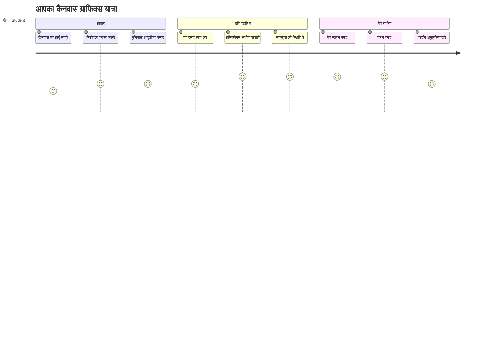
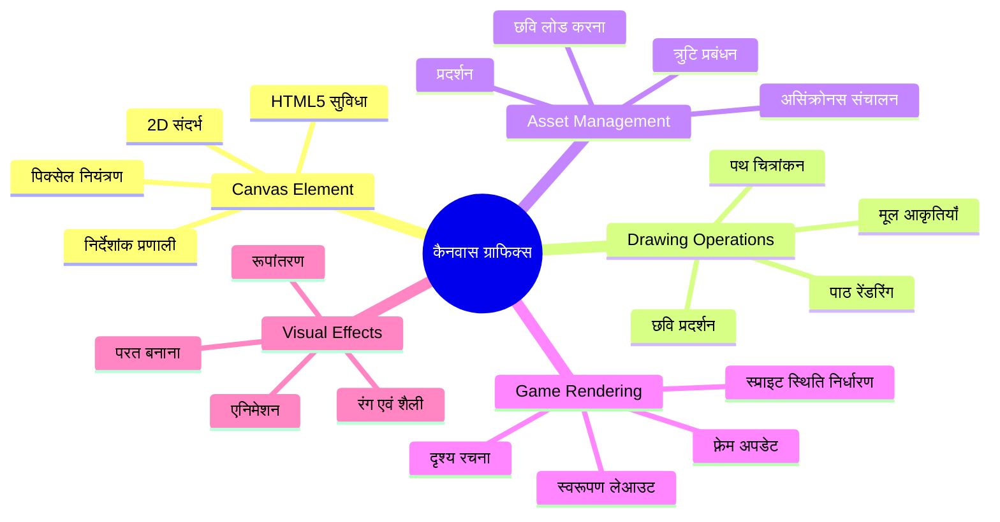
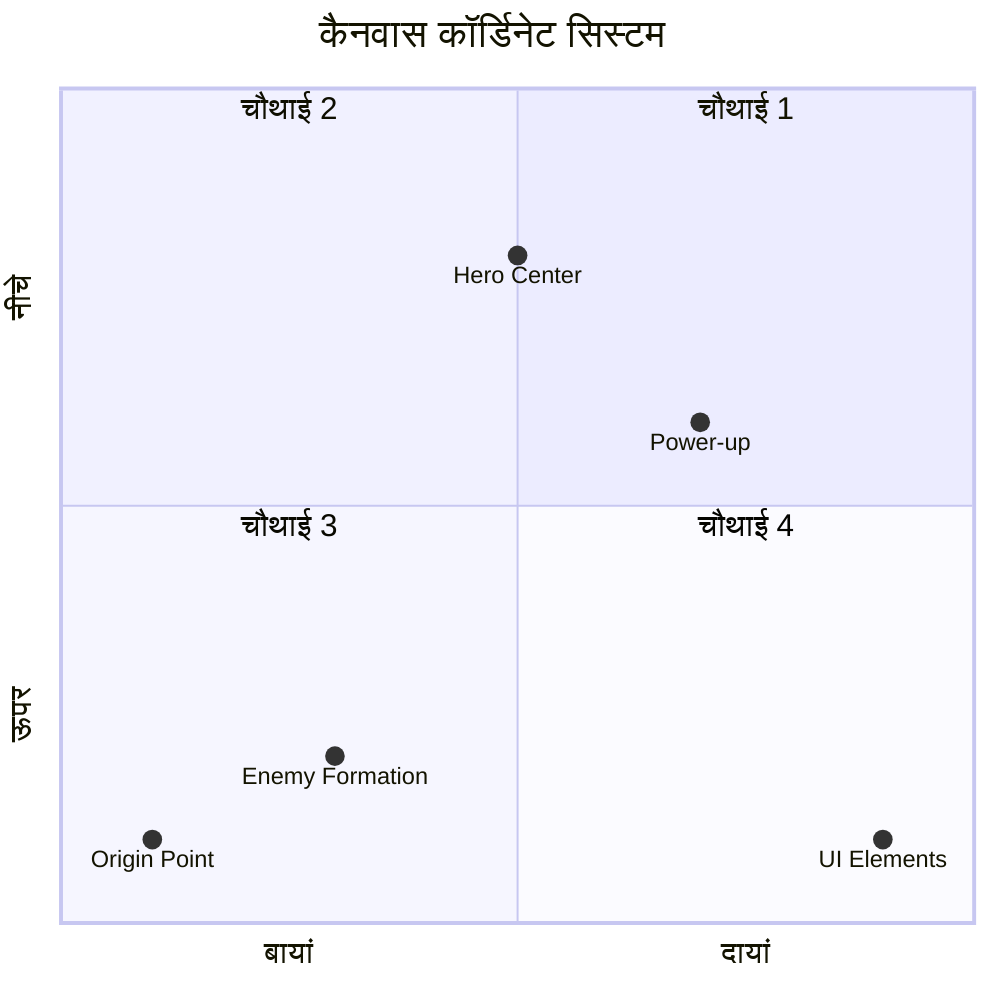
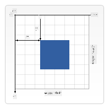
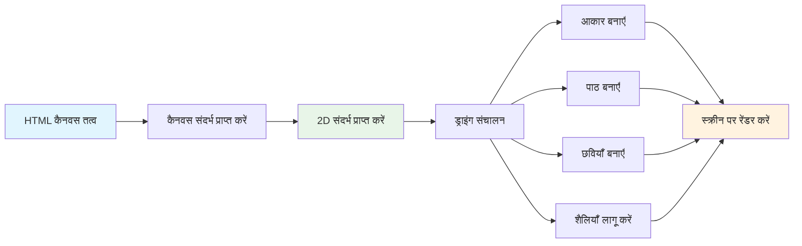
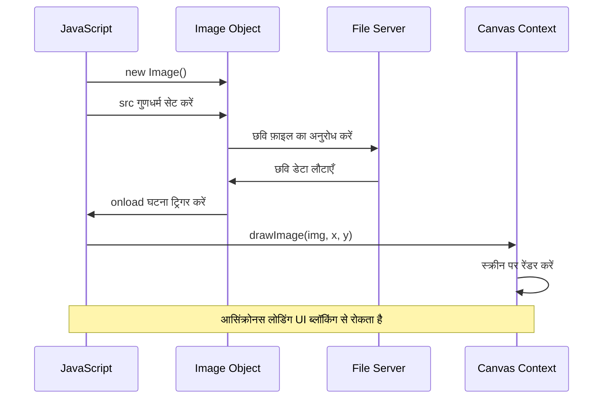
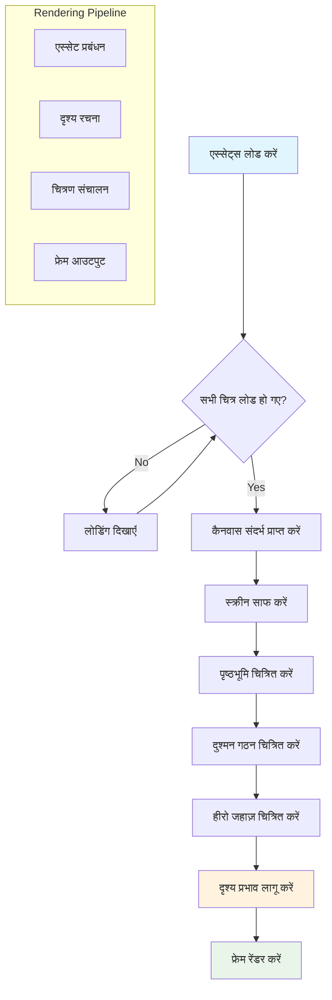
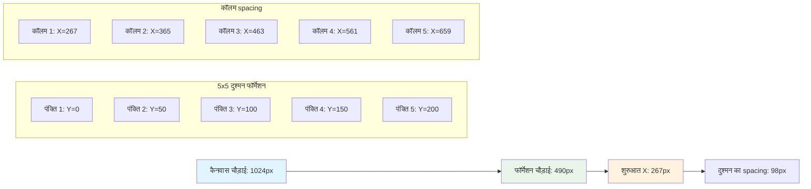
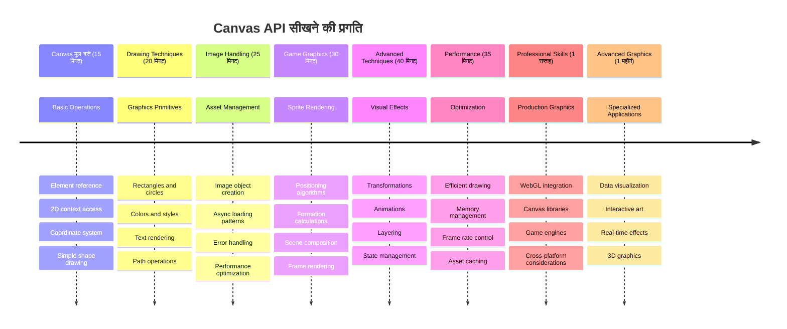

<!--
CO_OP_TRANSLATOR_METADATA:
{
  "original_hash": "7994743c5b21fdcceb36307916ef249a",
  "translation_date": "2026-01-06T16:20:36+00:00",
  "source_file": "6-space-game/2-drawing-to-canvas/README.md",
  "language_code": "hi"
}
-->
# स्पेस गेम बनाएँ भाग 2: हीरो और दानवों को कैनवास पर ड्रॉ करें


कैनवास API वेब विकास की सबसे शक्तिशाली विशेषताओं में से एक है जो आपके ब्राउज़र में डायनेमिक, इंटरेक्टिव ग्राफिक्स बनाने के लिए होती है। इस पाठ में, हम उस खाली HTML `<canvas>` तत्व को हीरो और मॉन्स्टर्स से भरे गेम वर्ल्ड में बदलेंगे। कैनवास को अपने डिजिटल आर्ट बोर्ड के रूप में सोचें जहाँ कोड दृश्य में बदल जाता है।

हम पिछली कक्षा में आपने जो सीखा है उस पर निर्माण कर रहे हैं, और अब हम दृश्यों के पहलुओं में डुबकी लगाएंगे। आप सीखेंगे कि कैसे गेम स्प्राइट्स को लोड और प्रदर्शित किया जाए, तत्वों को सटीक रूप से स्थित करें, और अपने स्पेस गेम के लिए दृश्य आधार तैयार करें। यह स्थैतिक वेब पन्नों और डायनेमिक, इंटरेक्टिव अनुभवों के बीच की खाई को पाटता है।

इस पाठ के अंत तक, आपके पास एक पूरा गेम दृश्य होगा जिसमें आपका हीरो जहाज़ सही स्थान पर होगा और दुश्मन का गठन लड़ाई के लिए तैयार होगा। आप समझ पाएंगे कि आधुनिक गेम ब्राउज़र में ग्राफिक्स कैसे रेंडर करते हैं और अपने इंटरैक्टिव दृश्य अनुभव बनाने के कौशल हासिल करेंगे। आइए कैनवास ग्राफिक्स का परिचय लें और अपने स्पेस गेम को जीवंत बनाएं!


## प्री-लेक्चर क्विज़

[प्री-लेक्चर क्विज़](https://ff-quizzes.netlify.app/web/quiz/31)

## कैनवास क्या है

तो यह `<canvas>` तत्व वास्तव में क्या है? यह HTML5 का समाधान है वेब ब्राउज़रों में डायनेमिक ग्राफिक्स और एनिमेशन बनाने का। सामान्य छवियों या वीडियो के विपरीत जो स्थैतिक होते हैं, कैनवास आपको स्क्रीन पर प्रदर्शित होने वाली हर चीज़ पर पिक्सेल-स्तरीय नियंत्रण देता है। यह गेम, डेटा विज़ुअलाइज़ेशन, और इंटरैक्टिव कला के लिए बिल्कुल उपयुक्त है। इसे एक प्रोग्रामेबल ड्राइंग सतह के रूप में सोचें जहां JavaScript आपका पेंटब्रश बन जाता है।

डिफ़ॉल्ट रूप से, कैनवास तत्व आपके पेज पर एक खाली, पारदर्शी आयत के रूप में दिखता है। लेकिन यही इसकी क्षमता है! इसका वास्तविक बल तब प्रकट होता है जब आप JavaScript का उपयोग करके आकृतियाँ बनाते हैं, छवियाँ लोड करते हैं, एनिमेशन बनाते हैं, और यूज़र इंटरैक्शन पर प्रतिक्रिया करते हैं। यह उसी तरह है जैसे 1960 के दशक के बेल लैब्स के शुरुआती कंप्यूटर ग्राफिक्स पायनियरों ने पहली डिजिटल एनिमेशन बनाने के लिए हर पिक्सेल प्रोग्राम करना पड़ा था।

✅ MDN पर [कैनवास API के बारे में अधिक पढ़ें](https://developer.mozilla.org/docs/Web/API/Canvas_API)।

यह आमतौर पर पेज की बॉडी में इस तरह घोषित किया जाता है:

```html
<canvas id="myCanvas" width="200" height="100"></canvas>
```

**यह कोड क्या करता है:**
- **`id` सेट करता है** ताकि आप JavaScript में इस विशिष्ट कैनवास तत्व को संदर्भित कर सकें
- **चौड़ाई (width)** पिक्सेल में परिभाषित करता है ताकि कैनवास की क्षैतिज माप नियंत्रित हो सके
- **ऊँचाई (height)** पिक्सेल में निर्धारित करता है ताकि कैनवास की लंबवत माप निर्धारित हो सके

## सरल ज्यामिति ड्रॉ करना

अब जब आप जानते हैं कि कैनवास तत्व क्या है, तो चलिए वास्तव में उस पर ड्रॉ करना सीखते हैं! कैनवास एक निर्देशांक प्रणाली का उपयोग करता है जो गणित कक्षा से परिचित हो सकती है, लेकिन कंप्यूटर ग्राफिक्स के लिए एक महत्वपूर्ण मोड़ के साथ।

कैनवास कार्टेशियन निर्देशांक प्रणाली का उपयोग करता है जिसमें x-अक्ष (क्षैतिज) और y-अक्ष (ऊर्ध्वाधर) होते हैं, जो आप जो कुछ भी ड्रॉ करते हैं उसे स्थित करते हैं। लेकिन मुख्य अंतर यह है: गणित कक्षा के निर्देशांक प्रणाली के विपरीत, मूल बिंदु `(0,0)` ऊपर-बाएँ कोने से शुरू होता है, जहाँ x मान दाईं ओर बढ़ते हैं और y मान नीचे की ओर बढ़ते हैं। यह तरीका पुराने कंप्यूटर डिस्प्ले से आया है जहाँ इलेक्ट्रॉन बीम ऊपर से नीचे स्कैन करते थे, जिससे ऊपर-बायां प्राकृतिक प्रारंभिक बिंदु बन गया।



> छवि [MDN](https://developer.mozilla.org/docs/Web/API/Canvas_API/Tutorial/Drawing_shapes) से

कैनवास तत्व पर ड्रॉ करने के लिए, आप तीन चरणों की प्रक्रिया का पालन करेंगे जो सभी कैनवास ग्राफिक्स की नींव है। जब आप इसे कुछ बार करते हैं, तो यह सहज हो जाता है:


1. **DOM से** अपने कैनवास तत्व का संदर्भ प्राप्त करें (जैसे किसी अन्य HTML तत्व के लिए करते हैं)
2. **2D रेंडरिंग संदर्भ प्राप्त करें** – यह सभी ड्रॉइंग मेथड प्रदान करता है
3. **ड्रॉइंग शुरू करें!** संदर्भ के अंतर्निहित मेथड्स का उपयोग करें अपने ग्राफिक्स बनाने के लिए

यह कोड में इस तरह दिखता है:

```javascript
// चरण 1: कैनवास एलिमेंट प्राप्त करें
const canvas = document.getElementById("myCanvas");

// चरण 2: 2D रेंडरिंग संदर्भ प्राप्त करें
const ctx = canvas.getContext("2d");

// चरण 3: भरने का रंग सेट करें और एक आयत बनाएं
ctx.fillStyle = 'red';
ctx.fillRect(0, 0, 200, 200); // x, y, चौड़ाई, ऊंचाई
```

**आइए इसे चरण दर चरण समझते हैं:**
- हम अपने canvas तत्व को उसके ID द्वारा पकड़ते हैं और इसे एक वेरिएबल में रखते हैं
- हम 2D रेंडरिंग संदर्भ प्राप्त करते हैं – यह हमारा ड्राइंग टूलकिट है
- हम कैनवास को बताते हैं कि हम चीज़ों को लाल रंग से भरना चाहते हैं `fillStyle` संपत्ति का उपयोग करके
- हम एक आयत ड्रॉ करते हैं जो ऊपर-बाएँ कोने (0,0) से शुरू होती है और 200 पिक्सेल चौड़ी और ऊंची होती है

✅ कैनवास API मुख्य रूप से 2D आकृतियों पर केंद्रित है, लेकिन आप किसी वेबसाइट पर 3D तत्व भी ड्रॉ कर सकते हैं; इसके लिए, आप [WebGL API](https://developer.mozilla.org/docs/Web/API/WebGL_API) का उपयोग कर सकते हैं।

आप कैनवास API के साथ विभिन्न प्रकार की चीजें ड्रॉ कर सकते हैं, जैसे:

- **ज्यामितीय आकृतियाँ**, हमने आयत ड्रॉ करना दिखा दिया है, लेकिन बहुत कुछ और ड्रॉ किया जा सकता है।
- **टेक्स्ट**, आप किसी भी फॉन्ट और रंग में टेक्स्ट ड्रॉ कर सकते हैं।
- **छवियाँ**, आप .jpg या .png जैसी छवि फ़ाइल के आधार पर छवि ड्रॉ कर सकते हैं।

✅ इसे आज़माएँ! आपको आयत ड्रॉ करना आता है, क्या आप पृष्ठ पर एक वृत्त ड्रॉ कर सकते हैं? CodePen पर कुछ दिलचस्प कैनवास ड्रॉइंग देखें। यहाँ एक [विशेष रूप से प्रभावशाली उदाहरण](https://codepen.io/dissimulate/pen/KrAwx) है।

### 🔄 **शैक्षिक समीक्षा**
**कैनवास मूल बातें समझना**: चित्र लोडिंग पर जाने से पहले सुनिश्चित करें कि आप:
- ✅ समझा सकते हैं कि कैनवास निर्देशांक प्रणाली गणितीय निर्देशांकों से कैसे अलग है
- ✅  कैनवास ड्रॉइंग संचालन के तीन-चरणीय प्रक्रिया को समझते हैं
- ✅ पहचान सकते हैं कि 2D रेंडरिंग संदर्भ क्या प्रदान करता है
- ✅ समझा सकते हैं कि fillStyle और fillRect साथ कैसे काम करते हैं

**त्वरित स्व-परीक्षण**: आप (100, 50) स्थिति पर त्रिज्या 25 के साथ नीला वृत्त कैसे ड्रॉ करेंगे?
```javascript
ctx.fillStyle = 'blue';
ctx.beginPath();
ctx.arc(100, 50, 25, 0, 2 * Math.PI);
ctx.fill();
```

**अब तक जो कैनवास ड्रॉइंग मेथड्स आपने सीखे हैं:**
- **fillRect()**: भरे हुए आयत ड्रॉ करता है
- **fillStyle**: रंग और पैटर्न सेट करता है
- **beginPath()**: नए ड्रॉइंग पथ शुरू करता है
- **arc()**: वृत्त और घुमाव बनाता है

## एक छवि संपत्ति लोड और ड्रॉ करना

बुनियादी आकृतियाँ ड्रॉ करना शुरू करने के लिए उपयोगी है, लेकिन अधिकांश गेम को वास्तविक छवियों की जरूरत होती है! स्प्राइट्स, बैकग्राउंड, और टेक्सचर गेम्स को उनकी दृश्य अपील देते हैं। कैनवास पर छवियाँ लोड करना और प्रदर्शित करना ज्यामितीय आकृतियों की ड्राइंग से अलग है, लेकिन एक बार प्रक्रिया समझ में आ जाए तो यह सरल है।

हमें एक `Image` ऑब्जेक्ट बनाना होगा, अपनी छवि फ़ाइल लोड करनी होगी (यह असिंक्रोनसली होता है, मतलब "पृष्ठभूमि में"), और फिर इसे कैनवास पर तैयार होने पर ड्रॉ करना होगा। यह तरीका यह सुनिश्चित करता है कि आपकी छवियाँ बिना आपका एप्लिकेशन ब्लॉक किए ठीक प्रदर्शित हों।


### मूल छवि लोडिंग

```javascript
const img = new Image();
img.src = 'path/to/my/image.png';
img.onload = () => {
  // छवि लोड हो गई है और उपयोग के लिए तैयार है
  console.log('Image loaded successfully!');
};
```

**इस कोड में क्या हो रहा है:**
- हम एक नया Image ऑब्जेक्ट बनाते हैं जो हमारा स्प्राइट या टेक्सचर रखेगा
- हम उसे स्रोत पथ सेट करके बताते हैं कि कौन-सी छवि लोड करनी है
- हम लोड इवेंट सुनते हैं ताकि हमें पता चले कि छवि कब उपयोग के लिए तैयार है

### छवियाँ लोड करने का बेहतर तरीका

यहाँ एक अधिक मजबूत तरीका दिया गया है जो पेशेवर डेवलपर्स सामान्यतः इस्तेमाल करते हैं। हम छवि लोडिंग को एक Promise-आधारित फ़ंक्शन में लपेटेंगे – यह तरीका, जो JavaScript Promises के ES6 में स्टैंडर्ड बनने के बाद लोकप्रिय हुआ, आपके कोड को अधिक व्यवस्थित बनाता है और त्रुटियों को सहजता से संभालता है:

```javascript
function loadAsset(path) {
  return new Promise((resolve, reject) => {
    const img = new Image();
    img.src = path;
    img.onload = () => {
      resolve(img);
    };
    img.onerror = () => {
      reject(new Error(`Failed to load image: ${path}`));
    };
  });
}

// आधुनिक उपयोग async/await के साथ
async function initializeGame() {
  try {
    const heroImg = await loadAsset('hero.png');
    const monsterImg = await loadAsset('monster.png');
    // छवियाँ अब उपयोग के लिए तैयार हैं
  } catch (error) {
    console.error('Failed to load game assets:', error);
  }
}
```

**हमने यहाँ क्या किया है:**
- सारी छवि लोडिंग लॉजिक को एक Promise में लपेटा ताकि इसे बेहतर तरीके से संभाला जा सके
- त्रुटि प्रबंधन जो हमें बताता है जब कुछ गलत होता है
- आधुनिक async/await सिंटैक्स का उपयोग किया क्योंकि यह पढ़ने में बहुत साफ और आसान है
- try/catch ब्लॉक शामिल किए ताकि लोडिंग में किसी भी दिक्कत को सहजता से संभाला जा सके

एक बार आपकी छवियाँ लोड हो जाएं, उन्हें कैनवास पर ड्रॉ करना वास्तव में काफी सरल है:

```javascript
async function renderGameScreen() {
  try {
    // गेम संसाधन लोड करें
    const heroImg = await loadAsset('hero.png');
    const monsterImg = await loadAsset('monster.png');

    // कैनवास और संदर्भ प्राप्त करें
    const canvas = document.getElementById("myCanvas");
    const ctx = canvas.getContext("2d");

    // चित्रों को विशिष्ट स्थानों पर डालें
    ctx.drawImage(heroImg, canvas.width / 2, canvas.height / 2);
    ctx.drawImage(monsterImg, 0, 0);
  } catch (error) {
    console.error('Failed to render game screen:', error);
  }
}
```

**चलिए इसे चरण दर चरण समझते हैं:**
- हम await का उपयोग कर पृष्ठभूमि में दोनों हीरो और मॉन्स्टर छवियाँ लोड करते हैं
- हम अपना कैनवास तत्व पकड़ते हैं और आवश्यक 2D रेंडरिंग संदर्भ प्राप्त करते हैं
- हम कुछ त्वरित निर्देशांक गणना का उपयोग कर हीरो छवि को ठीक केंद्र में स्थित करते हैं
- हम दुश्मन की प्रारंभिक पंक्ति के लिए मॉन्स्टर छवि को ऊपर-बाएं कोने पर रखते हैं
- हम किसी भी तरह की गलतियों को पकड़ते हैं जो लोडिंग या रेंडरिंग के दौरान हो सकती हैं


## अब आपका गेम बनाना शुरू करने का समय है

अब हम सब कुछ मिलाकर आपके स्पेस गेम के दृश्य आधार बनाएंगे। आपको कैनवास मूल बातें और छवि लोडिंग तकनीकें अच्छी तरह से समझ आई हैं, तो यह व्यावहारिक खंड आपको पूरी गेम स्क्रीन बनाने में मार्गदर्शन करेगा जिसमें स्प्राइट्स सही स्थान पर हों।

### क्या बनाना है

आप एक वेब पेज बनाएंगे जिसमें एक कैनवास तत्व होगा। इसे `1024*768` पर काले स्क्रीन को रेंडर करना चाहिए। हमने आपके लिए दो छवियाँ प्रदान की हैं:

- हीरो जहाज़

   

- 5*5 दानव

   

### विकास शुरू करने के लिए अनुशंसित कदम

वे आरंभिक फ़ाइलें जो आपके लिए बनाई गई हैं, उन्हें `your-work` उपफ़ोल्डर में खोजें। आपकी प्रोजेक्ट संरचना में निम्नलिखित होना चाहिए:

```bash
your-work/
├── assets/
│   ├── enemyShip.png
│   └── player.png
├── index.html
├── app.js
└── package.json
```

**आप किस चीज़ के साथ काम कर रहे हैं:**
- **गेम स्प्राइट्स** `assets/` फ़ोल्डर में रहते हैं ताकि सब कुछ व्यवस्थित रहे
- **आपकी मुख्य HTML फ़ाइल** कैनवास तत्व सेट करती है और सब कुछ तैयार करती है
- **एक JavaScript फ़ाइल** जहाँ आप अपना गेम रेंडरिंग मैजिक लिखेंगे
- **एक package.json** जो एक विकास सर्वर सेट करता है ताकि आप स्थानीय रूप से परीक्षण कर सकें

विकास शुरू करने के लिए इस फ़ोल्डर को Visual Studio Code में खोलें। आपको Visual Studio Code, NPM, और Node.js इंस्टॉल किए हुए स्थानीय विकास पर्यावरण की आवश्यकता होगी। यदि आपके कंप्यूटर पर `npm` सेटअप नहीं है, तो [इसे इंस्टॉल करने का तरीका यहाँ देखें](https://www.npmjs.com/get-npm)।

अपने विकास सर्वर को शुरू करने के लिए `your-work` फ़ोल्डर में नेविगेट करें:

```bash
cd your-work
npm start
```

**यह कमांड कुछ बढ़िया काम करता है:**
- **स्थानीय सर्वर शुरू करता है** `http://localhost:5000` पर ताकि आप अपना गेम टेस्ट कर सकें
- **आपकी सभी फ़ाइलों को ठीक से सर्व करता है** ताकि आपका ब्राउज़र उन्हें सही ढंग से लोड कर सके
- **आपकी फ़ाइलों में बदलाव पर नज़र रखता है** ताकि आप आसानी से डेवलपमेंट कर सकें
- **आपको पेशेवर विकास पर्यावरण प्रदान करता है** ताकि आप सब कुछ टेस्ट कर सकें

> 💡 **नोट:** आपका ब्राउज़र शुरुआत में एक खाली पेज दिखाएगा – यह अपेक्षित है! जैसे ही आप कोड जोड़ते हैं, अपने ब्राउज़र को रिफ्रेश करें ताकि आप बदलाव देखें। यह पुनरावृत्त विकास तरीका NASA द्वारा Apollo गाइडेंस कंप्यूटर बनाने जैसा है – हर कंपोनेंट का परीक्षण करने के बाद उसे अधिक बड़े सिस्टम में जोड़ा जाता है।

### कोड जोड़ें

`your-work/app.js` में आवश्यक कोड जोड़ें ताकि निम्न कार्य पूरे हों:

1. **कैनवास को काले रंग की पृष्ठभूमि के साथ ड्रॉ करें**
   > 💡 **इस तरह करें**: `/app.js` में TODO खोजें और केवल दो लाइनें जोड़ें। `ctx.fillStyle` को काले रंग पर सेट करें, फिर `ctx.fillRect()` का उपयोग करें शुरूआत (0,0) से कैनवास की चौड़ाई और ऊँचाई के साथ। आसान!

2. **गेम टेक्सचर लोड करें**
   > 💡 **इस तरह करें**: `await loadAsset()` का उपयोग करके अपने प्लेयर और दुश्मन की छवियाँ लोड करें। उन्हें वेरिएबल में स्टोर करें ताकि आप बाद में उन्हें उपयोग कर सकें। याद रखें – वे तब तक दिखाई नहीं देंगे जब तक आप उन्हें ड्रॉ न करें!

3. **हीरो जहाज़ को केंद्र-नीचे स्थिति पर ड्रॉ करें**
   > 💡 **इस तरह करें**: अपने हीरो को स्थित करने के लिए `ctx.drawImage()` का उपयोग करें। x निर्देशांक के लिए `canvas.width / 2 - 45` आज़माएं ताकि वह केंद्र में हो, और y निर्देशांक के लिए `canvas.height - canvas.height / 4` उपयोग करें ताकि वह नीचे के क्षेत्र में हो।

4. **5×5 दुश्मन जहाजों की संरचना ड्रॉ करें**
   > 💡 **इस तरह करें**: `createEnemies` फ़ंक्शन खोजें और नेस्टेड लूप सेट करें। आपको जगह और स्थितियों के लिए कुछ गणित करनी होगी, लेकिन चिंता न करें – मैं आपको बिल्कुल बताऊंगा!

सबसे पहले, सही दुश्मन संरचना लेआउट के लिए स्थिरांक निर्धारित करें:

```javascript
const ENEMY_TOTAL = 5;
const ENEMY_SPACING = 98;
const FORMATION_WIDTH = ENEMY_TOTAL * ENEMY_SPACING;
const START_X = (canvas.width - FORMATION_WIDTH) / 2;
const STOP_X = START_X + FORMATION_WIDTH;
```

**ये स्थिरांक क्या करते हैं, चलिए समझते हैं:**
- हम प्रति पंक्ति और स्तंभ 5 दुश्मन सेट करते हैं (सुंदर 5×5 ग्रिड)
- हम तय करते हैं कि दुश्मनों के बीच कितना स्थान होगा ताकि वे सघन न दिखें
- हम गणना करते हैं कि हमारी पूरी संरचना कितनी चौड़ी होगी
- हम पता लगाते हैं कि शुरुआत और अंत कहाँ होना चाहिए ताकि संरचना केंद्र में दिखे


फिर, दुश्मन संरचना ड्रॉ करने के लिए नेस्टेड लूप बनाएं:

```javascript
for (let x = START_X; x < STOP_X; x += ENEMY_SPACING) {
  for (let y = 0; y < 50 * 5; y += 50) {
    ctx.drawImage(enemyImg, x, y);
  }
}
```

**यह नेस्टेड लूप क्या करता है:**
- बाहरी लूप संरचना में बाएँ से दाएँ चलता है
- आंतरिक लूप ऊपर से नीचे जाता है ताकि साफ-पंक्तियाँ बन सकें
- हम प्रत्येक दुश्मन स्प्राइट को गणना किए गए सटीक x,y निर्देशांकों पर ड्रॉ करते हैं
- सब कुछ समान रूप से फैला होता है ताकि यह पेशेवर और व्यवस्थित दिखे

### 🔄 **शैक्षिक समीक्षा**
**गेम रेंडरिंग मास्टरी**: पूरी रेंडरिंग प्रणाली की समझ सुनिश्चित करें:
- ✅ गेम स्टार्टअप के दौरान असिंक्रोनस इमेज लोडिंग UI ब्लॉकिंग को कैसे रोकता है?
- ✅ हम क्यों दुश्मन संरचना की स्थिति को स्थिरांकों का उपयोग करके गणना करते हैं बजाय हार्डकोडिंग के?
- ✅ 2D रेंडरिंग संदर्भ ड्रॉइंग ऑपरेशंस में क्या भूमिका निभाता है?
- ✅ नेस्टेड लूप संगठित स्प्राइट संरचनाएँ कैसे बनाते हैं?

**प्रदर्शन विचार**: आपका गेम अब दिखाता है:
- **प्रभावी संपत्ति लोडिंग**: प्रॉमिस-आधारित इमेज प्रबंधन
- **संगठित रेंडरिंग**: संरचित ड्रॉइंग ऑपरेशंस
- **गणितीय स्थितिकरण**: गणना की गई स्प्राइट प्लेसमेंट
- **त्रुटि प्रबंधन**: सहज विफलता प्रबंधन

**दृश्य प्रोग्रामिंग अवधारणाएँ**: आपने सीखा:
- **समन्वय प्रणाली**: गणित को स्क्रीन स्थितियों में अनुवादित करना  
- **स्प्राइट प्रबंधन**: गेम ग्राफिक्स लोड करना और प्रदर्शित करना  
- **फॉर्मेशन एल्गोरिदम**: संगठित लेआउट के लिए गणितीय पैटर्न  
- **असिंक्रनस ऑपरेशन**: सॉफ़्ट उपयोगकर्ता अनुभव के लिए आधुनिक जावास्क्रिप्ट  

## परिणाम

पूरा परिणाम इस प्रकार दिखना चाहिए:


## समाधान

कृपया पहले स्वयं इसे हल करने का प्रयास करें, लेकिन अगर आप फंस जाएं तो [सॉल्यूशन](../../../../6-space-game/2-drawing-to-canvas/solution/app.js) देख सकते हैं।

---

## GitHub Copilot एजेंट चुनौती 🚀

एजेंट मोड का उपयोग करके निम्न चुनौती पूरी करें:

**विवरण:** Canvas API तकनीकों का उपयोग करके अपने स्पेस गेम कैनवास को दृश्य प्रभाव और इंटरएक्टिव एलिमेंट्स से बेहतर बनाएं।

**प्रॉम्प्ट:** एक नई फाइल `enhanced-canvas.html` बनाएं जिसमें एक कैनवास हो जो पृष्ठभूमि में एनिमेटेड तारे दिखाए, हीरो जहाज के लिए एक पल्सिंग हेल्थ बार हो, और दुश्मन के जहाज जो धीरे-धीरे नीचे की ओर चलते हों। एक जावास्क्रिप्ट कोड शामिल करें जो यादृच्छिक स्थानों और अपारदर्शिता का उपयोग करके टिमटिमाते हुए सितारों को ड्रा करे, ऐसा हेल्थ बार लागू करे जो स्वास्थ्य स्तर के आधार पर रंग बदलता हो (हरा > पीला > लाल), और एनिमेट करें दुश्मन के जहाजों को जो विभिन्न गति से स्क्रीन के नीचे की ओर जाते हों।

[एजेंट मोड](https://code.visualstudio.com/blogs/2025/02/24/introducing-copilot-agent-mode) के बारे में अधिक जानें।

## 🚀 चुनौती

आपने 2D-केंद्रित Canvas API के साथ ड्राइंग सीख लिया है; [WebGL API](https://developer.mozilla.org/docs/Web/API/WebGL_API) को देखें, और एक 3D ऑब्जेक्ट ड्रॉ करने का प्रयास करें।

## पोस्ट-लेक्चर क्विज़

[पोस्ट-लेक्चर क्विज़](https://ff-quizzes.netlify.app/web/quiz/32)

## समीक्षा और स्व-अध्ययन

Canvas API के बारे में अधिक जानने के लिए [इसका अध्ययन करें](https://developer.mozilla.org/docs/Web/API/Canvas_API)।

### ⚡ **अगले 5 मिनट में आप क्या कर सकते हैं**
- [ ] ब्राउज़र कंसोल खोलें और `document.createElement('canvas')` के साथ एक कैनवास एलिमेंट बनाएं  
- [ ] कैनवास संदर्भ पर `fillRect()` का उपयोग करके एक आयत बनाएँ  
- [ ] `fillStyle` प्रॉपर्टी का उपयोग कर विभिन्न रंगों के साथ प्रयोग करें  
- [ ] `arc()` मेथड का उपयोग करके एक सरल वृत्त ड्रॉ करें  

### 🎯 **इस घंटे में आप क्या प्राप्त कर सकते हैं**
- [ ] पोस्ट-लेसन क्विज़ पूरा करें और कैनवास की मूल बातें समझें  
- [ ] एक कैनवास ड्राइंग एप्लिकेशन बनाएं जिसमें कई आकृतियाँ और रंग हों  
- [ ] अपनी गेम के लिए इमेज लोडिंग और स्प्राइट रेंडरिंग लागू करें  
- [ ] एक सरल एनिमेशन बनाएं जो ऑब्जेक्ट्स को कैनवास पर हिलाए  
- [ ] कैनवास ट्रांसफ़ॉर्मेशन जैसे स्केलिंग, रोटेशन, और ट्रांसलेशन का अभ्यास करें  

### 📅 **आपकी सप्ताह भर की कैनवास यात्रा**
- [ ] पॉलिश किया हुआ स्पेस गेम बनाएं जिसमें ग्राफिक्स और स्प्राइट एनिमेशन हों  
- [ ] उन्नत कैनवास तकनीकों जैसे ग्रेडिएंट, पैटर्न, और कंपोज़िटिंग में महारत हासिल करें  
- [ ] डेटा प्रतिनिधित्व के लिए कैनवास का उपयोग करते हुए इंटरएक्टिव विज़ुअलाइज़ेशन बनाएं  
- [ ] स्मूथ प्रदर्शन के लिए कैनवास ऑप्टिमाइजेशन तकनीकों को सीखें  
- [ ] विभिन्न उपकरणों के साथ एक ड्राइंग या पेंटिंग एप्लिकेशन बनाएं  
- [ ] क्रिएटिव कोडिंग पैटर्न और जनरेटिव आर्ट के साथ कैनवास का अन्वेषण करें  

### 🌟 **आपका महीने भर का ग्राफिक्स मास्टरी**
- [ ] Canvas 2D और WebGL का उपयोग करके जटिल विज़ुअल एप्लिकेशन बनाएं  
- [ ] ग्राफिक्स प्रोग्रामिंग अवधारणाओं और शेडर मूल बातें सीखें  
- [ ] ओपन सोर्स ग्राफिक्स लाइब्रेरी और विज़ुअलाइज़ेशन टूल्स में योगदान करें  
- [ ] ग्राफिक्स-इंटेंसिव एप्लिकेशन के लिए प्रदर्शन अनुकूलन में महारत हासिल करें  
- [ ] कैनवास प्रोग्रामिंग और कंप्यूटर ग्राफिक्स के बारे में शैक्षिक सामग्री बनाएं  
- [ ] एक ग्राफिक्स प्रोग्रामिंग विशेषज्ञ बनें जो दूसरों को दृश्य अनुभव बनाने में मदद करता है  

## 🎯 आपका कैनवास ग्राफिक्स मास्टरी टाइमलाइन


### 🛠️ आपका कैनवास ग्राफिक्स टूलकिट सारांश

इस पाठ को पूरा करने के बाद, आपके पास अब है:
- **Canvas API मास्टरी**: 2D ग्राफिक्स प्रोग्रामिंग की पूरी समझ  
- **कोऑर्डिनेट गणित**: सटीक पोजीशनिंग और लेआउट एल्गोरिदम  
- **एसेट प्रबंधन**: पेशेवर इमेज लोडिंग और त्रुटि प्रबंधन  
- **रेंडरिंग पाइपलाइन**: दृश्य रचना के लिए संरचित दृष्टिकोण  
- **गेम ग्राफिक्स**: स्प्राइट पोजीशनिंग और फॉर्मेशन कैलकुलेशन  
- **असिंक्रनस प्रोग्रामिंग**: स्मूथ प्रदर्शन के लिए आधुनिक जावास्क्रिप्ट पैटर्न  
- **विज़ुअल प्रोग्रामिंग**: गणितीय अवधारणाओं को स्क्रीन ग्राफिक्स में अनुवादित करना  

**वास्तविक विश्व अनुप्रयोग**: आपके कैनवास कौशल सीधे लागू होते हैं:
- **डेटा विज़ुअलाइज़ेशन**: चार्ट, ग्राफ़, और इंटरएक्टिव डैशबोर्ड  
- **गेम डेवलपमेंट**: 2D गेम्स, सिमुलेशन, और इंटरएक्टिव अनुभव  
- **डिजिटल आर्ट**: क्रिएटिव कोडिंग और जनरेटिव आर्ट प्रोजेक्ट्स  
- **UI/UX डिजाइन**: कस्टम ग्राफिक्स और इंटरएक्टिव एलिमेंट्स  
- **शैक्षिक सॉफ़्टवेयर**: दृश्य सीखने के उपकरण और सिमुलेशन  
- **वेब एप्लिकेशन**: डायनेमिक ग्राफिक्स और रियल-टाइम विज़ुअलाइज़ेशन  

**प्रोफेशनल स्किल्स जो आपने हासिल की हैं**: अब आप कर सकते हैं:
- **निर्माण** कस्टम ग्राफिक्स सॉल्यूशंस बिना बाहरी लाइब्रेरी के  
- **ऑप्टिमाइज़ेशन** स्मूद उपयोगकर्ता अनुभव के लिए रेंडरिंग प्रदर्शन  
- **डिबग** जटिल दृश्य समस्याओं को ब्राउज़र डेवलपर टूल्स से  
- **डिज़ाइन** स्केलेबल ग्राफिक्स सिस्टम गणितीय सिद्धांतों के साथ  
- **एकीकरण** Canvas ग्राफिक्स को आधुनिक वेब एप्लिकेशन फ्रेमवर्क्स के साथ  

**Canvas API मेथड्स जिनमें आप निपुण हैं**:
- **एलिमेंट प्रबंधन**: getElementById, getContext  
- **ड्राइंग ऑपरेशन**: fillRect, drawImage, fillStyle  
- **एसेट लोडिंग**: इमेज ऑब्जेक्ट्स, प्रॉमिस पैटर्न  
- **गणितीय पोजीशनिंग**: कोऑर्डिनेट कैलकुलेशन, फॉर्मेशन एल्गोरिदम  

**अगला स्तर**: आप अब एनिमेशन, उपयोगकर्ता इंटरैक्शन, टक्क़र डिटेक्शन जोड़ने के लिए तैयार हैं, या 3D ग्राफिक्स के लिए WebGL एक्सप्लोर कर सकते हैं!

🌟 **उपलब्धि प्राप्त**: आपने बुनियादी Canvas API तकनीकों का उपयोग करते हुए एक पूर्ण गेम रेंडरिंग सिस्टम बनाया है!

## असाइनमेंट

[Canvas API के साथ खेलें](assignment.md)

---

<!-- CO-OP TRANSLATOR DISCLAIMER START -->
**अस्वीकरण**:  
इस दस्तावेज़ का अनुवाद AI अनुवाद सेवा [Co-op Translator](https://github.com/Azure/co-op-translator) का उपयोग करके किया गया है। जबकि हम सटीकता के लिए प्रयासरत हैं, कृपया ध्यान दें कि स्वचालित अनुवादों में त्रुटियाँ या अशुद्धियाँ हो सकती हैं। मूल दस्तावेज़ अपनी मूल भाषा में ही अधिकारिक स्रोत माना जाना चाहिए। महत्वपूर्ण जानकारी के लिए, पेशेवर मानव अनुवाद की सिफारिश की जाती है। इस अनुवाद के उपयोग से उत्पन्न किसी भी गलतफहमी या भ्रांतियों के लिए हम जिम्मेदार नहीं हैं।
<!-- CO-OP TRANSLATOR DISCLAIMER END -->