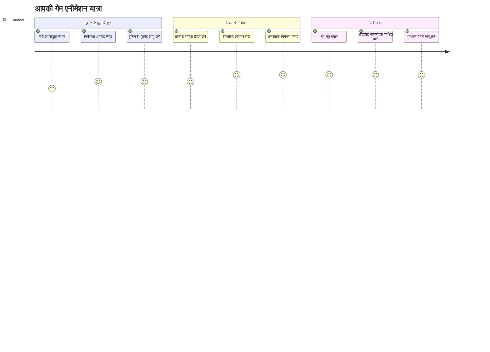
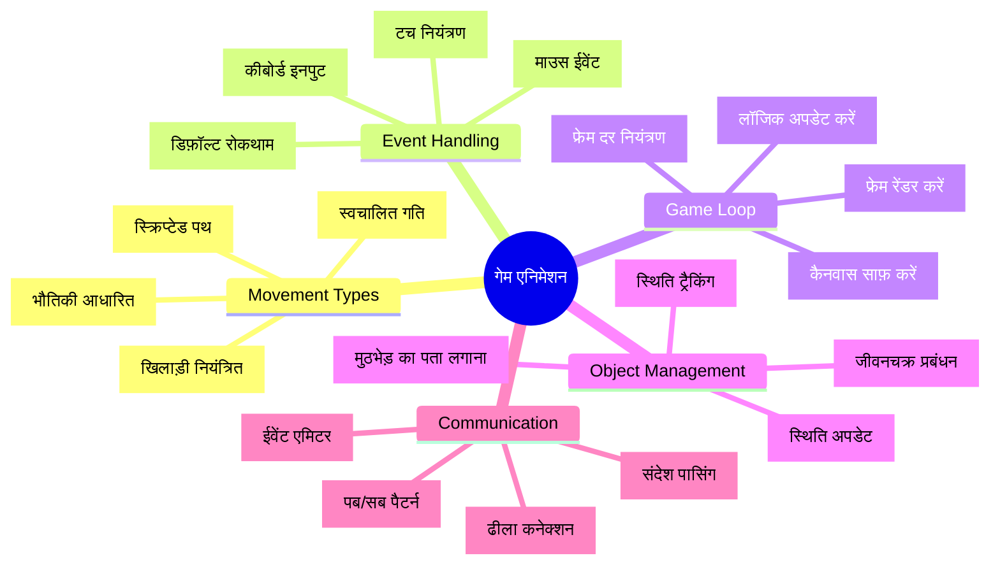
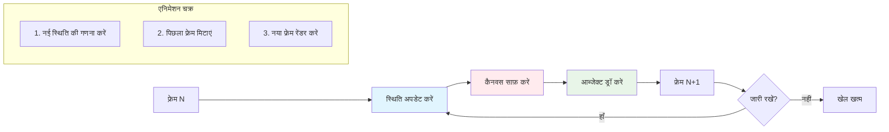
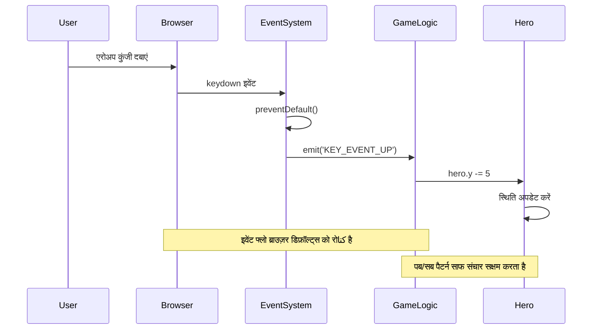
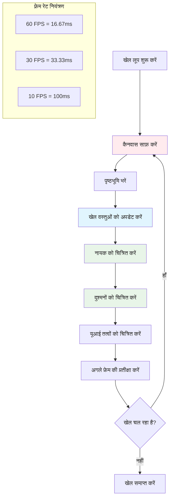
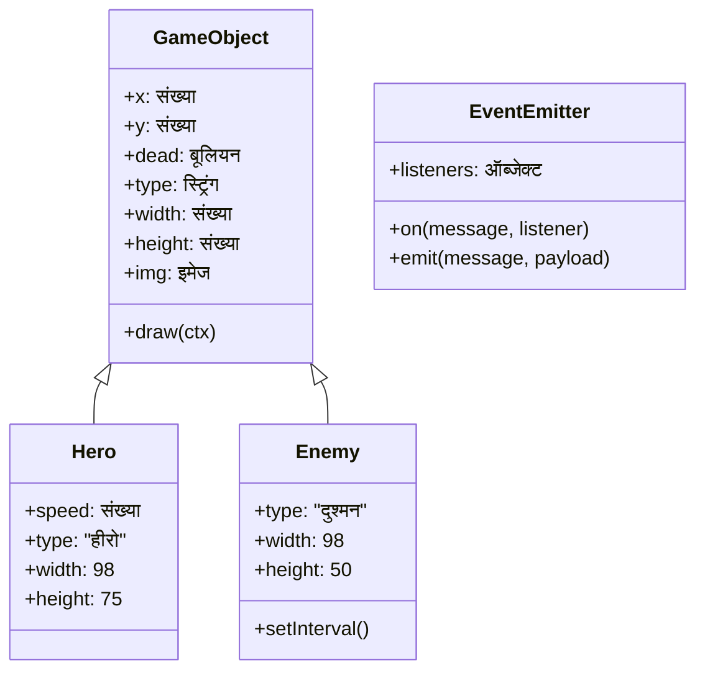
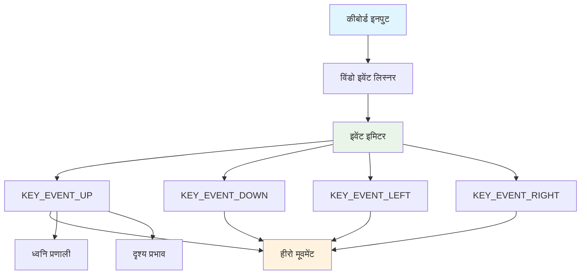
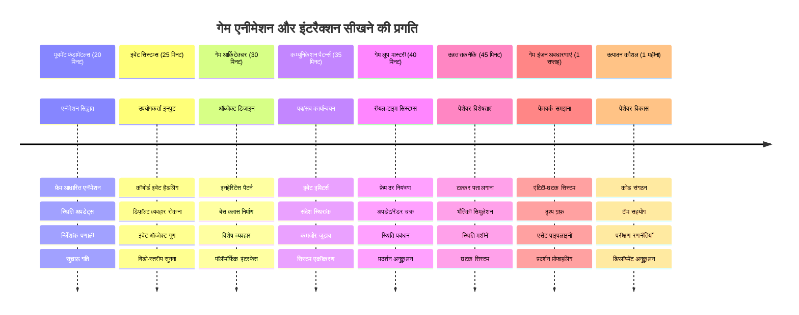

# एक अंतरिक्ष खेल बनाएं भाग 3: गति जोड़ना


अपने पसंदीदा खेलों के बारे में सोचें – जो चीज़ उन्हें आकर्षक बनाती है वह सिर्फ सुंदर ग्राफिक्स नहीं है, बल्कि सब कुछ कैसे चलता है और आपके क्रियाओं पर प्रतिक्रिया करता है। इस समय, आपका अंतरिक्ष खेल एक सुंदर चित्र की तरह है, लेकिन हम गति जोड़ने वाले हैं जो इसे जीवन्त बना देगा।

जब नासा के इंजीनियरों ने अपोलो मिशनों के लिए गाइडेंस कंप्यूटर प्रोग्राम किया, तो उन्हें एक समान चुनौती का सामना करना पड़ा: आप अंतरिक्ष यान को कैसे पायलट के इनपुट का जवाब देते हुए स्वचालित रूप से पाठ्यक्रम सुधार बनाए रख सकते हैं? आज हम जो सिद्धांत सीखेंगे वे उन्हीं अवधारणाओं को दोहराते हैं – खिलाड़ियों द्वारा नियंत्रित गति को स्वचालित सिस्टम व्यवहार के साथ प्रबंधित करना।

इस पाठ में, आप सीखेंगे कि कैसे अंतरिक्ष यान स्क्रीन पर ग्लाइड करते हैं, खिलाड़ी के आदेशों पर प्रतिक्रिया करते हैं, और चिकनी गति पैटर्न बनाते हैं। हम सब कुछ सरल अवधारणाओं में तोड़ेंगे जो स्वाभाविक रूप से एक-दूसरे पर आधारित हैं।

अंत तक, आपके खिलाड़ी अपने हीरो जहाज को स्क्रीन पर उड़ाते हुए देखेंगे जबकि दुश्मन जहाज ऊपर से गश्त करते रहेंगे। इससे भी महत्वपूर्ण, आप उन मूल सिद्धांतों को समझेंगे जो खेल गति प्रणालियों को शक्ति देते हैं।


## पूर्व-व्याख्यान क्विज़

[पूर्व-व्याख्यान क्विज़](https://ff-quizzes.netlify.app/web/quiz/33)

## खेल गति को समझना

जब चीज़ें चलने लगती हैं तो खेल जीवित हो उठते हैं, और यह मूल रूप से दो तरीकों से होता है:

- **खिलाड़ी नियंत्रित गति**: जब आप कोई कुंजी दबाते हैं या माउस क्लिक करते हैं, तो कुछ चलता है। यह आप और आपके खेल की दुनिया के बीच सीधा संपर्क है।
- **स्वचालित गति**: जब खेल खुद चीज़ें चलाने का निर्णय लेता है – जैसे वे दुश्मन जहाज जो स्क्रीन पर गश्त करते हैं चाहे आप कुछ भी कर रहे हों या नहीं।

कंप्यूटर स्क्रीन पर वस्तुओं को चलाना जितना आप सोचते हैं उससे कहीं आसान है। क्या आपको गणित की क्लास में x और y निर्देशांक याद हैं? वही हम यहाँ उपयोग कर रहे हैं। जब गेलिलियो ने 1610 में बृहस्पति के चंद्रमाओं को ट्रैक किया था, वे मूल रूप से वही कर रहे थे – गति पैटर्न को समझने के लिए समय के साथ स्थिति का प्लॉटिंग।

स्क्रीन पर वस्तुओं को चलाना फ्लिपबुक एनीमेशन बनाने जैसा है – आपको इन तीन सरल चरणों का पालन करना होता है:


1. **स्थिति अपडेट करें** – अपने ऑब्जेक्ट को जिस जगह होना चाहिए उसे बदलें (शायद इसे दाईं ओर 5 पिक्सेल स्थानांतरित करें)
2. **पुराना फ्रेम मिटाएं** – स्क्रीन को साफ़ करें ताकि कहीं भी भूतिया ट्रेल न दिखे
3. **नया फ्रेम बनाएं** – अपने ऑब्जेक्ट को नई जगह पर बनाएं

यह सब तेजी से करें, और धमाकेदार! आपके पास चिकनी गति होगी जो खिलाड़ियों को प्राकृतिक लगेगी।

यहाँ कोड में इसका क्या रूप हो सकता है:

```javascript
// नायक के स्थान को सेट करें
hero.x += 5;
// आयत को साफ करें जो नायक को होस्ट करता है
ctx.clearRect(0, 0, canvas.width, canvas.height);
// खेल की पृष्ठभूमि और नायक को पुनः चित्रित करें
ctx.fillRect(0, 0, canvas.width, canvas.height);
ctx.fillStyle = "black";
ctx.drawImage(heroImg, hero.x, hero.y);
```

**यह कोड क्या करता है:**
- नायक के x-निर्देशांक को क्षैतिज रूप से 5 पिक्सेल आगे बढ़ाता है
- पिछले फ्रेम को हटाने के लिए पूरे कैनवास क्षेत्र को साफ़ करता है
- कैनवास को काले पृष्ठभूमि रंग से भरता है
- नायक की छवि को उसकी नई स्थिति पर पुनः बनाता है

✅ क्या आप सोच सकते हैं कि अपने नायक को प्रति सेकंड कई फ्रेम्स में पुनः बनाने से प्रदर्शन पर क्या प्रभाव पड़ सकता है? इस पैटर्न के [वैकल्पिक तरीकों](https://developer.mozilla.org/en-US/docs/Web/API/Canvas_API/Tutorial/Optimizing_canvas) के बारे में पढ़ें।

## कीबोर्ड इवेंट्स को संभालना

यहाँ हम खिलाड़ी के इनपुट को खेल की क्रिया से जोड़ते हैं। जब कोई स्पेसबार दबाकर लेजर फायर करता है या ऐरो की दबाकर ऐस्टिरॉयड से बचता है, तो आपका खेल उस इनपुट का पता लगाना और प्रतिक्रिया देना चाहिए।

कीबोर्ड इवेंट्स विंडो स्तर पर होते हैं, जिसका मतलब है कि आपका पूरा ब्राउज़र विंडो उन की प्रेस पर सुनता है। वहीं, माउस क्लिक विशेष तत्वों से जुड़े हो सकते हैं (जैसे बटन पर क्लिक करना)। हमारे अंतरिक्ष खेल के लिए, हम कीबोर्ड नियंत्रणों पर ध्यान देंगे क्योंकि यही खिलाड़ियों को क्लासिक आर्केड अनुभव देता है।

यह मुझे 1800 के दशक के टेलीग्राफ ऑपरेटरों की याद दिलाता है, जिन्हें मोर्स कोड इनपुट को सार्थक संदेशों में अनुवाद करना होता था – हम भी कुछ इसी तरह कर रहे हैं, की प्रेस को खेल कमांड में बदलना।

इवेंट को संभालने के लिए आपको विंडो की `addEventListener()` विधि का उपयोग करना होगा और इसे दो इनपुट पैरामीटर देना होगा। पहला पैरामीटर इवेंट का नाम होता है, जैसे `keyup`। दूसरा पैरामीटर वह फ़ंक्शन होता है जो इवेंट होने पर कॉल किया जाएगा।

यहाँ एक उदाहरण है:

```javascript
window.addEventListener('keyup', (evt) => {
  // evt.key = कुंजी का स्ट्रिंग प्रतिनिधित्व
  if (evt.key === 'ArrowUp') {
    // कुछ करें
  }
});
```

**यहाँ क्या होता है:**
- पूरे विंडो पर कीबोर्ड इवेंट सुनता है
- इवेंट ऑब्जेक्ट को पकड़ता है जिसमें यह जानकारी होती है कि कौन सी कुंजी दबाई गई थी
- जांचता है कि दबाई गई कुंजी किसी विशिष्ट कुंजी से मेल खाती है (इस मामले में, ऊपर की एरो)
- जब शर्त पूरी होती है तो कोड चलाता है

कीबोर्ड इवेंट्स के लिए इवेंट में दो प्रॉपर्टीज़ होती हैं जिन्हें आप देख सकते हैं कि कौन सी कुंजी दबाई गई:

- `key` - यह दबाई गई कुंजी का स्ट्रिंग प्रतिनिधित्व होता है, जैसे `'ArrowUp'`
- `keyCode` - यह एक संख्या होती है, जैसे `37`, जो `ArrowLeft` को दर्शाती है

✅ कीबोर्ड इवेंट का उपयोग खेल विकास के बाहर भी उपयोगी है। आप इस तकनीक के और किन उपयोगों के बारे में सोच सकते हैं?


### विशेष कुंजी: ध्यान दें!

कुछ कुंजियाँ ब्राउज़र की अंतर्निहित क्रियाएँ करती हैं जो आपके खेल में बाधा डाल सकती हैं। ऐरो की पेज को स्क्रॉल करते हैं और स्पेसबार नीचे कूदता है – यह व्यवहार आप तब नहीं चाहते जब कोई अपने अंतरिक्ष यान को नियंत्रित कर रहा हो।

हम इन डिफ़ॉल्ट व्यवहारों को रोक सकते हैं और हमारे खेल को इनपुट को नियंत्रित करने दे सकते हैं। यह उसी तरह है जैसे प्रारंभिक कंप्यूटर प्रोग्रामरों ने सिस्टम इंटरप्ट्स को ओवरराइड करके कस्टम व्यवहार बनाए थे – हम बस इसे ब्राउज़र स्तर पर कर रहे हैं। यह तरीका है:

```javascript
const onKeyDown = function (e) {
  console.log(e.keyCode);
  switch (e.keyCode) {
    case 37:
    case 39:
    case 38:
    case 40: // तीर कुंजी
    case 32:
      e.preventDefault();
      break; // स्पेस
    default:
      break; // अन्य कुंजीओं को अवरुद्ध न करें
  }
};

window.addEventListener('keydown', onKeyDown);
```

**इस रोकथाम कोड को समझना:**
- ऐसे विशिष्ट की कोड की जांच करता है जो अवांछित ब्राउज़र व्यवहार उत्पन्न कर सकते हैं
- ऐरो की और स्पेसबार के लिए डिफ़ॉल्ट ब्राउज़र क्रिया को रोकता है
- दूसरी कुंजियों को सामान्य रूप से काम करने देता है
- ब्राउज़र के अंतर्निहित व्यवहार को रोकने के लिए `e.preventDefault()` का उपयोग करता है

### 🔄 **शैक्षिक जांच**
**इवेंट हैंडलिंग समझ:** स्वचालित गति पर जाने से पहले, सुनिश्चित करें कि आप:
- ✅ `keydown` और `keyup` इवेंट्स में अंतर समझा सकते हैं
- ✅ समझते हैं कि क्यों हम ब्राउज़र के डिफ़ॉल्ट व्यवहार को रोकते हैं
- ✅ वर्णन कर सकते हैं कि इवेंट लिस्नर्स कैसे उपयोगकर्ता इनपुट को खेल लॉजिक से जोड़ते हैं
- ✅ पहचान सकते हैं कि कौन सी कुंजियाँ खेल नियंत्रणों में बाधा डाल सकती हैं

**त्वरित स्व-परीक्षा:** अगर आपने ऐरो की के लिए डिफ़ॉल्ट व्यवहार न रोका तो क्या होगा?
*उत्तर: ब्राउज़र पेज को स्क्रॉल करेगा, जो खेल की गति में बाधा पैदा करेगा*

**इवेंट सिस्टम आर्किटेक्चर:** अब आप समझते हैं:
- **विंडो-स्तरीय सुनना**: ब्राउज़र स्तर पर इवेंट को पकड़ना
- **इवेंट ऑब्जेक्ट प्रॉपर्टीज़**: `key` स्ट्रिंग बनाम `keyCode` संख्या
- **डिफ़ॉल्ट रोकथाम**: अवांछित ब्राउज़र व्यवहार रोकना
- **शर्तीय लॉजिक**: विशिष्ट कुंजी संयोजनों पर प्रतिक्रिया देना

## खेल प्रेरित गति

अब आइए उन वस्तुओं के बारे में बात करें जो बिना खिलाड़ी के इनपुट के चलती हैं। जैसे स्क्रीन पर गश्त करते हुए दुश्मन जहाज, सीधे रेखाओं में उड़ती हुई गोलियाँ, या पीछे बादल बहते हुए। यह स्वायत्त गति आपके खेल की दुनिया को जीवंत महसूस कराती है, भले ही कोई कंट्रोल छू भी न रहा हो।

हम जावास्क्रिप्ट के अंतर्निहित टाइमर का उपयोग करते हैं जो नियमित अंतराल पर स्थिति अपडेट करते हैं। यह अवधारणा उस तरह है जैसे पेंडुलम घड़ी काम करती है – एक नियमित यंत्र जो निरंतर, समयबद्ध क्रियाएँ चलाता है। यह बहुत सरल हो सकता है:

```javascript
const id = setInterval(() => {
  // दुश्मन को y अक्ष पर स्थानांतरित करें
  enemy.y += 10;
}, 100);
```

**यह गति कोड क्या करता है:**
- हर 100 मिलीसेकंड में एक टाइमर बनाता है
- हर बार दुश्मन के y-निर्देशांक को 10 पिक्सेल बढ़ाता है
- अंतराल आईडी स्टोर करता है जिससे हमें जरूरत पड़ने पर इसे रोकना होगा
- स्वचालित रूप से दुश्मन को स्क्रीन पर नीचे की ओर ले जाता है

## गेम लूप

यह वह अवधारणा है जो सब कुछ जोड़ती है – गेम लूप। यदि आपका खेल एक फिल्म होता, तो गेम लूप फिल्म प्रोजेक्टर होता जो तेज़ी से फ्रेम दर फ्रेम दिखाता है ताकि सब कुछ चिकनी गति से चले।

हर खेल का यह लूप पृष्ठभूमि में चलता है। यह एक फ़ंक्शन है जो सभी खेल वस्तुओं को अपडेट करता है, स्क्रीन को पुनः बनाता है, और इस प्रक्रिया को लगातार दोहराता है। यह आपके हीरो, सभी दुश्मनों, और उड़ती लेजर की पूरी स्थिति को ट्रैक करता है।

यह सिद्धांत मुझे याद दिलाता है कि कैसे शुरुआती फिल्म एनीमेटर वॉल्ट डिज़्नी को चरित्रों को फ्रेम दर फ्रेम पुनः बनाना पड़ता था ताकि गति का भ्रम उत्पन्न हो। हम भी ऐसा ही कर रहे हैं, बस कोड से पेंसिल के बजाय।

यहाँ गेम लूप का एक सामान्य रूप कोड में दिखाया गया है:


```javascript
const gameLoopId = setInterval(() => {
  function gameLoop() {
    ctx.clearRect(0, 0, canvas.width, canvas.height);
    ctx.fillStyle = "black";
    ctx.fillRect(0, 0, canvas.width, canvas.height);
    drawHero();
    drawEnemies();
    drawStaticObjects();
  }
  gameLoop();
}, 200);
```

**गेम लूप संरचना को समझना:**
- पिछले फ्रेम को हटाने के लिए पूरे कैनवास को साफ करता है
- पृष्ठभूमि को एक ठोस रंग से भरता है
- सभी गेम वस्तुओं को उनकी वर्तमान स्थिति में बनाता है
- इस प्रक्रिया को हर 200 मिलीसेकंड में दोहराता है ताकि चिकनी एनिमेशन बन सके
- अंतराल समय का नियंत्रण करके फ्रेम दर प्रबंधित करता है

## अंतरिक्ष खेल जारी रखना

अब हम गतिहीन दृश्य में गति जोड़ेंगे जिसे आपने पहले बनाया था। हम इसे एक स्क्रीनशॉट से एक इंटरैक्टिव अनुभव में बदलेंगे। हम इसे चरण दर चरण काम करेंगे ताकि हर हिस्सा पिछले वाले पर निर्भर हो।

पिछले पाठ से कोड लेकर शुरू करें (या अगर आपको ताज़ा शुरुआत चाहिए तो [Part II- starter](../../../../6-space-game/3-moving-elements-around/your-work) फ़ोल्डर में कोड लेकर शुरू करें)।

**आज हम जो बना रहे हैं:**
- **हीरो नियंत्रण**: एरो की आपके अंतरिक्ष जहाज को स्क्रीन पर चलाएंगी
- **दुश्मन की गति**: वे विदेशी जहाज अपने आक्रमण शुरू करेंगे

चलिए इन फीचर्स को लागू करना शुरू करते हैं।

## अनुशंसित कदम

`your-work` उपफ़ोल्डर में बनाए गए फाइलों को खोजें। इसमें निम्नलिखित होंगे:

```bash
-| assets
  -| enemyShip.png
  -| player.png
-| index.html
-| app.js
-| package.json
```

आप अपने प्रोजेक्ट को `your-work` फ़ोल्डर में इस कमांड से शुरू करते हैं:

```bash
cd your-work
npm start
```

**यह कमांड क्या करता है:**
- आपके प्रोजेक्ट डायरेक्टरी पर नेविगेट करता है
- `http://localhost:5000` पते पर HTTP सर्वर शुरू करता है
- आपके खेल की फाइलों को सेवा करता है ताकि आप उन्हें ब्राउज़र में टेस्ट कर सकें

ऊपर बताया गया HTTP सर्वर पता `http://localhost:5000` पर शुरू हो जाएगा। एक ब्राउज़र खोलिए और यह पता दर्ज कीजिए, अब यह नायक और सभी दुश्मनों को रेंडर कर रहा होगा; अभी कुछ भी नहीं चल रहा है!

### कोड जोड़ें

1. `hero` और `enemy` और `game object` के लिए समर्पित ऑब्जेक्ट जोड़ें, इनमें `x` और `y` गुण होने चाहिए। (याद रखें [Inheritance or composition](../README.md) भाग)।

   *संकेत* `game object` वह होना चाहिए जिसमें `x` और `y` हों और जो खुद को कैनवास पर ड्रॉ कर सके।

   > **टिप**: एक नया `GameObject` क्लास जोड़ना शुरू करें, जिसका कंस्ट्रक्टर नीचे दिखाए अनुसार हो, और फिर इसे कैनवास पर ड्रॉ करें:

    ```javascript
    class GameObject {
      constructor(x, y) {
        this.x = x;
        this.y = y;
        this.dead = false;
        this.type = "";
        this.width = 0;
        this.height = 0;
        this.img = undefined;
      }
    
      draw(ctx) {
        ctx.drawImage(this.img, this.x, this.y, this.width, this.height);
      }
    }
    ```

    **इस बेस क्लास को समझना:**
    - उन सामान्य गुणों को परिभाषित करता है जो सभी गेम ऑब्जेक्ट साझा करते हैं (स्थिति, आकार, इमेज)
    - एक `dead` फ्लैग शामिल करता है ताकि पता लगाया जा सके कि ऑब्जेक्ट को हटाया जाना चाहिए या नहीं
    - एक `draw()` मेथड प्रदान करता है जो ऑब्जेक्ट को कैनवास पर रेंडर करता है
    - सभी गुणों के लिए डिफ़ॉल्ट मान सेट करता है जिन्हें चाइल्ड क्लास ओवरराइड कर सकते हैं


    अब, इस `GameObject` को विस्तार देते हुए `Hero` और `Enemy` बनाएँ:
    
    ```javascript
    class Hero extends GameObject {
      constructor(x, y) {
        super(x, y);
        this.width = 98;
        this.height = 75;
        this.type = "Hero";
        this.speed = 5;
      }
    }
    ```

    ```javascript
    class Enemy extends GameObject {
      constructor(x, y) {
        super(x, y);
        this.width = 98;
        this.height = 50;
        this.type = "Enemy";
        const id = setInterval(() => {
          if (this.y < canvas.height - this.height) {
            this.y += 5;
          } else {
            console.log('Stopped at', this.y);
            clearInterval(id);
          }
        }, 300);
      }
    }
    ```

    **इन क्लासों की प्रमुख अवधारणाएँ:**
    - `GameObject` से `extends` कीवर्ड का उपयोग कर वे उत्तराधिकार में हैं
    - पैरेंट कंस्ट्रक्टर को `super(x, y)` के साथ कॉल करते हैं
    - प्रत्येक ऑब्जेक्ट प्रकार के लिए विशिष्ट आयाम और गुण सेट करते हैं
    - दुश्मनों के लिए `setInterval()` का उपयोग कर स्वचालित गति लागू करते हैं

2. की-बोर्ड नेविगेशन को संभालने के लिए की-इवेंट हैंडलर जोड़ें (हीरो को ऊपर/नीचे बाएं/दाएं ले जाने के लिए)

   *याद रखें* यह कार्डिनल सिस्टम है, टॉप-लेफ्ट `0,0` होता है। साथ ही डिफ़ॉल्ट व्यवहार को रोकने के लिए कोड जोड़ें।

   > **टिप**: अपनी `onKeyDown` फ़ंक्शन बनाएं और इसे विंडो पर संलग्न करें:

   ```javascript
   const onKeyDown = function (e) {
     console.log(e.keyCode);
     // डिफ़ॉल्ट व्यवहार को रोकने के लिए ऊपर दिए गए पाठ से कोड जोड़ें
     switch (e.keyCode) {
       case 37:
       case 39:
       case 38:
       case 40: // तीर कुंजी
       case 32:
         e.preventDefault();
         break; // स्पेस
       default:
         break; // अन्य कुंजीओं को ब्लॉक न करें
     }
   };

   window.addEventListener("keydown", onKeyDown);
   ```
    
   **यह इवेंट हैंडलर क्या करता है:**
   - पूरे विंडो पर कीडाउन इवेंट सुनता है
   - यह डिबगिंग के लिए कुंजी कोड को लॉग करता है कि कौन-कौन सी कुंजियाँ दबाई जा रही हैं
   - ऐरो की और स्पेसबार के लिए डिफ़ॉल्ट ब्राउज़र व्यवहार को रोकता है
   - अन्य कुंजियों को सामान्य रूप से कार्य करने देता है
   
   इस समय अपने ब्राउज़र कंसोल को देखें और ध्वनियां दर्ज होते देखें।

3. बचे हुए भागों का पालन करते हुए अपना कोड साफ रखने के लिए [Pub sub pattern](../README.md) लागू करें।

   प्रकाशन-सदस्यता पैटर्न आपके कोड को व्यवस्थित करता है जिससे इवेंट का पता चलना और संभालना अलग हो जाता है। इससे आपका कोड मॉड्यूलर और रखरखाव में आसान बन जाता है।

   अंतिम भाग करने के लिए, आप:

   1. विंडो पर एक इवेंट लिस्नर जोड़ें:

       ```javascript
       window.addEventListener("keyup", (evt) => {
         if (evt.key === "ArrowUp") {
           eventEmitter.emit(Messages.KEY_EVENT_UP);
         } else if (evt.key === "ArrowDown") {
           eventEmitter.emit(Messages.KEY_EVENT_DOWN);
         } else if (evt.key === "ArrowLeft") {
           eventEmitter.emit(Messages.KEY_EVENT_LEFT);
         } else if (evt.key === "ArrowRight") {
           eventEmitter.emit(Messages.KEY_EVENT_RIGHT);
         }
       });
       ```

   **यह इवेंट सिस्टम क्या करता है:**
   - कीबोर्ड इनपुट पकड़ता है और उसे कस्टम गेम इवेंट्स में बदलता है
   - इनपुट डिटेक्शन और गेम लॉजिक को अलग करता है
   - नियंत्रणों को बाद में आसानी से बदलने देता है बिना गेम कोड प्रभावित किए
   - एक ही इनपुट पर कई सिस्टम को प्रतिक्रिया देने देता है


   2. मैसेज प्रकाशित और सदस्यता के लिए एक EventEmitter क्लास बनाएँ:

       ```javascript
       class EventEmitter {
         constructor() {
           this.listeners = {};
         }
       
         on(message, listener) {
           if (!this.listeners[message]) {
             this.listeners[message] = [];
           }
           this.listeners[message].push(listener);
         }
       
   
   3. कॉन्स्टेंट्स जोड़ें और EventEmitter सेटअप करें:

       ```javascript
       const Messages = {
         KEY_EVENT_UP: "KEY_EVENT_UP",
         KEY_EVENT_DOWN: "KEY_EVENT_DOWN",
         KEY_EVENT_LEFT: "KEY_EVENT_LEFT",
         KEY_EVENT_RIGHT: "KEY_EVENT_RIGHT",
       };
       
       let heroImg, 
           enemyImg, 
           laserImg,
           canvas, ctx, 
           gameObjects = [], 
           hero, 
           eventEmitter = new EventEmitter();
       ```

   **यह सेटअप क्या करता है:**
   - मैसेज कॉन्स्टेंट्स को परिभाषित करता है ताकि टाइपो से बचा जा सके और रीफैक्टरिंग आसान हो
   - इमेज, कैनवास संदर्भ, और गेम स्टेट के लिए वेरिएबल्स घोषित करता है
   - प्रकाशन-सदस्यता प्रणाली के लिए एक वैश्विक इवेंट एमिटर बनाता है
   - **सभी गेम ऑब्जेक्ट्स को रखने के लिए** एक एरे इनिशियलाइज़ करता है

   4. **गेम को इनिशियलाइज़ करें**

       ```javascript
       function initGame() {
         gameObjects = [];
         createEnemies();
         createHero();
       
         eventEmitter.on(Messages.KEY_EVENT_UP, () => {
           hero.y -= 5;
         });
       
         eventEmitter.on(Messages.KEY_EVENT_DOWN, () => {
           hero.y += 5;
         });
       
         eventEmitter.on(Messages.KEY_EVENT_LEFT, () => {
           hero.x -= 5;
         });
       
4. **गेम लूप सेटअप करें**

   `window.onload` फ़ंक्शन को रीफ़ैक्टर करें ताकि वह गेम को इनिशियलाइज़ करे और एक उचित अंतराल पर गेम लूप सेट करे। आप एक लेजर बीम भी जोड़ेंगे:

    ```javascript
    window.onload = async () => {
      canvas = document.getElementById("canvas");
      ctx = canvas.getContext("2d");
      heroImg = await loadTexture("assets/player.png");
      enemyImg = await loadTexture("assets/enemyShip.png");
      laserImg = await loadTexture("assets/laserRed.png");
    
      initGame();
      const gameLoopId = setInterval(() => {
        ctx.clearRect(0, 0, canvas.width, canvas.height);
        ctx.fillStyle = "black";
        ctx.fillRect(0, 0, canvas.width, canvas.height);
        drawGameObjects(ctx);
      }, 100);
    };
    ```

   **गेम सेटअप को समझना:**
   - **पेज के पूरी तरह लोड होने का इंतजार करता है** शुरू करने से पहले
   - **कैनवास एलिमेंट और उसका 2D रेंडरिंग कॉन्टेक्सट प्राप्त करता है**
   - **सभी इमेज असिंक्रोनस रूप से `await` का उपयोग करके लोड करता है**
   - **गेम लूप को 100ms के अंतराल पर (10 FPS) चलाता है**
   - **हर फ़्रेम स्क्रीन को क्लियर और फिर से ड्रॉ करता है**

5. **कोड जोड़ें** जिससे दुश्मन एक निश्चित अंतराल पर हिलें

    `createEnemies()` फ़ंक्शन को रीफ़ैक्टर करें ताकि वह दुश्मनों को बनाए और उन्हें नए gameObjects क्लास में पुश करे:

    ```javascript
    function createEnemies() {
      const MONSTER_TOTAL = 5;
      const MONSTER_WIDTH = MONSTER_TOTAL * 98;
      const START_X = (canvas.width - MONSTER_WIDTH) / 2;
      const STOP_X = START_X + MONSTER_WIDTH;
    
      for (let x = START_X; x < STOP_X; x += 98) {
        for (let y = 0; y < 50 * 5; y += 50) {
          const enemy = new Enemy(x, y);
          enemy.img = enemyImg;
          gameObjects.push(enemy);
        }
      }
    }
    ```

    **दुश्मन निर्माण जो करता है:**
    - **स्थिति की गणना करता है** ताकि दुश्मन स्क्रीन के केंद्र में हों
    - **नेस्टेड लूप्स का उपयोग करके दुश्मनों का ग्रिड बनाता है**
    - **प्रत्येक दुश्मन ऑब्जेक्ट को दुश्मन की इमेज असाइन करता है**
    - **प्रत्येक दुश्मन को ग्लोबल गेम ऑब्जेक्ट्स एरे में जोड़ता है**
    
    और एक `createHero()` फ़ंक्शन जोड़ें जो हीरो के लिए समान प्रक्रिया करता है।
    
    ```javascript
    function createHero() {
      hero = new Hero(
        canvas.width / 2 - 45,
        canvas.height - canvas.height / 4
      );
      hero.img = heroImg;
      gameObjects.push(hero);
    }
    ```

    **हीरो निर्माण जो करता है:**
    - **हीरो को स्क्रीन के नीचे केंद्र में स्थित करता है**
    - **हीरो ऑब्जेक्ट को हीरो इमेज असाइन करता है**
    - **रेंडरिंग के लिए हीरो को गेम ऑब्जेक्ट्स एरे में जोड़ता है**

    और अंत में, ड्राइंग शुरू करने के लिए एक `drawGameObjects()` फ़ंक्शन जोड़ें:

    ```javascript
    function drawGameObjects(ctx) {
      gameObjects.forEach(go => go.draw(ctx));
    }
    ```

    **ड्राइंग फ़ंक्शन को समझना:**
    - **एरे में सभी गेम ऑब्जेक्ट्स पर इटरेट करता है**
    - **प्रत्येक ऑब्जेक्ट पर `draw()` मेथड कॉल करता है**
    - **ऐसे ऑब्जेक्ट्स को रेंडरिंग के लिए कैनवास कॉन्टेक्स्ट पास करता है**

    ### 🔄 **पैडागोजिकल चेक-इन**
    **पूर्ण गेम सिस्टम समझ:** अपनी सम्पूर्ण आर्किटेक्चर की महारथ सत्यापित करें:
    - ✅ विरासत कैसे हीरो और दुश्मन को सामान्य GameObject गुण साझा करने देता है?
    - ✅ प्रकाशक/सदस्य पैटर्न आपके कोड को अधिक रखरखाव योग्य क्यों बनाता है?
    - ✅ गेम लूप स्मूथ एनिमेशन बनाने में क्या भूमिका निभाता है?
    - ✅ इवेंट लिस्नर कैसे यूजर इनपुट को गेम ऑब्जेक्ट व्यवहार से जोड़ते हैं?

    **सिस्टम इंटीग्रेशन:** आपका गेम अब दिखाता है:
    - **ऑब्जेक्ट-ओरिएंटेड डिज़ाइन**: बेस क्लासेस के साथ विशेषज्ञ विरासत
    - **इवेंट-ड्रिवन आर्किटेक्चर**: ढीली जोड़ी के लिए पब/सदस्य पैटर्न
    - **एनिमेशन फ्रेमवर्क**: निरंतर फ्रेम अपडेट के साथ गेम लूप
    - **इनपुट हैंडलिंग**: कीबोर्ड इवेंट्स विथ डिफ़ॉल्ट प्रिवेंशन
    - **एसेट प्रबंधन**: इमेज लोडिंग और स्प्राइट रेंडरिंग

    **प्रोफेशनल पैटर्न्स**: आपने कार्यान्वित किया है:
    - **जिम्मेदारियों का पृथक्करण**: इनपुट, लॉजिक, और रेंडरिंग अलग-अलग रखना
    - **पॉलीमॉर्फिज़्म**: सभी गेम ऑब्जेक्ट्स सामान्य ड्राइंग इंटरफ़ेस साझा करते हैं
    - **मैसेज पासिंग**: घटकों के बीच साफ़ संवाद
    - **संसाधन प्रबंधन**: कुशल स्प्राइट और एनिमेशन हैंडलिंग

    आपके दुश्मन अब आपके हीरो स्पेसशिप की ओर बढ़ना शुरू कर देंगे!
      }
    }
    ```
    
    and add a `createHero()` function to do a similar process for the hero.
    
    ```javascript
    function createHero() {
      hero = new Hero(
        canvas.width / 2 - 45,
        canvas.height - canvas.height / 4
      );
      hero.img = heroImg;
      gameObjects.push(hero);
    }
    ```

    और अंत में, ड्राइंग शुरू करने के लिए एक `drawGameObjects()` फ़ंक्शन जोड़ें:

    ```javascript
    function drawGameObjects(ctx) {
      gameObjects.forEach(go => go.draw(ctx));
    }
    ```

    आपके दुश्मन अब आपके हीरो स्पेसशिप की ओर बढ़ना शुरू कर देंगे!

---

## GitHub Copilot एजेंट चुनौती 🚀

यहाँ एक चुनौती है जो आपके गेम की परिष्करण को बढ़ाएगी: सीमाएं और स्मूथ कंट्रोल जोड़ना। वर्तमान में, आपका हीरो स्क्रीन से बाहर उड़ सकता है, और मूवमेंट में फ्रेम-कूदपन हो सकता है।

**आपका मिशन:** अपने स्पेसशिप को अधिक यथार्थवादी महसूस कराने के लिए स्क्रीन सीमाओं और तरल मूवमेंट को लागू करें। यह NASA के उड़ान नियंत्रण प्रणालियों की तरह है जो अंतरिक्ष यान को सुरक्षित ऑपरेशन सीमाओं से बाहर जाने से रोकती हैं।

**यहाँ क्या बनाना है:** एक ऐसा सिस्टम बनाएं जो आपके हीरो स्पेसशिप को स्क्रीन पर बनाए रखे, और नियंत्रणों को स्मूथ महसूस कराए। जब खिलाड़ी किसी एरो की दबाए रखते हैं, तो जहाज निरंतर ग्लाइड करे, न कि अलग-अलग कदमों में चले। स्क्रीन की सीमाओं पर पहुँचने पर एक सूक्ष्म प्रभाव जोड़ने पर विचार करें ताकि खेल क्षेत्र के किनारे का संकेत मिले।

[agent mode](https://code.visualstudio.com/blogs/2025/02/24/introducing-copilot-agent-mode) के बारे में यहाँ और जानें।

## 🚀 चुनौती

जैसे-जैसे प्रोजेक्ट बड़े होते हैं, कोड संगठन की महत्ता बढ़ती है। आपने देखा होगा कि आपकी फ़ाइल में फ़ंक्शन, वेरिएबल्स, और क्लासेस घुल-मिल गए हैं। यह मुझे उस तरह याद दिलाता है जैसे अपोलो मिशन कोड संगठन की जिम्मेदारी अभियंताओं की थी, जिन्होंने स्पष्ट, रखरखाव योग्य सिस्टम बनाए जिन पर कई टीमें एक साथ काम कर सकें।

**आपका मिशन:**
एक सॉफ्टवेयर आर्किटेक्ट की तरह सोचें। आप अपना कोड कैसे व्यवस्थित करेंगे ताकि छह महीने बाद आप (या कोई सहयोगी) इसे समझ सके? भले ही सब एक फ़ाइल में हो, आप बेहतर संगठन कर सकते हैं:

- जुड़े फ़ंक्शंस को साफ़ कमेंट हेडर के साथ समूहित करना
- जिम्मेदारियों का पृथक्करण — गेम लॉजिक को रेंडरिंग से अलग रखना
- वेरिएबल्स और फ़ंक्शंस के लिए सुसंगत नामकरण बनाना
- गेम के विभिन्न पक्षों को व्यवस्थित करने के लिए मॉड्यूल या नामस्थान बनाना
- प्रत्येक मुख्य अनुभाग का उद्देश्य व्याख्यायित करने वाला दस्तावेज़ जोड़ना

**प्रतिबिंब प्रश्न:**
- जब आप वापस आते हैं, तो आपके कोड के कौन से हिस्से समझने में सबसे कठिन होते हैं?
- आप अपना कोड कैसे व्यवस्थित करेंगे ताकि कोई और भी आसानी से योगदान दे सके?
- यदि आप नए फीचर्स जैसे पावर-अप या अलग दुश्मन प्रकार जोड़ना चाहें तो क्या होगा?

## पोस्ट-लेक्चर क्विज़

[Post-lecture quiz](https://ff-quizzes.netlify.app/web/quiz/34)

## समीक्षा और स्व-अध्ययन

हमने सब कुछ स्क्रैच से बनाया है, जो सीखने के लिए शानदार है, लेकिन यहाँ एक छोटा रहस्य है – कुछ अद्भुत जावास्क्रिप्ट फ्रेमवर्क्स हैं जो आपके लिए बहुत सारा भारी काम कर सकते हैं। एक बार जब आप हमने कवर किए मुख्य सिद्धांतों से सहज हो जाएं, तो वहाँ उपलब्ध विकल्पों का पता लगाना उपयोगी है [exploring what's available](https://github.com/collections/javascript-game-engines)।

फ्रेमवर्क्स को इस तरह समझें जैसे आपके पास एक अच्छी तरह से स्टॉक्ड टूलबॉक्स हो बजाय हर उपकरण को हाथ से बनाने के। वे उन कोड संगठन की चुनौतियों को हल कर सकते हैं जिनकी हमने बात की, साथ ही ऐसी सुविधाएँ प्रदान करते हैं जिन्हें खुद बनाने में हफ्ते लग सकते हैं।

**खोजने योग्य बातें:**
- गेम इंजन कोड को कैसे व्यवस्थित करते हैं – आप उनकी चतुर पैटर्न देखकर चकित रह जाएंगे
- कैनवास गेम्स को बटर-स्मूद चलाने के लिए प्रदर्शन ट्रिक्स
- आधुनिक जावास्क्रिप्ट सुविधाएँ जो आपके कोड को साफ़ और अधिक रखरखाव योग्य बना सकती हैं
- गेम ऑब्जेक्ट्स और उनके संबंधों को प्रबंधित करने के विभिन्न दृष्टिकोण

## 🎯 आपका गेम एनिमेशन मास्टरी टाइमलाइन


### 🛠️ आपका गेम डेवलपमेंट टूलकिट सारांश

इस पाठ को पूरा करने के बाद, आपने अब मास्टरी हासिल कर ली है:
- **एनिमेशन सिद्धांत**: फ्रेम-आधारित मूवमेंट और स्मूथ ट्रांजिशंस
- **इवेंट-ड्रिवन प्रोग्रामिंग**: सही इवेंट प्रबंधन के साथ कीबोर्ड इनपुट हैंडलिंग
- **ऑब्जेक्ट-ओरिएंटेड डिज़ाइन**: विरासत और पॉलीमॉर्फिक इंटरफ़ेस
- **कम्युनिकेशन पैटर्न्स**: पब/सब आर्किटेक्चर फॉर मैंटेनेबल कोड
- **गेम लूप आर्किटेक्चर**: रियल-टाइम अपडेट और रेंडरिंग साइकिल्स
- **इनपुट सिस्टम्स**: डिफ़ॉल्ट व्यवहार रोकने के साथ उपयोगकर्ता नियंत्रण मैपिंग
- **एसेट मैनेजमेंट**: स्प्राइट लोडिंग और कुशल रेंडरिंग तकनीकें

### ⚡ **अगले 5 मिनट में आप क्या कर सकते हैं**
- [ ] ब्राउज़र कंसोल खोलें और `addEventListener('keydown', console.log)` आज़माएँ ताकि कीबोर्ड इवेंट देखें
- [ ] एक सरल डिव एलिमेंट बनाएं और उसे एरो कीज़ से मूव करें
- [ ] `setInterval` के साथ निरंतर मूवमेंट बनाएँ
- [ ] `event.preventDefault()` के साथ डिफ़ॉल्ट व्यवहार रोकने का प्रयोग करें

### 🎯 **इस घंटे में आप क्या हासिल कर सकते हैं**
- [ ] पोस्ट-लेक्चर क्विज़ पूरा करें और इवेंट-ड्रिवन प्रोग्रामिंग समझें
- [ ] मूविंग हीरो स्पेसशिप बनाएं पूरी कीबोर्ड नियंत्रण के साथ
- [ ] स्मूथ दुश्मन मूवमेंट पैटर्न लागू करें
- [ ] गेम ऑब्जेक्ट्स के स्क्रीन छोड़ने से रोकने के लिए सीमाएं जोड़ें
- [ ] बेसिक कॉलीजन डिटेक्शन बनाएं गेम ऑब्जेक्ट्स के बीच

### 📅 **आपकी सप्ताह भर की एनिमेशन यात्रा**
- [ ] पूरा स्पेस गेम बनाएं, परिष्कृत मूवमेंट और इंटरेक्शन के साथ
- [ ] एडवांस मूवमेंट पैटर्न, जैसे कर्व्स, एक्सेलेरेशन और फिजिक्स जोड़ें
- [ ] स्मूथ ट्रांजिशंस और ईज़िंग फ़ंक्शन लागू करें
- [ ] पार्टिकल इफेक्ट्स और विज़ुअल फीडबैक सिस्टम बनाएं
- [ ] 60fps स्मूथ गेमप्ले के लिए गेम प्रदर्शन अनुकूलित करें
- [ ] मोबाइल टच कंट्रोल और उत्तरदायी डिज़ाइन जोड़ें

### 🌟 **आपका महीने भर का इंटरैक्टिव विकास**
- [ ] एडवांस्ड एनिमेशन सिस्टम के साथ जटिल इंटरैक्टिव एप्लिकेशन बनाएं
- [ ] GSAP जैसी एनिमेशन लाइब्रेरी सीखें या अपना खुद का एनिमेशन इंजन बनाएं
- [ ] ओपन सोर्स गेम डेवलपमेंट और एनिमेशन प्रोजेक्ट्स में योगदान दें
- [ ] ग्राफिक्स-गहन एप्लिकेशन के लिए प्रदर्शन अनुकूलन में महारत हासिल करें
- [ ] गेम डेवलपमेंट और एनिमेशन पर शैक्षिक सामग्री बनाएं
- [ ] एडवांस्ड इंटरैक्टिव प्रोग्रामिंग कौशल दिखाने वाला पोर्टफोलियो बनाएं

**वास्तविक दुनिया के अनुप्रयोग**: आपकी गेम एनिमेशन कौशल सीधे लागू होती है:
- **इंटरएक्टिव वेब एप्लिकेशन**: गतिशील डैशबोर्ड और रीयल-टाइम इंटरफेस
- **डेटा विज़ुअलाइज़ेशन**: एनिमेटेड चार्ट्स और इंटरैक्टिव ग्राफिक्स
- **शैक्षिक सॉफ्टवेयर**: इंटरैक्टिव सिमुलेशन्स और सीखने के उपकरण
- **मोबाइल डेवलपमेंट**: टच-आधारित गेम्स और जेस्चर हैंडलिंग
- **डेस्कटॉप एप्लिकेशन**: इलेक्ट्रॉन ऐप्स स्मूद एनिमेशन के साथ
- **वेब एनिमेशन**: CSS और जावास्क्रिप्ट एनिमेशन लाइब्रेरीज़

**प्रोफेशनल स्किल्स पाए**: आप अब कर सकते हैं:
- **आर्किटेक्ट** जटिलता के साथ स्केल करने वाले इवेंट-ड्रिवन सिस्टम
- **इंप्लीमेंट** स्मूथ एनिमेशन गणितीय सिद्धांतों के साथ
- **डीबग** जटिल इंटरेक्शन सिस्टम ब्राउज़र डेवलपर टूल्स से
- **ऑप्टिमाइज़** गेम प्रदर्शन विभिन्न डिवाइस और ब्राउज़र के लिए
- **डिजाइन** रखरखाव योग्य कोड संरचनाएं सिद्ध पॅटर्न्स के साथ

**गेम डेवलपमेंट कॉन्सेप्ट्स मास्टर्ड:**
- **फ्रेम रेट प्रबंधन**: FPS और टाइमिंग कंट्रोल समझना
- **इनपुट हैंडलिंग**: क्रॉस-प्लेटफ़ॉर्म कीबोर्ड और इवेंट सिस्टम
- **ऑब्जेक्ट लाइफसायकल**: निर्माण, अपडेट, और विनाश पैटर्न
- **स्टेट सिंक्रोनाइज़ेशन**: फ्रेम्स के बीच गेम स्टेट को सुसंगत रखना
- **इवेंट आर्किटेक्चर**: गेम सिस्टम्स के बीच decoupled संवाद

**अगला स्तर**: आप तैयार हैं कोलीजन डिटेक्शन, स्कोरिंग सिस्टम, साउंड इफेक्ट्स जोड़ने के लिए, या आधुनिक गेम फ्रेमवर्क्स जैसे Phaser या Three.js की खोज के लिए!

🌟 **उपलब्धि प्राप्त!** आपने एक पूरा इंटरैक्टिव गेम सिस्टम प्रोफेशनल आर्किटेक्चर पैटर्न्स के साथ बनाया है!

## असाइनमेंट

[Comment your code](assignment.md)

---

<!-- CO-OP TRANSLATOR DISCLAIMER START -->
**अस्वीकरण**:
इस दस्तावेज़ का अनुवाद AI अनुवाद सेवा [Co-op Translator](https://github.com/Azure/co-op-translator) का उपयोग करके किया गया है। हालांकि हम सटीकता के लिए प्रयासरत हैं, कृपया ध्यान रखें कि स्वचालित अनुवाद में त्रुटियाँ या गलतियाँ हो सकती हैं। मूल दस्तावेज़ अपनी मूल भाषा में अधिकारिक स्रोत माना जाना चाहिए। महत्वपूर्ण जानकारी के लिए, पेशेवर मानव अनुवाद की सलाह दी जाती है। इस अनुवाद के उपयोग से उत्पन्न किसी भी गलतफहमी या मिसइंटरप्रिटेशन के लिए हम जिम्मेदार नहीं हैं।
<!-- CO-OP TRANSLATOR DISCLAIMER END -->