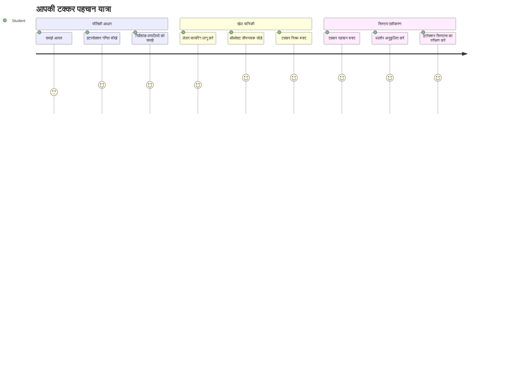
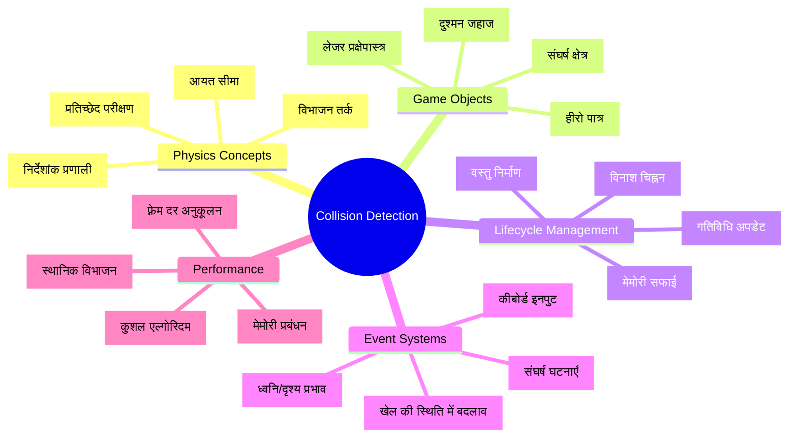
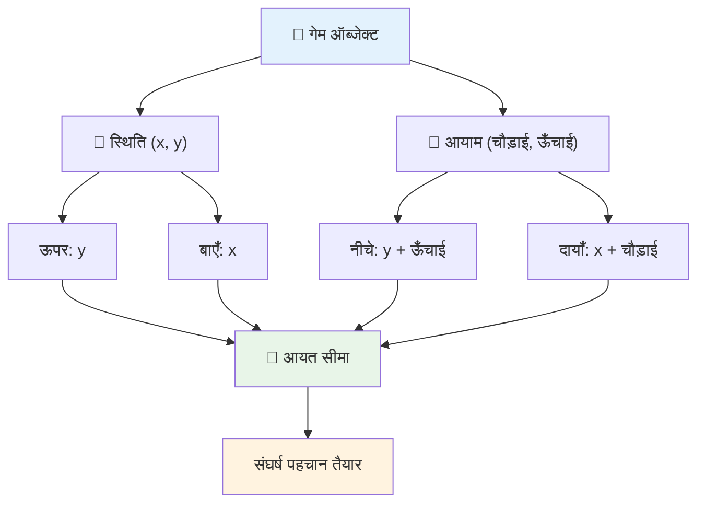
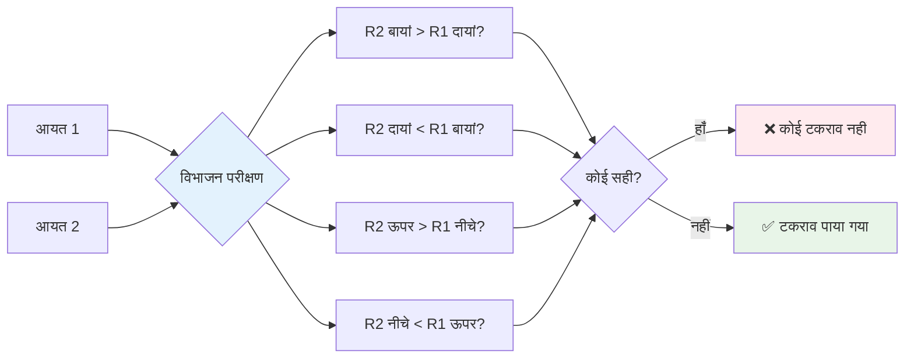
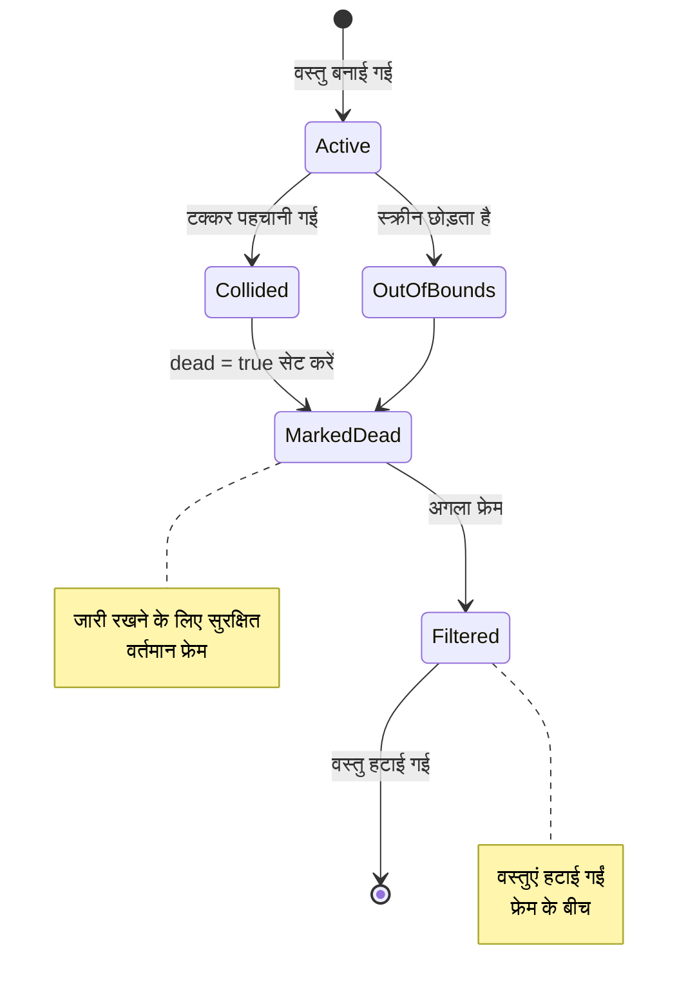
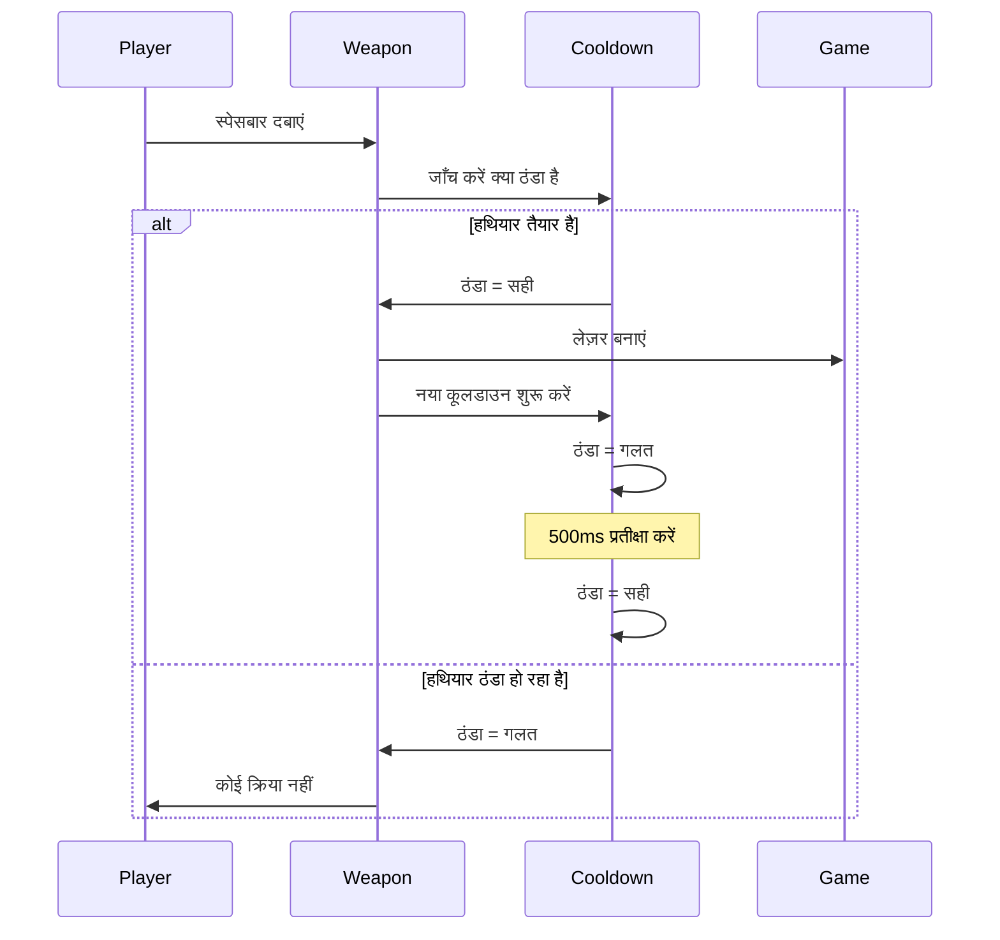
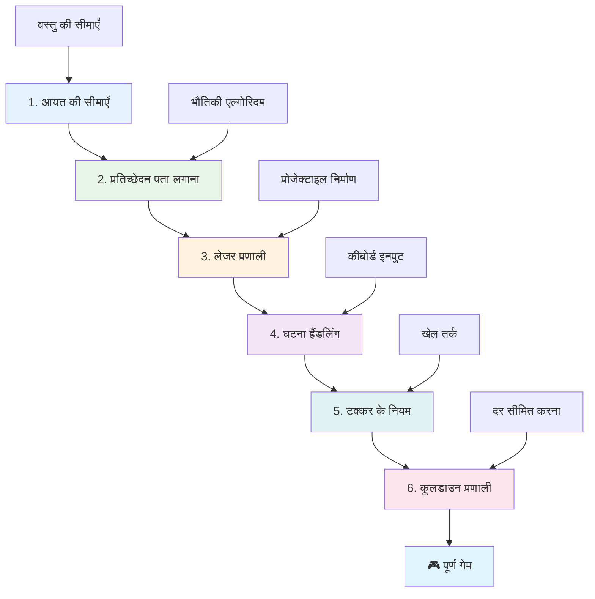
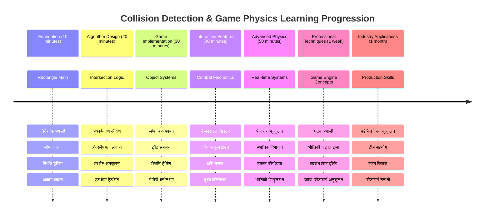

# एक स्पेस गेम बनाएं भाग 4: एक लेजर जोड़ना और टकराव का पता लगाना


## पूर्व-लेक्चर क्विज़

[पूर्व-लेक्चर क्विज़](https://ff-quizzes.netlify.app/web/quiz/35)

उस क्षण के बारे में सोचें जब स्टार वार्स में ल्यूक के प्रोटॉन टॉरपीडो ने डेथ स्टार के एग्जॉस्ट पोर्ट को मारा था। उस सटीक टकराव की पहचान ने आकाशगंगा की किस्मत बदल दी! खेलों में, टकराव का पता लगाने का काम भी इसी तरह होता है - यह तय करता है कि कब वस्तुएं आपस में इंटरैक्ट करती हैं और उसके बाद क्या होता है।

इस पाठ में, आप अपने स्पेस गेम में लेजर हथियार जोड़ेंगे और टकराव का पता लगाने को लागू करेंगे। ठीक वैसे ही जैसे NASA के मिशन योजनाकार अंतरिक्ष यानों की पथगामी गणना करते हैं ताकि मलबे से बचा जा सके, आप सीखेंगे कि खेल वस्तुओं का कब मेल होता है। हम इसे ऐसे चरणों में बाँटेंगे जो एक-दूसरे पर आधारित होंगे।

अंत तक, आपके पास एक कार्यशील लड़ाई प्रणाली होगी जहां लेजर दुश्मनों को नष्ट करते हैं और टकराव खेल की घटनाएं शुरू करते हैं। ये वही टकराव के सिद्धांत हैं जो भौतिकी सिमुलेशन से लेकर इंटरैक्टिव वेब इंटरफेस तक हर जगह उपयोग किए जाते हैं।


✅ सबसे पहली कभी लिखी गई कंप्यूटर गेम के बारे में थोड़ा शोध करें। इसकी क्या कार्यक्षमता थी?

## टकराव का पता लगाना

टकराव का पता लगाना ऐसे काम करता है जैसे अपोलो लूनर मॉड्यूल के निकटता संवेदक - यह लगातार दूरी जांचता है और जब वस्तुएं बहुत करीब आती हैं तो अलर्ट करता है। खेलों में, यह प्रणाली यह तय करती है कि कब वस्तुएं आपस में इंटरैक्ट करती हैं और अगला क्या होना चाहिए।

हम जो तरीका उपयोग करेंगे, वह हर गेम ऑब्जेक्ट को एक आयत के रूप में मानता है, ठीक वैसे ही जैसे एयर ट्रैफिक कंट्रोल सिस्टम विमान की ट्रैकिंग के लिए सरल ज्यामितीय आकृतियों का उपयोग करता है। यह आयताकार तरीका भले ही मूल लगे, लेकिन यह गणनात्मक रूप से कुशल है और अधिकांश गेम परिदृश्यों के लिए अच्छा कार्य करता है।

### आयत का प्रतिनिधित्व

हर गेम वस्तु को समन्वय सीमाओं की आवश्यकता होती है, ठीक वैसे जैसे मार्स पाथफाइंडर रोवर ने मैरीशियन सतह पर अपनी स्थिति को मैप किया था। यहाँ हम उन सीमाओं को निम्न रूप से परिभाषित करते हैं:


```javascript
rectFromGameObject() {
  return {
    top: this.y,
    left: this.x,
    bottom: this.y + this.height,
    right: this.x + this.width
  }
}
```

**आइए इसे समझें:**
- **शीर्ष किनारा**: यह आपकी वस्तु की ऊर्ध्वाधर शुरुआत है (इसकी y स्थिति)
- **बायाँ किनारा**: यह इसकी क्षैतिज शुरुआत है (इसकी x स्थिति)
- **निचला किनारा**: y स्थिति में ऊंचाई जोड़ें - अब आपको पता है कि यह कहाँ समाप्त होती है!
- **दायाँ किनारा**: x स्थिति में चौड़ाई जोड़ें - और आपके पास पूरी सीमा है

### प्रतिच्छेदन एल्गोरिदम

आयतों के प्रतिच्छेदन का पता लगाने में वही लॉजिक काम करता है जैसे हबल स्पेस टेलीस्कोप सिद्ध करता है कि आकाशीय वस्तुएं क्या उसके क्षेत्र में ओवरलैप हो रही हैं। एल्गोरिदम अलगाव जांचता है:


```javascript
function intersectRect(r1, r2) {
  return !(r2.left > r1.right ||
    r2.right < r1.left ||
    r2.top > r1.bottom ||
    r2.bottom < r1.top);
}
```

**अलगाव परीक्षण इस प्रकार कार्य करता है जैसे रडार सिस्टम:**
- क्या आयत 2 पूरी तरह से आयत 1 के दाईं ओर है?
- क्या आयत 2 पूरी तरह से आयत 1 के बाईं ओर है?
- क्या आयत 2 पूरी तरह से आयत 1 के नीचे है?
- क्या आयत 2 पूरी तरह से आयत 1 के ऊपर है?

अगर इन में से कोई भी स्थिति सत्य नहीं है, तो आयतें ओवरलैप कर रही हैं। यह तरीका वैसा ही है जैसे रडार ऑपरेटर यह जांचते हैं कि दो विमान सुरक्षित दूरी पर हैं या नहीं।

## वस्तु जीवनचक्र का प्रबंधन

जब कोई लेजर दुश्मन को मारता है, तो दोनों वस्तुओं को खेल से हटा देना होता है। हालांकि, लूप के बीच में वस्तुएं हटाना क्रैश का कारण बन सकता है - यह सबक अपोलो गाइडेंस कंप्यूटर जैसे प्रारंभिक कंप्यूटर सिस्टम में सीखा गया। इसके बजाय, हम "हटाने के लिए चिह्नित करें" का तरीका अपनाते हैं जो फ्रेमों के बीच सुरक्षित रूप से वस्तुओं को हटाता है।


इस प्रकार हम किसी चीज़ को हटाने के लिए चिह्नित करते हैं:

```javascript
// हटाने के लिए वस्तु को चिह्नित करें
enemy.dead = true;
```

**यह तरीका काम क्यों करता है:**
- हम वस्तु को "मृत" के रूप में चिह्नित करते हैं लेकिन तुरंत नहीं हटाते
- इससे वर्तमान गेम फ्रेम सुरक्षित रूप से पूर्ण हो जाता है
- इससे उन वस्तुओं को उपयोग करने की कोशिश में क्रैश नहीं होते जो पहले से हट चुकी हैं!

फिर अगले रेंडर साइकिल से पहले चिह्नित वस्तुएं छांट लें:

```javascript
gameObjects = gameObjects.filter(go => !go.dead);
```

**यह छंटाई क्या करती है:**
- केवल "जीवित" वस्तुओं की एक ताजी सूची बनाती है
- मृत के रूप में चिह्नित सभी वस्तुएं हटा देती है
- आपके गेम को सुचारू रूप से चलाए रखती है
- नष्ट हो चुकी वस्तुओं से मेमोरी फटने से बचाती है

## लेजर मैकेनिक्स को लागू करना

गेम में लेजर प्रोजेक्टाइल उसी सिद्धांत पर काम करते हैं जैसे स्टार ट्रेक के फोटॉन टॉरपीडो - ये विशिष्ट वस्तुएं होती हैं जो सीधे रेखा में तब तक चलती हैं जब तक वे किसी वस्तु से टकरा न जाएं। प्रत्येक स्पेसबार प्रेस एक नया लेजर ऑब्जेक्ट बनाता है जो स्क्रीन पर चलता है।

इसे कार्यान्वित करने के लिए, हमें कुछ हिस्सों का तालमेल बिठाना होगा:

**आवश्यक मुख्य घटक:**
- हीरो की स्थिति से उभरने वाले लेजर ऑब्जेक्ट बनाएं
- कीबोर्ड इनपुट को हैंडल करें ताकि लेजर निर्माण हो सके
- लेजर की गति और जीवनचक्र प्रबंधित करें
- लेजर प्रोजेक्टाइल की दृश्य प्रतिनिधित्व लागू करें

## फायरिंग दर नियंत्रण लागू करना

असीमित फायरिंग दर से गेम इंजन पर दबाव बढ़ेगा और गेमप्ले बहुत आसान हो जाएगा। असली हथियार प्रणालियां भी इसी तरह सीमाओं का सामना करती हैं - यहां तक कि USS एंटरप्राइज के फेज़र को भी शॉट्स के बीच रीचार्ज करना पड़ता था।

हम एक कूलडाउन सिस्टम लागू करेंगे जो रैपिड-फायर स्पैमिंग को रोकता है जबकि नियंत्रण प्रतिक्रियाशील रखता है:


```javascript
class Cooldown {
  constructor(time) {
    this.cool = false;
    setTimeout(() => {
      this.cool = true;
    }, time);
  }
}

class Weapon {
  constructor() {
    this.cooldown = null;
  }
  
  fire() {
    if (!this.cooldown || this.cooldown.cool) {
      // लेज़र प्रोजेक्टाइल बनाएं
      this.cooldown = new Cooldown(500);
    } else {
      // हथियार अभी ठंडा हो रहा है
    }
  }
}
```

**कूलडाउन इस तरह काम करता है:**
- जब बनता है, तो हथियार "गरम" होता है (अभी नहीं फायर कर सकता)
- टाइमआउट अवधि के बाद, यह "ठंडा" हो जाता है (फायर करने के लिए तैयार)
- शॉट से पहले हम चेक करते हैं: "क्या हथियार ठंडा है?"
- यह स्पैम-क्लिकिंग को रोकता है और नियंत्रण बनाए रखता है

✅ स्पेस गेम सीरीज के पाठ 1 को देखें ताकि कूलडाउन के बारे में याद रहे।

## टकराव प्रणाली का निर्माण

आप अपने मौजूदा स्पेस गेम कोड को बढ़ाएंगे ताकि टकराव का पता लगाने वाली प्रणाली बनाई जा सके। जैसे कि अंतरराष्ट्रीय अंतरिक्ष स्टेशन का स्वचालित टकराव टालने वाला सिस्टम, आपका गेम वस्तु स्थितियों की निरंतर निगरानी करेगा और टकरावों पर प्रतिक्रिया देगा।

अपने पिछले पाठ के कोड से शुरू करते हुए, आप टकराव का पता लगाने के नियम जोड़ेंगे जो वस्तुओं के इंटरैक्शन को नियंत्रित करेंगे।

> 💡 **प्रो टिप**: लेजर स्प्राइट पहले ही आपकी संपत्ति फ़ोल्डर में शामिल है और आपके कोड में संदर्भित है, जिसे आप लागू कर सकते हैं।

### लागू करने के लिए टकराव नियम

**जो गेम मैकेनिक जोड़ने हैं:**
1. **लेजर दुश्मन को मारता है**: लेजर प्रोजेक्टाइल से टकराने पर दुश्मन वस्तु नष्ट हो जाती है
2. **लेजर स्क्रीन सीमा से टकराता है**: लेजर जब स्क्रीन के शीर्ष किनारे तक पहुंचता है तो हट जाता है
3. **दुश्मन और हीरो का टकराव**: दोनों वस्तुएं जब टकराती हैं तो नष्ट हो जाती हैं
4. **दुश्मन नीचे पहुंचता है**: दुश्मन जब स्क्रीन के नीचे पहुंचते हैं तो गेम ओवर की स्थिति होती है

### 🔄 **शैक्षिक जांच**
**टकराव पता लगाने की नींव**: लागू करने से पहले सुनिश्चित करें कि आप समझते हैं:
- ✅ कैसे आयत सीमाएं टकराव क्षेत्रों को परिभाषित करती हैं
- ✅ क्यों अलगाव परीक्षण इंटरसेक्शन गणना से अधिक कुशल है
- ✅ खेल लूप में वस्तु जीवनचक्र प्रबंधन का महत्व
- ✅ घटना-आधारित प्रणालियां कैसे टकराव प्रतिक्रिया समन्वयित करती हैं

**त्वरित स्व-परीक्षा**: यदि आप वस्तुओं को तुरंत हटाने की बजाय उन्हें चिह्नित न करें तो क्या होगा?
*उत्तर: लूप के बीच में हटाने से क्रैश या पुनरावृत्ति में वस्तुओं को छोड़ने की समस्या हो सकती है*

**भौतिकी की समझ**: अब आप समझते हैं:
- **कोऑर्डिनेट सिस्टम**: कैसे स्थिति और आयाम सीमाएं बनाते हैं
- **इंटरसेक्शन लॉजिक**: टकराव पता लगाने की गणितीय सिद्धांत
- **प्रदर्शन अनुकूलन**: क्यों कुशल एल्गोरिदम वास्तविक समय प्रणालियों में आवश्यक हैं
- **मेमोरी प्रबंधन**: स्थिरता के लिए सुरक्षित वस्तु जीवन चक्र पैटर्न

## अपने विकास वातावरण की स्थापना

अच्छी खबर - हमने आपके लिए अधिकांश आधारशिला पहले ही सेट कर दी है! आपके सभी गेम एसेट्स और बुनियादी संरचना `your-work` सबफ़ोल्डर में मौजूद हैं, जहां आप कोल्ड टकराव फीचर्स जोड़ सकते हैं।

### प्रोजेक्ट संरचना

```bash
-| assets
  -| enemyShip.png
  -| player.png
  -| laserRed.png
-| index.html
-| app.js
-| package.json
```

**फाइल संरचना की समझ:**
- **शामिल हैं** सभी स्प्राइट छवियां जो गेम वस्तुओं के लिए आवश्यक हैं
- **मुख्य HTML दस्तावेज़ और जावास्क्रिप्ट एप्लिकेशन फाइल शामिल हैं**
- **स्थानीय विकास सर्वर के लिए पैकेज कॉन्फ़िगरेशन प्रदान करता है**

### विकास सर्वर शुरू करना

अपने प्रोजेक्ट फ़ोल्डर में जाएं और स्थानीय सर्वर शुरू करें:

```bash
cd your-work
npm start
```

**यह कमांड क्रम:**
- **डायरेक्टरी बदलता है** आपके प्रोजेक्ट फ़ोल्डर में
- `http://localhost:5000` पर एक स्थानीय HTTP सर्वर शुरू करता है
- परिक्षण और विकास के लिए आपके गेम फ़ाइलें सर्व करता है
- स्वचालित रीलोडिंग के साथ लाइव विकास सक्षम करता है

अपने ब्राउज़र में `http://localhost:5000` खोलें और अपने हीरो तथा दुश्मनों के साथ वर्तमान गेम स्थिति देखें।

### चरण-दर-चरण कार्यान्वयन

जैसे NASA ने योजनाबद्ध तरीके से वॉयेजर अंतरिक्ष यान का प्रोग्रामिंग किया, वैसे ही हम क्रमबद्ध तरीके से टकराव का पता लगाने को लागू करेंगे, प्रत्येक घटक को एक-एक कर के बनाएंगे।


#### 1. आयत टकराव सीमाओं को जोड़ना

सबसे पहले, चलिए अपने गेम वस्तुओं को उनकी सीमाओं का वर्णन करना सिखाते हैं। इसे अपने `GameObject` क्लास में जोड़ें:

```javascript
rectFromGameObject() {
    return {
      top: this.y,
      left: this.x,
      bottom: this.y + this.height,
      right: this.x + this.width,
    };
  }
```

**यह विधि करती है:**
- सटीक सीमा समन्वय के साथ एक आयत ऑब्जेक्ट बनाती है
- स्थिति और आयाम जोड़कर नीचे और दायें किनारे की गणना करती है
- टकराव पता लगाने वाले एल्गोरिदम के लिए एक ऑब्जेक्ट लौटाती है
- सभी गेम ऑब्जेक्ट्स के लिए एक मानकीकृत इंटरफेस प्रदान करती है

#### 2. इंटरसेक्शन डिटेक्शन लागू करना

अब चलिए अपना टकराव जाँचने वाला फ़ंक्शन बनाते हैं जो बताता है कि दो आयतें ओवरलैप कर रही हैं या नहीं:

```javascript
function intersectRect(r1, r2) {
  return !(
    r2.left > r1.right ||
    r2.right < r1.left ||
    r2.top > r1.bottom ||
    r2.bottom < r1.top
  );
}
```

**यह एल्गोरिदम काम करता है:**
- आयतों के बीच चार अलगाव स्थितियों का परीक्षण करता है
- अगर कोई अलगाव स्थिति सही है तो `false` लौटाता है
- यदि कोई अलगाव नहीं है तो टकराव सूचित करता है
- कुशल इंटरसेक्शन परीक्षण के लिए नेगेशन लॉजिक का उपयोग करता है

#### 3. लेजर फायरिंग सिस्टम लागू करना

यहां चीजें रोमांचक हो जाती हैं! चलिए लेजर फायरिंग सिस्टम सेटअप करते हैं।

##### संदेश स्थिरांक

पहले, चलिए कुछ संदेश प्रकार परिभाषित करते हैं ताकि हमारे गेम के विभिन्न हिस्से आपस में बात कर सकें:

```javascript
KEY_EVENT_SPACE: "KEY_EVENT_SPACE",
COLLISION_ENEMY_LASER: "COLLISION_ENEMY_LASER",
COLLISION_ENEMY_HERO: "COLLISION_ENEMY_HERO",
```

**ये स्थिरांक प्रदान करते हैं:**
- पूरे एप्लिकेशन में ईवेंट नामों का एक मानकीकृत रूप
- गेम सिस्टम्स के बीच स्थिर संचार सक्षम करते हैं
- ईवेंट हैंडलर पंजीकरण में टाइपो से बचाते हैं

##### कीबोर्ड इनपुट हैंडलिंग

अपना की इवेंट लिसनर में स्पेस की डिटेक्शन जोड़ें:

```javascript
} else if(evt.keyCode === 32) {
  eventEmitter.emit(Messages.KEY_EVENT_SPACE);
}
```

**यह इनपुट हैंडलर करता है:**
- कीकोड 32 के ज़रिये स्पेस की प्रेस डिटेक्ट करता है
- मानकीकृत ईवेंट संदेश प्रकाशित करता है
- डिस्कनेक्टेड फायरिंग लॉजिक को सक्षम करता है

##### ईवेंट लिसनर सेटअप

अपने `initGame()` फंक्शन में फायरिंग व्यवहार रजिस्टर्ड करें:

```javascript
eventEmitter.on(Messages.KEY_EVENT_SPACE, () => {
 if (hero.canFire()) {
   hero.fire();
 }
});
```

**यह ईवेंट लिसनर:**
- स्पेस की ईवेंट्स का जवाब देता है
- फायरिंग कूलडाउन की स्थिति की जांच करता है
- अनुमति मिलने पर लेजर निर्माण को ट्रिगर करता है

लेजर-दुश्मन इंटरैक्शन के लिए टकराव संभालना जोड़ें:

```javascript
eventEmitter.on(Messages.COLLISION_ENEMY_LASER, (_, { first, second }) => {
  first.dead = true;
  second.dead = true;
});
```

**यह टकराव हैंडलर:**
- दोनों वस्तुओं के साथ टकराव ईवेंट डेटा प्राप्त करता है
- दोनों वस्तुओं को हटाने के लिए चिह्नित करता है
- टकराव के बाद उचित क्लीनअप सुनिश्चित करता है

#### 4. लेजर क्लास बनाएं

एक ऐसा लेजर प्रोजेक्टाइल लागू करें जो ऊपर की तरफ चलता है और अपने जीवनचक्र का प्रबंधन करता है:

```javascript
class Laser extends GameObject {
  constructor(x, y) {
    super(x, y);
    this.width = 9;
    this.height = 33;
    this.type = 'Laser';
    this.img = laserImg;
    
    let id = setInterval(() => {
      if (this.y > 0) {
        this.y -= 15;
      } else {
        this.dead = true;
        clearInterval(id);
      }
    }, 100);
  }
}
```

**यह क्लास कार्यान्वयन:**
- GameObject का विस्तार करता है ताकि बुनियादी कार्यक्षमता मिले
- लेजर स्प्राइट के लिए उचित आयाम निर्धारित करता है
- `setInterval()` का उपयोग करके स्वतः ऊपर की ओर गति करता है
- स्क्रीन के शीर्ष तक पहुंचने पर स्वयं विनष्ट हो जाता है
- अपनी स्वयं की एनिमेशन टाइमिंग और क्लीनअप को प्रबंधित करता है

#### 5. टकराव पता लगाने वाली प्रणाली लागू करें

एक व्यापक टकराव पता लगाने वाला फ़ंक्शन बनाएं:

```javascript
function updateGameObjects() {
  const enemies = gameObjects.filter(go => go.type === 'Enemy');
  const lasers = gameObjects.filter(go => go.type === "Laser");
  
  // लेज़र-शत्रु टकराव का परीक्षण करें
  lasers.forEach((laser) => {
    enemies.forEach((enemy) => {
      if (intersectRect(laser.rectFromGameObject(), enemy.rectFromGameObject())) {
        eventEmitter.emit(Messages.COLLISION_ENEMY_LASER, {
          first: laser,
          second: enemy,
        });
      }
    });
  });

  // नष्ट हुए वस्तुओं को हटाएं
  gameObjects = gameObjects.filter(go => !go.dead);
}
```

**यह टकराव सिस्टम:**
- परीक्षा के लिए गेम वस्तुओं को प्रकार के अनुसार छांटता है
- प्रत्येक लेजर को प्रत्येक दुश्मन के साथ इंटरसेक्शन के लिए जाँचता है
- टकराव पाए जाने पर ईवेंट जारी करता है
- टकराव प्रक्रिया के बाद नष्ट की गई वस्तुओं को साफ़ करता है

> ⚠️ **महत्वपूर्ण**: अपने मुख्य गेम लूप में `updateGameObjects()` जोड़ें जो `window.onload` में है ताकि टकराव पता चल सके।

#### 6. हीरो क्लास में कूलडाउन सिस्टम जोड़ें

हीरो क्लास को फायरिंग मैकेनिक्स और दर सीमित करने के साथ बढ़ाएं:

```javascript
class Hero extends GameObject {
  constructor(x, y) {
    super(x, y);
    this.width = 99;
    this.height = 75;
    this.type = "Hero";
    this.speed = { x: 0, y: 0 };
    this.cooldown = 0;
  }
  
  fire() {
    gameObjects.push(new Laser(this.x + 45, this.y - 10));
    this.cooldown = 500;

    let id = setInterval(() => {
      if (this.cooldown > 0) {
        this.cooldown -= 100;
      } else {
        clearInterval(id);
      }
    }, 200);
  }
  
  canFire() {
    return this.cooldown === 0;
  }
}
```

**सुदृढ़ हीरो क्लास की समझ:**
- कूलडाउन टाइमर को शुरू में शून्य (फायर करने के लिए तैयार) करता है
- हीरो जहाज के ऊपर लेजर ऑब्जेक्ट बनाता है
- तेजी से फायरिंग रोकने के लिए कूलडाउन अवधि सेट करता है
- इंटरवल के आधार पर कूलडाउन टाइमर घटाता है
- `canFire()` मेथड के माध्यम से फायरिंग स्थिति की जांच प्रदान करता है

### 🔄 **शैक्षिक जांच**
**संपूर्ण प्रणाली की समझ**: टकराव प्रणाली की अपनी महारत का सत्यापन करें:
- ✅ कैसे आयत सीमाएं कुशल टकराव पता लगाने सक्षम करती हैं?
- ✅ गेम स्थिरता के लिए वस्तु जीवनचक्र प्रबंधन क्यों महत्वपूर्ण है?
- ✅ प्रदर्शन समस्याओं से बचाने के लिए कूलडाउन सिस्टम कैसे मदद करता है?
- ✅ टकराव हैंडलिंग में घटना-आधारित वास्तुकला की क्या भूमिका होती है?

**प्रणाली एकीकरण**: आपका टकराव पता लगाने वाला सिस्टम प्रदर्शित करता है:
- **गणितीय सटीकता**: आयत इंटरसेक्शन एल्गोरिदम
- **प्रदर्शन अनुकूलन**: कुशल टकराव जाँच पैटर्न
- **मेमोरी प्रबंधन**: सुरक्षित वस्तु निर्माण और विनाश
- **ईवेंट समन्वय**: डिस्कनेक्टेड सिस्टम संचार
- **वास्तविक समय प्रक्रिया**: फ्रेम-आधारित अद्यतन चक्र

**पेशेवर पैटर्न**: आपने लागू किए हैं:
- **जिम्मेदारी का पृथक्करण**: भौतिकी, रेंडरिंग, और इनपुट अलग
- **ऑब्जेक्ट-ओरिएंटेड डिज़ाइन**: विरासत और बहुरूपता
- **स्टेट प्रबंधन**: वस्तु जीवनचक्र और गेम स्टेट ट्रैकिंग
- **प्रदर्शन अनुकूलन**: वास्तविक समय उपयोग के लिए कुशल एल्गोरिदम

### अपनी कार्यान्वयन का परीक्षण करें

आपके स्पेस गेम में अब पूर्ण टकराव पता लगाने और लड़ाई मैकेनिक्स हैं। 🚀 इन नई क्षमताओं का परीक्षण करें:
- **नायविगेट करें** तीर कुंजियों से ताकि मूवमेंट नियंत्रण जांचा जा सके
- **स्पेसबार से लेजर फायर करें** - देखें कि कूलडाउन स्पैम-क्लिकिंग कैसे रोकता है
- **टकराव देखें** जब लेजर दुश्मनों को मारते हैं और उन्हें हटाते हैं
- **क्लीनअप सत्यापित करें** क्योंकि नष्ट की गई वस्तुएं गेम से गायब हो जाती हैं

आपने सफलतापूर्वक टकराव पता लगाने की प्रणाली लागू की है जो उन्हीं गणितीय सिद्धांतों का उपयोग करती है जो अंतरिक्ष यान नेविगेशन और रोबोटिक्स में मार्गदर्शन करते हैं।

### ⚡ **अगले 5 मिनट में आप क्या कर सकते हैं**
- [ ] ब्राउज़र डेवटूल खोलें और अपने टकराव पता लगाने वाले फ़ंक्शन में ब्रेकपॉइंट सेट करें
- [ ] लेजर की गति या दुश्मन की गति को बदलकर टकराव प्रभाव देखें
- [ ] विभिन्न कूलडाउन मानों के साथ प्रयोग कर फायरिंग दरों का परीक्षण करें
- [ ] वास्तविक समय में टकराव घटनाओं को ट्रैक करने के लिए `console.log` स्टेटमेंट जोड़ें

### 🎯 **इस घंटे में आप क्या हासिल कर सकते हैं**
- [ ] पोस्ट-लेसन क्विज़ पूरा करें और टकराव पहचान एल्गोरिदम समझें
- [ ] टकराव होने पर विस्फोट जैसे विज़ुअल इफ़ेक्ट्स जोड़ें
- [ ] विभिन्न गुणधर्मों के साथ विभिन्न प्रकार की प्रोजेक्टाइल्स लागू करें
- [ ] ऐसे पावर-अप बनाएं जो अस्थायी रूप से खिलाड़ी की क्षमताओं को बढ़ाएं
- [ ] टकराव को और अधिक संतोषजनक बनाने के लिए ध्वनि प्रभाव जोड़ें

### 📅 **आपका सप्ताह-भर का फिजिक्स प्रोग्रामिंग**
- [ ] पूर्ण स्पेस गेम को सुसज्जित टकराव प्रणालियों के साथ पूरा करें
- [ ] आयतों के अलावा उन्नत टकराव आकार लागू करें (वृत्त, बहुभुज)
- [ ] वास्तविक विस्फोट प्रभावों के लिए कण प्रणालियाँ जोड़ें
- [ ] टकराव से बचाव के साथ जटिल दुश्मन व्यवहार बनाएं
- [ ] कई वस्तुओं के साथ बेहतर प्रदर्शन के लिए टकराव पहचान को अनुकूलित करें
- [ ] तेजी और वास्तविक गति जैसी भौतिकी सिमुलेशन जोड़ें

### 🌟 **आपका मासिक गेम फिजिक्स मास्टरी**
- [ ] उन्नत फिजिक्स इंजन और यथार्थवादी सिमुलेशन के साथ गेम बनाएं
- [ ] 3D टकराव पहचान और स्थानिक विभाजन एल्गोरिदम सीखें
- [ ] खुले स्रोत फिजिक्स लाइब्रेरी और गेम इंजन में योगदान दें
- [ ] ग्राफिक्स-गहन अनुप्रयोगों के लिए प्रदर्शन अनुकूलन में निपुण बनें
- [ ] गेम फिजिक्स और टकराव पहचान के बारे में शैक्षिक सामग्री बनाएं
- [ ] उन्नत फिजिक्स प्रोग्रामिंग कौशल प्रदर्शित करने वाला पोर्टफोलियो बनाएं

## 🎯 आपका टकराव पहचान मास्टरी टाइमलाइन


### 🛠️ आपके गेम फिजिक्स टूलकिट का सारांश

इस पाठ को पूरा करने के बाद, आप अब में माहिर हैं:
- **टकराव गणित**: आयत प्रतिच्छेदन एल्गोरिदम और निर्देशांक प्रणालियाँ
- **प्रदर्शन अनुकूलन**: वास्तविक समय अनुप्रयोगों के लिए कुशल टकराव पहचान
- **ऑब्जेक्ट जीवनचक्र प्रबंधन**: सुरक्षित निर्माण, अद्यतन, और विनाश पैटर्न
- **इवेंट-संचालित आर्किटेक्चर**: टकराव प्रतिक्रिया के लिए स्वतंत्र प्रणालियाँ
- **गेम लूप एकीकरण**: फ्रेम-आधारित फिजिक्स अपडेट और रेंडरिंग समन्वय
- **इनपुट सिस्टम**: प्रतिक्रिया देने वाले नियंत्रण, दर सीमितकरण और फीडबैक के साथ
- **मेमोरी प्रबंधन**: प्रभावी ऑब्जेक्ट पूलिंग और सफाई रणनीतियाँ

**वास्तविक दुनिया के अनुप्रयोग**: आपकी टकराव पहचान कौशल सीधे लागू होती है:
- **इंटरैक्टिव सिमुलेशन**: वैज्ञानिक मॉडलिंग और शैक्षिक उपकरण
- **यूजर इंटरफेस डिजाइन**: ड्रैग-एंड-ड्रॉप इंटरैक्शन और टच पहचान
- **डेटा विज़ुअलाइजेशन**: इंटरैक्टिव चार्ट और क्लिक करने योग्य तत्व
- **मोबाइल विकास**: टच जेस्चर मान्यता और टकराव हैंडलिंग
- **रोबोटिक्स प्रोग्रामिंग**: पथ योजना और अवरोध से बचाव
- **कंप्यूटर ग्राफिक्स**: रे ट्रेसिंग और स्थानिक एल्गोरिदम

**प्रोफेशनल कौशल प्राप्त किए**: आप अब कर सकते हैं:
- **डिजाइन** करें वास्तविक समय टकराव पहचान के लिए कुशल एल्गोरिदम
- **प्रवर्तन** करें जटिलता के साथ भौतिक प्रणालियाँ
- **डिबग** करें जटिल इंटरैक्शन सिस्टम गणितीय सिद्धांतों का उपयोग करके
- **अनुकूलित करें** विभिन्न हार्डवेयर और ब्राउज़र क्षमताओं के लिए प्रदर्शन
- **आर्किटेक्ट** करें बनाए रखने योग्य गेम सिस्टम सिद्ध डिजाइन पैटर्न का उपयोग करके

**गेम विकास अवधारणाएँ महारत हासिल की**:
- **फिजिक्स सिमुलेशन**: वास्तविक समय टकराव पहचान और प्रतिक्रिया
- **प्रदर्शन इंजीनियरिंग**: इंटरैक्टिव अनुप्रयोगों के लिए अनुकूलित एल्गोरिदम
- **इवेंट सिस्टम**: गेम घटकों के बीच स्वायत्त संचार
- **ऑब्जेक्ट प्रबंधन**: गतिशील सामग्री के लिए कुशल जीवनचक्र पैटर्न
- **इनपुट हैंडलिंग**: उपयुक्त फीडबैक के साथ प्रतिक्रिया देने वाले नियंत्रण

**अगला स्तर**: आप Matter.js जैसे उन्नत फिजिक्स इंजन खोजने, 3D टकराव पहचान लागू करने, या जटिल कण प्रणालियाँ बनाने के लिए तैयार हैं!

🌟 **उपलब्धि अनलॉक हुई**: आपने पेशेवर स्तर की टकराव पहचान के साथ एक पूर्ण भौतिकी-आधारित इंटरैक्शन प्रणाली बनाई है!

## GitHub Copilot Agent चुनौती 🚀

एजेंट मोड का उपयोग करके निम्नलिखित चुनौती को पूरा करें:

**विवरण:** टकराव पहचान प्रणाली को बेहतर बनाएं ऐसे पावर-अप्स लागू करके जो यादृच्छिक रूप से उत्पन्न होते हैं और नायक जहाज द्वारा संकलित किए जाने पर अस्थायी क्षमताएं प्रदान करते हैं।

**प्रॉम्प्ट:** एक PowerUp क्लास बनाएं जो GameObject से विस्तारित हो और नायक और पावर-अप्स के बीच टकराव पहचान लागू करें। कम से कम दो प्रकार के पावर-अप जोड़ें: एक जो फायर रेट बढ़ाता है (कूलडाउन कम करता है) और दूसरा अस्थायी ढाल बनाता है। स्पॉन लॉजिक शामिल करें जो पावर-अप्स को यादृच्छिक अंतराल और स्थानों पर बनाता है।

---


## 🚀 चुनौती

एक विस्फोट जोड़ें! [Space Art repo](../../../../6-space-game/solution/spaceArt/readme.txt) में गेम एसेट्स देखें और कोशिश करें कि जब लेज़र एक एलियन से टकराए तो एक विस्फोट जोड़ें

## पोस्ट-लेक्चर क्विज़

[पोस्ट-लेक्चर क्विज़](https://ff-quizzes.netlify.app/web/quiz/36)

## समीक्षा और स्व-अध्ययन

अब तक अपने गेम में इंटरवल के साथ प्रयोग करें। जब आप उन्हें बदलते हैं तो क्या होता है? [JavaScript टाइमिंग इवेंट्स](https://www.freecodecamp.org/news/javascript-timing-events-settimeout-and-setinterval/) के बारे में और पढ़ें।

## असाइनमेंट

[टकरावों का अन्वेषण करें](assignment.md)

---

<!-- CO-OP TRANSLATOR DISCLAIMER START -->
**अस्वीकरण**:  
यह दस्तावेज़ AI अनुवाद सेवा [Co-op Translator](https://github.com/Azure/co-op-translator) का उपयोग करके अनुवादित किया गया है। हम सही अनुवाद के लिए प्रयासरत हैं, लेकिन कृपया ध्यान दें कि स्वचालित अनुवादों में त्रुटियाँ या अशुद्धियाँ हो सकती हैं। मूल दस्तावेज़ अपनी मातृभाषा में ही आधिकारिक स्रोत माना जाना चाहिए। महत्वपूर्ण जानकारी के लिए पेशेवर मानव अनुवाद की सलाह दी जाती है। इस अनुवाद के उपयोग से उत्पन्न कोई भी गलतफहमी या गलत व्याख्या के लिए हम जिम्मेदार नहीं हैं।
<!-- CO-OP TRANSLATOR DISCLAIMER END -->