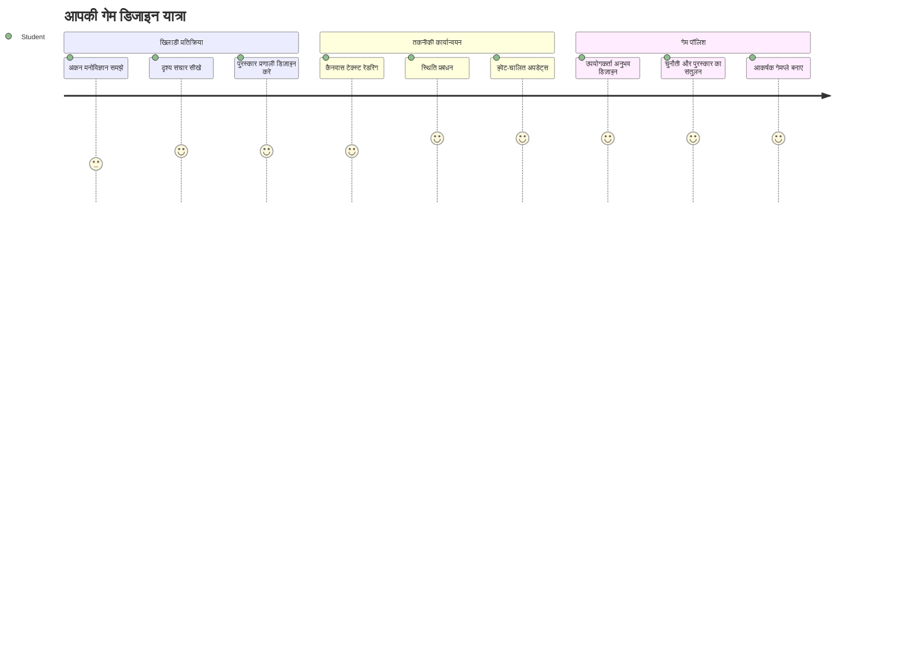
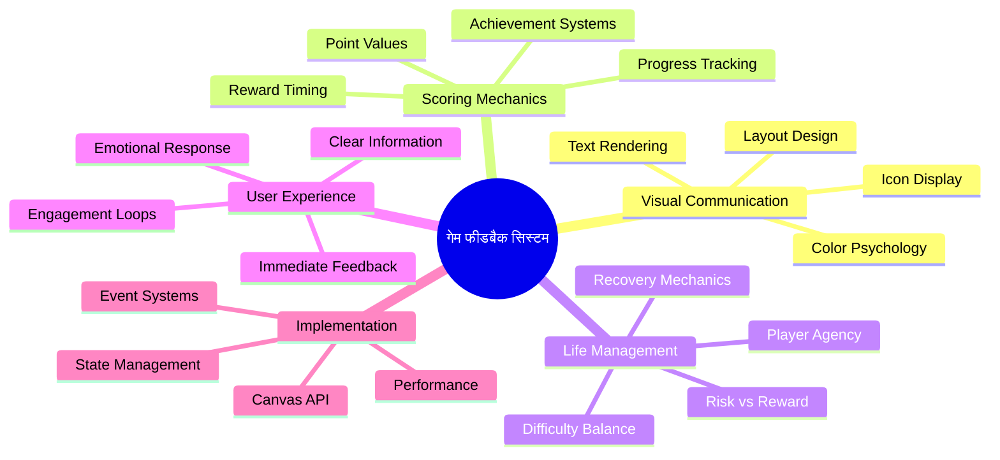
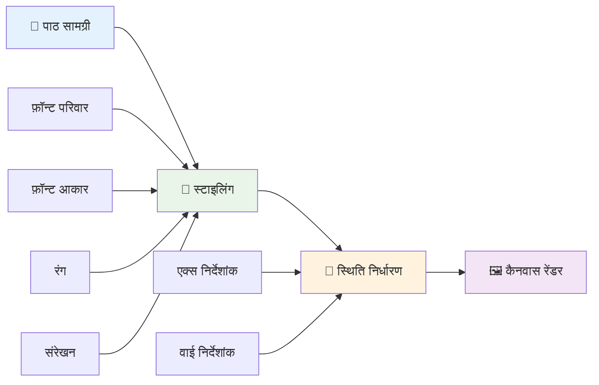
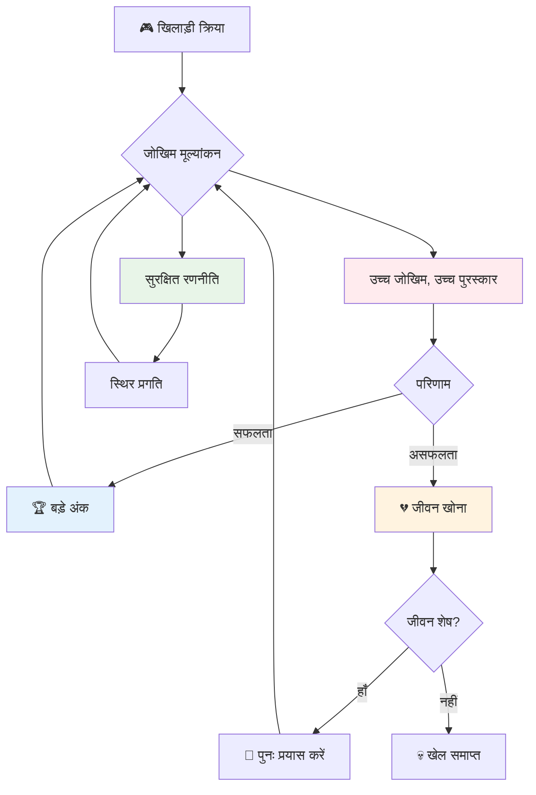
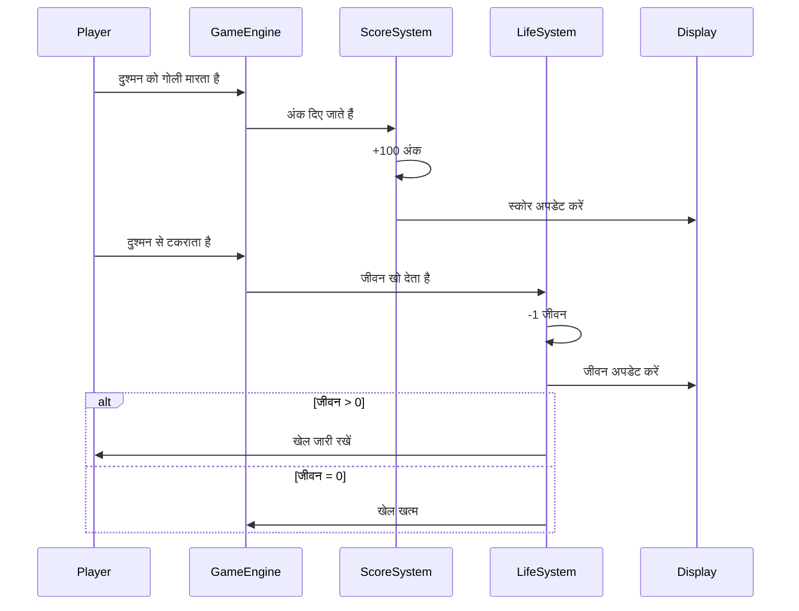
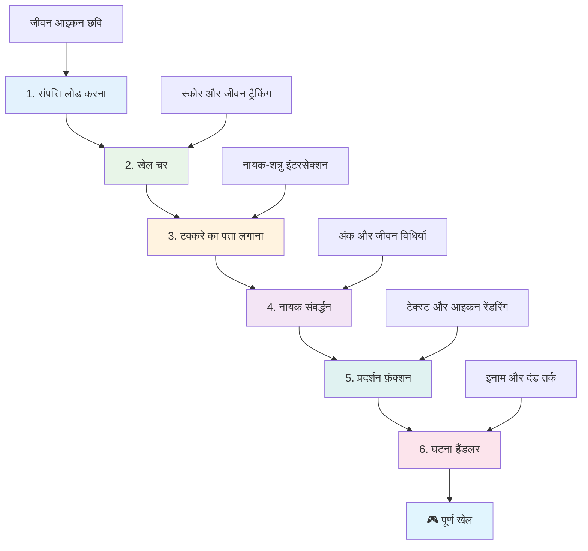
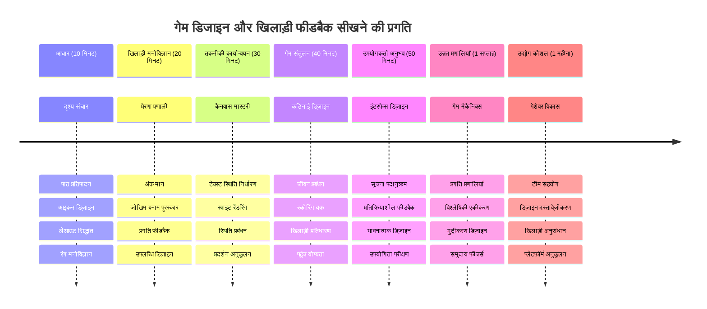

<!--
CO_OP_TRANSLATOR_METADATA:
{
  "original_hash": "2ed9145a16cf576faa2a973dff84d099",
  "translation_date": "2026-01-06T16:25:51+00:00",
  "source_file": "6-space-game/5-keeping-score/README.md",
  "language_code": "hi"
}
-->
# स्पेस गेम बनाएं भाग 5: स्कोरिंग और जीव


## प्री-लेक्चर क्विज़

[प्री-लेक्चर क्विज़](https://ff-quizzes.netlify.app/web/quiz/37)

क्या आप अपना स्पेस गेम एक असली गेम जैसा महसूस कराना चाहते हैं? आइए स्कोरिंग पॉइंट्स और जीवन प्रबंधन जोड़ते हैं - वे मूल मेकेनिक्स जो शुरुआती आर्केड गेम्स जैसे स्पेस इनवेडर्स को साधारण प्रदर्शन से लत लगने वाले मनोरंजन में बदल दिया। यहीं आपका गेम वास्तव में खेलने योग्य बनता है।


## स्क्रीन पर टेक्स्ट ड्रॉ करना - आपके गेम की आवाज़

अपने स्कोर को प्रदर्शित करने के लिए, हमें कैनवास पर टेक्स्ट रेंडर करना सीखना होगा। `fillText()` मेथड आपका मुख्य उपकरण है - यही तकनीक क्लासिक आर्केड गेम्स में स्कोर और स्थिति जानकारी दिखाने के लिए इस्तेमाल होती थी।


आप टेक्स्ट के दिखावे पर पूरी तरह काबू पा सकते हैं:

```javascript
ctx.font = "30px Arial";
ctx.fillStyle = "red";
ctx.textAlign = "right";
ctx.fillText("show this on the screen", 0, 0);
```

✅ [कैनवास में टेक्स्ट जोड़ने](https://developer.mozilla.org/docs/Web/API/Canvas_API/Tutorial/Drawing_text) के बारे में गहराई से जानें - आप देखेंगे कि आप फॉन्ट्स और स्टाइलिंग के साथ कितने रचनात्मक हो सकते हैं!

## जीवन - सिर्फ एक संख्या से ज्यादा

गेम डिजाइन में, "जीवन" खिलाड़ी की गलतियों के लिए अनुमति को दर्शाता है। यह अवधारणा पिनबॉल मशीनों से आई है, जहां आपको खेलने के लिए कई बॉल मिलते थे। शुरुआती वीडियो गेम्स जैसे एस्टीरॉयड्स में, जीवन खिलाड़ियों को जोखिम लेने और गलतियों से सीखने की अनुमति देता था।


दृश्य प्रतिनिधित्व बहुत महत्वपूर्ण होता है - "Lives: 3" केवल लिखने की बजाय जहाज के आइकन दिखाने से तुरंत दृश्य पहचान होती है, ठीक वैसे ही जैसे शुरुआती आर्केड कैबिनेट ने भाषा की बाधाओं को पार करने के लिए आइकनोग्राफी का उपयोग किया।

## अपने गेम का इनाम प्रणाली बनाना

अब हम मुख्य फीडबैक सिस्टम लागू करेंगे जो खिलाड़ियों को जोड़े रखता है:


- **स्कोरिंग सिस्टम**: हर नष्ट किए गए शत्रु जहाज के लिए 100 अंक मिलते हैं (गोल संख्याएं खिलाड़ियों के लिए मानसिक गणना में आसान होती हैं)। स्कोर स्क्रीन के नीचे बाएं कोने में दिखेगा।
- **जीवन काउंटर**: आपका नायक तीन जीवन के साथ शुरू होता है - यह एक मानक है जो शुरुआती आर्केड गेम्स द्वारा चुनौती और खेल योग्यता के बीच संतुलन बनाने हेतु स्थापित किया गया। हर बार शत्रु से टकराने पर एक जीवन कम हो जाता है। बचा हुआ जीवन नीचे दाएं कोने में जहाज के आइकनों के साथ दर्शाएंगे ।

## चलिए शुरू करते हैं!

सबसे पहले, अपना वर्कस्पेस सेट करें। `your-work` सब फोल्डर में जाकर इन फाइलों को देखें:

```bash
-| assets
  -| enemyShip.png
  -| player.png
  -| laserRed.png
-| index.html
-| app.js
-| package.json
```

अपने गेम का परीक्षण करने के लिए, `your_work` फोल्डर से डेवलपमेंट सर्वर शुरू करें:

```bash
cd your-work
npm start
```

यह `http://localhost:5000` पर लोकल सर्वर चलाएगा। इस पते को अपने ब्राउज़र में खोलें और अपना गेम देखें। नियंत्रणों का परीक्षण करने के लिए एरो कीज का उपयोग करें और दुश्मनों को शूट करने की कोशिश करें कि सब कुछ सही काम कर रहा है।


### कोड करने का समय!

1. **विज़ुअल असेट्स प्राप्त करें**। `solution/assets/` फोल्डर से `life.png` असेट को अपने `your-work` फोल्डर में कॉपी करें। फिर `lifeImg` को अपनी window.onload फंक्शन में जोड़ें:

    ```javascript
    lifeImg = await loadTexture("assets/life.png");
    ```

1. अपनी असेट्स सूची में `lifeImg` जोड़ना न भूलें:

    ```javascript
    let heroImg,
    ...
    lifeImg,
    ...
    eventEmitter = new EventEmitter();
    ```
  
2. **अपने गेम वेरिएबल सेट करें**। अपना कुल स्कोर (शुरुआत 0 से) और बचा हुआ जीवन (शुरुआत 3 से) ट्रैक करने के लिए कोड जोड़ें। इन्हें स्क्रीन पर दिखाएंगे ताकि खिलाड़ी हमेशा अपनी स्थिति जान सके।

3. **कोलिजन डिटेक्शन लागू करें**। अपनी `updateGameObjects()` फंक्शन को बढ़ाएं ताकि यह पता चल सके जब दुश्मन आपके नायक से टकराए:

    ```javascript
    enemies.forEach(enemy => {
        const heroRect = hero.rectFromGameObject();
        if (intersectRect(heroRect, enemy.rectFromGameObject())) {
          eventEmitter.emit(Messages.COLLISION_ENEMY_HERO, { enemy });
        }
      })
    ```

4. **अपने हीरो में जीवन और अंक ट्रैकिंग जोड़ें**।  
   1. **काउंटरस को इनिशियलाइज़ करें**। अपनी `Hero` क्लास में `this.cooldown = 0` के नीचे जीवन और अंक सेट करें:

        ```javascript
        this.life = 3;
        this.points = 0;
        ```

   1. **इन मानों को खिलाड़ी को दिखाएं**। स्क्रीन पर दिखाने के लिए फंक्शन बनाएं:

        ```javascript
        function drawLife() {
          // करना है, 35, 27
          const START_POS = canvas.width - 180;
          for(let i=0; i < hero.life; i++ ) {
            ctx.drawImage(
              lifeImg, 
              START_POS + (45 * (i+1) ), 
              canvas.height - 37);
          }
        }
        
        function drawPoints() {
          ctx.font = "30px Arial";
          ctx.fillStyle = "red";
          ctx.textAlign = "left";
          drawText("Points: " + hero.points, 10, canvas.height-20);
        }
        
        function drawText(message, x, y) {
          ctx.fillText(message, x, y);
        }

        ```

   1. **अपनी गेम लूप में सब कुछ जोड़ें**। इन फंक्शन्स को अपनी window.onload फ़ंक्शन में `updateGameObjects()` के ठीक बाद जोड़ें:

        ```javascript
        drawPoints();
        drawLife();
        ```

### 🔄 **शैक्षिक जांच**
**गेम डिजाइन समझ**: परिणाम लागू करने से पहले सुनिश्चित करें कि आप समझते हैं:
- ✅ कैसे दृश्य प्रतिक्रिया खिलाड़ी को गेम की स्थिति बताती है
- ✅ यूआई एलिमेंट्स की सुसंगत स्थिति क्यों उपयोगिता बढ़ाती है
- ✅ अंक मान और जीवन प्रबंधन के पीछे मनोविज्ञान
- ✅ कैनवास टेक्स्ट रेंडरिंग HTML टेक्स्ट से कैसे अलग है

**त्वरित आत्म-परीक्षा**: आर्केड गेम सामान्यतः अंक मानों के लिए गोल नंबर क्यों इस्तेमाल करते हैं?
*उत्तर: गोल नंबरों को खिलाड़ी मानसिक रूप से आसानी से गणना कर सकते हैं और ये मनोवैज्ञानिक रूप से संतोषजनक पुरस्कार बनाते हैं*

**उपयोगकर्ता अनुभव सिद्धांत**: अब आप लागू कर रहे हैं:
- **दृश्य पदानुक्रम**: महत्वपूर्ण जानकारी प्रमुख रूप से रखी गई
- **तत्काल प्रतिक्रिया**: खिलाड़ी की कार्रवाई पर वास्तविक समय में अपडेट
- **संज्ञानात्मक भार**: सरल और स्पष्ट सूचना प्रस्तुति
- **भावनात्मक डिजाइन**: आइकन और रंग जो खिलाड़ी से जुड़ाव बनाते हैं

1. **गेम परिणाम और इनाम लागू करें**। अब हम फीडबैक सिस्टम जोड़ेंगे जो खिलाड़ी की कार्रवाइयों को महत्वपूर्ण बनाता है:

   1. **टकराव जीवन घटाते हैं**। हर बार जब आपका हीरो दुश्मन से टकराए, तो आपको एक जीवन खोना चाहिए।  
      
      इसे अपनी `Hero` क्लास में यह मेथड जोड़ें:

        ```javascript
        decrementLife() {
          this.life--;
          if (this.life === 0) {
            this.dead = true;
          }
        }
        ```

   2. **दुश्मनों को मारने से अंक मिलते हैं**। हर सफल हिट पर 100 अंक मिलते हैं, जो सटीक शूटिंग के लिए तुरंत सकारात्मक प्रतिक्रिया प्रदान करता है।

      अपनी Hero क्लास में यह इंक्रीमेंट मेथड जोड़ें:

        ```javascript
          incrementPoints() {
            this.points += 100;
          }
        ```

        अब इन फंक्शन्स को अपने टकराव इवेंट्स से जोड़ें:

        ```javascript
        eventEmitter.on(Messages.COLLISION_ENEMY_LASER, (_, { first, second }) => {
           first.dead = true;
           second.dead = true;
           hero.incrementPoints();
        })

        eventEmitter.on(Messages.COLLISION_ENEMY_HERO, (_, { enemy }) => {
           enemy.dead = true;
           hero.decrementLife();
        });
        ```

✅ JavaScript और Canvas से बने अन्य गेम्स में रुचि है? थोड़ा एक्सप्लोर करें - आपको हैरानी होगी कि क्या संभव है!

इन फीचर्स को लागू करने के बाद, अपने गेम को टेस्ट करें और पूरा फीडबैक सिस्टम देखें। आपको नीचे दाएं कोने में जीवन के आइकन, नीचे बाएं स्कोर, और टकराव से जीवन कम होते हुए तथा सफल शॉट से स्कोर बढ़ते हुए दिखेंगे।

अब आपके गेम में वह आवश्यक मेकेनिक्स हैं जो शुरुआती आर्केड गेम्स को इतना आकर्षक बनाते थे - स्पष्ट लक्ष्य, तत्काल प्रतिक्रिया, और खिलाड़ियों की कार्रवाई के लिए सार्थक परिणाम।

### 🔄 **शैक्षिक जांच**
**पूरा गेम डिजाइन सिस्टम**: खिलाड़ी फीडबैक सिस्टम पर अपनी महारत सुनिश्चित करें:
- ✅ स्कोरिंग मेकेनिक्स खिलाड़ी को प्रेरणा और जोड़े रखने के लिए कैसे काम करते हैं?
- ✅ उपयोगकर्ता इंटरफेस डिज़ाइन में दृश्य सुसंगति क्यों महत्वपूर्ण है?
- ✅ जीवन प्रणाली चुनौती और खिलाड़ियों को बनाए रखने में कैसे संतुलन बनाती है?
- ✅ तत्काल प्रतिक्रिया संतोषजनक गेमप्ले बनाने में क्या भूमिका निभाती है?

**सिस्टम इंटीग्रेशन**: आपका फीडबैक सिस्टम दिखाता है:
- **यूजर एक्सपीरियंस डिज़ाइन**: स्पष्ट दृश्य संचार और सूचना पदानुक्रम
- **इवेंट-ड्रिवेन आर्किटेक्चर**: खिलाड़ी की क्रियाओं पर प्रतिक्रियाशील अपडेट
- **स्टेट मैनेजमेंट**: गतिशील गेम डेटा का ट्रैकिंग और प्रदर्शन
- **कैनवास में महारत**: टेक्स्ट रेंडरिंग और स्प्राइट पोजिशनिंग
- **गेम साइकोलॉजी**: खिलाड़ी प्रेरणा और जुड़ाव की समझ

**प्रोफेशनल पैटर्न्स**: आपने लागू किए हैं:
- **MVC आर्किटेक्चर**: गेम लॉजिक, डेटा और प्रस्तुति का पृथक्करण
- **ऑब्जर्वर पैटर्न**: गेम स्टेट परिवर्तन के लिए इवेंट-ड्रिवेन अपडेट
- **कंपोनेंट डिज़ाइन**: रेंडरिंग और लॉजिक के लिए पुन: उपयोग योग्य फंक्शन
- **परफॉर्मेंस ऑप्टिमाइज़ेशन**: गेम लूप में कुशल रेंडरिंग

### ⚡ **अगले 5 मिनट में आप क्या कर सकते हैं**
- [ ] स्कोर डिस्प्ले के लिए अलग-अलग फॉन्ट साइज और रंगों के साथ प्रयोग करें
- [ ] पॉइंट मान बदलकर देखें कि इसका गेमप्ले पर क्या प्रभाव पड़ता है
- [ ] पॉइंट्स और जीवन बदलने पर console.log स्टेटमेंट जोड़ें
- [ ] जीवन खत्म होने या उच्च स्कोर प्राप्त करने जैसे एज केस टेस्ट करें

### 🎯 **इस घंटे में आप क्या हासिल कर सकते हैं**
- [ ] पोस्ट-लेसन क्विज़ पूरा करें और गेम डिजाइन मनोविज्ञान समझें
- [ ] स्कोरिंग और जीवन खोने के लिए साउंड इफेक्ट्स जोड़ें
- [ ] localStorage का उपयोग कर हाई स्कोर सिस्टम लागू करें
- [ ] विभिन्न दुश्मन प्रकारों के लिए अलग-अलग पॉइंट मान बनाएं
- [ ] जीवन खोने पर स्क्रीन शेक जैसे दृश्य प्रभाव जोड़ें

### 📅 **आपकी सप्ताह भर की गेम डिजाइन यात्रा**
- [ ] संपूर्ण स्पेस गेम को पॉलिश्ड फीडबैक सिस्टम्स के साथ पूरा करें
- [ ] कॉम्बो मल्टीप्लायर जैसे उन्नत स्कोरिंग मेकेनिक्स लागू करें
- [ ] उपलब्धियां और अनलॉक करने योग्य सामग्री जोड़ें
- [ ] कठिनाई प्रगति और संतुलन प्रणाली बनाएं
- [ ] मेनू और गेम ओवर स्क्रीन के लिए यूजर इंटरफेस डिज़ाइन करें
- [ ] अन्य गेम्स का अध्ययन करें ताकि जुड़ाव के मेकेनिज्म समझ सकें

### 🌟 **आपकी महीने भर की गेम विकास मास्टरी**
- [ ] परिष्कृत प्रगति प्रणाली के साथ संपूर्ण गेम बनाएँ
- [ ] गेम एनालिटिक्स और खिलाड़ी व्यवहार मापन सीखें
- [ ] ओपन सोर्स गेम विकास परियोजनाओं में योगदान करें
- [ ] उन्नत गेम डिजाइन पैटर्न्स और मौद्रीकरण में महारत हासिल करें
- [ ] गेम डिजाइन और यूजर एक्सपीरियंस पर शैक्षिक सामग्री बनाएं
- [ ] गेम डिजाइन और विकास कौशल का पोर्टफोलियो बनाएं

## 🎯 आपका गेम डिजाइन मास्टरी टाइमलाइन


### 🛠️ आपका गेम डिजाइन टूलकिट सारांश

इस लेसन को पूरा करने के बाद, अब आप मास्टर कर चुके हैं:
- **खिलाड़ी मनोविज्ञान**: प्रेरणा, जोखिम/इनाम, और जुड़ाव लूप की समझ
- **दृश्य संचार**: टेक्स्ट, आइकन, और लेआउट के साथ प्रभावी UI डिज़ाइन
- **फीडबैक सिस्टम्स**: खिलाड़ी की क्रियाओं और गेम इवेंट्स पर वास्तविक समय प्रतिक्रिया
- **स्टेट मैनेजमेंट**: गतिशील गेम डेटा का कुशल ट्रैकिंग और प्रदर्शन
- **कैनवास टेक्स्ट रेंडरिंग**: प्रोफेशनल टेक्स्ट डिस्प्ले स्टाइलिंग और पोजिशनिंग के साथ
- **इवेंट इंटीग्रेशन**: उपयोगकर्ता क्रियाओं को सार्थक गेम परिणामों से जोड़ना
- **गेम बैलेंस**: चुनौती व वृद्धि प्रणालियों का डिज़ाइन

**वास्तविक दुनिया में आवेदन**: आपकी गेम डिजाइन स्किल्स सीधे लागू होती हैं:
- **यूजर इंटरफेस डिज़ाइन**: आकर्षक और सहज इंटरफेस बनाना
- **प्रोडक्ट डेवलपमेंट**: उपयोगकर्ता प्रेरणा और फीडबैक लूप समझना
- **शैक्षिक तकनीक**: गेमिफिकेशन और सीखने की जुड़ाव प्रणाली
- **डेटा विज़ुअलाइज़ेशन**: जटिल जानकारी को सुलभ और आकर्षक बनाना
- **मोबाइल ऐप डेवलपमेंट**: रिटेंशन मेकेनिक्स और यूजर एक्सपीरियंस डिज़ाइन
- **मार्केटिंग तकनीक**: उपयोगकर्ता व्यवहार और रूपांतरण अनुकूलन समझना

**प्रोफेशनल कौशल जो आपने हासिल किए**: अब आप:
- **डिज़ाइन** कर सकते हैं उपयोगकर्ता अनुभव जो प्रेरित और जोड़ते हैं
- **लागू** कर सकते हैं फीडबैक सिस्टम जो उपयोगकर्ता व्यवहार को प्रभावी ढंग से निर्देशित करते हैं
- **संतुलित** कर सकते हैं चुनौती और पहुंच को इंटरएक्टिव सिस्टम में
- **बनाना** दृश्य संचार जो विभिन्न उपयोगकर्ता समूहों में काम करता है
- **विश्लेषण** कर सकते हैं उपयोगकर्ता व्यवहार और डिज़ाइन सुधारों पर पुनरावृत्ति

**गेम विकास अवधारणाओं में महारत**:
- **खिलाड़ी प्रेरणा**: जो प्रेरित करता है जुड़ाव और रिटेंशन
- **दृश्य डिज़ाइन**: स्पष्ट, आकर्षक और कार्यात्मक इंटरफ़ेस बनाना
- **सिस्टम इंटीग्रेशन**: एकजुट अनुभव के लिए कई गेम सिस्टम जोड़ना
- **प्रदर्शन अनुकूलन**: कुशल रेंडरिंग और स्टेट प्रबंधन
- **पहुँचयोग्यता**: विभिन्न कौशल स्तरों और खिलाड़ियों के लिए डिज़ाइन

**अगला स्तर**: आप तैयार हैं उन्नत गेम डिज़ाइन पैटर्न का अन्वेषण करने, एनालिटिक्स सिस्टम लागू करने, या गेम मौद्रीकरण और खिलाड़ी रिटेंशन रणनीतियों का अध्ययन करने के लिए!

🌟 **उपलब्धि अनलॉक हुई**: आपने एक संपूर्ण खिलाड़ी फीडबैक सिस्टम बनाया है व्यावसायिक गेम डिज़ाइन सिद्धांतों के साथ!

---

## GitHub Copilot एजेंट चैलेंज 🚀

एजेंट मोड का उपयोग करके निम्नलिखित चुनौती पूरी करें:

**विवरण:** स्पेस गेम के स्कोरिंग सिस्टम को एक हाई स्कोर फीचर के साथ बढ़ाएं जो स्थायी भंडारण और बोनस स्कोरिंग मेकेनिक्स लागू करता है।

**प्रॉम्प्ट:** एक हाई स्कोर सिस्टम बनाएं जो खिलाड़ी के सर्वोत्तम स्कोर को localStorage में बचाए। लगातार दुश्मन मारने पर बोनस पॉइंट्स (कॉम्बो सिस्टम) जोड़ें और विभिन्न दुश्मन प्रकारों के लिए अलग-अलग पॉइंट मान लागू करें। जब खिलाड़ी नया हाई स्कोर प्राप्त करे तो एक दृश्य संकेत शामिल करें और गेम स्क्रीन पर वर्तमान हाई स्कोर दिखाएं।

## 🚀 चुनौती

अब आपके पास स्कोरिंग और जीवन के साथ एक कार्यात्मक गेम है। सोचें कि कौन सी अतिरिक्त सुविधाएं खिलाड़ी अनुभव को बेहतर बना सकती हैं।

## पोस्ट-लेक्चर क्विज़

[पोस्ट-लेक्चर क्विज़](https://ff-quizzes.netlify.app/web/quiz/38)

## समीक्षा एवं स्वअध्ययन

और जानना चाहते हैं? गेम स्कोरिंग और जीवन प्रणाली के विभिन्न दृष्टिकोणों पर शोध करें। [PlayFab](https://playfab.com) जैसे रोचक गेम इंजन हैं जो स्कोरिंग, लीडरबोर्ड और खिलाड़ी प्रगति को संभालते हैं। ऐसी किसी चीज़ को एकीकृत करने से आपका गेम कैसे अगले स्तर पर जा सकता है?

## असाइनमेंट

[स्कोरिंग गेम बनाएं](assignment.md)

---

<!-- CO-OP TRANSLATOR DISCLAIMER START -->
**अस्वीकरण**:
यह दस्तावेज़ AI अनुवाद सेवा [Co-op Translator](https://github.com/Azure/co-op-translator) का उपयोग करके अनुवादित किया गया है। जहां हम सटीकता के लिए प्रयासरत हैं, कृपया ध्यान दें कि स्वचालित अनुवादों में त्रुटियाँ या असामंजस्य हो सकते हैं। मूल दस्तावेज़ को उसकी मूल भाषा में अधिकृत स्रोत माना जाना चाहिए। महत्वपूर्ण जानकारी के लिए, पेशेवर मानव अनुवाद की सलाह दी जाती है। इस अनुवाद के उपयोग से उत्पन्न किसी भी गलतफहमी या गलत व्याख्या के लिए हम उत्तरदायी नहीं हैं।
<!-- CO-OP TRANSLATOR DISCLAIMER END -->