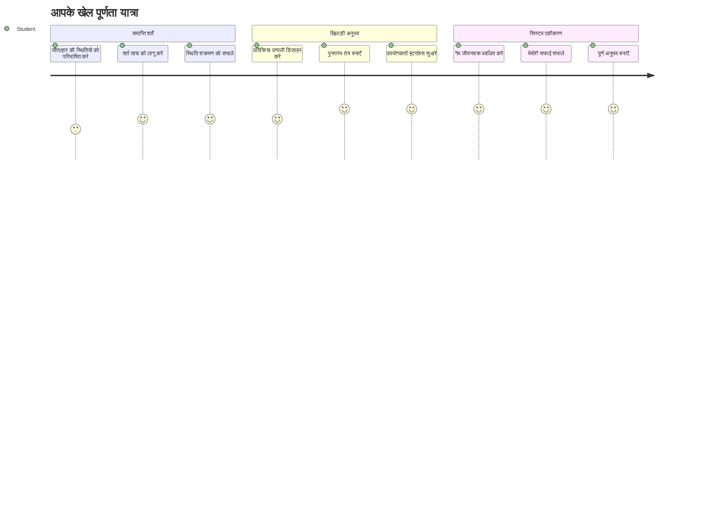
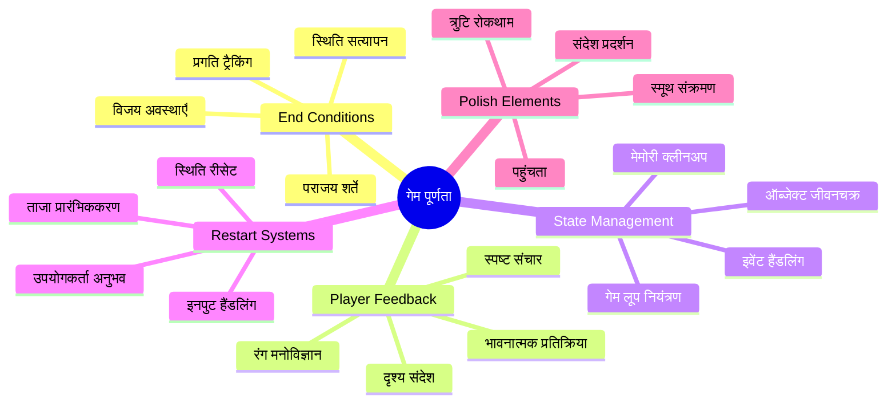
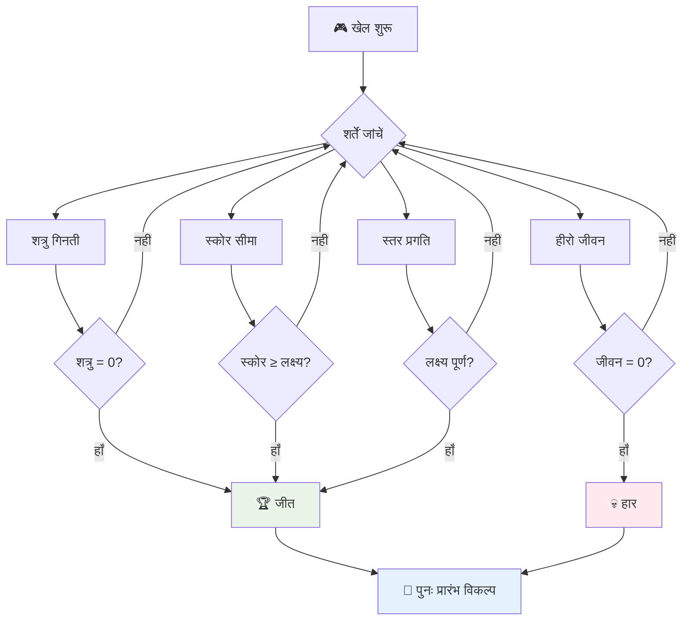
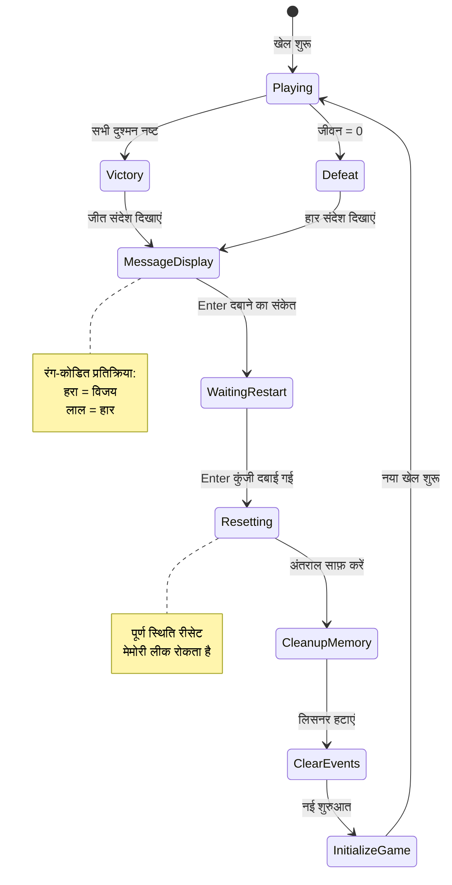
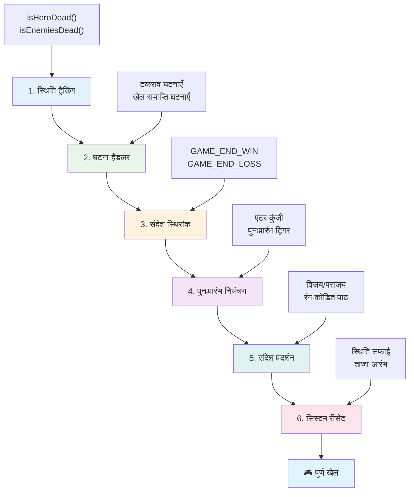
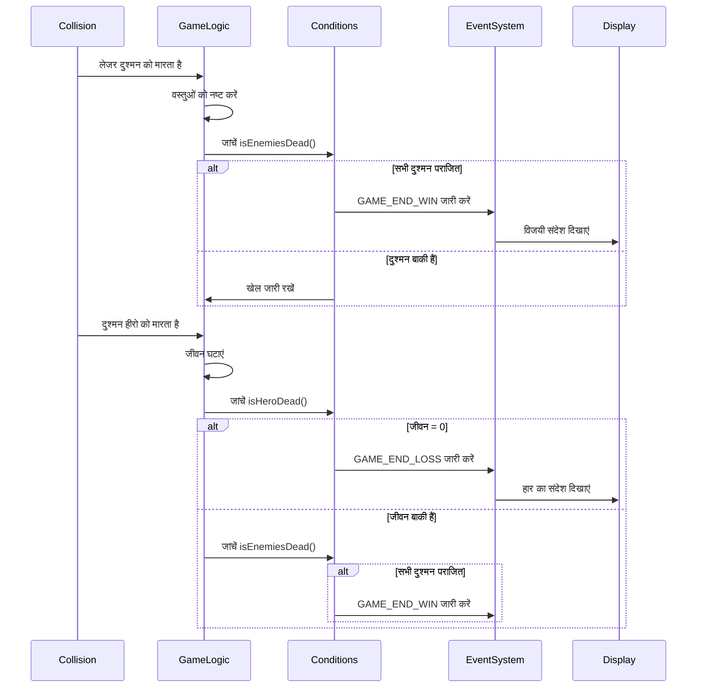
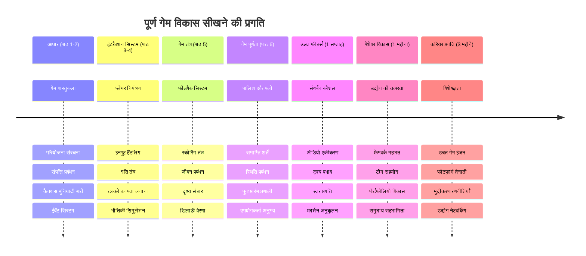

<!--
CO_OP_TRANSLATOR_METADATA:
{
  "original_hash": "a4b78043f4d64bf3ee24e0689b8b391d",
  "translation_date": "2026-01-06T16:23:03+00:00",
  "source_file": "6-space-game/6-end-condition/README.md",
  "language_code": "hi"
}
-->
# एक अंतरिक्ष खेल बनाएं भाग 6: अंत और पुनःआरंभ


हर महान खेल को स्पष्ट अंत की स्थिति और एक सहज पुनःआरंभ तंत्र की ज़रूरत होती है। आपने एक प्रभावशाली अंतरिक्ष खेल बनाया है जिसमें गति, युद्ध, और स्कोरिंग शामिल हैं - अब समय है अंतिम टुकड़े जोड़ने का जो इसे पूरा महसूस कराए।

आपका खेल वर्तमान में अनिश्चित काल तक चलता रहता है, ठीक वैसे ही जैसे 1977 में NASA द्वारा लॉन्च किए गए Voyager_probe - जो दशकों बाद भी अंतरिक्ष में यात्रा कर रहे हैं। हालांकि यह अंतरिक्ष अन्वेषण के लिए ठीक है, खेलों को परिभाषित अंत बिंदु चाहिए ताकि संतोषजनक अनुभव बनाए जा सकें।

आज, हम उचित जीत/हार की शर्तें और पुनःआरंभ प्रणाली लागू करेंगे। इस पाठ के अंत तक, आपके पास एक परिष्कृत खेल होगा जिसे खिलाड़ी पूरा कर सकते हैं और फिर से खेल सकते हैं, ठीक वैसे ही जैसे क्लासिक आर्केड गेम्स ने इस माध्यम को परिभाषित किया।


## पूर्व व्याख्यान प्रश्नोत्तर

[पूर्व-व्याख्यान प्रश्नोत्तर](https://ff-quizzes.netlify.app/web/quiz/39)

## खेल के अंत की स्थितियों को समझना

आपका खेल कब समाप्त होना चाहिए? यह मूलभूत सवाल खेल डिज़ाइन को प्रारंभिक आर्केड युग से प्रभावित करता आ रहा है। Pac-Man समाप्त होता है जब आप भूतों द्वारा पकड़े जाते हैं या सभी डॉट्स साफ़ कर देते हैं, जबकि Space Invaders समाप्त होता है जब एलियंस नीचे पहुँचते हैं या आप उन्हें सभी नष्ट कर देते हैं।

खेल निर्माता के रूप में, आप जीत और हार की स्थिति निर्धारित करते हैं। हमारे अंतरिक्ष खेल के लिए, यहाँ सिद्ध तरीके हैं जो रोचक गेमप्ले बनाते हैं:


- **`N` दुश्मन जहाज नष्ट हो चुके हैं**: जब आप खेल को विभिन्न स्तरों में विभाजित करते हैं, तब यह आम है कि आपको एक स्तर पूरा करने के लिए `N` दुश्मन जहाज नष्ट करने होते हैं
- **आपका जहाज नष्ट हो चुका है**: कुछ खेलों में आप हार जाते हैं यदि आपका जहाज नष्ट हो जाता है। एक और सामान्य तरीका है जीवन (लाइफ) की अवधारणा। हर बार जब आपका जहाज नष्ट होता है, तो एक जीवन घटता है। जब सभी जीवन खत्म हो जाते हैं, तब आप खेल हार जाते हैं।
- **आपने `N` अंक इकट्ठा कर लिए हैं**: एक अन्य सामान्य अंत स्थिति यह है कि आप अंक जमा करें। आपको अंक कैसे मिलें, यह आप पर निर्भर है लेकिन आमतौर पर अंक विभिन्न गतिविधियों जैसे दुश्मन जहाज नष्ट करने या उन वस्तुओं को इकट्ठा करने पर दिए जाते हैं जो वस्तुएं नष्ट होने पर गिरती हैं।
- **एक स्तर पूरा करें**: इसमें कई स्थितियाँ हो सकती हैं जैसे `X` दुश्मन जहाज नष्ट करना, `Y` अंक इकट्ठा करना, या कोई विशेष वस्तु इकट्ठा करना।

## खेल पुनःआरंभ कार्यक्षमता को लागू करना

अच्छे खेल सुगम पुनःआरंभ तंत्र के माध्यम से पुनःखेल की प्रोत्साहना करते हैं। जब खिलाड़ी खेल पूरा करते हैं (या हार जाते हैं), तो वे अक्सर तुरंत पुनः प्रयास करना चाहते हैं - चाहे अपने स्कोर को बेहतर बनाने के लिए या प्रदर्शन सुधारने के लिए।


Tetris इसका परफेक्ट उदाहरण है: जब आपके ब्लॉक्स शीर्ष पर पहुँचते हैं, तो आप बिना जटिल मेनू में घुसे तुरंत नया खेल शुरू कर सकते हैं। हम एक समान पुनःआरंभ तंत्र बनाएंगे जो खेल की स्थिति को साफ़-सुथरा रीसेट करता है और खिलाड़ी को तेजी से कार्रवाई में वापस लाता है।

✅ **प्रतिबिंब**: सोचिए आपने जिन खेलों को खेला है, वे किन स्थितियों में समाप्त होते हैं और आपको पुनः आरंभ के लिए कैसे प्रेरित किया जाता है? क्या कारण है जो एक पुनःआरंभ अनुभव को आसान बनाते हैं और क्या कारण हैं जो इसे निराशाजनक बनाते हैं?

## आप क्या बनाएंगे

आप अंतिम सुविधाएँ लागू करेंगे जो आपके प्रोजेक्ट को एक पूर्ण खेल अनुभव में बदल देंगी। ये तत्व परिष्कृत खेलों को बुनियादी प्रोटोटाइप से अलग करते हैं।

**आज हम जो जोड़ रहे हैं:**

1. **जीत की शर्त**: सभी दुश्मनों को ध्वस्त कर जीत का उचित जश्न मनाएं (आप इसके पात्र हैं!)
2. **हार की शर्त**: सभी जीवित जीवन खत्म होने पर हार का स्क्रीन दिखाएं
3. **पुनःआरंभ तंत्र**: Enter दबाएँ और तुरंत फिर से खेल शुरू करें - क्योंकि एक खेल कभी पर्याप्त नहीं होता
4. **स्थिति प्रबंधन**: हर बार साफ स्थिति - पिछले खेल के कोई बचे हुए दुश्मन या अजीब गड़बड़ियां नहीं

## शुरुआत करें

आइए आपका विकास वातावरण तैयार करें। आपके पास पिछले पाठों से आपके सभी अंतरिक्ष खेल फाइलें तैयार होनी चाहिए।

**आपका प्रोजेक्ट इस तरह दिखना चाहिए:**

```bash
-| assets
  -| enemyShip.png
  -| player.png
  -| laserRed.png
  -| life.png
-| index.html
-| app.js
-| package.json
```

**अपने विकास सर्वर को शुरू करें:**

```bash
cd your-work
npm start
```

**यह कमांड:**
- `http://localhost:5000` पर एक लोकल सर्वर चलाता है
- आपकी फाइलों को सही तरीके से सर्व करता है
- जब आप बदलाव करते हैं तो ऑटोमेटिक रिफ्रेश करता है

अपने ब्राउजर में `http://localhost:5000` खोलें और पुष्टि करें कि आपका खेल चल रहा है। आपको मूव, शूट, और दुश्मनों के साथ इंटरैक्ट कर पाना चाहिए। एक बार पुष्टि हो जाने पर, हम कार्यान्वयन के साथ आगे बढ़ सकते हैं।

> 💡 **प्रो टिप**: Visual Studio Code में चेतावनी से बचने के लिए, अपने फ़ाइल के शीर्ष पर `let gameLoopId;` घोषित करें, बजाय इसे `window.onload` फ़ंक्शन के अंदर घोषित करने के। यह आधुनिक JavaScript चर घोषणा के सर्वोत्तम अभ्यास का अनुसरण करता है।


## कार्यान्वयन चरण

### चरण 1: अंत स्थिति ट्रैकिंग फ़ंक्शन बनाएं

हमें फ़ंक्शंस की ज़रूरत है जो यह निगरानी करें कि खेल कब समाप्त होना चाहिए। जैसे अंतरराष्ट्रीय अंतरिक्ष स्टेशन के सेंसर महत्वपूर्ण प्रणालियों की लगातार निगरानी करते हैं, ये फ़ंक्शन लगातार खेल की स्थिति की जांच करेंगे।

```javascript
function isHeroDead() {
  return hero.life <= 0;
}

function isEnemiesDead() {
  const enemies = gameObjects.filter((go) => go.type === "Enemy" && !go.dead);
  return enemies.length === 0;
}
```

**यहाँ अंतर्निहित हो रहा है:**
- **जांचता है** कि हमारे नायक के जीवन खत्म हो गए हैं (ओह!)
- **गिनती करता है** कि कितने दुश्मन अभी भी जीवित और सक्रिय हैं
- **`true` लौटाता है** जब युद्धभूमि दुश्मनों से खाली हो जाती है
- **सरल सही/गलत लॉजिक** का उपयोग करता है ताकि चीजें साफ़ रहें
- **सभी खेल वस्तुओं को फ़िल्टर करता है** ताकि जीवित बचे लोगों को खोजा जा सके

### चरण 2: अंत स्थितियों के लिए इवेंट हैंडलर्स अपडेट करें

अब हम इन स्थिति जांचों को खेल के इवेंट सिस्टम से कनेक्ट करेंगे। हर बार जब एक टकराव होता है, तो खेल यह मूल्यांकन करेगा कि क्या यह किसी अंत स्थिति को ट्रिगर करता है। इससे महत्वपूर्ण खेल घटनाओं को तुरंत प्रतिक्रिया मिलती है।


```javascript
eventEmitter.on(Messages.COLLISION_ENEMY_LASER, (_, { first, second }) => {
    first.dead = true;
    second.dead = true;
    hero.incrementPoints();

    if (isEnemiesDead()) {
      eventEmitter.emit(Messages.GAME_END_WIN);
    }
});

eventEmitter.on(Messages.COLLISION_ENEMY_HERO, (_, { enemy }) => {
    enemy.dead = true;
    hero.decrementLife();
    if (isHeroDead())  {
      eventEmitter.emit(Messages.GAME_END_LOSS);
      return; // जीत से पहले हानि
    }
    if (isEnemiesDead()) {
      eventEmitter.emit(Messages.GAME_END_WIN);
    }
});

eventEmitter.on(Messages.GAME_END_WIN, () => {
    endGame(true);
});
  
eventEmitter.on(Messages.GAME_END_LOSS, () => {
  endGame(false);
});
```

**यहाँ क्या हो रहा है:**
- **लेजर दुश्मन को हिट करता है**: दोनों गायब हो जाते हैं, आपको अंक मिलते हैं, और हम देखते हैं कि क्या आपने जीत हासिल की
- **दुश्मन आपको हिट करता है**: आप जीवन खो देते हैं, और हम जांचते हैं कि आप अभी भी जीवित हैं या नहीं
- **स्मार्ट क्रम**: हम पहले हार की जांच करते हैं (कोई चाहता नहीं कि वह एक ही समय में जीत और हार जाए!)
- **तुरंत प्रतिक्रिया**: जैसे ही कुछ महत्वपूर्ण होता है, खेल इससे अवगत हो जाता है

### चरण 3: नए संदेश स्थिरांक जोड़ें

आपको अपने `Messages` स्थिरांक वस्तु में नए संदेश प्रकार जोड़ने होंगे। ये स्थिरांक स्थिरता बनाए रखने और आपकी इवेंट प्रणाली में टाइपो से बचने में मदद करेंगे।

```javascript
GAME_END_LOSS: "GAME_END_LOSS",
GAME_END_WIN: "GAME_END_WIN",
```

**ऊपर हमने:**
- खेल अंत घटनाओं के लिए स्थिरांक जोड़े ताकि स्थिरता बनी रहे
- ऐसे वर्णनात्मक नामों का उपयोग किया जो घटना के उद्देश्य को स्पष्ट करते हैं
- संदेश प्रकारों के लिए मौजूदा नामकरण अनुक्रम का पालन किया

### चरण 4: पुनःआरंभ नियंत्रण लागू करें

अब आप कीबोर्ड नियंत्रण जोड़ेंगे जो खिलाड़ियों को खेल पुनः प्रारंभ करने की अनुमति देगा। Enter कुंजी एक स्वाभाविक विकल्प है क्योंकि यह आम तौर पर पुष्टि क्रियाओं और नए खेल शुरू करने से जुड़ी होती है।

**अपने मौजूदा keydown इवेंट लिस्नर में Enter कुंजी का पता लगाएं:**

```javascript
else if(evt.key === "Enter") {
   eventEmitter.emit(Messages.KEY_EVENT_ENTER);
}
```

**नया संदेश स्थिरांक जोड़ें:**

```javascript
KEY_EVENT_ENTER: "KEY_EVENT_ENTER",
```

**आपको जो जानना चाहिए:**
- यह आपके मौजूदा कीबोर्ड इवेंट हैंडलिंग सिस्टम को बढ़ाता है
- प्रयोग करता है Enter कुंजी को पुनःआरंभ ट्रिगर के रूप में, उपयोगकर्ता अनुभव के लिए सहज
- एक कस्टम इवेंट उत्सर्जित करता है जिसे आपके खेल के अन्य हिस्से सुन सकते हैं
- आपके अन्य कीबोर्ड नियंत्रणों के समान पैटर्न बनाए रखता है

### चरण 5: संदेश प्रदर्शन प्रणाली बनाएं

आपके खेल को परिणामों को खिलाड़ियों के लिए स्पष्ट रूप से संवाद करने की ज़रूरत है। हम एक संदेश प्रणाली बनाएंगे जो जीत और हार की स्थितियों को रंग-कोडित पाठ के साथ दिखाएगी, ठीक वैसे ही जैसे प्रारंभिक कंप्यूटर सिस्टम में हरा रंग सफलता और लाल त्रुटि दर्शाता था।

**`displayMessage()` फ़ंक्शन बनाएं:**

```javascript
function displayMessage(message, color = "red") {
  ctx.font = "30px Arial";
  ctx.fillStyle = color;
  ctx.textAlign = "center";
  ctx.fillText(message, canvas.width / 2, canvas.height / 2);
}
```

**क्रमवार, यहाँ क्या हो रहा है:**
- स्पष्ट, पठनीय टेक्स्ट के लिए फ़ॉन्ट आकार और परिवार सेट करता है
- चेतावनी के लिए डिफ़ॉल्ट "लाल" रंग सहित रंग पैरामीटर लागू करता है
- कैनवास पर टेक्स्ट को क्षैतिज और ऊर्ध्वाधर रूप से केंद्रित करता है
- लचीले रंग विकल्पों के लिए आधुनिक JavaScript डिफॉल्ट पैरामीटर का उपयोग करता है
- कैनवास 2D संदर्भ द्वारा प्रत्यक्ष टेक्स्ट रेंडरिंग का लाभ उठाता है

**`endGame()` फ़ंक्शन बनाएं:**

```javascript
function endGame(win) {
  clearInterval(gameLoopId);

  // किसी भी लंबित रेंडर पूरी होने सुनिश्चित करने के लिए एक देरी सेट करें
  setTimeout(() => {
    ctx.clearRect(0, 0, canvas.width, canvas.height);
    ctx.fillStyle = "black";
    ctx.fillRect(0, 0, canvas.width, canvas.height);
    if (win) {
      displayMessage(
        "Victory!!! Pew Pew... - Press [Enter] to start a new game Captain Pew Pew",
        "green"
      );
    } else {
      displayMessage(
        "You died !!! Press [Enter] to start a new game Captain Pew Pew"
      );
    }
  }, 200)  
}
```

**यह फ़ंक्शन क्या करता है:**
- सब कुछ स्थिर कर देता है - जहाज या लेजर अब नहीं चलते
- आखिरी फ़्रेम पूरा होने के लिए थोड़ा इंतजार करता है (200ms)
- स्क्रीन को साफ़ करके इसे काला रंग देता है ताकि नाटकीय प्रभाव मिले
- विजेता और हारने वालों के लिए अलग संदेश दिखाता है
- रंग कोड करता है - हरा अच्छा है, लाल... ठीक वैसा नहीं
- खिलाड़ियों को बताता है कि कैसे जल्दी से फिर से खेल शुरू करें

### 🔄 **शैक्षिक जांच**
**खेल स्थिति प्रबंधन**: पुनःसेट कार्यक्षमता लागू करने से पहले सुनिश्चित करें:
- ✅ कैसे अंत की स्थितियाँ स्पष्ट गेमप्ले उद्देश्य बनाती हैं
- ✅ क्यों विज़ुअल फीडबैक खिलाड़ी समझ के लिए आवश्यक है
- ✅ उचित सफाई क्यों मेमोरी लीक रोकने में महत्वपूर्ण है
- ✅ इवेंट-चालित वास्तुकला कैसे साफ स्थिति परिवर्तन सक्षम बनाती है

**त्वरित स्व-परीक्षण**: यदि आप पुनःसेट के दौरान इवेंट लिस्नरों को साफ़ नहीं करते हैं तो क्या होगा?
*उत्तर: मेमोरी लीक और डुप्लिकेट इवेंट हैंडलर अप्रत्याशित व्यवहार का कारण बनेंगे*

**खेल डिज़ाइन सिद्धांत**: आप अब लागू कर रहे हैं:
- **स्पष्ट उद्देश्य**: खिलाड़ी जानते हैं कि सफलता और असफलता किसे कहते हैं
- **तत्काल प्रतिक्रिया**: खेल स्थिति परिवर्तन तुरंत संप्रेषित होते हैं
- **उपयोगकर्ता नियंत्रण**: खिलाड़ी जब चाहें पुनःआरंभ कर सकते हैं
- **प्रणाली विश्वसनीयता**: उचित सफाई बग्स और प्रदर्शन समस्याओं को रोकती है

### चरण 6: खेल पुनःसेट कार्यक्षमता लागू करें

पुनःसेट तंत्र को वर्तमान खेल स्थिति को पूरी तरह से साफ़ करना और एक नया खेल सत्र प्रारंभ करना चाहिए। यह सुनिश्चित करता है कि खिलाड़ी बिना पिछले खेल के किसी भी बची हुई जानकारी के साफ शुरुआत प्राप्त करें।

**`resetGame()` फ़ंक्शन बनाएं:**

```javascript
function resetGame() {
  if (gameLoopId) {
    clearInterval(gameLoopId);
    eventEmitter.clear();
    initGame();
    gameLoopId = setInterval(() => {
      ctx.clearRect(0, 0, canvas.width, canvas.height);
      ctx.fillStyle = "black";
      ctx.fillRect(0, 0, canvas.width, canvas.height);
      drawPoints();
      drawLife();
      updateGameObjects();
      drawGameObjects(ctx);
    }, 100);
  }
}
```

**आइए प्रत्येक भाग समझें:**
- जांचता है कि क्या कोई खेल लूप चल रहा है पुनःसेट से पहले
- मौजूदा गेम लूप साफ़ करता है ताकि सभी मौजूदा गतिविधियां बंद हो जाएं
- मेमोरी लीक रोकने के लिए सभी इवेंट लिस्नर को हटा देता है
- नई वस्तुओं और वेरिएबल के साथ खेल स्थिति पुनःआरंभ करता है
- सभी आवश्यक खेल फ़ंक्शंस के साथ नया गेम लूप शुरू करता है
- समान 100ms अंतराल बनाए रखता है ताकि गेम प्रदर्शन स्थिर रहे

**अपने `initGame()` फ़ंक्शन में Enter कुंजी इवेंट हैंडलर जोड़ें:**

```javascript
eventEmitter.on(Messages.KEY_EVENT_ENTER, () => {
  resetGame();
});
```

**अपने EventEmitter क्लास में `clear()` मेथड जोड़ें:**

```javascript
clear() {
  this.listeners = {};
}
```

**याद रखने योग्य मुख्य बातें:**
- Enter कुंजी प्रेस को खेल पुनःसेट फ़ंक्शन से जोड़ता है
- इस इवेंट लिस्नर को खेल के इनिशियलाइज़ेशन के दौरान पंजीकृत करता है
- पुनःसेट के दौरान सभी इवेंट लिस्नरों को हटाने का साफ़ तरीका प्रदान करता है
- गेम के बीच मेमोरी लीक से बचाता है
- लिस्नर्स ऑब्जेक्ट को खाली स्थिति में रीसेट करता है ताकि नया आरंभ हो सके

## बधाई हो! 🎉

👽 💥 🚀 आपने सफलतापूर्वक एक पूर्ण खेल ज़मीन से ऊपर बनाया है। जैसे 1970 के दशक के पहले वीडियो गेम बनाने वाले प्रोग्रामर्स ने, आपने कोड की पंक्तियों को एक इंटरैक्टिव अनुभव में बदल दिया है जिसमें उचित गेम मैकेनिक्स और उपयोगकर्ता प्रतिक्रिया शामिल है। 🚀 💥 👽

**आपने हासिल किया:**
- उपयोगकर्ता प्रतिक्रिया के साथ पूर्ण जीत और हार की स्थितियाँ लागू कीं
- निरंतर गेमप्ले के लिए सहज पुनःआरंभ प्रणाली बनाई
- खेल स्थितियों के लिए स्पष्ट दृश्य संचार डिज़ाइन किया
- जटिल खेल स्थिति संक्रमण और सफाई प्रबंधित की
- सभी घटकों को एक निष्पाप, खेली जा सकने वाली खेल में संयोजित किया

### 🔄 **शैक्षिक जांच**
**पूर्ण खेल विकास प्रणाली**: पूर्ण खेल विकास चक्र पर आपकी पकड़ का जश्न मनाएं:
- ✅ अंत की स्थितियाँ कैसे संतोषजनक खिलाड़ी अनुभव बनाती हैं?
- ✅ अच्छा स्थिति प्रबंधन खेल स्थिरता के लिए क्यों महत्वपूर्ण है?
- ✅ विज़ुअल फीडबैक खिलाड़ी समझ को कैसे बढ़ाता है?
- ✅ पुनःआरंभ तंत्र खिलाड़ी को बनाए रखने में क्या भूमिका निभाता है?

**प्रणाली प्रवीणता**: आपका पूरा खेल प्रदर्शित करता है:
- **फुल-स्टैक गेम डेवलपमेंट**: ग्राफिक्स से लेकर इनपुट और स्थिति प्रबंधन तक
- **प्रोफेशनल आर्किटेक्चर**: उचित सफाई के साथ इवेंट-चालित सिस्टम
- **उपयोगकर्ता अनुभव डिज़ाइन**: स्पष्ट प्रतिक्रिया और सहज नियंत्रण
- **प्रदर्शन अनुकूलन**: कुशल रेंडरिंग और मेमोरी प्रबंधन
- **परिष्कार और पूर्णता**: वे सभी विवरण जो खेल को पूर्ण महसूस कराते हैं

**उद्योग-तैयार कौशल**: आपने लागू किया है:
- **गेम लूप आर्किटेक्चर**: लगातार प्रदर्शन वाले रियल-टाइम सिस्टम
- **इवेंट-ड्रिवन प्रोग्रामिंग**: स्केलेबल, डी-कपल्ड सिस्टम
- **स्थिति प्रबंधन**: जटिल डेटा हैंडलिंग और जीवनचक्र प्रबंधन
- **यूज़र इंटरफेस डिज़ाइन**: स्पष्ट संचार और प्रतिक्रियाशील नियंत्रण
- **टेस्टिंग और डिबगिंग**: पुनरावृत्त विकास और समस्या समाधान

### ⚡ **अगले 5 मिनट में आप क्या कर सकते हैं**
- [ ] अपना पूर्ण खेल खेलें और सभी जीत और हार की स्थितियों का परीक्षण करें
- [ ] विभिन्न अंत स्थितियों के पैरामीटर के साथ प्रयोग करें
- [ ] खेल स्थिति परिवर्तनों को ट्रैक करने के लिए console.log स्टेटमेंट जोड़ें
- [ ] अपना खेल दोस्तों के साथ साझा करें और प्रतिक्रिया प्राप्त करें

### 🎯 **इस घंटे में आप क्या हासिल कर सकते हैं**
- [ ] पोस्ट-लेसन प्रश्नोत्तर पूरा करें और अपने खेल विकास यात्रा पर प्रतिबिंब करें
- [ ] जीत और हार की स्थितियों के लिए ऑडियो प्रभाव जोड़ें
- [ ] समय-सीमा या बोनस उद्देश्य जैसी अतिरिक्त अंत स्थितियाँ लागू करें
- [ ] अलग-अलग दुश्मन संख्या के साथ विभिन्न कठिनाई स्तर बनाएं
- [ ] बेहतर फॉन्ट और रंगों के साथ दृश्य प्रस्तुति को परिष्कृत करें

### 📅 **आपके सप्ताहभर के खेल विकास महारथ**
- [ ] कई स्तरों और प्रगति के साथ संवर्धित अंतरिक्ष खेल पूरा करें
- [ ] पावर-अप्स, विभिन्न दुश्मन प्रकार, और विशेष हथियार जैसे उन्नत फीचर्स जोड़ें
- [ ] निरंतर भंडारण के साथ उच्च स्कोर प्रणाली बनाएं
- [ ] मेनू, सेटिंग्स, और खेल विकल्पों के लिए उपयोगकर्ता इंटरफ़ेस डिज़ाइन करें
- [ ] विभिन्न उपकरणों और ब्राउज़रों के लिए प्रदर्शन अनुकूलित करें
- [ ] अपना खेल ऑनलाइन डालें और समुदाय के साथ साझा करें
### 🌟 **आपका महीने भर का गेम डेवलपमेंट करियर**
- [ ] विभिन्न शैलियों और मेकेनिक्स का अन्वेषण करते हुए कई पूर्ण गेम बनाएं
- [ ] Phaser या Three.js जैसे उन्नत गेम डेवलपमेंट फ्रेमवर्क सीखें
- [ ] ओपन सोर्स गेम डेवलपमेंट प्रोजेक्ट्स में योगदान दें
- [ ] गेम डिज़ाइन सिद्धांतों और खिलाड़ी मनोविज्ञान का अध्ययन करें
- [ ] अपने गेम डेवलपमेंट कौशल को प्रदर्शित करने वाला एक पोर्टफोलियो बनाएं
- [ ] गेम डेवलपमेंट समुदाय से जुड़ें और सीखना जारी रखें

## 🎯 आपका पूर्ण गेम डेवलपमेंट मास्टरी टाइमलाइन


### 🛠️ आपका पूर्ण गेम डेवलपमेंट टूलकिट सारांश

इस पूरे स्पेस गेम सीरीज को पूरा करने के बाद, अब आपने मास्टर किया है:
- **गेम आर्किटेक्चर**: इवेंट-ड्रिवन सिस्टम, गेम लूप्स, और स्टेट मैनेजमेंट
- **ग्राफिक्स प्रोग्रामिंग**: कैनवास API, स्प्राइट रेंडरिंग, और विजुअल इफेक्ट्स
- **इनपुट सिस्टम**: कीबोर्ड हैंडलिंग, कोलिज़न डिटेक्शन, और रिस्पॉन्सिव कंट्रोल्स
- **गेम डिज़ाइन**: खिलाड़ी प्रतिक्रिया, प्रगति प्रणालियाँ, और एंगेजमेंट मेकेनिक्स
- **परफॉर्मेंस ऑप्टिमाइजेशन**: प्रभावी रेंडरिंग, मेमोरी मैनेजमेंट, और फ्रेम रेट नियंत्रण
- **यूज़र एक्सपीरियंस**: स्पष्ट संचार, सहज कंट्रोल्स, और पॉलिश विवरण
- **प्रोफेशनल पैटर्न्स**: साफ़ कोड, डिबगिंग तकनीकें, और प्रोजेक्ट संगठन

**वास्तविक दुनिया में उपयोग**: आपके गेम डेवलपमेंट कौशल सीधे लागू होते हैं:
- **इंटरैक्टिव वेब एप्लिकेशन**: डायनामिक इंटरफेस और रियल-टाइम सिस्टम्स
- **डेटा विज़ुअलाइज़ेशन**: एनिमेटेड चार्ट्स और इंटरैक्टिव ग्राफिक्स
- **शैक्षिक तकनीक**: गेमिफिकेशन और आकर्षक सीखने के अनुभव
- **मोबाइल डेवलपमेंट**: टच-आधारित इंटरैक्शन और परफॉर्मेंस ऑप्टिमाइजेशन
- **सिमुलेशन सॉफ़्टवेयर**: फिजिक्स इंजन और रियल-टाइम मॉडलिंग
- **क्रिएटिव इंडस्ट्रीज**: इंटरैक्टिव कला, मनोरंजन, और डिजिटल अनुभव

**प्रोफेशनल स्किल्स जो आपने हासिल किए**: अब आप कर सकते हैं:
- **आर्किटेक्ट** जटिल इंटरैक्टिव सिस्टम्स ज़ीरो से
- **डिबग** रियल-टाइम एप्लिकेशन को व्यवस्थित दृष्टिकोण से
- **ऑप्टिमाइज़** परफॉर्मेंस को स्मूद यूज़र एक्सपीरियंस के लिए
- **डिज़ाइन** आकर्षक यूज़र इंटरफेस और इंटरेक्शन पैटर्न्स
- **कोलैबोरेट** तकनीकी प्रोजेक्ट्स पर प्रभावी ढंग से उचित कोड संगठन के साथ

**गेम डेवलपमेंट कॉन्सेप्ट्स में पारंगत**:
- **रियल-टाइम सिस्टम्स**: गेम लूप्स, फ्रेम रेट प्रबंधन, और परफॉर्मेंस
- **इवेंट-ड्रिवन आर्किटेक्चर**: डिसकपल्ड सिस्टम्स और मैसेज पासिंग
- **स्टेट मैनेजमेंट**: जटिल डेटा हैंडलिंग और लाइफसाइकल मैनेजमेंट
- **यूज़र इंटरफेस प्रोग्रामिंग**: कैनवास ग्राफिक्स और रिस्पॉन्सिव डिज़ाइन
- **गेम डिज़ाइन थ्योरी**: खिलाड़ी मनोविज्ञान और एंगेजमेंट मेकेनिक्स

**अगला स्तर**: आप तैयार हैं उन्नत गेम फ्रेमवर्क, 3D ग्राफिक्स, मल्टीप्लेयर सिस्टम्स का अन्वेषण करने या पेशेवर गेम डेवलपमेंट भूमिकाओं में बदलाव करने के लिए!

🌟 **उपलब्धि अनलॉक हुई**: आपने एक पूर्ण गेम डेवलपमेंट यात्रा पूरी कर ली है और ज़ीरो से एक पेशेवर गुणवत्ता वाला इंटरैक्टिव अनुभव बनाया है!

**गेम डेवलपमेंट समुदाय में आपका स्वागत है!** 🎮✨

## GitHub Copilot Agent चुनौती 🚀

एजेंट मोड का उपयोग करके निम्नलिखित चुनौती पूरी करें:

**विवरण:** एक स्तर प्रगति प्रणाली लागू करके स्पेस गेम को बढ़ाएं जिसमें बढ़ती कठिनाई और बोनस फीचर्स हों।

**प्रॉम्प्ट:** एक मल्टी-लेवल स्पेस गेम सिस्टम बनाएं जहाँ प्रत्येक स्तर पर दुश्मन जहाजों की संख्या अधिक हो जिनकी गति और स्वास्थ्य बढ़े। एक स्कोरिंग मल्टीप्लायर जोड़ें जो प्रत्येक स्तर के साथ बढ़ता है, और पावर-अप (जैसे रैपिड फायर या शील्ड) लागू करें जो दुश्मनों के नष्ट होने पर यादृच्छिक रूप से प्रकट होते हैं। एक स्तर पूर्णता बोनस जोड़ें और स्क्रीन पर वर्तमान स्तर को मौजूदा स्कोर और जीवन के साथ प्रदर्शित करें।

अधिक जानने के लिए [एजेंट मोड](https://code.visualstudio.com/blogs/2025/02/24/introducing-copilot-agent-mode) पर जाएं।

## 🚀 वैकल्पिक उन्नयन चुनौती

**अपने गेम में ऑडियो जोड़ें**: साउंड इफेक्ट्स लागू करके अपने गेमप्ले अनुभव को बेहतर बनाएं! निम्नलिखित के लिए ऑडियो जोड़ने पर विचार करें:

- **लेजर शॉट्स** जब खिलाड़ी फायर करता है
- **दुश्मन के नष्ट होने पर**
- **हीरो क्षति** जब खिलाड़ी को चोट लगती है
- **विजय संगीत** जब गेम जीत लिया जाता है
- **हार ध्वनि** जब गेम हार जाता है

**ऑडियो लागू करने का उदाहरण:**

```javascript
// ऑडियो ऑब्जेक्ट्स बनाएं
const laserSound = new Audio('assets/laser.wav');
const explosionSound = new Audio('assets/explosion.wav');

// गेम इवेंट्स के दौरान ध्वनियाँ चलाएं
function playLaserSound() {
  laserSound.currentTime = 0; // शुरुआत में रीसेट करें
  laserSound.play();
}
```

**आपको जो जानना चाहिए:**
- विभिन्न ध्वनि प्रभावों के लिए Audio ऑब्जेक्ट्स बनाता है
- `currentTime` को रीसेट करता है ताकि तेज़-तर्रार साउंड इफेक्ट्स चल सकें
- ब्राउज़र ऑटो-प्ले नीतियों को यूज़र इंटरैक्शन से ध्वनियां ट्रिगर करके संभालता है
- बेहतर गेम अनुभव के लिए ऑडियो वॉल्यूम और टाइमिंग मैनेज करता है

> 💡 **सीखने का स्रोत**: इस [ऑडियो सैंडबॉक्स](https://www.w3schools.com/jsref/tryit.asp?filename=tryjsref_audio_play) को एक्सप्लोर करके जावास्क्रिप्ट गेम्स में ऑडियो लागू करना सीखें।

## पोस्ट-लेक्चर क्विज़

[पोस्ट-लेक्चर क्विज़](https://ff-quizzes.netlify.app/web/quiz/40)

## समीक्षा और स्वयं अध्ययन

आपका असाइनमेंट है एक नया एक्साम्पल गेम बनाना, इसलिए वहाँ बाहर कुछ दिलचस्प गेम्स का अन्वेषण करें यह देखने के लिए कि आप किस प्रकार का गेम बना सकते हैं।

## असाइनमेंट

[एक नमूना गेम बनाएं](assignment.md)

---

<!-- CO-OP TRANSLATOR DISCLAIMER START -->
**अस्वीकरण**:  
यह दस्तावेज़ [Co-op Translator](https://github.com/Azure/co-op-translator) नामक एआई अनुवाद सेवा का उपयोग करके अनुवादित किया गया है। जब हम सटीकता के लिए प्रयासरत हैं, कृपया ध्यान दें कि स्वचालित अनुवाद में त्रुटियाँ या असत्यताएँ हो सकती हैं। मूल भाषा में उपलब्ध दस्तावेज़ को अधिकृत स्रोत माना जाना चाहिए। महत्वपूर्ण जानकारी के लिए, पेशेवर मानव अनुवाद की सलाह दी जाती है। इस अनुवाद के उपयोग से उत्पन्न किसी भी गलतफहमी या गलत व्याख्या के लिए हम जिम्मेदार नहीं हैं।
<!-- CO-OP TRANSLATOR DISCLAIMER END -->