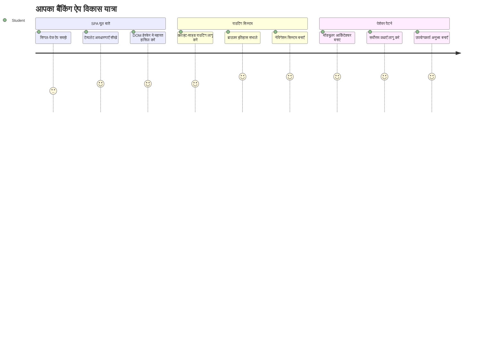
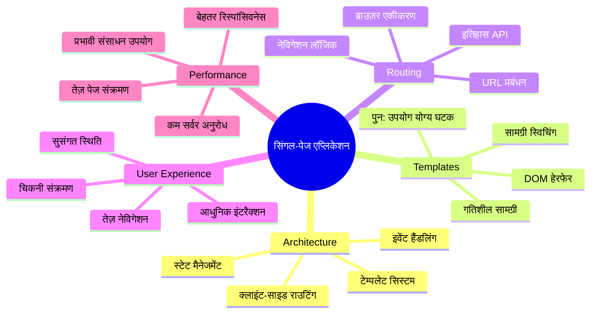
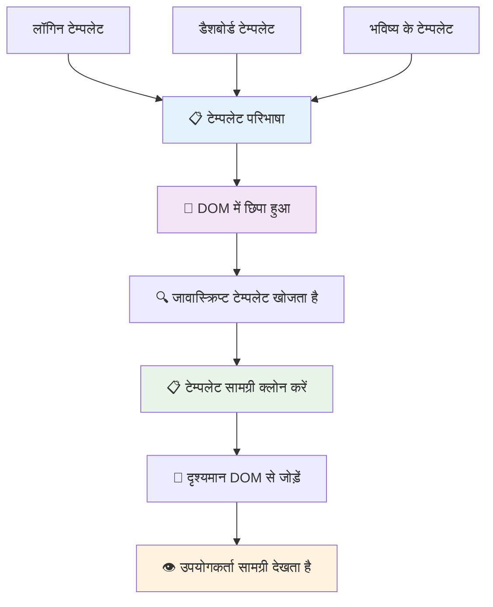
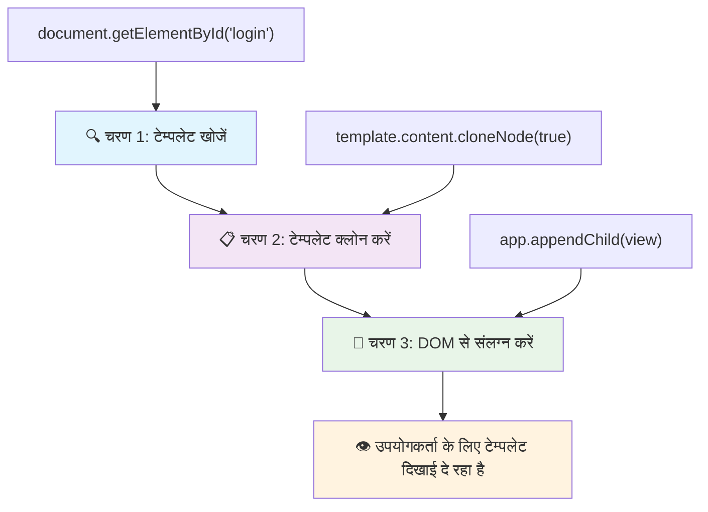
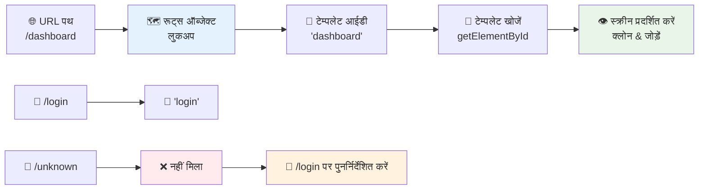
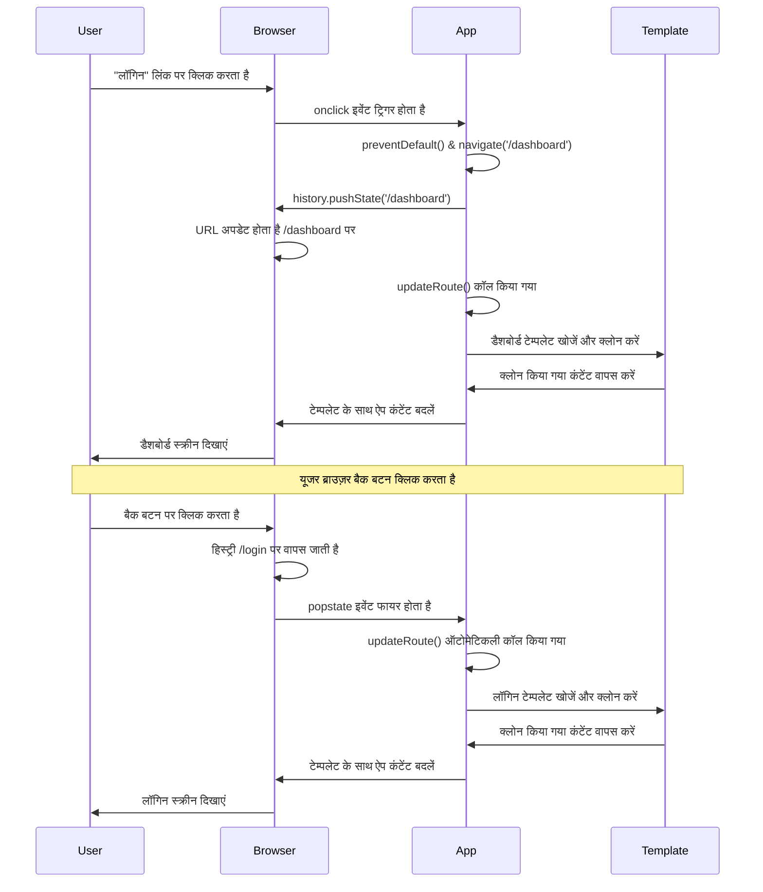
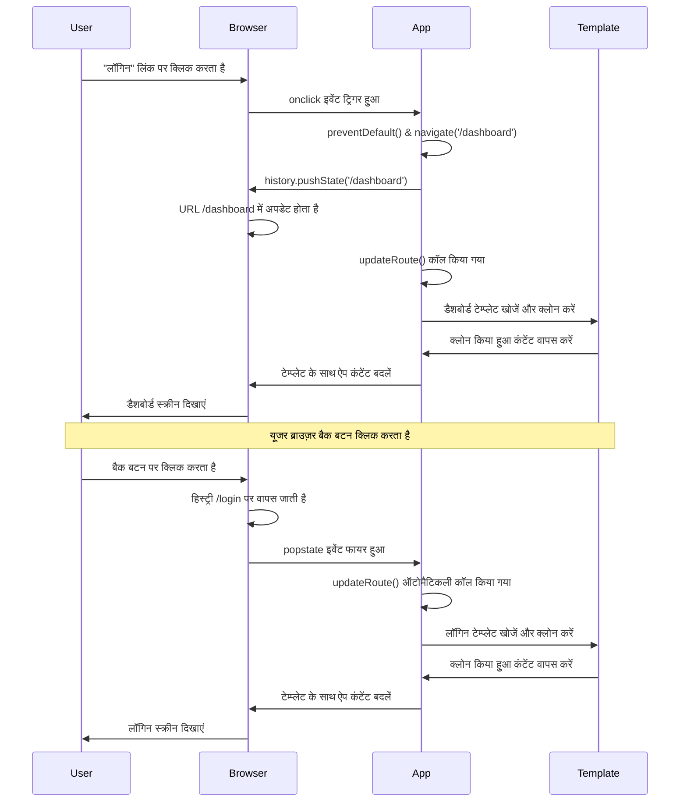
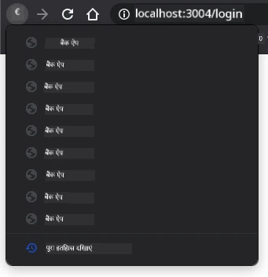
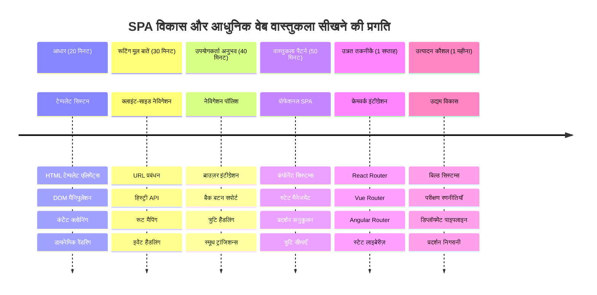

<!--
CO_OP_TRANSLATOR_METADATA:
{
  "original_hash": "351678bece18f07d9daa987a881fb062",
  "translation_date": "2026-01-06T16:44:55+00:00",
  "source_file": "7-bank-project/1-template-route/README.md",
  "language_code": "hi"
}
-->
# बैंकिंग ऐप बनाएं भाग 1: वेब ऐप में HTML टेम्प्लेट और रूटिंग


जब अपोलो 11 का गाइडेंस कंप्यूटर 1969 में चंद्रमा की ओर नेविगेट कर रहा था, तो उसे पूरे सिस्टम को पुनः चालू किए बिना विभिन्न प्रोग्रामों के बीच स्विच करना पड़ता था। आधुनिक वेब एप्लिकेशन भी इसी प्रकार काम करते हैं – ये बिना सब कुछ फिर से लोड किए, आपके सामने दिखाई देने वाली चीज़ों को बदलते हैं। इससे उपयोगकर्ताओं को आज के समय में अपेक्षित सहज और उत्तरदायी अनुभव मिलता है।

पारंपरिक वेबसाइटों के विपरीत जो हर इंटरैक्शन के लिए पूरे पेज को पुनः लोड करती हैं, आधुनिक वेब ऐप केवल उन हिस्सों को अपडेट करते हैं जिन्हें बदलने की ज़रूरत होती है। यह दृष्टिकोण, ठीक वैसे ही जैसे मिशन कंट्रोल लगातार संचार बनाये रखते हुए विभिन्न डिस्प्ले के बीच स्विच करता है, वह सुंदर और सहज अनुभव बनाता है जिसकी हम उम्मीद करते हैं।

यहाँ वह अंतर है जो अनुभव को इतना प्रभावशाली बनाता है:

| पारंपरिक मल्टी-पेज ऐप्स | आधुनिक सिंगल-पेज ऐप्स |
|-------------------------|-------------------------|
| **नेविगेशन**              | प्रत्येक स्क्रीन के लिए पूर्ण पेज रीलोड | तत्काल कंटेंट स्विचिंग |
| **प्रदर्शन**             | पूरी HTML डाउनलोड के कारण धीमा       | आंशिक अपडेट के साथ तेज़  |
| **उपयोगकर्ता अनुभव**     | अचानक पेज फ्लैश                   | स्मूथ, ऐप जैसे ट्रांज़िशन |
| **डेटा साझा करना**       | पेजों के बीच कठिन                  | आसान स्टेट मैनेजमेंट       |
| **डेवलपमेंट**            | कई HTML फाइलों का रखरखाव           | एकल HTML के साथ डायनेमिक टेम्प्लेट |

**विकास को समझना:**
- **पारंपरिक ऐप्स** हर नेविगेशन क्रिया के लिए सर्वर रिक्वेस्ट मांगते हैं
- **आधुनिक SPA** एक बार लोड होते हैं और JavaScript से कंटेंट को डायनामिकली अपडेट करते हैं
- **उपयोगकर्ता आशाएं** अब त्वरित, सहज इंटरैक्शन को प्राथमिकता देती हैं
- **प्रदर्शन लाभ** में कम बैंडविड्थ और तेज़ प्रतिक्रिया शामिल हैं

इस पाठ में, हम एक बैंकिंग ऐप बनाएंगे जिसमें कई स्क्रीन होंगी जो एक साथ सुचारू रूप से जुड़ी होंगी। जैसे वैज्ञानिक मॉड्यूलर इंस्ट्रूमेंट्स का उपयोग करते हैं जिन्हें अलग-अलग प्रयोगों के लिए पुनः कॉन्फ़िगर किया जा सकता है, हम HTML टेम्प्लेट्स का उपयोग करेंगे जिन्हें पुन: उपयोग योग्य घटकों के रूप में दिखाया जा सकेगा।

आप HTML टेम्प्लेट्स (विभिन्न स्क्रीन के लिए पुन: उपयोग योग्य ब्लूप्रिंट), JavaScript रूटिंग (सिस्टम जो स्क्रीन के बीच स्विच करता है), और ब्राउज़र के इतिहास API (जो बैक बटन को अपेक्षित रूप से काम करता रखता है) के साथ काम करेंगे। ये वही मूलभूत तकनीकें हैं जिनका उपयोग React, Vue, और Angular जैसे फ्रेमवर्क्स करते हैं।

अंत तक, आपके पास एक कामकाजी बैंकिंग ऐप होगा जो पेशेवर सिंगल-पेज एप्लिकेशन सिद्धांतों को दर्शाएगा।


## प्री-लेक्चर क्विज़

[प्री-लेक्चर क्विज़](https://ff-quizzes.netlify.app/web/quiz/41)

### आपको क्या चाहिए होगा

हमें हमारे बैंकिंग ऐप को टेस्ट करने के लिए एक लोकल वेब सर्वर की आवश्यकता होगी – चिंता करने की जरूरत नहीं, यह सुनने से ज्यादा आसान है! यदि आपके पास पहले से नहीं है, तो बस [Node.js](https://nodejs.org) इंस्टॉल करें और अपने प्रोजेक्ट फोल्डर से `npx lite-server` चलाएं। यह कमांड एक लोकल सर्वर चलाएगा और अपने आप ही आपके ऐप को ब्राउज़र में खोल देगा।

### तैयारी

अपने कंप्यूटर पर एक फोल्डर बनाएं जिसका नाम `bank` हो और उसमें एक फाइल `index.html` बनाएँ। हम इस HTML [बॉयलरप्लेट](https://en.wikipedia.org/wiki/Boilerplate_code) से शुरू करेंगे:

```html
<!DOCTYPE html>
<html lang="en">
  <head>
    <meta charset="UTF-8">
    <meta name="viewport" content="width=device-width, initial-scale=1.0">
    <title>Bank App</title>
  </head>
  <body>
    <!-- This is where you'll work -->
  </body>
</html>
```

**यह बॉयलरप्लेट क्या प्रदान करता है:**
- **HTML5 डॉक्यूमेंट संरचना** स्थापित करता है उचित DOCTYPE घोषणा के साथ
- **चरित्र एनकोडिंग** UTF-8 के रूप में सेट करता है ताकि अंतरराष्ट्रीय टेक्स्ट समर्थित हो
- **रेस्पॉन्सिव डिज़ाइन सक्षम करता है** मोबाइल संगतता के लिए viewport meta टैग के साथ
- **ब्राउज़र टैब में दिखाई देने वाला शीर्षक सेट करता है**
- **एक साफ़ body सेक्शन बनाता है** जहाँ हम अपना एप्लिकेशन बनाएंगे

> 📁 **प्रोजेक्ट संरचना पूर्वावलोकन**
> 
> **इस पाठ के अंत तक, आपका प्रोजेक्ट निम्नलिखित शामिल करेगा:**
> ```
> bank/
> ├── index.html      <!-- Main HTML with templates -->
> ├── app.js          <!-- Routing and navigation logic -->
> └── style.css       <!-- (Optional for future lessons) -->
> ```
> 
> **फाइल जिम्मेदारियां:**
> - **index.html**: सभी टेम्प्लेट्स रखता है और ऐप के ढांचे को प्रदान करता है
> - **app.js**: रूटिंग, नेविगेशन, और टेम्प्लेट प्रबंधन को संभालता है
> - **टेम्प्लेट्स**: लॉगिन, डैशबोर्ड, और अन्य स्क्रीन के UI को परिभाषित करते हैं

---

## HTML टेम्प्लेट्स

टेम्प्लेट्स वेब विकास में एक मौलिक समस्या का समाधान करते हैं। जब गुटेनबर्ग ने 1440 के दशक में चलायमान टाइप प्रिंटिंग का आविष्कार किया था, तो उन्होंने महसूस किया कि पूरे पेज बनाएं बिना, वे पुन: उपयोग योग्य अक्षर ब्लॉक बना सकते हैं और उन्हें जरूरत के अनुसार व्यवस्थित कर सकते हैं। HTML टेम्प्लेट्स भी इसी सिद्धांत पर काम करते हैं – हर स्क्रीन के लिए अलग HTML फाइल बनाने के बजाय, आप पुन: उपयोग योग्य संरचनाएं परिभाषित करते हैं जिन्हें आवश्यकता अनुसार दिखाया जा सकता है।


टेम्प्लेट्स को अपने ऐप के विभिन्न हिस्सों के ब्लूप्रिंट के रूप में सोचें। जैसे एक वास्तुकार एक ब्लूप्रिंट बनाता है और उसे कई बार उपयोग करता है बजाए एक जैसे कमरे बार-बार बनाये, हम टेम्प्लेट्स एक बार बनाते हैं और आवश्यकता अनुसार उनका इस्तेमाल करते हैं। ब्राउज़र इन टेम्प्लेट्स को तब तक छिपा कर रखता है जब तक कि JavaScript उन्हें सक्रिय न करे।

यदि आप एक वेब पेज के लिए कई स्क्रीन बनाना चाहते हैं, तो एक तरीका यह होगा कि हर स्क्रीन के लिए एक HTML फाइल बनाई जाए। लेकिन इस समाधान में कुछ असुविधाएं हैं:

- स्क्रीन बदलते समय पूरे HTML को पुनः लोड करना पड़ता है, जो धीमा हो सकता है।
- विभिन्न स्क्रीन के बीच डेटा साझा करना मुश्किल होता है।

एक अन्य तरीका है कि केवल एक HTML फाइल हो, और उसमें कई [HTML टेम्प्लेट्स](https://developer.mozilla.org/docs/Web/HTML/Element/template) `<template>` एलिमेंट की मदद से परिभाषित किए जाएं। टेम्प्लेट एक पुन: उपयोग योग्य HTML ब्लॉक होता है जिसे ब्राउज़र प्रदर्शित नहीं करता, और जिन्हें रनटाइम पर JavaScript के ज़रिए सक्रिय किया जाना होता है।

### इसे बनाएं

हम एक बैंक ऐप बनाएंगे जिसमें दो मुख्य स्क्रीन होंगी: एक लॉगिन पेज और एक डैशबोर्ड। सबसे पहले, चलिए HTML body में एक प्लेसहोल्डर एलिमेंट जोड़ते हैं – यही वह जगह होगी जहाँ हमारी सारी विभिन्न स्क्रीन दिखाई देंगी:

```html
<div id="app">Loading...</div>
```

**इस प्लेसहोल्डर को समझना:**
- **"app" आईडी वाला कंटेनर बनाता है** जहाँ सभी स्क्रीन प्रदर्शित होंगी
- **JavaScript शुरू करते समय तक लोडिंग संदेश दिखाता है**
- **हमारी डायनेमिक सामग्री के लिए एकमात्र माउंटिंग पॉइंट प्रदान करता है**
- **JavaScript को `document.getElementById()` से आसानी से लक्षित करने की अनुमति देता है**

> 💡 **प्रो टिप**: इस एलिमेंट की सामग्री बदली जाएगी, इसलिए आप इसमें कोई लोडिंग संदेश या संकेतक रख सकते हैं जो ऐप लोड होने तक दिखेगा।

अगले चरण में, HTML टेम्प्लेट में लॉगिन पेज के लिए टेम्प्लेट जोड़ते हैं। फिलहाल हम उसमें केवल एक शीर्षक और एक ऐसा सेक्शन डालेंगे जिसमें एक लिंक होगा, जिसका उपयोग हम नेविगेशन के लिए करेंगे।

```html
<template id="login">
  <h1>Bank App</h1>
  <section>
    <a href="/dashboard">Login</a>
  </section>
</template>
```

**इस लॉगिन टेम्प्लेट का विश्लेषण:**
- **"login" के अद्वितीय पहचानकर्ता के साथ एक टेम्प्लेट परिभाषित करता है** ताकि JavaScript इसे लक्षित कर सके
- **मुख्य शीर्षक शामिल करता है** जो ऐप की ब्रांडिंग स्थापित करता है
- **संबंधित सामग्री समूहित करने के लिए सेमांटिक `<section>` एलिमेंट रखता है**
- **एक नेविगेशन लिंक प्रदान करता है** जो उपयोगकर्ताओं को डैशबोर्ड पर ले जाएगा

फिर हम डैशबोर्ड पेज के लिए एक और HTML टेम्प्लेट जोड़ेंगे। इस पेज में विभिन्न सेक्शन होंगे:

- एक हेडर जिसमें शीर्षक और लॉगआउट लिंक होगा
- बैंक खाते की वर्तमान बैलेंस
- एक लेनदेन सूची, जो एक टेबल में प्रदर्शित होगी

```html
<template id="dashboard">
  <header>
    <h1>Bank App</h1>
    <a href="/login">Logout</a>
  </header>
  <section>
    Balance: 100$
  </section>
  <section>
    <h2>Transactions</h2>
    <table>
      <thead>
        <tr>
          <th>Date</th>
          <th>Object</th>
          <th>Amount</th>
        </tr>
      </thead>
      <tbody></tbody>
    </table>
  </section>
</template>
```

**आइए इस डैशबोर्ड के प्रत्येक भाग को समझें:**
- **पेज को एक सेमांटिक `<header>` के साथ संरचित करता है जिसमें नेविगेशन शामिल है**
- **स्क्रीन के across ऐप शीर्षक लगातार दिखाता है** जिससे ब्रांडिंग सुनिश्चित होती है
- **एक लॉगआउट लिंक प्रदान करता है** जो वापसी में लॉगिन स्क्रीन पर ले जाता है
- **वर्तमान खाते का बैलेंस समर्पित सेक्शन में दिखाता है**
- **लेनदेन डेटा को पर्याप्त रूप से संरचित HTML टेबल में व्यवस्थित करता है**
- **Date, Object, और Amount कॉलम के लिए टेबल हेडर्स परिभाषित करता है**
- **टेबल बॉडी खाली छोड़ता है ताकि बाद में डायनेमिक कंटेंट डाला जा सके**

> 💡 **प्रो टिप**: जब HTML टेम्प्लेट्स बना रहे हों, यदि आप देखना चाहते हैं कि ये कैसा दिखेगा, तो आप `<template>` और `</template>` लाइन को `<!-- -->` के बीच टिप्पणी के रूप में रख सकते हैं।

### 🔄 **शैक्षिक जांच**
**टेम्प्लेट सिस्टम की समझ**: JavaScript लागू करने से पहले सुनिश्चित करें कि आप समझते हैं:
- ✅ टेम्प्लेट्स सामान्य HTML एलिमेंट्स से कैसे अलग होते हैं
- ✅ टेम्प्लेट्स तब तक छुपे रहते हैं जब तक JavaScript उन्हें सक्रिय न करे
- ✅ टेम्प्लेट्स में सेमांटिक HTML संरचना का महत्व
- ✅ टेम्प्लेट्स कैसे पुन: उपयोग योग्य UI कंपोनेंट्स सक्षम करते हैं

**त्वरित आत्म-परीक्षा**: अगर आप अपने HTML से `<template>` टैग हटा दें तो क्या होगा?
*उत्तर: सामग्री तुरंत दिखने लगती है और इसका टेम्प्लेट फंक्शनैलिटी खो जाता है*

**आर्किटेक्चर लाभ**: टेम्प्लेट्स प्रदान करते हैं:
- **पुन: उपयोगिता**: एक बार परिभाषित, कई बार उपयोग
- **प्रदर्शन**: बार-बार HTML पार्सिंग नहीं करनी पड़ती
- **रखरखाव में सुविधा**: केंद्रीकृत UI संरचना
- **लचीलापन**: डायनेमिक कंटेंट स्विचिंग

✅ आपको क्यों लगता है कि हम टेम्प्लेट्स पर `id` एट्रिब्यूट का उपयोग करते हैं? क्या हम क्लास जैसी अन्य चीज़ें भी उपयोग कर सकते थे?

## JavaScript के साथ टेम्प्लेट्स को जीवन दें

अब हमें हमारे टेम्प्लेट्स को कार्यात्मक बनाना होगा। जैसे 3D प्रिंटर एक डिजिटल ब्लूप्रिंट लेकर एक भौतिक वस्तु बनाता है, वैसे ही JavaScript हमारे छिपे हुए टेम्प्लेट्स को लेकर उन्हें दृश्य, इंटरैक्टिव एलिमेंट्स में बदल देता है जिन्हें उपयोगकर्ता देख और उपयोग कर सकते हैं।

यह प्रक्रिया तीन निरंतर चरणों का पालन करती है जो आधुनिक वेब विकास की नींव बनाते हैं। एक बार जब आप इस पैटर्न को समझ जाते हैं, तो आप इसे कई फ्रेमवर्क और लाइब्रेरी में देख पाएंगे।

यदि आप वर्तमान HTML फाइल ब्राउज़र में खोलते हैं, तो आप देखेंगे कि यह `Loading...` मैसेज पर अटक जाता है। इसका कारण यह है कि हमें HTML टेम्प्लेट्स को उदाहरणित और प्रदर्शित करने के लिए कुछ JavaScript कोड जोड़ना होगा।

टेम्प्लेट को उदाहरणित (instantiate) करना आमतौर पर 3 चरणों में किया जाता है:

1. DOM में टेम्प्लेट एलिमेंट प्राप्त करें, उदाहरण के लिए [`document.getElementById`](https://developer.mozilla.org/docs/Web/API/Document/getElementById) का उपयोग करके।
2. टेम्प्लेट एलिमेंट को क्लोन करें, [`cloneNode`](https://developer.mozilla.org/docs/Web/API/Node/cloneNode) का उपयोग करते हुए।
3. इसे DOM में किसी दृश्यमान एलिमेंट के अंतर्गत संलग्न करें, उदाहरण के लिए [`appendChild`](https://developer.mozilla.org/docs/Web/API/Node/appendChild) का उपयोग।


**प्रक्रिया का दृश्य विश्लेषण:**
- **चरण 1** DOM संरचना में छिपे टेम्प्लेट को खोजता है
- **चरण 2** कार्यशील कॉपी बनाता है जिसे सुरक्षित रूप से संशोधित किया जा सकता है
- **चरण 3** कॉपी को दृश्यमान पेज क्षेत्र में डालता है
- **परिणाम** एक कार्यात्मक स्क्रीन होता है जिसके साथ उपयोगकर्ता इंटरैक्ट कर सकते हैं

✅ हमें टेम्प्लेट को DOM में संलग्न करने से पहले क्लोन क्यों करना पड़ता है? यदि हम यह चरण छोड़ दें तो क्या होगा?

### कार्य

अपने प्रोजेक्ट फोल्डर में `app.js` नामक नई फाइल बनाएं और उसे अपने HTML के `<head>` सेक्शन में इम्पोर्ट करें:

```html
<script src="app.js" defer></script>
```

**इस स्क्रिप्ट इम्पोर्ट की समझ:**
- **JavaScript फाइल को हमारे HTML डॉक्यूमेंट से लिंक करता है**
- **`defer` एट्रिब्यूट का उपयोग करता है ताकि स्क्रिप्ट HTML पार्सिंग के बाद चले**
- **DOM के सभी एलिमेंट्स तक पहुंच सुनिश्चित करता है क्योंकि स्क्रिप्ट से पहले वे पूरी तरह लोड हो जाते हैं**
- **स्क्रिप्ट लोडिंग और प्रदर्शन के लिए आधुनिक सर्वोत्तम प्रथाओं का पालन करता है**

अब `app.js` में, हम एक नया फ़ंक्शन `updateRoute` बनाएंगे:

```js
function updateRoute(templateId) {
  const template = document.getElementById(templateId);
  const view = template.content.cloneNode(true);
  const app = document.getElementById('app');
  app.innerHTML = '';
  app.appendChild(view);
}
```

**कदम-दर-कदम, यह क्या कर रहा है:**
- **विशिष्ट ID के आधार पर टेम्प्लेट एलिमेंट खोजता है**
- **`cloneNode(true)` का उपयोग करके टेम्प्लेट की सामग्री की गहन कॉपी बनाता है**
- **ऐप कंटेनर खोजता है जहाँ सामग्री प्रदर्शित होगी**
- **कंटेनर की पुरानी सामग्री को साफ करता है**
- **क्लोन किए गए टेम्प्लेट कंटेंट को दृश्य DOM में डालता है**

अब इस फ़ंक्शन को किसी एक टेम्प्लेट के साथ कॉल करें और परिणाम देखें।

```js
updateRoute('login');
```

**इस फ़ंक्शन कॉल से जो होता है:**
- **लॉगिन टेम्प्लेट को ID पास करके सक्रिय करता है**
- **यह दिखाता है कि प्रोग्रामेटिक तरीके से ऐप की विभिन्न स्क्रीन के बीच कैसे स्विच किया जाता है**
- **"Loading..." संदेश की जगह लॉगिन स्क्रीन दिखाता है**

✅ इस कोड `app.innerHTML = '';` का उद्देश्य क्या है? इसके बिना क्या होगा?

## रूट्स बनाना

रूटिंग मूलतः URLs को सही कंटेंट से जोड़ने के बारे में है। सोचिए कि शुरुआती टेलीफोन ऑपरेटर कॉल को कनेक्ट करने के लिए स्विचबोर्ड का उपयोग करते थे – वे आने वाली कॉल को सही गंतव्य तक पहुंचाते थे। वेब रूटिंग भी इसी तरह काम करती है, जो URL अनुरोध लेकर यह तय करती है कि कौन सी सामग्री दिखाई जाएगी।


पारंपरिक रूप से, वेब सर्वर विभिन्न URLs के लिए अलग-अलग HTML फाइलें सर्व करते थे। चूंकि हम एक सिंगल-पेज ऐप बना रहे हैं, हमें यह रूटिंग JavaScript से स्वयं संभालनी होगी। इससे हमें उपयोगकर्ता अनुभव और प्रदर्शन पर अधिक नियंत्रण मिलता है।


**रूटिंग फ्लो को समझना:**
- **URL बदलाव** हमारी रूट कॉन्फ़िगरेशन में लुकअप को ट्रिगर करते हैं
- **वैध रूट्स** विशिष्ट टेम्प्लेट IDs से मेल खाते हैं जिन्हें रेंडर किया जाता है
- **अमान्य रूट्स** टूटे हुए स्टेट से बचने के लिए फालबैक व्यवहार ट्रिगर करते हैं
- **टेम्प्लेट रेंडरिंग** हमने पहले सीखा गया तीन-चरणीय प्रक्रिया का पालन करती है

जब हम वेब ऐप की बात करते हैं, तो हम *रूटिंग* से मतलब लेते हैं URLs को उन विशेष स्क्रीन से मानचित्रित करने का जो दिखनी चाहिए। एक वेबसाइट पर जिसमें कई HTML फाइलें हों, यह स्वचालन होता है क्योंकि फ़ाइल पथ URL में परिलक्षित होते हैं। उदाहरण के लिए, आपके प्रोजेक्ट फ़ोल्डर में ये फाइलें हैं:

```
mywebsite/index.html
mywebsite/login.html
mywebsite/admin/index.html
```

यदि आप `mywebsite` को रूट बनाकर एक वेब सर्वर बनाते हैं, तो URL मैपिंग इस प्रकार होगी:

```
https://site.com            --> mywebsite/index.html
https://site.com/login.html --> mywebsite/login.html
https://site.com/admin/     --> mywebsite/admin/index.html
```

हालांकि, हमारी वेब ऐप एकल HTML फाइल का उपयोग करती है जिसमें सभी स्क्रीन शामिल हैं, इसलिए यह डिफ़ॉल्ट व्यवहार हमारी मदद नहीं करेगा। हमें यह मानचित्र मैन्युअली बनाना होगा और JavaScript का उपयोग करके प्रदर्शित टेम्प्लेट को अपडेट करना होगा।

### कार्य

हम URL पथों और हमारे टेम्प्लेट्स के बीच एक साधारण ऑब्जेक्ट का उपयोग करके एक [मैप](https://en.wikipedia.org/wiki/Associative_array) बनाएंगे। इस ऑब्जेक्ट को अपनी `app.js` फाइल के शीर्ष पर जोड़ें।

```js
const routes = {
  '/login': { templateId: 'login' },
  '/dashboard': { templateId: 'dashboard' },
};
```

**इस रूट कॉन्फ़िगरेशन को समझना:**
- **URL पथों और टेम्प्लेट पहचानकर्ताओं के बीच मैपिंग परिभाषित करता है**
- **ऑब्जेक्ट सिंटैक्स का उपयोग करता है जहाँ कीज URL पथ होते हैं और मान टेम्प्लेट जानकारी रखते हैं**
- **किसी भी दिए गए URL के लिए प्रदर्शित टेम्प्लेट को आसानी से खोजने में सक्षम बनाता है**
- **भविष्य में नए रूट्स जोड़ने के लिए एक स्केलेबल संरचना प्रदान करता है**
अब हम `updateRoute` फ़ंक्शन में थोड़ा बदलाव करते हैं। सीधे `templateId` को तर्क के रूप में पास करने की बजाय, हम इसे पहले वर्तमान URL देखकर प्राप्त करना चाहते हैं, और फिर हमारे नक्शे का उपयोग करके संबंधित टेम्पलेट ID मान प्राप्त करेंगे। हम केवल URL के पथ खंड को प्राप्त करने के लिए [`window.location.pathname`](https://developer.mozilla.org/docs/Web/API/Location/pathname) का उपयोग कर सकते हैं।

```js
function updateRoute() {
  const path = window.location.pathname;
  const route = routes[path];

  const template = document.getElementById(route.templateId);
  const view = template.content.cloneNode(true);
  const app = document.getElementById('app');
  app.innerHTML = '';
  app.appendChild(view);
}
```

**यहाँ क्या होता है इसे तोड़कर समझना:**
- ब्राउज़र के URL से वर्तमान पथ `window.location.pathname` का उपयोग करके **निकाला** जाता है
- हमारे routes ऑब्जेक्ट में संबंधित रूट कॉन्फ़िगरेशन को **खोजा** जाता है
- रूट कॉन्फ़िगरेशन से टेम्पलेट ID **प्राप्त** किया जाता है
- पहले की तरह टेम्पलेट रेंडरिंग प्रक्रिया **अनुसरण** की जाती है
- URL परिवर्तनों के प्रति प्रतिक्रिया देने वाला एक गतिशील सिस्टम **बनाता** है

यहाँ हमने घोषित किए गए रूट्स को संबंधित टेम्पलेट से मैप किया। आप इसे मैन्युअल रूप से अपने ब्राउज़र में URL बदलकर सही ढंग से काम करता है यह आज़मा सकते हैं।

✅ अगर आप URL में कोई अज्ञात पथ दर्ज करते हैं तो क्या होता है? हम इसे कैसे हल कर सकते हैं?

## नेविगेशन जोड़ना

राउटिंग स्थापित होने के साथ, उपयोगकर्ताओं को ऐप के माध्यम से नेविगेट करने का तरीका चाहिए। पारंपरिक वेबसाइटें लिंक पर क्लिक करने पर पूरी पेज को फिर से लोड करती हैं, लेकिन हम URL और सामग्री दोनों को पेज रिफ्रेश के बिना अपडेट करना चाहते हैं। यह एक आसान अनुभव बनाता है, जैसा कि डेस्कटॉप ऐप्लिकेशन विभिन्न दृश्यों के बीच स्विच करते हैं।

हमें दो चीजों का समन्वय करना है: ब्राउज़र का URL अपडेट करना ताकि उपयोगकर्ता पेज बुकमार्क कर सकें और लिंक साझा कर सकें, और उपयुक्त सामग्री प्रदर्शित करना। जब सही तरीके से लागू किया जाता है, तो यह आधुनिक ऐप्लिकेशन से अपेक्षित निर्बाध नेविगेशन बनाता है।


### 🔄 **शैक्षिक जाँच**
**सिंगल-पेज एप्लिकेशन आर्किटेक्चर**: पूरे सिस्टम की अपनी समझ जांचें:
- ✅ क्लाइंट-साइड राउटिंग पारंपरिक सर्वर-साइड राउटिंग से कैसे अलग है?
- ✅ उचित SPA नेविगेशन के लिए History API क्यों आवश्यक है?
- ✅ टेम्पलेट कैसे बिना पेज रीलोड के गतिशील सामग्री सक्षम करते हैं?
- ✅ नेविगेशन को रोकने में इवेंट हैंडलिंग की क्या भूमिका होती है?

**सिस्टम इंटीग्रेशन**: आपका SPA प्रदर्शित करता है:
- **टेम्पलेट प्रबंधन**: गतिशील सामग्री वाले पुन: उपयोग योग्य UI घटक
- **क्लाइंट-साइड राउटिंग**: सर्वर अनुरोधों के बिना URL प्रबंधन
- **इवेंट-चालित वास्तुकला**: प्रतिक्रियाशील नेविगेशन और उपयोगकर्ता इंटरैक्शन
- **ब्राउज़र इंटीग्रेशन**: सही हिस्ट्री और बैक/फ़ॉरवर्ड बटन समर्थन
- **प्रदर्शन अनुकूलन**: तेज़ ट्रांज़िशन और कम सर्वर लोड

**पेशेवर पैटर्न**: आपने लागू किया है:
- **मॉडल-व्यू पृथक्करण**: ऐप्लिकेशन लॉजिक से अलग टेम्पलेट्स
- **स्टेट प्रबंधन**: प्रदर्शित सामग्री के साथ URL स्टेट सिंक्रोनाइज़ेशन
- **प्रोग्रेसिव एन्हांसमेंट**: जावास्क्रिप्ट बेसिक HTML कार्यक्षमता को बढ़ाता है
- **उपयोगकर्ता अनुभव**: पेज रिफ्रेश के बिना सहज, ऐप- जैसा नेविगेशन

> � **आर्किटेक्चर अंतर्दृष्टि**: नेविगेशन सिस्टम घटक
>
> **आप जो बना रहे हैं:**
> - **🔄 URL प्रबंधन**: पेज रीलोड किए बिना ब्राउज़र पता बार अपडेट करता है
> - **📋 टेम्पलेट सिस्टम**: वर्तमान रूट के आधार पर सामग्री गतिशील रूप से स्वैप करता है  
> - **📚 हिस्ट्री इंटीग्रेशन**: ब्राउज़र बैक/फ़ॉरवर्ड बटन की कार्यक्षमता बनाए रखता है
> - **🛡️ त्रुटि हैंडलिंग**: अमान्य या अनुपस्थित रूट के लिए सहज फॉलबैक
>
> **घटक एक साथ कैसे काम करते हैं:**
> - नेविगेशन इवेंट (क्लिक, इतिहास परिवर्तन) के लिए **सुनते हैं**
> - History API का उपयोग कर URL को **अपडेट** करते हैं
> - नए रूट के लिए उपयुक्त टेम्पलेट **रेंडर** करते हैं
> - पूरे अनुभव को निर्बाध **बनाए रखते हैं**

हमारे ऐप का अगला कदम है पृष्ठों के बीच नेविगेट करने की संभावना जोड़ना बिना URL मैन्युअल रूप से बदलने के। इसका मतलब दो चीजें हैं:

  1. वर्तमान URL को अपडेट करना
  2. नए URL के आधार पर प्रदर्शित टेम्पलेट को अपडेट करना

हमने पहले `updateRoute` फ़ंक्शन के साथ दूसरे भाग का ध्यान रखा है, इसलिए हमें यह पता लगाना है कि वर्तमान URL को कैसे अपडेट करें।

हमें जावास्क्रिप्ट का उपयोग करना होगा, और विशेष रूप से [`history.pushState`](https://developer.mozilla.org/docs/Web/API/History/pushState) का जो URL को अपडेट करने और ब्राउज़िंग इतिहास में एक नया प्रविष्टि बनाने की अनुमति देता है, बिना HTML को पुनः लोड किए।

> ⚠️ **महत्वपूर्ण नोट**: यद्यपि HTML ऐंकर एलिमेंट [`<a href>`](https://developer.mozilla.org/docs/Web/HTML/Element/a) को अलग-थलग विभिन्न URL के हाइपरलिंक्स बनाने के लिए उपयोग किया जा सकता है, यह डिफ़ॉल्ट रूप से ब्राउज़र में HTML को रीलोड कर देगा। कस्टम जावास्क्रिप्ट के साथ राउटिंग को संभालते समय इस व्यवहार को रोकना आवश्यक होता है, क्लिक इवेंट पर `preventDefault()` फ़ंक्शन का उपयोग करके।

### कार्य

चलो एक नया फ़ंक्शन बनाते हैं जो हमारे ऐप में नेविगेट करने के लिए उपयोग किया जा सके:

```js
function navigate(path) {
  window.history.pushState({}, path, path);
  updateRoute();
}
```

**इस नेविगेशन फ़ंक्शन को समझना:**
- `history.pushState` का उपयोग करके ब्राउज़र का URL नए पथ पर **अपडेट** करता है
- उचित बैक/फ़ॉरवर्ड बटन समर्थन के लिए ब्राउज़र के इतिहास स्टैक में एक नई प्रविष्टि **जोड़ता** है
- उपयुक्त टेम्पलेट प्रदर्शित करने के लिए `updateRoute()` फ़ंक्शन को **ट्रिगर** करता है
- पेज रीलोड के बिना सिंगल-पेज ऐप अनुभव को **बनाए रखता** है

यह विधि पहले प्रदत्त पथ के आधार पर वर्तमान URL को अपडेट करती है, फिर टेम्पलेट को अपडेट करती है। गुण `window.location.origin` URL रूट लौटाता है, जिससे हमें एक दिए गए पथ से पूरा URL पुनर्निर्माण करने की अनुमति मिलती है।

अब जब हमारे पास यह फ़ंक्शन है, हम उस समस्या का समाधान कर सकते हैं जो होती है यदि कोई पथ किसी परिभाषित रूट से मेल नहीं खाता। हम `updateRoute` फ़ंक्शन को संशोधित करेंगे और यदि कोई मेल नहीं मिलता है तो मौजूदा रूट में से किसी एक के लिए फॉलबैक जोड़ेंगे।

```js
function updateRoute() {
  const path = window.location.pathname;
  const route = routes[path];

  if (!route) {
    return navigate('/login');
  }

  const template = document.getElementById(route.templateId);
  const view = template.content.cloneNode(true);
  const app = document.getElementById('app');
  app.innerHTML = '';
  app.appendChild(view);
}
```

**ध्यान देने योग्य मुख्य बिंदु:**
- वर्तमान पथ के लिए रूट मौजूद है या नहीं यह **जांचता** है
- अमान्य रूट पर पहुँचने पर **लॉगिन पेज पर पुनर्निर्देशन** करता है
- टूटे हुए नेविगेशन को रोकने वाला एक फॉलबैक तंत्र **प्रदान करता** है
- उपयोगकर्ता हमेशा एक वैध स्क्रीन देख सकें, चाहे URL गलत हों, यह **सुनिश्चित करता** है

यदि कोई रूट नहीं मिला, तो अब हम `login` पेज पर पुनर्निर्देशित करेंगे।

अब हम एक फ़ंक्शन बनाएंगे जो लिंक क्लिक होने पर URL प्राप्त करें और ब्राउज़र के डिफ़ॉल्ट लिंक व्यवहार को रोकें:

```js
function onLinkClick(event) {
  event.preventDefault();
  navigate(event.target.href);
}
```

**इस क्लिक हैंडलर का विश्लेषण:**
- `preventDefault()` का उपयोग कर ब्राउज़र के डिफ़ॉल्ट लिंक व्यवहार को **रोकता** है
- क्लिक किए गए लिंक एलिमेंट से गंतव्य URL **निकालता** है
- पृष्ठ को पुनः लोड करने के बजाय हमारे कस्टम नेविगेट फ़ंक्शन को **कॉल** करता है
- सिंगल-पेज ऐप्लिकेशन के सहज अनुभव को **बनाए रखता** है

```html
<a href="/dashboard" onclick="onLinkClick(event)">Login</a>
...
<a href="/login" onclick="onLinkClick(event)">Logout</a>
```

**यह onclick बाइंडिंग क्या करती है:**
- प्रत्येक लिंक को हमारे कस्टम नेविगेशन सिस्टम से **कनेक्ट** करती है
- क्लिक इवेंट को हमारे `onLinkClick` फ़ंक्शन को प्रोसेसिंग के लिए **पास** करती है
- पेज रीलोड के बिना सहज नेविगेशन को **सक्षम** बनाती है
- उपयोगकर्ताओं द्वारा बुकमार्क या साझा किए जा सकने वाले सही URL संरचना को **बनाए रखती** है

[`onclick`](https://developer.mozilla.org/docs/Web/API/GlobalEventHandlers/onclick) एट्रीब्यूट क्लिक इवेंट को जावास्क्रिप्ट कोड, यहाँ `navigate()` फ़ंक्शन कॉल से बाइंड करता है।

इन लिंक पर क्लिक करने का प्रयास करें, आपको अब अपने ऐप की विभिन्न स्क्रीन के बीच नेविगेट करने में सक्षम होना चाहिए।

✅ `history.pushState` विधि HTML5 मानक का हिस्सा है और [सभी आधुनिक ब्राउज़रों](https://caniuse.com/?search=pushState) में लागू है। यदि आप पुराने ब्राउज़रों के लिए वेब ऐप बना रहे हैं, तो इस API के स्थान पर एक तरकीब है: पथ से पहले [हैश (`#`)](https://en.wikipedia.org/wiki/URI_fragment) का उपयोग करके आप ऐसा राउटिंग लागू कर सकते हैं जो सामान्य एंकर नेविगेशन के साथ काम करता है और पेज को पुनः लोड नहीं करता, क्योंकि इसका उद्देश्य पृष्ठ के भीतर आंतरिक लिंक बनाना था।

## बैक और फॉरवर्ड बटन को कार्यान्वित करना

बैक और फॉरवर्ड बटन वेब ब्राउज़िंग के लिए मौलिक हैं, ठीक वैसे ही जैसे नासा मिशन नियंत्रक अंतरिक्ष अभियानों के दौरान पहले के सिस्टम स्टेट की समीक्षा कर सकते हैं। उपयोगकर्ता अपेक्षा करते हैं कि ये बटन काम करें, और जब वे नहीं करते तो यह अपेक्षित ब्राउज़िंग अनुभव को तोड़ देता है।

हमारे सिंगल-पेज ऐप को इसे सपोर्ट करने के लिए अतिरिक्त कॉन्फ़िगरेशन की आवश्यकता है। ब्राउज़र एक इतिहास स्टैक बनाए रखता है (जिसमें हमने `history.pushState` के जरिए प्रविष्टियाँ जोड़ी हैं), लेकिन जब उपयोगकर्ता इस इतिहास के माध्यम से नेविगेट करते हैं, तो हमारा ऐप प्रदर्शित सामग्री को उसी अनुसार अपडेट करने के लिए प्रतिक्रिया देना चाहिए।


**मुख्य इंटरैक्शन पॉइंट:**
- उपयोगकर्ता क्रियाएं क्लिक या ब्राउज़र बटन के ज़रिए नेविगेशन शुरू करती हैं
- ऐप लिंक क्लिक को इंटरसेप्ट करता है ताकि पेज रीलोड न हो
- History API URL परिवर्तन और ब्राउज़र इतिहास स्टैक का प्रबंधन करता है
- टेम्पलेट प्रत्येक स्क्रीन के लिए सामग्री संरचना प्रदान करते हैं
- इवेंट लिस्नर्स यह सुनिश्चित करते हैं कि ऐप सभी प्रकार के नेविगेशन पर प्रतिक्रिया दे

`history.pushState` का उपयोग ब्राउज़र के नेविगेशन इतिहास में नई प्रविष्टियां बनाता है। आप इसे तब जांच सकते हैं जब आप ब्राउज़र के *बैक बटन* को दबाए रखें, यह आपको कुछ ऐसा दिखाना चाहिए:



यदि आप कुछ बार बैक बटन क्लिक करते हैं, तो आप देखेंगे कि वर्तमान URL बदल जाता है और इतिहास अपडेट होता है, लेकिन वही टेम्पलेट प्रदर्शित होता रहता है।

ऐसा इसलिए है क्योंकि एप्लिकेशन नहीं जानता कि इतिहास बदलने पर हमें `updateRoute()` फ़ंक्शन को कॉल करना चाहिए। यदि आप [`history.pushState` दस्तावेज़](https://developer.mozilla.org/docs/Web/API/History/pushState) देखें, तो देखेंगे कि यदि स्थिति बदलती है - मतलब कि हम एक अलग URL पर चले गए - तो [`popstate`](https://developer.mozilla.org/docs/Web/API/Window/popstate_event) इवेंट ट्रिगर होता है। हम इसे इस समस्या को ठीक करने के लिए उपयोग करेंगे।

### कार्य

यह सुनिश्चित करने के लिए कि ब्राउज़र इतिहास बदलने पर प्रदर्शित टेम्पलेट अपडेट हो, हम एक नया फ़ंक्शन संलग्न करेंगे जो `updateRoute()` को कॉल करेगा। हम इसे अपनी `app.js` फाइल के अंत में करेंगे:

```js
window.onpopstate = () => updateRoute();
updateRoute();
```

**इस हिस्ट्री इंटीग्रेशन को समझना:**
- `popstate` इवेंट पर **सुनता** है जो उपयोगकर्ता ब्राउज़र बटन से नेविगेट करते समय होता है
- संक्षिप्त इवेंट हैंडलर सिंटैक्स के लिए एरो फ़ंक्शन का उपयोग करता है
- इतिहास की स्थिति बदलने पर स्वचालित रूप से `updateRoute()` को **कॉल** करता है
- पृष्ठ पहली बार लोड होने पर ऐप को आरंभ करने के लिए `updateRoute()` को **इनिशियलाइज़** करता है
- उपयोगकर्ता कैसे भी नेविगेट करें सही टेम्पलेट प्रदर्शित होना **सुनिश्चित** करता है

> 💡 **प्रो टिप**: हमने यहाँ अपने `popstate` इवेंट हैंडलर को घोषित करने के लिए [एरो फ़ंक्शन](https://developer.mozilla.org/docs/Web/JavaScript/Reference/Functions/Arrow_functions) का उपयोग किया है क्योंकि यह संक्षिप्त है, लेकिन एक सामान्य फ़ंक्शन भी समान काम करेगा।

यहाँ एरो फ़ंक्शनों पर एक ताज़ा वीडियो है:

[](https://youtube.com/watch?v=OP6eEbOj2sc "Arrow Functions")

> 🎥 एरो फ़ंक्शनों के बारे में वीडियो के लिए ऊपर चित्र पर क्लिक करें।

अब अपने ब्राउज़र के बैक और फॉरवर्ड बटन का उपयोग करने का प्रयास करें, और देखें कि प्रदर्शित रूट इस बार सही ढंग से अपडेट होता है।

### ⚡ **अगले 5 मिनट में आप क्या कर सकते हैं**
- [ ] ब्राउज़र बैक/फ़ॉरवर्ड बटन का उपयोग कर अपने बैंकिंग ऐप के नेविगेशन का परीक्षण करें
- [ ] पता बार में मैन्युअल रूप से विभिन्न URL टाइप करके राउटिंग जांचें
- [ ] ब्राउज़र के DevTools खोलें और देखें कि टेम्पलेट DOM में कैसे क्लोन होते हैं
- [ ] राउटिंग फ्लो को ट्रैक करने के लिए console.log स्टेटमेंट जोड़कर प्रयोग करें

### 🎯 **इस घंटे में आप क्या हासिल कर सकते हैं**
- [ ] पोस्ट-लेसन क्विज़ पूरा करें और SPA आर्किटेक्चर अवधारणाएं समझें
- [ ] अपने बैंकिंग ऐप के टेम्पलेट पर CSS स्टाइलिंग लागू करें ताकि वे पेशेवर दिखें
- [ ] 404 त्रुटि पेज चुनौती को उचित त्रुटि हैंडलिंग के साथ लागू करें
- [ ] अतिरिक्त राउटिंग कार्यक्षमता के साथ क्रेडिट्स पेज चुनौती बनाएं
- [ ] लोडिंग स्थितियाँ और टेम्पलेट स्विच के बीच ट्रांज़िशन जोड़ें

### 📅 **आपका सप्ताह भर का SPA विकास यात्रा**
- [ ] पूर्ण बैंकिंग ऐप बनाएं जिसमें फॉर्म, डेटा प्रबंधन और टिकाऊपन हो
- [ ] उन्नत राउटिंग सुविधाएँ जोड़ें जैसे रूट पैरामीटर और नेस्टेड रूट्स
- [ ] नेविगेशन गार्ड और प्रमाणिकरण-आधारित राउटिंग लागू करें
- [ ] पुन: प्रयोज्य टेम्पलेट कॉम्पोनेंट और कॉम्पोनेंट लाइब्रेरी बनाएं
- [ ] बेहतर उपयोगकर्ता अनुभव के लिए एनिमेशन और ट्रांज़िशन जोड़ें
- [ ] अपनी SPA को होस्टिंग प्लेटफ़ॉर्म पर तैनात करें और राउटिंग ठीक से कॉन्फ़िगर करें

### 🌟 **आपकी महीने भर की फ्रंटेंड आर्किटेक्चर महारत**
- [ ] React, Vue या Angular जैसे आधुनिक फ्रेमवर्क का उपयोग कर जटिल SPA बनाएँ
- [ ] उन्नत स्टेट प्रबंधन पैटर्न और लाइब्रेरी सीखें
- [ ] SPA विकास के लिए बिल्ड टूल और विकास वर्कफ़्लो में महारत हासिल करें
- [ ] प्रोग्रेसिव वेब ऐप सुविधाएँ और ऑफ़लाइन कार्यक्षमता लागू करें
- [ ] बड़े पैमाने पर SPA के लिए प्रदर्शन अनुकूलन तकनीकों का अध्ययन करें
- [ ] ओपन सोर्स SPA प्रोजेक्ट में योगदान दें और अपना ज्ञान साझा करें

## 🎯 आपका सिंगल-पेज एप्लिकेशन मास्टरी टाइमलाइन


### 🛠️ आपके SPA विकास टूलकिट का सारांश

इस पाठ को पूरा करने के बाद, अब आपने महारत हासिल कर ली है:
- **टेम्पलेट आर्किटेक्चर**: गतिशील सामग्री रेंडरिंग के साथ पुन: उपयोग योग्य HTML घटक
- **क्लाइंट-साइड राउटिंग**: पृष्ठ रीलोड के बिना URL प्रबंधन और नेविगेशन
- **ब्राउज़र इंटीग्रेशन**: History API उपयोग और बैक/फ़ॉरवर्ड बटन समर्थन
- **इवेंट-चालित सिस्टम**: नेविगेशन हैंडलिंग और उपयोगकर्ता इंटरैक्शन प्रबंधन
- **DOM मैनिपुलेशन**: टेम्पलेट क्लोनिंग, सामग्री स्विचिंग, और एलिमेंट प्रबंधन
- **त्रुटि प्रबंधन**: अमान्य रूट्स और अनुपस्थित सामग्री के लिए सहज फॉलबैक
- **प्रदर्शन पैटर्न**: कुशल सामग्री लोडिंग और रेंडरिंग रणनीतियाँ

**वास्तविक दुनिया अनुप्रयोग**: आपकी SPA विकास कौशल सीधे लागू होती हैं:
- **आधुनिक वेब ऐप्लिकेशन**: React, Vue, Angular, और अन्य फ्रेमवर्क विकास
- **प्रोग्रेसिव वेब ऐप्स**: ऑफ़लाइन सक्षम ऐप्लिकेशन के साथ ऐप जैसा अनुभव
- **एंटरप्राइज डैशबोर्ड**: कई दृश्यों वाले जटिल बिज़नेस ऐप्लिकेशन
- **ई-कॉमर्स प्लेटफ़ॉर्म**: उत्पाद कैटलॉग, शॉपिंग कार्ट, और चेकआउट फ्लो
- **सामग्री प्रबंधन**: गतिशील सामग्री निर्माण और संपादन इंटरफ़ेस
- **मोबाइल विकास**: वेब तकनीकों से बने हाइब्रिड ऐप्स

**आपने जो पेशेवर कौशल प्राप्त किए हैं**:

- **एकल पृष्ठ अनुप्रयोगों** को उचित चिंता पृथक्करण के साथ आर्किटेक्ट करें  
- **क्लाइंट-साइड रूटिंग सिस्टम** लागू करें जो अनुप्रयोग की जटिलता के साथ स्केल करते हैं  
- **ब्राउज़र डेवलपर टूल्स** का उपयोग करके जटिल नेविगेशन फ्लो का डीबग करें  
- **प्रभावी टेम्पलेट प्रबंधन** के माध्यम से अनुप्रयोग के प्रदर्शन को अनुकूलित करें  
- **ऐसे उपयोगकर्ता अनुभव डिज़ाइन करें** जो स्वदेशी और प्रतिक्रियाशील महसूस हों  

**फ्रंटेंड विकास संकल्पनाएं जो आपने मास्टर की हैं**:  
- **कंपोनेंट आर्किटेक्चर**: पुन: प्रयोज्य UI पैटर्न और टेम्पलेट सिस्टम  
- **स्टेट सिंक्रोनाइजेशन**: URL स्टेट प्रबंधन और ब्राउज़र हिस्ट्री  
- **इवेंट-ड्रिवन प्रोग्रामिंग**: उपयोगकर्ता इंटरैक्शन हैंडलिंग और नेविगेशन  
- **परफॉर्मेंस ऑप्टिमाइजेशन**: प्रभावी DOM हेरफेर और सामग्री लोडिंग  
- **उपयोगकर्ता अनुभव डिज़ाइन**: स्मूथ ट्रांजिशन और सहज नेविगेशन  

**अगला स्तर**: आप आधुनिक फ्रंटेंड फ्रेमवर्क, उन्नत स्टेट मैनेजमेंट का अन्वेषण करने या जटिल एंटरप्राइज अनुप्रयोग बनाने के लिए तैयार हैं!  

🌟 **उपलब्धि अनलॉक की गई**: आपने आधुनिक वेब आर्किटेक्चर पैटर्न के साथ एक पेशेवर सिंगल-पेज एप्लिकेशन फाउंडेशन बनाया है!  

---

## GitHub Copilot एजेंट चुनौती 🚀  

एजेंट मोड का उपयोग करके निम्नलिखित चुनौती पूरी करें:  

**विवरण:** बैंकिंग ऐप में त्रुटि हैंडलिंग और अमान्य रूट्स के लिए 404 पेज टेम्पलेट लागू करें, जो उपयोगकर्ता अनुभव को बेहतर बनाएगा जब वे गैर-मौजूद पेजों पर नेविगेट करें।  

**प्रॉम्प्ट:** "not-found" आईडी के साथ एक नया HTML टेम्पलेट बनाएं जो उपयोगकर्ता के अनुकूल 404 त्रुटि पेज स्टाइलिंग के साथ दिखाए। फिर जावास्क्रिप्ट रूटिंग लॉजिक को संशोधित करें ताकि जब उपयोगकर्ता अमान्य URLs पर जाएं तो यह टेम्पलेट दिखे, और "Go Home" बटन जोड़ें जो लॉगिन पेज पर वापस नेविगेट करे।  

[एजेंट मोड](https://code.visualstudio.com/blogs/2025/02/24/introducing-copilot-agent-mode) के बारे में अधिक जानें।  

## 🚀 चुनौती  

एक तीसरे पेज के लिए नया टेम्पलेट और रूट जोड़ें जो इस ऐप के क्रेडिट्स दिखाए।  

**चुनौती के लक्ष्य:**  
- **उपयुक्त सामग्री संरचना के साथ** एक नया HTML टेम्पलेट बनाएं  
- **अपने रूट्स कॉन्फ़िगरेशन ऑब्जेक्ट में** नया रूट जोड़ें  
- **क्रेडिट्स पेज के लिए और उससे वापस** नेविगेशन लिंक शामिल करें  
- **परीक्षण करें** कि सभी नेविगेशन ब्राउज़र हिस्ट्री के साथ सही काम कर रहे हैं  

## पोस्ट-व्याख्यान क्विज़  

[पोस्ट-व्याख्यान क्विज़](https://ff-quizzes.netlify.app/web/quiz/42)  

## समीक्षा और आत्म-अध्ययन  

रूटिंग वेब विकास के आश्चर्यजनक रूप से पेचीदा हिस्सों में से एक है, विशेषकर जब वेब पेज रीफ्रेश व्यवहार से सिंगल पेज एप्लिकेशन पेज रीफ्रेश पर चलता है। [Azure Static Web App सेवा](https://docs.microsoft.com/azure/static-web-apps/routes/?WT.mc_id=academic-77807-sagibbon) रूटिंग को कैसे संभालती है इस पर थोड़ा पढ़ें। क्या आप समझा सकते हैं कि उस दस्तावेज़ में वर्णित कुछ निर्णय क्यों आवश्यक हैं?  

**अतिरिक्त अध्ययन संसाधन:**  
- **जांचें** कि लोकप्रिय फ्रेमवर्क जैसे React Router और Vue Router क्लाइंट-साइड रूटिंग कैसे लागू करते हैं  
- **खोजें** हैश-आधारित रूटिंग और हिस्ट्री API रूटिंग के बीच अंतर  
- **जानें** सर्वर-साइड रेंडरिंग (SSR) के बारे में और यह रूटिंग रणनीतियों को कैसे प्रभावित करता है  
- **जांचें** प्रोग्रेसिव वेब ऐप्स (PWAs) नेविगेशन और रूटिंग कैसे संभालते हैं  

## असाइनमेंट  

[रूटिंग में सुधार करें](assignment.md)

---

<!-- CO-OP TRANSLATOR DISCLAIMER START -->
**अस्वीकरण**:  
इस दस्तावेज़ का अनुवाद AI अनुवाद सेवा [Co-op Translator](https://github.com/Azure/co-op-translator) का उपयोग करके किया गया है। हम सटीकता के लिए प्रयासरत हैं, फिर भी कृपया ध्यान दें कि स्वचालित अनुवादों में त्रुटियाँ या असंगतियाँ हो सकती हैं। मूल दस्तावेज़ अपनी मूल भाषा में प्राधिकृत स्रोत माना जाना चाहिए। महत्तवपूर्ण जानकारी के लिए पेशेवर मानव अनुवाद का सुझाव दिया जाता है। इस अनुवाद के उपयोग से उत्पन्न किसी भी गलतफहमी या गलत व्याख्या के लिए हम जिम्मेदार नहीं हैं।
<!-- CO-OP TRANSLATOR DISCLAIMER END -->