<!--
CO_OP_TRANSLATOR_METADATA:
{
  "original_hash": "7cbdbd132d39a2bb493e85bc2a9387cc",
  "translation_date": "2026-01-06T16:41:42+00:00",
  "source_file": "7-bank-project/2-forms/README.md",
  "language_code": "hi"
}
-->
# एक बैंकिंग ऐप बनाएं भाग 2: लॉगिन और रजिस्ट्रेशन फॉर्म बनाएं

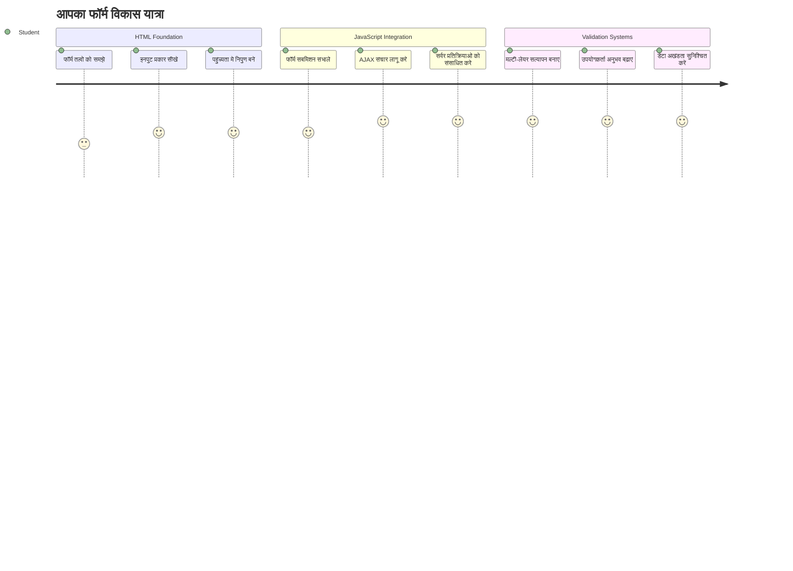
## प्री-लेक्चर क्विज़

[प्री-लेक्चर क्विज़](https://ff-quizzes.netlify.app/web/quiz/43)

क्या आपने कभी ऑनलाइन फॉर्म भरते हुए अपना ईमेल फॉर्मेट रिजेक्ट होते देखा है? या सबमिट करते ही सभी जानकारी खो दी है? हम सभी ने इन निराशाजनक अनुभवों का सामना किया है।

फॉर्म आपके उपयोगकर्ताओं और आपके ऐप्लिकेशन की कार्यक्षमता के बीच का पुल होते हैं। जैसे एयर ट्रैफिक कंट्रोलर विमानों को सुरक्षित गंतव्य तक ले जाने के लिए सावधानीपूर्वक प्रोटोकॉल का उपयोग करते हैं, वैसे ही अच्छी तरह डिज़ाइन किए गए फॉर्म स्पष्ट प्रतिक्रिया देते हैं और महंगे त्रुटियों को रोकते हैं। खराब फॉर्म उपयोगकर्ताओं को व्यस्त हवाई अड्डे में मिसकम्युनिकेशन से भी जल्दी दूर भगा सकते हैं।

इस पाठ में, हम आपके स्थैतिक बैंकिंग ऐप को एक इंटरैक्टिव ऐप्लिकेशन में बदलेंगे। आप ऐसे फॉर्म बनाएंगे जो उपयोगकर्ता की इनपुट को सत्यापित करें, सर्वरों के साथ संवाद करें, और सहायक फीडबैक प्रदान करें। इसे ऐसा समझें जैसे आप नियंत्रण इंटरफ़ेस बना रहे हों जो उपयोगकर्ताओं को आपके ऐप के फीचर्स नेविगेट करने देता है।

अंत तक, आपके पास एक पूर्ण लॉगिन और रजिस्ट्रेशन सिस्टम होगा जो सत्यापन के साथ उपयोगकर्ताओं को निराशा के बजाय सफलता की ओर मार्गदर्शन करता है।

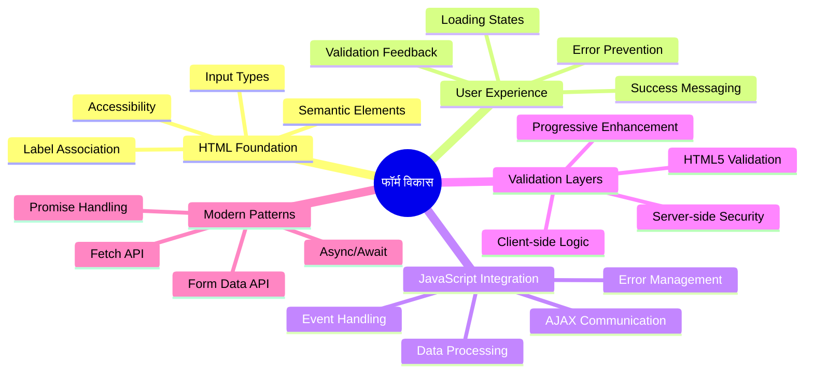
## पूर्व आवश्यकताएँ

फॉर्म बनाने से पहले, आइए सुनिश्चित करें कि आपकी सेटअप सही ढंग से पूरी हो चुकी है। यह पाठ ठीक वहीं से शुरू होता है जहां हमने पिछले पाठ में छोड़ा था, इसलिए अगर आपने अगला भाग छोड़ दिया है, तो पहले मूल बातें ठीक से काम करना सुनिश्चित करें।

### आवश्यक सेटअप

| घटक | स्थिति | विवरण |
|-----------|--------|-------------|
| [HTML टेम्प्लेट्स](../1-template-route/README.md) | ✅ आवश्यक | आपका मूल बैंकिंग ऐप संरचना |
| [Node.js](https://nodejs.org) | ✅ आवश्यक | सर्वर के लिए जावास्क्रिप्ट रनटाइम |
| [बैंक API सर्वर](../api/README.md) | ✅ आवश्यक | डेटा संग्रहण के लिए बैकएंड सेवा |

> 💡 **विकास सुझाव**: आप एक ही समय में दो अलग सर्वर चलाएंगे – एक आपके फ्रंट-एंड बैंकिंग ऐप के लिए और दूसरा बैकएंड API के लिए। यह सेटअप वास्तविक विकास की तरह है जहाँ फ्रंटएंड और बैकएंड सेवाएं स्वतंत्र रूप से काम करती हैं।

### सर्वर कॉन्फ़िगरेशन

**आपके विकास वातावरण में शामिल होंगे:**
- **फ्रंटएंड सर्वर**: आपका बैंकिंग ऐप सर्व करता है (आमतौर पर पोर्ट `3000`)
- **बैकएंड API सर्वर**: डेटा संग्रहण और पुनर्प्राप्ति संभालता है (पोर्ट `5000`)
- **दोनों सर्वर** एक साथ बिना टकराव के चल सकते हैं

**अपने API कनेक्शन का परीक्षण करें:**
```bash
curl http://localhost:5000/api
# अपेक्षित प्रतिक्रिया: "Bank API v1.0.0"
```

**यदि आप API संस्करण प्रतिक्रिया देखते हैं, तो आप आगे बढ़ने के लिए तैयार हैं!**

---

## HTML फॉर्म्स और कंट्रोल्स को समझना

HTML फॉर्म वे तरीके हैं जिनसे उपयोगकर्ता आपके वेब ऐप्लिकेशन के साथ संवाद करते हैं। इन्हें उस टेलीग्राफ सिस्टम के समान समझें जिसने 19वीं सदी में दूर-दराज़ स्थानों को जोड़ा था – ये उपयोगकर्ता के इरादे और ऐप्लिकेशन प्रतिक्रिया के बीच का संचार प्रोटोकॉल हैं। जब इन्हें सोच-समझकर डिज़ाइन किया जाता है, तो ये त्रुटियों को पकड़ते हैं, इनपुट फॉर्मेटिंग को मार्गदर्शन करते हैं, और उपयोगी सुझाव प्रदान करते हैं।

आधुनिक फॉर्म बेसिक टेक्स्ट इनपुट से काफी अधिक परिष्कृत हैं। HTML5 ने विशिष्ट इनपुट प्रकार पेश किए हैं जो ईमेल मान्यता, संख्या फॉर्मेटिंग और तारीख चयन को स्वचालित रूप से संभालते हैं। ये सुधार एक्सेसिबिलिटी और मोबाइल उपयोगकर्ता अनुभव दोनों के लिए फायदेमंद हैं।

### आवश्यक फॉर्म तत्व

**प्रत्येक फॉर्म के निर्माण ब्लॉक:**

```html
<!-- Basic form structure -->
<form id="userForm" method="POST">
  <label for="username">Username</label>
  <input id="username" name="username" type="text" required>
  
  <button type="submit">Submit</button>
</form>
```

**यह कोड क्या करता है:**
- एक अद्वितीय पहचानकर्ता के साथ फॉर्म कंटेनर बनाता है
- डेटा सबमिशन के लिए HTTP मेथड निर्दिष्ट करता है
- एक्सेसिबिलिटी के लिए लेबल को इनपुट्स से जोड़ता है
- फॉर्म को प्रोसेस करने के लिए सबमिट बटन परिभाषित करता है

### आधुनिक इनपुट प्रकार और गुण

| इनपुट प्रकार | उद्देश्य | उदाहरण उपयोग |
|--------------|----------|---------------|
| `text` | सामान्य टेक्स्ट इनपुट | `<input type="text" name="username">` |
| `email` | ईमेल मान्यता | `<input type="email" name="email">` |
| `password` | छुपी हुई टेक्स्ट एंट्री | `<input type="password" name="password">` |
| `number` | संख्यात्मक इनपुट | `<input type="number" name="balance" min="0">` |
| `tel` | फोन नंबर | `<input type="tel" name="phone">` |

> 💡 **आधुनिक HTML5 लाभ**: विशिष्ट इनपुट प्रकार स्वचालित मान्यता, उचित मोबाइल कीबोर्ड और बेहतर पहुंच समर्थन प्रदान करते हैं, बिना अतिरिक्त जावास्क्रिप्ट के!

### बटन प्रकार और व्यवहार

```html
<!-- Different button behaviors -->
<button type="submit">Save Data</button>     <!-- Submits the form -->
<button type="reset">Clear Form</button>    <!-- Resets all fields -->
<button type="button">Custom Action</button> <!-- No default behavior -->
```

**प्रत्येक बटन प्रकार क्या करता है:**
- **सबमिट बटन:** फॉर्म सबमिशन ट्रिगर करते हैं और निर्दिष्ट एंडपॉइंट पर डेटा भेजते हैं
- **रीसेट बटन:** सभी फॉर्म फील्ड्स को उनके शुरुआती स्थिति में पुनः सेट करते हैं
- **सामान्य बटन:** कोई डिफ़ॉल्ट व्यवहार नहीं, कस्टम जावास्क्रिप्ट की आवश्यकता होती है

> ⚠️ **महत्वपूर्ण नोट**: `<input>` तत्व सेल्फ-क्लोज़िंग होता है और इसे क्लोज़िंग टैग की आवश्यकता नहीं होती। आधुनिक सर्वोत्तम अभ्यास `<input>` को बिना स्लैश के लिखना है।

### अपना लॉगिन फॉर्म बनाना

अब आइए एक व्यावहारिक लॉगिन फॉर्म बनाएं जो आधुनिक HTML फॉर्म प्रथाओं को दर्शाता है। हम एक बुनियादी संरचना से शुरू करेंगे और इसे एक्सेसिबिलिटी फीचर्स और सत्यापन के साथ धीरे-धीरे बढ़ाएंगे।

```html
<template id="login">
  <h1>Bank App</h1>
  <section>
    <h2>Login</h2>
    <form id="loginForm" novalidate>
      <div class="form-group">
        <label for="username">Username</label>
        <input id="username" name="user" type="text" required 
               autocomplete="username" placeholder="Enter your username">
      </div>
      <button type="submit">Login</button>
    </form>
  </section>
</template>
```

**यहाँ क्या होता है:**
- फॉर्म को सेमांटिक HTML5 तत्वों के साथ संरचित करता है
- संबंधित तत्वों को `div` कंटेनरों के साथ समूहित करता है जिनमें अर्थपूर्ण क्लासेस हैं
- लेबल को इनपुट से जोड़ता है `for` और `id` गुणों के प्रयोग से
- बेहतर UX के लिए आधुनिक गुण जैसे `autocomplete` और `placeholder` शामिल करता है
- ब्राउज़र डिफ़ॉल्ट के बजाय जावास्क्रिप्ट से सत्यापन के लिए `novalidate` जोड़ता है

### उचित लेबल की शक्ति

**आधुनिक वेब विकास में लेबल क्यों महत्वपूर्ण हैं:**

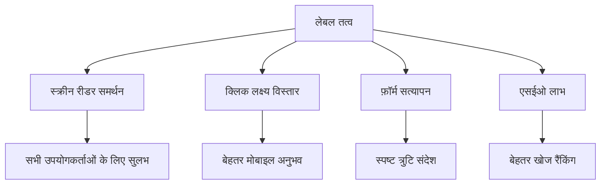
**उचित लेबल क्या हासिल करते हैं:**
- स्क्रीन रीडर को फॉर्म फ़ील्ड को स्पष्ट रूप से घोषित करने योग्य बनाते हैं
- क्लिक करने योग्य क्षेत्र का विस्तार करते हैं (लेबल पर क्लिक करने से इनपुट फोकस होता है)
- मोबाइल उपयोगिता में सुधार करते हैं बड़े टैप लक्ष्यों के साथ
- फॉर्म सत्यापन के लिए अर्थपूर्ण त्रुटि संदेशों का समर्थन करते हैं
- फॉर्म तत्वों को सेमांटिक अर्थ देकर SEO बढ़ाते हैं

> 🎯 **एक्सेसिबिलिटी लक्ष्य**: प्रत्येक फॉर्म इनपुट के साथ एक जुड़ा हुआ लेबल होना चाहिए। यह सरल प्रथा आपके फॉर्म को सभी के लिए उपयोगी बनाती है, जिसमें विकलांग उपयोगकर्ता भी शामिल हैं, और सभी उपयोगकर्ताओं के लिए अनुभव सुधारती है।

### रजिस्ट्रेशन फॉर्म बनाना

रजिस्ट्रेशन फॉर्म के लिए उपयोगकर्ता खाता बनाने के लिए अधिक विस्तृत जानकारी की जरूरत होती है। आइए इसे आधुनिक HTML5 सुविधाओं और बढ़ी हुई एक्सेसिबिलिटी के साथ बनाएं।

```html
<hr/>
<h2>Register</h2>
<form id="registerForm" novalidate>
  <div class="form-group">
    <label for="user">Username</label>
    <input id="user" name="user" type="text" required 
           autocomplete="username" placeholder="Choose a username">
  </div>
  
  <div class="form-group">
    <label for="currency">Currency</label>
    <input id="currency" name="currency" type="text" value="$" 
           required maxlength="3" placeholder="USD, EUR, etc.">
  </div>
  
  <div class="form-group">
    <label for="description">Account Description</label>
    <input id="description" name="description" type="text" 
           maxlength="100" placeholder="Personal savings, checking, etc.">
  </div>
  
  <div class="form-group">
    <label for="balance">Starting Balance</label>
    <input id="balance" name="balance" type="number" value="0" 
           min="0" step="0.01" placeholder="0.00">
  </div>
  
  <button type="submit">Create Account</button>
</form>
```

**ऊपर हमने:**
- बेहतर स्टाइलिंग और लेआउट के लिए प्रत्येक फ़ील्ड को कंटेनर डिव्स में व्यवस्थित किया है
- ब्राउज़र ऑटोफिल समर्थन के लिए उपयुक्त `autocomplete` गुण जोड़े हैं
- उपयोगकर्ता इनपुट मार्गदर्शन के लिए सहायक प्लेसहोल्डर टेक्स्ट शामिल किया है
- सेंसिबल डिफ़ॉल्ट्स `value` गुण के माध्यम से सेट किए हैं
- सत्यापन गुण जैसे `required`, `maxlength`, और `min` लागू किए हैं
- बैलेंस फ़ील्ड के लिए दशमलव समर्थन के साथ `type="number"` उपयोग किया है

### इनपुट प्रकार और व्यवहार की खोज

**आधुनिक इनपुट प्रकार उन्नत कार्यक्षमता प्रदान करते हैं:**

| सुविधा | लाभ | उदाहरण |
|---------|---------|----------|
| `type="number"` | मोबाइल पर संख्यात्मक कीपैड | आसान बैलेंस प्रविष्टि |
| `step="0.01"` | दशमलव सटीकता नियंत्रण | मुद्रा में सेंट्स के लिए |
| `autocomplete` | ब्राउज़र ऑटोफिल | तेज फॉर्म भरना |
| `placeholder` | संदर्भीय संकेत | उपयोगकर्ता की अपेक्षाओं का मार्गदर्शन करता है |

> 🎯 **एक्सेसिबिलिटी चुनौती**: केवल अपनी कीबोर्ड का उपयोग करते हुए फॉर्म को नेविगेट करके देखें! `Tab` से क्षेत्र के बीच जाएं, `Space` से चेक बॉक्स चेक करें, और `Enter` से सबमिट करें। यह अनुभव आपको समझने में मदद करता है कि स्क्रीन रीडर उपयोगकर्ता आपके फॉर्म के साथ कैसे इंटरैक्ट करते हैं।

### 🔄 **शैक्षिक चेक-इन**
**फॉर्म फाउंडेशन समझना**: जावास्क्रिप्ट लागू करने से पहले, सुनिश्चित करें कि आप समझते हैं:
- ✅ सेमांटिक HTML कैसे एक्सेसिबल फॉर्म संरचनाएं बनाता है
- ✅ मोबाइल कीबोर्ड और सत्यापन के लिए इनपुट प्रकार क्यों महत्वपूर्ण हैं
- ✅ लेबल और फॉर्म कंट्रोल के बीच संबंध
- ✅ फॉर्म गुण ब्राउज़र डिफ़ॉल्ट व्यवहार को कैसे प्रभावित करते हैं

**त्वरित स्व-परीक्षण**: अगर आप बिना जावास्क्रिप्ट के हैंडल किए फॉर्म सबमिट करते हैं तो क्या होता है?
*उत्तर: ब्राउज़र डिफ़ॉल्ट सबमिशन करता है, सामान्यतः क्रिया URL पर रीडायरेक्ट करता है*

**HTML5 फॉर्म लाभ**: आधुनिक फॉर्म प्रदान करते हैं:
- **बिल्ट-इन सत्यापन**: स्वचालित ईमेल और संख्या फॉर्मेट जांच
- **मोबाइल अनुकूलन**: विभिन्न इनपुट प्रकारों के लिए उचित कीबोर्ड
- **एक्सेसिबिलिटी**: स्क्रीन रीडर और कीबोर्ड नेविगेशन समर्थन
- **प्रोग्रेसिव वृद्धि**: जब जावास्क्रिप्ट अक्षम हो तब भी काम करता है

## फॉर्म सबमिशन मेथड समझना

जब कोई आपका फॉर्म भरता है और सबमिट करता है, तब उस डेटा को कहीं जाना होता है – आम तौर पर एक सर्वर पर जो उसे सुरक्षित रख सके। इसके कुछ अलग-अलग तरीके होते हैं, और यह जानना कि कब कौन सा उपयोग करना है, बाद में आपको कुछ सिरदर्द से बचा सकता है।

आइए देखें कि वास्तव में तब क्या होता है जब कोई सबमिट बटन दबाता है।

### डिफ़ॉल्ट फॉर्म व्यवहार

सबसे पहले, चलिए मूल फॉर्म सबमिशन पर ध्यान दें:

**अपने मौजूदा फॉर्म का परीक्षण करें:**
1. अपने फॉर्म में *Register* बटन पर क्लिक करें
2. अपने ब्राउज़र के एड्रेस बार में बदलाव देखें
3. देखें कि पेज कैसे रीलोड होता है और डेटा URL में आता है


### HTTP मेथड्स की तुलना

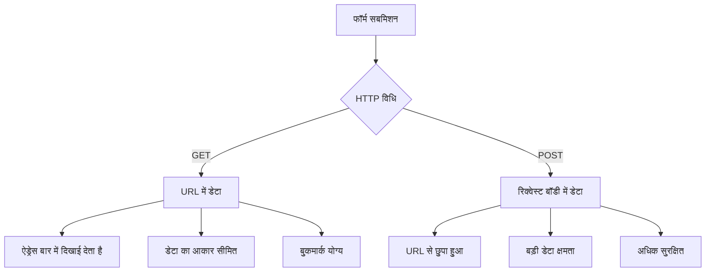
**अंतर को समझना:**

| मेथड | उपयोग मामला | डेटा स्थान | सुरक्षा स्तर | आकार सीमा |
|--------|----------|---------------|----------------|-------------|
| `GET` | खोज प्रश्न, फ़िल्टर | URL पैरामीटर | कम (दृश्य) | ~2000 अक्षर |
| `POST` | उपयोगकर्ता खाते, संवेदनशील डेटा | रिक्वेस्ट बॉडी | अधिक (छुपा हुआ) | कोई व्यावहारिक सीमा नहीं |

**मूलभूत अंतर को समझना:**
- **GET**: फॉर्म डेटा को URL क्वेरी पैरामीटर के रूप में जोड़ता है (खोज संचालन के लिए उपयुक्त)
- **POST**: डेटा को रिक्वेस्ट बॉडी में शामिल करता है (संवेदनशील जानकारी के लिए आवश्यक)
- **GET सीमाएं**: आकार सीमाएं, दृश्यमान डेटा, ब्राउज़र इतिहास में लगातार बने रहना
- **POST फायदे**: बड़ी डेटा क्षमता, गोपनीयता संरक्षण, फ़ाइल अपलोड समर्थन

> 💡 **सर्वोत्तम अभ्यास**: खोज फॉर्म और फ़िल्टर के लिए `GET` का उपयोग करें, उपयोगकर्ता पंजीकरण, लॉगिन और डेटा निर्माण के लिए `POST` का।

### फॉर्म सबमिशन कॉन्फ़िगरेशन

आइए अपने रजिस्ट्रेशन फॉर्म को बैकएंड API के साथ POST मेथड का उपयोग करके सही ढंग से संवाद करने के लिए कॉन्फ़िगर करें:

```html
<form id="registerForm" action="//localhost:5000/api/accounts" 
      method="POST" novalidate>
```

**यह कॉन्फ़िगरेशन क्या करता है:**
- फॉर्म सबमिशन को आपके API एंडपॉइंट पर निर्देशित करता है
- सुरक्षित डेटा ट्रांसमिशन के लिए POST मेथड का उपयोग करता है
- जावास्क्रिप्ट से सत्यापन के लिए `novalidate` शामिल करता है

### फॉर्म सबमिशन का परीक्षण

**अपने फॉर्म का परीक्षण करने के लिए इन चरणों का पालन करें:**
1. अपनी जानकारी के साथ रजिस्ट्रेशन फॉर्म भरें
2. "Create Account" बटन पर क्लिक करें
3. अपने ब्राउज़र में सर्वर प्रतिक्रिया देखें

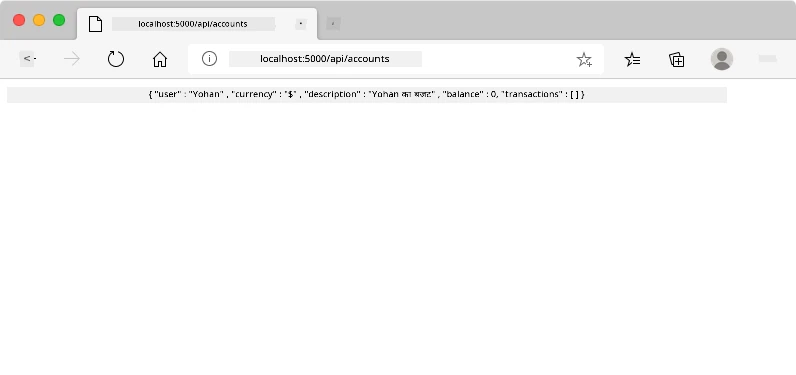

**आपको क्या देखना चाहिए:**
- ब्राउज़र API एंडपॉइंट URL पर रीडायरेक्ट करता है
- JSON प्रतिक्रिया जिसमें आपका नया बनाया गया खाता डेटा होता है
- सर्वर पुष्टि करता है कि खाता सफलतापूर्वक बनाया गया है

> 🧪 **प्रयोग समय**: एक ही उपयोगकर्ता नाम के साथ फिर से पंजीकरण करने का प्रयास करें। क्या प्रतिक्रिया मिलती है? यह आपको समझने में मदद करता है कि सर्वर डुप्लिकेट डेटा और त्रुटि स्थितियों को कैसे संभालता है।

### JSON प्रतिक्रियाओं को समझना

**जब सर्वर आपके फॉर्म को सफलतापूर्वक संसाधित करता है:**
```json
{
  "user": "john_doe",
  "currency": "$",
  "description": "Personal savings",
  "balance": 100,
  "id": "unique_account_id"
}
```

**यह प्रतिक्रिया पुष्टि करती है:**
- आपके निर्दिष्ट डेटा के साथ नया खाता बनता है
- भविष्य में संदर्भ के लिए एक अद्वितीय पहचानकर्ता सौंपता है
- सत्यापन के लिए सभी खाता जानकारी लौटाता है
- सफलतापूर्वक डेटाबेस में संग्रहण दर्शाता है

## जावास्क्रिप्ट के साथ आधुनिक फॉर्म हैंडलिंग

पारंपरिक फॉर्म सबमिशन पूरे पेज को रीलोड करते हैं, जैसे प्रारंभिक अंतरिक्ष मिशनों में कोर्स सुधार के लिए पूरे सिस्टम को रीसेट करना पड़ता था। यह तरीका उपयोगकर्ता अनुभव को बाधित करता है और ऐप्लिकेशन की स्थिति खो देता है।

जावास्क्रिप्ट फॉर्म हैंडलिंग आधुनिक अंतरिक्ष यानों में उपयोग किए जाने वाले सतत मार्गदर्शन प्रणालियों की तरह काम करता है – वास्तविक समय समायोजन करते हुए नेविगेशन संदर्भ खोए बिना। हम फॉर्म सबमिशन को इंटरसेप्ट कर सकते हैं, तत्काल फीडबैक दे सकते हैं, त्रुटियों को सुंदरता से संभाल सकते हैं, और सर्वर प्रतिक्रियाओं के आधार पर इंटरफ़ेस को अपडेट कर सकते हैं, साथ ही उपयोगकर्ता की स्थिति ऐप में बनी रहती है।

### पेज रीलोड से क्यों बचें?

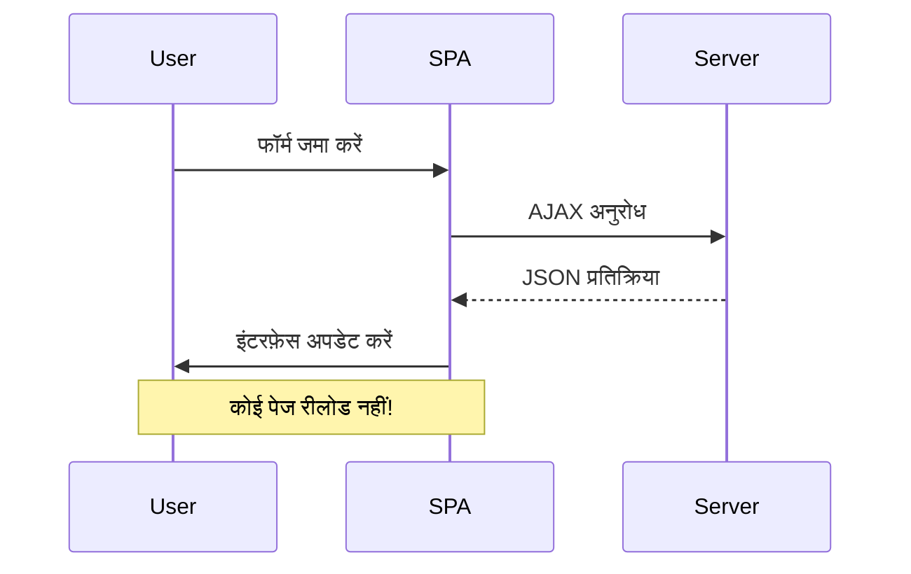
**जावास्क्रिप्ट फॉर्म हैंडलिंग के फायदे:**
- ऐप्लिकेशन की स्थिति और उपयोगकर्ता संदर्भ बनाए रखता है
- तत्काल फीडबैक और लोडिंग संकेतक प्रदान करता है
- गतिशील त्रुटि हैंडलिंग और सत्यापन सक्षम करता है
- चिकनी, ऐप जैसी उपयोगकर्ता अनुभव बनाता है
- सर्वर प्रतिक्रियाओं पर आधारित कंडीशनल लॉजिक की अनुमति देता है

### पारंपरिक से आधुनिक फॉर्म में संक्रमण

**पारंपरिक दृष्टिकोण की चुनौतियां:**
- उपयोगकर्ताओं को आपके ऐप्लिकेशन से दूर रीडायरेक्ट कर देता है
- वर्तमान ऐप्लिकेशन स्थिति और संदर्भ खो देता है
- सरल संचालन के लिए पूरा पेज रीलोड आवश्यक होता है
- उपयोगकर्ता फीडबैक पर सीमित नियंत्रण देता है

**आधुनिक जावास्क्रिप्ट दृष्टिकोण के फायदे:**
- उपयोगकर्ताओं को आपके ऐप्लिकेशन में रखता है
- सभी ऐप्लिकेशन स्थिति और डेटा बनाए रखता है
- वास्तविक समय सत्यापन और फीडबैक सक्षम करता है
- प्रोग्रेसिव वृद्धि और एक्सेसिबिलिटी का समर्थन करता है

### जावास्क्रिप्ट फॉर्म हैंडलिंग लागू करना

आइए पारंपरिक फॉर्म सबमिशन को आधुनिक जावास्क्रिप्ट इवेंट हैंडलिंग से बदलें:

```html
<!-- Remove the action attribute and add event handling -->
<form id="registerForm" method="POST" novalidate>
```

**अपने `app.js` फ़ाइल में रजिस्ट्रेशन लॉजिक जोड़ें:**

```javascript
// आधुनिक इवेंट-चालित फॉर्म हैंडलिंग
function register() {
  const registerForm = document.getElementById('registerForm');
  const formData = new FormData(registerForm);
  const data = Object.fromEntries(formData);
  const jsonData = JSON.stringify(data);
  
  console.log('Form data prepared:', data);
}

// पृष्ठ लोड होने पर इवेंट लिसनर संलग्न करें
document.addEventListener('DOMContentLoaded', () => {
  const registerForm = document.getElementById('registerForm');
  registerForm.addEventListener('submit', (event) => {
    event.preventDefault(); // डिफ़ॉल्ट फॉर्म सबमिशन रोकें
    register();
  });
});
```

**यहाँ क्या होता है:**
- डिफ़ॉल्ट फॉर्म सबमिशन को `event.preventDefault()` से रोकता है
- आधुनिक DOM चयन का उपयोग कर फॉर्म तत्व प्राप्त करता है
- शक्तिशाली `FormData` API का उपयोग करके फॉर्म डेटा निकालता है
- `Object.fromEntries()` के साथ FormData को साधारण ऑब्जेक्ट में परिवर्तित करता है
- सर्वर संचार के लिए डेटा को JSON प्रारूप में सीरियलाइज़ करता है
- डिबगिंग और सत्यापन के लिए प्रोसेस किए गए डेटा को लॉग करता है

### FormData API को समझना

**FormData API शक्तिशाली फॉर्म हैंडलिंग प्रदान करता है:**
```javascript
// FormData क्या कैप्चर करता है इसका उदाहरण
const formData = new FormData(registerForm);

// FormData अपने आप कैप्चर करता है:
// {
//   "user": "john_doe",
//   "currency": "$",
//   "description": "व्यक्तिगत खाता",
//   "balance": "100"
// }
```

**FormData API के फायदे:**
- **व्यापक संग्रह**: सभी फॉर्म तत्वों को कैप्चर करता है, जिसमें टेक्स्ट, फाइलें और जटिल इनपुट शामिल हैं
- **टाइप की जानकारी**: बिना कस्टम कोडिंग के विभिन्न इनपुट प्रकारों को स्वचालित रूप से संभालता है
- **प्रभावशीलता**: एकल API कॉल के साथ मैनुअल फील्ड संग्रह को समाप्त करता है
- **अनुकूलता**: जैसे-जैसे फॉर्म संरचना बदलती है, कार्यक्षमता बनाए रखता है

### सर्वर संचार फ़ंक्शन बनाना

अब आइए आधुनिक JavaScript पैटर्न का उपयोग करके अपने API सर्वर के साथ संवाद करने के लिए एक मजबूत फ़ंक्शन बनाते हैं:

```javascript
async function createAccount(account) {
  try {
    const response = await fetch('//localhost:5000/api/accounts', {
      method: 'POST',
      headers: { 
        'Content-Type': 'application/json',
        'Accept': 'application/json'
      },
      body: account
    });
    
    // जांचें कि प्रतिक्रिया सफल थी या नहीं
    if (!response.ok) {
      throw new Error(`HTTP error! status: ${response.status}`);
    }
    
    return await response.json();
  } catch (error) {
    console.error('Account creation failed:', error);
    return { error: error.message || 'Network error occurred' };
  }
}
```

**असिंक्रोनस JavaScript को समझना:**

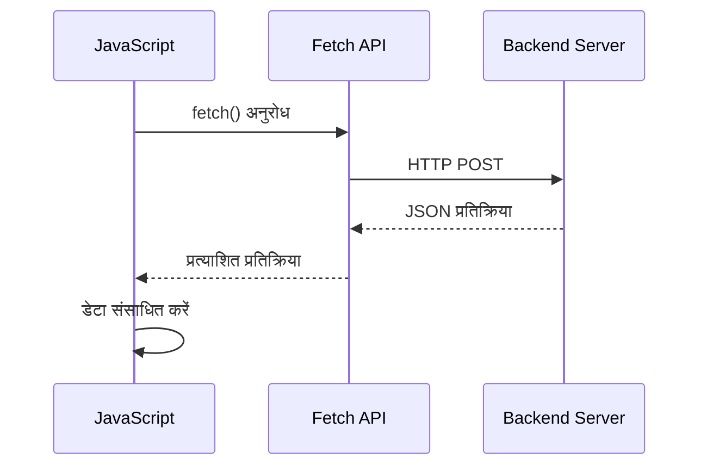
**यह आधुनिक कार्यान्वयन क्या करता है:**
- **`async/await` का उपयोग** पठनीय असिंक्रोनस कोड के लिए
- **सही त्रुटि हैंडलिंग** try/catch ब्लॉकों के साथ शामिल है
- **डेटा प्रोसेसिंग से पहले** प्रतिक्रिया स्थिति की जांच करता है
- **JSON संचार के लिए** उपयुक्त हेडर सेट करता है
- **डिबगिंग के लिए** विस्तृत त्रुटि संदेश प्रदान करता है
- **सफलता और त्रुटि मामलों के लिए** सुसंगत डेटा संरचना लौटाता है

### आधुनिक Fetch API की शक्ति

**Fetch API के पुराने तरीकों की तुलना में फायदे:**

| विशेषता | लाभ | कार्यान्वयन |
|---------|---------|----------------|
| प्रॉमिस-आधारित | साफ-सुथरा async कोड | `await fetch()` |
| अनुरोध अनुकूलन | पूर्ण HTTP नियंत्रण | हेडर, मेथड, बॉडी |
| प्रतिक्रिया हैंडलिंग | लचीला डेटा पार्सिंग | `.json()`, `.text()`, `.blob()` |
| त्रुटि हैंडलिंग | व्यापक त्रुटि पकड़ | Try/catch ब्लॉक |

> 🎥 **अधिक जानें**: [Async/Await Tutorial](https://youtube.com/watch?v=YwmlRkrxvkk) - आधुनिक वेब विकास के लिए असिंक्रोनस JavaScript पैटर्न की समझ।

**सर्वर संचार के लिए प्रमुख अवधारणाएँ:**
- **Async फ़ंक्शन** सर्वर प्रतिक्रियाओं के लिए प्रतीक्षा के लिए निष्पादन को रोकने की अनुमति देते हैं
- **Await कीवर्ड** असिंक्रोनस कोड को सिंक्रोनस कोड जैसा पढ़ाई योग्य बनाता है
- **Fetch API** आधुनिक, प्रॉमिस-आधारित HTTP अनुरोध प्रदान करता है
- **त्रुटि हैंडलिंग** सुनिश्चित करती है कि आपका ऐप नेटवर्क समस्याओं पर आसानी से प्रतिक्रिया करे

### पंजीकरण फ़ंक्शन पूरा करना

आइए सब कुछ एक साथ लाकर एक पूर्ण, उत्पादन-तैयार पंजीकरण फ़ंक्शन बनाएं:

```javascript
async function register() {
  const registerForm = document.getElementById('registerForm');
  const submitButton = registerForm.querySelector('button[type="submit"]');
  
  try {
    // लोडिंग स्थिति दिखाएं
    submitButton.disabled = true;
    submitButton.textContent = 'Creating Account...';
    
    // फ़ॉर्म डेटा संसाधित करें
    const formData = new FormData(registerForm);
    const jsonData = JSON.stringify(Object.fromEntries(formData));
    
    // सर्वर को भेजें
    const result = await createAccount(jsonData);
    
    if (result.error) {
      console.error('Registration failed:', result.error);
      alert(`Registration failed: ${result.error}`);
      return;
    }
    
    console.log('Account created successfully!', result);
    alert(`Welcome, ${result.user}! Your account has been created.`);
    
    // सफल पंजीकरण के बाद फ़ॉर्म रीसेट करें
    registerForm.reset();
    
  } catch (error) {
    console.error('Unexpected error:', error);
    alert('An unexpected error occurred. Please try again.');
  } finally {
    // बटन की स्थिति पुनर्स्थापित करें
    submitButton.disabled = false;
    submitButton.textContent = 'Create Account';
  }
}
```

**यह उन्नत कार्यान्वयन इसमें शामिल हैं:**
- **प्रपत्र सबमिशन के दौरान** दृश्य प्रतिक्रिया प्रदान करता है
- **डुप्लिकेट सबमिशन रोकने के लिए** सबमिट बटन अक्षम करता है
- **अपेक्षित और अप्रत्याशित त्रुटियों** को सहजता से संभालता है
- **उपयोगकर्ता-अनुकूल सफलता और त्रुटि संदेश** दिखाता है
- **सफल पंजीकरण के बाद** फॉर्म को रीसेट करता है
- **परिणाम की परवाह किए बिना** UI स्थिति बहाल करता है

### अपने कार्यान्वयन का परीक्षण करना

**अपने ब्राउज़र डेवलपर टूल खोलें और पंजीकरण का परीक्षण करें:**

1. **ब्राउज़र कंसोल खोलें** (F12 → Console टैब)
2. **पंजीकरण फॉर्म भरें**
3. **"Create Account" क्लिक करें**
4. **कंसोल संदेशों और उपयोगकर्ता प्रतिक्रिया देखें**

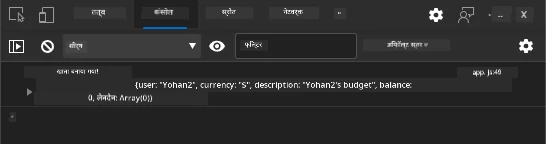

**आपको क्या देखना चाहिए:**
- **लोडिंग स्टेट** सबमिट बटन पर दिखाई देता है
- **कंसोल लॉग** प्रक्रिया के विस्तृत जानकारी दिखाते हैं
- **सफलता संदेश** तब प्रकट होता है जब खाता सफलतापूर्वक बनता है
- **फॉर्म सफल सबमिशन के बाद** स्वचालित रूप से रीसेट हो जाता है

> 🔒 **सुरक्षा विचार**: वर्तमान में डेटा HTTP के माध्यम से यात्रा करता है, जो उत्पादन के लिए सुरक्षित नहीं है। वास्तविक अनुप्रयोगों में, डेटा ट्रांसमिशन एन्क्रिप्ट करने के लिए हमेशा HTTPS का उपयोग करें। [HTTPS सुरक्षा](https://en.wikipedia.org/wiki/HTTPS) और क्यों यह उपयोगकर्ता डेटा की सुरक्षा के लिए आवश्यक है, के बारे में अधिक जानें।

### 🔄 **शैक्षिक जांच**
**आधुनिक JavaScript एकीकरण**: असिंक्रोनस फॉर्म हैंडलिंग की अपनी समझ सत्यापित करें:
- ✅ `event.preventDefault()` डिफ़ॉल्ट फॉर्म व्यवहार को कैसे बदलता है?
- ✅ FormData API मैनुअल फील्ड संग्रह से ज्यादा प्रभावी क्यों है?
- ✅ async/await पैटर्न कोड की पठनीयता को कैसे सुधारते हैं?
- ✅ त्रुटि हैंडलिंग उपयोगकर्ता अनुभव में क्या भूमिका निभाती है?

**सिस्टम वास्तुकला**: आपका फॉर्म हैंडलिंग प्रदर्शित करता है:
- **इवेंट-ड्रिवन प्रोग्रामिंग**: फॉर्म उपयोगकर्ता कार्यों का बिना पेज रीलोड के जवाब देते हैं
- **असिंक्रोनस संचार**: सर्वर अनुरोध उपयोगकर्ता इंटरफ़ेस को ब्लॉक नहीं करते
- **त्रुटि हैंडलिंग**: नेटवर्क अनुरोध विफल होने पर सहज गिरावट
- **स्टेट मैनेजमेंट**: UI अपडेट सर्वर प्रतिक्रियाओं को उपयुक्त रूप से दर्शाते हैं
- **प्रोग्रेसिव एन्हांसमेंट**: बेस फ़ंक्शनलिटी काम करती है, JavaScript इसे बढ़ाता है

**पेशेवर पैटर्न**: आपने लागू किया है:
- **सिंगल रिस्पॉन्सिबिलिटी**: फ़ंक्शन के साफ़, केंद्रित उद्देश्य
- **त्रुटि सीमाएँ**: ट्राई/कैच ब्लॉक एप्लिकेशन क्रैश रोकते हैं
- **उपयोगकर्ता प्रतिक्रिया**: लोडिंग स्टेट और सफलता/त्रुटि संदेश
- **डेटा ट्रांसफॉर्मेशन**: FormData से JSON में सर्वर संचार के लिए

## व्यापक फॉर्म सत्यापन

फॉर्म सत्यापन त्रुटियों का पता चलने के बाद निराशा को रोकता है। जैसे अंतरराष्ट्रीय स्पेस स्टेशन की कई बार-बार प्रणालियाँ होती हैं, प्रभावी सत्यापन कई सुरक्षा जांच स्तरों का उपयोग करता है।

सर्वोत्तम दृष्टिकोण ब्राउज़र स्तर की त्वरित प्रतिक्रिया, बेहतर उपयोगकर्ता अनुभव के लिए JavaScript सत्यापन, और सुरक्षा तथा डेटा ईमानदारी के लिए सर्वर-साइड सत्यापन को जोड़ता है। यह अधिकता उपयोगकर्ता संतुष्टि और सिस्टम सुरक्षा दोनों सुनिश्चित करती है।

### सत्यापन स्तरों को समझना

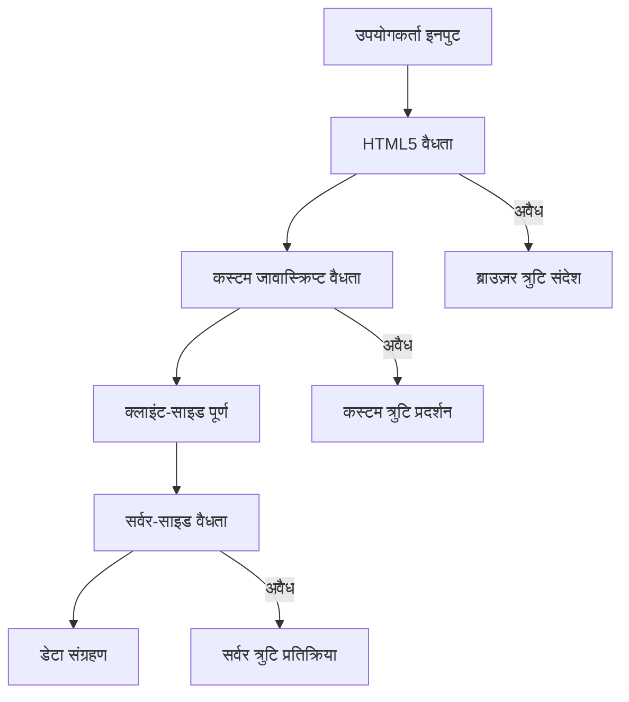
**बहु-परत सत्यापन रणनीति:**
- **HTML5 सत्यापन**: त्वरित ब्राउज़र-आधारित जांच
- **JavaScript सत्यापन**: कस्टम लॉजिक और उपयोगकर्ता अनुभव
- **सर्वर सत्यापन**: अंतिम सुरक्षा और डेटा अखंडता जांच
- **प्रोग्रेसिव एन्हांसमेंट**: तब भी काम करता है जब JavaScript अक्षम हो

### HTML5 सत्यापन विशेषताएँ

**आपके पास आधुनिक सत्यापन उपकरण:**

| विशेषता | उद्देश्य | उदाहरण उपयोग | ब्राउज़र व्यवहार |
|-----------|---------|---------------|------------------|
| `required` | अनिवार्य क्षेत्र | `<input required>` | खाली सबमिशन को रोकता है |
| `minlength`/`maxlength` | टेक्स्ट लंबाई सीमाएं | `<input maxlength="20">` | वर्ण सीमा लागू करता है |
| `min`/`max` | संख्यात्मक सीमा | `<input min="0" max="1000">` | संख्या की सीमा जांचता है |
| `pattern` | कस्टम रेगुलर एक्सप्रेशन नियम | `<input pattern="[A-Za-z]+">` | विशिष्ट स्वरूप से मेल खाता है |
| `type` | डेटा प्रकार सत्यापन | `<input type="email">` | स्वरूप-विशिष्ट सत्यापन |

### CSS सत्यापन स्टाइलिंग

**सत्यापन स्थितियों के लिए दृश्य प्रतिक्रिया बनाएं:**

```css
/* Valid input styling */
input:valid {
  border-color: #28a745;
  background-color: #f8fff9;
}

/* Invalid input styling */
input:invalid {
  border-color: #dc3545;
  background-color: #fff5f5;
}

/* Focus states for better accessibility */
input:focus:valid {
  box-shadow: 0 0 0 0.2rem rgba(40, 167, 69, 0.25);
}

input:focus:invalid {
  box-shadow: 0 0 0 0.2rem rgba(220, 53, 69, 0.25);
}
```

**ये दृश्य संकेत क्या करते हैं:**
- **हरी सीमाएँ**: सफल सत्यापन दिखाती हैं, मिशन कंट्रोल में हरी बत्तियों की तरह
- **लाल सीमाएँ**: ध्यान देने वाली सत्यापन त्रुटियों का संकेत देती हैं
- **फोकस हाइलाइट्स**: वर्तमान इनपुट स्थान के लिए स्पष्ट दृश्य संदर्भ प्रदान करते हैं
- **सुसंगत स्टाइलिंग**: उपयोगकर्ताओं के लिए अपेक्षित इंटरफ़ेस पैटर्न बनाती है

> 💡 **प्रो टिप**: उपयोगकर्ता टाइप करते समय तुरंत दृश्य प्रतिक्रिया के लिए `:valid` और `:invalid` CSS छudo-क्लास का उपयोग करें, जो एक प्रतिक्रियाशील और सहायक इंटरफ़ेस बनाता है।

### व्यापक सत्यापन लागू करना

आइए आपके पंजीकरण फॉर्म को मजबूत सत्यापन से बेहतर उपयोगकर्ता अनुभव और डेटा गुणवत्ता प्रदान करने के लिए बढ़ाएं:

```html
<form id="registerForm" method="POST" novalidate>
  <div class="form-group">
    <label for="user">Username <span class="required">*</span></label>
    <input id="user" name="user" type="text" required 
           minlength="3" maxlength="20" 
           pattern="[a-zA-Z0-9_]+" 
           autocomplete="username"
           title="Username must be 3-20 characters, letters, numbers, and underscores only">
    <small class="form-text">Choose a unique username (3-20 characters)</small>
  </div>
  
  <div class="form-group">
    <label for="currency">Currency <span class="required">*</span></label>
    <input id="currency" name="currency" type="text" required 
           value="$" maxlength="3" 
           pattern="[A-Z$€£¥₹]+" 
           title="Enter a valid currency symbol or code">
    <small class="form-text">Currency symbol (e.g., $, €, £)</small>
  </div>
  
  <div class="form-group">
    <label for="description">Account Description</label>
    <input id="description" name="description" type="text" 
           maxlength="100" 
           placeholder="Personal savings, checking, etc.">
    <small class="form-text">Optional description (up to 100 characters)</small>
  </div>
  
  <div class="form-group">
    <label for="balance">Starting Balance</label>
    <input id="balance" name="balance" type="number" 
           value="0" min="0" step="0.01" 
           title="Enter a positive number for your starting balance">
    <small class="form-text">Initial account balance (minimum $0.00)</small>
  </div>
  
  <button type="submit">Create Account</button>
</form>
```

**उन्नत सत्यापन को समझना:**
- **अनिवार्य फ़ील्ड इंडिकेटर** के साथ सहायक विवरण संयोजित करता है
- **स्वरूप सत्यापन के लिए** `pattern` विशेषताएं शामिल हैं
- **पहुंच क्षमता और टूलटिप्स के लिए** `title` विशेषताएँ प्रदान करता है
- **उपयोगकर्ता इनपुट मार्गदर्शन के लिए** सहायक टेक्स्ट जोड़ता है
- **बेहतर पहुंच के लिए** सैमान्टिक HTML संरचना का उपयोग करता है

### उन्नत सत्यापन नियम

**प्रत्येक सत्यापन नियम क्या करता है:**

| क्षेत्र | सत्यापन नियम | उपयोगकर्ता लाभ |
|-------|------------------|--------------|
| उपयोगकर्ता नाम | `required`, `minlength="3"`, `maxlength="20"`, `pattern="[a-zA-Z0-9_]+"` | मान्य, अद्वितीय पहचान सुनिश्चित करता है |
| मुद्रा | `required`, `maxlength="3"`, `pattern="[A-Z$€£¥₹]+"` | सामान्य मुद्रा प्रतीक स्वीकार करता है |
| शेष राशि | `min="0"`, `step="0.01"`, `type="number"` | नकारात्मक शेष राशि से बचाता है |
| विवरण | `maxlength="100"` | उचित लंबाई सीमा |

### सत्यापन व्यवहार का परीक्षण करना

**इन सत्यापन परिदृश्यों का प्रयास करें:**
1. **अनिवार्य फ़ील्ड खाली छोड़कर** फॉर्म सबमिट करें
2. **3 अक्षर से छोटा उपयोगकर्ता नाम दर्ज करें**
3. **उपयोगकर्ता नाम फ़ील्ड में विशेष वर्ण आज़माएं**
4. **नकारात्मक शेष राशि दर्ज करें**

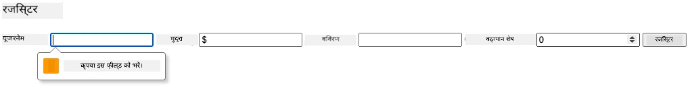

**आप क्या देखेंगे:**
- **ब्राउज़र स्वदेशी सत्यापन संदेश प्रदर्शित करता है**
- **`:valid` और `:invalid` राज्यों के आधार पर स्टाइलिंग बदलती है**
- **जब तक सभी सत्यापन पास नहीं होते फॉर्म सबमिशन रोक दिया जाता है**
- **ध्यान अपने आप पहली अमान्य फील्ड पर जाता है**

### क्लाइंट-साइड बनाम सर्वर-साइड सत्यापन

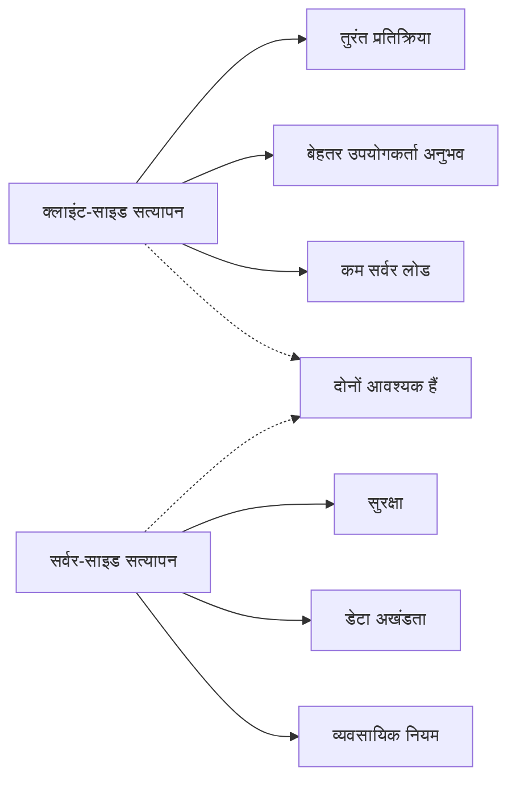
**दोनों स्तरों की आवश्यकता क्यों है:**
- **क्लाइंट-साइड सत्यापन** त्वरित प्रतिक्रिया देता है और उपयोगकर्ता अनुभव में सुधार करता है
- **सर्वर-साइड सत्यापन** सुरक्षा सुनिश्चित करता है और जटिल व्यावसायिक नियम संभालता है
- **संयुक्त दृष्टिकोण** मजबूत, उपयोगकर्ता-अनुकूल और सुरक्षित अनुप्रयोग बनाता है
- **प्रोग्रेसिव एन्हांसमेंट** तब भी काम करता है जब JavaScript अक्षम हो

> 🛡️ **सुरक्षा अनुस्मारक**: कभी भी केवल क्लाइंट-साइड सत्यापन पर भरोसा न करें! दुर्भावनापूर्ण उपयोगकर्ता क्लाइंट-साइड जांच को बायपास कर सकते हैं, इसलिए सुरक्षा और डेटा अखंडता के लिए सर्वर-साइड सत्यापन आवश्यक है।

### ⚡ **अगले 5 मिनट में क्या कर सकते हैं**
- [ ] अपनी फॉर्म को अमान्य डेटा के साथ टेस्ट करें और सत्यापन संदेश देखें
- [ ] JavaScript अक्षम करके फॉर्म सबमिट करने का प्रयास करें ताकि HTML5 सत्यापन देखें
- [ ] ब्राउज़र डेवलपर टूल खोलें और सर्वर को भेजे जा रहे फॉर्म डेटा की जांच करें
- [ ] विभिन्न इनपुट प्रकारों के साथ प्रयोग करें और मोबाइल कीबोर्ड परिवर्तनों को देखें

### 🎯 **इस घंटे में आप क्या हासिल कर सकते हैं**
- [ ] पोस्ट-लीसन क्विज़ पूरा करें और फॉर्म हैंडलिंग अवधारणाएं समझें
- [ ] वास्तविक समय प्रतिक्रिया के साथ व्यापक सत्यापन चुनौती लागू करें
- [ ] पेशेवर दिखने वाले फॉर्म बनाने के लिए CSS स्टाइलिंग जोड़ें
- [ ] डुप्लिकेट उपयोगकर्ता नाम और सर्वर त्रुटियों के लिए त्रुटि हैंडलिंग बनाएं
- [ ] मिलान सत्यापन के साथ पासवर्ड पुष्टि फील्ड जोड़ें

### 📅 **आपका सप्ताह भर का फॉर्म मास्टरी सफर**
- [ ] उन्नत फॉर्म सुविधाओं के साथ पूर्ण बैंकिंग ऐप पूरा करें
- [ ] प्रोफ़ाइल चित्र या दस्तावेज़ों के लिए फ़ाइल अपलोड क्षमताओं को लागू करें
- [ ] प्रगति सूचक और स्टेट मैनेजमेंट के साथ मल्टी-स्टेप फॉर्म जोड़ें
- [ ] उपयोगकर्ता चयन के आधार पर अनुकूलित डायनेमिक फॉर्म बनाएं
- [ ] बेहतर उपयोगकर्ता अनुभव के लिए फॉर्म ऑटोसेव और रिकवरी लागू करें
- [ ] ईमेल सत्यापन और फोन नंबर स्वरूपण जैसे उन्नत सत्यापन जोड़ें

### 🌟 **आपकी महीने भर की फ्रंटेंड विकास मास्टरी**
- [ ] सभ्यतापूर्ण लॉजिक और वर्कफ़्लो के साथ जटिल फॉर्म एप्लिकेशन बनाएं
- [ ] तेजी से विकास के लिए फॉर्म लाइब्रेरी और फ्रेमवर्क सीखें
- [ ] अभिगम्यता दिशानिर्देशों और समावेशी डिजाइन सिद्धांतों में महारत हासिल करें
- [ ] वैश्विक फॉर्म के लिए स्थानीयकरण और अंतर्राष्ट्रीयकरण लागू करें
- [ ] पुन: उपयोग योग्य फॉर्म कंपोनेंट लाइब्रेरी और डिज़ाइन सिस्टम बनाएं
- [ ] ओपन सोर्स फॉर्म प्रोजेक्ट्स में योगदान दें और सर्वोत्तम प्रथाएँ साझा करें

## 🎯 आपका फॉर्म विकास मास्टरी टाइमलाइन

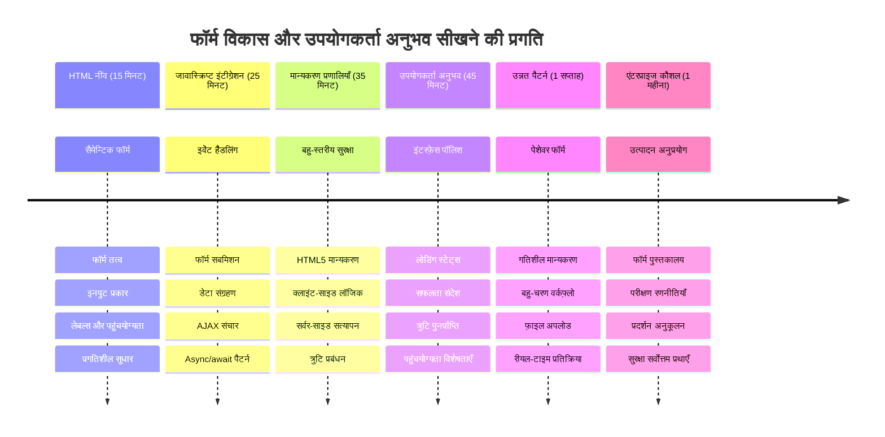
### 🛠️ आपका फॉर्म विकास टूलकिट सारांश

इस पाठ को पूरा करने के बाद, आपने अब महारत हासिल की है:
- **HTML5 फॉर्म**: सैमान्टिक संरचना, इनपुट प्रकार, और अभिगम्यता सुविधाएँ
- **JavaScript फॉर्म हैंडलिंग**: इवेंट प्रबंधन, डेटा संग्रह, और AJAX संचार
- **सत्यापन वास्तुकला**: सुरक्षा और उपयोगकर्ता अनुभव के लिए बहु-परत सत्यापन
- **असिंक्रोनस प्रोग्रामिंग**: आधुनिक fetch API और async/await पैटर्न
- **त्रुटि प्रबंधन**: व्यापक त्रुटि हैंडलिंग और उपयोगकर्ता प्रतिक्रिया प्रणाली
- **उपयोगकर्ता अनुभव डिजाइन**: लोडिंग स्टेट, सफलता संदेश, और त्रुटि सुधार
- **प्रोग्रेसिव एन्हांसमेंट**: सभी ब्राउज़र और क्षमताओं में काम करने वाले फॉर्म

**वास्तविक दुनिया के अनुप्रयोग**: आपकी फॉर्म विकास कौशल सीधे लागू होते हैं:
- **ई-कॉमर्स अनुप्रयोग**: चेकआउट प्रक्रियाएं, खाता पंजीकरण, और भुगतान फॉर्म
- **एंटरप्राइज़ सॉफ़्टवेयर**: डेटा प्रविष्टि प्रणालियाँ, रिपोर्टिंग इंटरफेस, और वर्कफ़्लो अनुप्रयोग
- **सामग्री प्रबंधन**: प्रकाशन प्लेटफ़ॉर्म, उपयोगकर्ता-जनित सामग्री, और प्रशासनिक इंटरफेस
- **वित्तीय अनुप्रयोग**: बैंकिंग इंटरफेस, निवेश प्लेटफ़ॉर्म, और लेनदेन प्रणाली
- **स्वास्थ्य प्रणालियाँ**: रोगी पोर्टल, नियुक्ति शेड्यूलिंग, और चिकित्सा रिकॉर्ड फॉर्म
- **शैक्षिक प्लेटफ़ॉर्म**: कोर्स पंजीकरण, मूल्यांकन उपकरण, और लर्निंग मैनेजमेंट

**प्रोफेशनल कौशल प्राप्त किए गए**: अब आप कर सकते हैं:
- **ऐसे फॉर्म डिजाइन करें** जो सभी उपयोगकर्ताओं के लिए अभिगम्य हों, जिसमें विकलांग लोग भी शामिल हैं
- **सुरक्षित फॉर्म सत्यापन लागू करें** जो डेटा भ्रष्टाचार और सुरक्षा खामियों को रोकता है
- **प्रतिसादात्मक यूजर इंटरफ़ेस बनाएं** जो स्पष्ट प्रतिक्रिया और मार्गदर्शन प्रदान करता है
- **ब्राउज़र डेवलपर टूल्स और नेटवर्क विश्लेषण का उपयोग करके** जटिल फॉर्म इंटरैक्शन डीबग करें
- **प्रभावी डेटा हैंडलिंग और सत्यापन रणनीतियों के माध्यम से** फॉर्म प्रदर्शन को अनुकूलित करें

**फ्रंटेंड विकास अवधारणाओं में महारत**:
- **इवेंट-ड्रिवन आर्किटेक्चर**: उपयोगकर्ता इंटरैक्शन हैंडलिंग और प्रतिक्रिया प्रणाली
- **असिंक्रोनस प्रोग्रामिंग**: गैर-अवरुद्ध सर्वर संचार और त्रुटि हैंडलिंग
- **डेटा सत्यापन**: क्लाइंट-साइड और सर्वर-साइड सुरक्षा और अखंडता जांच
- **उपयोगकर्ता अनुभव डिजाइन**: सहज इंटरफ़ेस जो उपयोगकर्ताओं को सफलता की ओर मार्गदर्शन करता है
- **अभिगम्यता इंजीनियरिंग**: समावेशी डिजाइन जो विविध उपयोगकर्ता आवश्यकताओं के लिए काम करता है

**अगला स्तर**: आप उन्नत फॉर्म लाइब्रेरी का अन्वेषण करने, जटिल सत्यापन नियम लागू करने, या एंटरप्राइज़-ग्रेड डेटा संग्रह प्रणालियाँ बनाने के लिए तैयार हैं!

🌟 **उपलब्धि अनलॉक की गई**: आपने एक पूर्ण फॉर्म हैंडलिंग सिस्टम बनाया है जिसमें पेशेवर सत्यापन, त्रुटि हैंडलिंग, और उपयोगकर्ता अनुभव के पैटर्न शामिल हैं!

---


---

## GitHub Copilot Agent Challenge 🚀

एजेंट मोड का उपयोग करके निम्नलिखित चुनौती पूरी करें:

**विवरण:** व्यापक क्लाइंट-साइड सत्यापन और उपयोगकर्ता प्रतिक्रिया के साथ पंजीकरण फॉर्म को बढ़ाएं। यह चुनौती आपको फॉर्म सत्यापन, त्रुटि हैंडलिंग, और इंटरेक्टिव प्रतिक्रिया के साथ उपयोगकर्ता अनुभव सुधारने का अभ्यास कराएगी।
**प्रॉम्प्ट:** एक पूर्ण फॉर्म सत्यापन प्रणाली बनाएं जिसमें शामिल हों: 1) उपयोगकर्ता के टाइप करने पर प्रत्येक फ़ील्ड के लिए वास्तविक समय में सत्यापन प्रतिक्रिया, 2) प्रत्येक इनपुट फ़ील्ड के नीचे कस्टम सत्यापन संदेश, 3) एक पासवर्ड पुष्टि फ़ील्ड जिसमें मिलान सत्यापन हो, 4) दृश्य सूचक (जैसे मान्य फ़ील्ड के लिए हरे टिक और अमान्य के लिए लाल चेतावनी), 5) एक सबमिट बटन जो केवल तब सक्षम होता है जब सभी सत्यापन सफल हों। HTML5 सत्यापन विशेषताओं, CSS का उपयोग स्टाइलिंग के लिए करें और इंटरैक्टिव व्यवहार के लिए JavaScript का उपयोग करें।

[agent mode](https://code.visualstudio.com/blogs/2025/02/24/introducing-copilot-agent-mode) के बारे में अधिक जानें।

## 🚀 चुनौती

यदि उपयोगकर्ता पहले से मौजूद है तो HTML में एक त्रुटि संदेश दिखाएं।

यहां एक उदाहरण है कि अंतिम लॉगिन पृष्ठ कैसा दिख सकता है कुछ CSS स्टाइलिंग के बाद:

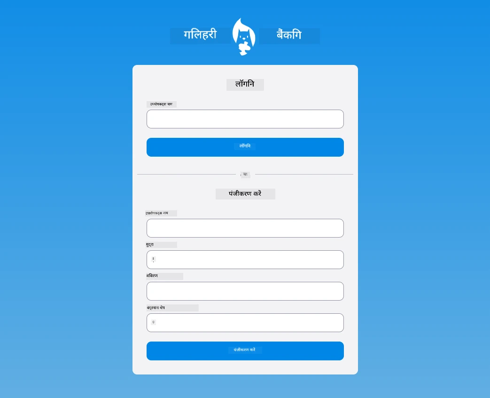

## पोस्ट-लेक्चर क्विज़

[Post-lecture quiz](https://ff-quizzes.netlify.app/web/quiz/44)

## समीक्षा और स्व-अध्ययन

डेवलपर्स ने अपने फॉर्म निर्माण प्रयासों में बहुत रचनात्मकता दिखाई है, खासकर सत्यापन रणनीतियों के संदर्भ में। विभिन्न फॉर्म प्रवाहों को जानने के लिए [CodePen](https://codepen.com) देखें; क्या आप कुछ रोचक और प्रेरणादायक फॉर्म पा सकते हैं?

## असाइनमेंट

[अपने बैंक ऐप को स्टाइल करें](assignment.md)

---

<!-- CO-OP TRANSLATOR DISCLAIMER START -->
**अस्वीकरण**:
इस दस्तावेज़ का अनुवाद AI अनुवाद सेवा [Co-op Translator](https://github.com/Azure/co-op-translator) का उपयोग करके किया गया है। हम सटीकता के लिए प्रयासरत हैं, लेकिन कृपया ध्यान दें कि स्वचालित अनुवाद में त्रुटियाँ या असत्यताएं हो सकती हैं। मूल दस्तावेज़ अपनी मूल भाषा में अधिकारिक स्रोत माना जाना चाहिए। महत्वपूर्ण जानकारी के लिए, पेशेवर मानव अनुवाद की सलाह दी जाती है। इस अनुवाद के उपयोग से उत्पन्न किसी भी गलतफहमी या गलत व्याख्या के लिए हम जिम्मेदार नहीं हैं।
<!-- CO-OP TRANSLATOR DISCLAIMER END -->