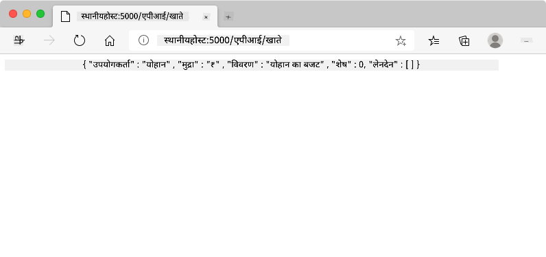
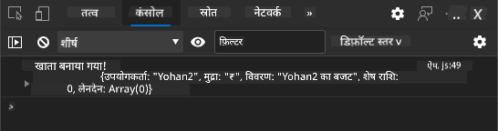
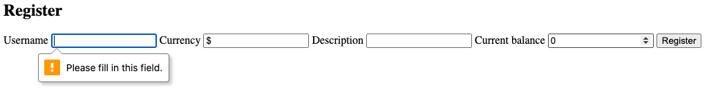
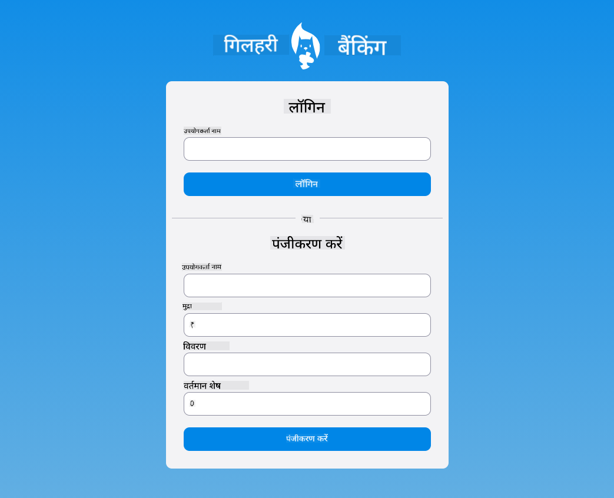

<!--
CO_OP_TRANSLATOR_METADATA:
{
  "original_hash": "8baca047d77a5f43fa4099c0578afa42",
  "translation_date": "2025-08-29T15:49:42+00:00",
  "source_file": "7-bank-project/2-forms/README.md",
  "language_code": "hi"
}
-->
# बैंकिंग ऐप बनाएं भाग 2: लॉगिन और रजिस्ट्रेशन फॉर्म बनाएं

## प्री-लेक्चर क्विज़

[प्री-लेक्चर क्विज़](https://ff-quizzes.netlify.app/web/quiz/43)

### परिचय

लगभग सभी आधुनिक वेब ऐप्स में, आप एक खाता बना सकते हैं ताकि आपका अपना निजी स्थान हो। चूंकि कई उपयोगकर्ता एक ही समय में वेब ऐप का उपयोग कर सकते हैं, आपको प्रत्येक उपयोगकर्ता का व्यक्तिगत डेटा अलग से संग्रहीत करने और यह तय करने के लिए एक तंत्र की आवश्यकता होती है कि कौन सी जानकारी प्रदर्शित की जाए। हम [उपयोगकर्ता पहचान को सुरक्षित रूप से प्रबंधित](https://en.wikipedia.org/wiki/Authentication) करने के तरीके को कवर नहीं करेंगे क्योंकि यह अपने आप में एक व्यापक विषय है, लेकिन हम यह सुनिश्चित करेंगे कि प्रत्येक उपयोगकर्ता हमारे ऐप पर एक (या अधिक) बैंक खाता बना सके।

इस भाग में हम HTML फॉर्म का उपयोग करके हमारे वेब ऐप में लॉगिन और रजिस्ट्रेशन जोड़ेंगे। हम देखेंगे कि डेटा को प्रोग्रामेटिक रूप से सर्वर API पर कैसे भेजा जाए, और अंततः उपयोगकर्ता इनपुट के लिए बुनियादी सत्यापन नियम कैसे परिभाषित करें।

### पूर्वापेक्षा

आपको इस पाठ के लिए वेब ऐप के [HTML टेम्पलेट्स और रूटिंग](../1-template-route/README.md) को पूरा करना होगा। आपको [Node.js](https://nodejs.org) इंस्टॉल करना होगा और [सर्वर API चलाना](../api/README.md) होगा ताकि आप खाते बनाने के लिए डेटा भेज सकें।

**ध्यान दें**  
आपके पास एक ही समय में दो टर्मिनल चल रहे होंगे, जैसा कि नीचे सूचीबद्ध है।  
1. मुख्य बैंक ऐप के लिए जिसे हमने [HTML टेम्पलेट्स और रूटिंग](../1-template-route/README.md) पाठ में बनाया था।  
2. [बैंक ऐप सर्वर API](../api/README.md) के लिए जिसे हमने ऊपर सेटअप किया।  

पाठ के बाकी हिस्से को पूरा करने के लिए आपको दोनों सर्वर चालू और चल रहे चाहिए। वे अलग-अलग पोर्ट (पोर्ट `3000` और पोर्ट `5000`) पर सुन रहे हैं, इसलिए सब कुछ ठीक से काम करना चाहिए।

आप यह जांच सकते हैं कि सर्वर सही तरीके से चल रहा है या नहीं, इस कमांड को टर्मिनल में चलाकर:

```sh
curl http://localhost:5000/api
# -> should return "Bank API v1.0.0" as a result
```

---

## फॉर्म और नियंत्रण

`<form>` तत्व HTML दस्तावेज़ के एक खंड को समाहित करता है जहां उपयोगकर्ता इंटरैक्टिव नियंत्रणों के साथ डेटा इनपुट और सबमिट कर सकता है। फॉर्म के भीतर उपयोग किए जा सकने वाले सभी प्रकार के उपयोगकर्ता इंटरफ़ेस (UI) नियंत्रण होते हैं, जिनमें सबसे आम `<input>` और `<button>` तत्व होते हैं।

`<input>` के कई [प्रकार](https://developer.mozilla.org/docs/Web/HTML/Element/input) होते हैं। उदाहरण के लिए, उपयोगकर्ता का उपयोगकर्ता नाम दर्ज करने के लिए आप इसका उपयोग कर सकते हैं:

```html
<input id="username" name="username" type="text">
```

`name` एट्रिब्यूट का उपयोग उस प्रॉपर्टी नाम के रूप में किया जाएगा जब फॉर्म डेटा भेजा जाएगा। `id` एट्रिब्यूट का उपयोग `<label>` को फॉर्म नियंत्रण से जोड़ने के लिए किया जाता है।

> [`<input>` प्रकारों](https://developer.mozilla.org/docs/Web/HTML/Element/input) और [अन्य फॉर्म नियंत्रणों](https://developer.mozilla.org/docs/Learn/Forms/Other_form_controls) की पूरी सूची पर एक नज़र डालें ताकि आप यह जान सकें कि UI बनाने के लिए आप कौन-कौन से मूलभूत UI तत्वों का उपयोग कर सकते हैं।

✅ ध्यान दें कि `<input>` एक [खाली तत्व](https://developer.mozilla.org/docs/Glossary/Empty_element) है, जिस पर आपको *मिलान करने वाला समापन टैग* नहीं जोड़ना चाहिए। आप हालांकि स्व-समापन `<input/>` नोटेशन का उपयोग कर सकते हैं, लेकिन यह आवश्यक नहीं है।

फॉर्म के भीतर `<button>` तत्व थोड़ा विशेष है। यदि आप इसके `type` एट्रिब्यूट को निर्दिष्ट नहीं करते हैं, तो यह दबाए जाने पर स्वचालित रूप से फॉर्म डेटा को सर्वर पर सबमिट कर देगा। यहां संभावित `type` मान दिए गए हैं:

- `submit`: फॉर्म के भीतर डिफ़ॉल्ट, बटन फॉर्म सबमिट क्रिया को ट्रिगर करता है।  
- `reset`: बटन सभी फॉर्म नियंत्रणों को उनकी प्रारंभिक मानों पर रीसेट करता है।  
- `button`: बटन दबाए जाने पर कोई डिफ़ॉल्ट व्यवहार असाइन नहीं करता। आप फिर इसे जावास्क्रिप्ट का उपयोग करके कस्टम क्रियाएं असाइन कर सकते हैं।  

### कार्य

आइए `login` टेम्पलेट में एक फॉर्म जोड़कर शुरू करें। हमें एक *username* फ़ील्ड और एक *Login* बटन की आवश्यकता होगी।

```html
<template id="login">
  <h1>Bank App</h1>
  <section>
    <h2>Login</h2>
    <form id="loginForm">
      <label for="username">Username</label>
      <input id="username" name="user" type="text">
      <button>Login</button>
    </form>
  </section>
</template>
```

यदि आप ध्यान से देखें, तो आप देख सकते हैं कि हमने यहां एक `<label>` तत्व भी जोड़ा है। `<label>` तत्वों का उपयोग UI नियंत्रणों, जैसे हमारे उपयोगकर्ता नाम फ़ील्ड, को नाम देने के लिए किया जाता है। लेबल आपके फॉर्म की पठनीयता के लिए महत्वपूर्ण हैं, लेकिन इसके अतिरिक्त लाभ भी हैं:

- एक लेबल को फॉर्म नियंत्रण से जोड़ने से सहायक तकनीकों (जैसे स्क्रीन रीडर) का उपयोग करने वाले उपयोगकर्ताओं को यह समझने में मदद मिलती है कि उनसे किस डेटा की अपेक्षा की जा रही है।  
- आप लेबल पर क्लिक करके सीधे संबंधित इनपुट पर ध्यान केंद्रित कर सकते हैं, जिससे इसे टच-स्क्रीन आधारित उपकरणों पर पहुंचना आसान हो जाता है।  

> [वेब पर एक्सेसिबिलिटी](https://developer.mozilla.org/docs/Learn/Accessibility/What_is_accessibility) एक बहुत ही महत्वपूर्ण विषय है जिसे अक्सर अनदेखा कर दिया जाता है। [सामान्य HTML तत्वों](https://developer.mozilla.org/docs/Learn/Accessibility/HTML) के लिए धन्यवाद, यदि आप उनका सही तरीके से उपयोग करते हैं तो एक्सेसिबल सामग्री बनाना मुश्किल नहीं है। आप [एक्सेसिबिलिटी के बारे में अधिक पढ़ सकते हैं](https://developer.mozilla.org/docs/Web/Accessibility) ताकि सामान्य गलतियों से बचा जा सके और एक जिम्मेदार डेवलपर बन सकें।  

अब हम रजिस्ट्रेशन के लिए दूसरा फॉर्म जोड़ेंगे, ठीक पिछले फॉर्म के नीचे:

```html
<hr/>
<h2>Register</h2>
<form id="registerForm">
  <label for="user">Username</label>
  <input id="user" name="user" type="text">
  <label for="currency">Currency</label>
  <input id="currency" name="currency" type="text" value="$">
  <label for="description">Description</label>
  <input id="description" name="description" type="text">
  <label for="balance">Current balance</label>
  <input id="balance" name="balance" type="number" value="0">
  <button>Register</button>
</form>
```

`value` एट्रिब्यूट का उपयोग करके हम किसी दिए गए इनपुट के लिए एक डिफ़ॉल्ट मान परिभाषित कर सकते हैं।  
ध्यान दें कि `balance` के लिए इनपुट में `number` प्रकार है। क्या यह अन्य इनपुट से अलग दिखता है? इसे इंटरैक्ट करके देखें।  

✅ क्या आप केवल कीबोर्ड का उपयोग करके फॉर्म को नेविगेट और इंटरैक्ट कर सकते हैं? आप ऐसा कैसे करेंगे?

## डेटा को सर्वर पर सबमिट करना

अब जब हमारे पास एक कार्यात्मक UI है, तो अगला कदम डेटा को हमारे सर्वर पर भेजना है। आइए हमारे वर्तमान कोड का उपयोग करके एक त्वरित परीक्षण करें: क्या होता है यदि आप *Login* या *Register* बटन पर क्लिक करते हैं?

क्या आपने अपने ब्राउज़र के URL सेक्शन में बदलाव देखा?


`<form>` के लिए डिफ़ॉल्ट क्रिया वर्तमान सर्वर URL पर [GET विधि](https://www.w3.org/Protocols/rfc2616/rfc2616-sec9.html#sec9.3) का उपयोग करके फॉर्म को सबमिट करना है, जो फॉर्म डेटा को सीधे URL में जोड़ देती है। हालांकि, इस विधि में कुछ कमियां हैं:

- भेजा गया डेटा आकार में बहुत सीमित है (लगभग 2000 वर्ण)  
- डेटा URL में सीधे दिखाई देता है (पासवर्ड के लिए अच्छा नहीं है)  
- यह फ़ाइल अपलोड के साथ काम नहीं करता  

इसीलिए आप इसे [POST विधि](https://www.w3.org/Protocols/rfc2616/rfc2616-sec9.html#sec9.5) का उपयोग करने के लिए बदल सकते हैं, जो फॉर्म डेटा को HTTP अनुरोध के बॉडी में सर्वर पर भेजती है, बिना उपरोक्त सीमाओं के।

> जबकि डेटा भेजने के लिए POST सबसे अधिक उपयोग की जाने वाली विधि है, [कुछ विशिष्ट परिदृश्यों में](https://www.w3.org/2001/tag/doc/whenToUseGet.html) GET विधि का उपयोग करना बेहतर होता है, जैसे कि एक सर्च फ़ील्ड को लागू करते समय।  

### कार्य

रजिस्ट्रेशन फॉर्म में `action` और `method` प्रॉपर्टीज़ जोड़ें:

```html
<form id="registerForm" action="//localhost:5000/api/accounts" method="POST">
```

अब अपने नाम के साथ एक नया खाता पंजीकृत करने का प्रयास करें। *Register* बटन पर क्लिक करने के बाद आपको कुछ ऐसा दिखाई देना चाहिए:



यदि सब कुछ ठीक हो जाता है, तो सर्वर आपके अनुरोध का उत्तर एक [JSON](https://www.json.org/json-en.html) प्रतिक्रिया के साथ देगा जिसमें बनाए गए खाते का डेटा होगा।

✅ एक ही नाम के साथ फिर से पंजीकरण करने का प्रयास करें। क्या होता है?

## पेज को रीलोड किए बिना डेटा सबमिट करना

जैसा कि आपने देखा होगा, जिस दृष्टिकोण का हमने अभी उपयोग किया उसमें एक छोटी सी समस्या है: फॉर्म सबमिट करते समय, हम अपने ऐप से बाहर निकल जाते हैं और ब्राउज़र सर्वर URL पर रीडायरेक्ट हो जाता है। हम अपने वेब ऐप के साथ सभी पेज रीलोड्स से बचने की कोशिश कर रहे हैं, क्योंकि हम एक [सिंगल-पेज एप्लिकेशन (SPA)](https://en.wikipedia.org/wiki/Single-page_application) बना रहे हैं।  

फॉर्म डेटा को पेज रीलोड किए बिना सर्वर पर भेजने के लिए, हमें जावास्क्रिप्ट कोड का उपयोग करना होगा। `<form>` तत्व के `action` प्रॉपर्टी में URL डालने के बजाय, आप `javascript:` स्ट्रिंग के साथ किसी भी जावास्क्रिप्ट कोड को प्रीपेंड कर सकते हैं ताकि एक कस्टम क्रिया की जा सके। इसका उपयोग करने का मतलब है कि आपको कुछ कार्यों को लागू करना होगा जो पहले ब्राउज़र द्वारा स्वचालित रूप से किए जाते थे:

- फॉर्म डेटा प्राप्त करें  
- फॉर्म डेटा को उपयुक्त प्रारूप में परिवर्तित और एन्कोड करें  
- HTTP अनुरोध बनाएं और इसे सर्वर पर भेजें  

### कार्य

रजिस्ट्रेशन फॉर्म के `action` को बदलें:

```html
<form id="registerForm" action="javascript:register()">
```

`app.js` खोलें और `register` नामक एक नई फ़ंक्शन जोड़ें:

```js
function register() {
  const registerForm = document.getElementById('registerForm');
  const formData = new FormData(registerForm);
  const data = Object.fromEntries(formData);
  const jsonData = JSON.stringify(data);
}
```

यहां हम `getElementById()` का उपयोग करके फॉर्म तत्व प्राप्त करते हैं और [`FormData`](https://developer.mozilla.org/docs/Web/API/FormData) हेल्पर का उपयोग करके फॉर्म नियंत्रणों से मानों को कुंजी/मान जोड़े के सेट के रूप में निकालते हैं। फिर हम डेटा को [`Object.fromEntries()`](https://developer.mozilla.org/docs/Web/JavaScript/Reference/Global_Objects/Object/fromEntries) का उपयोग करके एक नियमित ऑब्जेक्ट में परिवर्तित करते हैं और अंत में डेटा को [JSON](https://www.json.org/json-en.html) में सीरियलाइज़ करते हैं, जो वेब पर डेटा का आदान-प्रदान करने के लिए आमतौर पर उपयोग किया जाने वाला प्रारूप है।  

डेटा अब सर्वर पर भेजने के लिए तैयार है। `createAccount` नामक एक नई फ़ंक्शन बनाएं:

```js
async function createAccount(account) {
  try {
    const response = await fetch('//localhost:5000/api/accounts', {
      method: 'POST',
      headers: { 'Content-Type': 'application/json' },
      body: account
    });
    return await response.json();
  } catch (error) {
    return { error: error.message || 'Unknown error' };
  }
}
```

यह फ़ंक्शन क्या कर रहा है? पहले, यहां `async` कीवर्ड पर ध्यान दें। इसका मतलब है कि फ़ंक्शन में कोड है जो [**असिंक्रोनस रूप से**](https://developer.mozilla.org/docs/Web/JavaScript/Reference/Statements/async_function) निष्पादित होगा। `await` कीवर्ड के साथ उपयोग किए जाने पर, यह असिंक्रोनस कोड के निष्पादन की प्रतीक्षा करने की अनुमति देता है - जैसे यहां सर्वर प्रतिक्रिया की प्रतीक्षा करना - इससे पहले कि आगे बढ़े।  

`fetch()` API का उपयोग करके JSON डेटा को सर्वर पर भेजा जाता है। यह विधि 2 पैरामीटर लेती है:

- सर्वर का URL, इसलिए हम यहां `//localhost:5000/api/accounts` डालते हैं।  
- अनुरोध की सेटिंग्स। यहीं पर हम विधि को `POST` पर सेट करते हैं और अनुरोध के लिए `body` प्रदान करते हैं। चूंकि हम JSON डेटा को सर्वर पर भेज रहे हैं, हमें `Content-Type` हेडर को `application/json` पर सेट करना होगा ताकि सर्वर सामग्री को समझ सके।  

चूंकि सर्वर अनुरोध का उत्तर JSON के साथ देगा, हम `await response.json()` का उपयोग करके JSON सामग्री को पार्स कर सकते हैं और परिणामी ऑब्जेक्ट को वापस कर सकते हैं। ध्यान दें कि यह विधि असिंक्रोनस है, इसलिए हम यहां `await` कीवर्ड का उपयोग करते हैं ताकि पार्सिंग के दौरान किसी भी त्रुटि को भी पकड़ा जा सके।  

अब `register` फ़ंक्शन में `createAccount()` को कॉल करने के लिए कुछ कोड जोड़ें:

```js
const result = await createAccount(jsonData);
```

चूंकि हम यहां `await` कीवर्ड का उपयोग कर रहे हैं, हमें `register` फ़ंक्शन से पहले `async` कीवर्ड जोड़ने की आवश्यकता है:

```js
async function register() {
```

अंत में, परिणाम की जांच करने के लिए कुछ लॉग जोड़ें। अंतिम फ़ंक्शन इस प्रकार दिखना चाहिए:

```js
async function register() {
  const registerForm = document.getElementById('registerForm');
  const formData = new FormData(registerForm);
  const jsonData = JSON.stringify(Object.fromEntries(formData));
  const result = await createAccount(jsonData);

  if (result.error) {
    return console.log('An error occurred:', result.error);
  }

  console.log('Account created!', result);
}
```

यह थोड़ा लंबा था लेकिन हम वहां पहुंच गए! यदि आप अपने [ब्राउज़र डेवलपर टूल्स](https://developer.mozilla.org/docs/Learn/Common_questions/What_are_browser_developer_tools) खोलते हैं और एक नया खाता पंजीकृत करने का प्रयास करते हैं, तो आपको वेब पेज पर कोई बदलाव नहीं दिखेगा लेकिन कंसोल में एक संदेश दिखाई देगा जो पुष्टि करता है कि सब कुछ काम कर रहा है।  



✅ क्या आपको लगता है कि डेटा को सर्वर पर सुरक्षित रूप से भेजा गया है? क्या होगा अगर कोई अनुरोध को इंटरसेप्ट कर ले? आप [HTTPS](https://en.wikipedia.org/wiki/HTTPS) के बारे में पढ़ सकते हैं ताकि सुरक्षित डेटा संचार के बारे में अधिक जान सकें।  

## डेटा सत्यापन

यदि आप पहले उपयोगकर्ता नाम सेट किए बिना एक नया खाता पंजीकृत करने का प्रयास करते हैं, तो आप देख सकते हैं कि सर्वर [400 (Bad Request)](https://developer.mozilla.org/docs/Web/HTTP/Status/400#:~:text=The%20HyperText%20Transfer%20Protocol%20(HTTP,%2C%20or%20deceptive%20request%20routing).) स्थिति कोड के साथ एक त्रुटि लौटाता है।  

सर्वर को डेटा भेजने से पहले, यह सुनिश्चित करने के लिए [फॉर्म डेटा को सत्यापित करना](https://developer.mozilla.org/docs/Learn/Forms/Form_validation) एक अच्छा अभ्यास है कि आप एक मान्य अनुरोध भेज रहे हैं। HTML5 फॉर्म नियंत्रण विभिन्न एट्रिब्यूट्स का उपयोग करके अंतर्निहित सत्यापन प्रदान करते हैं:

- `required`: फ़ील्ड को भरा जाना चाहिए अन्यथा फॉर्म सबमिट नहीं किया जा सकता।  
- `minlength` और `maxlength`: टेक्स्ट फ़ील्ड में वर्णों की न्यूनतम और अधिकतम संख्या को परिभाषित करता है।  
- `min` और `max`: एक संख्यात्मक फ़ील्ड के न्यूनतम और अधिकतम मान को परिभाषित करता है।  
- `type`: अपेक्षित डेटा के प्रकार को परिभाषित करता है, जैसे `number`, `email`, `file` या [अन्य अंतर्निहित प्रकार](https://developer.mozilla.org/docs/Web/HTML/Element/input)। यह एट्रिब्यूट फॉर्म नियंत्रण के दृश्य रेंडरिंग को भी बदल सकता है।  
- `pattern`: यह जांचने के लिए एक [रेगुलर एक्सप्रेशन](https://developer.mozilla.org/docs/Web/JavaScript/Guide/Regular_Expressions) पैटर्न को परिभाषित करने की अनुमति देता है कि दर्ज किया गया डेटा मान्य है या नहीं।  
सुझाव: आप अपने फॉर्म नियंत्रणों की उपस्थिति को उनकी वैधता के आधार पर अनुकूलित कर सकते हैं, इसके लिए `:valid` और `:invalid` CSS स्यूडो-क्लासेस का उपयोग करें।
### कार्य

एक वैध नया खाता बनाने के लिए दो आवश्यक फ़ील्ड हैं: उपयोगकर्ता नाम और मुद्रा। अन्य फ़ील्ड वैकल्पिक हैं। फ़ॉर्म के HTML को अपडेट करें, `required` एट्रिब्यूट और फ़ील्ड के लेबल में टेक्स्ट का उपयोग करते हुए:

```html
<label for="user">Username (required)</label>
<input id="user" name="user" type="text" required>
...
<label for="currency">Currency (required)</label>
<input id="currency" name="currency" type="text" value="$" required>
```

हालांकि इस विशेष सर्वर इम्प्लीमेंटेशन में फ़ील्ड की अधिकतम लंबाई पर कोई विशिष्ट सीमा लागू नहीं की गई है, लेकिन उपयोगकर्ता द्वारा दर्ज किए गए टेक्स्ट के लिए उचित सीमाएं निर्धारित करना हमेशा एक अच्छा अभ्यास है।

टेक्स्ट फ़ील्ड्स में `maxlength` एट्रिब्यूट जोड़ें:

```html
<input id="user" name="user" type="text" maxlength="20" required>
...
<input id="currency" name="currency" type="text" value="$" maxlength="5" required>
...
<input id="description" name="description" type="text" maxlength="100">
```

अब यदि आप *Register* बटन दबाते हैं और कोई फ़ील्ड हमारे द्वारा परिभाषित वैलिडेशन नियम का पालन नहीं करता है, तो आपको कुछ ऐसा दिखाई देगा:



ऐसी वैलिडेशन जो किसी भी डेटा को सर्वर पर भेजने से *पहले* की जाती है, उसे **क्लाइंट-साइड** वैलिडेशन कहा जाता है। लेकिन ध्यान दें कि सभी चेक बिना डेटा भेजे करना हमेशा संभव नहीं होता। उदाहरण के लिए, हम यहां यह जांच नहीं कर सकते कि क्या पहले से ही वही उपयोगकर्ता नाम वाला खाता मौजूद है, बिना सर्वर को अनुरोध भेजे। अतिरिक्त वैलिडेशन जो सर्वर पर की जाती है, उसे **सर्वर-साइड** वैलिडेशन कहा जाता है।

आमतौर पर दोनों को लागू करना आवश्यक होता है। क्लाइंट-साइड वैलिडेशन उपयोगकर्ता अनुभव को बेहतर बनाता है क्योंकि यह उपयोगकर्ता को तुरंत प्रतिक्रिया प्रदान करता है, जबकि सर्वर-साइड वैलिडेशन यह सुनिश्चित करने के लिए महत्वपूर्ण है कि आप जिस उपयोगकर्ता डेटा को संभाल रहे हैं वह सही और सुरक्षित है।

---

## 🚀 चुनौती

यदि उपयोगकर्ता पहले से मौजूद है, तो HTML में एक त्रुटि संदेश दिखाएं।

यहां एक उदाहरण है कि CSS स्टाइलिंग के बाद अंतिम लॉगिन पेज कैसा दिख सकता है:



## पोस्ट-लेक्चर क्विज़

[पोस्ट-लेक्चर क्विज़](https://ff-quizzes.netlify.app/web/quiz/44)

## समीक्षा और स्व-अध्ययन

डेवलपर्स ने अपने फ़ॉर्म निर्माण प्रयासों में, विशेष रूप से वैलिडेशन रणनीतियों के संबंध में, बहुत रचनात्मकता दिखाई है। [CodePen](https://codepen.com) पर जाकर विभिन्न फ़ॉर्म फ्लो के बारे में जानें; क्या आप कुछ रोचक और प्रेरणादायक फ़ॉर्म ढूंढ सकते हैं?

## असाइनमेंट

[अपने बैंक ऐप को स्टाइल करें](assignment.md)

---

**अस्वीकरण**:  
यह दस्तावेज़ AI अनुवाद सेवा [Co-op Translator](https://github.com/Azure/co-op-translator) का उपयोग करके अनुवादित किया गया है। जबकि हम सटीकता सुनिश्चित करने का प्रयास करते हैं, कृपया ध्यान दें कि स्वचालित अनुवाद में त्रुटियां या अशुद्धियां हो सकती हैं। मूल भाषा में उपलब्ध मूल दस्तावेज़ को प्रामाणिक स्रोत माना जाना चाहिए। महत्वपूर्ण जानकारी के लिए, पेशेवर मानव अनुवाद की सिफारिश की जाती है। इस अनुवाद के उपयोग से उत्पन्न किसी भी गलतफहमी या गलत व्याख्या के लिए हम उत्तरदायी नहीं हैं।