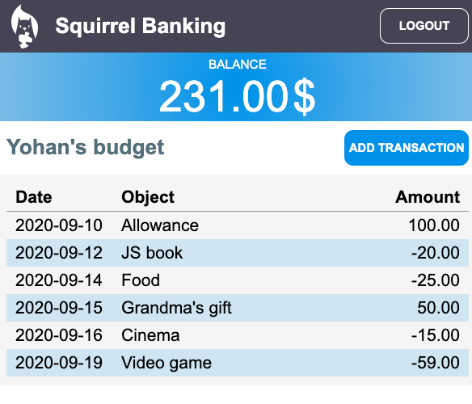

<!--
CO_OP_TRANSLATOR_METADATA:
{
  "original_hash": "89d0df9854ed020f155e94882ae88d4c",
  "translation_date": "2025-08-29T15:48:54+00:00",
  "source_file": "7-bank-project/3-data/README.md",
  "language_code": "hi"
}
-->
# बैंकिंग ऐप बनाएं भाग 3: डेटा प्राप्त करने और उपयोग करने के तरीके

## प्री-लेक्चर क्विज़

[प्री-लेक्चर क्विज़](https://ff-quizzes.netlify.app/web/quiz/45)

### परिचय

हर वेब एप्लिकेशन के केंद्र में *डेटा* होता है। डेटा कई रूप ले सकता है, लेकिन इसका मुख्य उद्देश्य हमेशा उपयोगकर्ता को जानकारी प्रदर्शित करना होता है। जैसे-जैसे वेब ऐप्स अधिक इंटरैक्टिव और जटिल होते जा रहे हैं, उपयोगकर्ता द्वारा जानकारी तक पहुंचने और उसके साथ इंटरैक्ट करने का तरीका वेब विकास का एक महत्वपूर्ण हिस्सा बन गया है।

इस पाठ में, हम देखेंगे कि सर्वर से डेटा को असिंक्रोनस रूप से कैसे प्राप्त किया जाए और इस डेटा का उपयोग HTML को पुनः लोड किए बिना वेब पेज पर जानकारी प्रदर्शित करने के लिए कैसे किया जाए।

### पूर्वापेक्षा

इस पाठ के लिए आपको वेब ऐप का [लॉगिन और रजिस्ट्रेशन फॉर्म](../2-forms/README.md) भाग बनाना होगा। आपको [Node.js](https://nodejs.org) इंस्टॉल करना होगा और [सर्वर API](../api/README.md) को लोकल रूप से चलाना होगा ताकि आपको अकाउंट डेटा मिल सके।

आप टर्मिनल में यह कमांड चलाकर सुनिश्चित कर सकते हैं कि सर्वर सही तरीके से चल रहा है:

```sh
curl http://localhost:5000/api
# -> should return "Bank API v1.0.0" as a result
```

---

## AJAX और डेटा प्राप्त करना

पारंपरिक वेबसाइटें उपयोगकर्ता द्वारा लिंक चुनने या फॉर्म के माध्यम से डेटा सबमिट करने पर प्रदर्शित सामग्री को अपडेट करती हैं, पूरे HTML पेज को पुनः लोड करके। हर बार जब नया डेटा लोड करने की आवश्यकता होती है, तो वेब सर्वर एक नया HTML पेज लौटाता है जिसे ब्राउज़र द्वारा प्रोसेस किया जाना चाहिए, जिससे वर्तमान उपयोगकर्ता क्रिया बाधित होती है और पुनः लोड के दौरान इंटरैक्शन सीमित हो जाता है। इस वर्कफ़्लो को *मल्टी-पेज एप्लिकेशन* या *MPA* भी कहा जाता है।


जब वेब एप्लिकेशन अधिक जटिल और इंटरैक्टिव होने लगे, तो [AJAX (Asynchronous JavaScript and XML)](https://en.wikipedia.org/wiki/Ajax_(programming)) नामक एक नई तकनीक सामने आई। यह तकनीक वेब ऐप्स को सर्वर से डेटा को असिंक्रोनस रूप से भेजने और प्राप्त करने की अनुमति देती है, बिना HTML पेज को पुनः लोड किए। इससे तेज़ अपडेट और स्मूथ उपयोगकर्ता इंटरैक्शन संभव होता है। जब सर्वर से नया डेटा प्राप्त होता है, तो वर्तमान HTML पेज को [DOM](https://developer.mozilla.org/docs/Web/API/Document_Object_Model) API का उपयोग करके जावास्क्रिप्ट के माध्यम से अपडेट किया जा सकता है। समय के साथ, यह दृष्टिकोण [*सिंगल-पेज एप्लिकेशन* या *SPA*](https://en.wikipedia.org/wiki/Single-page_application) के रूप में विकसित हुआ।


जब AJAX पहली बार पेश किया गया था, तो असिंक्रोनस रूप से डेटा प्राप्त करने के लिए उपलब्ध एकमात्र API [`XMLHttpRequest`](https://developer.mozilla.org/docs/Web/API/XMLHttpRequest/Using_XMLHttpRequest) था। लेकिन आधुनिक ब्राउज़र अब अधिक सुविधाजनक और शक्तिशाली [`Fetch` API](https://developer.mozilla.org/docs/Web/API/Fetch_API) को भी लागू करते हैं, जो प्रॉमिस का उपयोग करता है और JSON डेटा को मैनिपुलेट करने के लिए बेहतर है।

> जबकि सभी आधुनिक ब्राउज़र `Fetch API` का समर्थन करते हैं, यदि आप चाहते हैं कि आपका वेब एप्लिकेशन पुराने ब्राउज़रों पर काम करे, तो पहले [caniuse.com पर संगतता तालिका](https://caniuse.com/fetch) की जांच करना हमेशा एक अच्छा विचार है।

### कार्य

[पिछले पाठ](../2-forms/README.md) में हमने अकाउंट बनाने के लिए रजिस्ट्रेशन फॉर्म को लागू किया था। अब हम मौजूदा अकाउंट का उपयोग करके लॉगिन करने और उसका डेटा प्राप्त करने के लिए कोड जोड़ेंगे। `app.js` फ़ाइल खोलें और एक नया `login` फ़ंक्शन जोड़ें:

```js
async function login() {
  const loginForm = document.getElementById('loginForm')
  const user = loginForm.user.value;
}
```

यहां हम `getElementById()` का उपयोग करके फॉर्म एलिमेंट प्राप्त करते हैं, और फिर `loginForm.user.value` के साथ इनपुट से उपयोगकर्ता नाम प्राप्त करते हैं। हर फॉर्म कंट्रोल को HTML में `name` एट्रिब्यूट का उपयोग करके फॉर्म की प्रॉपर्टी के रूप में एक्सेस किया जा सकता है।

रजिस्ट्रेशन के लिए हमने जो किया था, उसी तरह हम सर्वर अनुरोध करने के लिए एक और फ़ंक्शन बनाएंगे, लेकिन इस बार अकाउंट डेटा प्राप्त करने के लिए:

```js
async function getAccount(user) {
  try {
    const response = await fetch('//localhost:5000/api/accounts/' + encodeURIComponent(user));
    return await response.json();
  } catch (error) {
    return { error: error.message || 'Unknown error' };
  }
}
```

हम `fetch` API का उपयोग करके सर्वर से डेटा को असिंक्रोनस रूप से प्राप्त करते हैं, लेकिन इस बार हमें केवल URL के अलावा कोई अतिरिक्त पैरामीटर की आवश्यकता नहीं है, क्योंकि हम केवल डेटा क्वेरी कर रहे हैं। डिफ़ॉल्ट रूप से, `fetch` एक [`GET`](https://developer.mozilla.org/docs/Web/HTTP/Methods/GET) HTTP अनुरोध बनाता है, जो यहां हमारा उद्देश्य है।

✅ `encodeURIComponent()` एक फ़ंक्शन है जो URL के लिए विशेष वर्णों को एस्केप करता है। यदि हम इस फ़ंक्शन को कॉल नहीं करते और सीधे `user` मान का उपयोग करते हैं, तो हमें किस प्रकार की समस्याओं का सामना करना पड़ सकता है?

अब हम अपने `login` फ़ंक्शन को `getAccount` का उपयोग करने के लिए अपडेट करेंगे:

```js
async function login() {
  const loginForm = document.getElementById('loginForm')
  const user = loginForm.user.value;
  const data = await getAccount(user);

  if (data.error) {
    return console.log('loginError', data.error);
  }

  account = data;
  navigate('/dashboard');
}
```

सबसे पहले, चूंकि `getAccount` एक असिंक्रोनस फ़ंक्शन है, हमें इसे `await` कीवर्ड के साथ मिलाना होगा ताकि सर्वर परिणाम का इंतजार किया जा सके। किसी भी सर्वर अनुरोध के साथ, हमें एरर केस को भी संभालना होगा। फिलहाल हम केवल एरर को प्रदर्शित करने के लिए एक लॉग संदेश जोड़ेंगे और बाद में इसे सुधारेंगे।

फिर हमें डेटा को कहीं स्टोर करना होगा ताकि हम बाद में इसे डैशबोर्ड जानकारी प्रदर्शित करने के लिए उपयोग कर सकें। चूंकि `account` वेरिएबल अभी तक मौजूद नहीं है, हम इसे अपनी फ़ाइल के शीर्ष पर एक ग्लोबल वेरिएबल के रूप में बनाएंगे:

```js
let account = null;
```

उपयोगकर्ता डेटा को वेरिएबल में सेव करने के बाद, हम *लॉगिन* पेज से *डैशबोर्ड* पर `navigate()` फ़ंक्शन का उपयोग करके जा सकते हैं।

अंत में, हमें लॉगिन फॉर्म सबमिट होने पर अपने `login` फ़ंक्शन को कॉल करना होगा, HTML को संशोधित करके:

```html
<form id="loginForm" action="javascript:login()">
```

नए अकाउंट को रजिस्टर करके और उसी अकाउंट का उपयोग करके लॉगिन करने की कोशिश करके सुनिश्चित करें कि सब कुछ सही तरीके से काम कर रहा है।

अगले भाग पर जाने से पहले, हम `register` फ़ंक्शन को इस कोड को फ़ंक्शन के अंत में जोड़कर पूरा कर सकते हैं:

```js
account = result;
navigate('/dashboard');
```

✅ क्या आप जानते हैं कि डिफ़ॉल्ट रूप से, आप केवल उसी *डोमेन और पोर्ट* से सर्वर API को कॉल कर सकते हैं जिस वेब पेज को आप देख रहे हैं? यह ब्राउज़र द्वारा लागू की गई सुरक्षा तंत्र है। लेकिन रुको, हमारा वेब ऐप `localhost:3000` पर चल रहा है जबकि सर्वर API `localhost:5000` पर चल रहा है, फिर यह कैसे काम करता है? [Cross-Origin Resource Sharing (CORS)](https://developer.mozilla.org/docs/Web/HTTP/CORS) नामक तकनीक का उपयोग करके, यदि सर्वर प्रतिक्रिया में विशेष हेडर जोड़ता है, तो क्रॉस-ओरिजिन HTTP अनुरोध करना संभव है, जिससे विशिष्ट डोमेन के लिए अपवाद की अनुमति मिलती है।

> API के बारे में अधिक जानने के लिए यह [पाठ](https://docs.microsoft.com/learn/modules/use-apis-discover-museum-art/?WT.mc_id=academic-77807-sagibbon) लें।

## HTML को डेटा प्रदर्शित करने के लिए अपडेट करें

अब जब हमारे पास उपयोगकर्ता डेटा है, तो हमें मौजूदा HTML को इसे प्रदर्शित करने के लिए अपडेट करना होगा। हम पहले ही जानते हैं कि DOM से किसी एलिमेंट को कैसे प्राप्त किया जाए, उदाहरण के लिए `document.getElementById()` का उपयोग करके। एक बेस एलिमेंट प्राप्त करने के बाद, यहां कुछ API हैं जिनका उपयोग आप इसे संशोधित करने या इसमें चाइल्ड एलिमेंट जोड़ने के लिए कर सकते हैं:

- [`textContent`](https://developer.mozilla.org/docs/Web/API/Node/textContent) प्रॉपर्टी का उपयोग करके आप किसी एलिमेंट के टेक्स्ट को बदल सकते हैं। ध्यान दें कि इस मान को बदलने से एलिमेंट के सभी चाइल्ड (यदि कोई हो) हटा दिए जाते हैं और इसे प्रदान किए गए टेक्स्ट से बदल दिया जाता है। इस प्रकार, यह किसी दिए गए एलिमेंट के सभी चाइल्ड को हटाने का एक कुशल तरीका भी है, इसे खाली स्ट्रिंग `''` असाइन करके।

- [`document.createElement()`](https://developer.mozilla.org/docs/Web/API/Document/createElement) और [`append()`](https://developer.mozilla.org/docs/Web/API/ParentNode/append) मेथड का उपयोग करके आप एक या अधिक नए चाइल्ड एलिमेंट बना सकते हैं और अटैच कर सकते हैं।

✅ किसी एलिमेंट की [`innerHTML`](https://developer.mozilla.org/docs/Web/API/Element/innerHTML) प्रॉपर्टी का उपयोग करके इसके HTML कंटेंट को बदलना भी संभव है, लेकिन इसे [क्रॉस-साइट स्क्रिप्टिंग (XSS)](https://developer.mozilla.org/docs/Glossary/Cross-site_scripting) हमलों के प्रति संवेदनशील होने के कारण टालना चाहिए।

### कार्य

डैशबोर्ड स्क्रीन पर जाने से पहले, हमें *लॉगिन* पेज पर एक और काम करना चाहिए। वर्तमान में, यदि आप किसी ऐसे उपयोगकर्ता नाम के साथ लॉगिन करने का प्रयास करते हैं जो मौजूद नहीं है, तो कंसोल में एक संदेश दिखाया जाता है, लेकिन एक सामान्य उपयोगकर्ता के लिए कुछ भी नहीं बदलता है और आपको पता नहीं चलता कि क्या हो रहा है।

आइए लॉगिन `<button>` से ठीक पहले लॉगिन फॉर्म में एक प्लेसहोल्डर एलिमेंट जोड़ें:

```html
...
<div id="loginError"></div>
<button>Login</button>
...
```

यह `<div>` एलिमेंट खाली है, जिसका अर्थ है कि स्क्रीन पर कुछ भी प्रदर्शित नहीं होगा जब तक कि हम इसमें कुछ कंटेंट न जोड़ें। हम इसे एक `id` भी देते हैं ताकि इसे जावास्क्रिप्ट के साथ आसानी से प्राप्त किया जा सके।

`app.js` फ़ाइल पर वापस जाएं और एक नया हेल्पर फ़ंक्शन `updateElement` बनाएं:

```js
function updateElement(id, text) {
  const element = document.getElementById(id);
  element.textContent = text;
}
```

यह फ़ंक्शन काफी सरल है: दिए गए एलिमेंट *id* और *text* के आधार पर, यह उस DOM एलिमेंट के टेक्स्ट कंटेंट को अपडेट करेगा जिसका `id` मेल खाता है। आइए इस मेथड का उपयोग `login` फ़ंक्शन में पिछले एरर संदेश के स्थान पर करें:

```js
if (data.error) {
  return updateElement('loginError', data.error);
}
```

अब यदि आप किसी अमान्य अकाउंट के साथ लॉगिन करने का प्रयास करते हैं, तो आपको कुछ ऐसा दिखाई देगा:


अब हमारे पास एक एरर टेक्स्ट है जो विज़ुअली दिखता है, लेकिन यदि आप इसे स्क्रीन रीडर के साथ आज़माते हैं, तो आप देखेंगे कि कुछ भी घोषित नहीं किया गया है। पेज पर डायनामिक रूप से जोड़ा गया टेक्स्ट स्क्रीन रीडर द्वारा घोषित किया जाए, इसके लिए इसे [लाइव रीजन](https://developer.mozilla.org/docs/Web/Accessibility/ARIA/ARIA_Live_Regions) का उपयोग करना होगा। यहां हम एक विशेष प्रकार के लाइव रीजन का उपयोग करेंगे जिसे अलर्ट कहा जाता है:

```html
<div id="loginError" role="alert"></div>
```

`register` फ़ंक्शन एरर के लिए भी यही व्यवहार लागू करें (HTML को अपडेट करना न भूलें)।

## डैशबोर्ड पर जानकारी प्रदर्शित करें

हमने अभी जो तकनीकें देखी हैं, उनका उपयोग करके हम डैशबोर्ड पेज पर अकाउंट जानकारी प्रदर्शित करने का भी ध्यान रखेंगे।

सर्वर से प्राप्त अकाउंट ऑब्जेक्ट इस प्रकार दिखता है:

```json
{
  "user": "test",
  "currency": "$",
  "description": "Test account",
  "balance": 75,
  "transactions": [
    { "id": "1", "date": "2020-10-01", "object": "Pocket money", "amount": 50 },
    { "id": "2", "date": "2020-10-03", "object": "Book", "amount": -10 },
    { "id": "3", "date": "2020-10-04", "object": "Sandwich", "amount": -5 }
  ],
}
```

> नोट: आपके काम को आसान बनाने के लिए, आप पहले से मौजूद `test` अकाउंट का उपयोग कर सकते हैं जो पहले से डेटा से भरा हुआ है।

### कार्य

आइए HTML में "Balance" सेक्शन को प्लेसहोल्डर एलिमेंट जोड़ने के लिए बदलें:

```html
<section>
  Balance: <span id="balance"></span><span id="currency"></span>
</section>
```

हम अकाउंट विवरण प्रदर्शित करने के लिए इसके ठीक नीचे एक नया सेक्शन भी जोड़ेंगे:

```html
<h2 id="description"></h2>
```

✅ चूंकि अकाउंट विवरण इसके नीचे की सामग्री के लिए एक शीर्षक के रूप में कार्य करता है, इसे सेमांटिक रूप से एक हेडिंग के रूप में चिह्नित किया गया है। जानें कि [हेडिंग संरचना](https://www.nomensa.com/blog/2017/how-structure-headings-web-accessibility) एक्सेसिबिलिटी के लिए क्यों महत्वपूर्ण है, और पेज पर आलोचनात्मक नज़र डालें कि और क्या हेडिंग हो सकता है।

इसके बाद, हम `app.js` में एक नया फ़ंक्शन बनाएंगे जो प्लेसहोल्डर को भर देगा:

```js
function updateDashboard() {
  if (!account) {
    return navigate('/login');
  }

  updateElement('description', account.description);
  updateElement('balance', account.balance.toFixed(2));
  updateElement('currency', account.currency);
}
```

सबसे पहले, हम यह सुनिश्चित करते हैं कि हमारे पास आगे बढ़ने से पहले आवश्यक अकाउंट डेटा है। फिर हम HTML को अपडेट करने के लिए पहले बनाए गए `updateElement()` फ़ंक्शन का उपयोग करते हैं।

> बैलेंस डिस्प्ले को सुंदर बनाने के लिए, हम मेथड [`toFixed(2)`](https://developer.mozilla.org/docs/Web/JavaScript/Reference/Global_Objects/Number/toFixed) का उपयोग करते हैं ताकि मान को दशमलव बिंदु के बाद 2 अंकों के साथ प्रदर्शित किया जा सके।

अब हमें हर बार जब डैशबोर्ड लोड होता है, तो हमारे `updateDashboard()` फ़ंक्शन को कॉल करना होगा। यदि आपने पहले [पाठ 1 असाइनमेंट](../1-template-route/assignment.md) पूरा कर लिया है तो यह सीधा होना चाहिए, अन्यथा आप निम्नलिखित कार्यान्वयन का उपयोग कर सकते हैं।

`updateRoute()` फ़ंक्शन के अंत में यह कोड जोड़ें:

```js
if (typeof route.init === 'function') {
  route.init();
}
```

और रूट्स परिभाषा को अपडेट करें:

```js
const routes = {
  '/login': { templateId: 'login' },
  '/dashboard': { templateId: 'dashboard', init: updateDashboard }
};
```

इस बदलाव के साथ, हर बार जब डैशबोर्ड पेज प्रदर्शित होता है, तो `updateDashboard()` फ़ंक्शन कॉल किया जाता है। लॉगिन के बाद, आपको अकाउंट बैलेंस, मुद्रा और विवरण देखना चाहिए।

## HTML टेम्पलेट्स के साथ डायनामिक रूप से टेबल रो बनाएं

[पहले पाठ](../1-template-route/README.md) में हमने HTML टेम्पलेट्स का उपयोग किया था और [`appendChild()`](https://developer.mozilla.org/docs/Web/API/Node/appendChild) मेथड के साथ अपने ऐप में नेविगेशन को लागू किया था। टेम्पलेट्स छोटे भी हो सकते हैं और पेज के रिपीट होने वाले हिस्सों को डायनामिक रूप से पॉप्युलेट करने के लिए उपयोग किए जा सकते हैं।

हम HTML टेबल में ट्रांजेक्शन की सूची प्रदर्शित करने के लिए इसी दृष्टिकोण का उपयोग करेंगे।

### कार्य

HTML `<body>` में एक नया टेम्पलेट जोड़ें:

```html
<template id="transaction">
  <tr>
    <td></td>
    <td></td>
    <td></td>
  </tr>
</template>
```

यह टेम्पलेट एक सिंगल टेबल रो का प्रतिनिधित्व करता है, जिसमें ट्रांजेक्शन के *date*, *object* और *amount* को पॉप्युलेट करने के लिए 3 कॉलम हैं।

फिर, डैशबोर्ड टेम्पलेट के भीतर टेबल के `<tbody>` एलिमेंट में यह `id` प्रॉपर्टी जोड़ें ताकि इसे जावास्क्रिप्ट का उपयोग करके आसानी से ढूंढा जा सके:

```html
<tbody id="transactions"></tbody>
```

हमारा HTML तैयार है, आइए जावास्क्रिप्ट कोड पर स्विच करें और एक नया फ़ंक्शन `createTransactionRow` बनाएं:

```js
function createTransactionRow(transaction) {
  const template = document.getElementById('transaction');
  const transactionRow = template.content.cloneNode(true);
  const tr = transactionRow.querySelector('tr');
  tr.children[0].textContent = transaction.date;
  tr.children[1].textContent = transaction.object;
  tr.children[2].textContent = transaction.amount.toFixed(2);
  return transactionRow;
}
```

यह फ़ंक्शन ठीक वही करता है जो इसका नाम बताता है: पहले बनाए गए टेम्पलेट का उपयोग करके, यह एक नया टेबल रो बनाता है और ट्रांजेक्शन डेटा का उपयोग करके इसकी सामग्री भरता है। हम इसे अपने `updateDashboard()` फ़ंक्शन में टेबल को पॉप्युलेट करने के लिए उपयोग करेंगे:

```js
const transactionsRows = document.createDocumentFragment();
for (const transaction of account.transactions) {
  const transactionRow = createTransactionRow(transaction);
  transactionsRows.appendChild(transactionRow);
}
updateElement('transactions', transactionsRows);
```

यहां हम मेथड [`document.createDocumentFragment()`](https://developer.mozilla.org/docs/Web/API/Document/createDocumentFragment) का उपयोग करते हैं जो एक नया DOM फ्रैगमेंट बनाता है जिस पर हम काम कर सकते हैं, और अंत में इसे अपने HTML टेबल से अटैच कर सकते हैं।

इस कोड को काम करने से पहले, हमें एक और काम करना होगा, क्योंकि हमारा `updateElement()` फ़ंक्शन वर्तमान में केवल टेक्स्ट कंटेंट को सपोर्ट करता है। आइए इसके कोड को थोड़ा बदलें:

```js
function updateElement(id, textOrNode) {
  const element = document.getElementById(id);
  element.textContent = ''; // Removes all children
  element.append(textOrNode);
}
```

हम [`append()`](https://developer.mozilla.org/docs/Web/API/ParentNode/append) मेथड का उपयोग करते हैं क्योंकि यह पैरेंट एलिमेंट से टेक्स्ट या [DOM Nodes](https://developer.mozilla.org/docs/Web/API/Node) को अटैच करने की अनुमति देता है, जो हमारे सभी उपयोग मामलों के लिए उपयुक्त है।
यदि आप `test` अकाउंट का उपयोग करके लॉगिन करते हैं, तो अब आपको डैशबोर्ड पर लेन-देन की सूची दिखाई देनी चाहिए 🎉।

---

## 🚀 चुनौती

मिलकर काम करें ताकि डैशबोर्ड पेज एक असली बैंकिंग ऐप जैसा दिखे। यदि आपने पहले ही अपने ऐप को स्टाइल कर लिया है, तो [मीडिया क्वेरीज़](https://developer.mozilla.org/docs/Web/CSS/Media_Queries) का उपयोग करके [रेस्पॉन्सिव डिज़ाइन](https://developer.mozilla.org/docs/Web/Progressive_web_apps/Responsive/responsive_design_building_blocks) बनाने की कोशिश करें, जो डेस्कटॉप और मोबाइल दोनों डिवाइस पर अच्छे से काम करे।

यहां एक स्टाइल किए गए डैशबोर्ड पेज का उदाहरण है:



## पोस्ट-लेक्चर क्विज़

[पोस्ट-लेक्चर क्विज़](https://ff-quizzes.netlify.app/web/quiz/46)

## असाइनमेंट

[अपने कोड को रिफैक्टर करें और उसमें कमेंट जोड़ें](assignment.md)

---

**अस्वीकरण**:  
यह दस्तावेज़ AI अनुवाद सेवा [Co-op Translator](https://github.com/Azure/co-op-translator) का उपयोग करके अनुवादित किया गया है। जबकि हम सटीकता के लिए प्रयास करते हैं, कृपया ध्यान दें कि स्वचालित अनुवाद में त्रुटियां या अशुद्धियां हो सकती हैं। मूल भाषा में उपलब्ध मूल दस्तावेज़ को आधिकारिक स्रोत माना जाना चाहिए। महत्वपूर्ण जानकारी के लिए, पेशेवर मानव अनुवाद की सिफारिश की जाती है। इस अनुवाद के उपयोग से उत्पन्न किसी भी गलतफहमी या गलत व्याख्या के लिए हम उत्तरदायी नहीं हैं।  