<!--
CO_OP_TRANSLATOR_METADATA:
{
  "original_hash": "86ee5069f27ea3151389d8687c95fac9",
  "translation_date": "2026-01-06T16:47:58+00:00",
  "source_file": "7-bank-project/3-data/README.md",
  "language_code": "hi"
}
-->
# बैंकिंग ऐप बनाएं भाग 3: डेटा प्राप्त करने और उपयोग करने के तरीके

स्टार ट्रेक में एंटरप्राइज के कंप्यूटर के बारे में सोचें - जब कप्तान पिकार्ड जहाज की स्थिति पूछते हैं, तो जानकारी तुरंत दिखाई देती है बिना पूरी इंटरफेस के बंद हुए और खुद को फिर से बनाए बिना। जानकारी का वह सहज प्रवाह बिल्कुल वही है जो हम यहां गतिशील डेटा प्राप्त करने के साथ बना रहे हैं।

अभी, आपका बैंकिंग ऐप एक मुद्रित समाचार पत्र की तरह है - सूचनात्मक लेकिन स्थिर। हम इसे कुछ ऐसा बनाने जा रहे हैं जो NASA के मिशन नियंत्रण की तरह हो, जहां डेटा लगातार प्रवाहित होता है और उपयोगकर्ता के कार्यप्रवाह को बाधित किए बिना वास्तविक समय में अपडेट होता है।

आप सीखेंगे कि सर्वरों के साथ असिंक्रोनस तरीके से संवाद कैसे करें, विभिन्न समयों पर आने वाले डेटा को कैसे संभालें, और कच्ची जानकारी को उपयोगकर्ताओं के लिए कुछ अर्थपूर्ण में कैसे परिवर्तित करें। यही वह अंतर है जो डेमो और उत्पादन-तैयार सॉफ्टवेयर के बीच होता है।

## ⚡ अगले 5 मिनट में आप क्या कर सकते हैं

**व्यस्त डेवलपर्स के लिए त्वरित प्रारंभ मार्ग**

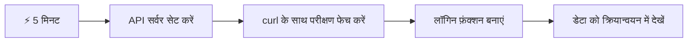
- **मिनट 1-2**: अपनी API सर्वर शुरू करें (`cd api && npm start`) और कनेक्शन का परीक्षण करें
- **मिनट 3**: fetch का उपयोग करके एक बुनियादी `getAccount()` फ़ंक्शन बनाएं
- **मिनट 4**: `action="javascript:login()"` के साथ लॉगिन फॉर्म को कनेक्ट करें
- **मिनट 5**: लॉगिन का परीक्षण करें और कंसोल में खाते का डेटा देखें

**त्वरित परीक्षण कमांड्स**:  
```bash
# API चल रहा है या नहीं यह सत्यापित करें
curl http://localhost:5000/api

# परीक्षण खाता डेटा प्राप्त करें
curl http://localhost:5000/api/accounts/test
```
  
**यह क्यों महत्वपूर्ण है**: 5 मिनट में, आप देखेंगे कि असिंक्रोनस डेटा प्राप्ति की जादूगरी जो हर आधुनिक वेब एप्लिकेशन को शक्ति देती है। यही आधार है जो ऐप्स को उत्तरदायी और जीवंत महसूस कराता है।

## 🗺️ डेटा-संचालित वेब एप्लिकेशन के माध्यम से आपकी सीख यात्रा

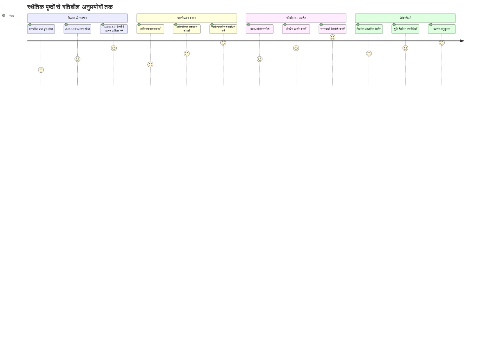
**आपका यात्रा गंतव्य**: इस पाठ के अंत तक, आप समझ जाएंगे कि आधुनिक वेब एप्लिकेशन डेटा को कैसे प्राप्त करते हैं, प्रक्रिया करते हैं, और गतिशील रूप से प्रदर्शित करते हैं, जो पेशेवर अनुप्रयोगों से अपेक्षित सहज उपयोगकर्ता अनुभव बनाते हैं।

## प्राक्कथन प्रश्नोत्तरी

[प्राक्कथन प्रश्नोत्तरी](https://ff-quizzes.netlify.app/web/quiz/45)

### पूर्वापेक्षाएँ

डेटा प्राप्त करने में गोता लगाने से पहले, सुनिश्चित करें कि आपके पास ये घटक तैयार हैं:

- **पिछला पाठ**: [लॉगिन और पंजीकरण फॉर्म](../2-forms/README.md) पूरा करें - हम इस आधार पर निर्माण करेंगे  
- **स्थानीय सर्वर**: [Node.js](https://nodejs.org) इंस्टॉल करें और [सर्वर API चलाएं](../api/README.md) जिससे खाता डेटा मिले  
- **API कनेक्शन**: इस कमांड से अपने सर्वर कनेक्शन का परीक्षण करें:  

```bash
curl http://localhost:5000/api
# अपेक्षित प्रतिक्रिया: "बैंक एपीआई v1.0.0"
```
  
यह त्वरित परीक्षण सुनिश्चित करता है कि सभी घटक सही ढंग से संवाद कर रहे हैं:  
- यह सत्यापित करता है कि Node.js आपके सिस्टम पर सही से चल रहा है  
- पुष्टि करता है कि आपका API सर्वर सक्रिय है और प्रतिक्रिया दे रहा है  
- यह सुनिश्चित करता है कि आपका ऐप सर्वर तक पहुंच सकता है (जैसे मिशन से पहले रेडियो संपर्क की जांच करना)  

## 🧠 डेटा प्रबंधन पर्यावरण अवलोकन

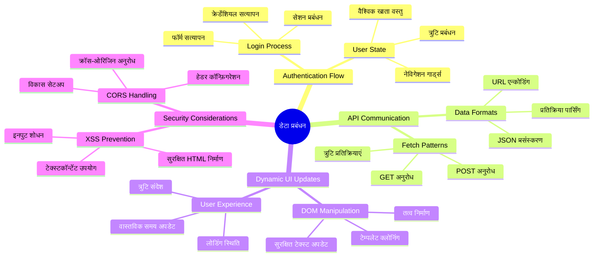
**मूल सिद्धांत**: आधुनिक वेब एप्लिकेशन डेटा संगठन प्रणालियाँ हैं - वे उपयोगकर्ता इंटरफेस, सर्वर API और ब्राउज़र सुरक्षा मॉडल के बीच समन्वय करती हैं ताकि सहज और उत्तरदायी अनुभव बन सके।

---

## आधुनिक वेब ऐप्स में डेटा प्राप्ति को समझना

पिछले दो दशकों में वेब एप्लिकेशन डेटा को संभालने के तरीके में भारी बदलाव आया है। इस विकास को समझना आपको यह सजीव रूप से दिखाएगा कि क्यों AJAX और Fetch API जैसे आधुनिक तकनीकें इतनी शक्तिशाली हैं और क्यों ये वेब डेवलपर्स के लिए आवश्यक उपकरण बन गई हैं।

आइए देखें कि पारंपरिक वेबसाइटें कैसे काम करती थीं बनाम आज जो गतिशील, उत्तरदायी एप्लिकेशन हम बनाते हैं।

### पारंपरिक बहु-पृष्ठ एप्लिकेशन (MPA)

वेब के शुरूआती दिनों में, हर क्लिक पुराने टेलीविजन पर चैनल बदलने की तरह था - स्क्रीन खाली हो जाती थी, फिर धीरे-धीरे नए कंटेंट के लिए ट्यून होती थी। यह शुरुआती वेब एप्लिकेशन की हकीकत थी, जहां हर इंटरैक्शन का मतलब था पूरे पेज को खरोंच से फिर से बनाना।

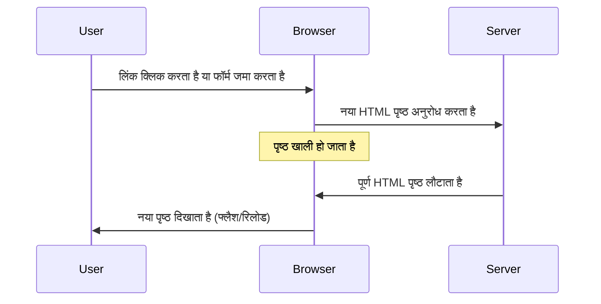


**यह तरीका क्यों बोझिल लगता था:**  
- हर क्लिक का मतलब था पूरा पेज फिर से बनाना  
- उपयोगकर्ताओं को बीच में उनके विचार के दौरान उन परेशान करने वाले पेज ब्लिंक से रोकना मुश्किल था  
- आपका इंटरनेट कनेक्शन बार-बार समान हेडर और फुटर डाउनलोड करने में व्यस्त रहता था  
- ऐप्स सॉफ़्टवेयर के बजाय एक फ़ाइलिंग कैबिनेट पार करने जैसा महसूस होते थे  

### आधुनिक एक-पृष्ठ एप्लिकेशन (SPA)

AJAX (Asynchronous JavaScript and XML) ने इस दृष्टिकोण को पूरी तरह बदल दिया। अंतरराष्ट्रीय अंतरिक्ष स्टेशन के माड्यूलर डिजाइन की तरह, जहां अंतरिक्ष यात्री पूरे ढांचे को फिर से बनाए बिना व्यक्तिगत घटकों को बदल सकते हैं, AJAX हमें एक वेबपेज के विशिष्ट हिस्सों को बिना सब कुछ पुनः लोड किए अपडेट करने देता है। नाम में XML का उल्लेख होने के बावजूद, हम आज ज्यादातर JSON का उपयोग करते हैं, लेकिन मूल सिद्धांत वही रहता है: केवल जो बदलना है उसे अपडेट करें।

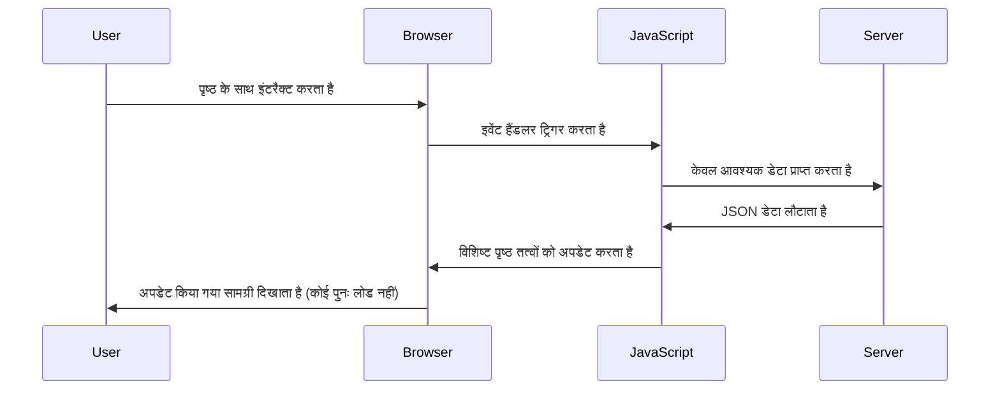


**SPAs क्यों बेहतर महसूस होते हैं:**  
- केवल वही भाग अपडेट होते हैं जो वास्तव में परिवर्तित हुए हैं (चतुर, है ना?)  
- कोई अचानक रुकावट नहीं - उपयोगकर्ता अपने प्रवाह में बने रहते हैं  
- कम डेटा ट्रैवलिंग का मतलब तेज़ लोडिंग  
- सब कुछ तेज़ और उत्तरदायी महसूस होता है, जैसे आपके फोन के ऐप्स  

### आधुनिक Fetch API की विकास यात्रा

आधुनिक ब्राउज़र [`Fetch` API](https://developer.mozilla.org/docs/Web/API/Fetch_API) प्रदान करते हैं, जो पुराने [`XMLHttpRequest`](https://developer.mozilla.org/docs/Web/API/XMLHttpRequest/Using_XMLHttpRequest) को बदलता है। टेलीग्राफ और ईमेल के बीच के अंतर की तरह, Fetch API promises का उपयोग करता है जो असिंक्रोनस कोड को साफ़ बनाता है और JSON को स्वाभाविक रूप से संभालता है।

| विशेषता | XMLHttpRequest | Fetch API |
|---------|----------------|----------|
| **सिंटैक्स** | जटिल कॉलबैक आधारित | साफ़ प्रॉमिस-आधारित |
| **JSON हैंडलिंग** | मैनुअल पार्सिंग आवश्यक | बिल्ट-इन `.json()` मेथड |
| **त्रुटि प्रबंधन** | सीमित त्रुटि जानकारी | व्यापक त्रुटि विवरण |
| **आधुनिक समर्थन** | पुरानी संगतता | ES6+ प्रॉमिस और async/await |

> 💡 **ब्राउज़र संगतता**: अच्छी खबर - Fetch API सभी आधुनिक ब्राउज़रों में काम करता है! यदि आप विशिष्ट संस्करणों के बारे में जिज्ञासु हैं, तो [caniuse.com](https://caniuse.com/fetch) पर पूरी संगतता रिपोर्ट देखें।  
>  
**निचोड़:**  
- क्रोम, फ़ायरफ़ॉक्स, सफारी, और एज में बेहतरीन काम करता है (जहां भी आपके उपयोगकर्ता हैं)  
- केवल इंटरनेट एक्सप्लोरर को अतिरिक्त सहायता की ज़रूरत होती है (और सच कहें तो, IE को अब छोड़ देने का समय है)  
- बाद में हम जिन सुरुचिपूर्ण async/await पैटर्न का उपयोग करेंगे उसके लिए पूरी तरह तैयार करता है  

### उपयोगकर्ता लॉगिन और डेटा पुनर्प्राप्ति लागू करना

अब हम लॉगिन सिस्टम लागू करेंगे जो आपके बैंकिंग ऐप को स्थिर प्रदर्शन से एक कार्यात्मक एप्लिकेशन में बदल देगा। जैसे सैन्य सुविधाओं में उपयोग किए जाने वाले प्रमाणीकरण प्रोटोकॉल, हम उपयोगकर्ता प्रमाणपत्रों की जांच करेंगे और फिर उनकी विशिष्ट जानकारी प्रदान करेंगे।

हम इसे क्रमिक रूप से बनाएंगे, पहले बुनियादी प्रमाणीकरण से शुरू करके, फिर डेटा-प्राप्ति क्षमताओं को जोड़ेंगे।

#### चरण 1: लॉगिन फ़ंक्शन की आधारशिला बनाना

अपने `app.js` फ़ाइल को खोलें और एक नया `login` फ़ंक्शन जोड़ें। यह उपयोगकर्ता प्रमाणीकरण प्रक्रिया को संभालेगा:

```javascript
async function login() {
  const loginForm = document.getElementById('loginForm');
  const user = loginForm.user.value;
}
```
  
**इसे समझते हैं:**  
- `async` कीवर्ड? यह JavaScript को बता रहा है "अरे, इस फ़ंक्शन को इंतजार करना पड़ सकता है"  
- हम पेज से अपनी फॉर्म पकड़ रहे हैं (कुछ खास नहीं, बस ID से खोज रहे हैं)  
- फिर हम उपयोगकर्ता द्वारा दर्ज किया गया उपयोगकर्ता नाम निकाल रहे हैं  
- एक कमाल की बात: आप फॉर्म के किसी भी इनपुट को उसके `name` एट्रिब्यूट से एक्सेस कर सकते हैं - कोई अतिरिक्त getElementById कॉल की जरूरत नहीं!

> 💡 **फॉर्म एक्सेस पैटर्न**: हर फॉर्म कंट्रोल को उसके नाम (`name` एट्रिब्यूट के जरिए HTML में सेट किया गया) से फॉर्म एलिमेंट की प्रॉपर्टी के रूप में एक्सेस किया जा सकता है। यह एक साफ़ और पढ़ने योग्य तरीका प्रदान करता है फॉर्म डेटा प्राप्त करने के लिए।  

#### चरण 2: खाता डेटा प्राप्ति फ़ंक्शन बनाएं

अगला, हम एक समर्पित फ़ंक्शन बनाएंगे जो सर्वर से खाता डेटा प्राप्त करता है। यह उसी पैटर्न का पालन करता है जैसा आपके पंजीकरण फ़ंक्शन में था लेकिन ध्यान डेटा प्राप्ति पर है:

```javascript
async function getAccount(user) {
  try {
    const response = await fetch('//localhost:5000/api/accounts/' + encodeURIComponent(user));
    return await response.json();
  } catch (error) {
    return { error: error.message || 'Unknown error' };
  }
}
```
  
**यह कोड क्या करता है:**  
- **आधुनिक** `fetch` API का उपयोग करता है ताकि डेटा असिंक्रोनस रूप से मांगा जा सके  
- उपयोगकर्ता नाम पैरामीटर के साथ GET अनुरोध URL बनाता है  
- URL में विशेष वर्णों को सुरक्षित रखने के लिए `encodeURIComponent()` लगाता है  
- प्रतिक्रिया को JSON फॉर्मेट में परिवर्तित करता है ताकि डेटा सरलता से संसाधित हो सके  
- त्रुटियों को सहजता से संभालता है और क्रैश होने की बजाय एक त्रुटि ऑब्जेक्ट लौटाता है  

> ⚠️ **सुरक्षा नोट**: `encodeURIComponent()` फ़ंक्शन URL में विशेष वर्णों को संभालता है। जैसे नौसेना संचार में एन्कोडिंग सिस्टम यह सुनिश्चित करता है कि आपका संदेश बिल्कुल सही रूप में पहुंचे, वैसे ही यह "#" या "&" जैसे अक्षरों के गलत अर्थ को रोके।  
>  
**यह क्यों महत्वपूर्ण है:**  
- विशेष वर्णों से URL टूटने से रोकता है  
- URL हेरफेर हमलों से सुरक्षा करता है  
- यह सुनिश्चित करता है कि आपका सर्वर सही डेटा प्राप्त करे  
- सुरक्षित कोडिंग प्रथाओं का पालन करता है  

#### HTTP GET अनुरोध को समझना

यह जानकर आश्चर्य हो सकता है: जब आप `fetch` का उपयोग बिना किसी अतिरिक्त विकल्प के करते हैं, तो यह स्वतः ही [`GET`](https://developer.mozilla.org/docs/Web/HTTP/Methods/GET) अनुरोध बनाता है। यह हमारे लिए बिल्कुल उपयुक्त है - सर्वर से पूछना "अरे, क्या मैं इस उपयोगकर्ता का खाता डेटा देख सकता हूँ?"

GET अनुरोध को ऐसे सोचिए जैसे आप पुस्तकालय से आधिकारिक तौर पर एक पुस्तक उधार मांग रहे हैं - आप कुछ ऐसा देखना चाहते हैं जो पहले से मौजूद है। POST अनुरोध (जो हमने पंजीकरण के लिए उपयोग किया) नए डेटा को संग्रह में जमा करने जैसा है।

| GET अनुरोध | POST अनुरोध |
|-------------|-------------|
| **उद्देश्य** | मौजूदा डेटा पुनः प्राप्त करना | सर्वर को नया डेटा भेजना |
| **पैरामीटर** | URL पथ/क्वेरी स्ट्रिंग में | अनुरोध बॉडी में |
| **कैशिंग** | ब्राउज़रों द्वारा कैश किया जा सकता है | आमतौर पर कैश नहीं किया जाता |
| **सुरक्षा** | URL/लॉग में दिखाई देता है | अनुरोध बॉडी में छुपा होता है |

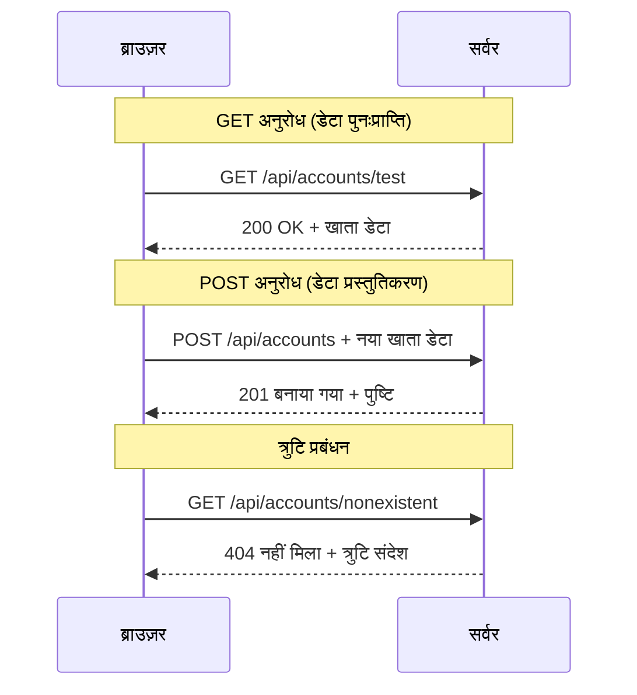
#### चरण 3: सब कुछ जोड़ना

अब सबसे मज़ेदार हिस्सा - आपके खाता प्राप्ति फ़ंक्शन को लॉगिन प्रक्रिया से जोड़ते हैं। यहां सब कुछ अपने स्थान पर फिट होता है:

```javascript
async function login() {
  const loginForm = document.getElementById('loginForm');
  const user = loginForm.user.value;
  const data = await getAccount(user);

  if (data.error) {
    return console.log('loginError', data.error);
  }

  account = data;
  navigate('/dashboard');
}
```
  
यह फ़ंक्शन स्पष्ट अनुक्रम का पालन करता है:  
- फ़ॉर्म इनपुट से उपयोगकर्ता नाम निकालता है  
- सर्वर से उपयोगकर्ता का खाता डेटा प्राप्त करता है  
- होने वाली किसी भी त्रुटि को संभालता है  
- सफलता पर खाता डेटा संग्रहीत करता है और डैशबोर्ड पर जाता है  

> 🎯 **Async/Await पैटर्न**: चूंकि `getAccount` एक असिंक्रोनस फ़ंक्शन है, हम `await` कीवर्ड का उपयोग करते हैं ताकि सर्वर के जवाब तक निष्पादन रुके रहे। यह कोड को अनिर्धारित डेटा के साथ आगे बढ़ने से रोकता है।  

#### चरण 4: डेटा के लिए एक होम बनाएं

जब आपका ऐप खाता जानकारी लोड कर ले, तो उसे कहीं याद रखने की जरूरत है। इसे आपके ऐप की शॉर्ट-टर्म मेमोरी समझें - वर्तमान उपयोगकर्ता का डेटा रखने की जगह। इसे अपने `app.js` की शीर्ष पर इस पंक्ति से जोड़ें:

```javascript
// यह वर्तमान उपयोगकर्ता के खाते का डेटा रखता है
let account = null;
```
  
**हमें इसकी आवश्यकता क्यों है:**  
- खाता डेटा आपके ऐप में कहीं से भी पहुंच योग्य रखें  
- `null` से शुरू करना मतलब "अभी तक कोई लॉग इन नहीं हुआ"  
- जब कोई सफलतापूर्वक लॉगिन या पंजीकरण करे तो अपडेट हो जाता है  
- यह सचाई का एकमात्र स्रोत के रूप में काम करता है—किसने लॉग इन किया है, इसमें कोई भ्रम नहीं  

#### चरण 5: अपने फॉर्म को कनेक्ट करें

अब अपने बेहतरीन नए लॉगिन फ़ंक्शन को HTML फॉर्म से जोड़ें। अपने फॉर्म टैग को इस तरह अपडेट करें:

```html
<form id="loginForm" action="javascript:login()">
  <!-- Your existing form inputs -->
</form>
```
  
**यह छोटा बदलाव क्या करता है:**  
- फॉर्म को अपना डिफ़ॉल्ट "पूरा पेज रीफ्रेश" व्यवहार रोक देता है  
- आपकी कस्टम JavaScript फ़ंक्शन को कॉल करता है  
- सब कुछ चिकना और एक-पन्ने के ऐप जैसा बनाता है  
- उपयोगकर्ता "लॉगिन" दबाने पर क्या होता है, उस पर आपकी पूर्ण नियंत्रण देता है  

#### चरण 6: अपने पंजीकरण फ़ंक्शन को बेहतर करें

समानता के लिए, अपने `register` फ़ंक्शन को भी अपडेट करें ताकि यह खाता डेटा संग्रहीत करे और डैशबोर्ड पर जाए:

```javascript
// अपने रजिस्टर फ़ंक्शन के अंत में ये लाइनें जोड़ें
account = result;
navigate('/dashboard');
```
  
**यह सुधार प्रदान करता है:**  
- पंजीकरण से डैशबोर्ड तक **सहज** संक्रमण  
- लॉगिन और पंजीकरण प्रवाहों के बीच **लगातार** उपयोगकर्ता अनुभव  
- सफल पंजीकरण के तुरंत बाद खाता डेटा तक **तत्काल** पहुँच  

#### अपने कार्यान्वयन का परीक्षण करें

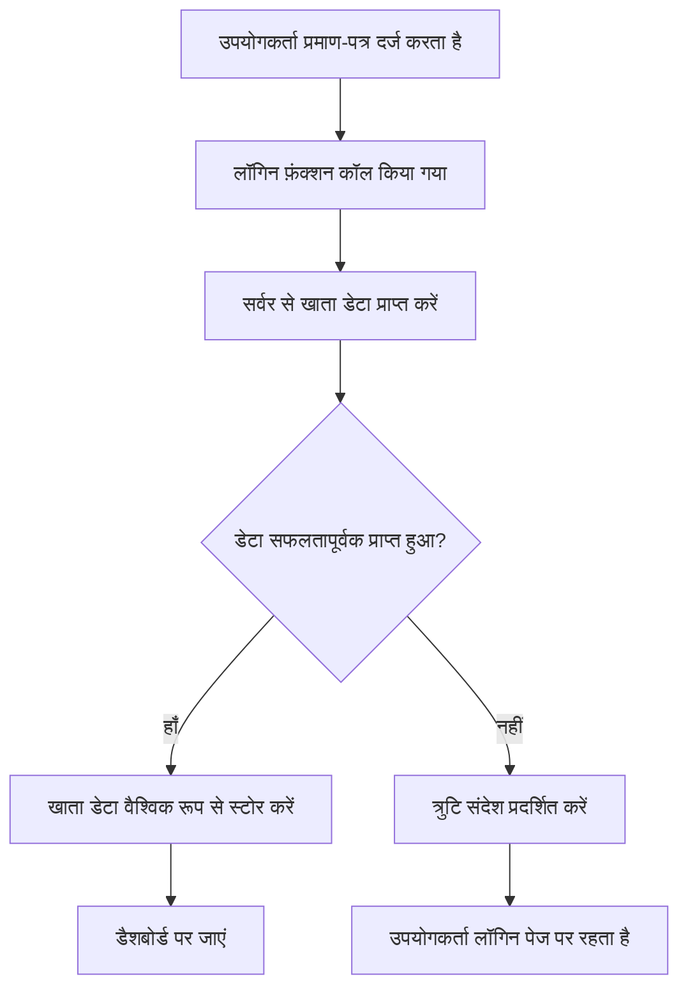
**इसे आज़माएं:**  
1. नया खाता बनाएं ताकि सब कुछ काम कर रहा हो  
2. उन ही क्रेडेंशियल्स से लॉगिन करने की कोशिश करें  
3. यदि कुछ गलत लगे तो अपने ब्राउज़र का कंसोल (F12) देखें  
4. सफल लॉगिन के बाद सुनिश्चित करें कि आप डैशबोर्ड पर पहुंचते हैं  

यदि कुछ काम नहीं कर रहा, तो घबराएं नहीं! ज्यादातर समस्याएं टाइपो या API सर्वर शुरू करना भूल जाने जैसी सरल होती हैं।

#### क्रॉस-ऑरिजन मैजिक के बारे में एक त्वरित शब्द

आप सोच रहे होंगे: "मेरा वेब ऐप इस API सर्वर से कैसे बात कर रहा है जबकि वे अलग-अलग पोर्ट पर चल रहे हैं?" बहुत अच्छा सवाल! यह वह है जो हर वेब डेवलपर अंततः सामना करता है।

> 🔒 **क्रॉस-ऑरिजन सुरक्षा**: ब्राउज़र "समान मूल नीति" लागू करते हैं ताकि अलग-अलग डोमेन के बीच अनधिकृत संचार को रोका जा सके। पेंटागन के चेकपॉइंट सिस्टम की तरह, वे डेटा स्थानांतरण की अनुमति देने से पहले संचार को सत्यापित करते हैं।  
>  
**हमारे सेटअप में:**  
- आपका वेब ऐप `localhost:3000` (डेवलपमेंट सर्वर) पर चलता है  
- आपका API सर्वर `localhost:5000` (बैकएंड सर्वर) पर चलता है  
- API सर्वर में [CORS हेडर](https://developer.mozilla.org/docs/Web/HTTP/CORS) शामिल हैं जो स्पष्ट रूप से आपके वेब ऐप से संचार को अधिकृत करते हैं  

यह विन्यास वास्तविक दुनिया के विकास का प्रतिबिंब है जहां फ्रंटएंड और बैकएंड एप्लिकेशन आम तौर पर अलग-अलग सर्वरों पर चलते हैं।

> 📚 **और जानें**: API और डेटा प्राप्ति के बारे में इस व्यापक [Microsoft Learn मॉड्यूल पर और अधिक जानें](https://docs.microsoft.com/learn/modules/use-apis-discover-museum-art/?WT.mc_id=academic-77807-sagibbon)।  

## HTML में अपने डेटा को जीवन देना

अब हम प्राप्त डेटा को DOM हेरफेर के माध्यम से उपयोगकर्ताओं के सामने दिखाएंगे। फोटोग्राफ के डेवलपमेंट की प्रक्रिया की तरह, हम अदृश्य डेटा को ऐसा कुछ बनाते हैं जिसे उपयोगकर्ता देख और उसके साथ इंटरैक्ट कर सकें।
DOM मैनिक्युलेशन वह तकनीक है जो स्थिर वेब पेजों को गतिशील अनुप्रयोगों में बदल देती है जो उपयोगकर्ता के इंटरैक्शन और सर्वर प्रतिक्रियाओं के आधार पर अपनी सामग्री अपडेट करते हैं।

### काम के लिए सही उपकरण चुनना

जब अपने HTML को JavaScript से अपडेट करने की बात आती है, तो आपके पास कई विकल्प होते हैं। इन्हें एक टूलबॉक्स में अलग-अलग उपकरणों की तरह सोचें - हर एक विशिष्ट कामों के लिए उपयुक्त:

| विधि | यह किसके लिए बढ़िया है | इसे कब उपयोग करें | सुरक्षा स्तर |
|--------|---------------------|----------------|--------------|
| `textContent` | सुरक्षित रूप से उपयोगकर्ता डेटा दिखाना | जब भी आप टेक्स्ट दिखा रहे हों | ✅ बेहद मजबूत |
| `createElement()` + `append()` | जटिल लेआउट बनाना | नए सेक्शन/सूची बनाने के लिए | ✅ पूरी तरह सुरक्षित |
| `innerHTML` | HTML सामग्री सेट करना | ⚠️ इसे बचाने की कोशिश करें | ❌ जोखिम भरा |

#### टेक्स्ट दिखाने का सुरक्षित तरीका: textContent

[`textContent`](https://developer.mozilla.org/docs/Web/API/Node/textContent) प्रॉपर्टी उपयोगकर्ता डेटा दिखाने में आपकी सबसे अच्छी दोस्त है। यह आपके वेबपेज के लिए एक सुरक्षा गार्ड की तरह है - कोई हानिकारक चीज़ अंदर नहीं आता:

```javascript
// सुरक्षित, विश्वसनीय तरीका टेक्स्ट अपडेट करने का
const balanceElement = document.getElementById('balance');
balanceElement.textContent = account.balance;
```

**textContent के लाभ:**
- सब कुछ साधारण टेक्स्ट के रूप में मानता है (स्क्रिप्ट निष्पादन रोकता है)
- मौजूदा सामग्री को स्वचालित रूप से साफ करता है
- सरल टेक्स्ट अपडेट के लिए कुशल है
- दुर्भावनापूर्ण सामग्री के खिलाफ अंतर्निहित सुरक्षा प्रदान करता है

#### गतिशील HTML तत्व बनाना

अधिक जटिल सामग्री के लिए, [`document.createElement()`](https://developer.mozilla.org/docs/Web/API/Document/createElement) को [`append()`](https://developer.mozilla.org/docs/Web/API/ParentNode/append) विधि के साथ मिलाएं:

```javascript
// नए तत्व बनाने का सुरक्षित तरीका
const transactionItem = document.createElement('div');
transactionItem.className = 'transaction-item';
transactionItem.textContent = `${transaction.date}: ${transaction.description}`;
container.append(transactionItem);
```

**इस दृष्टिकोण को समझना:**
- प्रोग्रामेटिक रूप से नए DOM तत्व बनाता है
- तत्व के गुणों और सामग्री पर पूर्ण नियंत्रण बनाए रखता है
- जटिल, नेस्टेड तत्व संरचनाएँ संभव बनाता है
- संरचना और सामग्री को अलग करके सुरक्षा बनाए रखता है

> ⚠️ **सुरक्षा विचार**: हालांकि [`innerHTML`](https://developer.mozilla.org/docs/Web/API/Element/innerHTML) कई ट्यूटोरियल में दिखाया जाता है, यह एम्बेडेड स्क्रिप्ट्स को निष्पादित कर सकता है। जैसे CERN की सुरक्षा प्रक्रियाएं अनधिकृत कोड निष्पादन रोकती हैं, `textContent` और `createElement` का उपयोग सुरक्षित विकल्प प्रदान करता है।
> 
**innerHTML के जोखिम:**
- उपयोगकर्ता डेटा में किसी भी `<script>` टैग को निष्पादित करता है
- कोड इंजेक्शन हमलों के लिए संवेदनशील
- संभावित सुरक्षा कमजोरियां पैदा करता है
- हम जो सुरक्षित विकल्प उपयोग कर रहे हैं वे समान कार्यक्षमता प्रदान करते हैं

### त्रुटियों को उपयोगकर्ता के अनुकूल बनाना

वर्तमान में, लॉगिन त्रुटियां केवल ब्राउज़र कंसोल में दिखाई देती हैं, जो उपयोगकर्ताओं के लिए अदृश्य है। पायलट के आंतरिक निदान और यात्रियों की सूचना प्रणाली के बीच के अंतर की तरह, हमें महत्वपूर्ण जानकारी उचित माध्यम से कम्युनिकेट करनी चाहिए।

दृश्यमान त्रुटि संदेश उपयोगकर्ताओं को तुरंत प्रतिक्रिया देते हैं कि क्या गलत हुआ और आगे कैसे बढ़ना है।

#### चरण 1: त्रुटि संदेशों के लिए स्थान जोड़ें

सबसे पहले, आइए आपके HTML में त्रुटि संदेशों के लिए एक जगह रखें। इसे लॉगिन बटन के ठीक पहले जोड़ें ताकि उपयोगकर्ता इसे स्वाभाविक रूप से देख सकें:

```html
<!-- This is where error messages will appear -->
<div id="loginError" role="alert"></div>
<button>Login</button>
```

**यहां क्या हो रहा है:**
- हम एक खाली कंटेनर बना रहे हैं जो आवश्यक होने तक अदृश्य रहता है
- इसे उस जगह रखा गया है जहां उपयोगकर्ता "लॉगिन" क्लिक करने के बाद स्वाभाविक रूप से देखते हैं
- `role="alert"` स्क्रीन रीडर्स के लिए एक उपयोगी सुविधा है - यह सहायक तकनीक को बताता है "अरे, यह महत्वपूर्ण है!"
- अद्वितीय `id` हमारे JavaScript को एक आसान लक्ष्य प्रदान करता है

#### चरण 2: एक सहायक फ़ंक्शन बनाएं

एक छोटी यूटिलिटी फ़ंक्शन बनाएं जो किसी भी एलिमेंट के टेक्स्ट को अपडेट कर सके। यह "एक बार लिखो, हर जगह उपयोग करो" वाला फ़ंक्शन है जो आपका समय बचाएगा:

```javascript
function updateElement(id, text) {
  const element = document.getElementById(id);
  element.textContent = text;
}
```

**फ़ंक्शन के लाभ:**
- केवल एक एलिमेंट ID और टेक्स्ट सामग्री की जरूरत होती है
- DOM एलिमेंट्स का सुरक्षित पता लगाता और अपडेट करता है
- पुन: उपयोग योग्य पैटर्न, कोड डुप्लिकेशन घटाता है
- एप्लिकेशन भर अपडेटिंग व्यवहार को सुसंगत रखता है

#### चरण 3: त्रुटियों को उपयोगकर्ता की नजरों के सामने दिखाएं

अब छुपे हुए कंसोल संदेश को ऐसी चीज़ से बदलें जिसे उपयोगकर्ता वास्तव में देख सके। अपनी लॉगिन फंक्शन को अपडेट करें:

```javascript
// केवल कंसोल में लॉग करने के बजाय, उपयोगकर्ता को दिखाएं कि क्या गलत है
if (data.error) {
  return updateElement('loginError', data.error);
}
```

**यह छोटा परिवर्तन बड़ा फर्क लाता है:**
- त्रुटि संदेश ठीक वहां दिखाई देते हैं जहां उपयोगकर्ता देख रहे हैं
- अब कोई रहस्यमय चुपचाप विफलता नहीं होती
- उपयोगकर्ताओं को तुरंत, क्रियाशील प्रतिक्रिया मिलती है
- आपका ऐप पेशेवर और विचारशील महसूस होने लगता है

अब जब आप अमान्य अकाउंट से परीक्षण करेंगे, तो आप पेज पर एक सहायक त्रुटि संदेश देखेंगे!


#### चरण 4: पहुँच के लिए समावेशी होना

जो `role="alert"` हमने पहले जोड़ा था, उसमें एक बढ़िया बात यह है कि यह केवल सजावट नहीं है! यह छोटा गुण एक [लाइव रीजन](https://developer.mozilla.org/docs/Web/Accessibility/ARIA/ARIA_Live_Regions) बनाता है जो स्क्रीन रीडर्स को तुरंत परिवर्तनों की घोषणा करता है:

```html
<div id="loginError" role="alert"></div>
```

**यह क्यों महत्वपूर्ण है:**
- स्क्रीन रीडर उपयोगकर्ता त्रुटि संदेश जैसे ही दिखाई दे, सुन पाते हैं
- सभी लोगों को समान महत्वपूर्ण जानकारी मिलती है, चाहे वे कैसे नेविगेट करें
- यह आपका ऐप अधिक लोगों के लिए काम करने का एक सरल तरीका है
- यह दिखाता है कि आप समावेशी अनुभव बनाने की परवाह करते हैं

ऐसे छोटे स्पर्श अच्छे डेवलपर्स को महान नहीं बनाते हैं!

### 🎯 शैक्षिक जाँच: प्रमाणीकरण पैटर्न

**रोककर सोचें**: आपने एक पूरा प्रमाणीकरण फ़्लो अभी लागू किया है। यह वेब विकास में एक बुनियादी पैटर्न है।

**त्वरित आत्म-मूल्यांकन**:
- क्या आप समझा सकते हैं कि हम API कॉल के लिए async/await क्यों उपयोग करते हैं?
- अगर हम `encodeURIComponent()` भूल गए तो क्या होगा?
- हमारी त्रुटि हैंडलिंग उपयोगकर्ता अनुभव को कैसे सुधारती है?

**वास्तविक दुनिया का संबंध**: आपने जो पैटर्न यहाँ सीखे हैं (async डेटा fetching, त्रुटि हैंडलिंग, उपयोगकर्ता प्रतिक्रिया) वे हर प्रमुख वेब एप्लिकेशन में उपयोग होते हैं - सोशल मीडिया प्लेटफ़ॉर्म से लेकर ई-कॉमर्स साइट्स तक। आप उत्पादन स्तर के कौशल विकसित कर रहे हैं!

**चुनौती प्रश्न**: आप इस प्रमाणीकरण सिस्टम को कई उपयोगकर्ता भूमिकाओं (ग्राहक, प्रशासक, टेलर) को हैंडल करने के लिए कैसे बदलेंगे? डेटा संरचना और UI परिवर्तनों के बारे में सोचें।

#### चरण 5: पंजीकरण के लिए समान पैटर्न लागू करें

सुसंगतता बनाए रखने के लिए, अपने पंजीकरण फ़ॉर्म में समान त्रुटि हैंडलिंग लागू करें:

1. अपने पंजीकरण HTML में एक त्रुटि डिस्प्ले एलिमेंट जोड़ें:
```html
<div id="registerError" role="alert"></div>
```

2. अपनी रजिस्टर फंक्शन को उसी त्रुटि डिस्प्ले पैटर्न का उपयोग करने के लिए अपडेट करें:
```javascript
if (data.error) {
  return updateElement('registerError', data.error);
}
```

**सुसंगत त्रुटि हैंडलिंग के लाभ:**
- सभी फॉर्म्स में समान उपयोगकर्ता अनुभव प्रदान करता है
- परिचित पैटर्न का उपयोग करके संज्ञानात्मक बोझ कम करता है
- पुन: उपयोग योग्य कोड से रखरखाव को सरल बनाता है
- पूरे ऐप में पहुंच मानकों को सुनिश्चित करता है

## अपना गतिशील डैशबोर्ड बनाना

अब हम आपके स्थिर डैशबोर्ड को एक गतिशील इंटरफ़ेस में बदलेंगे जो वास्तविक खाता डेटा दिखाता है। जैसे मुद्रित उड़ान कार्यक्रम और हवाई अड्डों के लाइव प्रस्थान बोर्ड के बीच का अंतर होता है, हम स्थिर सूचनाओं से वास्तविक समय, प्रतिक्रियाशील डिस्प्ले की ओर बढ़ रहे हैं।

जो DOM मैनिक्युलेशन तकनीक आपने सीखी हैं, उनका उपयोग करते हुए हम एक ऐसा डैशबोर्ड बनाएंगे जो वर्तमान खाता जानकारी के साथ स्वतः अपडेट होता है।

### अपने डेटा को जानना

बिल्डिंग शुरू करने से पहले, आइए देखें कि आपका सर्वर किस प्रकार का डेटा वापस भेजता है। जब कोई सफलतापूर्वक लॉगिन करता है, तो आपको जिन खजाने जैसे सूचनाएं मिलती हैं, वे इस प्रकार हैं:

```json
{
  "user": "test",
  "currency": "$",
  "description": "Test account",
  "balance": 75,
  "transactions": [
    { "id": "1", "date": "2020-10-01", "object": "Pocket money", "amount": 50 },
    { "id": "2", "date": "2020-10-03", "object": "Book", "amount": -10 },
    { "id": "3", "date": "2020-10-04", "object": "Sandwich", "amount": -5 }
  ]
}
```

**यह डेटा संरचना प्रदान करती है:**
- **`user`**: अनुभव को व्यक्तिगत बनाने के लिए उपयुक्त ("स्वागत है, सारा!")
- **`currency`**: सुनिश्चित करता है कि हम पैसा सही ढंग से दिखाएं
- **`description`**: खाता का एक दोस्ताना नाम
- **`balance`**: अत्यंत महत्वपूर्ण वर्तमान बैलेंस
- **`transactions`**: सभी विवरणों के साथ पूरी लेनदेन इतिहास

आपको एक पेशेवर दिखने वाला बैंकिंग डैशबोर्ड बनाने के लिए सब कुछ!

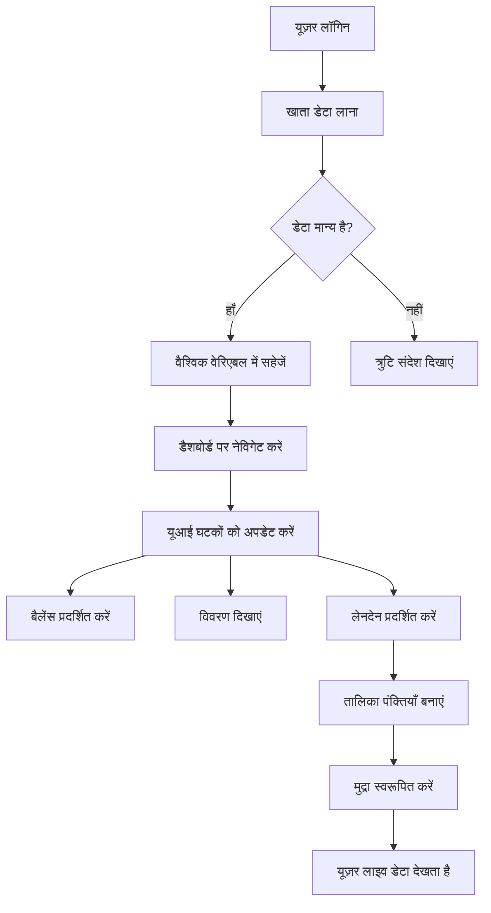
> 💡 **प्रो टिप**: क्या आप अपने डैशबोर्ड को तुरंत क्रियान्वित देखना चाहते हैं? लॉगिन करते समय `test` उपयोगकर्ता नाम का उपयोग करें - यह पहले से नमूना डेटा के साथ पूर्व-लोडेड आता है ताकि आप बिना लेनदेन बनाए सब कुछ काम करते हुए देख सकें।
> 
**टेस्ट अकाउंट उपयोगी क्यों है:**
- वास्तविक नमूना डेटा के साथ आता है
- लेनदेन प्रदर्शन का परीक्षण करने के लिए उपयुक्त
- आपके डैशबोर्ड फीचर्स को जांचने के लिए बेहतरीन
- मैन्युअली नकली डेटा बनाने की जरूरत नहीं पड़ती

### डैशबोर्ड डिस्प्ले एलिमेंट्स बनाना

आइए आपके डैशबोर्ड इंटरफ़ेस को चरण दर चरण बनाएं, सबसे पहले खाता सारांश जानकारी के साथ और फिर जटिल फीचर्स जैसे लेनदेन सूचियाँ जोड़ें।

#### चरण 1: अपने HTML स्ट्रक्चर को अपडेट करें

सबसे पहले, स्थिर "बैलेंस" सेक्शन को गतिशील प्लेसहोल्डर एलिमेंट्स से बदलें जिन्हें आपकी JavaScript भर सके:

```html
<section>
  Balance: <span id="balance"></span><span id="currency"></span>
</section>
```

अगला, खाता विवरण के लिए एक सेक्शन जोड़ें। चूंकि यह डैशबोर्ड सामग्री का शीर्षक है, इसलिए सारगर्भित HTML का उपयोग करें:

```html
<h2 id="description"></h2>
```

**HTML स्ट्रक्चर को समझना:**
- बैलेंस और मुद्रा के लिए अलग-अलग `<span>` एलिमेंट्स का उपयोग करता है जिससे व्यक्तिगत नियंत्रण होता है
- JavaScript लक्ष्यीकरण के लिए प्रत्येक एलिमेंट को अद्वितीय ID देता है
- खाता विवरण के लिए `<h2>` का उपयोग करते हुए सारगर्भित HTML का पालन करता है
- स्क्रीन रीडर्स और SEO के लिए एक तार्किक पदानुक्रम बनाता है

> ✅ **पहुंच योग्यता अंतर्दृष्टि**: खाता विवरण डैशबोर्ड सामग्री का शीर्षक है, इसलिए इसे शीर्षक के रूप में मार्कअप किया गया है। और जानें कि [हेडिंग संरचना](https://www.nomensa.com/blog/2017/how-structure-headings-web-accessibility) पहुँच को कैसे प्रभावित करती है। क्या आप अपने पेज पर अन्य ऐसे तत्व पहचान सकते हैं जिन्हें हेडिंग टैग्स से लाभ हो सकता है?

#### चरण 2: डैशबोर्ड अपडेट फ़ंक्शन बनाएं

अब एक ऐसा फ़ंक्शन बनाएं जो आपके डैशबोर्ड को वास्तविक खाता डेटा से भरता हो:

```javascript
function updateDashboard() {
  if (!account) {
    return navigate('/login');
  }

  updateElement('description', account.description);
  updateElement('balance', account.balance.toFixed(2));
  updateElement('currency', account.currency);
}
```

**यह फ़ंक्शन चरण दर चरण क्या करता है:**
- पुष्टि करता है कि खाता डेटा मौजूद है
- प्रमाणीकरण विहीन उपयोगकर्ताओं को लॉगिन पेज पर पुनः निर्देशित करता है
- पुन: उपयोग योग्य `updateElement` फ़ंक्शन के साथ खाता विवरण अपडेट करता है
- बैलेंस को हमेशा दो दशमलव अंक दिखाने के लिए स्वरूपित करता है
- उचित मुद्रा प्रतीक प्रदर्शित करता है

> 💰 **मुद्रा स्वरूपण**: वह [`toFixed(2)`](https://developer.mozilla.org/docs/Web/JavaScript/Reference/Global_Objects/Number/toFixed) विधि एक जीवनदाता है! यह सुनिश्चित करता है कि आपका बैलेंस हमेशा वास्तविक पैसे की तरह दिखे - "75.00" बजाय सिर्फ "75" के। आपके उपयोगकर्ता परिचित मुद्रा स्वरूपण देखकर प्रसन्न होंगे।

#### चरण 3: सुनिश्चित करें कि आपका डैशबोर्ड अपडेट होता है

अपने डैशबोर्ड को हर बार वर्तमान डेटा के साथ ताज़ा करने के लिए, हमें आपके नेविगेशन सिस्टम में हुक करना होगा। यदि आपने [लेसन 1 असाइनमेंट](../1-template-route/assignment.md) पूरा किया है, तो यह परिचित लगेगा। अगर नहीं, तो चिंता न करें - यहाँ आवश्यक कोड है:

`updateRoute()` फ़ंक्शन के अंत में यह जोड़ें:

```javascript
if (typeof route.init === 'function') {
  route.init();
}
```

फिर अपने रूट्स को अपडेट करें ताकि डैशबोर्ड प्रारंभ हो सके:

```javascript
const routes = {
  '/login': { templateId: 'login' },
  '/dashboard': { templateId: 'dashboard', init: updateDashboard }
};
```

**यह स्मार्ट सेटअप क्या करता है:**
- जांचता है कि किसी रूट में विशेष प्रारंभिक कोड है या नहीं
- रूट लोड होते समय उस कोड को स्वचालित रूप से चलाता है
- आपके डैशबोर्ड को हमेशा ताजा, वर्तमान डेटा दिखाने को सुनिश्चित करता है
- आपके रूटिंग लॉजिक को साफ़ और व्यवस्थित रखता है

#### अपने डैशबोर्ड का परीक्षण करें

इन परिवर्तनों को लागू करने के बाद, अपने डैशबोर्ड का परीक्षण करें:

1. एक टेस्ट अकाउंट से लॉग इन करें
2. सुनिश्चित करें कि आपको डैशबोर्ड पर पुनः निर्देशित किया जा रहा है
3. खाता विवरण, बैलेंस और मुद्रा सही रूप में दिख रहे हैं
4. लॉग आउट करें और फिर से लॉगिन करें ताकि डेटा सही ढंग से ताज़ा हो

आपका डैशबोर्ड अब वास्तविक समय के उपयोगकर्ता डेटा के आधार पर गतिशील खाता जानकारी दिखाएगा!

## टेम्प्लेट्स के साथ स्मार्ट लेन-देन सूचियाँ बनाना

प्रत्येक लेनदेन के लिए मैन्युअल HTML बनाने की बजाय, हम टेम्प्लेट्स का उपयोग करेंगे जो स्वचालित रूप से सुसंगत स्वरूपण उत्पन्न करते हैं। जैसे अंतरिक्ष यान निर्माण में मानकीकृत घटक होते हैं, टेम्प्लेट हर ट्रांजैक्शन पंक्ति को समान संरचना और उपस्थिति सुनिश्चित करते हैं।

यह तकनीक कुछ लेनदेन से लेकर हजारों तक कुशलतापूर्वक स्केल करती है, लगातार प्रदर्शन और प्रस्तुति बनाए रखते हुए।

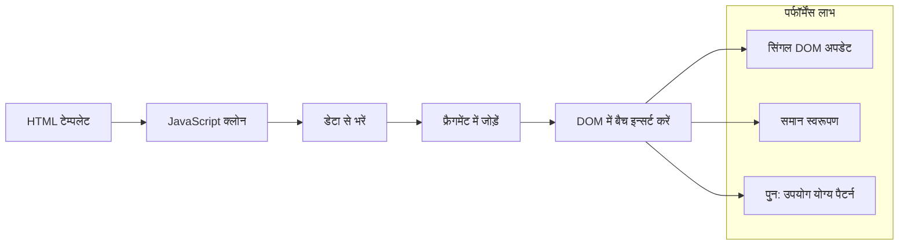
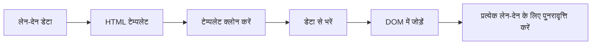
### चरण 1: ट्रांजैक्शन टेम्प्लेट बनाएं

सबसे पहले, अपने HTML `<body>` में ट्रांजैक्शन पंक्तियों के लिए एक पुन: उपयोग योग्य टेम्प्लेट जोड़ें:

```html
<template id="transaction">
  <tr>
    <td></td>
    <td></td>
    <td></td>
  </tr>
</template>
```

**HTML टेम्प्लेट को समझना:**
- एकल टेबल पंक्ति की संरचना परिभाषित करता है
- जावास्क्रिप्ट द्वारा क्लोन और भरने तक अदृश्य रहता है
- तारीख, विवरण और राशि के लिए तीन सेल शामिल हैं
- सुसंगत स्वरूपण के लिए पुन: उपयोग योग्य पैटर्न प्रदान करता है

### चरण 2: अपने टेबल को गतिशील सामग्री के लिए तैयार करें

फिर अपने टेबल बॉडी को एक `id` दें ताकि जावास्क्रिप्ट इसे आसानी से लक्षित कर सके:

```html
<tbody id="transactions"></tbody>
```

**यह क्या हासिल करता है:**
- लेनदेन पंक्तियों को सम्मिलित करने के लिए एक स्पष्ट लक्ष्य बनाता है
- टेबल संरचना को गतिशील सामग्री से अलग रखता है
- लेनदेन डेटा को साफ़ करने और पुनः भरने में सक्षम बनाता है

### चरण 3: ट्रांजैक्शन पंक्ति फैक्टरी फ़ंक्शन बनाएं

अब एक फ़ंक्शन बनाएं जो ट्रांजैक्शन डेटा को HTML तत्वों में बदलता है:

```javascript
function createTransactionRow(transaction) {
  const template = document.getElementById('transaction');
  const transactionRow = template.content.cloneNode(true);
  const tr = transactionRow.querySelector('tr');
  tr.children[0].textContent = transaction.date;
  tr.children[1].textContent = transaction.object;
  tr.children[2].textContent = transaction.amount.toFixed(2);
  return transactionRow;
}
```

**इस फैक्टरी फ़ंक्शन का विश्लेषण:**
- ID से टेम्प्लेट एलिमेंट प्राप्त करता है
- सुरक्षित मैनिपुलेशन के लिए टेम्प्लेट सामग्री क्लोन करता है
- क्लोन किए गए कंटेंट में टेबल पंक्ति चुनता है
- प्रत्येक सेल को ट्रांजैक्शन डेटा से भरता है
- राशि को उचित दशमलव स्थान दिखाने के लिए स्वरूपित करता है
- सम्मिलन के लिए तैयार पूर्ण पंक्ति लौटाता है

### चरण 4: कई ट्रांजैक्शन पंक्तियाँ कुशलता से बनाएं

इस कोड को अपने `updateDashboard()` फ़ंक्शन में जोड़ें ताकि सभी लेनदेन दिखाए जा सकें:

```javascript
const transactionsRows = document.createDocumentFragment();
for (const transaction of account.transactions) {
  const transactionRow = createTransactionRow(transaction);
  transactionsRows.appendChild(transactionRow);
}
updateElement('transactions', transactionsRows);
```

**इस कुशल दृष्टिकोण को समझना:**
- DOM ऑपरेशंस के बैच के लिए एक डॉक्यूमेंट फ्रैगमेंट बनाता है
- खाता डेटा में सभी ट्रांजैक्शनों के माध्यम से इटरेट करता है
- फैक्टरी फ़ंक्शन का उपयोग करके प्रत्येक ट्रांजैक्शन के लिए पंक्ति बनाता है
- सभी पंक्तियों को फ्रैगमेंट में इकट्ठा करता है, फिर DOM में जोड़ता है
- कई व्यक्तिगत सम्मिलनों के बजाय एकल DOM अपडेट करता है
> ⚡ **प्रदर्शन अनुकूलन**: [`document.createDocumentFragment()`](https://developer.mozilla.org/docs/Web/API/Document/createDocumentFragment) बोइंग में असेंबली प्रक्रिया की तरह काम करता है - घटकों को मुख्य लाइन से अलग तैयार किया जाता है, फिर एक संपूर्ण इकाई के रूप में स्थापित किया जाता है। यह बैचिंग दृष्टिकोण DOM पुनःप्रवाह को कम करता है क्योंकि यह कई व्यक्तिगत ऑपरेशनों के बजाय एक ही सम्मिलन करता है।

### चरण 5: मिश्रित सामग्री के लिए अपडेट फ़ंक्शन में सुधार करें

आपका `updateElement()` फ़ंक्शन वर्तमान में केवल टेक्स्ट सामग्री को संभालता है। इसे ऐसा बनाएं कि यह टेक्स्ट और DOM नोड दोनों के साथ काम कर सके:

```javascript
function updateElement(id, textOrNode) {
  const element = document.getElementById(id);
  element.textContent = ''; // सभी बच्चों को हटाता है
  element.append(textOrNode);
}
```

**इस अपडेट में मुख्य सुधार:**
- नई सामग्री जोड़ने से पहले मौजूदा सामग्री को **साफ़** करता है
- टेक्स्ट स्ट्रिंग या DOM नोड में से किसी को भी पैरामीटर के रूप में **स्वीकार करता है**
- लचीलापन के लिए [`append()`](https://developer.mozilla.org/docs/Web/API/ParentNode/append) मेथड का **उपयोग करता है**
- मौजूदा टेक्स्ट-आधारित उपयोग के साथ **पिछड़े गैर-समर्थन को बनाए रखता है**

### अपने डैशबोर्ड को एक टेस्ट ड्राइव पर ले जाना

सचाई का पल आ गया है! आइए देखें कि आपका डायनेमिक डैशबोर्ड कैसे काम करता है:

1. `test` खाते का उपयोग करके लॉगिन करें (इसमें नमूना डेटा पहले से मौजूद है)
2. अपने डैशबोर्ड पर जाएं
3. जांचें कि लेनदेन की पंक्तियाँ उचित स्वरूपण के साथ दिखाई दें
4. सुनिश्चित करें कि तिथि, विवरण और राशि सभी सही दिख रहे हैं

अगर सब कुछ काम कर रहा है, तो आपको अपने डैशबोर्ड पर पूरी तरह से कार्यात्मक लेनदेन सूची देखनी चाहिए! 🎉

**आपने क्या हासिल किया है:**
- ऐसा डैशबोर्ड बनाया जो किसी भी मात्रा के डेटा के साथ स्केल करता है
- सुसंगत स्वरूपण के लिए पुन: उपयोग करने योग्य टेम्पलेट बनाए
- कुशल DOM हेरफेर तकनीकों को लागू किया
- उत्पादन बैंकिंग अनुप्रयोगों के समान कार्यक्षमता विकसित की

आपने एक स्थैतिक वेबपेज को एक गतिशील वेब अनुप्रयोग में सफलतापूर्वक परिवर्तित किया है।

### 🎯 शैक्षिक जांच: डायनेमिक कंटेंट जनरेशन

**वास्तुकला की समझ**: आपने एक परिष्कृत डेटा-से-UI पाइपलाइन लागू की है जो React, Vue, और Angular जैसे फ्रेमवर्क्स में उपयोग किए जाने वाले पैटर्न को प्रतिबिंबित करती है।

**प्रमुख अवधारणाएँ जो आपने सीखी हैं**:
- **टेम्पलेट-आधारित रेंडरिंग**: पुन: उपयोग योग्य UI घटकों का निर्माण
- **डॉक्युमेंट फ्रैगमेंट्स**: DOM प्रदर्शन का अनुकूलन
- **सुरक्षित DOM हेरफेर**: सुरक्षा कमजोरियों को रोकना
- **डेटा परिवर्तन**: सर्वर डेटा को उपयोगकर्ता इंटरफेस में बदलना

**उद्योग कनेक्शन**: ये तकनीकें आधुनिक फ्रंटेंड फ्रेमवर्क्स की नींव हैं। React का वर्चुअल DOM, Vue की टेम्पलेट प्रणाली, और Angular की घटक वास्तुकला सभी इन मूल अवधारणाओं पर आधारित हैं।

**चिंतन प्रश्न**: आप इस सिस्टम का विस्तार कैसे करेंगे ताकि यह असली समय में अपडेट (जैसे नए लेनदेन स्वतः दिखाई देना) को संभाल सके? WebSockets या Server-Sent Events पर विचार करें।

---

## 📈 आपकी डेटा प्रबंधन महारत टाइमलाइन

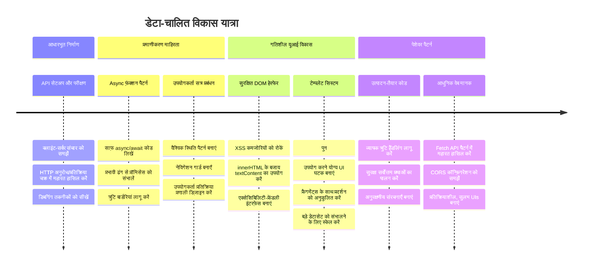
**🎓 स्नातक मील का पत्थर**: आपने आधुनिक जावास्क्रिप्ट पैटर्न का उपयोग करते हुए एक संपूर्ण डेटा-संचालित वेब एप्लिकेशन सफलतापूर्वक बनाया है। ये कौशल सीधे React, Vue, या Angular जैसे फ्रेमवर्क्स के साथ काम करने में सहायक हैं।

**🔄 अगली स्तर की क्षमताएँ**:
- इन अवधारणाओं पर आधारित फ्रंटेंड फ्रेमवर्क्स का अन्वेषण करने के लिए तैयार
- WebSockets के साथ वास्तविक समय की सुविधाएँ लागू करने के लिए तैयार
- ऑफ़लाइन क्षमताओं के साथ प्रोग्रेसिव वेब ऐप्स बनाने के लिए सुसज्जित
- उन्नत स्थिति प्रबंधन पैटर्न सीखने के लिए आधार तैयार

## GitHub Copilot एजेंट चुनौती 🚀

एजेंट मोड का उपयोग करके निम्न चुनौती पूरी करें:

**वर्णन:** बैंकिंग ऐप में एक लेनदेन खोज और फिल्टर फ़ीचर जोड़ें जो उपयोगकर्ताओं को तारीख सीमा, राशि, या विवरण के आधार पर विशिष्ट लेनदेन खोजने की अनुमति देता है।

**प्रॉम्प्ट:** बैंकिंग ऐप के लिए एक खोज फ़ंक्शन बनाएँ जिसमें शामिल हों: 1) तारीख सीमा (from/to), न्यूनतम/अधिकतम राशि, और लेनदेन विवरण कीवर्ड के लिए इनपुट फ़ील्ड्स वाला खोज फ़ॉर्म, 2) `filterTransactions()` फ़ंक्शन जो खोज मानदंडों के आधार पर account.transactions सरणी को फ़िल्टर करे, 3) फिल्टर किए गए परिणाम दिखाने के लिए `updateDashboard()` फ़ंक्शन को अपडेट करें, और 4) व्यू को रीसेट करने के लिए "Clear Filters" बटन जोड़ें। आधुनिक जावास्क्रिप्ट सरणी विधियों जैसे `filter()` का उपयोग करें और खाली खोज मानदंडों के लिए किनारे के मामलों को संभालें।

[एजेंट मोड](https://code.visualstudio.com/blogs/2025/02/24/introducing-copilot-agent-mode) के बारे में और जानें।

## 🚀 चुनौती

अपने बैंकिंग ऐप को अगले स्तर पर ले जाने के लिए तैयार हैं? आइए इसे ऐसा बनाएं कि आप वास्तव में इसका उपयोग करना चाहें। यहां कुछ विचार हैं जो आपकी रचनात्मकता को प्रेरित करें:

**इसे सुंदर बनाएं**: CSS स्टाइलिंग जोड़ें ताकि आपका कार्यात्मक डैशबोर्ड कुछ आकर्षक दिखे। साफ़ लकीरें, अच्छी जगह, और संभवतः कुछ सूक्ष्म एनीमेशन सोचें।

**इसे उत्तरदायी बनाएं**: [मीडिया क्वेरीज़](https://developer.mozilla.org/docs/Web/CSS/Media_Queries) का उपयोग करके ऐसा [उत्तरदायी डिज़ाइन](https://developer.mozilla.org/docs/Web/Progressive_web_apps/Responsive/responsive_design_building_blocks) बनाएं जो फोन, टैबलेट, और डेस्कटॉप पर समान रूप से अच्छा काम करे। आपके उपयोगकर्ता आपका धन्यवाद करेंगे!

**कुछ रंगीन जोड़ें**: लेनदेन के लिए रंग कोडिंग पर विचार करें (आय के लिए हरा, खर्च के लिए लाल), आइकॉन्स जोड़ें, या ऐसे होवर प्रभाव बनाएं जो इंटरफ़ेस को इंटरैक्टिव महसूस कराएं।

इस तरह एक सौंदर्यपूर्ण डैशबोर्ड दिख सकता है:


आपको इसे बिल्कुल मिलाने की आवश्यकता नहीं है - इसे प्रेरणा के रूप में लें और इसे अपना बनाएं!

## पोस्ट-लेक्चर क्विज़

[पोस्ट-लेक्चर क्विज़](https://ff-quizzes.netlify.app/web/quiz/46)

## असाइनमेंट

[अपना कोड पुन: व्यवस्थित करें और टिप्पणी करें](assignment.md)

---

<!-- CO-OP TRANSLATOR DISCLAIMER START -->
**अस्वीकरण**:
इस दस्तावेज़ का अनुवाद AI अनुवाद सेवा [Co-op Translator](https://github.com/Azure/co-op-translator) का उपयोग करके किया गया है। जबकि हम सही अनुवाद के लिए प्रयासरत हैं, कृपया ध्यान रखें कि स्वचालित अनुवाद में त्रुटियाँ या अशुद्धियाँ हो सकती हैं। मूल दस्तावेज़ अपनी मूल भाषा में ही आधिकारिक स्रोत माना जाना चाहिए। महत्वपूर्ण जानकारी के लिए, पेशेवर मानव अनुवाद की सलाह दी जाती है। इस अनुवाद के उपयोग से उत्पन्न किसी भी गलतफ़हमी या गलत व्याख्या के लिए हम उत्तरदायी नहीं हैं।
<!-- CO-OP TRANSLATOR DISCLAIMER END -->