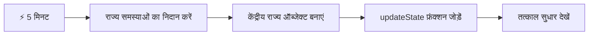
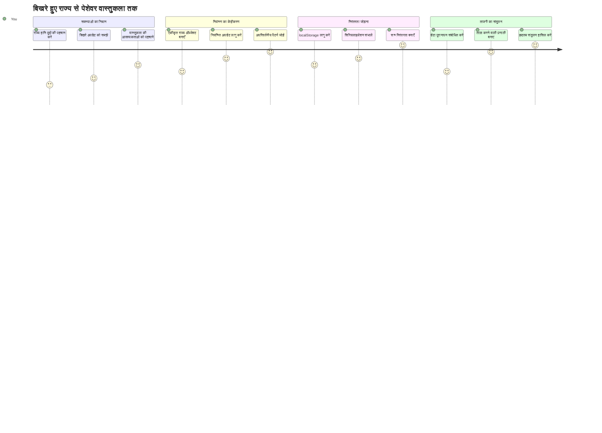
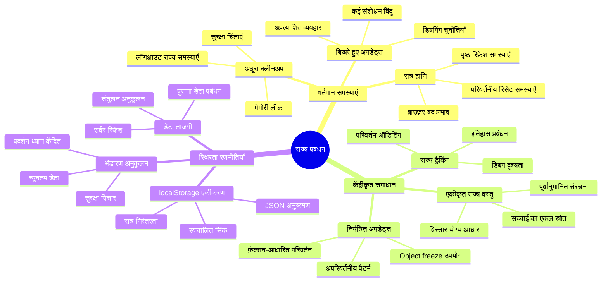
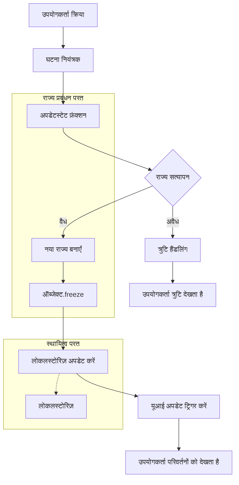
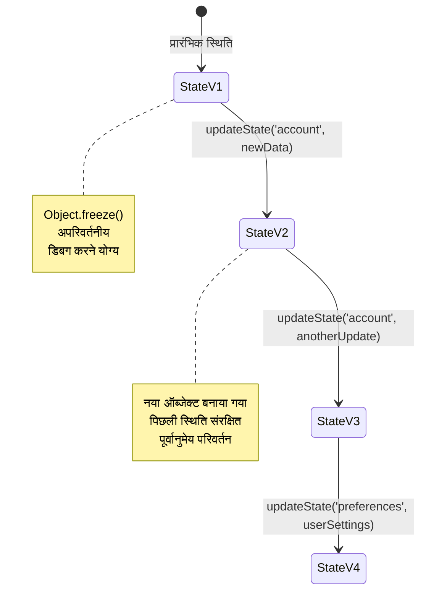
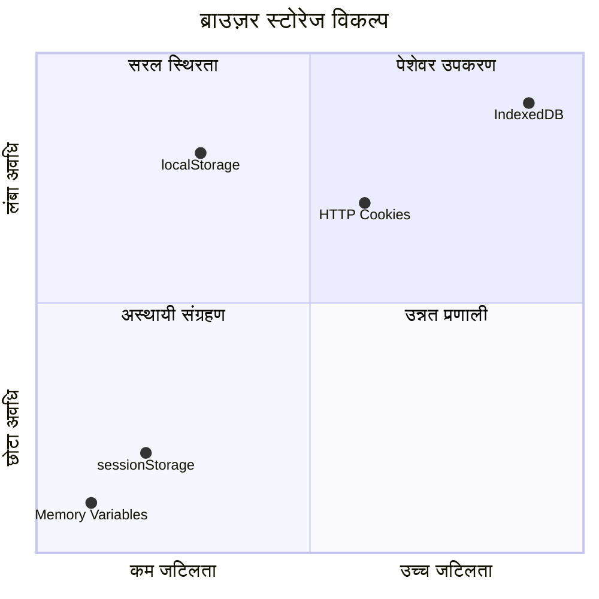
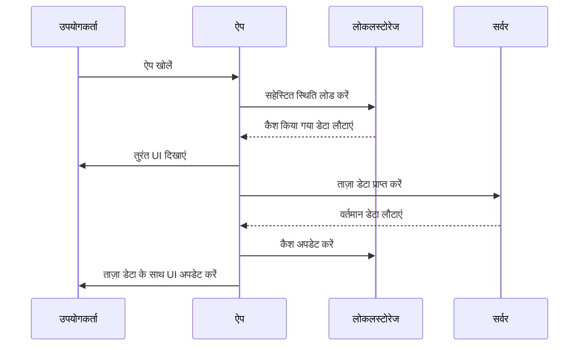
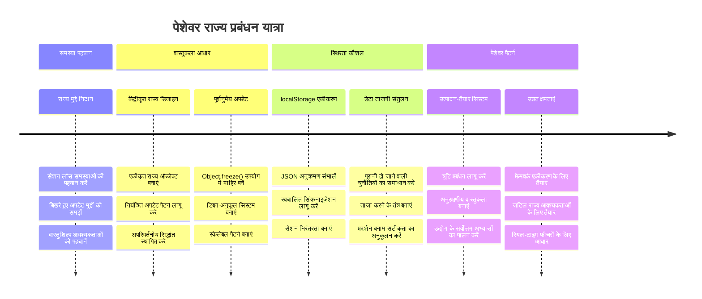

<!--
CO_OP_TRANSLATOR_METADATA:
{
  "original_hash": "b807b09df716dc48a2b750835bf8e933",
  "translation_date": "2026-01-06T16:51:52+00:00",
  "source_file": "7-bank-project/4-state-management/README.md",
  "language_code": "hi"
}
-->
# बैंकिंग ऐप बनाएं भाग 4: स्टेट मैनेजमेंट की अवधारणाएँ

## ⚡ अगले 5 मिनट में आप क्या कर सकते हैं

**व्यस्त डेवलपर्स के लिए त्वरित प्रारंभ मार्ग**


- **मिनट 1**: वर्तमान स्टेट समस्या का परीक्षण करें - लॉग इन करें, पेज रिफ्रेश करें, ल logout्ग आउट देखें
- **मिनट 2**: `let account = null` को `let state = { account: null }` से बदलें
- **मिनट 3**: नियंत्रित अद्यतनों के लिए एक सरल `updateState()` फ़ंक्शन बनाएं
- **मिनट 4**: एक फ़ंक्शन को नए पैटर्न का उपयोग करने के लिए अपडेट करें
- **मिनट 5**: बेहतर पूर्वानुमेयता और डिबगिंग क्षमता का परीक्षण करें

**त्वरित निदान परीक्षण**:
```javascript
// पहले: बिखरा हुआ राज्य
let account = null; // रिफ्रेश पर खो गया!

// बाद में: केंद्रीकृत राज्य
let state = Object.freeze({ account: null }); // नियंत्रित और ट्रैक करने योग्य!
```

**यह क्यों महत्वपूर्ण है**: 5 मिनट में, आप अराजक स्टेट मैनेजमेंट से पूर्वानुमेय, डिबग करने योग्य पैटर्न में परिवर्तन का अनुभव करेंगे। यह वह आधार है जो जटिल ऐप्लिकेशन को मेंटेनेबल बनाता है।

## 🗺️ स्टेट मैनेजमेंट मास्टरी के माध्यम से आपकी सीखने की यात्रा


**आपकी यात्रा का गंतव्य**: इस पाठ के अंत तक, आप एक पेशेवर स्तर का स्टेट मैनेजमेंट सिस्टम बनाएंगे जो परसिस्टेंस, डेटा ताजगी, और पूर्वानुमेय अद्यतनों को संभालता है - वही पैटर्न जो प्रोडक्शन ऐप्लिकेशन में उपयोग होते हैं।

## पूर्व-व्याख्यान क्विज़

[पूर्व-व्याख्यान क्विज़](https://ff-quizzes.netlify.app/web/quiz/47)

## परिचय

स्टेट मैनेजमेंट वैसा ही है जैसे वॉयजर अंतरिक्ष यान की नेविगेशन प्रणाली – जब सब कुछ smooth चलता है, तो आप इसे मुश्किल से ही महसूस करते हैं। लेकिन जब चीजें गलत हो जाती हैं, तो यह अंतःतारकीय अंतरिक्ष तक पहुँचने और कॉस्मिक खालीपन में खो जाने के बीच का अंतर बन जाती है। वेब विकास में, स्टेट का अर्थ है वह सब कुछ जो आपकी ऐप्लिकेशन को याद रखना पड़ता है: उपयोगकर्ता लॉगिन स्थिति, फॉर्म डेटा, नेविगेशन इतिहास, और अस्थायी इंटरफ़ेस स्थितियां।

जैसे-जैसे आपका बैंकिंग ऐप एक साधारण लॉगिन फॉर्म से एक अधिक परिष्कृत ऐप्लिकेशन में विकसित हुआ है, आप शायद कुछ सामान्य चुनौतियों का सामना कर चुके होंगे। पेज रिफ्रेश करने पर उपयोगकर्ता अप्रत्याशित रूप से लॉग आउट हो जाते हैं। ब्राउज़र बंद करने पर सभी प्रगति गायब हो जाती है। समस्या को डिबग करते समय, आपको एक ही डेटा को अलग-अलग तरीकों से संशोधित करने वाले कई फ़ंक्शनों में खोज करनी पड़ती है।

ये खराब कोडिंग के संकेत नहीं हैं – ये प्राकृतिक विकास दर्द हैं जो तब होते हैं जब ऐप्लिकेशन एक निश्चित जटिलता सीमा तक पहुँच जाते हैं। हर डेवलपर इन चुनौतियों का सामना करता है जब उनके ऐप्स "प्रूफ़ ऑफ कॉन्सेप्ट" से "प्रोडक्शन रेडी" में बदलते हैं।

इस पाठ में, हम एक केंद्रीकृत स्टेट मैनेजमेंट सिस्टम लागू करेंगे जो आपके बैंकिंग ऐप को एक विश्वसनीय, पेशेवर ऐप्लिकेशन में बदल देगा। आप पूर्वानुमेय रूप से डेटा प्रवाह को प्रबंधित करना, उपयुक्त तरीके से उपयोगकर्ता सत्रों को परसिस्ट करना, और आधुनिक वेब ऐप्लिकेशन जो आवश्यक स्मूद उपयोगकर्ता अनुभव प्रदान करते हैं, सीखेंगे।

## पूर्वाभ्यास

स्टेट मैनेजमेंट अवधारणाओं में गोता लगाने से पहले, आपको अपना विकास पर्यावरण सही ढंग से सेटअप करना होगा और अपने बैंकिंग ऐप की नींव स्थापित करनी होगी। यह पाठ इस श्रृंखला के पिछले भागों की अवधारणाओं और कोड पर सीधे आधारित है।

आगे बढ़ने से पहले सुनिश्चित करें कि आपके पास निम्नलिखित घटक तैयार हैं:

**आवश्यक सेटअप:**
- [डेटा फेचिंग लेसन](../3-data/README.md) पूरा करें - आपकी ऐप खाते का डेटा सफलतापूर्वक लोड और प्रदर्शित कर रही होनी चाहिए
- अपने सिस्टम पर [Node.js](https://nodejs.org) इंस्टॉल करें ताकि बैकेंड API चल सके
- [सर्वर API](../api/README.md) को स्थानीय रूप से शुरू करें ताकि खाता डेटा संचालन हो सके

**अपने पर्यावरण का परीक्षण:**

टर्मिनल में यह कमांड चलाकर सुनिश्चित करें कि आपका API सर्वर सही से चल रहा है:

```sh
curl http://localhost:5000/api
# -> परिणाम के रूप में "बैंक API v1.0.0" वापस करना चाहिए
```

**यह कमांड क्या करता है:**
- आपके स्थानीय API सर्वर को GET रिक्वेस्ट भेजता है
- कनेक्शन का परीक्षण करता है और सर्वर के जवाब देने की पुष्टि करता है
- यदि सब कुछ सही है तो API संस्करण की जानकारी लौटाता है

## 🧠 स्टेट मैनेजमेंट आर्किटेक्चर अवलोकन


**मूल सिद्धांत**: पेशेवर स्टेट मैनेजमेंट पूर्वानुमेयता, परसिस्टेंस, और प्रदर्शन के बीच संतुलन बनाता है ताकि सरल इंटरैक्शन से लेकर जटिल ऐप्लिकेशन वर्कफ़्लोज़ तक स्केलेबल विश्वसनीय उपयोगकर्ता अनुभव बनाए जा सकें।

---

## वर्तमान स्टेट समस्याओं का निदान

शर्लक होल्म्स की तरह एक अपराध स्थल की जांच करते हुए, हमें यह समझना होगा कि हमारे वर्तमान कार्यान्वयन में वास्तव में क्या हो रहा है ताकि गायब हो रहे उपयोगकर्ता सत्र के रहस्य को सुलझाया जा सके।

आइए एक सरल प्रयोग करें जो अंतर्निहित स्टेट मैनेजमेंट चुनौतियों को उजागर करता है:

**🧪 यह निदान परीक्षण करें:**
1. अपने बैंकिंग ऐप में लॉगिन करें और डैशबोर्ड पर जाएं
2. ब्राउज़र पेज को रिफ्रेश करें
3. अपने लॉगिन स्थिति पर ध्यान दें

यदि आप लॉगिन स्क्रीन पर पुनः निर्देशित हो जाते हैं, तो आपने क्लासिक स्टेट परसिस्टेंस समस्या की खोज कर ली है। यह व्यवहार इसलिए होता है क्योंकि हमारा वर्तमान कार्यान्वयन उपयोगकर्ता डेटा को JavaScript वेरिएबल्स में स्टोर करता है जो प्रत्येक पेज लोड पर रीसेट हो जाते हैं।

**वर्तमान कार्यान्वयन समस्याएँ:**

हमारे [पिछले पाठ](../3-data/README.md) से सरल `account` वेरिएबल तीन महत्वपूर्ण समस्याएँ उत्पन्न करता है जो उपयोगकर्ता अनुभव और कोड मेन्टेनबिलिटी दोनों को प्रभावित करती हैं:

| समस्या | तकनीकी कारण | उपयोगकर्ता प्रभाव |
|---------|-------------|------------------|
| **सेशन लॉस** | पेज रिफ्रेश से JavaScript वेरिएबल्स क्लियर हो जाते हैं | उपयोगकर्ताओं को बार-बार पुनः प्रमाणित होना पड़ता है |
| **विस्तारित अपडेट्स** | कई फ़ंक्शन स्टेट को सीधे संशोधित करते हैं | डिबगिंग करना कठिन होता जाता है |
| **अधूरा क्लीनअप** | Logout सभी स्टेट संदर्भ साफ़ नहीं करता | संभावित सुरक्षा और गोपनीयता चिंताएं |

**आर्किटेक्चरल चुनौती:**

जैसे टाइटैनिक के कम्पार्टमेंट डिज़ाइन ने तब तक मजबूती दिखाई जब तक कि कई कम्पार्टमेंट्स एक साथ भर नहीं गए, वैसे ही इन समस्याओं को व्यक्तिगत रूप से ठीक करने से अंतर्निहित आर्किटेक्चरल समस्या हल नहीं होगी। हमें एक व्यापक स्टेट मैनेजमेंट समाधान चाहिए।

> 💡 **हम वास्तव में क्या हासिल करना चाहते हैं?**

[स्टेट मैनेजमेंट](https://en.wikipedia.org/wiki/State_management) वास्तव में दो मूल पहेलियों को सुलझाने के बारे में है:

1. **मेरा डेटा कहाँ है?**: हमारे पास कौन सी जानकारी है और वह कहाँ से आती है यह ट्रैक करना
2. **क्या सभी एक समान स्थिति पर हैं?**: सुनिश्चित करना कि उपयोगकर्ता जो देखते हैं वह वास्तव में हो रहा है उससे मेल खाता है

**हमारी योजना:**

हम अपनी पूंछ के पीछे दोड़ने के बजाय, एक **केद्रित स्टेट मैनेजमेंट** सिस्टम बनाएंगे। इसे ऐसे सोचिए जैसे एक बहुत ही व्यवस्थित व्यक्ति सभी महत्वपूर्ण चीज़ों का ज़िम्मा संभाल रहा हो:



**इस डेटा फ्लो को समझना:**
- सभी ऐप्लिकेशन स्टेट को एक ही स्थान पर केंद्रीकृत करता है
- सभी स्टेट बदलावों को नियंत्रित फ़ंक्शन्स के माध्यम से रूट करता है
- UI को वर्तमान स्टेट के साथ सिंक्रनाइज़ रखता है
- डेटा मैनेजमेंट के लिए एक स्पष्ट, पूर्वानुमेय पैटर्न प्रदान करता है

> 💡 **पेशेवर अंतर्दृष्टि**: यह पाठ मूलभूत अवधारणाओं पर केन्द्रित है। जटिल ऐप्लिकेशन के लिए, लाइब्रेरीज जैसे [Redux](https://redux.js.org) अधिक उन्नत स्टेट मैनेजमेंट फीचर्स प्रदान करती हैं। इन मुख्य सिद्धांतों को समझना किसी भी स्टेट मैनेजमेंट लाइब्रेरी में महारत हासिल करने में मदद करेगा।

> ⚠️ **उन्नत विषय**: हम स्टेट बदलावों द्वारा ट्रिगर होने वाले स्वचालित UI अपडेट्स को कवर नहीं करेंगे, क्योंकि इसमें [Reactive Programming](https://en.wikipedia.org/wiki/Reactive_programming) अवधारणाएं शामिल हैं। इसे अपनी सीखने की यात्रा के अगले उत्कृष्ट चरण के रूप में considerar करें!

### कार्य: स्टेट संरचना को केंद्रीकृत करें

आइए हमारे फैले हुए स्टेट मैनेजमेंट को एक केंद्रीकृत सिस्टम में बदलना शुरू करें। यह पहला कदम सभी सुधारों की नींव रखता है।

**चरण 1: एक केद्रीकृत स्टेट ऑब्जेक्ट बनाएं**

सरल `account` घोषणा को बदलें:

```js
let account = null;
```

एक संरचित स्टेट ऑब्जेक्ट के साथ:

```js
let state = {
  account: null
};
```

**यह बदलाव जरूरी क्यों है:**
- सभी ऐप्लिकेशन डेटा को एक ही जगह केंद्रीकृत करता है
- बाद में अधिक स्टेट प्रॉपर्टीज जोड़ने के लिए संरचना तैयार करता है
- स्टेट और अन्य वेरिएबल्स के बीच एक स्पष्ट सीमा बनाता है
- एक ऐसा पैटर्न स्थापित करता है जो आपकी ऐप के विकास के साथ स्केल करता है

**चरण 2: स्टेट एक्सेस पैटर्न अपडेट करें**

अपने फ़ंक्शन्स को नई स्टेट संरचना का उपयोग करने के लिए अपडेट करें:

**`register()` और `login()` फ़ंक्शन्स में**, इसे बदलें:
```js
account = ...
```

से:
```js
state.account = ...
```

**`updateDashboard()` फ़ंक्शन में**, सबसे ऊपर यह लाइन जोड़ें:
```js
const account = state.account;
```

**इन अपडेट्स से क्या हासिल होता है:**
- मौजूदा कार्यक्षमता को बनाए रखते हुए संरचना में सुधार करता है
- आपके कोड को अधिक परिष्कृत स्टेट मैनेजमेंट के लिए तैयार करता है
- स्टेट डेटा तक पहुँचने के लिए सुसंगत पैटर्न बनाता है
- केंद्रीकृत स्टेट अपडेट्स के लिए आधार स्थापित करता है

> 💡 **नोट**: यह रीफैक्टोरिंग तुरंत हमारी समस्याओं को हल नहीं करती, लेकिन अगले शक्तिशाली सुधारों के लिए आवश्यक नींव बनाती है!

### 🎯 शैक्षिक जाँच: केंद्रीकरण सिद्धांत

**रुके और सोचें**: आपने अभी केंद्रीकृत स्टेट मैनेजमेंट की नींव लागू की है। यह एक महत्वपूर्ण आर्किटेक्चरल निर्णय है।

**त्वरित आत्म-मूल्यांकन**:
- क्या आप समझा सकते हैं कि स्टेट को एक ऑब्जेक्ट में केंद्रीकृत करना scattered वेरिएबल्स से बेहतर क्यों है?
- अगर आप किसी फ़ंक्शन को `state.account` उपयोग के लिए अपडेट करना भूल जाते हैं तो क्या होगा?
- यह पैटर्न आपके कोड को उन्नत फीचर्स के लिए कैसे तैयार करता है?

**वास्तविक दुनिया का संबंध**: आपने जो केंद्रीकरण पैटर्न सीखा है, वही आधुनिक फ्रेमवर्क्स जैसे Redux, Vuex, और React Context की नींव है। आप उन्हीं आर्किटेक्चरल सोच को बना रहे हैं जो बड़े ऐप्लिकेशन्स में उपयोग होती है।

**चुनौती प्रश्न**: यदि आपको उपयोगकर्ता प्राथमिकताएं (थीम, भाषा) अपनी ऐप में जोड़नी हों, तो आप उन्हें स्टेट संरचना में कहाँ जोड़ेंगे? यह कैसे स्केल करेगा?

## नियंत्रित स्टेट अपडेट्स लागू करना

जब हमारा स्टेट केंद्रीकृत हो गया है, अगला कदम डेटा संशोधनों के लिए नियंत्रित तंत्र स्थापित करना है। यह तरीका पूर्वानुमेय स्टेट बदलाव और आसान डिबगिंग सुनिश्चित करता है।

मूल सिद्धांत हवाई यातायात नियंत्रण जैसा है: कई फ़ंक्शन्स को स्वतंत्र रूप से स्टेट संशोधित करने की बजाय, हम सभी बदलावों को एक ही नियंत्रित फ़ंक्शन के माध्यम से चैनल करेंगे। यह पैटर्न डेटा बदलावों के समय और तरीके पर स्पष्ट निगरानी प्रदान करता है।

**अपरिवर्तनीय स्टेट मैनेजमेंट:**

हम अपने `state` ऑब्जेक्ट को [*immutable*](https://en.wikipedia.org/wiki/Immutable_object) मानेंगे, इसका अर्थ है कि हम इसे सीधे संशोधित नहीं करेंगे। इसके बजाय, हर बदलाव एक नया स्टेट ऑब्जेक्ट बनाता है जिसमें नया डेटा होता है।

यह तरीका शुरुआत में सीधे परिवर्तन की तुलना में कम कुशल लग सकता है, लेकिन यह डिबगिंग, परीक्षण, और ऐप्लिकेशन की पूर्वानुमेयता बनाए रखने में महत्वपूर्ण लाभ प्रदान करता है।

**अपरिवर्तनीय स्टेट मैनेजमेंट के लाभ:**

| लाभ | विवरण | प्रभाव |
|---------|-------------|-------|
| **पूर्वानुमेयता** | केवल नियंत्रित फ़ंक्शन्स के माध्यम से बदलाव होते हैं | डिबग और परीक्षण आसान होता है |
| **इतिहास ट्रैकिंग** | हर स्टेट बदलाव नया ऑब्जेक्ट बनाता है | undo/redo फ़ंक्शन सक्षम करता है |
| **साइड इफेक्ट रोकथाम** | आकस्मिक संशोधन नहीं होते | रहस्यमय बग्स रोके जाते हैं |
| **प्रदर्शन अनुकूलन** | पता लगाना आसान होता है कि स्टेट वास्तव में कब बदला | प्रभावी UI अपडेट्स सक्षम करता है |

**JavaScript में `Object.freeze()` के साथ अपरिवर्तनीयता:**

JavaScript [`Object.freeze()`](https://developer.mozilla.org/docs/Web/JavaScript/Reference/Global_Objects/Object/freeze) प्रदान करता है जो ऑब्जेक्ट संशोधनों को रोकता है:

```js
const immutableState = Object.freeze({ account: userData });
// immutableState को संशोधित करने का कोई भी प्रयास त्रुटि देगा
```

**यहाँ क्या होता है:**
- सीधे प्रॉपर्टी असाइनमेंट या डिलीशन को रोकता है
- संशोधन के प्रयास होने पर एक्सेप्शंस थ्रो करता है
- सुनिश्चित करता है कि स्टेट बदलाव नियंत्रित फ़ंक्शन्स के माध्यम से ही हों
- स्टेट अपडेट्स के लिए स्पष्ट अनुबंध बनाता है

> 💡 **गहराई से समझें**: [MDN डाक्यूमेंटेशन](https://developer.mozilla.org/docs/Web/JavaScript/Reference/Global_Objects/Object/freeze#What_is_shallow_freeze) में *shallow* और *deep* immutable ऑब्जेक्ट्स के बीच का अंतर सीखें। इस अंतर को समझना जटिल स्टेट संरचनाओं के लिए महत्वपूर्ण है।


### कार्य

आइए एक नया `updateState()` फ़ंक्शन बनाएं:

```js
function updateState(property, newData) {
  state = Object.freeze({
    ...state,
    [property]: newData
  });
}
```

इस फ़ंक्शन में, हम नया स्टेट ऑब्जेक्ट बना रहे हैं और पिछले स्टेट से डेटा कॉपी कर रहे हैं [*spread (`...`) ऑपरेटर*](https://developer.mozilla.org/docs/Web/JavaScript/Reference/Operators/Spread_syntax#Spread_in_object_literals) का उपयोग करके। फिर हम राज्य ऑब्जेक्ट के एक विशेष प्रॉपर्टी को नवीनतम डेटा के साथ ओवरराइड करते हैं [ब्रैकेट नोटेशन](https://developer.mozilla.org/docs/Web/JavaScript/Guide/Working_with_Objects#Objects_and_properties) `[property]` का उपयोग करके। अंत में, हम `Object.freeze()` का उपयोग करके ऑब्जेक्ट को संशोधनों से लॉक कर देते हैं। अभी हमारे पास केवल `account` प्रॉपर्टी स्टेट में स्टोर है, लेकिन इस दृष्टिकोण के साथ आप जरूरत के अनुसार चाहें उतनी प्रॉपर्टीज ऐड कर सकते हैं।

हम `state` की इनिशियलाइजेशन को भी अपडेट करेंगे ताकि आरंभिक स्टेट भी फ्रीज हो:

```js
let state = Object.freeze({
  account: null
});
```

इसके बाद, `register` फ़ंक्शन को अपडेट करें, `state.account = result;` असाइनमेंट को बदलकर:

```js
updateState('account', result);
```

इसी तरह `login` फ़ंक्शन में, `state.account = data;` को इस तरह बदलें:

```js
updateState('account', data);
```

अब हम यह मौका लेंगे कि जब उपयोगकर्ता *Logout* पर क्लिक करे तो खाता डेटा साफ़ न होने वाली समस्या को ठीक करें।

एक नया फ़ंक्शन `logout()` बनाएं:

```js
function logout() {
  updateState('account', null);
  navigate('/login');
}
```

`updateDashboard()` में, रिडायरेक्शन को `return navigate('/login');` के स्थान पर `return logout();` से बदलें;

एक नया खाता रजिस्टर करें, लॉगआउट करें और फिर से लॉगिन करें यह जांचने के लिए कि सब कुछ सही ढंग से काम कर रहा है।

> सुझाव: आप `updateState()` के नीचे `console.log(state)` जोड़कर और अपने ब्राउज़र के डेवलपर टूल में कंसोल खोलकर सभी स्टेट बदलावों को देख सकते हैं।

## डेटा परसिस्टेंस लागू करना

हमने जो सेशन लॉस समस्या पहचानी है, उसे एक परसिस्टेंस समाधान की जरूरत है जो उपयोगकर्ता स्टेट को ब्राउज़र सेशन्स के पार बनाए रखे। यह हमारे ऐप को एक अस्थायी अनुभव से एक विश्वसनीय, पेशेवर उपकरण में बदल देता है।

जैसे एटॉमिक क्लॉक्स पॉवर आउटेज़ के दौरान भी सही समय बनाए रखते हैं क्योंकि वे महत्वपूर्ण स्टेट को नॉन-वोलेटाइल मेमोरी में स्टोर करते हैं, वैसे ही वेब ऐप्लिकेशन को परसिस्टेंट स्टोरेज मैकेनिज़्म चाहिए ताकि उपयोगकर्ता का आवश्यक डेटा ब्राउज़र सेशन्स और पेज रिफ्रेश के बीच संरक्षित रहे।

**डेटा परसिस्टेंस के लिए रणनीतिक प्रश्न:**

परसिस्टेंस लागू करने से पहले, इन महत्वपूर्ण कारकों पर विचार करें:

| प्रश्न | बैंकिंग ऐप संदर्भ | निर्णय का प्रभाव |
|----------|-------------------|----------------|
| **क्या डेटा संवेदनशील है?** | खाता बैलेंस, लेन-देन इतिहास | सुरक्षित भंडारण तरीकों का चयन करें |
| **यह कितनी देर तक बनी रहनी चाहिए?** | लॉगिन स्थिति बनाम अस्थायी UI प्राथमिकताएं | उपयुक्त संग्रह अवधि चुनें |
| **क्या सर्वर को इसकी आवश्यकता है?** | प्रमाणीकरण टोकन बनाम UI सेटिंग्स | साझाकरण आवश्यकताओं का निर्धारण करें |

**ब्राउज़र संग्रह विकल्प:**

आधुनिक ब्राउज़रों में कई संग्रह तंत्र होते हैं, जो प्रत्येक विभिन्न उपयोग मामलों के लिए डिज़ाइन किए गए हैं:

**प्राथमिक संग्रह API:**

1. **[`localStorage`](https://developer.mozilla.org/docs/Web/API/Window/localStorage)**: स्थायी [कुंजी/मान संग्रह](https://en.wikipedia.org/wiki/Key%E2%80%93value_database)
   - **डेटा को** ब्राउज़र सत्रों के बीच अनिश्चितकालीन रूप से संग्रहीत करता है  
   - **ब्राउज़र पुनः प्रारंभ और कंप्यूटर रीबूट के बाद भी रहता है**
   - **विशिष्ट वेबसाइट डोमेन के लिए सीमित**
   - **उपयोगकर्ता प्राथमिकताएं और लॉगिन स्थितियों के लिए उपयुक्त**

2. **[`sessionStorage`](https://developer.mozilla.org/docs/Web/API/Window/sessionStorage)**: अस्थायी सत्र संग्रह
   - **सक्रिय सत्रों के दौरान localStorage के समान कार्य करता है**
   - **ब्राउज़र टैब बंद होने पर स्वचालित रूप से साफ़ हो जाता है**
   - **अस्थायी डेटा के लिए आदर्श जो कायम नहीं रहना चाहिए**

3. **[HTTP कुकीज़](https://developer.mozilla.org/docs/Web/HTTP/Cookies)**: सर्वर-साझा संग्रह
   - **स्वचालित रूप से प्रत्येक सर्वर अनुरोध के साथ भेजा जाता है**
   - **[प्रमाणीकरण](https://en.wikipedia.org/wiki/Authentication) टोकन के लिए उपयुक्त**
   - **आकार में सीमित और प्रदर्शन को प्रभावित कर सकता है**

**डेटा सीरीयलाइज़ेशन की आवश्यकता:**

`localStorage` और `sessionStorage` दोनों केवल [स्ट्रिंग](https://developer.mozilla.org/docs/Web/JavaScript/Reference/Global_Objects/String) संग्रहीत करते हैं:

```js
// स्टोरेज के लिए ऑब्जेक्ट्स को JSON स्ट्रिंग्स में बदलें
const accountData = { user: 'john', balance: 150 };
localStorage.setItem('account', JSON.stringify(accountData));

// प्राप्त करने पर JSON स्ट्रिंग्स को वापस ऑब्जेक्ट्स में पार्स करें
const savedAccount = JSON.parse(localStorage.getItem('account'));
```

**सीरीयलाइजेशन समझना:**
- **JavaScript वस्तुओं को JSON स्ट्रिंग में बदलता है** [`JSON.stringify()`](https://developer.mozilla.org/docs/Web/JavaScript/Reference/Global_Objects/JSON/stringify) का उपयोग करके
- **JSON से वस्तुओं का पुनर्निर्माण करता है** [`JSON.parse()`](https://developer.mozilla.org/docs/Web/JavaScript/Reference/Global_Objects/JSON/parse) का उपयोग करके
- **स्वचालित रूप से जटिल नेस्टेड वस्तुओं और एरे को संभालता है**
- **फंक्शंस, undefined मानों, और सर्कुलर संदर्भों पर विफल रहता है**

> 💡 **उन्नत विकल्प**: बड़े डेटा सेट वाले जटिल ऑफ़लाइन अनुप्रयोगों के लिए, [`IndexedDB` API](https://developer.mozilla.org/docs/Web/API/IndexedDB_API) पर विचार करें। यह एक पूर्ण क्लाइंट-साइड डेटाबेस प्रदान करता है लेकिन इसके लिए अधिक जटिल कार्यान्वयन की आवश्यकता होती है।


### कार्य: localStorage स्थिरता लागू करें

आइए स्थायी संग्रह लागू करें ताकि उपयोगकर्ता तब तक लॉग इन रहें जब तक वे स्पष्ट रूप से लॉगआउट न करें। हम `localStorage` का उपयोग ब्राउज़र सत्रों के बीच खाता डेटा संग्रहीत करने के लिए करेंगे।

**चरण 1: संग्रह कॉन्फ़िगरेशन परिभाषित करें**

```js
const storageKey = 'savedAccount';
```

**यह स्थिरांक प्रदान करता है:**
- **हमारे संग्रहीत डेटा के लिए एक सुसंगत पहचानकर्ता बनाता है**
- **संग्रह कुंजी संदर्भों में टाइपो से बचाता है**
- **यदि आवश्यक हो तो संग्रह कुंजी बदलना आसान बनाता है**
- **रखरखाव योग्य कोड के सर्वोत्तम अभ्यास का पालन करता है**

**चरण 2: स्वचालित स्थिरता जोड़ें**

`updateState()` फ़ंक्शन के अंत में यह लाइन जोड़ें:

```js
localStorage.setItem(storageKey, JSON.stringify(state.account));
```

**यहाँ क्या हुआ इसे समझें:**
- **खाता ऑब्जेक्ट को संग्रह के लिए JSON स्ट्रिंग में कनवर्ट करता है**
- **हमारी सुसंगत संग्रह कुंजी का उपयोग करके डेटा सहेजता है**
- **जब भी स्थिति बदलती है, स्वचालित रूप से निष्पादित होता है**
- **सुनिश्चित करता है कि संग्रहीत डेटा वर्तमान स्थिति के साथ सिंक्रनाइज़ रहता है**

> 💡 **आर्किटेक्चर लाभ**: चूंकि हमने सभी स्थिति अपडेट को `updateState()` के माध्यम से केंद्रीकृत किया, इसलिए स्थिरता जोड़ने के लिए केवल एक लाइन कोड की आवश्यकता थी। यह अच्छे आर्किटेक्चर निर्णयों की शक्ति को दर्शाता है!

**चरण 3: ऐप लोड पर स्थिति पुनर्स्थापित करें**

सहेजे गए डेटा को पुनर्स्थापित करने के लिए एक प्रारंभिक फ़ंक्शन बनाएं:

```js
function init() {
  const savedAccount = localStorage.getItem(storageKey);
  if (savedAccount) {
    updateState('account', JSON.parse(savedAccount));
  }

  // हमारा पिछला प्रारंभिक कोड
  window.onpopstate = () => updateRoute();
  updateRoute();
}

init();
```

**प्रारंभिक प्रक्रिया को समझना:**
- **localStorage से पिछला सहेजा गया खाता डेटा पुनः प्राप्त करता है**
- **JSON स्ट्रिंग को फिर से JavaScript ऑब्जेक्ट में पार्स करता है**
- **हमारे नियंत्रित अपडेट फ़ंक्शन का उपयोग करके स्थिति अपडेट करता है**
- **पेज लोड पर उपयोगकर्ता सत्र को स्वचालित रूप से पुनर्स्थापित करता है**
- **रूट अपडेट से पहले निष्पादित होता है ताकि स्थिति उपलब्ध हो**

**चरण 4: डिफ़ॉल्ट रूट का अनुकूलन करें**

स्थिरता का लाभ उठाने के लिए डिफ़ॉल्ट रूट को अपडेट करें:

`updateRoute()` में, इसे बदलें:
```js
// प्रतिस्थापित करें: return navigate('/login');
return navigate('/dashboard');
```

**यह परिवर्तन क्यों समझदारी है:**
- **हमारे नए स्थिरता सिस्टम का प्रभावी उपयोग करता है**
- **डैशबोर्ड को प्रमाणीकरण जांचों को संभालने देता है**
- **यदि कोई सहेजा गया सत्र नहीं होता तो स्वचालित रूप से लॉगिन पर रिडायरेक्ट करता है**
- **एक अधिक सहज उपयोगकर्ता अनुभव बनाता है**

**अपनी कार्यान्वयन का परीक्षण करें:**

1. अपने बैंकिंग ऐप में लॉगिन करें
2. ब्राउज़र पेज को रिफ्रेश करें
3. जांचें कि आप लॉग इन रहकर डैशबोर्ड पर बने हुए हैं
4. ब्राउज़र बंद करें और फिर से खोलें
5. ऐप पर वापस जाएं और पुष्टि करें कि आप अभी भी लॉग इन हैं

🎉 **उपलब्धि मिली**: आपने सफलतापूर्वक स्थायी स्थिति प्रबंधन लागू किया! आपका ऐप अब पेशेवर वेब एप्लिकेशन जैसा व्यवहार करता है।

### 🎯 शैक्षिक चेक-इन: स्थिरता आर्किटेक्चर

**आर्किटेक्चर की समझ**: आपने एक परिष्कृत स्थिरता परत लागू की है जो उपयोगकर्ता अनुभव और डेटा प्रबंधन जटिलता के बीच संतुलन बनाती है।

**प्रमुख अवधारणाएं मास्टर कीं**:
- **JSON सीरीयलाइज़ेशन**: जटिल वस्तुओं को संग्रहीत स्ट्रिंग में बदलना
- **स्वचालित सिंक्रनाइज़ेशन**: स्थिति परिवर्तनों पर स्थायी संग्रह स्वतः होता है
- **सत्र पुनर्प्राप्ति**: एप्लिकेशन व्यवधान के बाद उपयोगकर्ता संदर्भ पुनर्स्थापित कर सकते हैं
- **केंद्रीकृत स्थिरता**: एक अपडेट फ़ंक्शन सभी संग्रह को नियंत्रित करता है

**उद्योग कनेक्शन**: यह स्थिरता पैटर्न प्रोग्रेसिव वेब ऐप्स (PWAs), ऑफ़लाइन-फर्स्ट अनुप्रयोगों, और आधुनिक मोबाइल वेब अनुभवों के लिए मौलिक है। आप उत्पादन-स्तरीय क्षमताएं बना रहे हैं।

**प्रतिबिंब प्रश्न**: आप इस सिस्टम को एक ही डिवाइस पर कई उपयोगकर्ता खातों को संभालने के लिए कैसे संशोधित करेंगे? गोपनीयता और सुरक्षा के पहलुओं पर विचार करें।

## डेटा ताज़गी के साथ स्थिरता का संतुलन

हमारा स्थिरता सिस्टम उपयोगकर्ता सत्रों को सफलतापूर्वक बनाए रखता है, लेकिन एक नया चुनौती पेश करता है: डेटा पुरानी हो जाना। जब एक से अधिक उपयोगकर्ता या एप्लिकेशन एक ही सर्वर डेटा को संशोधित करते हैं, तो स्थानीय कैश की गई जानकारी पुराने या अव्यवस्थित हो जाती है।

यह स्थिति वाइकिंग नाविकों जैसी है जो संग्रहीत तारा मानचित्रों और वर्तमान खगोलीय अवलोकनों दोनों पर निर्भर थे। मानचित्र स्थिरता प्रदान करते थे, लेकिन नाविकों को परिवर्तित परिस्थितियों को ध्यान में रखने के लिए ताज़ा अवलोकन की आवश्यकता होती थी। इसी तरह, हमारे अनुप्रयोग को स्थायी उपयोगकर्ता स्थिति और वर्तमान सर्वर डेटा दोनों की आवश्यकता है।

**🧪 डेटा ताज़गी समस्या की खोज:**

1. `test` खाते का उपयोग करके डैशबोर्ड में लॉग इन करें
2. टर्मिनल में यह कमांड चलाकर दूसरे स्रोत से लेन-देन का अनुकरण करें:

```sh
curl --request POST \
     --header "Content-Type: application/json" \
     --data "{ \"date\": \"2020-07-24\", \"object\": \"Bought book\", \"amount\": -20 }" \
     http://localhost:5000/api/accounts/test/transactions
```

3. अपने ब्राउज़र में डैशबोर्ड पेज को रिफ्रेश करें
4. देखें कि क्या नया लेनदेन दिखाई देता है

**यह परीक्षण क्या दिखाता है:**
- **कैसे स्थानीय संग्रह "पुराना" (stale) हो सकता है, दिखाता है**
- **वास्तविक दुनिया के परिदृश्यों का अनुकरण करता है जहाँ डेटा आपके ऐप के बाहर बदलता है**
- **स्थिरता और डेटा ताज़गी के बीच तनाव को प्रकट करता है**

**डेटा पुरानी समस्या:**

| समस्या | कारण | उपयोगकर्ता प्रभाव |
|---------|-------|------------------|
| **पुराना डेटा** | localStorage स्वतः कभी समाप्त नहीं होता | उपयोगकर्ता पुराने जानकारी देखते हैं |
| **सर्वर परिवर्तन** | अन्य ऐप/उपयोगकर्ता एक ही डेटा को संशोधित करते हैं | प्लेटफ़ॉर्मों के बीच असंगत दृश्य |
| **कैश बनाम वास्तविकता** | स्थानीय कैश सर्वर स्थिति से मेल नहीं खाता | खराब उपयोगकर्ता अनुभव और भ्रम |

**समाधान रणनीति:**

हम एक "लोड पर ताज़गी" पैटर्न लागू करेंगे जो स्थिरता के लाभों को ताज़ा डेटा की आवश्यकता के साथ संतुलित करता है। यह दृष्टिकोण सहज उपयोगकर्ता अनुभव बनाए रखता है जबकि डेटा की सटीकता सुनिश्चित करता है।


### कार्य: डेटा ताज़गी प्रणाली लागू करें

हम एक ऐसी प्रणाली बनाएंगे जो सर्वर से ताज़ा डेटा स्वचालित रूप से प्राप्त करती है, साथ ही हमारे स्थायी स्थिति प्रबंधन के लाभ बनाए रखती है।

**चरण 1: खाता डेटा अपडेटर बनाएँ**

```js
async function updateAccountData() {
  const account = state.account;
  if (!account) {
    return logout();
  }

  const data = await getAccount(account.user);
  if (data.error) {
    return logout();
  }

  updateState('account', data);
}
```

**इस फ़ंक्शन की लॉजिक समझना:**
- **जांचता है कि कोई उपयोगकर्ता वर्तमान में लॉग इन है (state.account मौजूद है)**
- **अनुमानित नहीं सत्र मिलने पर लॉगआउट पर रीडायरेक्ट करता है**
- **मौजूदा `getAccount()` फ़ंक्शन का उपयोग करके सर्वर से ताज़ा खाता डेटा प्राप्त करता है**
- **सर्वर त्रुटियों को कुशलतापूर्वक संभालता है और अमान्य सत्रों को लॉगआउट करता है**
- **हमारे नियंत्रित अपडेट सिस्टम का उपयोग करके स्थिति अपडेट करता है**
- **`updateState()` फ़ंक्शन के माध्यम से स्वचालित localStorage स्थिरता को ट्रिगर करता है**

**चरण 2: डैशबोर्ड रिफ्रेश हैंडलर बनाएँ**

```js
async function refresh() {
  await updateAccountData();
  updateDashboard();
}
```

**यह रिफ्रेश फ़ंक्शन क्या करता है:**
- **डेटा ताज़गी और UI अपडेट प्रक्रिया को समन्वयित करता है**
- **ताज़ा डेटा लोड होने तक प्रतीक्षा करता है फिर प्रदर्शन अपडेट करता है**
- **सुनिश्चित करता है कि डैशबोर्ड सबसे वर्तमान जानकारी दिखाए**
- **डेटा प्रबंधन और UI अपडेट के बीच साफ़ अलगाव बनाए रखता है**

**चरण 3: रूट सिस्टम के साथ एकीकृत करें**

अपने रूट कॉन्फ़िगरेशन को इस तरह अपडेट करें कि रिफ्रेश स्वतः ट्रिगर हो:

```js
const routes = {
  '/login': { templateId: 'login' },
  '/dashboard': { templateId: 'dashboard', init: refresh }
};
```

**यह एकीकरण कैसे काम करता है:**
- **हर बार डैशबोर्ड रूट लोड होने पर रिफ्रेश फ़ंक्शन निष्पादित करता है**
- **सुनिश्चित करता है कि जब उपयोगकर्ता डैशबोर्ड पर जाते हैं तो ताज़ा डेटा हमेशा दिखे**
- **मौजूदा रूट संरचना को बनाए रखते हुए डेटा ताज़गी जोड़ता है**
- **रूट-विशिष्ट प्रारंभिककरण के लिए सुसंगत पैटर्न प्रदान करता है**

**अपने डेटा ताज़गी सिस्टम का परीक्षण करें:**

1. अपने बैंकिंग ऐप में लॉगिन करें
2. पहले जैसा curl कमांड चलाकर नया लेनदेन बनाएं
3. अपने डैशबोर्ड पेज को रिफ्रेश करें या कहीं और जाएं और वापस आएं
4. पुष्टि करें कि नया लेनदेन तुरंत दिखाई देता है

🎉 **परफेक्ट संतुलन पाया**: आपका ऐप अब स्थायी स्थिति के सहज अनुभव को ताज़ा सर्वर डेटा की सटीकता के साथ संयोजित करता है!

## 📈 आपका स्थिति प्रबंधन महारत टाइमलाइन


**🎓 स्नातक की उपलब्धि**: आपने सफलतापूर्वक एक पूर्ण स्थिति प्रबंधन प्रणाली बनाई है जो Redux, Vuex, और अन्य पेशेवर स्थिति पुस्तकालयों के समान सिद्धांतों का उपयोग करती है। ये पैटर्न सरल ऐप से लेकर एंटरप्राइज़ अनुप्रयोगों तक के लिए स्केल करते हैं।

**🔄 अगली स्तर की क्षमताएं**:
- स्थिति प्रबंधन फ्रेमवर्क (Redux, Zustand, Pinia) को महारत हासिल करने के लिए तैयार
- WebSockets के साथ रियल-टाइम फीचर लागू करने के लिए तैयार
- ऑफ़लाइन-फर्स्ट प्रोग्रेसिव वेब ऐप्स बनाने में सक्षम
- स्थिति मशीनों और ऑब्ज़र्वरों जैसे उन्नत पैटर्न के लिए आधार तैयार

## GitHub Copilot एजेंट चुनौती 🚀

एजेंट मोड का उपयोग करके निम्न चुनौती पूरी करें:

**विवरण:** बैंकिंग ऐप के लिए एक व्यापक स्थिति प्रबंधन प्रणाली लागू करें जिसमें undo/redo कार्यक्षमता हो। यह चुनौती आपको उन्नत स्थिति प्रबंधन अवधारणाएं जैसे स्थिति इतिहास ट्रैकिंग, अपरिवर्तनीय अपडेट, और उपयोगकर्ता इंटरफ़ेस सिंक्रनाइज़ेशन का अभ्यास करने में मदद करेगी।

**प्रॉम्प्ट:** एक उन्नत स्थिति प्रबंधन प्रणाली बनाएं जिसमें शामिल हो: 1) एक स्थिति इतिहास सरणी जो सभी पूर्ववर्ती स्थितियों को ट्रैक करे, 2) undo और redo फ़ंक्शन जो पिछली स्थितियों में वापस जा सकें, 3) डैशबोर्ड पर undo/redo संचालन के UI बटन, 4) अधिकतम इतिहास सीमा 10 स्थितियाँ ताकि मेमोरी समस्याओं से बचा जा सके, और 5) उपयोगकर्ता लॉगआउट होने पर इतिहास की उपयुक्त सफाई। सुनिश्चित करें कि undo/redo कार्यक्षमता खाते के बैलेंस परिवर्तनों के साथ काम करे और ब्राउज़र रिफ्रेश के दौरान बनी रहे।

[agent mode](https://code.visualstudio.com/blogs/2025/02/24/introducing-copilot-agent-mode) के बारे में और जानें।

## 🚀 चुनौती: संग्रह अनुकूलन

आपका कार्यान्वयन अब उपयोगकर्ता सत्रों, डेटा ताज़गी, और स्थिति प्रबंधन को प्रभावी ढंग से संभालता है। हालांकि, विचार करें कि क्या हमारा वर्तमान दृष्टिकोण संग्रह दक्षता को कार्यक्षमता के साथ सर्वोत्तम रूप से संतुलित करता है।

जैसे शतरंज के माहिर आवश्यक मोहरे और expendable प्यादों के बीच भेद करते हैं, वैसा ही प्रभावी स्थिति प्रबंधन में यह पहचानना आवश्यक है कि कौन सा डेटा स्थायी होना चाहिए और कौन सा हमेशा सर्वर से ताज़ा होना चाहिए।

**अनुकूलन विश्लेषण:**

अपने वर्तमान localStorage कार्यान्वयन का मूल्यांकन करें और इन रणनीतिक प्रश्नों पर विचार करें:
- उपयोगकर्ता प्रमाणीकरण बनाए रखने के लिए न्यूनतम जानकारी क्या आवश्यक है?
- कौन सा डेटा इतना बार बदलता है कि स्थानीय कैशिंग का बहुत कम लाभ होता है?
- संग्रह अनुकूलन प्रदर्शन को कैसे बेहतर बना सकता है बिना उपयोगकर्ता अनुभव को प्रभावित किए?

इस प्रकार का आर्किटेक्चरल विश्लेषण उन अनुभवी डेवलपर्स को अलग करता है जो अपनी समाधानों में दोनों—कार्यक्षमता और दक्षता—का विचार करते हैं।

**कार्यान्वयन रणनीति:**
- **अनिवार्य डेटा की पहचान करें जो स्थायी होना चाहिए (संभावित रूप से केवल उपयोगकर्ता पहचान)**
- **localStorage कार्यान्वयन को संशोधित करें ताकि केवल महत्वपूर्ण सत्र डेटा संग्रहित हो**
- **डैशबोर्ड पर सर्वर से ताज़ा डेटा हमेशा लोड करें**
- **परीक्षण करें कि आपकी अनुकूलित दृष्टिकोण वही उपयोगकर्ता अनुभव बनाए रखे**

**उन्नत विचार:**
- **पूर्ण खाता डेटा संग्रहित करने और केवल प्रमाणीकरण टोकन संग्रहित करने के बीच के ट्रेड-ऑफ की तुलना करें**
- **अपनी निर्णय प्रक्रिया और तर्क भविष्य की टीम सदस्यों के लिए प्रलेखित करें**

यह चुनौती आपको एक पेशेवर डेवलपर की तरह सोचने में मदद करेगी जो उपयोगकर्ता अनुभव और एप्लिकेशन दक्षता दोनों पर विचार करता है। अलग-अलग तरीकों के साथ प्रयोग करने के लिए अपना समय निकालें!

## पोस्ट-लेक्चर क्विज़

[पोस्ट-लेक्चर क्विज़](https://ff-quizzes.netlify.app/web/quiz/48)

## असाइनमेंट

[“लेन-देन जोड़ें” डायलॉग लागू करें](assignment.md)

असाइनमेंट पूरा करने के बाद यहाँ एक उदाहरण परिणाम है:


---

<!-- CO-OP TRANSLATOR DISCLAIMER START -->
**अस्वीकरण**:
यह दस्तावेज़ AI अनुवाद सेवा [Co-op Translator](https://github.com/Azure/co-op-translator) का उपयोग करके अनुवादित किया गया है। यद्यपि हम सटीकता के लिए प्रयासरत हैं, कृपया ध्यान दें कि स्वचालित अनुवादों में त्रुटियाँ या गलतियाँ हो सकती हैं। मूल दस्तावेज़ अपनी मूल भाषा में अधिकारिक स्रोत माना जाना चाहिए। महत्वपूर्ण जानकारी के लिए, पेशेवर मानव अनुवाद की सलाह दी जाती है। इस अनुवाद के उपयोग से उत्पन्न किसी भी गलतफहमी या गलत व्याख्या के लिए हम उत्तरदायी नहीं हैं।
<!-- CO-OP TRANSLATOR DISCLAIMER END -->