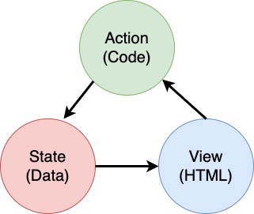

<!--
CO_OP_TRANSLATOR_METADATA:
{
  "original_hash": "b46acf79da8550d76445eed00b06c878",
  "translation_date": "2025-10-03T12:54:06+00:00",
  "source_file": "7-bank-project/4-state-management/README.md",
  "language_code": "hi"
}
-->
# बैंकिंग ऐप बनाएं भाग 4: स्टेट मैनेजमेंट की अवधारणाएं

## प्री-लेक्चर क्विज़

[प्री-लेक्चर क्विज़](https://ff-quizzes.netlify.app/web/quiz/47)

### परिचय

जैसे-जैसे वेब एप्लिकेशन बढ़ता है, डेटा प्रवाह को ट्रैक करना चुनौतीपूर्ण हो जाता है। कौन सा कोड डेटा प्राप्त करता है, कौन सा पेज इसे उपयोग करता है, इसे कब और कहां अपडेट करने की आवश्यकता है... यह आसानी से गड़बड़ कोड में बदल सकता है जिसे बनाए रखना मुश्किल है। यह विशेष रूप से तब सच है जब आपको अपने ऐप के विभिन्न पेजों के बीच डेटा साझा करने की आवश्यकता होती है, जैसे उपयोगकर्ता डेटा। *स्टेट मैनेजमेंट* की अवधारणा हमेशा सभी प्रकार के प्रोग्रामों में मौजूद रही है, लेकिन जैसे-जैसे वेब ऐप्स की जटिलता बढ़ती जा रही है, यह अब विकास के दौरान विचार करने का एक प्रमुख बिंदु बन गया है।

इस अंतिम भाग में, हम उस ऐप पर पुनर्विचार करेंगे जिसे हमने बनाया है ताकि स्टेट को बेहतर तरीके से प्रबंधित किया जा सके, जिससे ब्राउज़र को किसी भी समय रिफ्रेश करने का समर्थन मिले और उपयोगकर्ता सत्रों के बीच डेटा को बनाए रखा जा सके।

### पूर्वापेक्षा

आपको इस पाठ के लिए वेब ऐप के [डेटा फेचिंग](../3-data/README.md) भाग को पूरा करना होगा। आपको [Node.js](https://nodejs.org) इंस्टॉल करना होगा और [सर्वर API](../api/README.md) को लोकल रूप से चलाना होगा ताकि आप अकाउंट डेटा को प्रबंधित कर सकें।

आप यह कमांड टर्मिनल में चलाकर जांच सकते हैं कि सर्वर सही तरीके से चल रहा है:

```sh
curl http://localhost:5000/api
# -> should return "Bank API v1.0.0" as a result
```

---

## स्टेट मैनेजमेंट पर पुनर्विचार करें

[पिछले पाठ](../3-data/README.md) में, हमने अपने ऐप में स्टेट की एक बुनियादी अवधारणा पेश की थी जिसमें `account` नामक एक ग्लोबल वेरिएबल था जो वर्तमान में लॉग इन किए गए उपयोगकर्ता के बैंक डेटा को संग्रहीत करता है। हालांकि, हमारे वर्तमान कार्यान्वयन में कुछ खामियां हैं। डैशबोर्ड पर रहते हुए पेज को रिफ्रेश करने का प्रयास करें। क्या होता है?

वर्तमान कोड में 3 समस्याएं हैं:

- स्टेट को बनाए नहीं रखा गया है, क्योंकि ब्राउज़र रिफ्रेश आपको लॉगिन पेज पर वापस ले जाता है।
- स्टेट को संशोधित करने वाले कई फंक्शन हैं। जैसे-जैसे ऐप बढ़ता है, यह परिवर्तनों को ट्रैक करना मुश्किल बना सकता है और एक को अपडेट करना भूलना आसान हो जाता है।
- स्टेट को साफ नहीं किया गया है, इसलिए जब आप *लॉगआउट* पर क्लिक करते हैं तो अकाउंट डेटा अभी भी वहां होता है, भले ही आप लॉगिन पेज पर हों।

हम इन समस्याओं को एक-एक करके हल करने के लिए अपने कोड को अपडेट कर सकते हैं, लेकिन इससे कोड का अधिक डुप्लीकेशन होगा और ऐप अधिक जटिल और बनाए रखने में कठिन हो जाएगा। या हम कुछ मिनटों के लिए रुक सकते हैं और अपनी रणनीति पर पुनर्विचार कर सकते हैं।

> यहां हम वास्तव में किन समस्याओं को हल करने की कोशिश कर रहे हैं?

[स्टेट मैनेजमेंट](https://en.wikipedia.org/wiki/State_management) का उद्देश्य इन दो विशेष समस्याओं को हल करने के लिए एक अच्छा दृष्टिकोण खोजना है:

- ऐप में डेटा प्रवाह को समझने योग्य कैसे रखें?
- स्टेट डेटा को हमेशा उपयोगकर्ता इंटरफ़ेस के साथ (और इसके विपरीत) सिंक में कैसे रखें?

एक बार जब आप इनका ध्यान रख लेते हैं, तो आपके पास जो भी अन्य समस्याएं हो सकती हैं, वे या तो पहले ही ठीक हो चुकी होंगी या उन्हें ठीक करना आसान हो गया होगा। इन समस्याओं को हल करने के लिए कई संभावित दृष्टिकोण हैं, लेकिन हम एक सामान्य समाधान अपनाएंगे जिसमें **डेटा और इसे बदलने के तरीकों को केंद्रीकृत करना** शामिल है। डेटा प्रवाह इस प्रकार होगा:



> यहां हम उस हिस्से को कवर नहीं करेंगे जहां डेटा स्वचालित रूप से व्यू अपडेट को ट्रिगर करता है, क्योंकि यह [Reactive Programming](https://en.wikipedia.org/wiki/Reactive_programming) के अधिक उन्नत अवधारणाओं से जुड़ा हुआ है। यदि आप गहराई से जानने के इच्छुक हैं, तो यह एक अच्छा विषय है।

✅ स्टेट मैनेजमेंट के लिए कई लाइब्रेरी उपलब्ध हैं, जिनमें [Redux](https://redux.js.org) एक लोकप्रिय विकल्प है। इसके द्वारा उपयोग किए जाने वाले अवधारणाओं और पैटर्न को देखें क्योंकि यह अक्सर यह समझने का एक अच्छा तरीका होता है कि बड़े वेब ऐप्स में आप किन संभावित समस्याओं का सामना कर सकते हैं और उन्हें कैसे हल किया जा सकता है।

### कार्य

हम थोड़ा रिफैक्टरिंग से शुरुआत करेंगे। `account` डिक्लेरेशन को बदलें:

```js
let account = null;
```

इसके साथ:

```js
let state = {
  account: null
};
```

यह विचार है कि हमारे ऐप डेटा को एक सिंगल स्टेट ऑब्जेक्ट में *केंद्रीकृत* किया जाए। फिलहाल हमारे पास स्टेट में केवल `account` है, इसलिए यह ज्यादा नहीं बदलता है, लेकिन यह विकास के लिए एक रास्ता बनाता है।

हमें इसका उपयोग करने वाले फंक्शन को भी अपडेट करना होगा। `register()` और `login()` फंक्शन में, `account = ...` को `state.account = ...` से बदलें;

`updateDashboard()` फंक्शन के शीर्ष पर, यह लाइन जोड़ें:

```js
const account = state.account;
```

यह रिफैक्टरिंग अपने आप में बहुत सुधार नहीं लाती है, लेकिन विचार अगले परिवर्तनों के लिए नींव रखना था।

## डेटा परिवर्तनों को ट्रैक करें

अब जब हमने डेटा संग्रहीत करने के लिए `state` ऑब्जेक्ट को स्थापित कर लिया है, तो अगला कदम अपडेट को केंद्रीकृत करना है। उद्देश्य यह है कि किसी भी परिवर्तन और उनके होने के समय को ट्रैक करना आसान हो जाए।

`state` ऑब्जेक्ट में परिवर्तन करने से बचने के लिए, इसे [*immutable*](https://en.wikipedia.org/wiki/Immutable_object) मानना भी एक अच्छा अभ्यास है, जिसका अर्थ है कि इसे बिल्कुल भी संशोधित नहीं किया जा सकता। इसका मतलब यह भी है कि यदि आप इसमें कुछ भी बदलना चाहते हैं तो आपको एक नया स्टेट ऑब्जेक्ट बनाना होगा। ऐसा करके, आप संभावित अवांछित [साइड इफेक्ट्स](https://en.wikipedia.org/wiki/Side_effect_(computer_science)) के बारे में सुरक्षा बनाते हैं, और अपने ऐप में नई सुविधाओं को लागू करने जैसे कि undo/redo को सक्षम करते हैं, साथ ही इसे डिबग करना भी आसान बनाते हैं। उदाहरण के लिए, आप स्टेट में किए गए हर परिवर्तन को लॉग कर सकते हैं और परिवर्तनों का इतिहास रख सकते हैं ताकि बग के स्रोत को समझा जा सके।

जावास्क्रिप्ट में, आप [`Object.freeze()`](https://developer.mozilla.org/docs/Web/JavaScript/Reference/Global_Objects/Object/freeze) का उपयोग करके ऑब्जेक्ट का एक immutable संस्करण बना सकते हैं। यदि आप immutable ऑब्जेक्ट में परिवर्तन करने का प्रयास करते हैं, तो एक अपवाद उत्पन्न होगा।

✅ क्या आप जानते हैं कि *shallow* और *deep* immutable ऑब्जेक्ट में क्या अंतर है? आप इसके बारे में [यहां](https://developer.mozilla.org/docs/Web/JavaScript/Reference/Global_Objects/Object/freeze#What_is_shallow_freeze) पढ़ सकते हैं।

### कार्य

आइए एक नया `updateState()` फंक्शन बनाएं:

```js
function updateState(property, newData) {
  state = Object.freeze({
    ...state,
    [property]: newData
  });
}
```

इस फंक्शन में, हम एक नया स्टेट ऑब्जेक्ट बना रहे हैं और पिछले स्टेट से डेटा को [*स्प्रेड (`...`) ऑपरेटर*](https://developer.mozilla.org/docs/Web/JavaScript/Reference/Operators/Spread_syntax#Spread_in_object_literals) का उपयोग करके कॉपी कर रहे हैं। फिर हम स्टेट ऑब्जेक्ट की एक विशेष प्रॉपर्टी को [ब्रैकेट नोटेशन](https://developer.mozilla.org/docs/Web/JavaScript/Guide/Working_with_Objects#Objects_and_properties) `[property]` का उपयोग करके नए डेटा के साथ ओवरराइड करते हैं। अंत में, हम `Object.freeze()` का उपयोग करके ऑब्जेक्ट को लॉक कर देते हैं ताकि संशोधन न हो सके। फिलहाल हमारे स्टेट में केवल `account` प्रॉपर्टी संग्रहीत है, लेकिन इस दृष्टिकोण के साथ आप स्टेट में जितनी चाहें उतनी प्रॉपर्टी जोड़ सकते हैं।

हम यह सुनिश्चित करने के लिए `state` इनिशियलाइज़ेशन को भी अपडेट करेंगे कि प्रारंभिक स्टेट भी फ्रीज हो:

```js
let state = Object.freeze({
  account: null
});
```

इसके बाद, `register` फंक्शन को अपडेट करें और `state.account = result;` असाइनमेंट को बदलें:

```js
updateState('account', result);
```

`login` फंक्शन के साथ भी ऐसा ही करें, `state.account = data;` को बदलें:

```js
updateState('account', data);
```

अब हम *लॉगआउट* पर क्लिक करने पर अकाउंट डेटा को साफ न करने की समस्या को ठीक करने का अवसर लेंगे।

एक नया फंक्शन `logout()` बनाएं:

```js
function logout() {
  updateState('account', null);
  navigate('/login');
}
```

`updateDashboard()` में, रीडायरेक्शन `return navigate('/login');` को `return logout();` से बदलें;

एक नया अकाउंट रजिस्टर करें, लॉगआउट करें और फिर से लॉगिन करें ताकि यह सुनिश्चित हो सके कि सब कुछ सही तरीके से काम कर रहा है।

> टिप: आप ब्राउज़र के डेवलपमेंट टूल्स में कंसोल खोलकर और `updateState()` के नीचे `console.log(state)` जोड़कर सभी स्टेट परिवर्तनों को देख सकते हैं।

## स्टेट को बनाए रखें

अधिकांश वेब ऐप्स को सही तरीके से काम करने के लिए डेटा को बनाए रखने की आवश्यकता होती है। सभी महत्वपूर्ण डेटा आमतौर पर डेटाबेस में संग्रहीत किया जाता है और सर्वर API के माध्यम से एक्सेस किया जाता है, जैसे कि हमारे मामले में उपयोगकर्ता अकाउंट डेटा। लेकिन कभी-कभी, उपयोगकर्ता अनुभव को बेहतर बनाने या लोडिंग प्रदर्शन को सुधारने के लिए ब्राउज़र में चल रहे क्लाइंट ऐप पर कुछ डेटा को बनाए रखना भी दिलचस्प होता है।

जब आप अपने ब्राउज़र में डेटा को बनाए रखना चाहते हैं, तो कुछ महत्वपूर्ण प्रश्न हैं जो आपको खुद से पूछने चाहिए:

- *क्या डेटा संवेदनशील है?* आपको क्लाइंट पर किसी भी संवेदनशील डेटा को संग्र
[पोस्ट-लेक्चर क्विज़](https://ff-quizzes.netlify.app/web/quiz/48)

## असाइनमेंट

["Add transaction" डायलॉग लागू करें](assignment.md)

यहां असाइनमेंट पूरा करने के बाद का एक उदाहरण परिणाम दिया गया है:


---

**अस्वीकरण**:  
यह दस्तावेज़ AI अनुवाद सेवा [Co-op Translator](https://github.com/Azure/co-op-translator) का उपयोग करके अनुवादित किया गया है। जबकि हम सटीकता के लिए प्रयासरत हैं, कृपया ध्यान दें कि स्वचालित अनुवादों में त्रुटियां या अशुद्धियां हो सकती हैं। मूल भाषा में उपलब्ध मूल दस्तावेज़ को प्रामाणिक स्रोत माना जाना चाहिए। महत्वपूर्ण जानकारी के लिए, पेशेवर मानव अनुवाद की सिफारिश की जाती है। इस अनुवाद के उपयोग से उत्पन्न किसी भी गलतफहमी या गलत व्याख्या के लिए हम उत्तरदायी नहीं हैं।