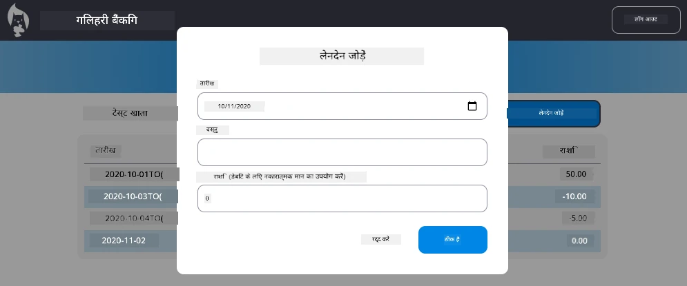

# "ट्रांजैक्शन जोड़ें" संवाद लागू करें

## अवलोकन

आपके बैंकिंग ऐप में अब ठोस राज्य प्रबंधन और डेटा स्थिरता है, लेकिन इसमें एक महत्वपूर्ण विशेषता गायब है जो वास्तविक बैंकिंग ऐप्स को चाहिए: उपयोगकर्ताओं के लिए अपने स्वयं के लेनदेन जोड़ने की क्षमता। इस असाइनमेंट में, आप एक पूर्ण "ट्रांजैक्शन जोड़ें" संवाद लागू करेंगे जो आपके मौजूदा राज्य प्रबंधन प्रणाली के साथ पूरी तरह से एकीकृत होगा।

यह असाइनमेंट चार बैंकिंग पाठों में आपने जो कुछ भी सीखा है उसे एक साथ लाता है: HTML टेम्प्लेटिंग, फॉर्म हैंडलिंग, API एकीकरण, और राज्य प्रबंधन।

## सीखने के उद्देश्य

इस असाइनमेंट को पूरा करके, आप:
- **बनाएंगे** एक उपयोगकर्ता-अनुकूल संवाद इंटरफेस डेटा प्रविष्टि के लिए
- **लागू करेंगे** पहुंच योग्य फॉर्म डिज़ाइन कीबोर्ड और स्क्रीन रीडर समर्थन के साथ
- **एकीकृत करेंगे** नई सुविधाओं को आपके मौजूदा राज्य प्रबंधन प्रणाली के साथ
- **अभ्यास करेंगे** API संचार और त्रुटि हैंडलिंग
- **लागू करेंगे** आधुनिक वेब विकास पैटर्न को एक वास्तविक दुनिया की विशेषता में

## निर्देश

### चरण 1: ट्रांजैक्शन जोड़ें बटन

**बनाएं** एक "ट्रांजैक्शन जोड़ें" बटन अपनी डैशबोर्ड पेज पर जिसे उपयोगकर्ता आसानी से पा सकें और उपयोग कर सकें।

**आवश्यकताएँ:**
- **बटन रखें** डैशबोर्ड पर एक तर्कसंगत स्थान में
- **स्पष्ट, क्रियाकालीन बटन टेक्स्ट का उपयोग करें**
- **बटन को अपने मौजूदा UI डिज़ाइन के अनुसार स्टाइल करें**
- **सुनिश्चित करें** कि बटन कीबोर्ड द्वारा सुलभ हो

### चरण 2: संवाद कार्यान्वयन

अपने संवाद के लिए इनमें से एक तरीका चुनें:

**विकल्प A: अलग पेज**
- **ट्रांजैक्शन फॉर्म के लिए एक नया HTML टेम्प्लेट बनाएं**
- **अपने राउटिंग सिस्टम में एक नया मार्ग जोड़ें**
- **फॉर्म पेज तक और उससे नेविगेशन कार्यान्वित करें**

**विकल्प B: मौडल संवाद (अनुशंसित)**
- **जावास्क्रिप्ट का उपयोग करें संवाद को डैशबोर्ड छोड़े बिना दिखाने/छिपाने के लिए**
- **[`hidden` प्रॉपर्टी](https://developer.mozilla.org/docs/Web/HTML/Global_attributes/hidden) या CSS क्लासेस का उपयोग करें**
- **उचित फोकस प्रबंधन के साथ एक सहज उपयोगकर्ता अनुभव बनाएं**

### चरण 3: पहुंच योग्यता कार्यान्वयन

**सुनिश्चित करें** कि आपका संवाद [मौडल संवाद पहुंच मानकों](https://developer.paciellogroup.com/blog/2018/06/the-current-state-of-modal-dialog-accessibility/) को पूरा करता है:

**कीबोर्ड नेविगेशन:**
- **Escape कुंजी से संवाद बंद करने का समर्थन करें**
- **जब खुला हो तो संवाद के भीतर फोकस को पकड़ लें**
- **बंद होने पर फोकस ट्रिगर बटन पर वापस लौटाएं**

**स्क्रीन रीडर समर्थन:**
- **उपयुक्त ARIA लेबल और भूमिकाएँ जोड़ें**
- **संवाद खुलने/बंद होने की सूचना स्क्रीन रीडर को दें**
- **स्पष्ट फॉर्म फील्ड लेबल और त्रुटि संदेश प्रदान करें**

### चरण 4: फॉर्म बनाना

**एक HTML फॉर्म डिज़ाइन करें जो ट्रांजैक्शन डेटा संग्रहीत करे:**

**आवश्यक फ़ील्ड:**
- **तारीख**: जब ट्रांजैक्शन हुआ
- **विवरण**: ट्रांजैक्शन किस लिए था
- **राशि**: ट्रांजैक्शन मूल्य (आय के लिए धनात्मक, खर्च के लिए ऋणात्मक)

**फॉर्म सुविधाएँ:**
- **सबमिशन से पहले उपयोगकर्ता इनपुट को सत्यापित करें**
- **अमान्य डेटा के लिए स्पष्ट त्रुटि संदेश प्रदान करें**
- **सहायक प्लेसहोल्डर टेक्स्ट और लेबल शामिल करें**
- **अपने मौजूदा डिज़ाइन के साथ संगत स्टाइल करें**

### चरण 5: API एकीकरण

**अपने फॉर्म को बैकएंड API से कनेक्ट करें:**

**कार्यान्वयन चरण:**
- **सर्वर API विनिर्देशों को देखें** (../api/README.md) सही एंडपॉइंट और डेटा प्रारूप के लिए
- **अपने फॉर्म इनपुट से JSON डेटा बनाएं**
- **उपयुक्त त्रुटि हैंडलिंग के साथ API को डेटा भेजें**
- **उपयोगकर्ता को सफलता/विफलता संदेश प्रदर्शित करें**
- **नेटवर्क त्रुटियों को सौम्यता से संभालें**

### चरण 6: राज्य प्रबंधन एकीकरण

**नई ट्रांजैक्शन के साथ अपने डैशबोर्ड को अपडेट करें:**

**एकीकरण आवश्यकताएँ:**
- **सफल ट्रांजैक्शन जोड़ने के बाद खाता डेटा रीफ्रेश करें**
- **डैशबोर्ड डिस्प्ले को पेज रीफ्रेश के बिना अपडेट करें**
- **नई ट्रांजैक्शन तुरंत दिखाई दे**
- **पूरे प्रक्रिया में उचित राज्य स्थिरता बनाए रखें**

## तकनीकी विनिर्देशन

**API एंडपॉइंट विवरण:**
[सर्वर API दस्तावेज़](../api/README.md) देखें:
- ट्रांजैक्शन डेटा के लिए आवश्यक JSON प्रारूप
- HTTP मेथड और एंडपॉइंट URL
- अपेक्षित प्रतिक्रिया प्रारूप
- त्रुटि प्रतिक्रिया हैंडलिंग

**अपेक्षित परिणाम:**
इस असाइनमेंट को पूरा करने के बाद, आपका बैंकिंग ऐप पूरी तरह से कार्यात्मक "ट्रांजैक्शन जोड़ें" फीचर के साथ होना चाहिए जो पेशेवर रूप से दिखता और व्यवहार करता है:

## अपने कार्यान्वयन का परीक्षण करें

**फंक्शनल परीक्षण:**
1. **सत्यापित करें** कि "ट्रांजैक्शन जोड़ें" बटन स्पष्ट रूप से दिखाई देता है और सुलभ है
2. **परीक्षण करें** कि संवाद ठीक से खुलता और बंद होता है
3. **पुष्टि करें** कि सभी आवश्यक फ़ील्ड के लिए फॉर्म वैलिडेशन काम करता है
4. **जाँचें** कि सफल ट्रांजैक्शन तुरंत डैशबोर्ड पर दिखाई देते हैं
5. **सुनिश्चित करें** कि अमान्य डेटा और नेटवर्क समस्याओं पर त्रुटि हैंडलिंग काम करती है

**पहुंच योग्यता परीक्षण:**
1. **पूरे प्रवाह को केवल कीबोर्ड का उपयोग करके नेविगेट करें**
2. **स्क्रीन रीडर के साथ परीक्षण करें ताकि उचित घोषणाएँ सुनिश्चित हों**
3. **सत्यापित करें** कि फोकस प्रबंधन सही ढंग से काम करता है
4. **जाँचें** कि सभी फॉर्म तत्वों में उपयुक्त लेबल हैं

## मूल्यांकन मानदंड

| मापदंड | उत्कृष्ट | पर्याप्त | सुधार की आवश्यकता |
| -------- | --------- | -------- | ----------------- |
| **कार्यात्मकता** | ट्रांजैक्शन जोड़ने की सुविधा बिना किसी त्रुटि के अच्छी उपयोगकर्ता अनुभव के साथ काम करती है और सभी बेसिक सिद्धांतों का पालन करती है | ट्रांजैक्शन जोड़ने की सुविधा सही ढंग से काम करती है लेकिन कुछ बेसिक सिद्धांतों का पालन नहीं कर सकती या मामूली उपयोगिता समस्याएं हो सकती हैं | ट्रांजैक्शन जोड़ने की सुविधा आंशिक रूप से काम कर रही है या इसमें महत्वपूर्ण उपयोगिता समस्याएं हैं |
| **कोड गुणवत्ता** | कोड सुव्यवस्थित है, स्थापित पैटर्न का पालन करता है, उचित त्रुटि हैंडलिंग शामिल है, और मौजूदा राज्य प्रबंधन के साथ सहजता से एकीकृत है | कोड काम करता है लेकिन संगठन के कुछ मुद्दे हो सकते हैं या मौजूदा कोडबेस के साथ असंगत पैटर्न हो सकते हैं | कोड में महत्वपूर्ण संरचनात्मक समस्याएं हैं या मौजूदा पैटर्न के साथ अच्छी तरह से एकीकृत नहीं है |
| **पहुंच योग्यता** | पूर्ण कीबोर्ड नेविगेशन समर्थन, स्क्रीन रीडर अनुकूलता, और WCAG दिशानिर्देशों के साथ उत्कृष्ट फोकस प्रबंधन | बुनियादी पहुंच सुविधाएं लागू की गई हैं लेकिन कुछ कीबोर्ड नेविगेशन या स्क्रीन रीडर सुविधाएं ग़ायब हो सकती हैं | सीमित या कोई पहुंच विचार नहीं लागू किए गए हैं |
| **उपयोगकर्ता अनुभव** | सहज, परिष्कृत इंटरफ़ेस स्पष्ट प्रतिक्रिया, चिकनी अंतःक्रियाओं, और पेशेवर उपस्थिति के साथ | अच्छा उपयोगकर्ता अनुभव है जिसमें प्रतिक्रिया या दृश्य डिज़ाइन में मामूली सुधार की आवश्यकता हो सकती है | खराब उपयोगकर्ता अनुभव, भ्रमित करने वाला इंटरफ़ेस या यूजर फीडबैक की कमी |

## अतिरिक्त चुनौतियाँ (वैकल्पिक)

जब आप बुनियादी आवश्यकताएँ पूरी कर लें, तो इन सुधारों पर विचार करें:

**विकसित सुविधाएँ:**
- **ट्रांजैक्शन श्रेणियां जोड़ें** (भोजन, परिवहन, मनोरंजन, आदि)
- **रियल-टाइम फीडबैक के साथ इनपुट वैलिडेशन लागू करें**
- **पावर उपयोगकर्ताओं के लिए कीबोर्ड शॉर्टकट बनाएं**
- **ट्रांजैक्शन संपादित करने और हटाने की क्षमताएं जोड़ें**

**उन्नत एकीकरण:**
- **हाल ही में जोड़े गए ट्रांजैक्शनों के लिए पूर्ववत कार्यक्षमता लागू करें**
- **CSV फ़ाइलों से थोक ट्रांजैक्शन आयात जोड़ें**
- **ट्रांजैक्शन खोज और फ़िल्टरिंग क्षमताएं बनाएं**
- **डेटा निर्यात कार्यक्षमता लागू करें**

ये वैकल्पिक सुविधाएँ आपको अधिक उन्नत वेब विकास अवधारणाओं का अभ्यास करने में मदद करेंगी और एक अधिक पूर्ण बैंकिंग ऐप्लिकेशन बनाएंगी!

---

<!-- CO-OP TRANSLATOR DISCLAIMER START -->
**अस्वीकरण**:  
इस दस्तावेज़ का अनुवाद AI अनुवाद सेवा [Co-op Translator](https://github.com/Azure/co-op-translator) का उपयोग करके किया गया है। जबकि हम सटीकता के लिए प्रयासरत हैं, कृपया ध्यान दें कि स्वचालित अनुवादों में त्रुटियाँ या असंगतियाँ हो सकती हैं। मूल दस्तावेज़ अपनी मूल भाषा में ही प्रामाणिक स्रोत माना जाना चाहिए। महत्वपूर्ण जानकारी के लिए, पेशेवर मानव अनुवाद की सलाह दी जाती है। इस अनुवाद के उपयोग से उत्पन्न हुई किसी भी गलतफहमी या गलत व्याख्या के लिए हम उत्तरदायी नहीं हैं।
<!-- CO-OP TRANSLATOR DISCLAIMER END -->