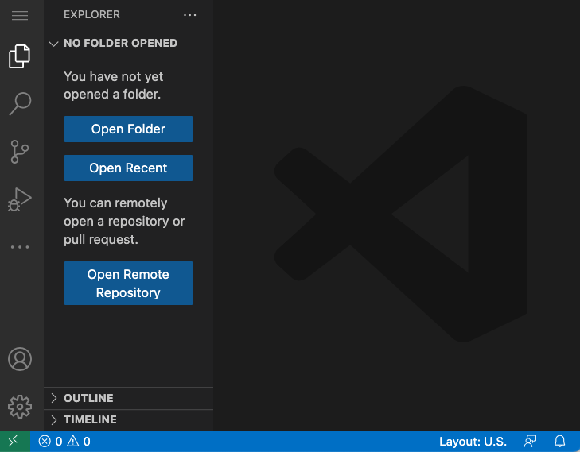
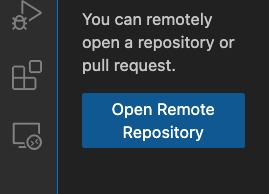
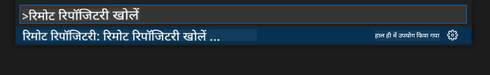
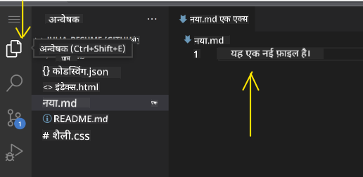
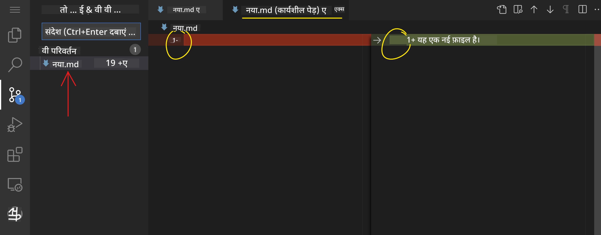
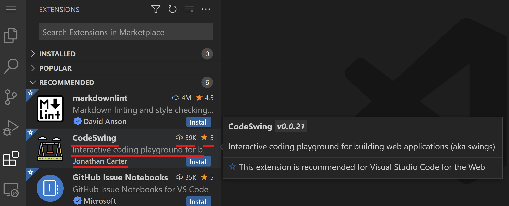
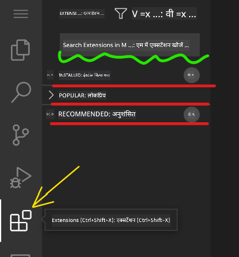
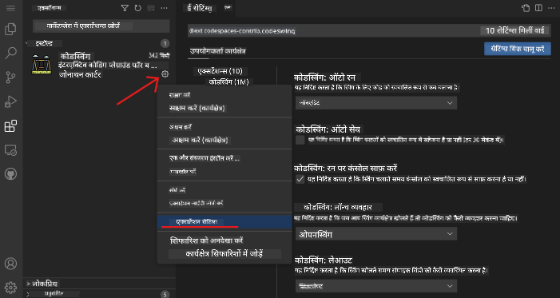

<!--
CO_OP_TRANSLATOR_METADATA:
{
  "original_hash": "1ba61d96a11309a2a6ea507496dcf7e5",
  "translation_date": "2025-08-29T16:01:55+00:00",
  "source_file": "8-code-editor/1-using-a-code-editor/README.md",
  "language_code": "hi"
}
-->
# कोड एडिटर का उपयोग करना

यह पाठ [VSCode.dev](https://vscode.dev) नामक एक वेब-आधारित कोड एडिटर के उपयोग की मूल बातें कवर करता है, ताकि आप अपने कोड में बदलाव कर सकें और किसी प्रोजेक्ट में योगदान कर सकें, बिना अपने कंप्यूटर पर कुछ भी इंस्टॉल किए।

<!----
TODO: एक वैकल्पिक छवि जोड़ें

> स्केच नोट [लेखक का नाम](https://example.com) द्वारा
---->

<!---
## प्री-लेक्चर क्विज़
[प्री-लेक्चर क्विज़](https://ff-quizzes.netlify.app/web/quiz/3)
---->

## सीखने के उद्देश्य

इस पाठ में, आप सीखेंगे:

- कोड प्रोजेक्ट में कोड एडिटर का उपयोग करना
- वर्शन कंट्रोल के साथ बदलावों को ट्रैक करना
- विकास के लिए एडिटर को कस्टमाइज़ करना

### पूर्व आवश्यकताएँ

शुरू करने से पहले, आपको [GitHub](https://github.com) पर एक खाता बनाना होगा। [GitHub](https://github.com/) पर जाएं और यदि आपने पहले से खाता नहीं बनाया है, तो एक खाता बनाएं।

### परिचय

कोड एडिटर प्रोग्राम लिखने और मौजूदा कोडिंग प्रोजेक्ट्स के साथ सहयोग करने के लिए एक आवश्यक उपकरण है। एक बार जब आप एडिटर की मूल बातें और इसकी विशेषताओं का उपयोग करना समझ जाते हैं, तो आप उन्हें कोड लिखते समय लागू कर सकते हैं।

## VSCode.dev के साथ शुरुआत करना

[VSCode.dev](https://vscode.dev) एक वेब-आधारित कोड एडिटर है। इसे उपयोग करने के लिए आपको कुछ भी इंस्टॉल करने की आवश्यकता नहीं है, यह किसी अन्य वेबसाइट को खोलने जैसा है। एडिटर के साथ शुरुआत करने के लिए, निम्न लिंक खोलें: [https://vscode.dev](https://vscode.dev)। यदि आप [GitHub](https://github.com/) में साइन इन नहीं हैं, तो साइन इन करने या नया खाता बनाने के लिए दिए गए निर्देशों का पालन करें और फिर साइन इन करें।

लोड होने के बाद, यह इस छवि के समान दिखना चाहिए:



तीन मुख्य भाग हैं, बाईं ओर से दाईं ओर बढ़ते हुए:

1. _एक्टिविटी बार_, जिसमें कुछ आइकन शामिल हैं, जैसे आवर्धक कांच 🔎, गियर ⚙️, और कुछ अन्य।
1. विस्तारित एक्टिविटी बार, जो डिफ़ॉल्ट रूप से _एक्सप्लोरर_ होता है, जिसे _साइड बार_ कहा जाता है।
1. और अंत में, कोड क्षेत्र दाईं ओर।

प्रत्येक आइकन पर क्लिक करें ताकि एक अलग मेनू प्रदर्शित हो। जब हो जाए, तो _एक्सप्लोरर_ पर क्लिक करें ताकि आप वहीं वापस आ सकें जहां आपने शुरुआत की थी।

जब आप कोड बनाना शुरू करते हैं या मौजूदा कोड में बदलाव करते हैं, तो यह सबसे बड़े क्षेत्र में दाईं ओर होगा। आप इस क्षेत्र का उपयोग मौजूदा कोड को देखने के लिए भी करेंगे, जिसे आप अगले चरण में करेंगे।

## GitHub रिपॉजिटरी खोलें

पहली चीज़ जो आपको चाहिए वह है एक GitHub रिपॉजिटरी खोलना। रिपॉजिटरी खोलने के कई तरीके हैं। इस सेक्शन में आप दो अलग-अलग तरीके देखेंगे जिनसे आप रिपॉजिटरी खोल सकते हैं और बदलावों पर काम शुरू कर सकते हैं।

### 1. एडिटर के साथ

रिमोट रिपॉजिटरी खोलने के लिए एडिटर का उपयोग करें। यदि आप [VSCode.dev](https://vscode.dev) पर जाते हैं, तो आपको _"Open Remote Repository"_ बटन दिखाई देगा:



आप कमांड पैलेट का उपयोग भी कर सकते हैं। कमांड पैलेट एक इनपुट बॉक्स है जहां आप किसी भी शब्द को टाइप कर सकते हैं जो किसी कमांड या एक्शन का हिस्सा है ताकि सही कमांड को निष्पादित किया जा सके। मेनू का उपयोग करें जो ऊपर-बाईं ओर है, फिर _View_ चुनें, और फिर _Command Palette_ चुनें, या निम्न कीबोर्ड शॉर्टकट का उपयोग करें: Ctrl-Shift-P (MacOS पर यह Command-Shift-P होगा)।



मेनू खुलने के बाद, _open remote repository_ टाइप करें, और फिर पहला विकल्प चुनें। कई रिपॉजिटरी जो आप हिस्सा हैं या जिन्हें आपने हाल ही में खोला है, दिखाई देंगी। आप एक पूर्ण GitHub URL का उपयोग करके भी एक चुन सकते हैं। निम्न URL का उपयोग करें और इसे बॉक्स में पेस्ट करें:

```
https://github.com/microsoft/Web-Dev-For-Beginners
```

✅ यदि सफल हुआ, तो आप इस रिपॉजिटरी की सभी फाइलें टेक्स्ट एडिटर में लोड होती हुई देखेंगे।

### 2. URL का उपयोग करके

आप सीधे URL का उपयोग करके भी रिपॉजिटरी लोड कर सकते हैं। उदाहरण के लिए, वर्तमान रिपॉजिटरी का पूर्ण URL [https://github.com/microsoft/Web-Dev-For-Beginners](https://github.com/microsoft/Web-Dev-For-Beginners) है, लेकिन आप GitHub डोमेन को `VSCode.dev/github` से बदल सकते हैं और रिपॉजिटरी को सीधे लोड कर सकते हैं। परिणामी URL होगा [https://vscode.dev/github/microsoft/Web-Dev-For-Beginners](https://vscode.dev/github/microsoft/Web-Dev-For-Beginners)।

## फाइलें संपादित करें

एक बार जब आपने ब्राउज़र/VSCode.dev पर रिपॉजिटरी खोल ली, तो अगला कदम प्रोजेक्ट में अपडेट या बदलाव करना होगा।

### 1. नई फाइल बनाएं

आप या तो मौजूदा फोल्डर के अंदर एक फाइल बना सकते हैं, या इसे रूट डायरेक्टरी/फोल्डर में बना सकते हैं। नई फाइल बनाने के लिए, उस स्थान/डायरेक्टरी को खोलें जहां आप फाइल को सेव करना चाहते हैं और एक्टिविटी बार _(बाईं ओर)_ पर _'New file ...'_ आइकन चुनें, इसे एक नाम दें और एंटर दबाएं।


### 2. रिपॉजिटरी पर फाइल संपादित और सेव करें

VSCode.dev का उपयोग तब मददगार होता है जब आप अपने प्रोजेक्ट में जल्दी अपडेट करना चाहते हैं बिना किसी सॉफ़्टवेयर को स्थानीय रूप से लोड किए। अपने कोड को अपडेट करने के लिए, एक्टिविटी बार पर स्थित 'Explorer' आइकन पर क्लिक करें ताकि रिपॉजिटरी में फाइलें और फोल्डर देख सकें। एक फाइल चुनें ताकि इसे कोड क्षेत्र में खोल सकें, अपने बदलाव करें और सेव करें।



जब आप अपने प्रोजेक्ट को अपडेट कर लें, तो _`source control`_ आइकन चुनें जिसमें आपके द्वारा रिपॉजिटरी में किए गए सभी नए बदलाव शामिल हैं।

अपने प्रोजेक्ट में किए गए बदलावों को देखने के लिए, विस्तारित एक्टिविटी बार में `Changes` फोल्डर में फाइल(s) चुनें। यह आपके लिए 'Working Tree' खोलेगा ताकि आप फाइल में किए गए बदलावों को विज़ुअली देख सकें। लाल रंग प्रोजेक्ट में हटाने को दिखाता है, जबकि हरा रंग जोड़ने को दर्शाता है।



यदि आप अपने द्वारा किए गए बदलावों से संतुष्ट हैं, तो `Changes` फोल्डर पर होवर करें और बदलावों को स्टेज करने के लिए `+` बटन पर क्लिक करें। स्टेजिंग का मतलब है कि आपके बदलावों को GitHub पर कमिट करने के लिए तैयार करना।

यदि हालांकि आप कुछ बदलावों से संतुष्ट नहीं हैं और उन्हें हटाना चाहते हैं, तो `Changes` फोल्डर पर होवर करें और `undo` आइकन चुनें।

फिर, एक `commit message` टाइप करें _(आपके द्वारा प्रोजेक्ट में किए गए बदलावों का विवरण)_, `check icon` पर क्लिक करें ताकि बदलावों को कमिट और पुश कर सकें।

जब आप अपने प्रोजेक्ट पर काम करना समाप्त कर लें, तो ऊपर-बाईं ओर `hamburger menu icon` चुनें ताकि github.com पर रिपॉजिटरी पर वापस जा सकें।


## एक्सटेंशन का उपयोग करना

VSCode पर एक्सटेंशन इंस्टॉल करना आपको अपने एडिटर में नई सुविधाएँ और कस्टमाइज़्ड विकास पर्यावरण विकल्प जोड़ने की अनुमति देता है ताकि आपका विकास वर्कफ़्लो बेहतर हो सके। ये एक्सटेंशन आपको कई प्रोग्रामिंग भाषाओं के लिए समर्थन जोड़ने में मदद करते हैं और अक्सर या तो सामान्य एक्सटेंशन होते हैं या भाषा-आधारित एक्सटेंशन।

सभी उपलब्ध एक्सटेंशनों की सूची ब्राउज़ करने के लिए, एक्टिविटी बार पर _`Extensions icon`_ पर क्लिक करें और _'Search Extensions in Marketplace'_ लेबल वाले टेक्स्ट फ़ील्ड में एक्सटेंशन का नाम टाइप करना शुरू करें। आपको एक्सटेंशन की एक सूची दिखाई देगी, जिसमें **एक्सटेंशन का नाम, प्रकाशक का नाम, एक वाक्य का विवरण, डाउनलोड की संख्या** और **स्टार रेटिंग** शामिल है।



आप सभी पहले से इंस्टॉल किए गए एक्सटेंशनों को _`Installed folder`_ में, अधिकांश डेवलपर्स द्वारा उपयोग किए जाने वाले लोकप्रिय एक्सटेंशनों को _`Popular folder`_ में और आपके लिए अनुशंसित एक्सटेंशनों को _`recommended folder`_ में देख सकते हैं, जो या तो एक ही वर्कस्पेस में उपयोगकर्ताओं द्वारा या आपके हाल ही में खोले गए फाइलों के आधार पर सुझाए गए हैं।



### 1. एक्सटेंशन इंस्टॉल करें

एक्सटेंशन इंस्टॉल करने के लिए, सर्च फ़ील्ड में एक्सटेंशन का नाम टाइप करें और इसे विस्तारित एक्टिविटी बार में दिखाई देने पर चुनें ताकि कोड क्षेत्र में एक्सटेंशन के बारे में अतिरिक्त जानकारी देख सकें।

आप या तो विस्तारित एक्टिविटी बार में _ब्लू इंस्टॉल बटन_ पर क्लिक करके इंस्टॉल कर सकते हैं या कोड क्षेत्र में दिखाई देने वाले इंस्टॉल बटन का उपयोग कर सकते हैं जब आप एक्सटेंशन को चुनते हैं।


### 2. एक्सटेंशन कस्टमाइज़ करें

एक्सटेंशन इंस्टॉल करने के बाद, आपको इसकी कार्यक्षमता को संशोधित करने और इसे अपनी प्राथमिकताओं के अनुसार कस्टमाइज़ करने की आवश्यकता हो सकती है। ऐसा करने के लिए, एक्सटेंशन आइकन चुनें, और इस बार, आपका एक्सटेंशन _Installed folder_ में दिखाई देगा, _**Gear icon**_ पर क्लिक करें और _Extensions Setting_ पर जाएं।



### 3. एक्सटेंशन प्रबंधित करें

एक्सटेंशन इंस्टॉल और उपयोग करने के बाद, vscode.dev विभिन्न आवश्यकताओं के आधार पर आपके एक्सटेंशन को प्रबंधित करने के विकल्प प्रदान करता है। उदाहरण के लिए, आप चुन सकते हैं:

- **डिसेबल करें:** _(जब आपको एक्सटेंशन की आवश्यकता नहीं हो लेकिन आप इसे पूरी तरह से अनइंस्टॉल नहीं करना चाहते हैं तो आप इसे अस्थायी रूप से डिसेबल कर सकते हैं)_

    विस्तारित एक्टिविटी बार में इंस्टॉल किए गए एक्सटेंशन का चयन करें > Gear आइकन पर क्लिक करें > 'Disable' या 'Disable (Workspace)' चुनें **या** कोड क्षेत्र में एक्सटेंशन खोलें और ब्लू Disable बटन पर क्लिक करें।

   
- **अनइंस्टॉल करें:** विस्तारित एक्टिविटी बार में इंस्टॉल किए गए एक्सटेंशन का चयन करें > Gear आइकन पर क्लिक करें > 'Uninstall' चुनें **या** कोड क्षेत्र में एक्सटेंशन खोलें और ब्लू Uninstall बटन पर क्लिक करें।

---

## असाइनमेंट

[VSCode.dev का उपयोग करके एक रिज़्यूमे वेबसाइट बनाएं](https://github.com/microsoft/Web-Dev-For-Beginners/blob/main/8-code-editor/1-using-a-code-editor/assignment.md)

<!----
## पोस्ट-लेक्चर क्विज़
[पोस्ट-लेक्चर क्विज़](https://ff-quizzes.netlify.app/web/quiz/4)
---->

## समीक्षा और स्व-अध्ययन

[VSCode.dev](https://code.visualstudio.com/docs/editor/vscode-web?WT.mc_id=academic-0000-alfredodeza) और इसकी अन्य विशेषताओं के बारे में अधिक पढ़ें।

---

**अस्वीकरण**:  
यह दस्तावेज़ AI अनुवाद सेवा [Co-op Translator](https://github.com/Azure/co-op-translator) का उपयोग करके अनुवादित किया गया है। जबकि हम सटीकता के लिए प्रयासरत हैं, कृपया ध्यान दें कि स्वचालित अनुवाद में त्रुटियां या अशुद्धियां हो सकती हैं। मूल भाषा में उपलब्ध मूल दस्तावेज़ को आधिकारिक स्रोत माना जाना चाहिए। महत्वपूर्ण जानकारी के लिए, पेशेवर मानव अनुवाद की सिफारिश की जाती है। इस अनुवाद के उपयोग से उत्पन्न किसी भी गलतफहमी या गलत व्याख्या के लिए हम उत्तरदायी नहीं हैं।  