<!--
CO_OP_TRANSLATOR_METADATA:
{
  "original_hash": "a9a3bcc037a447e2d8994d99e871cd9f",
  "translation_date": "2026-01-06T16:15:01+00:00",
  "source_file": "8-code-editor/1-using-a-code-editor/README.md",
  "language_code": "hi"
}
-->
# एक कोड संपादक का उपयोग करना: VSCode.dev में महारत हासिल करना

*द मैट्रिक्स* में याद है जब नियो को डिजिटल दुनिया तक पहुंचने के लिए एक विशाल कंप्यूटर टर्मिनल में प्लग इन करना पड़ा था? आज के वेब विकास उपकरण इसके विपरीत हैं – कहीं से भी सुलभ, अविश्वसनीय रूप से शक्तिशाली क्षमताएँ। VSCode.dev एक ब्राउज़र-आधारित कोड संपादक है जो किसी भी इंटरनेट से जुड़े डिवाइस पर पेशेवर विकास उपकरण लाता है।

जैसे मुद्रण प्रेस ने पुस्तकों को केवल मठस्थ पांडुलिपिकारों के लिए नहीं बल्कि सभी के लिए सुलभ बनाया, वैसे ही VSCode.dev कोडिंग को लोकतांत्रित करता है। आप पुस्तकालय के कंप्यूटर, स्कूल लैब या किसी भी जगह से काम कर सकते हैं जहाँ आपके पास ब्राउज़र की पहुँच हो। कोई इंस्टॉलेशन नहीं, कोई "मुझे मेरी विशिष्ट सेटअप चाहिए" की सीमाएँ नहीं।

इस पाठ के अंत तक, आप जान पाएंगे कि कैसे VSCode.dev में नेविगेट करना है, सीधे अपने ब्राउज़र में GitHub रिपॉजिटरी खोलनी है, और संस्करण नियंत्रण के लिए Git का उपयोग करना है – ये सारे कौशल पेशेवर डेवलपर्स दैनिक आधार पर उपयोग करते हैं।

## ⚡ अगले 5 मिनट में आप क्या कर सकते हैं

**व्यस्त डेवलपर्स के लिए त्वरित आरंभ मार्ग**


- **मिनट 1**: [vscode.dev](https://vscode.dev) पर जाएँ - कोई इंस्टॉलेशन आवश्यक नहीं
- **मिनट 2**: GitHub के साथ साइन इन करें ताकि अपने रिपॉजिटरी कनेक्ट कर सकें
- **मिनट 3**: URL ट्रिक आज़माएँ: किसी भी रिपॉजिटरी URL में `github.com` को `vscode.dev/github` से बदलें
- **मिनट 4**: एक नई फ़ाइल बनाएँ और देखें कि स्वतः सिंटैक्स हाइलाइटिंग काम करती है
- **मिनट 5**: कोई परिवर्तन करें और इसे Source Control पैनल के माध्यम से कमिट करें

**त्वरित टेस्ट URL**:
```
# Transform this:
github.com/microsoft/Web-Dev-For-Beginners

# Into this:
vscode.dev/github/microsoft/Web-Dev-For-Beginners
```

**यह क्यों महत्वपूर्ण है**: 5 मिनट में, आप कहीं से भी पेशेवर उपकरणों के साथ कोडिंग की स्वतंत्रता का अनुभव करेंगे। यह विकास का भविष्य दर्शाता है - सुलभ, शक्तिशाली, और तुरंत।

## 🗺️ क्लाउड-आधारित विकास के माध्यम से आपकी सीखने की यात्रा

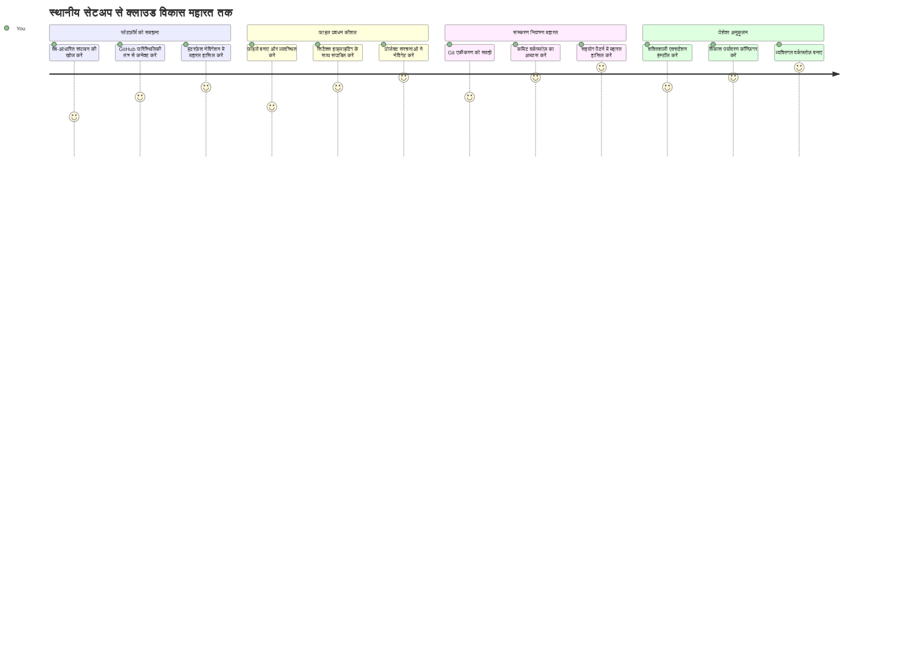
**आपका यात्रा गंतव्य**: इस पाठ के अंत तक, आप एक पेशेवर क्लाउड विकास वातावरण में महारत हासिल करेंगे जो किसी भी डिवाइस से काम करता है, जिससे आप बड़े तकनीकी कंपनियों के डेवलपर्स द्वारा उपयोग किए जाने वाले समान उपकरणों के साथ कोडिंग कर सकेंगे।

## आप क्या सीखेंगे

एक साथ इसे पूरा करने के बाद, आप सक्षम होंगे:

- VSCode.dev में नेविगेट करना जैसे यह आपका दूसरा घर हो – सब कुछ आसानी से ढूंढना
- किसी भी GitHub रिपॉजिटरी को अपने ब्राउज़र में खोलना और तुरंत संपादन शुरू करना (यह बहुत जादुई है!)
- Git का उपयोग करके अपने परिवर्तनों को ट्रैक करना और प्रगति को पेशेवर तरीके से सहेजना
- अपने संपादक को एक्सटेंशन्स के साथ सुपरचार्ज करना जो कोडिंग को तेज़ और अधिक मजेदार बनाते हैं
- प्रोजेक्ट फाइल्स बनाना और व्यवस्थित करना आत्मविश्वास से

## आपकी आवश्यकता क्या होगी

आवश्यकताएँ सरल हैं:

- एक मुफ़्त [GitHub खाता](https://github.com) (अगर आवश्यक हो तो हम निर्माण में मदद करेंगे)
- वेब ब्राउज़र की बुनियादी जानकारी
- GitHub बेसिक्स पाठ सहायक पृष्ठभूमि प्रदान करता है, हालांकि आवश्यक नहीं

> 💡 **GitHub में नए हैं?** खाता बनाना मुफ्त है और कुछ ही मिनटों में हो जाता है। जैसे पुस्तकालय कार्ड आपको विश्व भर की पुस्तकों तक पहुँच देता है, वैसे ही GitHub खाता आपको इंटरनेट पर कोड रिपॉजिटरी तक पहुंच खोलता है।

## 🧠 क्लाउड विकास पारिस्थितिकी तंत्र का अवलोकन

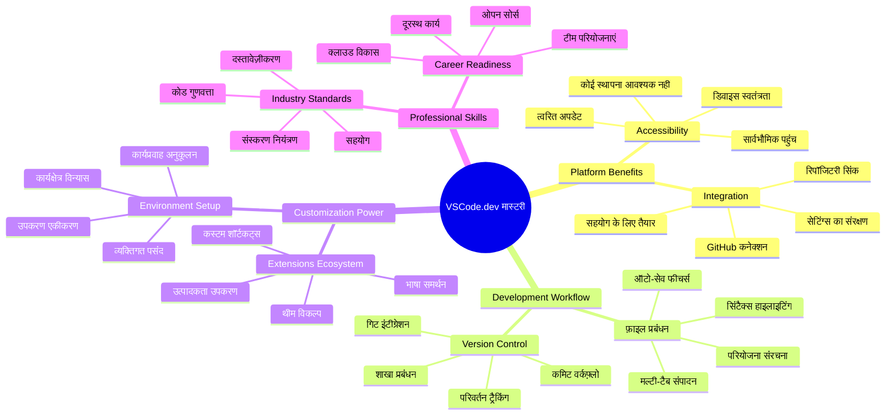
**मुख्य सिद्धांत**: क्लाउड-आधारित विकास वातावरण कोडिंग का भविष्य हैं - पेशेवर स्तर के उपकरण प्रदान करते हैं जो सुलभ, सहयोगी, और प्लेटफ़ॉर्म-स्वतंत्र हैं।

## वेब-आधारित कोड संपादकों का महत्व

इंटरनेट से पहले, विभिन्न विश्वविद्यालयों के वैज्ञानिक अपने शोध को आसानी से साझा नहीं कर पाते थे। फिर 1960 के दशक में ARPANET आया, जो कंप्यूटरों को दूर-दराज़ जगहों पर जोड़ता था। वेब-आधारित कोड संपादक इसी सिद्धांत का पालन करते हैं – जो आपकी भौतिक स्थिति या डिवाइस के बावजूद शक्तिशाली उपकरण उपलब्ध कराते हैं।

एक कोड संपादक आपका विकास कार्यस्थान होता है, जहाँ आप कोड फ़ाइलें लिखते, संपादित करते, और व्यवस्थित करते हैं। सरल टेक्स्ट संपादकों से अलग, पेशेवर कोड संपादक सिंटैक्स हाइलाइटिंग, त्रुटि पहचान, और परियोजना प्रबंधन सुविधाएं देते हैं।

VSCode.dev ये क्षमताएँ आपके ब्राउज़र में लाता है:

**वेब-आधारित संपादन के फायदे:**

| फीचर | विवरण | व्यावहारिक लाभ |
|---------|-------------|----------|
| **प्लेटफ़ॉर्म स्वतंत्रता** | किसी भी ब्राउज़र वाले डिवाइस पर चलता है | विभिन्न कंप्यूटरों से सहज काम करें |
| **कोई इंस्टॉलेशन आवश्यक नहीं** | वेब URL के माध्यम से पहुँच | सॉफ्टवेयर इंस्टॉलेशन प्रतिबंधों को बायपास करें |
| **स्वचालित अपडेट्स** | हमेशा नवीनतम संस्करण चलता है | मैन्युअल अद्यतन के बिना नई सुविधाएँ प्राप्त करें |
| **रिपॉजिटरी एकीकरण** | GitHub से सीधे कनेक्शन | स्थानीय फ़ाइल प्रबंधन के बिना कोड संपादित करें |

**व्यावहारिक प्रभाव:**
- विभिन्न वातावरणों में काम की निरंतरता
- ऑपरेटिंग सिस्टम से स्वतंत्र सुसंगत इंटरफ़ेस
- तत्काल सहयोग क्षमताएँ
- स्थानीय संग्रहण आवश्यकताओं में कमी

## VSCode.dev का अन्वेषण

जैसे मैरी क्यूरी की प्रयोगशाला में अपेक्षाकृत सामान्य जगह में उन्नत उपकरण थे, वैसे ही VSCode.dev पेशेवर विकास उपकरणों को एक ब्राउज़र इंटरफ़ेस में पैक करता है। यह वेब एप्लिकेशन डेस्कटॉप कोड संपादकों जैसी मूलभूत कार्यक्षमता प्रदान करता है।

अपने ब्राउज़र में [vscode.dev](https://vscode.dev) पर जाएँ। इंटरफ़ेस बिना डाउनलोड या सिस्टम इंस्टॉलेशन के लोड होता है – क्लाउड कंप्यूटिंग सिद्धांतों का सीधे अनुप्रयोग।

### अपने GitHub खाते से कनेक्ट करना

जैसे अलेक्जेंडर ग्राहम बेल का टेलीफोन दूर-दराज़ स्थानों को जोड़ता था, वैसे ही आपके GitHub खाते का लिंक VSCode.dev को आपके कोड रिपॉजिटरी से जोड़ता है। GitHub के साथ साइन इन करने के लिए कहा जाए तो इसे स्वीकार करना सुझाया जाता है।

**GitHub एकीकरण प्रदान करता है:**
- संपादक के भीतर आपके रिपॉजिटरी तक सीधे पहुँच
- उपकरण और एक्सटेंशन्स के सिंक्रनाइज़ेशन से सेटिंग्स समान रहें
- GitHub में काम को आसान और सुव्यवस्थित तरीके से सहेजना
- व्यक्तिगत विकास वातावरण

### अपने नए कार्यस्थान को जानना

जब सब कुछ लोड हो जाए, तो आप एक खूबसूरती से साफ-सुथरा कार्यस्थान देखेंगे जो आपको अपने कोड पर ध्यान केंद्रित रखने के लिए डिज़ाइन किया गया है!

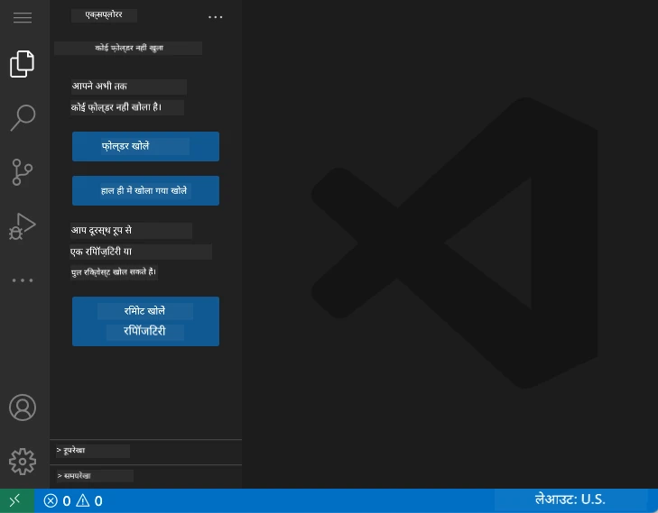

**यहाँ आपके आस-पास का टूर है:**
- **गतिविधि पट्टी** (बाएँ पट्टी): आपकी मुख्य नेविगेशन जिसमें एक्सप्लोरर 📁, सर्च 🔍, सोर्स कंट्रोल 🌿, एक्सटेंशन्स 🧩, और सेटिंग्स ⚙️ शामिल हैं
- **साइडबार** (इसके बगल वाला पैनल): चयनित आइटम के आधार पर प्रासंगिक जानकारी दिखाता है
- **संपादक क्षेत्र** (बीच का बड़ा क्षेत्र): जहाँ जादू चलता है – आपका मुख्य कोडिंग क्षेत्र

**कुछ पल लें और एक्सप्लोर करें:**
- उन गतिविधि पट्टी आइकन पर क्लिक करें और देखें कि प्रत्येक क्या करता है
- ध्यान दें कि साइडबार कैसे अलग-अलग जानकारी दिखाता है – काफी अच्छा है, है ना?
- एक्सप्लोरर व्यू (📁) शायद आपका सबसे अधिक समय बिताने का स्थान होगा, इसलिए इसमें आराम से रहें

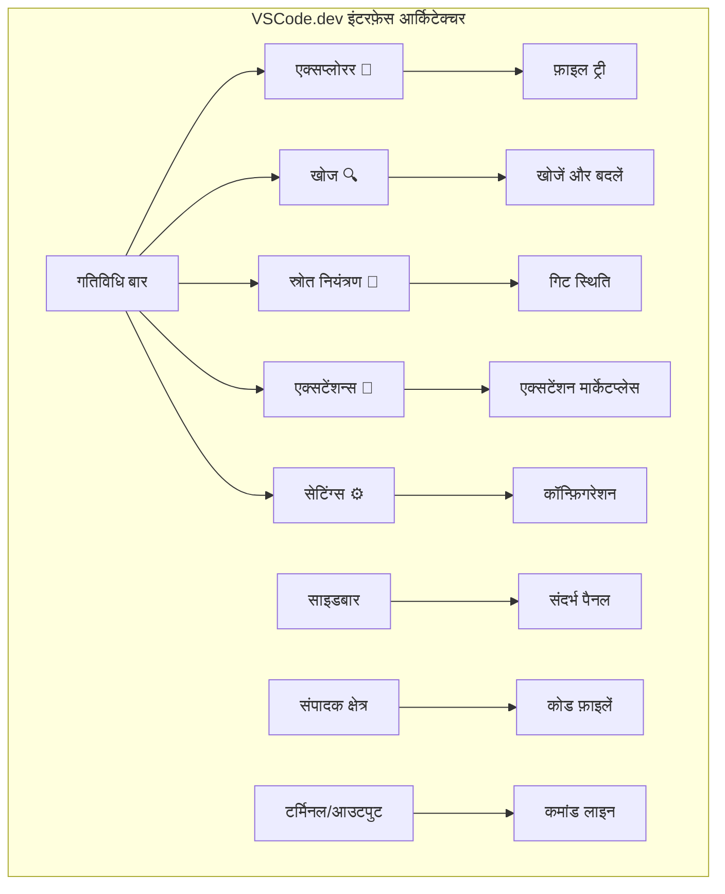
## GitHub रिपॉजिटरी खोलना

इंटरनेट से पहले, शोधकर्ताओं को दस्तावेज़ों तक पहुँचने के लिए भौतिक रूप से पुस्तकालय जाना पड़ता था। GitHub रिपॉजिटरी इसी तरह हैं – कोड का दूरस्थ संग्रह। VSCode.dev आपके स्थानीय मशीन पर रिपॉजिटरी डाउनलोड करने की परंपरागत आवश्यकता को समाप्त करता है।

यह क्षमता तत्काल किसी भी सार्वजनिक रिपॉजिटरी को देखने, संपादित करने, या योगदान करने की अनुमति देती है। यहां रिपॉजिटरी खोलने के दो तरीके हैं:

### विधि 1: पॉइंट-एंड-क्लिक तरीका

यह तब उपयुक्त है जब आप VSCode.dev में नये हैं और किसी विशिष्ट रिपॉजिटरी को खोलना चाहते हैं। यह सीधा और शुरुआती के लिए अनुकूल है:

**ऐसा करें:**

1. यदि आप पहले से नहीं हैं तो [vscode.dev](https://vscode.dev) पर जाएं
2. स्वागत स्क्रीन पर "Open Remote Repository" बटन देखें और क्लिक करें

   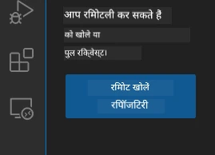

3. कोई भी GitHub रिपॉजिटरी URL पेस्ट करें (इसको आज़माएँ: `https://github.com/microsoft/Web-Dev-For-Beginners`)
4. Enter दबाएं और जादू देखें!

**पेशेवर सुझाव - कमांड पॅलेट शॉर्टकट:**

कोडिंग जादूगर जैसा महसूस करना चाहते हैं? यह कीबोर्ड शॉर्टकट आज़माएँ: Ctrl+Shift+P (या Mac पर Cmd+Shift+P) कमांड पॅलेट खोलने के लिए:

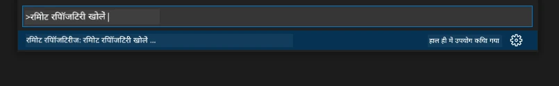

**कमांड पॅलेट ऐसा है जैसे आपके पास हर चीज़ के लिए एक खोज इंजन हो:**
- "open remote" टाइप करें और यह आपके लिए रिपॉजिटरी खोलने वाला दिखाएगा
- हाल ही में खोली गई रिपॉजिटरी का रिकॉर्ड रखता है (बहुत उपयोगी!)
- जब आप इसका उपयोग करना सीखेंगे तो लगेगा जैसे आप बिजली की गति से कोडिंग कर रहे हैं
- यह मूल रूप से VSCode.dev का "हे सिरी, लेकिन कोडिंग के लिए" संस्करण है

### विधि 2: URL संशोधन तकनीक

जैसे HTTP और HTTPS विभिन्न प्रोटोकॉल का उपयोग करते हैं लेकिन डोमेन संरचना समान रहती है, वैसे ही VSCode.dev एक URL पैटर्न का उपयोग करता है जो GitHub के पते की प्रणाली को प्रतिबिंबित करता है। किसी भी GitHub रिपॉजिटरी URL को बदला जा सकता है ताकि यह सीधे VSCode.dev में खुले।

**URL रूपांतरण पैटर्न:**

| रिपॉजिटरी प्रकार | GitHub URL | VSCode.dev URL |
|----------------|---------------------|----------------|
| **सार्वजनिक रिपॉजिटरी** | `github.com/microsoft/Web-Dev-For-Beginners` | `vscode.dev/github/microsoft/Web-Dev-For-Beginners` |
| **व्यक्तिगत प्रोजेक्ट** | `github.com/your-username/my-project` | `vscode.dev/github/your-username/my-project` |
| **कोई भी सुलभ रिपॉजिटरी** | `github.com/their-username/awesome-repo` | `vscode.dev/github/their-username/awesome-repo` |

**कार्यान्वयन:**
- `github.com` को `vscode.dev/github` से बदलें
- बाकी सभी URL घटकों को अपरिवर्तित रखें
- किसी भी सार्वजनिक रूप से सुलभ रिपॉजिटरी के साथ काम करता है
- त्वरित संपादन पहुँच प्रदान करता है

> 💡 **जीवन बदलने वाला सुझाव**: अपनी पसंदीदा रिपॉजिटरी के VSCode.dev संस्करण को बुकमार्क करें। मेरे पास "Edit My Portfolio" और "Fix Documentation" जैसे बुकमार्क हैं जो मुझे सीधे संपादन मोड में ले जाते हैं!

**आप किस विधि का उपयोग करें?**
- **इंटरफेस तरीका**: जब आप अन्वेषण कर रहे हों या सही रिपॉजिटरी नाम याद न हो तो अच्छा
- **URL ट्रिक**: जब आप जानते हों कि कहां जाना है तो अल्ट्रा-तेज पहुँच के लिए उत्तम

### 🎯 शैक्षिक जांच: क्लाउड विकास पहुँच

**रुकें और सोचें**: आपने अभी वेब ब्राउज़र के माध्यम से कोड रिपॉजिटरी तक पहुंचने के दो तरीके सीखे हैं। यह विकास कार्यप्रणाली में मौलिक बदलाव का प्रतिनिधित्व करता है।

**त्वरित स्व-मूल्यांकन**:
- क्या आप समझा सकते हैं क्यों वेब-आधारित संपादन पारंपरिक "डेवलपमेंट वातावरण सेटअप" को समाप्त करता है?
- URL संशोधन तकनीक स्थानीय git क्लोनिंग की तुलना में क्या फायदे देती है?
- यह तरीका ओपन सोर्स परियोजनाओं में योगदान करने के तरीके को कैसे बदल सकता है?

**वास्तविक दुनिया संबंध**: प्रमुख कंपनियां जैसे GitHub, GitLab, और Replit ने अपने विकास प्लेटफ़ॉर्म को इन क्लाउड-प्रथम सिद्धांतों के आसपास बनाया है। आप वही कार्यप्रणाली सीख रहे हैं जिसे पेशेवर विकास टीमें विश्व स्तर पर उपयोग करती हैं।

**चुनौती प्रश्न**: क्लाउड-आधारित विकास स्कूलों में कोडिंग पढ़ाने के तरीके को कैसे बदल सकता है? उपकरण आवश्यकताओं, सॉफ़्टवेयर प्रबंधन, और सहयोगात्मक संभावनाओं पर सोचें।

## फ़ाइलों और प्रोजेक्ट्स के साथ काम करना

अब जब आपके पास एक रिपॉजिटरी खुली है, तो चलिए निर्माण शुरू करते हैं! VSCode.dev आपको वह सब कुछ देता है जिसकी आपको अपनी कोड फ़ाइलें बनाने, संपादित करने, और व्यवस्थित करने के लिए आवश्यकता है। इसे आपकी डिजिटल कार्यशाला समझें – हर उपकरण वहीं है जहाँ आपको इसकी ज़रूरत है।

आइए उन रोज़मर्रा के कार्यों में गोता लगाएँ जो आपके कोडिंग वर्कफ़्लो का अधिकांश हिस्सा बनेंगे।

### नई फ़ाइल बनाना

जैसे किसी वास्तुकार के कार्यालय में योजनाओं का आयोजन होता है, वैसे ही VSCode.dev में फ़ाइल निर्माण एक क्रमबद्ध प्रक्रिया है। यह प्रणाली सभी मानक वेब विकास फ़ाइल प्रकारों का समर्थन करती है।

**फ़ाइल निर्माण प्रक्रिया:**

1. एक्सप्लोरर साइडबार में लक्ष्य फ़ोल्डर पर जाएं
2. फ़ोल्डर नाम पर होवर करें ताकि "नई फ़ाइल" आइकन (📄+) दिखे
3. फ़ाइल नाम दर्ज करें जिसमें उचित एक्सटेंशन हो (`style.css`, `script.js`, `index.html`)
4. Enter दबाएं फ़ाइल बनाने के लिए

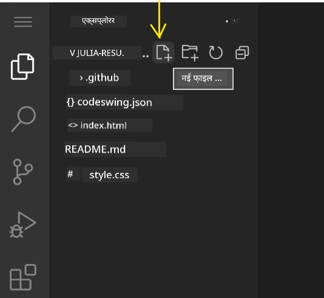

**नामकरण नियम:**
- वर्णनात्मक नामों का उपयोग करें जो फ़ाइल के उद्देश्य को दर्शाते हों
- उचित सिंटैक्स हाइलाइटिंग के लिए फ़ाइल एक्सटेंशन्स शामिल करें
- पूरे परियोजनाओं में एकसमान नामकरण पैटर्न का पालन करें
- स्थानों की बजाय छोटे अक्षर और हाइफ़न का उपयोग करें

### फ़ाइलें संपादित करना और सहेजना

यहीं से असली मज़ा शुरू होता है! VSCode.dev का संपादक उपयोगी विशेषताओं से भरा है जो कोडिंग को सहज और सहज महसूस कराता है। यह एक बहुत स्मार्ट लेखन सहायक की तरह है, लेकिन कोडिंग के लिए।

**आपका संपादन वर्कफ़्लो:**

1. एक्सप्लोरर में किसी भी फ़ाइल पर क्लिक करें, वह मुख्य क्षेत्र में खुलेगी
2. टाइपिंग शुरू करें और देखें कि VSCode.dev रंग, सुझाव, और त्रुटि पहचान के साथ आपकी मदद करता है
3. Ctrl+S (Windows/Linux) या Cmd+S (Mac) से अपना काम सेव करें – हालांकि यह अपने आप भी सेव करता है!

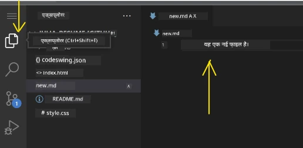

**कोड करते हुए जो बढ़िया होता है:**
- आपका कोड खूबसूरती से रंगीन होता है जिससे पढ़ना आसान हो जाता है
- टाइप करते समय VSCode.dev सुझाव देता है (जैसे ऑटोकरेक्ट, लेकिन बहुत स्मार्ट)
- यह त्रुटियां और टाइपो सेव करने से पहले पकड़ लेता है
- आप कई फ़ाइलें टैब में खोल सकते हैं, जैसे ब्राउज़र में होते हैं
- सब कुछ पृष्ठभूमि में स्वचालित रूप से सहेजा जाता है

> ⚠️ **त्वरित सुझाव**: भले ही ऑटोसेव आपके लिए काम कर रहा हो, Ctrl+S या Cmd+S दबाना एक अच्छा अभ्यास है। यह तुरंत सब कुछ सहेजता है और त्रुटि जांच जैसी अतिरिक्त सुविधाएं सक्रिय करता है।

### Git के साथ संस्करण नियंत्रण

जैसे पुरातत्व विज्ञानी खुदाई की परतों के विस्तृत रिकॉर्ड बनाते हैं, वैसे ही Git आपके कोड में समय के साथ हुए परिवर्तनों को ट्रैक करता है। यह प्रणाली परियोजना का इतिहास सुरक्षित रखती है और आपको आवश्यकतानुसार पिछली संस्करणों पर लौटने देती है। VSCode.dev में Git कार्यक्षमता एकीकृत है।

**सोर्स कंट्रोल इंटरफ़ेस:**

1. गतिविधि पट्टी में 🌿 आइकन के माध्यम से सोर्स कंट्रोल पैनल तक पहुँचें
2. संशोधित फ़ाइलें "परिवर्तन" अनुभाग में दिखें
3. रंग कोडिंग परिवर्तन के प्रकार को दर्शाती है: हरे रंग में जोड़ और लाल में हटाना

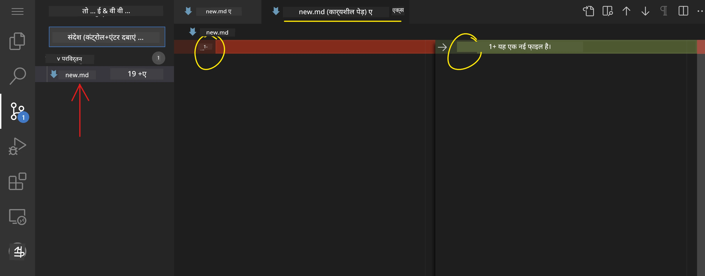

**अपने काम को सहेजना (कमिट वर्कफ़्लो):**

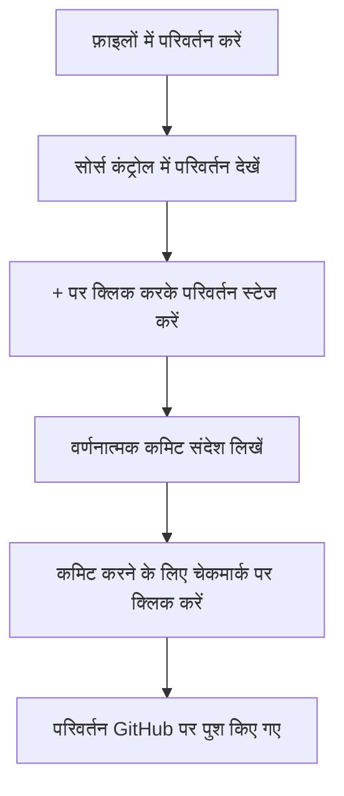
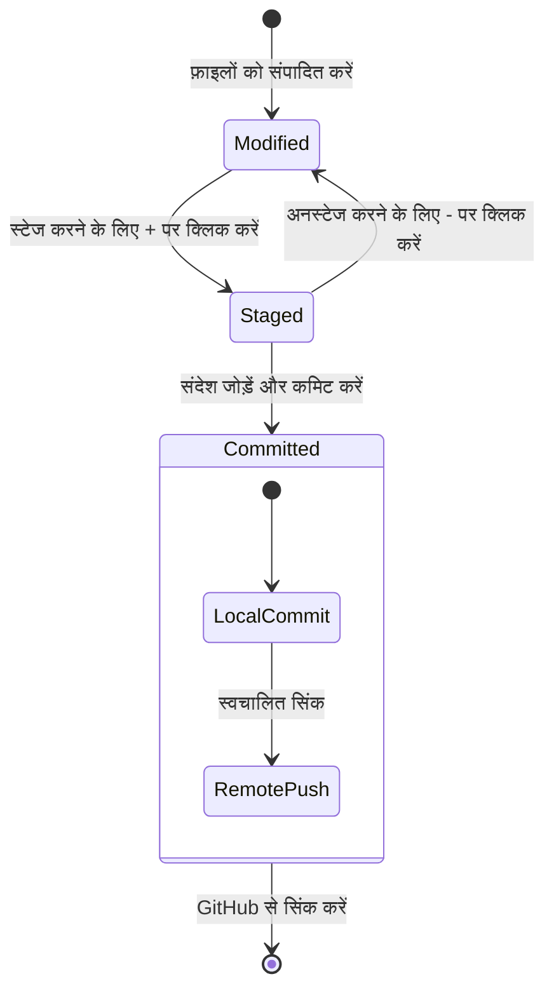
**यहाँ आपका चरण-दर-चरण प्रक्रिया है:**
- उस फ़ाइल के बगल "+" आइकन पर क्लिक करें जिसे आप सहेजना चाहते हैं (इसे "स्टेज" करना कहते हैं)
- दोबारा जांचें कि आप अपने सभी स्टेज किए गए परिवर्तनों से खुश हैं
- एक छोटा नोट लिखें जिसमें आप बताते हैं कि आपने क्या किया (यह आपका "कनेक्ट संदेश" है)
- सब कुछ GitHub पर सहेजने के लिए चेकमार्क बटन पर क्लिक करें
- अगर आप किसी चीज के बारे में अपना मन बदलते हैं, तो undo आइकन आपको परिवर्तनों को रद्द करने देता है

**अच्छे कनेक्ट संदेश लिखना (यह आपकी सोच से आसान है!):**
- बस यह बताएं कि आपने क्या किया, जैसे "संपर्क फॉर्म जोड़ें" या "टूटी हुई नेविगेशन ठीक करें"
- इसे छोटा और मीठा रखें – ट्वीट की लंबाई की तरह सोचें, न कि निबंध की
- क्रिया शब्दों से शुरू करें जैसे "जोड़ें", "ठीक करें", "अपडेट करें", या "हटाएं"
- **अच्छे उदाहरण**: "उत्तरदायी नेविगेशन मेनू जोड़ें", "मोबाइल लेआउट समस्याओं को ठीक करें", "बेहतर पहुंच के लिए रंग अपडेट करें"

> 💡 **त्वरित नेविगेशन टिप**: अपने GitHub रिपोजिटरी पर वापस जाने और अपने कमिट किए गए परिवर्तनों को ऑनलाइन देखने के लिए ऊपर बाएं कोने में हैमबर्गर मेनू (☰) का उपयोग करें। यह आपके संपादन वातावरण और आपके परियोजना के GitHub होम के बीच एक पोर्टल की तरह है!

## एक्सटेंशन के साथ कार्यक्षमता बढ़ाना

जैसे किसी शिल्पी के कार्यशाला में विभिन्न कार्यों के लिए विशेष उपकरण होते हैं, वैसे ही VSCode.dev को एक्सटेंशनों के साथ अनुकूलित किया जा सकता है जो विशिष्ट क्षमताएँ जोड़ते हैं। ये समुदाय द्वारा विकसित प्लगइन्स सामान्य विकास आवश्यकताओं जैसे कोड फॉर्मेटिंग, लाइव पूर्वावलोकन, और बेहतर Git एकीकरण को संबोधित करते हैं।

एक्सटेंशन मार्केटप्लेस में दुनिया भर के डेवलपर्स द्वारा बनाए गए हजारों मुफ्त उपकरण होते हैं। प्रत्येक एक्सटेंशन विशिष्ट वर्कफ़्लो चुनौतियों को हल करता है, जिससे आप अपनी व्यक्तिगत आवश्यकताओं और प्राथमिकताओं के अनुसार एक अनुकूलित विकास वातावरण बना सकते हैं।

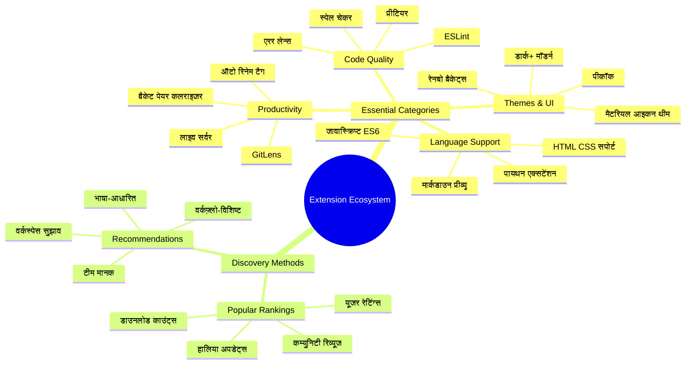
### अपने परिपूर्ण एक्सटेंशंस ढूँढना

एक्सटेंशन मार्केटप्लेस वास्तव में अच्छी तरह व्यवस्थित है, इसलिए आप जो चाहिए उसे खोजते हुए आप खोए नहींंगे। यह आपको विशिष्ट उपकरण और ऐसे कूल चीजें खोजने में मदद करने के लिए डिज़ाइन किया गया है जिनके बारे में आपको पता भी नहीं था!

**मार्केटप्लेस तक पहुँचने के लिए:**

1. एक्टिविटी बार में एक्सटेंशन आइकन (🧩) पर क्लिक करें
2. इधर-उधर ब्राउज़ करें या कुछ विशिष्ट खोजें
3. जो कुछ भी दिलचस्प लगे उस पर क्लिक करके अधिक जानें

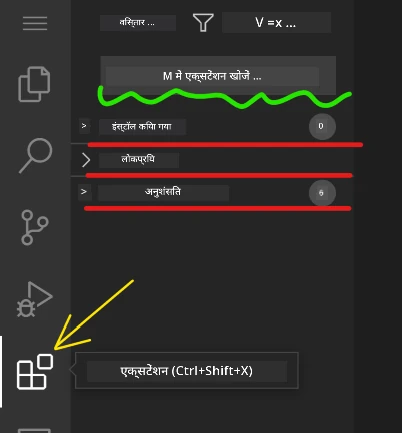

**आप वहाँ क्या देखेंगे:**

| अनुभाग | अंदर क्या है | यह कैसे सहायक है |
|----------|---------|----------|
| **इंस्टॉल्ड** | वो एक्सटेंशन जो आपने पहले ही जोड़े हैं | आपका व्यक्तिगत कोडिंग टूलकिट |
| **लोकप्रिय** | भीड़ के पसंदीदा | जिन पर अधिकांश डेवलपर्स भरोसा करते हैं |
| **सिफारिश की गई** | आपके प्रोजेक्ट के लिए स्मार्ट सुझाव | VSCode.dev की मददगार सिफारिशें |

**ब्राउज़िंग को आसान बनाने वाली बातें:**
- प्रत्येक एक्सटेंशन रेटिंग, डाउनलोड काउंट्स, और वास्तविक उपयोगकर्ता समीक्षाएँ दिखाता है
- आपको स्क्रीनशॉट और इस बात का स्पष्ट विवरण मिलता है कि प्रत्येक क्या करता है
- सब कुछ स्पष्ट रूप से संगतता जानकारी के साथ चिह्नित होता है
- समान एक्सटेंशनों का सुझाव दिया जाता है ताकि आप विकल्पों की तुलना कर सकें

### एक्सटेंशन इंस्टॉल करना (बहुत आसान!)

अपने संपादक में नई क्षमताएँ जोड़ना एक बटन क्लिक करने जितना सरल है। एक्सटेंशन सेकंडों में इंस्टॉल हो जाते हैं और तुरंत काम करना शुरू कर देते हैं – न रिस्टार्ट चाहिए, न इंतजार।

**यहाँ आपको क्या करना है:**

1. जो आप चाहते हैं उसे खोजें (जैसे "live server" या "prettier" खोजने की कोशिश करें)
2. जो अच्छा लगे उस पर क्लिक करके विवरण देखें
3. देखें कि वह क्या करता है और रेटिंग्स जांचें
4. नीले "इंस्टॉल" बटन पर क्लिक करें और आपका काम हो गया!


**पर्दे के पीछे क्या होता है:**
- एक्सटेंशन डाउनलोड होता है और अपने आप सेटअप हो जाता है
- नए फीचर्स तुरंत आपके इंटरफ़ेस में दिखाई देने लगते हैं
- सब कुछ तुरंत काम करना शुरू कर देता है (सच में, यह इतना तेज़ है!)
- यदि आप साइन इन हैं, तो एक्सटेंशन आपकी सभी डिवाइसेस पर सिंक हो जाता है

**कुछ एक्सटेंशन जिन्हें मैं शुरू करने के लिए सुझाऊंगा:**
- **Live Server**: जैसे ही आप कोड लिखते हैं, आपकी वेबसाइट का रियल-टाइम अपडेट देखें (यह एक जादू की तरह है!)
- **Prettier**: आपके कोड को स्वचालित रूप से साफ और पेशेवर दिखाता है
- **Auto Rename Tag**: एक HTML टैग बदलें और उसका जोड़ीदार भी अपडेट हो जाए
- **Bracket Pair Colorizer**: आपके कोष्ठकों को रंग-कोड करता है ताकि आप कभी रास्ता न भटकें
- **GitLens**: आपके Git फीचर्स को उपयोगी जानकारी के साथ सुपरचार्ज करता है

### अपने एक्सटेंशनों को अनुकूलित करना

अधिकांश एक्सटेंशन के सेटिंग्स होती हैं जिन्हें आप अपनी पसंद मुताबिक सेट कर सकते हैं। इसे कार की सीट और मिरर एडजस्ट करने की तरह सोचें—हर किसी की अपनी पसंद होती है!

**एक्सटेंशन सेटिंग्स एडजस्ट करना:**

1. एक्सटेंशंस पैनल में अपने इंस्टॉल किए हुए एक्सटेंशन को खोजें
2. उसके नाम के बगल में छोटे गियर आइकन (⚙️) पर क्लिक करें
3. ड्रॉपडाउन से "Extension Settings" चुनें
4. जब तक आपकी वर्कफ़्लो के लिए सब बिल्कुल सही न लगे, तब तक बदलाव करें

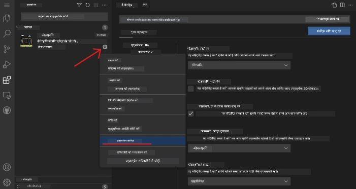

**आम चीजें जिन्हें आप समायोजित कर सकते हैं:**
- आपका कोड कैसे फॉर्मेट होता है (टैब vs स्पेस, लाइन की लंबाई आदि)
- कौन से कीबोर्ड शॉर्टकट्स विभिन्न क्रियाएं शुरू करते हैं
- एक्सटेंशन किन फ़ाइल प्रकारों के साथ काम करना चाहिए
- विशिष्ट फीचर्स को चालू या बंद करना ताकि चीज़ें साफ़ रहें

### अपने एक्सटेंशनों को व्यवस्थित रखना

जैसे-जैसे आप और अधिक कूल एक्सटेंशनों को खोजते हैं, आप अपनी कलेक्शन को व्यवस्थित और सुगम रखना चाहेंगे। VSCode.dev इसे प्रबंधित करना आसान बनाता है।

**आपके एक्सटेंशन प्रबंधन विकल्प:**

| आप क्या कर सकते हैं | यह कब सहायक है | प्रो टिप |
|--------|---------|----------|
| **Disable** | यह टेस्ट करने के लिए कि कोई एक्सटेंशन समस्याएँ पैदा कर रहा है | अनइंस्टॉल करने से बेहतर, अगर आप बाद में वापसी चाहते हैं |
| **Uninstall** | जिन एक्सटेंशनों की ज़रूरत नहीं उन्हें पूरी तरह हटाना | आपका वातावरण साफ़ और तेज़ रहता है |
| **Update** | नवीनतम फीचर्स और बग फिक्स प्राप्त करना | आमतौर पर ऑटोमैटिक होता है, लेकिन जांचना फायदेमंद है |

**मैं एक्सटेंशन को इस तरह प्रबंधित करता हूँ:**
- हर कुछ महीने में, मैं जो इंस्टॉल किया है उसका पुनरावलोकन करता हूँ और जो उपयोग में नहीं है उसे हटा देता हूँ
- मैं एक्सटेंशनों को अपडेट रखता हूँ ताकि मुझे सबसे ताज़ा सुधार और सुरक्षा अपडेट मिलें
- अगर कुछ धीमा लगता है, तो अस्थायी तौर पर एक्सटेंशनों को डिसेबल करके देखता हूँ कि क्या उनमें से कोई समस्या कर रहा है
- जब एक्सटेंशनों को बड़े अपडेट मिलते हैं तो मैं अपडेट नोट्स पढ़ता हूँ – कभी-कभी नए कूल फीचर्स होते हैं!

> ⚠️ **परफॉर्मेंस टिप**: एक्सटेंशन जबरदस्त हैं, लेकिन बहुत ज्यादा होने पर चीजें धीमी हो सकती हैं। उन पर ध्यान दें जो वास्तव में आपकी ज़िंदगी आसान बनाते हैं और जिनका उपयोग आप कभी नहीं करते उन्हें अनइंस्टॉल करने से न हिचकिचाएँ।

### 🎯 शिक्षण चेक-इन: विकास वातावरण अनुकूलन

**आर्किटेक्चर की समझ**: आपने समुदाय द्वारा बनाए गए एक्सटेंशनों का उपयोग करके एक पेशेवर विकास वातावरण को अनुकूलित करना सीखा है। यह व्यावसायिक विकास टीमों द्वारा मानकीकृत टूलचेन बनाने की प्रक्रिया को दर्शाता है।

**मुख्य अवधारणाएँ जो आप समझ गए हैं**:
- **एक्सटेंशन खोज**: ऐसे उपकरण खोजने जो विकास की विशिष्ट चुनौतियों का समाधान करते हैं
- **पर्यावरण कॉन्फ़िगरेशन**: उपकरणों को व्यक्तिगत या टीम की प्राथमिकताओं के अनुरूप अनुकूलित करना
- **प्रदर्शन अनुकूलन**: कार्यक्षमता और सिस्टम प्रदर्शन के बीच संतुलन बनाना
- **समुदाय सहयोग**: वैश्विक डेवलपर समुदाय द्वारा बनाए गए उपकरणों का लाभ उठाना

**उद्योग संबंध**: एक्सटेंशन इकोसिस्टम बड़े विकास प्लेटफार्मों जैसे VS Code, Chrome DevTools, और आधुनिक IDEs को शक्ति देते हैं। एक्सटेंशन का मूल्यांकन, इंस्टॉल, और कॉन्फ़िगर करना सीखना पेशेवर विकास कार्यप्रवाहों के लिए अनिवार्य है।

**प्रतिबिंब प्रश्न**: आप 10 डेवलपर्स की टीम के लिए मानकीकृत विकास वातावरण कैसे स्थापित करेंगे? स्थिरता, प्रदर्शन, और व्यक्तिगत प्राथमिकताओं पर विचार करें।

## 📈 आपकी क्लाउड विकास महारत का टाइमलाइन

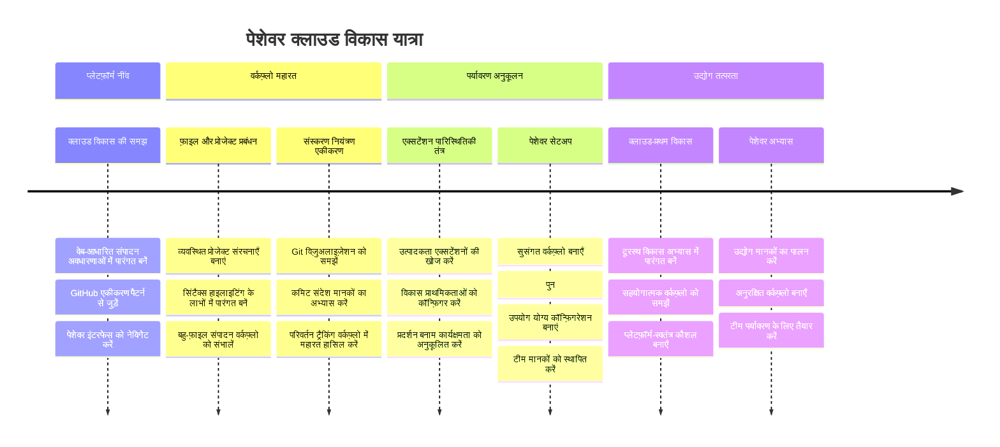
**🎓 स्नातक मील का पत्थर**: आपने उन उपकरणों और कार्यप्रवाहों का मास्टर किया है जो प्रमुख तकनीकी कंपनियों के पेशेवर डेवलपर्स उपयोग करते हैं। ये कौशल सॉफ्टवेयर विकास का भविष्य दर्शाते हैं।

**🔄 अगले स्तर की क्षमताएँ**:
- उन्नत क्लाउड विकास प्लेटफार्मों (Codespaces, GitPod) की खोज के लिए तैयार
- वितरित विकास टीमों में काम करने के लिए तैयार
- वैश्विक स्तर पर ओपन सोर्स परियोजनाओं में योगदान करने के लिए सशक्त
- आधुनिक DevOps और निरंतर समाकरण प्रथाओं के लिए आधार स्थापित

## GitHub Copilot एजेंट चुनौती 🚀

NASA के अंतरिक्ष मिशनों के लिए अपनाए गए संरचित दृष्टिकोण की तरह, यह चुनौती VSCode.dev कौशलों को एक पूर्ण कार्यप्रवाह परिप्रेक्ष्य में व्यवस्थित रूप से लागू करने को लेकर है।

**उद्देश्य:** VSCode.dev के साथ दक्षता प्रदर्शित करते हुए एक व्यापक वेब विकास कार्यप्रवाह स्थापित करना।

**परियोजना आवश्यकताएँ:** एजेंट मोड सहायता का उपयोग करते हुए, निम्नलिखित कार्य पूरे करें:
1. मौजूदा रिपोजिटरी को फोर्क करें या नई बनाएँ
2. HTML, CSS, और JavaScript फ़ाइलों के साथ एक कार्यशील परियोजना संरचना स्थापित करें
3. तीन विकास संवर्धन एक्सटेंशनों को इंस्टॉल और कॉन्फ़िगर करें
4. विवरणात्मक कनेक्ट संदेशों के साथ संस्करण नियंत्रण का अभ्यास करें
5. फीचर ब्रांच बनाने और संशोधन का प्रयोग करें
6. प्रक्रिया और सीख को README.md फ़ाइल में डाक्यूमेंट करें

यह अभ्यास सभी VSCode.dev अवधारणाओं को एक व्यावहारिक कार्यप्रवाह में समेकित करता है जिसे भविष्य के विकास प्रोजेक्ट्स में लागू किया जा सकता है।

[एजेंट मोड](https://code.visualstudio.com/blogs/2025/02/24/introducing-copilot-agent-mode) के बारे में यहाँ और जानें।

## असाइनमेंट

इन कौशलों को वास्तविक परीक्षण में लेने का समय आ गया है! मेरे पास एक हैंड्स-ऑन प्रोजेक्ट है जो आपको सब कुछ अभ्यास करने देगा जो हमने कवर किया है: [VSCode.dev का उपयोग करके एक रिज़्यूमे वेबसाइट बनाएं](./assignment.md)

यह असाइनमेंट आपको पूरी तरह ब्राउज़र में एक पेशेवर रिज़्यूमे वेबसाइट बनाने के लिए मार्गदर्शन करता है। आप उन सभी VSCode.dev सुविधाओं का उपयोग करेंगे जिनका हमने पता लगाया है, और अंत तक आपके पास एक शानदार वेबसाइट और आपके नए कार्यप्रवाह में ठोस आत्मविश्वास होगा।

## खोजते रहें और अपनी क्षमताओं को बढ़ाते रहें

अब आपकी मजबूत नींव बन चुकी है, लेकिन खोजने के लिए और भी बहुत कुछ है! यहाँ कुछ संसाधन और विचार हैं जो आपकी VSCode.dev कौशल को अगले स्तर पर ले जाने के लिए हैं:

**सरकारी दस्तावेज़ जिन्हें आप बुकमार्क कर सकते हैं:**
- [VSCode वेब डाक्यूमेंटेशन](https://code.visualstudio.com/docs/editor/vscode-web?WT.mc_id=academic-0000-alfredodeza) – ब्राउज़र आधारित संपादन के लिए पूर्ण मार्गदर्शिका
- [GitHub Codespaces](https://docs.github.com/en/codespaces) – जब आपको क्लाउड में और अधिक शक्ति चाहिए

**अगली बार प्रयोग करने के लिए कूल फीचर्स:**
- **कीबोर्ड शॉर्टकट्स**: वे कुंजियाँ सीखें जो आपको कोडिंग निंजा की तरह महसूस कराएंगी
- **वर्कस्पेस सेटिंग्स**: विभिन्न प्रकार की परियोजनाओं के लिए अलग-अलग पर्यावरण सेट करें
- **मल्टी-रूट वर्कस्पेस**: एक साथ कई रिपोजिटरी पर काम करें (बहुत उपयोगी!)
- **टर्मिनल इंटिग्रेशन**: अपने ब्राउज़र में ही कमांड-लाइन टूल्स तक पहुँचें

**अभ्यास के लिए विचार:**
- कुछ ओपन सोर्स परियोजनाओं में कूदें और VSCode.dev का उपयोग करते हुए योगदान दें – यह वापस देने का एक शानदार तरीका है!
- विभिन्न एक्सटेंशनों को आज़माएं ताकि अपनी परफेक्ट सेटअप पा सकें
- उन प्रकार की साइटों के लिए परियोजना टेम्प्लेट बनाएं जिन्हें आप सबसे अधिक बनाते हैं
- Git वर्कफ़्लोज़ जैसे ब्रांचिंग और मर्जिंग का अभ्यास करें – ये टीम प्रोजेक्ट्स में सोने जैसे कौशल हैं

---

**आपने ब्राउज़र आधारित विकास पर महारत हासिल कर ली है!** 🎉 जैसे पोर्टेबल उपकरणों के आविष्कार ने वैज्ञानिकों को दूर-दराज क्षेत्रों में शोध करने की अनुमति दी, वैसे ही VSCode.dev किसी भी इंटरनेट-संपर्कित डिवाइस से पेशेवर कोडिंग सक्षम बनाता है।

ये कौशल वर्तमान उद्योग प्रथाओं को प्रतिबिंबित करते हैं – कई पेशेवर डेवलपर्स अपनी लचीलेपन और पहुंच की वजह से क्लाउड-आधारित विकास पर्यावरणों का उपयोग करते हैं। आपने एक ऐसा कार्यप्रवाह सीखा है जो व्यक्तिगत परियोजनाओं से लेकर बड़े टीम सहयोगों तक पैमाना रखता है।

अपने अगले विकास प्रोजेक्ट में इन तकनीकों को लागू करें! 🚀

---

<!-- CO-OP TRANSLATOR DISCLAIMER START -->
**अस्वीकरण**:
इस दस्तावेज़ का अनुवाद एआई अनुवाद सेवा [Co-op Translator](https://github.com/Azure/co-op-translator) का उपयोग करके किया गया है। जबकि हम सटीकता के लिए प्रयासरत हैं, कृपया ध्यान दें कि स्वचालित अनुवाद में त्रुटियां या असंगतियां हो सकती हैं। मूल भाषा में दस्तावेज़ को आधिकारिक स्रोत माना जाना चाहिए। महत्वपूर्ण जानकारी के लिए, पेशेवर मानव अनुवाद की सलाह दी जाती है। इस अनुवाद के उपयोग से उत्पन्न किसी भी गलतफहमी या व्याख्या के लिए हम जिम्मेदार नहीं हैं।
<!-- CO-OP TRANSLATOR DISCLAIMER END -->