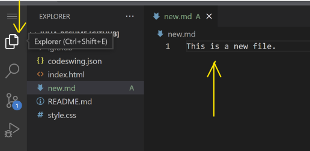
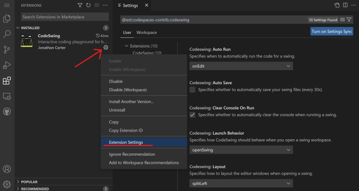

<!--
CO_OP_TRANSLATOR_METADATA:
{
  "original_hash": "f8d4b0284f3fc1de7eb65073d8338cca",
  "translation_date": "2025-10-03T09:09:43+00:00",
  "source_file": "8-code-editor/1-using-a-code-editor/README.md",
  "language_code": "hi"
}
-->
***

# कोड एडिटर का उपयोग: [VSCode.dev](https://vscode.dev) में महारत हासिल करें

**स्वागत है!**  
यह पाठ आपको [VSCode.dev](https://vscode.dev)—एक शक्तिशाली, वेब-आधारित कोड एडिटर—के बुनियादी से लेकर उन्नत उपयोग तक ले जाता है। आप कोड संपादित करने, प्रोजेक्ट प्रबंधित करने, बदलावों को ट्रैक करने, एक्सटेंशन इंस्टॉल करने और प्रोफेशनल की तरह सहयोग करने का आत्मविश्वास हासिल करेंगे—सिर्फ अपने ब्राउज़र से, बिना किसी इंस्टॉलेशन की आवश्यकता के।

***

## सीखने के उद्देश्य

इस पाठ के अंत तक, आप:

- किसी भी प्रोजेक्ट पर, कहीं भी, कोड एडिटर का कुशलतापूर्वक उपयोग कर सकेंगे
- बिल्ट-इन वर्जन कंट्रोल के साथ अपने काम को सहजता से ट्रैक कर सकेंगे
- एडिटर कस्टमाइजेशन और एक्सटेंशन के साथ अपने विकास वर्कफ़्लो को व्यक्तिगत और बेहतर बना सकेंगे

***

## आवश्यकताएँ

शुरू करने के लिए, **एक मुफ्त [GitHub](https://github.com) अकाउंट के लिए साइन अप करें**, जो आपको कोड रिपॉजिटरी प्रबंधित करने और वैश्विक स्तर पर सहयोग करने की अनुमति देता है। यदि आपके पास अभी तक अकाउंट नहीं है, तो [यहाँ एक बनाएं](https://github.com/)।

***

## वेब-आधारित कोड एडिटर का उपयोग क्यों करें?

एक **कोड एडिटर** जैसे VSCode.dev आपके कोड लिखने, संपादित करने और प्रबंधित करने के लिए आपका कमांड सेंटर है। एक सहज इंटरफ़ेस, ढेर सारे फीचर्स, और ब्राउज़र के माध्यम से तुरंत एक्सेस के साथ, आप:

- किसी भी डिवाइस पर प्रोजेक्ट संपादित कर सकते हैं
- इंस्टॉलेशन की झंझट से बच सकते हैं
- तुरंत सहयोग और योगदान कर सकते हैं

एक बार जब आप VSCode.dev के साथ सहज हो जाते हैं, तो आप कहीं से भी, कभी भी कोडिंग कार्यों को संभालने के लिए तैयार होंगे।

***

## VSCode.dev के साथ शुरुआत करना

**[VSCode.dev](https://vscode.dev)** पर जाएं—कोई इंस्टॉल नहीं, कोई डाउनलोड नहीं। GitHub के साथ साइन इन करने से आपको पूरी पहुंच मिलती है, जिसमें आपकी सेटिंग्स, एक्सटेंशन और रिपॉजिटरी को सिंक करना शामिल है। यदि संकेत दिया जाए, तो अपना GitHub अकाउंट कनेक्ट करें।

लोड होने के बाद, आपका वर्कस्पेस इस तरह दिखेगा:

  
तीन मुख्य सेक्शन बाएँ से दाएँ:
- **एक्टिविटी बार:** आइकन जैसे 🔎 (सर्च), ⚙️ (सेटिंग्स), फाइल्स, सोर्स कंट्रोल आदि।
- **साइडबार:** एक्टिविटी बार आइकन के आधार पर संदर्भ बदलता है (डिफ़ॉल्ट *Explorer* पर सेट होता है ताकि फाइलें दिखें)।
- **एडिटर/कोड एरिया:** सबसे बड़ा सेक्शन दाईं ओर—जहाँ आप वास्तव में कोड संपादित और देखेंगे।

फीचर्स एक्सप्लोर करने के लिए आइकन पर क्लिक करें, लेकिन अपनी जगह बनाए रखने के लिए _Explorer_ पर लौटें।

***

## GitHub रिपॉजिटरी खोलना

### तरीका 1: एडिटर से

1. [VSCode.dev](https://vscode.dev) पर जाएं। **"Open Remote Repository"** पर क्लिक करें।

     
   _Command Palette_ (Ctrl-Shift-P, या Mac पर Cmd-Shift-P) का उपयोग करें।

     
   - विकल्प चुनें।
   - अपना GitHub रिपॉजिटरी URL (जैसे, `https://github.com/microsoft/Web-Dev-For-Beginners`) पेस्ट करें और Enter दबाएं।

यदि सफल हो, तो आप पूरा प्रोजेक्ट लोड और संपादन के लिए तैयार देखेंगे!

***

### तरीका 2: URL के माध्यम से तुरंत

किसी भी GitHub रिपॉजिटरी URL को सीधे VSCode.dev में खोलने के लिए `github.com` को `vscode.dev/github` से बदलें।  
उदाहरण:

- GitHub: `https://github.com/microsoft/Web-Dev-For-Beginners`
- VSCode.dev: `https://vscode.dev/github/microsoft/Web-Dev-For-Beginners`

यह फीचर किसी भी प्रोजेक्ट तक त्वरित पहुंच को सुपरचार्ज करता है।

***

## अपने प्रोजेक्ट में फाइलें संपादित करना

एक बार जब आपका रिपॉजिटरी खुल जाए, तो आप:

### 1. **नई फाइल बनाएं**
- *Explorer* साइडबार में अपनी इच्छित फ़ोल्डर पर जाएं या रूट का उपयोग करें।
- _‘New file ...’_ आइकन पर क्लिक करें।
- अपनी फाइल का नाम दें, **Enter** दबाएं, और आपकी फाइल तुरंत दिखाई देगी।

  

### 2. **फाइलें संपादित और सेव करें**

- *Explorer* में किसी फाइल पर क्लिक करें ताकि वह कोड एरिया में खुले।
- आवश्यकतानुसार अपने बदलाव करें।
- VSCode.dev आपके बदलावों को स्वचालित रूप से सेव करता है, लेकिन आप मैन्युअल रूप से सेव करने के लिए Ctrl+S दबा सकते हैं।

  

### 3. **वर्जन कंट्रोल के साथ बदलाव ट्रैक और कमिट करें**

VSCode.dev में **Git** वर्जन कंट्रोल इंटीग्रेटेड है!

- _'Source Control'_ आइकन पर क्लिक करें ताकि किए गए सभी बदलाव दिखें।
- `Changes` फ़ोल्डर में फाइलें जोड़ (हरा) और हटाए (लाल) दिखाती हैं।  
    
  - फाइलों के बगल में `+` पर क्लिक करके बदलावों को कमिट के लिए तैयार करें।
  - अनचाहे बदलावों को हटाने के लिए Undo आइकन पर क्लिक करें।
  - एक स्पष्ट कमिट संदेश टाइप करें, फिर कमिट और पुश करने के लिए चेकमार्क पर क्लिक करें।

GitHub पर अपनी रिपॉजिटरी पर लौटने के लिए, ऊपर बाएँ हैमबर्गर मेनू चुनें।

  

***

## एक्सटेंशन के साथ सेटअप

एक्सटेंशन आपको VSCode.dev में भाषाएँ, थीम, डिबगर्स, और उत्पादकता उपकरण जोड़ने की अनुमति देते हैं—जो आपकी कोडिंग को आसान और मजेदार बनाते हैं।

### एक्सटेंशन ब्राउज़ और प्रबंधित करना

- एक्टिविटी बार में **Extensions आइकन** पर क्लिक करें।
- _'Search Extensions in Marketplace'_ बॉक्स में किसी एक्सटेंशन को खोजें।

  :  
  - **Installed**: सभी एक्सटेंशन जो आपने जोड़े हैं  
  - **Popular**: इंडस्ट्री के पसंदीदा  
  - **Recommended**: आपके वर्कफ़्लो के लिए सुझाए गए  

    

### 1. **एक्सटेंशन इंस्टॉल करें**

- सर्च में एक्सटेंशन का नाम डालें, उस पर क्लिक करें, और एडिटर में विवरण देखें।
- साइडबार _या_ मुख्य कोड एरिया में **नीला Install बटन** दबाएं।

    

### 2. **एक्सटेंशन कस्टमाइज़ करें**

- अपने इंस्टॉल किए गए एक्सटेंशन को खोजें।
- **Gear आइकन** पर क्लिक करें → _Extension Settings_ चुनें ताकि व्यवहार को अपनी पसंद के अनुसार समायोजित करें।

    

### 3. **एक्सटेंशन प्रबंधित करें**

आप कर सकते हैं:

- **Disable:** एक्सटेंशन को अस्थायी रूप से बंद करें जबकि इसे इंस्टॉल रखा जाए  
- **Uninstall:** इसे स्थायी रूप से हटा दें यदि अब इसकी आवश्यकता नहीं है  

  एक्सटेंशन खोजें, Gear आइकन दबाएं, और ‘Disable’ या ‘Uninstall’ चुनें, या कोड एरिया में नीले बटन का उपयोग करें।

***

## असाइनमेंट

अपनी स्किल्स का परीक्षण करें: [VSCode.dev का उपयोग करके एक रिज़्यूमे वेबसाइट बनाएं](https://github.com/microsoft/Web-Dev-For-Beginners/blob/main/8-code-editor/1-using-a-code-editor/assignment.md)

***

## आगे की खोज और स्व-अध्ययन

- [VSCode वेब के आधिकारिक दस्तावेज़](https://code.visualstudio.com/docs/editor/vscode-web?WT.mc_id=academic-0000-alfredodeza) के साथ गहराई से जानें।
- उन्नत वर्कस्पेस फीचर्स, कीबोर्ड शॉर्टकट, और सेटिंग्स एक्सप्लोर करें।

***

**अब आप कोडिंग, क्रिएटिंग, और सहयोग करने के लिए तैयार हैं—कहीं से भी, किसी भी डिवाइस पर, VSCode.dev का उपयोग करके!**

---

**अस्वीकरण**:  
यह दस्तावेज़ AI अनुवाद सेवा [Co-op Translator](https://github.com/Azure/co-op-translator) का उपयोग करके अनुवादित किया गया है। जबकि हम सटीकता सुनिश्चित करने का प्रयास करते हैं, कृपया ध्यान दें कि स्वचालित अनुवाद में त्रुटियां या अशुद्धियां हो सकती हैं। मूल भाषा में उपलब्ध मूल दस्तावेज़ को प्रामाणिक स्रोत माना जाना चाहिए। महत्वपूर्ण जानकारी के लिए, पेशेवर मानव अनुवाद की सिफारिश की जाती है। इस अनुवाद के उपयोग से उत्पन्न किसी भी गलतफहमी या गलत व्याख्या के लिए हम उत्तरदायी नहीं हैं।