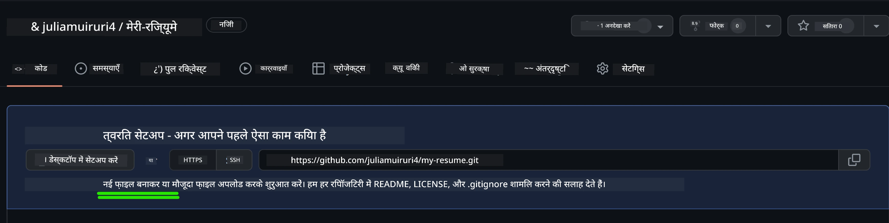
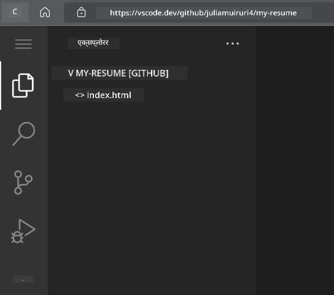
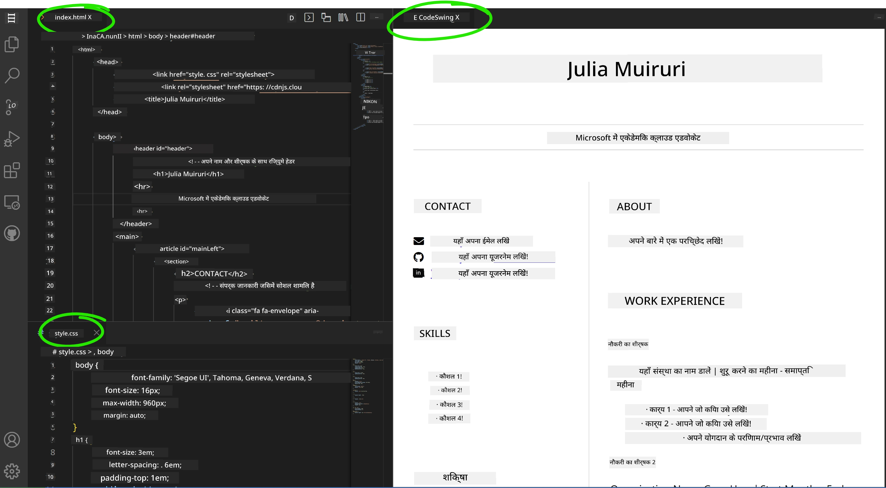

<!--
CO_OP_TRANSLATOR_METADATA:
{
  "original_hash": "effe56ba51c38d7bdfad1ea38288666b",
  "translation_date": "2026-01-06T16:17:16+00:00",
  "source_file": "8-code-editor/1-using-a-code-editor/assignment.md",
  "language_code": "hi"
}
-->
# VSCode.dev का उपयोग करके एक रिज्यूम वेबसाइट बनाएं

अपना करियर संभावनाओं को बदलें एक पेशेवर रिज्यूम वेबसाइट बनाकर जो आपकी कौशल और अनुभव को इंटरैक्टिव, आधुनिक फॉर्मेट में प्रदर्शित करती है। पारंपरिक PDF भेजने के बजाय, कल्पना करें कि आप भर्तीकर्ताओं को एक चिकनी, उत्तरदायी वेबसाइट प्रदान कर रहे हैं जो आपकी योग्यताओं और आपकी वेब विकास क्षमताओं दोनों को दर्शाती है।

यह व्यावहारिक असाइनमेंट आपकी सभी VSCode.dev कौशलों को अभ्यास में लाता है जब आप कुछ वास्तव में उपयोगी अपनी करियर के लिए बनाते हैं। आप पूरी वेब विकास वर्कफ़्लो का अनुभव करेंगे – रिपॉजिटरी निर्माण से लेकर डिप्लॉयमेंट तक – सब कुछ अपने ब्राउज़र के भीतर।

इस परियोजना को पूरा करके, आपके पास एक पेशेवर ऑनलाइन उपस्थिति होगी जिसे आप संभावित नियोक्ताओं के साथ आसानी से साझा कर सकते हैं, अपनी कौशल बढ़ने के अनुसार अपडेट कर सकते हैं, और अपने व्यक्तिगत ब्रांड के अनुरूप कस्टमाइज़ कर सकते हैं। यह बिल्कुल वह प्रकार का व्यावहारिक प्रोजेक्ट है जो वास्तविक दुनिया के वेब विकास कौशल प्रदर्शित करता है।

## सीखने के उद्देश्य

इस असाइनमेंट को पूरा करने के बाद, आप सक्षम होंगे:

- **एक पूरी वेब विकास प्रोजेक्ट** बनाना और प्रबंधित करना VSCode.dev का उपयोग करके  
- **एक पेशेवर वेबसाइट** बनाना सेमांटिक HTML तत्वों का उपयोग करके  
- **उत्तरदायी लेआउट** स्टाइल करना आधुनिक CSS तकनीकों के साथ  
- **इंटरैक्टिव फीचर्स लागू करना** मूल वेब तकनीकों का उपयोग करके  
- **एक लाइव वेबसाइट डिप्लॉय करना** जो एक साझा करने योग्य URL के माध्यम से पहुंच योग्य हो  
- **वर्जन कंट्रोल सर्वोत्तम प्रथाओं को दिखाना** विकास प्रक्रिया के दौरान

## आवश्यकताएँ

इस असाइनमेंट को शुरू करने से पहले, सुनिश्चित करें कि आपके पास हैं:

- एक GitHub खाता (यदि आवश्यक हो तो [github.com](https://github.com/) पर बनाएं)  
- VSCode.dev पाठ पूरा किया हो जिसमें इंटरफ़ेस नेविगेशन और बुनियादी संचालन शामिल हैं  
- HTML संरचना और CSS स्टाइलिंग अवधारणाओं की बुनियादी समझ

## परियोजना सेटअप और रिपॉजिटरी निर्माण

आइए आपकी परियोजना की नींव सेट करें। यह प्रक्रिया वास्तविक दुनिया के विकास वर्कफ़्लो को दर्शाती है जहाँ परियोजनाएँ उचित रिपॉजिटरी प्रारंभ और संरचना योजना के साथ शुरू होती हैं।

### चरण 1: अपनी GitHub रिपॉजिटरी बनाएँ

एक समर्पित रिपॉजिटरी सेटअप करने से आपकी परियोजना सही ढंग से व्यवस्थित और वर्जन नियंत्रित होगी।

1. **[GitHub.com](https://github.com) पर जाएं** और अपने खाते में साइन इन करें  
2. ऊपर-दाएं कोने में हरे रंग के "New" बटन या "+" आइकन पर क्लिक करें  
3. अपनी रिपॉजिटरी का नाम `my-resume` रखें (या व्यक्तिगत नाम जैसे `john-smith-resume`) चुनें  
4. एक संक्षिप्त विवरण जोड़ें: "पेशेवर रिज्यूम वेबसाइट HTML और CSS के साथ निर्मित"  
5. "Public" चुनें ताकि आपके रिज्यूम को संभावित नियोक्ता देख सकें  
6. "Add a README file" को चेक करें ताकि प्रारंभिक परियोजना विवरण बने  
7. "Create repository" पर क्लिक करें ताकि सेटअप पूरा हो जाए

> 💡 **रिपॉजिटरी नामकरण सुझाव**: वर्णनात्मक, पेशेवर नामों का उपयोग करें जो स्पष्ट रूप से परियोजना के उद्देश्य को सूचित करें। यह नियोक्ताओं के साथ साझा करने या पोर्टफोलियो समीक्षा के दौरान मदद करता है। 

### चरण 2: परियोजना संरचना प्रारंभ करें

चूंकि VSCode.dev को रिपॉजिटरी खोलने के लिए कम से कम एक फ़ाइल चाहिए होती है, हम GitHub पर सीधे अपनी मुख्य HTML फ़ाइल बनाएंगे और फिर वेब संपादक में स्विच करेंगे।

1. अपनी नई रिपॉजिटरी में "creating a new file" लिंक पर क्लिक करें  
2. फ़ाइल नाम के रूप में `index.html` टाइप करें  
3. इस प्रारंभिक HTML संरचना को जोड़ें:

```html
<!DOCTYPE html>
<html lang="en">
<head>
    <meta charset="UTF-8">
    <meta name="viewport" content="width=device-width, initial-scale=1.0">
    <title>Your Name - Professional Resume</title>
</head>
<body>
    <h1>Your Name</h1>
    <p>Professional Resume Website</p>
</body>
</html>
```
  
4. एक कमिट संदेश लिखें: "Add initial HTML structure"  
5. अपनी परिवर्तनों को सहेजने के लिए "Commit new file" क्लिक करें



**यह प्रारंभिक सेटअप जो करता है:**  
- उचित HTML5 दस्तावेज़ संरचना स्थापित करता है सेमांटिक तत्वों के साथ  
- रेस्पॉन्सिव डिज़ाइन संगतता के लिए viewport meta टैग शामिल करता है  
- ब्राउज़र टैब में दिखाई देने वाले एक विवरणात्मक पेज शीर्षक सेट करता है  
- पेशेवर कंटेंट व्यवस्थापन के लिए आधार बनाता है  

## VSCode.dev में कार्य करना

अब जब आपकी रिपॉजिटरी नींव तैयार है, तो मुख्य विकास कार्य के लिए VSCode.dev में संक्रमण करें। यह वेब-आधारित संपादक पेशेवर वेब विकास के लिए सभी आवश्यक उपकरण प्रदान करता है।

### चरण 3: अपनी परियोजना VSCode.dev में खोलें

1. नए ब्राउज़र टैब में [vscode.dev](https://vscode.dev) पर जाएं  
2. स्वागत स्क्रीन पर "Open Remote Repository" पर क्लिक करें  
3. GitHub से अपनी रिपॉजिटरी URL कॉपी करें और इनपुट फ़ील्ड में चिपकाएं

   प्रारूप: `https://github.com/your-username/my-resume`  
   
   *`your-username` को अपने वास्तविक GitHub उपयोगकर्ता नाम से बदलें*

4. लोड करने के लिए Enter दबाएं

✅ **सफलता संकेत:** आपको एक्सप्लोरर साइडबार में अपनी परियोजना फ़ाइलें और मुख्य संपादक क्षेत्र में `index.html` संपादन के लिए दिखाई देगा। 



**इंटरफ़ेस में आप क्या देखेंगे:**  
- **Explorer साइडबार**: आपकी रिपॉजिटरी फ़ाइलें और फोल्डर संरचना दिखाता है  
- **संपादक क्षेत्र**: चयनित फ़ाइलों की सामग्री संपादन के लिए दिखाता है  
- **Activity बार**: Source Control और Extensions जैसी सुविधाओं तक पहुंच प्रदान करता है  
- **स्थिति पट्टी**: कनेक्शन स्थिति और वर्तमान शाखा जानकारी दिखाता है  

### चरण 4: अपना रिज्यूम कंटेंट बनाएं

`index.html` में प्लेसहोल्डर सामग्री को व्यापक रिज्यूम संरचना से बदलें। यह HTML आपकी योग्यताओं की पेशेवर प्रस्तुति का आधार प्रदान करता है।

<details>
<summary><b>पूर्ण HTML रिज्यूम संरचना</b></summary>

```html
<!DOCTYPE html>
<html lang="en">
<head>
    <meta charset="UTF-8">
    <meta name="viewport" content="width=device-width, initial-scale=1.0">
    <link href="style.css" rel="stylesheet">
    <link rel="stylesheet" href="https://cdnjs.cloudflare.com/ajax/libs/font-awesome/5.15.4/css/all.min.css">
    <title>Your Name - Professional Resume</title>
</head>
<body>
    <header id="header">
        <h1>Your Full Name</h1>
        <hr>
        <p class="role">Your Professional Title</p>
        <hr>
    </header>
    
    <main>
        <article id="mainLeft">
            <section>
                <h2>CONTACT</h2>
                <p>
                    <i class="fa fa-envelope" aria-hidden="true"></i>
                    <a href="mailto:your.email@domain.com">your.email@domain.com</a>
                </p>
                <p>
                    <i class="fab fa-github" aria-hidden="true"></i>
                    <a href="https://github.com/your-username">github.com/your-username</a>
                </p>
                <p>
                    <i class="fab fa-linkedin" aria-hidden="true"></i>
                    <a href="https://linkedin.com/in/your-profile">linkedin.com/in/your-profile</a>
                </p>
            </section>
            
            <section>
                <h2>SKILLS</h2>
                <ul>
                    <li>HTML5 & CSS3</li>
                    <li>JavaScript (ES6+)</li>
                    <li>Responsive Web Design</li>
                    <li>Version Control (Git)</li>
                    <li>Problem Solving</li>
                </ul>
            </section>
            
            <section>
                <h2>EDUCATION</h2>
                <h3>Your Degree or Certification</h3>
                <p>Institution Name</p>
                <p>Start Date - End Date</p>
            </section>
        </article>
        
        <article id="mainRight">
            <section>
                <h2>ABOUT</h2>
                <p>Write a compelling summary that highlights your passion for web development, key achievements, and career goals. This section should give employers insight into your personality and professional approach.</p>
            </section>
            
            <section>
                <h2>WORK EXPERIENCE</h2>
                <div class="job">
                    <h3>Job Title</h3>
                    <p class="company">Company Name | Start Date – End Date</p>
                    <ul>
                        <li>Describe a key accomplishment or responsibility</li>
                        <li>Highlight specific skills or technologies used</li>
                        <li>Quantify impact where possible (e.g., "Improved efficiency by 25%")</li>
                    </ul>
                </div>
                
                <div class="job">
                    <h3>Previous Job Title</h3>
                    <p class="company">Previous Company | Start Date – End Date</p>
                    <ul>
                        <li>Focus on transferable skills and achievements</li>
                        <li>Demonstrate growth and learning progression</li>
                        <li>Include any leadership or collaboration experiences</li>
                    </ul>
                </div>
            </section>
            
            <section>
                <h2>PROJECTS</h2>
                <div class="project">
                    <h3>Project Name</h3>
                    <p>Brief description of what the project accomplishes and technologies used.</p>
                    <a href="#" target="_blank">View Project</a>
                </div>
            </section>
        </article>
    </main>
</body>
</html>
```
</details>

**अनुकूलन मार्गदर्शन:**  
- सभी प्लेसहोल्डर पाठ को अपनी वास्तविक जानकारी से बदलें  
- अपने अनुभव स्तर और करियर फोकस के आधार पर अनुभाग समायोजित करें  
- आवश्यकता अनुसार अनुभाग जोड़ें या निकालें (जैसे प्रमाणपत्र, स्वयंसेवा कार्य, भाषाएं)  
- अपनी वास्तविक प्रोफाइल और परियोजनाओं के लिंक शामिल करें  

### चरण 5: सहायक फ़ाइलें बनाएं

पेशेवर वेबसाइटों को व्यवस्थित फ़ाइल संरचना की आवश्यकता होती है। पूर्ण परियोजना के लिए CSS स्टाइलशीट और कॉन्फ़िगरेशन फाइल बनाएं।

1. एक्सप्लोरर साइडबार में अपनी परियोजना फ़ोल्डर नाम पर होवर करें  
2. दिखने वाले "New File" आइकन (📄+) पर क्लिक करें  
3. ये फाइलें एक-एक करके बनाएं:  
   - `style.css` (स्टाइलिंग और लेआउट के लिए)  
   - `codeswing.json` (पूर्वावलोकन एक्सटेंशन कॉन्फ़िगरेशन के लिए)

**CSS फ़ाइल (`style.css`) बनाना:**

<details>
<summary><b>पेशेवर CSS स्टाइलिंग</b></summary>

```css
/* Modern Resume Styling */
body {
    font-family: 'Segoe UI', Tahoma, Geneva, Verdana, sans-serif;
    font-size: 16px;
    line-height: 1.6;
    max-width: 960px;
    margin: 0 auto;
    padding: 20px;
    color: #333;
    background-color: #f9f9f9;
}

/* Header Styling */
header {
    text-align: center;
    margin-bottom: 3em;
    padding: 2em;
    background: linear-gradient(135deg, #667eea 0%, #764ba2 100%);
    color: white;
    border-radius: 10px;
    box-shadow: 0 4px 6px rgba(0, 0, 0, 0.1);
}

h1 {
    font-size: 3em;
    letter-spacing: 0.1em;
    margin-bottom: 0.2em;
    font-weight: 300;
}

.role {
    font-size: 1.3em;
    font-weight: 300;
    margin: 1em 0;
}

/* Main Content Layout */
main {
    display: grid;
    grid-template-columns: 35% 65%;
    gap: 3em;
    margin-top: 3em;
    background: white;
    padding: 2em;
    border-radius: 10px;
    box-shadow: 0 2px 10px rgba(0, 0, 0, 0.1);
}

/* Typography */
h2 {
    font-size: 1.4em;
    font-weight: 600;
    margin-bottom: 1em;
    color: #667eea;
    border-bottom: 2px solid #667eea;
    padding-bottom: 0.3em;
}

h3 {
    font-size: 1.1em;
    font-weight: 600;
    margin-bottom: 0.5em;
    color: #444;
}

/* Section Styling */
section {
    margin-bottom: 2.5em;
}

#mainLeft {
    border-right: 1px solid #e0e0e0;
    padding-right: 2em;
}

/* Contact Links */
section a {
    color: #667eea;
    text-decoration: none;
    transition: color 0.3s ease;
}

section a:hover {
    color: #764ba2;
    text-decoration: underline;
}

/* Icons */
i {
    margin-right: 0.8em;
    width: 20px;
    text-align: center;
    color: #667eea;
}

/* Lists */
ul {
    list-style: none;
    padding-left: 0;
}

li {
    margin: 0.5em 0;
    padding: 0.3em 0;
    position: relative;
}

li:before {
    content: "▸";
    color: #667eea;
    margin-right: 0.5em;
}

/* Work Experience */
.job, .project {
    margin-bottom: 2em;
    padding-bottom: 1.5em;
    border-bottom: 1px solid #f0f0f0;
}

.company {
    font-style: italic;
    color: #666;
    margin-bottom: 0.5em;
}

/* Responsive Design */
@media (max-width: 768px) {
    main {
        grid-template-columns: 1fr;
        gap: 2em;
    }
    
    #mainLeft {
        border-right: none;
        border-bottom: 1px solid #e0e0e0;
        padding-right: 0;
        padding-bottom: 2em;
    }
    
    h1 {
        font-size: 2.2em;
    }
    
    body {
        padding: 10px;
    }
}

/* Print Styles */
@media print {
    body {
        background: white;
        color: black;
        font-size: 12pt;
    }
    
    header {
        background: none;
        color: black;
        box-shadow: none;
    }
    
    main {
        box-shadow: none;
    }
}
```
</details>

**कॉन्फ़िगरेशन फ़ाइल (`codeswing.json`) बनाना:**

```json
{
    "scripts": [],
    "styles": []
}
```


**CSS फीचर्स समझना:**  
- उत्तरदायी, पेशेवर लेआउट संरचना के लिए CSS Grid का उपयोग करता है  
- ग्रेडिएंट हेडर के साथ आधुनिक रंग योजनाएं लागू करता है  
- इंटरैक्टिविटी के लिए होवर प्रभाव और स्मूथ ट्रांजिशन शामिल करता है  
- सभी डिवाइस आकारों के लिए उत्तरदायी डिज़ाइन प्रदान करता है  
- PDF जनरेशन के लिए प्रिंट-फ्रेंडली स्टाइल जोड़ता है  

### चरण 6: एक्सटेंशन्स इंस्टॉल और कॉन्फ़िगर करें

एक्सटेंशन्स आपके विकास अनुभव को बेहतर बनाते हैं लाइव प्रीव्यू क्षमताओं और बेहतर वर्कफ़्लो उपकरण प्रदान करके। CodeSwing एक्सटेंशन वेब विकास परियोजनाओं के लिए विशेष रूप से उपयोगी है।

**CodeSwing एक्सटेंशन इंस्टॉल करना:**

1. Activity Bar में एक्सटेंशन्स आइकन (🧩) पर क्लिक करें  
2. मार्केटप्लेस सर्च बॉक्स में "CodeSwing" खोजें  
3. खोज परिणामों से CodeSwing एक्सटेंशन चुनें  
4. नीले "Install" बटन पर क्लिक करें  


**CodeSwing क्या प्रदान करता है:**  
- वेबसाइट का लाइव प्रीव्यू सक्षम करता है जैसे आप संपादित करते हैं  
- मैनुअल रिफ्रेश के बिना ही रियल-टाइम में परिवर्तनों को दिखाता है  
- HTML, CSS, और JavaScript सहित कई फाइल प्रकारों का समर्थन करता है  
- एकीकृत विकास वातावरण अनुभव प्रदान करता है  

**इंस्टॉल के तुरंत बाद परिणाम:**  
CodeSwing इंस्टॉल होने के बाद, आप अपने रिज्यूम वेबसाइट का लाइव प्रीव्यू संपादक में देखेंगे। इससे आप ठीक वैसे ही देख सकते हैं कि आपकी साइट कैसी दिखती है जैसे आप बदलाव करते हैं।



**बढ़े हुए इंटरफ़ेस को समझना:**  
- **स्प्लिट व्यू**: एक तरफ आपका कोड और दूसरी तरफ लाइव प्रीव्यू दिखाता है  
- **रियल-टाइम अपडेट**: टाइप करते ही परिवर्तन तुरंत परिलक्षित होते हैं  
- **इंटरैक्टिव प्रीव्यू**: लिंक और इंटरैक्शन की जांच करने की अनुमति देता है  
- **मोबाइल सिमुलेशन**: उत्तरदायी डिज़ाइन परीक्षण क्षमताएं प्रदान करता है  

### चरण 7: वर्जन कंट्रोल और पब्लिशिंग

अब जब आपकी रिज्यूम वेबसाइट पूरी हो चुकी है, Git का उपयोग करके अपने कार्य को सहेजें और ऑनलाइन उपलब्ध कराएं।

**परिवर्तनों को कमिट करना:**

1. Activity Bar में Source Control आइकन (🌿) पर क्लिक करें  
2. "Changes" सेक्शन में बनाई और संशोधित सभी फाइलों की समीक्षा करें  
3. प्रत्येक फ़ाइल के बगल "+" आइकन पर क्लिक करके अपने परिवर्तनों को स्टेज करें  
4. एक वर्णनात्मक कमिट संदेश लिखें, जैसे:  
   - "Add complete resume website with responsive design"  
   - "Implement professional styling and content structure"  
5. कमिट और पुश करने के लिए टिक (✓) पर क्लिक करें

**प्रभावी कमिट संदेश के उदाहरण:**  
- "Add professional resume content and styling"  
- "Implement responsive design for mobile compatibility"  
- "Update contact information and project links"

> 💡 **पेशेवर सुझाव**: अच्छे कमिट संदेश आपकी परियोजना की प्रगति को ट्रैक करते हैं और विवरण पर ध्यान देने को दर्शाते हैं – ये गुण नियोक्ताओं के लिए मूल्यवान होते हैं।

**अपनी प्रकाशित साइट तक पहुँच:**  
कमिट होने के बाद, आप GitHub रिपॉजिटरी में ऊपर-बाएं कोने के हैमबर्गर मेनू (☰) का उपयोग करके वापस जा सकते हैं। आपकी रिज्यूम वेबसाइट अब वर्जन नियंत्रित है और डिप्लॉयमेंट या साझा करने के लिए तैयार है।

## परिणाम और अगले कदम

**बधाई हो! 🎉** आपने सफलतापूर्वक VSCode.dev का उपयोग करके एक पेशेवर रिज्यूम वेबसाइट बनाई है। आपकी परियोजना प्रदर्शित करती है:  
**प्रदर्शित तकनीकी कौशल:**  
- **रिपॉजिटरी प्रबंधन**: एक पूरी परियोजना संरचना बनाई और व्यवस्थित की  
- **वेब विकास**: आधुनिक HTML5 और CSS3 का उपयोग करके उत्तरदायी वेबसाइट बनाई  
- **वर्जन कंट्रोल**: उचित Git वर्कफ़्लो लागू किया अर्थपूर्ण कमिट के साथ  
- **उपकरण दक्षता**: VSCode.dev के इंटरफ़ेस और एक्सटेंशन सिस्टम का प्रभावी उपयोग  

**प्राप्त पेशेवर परिणाम:**  
- **ऑनलाइन उपस्थिति**: एक साझा करने योग्य URL जो आपकी योग्यताओं को दर्शाता है  
- **आधुनिक फॉर्मेट**: पारंपरिक PDF रिज्यूम के लिए इंटरैक्टिव विकल्प  
- **प्रदर्शनीय कौशल**: आपकी वेब विकास क्षमताओं का ठोस प्रमाण  
- **आसान अपडेट**: एक आधार जिसे आप लगातार सुधार और अनुकूलित कर सकते हैं  

### डिप्लॉयमेंट विकल्प

अपने रिज्यूम को नियोक्ताओं के लिए सुलभ बनाने के लिए, इन होस्टिंग विकल्पों पर विचार करें:

**GitHub Pages (अनुशंसित):**  
1. GitHub पर अपनी रिपॉजिटरी Settings में जाएं  
2. "Pages" सेक्शन तक स्क्रॉल करें  
3. "Deploy from a branch" चुनें और "main" शाखा चुनें  
4. आपकी साइट उपलब्ध होगी: `https://your-username.github.io/my-resume`

**वैकल्पिक प्लेटफॉर्म:**  
- **Netlify**: कस्टम डोमेन के साथ स्वचालित डिप्लॉयमेंट  
- **Vercel**: तेज़ डिप्लॉयमेंट के साथ आधुनिक होस्टिंग फीचर्स  
- **GitHub Codespaces**: बिल्ट-इन प्रीव्यू के साथ विकास वातावरण  

### संवर्धन सुझाव

इन फीचर्स को जोड़कर अपनी कौशल को और विकसित करना जारी रखें:

**तकनीकी सुधार:**  
- **JavaScript इंटरेक्टिविटी**: स्मूथ स्क्रोलिंग या इंटरैक्टिव एलिमेंट्स जोड़ें  
- **डार्क मोड टॉगल**: थीम स्विचिंग लागू करें उपयोगकर्ता पसंद के लिए  
- **संपर्क फ़ॉर्म**: संभावित नियोक्ताओं से सीधे संवाद सक्षम करें  
- **SEO ऑप्टिमाइजेशन**: बेहतर खोज दृश्यता के लिए मेटा टैग और संरचित डेटा जोड़ें  

**सामग्री संवर्धन:**  
- **प्रोजेक्ट पोर्टफोलियो**: GitHub रिपॉजिटरी और लाइव डेमो के लिंक जोड़ें  
- **कौशल विज़ुअलाइज़ेशन**: प्रोग्रेस बार या कौशल रेटिंग सिस्टम बनाएँ  
- **टेस्टिमोनियल सेक्शन**: सहयोगियों या प्रशिक्षकों से सिफारिशें शामिल करें  
- **ब्लॉग इंटीग्रेशन**: अपनी सीखने की यात्रा दिखाने के लिए ब्लॉग सेक्शन जोड़ें  

## GitHub Copilot एजेंट चुनौती 🚀

एजेंट मोड का उपयोग करके निम्नलिखित चुनौती पूरी करें:

**विवरण:** अपनी रिज्यूम वेबसाइट को उन्नत फीचर्स से संवर्धित करें जो पेशेवर वेब विकास क्षमताओं और आधुनिक डिज़ाइन सिद्धांतों को प्रदर्शित करें।

**प्रॉम्प्ट:** अपनी मौजूदा रिज्यूम वेबसाइट पर आधारित, ये उन्नत फीचर्स लागू करें:  
1. स्मूथ ट्रांजिशन के साथ डार्क/लाइट थीम टॉगल जोड़ें  
2. एनिमेटेड प्रोग्रेस बार के साथ एक इंटरैक्टिव कौशल सेक्शन बनाएं  
3. फ़ॉर्म वैलिडेशन के साथ संपर्क फ़ॉर्म लागू करें  
4. होवर प्रभाव और मोडल पॉपअप के साथ प्रोजेक्ट पोर्टफोलियो सेक्शन जोड़ें  
5. अपनी सीखने की यात्रा के बारे में कम से कम 3 नमूना पोस्ट के साथ ब्लॉग सेक्शन शामिल करें  
6. उचित मेटा टैग, संरचित डेटा, और प्रदर्शन के साथ SEO के लिए ऑप्टिमाइज़ करें  
7. GitHub Pages या Netlify का उपयोग करके संवर्धित साइट तैनात करें  
8. अपनी README.md में सभी नए फीचर्स को स्क्रीनशॉट के साथ दस्तावेज़ करें  

आपकी संवर्धित वेबसाइट आधुनिक वेब विकास प्रथाओं में मास्टरी प्रदर्शित करनी चाहिए जिसमें उत्तरदायी डिजाइन, JavaScript इंटरेक्टिविटी, और पेशेवर डिप्लॉयमेंट वर्कफ़्लोज़ शामिल हैं।

## चुनौती विस्तार

क्या आप अपनी स्किल्स को आगे ले जाना चाहते हैं? इन उन्नत चुनौतियों को आजमाएं:

**📱 मोबाइल-फर्स्ट रीडिज़ाइन:** CSS Grid और Flexbox के साथ एक मोबाइल-फर्स्ट दृष्टिकोण का उपयोग करके अपनी साइट को पूरी तरह पुनर्निर्मित करें

**🔍 SEO ऑप्टिमाइजेशन:** मेटा टैग, संरचित डेटा, और प्रदर्शन अनुकूलन सहित व्यापक SEO लागू करें

**🌐 बहुभाषी समर्थन:** कई भाषाओं को समर्थित करने के लिए अंतरराष्ट्रीयकरण फीचर्स जोड़ें

**📊 विश्लेषण एकीकरण:** Google Analytics जोड़ें आगंतुक जुड़ाव ट्रैक करने और अपनी सामग्री का अनुकूलन करने के लिए

**🚀 प्रदर्शन अनुकूलन:** सभी श्रेणियों में लाइटहाउस स्कोर में पूर्णता प्राप्त करें

## समीक्षा और आत्म-अध्ययन

इन संसाधनों के साथ अपनी जानकारी बढ़ाएं:

**उन्नत VSCode.dev फीचर्स:**  
- [VSCode.dev दस्तावेज़](https://code.visualstudio.com/docs/editor/vscode-web?WT.mc_id=academic-0000-alfredodeza) - वेब-आधारित संपादन की पूरी गाइड  
- [GitHub Codespaces](https://docs.github.com/en/codespaces) - क्लाउड विकास वातावरण  

**वेब विकास सर्वोत्तम प्रथाएँ:**  
- **उत्तरदायी डिजाइन**: आधुनिक लेआउट के लिए CSS Grid और Flexbox का अध्ययन करें
- **सुलभता**: समावेशी वेब डिज़ाइन के लिए WCAG दिशानिर्देश सीखें  
- **प्रदर्शन**: अनुकूलन के लिए Lighthouse जैसे उपकरणों का अन्वेषण करें  
- **SEO**: सर्च इंजन ऑप्टिमाइजेशन की मूलभूत बातें समझें  

**पेशेवर विकास:**  
- **पोर्टफोलियो निर्माण**: विविध कौशल प्रदर्शित करने के लिए अतिरिक्त परियोजनाएँ बनाएं  
- **ओपन सोर्स**: सहयोग अनुभव प्राप्त करने के लिए मौजूदा परियोजनाओं में योगदान करें  
- **नेटवर्किंग**: डेवलपर समुदायों में अपनी रिज्यूमे वेबसाइट साझा करें ताकि प्रतिक्रिया मिल सके  
- **लगातार सीखना**: वेब विकास के रुझानों और तकनीकों से अपडेट रहें  

---

**आपके अगले कदम:** अपनी रिज्यूमे वेबसाइट को मित्रों, परिवार, या मेंटर्स के साथ साझा करें ताकि प्रतिक्रिया मिल सके। उनके सुझावों का उपयोग करके अपनी डिज़ाइन को दोहराएं और सुधारें। याद रखें, यह परियोजना केवल एक रिज्यूमे नहीं है – यह एक वेब डेवलपर के रूप में आपके विकास का प्रदर्शन है!

---

<!-- CO-OP TRANSLATOR DISCLAIMER START -->
**अस्वीकरण**:
यह दस्तावेज़ AI अनुवाद सेवा [Co-op Translator](https://github.com/Azure/co-op-translator) का उपयोग करके अनुवादित किया गया है। यद्यपि हम सटीकता के लिए प्रयासरत हैं, कृपया ध्यान दें कि स्वचालित अनुवादों में त्रुटियां या गलतियाँ हो सकती हैं। मूल दस्तावेज़ अपनी मूल भाषा में ही आधिकारिक स्रोत माना जाना चाहिए। महत्वपूर्ण जानकारी के लिए पेशेवर मानव अनुवाद की सलाह दी जाती है। इस अनुवाद के उपयोग से उत्पन्न किसी भी गलतफहमी या व्याख्या के लिए हम जिम्मेदार नहीं हैं।
<!-- CO-OP TRANSLATOR DISCLAIMER END -->