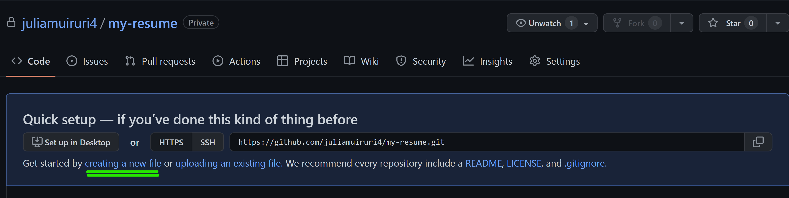
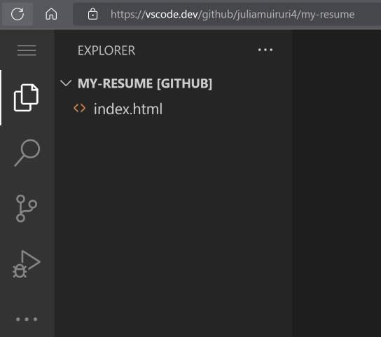
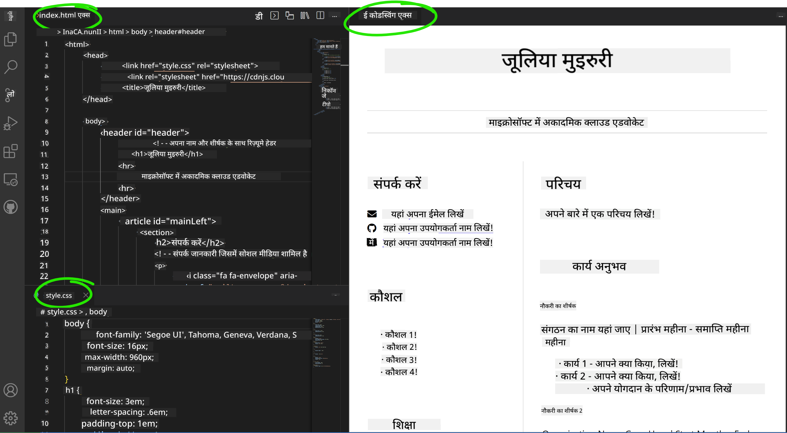

<!--
CO_OP_TRANSLATOR_METADATA:
{
  "original_hash": "bd3aa6d2b879c30ea496c43aec1c49ed",
  "translation_date": "2025-08-29T16:02:28+00:00",
  "source_file": "8-code-editor/1-using-a-code-editor/assignment.md",
  "language_code": "hi"
}
-->
# vscode.dev का उपयोग करके एक रिज़्यूमे वेबसाइट बनाएं

_कितना अच्छा होगा अगर कोई रिक्रूटर आपसे आपका रिज़्यूमे मांगे और आप उन्हें एक URL भेज दें?_ 😎

## उद्देश्य

इस असाइनमेंट के बाद, आप सीखेंगे:

- अपने रिज़्यूमे को दिखाने के लिए एक वेबसाइट बनाना

### आवश्यकताएँ

1. एक GitHub अकाउंट। [GitHub](https://github.com/) पर जाएं और यदि आपने पहले से अकाउंट नहीं बनाया है तो एक नया अकाउंट बनाएं।

## चरण

**चरण 1:** एक नया GitHub रिपॉजिटरी बनाएं और इसे `my-resume` नाम दें।

**चरण 2:** अपने रिपॉजिटरी में एक `index.html` फाइल बनाएं। हम github.com पर कम से कम एक फाइल जोड़ेंगे क्योंकि आप vscode.dev पर खाली रिपॉजिटरी नहीं खोल सकते।

`creating a new file` लिंक पर क्लिक करें, नाम `index.html` टाइप करें और `Commit new file` बटन चुनें।



**चरण 3:** [VSCode.dev](https://vscode.dev) खोलें और `Open Remote Repository` बटन चुनें।

उस रिपॉजिटरी का URL कॉपी करें जिसे आपने अभी अपने रिज़्यूमे साइट के लिए बनाया है और इसे इनपुट बॉक्स में पेस्ट करें:

_`your-username` को अपने GitHub यूजरनेम से बदलें_

```
https://github.com/your-username/my-resume
```

✅ यदि सफल हुआ, तो आप अपने प्रोजेक्ट और `index.html` फाइल को ब्राउज़र के टेक्स्ट एडिटर में खुला हुआ देखेंगे।



**चरण 4:** `index.html` फाइल खोलें, नीचे दिए गए कोड को अपने कोड एरिया में पेस्ट करें और सेव करें।

<details>
    <summary><b>HTML कोड जो आपकी रिज़्यूमे वेबसाइट के कंटेंट के लिए जिम्मेदार है।</b></summary>
    
        <html>

            <head>
                <link href="style.css" rel="stylesheet">
                <link rel="stylesheet" href="https://cdnjs.cloudflare.com/ajax/libs/font-awesome/5.15.4/css/all.min.css">
                <title>आपका नाम यहां लिखें!</title>
            </head>
            <body>
                <header id="header">
                    <!-- रिज़्यूमे हेडर जिसमें आपका नाम और टाइटल हो -->
                    <h1>आपका नाम यहां लिखें!</h1>
                    <hr>
                    आपका रोल!
                    <hr>
                </header>
                <main>
                    <article id="mainLeft">
                        <section>
                            <h2>संपर्क</h2>
                            <!-- संपर्क जानकारी जिसमें सोशल मीडिया शामिल हो -->
                            <p>
                                <i class="fa fa-envelope" aria-hidden="true"></i>
                                <a href="mailto:username@domain.top-level domain">अपना ईमेल यहां लिखें</a>
                            </p>
                            <p>
                                <i class="fab fa-github" aria-hidden="true"></i>
                                <a href="github.com/yourGitHubUsername">अपना यूजरनेम यहां लिखें!</a>
                            </p>
                            <p>
                                <i class="fab fa-linkedin" aria-hidden="true"></i>
                                <a href="linkedin.com/yourLinkedInUsername">अपना यूजरनेम यहां लिखें!</a>
                            </p>
                        </section>
                        <section>
                            <h2>कौशल</h2>
                            <!-- आपके कौशल -->
                            <ul>
                                <li>कौशल 1!</li>
                                <li>कौशल 2!</li>
                                <li>कौशल 3!</li>
                                <li>कौशल 4!</li>
                            </ul>
                        </section>
                        <section>
                            <h2>शिक्षा</h2>
                            <!-- आपकी शिक्षा -->
                            <h3>अपना कोर्स यहां लिखें!</h3>
                            <p>
                                अपना संस्थान यहां लिखें!
                            </p>
                            <p>
                                प्रारंभ - समाप्ति तिथि
                            </p>
                        </section>            
                    </article>
                    <article id="mainRight">
                        <section>
                            <h2>मेरे बारे में</h2>
                            <!-- आपके बारे में -->
                            <p>अपने बारे में कुछ लिखें!</p>
                        </section>
                        <section>
                            <h2>कार्य अनुभव</h2>
                            <!-- आपका कार्य अनुभव -->
                            <h3>जॉब टाइटल</h3>
                            <p>
                                संगठन का नाम यहां लिखें | प्रारंभ महीना – समाप्ति महीना
                            </p>
                            <ul>
                                    <li>कार्य 1 - आपने क्या किया, लिखें!</li>
                                    <li>कार्य 2 - आपने क्या किया, लिखें!</li>
                                    <li>अपने योगदान के परिणाम/प्रभाव लिखें</li>
                                    
                            </ul>
                            <h3>जॉब टाइटल 2</h3>
                            <p>
                                संगठन का नाम यहां लिखें | प्रारंभ महीना – समाप्ति महीना
                            </p>
                            <ul>
                                    <li>कार्य 1 - आपने क्या किया, लिखें!</li>
                                    <li>कार्य 2 - आपने क्या किया, लिखें!</li>
                                    <li>अपने योगदान के परिणाम/प्रभाव लिखें</li>
                                    
                            </ul>
                        </section>
                    </article>
                </main>
            </body>
        </html>
</details>

अपने रिज़्यूमे की जानकारी को HTML कोड में _प्लेसहोल्डर टेक्स्ट_ के स्थान पर जोड़ें।

**चरण 5:** My-Resume फोल्डर पर होवर करें, `New File ...` आइकन पर क्लिक करें और अपने प्रोजेक्ट में 2 नई फाइलें बनाएं: `style.css` और `codeswing.json` फाइलें।

**चरण 6:** `style.css` फाइल खोलें, नीचे दिए गए कोड को पेस्ट करें और सेव करें।

<details>
        <summary><b>CSS कोड जो साइट के लेआउट को फॉर्मेट करता है।</b></summary>
            
            body {
                font-family: 'Segoe UI', Tahoma, Geneva, Verdana, sans-serif;
                font-size: 16px;
                max-width: 960px;
                margin: auto;
            }
            h1 {
                font-size: 3em;
                letter-spacing: .6em;
                padding-top: 1em;
                padding-bottom: 1em;
            }

            h2 {
                font-size: 1.5em;
                padding-bottom: 1em;
            }

            h3 {
                font-size: 1em;
                padding-bottom: 1em;
            }
            main { 
                display: grid;
                grid-template-columns: 40% 60%;
                margin-top: 3em;
            }
            header {
                text-align: center;
                margin: auto 2em;
            }

            section {
                margin: auto 1em 4em 2em;
            }

            i {
                margin-right: .5em;
            }

            p {
                margin: .2em auto
            }

            hr {
                border: none;
                background-color: lightgray;
                height: 1px;
            }

            h1, h2, h3 {
                font-weight: 100;
                margin-bottom: 0;
            }
            #mainLeft {
                border-right: 1px solid lightgray;
            }
            
</details>

**चरण 6:** `codeswing.json` फाइल खोलें, नीचे दिए गए कोड को पेस्ट करें और सेव करें।

    {
    "scripts": [],
    "styles": []
    }

**चरण 7:** `Codeswing एक्सटेंशन` इंस्टॉल करें ताकि आप कोड एरिया में रिज़्यूमे वेबसाइट को विज़ुअलाइज़ कर सकें।

_`Extensions`_ आइकन पर क्लिक करें और Codeswing टाइप करें। या तो विस्तारित एक्टिविटी बार पर _ब्लू इंस्टॉल बटन_ पर क्लिक करें या कोड एरिया में इंस्टॉल बटन का उपयोग करें। एक्सटेंशन इंस्टॉल करने के तुरंत बाद, अपने प्रोजेक्ट में बदलाव देखें 😃


एक्सटेंशन इंस्टॉल करने के बाद, आपकी स्क्रीन पर यह दिखाई देगा।



यदि आप अपने द्वारा किए गए बदलावों से संतुष्ट हैं, तो `Changes` फोल्डर पर होवर करें और `+` बटन पर क्लिक करें।

एक कमिट मैसेज टाइप करें _(आपने प्रोजेक्ट में जो बदलाव किए हैं उसका विवरण)_ और `check` पर क्लिक करके अपने बदलावों को कमिट करें। प्रोजेक्ट पर काम पूरा करने के बाद, टॉप लेफ्ट पर हैमबर्गर मेनू आइकन चुनें और GitHub पर रिपॉजिटरी पर वापस जाएं।

बधाई हो 🎉 आपने कुछ ही चरणों में vscode.dev का उपयोग करके अपनी रिज़्यूमे वेबसाइट बना ली है।

## 🚀 चुनौती

एक रिमोट रिपॉजिटरी खोलें जिसमें आपके पास बदलाव करने की अनुमति हो और कुछ फाइलें अपडेट करें। इसके बाद, अपने बदलावों के साथ एक नई ब्रांच बनाएं और एक Pull Request करें।

## समीक्षा और स्व-अध्ययन

[VSCode.dev](https://code.visualstudio.com/docs/editor/vscode-web?WT.mc_id=academic-0000-alfredodeza) और इसकी अन्य विशेषताओं के बारे में अधिक पढ़ें।

---

**अस्वीकरण**:  
यह दस्तावेज़ AI अनुवाद सेवा [Co-op Translator](https://github.com/Azure/co-op-translator) का उपयोग करके अनुवादित किया गया है। जबकि हम सटीकता सुनिश्चित करने का प्रयास करते हैं, कृपया ध्यान दें कि स्वचालित अनुवाद में त्रुटियां या अशुद्धियां हो सकती हैं। मूल दस्तावेज़, जो इसकी मूल भाषा में है, को प्रामाणिक स्रोत माना जाना चाहिए। महत्वपूर्ण जानकारी के लिए, पेशेवर मानव अनुवाद की सिफारिश की जाती है। इस अनुवाद के उपयोग से उत्पन्न किसी भी गलतफहमी या गलत व्याख्या के लिए हम उत्तरदायी नहीं हैं।