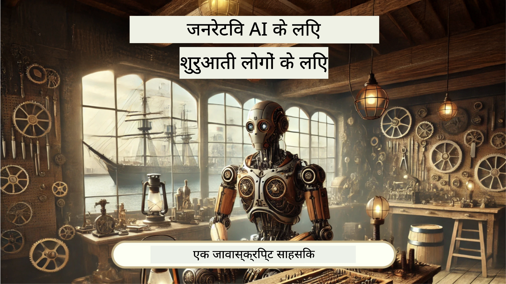
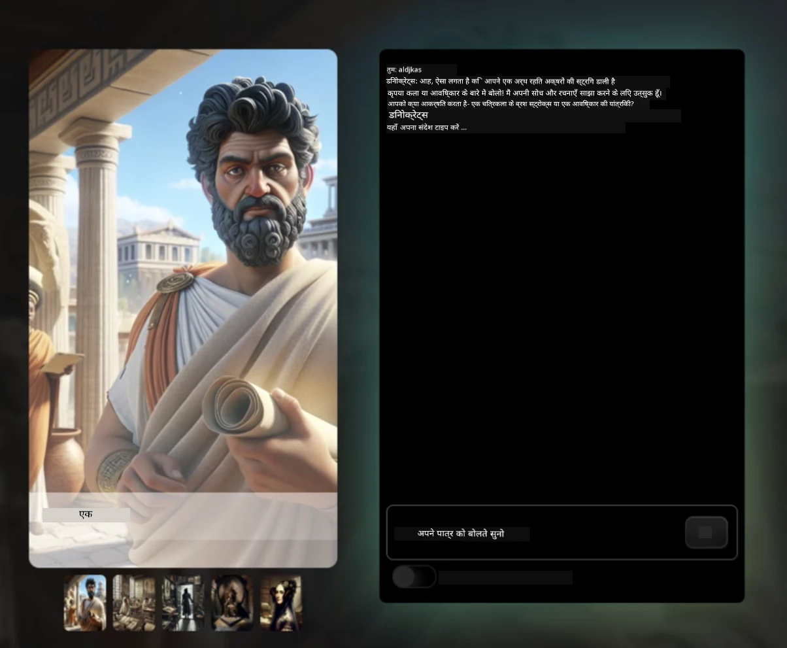
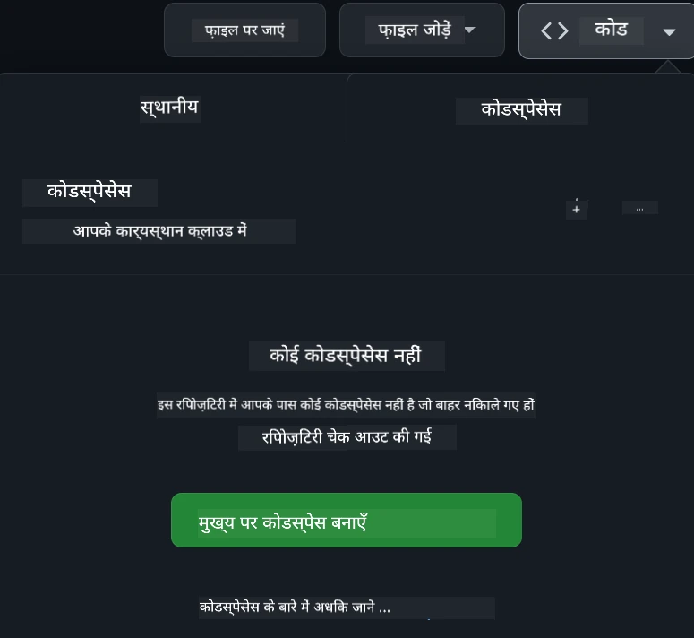

<!--
CO_OP_TRANSLATOR_METADATA:
{
  "original_hash": "fea3a0fceb8ad86fd640c09cf63a2aac",
  "translation_date": "2026-01-06T15:52:09+00:00",
  "source_file": "README.md",
  "language_code": "hi"
}
-->
# शुरुआती लोगों के लिए वेब विकास - एक पाठ्यक्रम

Microsoft Cloud Advocates द्वारा हमारे 12 सप्ताह के व्यापक पाठ्यक्रम के साथ वेब विकास के बुनियादी सिद्धांत सीखें। 24 पाठों में से प्रत्येक में JavaScript, CSS, और HTML पर व्यावहारिक परियोजनाओं जैसे टेरारियम, ब्राउज़र एक्सटेंशन, और स्पेस गेम्स के माध्यम से गहराई से चर्चा की जाती है। प्रश्नोत्तरी, चर्चा, और व्यावहारिक असाइनमेंट के साथ जुड़ें। हमारे प्रभावी परियोजना-आधारित शिक्षण पद्धति के साथ अपनी कौशल को बढ़ाएं और अपने ज्ञान को बेहतर बनाएं। आज ही अपनी कोडिंग यात्रा शुरू करें!

Azure AI Foundry Discord समुदाय में शामिल हों

इन संसाधनों का उपयोग शुरू करने के लिए ये कदम उठाएं:
1. **रिपॉजिटरी को फोर्क करें**: क्लिक करें [](https://GitHub.com/microsoft/Web-Dev-For-Beginners/fork)
2. **रिपॉजिटरी को क्लोन करें**:   `git clone https://github.com/microsoft/Web-Dev-For-Beginners.git`
3. [**Azure AI Foundry Discord से जुड़ें और विशेषज्ञों और अन्य डेवलपर्स से मिलें**](https://discord.com/invite/ByRwuEEgH4)

### 🌐 बहुभाषी समर्थन

#### GitHub Action के माध्यम से समर्थित (स्वचालित और हमेशा अपडेट)

<!-- CO-OP TRANSLATOR LANGUAGES TABLE START -->
[Arabic](../ar/README.md) | [Bengali](../bn/README.md) | [Bulgarian](../bg/README.md) | [Burmese (Myanmar)](../my/README.md) | [Chinese (Simplified)](../zh/README.md) | [Chinese (Traditional, Hong Kong)](../hk/README.md) | [Chinese (Traditional, Macau)](../mo/README.md) | [Chinese (Traditional, Taiwan)](../tw/README.md) | [Croatian](../hr/README.md) | [Czech](../cs/README.md) | [Danish](../da/README.md) | [Dutch](../nl/README.md) | [Estonian](../et/README.md) | [Finnish](../fi/README.md) | [French](../fr/README.md) | [German](../de/README.md) | [Greek](../el/README.md) | [Hebrew](../he/README.md) | [Hindi](./README.md) | [Hungarian](../hu/README.md) | [Indonesian](../id/README.md) | [Italian](../it/README.md) | [Japanese](../ja/README.md) | [Kannada](../kn/README.md) | [Korean](../ko/README.md) | [Lithuanian](../lt/README.md) | [Malay](../ms/README.md) | [Malayalam](../ml/README.md) | [Marathi](../mr/README.md) | [Nepali](../ne/README.md) | [Nigerian Pidgin](../pcm/README.md) | [Norwegian](../no/README.md) | [Persian (Farsi)](../fa/README.md) | [Polish](../pl/README.md) | [Portuguese (Brazil)](../br/README.md) | [Portuguese (Portugal)](../pt/README.md) | [Punjabi (Gurmukhi)](../pa/README.md) | [Romanian](../ro/README.md) | [Russian](../ru/README.md) | [Serbian (Cyrillic)](../sr/README.md) | [Slovak](../sk/README.md) | [Slovenian](../sl/README.md) | [Spanish](../es/README.md) | [Swahili](../sw/README.md) | [Swedish](../sv/README.md) | [Tagalog (Filipino)](../tl/README.md) | [Tamil](../ta/README.md) | [Telugu](../te/README.md) | [Thai](../th/README.md) | [Turkish](../tr/README.md) | [Ukrainian](../uk/README.md) | [Urdu](../ur/README.md) | [Vietnamese](../vi/README.md)

> **क्या आप स्थानीय रूप से क्लोन करना पसंद करते हैं?**

> इस रिपॉजिटरी में 50+ भाषा अनुवाद शामिल हैं जो डाउनलोड आकार को काफी बढ़ा देते हैं। बिना अनुवाद के क्लोन करने के लिए, sparse checkout का उपयोग करें:
> ```bash
> git clone --filter=blob:none --sparse https://github.com/microsoft/Web-Dev-For-Beginners.git
> cd Web-Dev-For-Beginners
> git sparse-checkout set --no-cone '/*' '!translations' '!translated_images'
> ```
> ऐसा करने से आपको तेजी से डाउनलोड के साथ पाठ्यक्रम पूरा करने के लिए सब कुछ मिल जाएगा।
<!-- CO-OP TRANSLATOR LANGUAGES TABLE END -->

**यदि आप अतिरिक्त अनुवाद भाषाओं का समर्थन चाहते हैं तो वे [यहाँ](https://github.com/Azure/co-op-translator/blob/main/getting_started/supported-languages.md) सूचीबद्ध हैं**

[](https://open.vscode.dev/microsoft/Web-Dev-For-Beginners)

#### 🧑‍🎓 _क्या आप छात्र हैं?_

[**Student Hub पेज**](https://docs.microsoft.com/learn/student-hub/?WT.mc_id=academic-77807-sagibbon) पर जाएं जहाँ आपको शुरुआती संसाधन, छात्र पैक और मुफ्त प्रमाणपत्र वाउचर प्राप्त करने के तरीके मिलेंगे। यह वह पेज है जिसे आप बुकमार्क करना चाहेंगे और समय-समय पर देखना चाहेंगे क्योंकि हम प्रति माह सामग्री बदलते हैं।

### 📣 घोषणा - नए GitHub Copilot Agent मोड चुनौतियां पूरी करें!

नई चुनौती जोड़ी गई है, अधिकांश अध्यायों में "GitHub Copilot Agent Challenge 🚀" देखें। यह आपके लिए GitHub Copilot और Agent मोड का उपयोग करके पूरी करने के लिए एक नई चुनौती है। यदि आपने पहले Agent मोड का उपयोग नहीं किया है, तो यह न केवल टेक्स्ट उत्पन्न कर सकता है बल्कि फाइलें बना और संपादित भी कर सकता है, कमांड चला सकता है और बहुत कुछ।

### 📣 घोषणा - _ जनरेटिव AI का उपयोग कर नया प्रोजेक्ट बनाएं_

नया AI सहायक प्रोजेक्ट अभी जोड़ा गया है, इसे देखें [project](./9-chat-project/README.md)

### 📣 घोषणा - JavaScript के लिए _नया जनरेटिव AI पाठ्यक्रम_ अभी रिलीज़ हुआ

हमारा नया जनरेटिव AI पाठ्यक्रम न देखें!

शुरू करने के लिए [https://aka.ms/genai-js-course](https://aka.ms/genai-js-course) पर जाएं!



- बुनियादी से लेकर RAG तक सब कुछ कवर करने वाले पाठ।
- GenAI और हमारे सहायता ऐप का उपयोग करके ऐतिहासिक पात्रों के साथ बातचीत करें।
- मजेदार और आकर्षक कहानी, आप समय यात्रा कर रहे होंगे!



प्रत्येक पाठ में एक असाइनमेंट, एक ज्ञान जांच और एक चुनौती शामिल है जो आपको निम्नलिखित विषयों पर गाइड करती है:
- प्रॉम्प्टिंग और प्रॉम्प्ट इंजीनियरिंग
- टेक्स्ट और छवि ऐप निर्माण
- खोज ऐप्स

शुरू करने के लिए [https://aka.ms/genai-js-course](../../[https:/aka.ms/genai-js-course) पर जाएं!


## 🌱 शुरू करना

> **शिक्षक**, हमने इस पाठ्यक्रम का उपयोग करने के लिए कुछ सुझाव [शामिल किए हैं](for-teachers.md)। हम आपके सुझावों का स्वागत करते हैं [हमारे चर्चा मंच](https://github.com/microsoft/Web-Dev-For-Beginners/discussions/categories/teacher-corner) में!

**[शिक्षार्थी](https://aka.ms/student-page/?WT.mc_id=academic-77807-sagibbon)**, प्रत्येक पाठ के लिए, एक पूर्व-व्याख्यान प्रश्नोत्तरी से शुरू करें और व्याख्यान सामग्री पढ़ें, विभिन्न गतिविधियाँ पूरी करें और पोस्ट-व्याख्यान प्रश्नोत्तरी के साथ अपनी समझ की जांच करें।

अपने सीखने के अनुभव को बढ़ाने के लिए, अपने सहपाठियों के साथ जुड़ें और परियोजनाओं पर साथ मिलकर काम करें! चर्चाओं के लिए हमारे [चर्चा मंच](https://github.com/microsoft/Web-Dev-For-Beginners/discussions) में भाग लें जहां हमारे मॉडरेटर आपकी प्रश्नों का उत्तर देने के लिए उपलब्ध रहेंगे।

अपने शिक्षा को और आगे बढ़ाने के लिए, हम अतिरिक्त अध्ययन सामग्री के लिए [Microsoft Learn](https://learn.microsoft.com/users/wirelesslife/collections/p1ddcy5jwy0jkm?WT.mc_id=academic-77807-sagibbon) को देखने की सलाह देते हैं।

### 📋 अपना वातावरण सेट करना

इस पाठ्यक्रम में एक विकास वातावरण पहले से तैयार है! जब आप शुरू करते हैं तो आप इस पाठ्यक्रम को [Codespace](https://github.com/features/codespaces/) (_एक ब्राउज़र-आधारित, बिना इंस्टॉल किए चलने वाला वातावरण_) में या अपने कंप्यूटर पर [Visual Studio Code](https://code.visualstudio.com/?WT.mc_id=academic-77807-sagibbon) जैसे टेक्स्ट संपादक का उपयोग करके स्थानीय रूप से चला सकते हैं।

#### अपना रिपॉजिटरी बनाएं
अपने काम को आसानी से सहेजने के लिए, यह सलाह दी जाती है कि आप इस रिपॉजिटरी की अपनी कॉपी बनाएं। आप ऐसा पेज के शीर्ष पर **Use this template** बटन पर क्लिक करके कर सकते हैं। यह आपके GitHub खाते में पाठ्यक्रम की एक कॉपी के साथ नई रिपॉजिटरी बनाएगा।

ये कदम उठाएं:
1. **रिपॉजिटरी को फोर्क करें**: इस पेज के ऊपर-दाहिने कोने में "Fork" बटन पर क्लिक करें।
2. **रिपॉजिटरी को क्लोन करें**:   `git clone https://github.com/microsoft/Web-Dev-For-Beginners.git`

#### Codespace में पाठ्यक्रम चलाना

आपके द्वारा बनाई गई इस रिपॉजिटरी की कॉपी में, **Code** बटन पर क्लिक करें और **Open with Codespaces** चुनें। यह आपके लिए काम करने के लिए नया Codespace बनाएगा।



#### अपने कंप्यूटर पर पाठ्यक्रम को स्थानीय रूप से चलाना

अपने कंप्यूटर पर इस पाठ्यक्रम को चलाने के लिए, आपको एक टेक्स्ट संपादक, ब्राउज़र और कमांड लाइन टूल की आवश्यकता होगी। हमारा पहला पाठ, [प्रोग्रामिंग भाषाओं का परिचय और उपकरण](../../1-getting-started-lessons/1-intro-to-programming-languages), आपको प्रत्येक उपकरण के लिए विभिन्न विकल्पों से परिचित कराएगा ताकि आप अपनी पसंद का चयन कर सकें।

हमारा सुझाव है कि आप [Visual Studio Code](https://code.visualstudio.com/?WT.mc_id=academic-77807-sagibbon) का उपयोग संपादक के रूप में करें, जिसमें एक अंतर्निहित [टर्मिनल](https://code.visualstudio.com/docs/terminal/basics/?WT.mc_id=academic-77807-sagibbon) भी है। आप Visual Studio Code [यहाँ](https://code.visualstudio.com/?WT.mc_id=academic-77807-sagibbon) से डाउनलोड कर सकते हैं।

1. अपने कंप्यूटर पर अपना रिपॉजिटरी क्लोन करें। आप ऐसा **Code** बटन पर क्लिक करके और URL कॉपी करके कर सकते हैं:

    [CodeSpace](./images/createcodespace.png)
    फिर, [Visual Studio Code](https://code.visualstudio.com/?WT.mc_id=academic-77807-sagibbon) के भीतर [Terminal](https://code.visualstudio.com/docs/terminal/basics/?WT.mc_id=academic-77807-sagibbon) खोलें और निम्नलिखित कमांड चलाएँ, `<your-repository-url>` को उस URL से बदलें जिसे आपने अभी कॉपी किया है:

    ```bash 
    git clone <your-repository-url>
    ```

2. Visual Studio Code में फ़ोल्डर खोलें। आप इसे **File** > **Open Folder** पर क्लिक करके और उस फ़ोल्डर का चयन करके कर सकते हैं जिसे आपने अभी क्लोन किया है।


>  अनुशंसित Visual Studio Code एक्सटेंशंस:
>
> * [Live Server](https://marketplace.visualstudio.com/items?itemName=ritwickdey.LiveServer&WT.mc_id=academic-77807-sagibbon) - Visual Studio Code के भीतर HTML पेजों का पूर्वावलोकन करने के लिए
> * [Copilot](https://marketplace.visualstudio.com/items?itemName=GitHub.copilot&WT.mc_id=academic-77807-sagibbon) - कोड तेज़ी से लिखने में मदद करने के लिए

## 📂 प्रत्येक पाठ में शामिल है:

- वैकल्पिक स्केचनोट
- वैकल्पिक पूरक वीडियो
- पाठ से पहले वार्मअप क्विज़
- लिखित पाठ
- परियोजना-आधारित पाठों के लिए, परियोजना बनाने के लिए चरण-दर-चरण मार्गदर्शिकाएं
- ज्ञान जाँच
- एक चुनौती
- पूरक पठन
- असाइनमेंट
- [पाठोत्तर क्विज़](https://ff-quizzes.netlify.app/web/)

> **क्विज़ के बारे में एक नोट**: सभी क्विज़ Quiz-app फ़ोल्डर में हैं, कुल 48 क्विज़ हैं जिनमें से प्रत्येक में तीन प्रश्न हैं। ये [यहाँ](https://ff-quizzes.netlify.app/web/) उपलब्ध हैं; क्विज़ ऐप स्थानीय रूप से चलाया जा सकता है या Azure पर तैनात किया जा सकता है; `quiz-app` फ़ोल्डर में निर्देशों का पालन करें।

## 🗃️ पाठ

|     |                       परियोजना का नाम                       |                            सिखाए गए अवधारणाएं                             | सीखने के उद्देश्य                                                                                                                 |                                                         लिंक किया गया पाठ                                                          |         लेखक          |
| :-: | :------------------------------------------------------: | :--------------------------------------------------------------------: | ----------------------------------------------------------------------------------------------------------------------------------- | :----------------------------------------------------------------------------------------------------------------------------: | :---------------------: |
| 01  |                     शुरूआत करना                      |           प्रोग्रामिंग और ट्रेड के उपकरणों का परिचय           | अधिकांश प्रोग्रामिंग भाषाओं के मूल तत्वों को सीखें और उन सॉफ़्टवेयर के बारे में जानें जो पेशेवर डेवलपर्स को उनके काम में मदद करते हैं | [प्रोग्रामिंग भाषाओं और ट्रेड के उपकरणों का परिचय](./1-getting-started-lessons/1-intro-to-programming-languages/README.md) |         जैसमीन         |
| 02  |                     शुरूआत करना                      |             GitHub के मूल बातें, जिसमें टीम के साथ काम करना शामिल है             | अपने प्रोजेक्ट में GitHub का उपयोग कैसे करें, और कोड बेस पर दूसरों के साथ सहयोग कैसे करें                                                    |                            [GitHub परिचय](./1-getting-started-lessons/2-github-basics/README.md)                             |          फ्लोर          |
| 03  |                     शुरूआत करना                      |                             पहुँच योग्यता                              | वेब एक्सेसिबिलिटी के मूल बातें सीखें                                                                                               |                       [एक्सेसिबिलिटी फंडामेंटल्स](./1-getting-started-lessons/3-accessibility/README.md)                       |       क्रिस्टोफर       |
| 04  |                        JS की मूल बातें                         |                         JavaScript डेटा प्रकार                          | JavaScript डेटा प्रकारों के मूल बातें                                                                                                 |                                       [डेटा प्रकार](./2-js-basics/1-data-types/README.md)                                        |         जैसमीन         |
| 05  |                        JS की मूल बातें                         |                         फंक्शन और मेथड्स                          | एप्लिकेशन के लॉजिक फ्लो को प्रबंधित करने के लिए फंक्शंस और मेथड्स के बारे में जानें                                                             |                              [फंक्शंस और मेथड्स](./2-js-basics/2-functions-methods/README.md)                               | जैसमीन और क्रिस्टोफर |
| 06  |                        JS की मूल बातें                         |                        JS के साथ निर्णय लेना                        | निर्णय लेने की विधियों का उपयोग करके अपनी कोड में शर्तें कैसे बनाएं सीखें                                                           |                                 [निर्णय लेना](./2-js-basics/3-making-decisions/README.md)                                  |         जैसमीन         |
| 07  |                        JS की मूल बातें                         |                            ऐरे और लूप्स                            | JavaScript में डेटा के साथ काम करने के लिए ऐरे और लूप्स का उपयोग करें                                                                                 |                                   [ऐरे और लूप्स](./2-js-basics/4-arrays-loops/README.md)                                    |         जैसमीन         |
| 08  |       [टेरेरियम](./3-terrarium/solution/README.md)       |                            HTML प्रैक्टिस में                           | ऑनलाइन टेरेरियम बनाने के लिए HTML बनाएं, लेआउट बनाने पर ध्यान केंद्रित करें                                                         |                                 [HTML का परिचय](./3-terrarium/1-intro-to-html/README.md)                                 |           जेन           |
| 09  |       [टेरेरियम](./3-terrarium/solution/README.md)       |                            CSS प्रैक्टिस में                            | ऑनलाइन टेरियम को स्टाइल करने के लिए CSS बनाएं, CSS के मूल सिद्धांतों पर ध्यान दें जिसमें पेज को रेस्पॉन्सिव बनाना शामिल है                     |                                  [CSS का परिचय](./3-terrarium/2-intro-to-css/README.md)                                  |           जेन           |
| 10  |            [टेरेरियम](./3-terrarium/solution/README.md)            |                 JavaScript क्लोज़र्स, DOM मैनिपुलेशन                  | टेरेरियम को ड्रैग/ड्रॉप इंटरफ़ेस के रूप में कार्य करने के लिए JavaScript बनाएं, क्लोज़र्स और DOM मैनिपुलेशन पर ध्यान केंद्रित करें             |                  [JavaScript क्लोज़र्स, DOM मैनिपुलेशन](./3-terrarium/3-intro-to-DOM-and-closures/README.md)                   |           जेन           |
| 11  |          [टाइपिंग गेम](./4-typing-game/solution/README.md)          |                          टाइपिंग गेम बनाएं                           | अपने JavaScript ऐप की लॉजिक ड्राइव करने के लिए कीबोर्ड इवेंट्स का उपयोग कैसे करें सीखें                                                          |                                [इवेंट-ड्रिवन प्रोग्रामिंग](./4-typing-game/typing-game/README.md)                                |       क्रिस्टोफर       |
| 12  | [ग्रीन ब्राउज़र एक्सटेंशन](./5-browser-extension/solution/README.md) |                         ब्राउज़र्स के साथ काम करना                          | ब्राउज़र्स कैसे काम करते हैं, उनका इतिहास, और ब्राउज़र एक्सटेंशन के पहले तत्वों को कैसे स्कैफ़ोल्ड करें सीखें                               |                               [ब्राउज़र्स के बारे में](./5-browser-extension/1-about-browsers/README.md)                                |           जेन           |
| 13  | [ग्रीन ब्राउज़र एक्सटेंशन](./5-browser-extension/solution/README.md) | फॉर्म बनाना, API कॉल करना और लोकल स्टोरेज में वेरिएबल स्टोर करना | अपने ब्राउज़र एक्सटेंशन के JavaScript तत्वों का निर्माण करें जो लोकल स्टोरेज में संग्रहीत वेरिएबल्स का उपयोग करके API कॉल करें                      |                [APIs, फॉर्म्स, और लोकल स्टोरेज](./5-browser-extension/2-forms-browsers-local-storage/README.md)                 |           जेन           |
| 14  | [ग्रीन ब्राउज़र एक्सटेंशन](./5-browser-extension/solution/README.md) |          ब्राउज़र के बैकग्राउंड प्रोसेस, वेब प्रदर्शन          | एक्सटेंशन के आइकन को प्रबंधित करने के लिए ब्राउज़र के बैकग्राउंड प्रोसेस का उपयोग करें; वेब प्रदर्शन और कुछ अनुकूलन के बारे में सीखें   |             [बैकग्राउंड टास्क्स और प्रदर्शन](./5-browser-extension/3-background-tasks-and-performance/README.md)              |           जेन           |
| 15  |           [स्पेस गेम](./6-space-game/solution/README.md)           |             JavaScript के साथ अधिक उन्नत गेम डेवलपमेंट             | क्लासेस और कम्पोजीशन दोनों का उपयोग करके इनहेरिटेंस और पब/सब पैटर्न के बारे में जानें, गेम बनाने की तैयारी के रूप में              |                      [उन्नत गेम डेवलपमेंट का परिचय](./6-space-game/1-introduction/README.md)                       |          क्रिस          |
| 16  |           [स्पेस गेम](./6-space-game/solution/README.md)           |                           कैनवास पर ड्रॉ करना                            | कैनवास API के बारे में जानें, जिसका उपयोग स्क्रीन पर तत्वों को ड्रॉ करने के लिए किया जाता है                                                                       |                                [कैनवास पर ड्रॉ करना](./6-space-game/2-drawing-to-canvas/README.md)                                |          क्रिस          |
| 17  |           [स्पेस गेम](./6-space-game/solution/README.md)           |                   स्क्रीन पर तत्वों को घुमाना                    | खोजें कि कैसे तत्वों को कार्टिसियन निर्देशांक और कैनवास API का उपयोग करके गति मिलती है                                            |                           [तत्वों को घुमाना](./6-space-game/3-moving-elements-around/README.md)                           |          क्रिस          |
| 18  |           [स्पेस गेम](./6-space-game/solution/README.md)           |                          टकराव का पता लगाना                           | तत्वों को टकराने और एक-दूसरे के लिए प्रतिक्रिया देने वाली कीप्रेस का उपयोग करके बनाएं और गेम के प्रदर्शन को सुनिश्चित करने के लिए एक कूलडाउन फंक्शन प्रदान करें    |                              [टकराव का पता लगाना](./6-space-game/4-collision-detection/README.md)                              |          क्रिस          |
| 19  |           [स्पेस गेम](./6-space-game/solution/README.md)           |                             स्कोर बनाए रखना                              | गेम की स्थिति और प्रदर्शन के आधार पर गणना करें                                                                |                                    [स्कोर बनाए रखना](./6-space-game/5-keeping-score/README.md)                                    |          क्रिस          |
| 20  |           [स्पेस गेम](./6-space-game/solution/README.md)           |                     गेम को समाप्त करना और पुनः शुरू करना                     | गेम को समाप्त और पुनः शुरू करने के बारे में जानें, जिसमें संपत्तियों की सफाई और वेरिएबल मानों को रीसेट करना शामिल है                              |                                [समाप्ति शर्त](./6-space-game/6-end-condition/README.md)                                 |          क्रिस          |
| 21  |         [बैंकिंग ऐप](./7-bank-project/solution/README.md)          |                 वेब ऐप में HTML टेम्प्लेट्स और रूट्स                 | रूटिंग और HTML टेम्प्लेट्स का उपयोग करके एक मल्टीपेज वेबसाइट की संरचना कैसे बनाएं सीखें                             |                            [HTML टेम्प्लेट्स और रूट्स](./7-bank-project/1-template-route/README.md)                             |          योहान          |
| 22  |         [बैंकिंग ऐप](./7-bank-project/solution/README.md)          |                  लॉगिन और रजिस्ट्रेशन फॉर्म बनाएं                   | फॉर्म बनाने और वैलिडेशन रूटीन को संभालने के बारे में जानें                                                                          |                                           [फॉर्म्स](./7-bank-project/2-forms/README.md)                                           |          योहान          |
| 23  |         [बैंकिंग ऐप](./7-bank-project/solution/README.md)          |                   डेटा प्राप्ति और उपयोग की विधियां                   | आपके ऐप में डेटा कैसे आता और जाता है, इसे कैसे प्राप्त करें, स्टोर करें, और नष्ट करें                                                 |                                            [डेटा](./7-bank-project/3-data/README.md)                                            |          योहान          |
| 24  |         [बैंकिंग ऐप](./7-bank-project/solution/README.md)          |                      स्टेट मैनेजमेंट की अवधारणाएं                      | जानें कि आपका ऐप स्टेट कैसे रखता है और इसे प्रोग्रामेटिक रूप से कैसे प्रबंधित करता है                                                              |                                [स्टेट मैनेजमेंट](./7-bank-project/4-state-management/README.md)                                |          योहान          |
| 25 | [ब्राउज़र/VScode कोड](../../8-code-editor) | VScode के साथ काम करना | एक कोड संपादक का उपयोग कैसे करें सीखें| [VScode कोड एडिटर का उपयोग](./8-code-editor/1-using-a-code-editor/README.md) | क्रिस |
| 26 | [एआई सहायक](./9-chat-project/README.md) | एआई के साथ काम करना | अपना खुद का एआई सहायक बनाना सीखें | [एआई सहयोगी प्रोजेक्ट](./9-chat-project/README.md) | क्रिस |

## 🏫 शिक्षा पद्धति

हमारा पाठ्यक्रम दो प्रमुख शैक्षिक सिद्धांतों के साथ डिजाइन किया गया है:
* परियोजना-आधारित शिक्षा
* अक्सर क्विज़

यह प्रोग्राम JavaScript, HTML, और CSS के मूल सिद्धांतों के साथ-साथ आज के वेब डेवलपर्स द्वारा उपयोग किए जाने वाले नवीनतम उपकरणों और तकनीकों को सिखाता है। छात्रों को टाइपिंग गेम, वर्चुअल टेरेरियम, पर्यावरण-मैत्री ब्राउज़र एक्सटेंशन, स्पेस-इंवेडर-शैली का गेम, और व्यवसायों के लिए बैंकिंग ऐप बनाकर व्यावहारिक अनुभव प्राप्त करने का अवसर मिलेगा। श्रृंखला के अंत तक, छात्रों को वेब विकास की ठोस समझ होगी।

> 🎓 आप इस पाठ्यक्रम के पहले कुछ पाठों को Microsoft Learn पर [Learn Path](https://docs.microsoft.com/learn/paths/web-development-101/?WT.mc_id=academic-77807-sagibbon) के रूप में ले सकते हैं!

यह सुनिश्चित करके कि सामग्री परियोजनाओं के साथ संरेखित है, प्रक्रिया छात्रों के लिए अधिक रोचक बनती है और अवधारणाओं को याद रखने में वृद्धि होगी। हमने JavaScript की मूल बातें परिचित कराने के लिए कई शुरुआत के पाठ भी लिखे हैं, जिन्हें "[Beginners Series to: JavaScript](https://channel9.msdn.com/Series/Beginners-Series-to-JavaScript/?WT.mc_id=academic-77807-sagibbon)" वीडियो ट्यूटोरियल संग्रह के एक वीडियो के साथ जोड़ा गया है, जिनमें से कुछ लेखकों ने इस पाठ्यक्रम में योगदान दिया है।

इसके अतिरिक्त, कक्षा से पहले एक कम दबाव वाला क्विज़ छात्र के सीखने के उद्देश्य को निर्धारित करता है, जबकि कक्षा के बाद एक दूसरा क्विज़ आगे की पकड़ सुनिश्चित करता है। यह पाठ्यक्रम लचीला और मजेदार होने के लिए डिजाइन किया गया था और इसे पूरे या आंशिक रूप से लिया जा सकता है। परियोजनाएँ छोटी शुरू होती हैं और 12-सप्ताह के चक्र के अंत तक जटिल होती जाती हैं।

जबकि हमने जानबूझकर JavaScript फ्रेमवर्क पेश करने से बचा है ताकि वेब डेवलपर के रूप में आवश्यक मूल कौशलों पर ध्यान केंद्रित किया जा सके, इस पाठ्यक्रम को पूरा करने के लिए अगला अच्छा कदम Node.js के बारे में सीखना होगा, जो वीडियो संग्रह "[Beginner Series to: Node.js](https://channel9.msdn.com/Series/Beginners-Series-to-Nodejs/?WT.mc_id=academic-77807-sagibbon)" के माध्यम से किया जा सकता है।

> हमारे [आचार संहिता](CODE_OF_CONDUCT.md) और [योगदान](CONTRIBUTING.md) दिशानिर्देश देखें। हम आपके रचनात्मक फीडबैक का स्वागत करते हैं!


## 🧭 ऑफलाइन पहुँच

आप [Docsify](https://docsify.js.org/#/) का उपयोग करके इस दस्तावेज़ को ऑफलाइन चला सकते हैं। इस रिपॉजिटरी को फोर्क करें, अपनी स्थानीय मशीन पर [Docsify इंस्टॉल करें](https://docsify.js.org/#/quickstart), और फिर इस रिपॉजिटरी के रूट फ़ोल्डर में `docsify serve` टाइप करें। वेबसाइट आपके लोकलहोस्ट पर पोर्ट 3000 पर सर्व होगी: `localhost:3000`।

## 📘 पीडीएफ

सभी पाठों का PDF [यहाँ](https://microsoft.github.io/Web-Dev-For-Beginners/pdf/readme.pdf) पाया जा सकता है।


## 🎒 अन्य कोर्सेज
हमारी टीम अन्य पाठ्यक्रम भी बनाती है! देखें:

<!-- CO-OP TRANSLATOR OTHER COURSES START -->
### LangChain
[](https://aka.ms/langchain4j-for-beginners)
[](https://aka.ms/langchainjs-for-beginners?WT.mc_id=m365-94501-dwahlin)

---

### Azure / Edge / MCP / Agents
[](https://github.com/microsoft/AZD-for-beginners?WT.mc_id=academic-105485-koreyst)
[](https://github.com/microsoft/edgeai-for-beginners?WT.mc_id=academic-105485-koreyst)
[](https://github.com/microsoft/mcp-for-beginners?WT.mc_id=academic-105485-koreyst)
[](https://github.com/microsoft/ai-agents-for-beginners?WT.mc_id=academic-105485-koreyst)

---
 
### Generative AI Series
[](https://github.com/microsoft/generative-ai-for-beginners?WT.mc_id=academic-105485-koreyst)
[-9333EA?style=for-the-badge&labelColor=E5E7EB&color=9333EA)](https://github.com/microsoft/Generative-AI-for-beginners-dotnet?WT.mc_id=academic-105485-koreyst)
[-C084FC?style=for-the-badge&labelColor=E5E7EB&color=C084FC)](https://github.com/microsoft/generative-ai-for-beginners-java?WT.mc_id=academic-105485-koreyst)
[-E879F9?style=for-the-badge&labelColor=E5E7EB&color=E879F9)](https://github.com/microsoft/generative-ai-with-javascript?WT.mc_id=academic-105485-koreyst)

---
 
### Core Learning
[](https://aka.ms/ml-beginners?WT.mc_id=academic-105485-koreyst)
[](https://aka.ms/datascience-beginners?WT.mc_id=academic-105485-koreyst)
[](https://aka.ms/ai-beginners?WT.mc_id=academic-105485-koreyst)
[](https://github.com/microsoft/Security-101?WT.mc_id=academic-96948-sayoung)
[](https://aka.ms/webdev-beginners?WT.mc_id=academic-105485-koreyst)
[](https://aka.ms/iot-beginners?WT.mc_id=academic-105485-koreyst)
[](https://github.com/microsoft/xr-development-for-beginners?WT.mc_id=academic-105485-koreyst)

---
 
### Copilot Series
[](https://aka.ms/GitHubCopilotAI?WT.mc_id=academic-105485-koreyst)
[](https://github.com/microsoft/mastering-github-copilot-for-dotnet-csharp-developers?WT.mc_id=academic-105485-koreyst)
[](https://github.com/microsoft/CopilotAdventures?WT.mc_id=academic-105485-koreyst)
<!-- CO-OP TRANSLATOR OTHER COURSES END -->

## सहायता प्राप्त करना

यदि आप अटक जाते हैं या AI ऐप निर्माण के बारे में कोई प्रश्न हैं। MCP के बारे में चर्चा में साथी शिक्षार्थियों और अनुभवी डेवलपर्स के साथ जुड़ें। यह एक सहायक समुदाय है जहाँ प्रश्न स्वागत योग्य हैं और ज्ञान स्वतंत्र रूप से साझा किया जाता है।

[](https://discord.gg/nTYy5BXMWG)

यदि आपके पास उत्पाद प्रतिक्रिया है या निर्माण के दौरान त्रुटियाँ हैं तो जाएं:

[](https://aka.ms/foundry/forum)

## लाइसेंस

यह रिपॉजिटरी MIT लाइसेंस के तहत लाइसेंस प्राप्त है। अधिक जानकारी के लिए [LICENSE](../../LICENSE) फ़ाइल देखें।

---

<!-- CO-OP TRANSLATOR DISCLAIMER START -->
**अस्वीकरण**:  
इस दस्तावेज़ का अनुवाद AI अनुवाद सेवा [Co-op Translator](https://github.com/Azure/co-op-translator) का उपयोग करके किया गया है। जबकि हम सटीकता के लिए प्रयासरत हैं, कृपया ध्यान दें कि स्वचालित अनुवाद में त्रुटियाँ या असंगतियाँ हो सकती हैं। मूल दस्तावेज़ को उसकी मूल भाषा में ही प्रामाणिक स्रोत माना जाना चाहिए। महत्वपूर्ण जानकारी के लिए पेशेवर मानवीय अनुवाद की सलाह दी जाती है। इस अनुवाद के उपयोग से उत्पन्न किसी भी गलतफहमी या गलत व्याख्या के लिए हम उत्तरदायी नहीं हैं।
<!-- CO-OP TRANSLATOR DISCLAIMER END -->