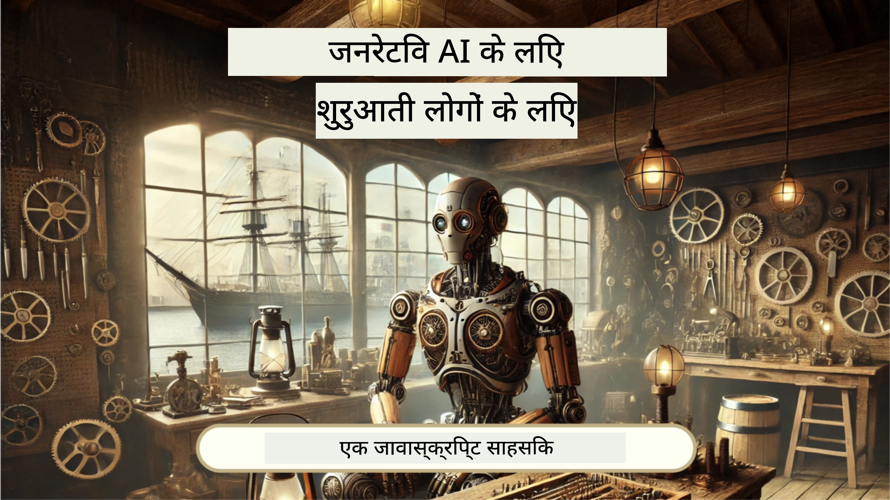
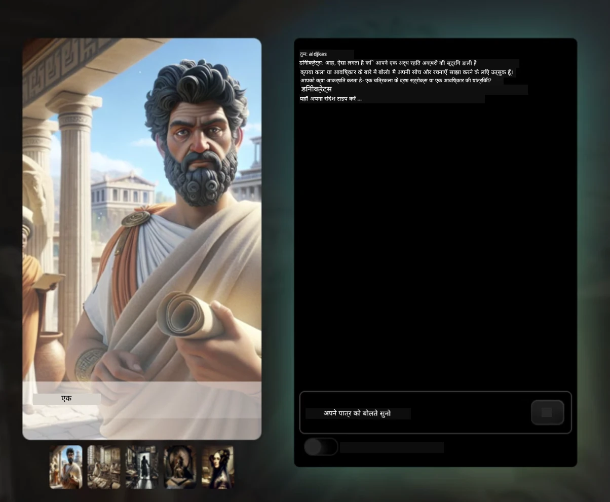
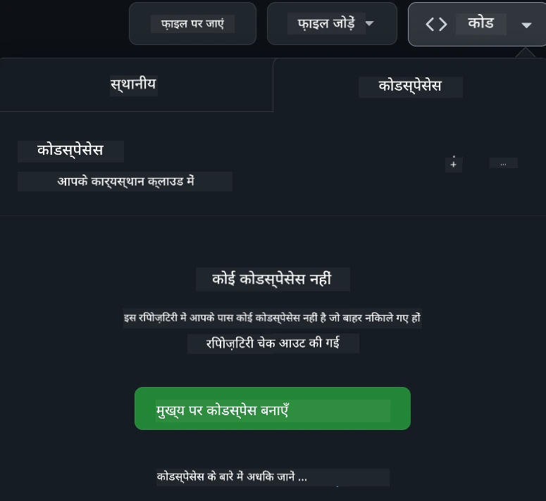

[](https://github.com/microsoft/Web-Dev-For-Beginners/blob/master/LICENSE)
[](https://GitHub.com/microsoft/Web-Dev-For-Beginners/graphs/contributors/)
[](https://GitHub.com/microsoft/Web-Dev-For-Beginners/issues/)
[](https://GitHub.com/microsoft/Web-Dev-For-Beginners/pulls/)
[](http://makeapullrequest.com) 

[](https://GitHub.com/microsoft/Web-Dev-For-Beginners/watchers/)
[](https://GitHub.com/microsoft/Web-Dev-For-Beginners/network/)
[](https://GitHub.com/microsoft/Web-Dev-For-Beginners/stargazers/)

[](https://discord.gg/nTYy5BXMWG)

# शुरुआती लोगों के लिए वेब विकास - एक पाठ्यक्रम

Microsoft Cloud Advocates द्वारा प्रस्तुत हमारे 12 सप्ताह के व्यापक पाठ्यक्रम के साथ वेब विकास की मूल बातें सीखें। 24 पाठों में से प्रत्येक में तरैरियम, ब्राउज़र एक्सटेंशन और स्पेस गेम जैसे प्रायोगिक परियोजनाओं के माध्यम से JavaScript, CSS, और HTML पर गहराई से चर्चा की गई है। क्विज़, चर्चाओं और व्यावहारिक असाइंमेंट्स के साथ जुड़ें। हमारे प्रभावी परियोजना-आधारित शिक्षण पद्धति के साथ अपने कौशल को निखारें और अपनी ज्ञान धारणा को बढ़ाएं। अपनी कोडिंग यात्रा आज ही शुरू करें!

Azure AI Foundry Discord समुदाय में शामिल हों

[](https://discord.gg/nTYy5BXMWG)

इन संसाधनों का उपयोग शुरू करने के लिए ये कदम उठाएं:
1. **रिपॉजिटरी फोर्क करें**: क्लिक करें [](https://GitHub.com/microsoft/Web-Dev-For-Beginners/fork)
2. **रिपॉजिटरी क्लोन करें**:   `git clone https://github.com/microsoft/Web-Dev-For-Beginners.git`
3. [**Azure AI Foundry Discord में शामिल हों और विशेषज्ञों तथा अन्य डेवलपर्स से मिलें**](https://discord.com/invite/ByRwuEEgH4)

### 🌐 बहुभाषी समर्थन

#### GitHub Action के माध्यम से समर्थित (स्वचालित और हमेशा अपडेटेड)

<!-- CO-OP TRANSLATOR LANGUAGES TABLE START -->
[Arabic](../ar/README.md) | [Bengali](../bn/README.md) | [Bulgarian](../bg/README.md) | [Burmese (Myanmar)](../my/README.md) | [Chinese (Simplified)](../zh-CN/README.md) | [Chinese (Traditional, Hong Kong)](../zh-HK/README.md) | [Chinese (Traditional, Macau)](../zh-MO/README.md) | [Chinese (Traditional, Taiwan)](../zh-TW/README.md) | [Croatian](../hr/README.md) | [Czech](../cs/README.md) | [Danish](../da/README.md) | [Dutch](../nl/README.md) | [Estonian](../et/README.md) | [Finnish](../fi/README.md) | [French](../fr/README.md) | [German](../de/README.md) | [Greek](../el/README.md) | [Hebrew](../he/README.md) | [Hindi](./README.md) | [Hungarian](../hu/README.md) | [Indonesian](../id/README.md) | [Italian](../it/README.md) | [Japanese](../ja/README.md) | [Kannada](../kn/README.md) | [Khmer](../km/README.md) | [Korean](../ko/README.md) | [Lithuanian](../lt/README.md) | [Malay](../ms/README.md) | [Malayalam](../ml/README.md) | [Marathi](../mr/README.md) | [Nepali](../ne/README.md) | [Nigerian Pidgin](../pcm/README.md) | [Norwegian](../no/README.md) | [Persian (Farsi)](../fa/README.md) | [Polish](../pl/README.md) | [Portuguese (Brazil)](../pt-BR/README.md) | [Portuguese (Portugal)](../pt-PT/README.md) | [Punjabi (Gurmukhi)](../pa/README.md) | [Romanian](../ro/README.md) | [Russian](../ru/README.md) | [Serbian (Cyrillic)](../sr/README.md) | [Slovak](../sk/README.md) | [Slovenian](../sl/README.md) | [Spanish](../es/README.md) | [Swahili](../sw/README.md) | [Swedish](../sv/README.md) | [Tagalog (Filipino)](../tl/README.md) | [Tamil](../ta/README.md) | [Telugu](../te/README.md) | [Thai](../th/README.md) | [Turkish](../tr/README.md) | [Ukrainian](../uk/README.md) | [Urdu](../ur/README.md) | [Vietnamese](../vi/README.md)

> **स्थानीय रूप से क्लोन करना पसंद है?**
>
> यह रिपॉजिटरी 50+ भाषा अनुवाद शामिल करती है जो डाउनलोड आकार को काफी बढ़ा देती है। बिना अनुवाद के क्लोन करने के लिए स्पार्स चेकआउट का उपयोग करें:
>
> **Bash / macOS / Linux:**
> ```bash
> git clone --filter=blob:none --sparse https://github.com/microsoft/Web-Dev-For-Beginners.git
> cd Web-Dev-For-Beginners
> git sparse-checkout set --no-cone '/*' '!translations' '!translated_images'
> ```
>
> **CMD (Windows):**
> ```cmd
> git clone --filter=blob:none --sparse https://github.com/microsoft/Web-Dev-For-Beginners.git
> cd Web-Dev-For-Beginners
> git sparse-checkout set --no-cone "/*" "!translations" "!translated_images"
> ```
>
> इससे आपको कोर्स पूरा करने के लिए आवश्यक सब कुछ अधिक तेजी से डाउनलोड मिलेगा।
<!-- CO-OP TRANSLATOR LANGUAGES TABLE END -->

**यदि आप अतिरिक्त अनुवाद भाषाओं को शामिल करना चाहते हैं, तो ये यहाँ सूचीबद्ध हैं [यहाँ](https://github.com/Azure/co-op-translator/blob/main/getting_started/supported-languages.md)**

[](https://open.vscode.dev/microsoft/Web-Dev-For-Beginners)

#### 🧑‍🎓 _क्या आप छात्र हैं?_

[**Student Hub पेज**](https://docs.microsoft.com/learn/student-hub/?WT.mc_id=academic-77807-sagibbon) पर जाएं जहाँ आप शुरुआती संसाधन, छात्र पैक और मुफ्त प्रमाणपत्र वाउचर प्राप्त करने के तरीके पा सकते हैं। यह पेज आपका पसंदीदा होना चाहिए और समय-समय पर जांचते रहना चाहिए क्योंकि हम मासिक रूप से कंटेंट अपडेट करते हैं।

### 📣 घोषणा - नए GitHub Copilot एजेंट मोड चुनौतियाँ पूरी करें!

नई चुनौती जोड़ी गई है, अधिकांश अध्यायों में "GitHub Copilot Agent Challenge 🚀" देखें। यह आपकी नई चुनौती है जिसे आप GitHub Copilot और Agent मोड का उपयोग करके पूरा कर सकते हैं। अगर आपने पहले Agent मोड का उपयोग नहीं किया है, तो यह केवल टेक्स्ट जनरेट ही नहीं करता बल्कि फाइलें बना सकता है, संपादित कर सकता है, कमांड चला सकता है और बहुत कुछ कर सकता है।

### 📣 घोषणा - _Generative AI का उपयोग करके नया प्रोजेक्ट बनाएँ_

नया AI सहायक प्रोजेक्ट अभी जोड़ा गया है, इसे देखें [project](./9-chat-project/README.md)

### 📣 घोषणा - _Generative AI के लिए नया पाठ्यक्रम_ JavaScript के लिए अभी जारी किया गया

हमारा नया Generative AI पाठ्यक्रम खोना मत!

शुरू करने के लिए जाएं [https://aka.ms/genai-js-course](https://aka.ms/genai-js-course)!



- बुनियादी से लेकर RAG तक सब कुछ शामिल पाठ।
- GenAI और हमारे साथी ऐप के साथ ऐतिहासिक पात्रों के साथ संवाद करें।
- मजेदार और आकर्षक कथा, आप समय यात्रा पर हैं!



हर पाठ में एक असाइंमेंट, ज्ञान जांच और एक चुनौती शामिल है जो आपको निम्न विषयों को सीखने में मार्गदर्शन करेगी:
- प्रॉम्प्टिंग और प्रॉम्प्ट इंजीनियरिंग
- टेक्स्ट और छवि ऐप जनरेशन
- खोज ऐप्स

शुरू करने के लिए जाएं [https://aka.ms/genai-js-course](https://aka.ms/genai-js-course)!


## 🌱 शुरुआत करना

> **शिक्षक**, हमने [कुछ सुझाव शामिल किए हैं](for-teachers.md) कि इस पाठ्यक्रम का उपयोग कैसे करें। हम आपके फीडबैक का स्वागत करते हैं [हमारे चर्चा मंच पर](https://github.com/microsoft/Web-Dev-For-Beginners/discussions/categories/teacher-corner)!

**[सीखने वाले](https://aka.ms/student-page/?WT.mc_id=academic-77807-sagibbon)**, प्रत्येक पाठ के लिए, प्री-लेक्चर क्विज़ से शुरू करें और फिर व्याख्यान सामग्री पढ़ें, विभिन्न गतिविधियों को पूरा करें और पोस्ट-लेक्चर क्विज़ से अपनी समझ जांचें।

अपने सीखने के अनुभव को बढ़ाने के लिए, अपने साथियों के साथ जुड़ें और परियोजनाओं पर मिलकर काम करें! चर्चाएँ हमारे [चर्चा मंच](https://github.com/microsoft/Web-Dev-For-Beginners/discussions) में प्रोत्साहित की जाती हैं जहाँ हमारे मॉडरेटर आपकी प्रश्नों का जवाब देंगे।

अपनी शैक्षिक यात्रा को और आगे बढ़ाने के लिए, हम अतिरिक्त अध्ययन सामग्री के लिए [Microsoft Learn](https://learn.microsoft.com/users/wirelesslife/collections/p1ddcy5jwy0jkm?WT.mc_id=academic-77807-sagibbon) का पता लगाने की सलाह देते हैं।

### 📋 अपना परिवेश सेट करना

इस पाठ्यक्रम के लिए विकास पर्यावरण तैयार है! शुरुआत करते समय, आप इसे [Codespace](https://github.com/features/codespaces/) (_एक ब्राउज़र-आधारित, बिना इंस्टॉल के पर्यावरण_) में चला सकते हैं, या अपने कंप्यूटर पर कोई टेक्स्ट एडिटर जैसे [Visual Studio Code](https://code.visualstudio.com/?WT.mc_id=academic-77807-sagibbon) का उपयोग कर सकते हैं।

#### अपनी रिपॉजिटरी बनाएँ
अपने कार्य को आसानी से संग्रहीत करने के लिए अपनी कॉपी बनाना अनुशंसित है। ऐसा करने के लिए पृष्ठ के शीर्ष पर **Use this template** बटन पर क्लिक करें। इससे आपके GitHub खाते में पाठ्यक्रम की कॉपी के साथ एक नई रिपॉजिटरी बन जाएगी।

इन चरणों का पालन करें:
1. **रिपॉजिटरी फोर्क करें**: इस पृष्ठ के ऊपरी-दाएँ कोने में "Fork" बटन पर क्लिक करें।
2. **रिपॉजिटरी क्लोन करें**:   `git clone https://github.com/microsoft/Web-Dev-For-Beginners.git`

#### Codespace में पाठ्यक्रम चलाना

जिस कॉपी की आपने बनाई है, उसमें **Code** बटन पर क्लिक करें और **Open with Codespaces** चुनें। इससे आपके काम के लिए नया Codespace बन जाएगा।



#### अपने कंप्यूटर पर स्थानीय रूप से पाठ्यक्रम चलाना

अपने कंप्यूटर पर इस पाठ्यक्रम को चलाने के लिए, आपको एक टेक्स्ट एडिटर, एक ब्राउज़र और एक कमांड लाइन टूल की ज़रूरत होगी। हमारा पहला पाठ, [प्रोग्रामिंग भाषाओं और ट्रेड टूल का परिचय](../../1-getting-started-lessons/1-intro-to-programming-languages), आपके लिए इन उपकरणों की विभिन्न विकल्पों के बारे में मार्गदर्शन करेगा।

हमारी सिफारिश है कि आप अपने संपादक के रूप में [Visual Studio Code](https://code.visualstudio.com/?WT.mc_id=academic-77807-sagibbon) का उपयोग करें, जिसमें एक अंतर्निर्मित [टर्मिनल](https://code.visualstudio.com/docs/terminal/basics/?WT.mc_id=academic-77807-sagibbon) भी है। आप Visual Studio Code को [यहाँ से डाउनलोड कर सकते हैं](https://code.visualstudio.com/?WT.mc_id=academic-77807-sagibbon)।
1. अपने कंप्यूटर पर अपने रिपॉजिटरी को क्लोन करें। आप इसे **Code** बटन पर क्लिक करके और URL कॉपी करके कर सकते हैं:

    [CodeSpace](./images/createcodespace.png)

    फिर, [Visual Studio Code](https://code.visualstudio.com/?WT.mc_id=academic-77807-sagibbon) के भीतर [Terminal](https://code.visualstudio.com/docs/terminal/basics/?WT.mc_id=academic-77807-sagibbon) खोलें और निम्न कमांड चलाएं, `<your-repository-url>` को उस URL से बदलते हुए जिसे आपने अभी कॉपी किया है:

    ```bash 
    git clone <your-repository-url>
    ```

2. Visual Studio Code में फोल्डर खोलें। आप इसे **File** > **Open Folder** पर क्लिक करके और उस फोल्डर को चुनकर कर सकते हैं जिसे आपने अभी क्लोन किया है।

>  अनुशंसित Visual Studio Code एक्सटेंशन:
>
> * [Live Server](https://marketplace.visualstudio.com/items?itemName=ritwickdey.LiveServer&WT.mc_id=academic-77807-sagibbon) - Visual Studio Code के भीतर HTML पेजों का पूर्वावलोकन करने के लिए
> * [Copilot](https://marketplace.visualstudio.com/items?itemName=GitHub.copilot&WT.mc_id=academic-77807-sagibbon) - कोड तेजी से लिखने में मदद करने के लिए

## 📂 प्रत्येक पाठ में शामिल हैं:

- वैकल्पिक स्केचनोट
- वैकल्पिक पूरक वीडियो
- पूर्व-पाठ वार्मअप क्विज़
- लिखित पाठ
- प्रोजेक्ट-आधारित पाठों के लिए, परियोजना कैसे बनाएं पर चरण-दर-चरण मार्गदर्शिकाएँ
- ज्ञान जांच
- एक चुनौती
- पूरक पठन
- असाइनमेंट
- [पाठोपरांत क्विज़](https://ff-quizzes.netlify.app/web/)

> **क्विज़ के बारे में नोट**: सभी क्विज़ Quiz-app फोल्डर में निहित हैं, कुल 48 क्विज़, प्रत्येक में तीन प्रश्न। ये [यहाँ](https://ff-quizzes.netlify.app/web/) उपलब्ध हैं; क्विज़ ऐप स्थानीय रूप से चलाया जा सकता है या Azure पर तैनात किया जा सकता है; `quiz-app` फोल्डर में निर्देश का पालन करें।

## 🗃️ पाठ

|     |                       परियोजना का नाम                      |                            सिखाई गई अवधारणाएं                             | शिक्षण उद्देश्य                                                                                                                  |                                                         लिंक्ड पाठ                                                         |         लेखक          |
| :-: | :------------------------------------------------------: | :--------------------------------------------------------------------: | ----------------------------------------------------------------------------------------------------------------------------------- | :----------------------------------------------------------------------------------------------------------------------------: | :---------------------: |
| 01  |                     Getting Started                      |           प्रोग्रामिंग और उपकरणों का परिचय            | अधिकांश प्रोग्रामिंग भाषाओं के मूल तत्व और ऐसे सॉफ़्टवेयर के बारे में जानें जो पेशेवर डेवलपर्स को उनके कार्यों में मदद करते हैं | [प्रोग्रामिंग भाषाओं और उपकरणों का परिचय](./1-getting-started-lessons/1-intro-to-programming-languages/README.md) |         Jasmine         |
| 02  |                     Getting Started                      |             GitHub की बुनियादी बातें, जिसमें टीम के साथ काम शामिल है             | अपने प्रोजेक्ट में GitHub कैसे उपयोग करें, एक कोड बेस पर दूसरों के साथ सहयोग कैसे करें                                                    |                            [GitHub का परिचय](./1-getting-started-lessons/2-github-basics/README.md)                             |          Floor          |
| 03  |                     Getting Started                      |                             पहुंच योग्यता                              | वेब पहुंच योग्यता के मूल बातें सीखें                                                                                               |                       [पहुंच योग्यता के मूल तत्व](./1-getting-started-lessons/3-accessibility/README.md)                       |       Christopher       |
| 04  |                        JS Basics                         |                         JavaScript डेटा प्रकार                          | JavaScript डेटा प्रकारों का परिचय                                                                                                 |                                       [डेटा प्रकार](./2-js-basics/1-data-types/README.md)                                        |         Jasmine         |
| 05  |                        JS Basics                         |                         फ़ंक्शंस और मेथड्स                          | एप्लिकेशन के लॉजिक फ्लो को प्रबंधित करने के लिए फ़ंक्शंस और मेथड्स के बारे में जानें                                                             |                              [फ़ंक्शंस और मेथड्स](./2-js-basics/2-functions-methods/README.md)                               | Jasmine और Christopher |
| 06  |                        JS Basics                         |                        JS के साथ निर्णय लेना                        | निर्णय लेने की विधियों का उपयोग करके अपने कोड में शर्तें कैसे बनाएं सीखें                                                           |                                 [निर्णय लेना](./2-js-basics/3-making-decisions/README.md)                                  |         Jasmine         |
| 07  |                        JS Basics                         |                            ऐरे और लूप्स                            | JavaScript में डेटा के साथ ऐरे और लूप्स का उपयोग करें                                                                                 |                                   [ऐरे और लूप्स](./2-js-basics/4-arrays-loops/README.md)                                    |         Jasmine         |
| 08  |       [Terrarium](./3-terrarium/solution/README.md)       |                            HTML का अभ्यास                            | एक ऑनलाइन टेरैरियम बनाने के लिए HTML बनाएं, लेआउट निर्माण पर केंद्रित                                                         |                                 [HTML का परिचय](./3-terrarium/1-intro-to-html/README.md)                                 |           Jen           |
| 09  |       [Terrarium](./3-terrarium/solution/README.md)       |                            CSS का अभ्यास                             | ऑनलाइन टेरैरियम को स्टाइल करने के लिए CSS बनाएं, CSS के मूल बातें सीखते हुए पृष्ठ को उत्तरदायी बनाना                     |                                  [CSS का परिचय](./3-terrarium/2-intro-to-css/README.md)                                  |           Jen           |
| 10  |            [Terrarium](./3-terrarium/solution/README.md)            |                 JavaScript क्लोजर, DOM मैनिपुलेशन                  | टेरैरियम को ड्रैग/ड्रॉप इंटरफ़ेस के रूप में काम करने के लिए JavaScript बनाएं, क्लोजर और DOM मैनिपुलेशन पर ध्यान केंद्रित करें             |                  [JavaScript क्लोजर, DOM मैनिपुलेशन](./3-terrarium/3-intro-to-DOM-and-closures/README.md)                   |           Jen           |
| 11  |          [Typing Game](./4-typing-game/solution/README.md)          |                          एक टाइपिंग गेम बनाना                           | अपने JavaScript ऐप की लॉजिक को नियंत्रित करने के लिए कीबोर्ड इवेंट्स का उपयोग कैसे करें                                                          |                                [इवेंट-ड्रिवन प्रोग्रामिंग](./4-typing-game/typing-game/README.md)                                |       Christopher       |
| 12  | [Green Browser Extension](./5-browser-extension/solution/README.md) |                         ब्राउज़र के साथ काम करना                          | ब्राउज़र कैसे काम करते हैं, उनके इतिहास के बारे में जानें, और एक ब्राउज़र एक्सटेंशन के पहले तत्वों को स्कैफोल्ड कैसे करें                               |                               [ब्राउज़र्स के बारे में](./5-browser-extension/1-about-browsers/README.md)                                |           Jen           |
| 13  | [Green Browser Extension](./5-browser-extension/solution/README.md) | एक फॉर्म बनाना, API कॉल करना और स्थानीय स्टोरेज में वेरिएबल्स स्टोर करना | अपने ब्राउज़र एक्सटेंशन के JavaScript तत्व बनाएं ताकि स्थानीय स्टोरेज में संग्रहित वेरिएबल्स का उपयोग करते हुए API कॉल करें                      |                [APIs, फॉर्म, और स्थानीय स्टोरेज](./5-browser-extension/2-forms-browsers-local-storage/README.md)                 |           Jen           |
| 14  | [Green Browser Extension](./5-browser-extension/solution/README.md) |          ब्राउज़र में पृष्ठभूमि प्रक्रियाएँ, वेब प्रदर्शन          | एक्सटेंशन के आइकन का प्रबंधन करने के लिए ब्राउज़र की पृष्ठभूमि प्रक्रियाओं का उपयोग करें; वेब प्रदर्शन और कुछ अनुकूलन की जानकारी प्राप्त करें   |             [पृष्ठभूमि कार्य और प्रदर्शन](./5-browser-extension/3-background-tasks-and-performance/README.md)              |           Jen           |
| 15  |           [Space Game](./6-space-game/solution/README.md)           |             JavaScript के साथ अधिक उन्नत गेम विकास             | इनहेरिटेंस के बारे में जानें, दोनों क्लासेस और कॉम्पोजीशन के साथ, और Pub/Sub पैटर्न के साथ, एक गेम निर्माण की तैयारी में              |                      [उन्नत गेम विकास का परिचय](./6-space-game/1-introduction/README.md)                       |          Chris          |
| 16  |           [Space Game](./6-space-game/solution/README.md)           |                           कैनवास पर चित्र खींचना                          | स्क्रीन पर तत्वों को ड्रॉ करने के लिए उपयोग की जाने वाली Canvas API के बारे में जानें                                                                       |                                [कैनवास पर ड्रॉइंग](./6-space-game/2-drawing-to-canvas/README.md)                                |          Chris          |
| 17  |           [Space Game](./6-space-game/solution/README.md)           |                   स्क्रीन पर तत्वों को घुमाना                    | पता लगाएं कि कैसे तत्व कार्टेशियन समन्वय और Canvas API का उपयोग करके गति प्राप्त कर सकते हैं                                            |                           [तत्वों को घुमाना](./6-space-game/3-moving-elements-around/README.md)                           |          Chris          |
| 18  |           [Space Game](./6-space-game/solution/README.md)           |                          टक्कर का पता लगाना                           | तत्वों को आपस में टकराने और कीप्रेस का उपयोग करके प्रतिक्रिया देने के लिए बनाएं और गेम के प्रदर्शन को सुनिश्चित करने के लिए कूलडाउन फ़ंक्शन प्रदान करें    |                              [टक्कर का पता लगाना](./6-space-game/4-collision-detection/README.md)                              |          Chris          |
| 19  |           [Space Game](./6-space-game/solution/README.md)           |                             स्कोर बनाए रखना                              | गेम की स्थिति और प्रदर्शन के आधार पर गणना करें                                                                |                                    [स्कोर बनाए रखना](./6-space-game/5-keeping-score/README.md)                                    |          Chris          |
| 20  |           [Space Game](./6-space-game/solution/README.md)           |                     गेम खत्म करना और पुनः प्रारंभ करना                     | गेम को समाप्त करने और पुनः प्रारंभ करने के बारे में जानें, जिसमें संसाधनों की सफाई और वेरिएबल मानों को रीसेट करना शामिल है                              |                                [समाप्ति शर्त](./6-space-game/6-end-condition/README.md)                                 |          Chris          |
| 21  |         [Banking App](./7-bank-project/solution/README.md)          |                 वेब ऐप में HTML टेम्पलेट्स और रूट्स                 | राउटिंग और HTML टेम्पलेट्स का उपयोग करके एक मल्टीपेज वेबसाइट की संरचना का निर्माण करना सीखें                             |                            [HTML टेम्पलेट्स और रूट्स](./7-bank-project/1-template-route/README.md)                             |          Yohan          |
| 22  |         [Banking App](./7-bank-project/solution/README.md)          |                  लॉगिन और रजिस्ट्रेशन फ़ॉर्म बनाएं                   | फॉर्म बनाने और वैधता प्रक्रियाओं के बारे में जानें                                                                          |                                           [फॉर्म](./7-bank-project/2-forms/README.md)                                           |          Yohan          |
| 23  |         [Banking App](./7-bank-project/solution/README.md)          |                   डेटा प्राप्त करने और उपयोग करने के तरीके                   | आपके ऐप में डेटा कैसे आता है और जाता है, इसे कैसे प्राप्त करें, संग्रहित करें और निपटान करें                                                 |                                            [डेटा](./7-bank-project/3-data/README.md)                                            |          Yohan          |
| 24  |         [Banking App](./7-bank-project/solution/README.md)          |                      राज्य प्रबंधन की अवधारणाएँ                      | अपने ऐप में राज्य कैसे रखा जाता है और इसे प्रोग्रामिंग द्वारा कैसे प्रबंधित करें                                                              |                                [राज्य प्रबंधन](./7-bank-project/4-state-management/README.md)                                |          Yohan          |
| 25 | [Browser/VScode Code](../../8-code-editor) | VScode के साथ काम करना | कोड संपादक के उपयोग के बारे में सीखें | [VScode कोड संपादक का उपयोग करें](./8-code-editor/1-using-a-code-editor/README.md) | Chris |
| 26 | [AI Assistants](./9-chat-project/README.md) | AI के साथ काम करना | अपना स्वयं का AI सहायक कैसे बनाएं सीखें | [AI सहायक प्रोजेक्ट](./9-chat-project/README.md) | Chris |

## 🏫 शिक्षणशास्त्र

हमारा पाठ्यक्रम दो मुख्य शिक्षण सिद्धांतों के साथ डिजाइन किया गया है:
* प्रोजेक्ट-आधारित शिक्षण
* बार-बार क्विज़

यह कार्यक्रम JavaScript, HTML, और CSS के मूल सिद्धांतों के साथ-साथ आज के वेब डेवलपर्स द्वारा उपयोग किए जाने वाले नवीनतम उपकरणों और तकनीकों को सिखाता है। छात्रों को टाइपिंग गेम, वर्चुअल टेरैरियम, पर्यावरण के अनुकूल ब्राउज़र एक्सटेंशन, स्पेस-इनवेडर शैली गेम, और व्यवसायों के लिए एक बैंकिंग ऐप बनाने के माध्यम से व्यावहारिक अनुभव प्राप्त करने का अवसर मिलेगा। श्रृंखला के अंत तक, छात्रों को वेब विकास की ठोस समझ प्राप्त हो जाएगी।

> 🎓 आप इस पाठ्यक्रम के पहले कुछ पाठों को Microsoft Learn पर [Learn Path](https://docs.microsoft.com/learn/paths/web-development-101/?WT.mc_id=academic-77807-sagibbon) के रूप में ले सकते हैं!

सुनिश्चित करके कि सामग्री परियोजनाओं के साथ मेल खाती है, प्रक्रिया छात्रों के लिए अधिक आकर्षक बनती है और अवधारणाओं का प्रतिधारण बढ़ता है। हमने कई शुरुआती पाठ JavaScript बुनियादी बातें में लिखे हैं ताकि अवधारणाओं का परिचय दिया जा सके, जिनके साथ "[Beginners Series to: JavaScript](https://channel9.msdn.com/Series/Beginners-Series-to-JavaScript/?WT.mc_id=academic-77807-sagibbon)" वीडियो ट्यूटोरियल संग्रह का एक वीडियो है, जिनमें से कुछ लेखक इस पाठ्यक्रम के योगदानकर्ता हैं।

इसके अतिरिक्त, कक्षा से पहले एक कम-दांव वाला क्विज़ छात्र की सीखने की इच्छा को निर्धारित करता है, जबकि कक्षा के बाद दूसरा क्विज़ और अधिक अवधारणाओं को स्थायी बनाता है। यह पाठ्यक्रम लचीला और मजेदार होने के लिए डिजाइन किया गया है और इसे पूरी तरह या आंशिक रूप से लिया जा सकता है। परियोजनाएँ छोटी शुरुआत से शुरू होकर 12-सप्ताह के चक्र के अंत तक अधिक जटिल होती जाती हैं।

हमने जानबूझकर JavaScript फ्रेमवर्क पेश करने से बचा है ताकि एक वेब डेवलपर के रूप में बुनियादी कौशलों पर ध्यान केंद्रित किया जा सके, फ्रेमवर्क अपनाने से पहले; इस पाठ्यक्रम को पूरा करने का अगला अच्छा कदम Node.js के बारे में सीखना होगा एक अन्य वीडियो संग्रह के माध्यम से: "[Beginner Series to: Node.js](https://channel9.msdn.com/Series/Beginners-Series-to-Nodejs/?WT.mc_id=academic-77807-sagibbon)"।

> हमारे [Code of Conduct](CODE_OF_CONDUCT.md) और [Contributing](CONTRIBUTING.md) गाइडलाइन्स देखें। हम आपकी रचनात्मक प्रतिक्रिया का स्वागत करते हैं!

## 🧭 ऑफ़लाइन एक्सेस

आप [Docsify](https://docsify.js.org/#/) का उपयोग करके इस दस्तावेज़ को ऑफलाइन चला सकते हैं। इस रिपॉजिटरी को फोर्क करें, अपने स्थानीय मशीन पर [Docsify इंस्टॉल करें](https://docsify.js.org/#/quickstart), और फिर इस रिपॉजिटरी की रूट फ़ोल्डर में `docsify serve` टाइप करें। वेबसाइट आपके लोकलहोस्ट पर पोर्ट 3000 पर संचालित होगी: `localhost:3000`।

## 📘 पीडीएफ
सभी पाठों का एक पीडीएफ [यहाँ](https://microsoft.github.io/Web-Dev-For-Beginners/pdf/readme.pdf) उपलब्ध है।


## 🎒 अन्य कोर्स

हमारी टीम अन्य कोर्स भी बनाती है! देखें:

<!-- CO-OP TRANSLATOR OTHER COURSES START -->
### LangChain
[](https://aka.ms/langchain4j-for-beginners)
[](https://aka.ms/langchainjs-for-beginners?WT.mc_id=m365-94501-dwahlin)
[](https://github.com/microsoft/langchain-for-beginners?WT.mc_id=m365-94501-dwahlin)
---

### Azure / Edge / MCP / Agents
[](https://github.com/microsoft/AZD-for-beginners?WT.mc_id=academic-105485-koreyst)
[](https://github.com/microsoft/edgeai-for-beginners?WT.mc_id=academic-105485-koreyst)
[](https://github.com/microsoft/mcp-for-beginners?WT.mc_id=academic-105485-koreyst)
[](https://github.com/microsoft/ai-agents-for-beginners?WT.mc_id=academic-105485-koreyst)

---
 
### जनरेटिव AI श्रृंखला
[](https://github.com/microsoft/generative-ai-for-beginners?WT.mc_id=academic-105485-koreyst)
[-9333EA?style=for-the-badge&labelColor=E5E7EB&color=9333EA)](https://github.com/microsoft/Generative-AI-for-beginners-dotnet?WT.mc_id=academic-105485-koreyst)
[-C084FC?style=for-the-badge&labelColor=E5E7EB&color=C084FC)](https://github.com/microsoft/generative-ai-for-beginners-java?WT.mc_id=academic-105485-koreyst)
[-E879F9?style=for-the-badge&labelColor=E5E7EB&color=E879F9)](https://github.com/microsoft/generative-ai-with-javascript?WT.mc_id=academic-105485-koreyst)

---
 
### कोर सीखना
[](https://aka.ms/ml-beginners?WT.mc_id=academic-105485-koreyst)
[](https://aka.ms/datascience-beginners?WT.mc_id=academic-105485-koreyst)
[](https://aka.ms/ai-beginners?WT.mc_id=academic-105485-koreyst)
[](https://github.com/microsoft/Security-101?WT.mc_id=academic-96948-sayoung)
[](https://aka.ms/webdev-beginners?WT.mc_id=academic-105485-koreyst)
[](https://aka.ms/iot-beginners?WT.mc_id=academic-105485-koreyst)
[](https://github.com/microsoft/xr-development-for-beginners?WT.mc_id=academic-105485-koreyst)

---
 
### Copilot श्रृंखला
[](https://aka.ms/GitHubCopilotAI?WT.mc_id=academic-105485-koreyst)
[](https://github.com/microsoft/mastering-github-copilot-for-dotnet-csharp-developers?WT.mc_id=academic-105485-koreyst)
[](https://github.com/microsoft/CopilotAdventures?WT.mc_id=academic-105485-koreyst)
<!-- CO-OP TRANSLATOR OTHER COURSES END -->

## मदद प्राप्त करना

यदि आप फंस गए हैं या AI एप्लिकेशन बनाने के बारे में कोई प्रश्न हैं। MCP के बारे में चर्चा में अन्य सीखने वालों और अनुभवी डेवलपर्स के साथ जुड़ें। यह एक सहायक समुदाय है जहां प्रश्न स्वागत है और ज्ञान स्वतंत्र रूप से साझा किया जाता है।

[](https://discord.gg/nTYy5BXMWG)

यदि आपके पास उत्पाद प्रतिक्रिया है या निर्माण के दौरान त्रुटियाँ हो रही हैं तो यहाँ जाएँ:

[](https://aka.ms/foundry/forum)

## लाइसेंस

यह रिपॉजिटरी MIT लाइसेंस के अंतर्गत लाइसेंस प्राप्त है। अधिक जानकारी के लिए [LICENSE](../../LICENSE) फ़ाइल देखें।

---

<!-- CO-OP TRANSLATOR DISCLAIMER START -->
**अस्वीकरण**:  
यह दस्तावेज़ एआई अनुवाद सेवा [Co-op Translator](https://github.com/Azure/co-op-translator) का उपयोग करके अनूदित किया गया है। जबकि हम सटीकता के लिए प्रयासरत हैं, कृपया ध्यान दें कि स्वचालित अनुवादों में त्रुटियाँ या गलतियां हो सकती हैं। मूल दस्तावेज़ अपनी मूल भाषा में ही प्राधिकृत स्रोत माना जाना चाहिए। महत्वपूर्ण जानकारी के लिए, पेशेवर मानव अनुवाद की सिफारिश की जाती है। इस अनुवाद के उपयोग से उत्पन्न किसी भी गलतफहमी या गलत व्याख्या के लिए हम उत्तरदायी नहीं हैं।
<!-- CO-OP TRANSLATOR DISCLAIMER END -->