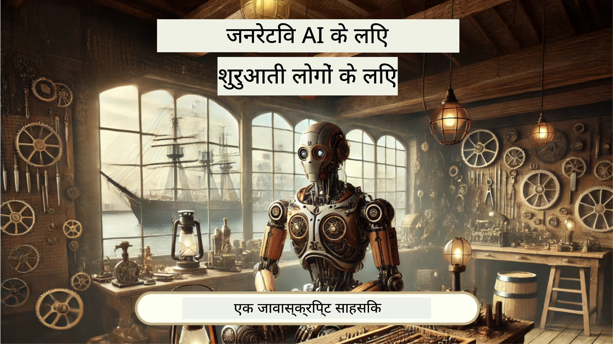
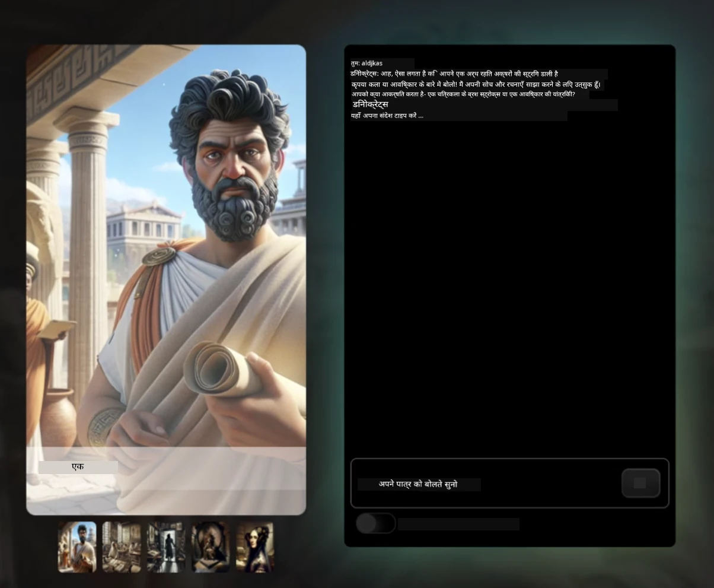
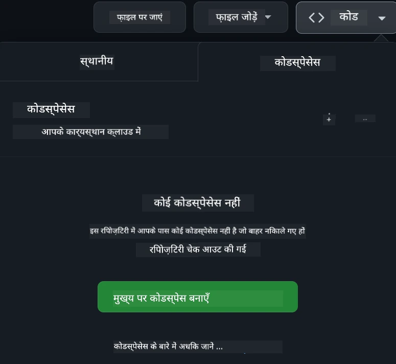

# वेब विकास शुरुआती लोगों के लिए - एक पाठ्यक्रम

माइक्रोसॉफ्ट क्लाउड अधिवक्ताओं द्वारा हमारे 12-सप्ताह के व्यापक पाठ्यक्रम के साथ वेब विकास के मूल सिद्धांत सीखें। 24 पाठों में से प्रत्येक जावास्क्रिप्ट, CSS, और HTML को हाथ से किए जाने वाले प्रोजेक्ट्स जैसे टेरारियम, ब्राउज़र एक्सटेंशन्स, और स्पेस गेम्स के माध्यम से गहराई से समझाता है। क्विज़, चर्चाओं और व्यावहारिक असाइनमेंट्स में भाग लें। हमारे प्रभावी प्रोजेक्ट-आधारित पद्धति के साथ अपनी क्षमताओं को बढ़ाएं और अपने ज्ञान को अधिकतम करें। आज ही अपनी कोडिंग यात्रा शुरू करें!

Azure AI Foundry Discord से जुड़ें और विशेषज्ञों और साथी डेवलपर्स से मिलें।

[](https://discord.gg/nTYy5BXMWG)

इन संसाधनों का उपयोग शुरू करने के लिए ये चरण अपनाएँ:
1. **रिपॉजिटरी का फोर्क करें**: क्लिक करें [](https://GitHub.com/microsoft/Web-Dev-For-Beginners/fork)
2. **रिपॉजिटरी क्लोन करें**:   `git clone https://github.com/microsoft/Web-Dev-For-Beginners.git`
3. [**Azure AI Foundry Discord से जुड़ें और विशेषज्ञों तथा साथी डेवलपर्स से मिलें**](https://discord.com/invite/ByRwuEEgH4)

### 🌐 बहुभाषी समर्थन

#### GitHub एक्शन द्वारा समर्थन किया गया (स्वचालित एवं हमेशा अद्यतन)

<!-- CO-OP TRANSLATOR LANGUAGES TABLE START -->
[Arabic](../ar/README.md) | [Bengali](../bn/README.md) | [Bulgarian](../bg/README.md) | [Burmese (Myanmar)](../my/README.md) | [Chinese (Simplified)](../zh-CN/README.md) | [Chinese (Traditional, Hong Kong)](../zh-HK/README.md) | [Chinese (Traditional, Macau)](../zh-MO/README.md) | [Chinese (Traditional, Taiwan)](../zh-TW/README.md) | [Croatian](../hr/README.md) | [Czech](../cs/README.md) | [Danish](../da/README.md) | [Dutch](../nl/README.md) | [Estonian](../et/README.md) | [Finnish](../fi/README.md) | [French](../fr/README.md) | [German](../de/README.md) | [Greek](../el/README.md) | [Hebrew](../he/README.md) | [Hindi](./README.md) | [Hungarian](../hu/README.md) | [Indonesian](../id/README.md) | [Italian](../it/README.md) | [Japanese](../ja/README.md) | [Kannada](../kn/README.md) | [Khmer](../km/README.md) | [Korean](../ko/README.md) | [Lithuanian](../lt/README.md) | [Malay](../ms/README.md) | [Malayalam](../ml/README.md) | [Marathi](../mr/README.md) | [Nepali](../ne/README.md) | [Nigerian Pidgin](../pcm/README.md) | [Norwegian](../no/README.md) | [Persian (Farsi)](../fa/README.md) | [Polish](../pl/README.md) | [Portuguese (Brazil)](../pt-BR/README.md) | [Portuguese (Portugal)](../pt-PT/README.md) | [Punjabi (Gurmukhi)](../pa/README.md) | [Romanian](../ro/README.md) | [Russian](../ru/README.md) | [Serbian (Cyrillic)](../sr/README.md) | [Slovak](../sk/README.md) | [Slovenian](../sl/README.md) | [Spanish](../es/README.md) | [Swahili](../sw/README.md) | [Swedish](../sv/README.md) | [Tagalog (Filipino)](../tl/README.md) | [Tamil](../ta/README.md) | [Telugu](../te/README.md) | [Thai](../th/README.md) | [Turkish](../tr/README.md) | [Ukrainian](../uk/README.md) | [Urdu](../ur/README.md) | [Vietnamese](../vi/README.md)

> **स्थानीय क्लोन करना पसंद करते हैं?**
>
> इस रिपॉजिटरी में 50+ भाषा अनुवाद शामिल हैं जो डाउनलोड साइज को काफी बढ़ा देते हैं। अनुवाद के बिना क्लोन करने के लिए sparse checkout का उपयोग करें:
>
> **Bash / macOS / Linux:**
> ```bash
> git clone --filter=blob:none --sparse https://github.com/microsoft/Web-Dev-For-Beginners.git
> cd Web-Dev-For-Beginners
> git sparse-checkout set --no-cone '/*' '!translations' '!translated_images'
> ```
>
> **CMD (Windows):**
> ```cmd
> git clone --filter=blob:none --sparse https://github.com/microsoft/Web-Dev-For-Beginners.git
> cd Web-Dev-For-Beginners
> git sparse-checkout set --no-cone "/*" "!translations" "!translated_images"
> ```
>
> यह आपको तेज़ डाउनलोड के साथ पूरा पाठ्यक्रम पूरा करने के लिए सब कुछ प्रदान करता है।
<!-- CO-OP TRANSLATOR LANGUAGES TABLE END -->

**यदि आप अतिरिक्त अनुवाद चाहते हैं, तो समर्थित भाषाएँ यहां सूचीबद्ध हैं। [यहाँ](https://github.com/Azure/co-op-translator/blob/main/getting_started/supported-languages.md)**

[](https://open.vscode.dev/microsoft/Web-Dev-For-Beginners)

#### 🧑‍🎓 _क्या आप छात्र हैं?_

[**Student Hub पेज**](https://docs.microsoft.com/learn/student-hub/?WT.mc_id=academic-77807-sagibbon) पर जाएं जहां आपको शुरुआती संसाधन, छात्र पैक और मुफ्त प्रमाणपत्र वाउचर प्राप्त करने के तरीके मिलेंगे। यह वह पेज है जिसे आपको बुकमार्क करना चाहिए और नियमित रूप से जांचना चाहिए क्योंकि हम मासिक आधार पर सामग्री को अपडेट करते हैं।

### 📣 घोषणा - नए GitHub Copilot एजेंट मोड चुनौतियाँ पूरी करें!

नया चैलेंज जोड़ा गया है, अधिकांश अध्यायों में "GitHub Copilot Agent Challenge 🚀" देखें। यह आपके लिए GitHub Copilot और एजेंट मोड का उपयोग करके पूरी करने के लिए एक नया चैलेंज है। यदि आपने पहले एजेंट मोड का उपयोग नहीं किया है तो यह न केवल टेक्स्ट जनरेट कर सकता है बल्कि फाइलें बना और संपादित कर सकता है, कमांड चला सकता है और भी बहुत कुछ।

### 📣 घोषणा - _जनरेटिव AI का उपयोग करके नया प्रोजेक्ट बनाएं_

नया AI असिस्टेंट प्रोजेक्ट अभी जोड़ा गया है, इसे देखें [project](./9-chat-project/README.md)

### 📣 घोषणा - _जनरेटिव AI पर नया पाठ्यक्रम_ जावास्क्रिप्ट के लिए जारी हुआ

हमारा नया जनरेटिव AI पाठ्यक्रम मत चूकिये!

शुरू करने के लिए यहां जाएं: [https://aka.ms/genai-js-course](https://aka.ms/genai-js-course)



- आधार से लेकर RAG तक सब कुछ कवर करने वाले पाठ।
- GenAI और हमारे अभियान ऐप का उपयोग करके ऐतिहासिक पात्रों के साथ बातचीत करें।
- मजेदार और आकर्षक कहानी, आप समय यात्रा पर होंगे!



प्रत्येक पाठ में पूरा करने के लिए एक असाइनमेंट, एक ज्ञान परीक्षा और एक चैलेंज शामिल है जो आपको निम्नलिखित विषयों से परिचित कराएगा:
- प्रॉम्प्टिंग और प्रॉम्प्ट इंजीनियरिंग
- टेक्स्ट और इमेज ऐप निर्माण
- खोज ऐप्स

शुरू करने के लिए यहां जाएं: [https://aka.ms/genai-js-course](https://aka.ms/genai-js-course)


## 🌱 शुरूआत करना

> **शिक्षकगण**, हमने [कुछ सुझाव शामिल किए हैं](for-teachers.md) कि इस पाठ्यक्रम का उपयोग कैसे करें। हम आपकी प्रतिक्रिया चाहते हैं [हमारे चर्चा मंच में](https://github.com/microsoft/Web-Dev-For-Beginners/discussions/categories/teacher-corner)!

**[शिक्षार्थी](https://aka.ms/student-page/?WT.mc_id=academic-77807-sagibbon)**, हर पाठ के लिए, पहले प्री-लेक्चर क्विज़ से शुरू करें और फिर व्याख्यान सामग्री पढ़ें, विभिन्न गतिविधियाँ पूरी करें और अपनी समझ जांचने के लिए पोस्ट-लेक्चर क्विज़ करें।

अपनी सीखने की प्रक्रिया को बेहतर बनाने के लिए, अपने साथियों के साथ मिलकर परियोजनाओं पर काम करें! चर्चाओं का स्वागत है हमारे [चर्चा मंच](https://github.com/microsoft/Web-Dev-For-Beginners/discussions) में जहां हमारे मॉडरेटर्स आपकी प्रश्नों का उत्तर देने के लिए उपलब्ध होंगे।

अपनी शिक्षा को और आगे बढ़ाने के लिए, हम अत्यधिक अनुशंसा करते हैं कि आप अतिरिक्त अध्ययन सामग्री के लिए [Microsoft Learn](https://learn.microsoft.com/users/wirelesslife/collections/p1ddcy5jwy0jkm?WT.mc_id=academic-77807-sagibbon) का अन्वेषण करें।

### 📋 अपना पर्यावरण सेटअप करना

इस पाठ्यक्रम के लिए एक विकास पर्यावरण तैयार है! जैसे ही आप शुरू करते हैं, आप पाठ्यक्रम को [Codespace](https://github.com/features/codespaces/) (_एक ब्राउज़र-आधारित, बिना इंस्टॉल के पर्यावरण_) में या स्थानीय रूप से अपने कंप्यूटर पर [Visual Studio Code](https://code.visualstudio.com/?WT.mc_id=academic-77807-sagibbon) जैसे टेक्स्ट एडिटर का उपयोग करके चला सकते हैं।

#### अपनी रिपॉजिटरी बनाएं
अपना काम आसानी से सहेजने के लिए, यह अनुशंसित है कि आप इस रिपॉजिटरी की अपनी प्रति बनाएं। आप ऐसा पेज के शीर्ष पर **Use this template** बटन पर क्लिक करके कर सकते हैं। यह आपके GitHub खाते में पाठ्यक्रम की एक प्रति के साथ एक नई रिपॉजिटरी बनाएगा।

इन चरणों का पालन करें:
1. **रिपॉजिटरी का फोर्क करें**: इस पेज के ऊपर-दाएँ कोने में "Fork" बटन पर क्लिक करें।
2. **रिपॉजिटरी क्लोन करें**:   `git clone https://github.com/microsoft/Web-Dev-For-Beginners.git`

#### Codespace में पाठ्यक्रम चलाना

अपनी बनाई गई इस रिपॉजिटरी की प्रति में, **Code** बटन पर क्लिक करें और **Open with Codespaces** चुनें। यह आपके लिए एक नया Codespace बनाएगा जिसमें आप काम कर सकते हैं।



#### अपने कंप्यूटर पर स्थानीय रूप से पाठ्यक्रम चलाना

अपने कंप्यूटर पर स्थानीय रूप से इस पाठ्यक्रम को चलाने के लिए, आपको एक टेक्स्ट एडिटर, एक ब्राउज़र और एक कमांड लाइन टूल की आवश्यकता होगी। हमारा पहला पाठ, [Introduction to Programming Languages and Tools of the Trade](../../1-getting-started-lessons/1-intro-to-programming-languages), आपको प्रत्येक उपकरण के विकल्पों के बारे में मार्गदर्शन करेगा ताकि आप अपने लिए सबसे उपयुक्त चयन कर सकें।

हमारी सिफारिश है कि आप अपने एडिटर के रूप में [Visual Studio Code](https://code.visualstudio.com/?WT.mc_id=academic-77807-sagibbon) का उपयोग करें, जिसमें एक अंतर्निहित [Terminal](https://code.visualstudio.com/docs/terminal/basics/?WT.mc_id=academic-77807-sagibbon) भी होता है। आप Visual Studio Code को [यहां](https://code.visualstudio.com/?WT.mc_id=academic-77807-sagibbon) से डाउनलोड कर सकते हैं।
1. अपने रिपॉज़िटरी को अपने कंप्यूटर पर क्लोन करें। आप यह **Code** बटन पर क्लिक करके और URL कॉपी करके कर सकते हैं:

    [CodeSpace](./images/createcodespace.png)

    फिर, [Visual Studio Code](https://code.visualstudio.com/?WT.mc_id=academic-77807-sagibbon) के अंदर [Terminal](https://code.visualstudio.com/docs/terminal/basics/?WT.mc_id=academic-77807-sagibbon) खोलें और निम्न कमांड चलाएँ, `<your-repository-url>` को उस URL से बदलते हुए जो आपने अभी कॉपी किया है:

    ```bash 
    git clone <your-repository-url>
    ```

2. Visual Studio Code में फ़ोल्डर खोलें। आप यह **File** > **Open Folder** पर क्लिक करके और उस फ़ोल्डर का चयन करके कर सकते हैं जिसे आपने अभी क्लोन किया है।

>  अनुशंसित Visual Studio Code एक्सटेंशन्स:
>
> * [Live Server](https://marketplace.visualstudio.com/items?itemName=ritwickdey.LiveServer&WT.mc_id=academic-77807-sagibbon) - Visual Studio Code के अंदर HTML पेज का पूर्वावलोकन करने के लिए
> * [Copilot](https://marketplace.visualstudio.com/items?itemName=GitHub.copilot&WT.mc_id=academic-77807-sagibbon) - कोड लिखने में तेज़ी से मदद के लिए

## 📂 प्रत्येक पाठ में शामिल हैं:

- वैकल्पिक स्केचनोट
- वैकल्पिक पूरक वीडियो
- पूर्व-पाठ वार्मअप क्विज़
- लिखित पाठ
- प्रोजेक्ट-आधारित पाठों के लिए, परियोजना बनाने के चरण-दर-चरण मार्गदर्शिका
- ज्ञान जांच
- एक चुनौती
- पूरक पठन
- असाइनमेंट
- [पोस्ट-पाठ क्विज़](https://ff-quizzes.netlify.app/web/)

> **क्विज़ के बारे में एक नोट**: सभी क्विज़ क्विज़-ऐप फ़ोल्डर में संग्रहित हैं, प्रत्येक में तीन प्रश्नों के साथ कुल 48 क्विज़ हैं। ये [यहाँ](https://ff-quizzes.netlify.app/web/) उपलब्ध हैं। क्विज़ ऐप को स्थानीय रूप से या Azure पर चलाया जा सकता है; `quiz-app` फ़ोल्डर में निर्देशों का पालन करें।

## 🗃️ पाठ

|     |                       परियोजना का नाम                       |                            सिखाए गए अवधारणाएँ                             | सीखने के उद्देश्य                                                                                                                 |                                                         लिंक्ड पाठ                                                          |         लेखक          |
| :-: | :------------------------------------------------------: | :--------------------------------------------------------------------: | ----------------------------------------------------------------------------------------------------------------------------------- | :----------------------------------------------------------------------------------------------------------------------------: | :---------------------: |
| 01  |                     शुरुआत                              |           प्रोग्रामिंग का परिचय और उपकरणों का परिचय           | अधिकांश प्रोग्रामिंग भाषाओं के मूल तत्वों को सीखें और उन सॉफ़्टवेयर के बारे में जानें जो पेशेवर डेवलपर्स को अपना काम करने में मदद करते हैं | [प्रोग्रामिंग भाषाओं और उपकरणों का परिचय](./1-getting-started-lessons/1-intro-to-programming-languages/README.md) |         Jasmine         |
| 02  |                     शुरुआत                              |             GitHub के मूल बातें, एक टीम के साथ काम करना             | अपने प्रोजेक्ट में GitHub का उपयोग कैसे करें, कोड बेस पर दूसरों के साथ सहयोग कैसे करें                                                    |                            [GitHub का परिचय](./1-getting-started-lessons/2-github-basics/README.md)                             |          Floor          |
| 03  |                     शुरुआत                              |                             पहुंचीयता                              | वेब पहुँच की बुनियादी बातें सीखें                                                                                               |                       [पहुंचीयता के मूलभूत सिद्धांत](./1-getting-started-lessons/3-accessibility/README.md)                       |       Christopher       |
| 04  |                        JS मूल बातें                         |                         JavaScript डेटा प्रकार                          | JavaScript डेटा प्रकारों के मूल बातें                                                                                                 |                                       [डेटा प्रकार](./2-js-basics/1-data-types/README.md)                                        |         Jasmine         |
| 05  |                        JS मूल बातें                         |                         फ़ंक्शन और मेथड                          | एप्लिकेशन के लॉजिक फ्लो को प्रबंधित करने के लिए फ़ंक्शन और मेथड के बारे में सीखें                                                             |                              [फ़ंक्शन और मेथड](./2-js-basics/2-functions-methods/README.md)                               | Jasmine and Christopher |
| 06  |                        JS मूल बातें                         |                        JS के साथ निर्णय लेना                        | निर्णय लेने की विधियों का उपयोग करके अपने कोड में शर्तें कैसे बनाएं सीखें                                                           |                                 [निर्णय लेना](./2-js-basics/3-making-decisions/README.md)                                  |         Jasmine         |
| 07  |                        JS मूल बातें                         |                            Arrays और Loops                            | JavaScript में डेटा के साथ काम करने के लिए arrays और loops का उपयोग करें                                                                                 |                                   [Arrays और Loops](./2-js-basics/4-arrays-loops/README.md)                                    |         Jasmine         |
| 08  |       [Terrarium](./3-terrarium/solution/README.md)       |                            HTML प्रैक्टिस में                            | एक ऑनलाइन टेरीरियम बनाने के लिए HTML बनाएं, मुख्य रूप से लेआउट बनाने पर केंद्रित                                                         |                                 [HTML का परिचय](./3-terrarium/1-intro-to-html/README.md)                                 |           Jen           |
| 09  |       [Terrarium](./3-terrarium/solution/README.md)       |                            CSS प्रैक्टिस में                             | ऑनलाइन टेरीरियम को स्टाइल करने के लिए CSS बनाएं, CSS के मूलभूत सिद्धांतों सहित पेज को उत्तरदायी बनाना                     |                                  [CSS का परिचय](./3-terrarium/2-intro-to-css/README.md)                                  |           Jen           |
| 10  |            [Terrarium](./3-terrarium/solution/README.md)            |                 JavaScript Closures, DOM मैनेजमेंट                  | टेरीरियम को ड्रैग/ड्रॉप इंटरफेस के रूप में कार्य करने के लिए JavaScript बनाएं, closures और DOM मैनेजमेंट पर ध्यान केंद्रित             |                  [JavaScript Closures, DOM मैनेजमेंट](./3-terrarium/3-intro-to-DOM-and-closures/README.md)                   |           Jen           |
| 11  |          [Typing Game](./4-typing-game/solution/README.md)          |                          टाइपिंग गेम बनाएं                           | अपने JavaScript ऐप के लॉजिक को चलाने के लिए कीबोर्ड इवेंट का उपयोग कैसे करें सीखें                                                          |                                [इवेंट-ड्रिवन प्रोग्रामिंग](./4-typing-game/typing-game/README.md)                                |       Christopher       |
| 12  | [Green Browser Extension](./5-browser-extension/solution/README.md) |                         ब्राउज़रों के साथ काम करना                          | ब्राउज़र कैसे काम करते हैं, उनका इतिहास, और ब्राउज़र एक्सटेंशन के पहले तत्व बनाए जाने के बारे में सीखें                               |                               [ब्राउज़रों के बारे में](./5-browser-extension/1-about-browsers/README.md)                                |           Jen           |
| 13  | [Green Browser Extension](./5-browser-extension/solution/README.md) | फॉर्म बनाना, API कॉल करना और लोकल स्टोरेज में वेरिएबल्स स्टोर करना | API को कॉल करने के लिए ब्राउज़र एक्सटेंशन के JavaScript तत्व बनाएं, जो लोकल स्टोरेज में संग्रहित वेरिएबल्स का उपयोग करते हैं                      |                [APIs, Forms, and Local Storage](./5-browser-extension/2-forms-browsers-local-storage/README.md)                 |           Jen           |
| 14  | [Green Browser Extension](./5-browser-extension/solution/README.md) |          ब्राउज़र में बैकग्राउंड प्रोसेस, वेब प्रदर्शन          | एक्सटेंशन के आइकन को प्रबंधित करने के लिए ब्राउज़र के बैकग्राउंड प्रोसेस का उपयोग करें; वेब प्रदर्शन और प्रदर्शन बेहतर बनाने के कुछ ऑप्टिमाइज़ेशन सीखें   |             [बैकग्राउंड टास्क और प्रदर्शन](./5-browser-extension/3-background-tasks-and-performance/README.md)              |           Jen           |
| 15  |           [Space Game](./6-space-game/solution/README.md)           |             JavaScript के साथ और अधिक उन्नत गेम डेवलपमेंट             | कक्षाओं और संयोजन दोनों का उपयोग करके वंशानुक्रम और Pub/Sub पैटर्न के बारे में जानें, गेम बनाने की तैयारी के लिए              |                      [उन्नत गेम डेवलपमेंट का परिचय](./6-space-game/1-introduction/README.md)                       |          Chris          |
| 16  |           [Space Game](./6-space-game/solution/README.md)           |                           कैनवास पर ड्राइंग                            | स्क्रीन पर तत्वों को ड्रॉ करने के लिए उपयोग किए जाने वाले Canvas API के बारे में जानें                                                                       |                                [कैनवास पर ड्राइंग](./6-space-game/2-drawing-to-canvas/README.md)                                |          Chris          |
| 17  |           [Space Game](./6-space-game/solution/README.md)           |                   स्क्रीन पर तत्वों को घूमाना                    | तर्कसंगत निर्देशांकों और Canvas API का उपयोग करके तत्वों को गति प्राप्त करने के तरीके खोजें                                            |                           [तत्वों को घुमाना](./6-space-game/3-moving-elements-around/README.md)                           |          Chris          |
| 18  |           [Space Game](./6-space-game/solution/README.md)           |                          टकराव का पता लगाना                           | तत्वों को टकराने और एक-दूसरे के साथ प्रतिक्रिया करने दें, कीप्रेस का उपयोग करें और गेम के प्रदर्शन सुनिश्चित करने के लिए कूलडाउन फ़ंक्शन प्रदान करें    |                              [टकराव पहचान](./6-space-game/4-collision-detection/README.md)                              |          Chris          |
| 19  |           [Space Game](./6-space-game/solution/README.md)           |                             स्कोर रखना                              | गेम की स्थिति और प्रदर्शन के आधार पर गणितीय गणना करें                                                                |                                    [स्कोर रखना](./6-space-game/5-keeping-score/README.md)                                    |          Chris          |
| 20  |           [Space Game](./6-space-game/solution/README.md)           |                     गेम खत्म करना और पुनः आरंभ करना                     | गेम को खत्म और पुनः आरंभ करने के बारे में जानें, जिसमें संसाधनों को साफ़ करना और वेरिएबल मानों को रीसेट करना शामिल है                              |                                [समाप्ति शर्त](./6-space-game/6-end-condition/README.md)                                 |          Chris          |
| 21  |         [Banking App](./7-bank-project/solution/README.md)          |                 वेब ऐप में HTML टेम्पलेट्स और रूट्स                 | रूटिंग और HTML टेम्पलेट्स का उपयोग करके मल्टीपेज वेबसाइट के ढाँचे को बनाना सीखें                             |                            [HTML टेम्पलेट्स और रूट्स](./7-bank-project/1-template-route/README.md)                             |          Yohan          |
| 22  |         [Banking App](./7-bank-project/solution/README.md)          |                  लॉगिन और रजिस्ट्रेशन फ़ॉर्म बनाएं                   | फ़ॉर्म बनाने और वैलिडेशन रुटीन को नियंत्रित करने के बारे में जानें                                                                          |                                           [फ़ॉर्म](./7-bank-project/2-forms/README.md)                                           |          Yohan          |
| 23  |         [Banking App](./7-bank-project/solution/README.md)          |                   डेटा प्राप्त करने और उपयोग करने के तरीके                   | आपके ऐप में डेटा कैसे आता और जाता है, इसे कैसे प्राप्त करें, स्टोर करें और समाप्त करें                                                 |                                            [डेटा](./7-bank-project/3-data/README.md)                                            |          Yohan          |
| 24  |         [Banking App](./7-bank-project/solution/README.md)          |                      राज्य प्रबंधन के अवधारणाएँ                      | जानें कि आपका ऐप राज्य को कैसे बनाए रखता है और इसे प्रोग्रामेटिक रूप से कैसे प्रबंधित करें                                                              |                                [राज्य प्रबंधन](./7-bank-project/4-state-management/README.md)                                |          Yohan          |
| 25 | [Browser/VScode Code](../../8-code-editor) | VScode के साथ काम करना | सीखें कि कोड संपादक का उपयोग कैसे करें| [VScode कोड संपादक का उपयोग](./8-code-editor/1-using-a-code-editor/README.md) | Chris |
| 26 | [AI Assistants](./9-chat-project/README.md) | AI के साथ काम करना | अपना खुद का AI सहायक कैसे बनाएं सीखें | [AI सहायक परियोजना](./9-chat-project/README.md) | Chris |

## 🏫 शिक्षाशास्त्र

हमारे पाठ्यक्रम को दो मुख्य शिक्षाशास्त्रीय सिद्धांतों के साथ डिज़ाइन किया गया है:
* परियोजना-आधारित शिक्षा
* बार-बार क्विज़

यह प्रोग्राम JavaScript, HTML, और CSS के बुनियादी सिद्धांतों को सिखाता है, साथ ही आज के वेब डेवलपर्स द्वारा उपयोग किए जाने वाले नवीनतम उपकरणों और तकनीकों को भी। छात्र टाइपिंग गेम, वर्चुअल टेरीरियम, पर्यावरण-अनुकूल ब्राउज़र एक्सटेंशन, स्पेस-इनवेडर-शैली गेम, और व्यावसायिक बैंकिंग ऐप बनाकर व्यावहारिक अनुभव विकसित करने का अवसर पाएंगे। श्रृंखला के अंत तक, छात्रों को वेब विकास की ठोस समझ होगी।

> 🎓 आप Microsoft Learn पर इस पाठ्यक्रम के पहले कुछ पाठों को एक [सीखने के पथ](https://docs.microsoft.com/learn/paths/web-development-101/?WT.mc_id=academic-77807-sagibbon) के रूप में ले सकते हैं!

सुनिश्चित करके कि सामग्री परियोजनाओं के अनुरूप है, प्रक्रिया छात्रों के लिए अधिक रोचक बनती है और अवधारणाओं की अवधारण क्षमता बढ़ती है। हमने JavaScript मूल बातों में कई प्रारंभिक पाठ भी लिखे हैं ताकि अवधारणाएँ परिचित कराई जा सकें, जो "[Beginners Series to: JavaScript](https://channel9.msdn.com/Series/Beginners-Series-to-JavaScript/?WT.mc_id=academic-77807-sagibbon)" वीडियो ट्यूटोरियल संग्रह से एक वीडियो के साथ संयोजित हैं, जिनमें से कुछ लेखकों ने इस पाठ्यक्रम में योगदान दिया है।

इसके अलावा, कक्षा से पहले एक कम जोखिम वाला क्विज़ छात्र की एक विषय सीखने की मनोदृष्टि तय करता है, जबकि कक्षा के बाद दूसरा क्विज़ और भी बेहतर अवधारण सुनिश्चित करता है। यह पाठ्यक्रम लचीला और मज़ेदार है और इसे पूरी तरह या आंशिक रूप से लिया जा सकता है। परियोजनाएं छोटी शुरू होती हैं और 12-सप्ताह के चक्र के अंत में अधिक जटिल होती जाती हैं।

जबकि हमने एक फ़्रेमवर्क अपनाने से पहले वेब डेवलपर के रूप में आवश्यक बुनियादी कौशलों पर ध्यान केंद्रित करने के लिए जानबूझकर JavaScript फ्रेमवर्क पेश करने से बचा है, इस पाठ्यक्रम को पूरा करने का एक अच्छा अगला कदम Node.js के बारे में सीखना होगा, जो एक अन्य वीडियो संग्रह से होता है: "[Beginner Series to: Node.js](https://channel9.msdn.com/Series/Beginners-Series-to-Nodejs/?WT.mc_id=academic-77807-sagibbon)".

> हमारे [Code of Conduct](CODE_OF_CONDUCT.md) और [Contributing](CONTRIBUTING.md) दिशानिर्देश देखें। हम आपकी रचनात्मक प्रतिक्रिया का स्वागत करते हैं!

## 🧭 ऑफलाइन पहुंच

आप [Docsify](https://docsify.js.org/#/) का उपयोग करके इस दस्तावेज़ को ऑफ़लाइन चला सकते हैं। इस रिपॉज़िटरी को फोर्क करें, अपनी स्थानीय मशीन पर [Docsify इंस्टॉल करें](https://docsify.js.org/#/quickstart), फिर इस रिपॉज़िटरी की रूट फ़ोल्डर में `docsify serve` टाइप करें। वेबसाइट आपके लोकलहोस्ट पर पोर्ट 3000 पर सर्व की जाएगी: `localhost:3000`।

## 📘 PDF
सभी पाठों का एक PDF [यहाँ](https://microsoft.github.io/Web-Dev-For-Beginners/pdf/readme.pdf) पाया जा सकता है।


## 🎒 अन्य पाठ्यक्रम

हमारी टीम अन्य पाठ्यक्रम भी बनाती है! देखें:

<!-- CO-OP TRANSLATOR OTHER COURSES START -->
### LangChain
[](https://aka.ms/langchain4j-for-beginners)
[](https://aka.ms/langchainjs-for-beginners?WT.mc_id=m365-94501-dwahlin)
[](https://github.com/microsoft/langchain-for-beginners?WT.mc_id=m365-94501-dwahlin)
---

### Azure / Edge / MCP / एजेंट्स
[](https://github.com/microsoft/AZD-for-beginners?WT.mc_id=academic-105485-koreyst)
[](https://github.com/microsoft/edgeai-for-beginners?WT.mc_id=academic-105485-koreyst)
[](https://github.com/microsoft/mcp-for-beginners?WT.mc_id=academic-105485-koreyst)
[](https://github.com/microsoft/ai-agents-for-beginners?WT.mc_id=academic-105485-koreyst)

---
 
### जनरेटिव एआई श्रृंखला
[](https://github.com/microsoft/generative-ai-for-beginners?WT.mc_id=academic-105485-koreyst)
[-9333EA?style=for-the-badge&labelColor=E5E7EB&color=9333EA)](https://github.com/microsoft/Generative-AI-for-beginners-dotnet?WT.mc_id=academic-105485-koreyst)
[-C084FC?style=for-the-badge&labelColor=E5E7EB&color=C084FC)](https://github.com/microsoft/generative-ai-for-beginners-java?WT.mc_id=academic-105485-koreyst)
[-E879F9?style=for-the-badge&labelColor=E5E7EB&color=E879F9)](https://github.com/microsoft/generative-ai-with-javascript?WT.mc_id=academic-105485-koreyst)

---
 
### कोर लर्निंग
[](https://aka.ms/ml-beginners?WT.mc_id=academic-105485-koreyst)
[](https://aka.ms/datascience-beginners?WT.mc_id=academic-105485-koreyst)
[](https://aka.ms/ai-beginners?WT.mc_id=academic-105485-koreyst)
[](https://github.com/microsoft/Security-101?WT.mc_id=academic-96948-sayoung)
[](https://aka.ms/webdev-beginners?WT.mc_id=academic-105485-koreyst)
[](https://aka.ms/iot-beginners?WT.mc_id=academic-105485-koreyst)
[](https://github.com/microsoft/xr-development-for-beginners?WT.mc_id=academic-105485-koreyst)

---
 
### कोपायलट श्रृंखला
[](https://aka.ms/GitHubCopilotAI?WT.mc_id=academic-105485-koreyst)
[](https://github.com/microsoft/mastering-github-copilot-for-dotnet-csharp-developers?WT.mc_id=academic-105485-koreyst)
[](https://github.com/microsoft/CopilotAdventures?WT.mc_id=academic-105485-koreyst)
<!-- CO-OP TRANSLATOR OTHER COURSES END -->

## सहायता प्राप्त करना

यदि आप फंस जाते हैं या AI ऐप्स बनाने के बारे में कोई प्रश्न हैं, तो MCP के बारे में चर्चा में सहपाठी शिक्षार्थियों और अनुभवी डेवलपर्स के साथ जुड़ें। यह एक सहायक समुदाय है जहाँ प्रश्न स्वागत योग्य हैं और ज्ञान स्वतंत्र रूप से साझा किया जाता है।

[](https://discord.gg/nTYy5BXMWG)

यदि आपके पास उत्पाद प्रतिक्रिया है या निर्माण के दौरान त्रुटियां हैं तो देखें:

[](https://aka.ms/foundry/forum)

## लाइसेंस

यह रिपॉजिटरी MIT लाइसेंस के तहत लाइसेंस प्राप्त है। अधिक जानकारी के लिए [LICENSE](../../LICENSE) फ़ाइल देखें।

---

<!-- CO-OP TRANSLATOR DISCLAIMER START -->
**अस्वीकरण**:  
यह दस्तावेज़ AI अनुवाद सेवा [Co-op Translator](https://github.com/Azure/co-op-translator) का उपयोग करके अनूदित किया गया है। जबकि हम सटीकता के लिए प्रयासरत हैं, कृपया ध्यान दें कि स्वचालित अनुवादों में त्रुटियाँ या अशुद्धियाँ हो सकती हैं। मूल दस्तावेज़ अपनी मूल भाषा में प्रामाणिक स्रोत माना जाना चाहिए। महत्वपूर्ण जानकारी के लिए, पेशेवर मानव अनुवाद की सिफारिश की जाती है। इस अनुवाद के उपयोग से उत्पन्न किसी भी गलतफहमी या गलत व्याख्या के लिए हम जिम्मेदार नहीं हैं।
<!-- CO-OP TRANSLATOR DISCLAIMER END -->