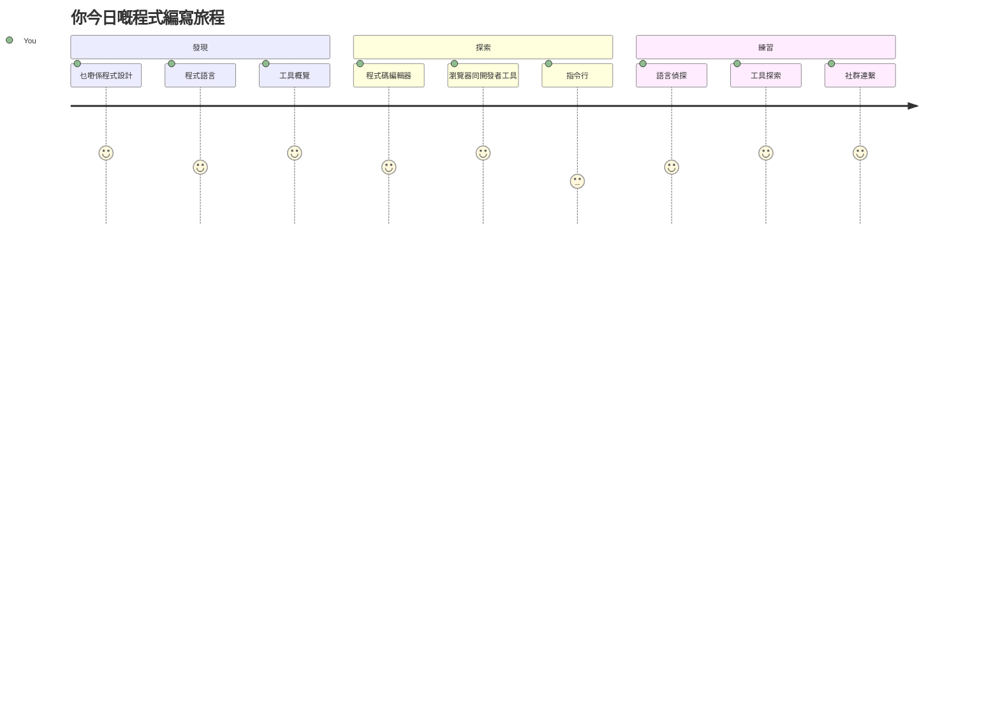
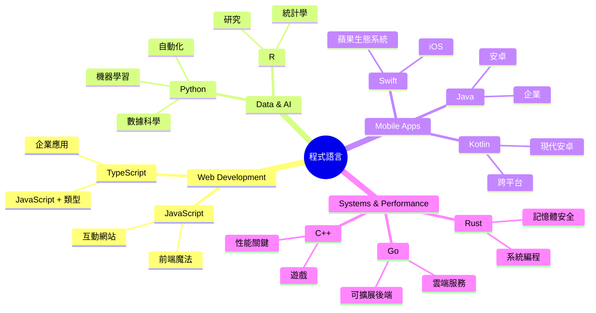
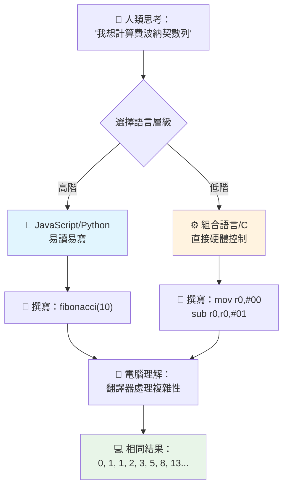
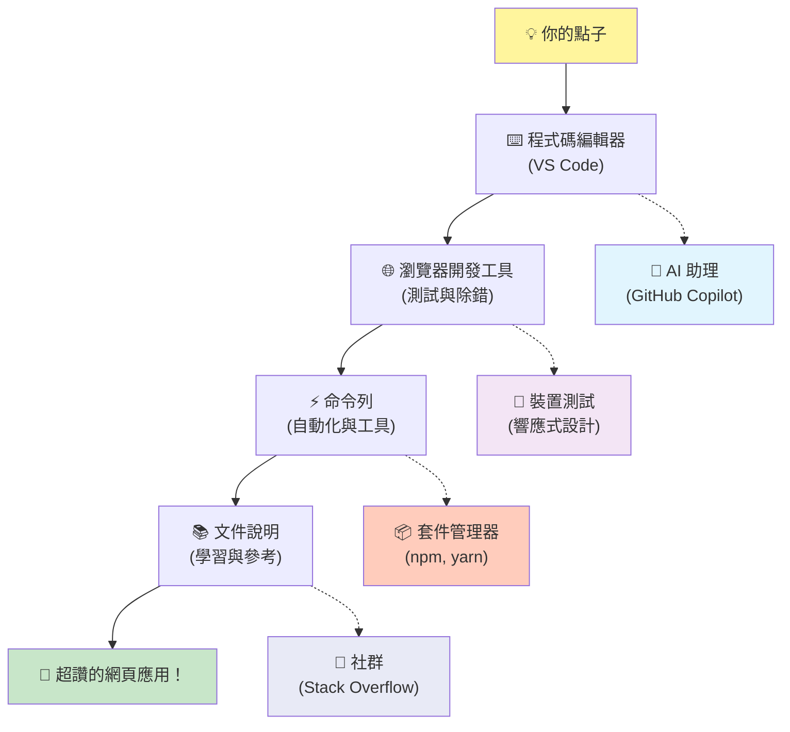
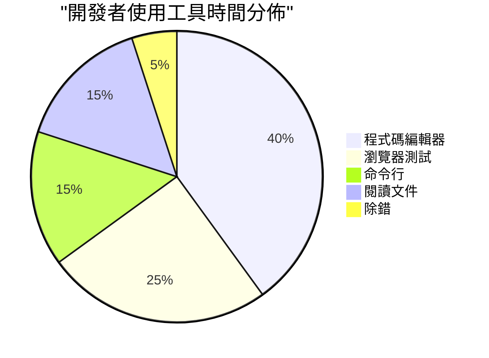
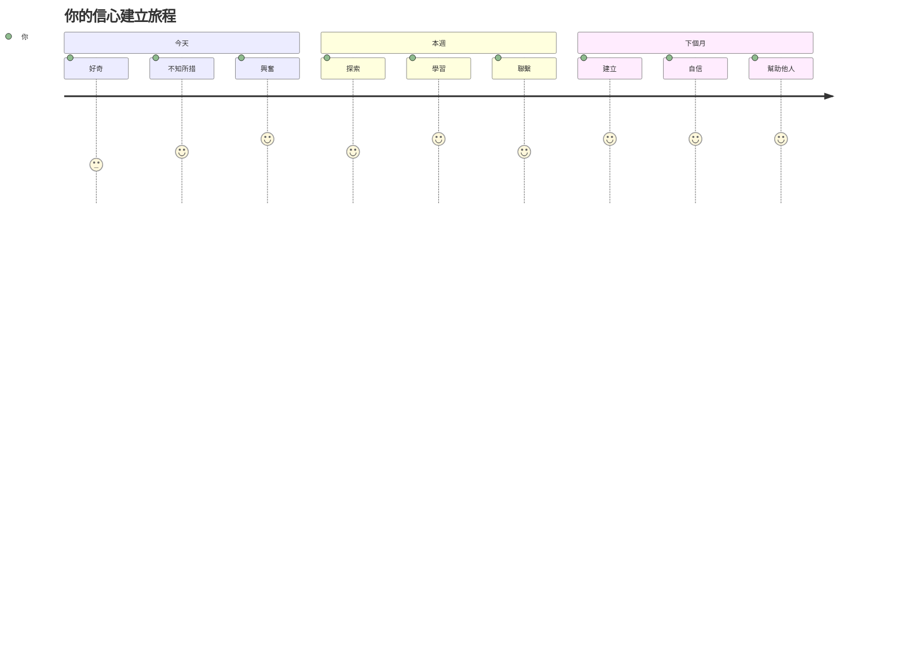

<!--
CO_OP_TRANSLATOR_METADATA:
{
  "original_hash": "d45ddcc54eb9232a76d08328b09d792e",
  "translation_date": "2026-01-06T13:11:27+00:00",
  "source_file": "1-getting-started-lessons/1-intro-to-programming-languages/README.md",
  "language_code": "hk"
}
-->
# 程式語言與現代開發工具簡介

嗨，未來的開發者！👋 可不可以跟你說件每天都讓我雞皮疙瘩掉滿地的事？你即將發現，程式設計不只是關於電腦——它是擁有真正超能力，把你最狂野的想法實現出來的能力！

你知道那種用你最喜歡的 app，所有操作都剛剛好完美連接的瞬間嗎？當你按一個按鈕，然後發生了某種完全神奇的事，讓你忍不住想說「哇，他們到底怎麼做到的？」剛好，某個跟你一樣的人——可能正坐在他最喜歡的咖啡店裡凌晨兩點，喝著第三杯濃縮咖啡——寫了造就那魔法的程式碼。你將親眼見證的令人震驚的事是：到了這節課結束，你不僅會理解他們是怎麼做到的，還會迫不及待想要自己試試看！

聽著，如果你覺得程式設計現在很可怕，我完全可以理解。當我剛開始時，我真的以為你需要是某種數學天才，或者從五歲就開始寫程式。但徹底改變我觀念的是這件事：程式設計就像學一門語言溝通一樣。你從「你好」和「謝謝」學起，然後開始點咖啡，不知不覺你開始進行深刻的哲學討論！只不過在這案例裡，你是在和電腦對話。說真的？它們是你能找到的最有耐性的對話夥伴——它們從不責備你的錯誤，而是永遠準備好再試一次！

今天，我們將探索現代網頁開發令人驚嘆的工具，讓它不僅僅是可行，而是讓人嚴重上癮。我說的就是 Netflix、Spotify 和你喜歡的獨立應用工作室每天使用的同一套編輯器、瀏覽器和工作流程。最棒的是：這些專業級、業界標準的工具大多數都是完全免費的！


> Sketchnote by [Tomomi Imura](https://twitter.com/girlie_mac)


## 讓我們看看你已經知道些什麼！

在跳進有趣的內容前，我很好奇——你對程式設計這個世界已經知道多少？聽著，如果你看到這些問題心想「我根本完全沒概念」，那不只是可以，反而是完美！這表示你正處於正確位置。把這個小測驗想成運動前的暖身——我們只是熱身大腦肌肉！

[做課前測驗](https://forms.office.com/r/dru4TE0U9n?origin=lprLink)


## 我們即將一起展開的冒險

好啦，我真心為我們今天將探討的東西興奮到蹦蹦跳！說真的，我希望能看到當你理解這些概念的那張臉。這就是我們一起踏上的驚奇旅程：

- **什麼是程式設計（以及為什麼它超酷！）** – 我們要了解程式碼如何成為背後無形魔法，驅動你周遭一切，從那個能準時知道是星期一早晨的鬧鐘，到完美推薦你 Netflix 節目的算法
- **程式語言和它們奇妙的個性** – 想像走進一場派對，每個人都有完全不同的超能力和解決問題的方法。這就是程式語言的世界，你會很享受認識它們！
- **數位魔法的基本構件** – 想像這是終極創意樂高組合套件。一旦你了解這些積木怎麼拼組，你會發現你實際上能打造出你想像的任何東西
- **讓你感覺像握到魔法棒的專業工具** – 我不是誇張——這些工具真的會讓你覺得你有超能力，最棒的是？它們是專業人士每天使用的！

> 💡 **重點是**：今天不要想著要全部記住！我現在只想讓你感受到對可能性的那股興奮。細節會隨著我們一起練習自然記住——真正的學習就是這樣發生的！

> 你也可以在 [Microsoft Learn](https://docs.microsoft.com/learn/modules/web-development-101/introduction-programming/?WT.mc_id=academic-77807-sagibbon) 上進行這堂課程！

## 那麼究竟什麼是*程式設計*？

好，來回答百萬美元的問題：程式設計到底是什麼？

我來分享一個徹底改變我思考的故事。上週我試著向媽媽解釋如何使用我們的新智慧電視遙控器。結果我發現自己一直在說「按紅色的按鈕，不是大紅色的，是左邊那個小紅色的…不，是另一個左邊…好，現在按住兩秒，不是一秒，不是三秒…」聽起來很熟悉嗎？😅

這就是程式設計！它是對一個非常強大的東西，給出極度詳細、逐步的指令，而它需要所有步驟都說得非常清楚的藝術。只不過你不是在解釋給媽媽聽（她可以問「哪個紅色按鈕？！」），而是在解釋給電腦——電腦會精確執行你說的每一句話，即便你真正想說的不是這樣。

第一次學到這點時讓我震撼的是：電腦其實本質非常簡單。它們字面上只懂兩個東西——1 和 0，基本上就是「是」和「否」或「開」和「關」。就這樣！但神奇之處在於——我們不必像《駭客任務》裡那樣只說 1 和 0 。這時就是**程式語言**大顯身手的地方。它們就像世界上最棒的翻譯官，把你正常的人類思考完美地轉換成電腦語言。

而每天早上醒來仍讓我起雞皮疙瘩的是：你生活中所有數位東西都是由跟你一樣的人開始的，可能他們穿著睡衣，手裡拿著咖啡，在筆電前敲著程式碼。讓你看起來完美無瑕的 Instagram 濾鏡？有人寫了那程式碼。推推薦你發現新歌的算法？一位開發者設計了它。幫你和朋友分餐費用的 app？沒錯，有人想「這很煩，我一定能解決它」，結果…他們做到了！

學程式不僅是學新技術——你是加入這個超棒的問題解決社群，他們每天的想法是，「如果我能做出些什麼讓別人的生活更好一點點呢？」說真的，還有比這更帥的事嗎？

✅ **趣味知識探索**：有空時去查查世界上第一位程式設計師是誰？提示一下：她可能不是你預期的人！她的故事非常吸引人，而且證明了程式設計一直是關於創意解決問題和跳出框架思考。

### 🧠 **回顧時間：你感覺如何？**

**花點時間反思：**
- 「給電腦下指令」的概念現在對你來說有意義嗎？
- 你能想到想用程式自動化的日常任務嗎？
- 關於程式設計，你腦中冒出什麼問題？

> **記住**：如果某些概念現在還模糊是完全正常的。學程式就像學一門新語言——你的大腦需要時間建立神經通路。你做得很棒！

## 程式語言就像不同口味的魔法

好啦，這聽起來怪怪的，但跟我走——程式語言很像不同類型的音樂。想想看：有浪漫即興的爵士樂、強而有力的搖滾、典雅嚴謹的古典樂和充滿創造力與表達的嘻哈。每種風格都有自己的氛圍、熱情粉絲社群，也適合不同心情和場合。

程式語言也是如此！你不會用同一種語言寫一款有趣的手機遊戲和處理大量氣候數據的程式，就像你不會在瑜伽課播放死亡金屬（嗯，大多數瑜伽課至少是這樣😄）。

每次想起這點，我都覺得超神奇：這些語言就像世界上最有耐性的、最聰明的口譯員坐在你旁邊。你以對你腦子自然的方式表達想法，它們處理把這些轉成電腦真正懂的 1 和 0。就像你有一位朋友同時流利「人類創意」和「電腦邏輯」——而且永不疲倦、不需要喝咖啡休息，也不會因為你問第二次同樣問題而嘲笑你！

### 熱門程式語言與用途


| 語言 | 最適合的用途 | 為什麼受歡迎 |
|----------|----------|------------------|
| **JavaScript** | 網頁開發、使用者介面 | 在瀏覽器執行，驅動互動網站 |
| **Python** | 數據科學、自動化、AI | 易讀易學，擁有強大函式庫 |
| **Java** | 企業應用、Android 應用 | 跨平台，適合大型系統 |
| **C#** | Windows 應用、遊戲開發 | 微軟生態系統強力支援 |
| **Go** | 雲端服務、後端系統 | 快速、簡單，為現代運算設計 |

### 高階語言 vs 低階語言

說實話，這是我剛開始學程式時完全被弄得暈頭轉向的概念，所以我會分享讓我終於理解的比喻——希望也能幫助你！

想像你去到一個陌生國家，你不會說當地語言，而你急著要找廁所（大家都有這經驗吧？😅）：

- **低階程式設計** 就像你學會當地方言，甚至能跟街角賣水果的老奶奶用文化暗號、地方俚語和只有在當地長大的人才懂的笑話聊天。超厲害而且效率超高……但前提是你必須流利！不然光找廁所就快瘋掉。

- **高階程式設計** 就像你有個超棒的當地朋友理解你。你只要用簡單的英文說「我很需要找廁所」，他就會做所有文化轉換，給你用你這個局外人腦袋能懂的指引。

用程式語言來說：
- **低階語言**（像組合語言或 C）讓你能和電腦硬體進行非常細緻的對話，但你必須用機器的思維方式——嗯，可以說是大腦大轉彎！
- **高階語言**（像 JavaScript、Python 或 C#）讓你用人的思考方式，而它們在背後處理所有機器語言的轉換。而且它們還有熱情的社群，有許多曾經是新手的人，真心想幫忙！

你猜我建議從哪開始？😉 高階語言就像有輔助輪，你會捨不得拆掉，因為它讓整個體驗愉快許多！


### 讓我告訴你為什麼高階語言更友善

好，我馬上展示一個絕佳例子，說明我為何愛上高階語言。不過先請你答應我一件事。看到第一個程式碼範例時，別怕！看起來嚇人完全是我的重點！

我們會用兩種完全不同方式寫同樣的任務。兩個都產生所謂的費氏數列——這是一個美麗的數學模式，每個數字都是前兩個數字之和：0、1、1、2、3、5、8、13……（趣味知識：你會在大自然各處找到這個模式——向日葵種子漩渦、松果圖案、甚至星系形成方式！）

準備好看到差異了嗎？出發！

**高階語言（JavaScript）– 對人類友善：**

```javascript
// 第一步：基本斐波那契設置
const fibonacciCount = 10;
let current = 0;
let next = 1;

console.log('Fibonacci sequence:');
```

**這段程式碼做了什麼：**
- **宣告** 一個常數指定要產生多少 Fibonacci 數字
- **初始化** 兩個變數追蹤目前和下一個序列數字
- **設定** 起始值（0 和 1）定義 Fibonacci 模式
- **顯示** 標題訊息辨識輸出

```javascript
// 步驟 2：使用迴圈生成序列
for (let i = 0; i < fibonacciCount; i++) {
  console.log(`Position ${i + 1}: ${current}`);
  
  // 計算序列中的下一個數字
  const sum = current + next;
  current = next;
  next = sum;
}
```

**分解運作過程：**
- **使用** `for` 迴圈走訪序列的每個位置
- **顯示** 每個數字及其位置，使用模板字串格式化
- **計算** 下一個 Fibonacci 數字為現值與次值相加
- **更新** 追蹤變數，以進入下一輪迴圈

```javascript
// 第三步：現代函數式方法
const generateFibonacci = (count) => {
  const sequence = [0, 1];
  
  for (let i = 2; i < count; i++) {
    sequence[i] = sequence[i - 1] + sequence[i - 2];
  }
  
  return sequence;
};

// 使用範例
const fibSequence = generateFibonacci(10);
console.log(fibSequence);
```

**在上面，我們：**
- **創建** 使用現代箭頭函數語法的可重複使用函式
- **建構** 陣列儲存完整序列，而非逐個顯示
- **使用** 陣列索引由前值計算每個新數字
- **回傳** 完整序列以便程序其他部分彈性使用

**低階語言（ARM 組合語言）– 對電腦友善：**

```assembly
 area ascen,code,readonly
 entry
 code32
 adr r0,thumb+1
 bx r0
 code16
thumb
 mov r0,#00
 sub r0,r0,#01
 mov r1,#01
 mov r4,#10
 ldr r2,=0x40000000
back add r0,r1
 str r0,[r2]
 add r2,#04
 mov r3,r0
 mov r0,r1
 mov r1,r3
 sub r4,#01
 cmp r4,#00
 bne back
 end
```

注意 JavaScript 幾乎像英文指令一樣易讀，而組合語言用神秘指令直接控制電腦處理器。兩者完成完全相同的任務，但高階語言對人類來說更容易理解、撰寫和維護。

**你會注意到的主要差異：**
- **可讀性**：JavaScript 使用描述性名稱如 `fibonacciCount`，組合語言用難懂標籤如 `r0`、`r1`
- **註解**：高階語言鼓勵使用解釋性的註解，使程式碼本身成為自我說明
- **結構**：JavaScript 的邏輯流程與人類逐步思考問題的方式相符合
- **維護**：根據不同需求更新 JavaScript 版本是直觀且清晰的

✅ **關於費波那契數列**：這個絕美的數字模式（每個數字是前兩項的和：0、1、1、2、3、5、8……）幾乎在自然界到處可見！你會在向日葵螺旋、松果排列、鳳梨貝殼的弧度，甚至樹枝的生長方式中看到它。數學與程式碼如何幫助我們理解並重現自然用來創造美的模式，實在令人驚嘆！


## 讓魔法發生的基本元素

好了，現在你已經見識過程式語言的實際運作，我們來拆解構成每一段程式碼的基本部分。把這些想成你最愛食譜中的關鍵材料──一旦瞭解每個元素的功能，你就能閱讀並撰寫幾乎任何語言的程式碼！

這有點像學習程式設計的文法。還記得學校時學過名詞、動詞以及如何組成句子嗎？程式語言也有自己的文法，老實說，它比英文文法邏輯多也更寬容！😄

### 陳述句：逐步指令

先從 **陳述句** 開始──它們就像與電腦對話中的單句話。每句陳述告訴電腦要做一件具體的事，就像指示：「這裡左轉」、「紅燈停下」、「停在那個車位」。

我喜歡陳述句的是它們通常很易讀。看看這個：

```javascript
// 執行單一操作的基本語句
const userName = "Alex";                    
console.log("Hello, world!");              
const sum = 5 + 3;                         
```

**這段程式碼做了什麼：**
- **宣告**一個常數變數來存放使用者名稱
- **顯示**歡迎訊息到控制台輸出
- **計算**並儲存一個數學運算結果

```javascript
// 與網頁互動的語句
document.title = "My Awesome Website";      
document.body.style.backgroundColor = "lightblue";
```

**一步一步看發生了什麼：**
- **修改**瀏覽器頁籤上顯示的網頁標題
- **變更**整個頁面內容的背景顏色

### 變數：程式的記憶體系統

說實話，**變數** 是我最喜歡教的概念之一，因為它們就像你每天都會用到的東西！

想像一下你的手機聯絡人列表。你不會記得每個人的電話號碼──而是將「媽媽」、「最好的朋友」或「凌晨兩點還送披薩的店」存起來，讓手機記住實際的號碼。變數就是這樣！它們是有標籤的容器，你的程式可以使用有意義的名稱存取資訊。

更酷的是：變數會隨著程式運行而改變（所以叫「變數」──你懂的吧？）。就像發現更好的披薩店時會更新聯絡資訊一樣，變數能隨著程式得到新資訊或情況改變而更新！

讓我示範這有多簡單又美妙：

```javascript
// 第一步：建立基本變量
const siteName = "Weather Dashboard";        
let currentWeather = "sunny";               
let temperature = 75;                       
let isRaining = false;                      
```

**理解這些概念：**
- **存放**不變的數值到 `const` 變數（比如網站名稱）
- **使用** `let` 定義可變動的數值
- **賦予**不同的資料型態：字串（文字）、數字及布林值（真/假）
- **選擇**描述性的名稱說明變數內容

```javascript
// 第 2 步：使用物件來群組相關資料
const weatherData = {                       
  location: "San Francisco",
  humidity: 65,
  windSpeed: 12
};
```

**上面我們：**
- **建立**一個物件來群組相關的天氣資訊
- **整理**多筆資料放在同一個變數名稱下
- **用**鍵值對清楚標示每筆資訊

```javascript
// 第3步：使用及更新變數
console.log(`${siteName}: Today is ${currentWeather} and ${temperature}°F`);
console.log(`Wind speed: ${weatherData.windSpeed} mph`);

// 更新可變變數
currentWeather = "cloudy";                  
temperature = 68;                          
```

**理解每個部分：**
- **顯示**內容使用帶有 `${}` 語法的模板字串
- **使用**點記法 (`weatherData.windSpeed`) 取物件屬性
- **更新**使用 `let` 宣告的變數以反映變化
- **結合**多個變數創造有意義的訊息

```javascript
// 第4步：使用現代解構賦值以使代碼更清晰
const { location, humidity } = weatherData; 
console.log(`${location} humidity: ${humidity}%`);
```

**你需要知道的：**
- **從物件中解構賦值以擷取特定屬性**
- **創建與物件鍵相同名稱的新變數**
- **簡化程式碼，避免反覆使用點記法**

### 控制流程：教你的程式思考

好了，這就是程式設計讓人驚嘆的地方！**控制流程** 就是教你的程式如何做出智慧決策，就像你每天不假思索地做的一樣。

想像一下：今天早上你可能心裡想「如果下雨，我就帶傘；如果很冷，我會穿外套；如果我遲到了，我會跳過早餐順路買杯咖啡。」你的大腦天然遵循這種如果──那麼的邏輯，天天做好幾十次！

這就是為什麼程式感覺聰明又活潑，而不只是乏味、可預測的腳本。它們真能看情況、評估狀況，並適當回應。就像給你的程式一顆能適應並做決定的大腦！

想看看這個邏輯怎麼精采運作？讓我示範：

```javascript
// 第一步：基本條件邏輯
const userAge = 17;

if (userAge >= 18) {
  console.log("You can vote!");
} else {
  const yearsToWait = 18 - userAge;
  console.log(`You'll be able to vote in ${yearsToWait} year(s).`);
}
```

**這段程式碼做的事：**
- **檢查**使用者是否達到投票年齡要求
- **依條件結果執行**不同程式區塊
- **計算**並顯示距離投票資格還要多久（如果未滿18歲）
- **針對各情況提供**具體有用的回饋

```javascript
// 第 2 步：使用邏輯運算子設置多重條件
const userAge = 17;
const hasPermission = true;

if (userAge >= 18 && hasPermission) {
  console.log("Access granted: You can enter the venue.");
} else if (userAge >= 16) {
  console.log("You need parent permission to enter.");
} else {
  console.log("Sorry, you must be at least 16 years old.");
}
```

**解析這裡發生的事：**
- **用 `&&`（且）運算子結合多個條件**
- **用 `else if` 建立多層條件階層處理多種情況**
- **最後用 `else` 處理所有剩餘可能狀況**
- **為每種情況提供明確可執行的回饋**

```javascript
// 第三步：使用三元運算子寫簡潔的條件判斷
const votingStatus = userAge >= 18 ? "Can vote" : "Cannot vote yet";
console.log(`Status: ${votingStatus}`);
```

**你需要記住：**
- **用三元運算子（`? :`）處理簡單的兩種條件**
- **先寫條件，接著 `?`，然後是條件成立結果，接著是 `:`，最後是不成立結果**
- **當要根據條件賦值時運用此模式**

```javascript
// 第4步：處理多個特定情況
const dayOfWeek = "Tuesday";

switch (dayOfWeek) {
  case "Monday":
  case "Tuesday":
  case "Wednesday":
  case "Thursday":
  case "Friday":
    console.log("It's a weekday - time to work!");
    break;
  case "Saturday":
  case "Sunday":
    console.log("It's the weekend - time to relax!");
    break;
  default:
    console.log("Invalid day of the week");
}
```

**這段程式碼完成的事：**
- **根據變數值匹配多個具體案例**
- **將類似案例（平日與週末）分組**
- **找到匹配時執行對應區塊**
- **包含 `default` 處理意外值**
- **用 `break` 阻止程式繼續執行後續案例**

> 💡 **現實世界類比**：把控制流程想成世界上最有耐心的 GPS 指路員。它可能說「如果主要幹道塞車，改走高速公路。如果高速公路施工，試試風景路線。」程式用完全相同的條件邏輯，智能地回應不同情況，總給使用者最佳體驗。

### 🎯 **概念檢視：基礎元素精通**

**讓我們來看看你基礎掌握得如何：**
- 你能用自己的話解釋變數和陳述句的不同嗎？
- 想一個現實例子，使用 if-then 決策（就像投票範例）
- 程式邏輯中，有什麼令你感到意外的事？

**快速信心提升：**

✅ **接著要探討的是**：我們將一起深入挖掘這些概念，展開一段令人興奮的旅程！現在只要感受未來諸多精彩可能帶來的興奮。隨著練習，特定技巧和方法自然會掌握──我保證這比你想像中還更有趣！

## 開發工具

說真的，這裡是我最興奮到快控制不住自己的一部分！🚀 我們將說說那些令人感覺像握到了數位太空船鑰匙的神奇工具。

你知道廚師手中完美平衡、彷彿化身為手的刀具嗎？或是音樂家那把一碰就奏出美妙音符的吉他？開發者也有我們自己的神奇工具，而下面這些會徹底顛覆你的想像──其中大多完全免費！

我自己坐立難安想跟你分享這些，因為它們徹底改變了我們打造軟體的方式。我們談的是由 AI 助理撰寫程式碼的工具（我不是開玩笑！）、可以從任何有 Wi-Fi 的地方建立整個應用的雲端環境，還有讓你程式宛如 X 光般透視的偵錯工具。

震撼的是：這些不是你用一陣子就會丟掉的「新手工具」，它們就是 Google、Netflix 還有你喜歡的獨立應用工作室活躍開發者此刻用的專業級工具。你會用它們感覺像個專家！


### 程式碼編輯器與整合開發環境：你的新數位好夥伴

談談程式碼編輯器──這可真快成為你最愛聚集的地方！把它想成你的程式碼聖地，你會花最多時間在這裡編寫和優化數位創作。

而且現代編輯器超魔法──它們不只是花俏的文本編輯器。它們就像全天候坐在你旁邊、無比聰明而且支持你寫程式的導師。它們會在你發現錯字之前找到它們，建議改善讓你看起來更厲害，還幫你理解每段程式碼在做什麼，其中一些甚至能預測你下一步打什麼與你的想法！

我還記得第一次發現自動完成功能──感覺彷彿生活在未來。你開始打字，編輯器就跳出來說：「诶，你是不是想用這個，剛好能幫你完成需要的功能？」就像有個心靈感應的程式碼夥伴！

**令這些編輯器不可思議的原因？**

現代程式碼編輯器提供一系列功能，設計來提升你的生產力：

| 功能 | 功能說明 | 為何有用 |
|---------|--------------|--------------|
| **語法高亮** | 為程式碼不同部分著色 | 讓程式碼更易讀與找錯 |
| **自動完成** | 打字時推薦程式碼 | 加快寫程式速度並減少錯字 |
| **除錯工具** | 幫你找到並修正錯誤 | 節省無數除錯時間 |
| **擴充功能** | 新增專業化能力 | 讓你能依技術需求客製編輯器 |
| **AI 助手** | 建議程式碼與解說 | 加速學習與工作效率 |

> 🎥 **影片資源**：想實際看看這些工具的運作？請觀看這部 [Tools of the Trade video](https://youtube.com/watch?v=69WJeXGBdxg) 獲得完整介紹。

#### 推薦給網頁開發者的編輯器

**[Visual Studio Code](https://code.visualstudio.com/?WT.mc_id=academic-77807-sagibbon)**（免費）
- 網頁開發者最火紅的編輯器
- 擁有豐富擴充生態系
- 內建終端機與 Git 整合
- **必裝擴充**：
  - [GitHub Copilot](https://marketplace.visualstudio.com/items?itemName=GitHub.copilot) - AI 程式碼建議
  - [Live Share](https://marketplace.visualstudio.com/items?itemName=MS-vsliveshare.vsliveshare) - 即時協作
  - [Prettier](https://marketplace.visualstudio.com/items?itemName=esbenp.prettier-vscode) - 自動格式化程式碼
  - [Code Spell Checker](https://marketplace.visualstudio.com/items?itemName=streetsidesoftware.code-spell-checker) - 抓出程式碼錯字

**[JetBrains WebStorm](https://www.jetbrains.com/webstorm/)**（付費，學生免費）
- 進階除錯與測試工具
- 智慧程式碼補全
- 內建版本控制

**雲端 IDE**（多種定價）
- [GitHub Codespaces](https://github.com/features/codespaces) - 瀏覽器中完整 VS Code
- [Replit](https://replit.com/) - 非常適合學習與分享程式碼
- [StackBlitz](https://stackblitz.com/) - 即時全端網頁開發

> 💡 **入門建議**：先用 Visual Studio Code──它免費，行業使用率高，社群及教學資源豐富。

### 網頁瀏覽器：你的秘密開發實驗室

準備好徹底被震撼了嗎！你知道一直以來用瀏覽器滑社交媒體和看影片，其實它們藏著一個巨大的秘密開發實驗室？

每次你在網頁上點右鍵選「檢查」元素，就是在開啟一個隱藏的開發者工具世界──它們強大到比我以前花大錢買的某些軟體還厲害。就像發現你平凡廚房後面藏著一座專業大廚實驗室的秘密通道！
第一次有人向我展示瀏覽器 DevTools 時，我花了差不多三個小時一直點來點去，然後不停地說：「等等，原來它仲可以做呢啲嘢？！」你可以即時修改任何網站，準確睇到每樣嘢加載嘅速度，測試你嘅網站喺唔同裝置上嘅效果，甚至可以好似專業人士咁除錯 JavaScript。真係令人嘆為觀止！

**以下係瀏覽器成為你秘密武器嘅原因：**

當你建立網站或者網頁應用程式時，你需要睇下佢喺現實世界中嘅外觀同埋行為。瀏覽器唔單止係用嚟顯示你嘅作品，仲會提供有關效能、無障礙性同埋潛在問題嘅詳細反饋。

#### 瀏覽器開發者工具（DevTools）

現代瀏覽器包咗全面嘅開發套件：

| 工具類別 | 功能 | 使用範例 |
|---------------|--------------|------------------|
| **元素檢查器** | 即時檢視同編輯 HTML/CSS | 調整樣式，立即睇到結果 |
| **主控台** | 查看錯誤訊息同測試 JavaScript | 除錯問題同試驗代碼 |
| **網絡監控器** | 跟踪資源加載情況 | 優化效能同載入時間 |
| **無障礙檢查器** | 測試包容性設計 | 確保網站適合所有用戶使用 |
| **裝置模擬器** | 預覽不同屏幕尺寸效果 | 測試響應式設計無需多部裝置 |

#### 推薦開發用瀏覽器

- **[Chrome](https://developers.google.com/web/tools/chrome-devtools/)** - 業界標準 DevTools，有豐富文檔
- **[Firefox](https://developer.mozilla.org/docs/Tools)** - 出色嘅 CSS Grid 同無障礙工具
- **[Edge](https://docs.microsoft.com/microsoft-edge/devtools-guide-chromium/?WT.mc_id=academic-77807-sagibbon)** - 基於 Chromium，配合微軟開發資源

> ⚠️ **重要測試提示**：一定要喺多個瀏覽器上測試網站！喺 Chrome 完美運作嘅嘢，可能喺 Safari 或 Firefox 呈現唔同。專業開發者會喺所有主流瀏覽器測試，確保用戶體驗一致。


### 命令行工具：開發者超能力之門

好啦，講真，我哋依家誠實吓講命令行，因為我想你聽聽一個真係明白你嘅人嘅心聲。初次見到佢嗰陣──只係一個可怕嘅黑色畫面同閃動字元──我真係以為：「唔，好唔得！呢啲好似1980年代駭客電影入面先有嘅，完全唔係我啱用嘅！」😅

但我希望當年有人告訴我（而家我就告訴你）：命令行唔驚人──其實好似直接同你嘅電腦對話咁。想像下，叫外賣經過一個有圖有菜單嘅高級app（好方便），同埋行入你最愛嘅本地餐廳，廚師只需你一句「驚喜點啲特別嘢畀我」就整返啱你嘅餐點，兩者完全不一樣。

命令行係開發者感覺自己成為巫師嘅地方。你打幾個似乎好神奇嘅字（好啦，其實就係指令，但佢哋感覺好神奇！），按 enter，嘭──你就建立咗整個項目結構，從全球安裝強大工具，或者把你嘅應用部署到互聯網，畀數百萬人睇到。試過一次嗰種力量，真係令人上癮！

**點解命令行會成為你最愛嘅工具：**

雖然圖形介面好適合好多任務，但命令行擅長自動化、精確同速度。好多開發工具主要透過命令行介面操作，而學懂點高效使用可以大大提升你嘅生產力。

```bash
# 第一步：創建並進入專案目錄
mkdir my-awesome-website
cd my-awesome-website
```

**呢段代碼做緊啲咩：**
- **建立** 一個叫 "my-awesome-website" 嘅新目錄俾你嘅項目用
- **進入** 新建立嘅目錄開始工作

```bash
# 第2步：使用 package.json 初始化項目
npm init -y

# 安裝現代開發工具
npm install --save-dev vite prettier eslint
npm install --save-dev @eslint/js
```

**一步步嘅流程說明：**
- **初始化** 使用 `npm init -y` 用預設設置建立新嘅 Node.js 項目
- **安裝** Vite 作為快速開發同生產構建嘅現代構建工具
- **添加** Prettier 用自動格式化代碼，ESLint 用檢查代碼質量
- **用** `--save-dev` 標記佢哋係僅開發時依賴

```bash
# 第三步：建立項目結構及檔案
mkdir src assets
echo '<!DOCTYPE html><html><head><title>My Site</title></head><body><h1>Hello World</h1></body></html>' > index.html

# 啟動開發伺服器
npx vite
```

**上面我哋做咗：**
- **組織** 項目，建立源代碼同資源嘅獨立資料夾
- **生成** 一個基本嘅 HTML 文件，包含正確嘅文件結構
- **啟動** Vite 開發服務器，支持即時重新載入同模組熱替換

#### 網頁開發必備命令行工具

| 工具 | 作用 | 為何需要 |
|------|---------|-----------------|
| **[Git](https://git-scm.com/)** | 版本控制 | 追蹤更改，協作，備份工作 |
| **[Node.js & npm](https://nodejs.org/)** | JavaScript 執行環境及包管理 | 喺瀏覽器以外運行 JavaScript，安裝現代開發工具 |
| **[Vite](https://vitejs.dev/)** | 構建工具及開發伺服器 | 極速開發支援模組熱替換 |
| **[ESLint](https://eslint.org/)** | 代碼質量 | 自動發現及修復 JavaScript 問題 |
| **[Prettier](https://prettier.io/)** | 代碼格式化 | 保持代碼格式一致且易讀 |

#### 平台特定選擇

**Windows:**
- **[Windows Terminal](https://docs.microsoft.com/windows/terminal/?WT.mc_id=academic-77807-sagibbon)** - 現代功能豐富嘅終端
- **[PowerShell](https://docs.microsoft.com/powershell/?WT.mc_id=academic-77807-sagibbon)** 💻 - 強大嘅腳本環境
- **[Command Prompt](https://docs.microsoft.com/windows-server/administration/windows-commands/?WT.mc_id=academic-77807-sagibbon)** 💻 - 傳統嘅 Windows 命令行

**macOS:**
- **[Terminal](https://support.apple.com/guide/terminal/)** 💻 - 內置終端應用
- **[iTerm2](https://iterm2.com/)** - 帶進階功能嘅增強終端

**Linux:**
- **[Bash](https://www.gnu.org/software/bash/)** 💻 - Linux 標準 shell
- **[KDE Konsole](https://docs.kde.org/trunk5/en/konsole/konsole/index.html)** - 進階終端模擬器

> 💻 = 作業系統預裝

> 🎯 **學習路線**：由基本命令開始學起，例如 `cd`（切換目錄）、`ls` 或 `dir`（列出檔案）、`mkdir`（建立資料夾）。練習現代工作流程常用命令，例如 `npm install`、`git status` 同 `code .`（喺 VS Code 開啟目前資料夾）。隨住習慣，會自然而然掌握更高級命令同自動化技巧。


### 文件：你永遠可用嘅學習導師

好啦，畀我講個秘密令你作為初學者心裡好啲：就算最有經驗嘅開發者，都花大量時間喺睇文件上。唔係因為佢哋唔識做──其實反而係智慧嘅象徵！

諗吓文件就似全天候全年無休嘅最有耐性、最識嘅老師。凌晨兩點卡住解決唔到嘅問題？文件會以暖心虛擬擁抱同你提供正確答案。想了解啲人人都講嘅新特性？文件會提供逐步教學。想明白點解件事係咁運作？嘩，文件就係你嗰個最終令你「啊哈！」嘅解說員！

有一樣完全改變咗我觀念嘅事情：網頁開發世界發展超級快，冇人（講真，冇一個人！）會把所有嘢記曬。我見過有 15 年經驗以上嘅資深開發者都要查基本語法，知唔知道？呢啲唔係丟人──係明智！唔係靠記憶，而係知道喺邊度好快搵到可靠答案，並且懂得應用。

**魔力就喺呢度：**

專業開發者大量時間用嚟睇文件──唔係因為唔識做，而係網頁開發環境變化太快，要持續學習先跟得上。好文件幫你明白唔單止「點用」，仲有「點解要用」同「幾時用」。

#### 必備文件資源

**[Mozilla Developer Network (MDN)](https://developer.mozilla.org/docs/Web)**
- 網絡技術文件嘅黃金標準
- 詳盡 HTML、CSS 同 JavaScript 指南
- 包含瀏覽器兼容性資訊
- 實用範例同互動演示

**[Web.dev](https://web.dev)** (由 Google 提供)
- 現代網頁開發最佳實踐
- 性能優化指南
- 無障礙同包容性設計原則
- 實踐案例研究

**[Microsoft Developer Documentation](https://docs.microsoft.com/microsoft-edge/#microsoft-edge-for-developers)**
- Edge 瀏覽器開發資源
- 漸進式網頁應用指南
- 跨平台開發洞見

**[Frontend Masters Learning Paths](https://frontendmasters.com/learn/)**
- 有系統嘅學習課程
- 業界專家視頻課程
- 實操編程練習

> 📚 **學習策略**：唔好死記硬背文件──要學識有效瀏覽。收藏常用參考資料，練習用搜尋功能迅速搵特定訊息。

### 🔧 **工具掌握檢查：你有咩共鳴？**

**花啲時間諗吓：**
- 你最期待先試邊個工具？（冇錯誤答案！）
- 命令行依然令你驚，定係想了解佢？
- 你可唔可以想像用瀏覽器 DevTools 去偷睇你最鍾意網站嘅背後？


> **有趣嘅見解**：大多數開發者約有 40% 嘅時間喺代碼編輯器度，但你有冇留意測試、學習同問題解決花咗幾多時間？編程唔單止係寫代碼——係塑造體驗！

✅ **思考題**：諗吓有趣嘅嘢──你認為開發網站用嘅工具（開發）同用嚟設計網站外觀嘅工具（設計）會有咩分別？就好似建築師設計靚屋，跟承包商建嗰間屋一樣。兩個都重要，但要用唔同嘅工具箱！呢種思考會幫助你睇清網站點樣誕生嘅大局。

## GitHub Copilot Agent 挑戰 🚀

用 Agent 模式完成以下挑戰：

**描述：** 探索現代代碼編輯器或 IDE 嘅功能，展示佢點樣提升你作為網頁開發者嘅工作流程。

**提示：** 揀一個代碼編輯器或 IDE（例如 Visual Studio Code、WebStorm 或雲端 IDE）。列出三個幫助你更有效率寫代碼、除錯或維護代碼嘅功能或擴展。對每個功能，提供簡短說明講解佢點樣增強你嘅工作效率。

---

## 🚀 挑戰

**好啦，偵探，你準備好攪第一宗案未？**

依家你有咗呢個超棒嘅基礎，我會畀你一個冒險，幫你見識到編程世界嘅多元同精采。聽好──呢個唔係寫代碼嘅挑戰，所以唔使擔心！想像自己係編程語言嘅偵探，展開你第一單振奮人心嘅案件！

**你嘅任務，如果你願意接受：**
1. **成為語言探索者**：揀三種完全唔同領域嘅編程語言——可能一個用嚟建網站，一個做手機 app，一個用嚟處理科學數據。找出同一個簡單任務喺佢哋嘅寫法。保證你會超乎想像佢哋雖然做同樣嘢，表達可以咁唔同！

2. **揭開佢哋嘅故事**：每個語言有咩特色？有趣嘅係，每種語言背後都係因為有人覺得「有冇更好方法解決呢個具體問題？」你能唔能搵出嗰啲問題係咩？啲故事好精彩㗎！

3. **認識社群**：睇吓每個語言嘅社群係點樣熱情同支持成員。有啲有幾百萬名開發者分享知識，有啲雖然細細，但超級緊密而且支援力十足。睇吓佢哋性格點，好打開眼界！

4. **跟隨直覺**：而家邊個語言最吸引你？唔好擔心揀「完美」──聽住你直覺就得！無錯誤答案，將來你可以慢慢探索其他語言。

**額外偵探技巧**：試搵吓每個語言有咩大型網站或應用係用佢寫嘅。我保證你會震驚發現 Instagram、Netflix，甚至係嗰個停唔到玩嘅手機遊戲係用邊種語言做嘅！

> 💡 **記住**：你唔係想今日成為專家，只係想先認識吓個社區，之後再決定喺邊度安家。慢慢嚟，玩得開心，畀好奇心帶領你！

## 一齊慶祝你嘅發現！

嘩，你今日吸收咗好多精彩資訊！我非常興奮見到你同行呢個奇妙旅程嘅收穫。記住──呢唔係測驗唔使做到完美，反而係慶祝你認識到呢個奇妙世界嘅所有精彩嘢！

[參加課後測驗](https://ff-quizzes.netlify.app/web/)
## 評閱與自學

**慢慢探索，享受其中的樂趣！**

你今天已經學了很多內容，真值得驕傲！現在是最有趣的部分——探索那些激發你好奇心的主題。記住，這不是功課——這是一場冒險！

**深入了解讓你感興趣的內容：**

**親手玩玩程式語言：**
- 訪問 2-3 個引起你注意的官方網站。每個語言都有自己的個性和故事！
- 嘗試一些線上程式碼練習場，比如 [CodePen](https://codepen.io/)、[JSFiddle](https://jsfiddle.net/) 或 [Replit](https://replit.com/)。不要害怕嘗試——你不會壞掉什麼東西！
- 閱讀你最喜愛的語言是如何誕生的。認真說，有些語言的起源故事非常有趣，能幫助你理解語言為什麼會那樣運作。

**熟悉你新工具：**
- 如果還沒下載 Visual Studio Code，就趕快下載吧——它免費，你會愛上的！
- 花幾分鐘瀏覽一下擴充套件市場。它就像你的程式碼編輯器的應用商店！
- 打開瀏覽器的開發者工具，隨便點點看看。不要擔心能不能理解全部內容——只是熟悉一下介面。

**加入社群：**
- 在 [Dev.to](https://dev.to/)、[Stack Overflow](https://stackoverflow.com/) 或 [GitHub](https://github.com/) 追蹤一些開發者社群。程式設計社群對新手非常友善！
- 在 YouTube 看一些適合初學者的程式教學影片。那裡有很多優秀的創作者，懂得新手的感受。
- 思考加入本地的見面會或線上社群。相信我，開發者們都很樂意幫助新手！

> 🎯 **聽著，請記得這點**：你不需要一夜之間成為程式高手！現在你只是開始認識這個你即將成為一份子的精彩新世界。慢慢來，享受這段旅程，並記得——每一位你敬佩的開發者，曾經都坐在你現在的位置上，感到興奮並可能有些不知所措。這非常正常，這表示你做得很對！

## 作業

[Reading the Docs](assignment.md)

> 💡 **給你作業的小提醒**：我非常想看到你探索一些我們還沒提過的工具！跳過已討論過的編輯器、瀏覽器和指令列工具——這個世界上有一整個令人驚嘆的開發工具宇宙在等你去發現。尋找那些活躍維護且社群活躍、樂於助人的工具（這些通常有最棒的教學，當你卡關時也最有人幫忙）。

---

## 🚀 你的程式之旅時間表

### ⚡ **接下來 5 分鐘你可以做什麼**
- [ ] 收藏 2-3 個引起你注意的程式語言網站
- [ ] 如果還沒下載，立刻安裝 Visual Studio Code
- [ ] 打開瀏覽器的 DevTools (F12)，隨便點點瀏覽任何網站
- [ ] 加入一個程式社群（Dev.to、Reddit r/webdev 或 Stack Overflow）

### ⏰ **接下來 1 小時你可以完成什麼**
- [ ] 完成課後小測驗並思考你的答案
- [ ] 設定 VS Code，安裝 GitHub Copilot 擴充套件
- [ ] 線上用兩種不同程式語言試寫「Hello World」範例
- [ ] 觀看一支「開發者的一天」YouTube 影片
- [ ] 開始你的程式語言調查工作（挑戰中提到的）

### 📅 **你的一週冒險**
- [ ] 完成作業並探索 3 個新的開發工具
- [ ] 在社群媒體追蹤 5 位開發者或程式帳號
- [ ] 在 CodePen 或 Replit 嘗試建構一個小作品（哪怕只是說「Hello, [你的名字]！」）
- [ ] 閱讀一篇開發者部落格文章，了解他人的程式歷程
- [ ] 參加一次線上見面會或觀看程式主題講座
- [ ] 使用線上教學開始學習你選擇的程式語言

### 🗓️ **你的一個月蛻變**
- [ ] 建造你的第一個小專案（就算是一個簡單的網頁也算！）
- [ ] 為開源專案做出貢獻（可以從文件修正開始）
- [ ] 輔導一名剛開始學程式的新手
- [ ] 建立你的開發者作品集網站
- [ ] 與當地開發者社群或讀書會建立連結
- [ ] 開始規劃下一個學習里程碑

### 🎯 **最終反思檢視**

**在繼續前，花點時間慶祝：**
- 今天有什麼程式相關的事讓你感到興奮？
- 你想先探索哪一個工具或概念？
- 你對開始這段程式之旅有什麼感覺？
- 你現在最想問開發者什麼問題？


> 🌟 **記住**：每個專家都曾是初學者。每位資深開發者都曾經有和你一樣的感覺——興奮，可能有點不知所措，並且對未來充滿好奇。你有很棒的夥伴，這段旅程將會非常精彩。歡迎來到奇妙的程式世界！🎉

---

<!-- CO-OP TRANSLATOR DISCLAIMER START -->
**免責聲明**：  
本文件由 AI 翻譯服務 [Co-op Translator](https://github.com/Azure/co-op-translator) 進行翻譯。雖然我們致力於翻譯準確性，但請注意自動翻譯可能包含錯誤或不準確之處。原始文件的原文版本應視為權威來源。對於重要資訊，建議使用專業人工翻譯。我們不對因使用本翻譯而引起的任何誤解或誤譯負責。
<!-- CO-OP TRANSLATOR DISCLAIMER END -->