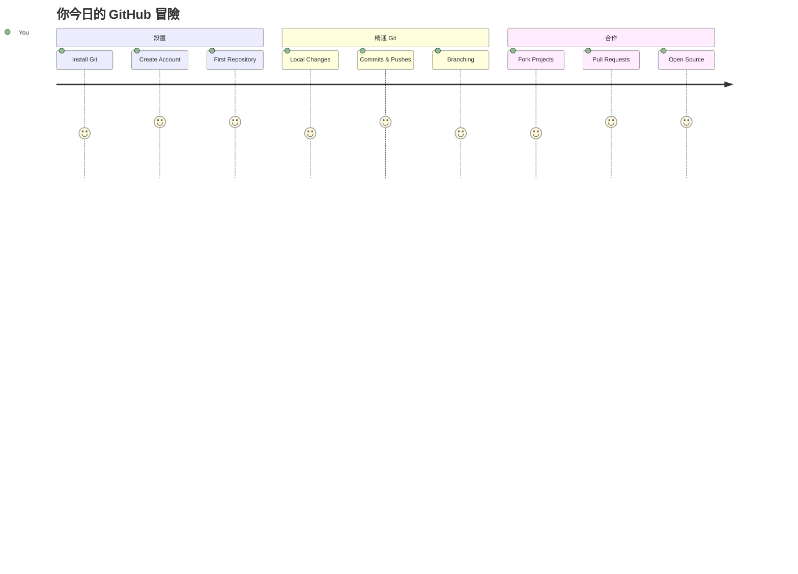
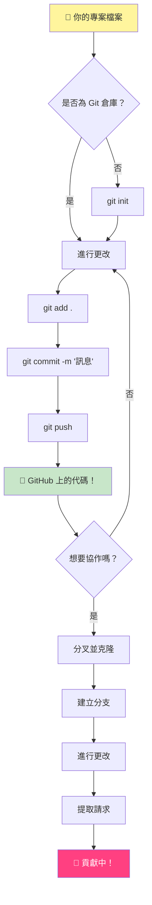
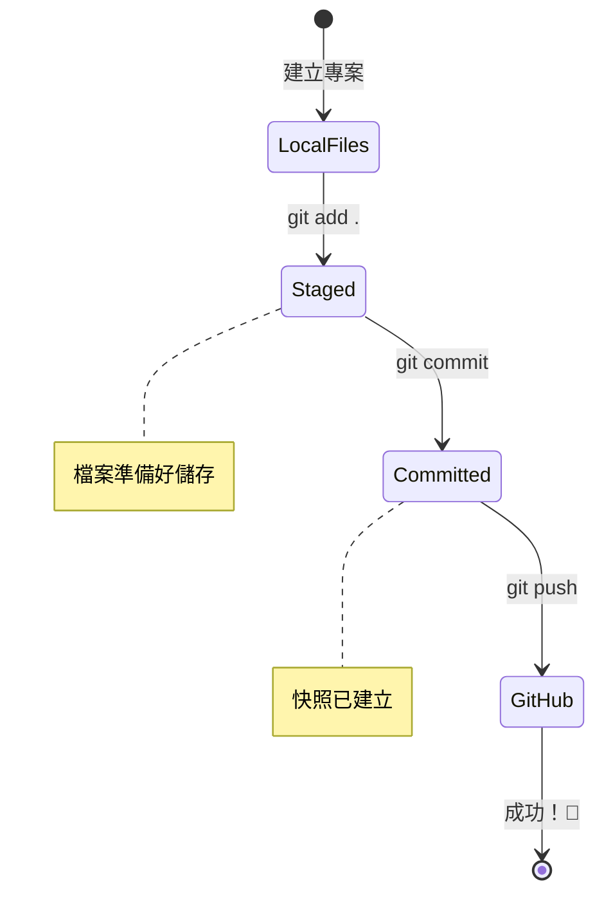
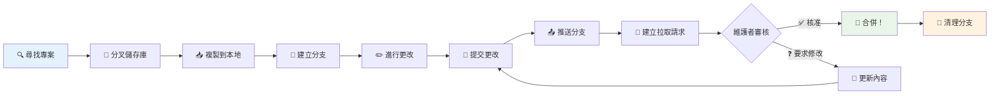
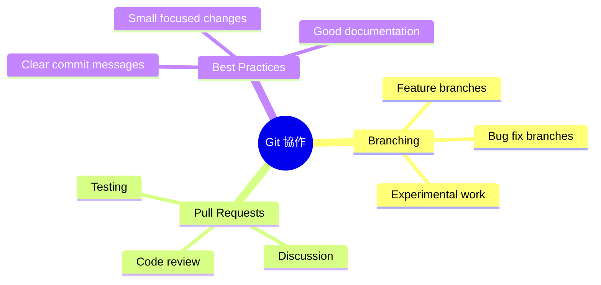
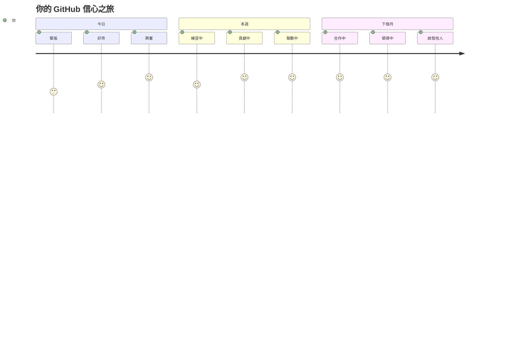

<!--
CO_OP_TRANSLATOR_METADATA:
{
  "original_hash": "5c383cc2cc23bb164b06417d1c107a44",
  "translation_date": "2026-01-06T13:14:50+00:00",
  "source_file": "1-getting-started-lessons/2-github-basics/README.md",
  "language_code": "hk"
}
-->
# GitHub 簡介

嗨，未來的開發者！👋 準備好加入全球數百萬程式員的行列了嗎？我非常興奮地向你介紹 GitHub——把它想像成程式員的社交媒體平台，不同的是，我們分享的不是午餐照，而是程式碼，一起打造令人驚嘆的作品！

這點真的讓我震撼不已：你手機上的每個應用程式、你瀏覽的每個網站，以及你將學習使用的大多數工具，都是由團隊開發者在像 GitHub 這樣的平台上共同協作完成的。你喜愛的音樂應用程式？可能就有人跟你一樣貢獻了程式碼。那款玩不膩的遊戲？沒錯，可能就是用 GitHub 協作建造出來的。現在，你也將學會如何成為這個精彩社群的一員！

我知道剛開始可能會覺得很多——說真的，我還記得第一次看到 GitHub 頁面時想：「這到底是什麼意思？」但事實是：每個開發者都是從你現在的狀態開始的。結束這堂課時，你會有自己的 GitHub 倉庫（把它想像成你個人在雲端的專案展示台），你會知道如何儲存工作、與他人分享，甚至參與數百萬人使用的專案。 

我們會一步步一起走這趟旅程，沒有急躁，沒有壓力——只有你我和一些超酷的工具，它們將成為你新的好朋友！


> Sketchnote by [Tomomi Imura](https://twitter.com/girlie_mac)


## 課前小測驗
[Pre-lecture quiz](https://ff-quizzes.netlify.app)

## 介紹

在我們深入真正令人興奮的內容之前，先讓你的電腦準備好 GitHub 的魔法吧！想像這就像在創作傑作之前整理藝術工具——有了合適的工具，一切都會變得更順暢、更有趣。

我會親自引導你完成每個設定步驟，我保證並沒有看起來那麼可怕。如果一開始有些地方不太懂，那完全正常！我還記得設定第一個開發環境時，感覺像在解讀古埃及象形文字。每個開發者都曾經跟你現在一樣，不知道自己有沒有做對。劇透一下：你正在學習，已經做對了！🌟

本課將涵蓋：

- 追蹤你在電腦上的工作
- 與他人合作專案
- 如何貢獻開源軟體

### 先決條件

先讓你的電腦準備好 GitHub 的魔法吧！別擔心－－這個設定只需做一次，之後你的程式之旅都將順利進行。

好了，讓我們從基礎開始！首先，我們需要確認你的電腦上是否已經安裝了 Git。Git 基本上就像一個超聰明的助手，記錄你對程式碼的每個變更，比起每兩秒猛按 Ctrl+S（我們都做過）好太多了！

在終端機輸入這行魔法指令，看看你的電腦是否有安裝 Git：
`git --version`

如果還沒安裝，別擔心！到 [download Git](https://git-scm.com/downloads) 下載安裝就好。裝好之後，我們要正式介紹你和 Git 認識一下：

> 💡 **初次設定**：這些指令會告訴 Git 你是誰。這資訊會附加在你每次提交（commit）中，所以請選擇你願意公開分享的名字和郵件。

```bash
git config --global user.name "your-name"
git config --global user.email "your-email"
```

要檢查 Git 是否已設好，可以輸入：
```bash
git config --list
```

你還需要有 GitHub 帳號、程式碼編輯器（如 Visual Studio Code），還有打開終端機（或命令提示字元）。

造訪 [github.com](https://github.com/)，還沒帳號就註冊，或登入並完善個人資料。

💡 **現代提示**：考慮設定 [SSH 金鑰](https://docs.github.com/en/authentication/connecting-to-github-with-ssh) 或使用 [GitHub CLI](https://cli.github.com/) 來無密碼更輕鬆認證。

✅ GitHub 並非唯一的程式碼倉庫，市場上還有其他選擇，但 GitHub 最出名。

### 準備工作

你需要在本機（筆電或電腦）準備一個有程式碼的資料夾，還有 GitHub 上一個公開倉庫，作為示範如何貢獻他人專案的例子。

### 保護你的程式碼安全

說點安全性的事情——別擔心，不會嚇到你！把安全習慣想成鎖車或鎖房門。這些簡單習慣會成為你的第二天性，保護你辛苦的作品。

我們會從一開始就展示如何用現代且安全的方式與 GitHub 合作。這樣你能培養好習慣，伴隨你整個程式人生。

使用 GitHub 時，重要的是遵守安全最佳實務：

| 安全範疇 | 最佳實務 | 重要原因 |
|---------------|---------------|----------------|
| **身份驗證** | 使用 SSH 金鑰或個人存取權杖 | 密碼安全性較差並逐漸淘汰 |
| **雙重認證** | 啟用 GitHub 帳號 2FA | 增加帳號安全防護層 |
| **倉庫安全** | 永遠不提交敏感資訊 | API 金鑰與密碼不該放公開倉庫 |
| **相依管理** | 啟用 Dependabot 更新 | 保持依賴套件安全與最新 |

> ⚠️ **重要安全提醒**：切勿將 API 金鑰、密碼或其他敏感資訊提交到任何倉庫。使用環境變數與 `.gitignore` 檔案來保護敏感資料。

**現代認證設定：**

```bash
# 產生 SSH 金鑰（現代 ed25519 演算法）
ssh-keygen -t ed25519 -C "your_email@example.com"

# 設定 Git 使用 SSH
git remote set-url origin git@github.com:username/repository.git
```

> 💡 **專業提示**：SSH 金鑰讓你不必重複輸入密碼，比傳統認證更安全。

---

## 像專業人士般管理你的程式碼

好了，這裡開始真正有趣了！🎉 我們將學習如何像專家一樣追蹤與管理程式碼，坦白說，這是我最喜歡教的主題之一，因為它會改變你的開發方式。

想像你正在寫一個精彩故事，想要記錄每個稿本、每個絕妙修訂，還有每個「等等，這主意太棒了！」的瞬間。Git 就是為你的程式碼做到這件事！它就像一個不可思議的時光筆記本，記錄所有細節——每一次敲擊鍵盤、每個修正、每個「哎呀，壞了！」的時刻，你都能立刻回到過去。

說實話——剛開始可能會有點難懂。我當年也想：「為什麼不能像平常一樣直接存檔呢？」但相信我，一旦你「察覺」了 Git 的妙用（一定會的！），你會有「以前怎麼沒用過它？」的靈光一閃。就像一輩子走路，忽然發現自己會飛一樣！

假設你本機有一個資料夾，裡面放著程式碼專案，你想開始用 git（版本控制系統）追蹤進度。有人說用 git 有點像寫給未來自己的情書。數天、數週、數月後，再回頭看你的 commit 訊息，你能回憶為何改動，或「還原」變更－－前提是你有寫好 commit 訊息。


### 任務：建立你的第一個倉庫！

> 🎯 **你的任務（我超級期待！）**：我們要一起建立你的第一個 GitHub 倉庫！完成後，你會有屬於自己的網路小天地存放程式碼，並完成第一次「commit」（開發者專用語：用聰明方式保存工作成果）。
>
> 這真的是特別的時刻——你即將正式加入全球開發者社群！我依然記得第一次創建倉庫時的興奮，心想「哇，我真的做到了！」

咱們一步步共赴這場冒險。每個步驟都慢慢來，不用急，保證你絕對懂。記得，每位你認識的程式達人都曾跟你一樣，正準備創建他們的第一個倉庫。多酷啊！

> 觀看影片
> 
> [](https://www.youtube.com/watch?v=9R31OUPpxU4)

**一起動手做：**

1. **在 GitHub 建立你的倉庫**。前往 GitHub.com，找那個明亮的綠色 **New** 按鈕（或右上角的 **+** 號），點擊並選擇 **New repository**。

   以下是操作步驟：
   1. 幫你的倉庫取個名字──取一個對你有意義的！
   1. 可以加個描述（讓別人知道專案是什麼）
   1. 決定是公開（大家都能看到）還是私密（只限你）
   1. 建議勾選新增 README 檔案——這是你專案的封面頁
   1. 點擊 **Create repository**，慶祝一下－你剛創建了第一個倉庫！🎉

2. **進入你的專案資料夾**。打開終端機（別怕，真的沒那麼可怕！）。我們要指示電腦專案檔案位置。輸入以下指令：

   ```bash
   cd [name of your folder]
   ```

   **我們這樣做是因為：**
   - 其實是在告訴電腦「嘿，帶我到專案資料夾」
   - 這就像在桌面打開指定資料夾，但用文字指令執行
   - 把 `[name of your folder]` 換成你專案資料夾的真實名稱

3. **將資料夾變成 Git 倉庫**。魔法就在此發生！打：

   ```bash
   git init
   ```

   **這步驟的意義（很酷吧！）：**
   - Git 在你的專案中建立一個隱藏的 `.git` 資料夾，你看不到它，但它存在著！
   - 你的資料夾現在成為可追蹤所有變更的「倉庫」
   - 就像賦予資料夾超能力，能記住一切

4. **查看目前狀態**。看看 Git 對你的專案「怎麼看」：

   ```bash
   git status
   ```

   **讀懂 Git 講了什麼：**
   
   你可能會看到像這樣的東西：

   ```output
   Changes not staged for commit:
   (use "git add <file>..." to update what will be committed)
   (use "git restore <file>..." to discard changes in working directory)

        modified:   file.txt
        modified:   file2.txt
   ```

   **別慌！這是什麼意思：**
   - 紅色的檔案代表有變更但還沒準備好要儲存
   - 綠色的檔案（如果有看到）代表已準備好儲存
   - Git 很貼心，告訴你下一步該怎麼做

   > 💡 **專業提示**：`git status` 是你最好的朋友！任何時候搞不懂狀況就用它。它就像問 Git 「嘿，情況怎樣？」

5. **準備好要儲存的檔案**（稱為「暫存」）：

   ```bash
   git add .
   ```

   **我們剛做了什麼：**
   - 告訴 Git 「我想把這資料夾裡的所有檔案都加入下一次儲存」
   - `.` 就像說「資料夾裡所有的東西」
   - 現在檔案都「暫存」了，準備下一步

   **想挑選性加入？** 你也可以只加入特定檔案：

   ```bash
   git add [file or folder name]
   ```

   **為什麼會想這樣做？**
   - 有時候你想一併保存相關修改
   - 幫助你把工作化整為零
   - 更容易理解什麼時候改了什麼

   **改主意了？** 沒問題！可以這樣取消暫存：

   ```bash
   # 取消暫存所有項目
   git reset
   
   # 只取消暫存一個檔案
   git reset [file name]
   ```

   別擔心－這不會刪除你的檔案，只是把檔案從「準備儲存」的列表移除。

6. **正式永久保存你的工作**（做出第一個 commit！）：

   ```bash
   git commit -m "first commit"
   ```

   **🎉 恭喜你！完成你的第一次 commit！**
   
   **剛發生了什麼：**
   - Git 在這一刻幫你把所有暫存檔案「拍了一張快照」
   - commit 訊息「first commit」說明這次保存的意義
   - Git 給予這張快照一個獨特 ID，讓你能隨時找到它
   - 你正式開始追蹤專案歷史！

   > 💡 **未來 commit 訊息**：下次提交時，訊息要更具描述性！不要只寫「updated stuff」，試試「Add contact form to homepage」或「Fix navigation menu bug」。未來的你會感謝現在用心的你！

7. **連接本機專案到 GitHub**。目前專案只在你電腦裡，我們要連到 GitHub 倉庫，才能分享給全世界！

   先去你的 GitHub 倉庫頁面，複製 URL 回來，然後打：

   ```bash
   git remote add origin https://github.com/username/repository_name.git
   ```
   
   （把這個 URL 換成你實際的倉庫網址！）

   **我們做了什麼：**
   - 我們已建立你本地專案和你的 GitHub 倉庫之間的連接
   - 「origin」只是你 GitHub 倉庫的暱稱——就像把聯絡人加到你的電話裡一樣
   - 現在本地的 Git 知道該把你的程式碼傳送到哪裡，當你準備好分享時

   💡 **更簡易的方法**：如果你已安裝 GitHub CLI，可以用一條指令完成這些動作：
   ```bash
   gh repo create my-repo --public --push --source=.
   ```

8. **將你的程式碼傳送到 GitHub**（重要時刻！）：

   ```bash
   git push -u origin main
   ```

   **🚀 就是現在！你要將程式碼上傳到 GitHub 了！**
   
   **發生了什麼：**
   - 你的提交從電腦傳到 GitHub
   - `-u` 旗標建立永久連接，未來推送更方便
   - 「main」是你的主要分支名稱（就像主資料夾）
   - 之後你只要打 `git push` 就能上傳！

   💡 **小提示**：如果你的分支叫別的名字（例如「master」），請用那個名稱。可用 `git branch --show-current` 確認。

9. **你的全新日常編程節奏**（這會讓你上癮！）：

   從此以後，當你對專案作出改動時，有一個簡單的三步舞：

   ```bash
   git add .
   git commit -m "describe what you changed"
   git push
   ```

   **這會成為你的編程節奏：**
   - 作出很棒的程式碼改動 ✨
   - 用 `git add` 登記改動（「Git，請注意這些改動！」）
   - 用 `git commit` 並附上描述訊息儲存改動（未來的你會感謝現在的你！）
   - 用 `git push` 和世界分享你的改動 🚀
   - 不斷重複——認真說，這會像呼吸一樣自然！

   我喜歡這個工作流程，因為它就像遊戲裡有多個儲存點。喜歡剛才的改動？就 commit！想試些冒險的東西？沒問題——如果出錯，隨時可以回到最後的提交狀態！

   > 💡 **小貼士**：你也可能想用 `.gitignore` 檔，避免不想追蹤的檔案出現在 GitHub 上——像存在同資料夾裡但不適合放公開倉庫的筆記檔。能從 [.gitignore templates](https://github.com/github/gitignore) 找到範本，或用 [gitignore.io](https://www.toptal.com/developers/gitignore) 自製。

### 🧠 **第一次倉庫提交：感覺如何？**

**花點時間慶祝並反思：**
- 第一次看到程式碼出現在 GitHub 時是什麼感覺？
- 哪一步最令你困惑，哪一步出乎意料地簡單？
- 你能用自己的話解釋 `git add`、`git commit` 和 `git push` 的差別嗎？


> **記住**：即使是有經驗的開發者，有時也會忘記正確指令。讓這流程變成肌肉記憶需要練習——你做得很棒！

#### 現代 Git 工作流程

考慮採用以下現代規範：

- **Conventional Commits**：用標準化的提交訊息格式，如 `feat:`、`fix:`、`docs:` 等。了解更多：[conventionalcommits.org](https://www.conventionalcommits.org/)
- **Atomic commits**：每個 commit 只代表一個邏輯修改
- **Frequent commits**：經常、用描述性訊息提交，避免一次大量、少次提交

#### Commit 訊息

一個優秀的 Git commit 主旨句應完成以下句子：
If applied, this commit will <你的主旨句>

主旨用命令式、現在時：用「change」非「changed」或「changes」。
正文（可選）也用命令式、現在時，應說明為何改動並和之前行為對比。是解釋「為什麼」不是「怎麼做」。

✅ 花幾分鐘逛逛 GitHub。能找到非常好的 commit 訊息嗎？或非常簡短的訊息？你覺得 commit 訊息中最重要且有用的資訊是什麼？

## 與他人合作（有趣的部分！）

戴好帽子，因為這正是 GitHub 魔法開始的地方！🪄 你已掌握管理自己程式碼，但現在我們要進入我最愛的部分——與來自世界各地的優秀開發者合作。

想像一下：明天醒來時，你發現有人在東京幫你改進了程式碼；有人在柏林修復你卡住的 bug；下午時，聖保羅的一位開發者加入了你從未想過的功能。這不是科幻——在 GitHub 世界裡，這就是日常!

讓我最興奮的是，你即將學到的協作技能，就是 Google、微軟以及你喜歡的初創公司每天使用的 EXACT 工作流程。你不只是在學一個酷工具——你在學讓全球軟體世界協同運作的祕密語言。

說真的，一旦你體驗到有人合併你的第一個 Pull Request 的快感，就會懂為什麼開發者對開源充滿熱情。就像參與全球最大、最具創意的團隊專案！

> 參考影片
>
> [](https://www.youtube.com/watch?v=bFCM-PC3cu8)

放到 GitHub 的主要原因是為了方便與其他開發者合作。


在你的倉庫中，前往 `Insights > Community` 查看你的專案如何符合社區建議標準。

想讓你的倉庫看起來專業且讓人感到歡迎嗎？到你的倉庫點擊 `Insights > Community`。這個很棒的功能會告訴你專案在 GitHub 社區認為「良好倉庫實踐」方面的表現。

> 🎯 **讓你的專案閃耀**：一個組織良好且文件齊全的倉庫就像乾淨、招人的店面。它告訴大家你很在乎作品，也讓其他人想投入貢獻！

**以下讓倉庫變優秀：**

| 應加入什麼 | 為何重要 | 帶給你的效果 |
|-------------|-----------|---------------|
| **描述** | 第一印象很重要！ | 讓人第一時間知道你的專案做什麼 |
| **README** | 專案的門面 | 就像迎新導覽給新訪客 |
| **貢獻指南** | 表示歡迎協助 | 讓人明白如何協助你 |
| **行為守則** | 創造友善環境 | 讓每個人都感覺被歡迎參與 |
| **授權條款** | 法務清楚 | 讓他人知道如何使用你的程式碼 |
| **安全政策** | 展現負責任 | 表現專業作風 |

> 💡 **專家秘訣**：GitHub 提供這些檔案的範本。建立新倉庫時勾選即可自動生成。

**探索現代 GitHub 功能：**

🤖 **自動化與 CI/CD：**
- **GitHub Actions** 自動化測試與部署
- **Dependabot** 依賴自動更新

💬 **社群與專案管理：**
- **GitHub Discussions** 問題之外的社群討論空間
- **GitHub Projects** 看板式專案管理
- **分支保護規則** 強制程式碼品質標準


這些資源能幫助新團隊成員加入時更快上手。通常新貢獻者在看程式碼前會先看這些，判斷專案是否值得他們花時間。

✅ README 檔雖然準備起來花時間，但常被忙碌的維護者忽略。能找到特別有描述性的範例嗎？備註：有一些[工具幫助創建優質 README](https://www.makeareadme.com/)值得嘗試。

### 任務：合併一些程式碼

貢獻文件幫助他人參與專案。說明你找什麼樣的貢獻及流程如何。貢獻者需經過一系列步驟，才能在 GitHub 貢獻給你的倉庫：


1. **Fork 你的倉庫** 大概你會希望大家先對你的專案 _fork_。Fork 是建立你倉庫的複製品在他們的 GitHub 帳號上。
1. **Clone**。接著他們會 clone 專案到本地機器。
1. **建立分支**。你會想請他們為他們的工作建立一個 _branch_。
1. **專注於一件事**。請貢獻者一次專注於一個改動內容——這樣你合併他們工作的機率比較高。想像他們修 bug、新增功能、更新多項測試——如果你只能接受其中兩項或一項怎麼辦？

✅ 想像在寫和交付優質程式碼時，分支扮演關鍵角色。你能想到哪些應用場景？

> 註：成為你想看到的改變，也建立分支管理自己的工作吧。你所做的 commit 預設是在你當前「checkout」的分支上。用 `git status` 查看你在哪個分支。

讓我們來看一下貢獻者的工作流程。假設貢獻者已經 _fork_ 並 _clone_ 好 repo，且本地已有 Git 環境：

1. **建立分支**。用命令 `git branch` 建立一個準備提交改動的分支：

   ```bash
   git branch [branch-name]
   ```

   > 💡 **現代做法**：你也可以用一條命令同時建立並切換分支：
   ```bash
   git switch -c [branch-name]
   ```

1. **切換到工作分支**。用 `git switch` 切換到剛建立的分支並更新工作目錄：

   ```bash
   git switch [branch-name]
   ```

   > 💡 **現代提示**：`git switch` 是改用於切分支的更清晰替代 `git checkout`，對初學者更安全。

1. **開始工作**。此時你要新增改動。別忘告訴 Git，命令如下：

   ```bash
   git add .
   git commit -m "my changes"
   ```

   > ⚠️ **提交訊息品質**：務必為 commit 取個好名字，無論是為自己還是你協助的 repo 維護者。具體說明你改了什麼！

1. **合併你的工作到 `main` 分支**。完成工作後，想結合你的工作和 `main` 分支的內容。`main` 可能已有更新，先用以下命令拉最新版本：

   ```bash
   git switch main
   git pull
   ```

   現在你要確保任何 _衝突_，即 Git 不知如何 _合併_ 的情況，都處理在你的工作分支。執行：

   ```bash
   git switch [branch_name]
   git merge main
   ```

   `git merge main` 會把 `main` 最新變更帶入你的分支。希望能直接繼續。如果不行，VS Code 會告訴你 Git 混淆在哪裡，並讓你修改檔案指定正確版本。

   💡 **現代替代法**：考慮用 `git rebase` 取得更乾淨的歷史：
   ```bash
   git rebase main
   ```
   這會把你的提交依序放到最新的 main 上，形成線性歷史。

1. **推送你的工作到 GitHub**。推送工作到 GitHub 具包含兩件事。先把分支推送到你的遠端 fork，然後開 Pull Request。

   ```bash
   git push --set-upstream origin [branch-name]
   ```

   上述指令會在你的 forked repo 建立分支。

### 🤝 **協作技能檢測：準備好與別人合作了嗎？**

**來看看你對協作的感覺：**
- 對 fork 與 pull request 的概念是否明白？
- 有關使用分支工作，你還想練習什麼？
- 對貢獻別人專案感到多大信心？


> **信心加油站**：你敬佩的每位開發者，在提出第一個 PR 時都曾緊張。GitHub 社區對新手非常友好！

1. **開 PR**。接著要開 pull request。到你 fork 的 repo 頁面上，GitHub 會提示你是否建立新 PR，點擊即可進入介面修改 commit 標題和敘述。原專案維護者會看到，並 _希望_ 會合併你的 PR。從此你成為一名貢獻者，耶 :)

   💡 **現代提示**：也可使用 GitHub CLI 建立 PR：
   ```bash
   gh pr create --title "Your PR title" --body "Description of changes"
   ```

   🔧 **PR 最佳實踐**：
   - 用關鍵字連結相關 issue，如 "Fixes #123"
   - UI 改動補充截圖
   - 指定特定審查者
   - 進行中可用草稿 PR
   - 發出審查請求前確保所有 CI 通過
1. **清理**。成功合併 PR 後，進行 _清理_ 是良好做法。你需要清理本地分支和推送到 GitHub 的分支。首先，使用以下命令在本地刪除它：

   ```bash
   git branch -d [branch-name]
   ```

   接著請到該 fork 的 GitHub 頁面，刪除你剛剛推送過去的遠端分支。

`Pull request`（拉取請求）聽起來怪怪的，因為你真正想做的是把變更推送到專案裡。但維護者（專案擁有者）或核心團隊需要先審核你的變更，才會將它合併進專案的「main」分支，所以你其實是在請求維護者做變更決定。

拉取請求是用來比較和討論分支所引入差異的地方，可以包含審核、評論、整合測試等等。一個好的拉取請求大致遵循和提交說明相同的規則。如果你的工作是修復某個問題，可以加上 issue 的參考，格式是 `#` 後面接問題號碼。例如 `#97`。

🤞希望所有檢查通過，且專案擁有者能將你的變更合併進專案🤞

用以下指令更新你當前的本地工作分支，將 GitHub 上對應遠端分支的所有新提交拉下來：

`git pull`

## 貢獻開源專案（你改變世界的機會！）

準備好迎接讓你驚嘆的新世界了嗎？🤯 來談談如何參與開源貢獻吧 —— 光是想著能和你分享這些內容我就起雞皮疙瘩了！

這是你成為真正偉大事物一部分的機會。想像一下，改善數百萬開發者每天使用的工具，或者修正你朋友們都愛用的應用程式的錯誤。這不只是一場夢想 —— 這就是開源貢獻的精髓！

讓我每次想到都感到顫慄的是：你所學的每個工具 —— 你的程式碼編輯器、我們將探索的框架，甚至你正在閱讀本文的瀏覽器 —— 都是由像你一樣的人首次貢獻開始。那位打造你最愛 VS Code 擴充功能的優秀開發者？他們曾經也是充滿忐忑地按下「建立拉取請求」按鈕的初學者，就像你現在一樣。

最美好的部分是：開源社群就像網路上最大的群體擁抱。大多數專案都積極尋找新手，並且有標示為「good first issue」的議題，就是專門為你這樣的初學者準備！維護者看到新貢獻者時會非常興奮，因為他們記得自己也從第一次踏出第一步開始。

```mermaid
flowchart TD
    A[🔍 探索 GitHub] --> B[🏷️ 尋找 "good first issue"]
    B --> C[📖 閱讀貢獻指南]
    C --> D[🍴 分叉倉庫]
    D --> E[💻 設置本地環境]
    E --> F[🌿 建立功能分支]
    F --> G[✨ 做出你的貢獻]
    G --> H[🧪 測試你的更改]
    H --> I[📝 撰寫清晰提交訊息]
    I --> J[📤 推送並建立 PR]
    J --> K[💬 參與反饋交流]
    K --> L[🎉 合併成功！你成為了貢獻者！]
    L --> M[🌟 尋找下一個議題]
    
    style A fill:#e1f5fe
    style L fill:#c8e6c9
    style M fill:#fff59d
```
你不只是學寫程式，更是在準備加入一個每天早上醒來就思考「我們怎麼讓數位世界變得更好一點？」的全球創作者大家庭。歡迎加入！🌟

首先，我們來找一個你感興趣並想貢獻變更的 GitHub 儲存庫（repo）。你需要將它的內容複製到你的電腦。

✅ 找到「新手友好」的 repo 一個好方法是[使用 'good-first-issue' 標籤搜尋](https://github.blog/2020-01-22-browse-good-first-issues-to-start-contributing-to-open-source/)。


複製代碼有好幾種方式。最常見的是使用 HTTPS、SSH 或 GitHub CLI（命令列工具）「克隆」該儲存庫內容。

打開你的終端機並這樣克隆儲存庫：
```bash
# 使用 HTTPS
git clone https://github.com/ProjectURL

# 使用 SSH（需要設定 SSH 金鑰）
git clone git@github.com:username/repository.git

# 使用 GitHub CLI
gh repo clone username/repository
```

要在專案內工作，切換到正確資料夾：
`cd ProjectURL`

你也可以開啟整個專案：
- **[GitHub Codespaces](https://github.com/features/codespaces)** - GitHub 的雲端開發環境，可在瀏覽器中使用 VS Code
- **[GitHub Desktop](https://desktop.github.com/)** - 用於 Git 操作的圖形使用者介面應用程式
- **[GitHub.dev](https://github.dev)** - 任何 GitHub repo 按下 `.` 鍵即可在瀏覽器開啟 VS Code
- 搭配 GitHub 拉取請求擴充功能的 VS Code

最後，你可以下載壓縮檔形式的代碼。

### 關於 GitHub 的更多有趣事

你可以對任何公開 repo 加星標、訂閱觀察和/或「fork」它們。加星的 repo 可以在右上角的下拉選單找到，這就像書籤，但用於程式碼。

專案有譯題追蹤器，通常是在 GitHub 的「Issues」標籤頁（除非另有說明），用來討論專案相關問題。拉取請求標籤是用來討論和審查正在進行的改動。

有些專案還會在論壇、郵件列表或聊天頻道（像 Slack、Discord 或 IRC）進行討論。

🔧 **現代 GitHub 功能**：
- **GitHub Discussions** - 內建的社群討論區
- **GitHub Sponsors** - 財務支持維護者
- **Security tab** - 漏洞報告與安全公告
- **Actions tab** - 查看自動化工作流程及 CI/CD 管線
- **Insights tab** - 關於貢獻者、提交和專案健康度的分析
- **Projects tab** - GitHub 內建的專案管理工具

✅ 四處逛逛你的新 GitHub repo，試試修改設定、添加資訊、建立專案（如看板）、設定 GitHub Actions 來自動化。你能做的事非常多！

---

## 🚀 挑戰

好了，現在是測試你閃亮新 GitHub 超能力的時刻了！🚀 這項挑戰會讓一切以最令人滿足的方式連結起來：

找一個朋友（或那位一直問你在做什麼「電腦東西」的家人）一起展開協同編程冒險吧！這就是魔法所在 —— 建立一個專案，讓他們 fork，建立一些分支，像專業人士一樣合併變更。

說實話 —— 你們絕對會笑翻（尤其是當你們試圖同時更改同一行），可能還會被搞得抓頭困惑，但你一定會體驗到那些令人驚豔的「啊哈！」時刻，讓所有學習都變得值得。此外，與人分享第一次成功合併有著特別的意義 —— 它像是在慶祝你已走多遠！

還沒有編程夥伴？完全沒問題！GitHub 社群熱情友善，他們都記得當初自己也是新手。找標記「good first issue」的儲存庫 —— 這基本上是在說「嘿，新手，來和我們一起學吧！」多棒啊！

## 課後小測
[Post-lecture quiz](https://ff-quizzes.netlify.app/web/en/)

## 複習並持續學習

呼！🎉 看你多棒 —— 你剛剛像冠軍一樣征服了 GitHub 基礎！如果你現在覺得腦子有點爆炸，那是很正常，說實話這也是好事。你剛剛學到的工具，是我當初花了好幾週才習慣的。

Git 和 GitHub 非常強大（真的很強），我認識的每位開發者 —— 包括現在看起來像魔法師的那些 —— 都必須練習和摸索一段時間才有突破。你能順利完成這堂課，代表你已經踏上掌握開發者工具箱中最重要工具的旅程。

以下是一些超棒的資源，幫助你練習並變得更棒：

- [貢獻開源軟體指南](https://opensource.guide/how-to-contribute/#how-to-submit-a-contribution) —— 你改變世界的路線圖
- [Git 速查表](https://training.github.com/downloads/github-git-cheat-sheet/) —— 方便快速查詢！

別忘了：練習促成進步，而非完美！你使用 Git 和 GitHub 越多，就越自然。GitHub 創建了很多有趣的互動課程，讓你在安全環境中練習：

- [GitHub 入門](https://github.com/skills/introduction-to-github)
- [使用 Markdown 交流](https://github.com/skills/communicate-using-markdown)
- [GitHub Pages](https://github.com/skills/github-pages)
- [管理合併衝突](https://github.com/skills/resolve-merge-conflicts)

**想更冒險一點？試試這些現代工具：**
- [GitHub CLI 文件](https://cli.github.com/manual/) —— 讓你感覺像指令列大師
- [GitHub Codespaces 文件](https://docs.github.com/en/codespaces) —— 雲端程式編輯體驗！
- [GitHub Actions 文件](https://docs.github.com/en/actions) —— 自動化一切
- [Git 最佳實踐](https://www.atlassian.com/git/tutorials/comparing-workflows) —— 升級你的工作流程

## GitHub Copilot Agent 挑戰 🚀

使用 Agent 模式完成以下挑戰：

**說明：** 建立一個合作式網頁開發專案，展示你在本課程學到的完整 GitHub 工作流程。這個挑戰幫助你練習儲存庫建立、協作特性，以及現代 Git 工作流程，在實際場景中操練。

**提示：** 建立一個新的公開 GitHub 儲存庫，名為「Web Development Resources（網頁開發資源）」。儲存庫應包含結構良好的 README.md，列出有用的網頁開發工具和資源，依照不同類別（HTML、CSS、JavaScript 等）組織。按社群標準設定儲存庫，包括授權、貢獻指南和行為準則。至少建立兩個功能分支：一個新增 CSS 資源、另一個新增 JavaScript 資源。分別在各分支做有描述的提交，然後發出拉取請求合併回 main。啟用 GitHub 功能，例如 Issues、Discussions，並建立基本的 GitHub Actions 工作流程做自動化檢查。

## 作業

你的任務（如果你願意接受）：完成 GitHub Skills 的 [GitHub 入門](https://github.com/skills/introduction-to-github) 課程。這個互動課程讓你在安全且有指導的環境中練習所學。完成後還能獲得酷炫徽章！🏅

**想挑戰更多？**
- 為 GitHub 帳號設定 SSH 認證（不用再輸入密碼！）
- 嘗試使用 GitHub CLI 執行日常 Git 操作
- 建立一個有 GitHub Actions 工作流程的儲存庫
- 嘗試用雲端編輯器 GitHub Codespaces 開啟本儲存庫

---

## 🚀 你的 GitHub 精通時間表

### ⚡ **接下來 5 分鐘你可以做的事**
- [ ] 給這個儲存庫和另外三個你感興趣的專案加星標
- [ ] 為你的 GitHub 帳戶設定雙重身份驗證
- [ ] 為你第一個儲存庫創建簡單的 README
- [ ] 追蹤 5 位令你受啟發的開發者

### 🎯 **接下來一小時你可以完成的目標**
- [ ] 完成課後小測並反思你的 GitHub 旅程
- [ ] 設定 SSH 金鑰，實現免密碼登入 GitHub
- [ ] 做出你的第一個有意義的提交並寫好提交訊息
- [ ] 探索 GitHub「Explore」分頁，發掘熱門專案
- [ ] 練習 fork 一個儲存庫並做小改動

### 📅 **你的一週 GitHub 冒險**
- [ ] 完成 GitHub Skills 課程（GitHub 入門、Markdown）
- [ ] 對開源專案提出第一個拉取請求
- [ ] 設置 GitHub Pages 網站展示你的作品
- [ ] 參與你感興趣專案的 GitHub Discussions
- [ ] 建立具社群標準（README、授權等）的儲存庫
- [ ] 嘗試使用 GitHub Codespaces 進行雲端開發

### 🌟 **你的一月蛻變**
- [ ] 對 3 個不同開源項目做出貢獻
- [ ] 輔導一位 GitHub 新手（回饋社群！）
- [ ] 設定 GitHub Actions 自動化工作流程
- [ ] 建立展示 GitHub 貢獻的作品集
- [ ] 參加 Hacktoberfest 或類似社群活動
- [ ] 成為自己開源專案的維護者，讓他人貢獻

### 🎓 **最終 GitHub 精通回顧**

**慶祝你走過的路：**
- 你最喜歡使用 GitHub 的哪個部分？
- 哪個協作功能最讓你興奮？
- 你現在對參與開源貢獻有多大信心？
- 你想要貢獻的第一個專案是什麼？


> 🌍 **歡迎加入全球開發者社群！** 你現在擁有和全球數百萬開發者合作的工具。你的第一次貢獻看似微小，但別忘了 —— 每個重大開源專案都是從某個人首次提交開始的。問題不是你是否能產生影響，而是什麼令人驚嘆的專案將率先受益於你獨特的視角！🚀

記住：每位專家都曾是新手。你可以的！💪

---

<!-- CO-OP TRANSLATOR DISCLAIMER START -->
**免責聲明**：  
本文件由 AI 翻譯服務 [Co-op Translator](https://github.com/Azure/co-op-translator) 進行翻譯。我們雖力求準確，但請注意自動翻譯可能存在錯誤或不準確之處。原始文件的母語版本應視為權威來源。對於重要資訊，建議採用專業人工翻譯。因使用本翻譯所產生之任何誤解或誤讀，我們概不負責。
<!-- CO-OP TRANSLATOR DISCLAIMER END -->