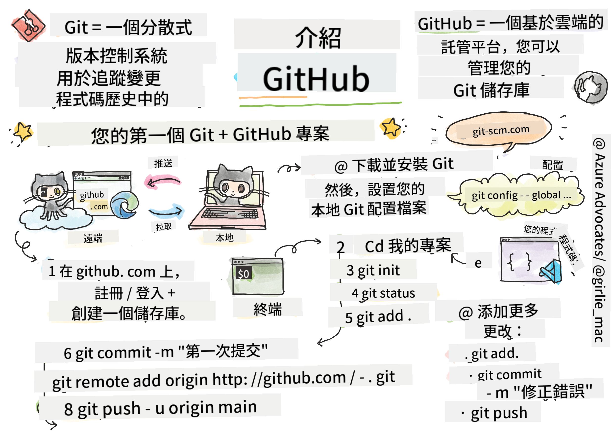

<!--
CO_OP_TRANSLATOR_METADATA:
{
  "original_hash": "361249da70432ddfd4741c917d1a6f50",
  "translation_date": "2025-08-29T15:12:45+00:00",
  "source_file": "1-getting-started-lessons/2-github-basics/README.md",
  "language_code": "hk"
}
-->
# 簡介 GitHub

這節課涵蓋了 GitHub 的基礎知識，這是一個用於托管和管理代碼變更的平台。


> Sketchnote by [Tomomi Imura](https://twitter.com/girlie_mac)

## 課前測驗
[課前測驗](https://ff-quizzes.netlify.app)

## 簡介

在這節課中，我們將學習：

- 如何追蹤你在電腦上的工作
- 如何與他人合作完成項目
- 如何為開源軟件做出貢獻

### 先決條件

在開始之前，你需要檢查是否已安裝 Git。在終端輸入：  
`git --version`

如果未安裝 Git，[下載 Git](https://git-scm.com/downloads)。然後，在終端中設置你的本地 Git 配置檔案：
* `git config --global user.name "your-name"`
* `git config --global user.email "your-email"`

要檢查 Git 是否已配置，可以輸入：
`git config --list`

你還需要一個 GitHub 帳戶、一個代碼編輯器（例如 Visual Studio Code），並打開你的終端（或命令提示符）。

前往 [github.com](https://github.com/) 註冊帳戶（如果尚未註冊），或者登錄並完善你的個人資料。

✅ GitHub 不是唯一的代碼倉庫平台；還有其他選擇，但 GitHub 是最知名的。

### 準備工作

你需要在本地電腦（筆記本或 PC）上準備一個包含代碼項目的文件夾，以及 GitHub 上的一個公共倉庫，這將作為如何為他人項目做出貢獻的示例。

---

## 代碼管理

假設你在本地有一個代碼項目文件夾，並希望使用 Git（版本控制系統）來追蹤你的進度。有些人將使用 Git 比作寫給未來自己的情書。當你幾天、幾周或幾個月後閱讀你的提交信息時，你能回憶起為什麼做出某個決定，或者“回滾”某個更改——前提是你寫了好的“提交信息”。

### 任務：創建倉庫並提交代碼  

> 查看視頻
> 
> [](https://www.youtube.com/watch?v=9R31OUPpxU4)

1. **在 GitHub 上創建倉庫**。在 GitHub.com 的倉庫標籤中，或者在右上角的導航欄中，找到 **新建倉庫** 按鈕。

   1. 為你的倉庫（文件夾）命名
   1. 選擇 **創建倉庫**。

1. **導航到你的工作文件夾**。在終端中，切換到你想開始追蹤的文件夾（也稱為目錄）。輸入：

   ```bash
   cd [name of your folder]
   ```

1. **初始化 Git 倉庫**。在你的項目中輸入：

   ```bash
   git init
   ```

1. **檢查狀態**。要檢查倉庫的狀態，輸入：

   ```bash
   git status
   ```

   輸出可能類似於以下內容：

   ```output
   Changes not staged for commit:
   (use "git add <file>..." to update what will be committed)
   (use "git checkout -- <file>..." to discard changes in working directory)

        modified:   file.txt
        modified:   file2.txt
   ```

   通常，`git status` 命令會告訴你哪些文件已準備好保存到倉庫，或者哪些文件有更改需要持久化。

1. **添加所有文件進行追蹤**  
   這也稱為暫存文件/將文件添加到暫存區。

   ```bash
   git add .
   ```

   `git add` 加上 `.` 參數表示追蹤所有文件和更改。

1. **選擇性添加文件進行追蹤**

   ```bash
   git add [file or folder name]
   ```

   當你不想一次提交所有文件時，這可以幫助我們僅添加選定的文件到暫存區。

1. **取消暫存所有文件**

   ```bash
   git reset
   ```

   此命令幫助我們一次取消暫存所有文件。

1. **取消暫存特定文件**

   ```bash
   git reset [file or folder name]
   ```

   此命令幫助我們一次僅取消暫存特定文件，這些文件不希望包含在下一次提交中。

1. **持久化你的工作**。此時，你已將文件添加到所謂的暫存區，Git 正在追蹤你的文件。要使更改永久化，你需要提交文件。提交代表倉庫歷史中的保存點。輸入以下命令創建提交：

   ```bash
   git commit -m "first commit"
   ```

   這會提交所有文件，並添加信息“首次提交”。未來的提交信息需要更具描述性，以傳達你進行了哪種類型的更改。

1. **將本地 Git 倉庫與 GitHub 連接**。Git 倉庫在你的電腦上很好，但某些時候你希望在某處備份文件，並邀請其他人與你合作。一個很好的地方就是 GitHub。記住，我們已經在 GitHub 上創建了一個倉庫，所以唯一需要做的就是將本地 Git 倉庫與 GitHub 連接。`git remote add` 命令可以做到這一點。輸入以下命令：

   > 注意，在輸入命令之前，前往你的 GitHub 倉庫頁面找到倉庫 URL。你將在以下命令中使用它。用 ```https://github.com/username/repository_name.git``` 替換你的 GitHub URL。

   ```bash
   git remote add origin https://github.com/username/repository_name.git
   ```

   這會創建一個名為“origin”的遠程連接，指向你之前創建的 GitHub 倉庫。

1. **將本地文件發送到 GitHub**。到目前為止，你已經在本地倉庫和 GitHub 倉庫之間建立了連接。接下來使用 `git push` 命令將這些文件發送到 GitHub，如下所示：

   > 注意，你的分支名稱可能默認不同於 ```main```。

   ```bash
   git push -u origin main
   ```

   這會將你的“main”分支中的提交發送到 GitHub。

2. **添加更多更改**。如果你想繼續進行更改並將其推送到 GitHub，你只需要使用以下三個命令：

   ```bash
   git add .
   git commit -m "type your commit message here"
   git push
   ```

   > 提示，你可能還希望採用 `.gitignore` 文件，以防止你不想追蹤的文件出現在 GitHub 上——例如存放在同一文件夾中的筆記文件，但不適合放在公共倉庫中。你可以在 [.gitignore templates](https://github.com/github/gitignore) 找到 `.gitignore` 文件模板。

#### 提交信息

一個好的 Git 提交主題行應完成以下句子：
如果應用，這次提交將 <你的主題行>

主題行使用命令式現在時：“更改”而不是“已更改”或“更改中”。  
在主題行中，以及在正文（可選）中，也使用命令式現在時。正文應包括更改的動機，並與之前的行為形成對比。你是在解釋“為什麼”，而不是“如何”。

✅ 花幾分鐘瀏覽 GitHub。你能找到一個非常好的提交信息嗎？你能找到一個非常簡略的提交信息嗎？你認為在提交信息中傳達哪些信息最重要和最有用？

### 任務：合作

將項目放到 GitHub 上的主要原因是讓其他開發者能夠合作。

## 與他人合作項目

> 查看視頻
>
> [](https://www.youtube.com/watch?v=bFCM-PC3cu8)

在你的倉庫中，導航到 `Insights > Community`，查看你的項目如何符合推薦的社區標準。

以下是一些可以改善你的 GitHub 倉庫的事項：
- **描述**。你是否為項目添加了描述？
- **README**。你是否添加了 README？GitHub 提供了撰寫 [README](https://docs.github.com/articles/about-readmes/?WT.mc_id=academic-77807-sagibbon) 的指導。
- **貢獻指南**。你的項目是否有 [貢獻指南](https://docs.github.com/articles/setting-guidelines-for-repository-contributors/?WT.mc_id=academic-77807-sagibbon)？
- **行為準則**。是否有 [行為準則](https://docs.github.com/articles/adding-a-code-of-conduct-to-your-project/)？
- **許可證**。或許最重要的是，[許可證](https://docs.github.com/articles/adding-a-license-to-a-repository/)？

所有這些資源都能幫助新團隊成員快速上手。而這些通常是新貢獻者在查看你的代碼之前會先看的內容，以了解你的項目是否值得他們投入時間。

✅ README 文件雖然需要時間準備，但經常被忙碌的維護者忽略。你能找到一個特別詳細的 README 示例嗎？注意：有一些 [工具可以幫助創建好的 README](https://www.makeareadme.com/)，你可能會想試試。

### 任務：合併代碼

貢獻文檔幫助人們為項目做出貢獻。它解釋了你希望的貢獻類型以及流程如何運作。貢獻者需要完成一系列步驟才能為你的 GitHub 倉庫做出貢獻：

1. **Fork 你的倉庫**。你可能希望人們 _fork_ 你的項目。Fork 意味著在他們的 GitHub 個人資料中創建你的倉庫的副本。
1. **克隆**。接著他們會將項目克隆到本地電腦。
1. **創建分支**。你會希望他們為自己的工作創建一個 _分支_。
1. **專注於一個區域的更改**。要求貢獻者一次專注於一件事——這樣你合併他們工作的可能性更高。想像一下，他們修復了一個 bug，添加了一個新功能，並更新了幾個測試——如果你只想實施其中的 2 個或 1 個更改，該怎麼辦？

✅ 想像一個分支在編寫和交付良好代碼中特別重要的情況。你能想到哪些使用場景？

> 注意，成為你希望看到的改變，為自己的工作創建分支。你所做的任何提交都將在你當前“檢出”的分支上進行。使用 `git status` 查看當前分支。

讓我們來看看貢獻者的工作流程。假設貢獻者已經 _fork_ 並 _克隆_ 了倉庫，因此他們在本地電腦上有一個準備工作的 Git 倉庫：

1. **創建分支**。使用 `git branch` 命令創建一個分支，該分支將包含他們打算貢獻的更改：

   ```bash
   git branch [branch-name]
   ```

1. **切換到工作分支**。使用 `git switch` 切換到指定分支並更新工作目錄：

   ```bash
   git switch [branch-name]
   ```

1. **進行工作**。此時，你可以添加更改。不要忘記使用以下命令告訴 Git：

   ```bash
   git add .
   git commit -m "my changes"
   ```

   確保你為提交起一個好名字，這對你自己以及你幫助的倉庫維護者都很重要。

1. **與 `main` 分支合併工作**。某些時候，你完成了工作，並希望將你的工作與 `main` 分支的工作合併。`main` 分支可能在此期間發生了更改，因此請確保首先使用以下命令更新它：

   ```bash
   git switch main
   git pull
   ```

   此時，你需要確保任何 _衝突_（Git 無法輕易合併的情況）發生在你的工作分支中。因此，運行以下命令：

   ```bash
   git switch [branch_name]
   git merge main
   ```

   這將把 `main` 中的所有更改帶入你的分支，希望你可以繼續。如果不能，VS Code 會告訴你 Git _困惑_ 的地方，你只需修改受影響的文件以確定哪個內容最準確。

1. **將你的工作發送到 GitHub**。將你的工作發送到 GitHub 意味著兩件事。將你的分支推送到倉庫，然後打開一個 PR（Pull Request）。

   ```bash
   git push --set-upstream origin [branch-name]
   ```

   上述命令會在你的 fork 倉庫中創建分支。

1. **打開 PR**。接下來，你需要打開一個 PR。導航到 GitHub 上的 fork 倉庫。你會看到 GitHub 上的提示，詢問是否要創建新的 PR，點擊它，你會進入一個界面，可以更改提交信息標題，給出更合適的描述。現在，你 fork 的倉庫的維護者會看到這個 PR，_希望_ 他們會欣賞並 _合併_ 你的 PR。你現在是一名貢獻者，恭喜！

1. **清理**。成功合併 PR 後，清理工作被認為是良好的做法。你需要清理本地分支以及推送到 GitHub 的分支。首先使用以下命令在本地刪除它：

   ```bash
   git branch -d [branch-name]
   ```

   接著，前往 GitHub 上的 fork 倉庫頁面，刪除你剛剛推送的遠程分支。
`Pull request` 這個詞聽起來有點奇怪，因為實際上你是想將你的更改推送到專案中。但專案的維護者（專案擁有者）或核心團隊需要在將更改合併到專案的 "main" 分支之前審核你的更改，因此實際上你是在向維護者請求一個更改的決定。

Pull request 是一個用來比較和討論分支中引入的差異的地方，這裡可以進行審查、評論、整合測試等操作。一個好的 pull request 大致遵循與提交訊息相同的規則。例如，當你的工作解決了一個問題時，你可以在問題追蹤器中引用該問題。這可以通過使用 `#` 加上問題編號來完成，例如 `#97`。

🤞希望所有檢查都通過，並且專案擁有者將你的更改合併到專案中🤞

更新你當前本地工作分支，使其包含 GitHub 上對應遠端分支的所有新提交：

`git pull`

## 如何為開源專案做貢獻

首先，讓我們在 GitHub 上找到一個你感興趣並希望貢獻更改的儲存庫（或 **repo**）。你需要將其內容複製到你的電腦上。

✅ 尋找「適合初學者」的儲存庫的一個好方法是[按標籤 'good-first-issue' 搜尋](https://github.blog/2020-01-22-browse-good-first-issues-to-start-contributing-to-open-source/)。


有幾種方法可以複製程式碼。一種方法是使用 HTTPS、SSH 或 GitHub CLI（命令列介面）來「克隆」儲存庫的內容。

打開你的終端機，像這樣克隆儲存庫：
`git clone https://github.com/ProjectURL`

要開始處理專案，切換到正確的資料夾：
`cd ProjectURL`

你也可以使用 [Codespaces](https://github.com/features/codespaces)（GitHub 的嵌入式程式碼編輯器/雲端開發環境）或 [GitHub Desktop](https://desktop.github.com/) 打開整個專案。

最後，你也可以將程式碼下載為壓縮檔案。

### 關於 GitHub 的一些有趣事情

你可以對 GitHub 上的任何公共儲存庫加星標、關注或「fork」。你可以在右上角的下拉選單中找到你加星標的儲存庫。這就像為程式碼加書籤一樣。

專案通常有一個問題追蹤器，大多數情況下在 GitHub 的 "Issues" 標籤中，除非另有說明，人們會在這裡討論與專案相關的問題。而 Pull Requests 標籤是人們討論和審查正在進行的更改的地方。

專案可能還會有論壇、郵件列表或像 Slack、Discord 或 IRC 這樣的聊天頻道進行討論。

✅ 瀏覽一下你的新 GitHub 儲存庫，嘗試一些操作，比如編輯設定、為儲存庫添加資訊，或者創建一個專案（比如看板）。你可以做很多事情！

---

## 🚀 挑戰

與朋友配對，一起處理彼此的程式碼。協作創建一個專案，fork 程式碼，創建分支，並合併更改。

## 課後測驗
[課後測驗](https://ff-quizzes.netlify.app/web/en/)

## 複習與自學

閱讀更多關於[為開源軟體做貢獻](https://opensource.guide/how-to-contribute/#how-to-submit-a-contribution)的內容。

[Git 速查表](https://training.github.com/downloads/github-git-cheat-sheet/)。

多練習，多實踐。GitHub 提供了很棒的學習路徑：[skills.github.com](https://skills.github.com)：

- [GitHub 的第一週](https://skills.github.com/#first-week-on-github)

你還可以找到更多進階課程。

## 作業

完成 [GitHub 的第一週課程](https://skills.github.com/#first-week-on-github)

---

**免責聲明**：  
此文件已使用 AI 翻譯服務 [Co-op Translator](https://github.com/Azure/co-op-translator) 翻譯。我們致力於提供準確的翻譯，但請注意，自動翻譯可能包含錯誤或不準確之處。應以原始語言的文件作為權威來源。對於關鍵資訊，建議尋求專業人工翻譯。我們對因使用此翻譯而引起的任何誤解或錯誤解讀概不負責。