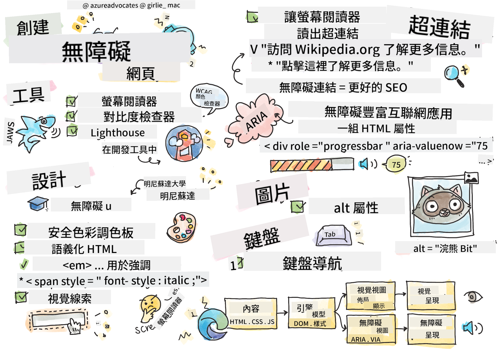

<!--
CO_OP_TRANSLATOR_METADATA:
{
  "original_hash": "f0c88c3e2cefa8952d356f802b1e47ca",
  "translation_date": "2025-08-29T15:11:53+00:00",
  "source_file": "1-getting-started-lessons/3-accessibility/README.md",
  "language_code": "hk"
}
-->
# 建立無障礙的網頁

  
> 由 [Tomomi Imura](https://twitter.com/girlie_mac) 繪製的手繪筆記

## 課前測驗  
[課前測驗](https://ff-quizzes.netlify.app/web/)

> 網絡的力量在於其普遍性。無論是否有殘障，每個人都能訪問是其關鍵特性。  
>  
> \- 提姆·伯納斯-李爵士，W3C 主任及萬維網發明者

這句話完美地突顯了建立無障礙網站的重要性。一個無法讓所有人訪問的應用程式，本質上就是排他的。作為網頁開發者，我們應該時刻將無障礙性放在心上。從一開始就專注於這一點，將確保您創建的頁面能被所有人訪問。在這節課中，您將學習如何使用工具來確保您的網頁資產是無障礙的，以及如何在設計時考慮無障礙性。

> 您可以在 [Microsoft Learn](https://docs.microsoft.com/learn/modules/web-development-101/accessibility/?WT.mc_id=academic-77807-sagibbon) 上學習這節課！

## 可用工具

### 螢幕閱讀器

最知名的無障礙工具之一是螢幕閱讀器。

[螢幕閱讀器](https://en.wikipedia.org/wiki/Screen_reader) 是視障人士常用的工具。當我們花時間確保瀏覽器能正確傳遞我們想分享的資訊時，我們也必須確保螢幕閱讀器能做到同樣的事情。

最基本的螢幕閱讀器會從上到下以語音方式讀取頁面。如果您的頁面全是文字，閱讀器會以類似於瀏覽器的方式傳遞資訊。然而，網頁很少是純文字的；它們通常包含連結、圖片、顏色和其他視覺元素。我們需要確保這些資訊能被螢幕閱讀器正確讀取。

每位網頁開發者都應該熟悉螢幕閱讀器。正如上文所述，這是您的使用者會使用的工具。就像您熟悉瀏覽器的操作一樣，您也應該學習螢幕閱讀器的操作。幸運的是，大多數操作系統都內建了螢幕閱讀器。

一些瀏覽器還內建了工具和擴展功能，可以朗讀文字甚至提供一些基本的導航功能，例如 [這些專注於無障礙的 Edge 瀏覽器工具](https://support.microsoft.com/help/4000734/microsoft-edge-accessibility-features)。這些工具也是重要的無障礙工具，但它們的功能與螢幕閱讀器非常不同，不能用作螢幕閱讀器測試工具。

✅ 試用螢幕閱讀器和瀏覽器的文字朗讀功能。在 Windows 上，[Narrator](https://support.microsoft.com/windows/complete-guide-to-narrator-e4397a0d-ef4f-b386-d8ae-c172f109bdb1/?WT.mc_id=academic-77807-sagibbon) 是預設內建的，您也可以安裝 [JAWS](https://webaim.org/articles/jaws/) 和 [NVDA](https://www.nvaccess.org/about-nvda/)。在 macOS 和 iOS 上，[VoiceOver](https://support.apple.com/guide/voiceover/welcome/10) 是預設內建的。

### 放大功能

另一個視障人士常用的工具是放大功能。最基本的放大功能是靜態放大，可以通過 `Control + 加號 (+)` 或降低螢幕解析度來控制。這種放大方式會使整個頁面重新調整大小，因此使用[響應式設計](https://developer.mozilla.org/docs/Learn/CSS/CSS_layout/Responsive_Design)對於在放大級別下提供良好的使用者體驗非常重要。

另一種放大方式依賴於專門的軟體來放大螢幕的一部分並進行平移，就像使用真正的放大鏡一樣。在 Windows 上，[Magnifier](https://support.microsoft.com/windows/use-magnifier-to-make-things-on-the-screen-easier-to-see-414948ba-8b1c-d3bd-8615-0e5e32204198) 是內建的，而 [ZoomText](https://www.freedomscientific.com/training/zoomtext/getting-started/) 是一款第三方放大軟體，具有更多功能和更大的使用者群體。在 macOS 和 iOS 上，內建了名為 [Zoom](https://www.apple.com/accessibility/mac/vision/) 的放大軟體。

### 對比檢查工具

網站上的顏色需要仔細選擇，以滿足色盲使用者或難以辨識低對比度顏色的人的需求。

✅ 使用瀏覽器擴展工具（例如 [WCAG 的顏色對比檢查工具](https://microsoftedge.microsoft.com/addons/detail/wcag-color-contrast-check/idahaggnlnekelhgplklhfpchbfdmkjp?hl=en-US&WT.mc_id=academic-77807-sagibbon)）測試您喜歡的網站的顏色使用情況。您學到了什麼？

### Lighthouse

在瀏覽器的開發者工具區域，您會找到 Lighthouse 工具。這個工具對於初步檢查網站的無障礙性（以及其他分析）非常重要。雖然不應完全依賴 Lighthouse，但獲得 100% 的分數作為基準是非常有幫助的。

✅ 在瀏覽器的開發者工具面板中找到 Lighthouse，並對任何網站進行分析。您發現了什麼？

## 無障礙設計

無障礙性是一個相對廣泛的主題。為了幫助您，有許多資源可供使用。

- [Accessible U - 明尼蘇達大學](https://accessibility.umn.edu/your-role/web-developers)

雖然我們無法涵蓋創建無障礙網站的每個方面，但以下是一些您需要實施的核心原則。從一開始就設計無障礙頁面**總是**比事後再去修改現有頁面更容易。

## 良好的顯示原則

### 安全的顏色調色盤

每個人看世界的方式都不同，這包括對顏色的感知。在為您的網站選擇配色方案時，您應確保它對所有人都是無障礙的。一個很棒的[生成顏色調色盤的工具是 Color Safe](http://colorsafe.co/)。

✅ 找出一個在顏色使用上非常有問題的網站。為什麼？

### 使用正確的 HTML

通過 CSS 和 JavaScript，您可以讓任何元素看起來像任何類型的控制項。例如，`<span>` 可以用來創建 `<button>`，而 `<b>` 可以變成超連結。雖然這樣可能更容易設計樣式，但對於螢幕閱讀器來說，這並沒有傳遞任何資訊。在頁面上創建控制項時，請使用適當的 HTML。如果您需要一個超連結，請使用 `<a>`。使用正確的 HTML 創建控制項被稱為使用語義化 HTML。

✅ 打開任何網站，看看設計師和開發者是否正確使用了 HTML。您能找到應該是連結但實際上是按鈕的例子嗎？提示：右鍵點擊並選擇「查看頁面源代碼」來查看底層代碼。

### 創建描述性的標題層次結構

螢幕閱讀器使用者[非常依賴標題](https://webaim.org/projects/screenreadersurvey8/#finding)來尋找資訊並導航頁面。撰寫描述性標題內容並使用語義化標題標籤對於創建易於螢幕閱讀器使用者導航的網站非常重要。

### 使用良好的視覺提示

CSS 提供了對頁面上任何元素外觀的完全控制。您可以創建沒有邊框的文本框或沒有下劃線的超連結。不幸的是，移除這些提示可能會讓依賴它們的人更難識別控制項的類型。

## 超連結文字的重要性

超連結是網絡導航的核心。因此，確保螢幕閱讀器能正確讀取連結，讓所有使用者都能導航您的網站。

### 螢幕閱讀器與連結

正如您所預期的，螢幕閱讀器會像讀取頁面上的其他文字一樣讀取連結文字。考慮到這一點，下列示例中的文字可能看起來完全可以接受。

> 小藍企鵝，有時被稱為仙女企鵝，是世界上最小的企鵝。[點擊這裡](https://en.wikipedia.org/wiki/Little_penguin)了解更多資訊。

> 小藍企鵝，有時被稱為仙女企鵝，是世界上最小的企鵝。訪問 https://en.wikipedia.org/wiki/Little_penguin 了解更多資訊。

> **注意**：正如您即將閱讀到的，您應該**永遠不要**創建像上述那樣的連結。

記住，螢幕閱讀器是一種與瀏覽器不同的介面，具有不同的功能集。

### 使用 URL 的問題

螢幕閱讀器會讀取文字。如果文字中出現 URL，螢幕閱讀器會讀取該 URL。一般來說，URL 並不能傳遞有意義的資訊，並且聽起來可能很煩人。如果您的手機曾經語音讀取過帶有 URL 的簡訊，您可能會有這樣的體驗。

### 使用「點擊這裡」的問題

螢幕閱讀器還能只讀取頁面上的超連結，就像視力正常的人會掃描頁面尋找連結一樣。如果連結文字總是「點擊這裡」，使用者聽到的將是「點擊這裡，點擊這裡，點擊這裡，點擊這裡，點擊這裡，……」所有連結現在都無法區分。

### 良好的連結文字

良好的連結文字應簡要描述連結的內容。在上述關於小藍企鵝的例子中，連結指向該物種的維基百科頁面。「小藍企鵝」這個短語將是完美的連結文字，因為它清楚地表明點擊該連結後會學到什麼——小藍企鵝。

> 小藍企鵝，有時被稱為仙女企鵝，是世界上最小的企鵝。[小藍企鵝](https://en.wikipedia.org/wiki/Little_penguin)。

✅ 在網絡上瀏覽幾分鐘，找出使用模糊連結策略的頁面。將它們與其他連結更好的網站進行比較。您學到了什麼？

#### 搜尋引擎的注意事項

確保您的網站對所有人都無障礙，還能幫助搜尋引擎更好地導航您的網站。搜尋引擎使用連結文字來了解頁面的主題。因此，使用良好的連結文字對所有人都有幫助！

### ARIA

想像以下頁面：

| 產品          | 描述              | 訂購          |
| ------------- | ----------------- | ------------- |
| 小工具        | [描述](../../../../1-getting-started-lessons/3-accessibility/')       | [訂購](../../../../1-getting-started-lessons/3-accessibility/')   |
| 超級小工具    | [描述](../../../../1-getting-started-lessons/3-accessibility/')       | [訂購](../../../../1-getting-started-lessons/3-accessibility/')   |

在這個例子中，對於使用瀏覽器的人來說，重複「描述」和「訂購」的文字是合理的。然而，對於使用螢幕閱讀器的人來說，他們只會聽到「描述」和「訂購」重複出現，沒有上下文。

為了支持這類情況，HTML 支援一組稱為[無障礙豐富網絡應用程式 (ARIA)](https://developer.mozilla.org/docs/Web/Accessibility/ARIA) 的屬性。這些屬性允許您為螢幕閱讀器提供額外的資訊。

> **注意**：與 HTML 的許多方面一樣，瀏覽器和螢幕閱讀器的支援可能會有所不同。然而，大多數主流客戶端都支援 ARIA 屬性。

您可以使用 `aria-label` 來描述連結，當頁面的格式不允許您這樣做時。例如，您可以為小工具的描述設置如下：

``` html
<a href="#" aria-label="Widget description">description</a>
```

✅ 一般來說，使用上述的語義化標記優先於使用 ARIA，但有時某些 HTML 元件並沒有語義化的對應。例如樹狀結構。HTML 中沒有對應的樹狀結構標籤，因此您需要使用適當的角色和 ARIA 值來標識這個通用的 `<div>` 元素。[MDN 上的 ARIA 文件](https://developer.mozilla.org/docs/Web/Accessibility/ARIA) 包含更多有用的資訊。

```html
<h2 id="tree-label">File Viewer</h2>
<div role="tree" aria-labelledby="tree-label">
  <div role="treeitem" aria-expanded="false" tabindex="0">Uploads</div>
</div>
```

## 圖片

不用說，螢幕閱讀器無法自動讀取圖片中的內容。確保圖片無障礙並不需要太多工作——這正是 `alt` 屬性的用途所在。所有有意義的圖片都應該有一個 `alt` 屬性來描述它們的內容。  
純裝飾性的圖片應將其 `alt` 屬性設置為空字串：`alt=""`。這樣可以防止螢幕閱讀器不必要地宣讀裝飾性圖片。

✅ 正如您所預期的，搜尋引擎也無法理解圖片中的內容。它們也使用 `alt` 文本。因此，再次確保您的頁面無障礙還能帶來額外的好處！

## 鍵盤操作

有些使用者無法使用滑鼠或觸控板，而是依賴鍵盤操作來逐一切換元素。確保您的網站以邏輯順序呈現內容，這樣鍵盤使用者就能按順序訪問每個互動元素。如果您使用語義化標記構建網頁，並使用 CSS 來設計其視覺佈局，您的網站應該是可通過鍵盤導航的，但手動測試這一點仍然很重要。了解更多關於[鍵盤導航策略](https://webaim.org/techniques/keyboard/)的資訊。

✅ 打開任何網站，嘗試僅使用鍵盤進行導航。哪些地方有效，哪些地方無效？為什麼？

## 總結

一個只能被部分人訪問的網絡並不是一個真正的「全球網絡」。確保您創建的網站無障礙的最佳方式是從一開始就融入無障礙的最佳實踐。雖然這需要額外的步驟，但現在將這些技能融入您的工作流程，意味著您創建的所有頁面都將是無障礙的。

---

## 🚀 挑戰

將以下 HTML 重寫為盡可能無障礙，根據您學到的策略進行修改。

```html
<!DOCTYPE html>
<html>
  <head>
    <title>
      Example
    </title>
    <link href='../assets/style.css' rel='stylesheet' type='text/css'>
  </head>
  <body>
    <div class="site-header">
      <p class="site-title">Turtle Ipsum</p>
      <p class="site-subtitle">The World's Premier Turtle Fan Club</p>
    </div>
    <div class="main-nav">
      <p class="nav-header">Resources</p>
      <div class="nav-list">
        <p class="nav-item nav-item-bull"><a href="https://www.youtube.com/watch?v=CMNry4PE93Y">"I like turtles"</a></p>
        <p class="nav-item nav-item-bull"><a href="https://en.wikipedia.org/wiki/Turtle">Basic Turtle Info</a></p>
        <p class="nav-item nav-item-bull"><a href="https://en.wikipedia.org/wiki/Turtles_(chocolate)">Chocolate Turtles</a></p>
      </div>
    </div>
    <div class="main-content">
      <div>
        <p class="page-title">Welcome to Turtle Ipsum. 
            <a href="">Click here</a> to learn more.
        </p>
        <p class="article-text">
          Turtle ipsum dolor sit amet, consectetur adipiscing elit, sed do eiusmod tempor incididunt ut labore et dolore magna aliqua. Ut enim ad minim veniam, quis nostrud exercitation ullamco laboris nisi ut aliquip ex ea commodo consequat. Duis aute irure dolor in reprehenderit in voluptate velit esse cillum dolore eu fugiat nulla pariatur. Excepteur sint occaecat cupidatat non proident, sunt in culpa qui officia deserunt mollit anim id est laborum
        </p>
      </div>
    </div>
    <div class="footer">
      <div class="footer-section">
        <span class="button">Sign up for turtle news</span>
      </div><div class="footer-section">
        <p class="nav-header footer-title">
          Internal Pages
        </p>
        <div class="nav-list">
          <p class="nav-item nav-item-bull"><a href="../">Index</a></p>
          <p class="nav-item nav-item-bull"><a href="../semantic">Semantic Example</a></p>
        </div>
      </div>
      <p class="footer-copyright">&copy; 2016 Instrument</p>
    </div>
  </body>
</html>
```

## 課後測驗  
[課後測驗](https://ff-quizzes.netlify.app/web/en/)

## 複習與自學
許多政府對無障礙要求有相關法律。了解一下你所在國家的無障礙法律，看看涵蓋了哪些內容，以及哪些未被涵蓋。一個例子是[這個政府網站](https://accessibility.blog.gov.uk/)。

## 作業

[分析一個不符合無障礙標準的網站](assignment.md)

來源: [Turtle Ipsum](https://github.com/Instrument/semantic-html-sample) by Instrument

---

**免責聲明**：  
此文件已使用 AI 翻譯服務 [Co-op Translator](https://github.com/Azure/co-op-translator) 翻譯。我們致力於提供準確的翻譯，但請注意，自動翻譯可能包含錯誤或不準確之處。應以原始語言的文件作為權威來源。對於關鍵資訊，建議尋求專業人工翻譯。我們對因使用此翻譯而引起的任何誤解或錯誤詮釋概不負責。