<!--
CO_OP_TRANSLATOR_METADATA:
{
  "original_hash": "7f2c48e04754724123ea100a822765e5",
  "translation_date": "2026-01-06T13:06:57+00:00",
  "source_file": "1-getting-started-lessons/3-accessibility/README.md",
  "language_code": "hk"
}
-->
# 建立無障礙網頁

  
> 筆記作者：[Tomomi Imura](https://twitter.com/girlie_mac)

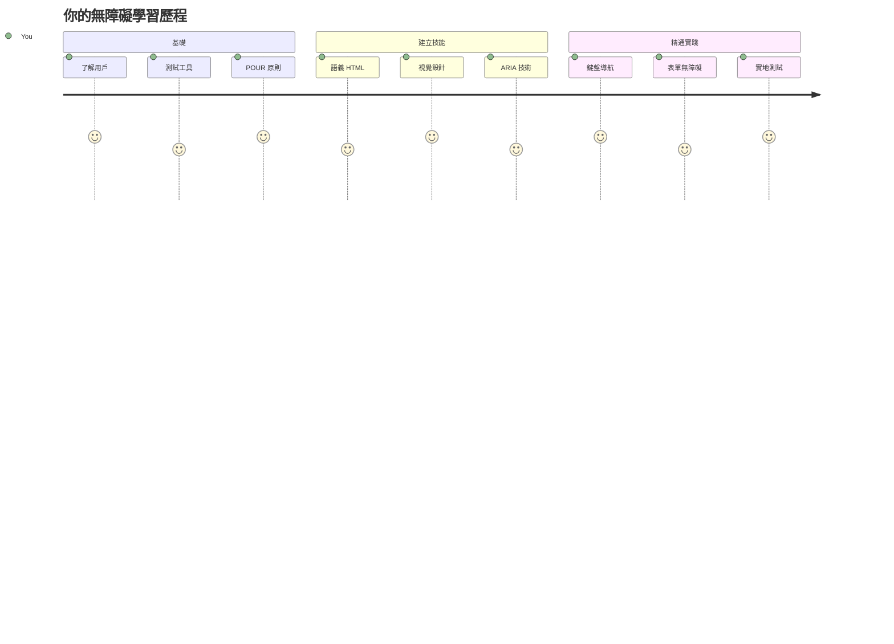
## 講座前小測驗  
[講座前小測驗](https://ff-quizzes.netlify.app/web/)

> 網際網路的力量在於其普及性。無論有無障礙，人人均可使用是必須的面向。  
>  
> \- Sir Timothy Berners-Lee，W3C 主任及萬維網發明人  

這裡有件事可能會讓你驚訝：當你建立無障礙網站時，你不僅是在幫助有障礙的人——你其實是在為每個人打造更好的網絡！

有沒有注意過街角的人行道斜坡？它們最初是為輪椅設計，但現在也幫助推嬰兒車的人、送貨員使用手推車、旅行者拖著行李，以及騎單車的朋友。這正是無障礙網頁設計的運作方式——幫助單一群體的解決方案往往會惠及所有人。很酷吧？

本課程將探討如何創建真正適合每個人使用的網站，無論他們如何瀏覽網頁。你將學習已內建於網頁標準的實用技術，動手使用測試工具，並了解無障礙如何提升全體使用者的使用體驗。

課程結束時，你將有信心將無障礙作為開發工作流程的自然部分。準備好探索用心設計如何讓數十億用戶暢遊網絡？我們開始吧！

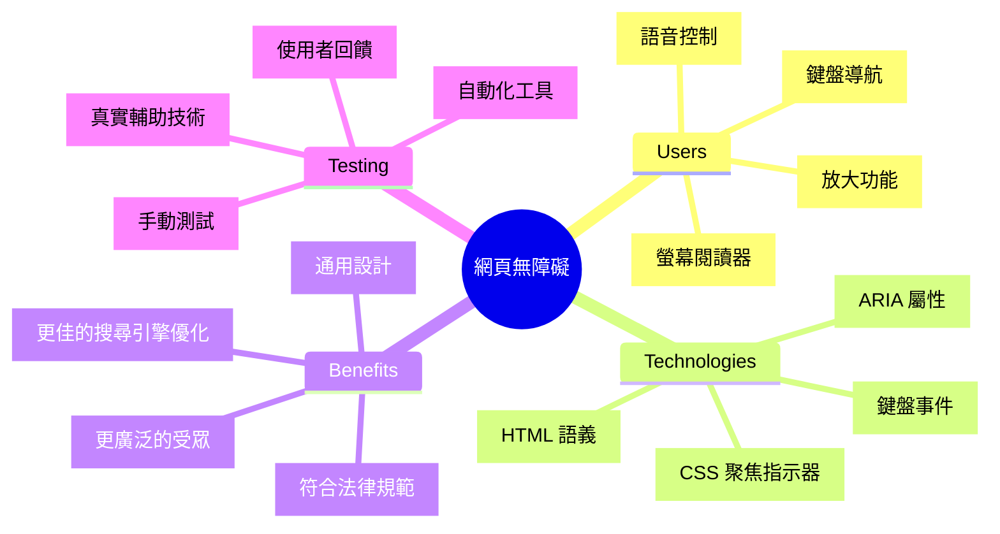
> 你可以在 [Microsoft Learn](https://docs.microsoft.com/learn/modules/web-development-101/accessibility/?WT.mc_id=academic-77807-sagibbon) 參加這堂課！

## 認識輔助技術

在開始寫程式碼之前，讓我們先了解不同能力者如何實際體驗網絡。這不只是理論——理解現實世界的導航模式會讓你成為更棒的開發者！

輔助技術是非常驚人的工具，幫助有障礙的人以你可能沒想到的方式互動網站。掌握這些技術的運作，打造無障礙網頁經驗會變得直覺好用。就像學會用別人的眼睛看自己的程式碼。

### 螢幕閱讀器

[螢幕閱讀器](https://en.wikipedia.org/wiki/Screen_reader) 是相當先進的技術，能將數位文字轉換成語音或點字輸出。雖然主要為視障者使用，它們對患有閱讀障礙（例如閱讀困難症）的人也非常有幫助。

我喜歡將螢幕閱讀器想像成一位非常聰明的敘述者在朗讀書本。它以邏輯順序朗讀內容，並宣告「按鈕」或「連結」等互動元素，提供鍵盤快捷鍵協助用戶快速跳轉頁面。不過重點是——螢幕閱讀器只有在我們正確構建網站的結構和內容意義時，才有辦法發揮神奇功效。這就是你作為開發者的重要角色！

**跨平台熱門螢幕閱讀器：**  
- **Windows**： [NVDA](https://www.nvaccess.org/about-nvda/)（免費且最流行）、[JAWS](https://webaim.org/articles/jaws/)、[Narrator](https://support.microsoft.com/windows/complete-guide-to-narrator-e4397a0d-ef4f-b386-d8ae-c172f109bdb1/?WT.mc_id=academic-77807-sagibbon)（內建）  
- **macOS/iOS**： [VoiceOver](https://support.apple.com/guide/voiceover/welcome/10)（內建且功能強大）  
- **Android**： [TalkBack](https://support.google.com/accessibility/android/answer/6283677)（內建）  
- **Linux**： [Orca](https://wiki.gnome.org/Projects/Orca)（免費及開源）

**螢幕閱讀器瀏覽網頁內容的方式：**

螢幕閱讀器提供多種導航方法，使經驗豐富的使用者能有效率地瀏覽：  
- **連續閱讀**：從上到下朗讀內容，像閱讀書本  
- **地標導覽**：跳轉頁面區塊（標頭、導航、主內容、頁尾）  
- **標題導航**：跳轉標題，了解頁面結構  
- **連結清單**：產生所有連結的列表以快速存取  
- **表單控制**：直接在輸入欄位與按鈕之間導航

> 💡 **讓我驚豔的事實**：68% 螢幕閱讀器使用者主要透過標題導航（[WebAIM 調查](https://webaim.org/projects/screenreadersurvey9/#finding)）。這意味著你的標題結構就像地圖——當你做好它，就真的是在幫助用戶更快找到內容！

### 建立你的測試工作流程

好消息是——有效的無障礙測試並不一定讓人感到複雜！你會想要結合自動化工具（它們很棒地捕捉明顯問題）和部分親身操作的測試。我整理出一套系統化方法，能檢測最多問題又不會耗盡你的一整天：

**必要的手動測試流程：**

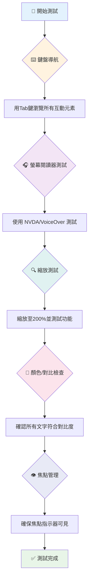
**逐步測試檢查清單：**  
1. **鍵盤導航**：只用 Tab、Shift+Tab、Enter、空白鍵、方向鍵  
2. **螢幕閱讀器測試**：啟用 NVDA、VoiceOver 或 Narrator，閉眼導航  
3. **縮放測試**：在 200% 與 400% 縮放比例下操作  
4. **色彩對比驗證**：檢查所有文字和 UI 元件  
5. **焦點指示器測試**：確保所有互動元素有可見焦點狀態

✅ **從 Lighthouse 開始**：開啟瀏覽器 DevTools，執行 Lighthouse 無障礙稽核，利用結果來指引手動測試的重點。

### 縮放與放大工具

你知道的，有時手機上的文字太小，你會用雙指捏合手勢放大，或者陽光刺眼時找角度看筆電螢幕？很多人每天必須依賴放大工具來讓內容可讀。這包括視力不足者、老年人，以及任何嘗試在戶外看網站的人。

現代縮放技術不再只是放大文字，而是幫助你製作在任何放大比例下都能操作且美觀的響應式設計。

**現代瀏覽器的縮放功能：**  
- **頁面縮放**：比例放大所有內容（文字、圖片、版面）－這是首選方法  
- **僅文字放大**：放大字體大小但維持原始版面  
- **捏合縮放**：手機上的臨時放大手勢  
- **瀏覽器支援**：所有現代瀏覽器支援最高 500% 縮放且功能不破壞

**專用放大軟體：**  
- **Windows**： [放大鏡](https://support.microsoft.com/windows/use-magnifier-to-make-things-on-the-screen-easier-to-see-414948ba-8b1c-d3bd-8615-0e5e32204198)（內建）、[ZoomText](https://www.freedomscientific.com/training/zoomtext/getting-started/)  
- **macOS/iOS**： [放大器](https://www.apple.com/accessibility/mac/vision/)（內建進階功能）

> ⚠️ **設計考量**：WCAG 要求內容在縮放至 200% 時仍保持功能。此時橫向捲動應盡量減少，所有互動元素都應可操作。

✅ **測試你的響應式設計**：將瀏覽器縮放至 200% 與 400%。你的版面能優雅調整嗎？是否仍可在不過度捲動下使用全部功能？

## 現代無障礙測試工具

既然你已了解使用輔助技術的使用者如何導航網絡，接下來讓我們探索幫助你建立和測試無障礙網站的工具。

想像這樣：自動化工具擅長抓明顯的問題（例如缺 ALT 文字），而實際動手測試則確保網站在真實情境中使用起來良好。兩者結合，讓你有信心網站適合所有人。

### 色彩對比測試

好消息：色彩對比是最常見的無障礙問題之一，同時也是最容易改善的。良好的對比對每個人都有益——從視障者到在海邊看手機的人。

**WCAG 對比要求：**

| 文字類型 | WCAG AA（最低標準） | WCAG AAA（強化標準） |
|-----------|-------------------|---------------------|
| **一般文字**（小於 18pt） | 4.5:1 對比比例 | 7:1 對比比例 |
| **大字體文字**（18pt+ 或 14pt+ 粗體） | 3:1 對比比例 | 4.5:1 對比比例 |
| **介面元件**（按鈕、表單邊框） | 3:1 對比比例 | 3:1 對比比例 |

**必要測試工具：**  
- [Colour Contrast Analyser](https://www.tpgi.com/color-contrast-checker/) - 桌面應用程式，帶色彩選取器  
- [WebAIM Contrast Checker](https://webaim.org/resources/contrastchecker/) - 網頁版，立即反饋  
- [Stark](https://www.getstark.co/) - Figma、Sketch、Adobe XD 設計插件  
- [Accessible Colors](https://accessible-colors.com/) - 找適合無障礙的配色組合

✅ **打造更佳色彩調色盤**：以你的品牌色為起點，使用對比檢查器創建無障礙變體。將這些紀錄為你的設計系統無障礙色彩代碼。

### 全面無障礙稽核

最有效的無障礙測試結合多種方式。沒有單一工具能抓出所有問題，建立有多種方法的測試流程才能全面覆蓋。

**瀏覽器內建測試（DevTools）：**  
- **Chrome/Edge**：Lighthouse 無障礙稽核 + 無障礙面板  
- **Firefox**：無障礙檢視器，含詳細樹狀圖  
- **Safari**：Web Inspector 中的稽核分頁，帶 VoiceOver 模擬

**專業測試擴充套件：**  
- [axe DevTools](https://www.deque.com/axe/devtools/) - 業界標準的自動化測試工具  
- [WAVE](https://wave.webaim.org/extension/) - 視覺化反饋與錯誤標示  
- [Accessibility Insights](https://accessibilityinsights.io/) - 微軟全方位測試套件

**命令列及持續整合測試：**  
- [axe-core](https://github.com/dequelabs/axe-core) - JavaScript 自動測試函式庫  
- [Pa11y](https://pa11y.org/) - 命令列無障礙測試工具  
- [Lighthouse CI](https://github.com/GoogleChrome/lighthouse-ci) - 自動化無障礙評分

> 🎯 **測試目標**：目標在 Lighthouse 無障礙評分達 95+ 作為基本線。請記得，自動工具只能偵測約 30-40% 的問題——手動測試仍不可少！

### 🧠 **測試能力檢測：準備找問題了嗎？**

**來看看你對無障礙測試的感覺：**  
- 現在你覺得哪種測試方法最容易入手？  
- 你能想像使用全鍵盤操作一天嗎？  
- 你個人線上遇過哪一種無障礙障礙？

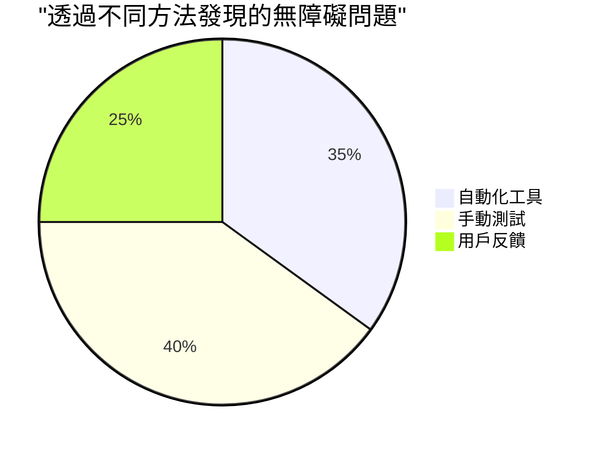
> **信心提升**：專業無障礙測試人員正是使用這套組合。你正在學習業界標準做法！

## 從根基打造無障礙

無障礙成功的關鍵是從一開始就把它建進基礎。我知道你可能會想「我要晚點再加無障礙功能」，但那就像房子建好才打算裝斜坡一樣。可能嗎？可以。但簡單嗎？不見得。

想像無障礙是房屋規劃——在設計階段就納入輪椅通行，比事後改裝容易得多。

### POUR 原則：你的無障礙基礎

網頁內容無障礙指南（WCAG）圍繞著四項基本原則，簡稱 POUR。別擔心，它們並非枯燥學術理論！實際上是實用指導，幫助你製作符合每個人需求的內容。

熟悉 POUR 後，無障礙相關決策會更直覺。就像腦海裡有份核對單指引你的設計選擇。讓我們詳解：

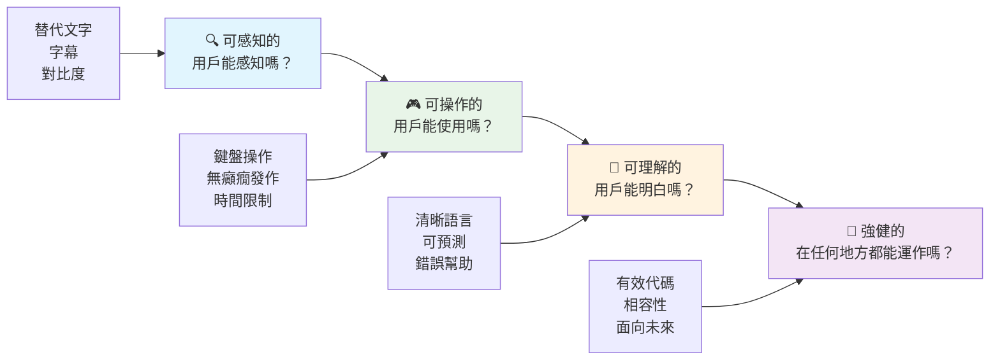
**🔍 Perceivable（感知性）**：資訊必須以使用者可感知的方式呈現

- 為非文字內容（圖片、影片、音訊）提供文字替代  
- 確保所有文字及 UI 元件具足夠色彩對比  
- 為多媒體提供字幕及文字稿  
- 設計內容在放大至 200% 時仍可正常使用  
- 利用多種感官特徵（不僅是顏色）傳達資訊

**🎮 Operable（可操作性）**：所有介面元件必須能以可用的輸入方式操作

- 使所有功能皆可用鍵盤操作  
- 提供使用者足夠時間閱讀及互動  
- 避免會引發癲癇或前庭系統問題的內容  
- 以清晰結構及地標標示協助有效導航  
- 確保互動元素目標大小足夠（最低 44px）

**📖 Understandable（可理解性）**：資訊及界面操作須清晰易懂

- 使用清楚簡單且適合受眾的語言  
- 保持內容顯示和操作方式可預測且一致  
- 提供明確的操作指示及錯誤訊息  
- 協助使用者理解並修正表單錯誤  
- 以合邏輯的閱讀順序及資訊層級組織內容

**💪 Robust（穩健性）**：內容必須能在不同技術及輔助設備上可靠運作

- **以有效的語意 HTML 作為基礎**  
- **確保與現在及未來輔助技術相容**  
- **遵循網頁標準及優良標記實務**
- **在不同瀏覽器、裝置及輔助工具上測試**
- **結構化內容，讓它在不支援進階功能時仍能漸進降級**

### 🎯 **POUR 原則檢查：牢記於心**

**對基礎的快速反思：**
- 你能想出一個未符合每個 POUR 原則的網站功能嗎？
- 哪個原則對你作為開發者來說最自然？
- 這些原則如何改善設計，讓所有人受益，而不僅是殘障用戶？

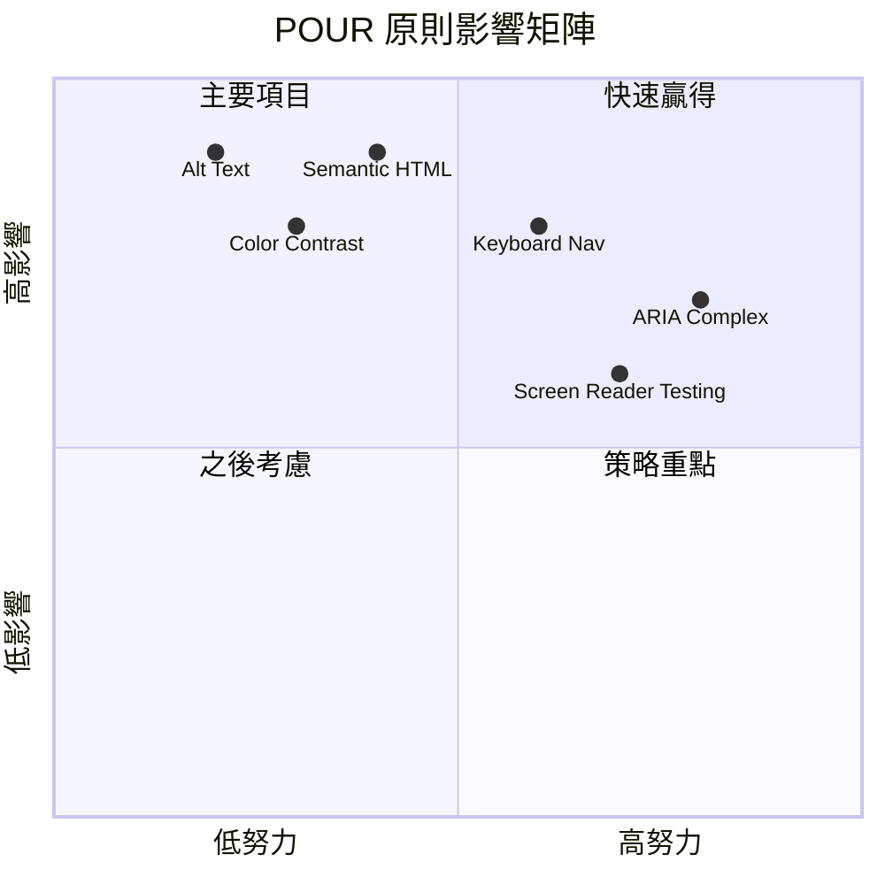
> **記住**：從高影響、低成本的改進開始。語義化 HTML 和替代文字能帶來最高的無障礙提升，同時成本最低！

## 建立無障礙的視覺設計

良好的視覺設計和無障礙是並行不悖的。當你以無障礙為設計考量時，通常會發現這些限制促使你找到更簡潔、更優雅的解決方案，惠及所有使用者。

讓我們探討如何創造對所有人都合適的視覺吸引設計，不管他們的視覺能力如何，或在什麼條件下閱覽你的內容。

### 顏色與視覺無障礙策略

顏色在溝通上非常有力，但絕不應該是傳遞重要資訊的唯一方式。超越顏色的設計創造更健全且包容的體驗，適用於更多情境。

**針對色覺差異設計：**

約有 8% 的男性與 0.5% 的女性有某種程度的色覺差異（常稱「色盲」）。最常見的類型是：
- **綠色盲（Deuteranopia）**：難以分辨紅色與綠色
- **紅色盲（Protanopia）**：紅色看起來較暗
- **藍黃色盲（Tritanopia）**：難以分辨藍與黃（較少見）

**包容性顏色策略：**

```css
/* ❌ Bad: Using only color to indicate status */
.error { color: red; }
.success { color: green; }

/* ✅ Good: Color plus icons and context */
.error {
  color: #d32f2f;
  border-left: 4px solid #d32f2f;
}
.error::before {
  content: "⚠️";
  margin-right: 8px;
}

.success {
  color: #2e7d32;
  border-left: 4px solid #2e7d32;
}
.success::before {
  content: "✅";
  margin-right: 8px;
}
```

**超越基礎對比要求：**
- 用色盲模擬器測試你的色彩選擇
- 在顏色編碼旁使用圖案、紋理或形狀
- 確保互動狀態在無顏色情況下依然可辨識
- 考慮設計在高對比模式下的呈現

✅ **測試你的色彩無障礙**：使用像 [Coblis](https://www.color-blindness.com/coblis-color-blindness-simulator/) 等工具，檢視你的網站在不同色覺用戶眼中的樣子。

### 焦點指示器與互動設計

焦點指示器就像數位光標—它告訴鍵盤使用者目前聚焦在頁面上的位置。設計良好的焦點指示器使互動明確且可預期，提升每個人的體驗。

**現代焦點指示器最佳實踐：**

```css
/* Enhanced focus styles that work across browsers */
button:focus-visible {
  outline: 2px solid #0066cc;
  outline-offset: 2px;
  box-shadow: 0 0 0 4px rgba(0, 102, 204, 0.25);
}

/* Remove focus outline for mouse users, preserve for keyboard users */
button:focus:not(:focus-visible) {
  outline: none;
}

/* Focus-within for complex components */
.card:focus-within {
  box-shadow: 0 0 0 3px rgba(74, 144, 164, 0.5);
  border-color: #4A90A4;
}

/* Ensure focus indicators meet contrast requirements */
.custom-focus:focus-visible {
  outline: 3px solid #ffffff;
  outline-offset: 2px;
  box-shadow: 0 0 0 6px #000000;
}
```

**焦點指示器基本要求：**
- **可見性**：與周圍元素對比度至少達 3:1
- **寬度**：元素周圍厚度至少 2px
- **持續性**：直到焦點移動至其他位置都應保持可見
- **區別性**：須在視覺上與其他 UI 狀態明顯區隔

> 💡 **設計秘訣**：優秀的焦點指示器通常結合輪廓線、盒子陰影及顏色變化，確保在各種背景和情境均清晰可見。

✅ **審核焦點指示器**：透過 Tab 鍵瀏覽你的網站，注意哪些元素有明確焦點指示？有沒有難以看清或完全沒有的？

### 語義化 HTML：無障礙的基礎

語義化 HTML 就像是為輔助技術提供網站的 GPS。當你使用適合用途的 HTML 元素時，等於是為螢幕朗讀器、鍵盤及其他工具提供詳細導航路線，協助用戶有效瀏覽。

我喜歡這個比喻：語義化 HTML 的差別就像整齊分類並有清楚標示的圖書館，與書籍雜亂無章散落的倉庫。兩處的書籍數量相同，但你會願意在哪裡找書？就是這個道理！

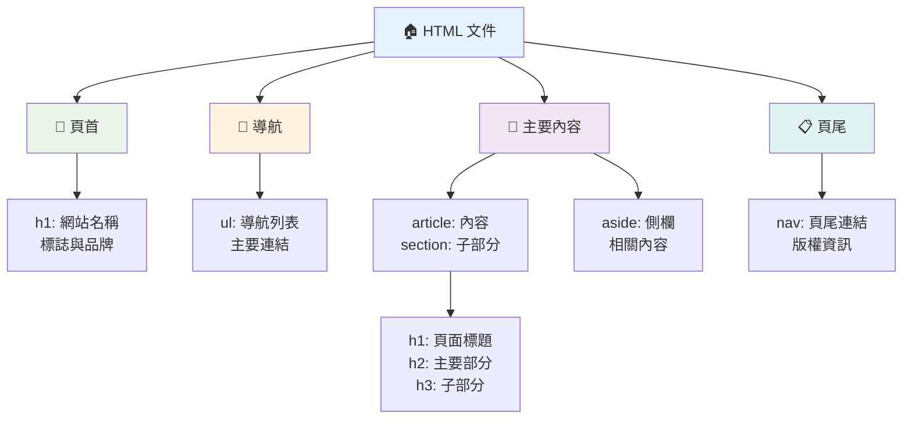
**無障礙頁面結構的構件：**

```html
<!-- Landmark elements provide page navigation structure -->
<header>
  <h1>Your Site Name</h1>
  <nav aria-label="Main navigation">
    <ul>
      <li><a href="/home">Home</a></li>
      <li><a href="/about">About</a></li>
      <li><a href="/services">Services</a></li>
    </ul>
  </nav>
</header>

<main>
  <article>
    <header>
      <h1>Article Title</h1>
      <p>Published on <time datetime="2024-10-14">October 14, 2024</time></p>
    </header>
    
    <section>
      <h2>First Section</h2>
      <p>Content that relates to this section...</p>
    </section>
    
    <section>
      <h2>Second Section</h2>
      <p>More related content...</p>
    </section>
  </article>
  
  <aside>
    <h2>Related Links</h2>
    <nav aria-label="Related articles">
      <ul>
        <li><a href="/related-1">First related article</a></li>
        <li><a href="/related-2">Second related article</a></li>
      </ul>
    </nav>
  </aside>
</main>

<footer>
  <p>&copy; 2024 Your Site Name. All rights reserved.</p>
  <nav aria-label="Footer links">
    <ul>
      <li><a href="/privacy">Privacy Policy</a></li>
      <li><a href="/contact">Contact Us</a></li>
    </ul>
  </nav>
</footer>
```

**語義化 HTML 如何改造無障礙體驗：**

| 語義元素          | 用途         | 螢幕朗讀器受益                   |
|-------------------|--------------|--------------------------------|
| `<header>`        | 頁面或區塊標頭 | 「橫幅地標」—快速導覽頁首       |
| `<nav>`           | 導航連結     | 「導航地標」—導航區域清單       |
| `<main>`          | 主要頁面內容 | 「主地標」—直接跳至內容          |
| `<article>`       | 独立內容     | 宣告文章範圍                    |
| `<section>`       | 主題內容群組 | 提供內容結構                    |
| `<aside>`         | 相關側欄內容 | 「補充地標」                   |
| `<footer>`        | 頁面或區塊頁腳 | 「內容資訊地標」                 |

**利用語義化 HTML 解鎖螢幕朗讀器超能力：**
- **地標導航**：能立刻跳轉至頁面主要區塊
- **標題大綱**：根據標題結構建構目錄
- **元素列表**：製作所有連結、按鈕或表單控制項清單
- **上下文認知**：理解內容區塊間關聯

> 🎯 **快速測試**：嘗試用螢幕朗讀器的地標捷徑導航（NVDA/JAWS 內使用 D 切換地標，H 切換標題，K 切換連結）。導航是否合邏輯？

### 🏗️ **語義化 HTML 精熟測試：建立堅實基礎**

**評估你的語義理解：**
- 只看 HTML 能找出頁面中的地標嗎？
- 你如何向朋友解釋 `<section>` 與 `<div>` 的差異？
- 若螢幕朗讀器用戶反映導航問題，你會先檢查什麼？

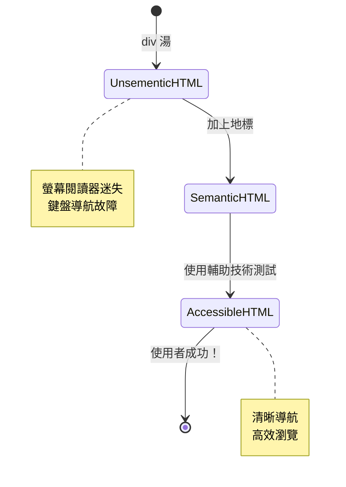
> **專業秘訣**：良好的語義化 HTML 可自動解決約 70% 的無障礙問題。掌握這基礎，你就邁向成功！

✅ **審核你的語義結構**：利用瀏覽器 DevTools 的無障礙面板查看無障礙樹，確保你的標記建立合理結構。

### 標題層級：建立合乎邏輯的內容大綱

標題對於可無障礙內容至關重要——它們就像支撐整個結構的脊椎。螢幕朗讀器用戶高度依賴標題來理解與導航內容。想像它是頁面的目錄。

**標題的黃金法則：**
永遠不要跳級。標題層級需合乎邏輯地從 `<h1>` 到 `<h2>` 再到 `<h3>`，依此類推。就像學校裡做大綱一樣，你不會從「I. 主點」跳到「C. 次次點」而中間沒出現「A. 次點」，對吧？

**完美標題結構示例：**

```html
<!-- ✅ Excellent: Logical, hierarchical progression -->
<main>
  <h1>Complete Guide to Web Accessibility</h1>
  
  <section>
    <h2>Understanding Screen Readers</h2>
    <p>Introduction to screen reader technology...</p>
    
    <h3>Popular Screen Reader Software</h3>
    <p>NVDA, JAWS, and VoiceOver comparison...</p>
    
    <h3>Testing with Screen Readers</h3>
    <p>Step-by-step testing instructions...</p>
  </section>
  
  <section>
    <h2>Color and Contrast Guidelines</h2>
    <p>Designing with sufficient contrast...</p>
    
    <h3>WCAG Contrast Requirements</h3>
    <p>Understanding the different contrast levels...</p>
    
    <h3>Testing Tools and Techniques</h3>
    <p>Tools for verifying contrast ratios...</p>
  </section>
</main>
```

```html
<!-- ❌ Problematic: Skipping levels, inconsistent structure -->
<h1>Page Title</h1>
<h3>Subsection</h3> <!-- Skipped h2 -->
<h2>This should come before h3</h2>
<h1>Another main heading?</h1> <!-- Multiple h1s -->
```

**標題最佳實踐：**
- **每頁一個 `<h1>`**：通常為主頁標題或主要內容標題
- **層級合邏輯**：永遠不要跳級（h1 → h2 → h3，而非 h1 → h3）
- **內容描述明確**：使標題即使脫離上下文也有意義
- **用 CSS 美化**：用 CSS 控制外觀，HTML 標題層級用於結構

**螢幕朗讀器導航統計：**
- 68% 的螢幕朗讀器用戶使用標題導航 ([WebAIM 調查](https://webaim.org/projects/screenreadersurvey9/#finding))
- 用戶期待找到合邏輯的標題大綱
- 標題是最快速理解頁面結構的方式

> 💡 **專業秘訣**：使用瀏覽器擴充功能如 "HeadingsMap" 來視覺化你的標題結構。它應該像個條理清楚的目錄。

✅ **測試你的標題結構**：用螢幕朗讀器的標題導航（NVDA 中按 H）跳過標題。標題層級的演進是否合乎邏輯地講述內容？

### 進階視覺無障礙技巧

除了基本的對比與色彩，還有更複雜的技術能創造真正包容的視覺體驗。這些方法確保你的內容適用於不同瀏覽條件和輔助技術。

**重要視覺溝通策略：**

- **多模態反饋**：結合視覺、文字，有時還有聲音提示
- **漸進式揭露**：以易消化小區塊呈現資訊
- **一致的互動模式**：採用用戶熟悉的 UI 慣例
- **響應式排版**：文字在不同裝置適當縮放
- **加載與錯誤狀態**：對用戶操作提供清楚反饋

**提升無障礙的 CSS 工具：**

```css
/* Screen reader only text - visually hidden but accessible */
.sr-only {
  position: absolute;
  width: 1px;
  height: 1px;
  padding: 0;
  margin: -1px;
  overflow: hidden;
  clip: rect(0, 0, 0, 0);
  white-space: nowrap;
  border: 0;
}

/* Skip link for keyboard navigation */
.skip-link {
  position: absolute;
  top: -40px;
  left: 6px;
  background: #000000;
  color: #ffffff;
  padding: 8px 16px;
  text-decoration: none;
  border-radius: 4px;
  font-weight: bold;
  transition: top 0.3s ease;
  z-index: 1000;
}

.skip-link:focus {
  top: 6px;
}

/* Reduced motion respect */
@media (prefers-reduced-motion: reduce) {
  .skip-link {
    transition: none;
  }
  
  * {
    animation-duration: 0.01ms !important;
    animation-iteration-count: 1 !important;
    transition-duration: 0.01ms !important;
  }
}

/* High contrast mode support */
@media (prefers-contrast: high) {
  .button {
    border: 2px solid;
  }
}
```

> 🎯 **無障礙模式**："跳過連結" 對鍵盤用戶而言很重要。它應是頁面首個可聚焦元素，且直接跳至主要內容區。

✅ **實作跳過導航**：為你的頁面加入跳過連結，並在頁面載入後立刻按 Tab 測試。它們應顯示並允許你快速跳到主要內容。

## 撰寫有意義的連結文字

連結就像網路上的高速公路，但寫得不好就像路牌只寫著「地點」而非「芝加哥市中心」。幫助不大，對吧？

讓我印象深刻的是：螢幕朗讀器能將頁面所有連結抽取成一份大清單。想像有人給你一個該頁所有連結目錄。你是否能從字面上瞭解每個連結要去哪裡？這就是你的連結文字要通過的測試！

### 了解連結導航模式

螢幕朗讀器提供強大的連結導航功能，仰賴精確撰寫的連結文字：

**連結導航方式：**
- **順序閱讀**：連結隨內容流被讀出
- **連結清單生成**：頁面所有連結彙整成可搜尋目錄
- **快速導航**：透過鍵盤快捷鍵（NVDA 中的 K）跳轉連結
- **搜尋功能**：輸入部分文字尋找特定連結

**為何上下文重要：**
當螢幕朗讀器用戶看到一份連結清單，可能是這樣：
- 「下載報告」
- 「了解更多」
- 「點此」
- 「隱私政策」
- 「點此」

只有兩個連結在無上下文情況下能提供有用訊息！

> 📊 **用戶影響**：螢幕朗讀器用戶掃描連結清單快速理解頁面內容。泛泛的連結文字會迫使他們回到原上下文，顯著減慢瀏覽速度。

### 避免常見連結文字錯誤

理解什麼行不通能幫助你辨識並修正現有內容的無障礙問題。

**❌ 無上下文的泛用連結文字：**

```html
<!-- Meaningless when read from a link list -->
<p>Our sustainability efforts are detailed in our recent report. 
   <a href="/sustainability-2024.pdf">Click here</a> to view it.</p>

<!-- Repeated generic text throughout the page -->
<div class="article-card">
  <h3>Web Accessibility Guide</h3>
  <p>Learn the fundamentals...</p>
  <a href="/accessibility-guide">Read more</a>
</div>
<div class="article-card">
  <h3>Color Contrast Tips</h3>
  <p>Improve your design...</p>
  <a href="/color-contrast">Read more</a>
</div>

<!-- URLs as link text (difficult for screen readers to announce) -->
<p>Visit https://www.w3.org/WAI/WCAG21/quickref/ for WCAG guidelines.</p>

<!-- Vague action words -->
<a href="/contact">Go</a> | <a href="/about">See</a> | <a href="/help">View</a>
```

**這些模式失敗的原因：**
- **「點此」** 不告訴用戶目的地
- **「閱讀更多」** 重複多次製造混淆
- **原始網址** 螢幕朗讀器難以清楚朗讀
- **單字如「前往」或「查看」** 缺乏描述性上下文

### 撰寫優秀的連結文字

描述性連結文字對每個人有利—有視力者能快速掃描連結，螢幕朗讀器用戶能立刻明白連結目的。

**✅ 清晰且描述性連結文本範例：**

```html
<!-- Descriptive text that explains the destination -->
<p>Our comprehensive <a href="/sustainability-2024.pdf">2024 sustainability report (PDF, 2.1MB)</a> details our environmental initiatives.</p>

<!-- Specific, unique link text for each card -->
<div class="article-card">
  <h3>Web Accessibility Guide</h3>
  <p>Learn the fundamentals of inclusive design...</p>
  <a href="/accessibility-guide">Read our complete web accessibility guide</a>
</div>
<div class="article-card">
  <h3>Color Contrast Tips</h3>
  <p>Improve your design with better color choices...</p>
  <a href="/color-contrast">Explore color contrast best practices</a>
</div>

<!-- Meaningful text instead of raw URLs -->
<p>The <a href="https://www.w3.org/WAI/WCAG21/quickref/">WCAG 2.1 Quick Reference guide</a> provides comprehensive accessibility guidelines.</p>

<!-- Descriptive action links -->
<a href="/contact">Contact our support team</a> | 
<a href="/about">About our company</a> | 
<a href="/help">Get help with your account</a>
```

**連結文字最佳實務：**
- **具體明確**：「下載季度財務報告」 vs.「下載」
- **包含檔案類型與大小**：對可下載檔案註明（PDF，1.2MB）
- **標示外部開啟**：適時註明「（另開視窗）」
- **使用主動語態**：「聯絡我們」 vs.「聯絡頁面」
- **保持簡潔**：盡量控制在 2-8 個詞內

### 進階連結無障礙模式

有時視覺設計限制或技術需求需特殊解決方案。以下是針對常見挑戰場景的複雜技術：

**使用 ARIA 強化上下文：**

```html
<!-- When button text must be short but needs more context -->
<a href="/report.pdf" 
   aria-label="Download 2024 annual financial report, PDF format, 2.3MB">
  Download Report
</a>

<!-- When the full context comes from surrounding content -->
<h3 id="sustainability-heading">Sustainability Initiative</h3>
<p>Our efforts to reduce environmental impact...</p>
<a href="/sustainability-details" 
   aria-labelledby="sustainability-heading"
   aria-describedby="sustainability-summary">
  Learn more
</a>
<p id="sustainability-summary">Detailed breakdown of our 2024 environmental goals and achievements</p>
```

**標示檔案類型與外部連結：**

```html
<!-- Method 1: Include information in visible link text -->
<a href="/annual-report.pdf">
  Download our 2024 annual report (PDF, 2.3MB)
</a>

<!-- Method 2: Use screen reader-only text for file details -->
<a href="/annual-report.pdf">
  Download our 2024 annual report
  <span class="sr-only">(PDF format, 2.3MB)</span>
</a>

<!-- Method 3: External link indication -->
<a href="https://example.com" 
   target="_blank" 
   aria-describedby="external-link-warning">
  Visit external resource
</a>
<span id="external-link-warning" class="sr-only">
  (opens in new window)
</span>

<!-- Method 4: Using CSS for visual indicators -->
<a href="https://example.com" class="external-link">
  External resource
</a>
```

```css
/* Visual indicator for external links */
.external-link::after {
  content: " ↗";
  font-size: 0.8em;
  color: #666;
}

/* Screen reader announcement for external links */
.external-link::before {
  content: "External link: ";
  position: absolute;
  left: -10000px;
  width: 1px;
  height: 1px;
  overflow: hidden;
}
```

> ⚠️ **重要提醒**：使用 `target="_blank"` 時，務必告知用戶該連結會在新視窗或分頁開啟。意外的導覽變化會令人迷失方向。

✅ **測試你的連結上下文**：用瀏覽器開發者工具列出頁面所有連結。你是否無需上下文就能理解每個連結的目的？

## ARIA：強化 HTML 無障礙

[可存取豐富網頁應用程式標準（ARIA）](https://developer.mozilla.org/docs/Web/Accessibility/ARIA) 就像是複雜網頁應用與輔助技術間的萬用翻譯器。當純 HTML 無法完整表達你的互動元件時，ARIA 會協助填補空缺。

我喜歡把 ARIA 想像成在 HTML 上添加細心的註解，就像舞台劇劇本中的舞台指示，協助演員理解角色與彼此間關係。

**ARIA 最重要的規則是**：先使用語義化 HTML，再用 ARIA 補強。把 ARIA 看成調味料，不是主菜。它應該是澄清與強化你的 HTML 結構，絕不取代。先把基礎紮穩！

### 策略性 ARIA 實作

ARIA 很強大，但用力不當會讓無障礙體驗變差甚至更糟。以下是何時及如何有效使用：

**✅ 使用 ARIA 時機：**
- 建立自訂互動元件（手風琴、標籤頁、輪播）
- 建造不重新載入頁面的動態內容
- 為複雜 UI 關係提供額外上下文
- 表示載入狀態或即時內容更新
- 建立像 App 般的介面與自訂控制項

**❌ 避免使用 ARIA 狀況：**
- 標準 HTML 元素已提供所需語義時
- 不確定如何正確實作時
- 重複語義化 HTML 已提供的資訊時
- 未與實際輔助技術測試時

> 🎯 **ARIA 黃金法則**：「除非絕對必要，不要改變語義；確保永遠能鍵盤操作；並以實際輔助技術測試。」
**ARIA 的五大類別：**

1. **角色 (Roles)**：這個元素是什麼？（`button`、`tab`、`dialog`）
2. **屬性 (Properties)**：它有什麼特徵？（`aria-required`、`aria-haspopup`）
3. **狀態 (States)**：目前的狀態如何？（`aria-expanded`、`aria-checked`）
4. **地標 (Landmarks)**：它在頁面結構中的位置？（`banner`、`navigation`、`main`）
5. **動態區域 (Live regions)**：變化應該如何被通知？（`aria-live`、`aria-atomic`）

### 現代網頁應用的基本 ARIA 模式

這些模式解決了在互動式網頁應用中最常見的無障礙挑戰：

**命名和描述元素：**

```html
<!-- aria-label: Provides accessible name when visible text isn't sufficient -->
<button aria-label="Close newsletter subscription dialog">×</button>

<!-- aria-labelledby: References existing text as the accessible name -->
<section aria-labelledby="news-heading">
  <h2 id="news-heading">Latest News</h2>
  <!-- news content -->
</section>

<!-- aria-describedby: Links to additional descriptive text -->
<input type="password" 
       aria-describedby="pwd-requirements pwd-strength"
       required>
<div id="pwd-requirements">
  Password must contain at least 8 characters, including uppercase, lowercase, and numbers.
</div>
<div id="pwd-strength" aria-live="polite">
  <!-- Dynamic password strength indicator -->
</div>
```

**動態內容的動態區域：**

```html
<!-- Polite announcements (don't interrupt current speech) -->
<div aria-live="polite" id="status-updates">
  <!-- Status messages appear here -->
</div>

<!-- Assertive announcements (interrupt and announce immediately) -->
<div aria-live="assertive" id="urgent-alerts">
  <!-- Error messages and critical alerts -->
</div>

<!-- Loading states with live regions -->
<button id="submit-btn" aria-describedby="loading-status">
  Submit Application
</button>
<div id="loading-status" aria-live="polite" aria-atomic="true">
  <!-- "Processing your application..." appears here -->
</div>
```

**互動小工具示例（手風琴）：**

```html
<div class="accordion">
  <h3>
    <button aria-expanded="false" 
            aria-controls="panel-1" 
            id="accordion-trigger-1"
            class="accordion-trigger">
      Accessibility Guidelines
    </button>
  </h3>
  <div id="panel-1" 
       role="region"
       aria-labelledby="accordion-trigger-1" 
       hidden>
    <p>WCAG 2.1 provides comprehensive guidelines...</p>
  </div>
</div>
```

```javascript
// 用於管理手風琴狀態的 JavaScript
function toggleAccordion(trigger) {
  const panel = document.getElementById(trigger.getAttribute('aria-controls'));
  const isExpanded = trigger.getAttribute('aria-expanded') === 'true';
  
  // 切換狀態
  trigger.setAttribute('aria-expanded', !isExpanded);
  panel.hidden = isExpanded;
  
  // 向螢幕閱讀器宣告變更
  const status = document.getElementById('status-updates');
  status.textContent = isExpanded ? 'Section collapsed' : 'Section expanded';
}
```

### ARIA 實作最佳實踐

ARIA 功能強大，但需要仔細實作。遵循以下指南有助於確保你的 ARIA 是助益而非阻礙無障礙：

**🛡️ 核心原則：**

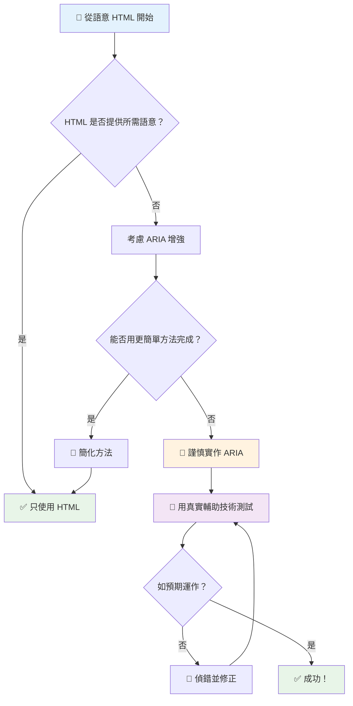
1. **優先語意化 HTML**：永遠偏好 `<button>` 而非 `<div role="button">`
2. **不要破壞語意**：絕不覆寫原有 HTML 意義（避免 `<h1 role="button">`）
3. **保持鍵盤可及性**：所有互動式 ARIA 元素必須完全支持鍵盤操作
4. **與真實用戶測試**：輔助技術間的 ARIA 支援差異很大
5. **從簡開始**：複雜的 ARIA 實作更容易出錯

**🔍 測試流程：**

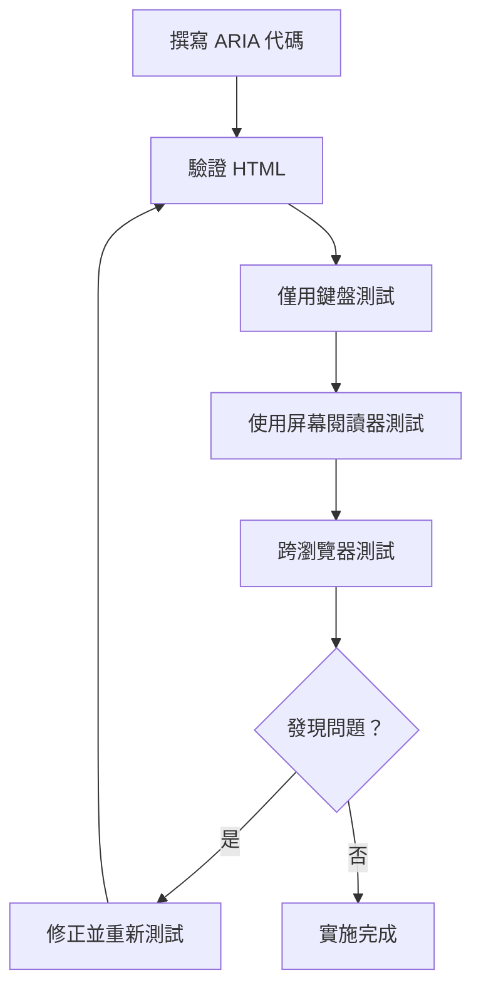
**🚫 常見 ARIA 錯誤避免：**

- **訊息矛盾**：不要和 HTML 語意相牴觸
- **過度標記**：過多 ARIA 訊息會讓用戶感到負擔
- **靜態 ARIA**：忘記在內容變化時更新 ARIA 狀態
- **未測試實作**：理論可行，實際卻失效的 ARIA
- **缺少鍵盤支援**：ARIA 角色有但沒有對應鍵盤互動

> 💡 **測試資源**：使用像 [accessibility-checker](https://www.npmjs.com/package/accessibility-checker) 這類工具做自動 ARIA 驗證，但一定要用真實螢幕閱讀器測試完整體驗。

### 🎭 **ARIA 技能檢測：你準備好面對複雜互動？**

**評估你的 ARIA 信心：**
- 什麼時候你會選擇 ARIA 而非語義化 HTML？（提示：幾乎不會！）
- 你可以解釋為何 `<div role="button">` 通常比不上 `<button>` 嗎？
- ARIA 測試中最重要的事情是什麼？

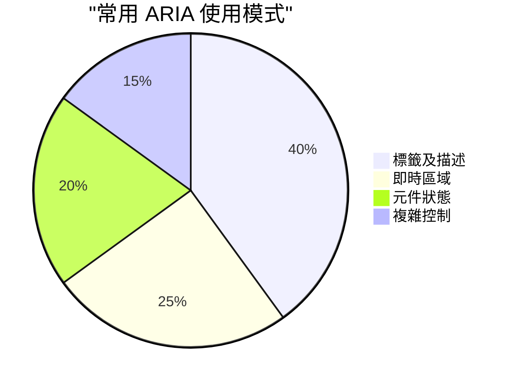
> **關鍵見解**：大多數 ARIA 用於標記和描述元素。複雜的小工具模式比想像中少得多！

✅ **向專家學習**：研究 [ARIA Authoring Practices Guide](https://w3c.github.io/aria-practices/) 中經過實戰檢驗的複雜互動小工具範例和實作。

## 讓圖片和媒體更易於無障礙使用

視覺和音頻內容是現代網路體驗的重要部分，但若未謹慎實作，很可能帶來障礙。目標是確保媒體的資訊和情感影響力能傳達給每位使用者。熟能生巧，這將成為你的第二天性。

不同媒體類型需不同的無障礙處理方式。就像料理——你不會用同樣方式對待細緻魚肉與厚實牛排。理解這些差異有助於你為不同情境選擇正確解決方案。

### 策略性圖片無障礙

網站上的每張圖片皆有其目的。了解這些目的，能幫助你撰寫更好的替代文字，創造更包容的體驗。

**四種圖片類型及相對應替代文字策略：**

**資訊型圖片** - 傳達重要訊息：
```html

```

**裝飾型圖片** - 純視覺效果，無資訊價值：
```html

```

**功能型圖片** - 擔任按鈕或控制元件：
```html
<button>
  
</button>
```

**複雜圖片** - 圖表、圖解、資訊圖：
```html

<div id="chart-description">
  <p>Detailed description: Sales data shows a steady increase across all quarters...</p>
</div>
```

### 影片與音訊無障礙

**影片需求：**
- **字幕**：對話及音效的文字版本
- **語音描述**：盲用戶的視覺元素解說
- **文字稿**：完整影音內容的文字版

```html
<video controls>
  <source src="video.mp4" type="video/mp4">
  <track kind="captions" src="captions.vtt" srclang="en" label="English">
  <track kind="descriptions" src="descriptions.vtt" srclang="en" label="Audio descriptions">
</video>
```

**音訊需求：**
- **文字稿**：所有語音內容的文字版本
- **視覺指示器**：針對純音訊內容提供視覺提示

### 現代圖片技術

**用 CSS 樣式製作裝飾圖片：**
```css
.hero-section {
  background-image: url('decorative-hero.jpg');
  /* Decorative images in CSS don't need alt text */
}
```

**可響應圖片與無障礙：**
```html
<picture>
  <source media="(min-width: 800px)" srcset="large-chart.png">
  <source media="(min-width: 400px)" srcset="medium-chart.png">
  
</picture>
```

✅ **測試圖片無障礙**：用螢幕閱讀器瀏覽含有圖片的頁面。資訊是否足夠理解內容？

## 鍵盤導航與焦點管理

許多用戶完全用鍵盤瀏覽網站。這包括肢體障礙者、習慣用鍵盤的高階用戶，以及滑鼠失效者。確保網站鍵盤操作良好十分重要，也常使網站整體更高效。

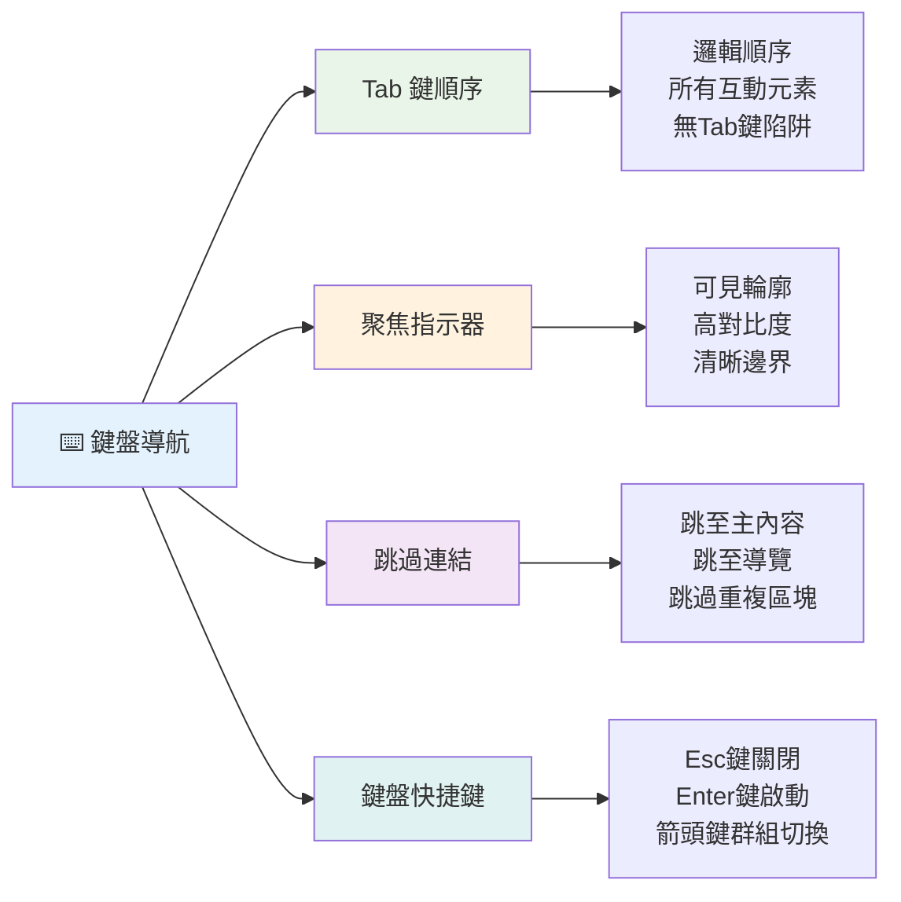
### 必要的鍵盤導航模式

**標準鍵盤操作：**
- **Tab**：將焦點往後移動至互動元素
- **Shift + Tab**：將焦點向前移動
- **Enter**：啟動按鈕和連結
- **Space**：啟動按鈕、勾選複選框
- **方向鍵**：在元件群組內導航（單選框、選單）
- **Escape**：關閉模式窗、下拉選單或取消操作

### 焦點管理最佳實踐

**可見焦點指示器：**
```css
/* Ensure focus is always visible */
button:focus-visible {
  outline: 2px solid #4A90A4;
  outline-offset: 2px;
}

/* Custom focus styles for different components */
.card:focus-within {
  box-shadow: 0 0 0 3px rgba(74, 144, 164, 0.5);
}
```

**快捷跳過連結：**
```html
<a href="#main-content" class="skip-link">Skip to main content</a>
<a href="#navigation" class="skip-link">Skip to navigation</a>

<nav id="navigation">
  <!-- navigation content -->
</nav>
<main id="main-content">
  <!-- main content -->
</main>
```

**正確的 Tab 順序：**
```html
<!-- Use semantic HTML for natural tab order -->
<form>
  <label for="name">Name:</label>
  <input type="text" id="name" tabindex="0">
  
  <label for="email">Email:</label>
  <input type="email" id="email" tabindex="0">
  
  <button type="submit" tabindex="0">Submit</button>
</form>
```

### 模式視窗中的焦點鎖定

打開模式對話框時，焦點應被鎖定在內部：

```javascript
// 現代焦點陷阱實作
function trapFocus(element) {
  const focusableElements = element.querySelectorAll(
    'button, [href], input, select, textarea, [tabindex]:not([tabindex="-1"])'
  );
  
  const firstElement = focusableElements[0];
  const lastElement = focusableElements[focusableElements.length - 1];

  element.addEventListener('keydown', (e) => {
    if (e.key === 'Tab') {
      if (e.shiftKey && document.activeElement === firstElement) {
        e.preventDefault();
        lastElement.focus();
      } else if (!e.shiftKey && document.activeElement === lastElement) {
        e.preventDefault();
        firstElement.focus();
      }
    }
    
    if (e.key === 'Escape') {
      closeModal();
    }
  });
  
  // 當模態視窗打開時，聚焦於第一個元素
  firstElement.focus();
}
```

✅ **鍵盤導航測試**：僅用 Tab 鍵嘗試瀏覽你網站。是否能到達所有互動元素？焦點順序是否合邏輯？焦點指示是否清晰可見？

## 表單無障礙

表單是使用者互動的關鍵，需特別留意無障礙。

### 標籤與表單控制相關聯

**每個表單控制都需要標籤：**
```html
<!-- Explicit labeling (preferred) -->
<label for="username">Username:</label>
<input type="text" id="username" name="username" required>

<!-- Implicit labeling -->
<label>
  Password:
  <input type="password" name="password" required>
</label>

<!-- Using aria-label when visual label isn't desired -->
<input type="search" aria-label="Search products" placeholder="Search...">
```

### 錯誤處理與驗證

**無障礙錯誤訊息：**
```html
<label for="email">Email Address:</label>
<input type="email" id="email" name="email" 
       aria-describedby="email-error" 
       aria-invalid="true" required>
<div id="email-error" role="alert">
  Please enter a valid email address
</div>
```

**表單驗證最佳實踐：**
- 使用 `aria-invalid` 表示數值錯誤欄位
- 提供明確、具體的錯誤訊息
- 對重要錯誤使用 `role="alert"` 做通知
- 錯誤訊息即時與提交時均要呈現

### 欄位組及分群

**群組相關表單控制元件：**
```html
<fieldset>
  <legend>Shipping Address</legend>
  <label for="street">Street Address:</label>
  <input type="text" id="street" name="street">
  
  <label for="city">City:</label>
  <input type="text" id="city" name="city">
</fieldset>

<fieldset>
  <legend>Preferred Contact Method</legend>
  <input type="radio" id="contact-email" name="contact" value="email">
  <label for="contact-email">Email</label>
  
  <input type="radio" id="contact-phone" name="contact" value="phone">
  <label for="contact-phone">Phone</label>
</fieldset>
```

## 你的無障礙旅程：主要收穫

恭喜！你剛建立了創造真正包容性網路體驗的基礎知識。真是令人振奮！網頁無障礙不只是勾選合規項目，還是認知人們與數位內容互動的多元方式，並為這驚人多樣性設計。

你現在是懂得優秀設計適用於所有人的開發者社群成員。歡迎加入！

**🎯 你的無障礙工具包現在包含：**

| 核心原則           | 實作方式                             | 影響                           |
|-------------------|----------------------------------|------------------------------|
| **語義化 HTML 基礎** | 對應用途使用正確 HTML 元素               | 螢幕閱讀器可有效導航，鍵盤自動支持   |
| **包容視覺設計**     | 充足的對比度、具意義的顏色、可見焦點指示         | 任何光線條件下清晰可辨              |
| **描述性內容**       | 有意義的連結文本、替代文字、標題               | 用戶無需視覺輔助即可理解內容          |
| **鍵盤可及性**       | Tab 順序、快捷鍵、焦點管理                  | 肢體無障礙與高效用戶皆受惠            |
| **ARIA 加強**       | 策略性填補語意不足                         | 複雜應用能與輔助技術正常互動           |
| **全面測試**        | 自動化工具＋手動驗證＋真實用戶測試             | 提早捕捉問題，防止影響用戶              |

**🚀 你的下一步：**

1. **將無障礙納入開發流程**：使測試成為自然的一部分
2. **向真實用戶學習**：尋求使用輔助技術者的回饋
3. **保持最新**：無障礙技巧隨新技術和標準演進
4. **倡導包容性**：分享知識，讓團隊重視無障礙

> 💡 **記住**：無障礙限制經常催生創新和優雅的解決方案。路緣坡道、字幕和語音控制都起源於無障礙，後成主流改善。

**商業論點明確**：無障礙網站能觸及更多用戶、搜索排名更高、維護成本更低、避免法律風險。但說實話，真正關心無障礙的理由更深遠。無障礙網站體現了網路最美好的價值——開放、包容，人人都應有平等資訊取得權。

你已裝備好打造未來的包容性網路。你建立的每個易用網站都讓互聯網對所有人更友善。想想這真是太棒了！

## 延伸資源

持續你的無障礙學習之旅，這些是必備資源：

**📚 官方標準與指南：**
- [WCAG 2.1 指南](https://www.w3.org/WAI/WCAG21/quickref/) - 官方無障礙標準快速參考
- [ARIA Authoring Practices Guide](https://w3c.github.io/aria-practices/) - 互動小工具完整範例
- [WebAIM 指南](https://webaim.org/) - 實用且適合初學者的無障礙指導

**🛠️ 工具與測試資源：**
- [axe DevTools](https://www.deque.com/axe/devtools/) - 業界標準的無障礙測試工具
- [A11y Project 清單](https://www.a11yproject.com/checklist/) - 步驟式無障礙檢查清單
- [Accessibility Insights](https://accessibilityinsights.io/) - 微軟完整測試套件
- [Color Oracle](https://colororacle.org/) - 色盲模擬器，供設計測試用

**🎓 學習社群：**
- [WebAIM 螢幕閱讀器調查](https://webaim.org/projects/screenreadersurvey9/) - 真實用戶偏好與行為
- [Inclusive Components](https://inclusive-components.design/) - 現代無障礙元件範例
- [A11y Coffee](https://a11y.coffee/) - 快速無障礙技巧與見解
- [Web Accessibility Initiative (WAI)](https://www.w3.org/WAI/) - W3C 無障礙綜合資源

**🎥 實作學習：**
- [Accessibility Developer Guide](https://www.accessibility-developer-guide.com/) - 實務操作指南
- [Deque University](https://dequeuniversity.com/) - 專業無障礙培訓課程

## GitHub Copilot Agent 挑戰 🚀

使用 Agent 模式完成以下挑戰：

**描述**：建立一個可訪問的模式對話框組件，示範合適的焦點管理、ARIA 屬性和鍵盤導航模式。

**提示**：利用 HTML、CSS 和 JavaScript 建立一個完整模式對話框組件，包括：正確的焦點鎖定、ESC 鍵關閉、點擊外部關閉、螢幕閱讀器 ARIA 屬性，以及明顯的焦點指示。對話框內含有帶標籤和錯誤處理的表單。確保符合 WCAG 2.1 AA 標準。

## 🚀 挑戰

以所學策略，改寫此 HTML 使其盡可能易於無障礙使用。

```html
<!DOCTYPE html>
<html lang="en">
  <head>
    <meta charset="UTF-8">
    <meta name="viewport" content="width=device-width, initial-scale=1.0">
    <title>Turtle Ipsum - The World's Premier Turtle Fan Club</title>
    <link href='../assets/style.css' rel='stylesheet' type='text/css'>
  </head>
  <body>
    <header class="site-header">
      <h1 class="site-title">Turtle Ipsum</h1>
      <p class="site-subtitle">The World's Premier Turtle Fan Club</p>
    </header>
    
    <nav class="main-nav" aria-label="Main navigation">
      <h2 class="nav-header">Resources</h2>
      <ul class="nav-list">
        <li><a href="https://www.youtube.com/watch?v=CMNry4PE93Y">"I like turtles" video</a></li>
        <li><a href="https://en.wikipedia.org/wiki/Turtle">Basic turtle information</a></li>
        <li><a href="https://en.wikipedia.org/wiki/Turtles_(chocolate)">Chocolate turtles candy</a></li>
      </ul>
    </nav>
    
    <main class="main-content">
      <article>
        <h1>Welcome to Turtle Ipsum</h1>
        <p class="intro">
          <a href="/about">Learn more about our turtle community</a> and discover fascinating facts about these amazing creatures.
        </p>
        <p class="article-text">
          Turtle ipsum dolor sit amet, consectetur adipiscing elit, sed do eiusmod tempor incididunt ut labore et dolore magna aliqua. Ut enim ad minim veniam, quis nostrud exercitation ullamco laboris nisi ut aliquip ex ea commodo consequat. Duis aute irure dolor in reprehenderit in voluptate velit esse cillum dolore eu fugiat nulla pariatur. Excepteur sint occaecat cupidatat non proident, sunt in culpa qui officia deserunt mollit anim id est laborum.
        </p>
      </article>
    </main>
    
    <footer class="footer">
      <section class="newsletter-signup">
        <h2>Stay Updated</h2>
        <button type="button" onclick="showNewsletterForm()">Sign up for turtle news</button>
      </section>
      
      <nav class="footer-nav" aria-label="Footer navigation">
        <h2>Site Pages</h2>
        <ul>
          <li><a href="../">Home</a></li>
          <li><a href="../semantic">Semantic HTML example</a></li>
        </ul>
      </nav>
      
      <p class="footer-copyright">&copy; 2024 Instrument. All rights reserved.</p>
    </footer>
  </body>
</html>
```

**主要改進：**
- 新增正確語義化 HTML 結構
- 修正標題階層（唯一 h1，並依邏輯排列）
- 使用意義明確的連結文字，避免「請點擊此處」
- 包含適當導航 ARIA 標籤
- 新增 lang 屬性及正確 meta 標籤
- 對互動元素使用 button 元素
- 使用適當地標結構化頁腳內容

## 課後測驗
[課後測驗](https://ff-quizzes.netlify.app/web/en/)

## 複習與自學

多國政府有關無障礙的法規制定。瞭解你所在國家的無障礙法規範圍與限制。示例：[這個政府網站](https://accessibility.blog.gov.uk/)。

## 作業

[分析一個無障礙不足的網站](assignment.md)

授權：由 Instrument 製作的 [Turtle Ipsum](https://github.com/Instrument/semantic-html-sample)

---

## 🚀 你的無障礙精通時間軸

### ⚡ **接下來 5 分鐘可以做的事**
- [ ] 在瀏覽器安裝 axe DevTools 擴充功能
- [ ] 對你喜愛的網站執行 Lighthouse 無障礙稽核
- [ ] 嘗試僅用 Tab 鍵導航任何網站
- [ ] 測試瀏覽器內建螢幕閱讀器（Narrator/VoiceOver）

### 🎯 **這一小時可以達成的目標**
- [ ] 完成課後測驗，並反思無障礙心得
- [ ] 練習為 10 張不同圖片撰寫有意義的替代文字
- [ ] 使用 HeadingsMap 擴充檢查網站標題結構
- [ ] 修正挑戰 HTML 中發現的無障礙問題
- [ ] 用 WebAIM 工具測試當前專案的色彩對比

### 📅 **你的一週無障礙旅程**
- [ ] 完成作業，分析一個無障礙不足網站
- [ ] 建立開發環境並整合無障礙測試工具
- [ ] 在 5 個不同複雜網站練習鍵盤導航
- [ ] 建立一個具備適當標籤、錯誤處理和 ARIA 的簡單表單
- [ ] 加入無障礙社群（A11y Slack、WebAIM 論壇）
- [ ] 觀看實際有障礙的用戶瀏覽網站（YouTube 有許多優秀範例）

### 🌟 **你的一個月轉變計畫**
- [ ] 將無障礙測試整合進你的開發工作流程
- [ ] 透過修正無障礙問題為開源專案做出貢獻
- [ ] 與使用輔助技術的人士進行可用性測試
- [ ] 為你的團隊建立一個無障礙元件庫
- [ ] 在你的工作場所或社群中倡導無障礙
- [ ] 指導對無障礙概念新手的朋友

### 🏆 **最終無障礙冠軍回顧**

**慶祝你的無障礙旅程：**
- 你對於人們如何使用網路，最驚喜學到的是什麼？
- 哪一條無障礙原則最符合你的開發風格？
- 學習無障礙讓你對設計的觀點有什麼改變？
- 在真實專案中，你想要優先改善的無障礙項目是什麼？

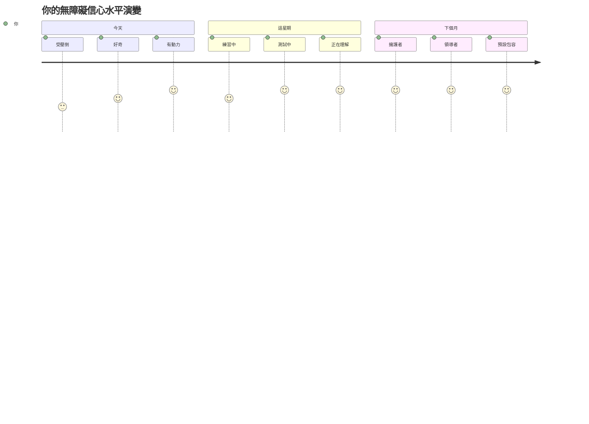
> 🌍 **你現在是一位無障礙冠軍！** 你理解到出色的網路體驗適用於所有人，無論他們如何使用網路。你建立的每一個無障礙功能都讓互聯網更具包容性。網路需要像你這樣的開發者，將無障礙視為機會，而非限制，為所有使用者創造更好的體驗。歡迎加入這個運動！🎉

---

<!-- CO-OP TRANSLATOR DISCLAIMER START -->
**免責聲明**：  
本文件是使用 AI 翻譯服務 [Co-op Translator](https://github.com/Azure/co-op-translator) 進行翻譯。雖然我們力求準確，但請注意自動翻譯可能包含錯誤或不準確之處。原始文件的母語版本應視為具權威性的資料來源。對於重要資訊，建議聘請專業人工翻譯。我們不對因使用此翻譯而產生的任何誤解或誤釋承擔責任。
<!-- CO-OP TRANSLATOR DISCLAIMER END -->