<!--
CO_OP_TRANSLATOR_METADATA:
{
  "original_hash": "c688385d15dd3645e924ea0ffee8967f",
  "translation_date": "2026-01-06T12:18:41+00:00",
  "source_file": "2-js-basics/3-making-decisions/README.md",
  "language_code": "hk"
}
-->
# JavaScript 基礎：作出決策


> Sketchnote 由 [Tomomi Imura](https://twitter.com/girlie_mac) 製作

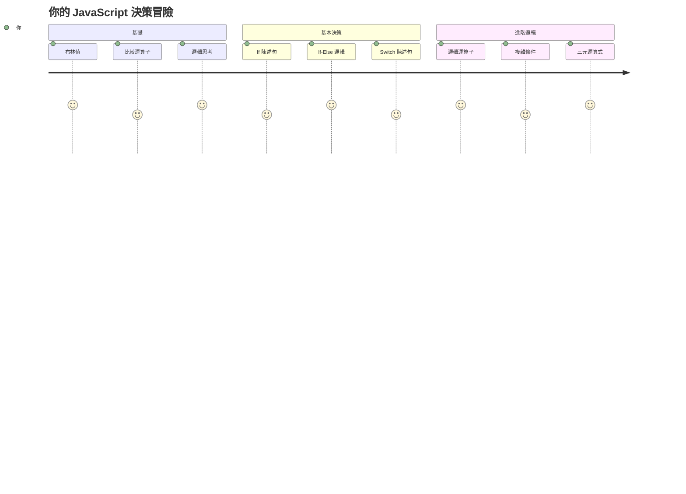
你有沒有想過應用程式如何作出智慧決策？比如導航系統如何選擇最快路線，或者恆溫器如何決定何時開啟暖氣？這就是程式設計中決策的基本概念。

正如查爾斯·巴貝奇的分析機設計用以根據條件執行不同的操作序列，現代 JavaScript 程式需要根據不同情況做出選擇。這種分支和決策的能力讓靜態程式碼轉變為回應式且智能的應用。

在這堂課中，你將學習如何在程式中實作條件邏輯。我們將探討條件語句、比較運算符和邏輯表達式，使你的程式能評估情況並作出適當回應。

## 課前測驗

[課前測驗](https://ff-quizzes.netlify.app/web/quiz/11)

能夠做出決策並控制程式流程是程式設計的基本面向。本節涵蓋如何使用布林值與條件邏輯控制 JavaScript 程式的執行路徑。

[](https://youtube.com/watch?v=SxTp8j-fMMY "Making Decisions")

> 🎥 點擊上方圖片觀看有關作出決策的影片。

> 你也可以在 [Microsoft Learn](https://docs.microsoft.com/learn/modules/web-development-101-if-else/?WT.mc_id=academic-77807-sagibbon) 上學習此課程！

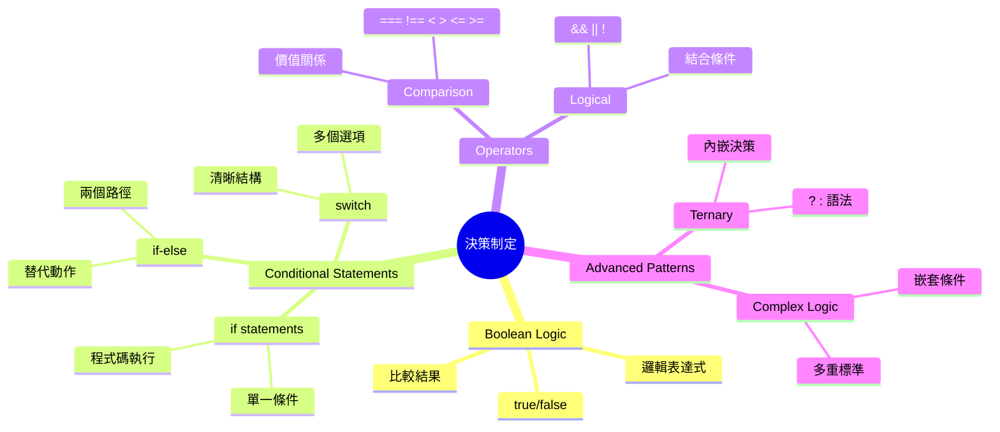
## 布林值簡短回顧

在探索決策前，讓我們回顧前一課提過的布林值。此值以數學家喬治·布爾命名，代表二元狀態——`true` 或 `false`，無模糊空間，沒有中間值。

這些二元值構成所有計算邏輯的基礎。你程式做出的每個決策最終都會被簡化為布林評估。

建立布林變數相當簡單：

```javascript
let myTrueBool = true;
let myFalseBool = false;
```

此程式建立兩個顯式布林值變數。

✅ 布林值名稱來自英國數學家、哲學家及邏輯學家喬治·布爾（1815–1864）。

## 比較運算子與布林值

在實務中，你很少會手動設布林值。相反地，你會透過評估條件來產生它們：「這個數字是否大於那個？」或者「這些值相等嗎？」

比較運算子讓你進行這些評估。它們比較值並根據運算元間的關係回傳布林結果。

| 符號   | 說明                                                                                                                                                  | 範例               |
| ------ | ----------------------------------------------------------------------------------------------------------------------------------------------------- | ------------------ |
| `<`    | **小於**：比較兩個值，當左邊值小於右邊時回傳 `true` 布林類型                                                                                          | `5 < 6 // true`    |
| `<=`   | **小於或等於**：比較兩個值，當左邊值小於或等於右邊時回傳 `true`                                                                                        | `5 <= 6 // true`   |
| `>`    | **大於**：比較兩個值，當左邊值大於右邊時回傳 `true`                                                                                                  | `5 > 6 // false`   |
| `>=`   | **大於或等於**：比較兩個值，當左邊值大於或等於右邊時回傳 `true`                                                                                      | `5 >= 6 // false`  |
| `===`  | **嚴格相等**：比較兩值且值與資料型態相同時回傳 `true`                                                                                                | `5 === 6 // false` |
| `!==`  | **不等於**：比較兩值並回傳與嚴格相等比較相反的布林值                                                                                                 | `5 !== 6 // true`  |

✅ 在瀏覽器主控台動手寫些比較來測試你的理解，有沒有什麼回傳結果讓你感到意外？

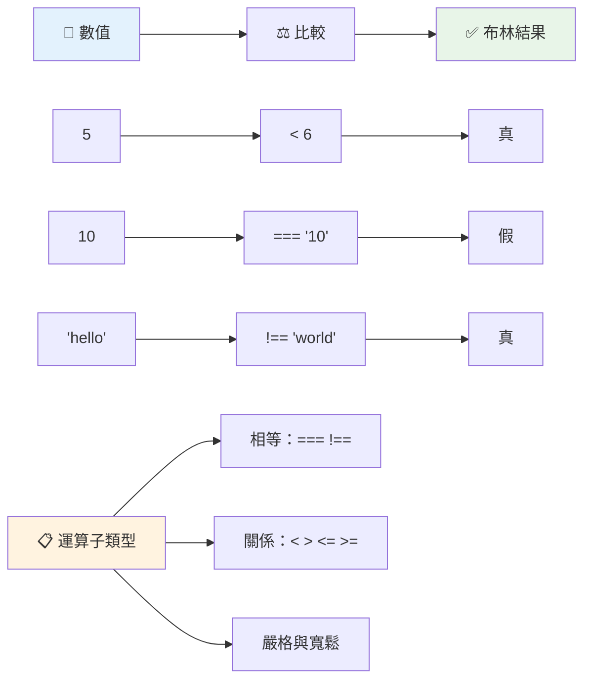
### 🧠 **比較運算邏輯測驗：理解布林邏輯**

**測試你對比較的理解：**
- 你認為為什麼通常偏好使用 `===`（嚴格相等）而不是 `==`（寬鬆相等）？
- 你能預測 `5 === '5'` 和 `5 == '5'` 的回傳結果嗎？
- `!==` 與 `!=` 有什麼差異？

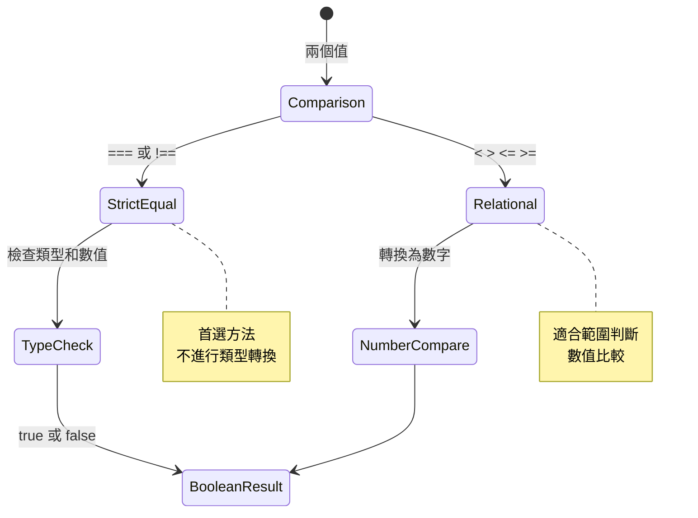
> **專家提示**：除非特別需要型別轉換，否則使用 `===` 和 `!==` 來比較相等性，以避免意外行為！

## If 語句

`if` 語句就像在程式碼裡問問題：「如果這個條件成立，就執行這件事。」這應該是你在 JavaScript 中做決策最重要的工具。

它的工作原理如下：

```javascript
if (condition) {
  // 條件為真。此區塊內的代碼將會執行。
}
```

條件放在括號內，如果為 `true`，JavaScript 就會執行大括號內的程式碼。若為 `false`，則跳過整個區塊。

你通常會使用比較運算子來建立這些條件。來看看一個實例：

```javascript
let currentMoney = 1000;
let laptopPrice = 800;

if (currentMoney >= laptopPrice) {
  // 條件為真。此區塊內的代碼將會執行。
  console.log("Getting a new laptop!");
}
```

因為 `1000 >= 800` 評估為 `true`，所以區塊內的程式碼會執行，控制台顯示 "Getting a new laptop!"。

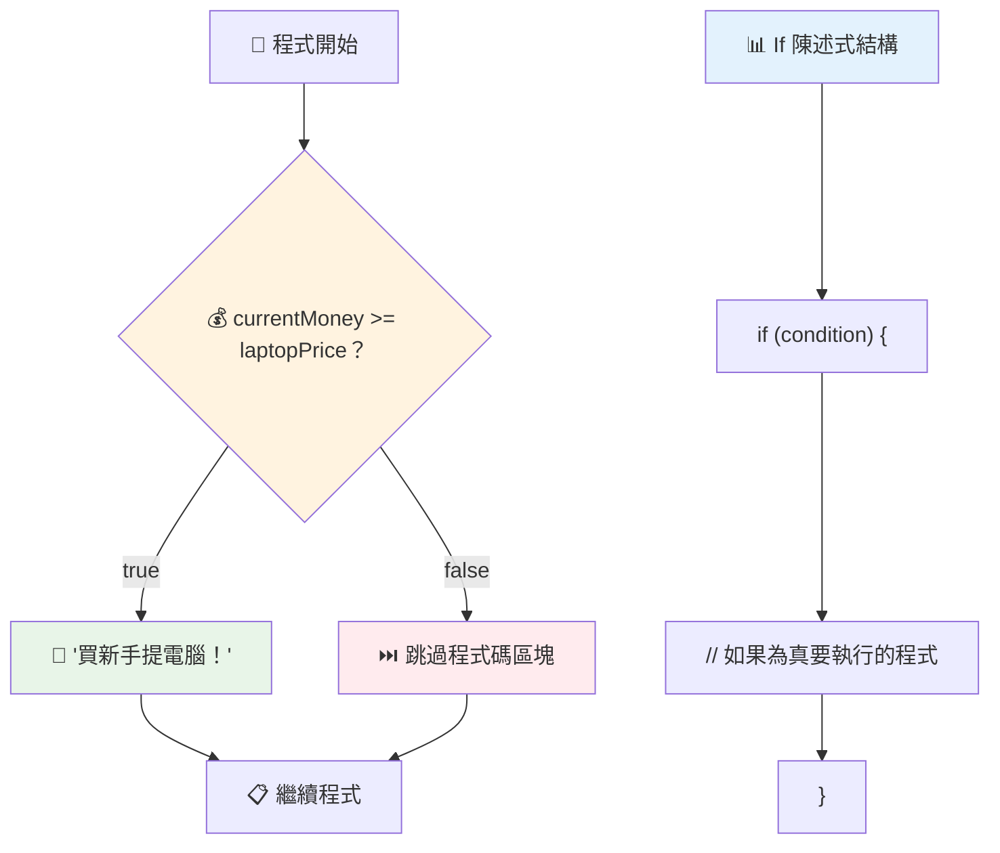
## If..Else 語句

但是如果你想讓程式在條件為 `false` 時做不同的事呢？這時就用到 `else`——它就像備案。

`else` 語句讓你說：「如果這個條件不成立，改做這件事。」

```javascript
let currentMoney = 500;
let laptopPrice = 800;

if (currentMoney >= laptopPrice) {
  // 條件為真。此區塊內的程式碼將會執行。
  console.log("Getting a new laptop!");
} else {
  // 條件為假。此區塊內的程式碼將會執行。
  console.log("Can't afford a new laptop, yet!");
}
```

因為 `500 >= 800` 是 `false`，JavaScript 會跳過第一個區塊，執行 `else` 區塊。你會在控制台看到 "Can't afford a new laptop, yet!"。

✅ 在瀏覽器主控台測試這段程式碼以及下方程式碼。透過改變 currentMoney 和 laptopPrice 變數的值，看看控制台輸出有何不同。

### 🎯 **If-Else 邏輯檢核：分支路徑**

**評估你的條件邏輯理解：**
- 如果 `currentMoney` 恰好等於 `laptopPrice`，程式會怎麼執行？
- 你能想到什麼現實情景中 if-else 邏輯特別有用嗎？
- 你會如何擴展此邏輯來處理多個價位範圍？

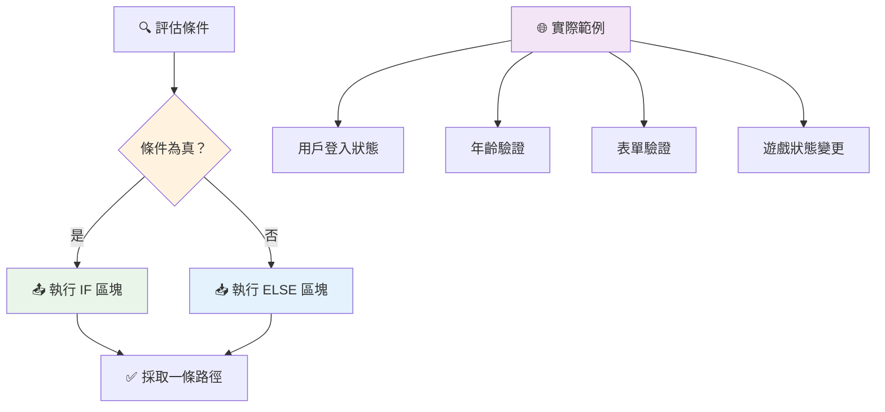
> **關鍵洞見**：If-else 確保執行路徑唯一，保證程式對任何條件都有明確回應！

## Switch 語句

有時候你需要將一個值與多個選項比較。雖然可以用多個 `if..else` 串接，但寫起來會很難管理。`switch` 語句提供更清晰的結構來處理多個離散值。

這個概念類似早期電話交換機中的機械切換系統——一個輸入值決定執行哪條路徑。

```javascript
switch (expression) {
  case x:
    // 程式碼區塊
    break;
  case y:
    // 程式碼區塊
    break;
  default:
    // 程式碼區塊
}
```

其結構如下：
- JavaScript 執行表達式一次
- 搜尋每個 `case` 以尋找匹配
- 找到匹配時執行該代碼塊
- `break` 告訴 JavaScript 停止並跳出 switch
- 若沒有匹配，執行 `default` 區塊（若有）

```javascript
// 使用 switch 陳述式處理星期幾的程式
let dayNumber = 2;
let dayName;

switch (dayNumber) {
  case 1:
    dayName = "Monday";
    break;
  case 2:
    dayName = "Tuesday";
    break;
  case 3:
    dayName = "Wednesday";
    break;
  default:
    dayName = "Unknown day";
    break;
}
console.log(`Today is ${dayName}`);
```

在此範例中，JavaScript 發現 `dayNumber` 是 `2`，找到相符的 `case 2`，設定 `dayName` 為 "Tuesday"，然後跳出 switch。結果？在控制台印出 "Today is Tuesday"。

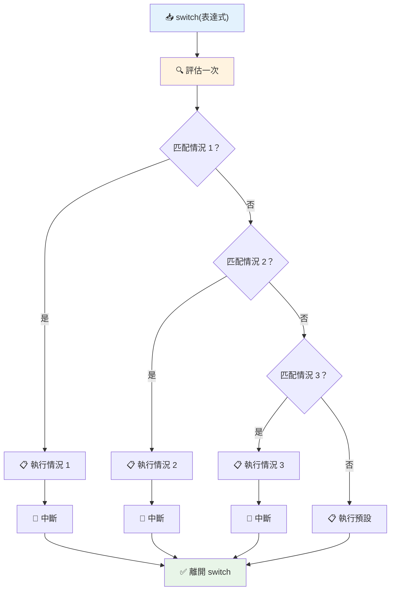
✅ 在瀏覽器主控台測試這段程式碼以及下方程式碼。改變變數 a 的值看看控制台印出了什麼。

### 🔄 **Switch 語句掌握：多重選擇**

**測試你對 switch 理解：**
- 如果忘了寫 `break` 會發生什麼事？
- 何時你會用 `switch` 而不是多個 `if-else`？
- 即使你以為已覆蓋所有可能性，為什麼 `default` 仍然有用？

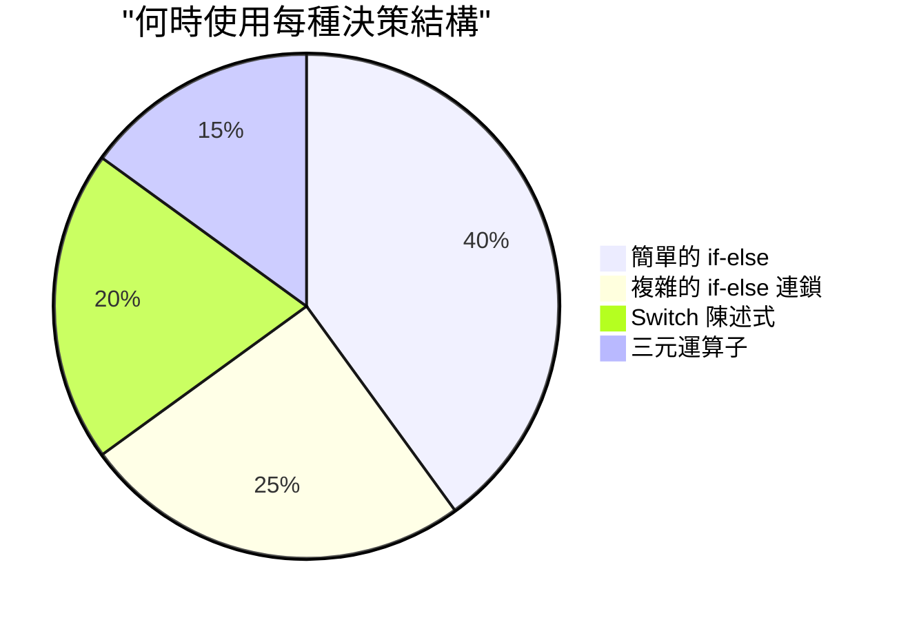
> **最佳實踐**：當比較單一變數對多個特定值時使用 `switch`。範圍檢查或複雜條件則用 `if-else`！

## 邏輯運算子與布林值

複雜決策通常需要同時評估多個條件。就像布林代數讓數學家能結合邏輯表達式一樣，程式設計提供邏輯運算子來連接多個布林條件。

這些運算子讓你能結合簡單真偽判斷，寫出複雜條件邏輯。

| 符號   | 說明                                                                                 | 範例                                                               |
| ------ | ------------------------------------------------------------------------------------ | ------------------------------------------------------------------ |
| `&&`   | **邏輯且 AND**：比較兩個布林表達式。只有兩邊都為真時回傳真                          | `(5 > 3) && (5 < 10) // 兩邊都為真。回傳真`                       |
| `\|\|` | **邏輯或 OR**：比較兩個布林表達式。至少一方為真時回傳真                             | `(5 > 10) \|\| (5 < 10) // 一方為假另一方為真。回傳真`            |
| `!`    | **邏輯非 NOT**：回傳布林表達式的相反值                                            | `!(5 > 10) // 5 不大於 10，"!" 使其變成真`                       |

這些運算子讓你用很有用的方式結合條件：
- AND (`&&`) 代表兩個條件都必須成立
- OR (`||`) 代表至少一個條件成立  
- NOT (`!`) 把真變假，假變真

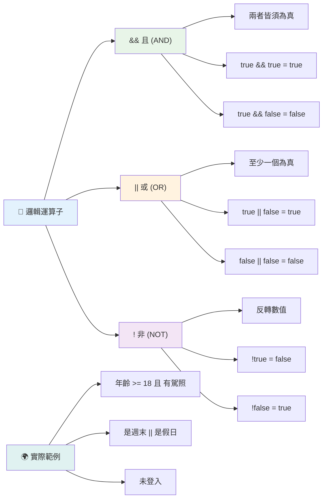
## 結合邏輯運算子的條件與決策

我們用一個較實際的範例來看看這些邏輯運算子：

```javascript
let currentMoney = 600;
let laptopPrice = 800;
let laptopDiscountPrice = laptopPrice - (laptopPrice * 0.2); // 筆記型電腦價格打八折

if (currentMoney >= laptopPrice || currentMoney >= laptopDiscountPrice) {
  // 條件為真。此區塊內的程式碼會執行。
  console.log("Getting a new laptop!");
} else {
  // 條件為假。此區塊內的程式碼會執行。
  console.log("Can't afford a new laptop, yet!");
}
```

此例中：我們計算 20% 折扣價（640），接著評估是否有足夠資金支付原價或折扣價。因 600 低於 640，條件會是 `false` 吗？（譯者註：請以原文程式碼檢視詳細結果）

### 🧮 **邏輯運算子檢核：結合條件**

**測試你對邏輯運算子的理解：**
- 在 `A && B` 表達式中，如果 A 為假會怎樣？B 還會不會被評估？
- 你能想到什麼情況需同時使用三種運算子 (`&&, ||, !`)？
- `!user.isActive` 與 `user.isActive !== true` 有什麼差別？

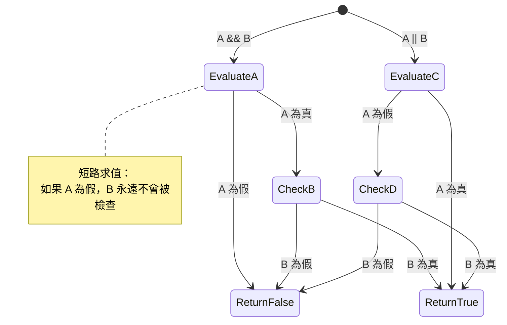
> **效能提示**：JavaScript 使用「短路評估」——在 `A && B` 中，如果 A 為假，B 就不會被評估。善用此特性！

### 否定運算子

有時候反過來思考更容易。比如不是問「使用者有沒有登入？」而是「使用者沒有登入嗎？」驚嘆號 (`!`) 運算子會幫你反轉邏輯。

```javascript
if (!condition) {
  // 當條件為假時執行
} else {
  // 當條件為真時執行
}
```

`!` 運算子就像說「相反的…」——如果是 `true`，它變 `false`，反之亦然。

### 三元運算子

對簡單條件賦值，JavaScript 提供了 **三元運算子**。這種簡潔語法讓你能在一行寫條件，適合根據條件賦予兩種值之一。

```javascript
let variable = condition ? returnThisIfTrue : returnThisIfFalse;
```

它讀起來像個問題：「這個條件成立嗎？若是，用這個值。否則用那個值。」

下面是一個更具體例子：

```javascript
let firstNumber = 20;
let secondNumber = 10;
let biggestNumber = firstNumber > secondNumber ? firstNumber : secondNumber;
```

✅ 花點時間多讀幾遍這段程式碼。你理解這些運算子是如何運作的嗎？

這行程式碼的意思是：「`firstNumber` 是否大於 `secondNumber`？是的話，`biggestNumber` 等於 `firstNumber`；否則等於 `secondNumber`。」

三元運算子其實是這段傳統 `if..else` 程式碼的簡短寫法：

```javascript
let biggestNumber;
if (firstNumber > secondNumber) {
  biggestNumber = firstNumber;
} else {
  biggestNumber = secondNumber;
}
```

兩種寫法結果相同。三元運算子簡潔，傳統 if-else 可能在複雜條件下較易讀。

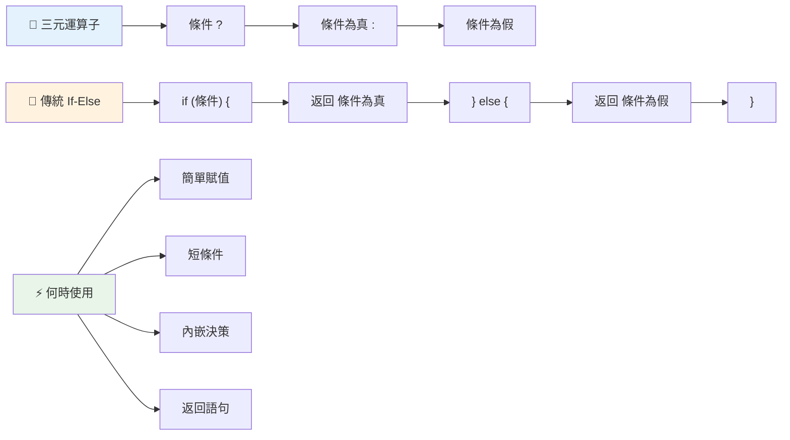
---


## 🚀 挑戰

先用邏輯運算子寫一段程式，再改寫成三元運算子語法。你偏好使用哪種語法？

---

## GitHub Copilot Agent 挑戰 🚀

使用 Agent 模式完成以下挑戰：

**說明：** 創建一個完整的成績計算器，展示本課的多種決策概念，包括 if-else 語句、switch 語句、邏輯運算子和三元運算子。

**指示：** 撰寫 JavaScript 程式，輸入學生分數（0-100），依據以下標準判斷字母等級：
- A: 90-100
- B: 80-89  
- C: 70-79
- D: 60-69
- F: 60 以下

需求：
1. 使用 if-else 語句判斷字母成績
2. 使用邏輯運算子檢查學生是否通過（grade >= 60）且有榮譽（grade >= 90）  
3. 使用 switch 陳述式為每個等第提供具體反饋  
4. 使用三元運算子判斷學生是否符合下一課程資格（grade >= 70）  
5. 包含輸入驗證以確保分數介於 0 到 100 之間  

使用各種分數測試你的程式，包括邊界條件如 59、60、89、90 及無效輸入。  

在此了解更多有關 [agent mode](https://code.visualstudio.com/blogs/2025/02/24/introducing-copilot-agent-mode)。  


## 課後小測驗

[課後小測驗](https://ff-quizzes.netlify.app/web/quiz/12)

## 複習與自學

閱讀更多使用者可用的各種運算子，[請見 MDN](https://developer.mozilla.org/docs/Web/JavaScript/Reference/Operators)。  

瀏覽 Josh Comeau 精彩的 [operator lookup](https://joshwcomeau.com/operator-lookup/)！  

## 作業

[運算子](assignment.md)

---

## 🧠 **你的決策工具箱總結**

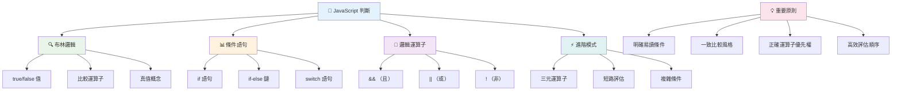
---

## 🚀 你的 JavaScript 決策掌握時間表

### ⚡ **接下來 5 分鐘你可以做的事**
- [ ] 在瀏覽器主控台練習比較運算子
- [ ] 撰寫簡單的 if-else 陳述式檢查你的年齡
- [ ] 嘗試挑戰：使用三元運算子改寫 if-else
- [ ] 測試不同「真值」與「假值」的行為

### 🎯 **這小時內你能完成的目標**
- [ ] 完成課後小測驗並複習不熟悉的概念
- [ ] 建置 GitHub Copilot 挑戰的綜合成績計算機
- [ ] 為真實情境（如穿衣選擇）製作簡單決策樹
- [ ] 練習使用邏輯運算子結合多重條件
- [ ] 嘗試各種用途的 switch 陳述式

### 📅 **一週內的邏輯掌握計畫**
- [ ] 完成具創意範例的運算子作業
- [ ] 架設使用多種條件結構的迷你測驗應用
- [ ] 建立能檢查多項輸入條件的表單驗證器
- [ ] 練習 Josh Comeau 的 [operator lookup](https://joshwcomeau.com/operator-lookup/) 練習題
- [ ] 重構現有程式碼以使用更合適的條件結構
- [ ] 研讀短路評估與效能影響

### 🌟 **一個月的轉變計劃**
- [ ] 精通複雜的巢狀條件並維持程式可讀性
- [ ] 建置具精緻決策邏輯的應用程式
- [ ] 透過改進既有專案的條件邏輯參與開源貢獻
- [ ] 教導他人不同條件結構及使用時機
- [ ] 探索函式化程式設計在條件邏輯中的應用
- [ ] 建立個人條件判斷最佳實務參考指南

### 🏆 **決策大師最終檢閱**

**慶祝你的邏輯思維精通：**  
- 你成功實作過最複雜的決策邏輯是什麼？  
- 哪種條件結構對你而言最自然？為什麼？  
- 學習邏輯運算子如何改變你的問題解決方式？  
- 哪項現實世界的應用最能受益於精巧的決策邏輯？  

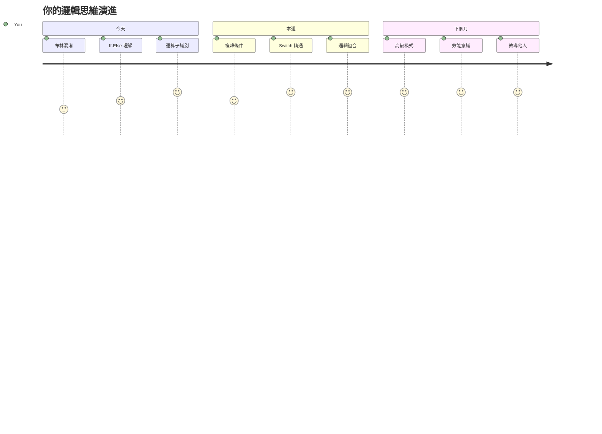
> 🧠 **你已掌握數位決策的藝術！** 每一個互動式應用都依賴條件邏輯，才能智能回應用戶動作與變化的狀況。你現在懂得如何讓程式思考、評估並選擇適當回應。這個邏輯基礎將驅動你所建造的每一個動態應用！🎉

---

<!-- CO-OP TRANSLATOR DISCLAIMER START -->
**免責聲明**：  
本文件乃使用 AI 翻譯服務 [Co-op Translator](https://github.com/Azure/co-op-translator) 進行翻譯。雖然我們致力於確保準確性，但請注意自動翻譯可能存在錯誤或不準確之處。原始語言版本的文件應被視為具權威性的資料來源。對於重要資訊，建議尋求專業人工翻譯。我們不對使用本翻譯所引致的任何誤解或誤釋承擔責任。
<!-- CO-OP TRANSLATOR DISCLAIMER END -->