<!--
CO_OP_TRANSLATOR_METADATA:
{
  "original_hash": "1710a50a519a6e4a1b40a5638783018d",
  "translation_date": "2026-01-06T12:21:18+00:00",
  "source_file": "2-js-basics/4-arrays-loops/README.md",
  "language_code": "hk"
}
-->
# JavaScript 基礎：陣列與迴圈


> 筆記作者：[Tomomi Imura](https://twitter.com/girlie_mac)

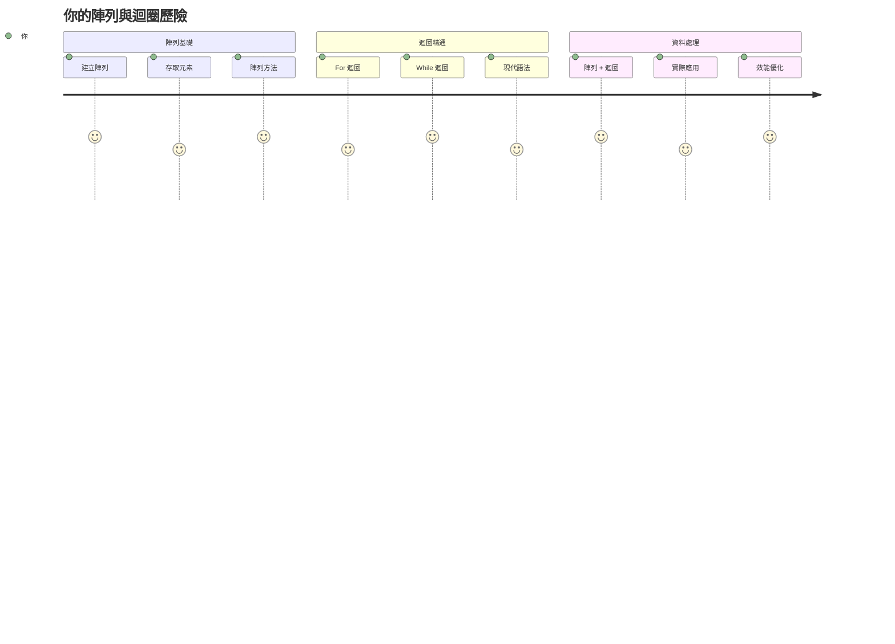
## 課前測驗
[課前測驗](https://ff-quizzes.netlify.app/web/quiz/13)

有沒有想過網站如何追蹤購物車的商品或顯示你的好友清單？這就是陣列與迴圈發揮作用的地方。陣列就像數位容器，可以存放多個資訊項目，而迴圈則讓你有效率地處理所有資料，避免重複撰寫程式碼。

這兩個觀念共同構成了處理程式中資訊的基礎。你將學會如何從手動撰寫每一步，轉變為創造聰明且高效率的程式碼，快速處理上百甚至上千個項目。

學完本課程後，你將能了解如何用少量程式碼完成複雜資料處理任務。讓我們來探索這些重要的程式設計概念。

[](https://youtube.com/watch?v=1U4qTyq02Xw "Arrays")

[](https://www.youtube.com/watch?v=Eeh7pxtTZ3k "Loops")

> 🎥 點擊上述圖片觀看關於陣列與迴圈的影片。

> 你也可以在 [Microsoft Learn](https://docs.microsoft.com/learn/modules/web-development-101-arrays/?WT.mc_id=academic-77807-sagibbon) 參加這堂課程！

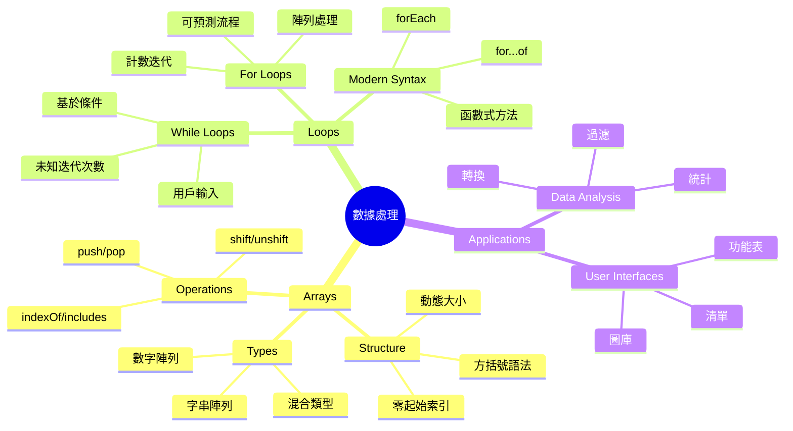
## 陣列

把陣列想像成數位檔案櫃——不像一個抽屜只能放一份文件，你可以在一個結構化的容器中組織多個相關項目。在程式語言中，陣列讓你能把多項資訊集中存放於一個有序的套件。

無論你在建立相片集、管理待辦事項清單，或是追蹤遊戲中的高分，陣列都提供了資料組織的基礎。讓我們看看它們的運作方式。

✅ 陣列就在我們周遭！你能舉出生活中陣列的例子嗎？例如太陽能電池板陣列？

### 建立陣列

建立陣列非常簡單——只要用中括號！

```javascript
// 空陣列 - 就好似一個空購物車等待加入商品
const myArray = [];
```

**這裡發生了什麼？**
你用中括號 `[]` 建立了一個空容器。就像一個空的圖書架，準備好放進你想整理的書本。

你也可以直接在建立的時候填入初始值：

```javascript
// 你的雪糕店口味菜單
const iceCreamFlavors = ["Chocolate", "Strawberry", "Vanilla", "Pistachio", "Rocky Road"];

// 用戶的個人資料資訊（混合不同類型的數據）
const userData = ["John", 25, true, "developer"];

// 你最喜愛課程的考試分數
const scores = [95, 87, 92, 78, 85];
```

**有趣的觀察：**
- 你可以在同一個陣列裡存放文字、數字，甚至是 true/false 值
- 每項目以逗號分隔，非常簡單！
- 陣列非常適合把相關資訊整理在一起

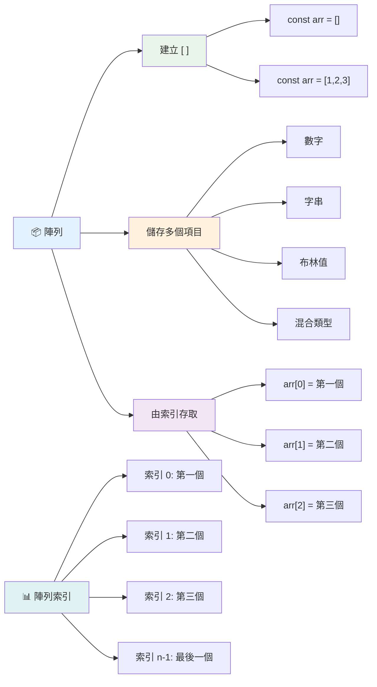
### 陣列索引

這點一開始可能會覺得奇怪：陣列裡的項目編號從 0 開始，而非 1。這種從零開始的編號方式源於電腦記憶體的運作原理，是電腦語言（如 C 語言）早期慣例。陣列中每個位置都有自己的位址編號，稱為**索引**。

| 索引 | 值 | 說明 |
|-------|-------|-------------|
| 0 | "Chocolate" | 第一個元素 |
| 1 | "Strawberry" | 第二個元素 |
| 2 | "Vanilla" | 第三個元素 |
| 3 | "Pistachio" | 第四個元素 |
| 4 | "Rocky Road" | 第五個元素 |

✅ 陣列從零開始編號會讓你感到驚訝嗎？有些程式語言從 1 開始編號。這背後有有趣故事，你可以在[維基百科](https://en.wikipedia.org/wiki/Zero-based_numbering)閱讀了解。

**存取陣列元素：**

```javascript
const iceCreamFlavors = ["Chocolate", "Strawberry", "Vanilla", "Pistachio", "Rocky Road"];

// 使用括號標記法存取個別元素
console.log(iceCreamFlavors[0]); // "Chocolate" - 第一個元素
console.log(iceCreamFlavors[2]); // "Vanilla" - 第三個元素
console.log(iceCreamFlavors[4]); // "Rocky Road" - 最後一個元素
```

**解說：**
- **使用**中括號搭配索引號碼來取得元素
- **回傳**該位置上所儲存的值
- **從** 0 開始編號，第一個元素索引是 0

**修改陣列元素：**

```javascript
// 更改現有值
iceCreamFlavors[4] = "Butter Pecan";
console.log(iceCreamFlavors[4]); // "牛油胡桃"

// 在結尾新增元素
iceCreamFlavors[5] = "Cookie Dough";
console.log(iceCreamFlavors[5]); // "曲奇麵糰"
```

**上例中，我們：**
- **將**索引 4 處的元素從 "Rocky Road" 改為 "Butter Pecan"
- **新增**了一個索引 5 的元素 "Cookie Dough"
- **新增**元素時，陣列長度會自動擴展

### 陣列長度與常用方法

陣列內建屬性和方法，讓你更輕鬆地操作資料。

**取得陣列長度：**

```javascript
const iceCreamFlavors = ["Chocolate", "Strawberry", "Vanilla", "Pistachio", "Rocky Road"];
console.log(iceCreamFlavors.length); // 5

// 長度會隨陣列變動自動更新
iceCreamFlavors.push("Mint Chip");
console.log(iceCreamFlavors.length); // 6
```

**重點摘要：**
- **回傳**陣列中元素的總數
- **元素增加或刪除時，長度會自動更新**
- **可用於迴圈或驗證元素數量**

**重要的陣列方法：**

```javascript
const fruits = ["apple", "banana", "orange"];

// 新增元素
fruits.push("grape");           // 新增到尾端: ["apple", "banana", "orange", "grape"]
fruits.unshift("strawberry");   // 新增到開頭: ["strawberry", "apple", "banana", "orange", "grape"]

// 移除元素
const lastFruit = fruits.pop();        // 移除並返回 "grape"
const firstFruit = fruits.shift();     // 移除並返回 "strawberry"

// 尋找元素
const index = fruits.indexOf("banana"); // 返回 1 ( "banana" 的位置)
const hasApple = fruits.includes("apple"); // 返回 true
```

**這些方法的作用：**
- `push()` 往陣列尾端新增元素，`unshift()` 往陣列前端新增元素
- `pop()` 從陣列尾端移除元素，`shift()` 從陣列前端移除元素
- `indexOf()` 找出元素索引，`includes()` 檢查元素是否存在
- 回傳相關值，如被移除的元素或索引位置

✅ 試試看！打開瀏覽器的控制台，創建並操作屬於你自己的陣列。

### 🧠 **陣列基礎檢核：組織你的資料**

**挑戰你的陣列概念：**
- 為什麼陣列的計數是從 0 開始，而不是從 1？
- 如果你試著存取不存在的索引（像是在五元素陣列中用 `arr[100]`）會發生什麼？
- 你能想到三個現實世界中陣列的應用情境嗎？

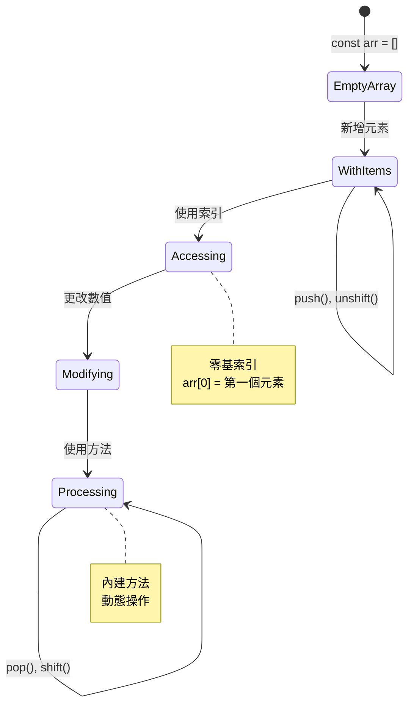
> **實際應用觀察**：陣列在程式設計中無處不在！社群動態、購物車、相簿、播放清單歌曲 - 這些背後都是陣列！

## 迴圈

想像狄更斯小說中學生懲罰要在黑板上不停抄寫句子。試想你若能簡單指示「把這句話寫 100 次」，然後自動完成。這正是迴圈在程式中的作用。

迴圈就像是勤快又不會疲倦的助手，能無誤地重複執行任務。無論你要檢查購物車每個商品，還是顯示相簿全部照片，迴圈都能有效處理重複動作。

JavaScript 提供多種迴圈形式。讓我們逐一瞭解它們，以及適合何時使用。

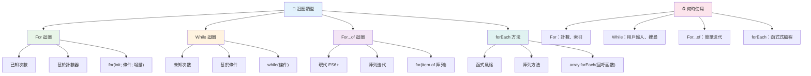
### For 迴圈

`for` 迴圈就像設定計時器一樣——你確定想執行幾次。它十分有組織且可預期，特別適合操作陣列或計數任務。

**For 迴圈結構：**

| 元件 | 目的 | 範例 |
|-----------|---------|----------|
| **初始化** | 設定起點 | `let i = 0` |
| **條件** | 何時繼續 | `i < 10` |
| **增量** | 如何更新 | `i++` |

```javascript
// 從0數到9
for (let i = 0; i < 10; i++) {
  console.log(`Count: ${i}`);
}

// 更實用的例子：處理分數
const testScores = [85, 92, 78, 96, 88];
for (let i = 0; i < testScores.length; i++) {
  console.log(`Student ${i + 1}: ${testScores[i]}%`);
}
```

**一步步發生什麼：**
- **初始化**計數器變數 `i` 為 0
- **條件判斷**在每次迴圈開始前：`i < 10`
- **條件為真時**執行程式區塊
- **每次迴圈後**用 `i++` 增加 `i` 的值 1
- **當條件不成立（`i` 達 10）時**停止

✅ 在瀏覽器控制台執行此程式。若你更改計數器、條件或增量部分，會有什麼變化？你能控制使它倒數嗎？

### 🗓️ **For 迴圈精通檢核：有掌控力的重複**

**考考你對 for 迴圈的理解：**
- for 迴圈有哪三個部分？它們分別負責什麼？
- 如何反向遍歷陣列？
- 忘記寫增量部分 (`i++`) 會怎樣？

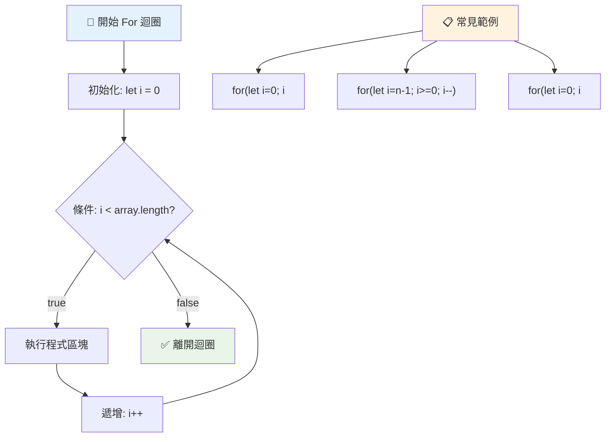
> **迴圈智慧**：for 迴圈最適合你確定需要執行多少次的場合。它是陣列處理最常見的選擇！

### While 迴圈

`while` 迴圈就像說「繼續做這件事直到...」——你可能不知道究竟會跑幾次，但知道何時停下。它非常適用向使用者重複要求輸入直到符合條件，或搜尋資料直到找到目標。

**While 迴圈特性：**
- **只要條件為真**就會持續執行
- **需要自行管理**計數器變數
- **條件判斷**在每次迴圈前執行
- **若條件不會成假值，可能造成無限迴圈**

```javascript
// 基本計數範例
let i = 0;
while (i < 10) {
  console.log(`While count: ${i}`);
  i++; // 唔好忘記遞增！
}

// 更實用嘅例子：處理用戶輸入
let userInput = "";
let attempts = 0;
const maxAttempts = 3;

while (userInput !== "quit" && attempts < maxAttempts) {
  userInput = prompt(`Enter 'quit' to exit (attempt ${attempts + 1}):`);
  attempts++;
}

if (attempts >= maxAttempts) {
  console.log("Maximum attempts reached!");
}
```

**看懂這些範例：**
- **計數器 `i`** 在迴圈內手動遞增
- **避免**無限迴圈
- **案例示範** 使用者輸入及有限次數嘗試
- **安全機制**避免永遠執行的狀況

### ♾️ **While 迴圈智慧檢核：條件驅動的重複**

**挑戰你對 while 迴圈的理解：**
- 使用 while 迴圈最大危險是什麼？
- 什麼時候會選擇 while 迴圈而非 for 迴圈？
- 要怎麼防止無限迴圈？

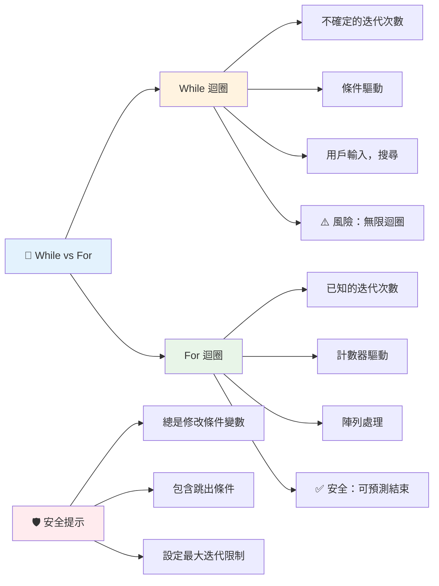
> **安全第一**：while 迴圈強大但需要謹慎管理條件。務必確保迴圈條件最終會變成假！

### 現代迴圈替代寫法

JavaScript 有更現代的迴圈語法，使程式碼更易讀且錯誤率降低。

**For...of 迴圈 (ES6+):**

```javascript
const colors = ["red", "green", "blue", "yellow"];

// 現代方法 - 更乾淨和更安全
for (const color of colors) {
  console.log(`Color: ${color}`);
}

// 與傳統的 for 迴圈比較
for (let i = 0; i < colors.length; i++) {
  console.log(`Color: ${colors[i]}`);
}
```

**for...of 的優點：**
- **免除**索引管理和 off-by-one 錯誤
- **直接**取得陣列元素
- **提升**程式碼清晰度並簡化語法

**forEach 方法：**

```javascript
const prices = [9.99, 15.50, 22.75, 8.25];

// 使用 forEach 實現函數式編程風格
prices.forEach((price, index) => {
  console.log(`Item ${index + 1}: $${price.toFixed(2)}`);
});

// 使用箭頭函數搭配 forEach 進行簡單操作
prices.forEach(price => console.log(`Price: $${price}`));
```

**forEach 需知：**
- **對陣列中每個元素執行函式**
- **函式參數包含元素值與索引**
- **無法中途停止（不像傳統迴圈）**
- **回傳undefined（不產生新陣列）**

✅ 你為什麼會選擇 for 迴圈還是 while 迴圈？在 StackOverflow 上有 1.7 萬人討論這問題，裡面的一些意見[可能讓你感興趣](https://stackoverflow.com/questions/39969145/while-loops-vs-for-loops-in-javascript)。

### 🎨 **現代迴圈語法檢核：擁抱 ES6+**

**評估你對現代 JavaScript 的認識：**
- `for...of` 比傳統 for 迴圈有什麼優勢？
- 什麼時候還是會選擇傳統 for 迴圈？
- `forEach` 和 `map` 有什麼不同？

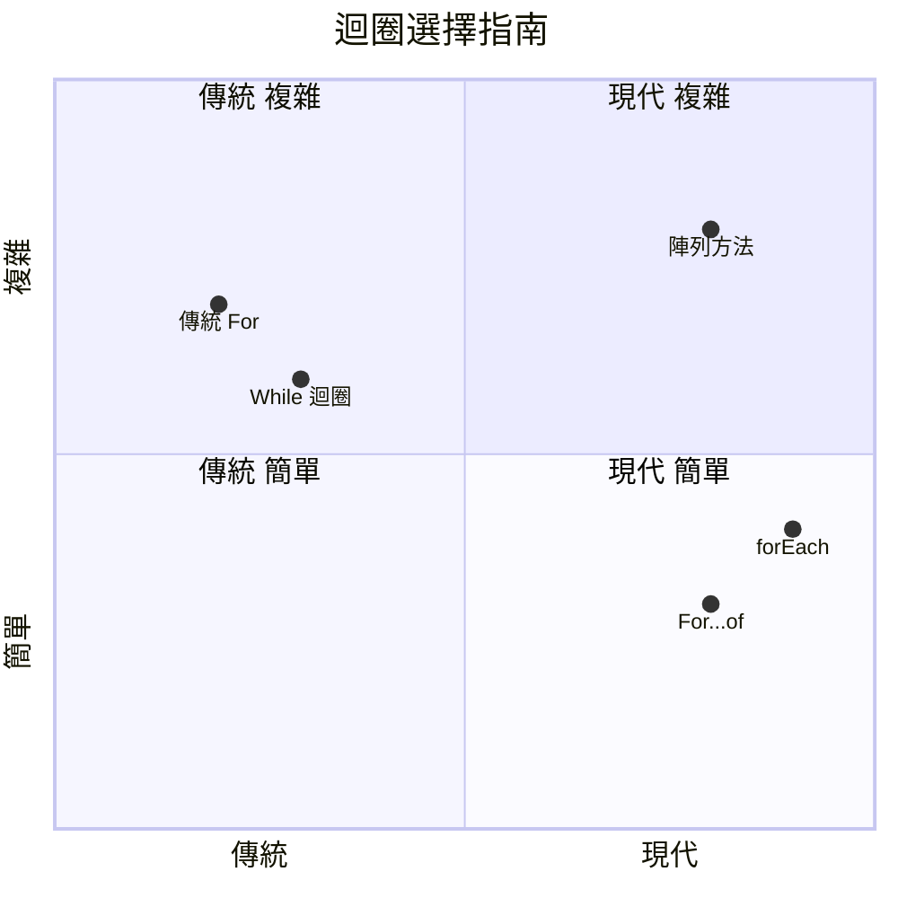
> **現代趨勢**：像 `for...of` 和 `forEach` 是 ES6+ 迴圈語法的主流，更簡潔且錯誤少！

## 迴圈與陣列

將陣列與迴圈結合能創造強大的資料處理能力。這組合是許多程式任務的根本，從顯示清單到統計計算都用得到。

**傳統陣列處理：**

```javascript
const iceCreamFlavors = ["Chocolate", "Strawberry", "Vanilla", "Pistachio", "Rocky Road"];

// 傳統 for 迴圈方法
for (let i = 0; i < iceCreamFlavors.length; i++) {
  console.log(`Flavor ${i + 1}: ${iceCreamFlavors[i]}`);
}

// 現代 for...of 方法
for (const flavor of iceCreamFlavors) {
  console.log(`Available flavor: ${flavor}`);
}
```

**了解各種做法：**
- 透過陣列長度決定迴圈範圍
- 傳統 for 迴圈使用索引存取元素
- for...of 迴圈直接存取元素
- 每個元素處理一次

**實用數據處理範例：**

```javascript
const studentGrades = [85, 92, 78, 96, 88, 73, 89];
let total = 0;
let highestGrade = studentGrades[0];
let lowestGrade = studentGrades[0];

// 使用單一迴圈處理所有成績
for (let i = 0; i < studentGrades.length; i++) {
  const grade = studentGrades[i];
  total += grade;
  
  if (grade > highestGrade) {
    highestGrade = grade;
  }
  
  if (grade < lowestGrade) {
    lowestGrade = grade;
  }
}

const average = total / studentGrades.length;
console.log(`Average: ${average.toFixed(1)}`);
console.log(`Highest: ${highestGrade}`);
console.log(`Lowest: ${lowestGrade}`);
```

**本程式運作方式：**
- 初始化總和與最大值/最小值追蹤變數
- 以單一高效迴圈處理所有成績
- 累積計算平均所需總分
- 遍歷過程中更新最高與最低分數
- 迴圈結束時計算統計結果

✅ 在瀏覽器控制台嘗試跑自己的陣列迴圈練習。

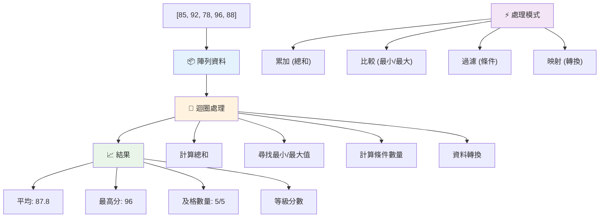
---

## GitHub Copilot Agent 挑戰 🚀

使用 Agent 模式完成以下挑戰：

**描述：** 建立一個綜合資料處理函式，結合陣列與迴圈來分析資料集並產生有意義的洞察。

**提示：** 建立一個名為 `analyzeGrades` 的函式，該函式接受一個包含學生分數物件的陣列（每個物件含有 name 和 score 屬性），並回傳一個含有統計資料的物件，包括最高分、最低分、平均分數、及格學生數（分數 >= 70）、和超過平均分數的學生名字陣列。請在解答中至少使用兩種不同的迴圈類型。

詳細了解 [agent 模式](https://code.visualstudio.com/blogs/2025/02/24/introducing-copilot-agent-mode)。

## 🚀 挑戰
JavaScript 提供了幾個現代陣列方法，可以取代特定任務的傳統循環。探索 [forEach](https://developer.mozilla.org/docs/Web/JavaScript/Reference/Global_Objects/Array/forEach)、[for-of](https://developer.mozilla.org/docs/Web/JavaScript/Reference/Statements/for...of)、[map](https://developer.mozilla.org/docs/Web/JavaScript/Reference/Global_Objects/Array/map)、[filter](https://developer.mozilla.org/docs/Web/JavaScript/Reference/Global_Objects/Array/filter) 和 [reduce](https://developer.mozilla.org/docs/Web/JavaScript/Reference/Global_Objects/Array/reduce)。

**你的挑戰：** 使用至少三種不同的陣列方法重構學生成績範例。注意使用現代 JavaScript 語法後，程式碼變得多麼乾淨且易讀。

## 課後測驗
[課後測驗](https://ff-quizzes.netlify.app/web/quiz/14)


## 複習與自我學習

JavaScript 中的陣列附帶了許多方法，對於資料操作非常有用。[閱讀這些方法](https://developer.mozilla.org/docs/Web/JavaScript/Reference/Global_Objects/Array) 並嘗試一些（如 push、pop、slice 和 splice）在你自己創建的陣列上。

## 作業

[循環陣列](assignment.md)

---

## 📊 **你的陣列與循環工具總結**

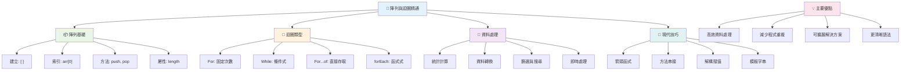
---

## 🚀 你的陣列與循環精通時間軸

### ⚡ **接下來 5 分鐘可以做什麼**
- [ ] 建立你最喜愛電影的陣列並存取特定元素
- [ ] 撰寫一個從 1 數到 10 的 for 迴圈
- [ ] 嘗試課堂上的現代陣列方法挑戰
- [ ] 在瀏覽器控制台練習陣列索引

### 🎯 **這小時能達成的目標**
- [ ] 完成課後測驗並複習任何有挑戰的概念
- [ ] 建立 GitHub Copilot 挑戰中的綜合成績分析器
- [ ] 創建一個簡單的購物車，能新增和移除商品
- [ ] 練習不同迴圈類型的轉換
- [ ] 嘗試 `push`、`pop`、`slice` 和 `splice` 等陣列方法

### 📅 **你一週的資料處理旅程**
- [ ] 完成「循環陣列」作業，並加入創意強化
- [ ] 使用陣列和循環建立待辦清單應用程式
- [ ] 創建一個簡單的數據統計計算器
- [ ] 練習 [MDN 陣列方法](https://developer.mozilla.org/docs/Web/JavaScript/Reference/Global_Objects/Array)
- [ ] 建立照片集或音樂播放清單介面
- [ ] 探索函式式編程中的 `map`、`filter` 和 `reduce`

### 🌟 **你一個月的轉變**
- [ ] 精通進階陣列操作與效能優化
- [ ] 建立完整的數據可視化儀表板
- [ ] 參與開源專案中涉及資料處理的貢獻
- [ ] 用實務範例教導他人陣列與循環
- [ ] 創建個人可重複使用的資料處理函式庫
- [ ] 探索基於陣列的演算法和資料結構

### 🏆 **最終資料處理冠軍回顧**

**慶祝你對陣列和循環的精通：**
- 你學會的最實用的陣列操作是什麼，對真實世界應用最有幫助？
- 哪種迴圈型態你覺得最自然，為什麼？
- 理解陣列和循環後，你組織資料的方式有什麼改變？
- 下一個你想挑戰的複雜資料處理任務是什麼？

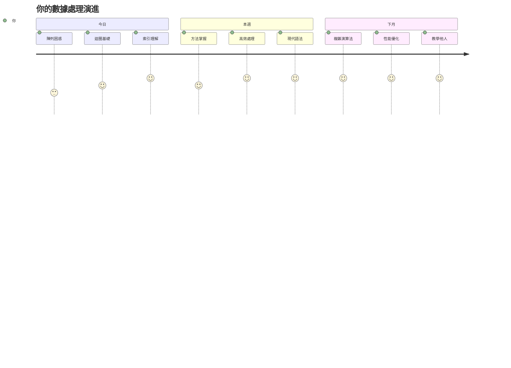
> 📦 **你已經解鎖了資料組織與處理的力量！** 陣列與循環是幾乎所有你會建立的應用程式的基礎。從簡單清單到複雜資料分析，你現在擁有高效且優雅處理資訊的工具。每個動態網站、行動應用程式和資料驅動的應用都依賴這些基本概念。歡迎來到可擴充資料處理的世界！ 🎉

---

<!-- CO-OP TRANSLATOR DISCLAIMER START -->
**免責聲明**：  
本文件由 AI 翻譯服務 [Co-op Translator](https://github.com/Azure/co-op-translator) 自動翻譯而成。儘管我們盡力確保準確性，但請注意，自動翻譯可能包含錯誤或不準確之處。原始文件的母語版本應視為權威來源。對於關鍵資訊，建議採用專業人工翻譯。我們對因使用本翻譯而引起的任何誤解或誤釋概不負責。
<!-- CO-OP TRANSLATOR DISCLAIMER END -->