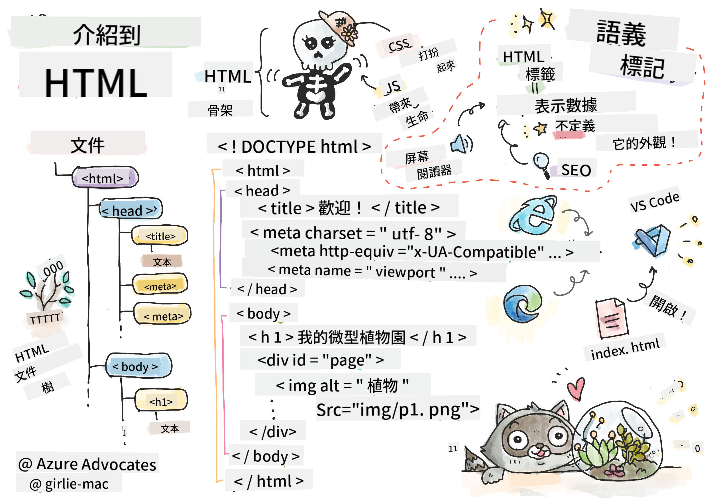

<!--
CO_OP_TRANSLATOR_METADATA:
{
  "original_hash": "89f7f9f800ce7c9f149e98baaae8491a",
  "translation_date": "2025-08-29T15:06:31+00:00",
  "source_file": "3-terrarium/1-intro-to-html/README.md",
  "language_code": "hk"
}
-->
# 玻璃缸項目第一部分：HTML 簡介


> [Tomomi Imura](https://twitter.com/girlie_mac) 的手繪筆記

## 課前測驗

[課前測驗](https://ff-quizzes.netlify.app/web/quiz/15)

> 查看影片

> 
> [](https://www.youtube.com/watch?v=1TvxJKBzhyQ)

### 簡介

HTML，全名為超文本標記語言（HyperText Markup Language），是網頁的「骨架」。如果說 CSS 是為 HTML「穿衣打扮」，而 JavaScript 則是讓它「活起來」，那麼 HTML 就是網頁應用程式的身體。HTML 的語法甚至反映了這個概念，因為它包含了「head」（頭部）、「body」（身體）和「footer」（頁腳）標籤。

在這節課中，我們將使用 HTML 來設計虛擬玻璃缸介面的「骨架」。它將包含一個標題和三個欄位：左右兩側的欄位放置可拖動的植物，中間的區域則是實際的玻璃缸。到本課結束時，你將能看到欄位中的植物，但介面可能會看起來有點奇怪；別擔心，在下一節課中，我們會用 CSS 來美化介面。

### 任務

在你的電腦上，建立一個名為「terrarium」的資料夾，並在裡面新增一個名為「index.html」的檔案。你可以在 Visual Studio Code 中完成這個操作：打開一個新的 VS Code 視窗，點擊「開啟資料夾」，然後導航到你新建的資料夾。接著，在 Explorer 面板中點擊小的「檔案」按鈕，創建新檔案：


或者

使用以下指令在 Git Bash 中操作：
* `mkdir terrarium`
* `cd terrarium`
* `touch index.html`
* `code index.html` 或 `nano index.html`

> index.html 檔案告訴瀏覽器它是資料夾中的預設檔案；例如，`https://anysite.com/test` 可能是基於一個名為 `test` 的資料夾結構，裡面包含 `index.html`；URL 中不一定會顯示 `index.html`。

---

## DocType 和 html 標籤

HTML 檔案的第一行是其 DocType。雖然有點令人驚訝，但這行必須放在檔案的最頂部，它告訴舊版瀏覽器需要以標準模式渲染頁面，遵循當前的 HTML 規範。

> 提示：在 VS Code 中，你可以將滑鼠懸停在標籤上，查看來自 MDN 參考指南的相關資訊。

第二行應該是 `<html>` 標籤的開啟標籤，接著是它的關閉標籤 `</html>`。這些標籤是介面的根元素。

### 任務

在你的 `index.html` 檔案頂部新增以下內容：

```HTML
<!DOCTYPE html>
<html></html>
```

✅ DocType 可以通過查詢字串設置不同的模式：[Quirks 模式和標準模式](https://developer.mozilla.org/docs/Web/HTML/Quirks_Mode_and_Standards_Mode)。這些模式用於支援一些現在幾乎不再使用的舊版瀏覽器（如 Netscape Navigator 4 和 Internet Explorer 5）。你可以使用標準的 DocType 聲明。

---

## 文件的「head」

HTML 文件的「head」區域包含有關網頁的重要資訊，也稱為[元數據](https://developer.mozilla.org/docs/Web/HTML/Element/meta)。在我們的例子中，我們需要告訴將渲染此頁面的網頁伺服器以下四件事：

- 頁面的標題
- 頁面的元數據，包括：
  - 字元集，告訴頁面使用的字元編碼
  - 瀏覽器資訊，包括 `x-ua-compatible`，表示支援 IE=edge 瀏覽器
  - 關於視窗在載入時應如何行為的資訊。將視窗的初始縮放設置為 1，可以控制頁面首次載入時的縮放級別。

### 任務

在 `<html>` 標籤的開啟和關閉標籤之間新增一個「head」區塊。

```html
<head>
	<title>Welcome to my Virtual Terrarium</title>
	<meta charset="utf-8" />
	<meta http-equiv="X-UA-Compatible" content="IE=edge" />
	<meta name="viewport" content="width=device-width, initial-scale=1" />
</head>
```

✅ 如果你將視窗的 meta 標籤設置為這樣：`<meta name="viewport" content="width=600">`，會發生什麼？閱讀更多關於[視窗](https://developer.mozilla.org/docs/Web/HTML/Viewport_meta_tag)的內容。

---

## 文件的 `body`

### HTML 標籤

在 HTML 中，你可以在 .html 檔案中新增標籤來創建網頁的元素。每個標籤通常都有開啟和關閉標籤，例如：`<p>hello</p>` 表示一段文字。通過在 `<html>` 標籤對內新增一組 `<body>` 標籤來創建介面的主體；你的標記現在看起來像這樣：

### 任務

```html
<!DOCTYPE html>
<html>
	<head>
		<title>Welcome to my Virtual Terrarium</title>
		<meta charset="utf-8" />
		<meta http-equiv="X-UA-Compatible" content="IE=edge" />
		<meta name="viewport" content="width=device-width, initial-scale=1" />
	</head>
	<body></body>
</html>
```

現在，你可以開始構建你的頁面。通常，你會使用 `<div>` 標籤來創建頁面中的不同元素。我們將創建一系列 `<div>` 元素來包含圖片。

### 圖片

有一個 HTML 標籤不需要關閉標籤，那就是 `` 標籤，因為它有一個 `src` 屬性，包含頁面渲染該項目所需的所有資訊。

在你的應用程式中創建一個名為 `images` 的資料夾，並將 [source code folder](../../../../3-terrarium/solution/images) 中的所有圖片（14 張植物圖片）新增到該資料夾中。

### 任務

在 `<body></body>` 標籤之間新增這些植物圖片，分成兩列：

```html
<div id="page">
	<div id="left-container" class="container">
		<div class="plant-holder">
			
		</div>
		<div class="plant-holder">
			
		</div>
		<div class="plant-holder">
			
		</div>
		<div class="plant-holder">
			
		</div>
		<div class="plant-holder">
			
		</div>
		<div class="plant-holder">
			
		</div>
		<div class="plant-holder">
			
		</div>
	</div>
	<div id="right-container" class="container">
		<div class="plant-holder">
			
		</div>
		<div class="plant-holder">
			
		</div>
		<div class="plant-holder">
			
		</div>
		<div class="plant-holder">
			
		</div>
		<div class="plant-holder">
			
		</div>
		<div class="plant-holder">
			
		</div>
		<div class="plant-holder">
			
		</div>
	</div>
</div>
```

> 注意：Spans vs. Divs。Divs 被認為是「區塊」元素，而 Spans 是「行內」元素。如果你將這些 divs 轉換為 spans，會發生什麼？

使用這些標記後，植物現在會顯示在螢幕上。它看起來很糟糕，因為它們還沒有使用 CSS 進行樣式設置，我們會在下一節課中處理這個問題。

每張圖片都有替代文字（alt text），即使你無法看到或渲染圖片，這些文字也會顯示出來。這是一個重要的屬性，對於無障礙設計非常重要。在未來的課程中，我們會更多地學習無障礙設計；目前，請記住，alt 屬性為圖片提供了替代資訊，當使用者因某些原因無法查看圖片時（例如網速慢、src 屬性出錯，或使用者使用螢幕閱讀器），這些資訊會顯示出來。

✅ 你是否注意到每張圖片都有相同的 alt 標籤？這是好的做法嗎？為什麼？你能改進這段程式碼嗎？

---

## 語義化標記

一般來說，在撰寫 HTML 時，最好使用有意義的「語義化」標記。這是什麼意思？它意味著你應該使用 HTML 標籤來表示它們設計用於的數據類型或交互。例如，頁面上的主要標題文字應使用 `<h1>` 標籤。

在你的開啟 `<body>` 標籤正下方新增以下內容：

```html
<h1>My Terrarium</h1>
```

使用語義化標記，例如將標題設為 `<h1>`，將無序列表渲染為 `<ul>`，有助於螢幕閱讀器導航頁面。一般來說，按鈕應該寫成 `<button>`，列表應該寫成 `<li>`。雖然可以使用特別樣式的 `<span>` 元素加上點擊處理器來模仿按鈕，但對於殘障使用者來說，使用技術來確定頁面上的按鈕位置並與之交互會更方便。因此，盡量使用語義化標記。

✅ 查看螢幕閱讀器[如何與網頁互動](https://www.youtube.com/watch?v=OUDV1gqs9GA)。你能理解為什麼非語義化標記可能會讓使用者感到沮喪嗎？

## 玻璃缸

介面的最後一部分涉及創建將被樣式化為玻璃缸的標記。

### 任務：

在最後一個 `</div>` 標籤上方新增以下標記：

```html
<div id="terrarium">
	<div class="jar-top"></div>
	<div class="jar-walls">
		<div class="jar-glossy-long"></div>
		<div class="jar-glossy-short"></div>
	</div>
	<div class="dirt"></div>
	<div class="jar-bottom"></div>
</div>
```

✅ 即使你新增了這些標記到螢幕上，你仍然看不到任何渲染。為什麼？

---

## 🚀挑戰

HTML 中有一些「舊」標籤仍然很有趣，雖然你不應該在標記中使用已棄用的標籤，例如[這些標籤](https://developer.mozilla.org/docs/Web/HTML/Element#Obsolete_and_deprecated_elements)。不過，你能使用舊的 `<marquee>` 標籤讓 h1 標題水平滾動嗎？（如果你這麼做，記得之後將其移除）

## 課後測驗

[課後測驗](https://ff-quizzes.netlify.app/web/quiz/16)

## 回顧與自學

HTML 是「經得起考驗」的建構系統，幫助網頁發展成今天的樣子。通過學習一些舊標籤和新標籤，了解它的歷史。你能找出為什麼某些標籤被棄用，而某些標籤被新增嗎？未來可能會引入哪些標籤？

了解更多關於為網頁和行動裝置構建網站的內容，請參考 [Microsoft Learn](https://docs.microsoft.com/learn/modules/build-simple-website/?WT.mc_id=academic-77807-sagibbon)。

## 作業

[練習你的 HTML：構建一個部落格模型](assignment.md)

---

**免責聲明**：  
此文件已使用人工智能翻譯服務 [Co-op Translator](https://github.com/Azure/co-op-translator) 翻譯。我們致力於提供準確的翻譯，但請注意，自動翻譯可能包含錯誤或不準確之處。應以原文文件作為權威來源。對於關鍵資訊，建議使用專業的人工作業翻譯。我們對因使用此翻譯而引起的任何誤解或錯誤詮釋概不負責。