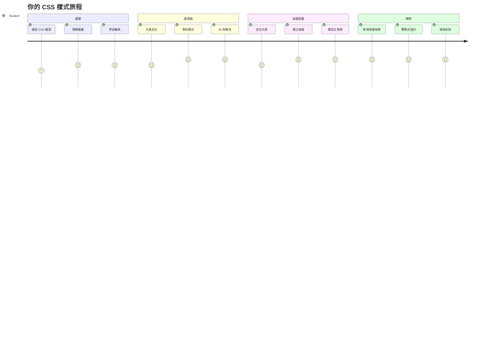
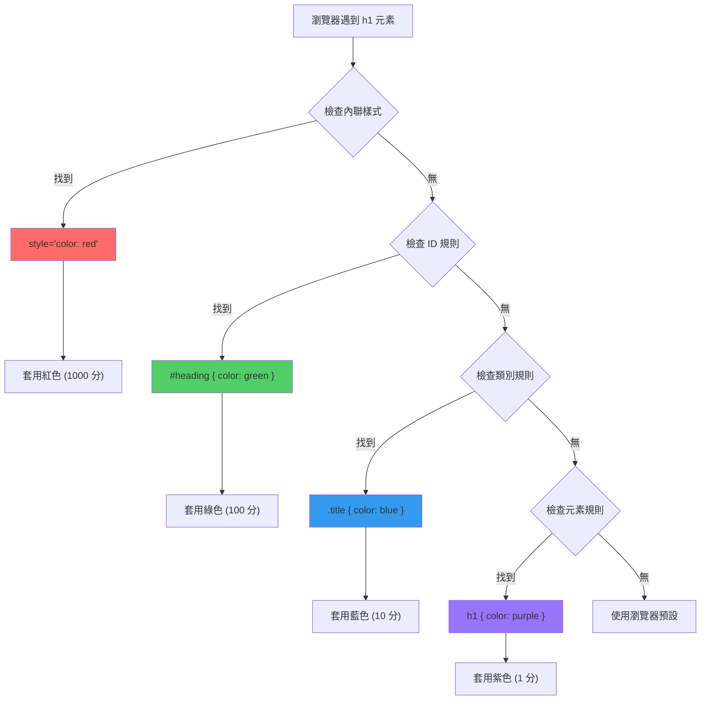
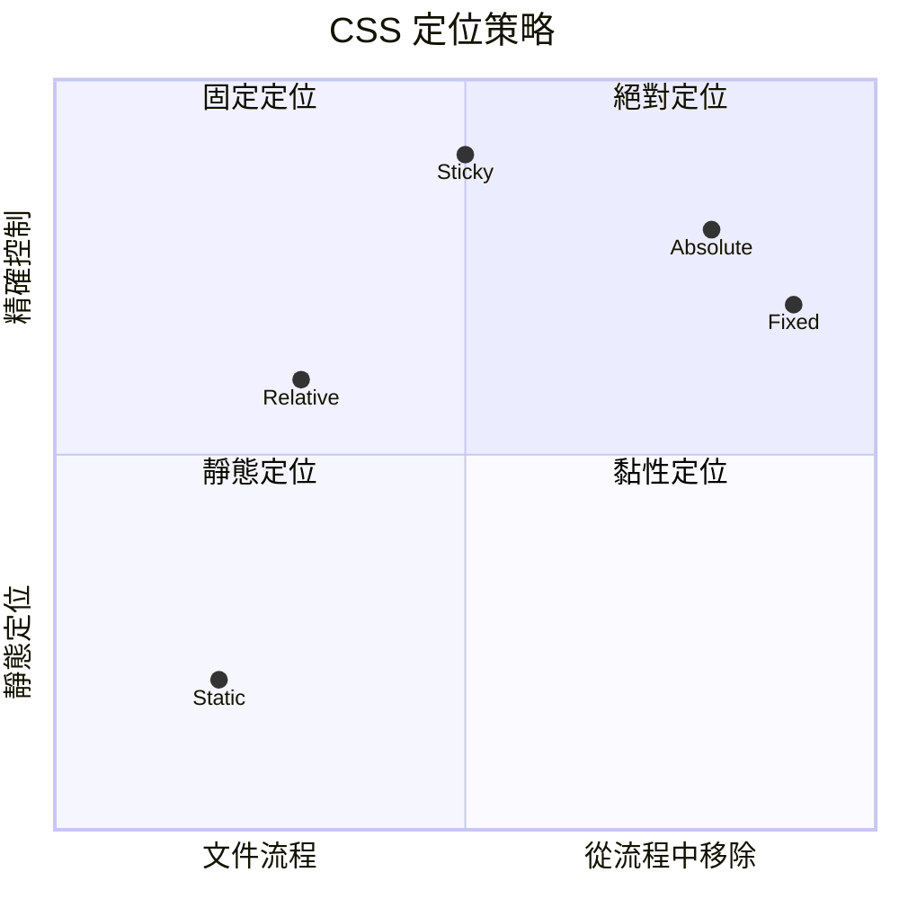
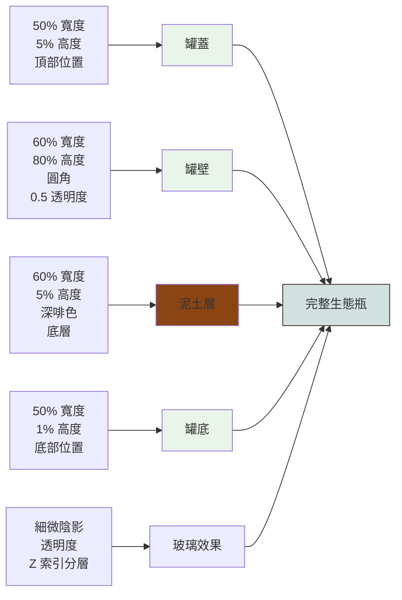

<!--
CO_OP_TRANSLATOR_METADATA:
{
  "original_hash": "e39f3a4e3bcccf94639e3af1248f8a4d",
  "translation_date": "2026-01-06T13:04:33+00:00",
  "source_file": "3-terrarium/2-intro-to-css/README.md",
  "language_code": "hk"
}
-->
# Terrarium Project Part 2: CSS 入門



> Sketchnote 由 [Tomomi Imura](https://twitter.com/girlie_mac) 製作

還記得你的 HTML terrarium 看起來相當簡單嗎？CSS 就是將那個普通結構變得視覺吸引的關鍵。

如果說 HTML 就像搭建房子的框架，那 CSS 就是讓它成為家的所有元素—牆面顏色、傢俱擺設、燈光，以及房間之間的流動。想想凡爾賽宮剛開始只是簡單的狩獵小屋，精心的裝飾和佈局使它成為世界上最壯麗的建築之一。

今天，我們會把你的 terrarium 從功能性變得精緻。你會學到如何精準定位元素，讓佈局對不同螢幕尺寸有反應，並創造出吸引網站使用者的視覺效果。

課程結束時，你會看到策略性的 CSS 樣式如何大幅提升你的專案。讓我們一起給你的 terrarium 加點風格吧。

```mermaid
mindmap
  root((CSS 基礎知識))
    Cascade
      Specificity Rules[特定性規則]
      Inheritance[繼承]
      Priority Order[優先順序]
      Conflict Resolution[衝突解決]
    Selectors
      Element Tags[元素標籤]
      Classes (.class)[類別 (.class)]
      IDs (#id)[ID (#id)]
      Combinators[組合器]
    Box Model
      Margin[外距]
      Border[邊框]
      Padding[內距]
      Content[內容]
    Layout
      Positioning[定位]
      Display Types[顯示類型]
      Flexbox[彈性盒]
      Grid[網格]
    Visual Effects
      Colors[顏色]
      Shadows[陰影]
      Transitions[過渡]
      Animations[動畫]
    Responsive Design
      Media Queries[媒體查詢]
      Flexible Units[彈性單位]
      Viewport Meta[檢視區元資料]
      Mobile First[行動優先]
```
## 講前小測驗

[講前小測驗](https://ff-quizzes.netlify.app/web/quiz/17)

## CSS 基本入門

很多人認為 CSS 只是「讓東西漂亮」，但它的用途遠不止於此。CSS 就像電影導演—不只控制外觀，還能決定移動方式、互動反應，以及如何適應不同情況。

現代 CSS 非常強大。你能撰寫自動調整手機、平板和桌面電腦布局的程式碼。還可以創造引導使用者注意力的流暢動畫。當一切協同運作時，效果令人驚豔。

> 💡 **專業提示**：CSS 持續進化，加入新功能與能力。使用新 CSS 功能前，務必查看 [CanIUse.com](https://caniuse.com) 以確認瀏覽器支援度。

**本課程目標：**
- **用現代 CSS 技術** 創造完整的 terrarium 視覺設計
- **探索** 基本概念，例如層疊、繼承和 CSS 選擇器
- **實作** 響應式定位與佈局策略
- **建構** terrarium 容器，運用 CSS 形狀與樣式

### 先備條件

你應該已完成上堂課的 terrarium HTML 結構，並準備好進行樣式設定。

> 📺 **教學影片**：看看這個實用的影片導覽
>
> [](https://www.youtube.com/watch?v=6yIdOIV9p1I)

### 設定你的 CSS 檔案

開始設定樣式前，需將 CSS 連結到 HTML。這個連結告訴瀏覽器在哪裏尋找 terrarium 的樣式說明。

在 terrarium 資料夾中建立名為 `style.css` 的新檔案，接著在你的 HTML 文件 `<head>` 區段加入連結：

```html
<link rel="stylesheet" href="./style.css" />
```

**此段程式碼功能說明：**
- **建立** HTML 與 CSS 檔案之間的連結
- **告訴**瀏覽器載入並套用 `style.css` 的樣式
- **使用** `rel="stylesheet"` 屬性表示這是 CSS 檔案
- **透過** `href="./style.css"` 指定檔案路徑

## 認識 CSS 層疊效果

你是否好奇為何稱 CSS 為「層疊」樣式表？樣式像瀑布一樣往下流，有時候彼此會衝突。

想像軍隊指揮系統—將軍命令「所有士兵穿綠色」，但特定單位接到命令「典禮穿藍色制服」。更具體的指令會優先執行。CSS 也類似，了解此層級關係可讓除錯變得簡單。

### 層疊優先權實驗

我們來看層疊實際運作，先在 `<h1>` 標籤加入內嵌樣式：

```html
<h1 style="color: red">My Terrarium</h1>
```

**此段程式碼功能說明：**
- **直接給予** `<h1>` 紅色文字，使用內嵌樣式
- **利用** `style` 屬性在 HTML 內嵌 CSS
- **創造** 最高優先權的樣式規則於該元素

接著在 `style.css` 加入這條規則：

```css
h1 {
  color: blue;
}
```

**上面的設定：**
- **定義** 針對所有 `<h1>` 元素的 CSS 規則
- **將** 文字色設為藍色，透過外部樣式表
- **優先權低** 於內嵌樣式

✅ **知識檢測**：你的網站顯示哪個顏色？為何該顏色勝出？你能想到哪些情境會需要覆寫樣式嗎？


> 💡 **CSS 優先順序（由高到低）:**
> 1. **內嵌樣式** (style 屬性)
> 2. **ID 選擇器** (#myId)
> 3. **類別** (.myClass) 和屬性選擇器
> 4. **元素選擇器** (h1, div, p)
> 5. **瀏覽器預設**

## CSS 繼承原理

CSS 繼承就像基因遺傳—元素會繼承父元素的某些屬性。如果你在 body 設定字型，所有內部文字自動使用該字型。這有點像哈布斯堡王朝家族特徵的明顯下巴一代代遺傳。

但不是所有屬性都會繼承。字型和顏色會繼承，邊距和邊框等佈局屬性則不會。就像小孩可能遺傳父母的長相，但不見得穿父母的時尚風格。

### 觀察字體繼承

透過設定 `<body>` 的字型，來實作繼承效果：

```css
body {
  font-family: 'Segoe UI', Tahoma, Geneva, Verdana, sans-serif;
}
```

**說明：**
- **設定** 全頁字型，針對 `<body>` 元素
- **使用** 多種字型備援沾功能，增強瀏覽器的兼容性
- **採用** 現代系統字型，跨作業系統呈現佳
- **確保** 除非特別覆寫，所有子元素繼承此字型

打開瀏覽器開發者工具（F12），切換至 Elements，檢查 `<h1>`，可看到它繼承 body 的字型：


✅ **實驗時間**：試著在 `<body>` 設定其他可繼承屬性如 `color`、`line-height`、`text-align`。你的標題和其他元素會發生什麼事？

> 📝 **可繼承屬性範例**：`color`、`font-family`、`font-size`、`line-height`、`text-align`、`visibility`
>
> **不可繼承屬性範例**：`margin`、`padding`、`border`、`width`、`height`、`position`

### 🔄 **教學檢核**
**CSS 基礎理解**：在學習選擇器前，確保你能：
- ✅ 解釋層疊和繼承的差異
- ✅ 預測字體優先權衝突中哪個會勝出
- ✅ 識別哪些屬性會繼承父元素
- ✅ 正確連結 CSS 檔案到 HTML

**快速測試**：若有以下樣式，`<div class="special">` 中的 `<h1>` 會是什麼顏色？
```css
div { color: blue; }
.special { color: green; }
h1 { color: red; }
```
*答案：紅色（元素選擇器直接針對 h1）*

## 精通 CSS 選擇器

CSS 選擇器是針對特定元素應用樣式的方式。它就像給出精確方向，與其說「那棟房子」，不如說「楓樹街上紅門的藍色房子」。

CSS 有多種精確程度，選擇正確的選擇器就像挑選合適工具。有時你想給整區所有門塗色，有時只要針對一扇門。

### 元素選擇器（標籤）

元素選擇器根據標籤名稱標的 HTML 元素，適合設定廣泛適用的基礎樣式：

```css
body {
  font-family: 'Segoe UI', Tahoma, Geneva, Verdana, sans-serif;
  margin: 0;
  padding: 0;
}

h1 {
  color: #3a241d;
  text-align: center;
  font-size: 2.5rem;
  margin-bottom: 1rem;
}
```

**理解這些樣式：**
- **對整頁** 用 `body` 設定一致的字型排版
- **移除** 瀏覽器預設的邊距與內距，方便控制
- **為** 所有標題元素設定顏色、對齊與間距
- **使用** `rem` 單位，確保字型大小可延展且易讀

元素選擇器非常適合設定通用風格，但對於 terrarium 內部像植物這類個別元件，需要更細緻選擇器。

### ID 選擇器：獨特元素

ID 選擇器使用 `#`，針對具有特定 `id` 屬性的元素。因 ID 在頁面中應唯一，非常適合為獨特元素（如左、右兩邊的植物容器）設定樣式。

讓我們設計 terrarium 側邊容器的樣式，放置植物：

```css
#left-container {
  background-color: #f5f5f5;
  width: 15%;
  left: 0;
  top: 0;
  position: absolute;
  height: 100vh;
  padding: 1rem;
  box-sizing: border-box;
}

#right-container {
  background-color: #f5f5f5;
  width: 15%;
  right: 0;
  top: 0;
  position: absolute;
  height: 100vh;
  padding: 1rem;
  box-sizing: border-box;
}
```

**此段程式碼成果：**
- **用** `absolute` 定位把容器固定在左右兩側
- **使用** `vh`（視窗高度）單位製作響應式高度
- **設定** `box-sizing: border-box`，包含 padding 計算寬度
- **移除** `px` 單位的零值，使程式碼更乾淨
- **搭配** 柔和背景色，較不刺眼

✅ **程式碼質量挑戰**：此 CSS 違反 DRY（不要重複自己）原則，你能用 ID 和類別混合重構它嗎？

**改良方法：**
```html
<div id="left-container" class="container"></div>
<div id="right-container" class="container"></div>
```

```css
.container {
  background-color: #f5f5f5;
  width: 15%;
  top: 0;
  position: absolute;
  height: 100vh;
  padding: 1rem;
  box-sizing: border-box;
}

#left-container {
  left: 0;
}

#right-container {
  right: 0;
}
```

### 類別選擇器：可復用樣式

類別選擇器用 `.` 表示，適合將相同樣式套用到多個元素。與 ID 不同，類別可多處重複使用，非常適合樣式一致性的模式。

在 terrarium 裡，每株植物需要共用樣式，但位置不同。可用類別分享樣式，ID 定位。

**這是每株植物的 HTML 結構：**
```html
<div class="plant-holder">
  
</div>
```

**重點說明：**
- **用** `class="plant-holder"` 統一容器樣式
- **用** `class="plant"` 統一植物圖像樣式與行為
- **用** 唯一 `id="plant1"` 作特定定位與 JavaScript 操作
- **使用** 描述性 alt 文字供輔助工具使用

接著把這些樣式加進 `style.css`：

```css
.plant-holder {
  position: relative;
  height: 13%;
  left: -0.6rem;
}

.plant {
  position: absolute;
  max-width: 150%;
  max-height: 150%;
  z-index: 2;
  transition: transform 0.3s ease;
}

.plant:hover {
  transform: scale(1.05);
}
```

**解析這些樣式：**
- **為** plant holder 設定相對定位，建立定位情境
- **每個** plant holder 高度 13%，確保所有植物垂直可見且不需捲動
- **輕微** 左移容器，更好對齊植物
- **植物** 利用最大寬高限制，自主縮放保持比例
- **使用** `z-index` 將植物置於 terrarium 其他元素之上
- **加入** 平滑變化的懸停效果，提升互動感

✅ **批判思考**：為什麼同時要有 `.plant-holder` 和 `.plant`？若只用一個會怎樣？

> 💡 **設計模式**：容器 `.plant-holder` 控制佈局和定位，內容 `.plant` 控制外觀與縮放。分工讓程式碼更易維護與彈性。

## CSS 定位原理

CSS 定位就像舞台導演，指揮每個角色在哪站位、如何移動。有些角色遵循一般規則，有些角色需要特定定位才能呈現戲劇效果。

一旦明白定位，許多佈局問題都迎刃而解。想要不動的導覽列？定位辦得到。想要具體位置的提示工具？定位同樣沒問題。

### 五種定位值


| 定位值 | 行為 | 使用場合 |
|----------------|----------|----------|
| `static` | 預設流，忽略 top/left/right/bottom | 正常文件佈局 |
| `relative` | 相對本身正常位置定位 | 小幅調整，建立定位上下文 |
| `absolute` | 相對最近已定位祖先定位 | 精確擺放，疊加效果 |
| `fixed` | 相對視窗定位 | 固定導覽列、浮動元素 |
| `sticky` | 根據捲動切換相對與固定 | 捲動置頂標頭 |

### 我們的 terrarium 定位策略

terrarium 應用多種類型定位，做出目標佈局：

```css
/* Container positioning */
.container {
  position: absolute; /* Removes from normal flow */
  /* ... other styles ... */
}

/* Plant holder positioning */
.plant-holder {
  position: relative; /* Creates positioning context */
  /* ... other styles ... */
}

/* Plant positioning */
.plant {
  position: absolute; /* Allows precise placement within holder */
  /* ... other styles ... */
}
```

**解讀定位策略：**
- **絕對定位容器** 脫離文件流，固定於螢幕邊緣
- **相對定位植物容器** 建立定位上下文，仍保留文件流
- **絕對定位植物** 可精準定位於其相對容器內
- **此組合** 可讓植物垂直堆疊，且可個別定位

> 🎯 **重要原因**：`plant` 元素需絕對定位，才能在下一課實作拖拉功能。絕對定位將它們從正常佈局中抽離，使拖放互動成為可能。

✅ **實驗時間**：嘗試替換定位值並觀察結果：
- 若將 `.container` 從 `absolute` 改為 `relative` 會怎樣？
- 如果 `.plant-holder` 使用 `absolute` 而不是 `relative`，佈局會有什麼變化？
- 當你將 `.plant` 改成 `relative` 定位時會發生什麼？

### 🔄 **教學檢查點**
**CSS 定位精通**：暫停確認你的理解：
- ✅ 你能解釋為什麼植物需要絕對定位來實現拖放嗎？
- ✅ 你了解相對容器如何創造定位上下文嗎？
- ✅ 為什麼側邊容器使用絕對定位？
- ✅ 如果完全移除定位聲明會發生什麼？

**現實世界的聯繫**：想想 CSS 定位如何映射現實世界的佈局：
- **Static**：書架上的書（自然排列）
- **Relative**：稍微移動書本，但保持位置
- **Absolute**：把書籤放在確切的頁數
- **Fixed**：粘著便條紙，在翻頁時保持可見

## 使用 CSS 建造生態瓶

現在我們將只用 CSS 建造一個玻璃罐—不需要圖片或繪圖軟件。

利用定位和透明度來創造逼真的玻璃、陰影與深度效果，展示CSS的視覺能力。此技術類似包豪斯運動建築師用簡單幾何形體創造複雜美麗建築。了解這些原則後，你將能認出許多網站設計背後的 CSS 技巧。


### 建造玻璃罐組件

讓我們逐一建造生態瓶罐的各部分。每個部分都使用絕對定位以及百分比大小以達到響應式設計：

```css
.jar-walls {
  height: 80%;
  width: 60%;
  background: #d1e1df;
  border-radius: 1rem;
  position: absolute;
  bottom: 0.5%;
  left: 20%;
  opacity: 0.5;
  z-index: 1;
  box-shadow: inset 0 0 2rem rgba(0, 0, 0, 0.1);
}

.jar-top {
  width: 50%;
  height: 5%;
  background: #d1e1df;
  position: absolute;
  bottom: 80.5%;
  left: 25%;
  opacity: 0.7;
  z-index: 1;
  border-radius: 0.5rem 0.5rem 0 0;
}

.jar-bottom {
  width: 50%;
  height: 1%;
  background: #d1e1df;
  position: absolute;
  bottom: 0;
  left: 25%;
  opacity: 0.7;
  border-radius: 0 0 0.5rem 0.5rem;
}

.dirt {
  width: 60%;
  height: 5%;
  background: #3a241d;
  position: absolute;
  border-radius: 0 0 1rem 1rem;
  bottom: 1%;
  left: 20%;
  opacity: 0.7;
  z-index: -1;
}
```

**了解生態瓶的構造：**
- **使用**百分比尺寸，實現在所有螢幕尺寸上的響應式縮放
- **絕對定位**元素以精確堆疊和對齊
- **應用**不同透明度值來創造玻璃的透光效果
- **實施**`z-index`分層，讓植物看起來在罐子內部
- **加入**微妙的盒陰影和圓角，讓外觀更真實

### 使用百分比的響應式設計

注意所有尺寸都使用百分比，而非固定像素值：

**為什麼這很重要：**
- **確保**生態瓶在任意螢幕尺寸上按比例縮放
- **維持**罐子組件之間的視覺關係
- **提供**從手機到大螢幕桌面一致的體驗
- **允許**設計適應變化，不破壞視覺佈局

### CSS 單位的運用

我們使用 `rem` 單位為 border-radius 設定大小，這會相對於根字體大小縮放，創建更可及的設計，尊重使用者字體偏好。詳細可參考官方規範的 [CSS relative units](https://www.w3.org/TR/css-values-3/#font-relative-lengths)。

✅ **視覺實驗**：嘗試修改這些值並觀察效果：
- 將罐子透明度從 0.5 改為 0.8 — 玻璃外觀如何變化？
- 調整污土顏色從 `#3a241d` 改為 `#8B4513` — 視覺影響是什麼？
- 將污土的 `z-index` 改為 2 — 分層順序會怎樣？

### 🔄 **教學檢查點**
**CSS 視覺設計理解**：確認你對視覺 CSS 的掌握：
- ✅ 百分比尺寸如何創造響應式設計？
- ✅ 為什麼透明度能營造玻璃透光效果？
- ✅ `z-index` 在元素分層中扮演什麼角色？
- ✅ border-radius 如何塑造罐子形狀？

**設計原則**：注意我們如何用簡單圖形構建複雜視覺：
1. **矩形** → **圓角矩形** → **罐子組件**
2. **純色** → **透明度** → **玻璃效果**
3. **單一元素** → **分層組合** → **3D 外觀**

---

## GitHub Copilot Agent 挑戰 🚀

使用 Agent 模式完成以下挑戰：

**說明：** 創建一個 CSS 動畫，讓生態瓶中的植物輕輕搖擺，模擬自然微風吹拂效果。這將幫助你練習 CSS 動畫、變形和關鍵影格，並提升生態瓶的視覺吸引力。

**提示：** 為 `.plant` 類添加 CSS 關鍵影格動畫，使植物輕輕左右擺動。創建一個擺動動畫，使每株植物沿水平方向旋轉約 2-3 度，持續時間 3-4 秒，且動畫無限循環，並使用平滑的緩動函數。

在這了解更多[Agent 模式](https://code.visualstudio.com/blogs/2025/02/24/introducing-copilot-agent-mode)。

## 🚀 挑戰：加入玻璃反光效果

準備好用逼真的玻璃反光效果增強你的生態瓶了嗎？這技術將增加層次感與真實感。

你將創建細膩的高光，模擬光線如何在玻璃面反射。這類似文藝復興畫家 Jan van Eyck 利用光影與反射使繪畫中的玻璃呈現立體感。目標如下：


**你的挑戰：**
- **創建**細膩的白色或淺色橢圓形，用於玻璃反光
- **策略性定位**在罐子左側
- **應用**適當透明度和模糊效果，模擬真實光反射
- **使用**`border-radius` 創造自然泡泡狀形狀
- **嘗試**漸層或盒陰影以增強真實感

## 課後測驗

[課後測驗](https://ff-quizzes.netlify.app/web/quiz/18)

## 擴展你的 CSS 知識

CSS 一開始可能會覺得複雜，但掌握這些核心概念將為進階技巧打下紮實基礎。

**接下來的 CSS 學習領域：**
- **Flexbox** - 簡化元素對齊和分佈
- **CSS Grid** - 強大工具，建造複雜佈局
- **CSS 變數** - 減少重複，提升維護性
- **響應式設計** - 確保網站適用不同螢幕尺寸

### 互動學習資源

用這些有趣的實作遊戲練習概念：
- 🐸 [Flexbox Froggy](https://flexboxfroggy.com/) - 通過挑戰精通 Flexbox
- 🌱 [Grid Garden](https://codepip.com/games/grid-garden/) - 種胡蘿蔔學 CSS Grid
- 🎯 [CSS Battle](https://cssbattle.dev/) - 編碼挑戰測試你的 CSS 技能

### 額外學習

欲獲得完整 CSS 基礎教學，完成這個 Microsoft Learn 課程：[使用 CSS 美化你的 HTML 應用程式](https://docs.microsoft.com/learn/modules/build-simple-website/4-css-basics/?WT.mc_id=academic-77807-sagibbon)

### ⚡ **接下來 5 分鐘你可以做**
- [ ] 開啟 DevTools，使用 Elements 面板檢查任一網站 CSS 樣式
- [ ] 建立簡單 CSS 文件並連結至 HTML 頁面
- [ ] 嘗試用不同方式改色：十六進位、RGB、命名顏色
- [ ] 練習盒模型，為 div 加入 padding 和 margin

### 🎯 **這小時你能完成的目標**
- [ ] 完成課後測驗並複習 CSS 基礎
- [ ] 用字型、顏色和間距美化你的 HTML 頁面
- [ ] 使用 flexbox 或 grid 建立簡單佈局
- [ ] 嘗試 CSS 過渡效果，實現流暢效果
- [ ] 利用媒體查詢練習響應式設計

### 📅 **你的 CSS 一週冒險**
- [ ] 完成生態瓶樣式作業並加添創意
- [ ] 精通 CSS Grid，打造相片集佈局
- [ ] 學習 CSS 動畫讓設計生動起來
- [ ] 探索 Sass 或 Less 等 CSS 預處理器
- [ ] 研究設計原則並應用於 CSS
- [ ] 分析並重現你在線看到的有趣設計

### 🌟 **你的 CSS 一個月設計精通**
- [ ] 建立完整響應式網站設計系統
- [ ] 學習 CSS-in-JS 或類似 Tailwind 的功能型框架
- [ ] 為開源專案貢獻 CSS 優化
- [ ] 精通進階 CSS 概念，如客製屬性與內容隔離
- [ ] 創建可重用的組件庫與模組化 CSS
- [ ] 指導 CSS 初學者並分享設計心得

## 🎯 你的 CSS 精通時間表

```mermaid
timeline
    title CSS 學習進度
    
    section 基礎 (10分鐘)
        檔案連結：將 CSS 連結到 HTML
                     ：了解層疊規則
                     ：學習繼承基礎
        
    section 選擇器 (15分鐘)
        目標元素：元素選擇器
                    ：類別模式
                    ：ID 特異性
                    ：組合器
        
    section 盒模型 (20分鐘)
        版面基礎：外邊距與內邊距
                    ：邊框屬性
                    ：內容尺寸
                    ：盒模型行為
        
    section 定位 (25分鐘)
        元素位置：靜態與相對定位
                    ：絕對定位
                    ：Z 索引層次
                    ：響應單位
        
    section 視覺設計 (30分鐘)
        樣式掌握：顏色與透明度
                    ：陰影與特效
                    ：過渡效果
                    ：變形屬性
        
    section 響應式設計 (45分鐘)
        多裝置支援：媒體查詢
                      ：彈性版面
                      ：行動優先
                      ：視口最佳化
        
    section 進階技術 (1週)
        現代 CSS：Flexbox 版面
                  ：CSS Grid 系統
                  ：自訂屬性
                  ：動畫關鍵影格
        
    section 專業能力 (1個月)
        CSS 架構：元件模式
                  ：可維護程式碼
                  ：效能優化
                  ：跨瀏覽器相容性
```


### 🛠️ 你的 CSS 工具總結

完成本課後，你已掌握：
- **層疊理解**：樣式如何繼承與覆蓋
- **選擇器精通**：準確鎖定元素、類別與 ID
- **定位技巧**：策略性擺放與分層
- **視覺設計**：創造玻璃效果、陰影與透明度
- **響應式技術**：百分比佈局，適應任意螢幕
- **代碼組織**：整潔且易維護的 CSS 結構
- **現代實踐**：運用相對單位與可及設計模式

**下一步**：你的生態瓶已有結構（HTML）與樣式（CSS）。最後一課將用 JavaScript 加入互動！  

## 作業

[CSS 重構](assignment.md)

---

<!-- CO-OP TRANSLATOR DISCLAIMER START -->
**免責聲明**：  
本文件由 AI 翻譯服務 [Co-op Translator](https://github.com/Azure/co-op-translator) 進行翻譯。雖然我們致力於追求準確性，請注意自動翻譯可能包含錯誤或不準確之處。原始文件的母語版本應被視為權威來源。對於關鍵資訊，建議聘請專業人工翻譯。因使用本翻譯所產生的任何誤解或誤譯，我們概不負責。
<!-- CO-OP TRANSLATOR DISCLAIMER END -->