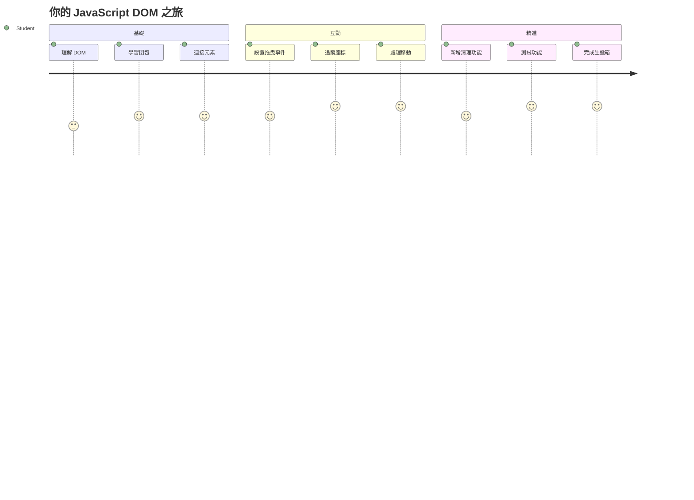
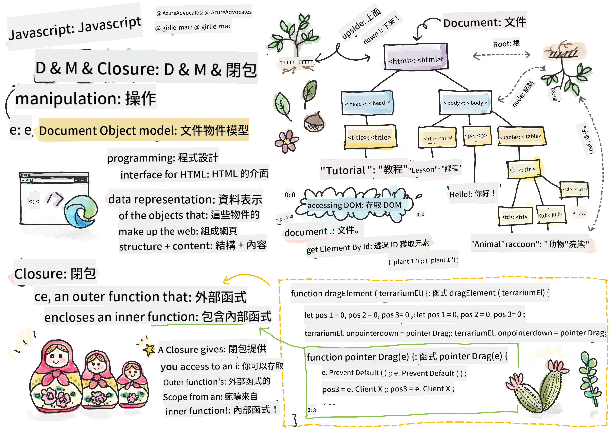
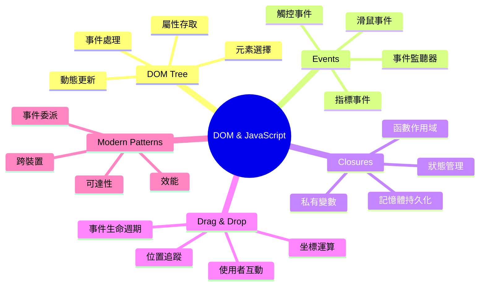
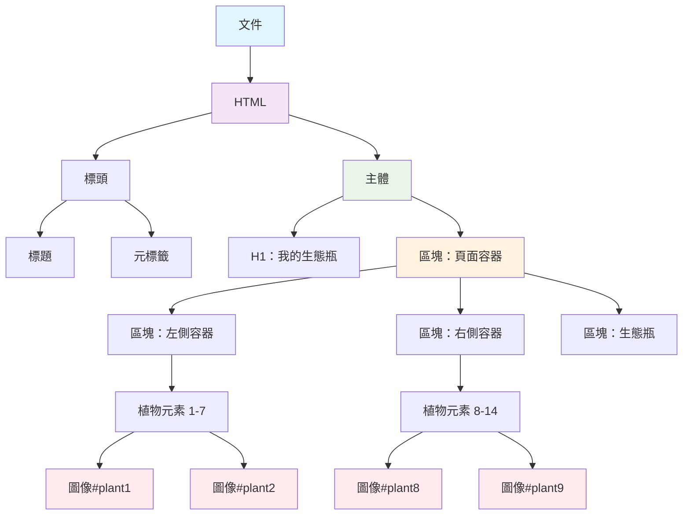
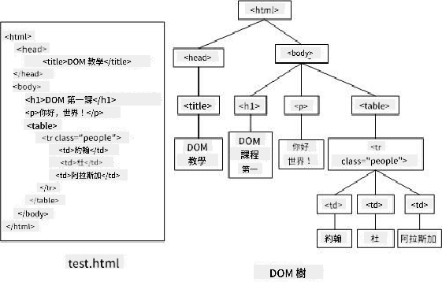
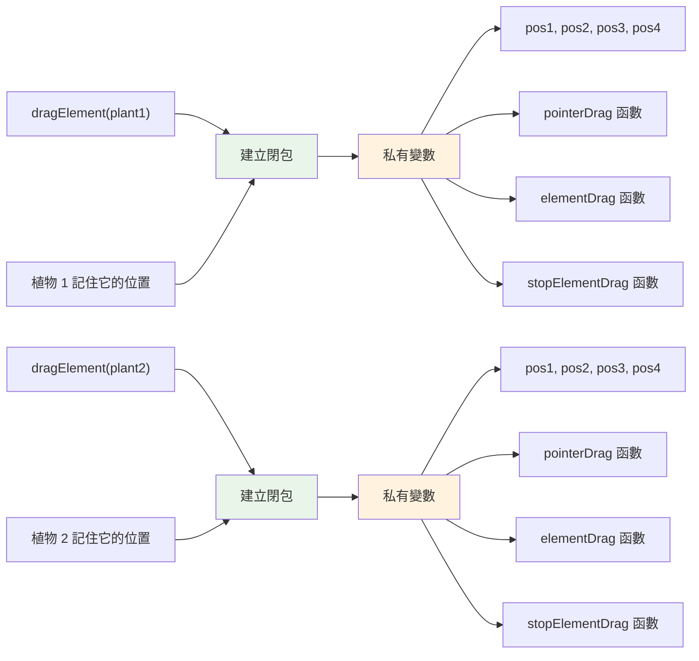
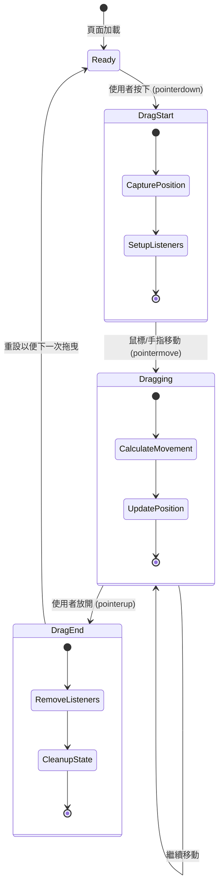
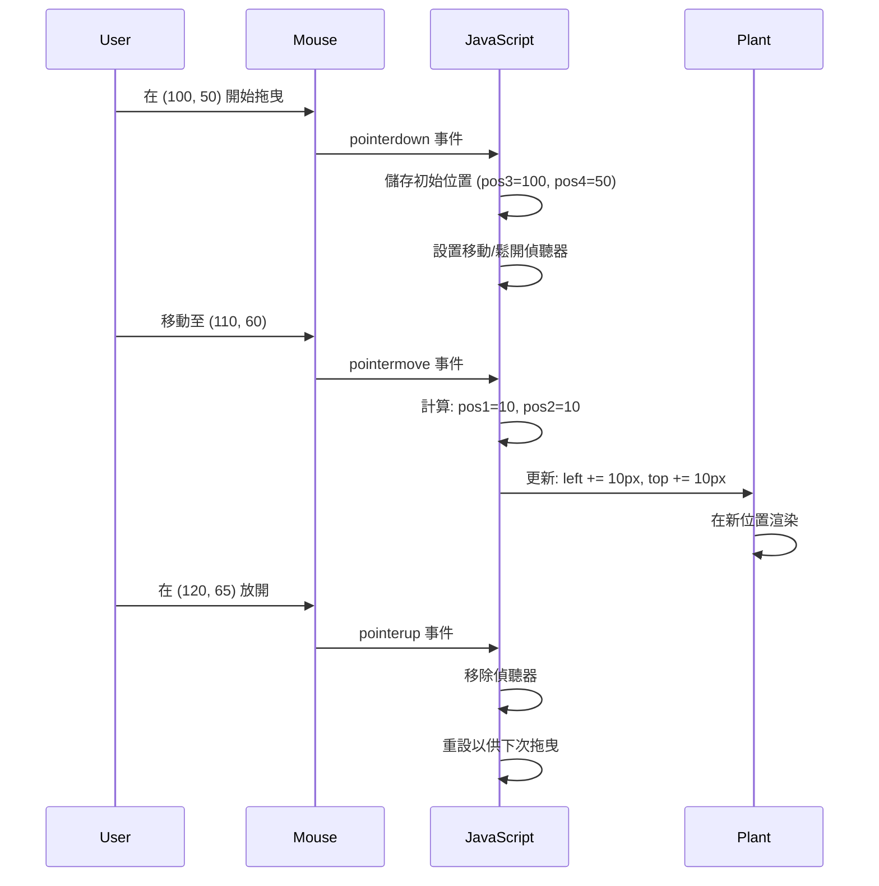
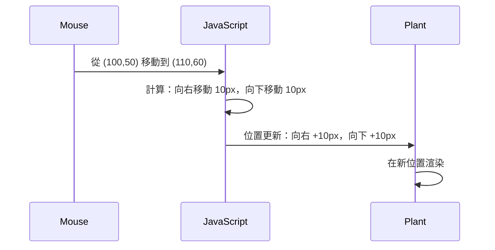
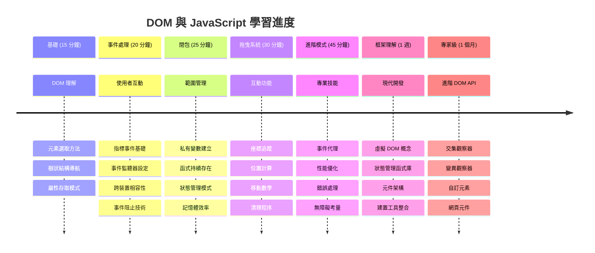

<!--
CO_OP_TRANSLATOR_METADATA:
{
  "original_hash": "973e48ad87d67bf5bb819746c9f8e302",
  "translation_date": "2026-01-06T13:01:48+00:00",
  "source_file": "3-terrarium/3-intro-to-DOM-and-closures/README.md",
  "language_code": "hk"
}
-->
# Terrarium 項目第三部分：DOM 操作與 JavaScript 閉包



> Sketchnote 由 [Tomomi Imura](https://twitter.com/girlie_mac) 製作

歡迎來到網頁開發中最吸引人的部分之一——讓事物互動起來！文件物件模型（DOM）就像你的 HTML 與 JavaScript 之間的橋樑，今天我們將利用它讓你的植物箱活起來。當 Tim Berners-Lee 發明第一台網頁瀏覽器時，他就想像了一個文件可以動態且互動的網路，而 DOM 讓這個願景成為可能。

我們還會探索 JavaScript 閉包，這聽起來一開始可能會令人害怕。你可以把閉包想成創造「記憶口袋」，讓你的函數能記住重要資訊。就像你植物箱中的每棵植物各自擁有自己的資料記錄以追蹤位置一樣。在這課結束時，你會明白閉包是多麼自然且實用。

我們要做的是這樣的：一個讓使用者可以將植物拖放到任意位置的植物箱。你將學會推動從拖放檔案上傳到互動遊戲的 DOM 操作技巧。讓我們來讓你的植物箱活起來。


## 講課前測驗

[講課前測驗](https://ff-quizzes.netlify.app/web/quiz/19)

## 了解 DOM：你通往互動網頁的門戶

文件物件模型（DOM）是 JavaScript 與 HTML 元素溝通的方式。當你的瀏覽器載入 HTML 頁面時，它會在記憶體中建立該頁面的結構化表示，那就是 DOM。可以把它想成一棵家譜樹，頁面中的每個 HTML 元素都是家族成員，而 JavaScript 可以存取、修改或重新排列他們。

DOM 操作能將靜態網頁轉變成互動式網站。每次你看到按鈕在滑鼠懸停時改變顏色、內容在不重新載入頁面下更新或可以拖曳的元素，那就是 DOM 操作在運作。




> DOM 與對應 HTML 標記的示意圖。來自 [Olfa Nasraoui](https://www.researchgate.net/publication/221417012_Profile-Based_Focused_Crawler_for_Social_Media-Sharing_Websites)

**以下使 DOM 強大的原因：**
- **提供** 一種結構化方式存取頁面上的任何元素
- **使得** 在不用重新整理的情況下動態更新內容成為可能
- **允許** 即時對使用者互動如點擊與拖曳做出回應
- **創造** 現代互動式網頁應用程式的基礎

## JavaScript 閉包：創造有組織且強大的程式碼

[JavaScript 閉包](https://developer.mozilla.org/docs/Web/JavaScript/Closures) 就像給函數自己的私人工作區，裡面有持續存在的記憶。想像達爾文在加拉巴哥群島上每種雀鳥根據環境發展出專門喙的故事——閉包也是類似，創造專門的函數，使其「記得」特定上下文，即使父函數已經完成執行。

在我們的植物箱中，閉包讓每棵植物能獨立記住自己的位置。這種模式在專業 JavaScript 開發中到處可見，是個非常寶貴的概念。


> 💡 **理解閉包**：閉包是 JavaScript 中一個重要主題，許多開發者使用多年後才完全掌握所有理論面。今天我們主要探討實務應用——你會自然看到閉包在我們建構互動功能時出現。當你看到它們如何解決實際問題，理解就會逐漸形成。


> DOM 與對應 HTML 標記的示意圖。來自 [Olfa Nasraoui](https://www.researchgate.net/publication/221417012_Profile-Based_Focused_Crawler_for_Social_Media-Sharing_Websites)

在本課中，我們將完成互動植物箱專案，寫出 JavaScript 讓使用者能操控頁面上的植物。

## 開始之前：為成功做準備

你需要之前植物箱課程的 HTML 與 CSS 檔案——我們即將把靜態設計變成交互式。如果你是第一次加入，先完成那些課程會有重要的背景知識。

以下是我們要做的事：
- **為所有植物實現流暢的拖放功能**
- **追蹤座標，讓植物記住自己的位置**
- **建立完整的互動介面，使用純 JavaScript**
- **用閉包模式寫出乾淨、有組織的程式碼**

## 設定你的 JavaScript 檔案

讓我們開始建立讓你的植物箱互動的 JavaScript 檔案。

**步驟 1：建立你的程式檔**

在你的植物箱資料夾中，建立一個新檔案命名為 `script.js`。

**步驟 2：將 JavaScript 連結到你的 HTML**

在你的 `index.html` 的 `<head>` 區塊加入這個 script 標籤：

```html
<script src="./script.js" defer></script>
```

**`defer` 屬性的重要性：**
- **確保** JavaScript 等待所有 HTML 載入完成後才執行
- **避免** JavaScript 在元素尚未準備好時尋找它們而造成錯誤
- **保證** 所有植物元素都可被互動使用
- **比把 script 放到頁面底部有更好的效能**

> ⚠️ **重要提醒**：`defer` 屬性可以避免常見的時序問題。沒有它，JavaScript 可能嘗試存取還沒載入的 HTML 元素，導致錯誤。

---

## 將 JavaScript 與 HTML 元素連結

在讓元素可拖放前，JavaScript 需要找到它們，在 DOM 中定位它們。可以把這看成圖書館的目錄系統——只要有目錄號碼，你就能準確找到想要的書。

我們會使用 `document.getElementById()` 來建立這連結。這就像有一個精確的檔案系統——你給出 ID，它就能找到你 HTML 中的正確元素。

### 讓所有植物都能拖曳

在你的 `script.js` 檔案加入以下程式碼：

```javascript
// 啟用所有14種植物的拖曳功能
dragElement(document.getElementById('plant1'));
dragElement(document.getElementById('plant2'));
dragElement(document.getElementById('plant3'));
dragElement(document.getElementById('plant4'));
dragElement(document.getElementById('plant5'));
dragElement(document.getElementById('plant6'));
dragElement(document.getElementById('plant7'));
dragElement(document.getElementById('plant8'));
dragElement(document.getElementById('plant9'));
dragElement(document.getElementById('plant10'));
dragElement(document.getElementById('plant11'));
dragElement(document.getElementById('plant12'));
dragElement(document.getElementById('plant13'));
dragElement(document.getElementById('plant14'));
```

**這段程式碼完成了什麼：**
- **定位** 每個植物元素於 DOM 中，根據其獨特的 ID
- **取得** JavaScript 對應的 HTML 元素參考
- **將** 每個元素傳遞給 `dragElement` 函數（接下來我們會寫）
- **準備** 每棵植物成為可拖放物件
- **橋接** 你的 HTML 結構與 JavaScript 功能

> 🎯 **為什麼用 ID 而不用 Class？** ID 是專屬於特定元素的唯一識別碼，而 CSS 的類別（class）主要是用來對多個元素做樣式設定。當 JavaScript 需要操作單一元素時，ID 提供了精確且效能佳的方式。

> 💡 **小貼士**：注意我們對每棵植物都呼叫了 `dragElement()` 一次。這確保每棵植物都有獨立的拖曳行為，這對流暢的使用體驗很重要。

### 🔄 **教學回顧檢查**
**DOM 連結理解**：在進入拖曳功能前，確認你理解：
- ✅ 如何用 `document.getElementById()` 定位 HTML 元素
- ✅ 為什麼我們為每棵植物使用獨特的 ID
- ✅ script 標籤中 `defer` 屬性的目的
- ✅ JavaScript 與 HTML 透過 DOM 如何互相連接

**自我測試**：如果兩個元素有相同 ID，會發生什麼事？為什麼 `getElementById()` 只回傳一個元素？
*答案：ID 應該唯一；如果重複，只有第一個元素會被找到*

---

## 建立拖曳元素的閉包函數

現在我們來打造拖曳功能的核心：一個閉包，用來管理每棵植物的拖曳行為。這閉包包含多個內部函數，協同追蹤滑鼠移動並更新元素位置。

閉包很適合這項任務，因為它能讓我們創造「私有」變數，在函數調用間持續存在，給每棵植物獨立的座標追蹤系統。

### 用簡單範例理解閉包

讓我用一個簡單範例說明閉包的概念：

```javascript
function createCounter() {
    let count = 0; // 這就像一個私有變量
    
    function increment() {
        count++; // 內部函數會記住外部變量
        return count;
    }
    
    return increment; // 我們將內部函數返回
}

const myCounter = createCounter();
console.log(myCounter()); // 1
console.log(myCounter()); // 2
```

**這個閉包模式做了什麼：**
- **建立** 一個私有的 `count` 變數，只存在於此閉包中
- **內部函數** 可以存取並修改外部變數（這就是閉包機制）
- **我們回傳內部函數時**，它會保留與那份私有資料的連結
- **即使 `createCounter()` 執行完後**，`count` 依然存在並記得它的值

### 閉包為什麼特別適合拖曳功能

對我們的植物箱來說，每棵植物需要記住目前的位置座標。閉包提供了完美解決方案：

**專案的主要好處：**
- **獨立維持** 每棵植物私有的位置變數
- **保留** 拖曳事件間的座標數據
- **避免** 不同可拖曳元素間的變數衝突
- **創造** 乾淨且有組織的程式碼結構

> 🎯 **學習目標**：你現在不需要完全精通閉包。專注於看出它們如何幫我們整理程式碼、維持拖曳功能狀態。


### 建立 dragElement 函數

現在我們寫出控制拖曳邏輯的主要函數。把它加入你聲明植物元素的程式碼下面：

```javascript
function dragElement(terrariumElement) {
    // 初始化位置追蹤變數
    let pos1 = 0,  // 之前的滑鼠 X 位置
        pos2 = 0,  // 之前的滑鼠 Y 位置
        pos3 = 0,  // 目前的滑鼠 X 位置
        pos4 = 0;  // 目前的滑鼠 Y 位置
    
    // 設定初始拖曳事件監聽器
    terrariumElement.onpointerdown = pointerDrag;
}
```

**位置追蹤系統解說：**
- **`pos1` 和 `pos2`**：儲存舊滑鼠位置和新滑鼠位置之間的差距
- **`pos3` 和 `pos4`**：追蹤滑鼠目前的座標
- **`terrariumElement`**：我們正在改造成可拖曳的那個植物元素
- **`onpointerdown`**：使用者開始拖曳時觸發的事件

**閉包模式運作方式：**
- **為每個植物元素建立** 私有位置變數
- **在拖曳過程中維持** 這些變數
- **確保** 每棵植物獨立追蹤自己的座標
- **透過 `dragElement` 函數提供** 乾淨的介面

### 為什麼使用 pointer 事件？

你可能會想，為什麼我們用 `onpointerdown` 而不是較常見的 `onclick`。原因如下：

| 事件類型 | 適用情境 | 注意事項 |
|------------|----------|-------------|
| `onclick` | 簡單按鈕點擊 | 只能處理點擊與放開，無法拖曳 |
| `onpointerdown` | 滑鼠和觸控都適用 | 新穎且目前廣泛支援 |
| `onmousedown` | 只適用桌面滑鼠 | 忽略行動裝置使用者 |

**為什麼 pointer 事件很適合我們的需求：**
- **不論是滑鼠、手指或觸控筆** 都能正常運作
- **無論用筆電、平板或手機都一樣流暢**
- **能處理真正的拖曳動作，而非只是點擊放開**
- **帶來使用者期望的順暢體驗**

> 💡 **未來趨勢**：Pointer 事件是最新的使用者互動標準。比起寫分開的滑鼠與觸控程式碼，這種方式同時涵蓋兩者。非常酷對吧？

### 🔄 **教學回顧檢查**
**事件處理理解**：暫停確認你掌握：
- ✅ 為何用 pointer 事件而非 mouse 事件？
- ✅ 閉包變數如何在函數調用間持續存在？
- ✅ `preventDefault()` 在流暢拖曳中扮演什麼角色？
- ✅ 為什麼事件監聽器是綁在文件（document）而不是各個元素上？

**與現實連結**：想想你每天使用過的拖放介面：
- **檔案上傳**：將檔案拖到瀏覽器視窗
- **看板任務板**：任務在欄目間移動
- **圖片集**：重新排列照片順序
- **行動介面**：觸控螢幕上的滑動與拖曳

---

## pointerDrag 函數：捕捉拖曳的開始

當使用者按下植物（不論是滑鼠點擊或手指觸控），`pointerDrag` 函數就會啟動。它會存下初始座標並準備拖曳系統。

把這個函數加到你的 `dragElement` 閉包裡，緊接在 `terrariumElement.onpointerdown = pointerDrag;` 這行後面：

```javascript
function pointerDrag(e) {
    // 阻止瀏覽器預設行為（例如文字選取）
    e.preventDefault();
    
    // 捕捉初始鼠標/觸摸位置
    pos3 = e.clientX;  // 拖曳開始的 X 座標
    pos4 = e.clientY;  // 拖曳開始的 Y 座標
    
    // 設置拖曳過程的事件監聽器
    document.onpointermove = elementDrag;
    document.onpointerup = stopElementDrag;
}
```

**逐步解說：**
- **防止** 瀏覽器的預設行為，以免干擾拖曳
- **記錄** 使用者開始拖曳時的確切座標
- **建立** 對持續拖曳移動的事件監聽器
- **準備** 追蹤整個文件中的滑鼠或手指動作

### 理解事件預防

`e.preventDefault()` 這行對順暢拖曳至關重要：

**若不防止，瀏覽器可能會：**
- **選取** 用戶拖曳時劃過的文字
- **觸發** 右鍵拖曳時的選單
- **干擾** 我們自訂的拖曳功能
- **造成** 拖動過程中的視覺異常

> 🔍 **實驗**：完成本課後，試著移除 `e.preventDefault()`，觀察拖曳體驗如何改變。你會很快知道這行為什麼必要！

### 座標追蹤系統

`e.clientX` 和 `e.clientY` 屬性給出滑鼠/觸控點的精確座標：

| 屬性 | 量測項目 | 使用案例 |
|----------|------------------|----------|
| `clientX` | 相對於視窗的水平位置 | 追蹤左右移動 |
| `clientY` | 相對於視窗的垂直位置 | 追蹤上下移動 |
**了解這些座標：**
- **提供** 像素級精確的定位資訊
- **隨使用者移動指標** 實時更新
- **跨不同螢幕尺寸和縮放等級** 保持一致
- **啟用** 平滑、響應式的拖放互動

### 設置文件級事件監聽器

注意我們如何將移動和停止事件附加在整個 `document` 上，而不僅是植物元素：

```javascript
document.onpointermove = elementDrag;
document.onpointerup = stopElementDrag;
```

**為何附加到 document：**
- **即使滑鼠離開植物元素也能繼續追蹤**
- **防止使用者快速移動時拖動中斷**
- **在整個螢幕上提供平滑拖動體驗**
- **處理游標移出瀏覽器視窗的邊界情況**

> ⚡ **效能提示**：拖動停止時，我們會清理這些文件級監聽器，避免記憶體洩漏和效能問題。

## 完善拖曳系統：移動與清理

現在我們將新增兩個處理實際拖曳移動和拖曳停止時清理的函式。這些函式協同工作，為你的植物造景提供平滑、響應式的移動功能。

### elementDrag 函式：追蹤移動

在 `pointerDrag` 的結束花括號後面添加 `elementDrag` 函式：

```javascript
function elementDrag(e) {
    // 計算自上次事件以來移動的距離
    pos1 = pos3 - e.clientX;  // 水平移動距離
    pos2 = pos4 - e.clientY;  // 垂直移動距離
    
    // 更新當前位置追蹤
    pos3 = e.clientX;  // 新的當前 X 位置
    pos4 = e.clientY;  // 新的當前 Y 位置
    
    // 將移動應用至元素的位置
    terrariumElement.style.top = (terrariumElement.offsetTop - pos2) + 'px';
    terrariumElement.style.left = (terrariumElement.offsetLeft - pos1) + 'px';
}
```

**理解座標數學運算：**
- **`pos1` 和 `pos2`**：計算滑鼠自上次更新以來移動的距離
- **`pos3` 和 `pos4`**：儲存當前滑鼠位置供下次計算使用
- **`offsetTop` 和 `offsetLeft`**：獲取元素當前在頁面上的位置
- **減法邏輯**：將元素移動與滑鼠移動距離同步


**移動計算解析：**
1. **測量** 新舊滑鼠位置差異
2. **計算** 根據滑鼠移動決定元素移動距離
3. **即時更新** 元素的 CSS 位置屬性
4. **儲存** 新位置作為下一次計算基準

### 數學的視覺化表示


### stopElementDrag 函式：清理工作

在 `elementDrag` 的結束花括號後添加此清理函式：

```javascript
function stopElementDrag() {
    // 移除文件層級的事件監聽器
    document.onpointerup = null;
    document.onpointermove = null;
}
```

**清理為何重要：**
- **防止因殘留事件監聽器導致的記憶體洩漏**
- **使用者釋放植物後停止拖曳行為**
- **允許其他元素獨立拖動**
- **重設系統以便下一次拖曳操作**

**未清理會發生什麼：**
- 事件監聽器在拖曳停止後仍持續執行
- 累積未使用的監聽器導致效能下降
- 與其他元素互動時產生意外行為
- 瀏覽器資源浪費於不必要的事件處理

### 理解 CSS 位置屬性

我們的拖動系統操作兩個關鍵 CSS 屬性：

| 屬性 | 控制內容 | 我們如何使用 |
|------|----------|--------------|
| `top` | 距離頂部邊緣的距離 | 拖動過程中的垂直定位 |
| `left` | 距離左側邊緣的距離 | 拖動過程中的水平定位 |

**關於 offset 屬性的重要觀察：**
- **`offsetTop`**：距離已定位祖先元素頂部的當前距離
- **`offsetLeft`**：距離已定位祖先元素左側的當前距離
- **定位上下文**：這些值相對於最近的已定位祖先元素
- **即時更新**：當修改 CSS 屬性時立即變動

> 🎯 **設計理念**：此拖曳系統刻意保持彈性—沒有「放置區域」或其他限制。用戶可自由將植物放置於任意位置，完全掌控自己的造景設計。

## 綜合整合：完整拖曳系統

恭喜！你剛完成了一個用純 JavaScript 製作的高級拖放系統。你的完整 `dragElement` 函式內含一個功能強大的閉包，管理著：

**你的閉包達成的功能：**
- **獨立維護** 每個植物的私有位置變數
- **處理** 從開始拖曳到結束的整個生命週期
- **提供** 跨整個螢幕的平滑、響應式移動
- **妥善清理** 資源以預防記憶體洩漏
- **創造** 直覺且具創造力的造景介面

### 測試你的互動式植物瓶景觀

現在測試你的互動式植物瓶景觀！在瀏覽器中打開你的 `index.html` 並嘗試操作：

1. **點擊並按住** 任一植物開始拖曳
2. **移動滑鼠或手指** 看著植物平滑跟隨
3. **放開** 以將植物放置在新位置
4. **嘗試** 不同的排列方式探索介面

🥇 **成就感**：你已創建一個完全互動的網頁應用，掌握專業開發者每天使用的核心概念。這拖放功能底層原理同時支撐著檔案上傳、看板列表及各種互動介面。

### 🔄 **教學檢視點**
**完整系統理解**：檢驗你對拖曳系統的掌握：
- ✅ 閉包如何維護每個植物的獨立狀態？
- ✅ 為什麼座標計算的數學對平滑移動必要？
- ✅ 忘記清理事件監聽器會導致什麼？
- ✅ 這種模式如何擴展到更複雜的互動？

**程式碼品質反思**：回顧完整方案：
- **模組化設計**：每個植物獲得自己的閉包實例
- **事件效能**：妥善設定與清理監聽器
- **跨裝置支援**：適用桌面與行動裝置
- **效能意識**：無記憶體洩漏或多餘計算


---

## GitHub Copilot Agent 挑戰 🚀

使用 Agent 模式完成以下挑戰：

**描述：** 擴充植物瓶專案，新增重設功能，讓所有植物能夠平滑動畫回復原始位置。

**提示：** 創建一個重設按鈕，點擊後會使用 CSS 過渡動畫將所有植物平滑回復原側欄的原始位置。函式應在頁面載入時儲存原始位置，按下重設按鈕時以 1 秒動畫平滑回復。

了解更多關於 [agent mode](https://code.visualstudio.com/blogs/2025/02/24/introducing-copilot-agent-mode) 的資訊。

## 🚀 額外挑戰：擴展你的技能

準備好將植物瓶昇華到下一層嗎？試試以下擴充功能：

**創意延伸：**
- **雙擊** 植物將其置頂（z-index 操作）
- **加入視覺反饋**，如滑鼠懸停時植物微光效果
- **實作邊界限制**，避免將植物拖出植物瓶範圍
- **創建儲存功能**，利用 localStorage 記錄植物位置
- **加入音效**，在拾取與放置植物時播放聲音

> 💡 **學習機會**：這些挑戰將教你更多 DOM 操控、事件處理及用戶體驗設計技巧。

## 課後測驗

[課後測驗](https://ff-quizzes.netlify.app/web/quiz/20)

## 複習與自學：深化理解

你已掌握 DOM 操控和閉包的基本，還有更多可學！以下是擴展知識和技能的路徑。

### 替代的拖放實作方法

我們使用了指標事件以獲得最大彈性，但網頁開發還有其他方法：

| 方法 | 適合用例 | 學習價值 |
|------|----------|----------|
| [HTML 拖放 API](https://developer.mozilla.org/docs/Web/API/HTML_Drag_and_Drop_API) | 檔案上傳、正式拖放區域 | 了解瀏覽器原生能力 |
| [Touch 事件](https://developer.mozilla.org/docs/Web/API/Touch_events) | 行動裝置特定互動 | 行動優先開發模式 |
| CSS `transform` 屬性 | 平滑動畫 | 效能最佳化技巧 |

### 進階 DOM 操作主題

**下一步學習重點：**
- **事件委託**：高效處理多個元素事件
- **交叉觀察器 (Intersection Observer)**：偵測元素進出視窗
- **變動觀察器 (Mutation Observer)**：監控 DOM 結構變化
- **網頁元件 (Web Components)**：創建可重用封裝 UI 元素
- **虛擬 DOM 概念**：了解框架如何優化 DOM 更新

### 持續學習的必要資源

**技術文件：**
- [MDN 指標事件指南](https://developer.mozilla.org/docs/Web/API/Pointer_events) - 完整指標事件參考
- [W3C 指標事件規範](https://www.w3.org/TR/pointerevents1/) - 官方標準文件
- [JavaScript 閉包深度解析](https://developer.mozilla.org/docs/Web/JavaScript/Closures) - 進階閉包範例

**瀏覽器相容性：**
- [CanIUse.com](https://caniuse.com/) - 檢查跨瀏覽器功能支援
- [MDN 瀏覽器兼容性資料](https://github.com/mdn/browser-compat-data) - 詳細支援資料

**練習機會：**
- **構建** 拼圖遊戲，使用類似拖曳機制
- **製作** 看板列表，拖放任務管理
- **設計** 可拖動的圖片集
- **嘗試** 移動裝置手勢互動開發

> 🎯 **學習策略**：最好的鞏固方式就是實作。試著建立不同拖曳介面，每個專案都能教你更多關於用戶互動和 DOM 操控。

### ⚡ **接下來 5 分鐘的事**
- [ ] 開啟瀏覽器開發者工具，在控制台輸入 `document.querySelector('body')`
- [ ] 嘗試使用 `innerHTML` 或 `textContent` 變更網頁文字
- [ ] 為網頁中任一按鈕或連結添加點擊事件監聽
- [ ] 使用元素面板檢查 DOM 樹結構

### 🎯 **本小時可達成目標**
- [ ] 完成課後測驗並回顧 DOM 操作概念
- [ ] 創建一個回應使用者點擊的互動網頁
- [ ] 練習各類事件處理（click、mouseover、keypress）
- [ ] 製作簡易待辦清單或計數器，使用 DOM 操控
- [ ] 探索 HTML 元素與 JavaScript 物件的關係

### 📅 **一週的 JavaScript 旅程**
- [ ] 完成帶拖放功能的互動植物瓶專案
- [ ] 掌握事件委託以提升事件處理效率
- [ ] 學習事件循環與非同步 JavaScript
- [ ] 透過建立模組練習閉包私有狀態
- [ ] 探索現代 DOM API，如交叉觀察器
- [ ] 製作互動元件，無需框架

### 🌟 **一個月的 JavaScript 精通**
- [ ] 建立複雜單頁應用，使用純 JavaScript
- [ ] 學習並比較現代框架（React、Vue、Angular）與純 DOM 操控
- [ ] 貢獻開源 JavaScript 專案
- [ ] 精通進階主題，如網頁元件和自定義元素
- [ ] 打造高效能網頁應用，優化 DOM 操作
- [ ] 教授他人 DOM 操控與 JavaScript 基礎

## 🎯 你的 JavaScript DOM 掌握進度


### 🛠️ 你的 JavaScript 工具包總結

完成本課後，你已具備：
- **DOM 精通**：元素選取、屬性操作、樹狀結構導覽
- **事件專業**：跨裝置指標事件互動處理
- **閉包理解**：私有狀態管理與函式持續性
- **互動系統**：從零打造完整拖放實作
- **效能意識**：妥善清理事件避免記憶體洩漏
- **現代模式**：專業開發中的程式碼組織技巧
- **用戶體驗**：打造直覺、響應式界面

**你已習得的專業技能：**
- **Trello/看板列表**：欄位間的卡片拖曳
- **檔案上傳系統**：拖放檔案處理
- **圖片庫**：照片重新排列介面
- **行動應用**：基於觸控的互動模式

**下一階段**：你已準備好探索 React、Vue 或 Angular 等現代框架，這些框架基於你目前 DOM 操控的基本概念建立！ 

## 作業

[多練習操作 DOM](assignment.md)

---

<!-- CO-OP TRANSLATOR DISCLAIMER START -->
**免責聲明**：  
本文件乃使用 AI 翻譯服務 [Co-op Translator](https://github.com/Azure/co-op-translator) 進行翻譯。儘管我們力求準確，但請注意自動翻譯可能包含錯誤或不準確之處。原始文件的母語版本應視為權威資料來源。對於重要資訊，建議採用專業人工翻譯。我們不對因使用本翻譯而產生的任何誤解或誤釋負責。
<!-- CO-OP TRANSLATOR DISCLAIMER END -->