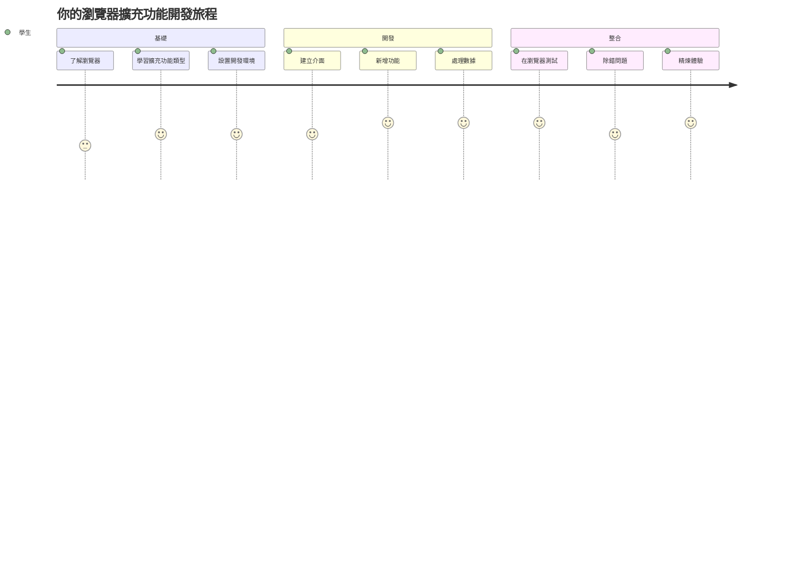
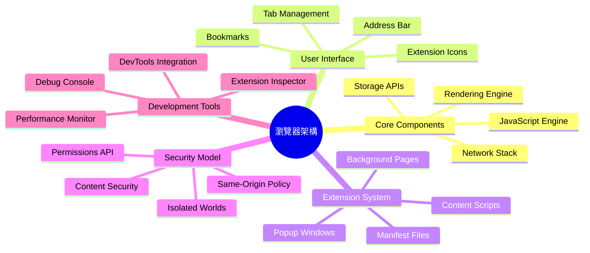
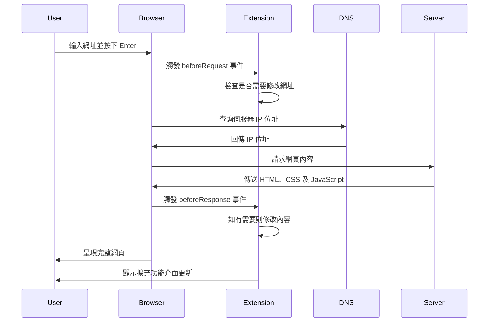
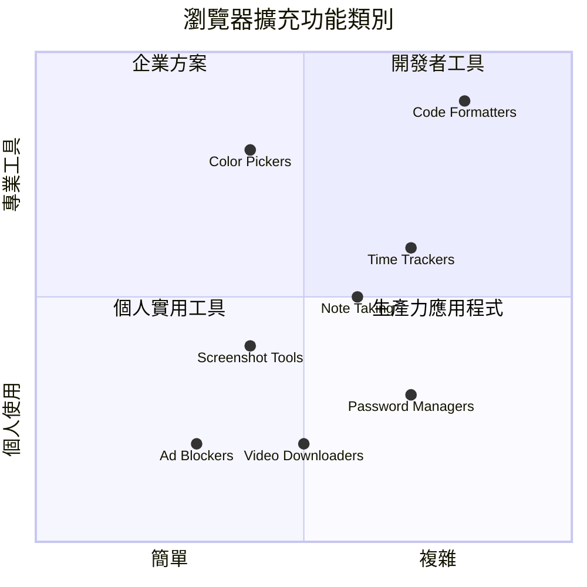
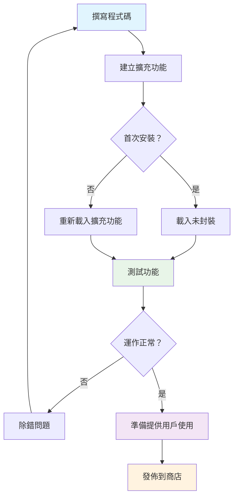
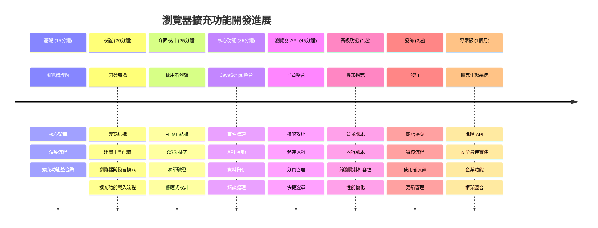

<!--
CO_OP_TRANSLATOR_METADATA:
{
  "original_hash": "00aa85715e1efd4930c17a23e3012e69",
  "translation_date": "2026-01-06T12:44:16+00:00",
  "source_file": "5-browser-extension/1-about-browsers/README.md",
  "language_code": "hk"
}
-->
# 瀏覽器擴充功能專案第1部分：瀏覽器入門



> 手繪筆記作者：[Wassim Chegham](https://dev.to/wassimchegham/ever-wondered-what-happens-when-you-type-in-a-url-in-an-address-bar-in-a-browser-3dob)

## 課前測驗

[課前測驗](https://ff-quizzes.netlify.app/web/quiz/23)

### 簡介

瀏覽器擴充功能是能提升瀏覽體驗的小型應用程式。正如提姆·伯納斯-李（Tim Berners-Lee）最初構想的互動網路，擴充功能擴展了瀏覽器超越單純文件瀏覽的能力。從保護您的帳戶安全的密碼管理器，到幫助設計師挑選完美色彩的色彩挑選器，擴充功能解決了日常瀏覽的種種挑戰。

在打造您的第一個擴充功能之前，先了解瀏覽器如何運作。就像亞歷山大·格雷厄姆·貝爾（Alexander Graham Bell）需要理解聲音傳播原理才能發明電話一樣，掌握瀏覽器基礎能幫助您打造能與現有瀏覽器系統無縫整合的擴充功能。

完成本課後，您將理解瀏覽器架構並開始建立第一個擴充功能。


## 理解網頁瀏覽器

網頁瀏覽器本質上是一款複雜的文件解釋器。當您在網址列輸入「google.com」時，瀏覽器會執行一連串複雜操作──從全球各服務器請求內容，然後解析與呈現代碼成為您看到的互動網頁。

這個過程與1990年提姆·伯納斯-李設計的首款網頁瀏覽器WorldWideWeb非常相似，目的是讓超連結文件人人可訪問。

✅ **歷史小知識**：首款瀏覽器名為「WorldWideWeb」，由Sir Timothy Berners-Lee於1990年創造。


> 一些早期瀏覽器，來源：[Karen McGrane](https://www.slideshare.net/KMcGrane/week-4-ixd-history-personal-computing)

### 瀏覽器如何處理網頁內容

從輸入 URL 到顯示網頁的過程涉及數個協調執行的步驟，而且在幾秒鐘內完成：


**這個過程完成了以下工作：**
- **將**人類可讀的 URL 透過 DNS 查詢轉換為伺服器的 IP 位址
- **建立**使用 HTTP 或 HTTPS 協定與網路伺服器的安全連接
- **向**伺服器請求特定的網頁內容
- **接收**伺服器傳回的 HTML 標記、CSS 樣式與 JavaScript 代碼
- **呈現**所有內容為您看到的互動網頁

### 瀏覽器核心功能

現代瀏覽器提供許多擴充功能開發者可利用的功能：

| 功能 | 目的 | 擴充功能機會 |
|---------|---------|------------------------|
| **渲染引擎** | 呈現 HTML、CSS 與 JavaScript | 內容修改、樣式注入 |
| **JavaScript 引擎** | 執行 JavaScript 代碼 | 自訂腳本、API 互動 |
| **本地儲存** | 在本地保存資料 | 使用者偏好、快取資料 |
| **網路堆疊** | 處理網路請求 | 請求監控、資料分析 |
| **安全模型** | 保護用戶免於惡意內容 | 內容過濾、安全強化 |

**理解這些功能幫助您：**
- **辨識**您的擴充功能能在哪些部分增添最大價值
- **選擇**合適的瀏覽器 API 以達成功能需求
- **設計**能有效配合瀏覽器系統運作的擴充功能
- **確保**擴充功能遵守瀏覽器安全規範

### 跨瀏覽器開發注意事項

不同瀏覽器在標準實作上存在細微差異，正如不同程式語言可能對相同演算法處理略有不同。Chrome、Firefox 和 Safari 各有特色，開發時必須考量這些差異。

> 💡 **專家提示**：使用 [caniuse.com](https://www.caniuse.com) 查看各瀏覽器支援的網路技術。這對規劃擴充功能特色非常有幫助！

**擴充功能開發主要注意事項：**
- **測試**您的擴充功能於 Chrome、Firefox 及 Edge 瀏覽器
- **調適**適應不同瀏覽器擴充功能 API 與 manifest 格式
- **處理**多樣瀏覽器的效能特性與限制
- **提供**不存在於某些瀏覽器的功能替代方案

✅ **分析洞察**：你可透過在網站專案嵌入分析套件，了解使用者偏好瀏覽器，進而決定優先支援哪些瀏覽器。

## 理解瀏覽器擴充功能

瀏覽器擴充功能透過直接新增功能到瀏覽器介面，解決日常瀏覽挑戰。相比需使用獨立應用程式或複雜流程，擴充功能提供即時工具和功能入口。

此概念呼應早期電腦先驅 Douglas Engelbart 的願景，利用科技增強人類能力——擴充功能則是擴充您瀏覽器的基本功能。


**熱門擴充功能類別及其效益：**
- **生產力工具**：任務管理器、筆記應用及時間追蹤器，幫助您保持有序
- **安全強化**：密碼管理器、廣告阻擋器與隱私工具，保護您的資料
- **開發者工具**：程式碼格式化器、色彩挑選器及除錯工具，提升開發效率
- **內容增強**：閱讀模式、影片下載器及截圖工具，美化瀏覽體驗

✅ **反思問題**：您最喜歡哪些瀏覽器擴充功能？它們執行哪些具體任務？如何改善您的瀏覽體驗？

### 🔄 **教學檢核**
**瀏覽器架構理解**：在開始開發擴充功能前，確保您能：
- ✅ 解釋瀏覽器如何處理網路請求並呈現內容
- ✅ 識別瀏覽器架構主要組件
- ✅ 理解擴充功能如何與瀏覽器功能整合
- ✅ 了解保護用戶的安全模型

**快速自我測試**：您能描述從輸入 URL 到看到網頁的路徑嗎？
1. **DNS 查詢**將 URL 轉為 IP 位址
2. **HTTP 請求**從伺服器擷取內容
3. **解析**處理 HTML、CSS 與 JavaScript
4. **渲染**呈現最終網頁
5. **擴充功能**可於多步驟修改內容

## 安裝與管理擴充功能

了解擴充功能安裝流程，能幫助您預見用戶安裝擴充功能時的操作體驗。現代瀏覽器的安裝流程標準化，但介面設計或略有差異。


> **重要**：測試自製擴充功能時，務必切換至開發者模式，並允許來自其他商店的擴充功能。

### 開發時擴充功能安裝流程

當您正在開發與測試自己的擴充功能時，遵循此工作流程：


```bash
# 第一步：建立你的擴充功能
npm run build
```

**此命令執行的工作：**
- **編譯**您的原始碼成適用於瀏覽器的檔案
- **打包**JavaScript 模組成優化套件
- **產生**最終擴充功能檔案於 `/dist` 資料夾
- **準備**擴充功能以方便安裝與測試

**步驟 2：前往瀏覽器擴充功能頁面**
1. **開啟**瀏覽器的擴充功能管理頁面
2. **點擊**右上角的「設定與更多」按鈕（`...` 圖示）
3. **從下拉選單選取**「擴充功能」

**步驟 3：載入您的擴充功能**
- **新安裝**：選擇 `load unpacked` 並指定 `/dist` 資料夾
- **更新**：點選已安裝擴充功能旁的 `reload`
- **測試**：啟用「開發者模式」以存取額外除錯功能

### 正式版擴充功能安裝

> ✅ **備註**：以上開發指令專供您自行設計擴充功能測試。安裝已發佈擴充功能請至官方瀏覽器擴充功能商店，例如 [Microsoft Edge 加載程式商店](https://microsoftedge.microsoft.com/addons/Microsoft-Edge-Extensions-Home)。

**理解差異：**
- **開發安裝**允許您在開發階段測試未發佈擴充功能
- **商店安裝**提供經審核、持續更新的已發佈擴充功能
- **側載安裝**允許從官方商店以外安裝擴充功能（需開發者模式）

## 建立您的碳足跡擴充功能

我們將建立一款顯示您所在地區能源使用碳足跡的瀏覽器擴充功能。這個專案展示了擴充功能開發的基本概念，同時為環境意識提供實用工具。

此做法遵循約翰·杜威（John Dewey）教育理論中行之有效的「做中學」原則——結合技術技能與實際應用。

### 專案需求

開始開發前，先準備必要資源與依賴：

**必須的 API 存取：**
- **[CO2 Signal API key](https://www.co2signal.com/)**：輸入電子郵件地址以取得免費 API 金鑰
- **[區域代碼](http://api.electricitymap.org/v3/zones)**：使用 [Electricity Map](https://www.electricitymap.org/map) 查詢您的區域代碼（例如波士頓為「US-NEISO」）

**開發工具：**
- **[Node.js 與 NPM](https://www.npmjs.com)**：用於安裝專案依賴的套件管理工具
- **[起始程式碼](../../../../5-browser-extension/start)**：下載 `start` 資料夾開始開發

✅ **深入學習**：透過此 [完整 Learn 模組](https://docs.microsoft.com/learn/modules/create-nodejs-project-dependencies/?WT.mc_id=academic-77807-sagibbon) 增強您的套件管理技能

### 理解專案架構

了解專案架構有助於有效規劃開發工作。就像亞歷山大圖書館設計易於檢索的知識庫，一個良好結構的程式碼庫讓開發更有效率：

```
project-root/
├── dist/                    # Built extension files
│   ├── manifest.json        # Extension configuration
│   ├── index.html           # User interface markup
│   ├── background.js        # Background script functionality
│   └── main.js              # Compiled JavaScript bundle
├── src/                     # Source development files
│   └── index.js             # Your main JavaScript code
├── package.json             # Project dependencies and scripts
└── webpack.config.js        # Build configuration
```

**各檔案功能解析：**
- **`manifest.json`**：**定義**擴充功能元資料、權限與入口點
- **`index.html`**：**建立**使用者界面，使用者點擊擴充功能時顯示
- **`background.js`**：**處理**背景工作與瀏覽器事件監聽
- **`main.js`**：**包含**建置流程完成後的最終打包 JavaScript
- **`src/index.js`**：**編寫**主要開發代碼，最終編譯入 `main.js`

> 💡 **組織建議**：將您的 API 金鑰與區域代碼記錄在安全筆記，方便開發過程中參考。您將需要這些數值來測試擴充功能功能。

✅ **安全提醒**：切勿將 API 金鑰或敏感憑證提交至代碼版本庫。我們將在後續步驟示範如何安全管理。

## 建立擴充功能介面

接著我們打造使用者介面元件。擴充功能採用兩個畫面：設定畫面用於初次配置，結果畫面用於顯示資料。

這遵循自早期運算介面設計以來推行的漸進披露原則——以邏輯序列揭露資訊與選項，避免用戶被過多訊息淹沒。

### 擴充功能視圖概述

**設定畫面** - 用戶首次配置：


**結果畫面** - 顯示碳足跡資料：


### 建構設定表單

設定表單於初次使用時收集用戶配置資料。配置後資料將存於瀏覽器儲存供日後使用。

於 `/dist/index.html` 檔案中加入此表單結構：

```html
<form class="form-data" autocomplete="on">
    <div>
        <h2>New? Add your Information</h2>
    </div>
    <div>
        <label for="region">Region Name</label>
        <input type="text" id="region" required class="region-name" />
    </div>
    <div>
        <label for="api">Your API Key from tmrow</label>
        <input type="text" id="api" required class="api-key" />
    </div>
    <button class="search-btn">Submit</button>
</form>
```

**此表單實現了以下功能：**
- **建立**語義正確的表單結構，包含適切標籤與輸入關聯
- **啟用**瀏覽器自動完成以提升用戶體驗
- **須填寫**兩欄位方可提交，透過 `required` 屬性實現
- **以描述性類名**組織輸入欄位，方便樣式設計與 JavaScript 操控
- **提供**清楚指引給首次設定擴充功能的用戶

### 建構結果展示區

接下來，建立用於顯示碳足跡資料的結果區。將以下 HTML 加在表單下方：

```html
<div class="result">
    <div class="loading">loading...</div>
    <div class="errors"></div>
    <div class="data"></div>
    <div class="result-container">
        <p><strong>Region: </strong><span class="my-region"></span></p>
        <p><strong>Carbon Usage: </strong><span class="carbon-usage"></span></p>
        <p><strong>Fossil Fuel Percentage: </strong><span class="fossil-fuel"></span></p>
    </div>
    <button class="clear-btn">Change region</button>
</div>
```

**此結構提供了以下功能：**
- **`loading`**：在獲取 API 資料時顯示讀取訊息
- **`errors`**：API 呼叫失敗或資料無效時顯示錯誤訊息
- **`data`**：用來持有原始資料，方便開發階段調試
- **`result-container`**：友善地呈現碳足跡資訊給使用者
- **`clear-btn`**：允許用戶變更地區，重新配置擴充功能

### 設定建置流程

接著安裝專案依賴，並測試建置流程：

```bash
npm install
```

**此安裝流程達成的工作：**
- **下載** Webpack 及 `package.json` 指定的其他開發依賴
- **設定**建置工具鏈以編譯現代 JavaScript
- **準備**開發環境用於擴充功能建置與測試
- **啟用**代碼打包、優化及跨瀏覽器相容功能

> 💡 **建置流程洞察**：Webpack 將您的原始碼從 `/src/index.js` 打包進 `/dist/main.js`，優化代碼兼顧生產環境與瀏覽器相容性。

### 測試您的進度

此時，您可以開始測試您的擴充功能：
1. **執行** 建置指令以編譯你的程式碼  
2. **載入** 開發者模式到你的瀏覽器中  
3. **驗證** 表單是否正確顯示並專業美觀  
4. **檢查** 所有表單元素是否適當對齊並可正常運作  

**你已完成的事項：**  
- **建立** 擴充功能的基礎 HTML 結構  
- **創建** 配置與結果介面，皆使用正確的語義標記  
- **設定** 使用業界標準工具的現代開發流程  
- **準備** 加入互動式 JavaScript 功能的基礎  

### 🔄 **教學檢視**  
**擴充功能開發進度**：在繼續前確認你的理解：  
- ✅ 你可以說明專案結構中各檔案的用途嗎？  
- ✅ 你理解建置流程是如何轉換你的原始碼的嗎？  
- ✅ 為什麼我們把設定和結果分成不同的 UI 區塊？  
- ✅ 表單結構如何同時支援可用性與無障礙性？  

**開發流程理解**：你現在應該能夠：  
1. **修改** 擴充功能介面的 HTML 和 CSS  
2. **執行** 建置指令編譯你的變更  
3. **重新載入** 瀏覽器中的擴充功能以測試更新  
4. **使用** 瀏覽器開發者工具除錯問題  

你已完成瀏覽器擴充功能開發的第一階段。就像萊特兄弟在實現飛行前必須理解空氣動力學一樣，掌握這些基礎概念將幫助你在下一課中開發更複雜的互動功能。

## GitHub Copilot Agent 挑戰 🚀

使用 Agent 模式完成以下挑戰：

**說明：** 透過加入表單驗證與使用者回饋功能，增強瀏覽器擴充功能，改善輸入 API 金鑰與區域代碼時的用戶體驗。

**提示：** 撰寫 JavaScript 驗證函式，檢查 API 金鑰欄位是否至少包含 20 個字元，以及區域代碼是否遵循正確格式（例如 'US-NEISO'）。利用邊框顏色變換（綠色表示有效，紅色表示無效）做出視覺回饋。並新增切換功能，用於顯示或隱藏 API 金鑰以提升安全性。

更多有關 [agent mode](https://code.visualstudio.com/blogs/2025/02/24/introducing-copilot-agent-mode) 的資訊。

## 🚀 挑戰

瀏覽瀏覽器擴充功能商店並安裝一個擴充功能至你的瀏覽器。你可以用有趣的方式檢視其檔案。你發現了什麼？

## 課後小測驗

[課後小測驗](https://ff-quizzes.netlify.app/web/quiz/24)

## 複習與自學

本課程中你略為了解了網頁瀏覽器的歷史；請利用這個機會，透過閱讀更多歷史資料，了解全球資訊網發明者如何設想它的用途。以下是一些有用的網站：

[網頁瀏覽器的歷史](https://www.mozilla.org/firefox/browsers/browser-history/)

[網路的歷史](https://webfoundation.org/about/vision/history-of-the-web/)

[TIm Berners-Lee 專訪](https://www.theguardian.com/technology/2019/mar/12/tim-berners-lee-on-30-years-of-the-web-if-we-dream-a-little-we-can-get-the-web-we-want)

### ⚡ **你在接下來 5 分鐘內可以做的事**  
- [ ] 開啟 Chrome/Edge 擴充功能頁面 (chrome://extensions)，探索你已安裝的擴充功能  
- [ ] 載入網頁時查看瀏覽器 DevTools 的 Network 分頁  
- [ ] 嘗試查看網頁原始碼 (Ctrl+U) 以檢視 HTML 結構  
- [ ] 檢查並修改任意網頁元素的 CSS  

### 🎯 **你能在這一小時內完成的目標**  
- [ ] 完成課後小測驗並理解瀏覽器基本概念  
- [ ] 建立基本的 manifest.json 檔案用於瀏覽器擴充功能  
- [ ] 製作一個簡單的「Hello World」擴充功能並顯示 popup  
- [ ] 測試在開發者模式中載入你的擴充功能  
- [ ] 探索目標瀏覽器的擴充功能文件  

### 📅 **你的週長擴充功能旅程**  
- [ ] 完成一個具有實用功能的瀏覽器擴充功能  
- [ ] 學習內容腳本、背景腳本及 popup 互動  
- [ ] 精通瀏覽器 API 如儲存、分頁與訊息傳遞  
- [ ] 設計用戶友善的擴充功能介面  
- [ ] 在不同網站和情境中測試擴充功能  
- [ ] 將你的擴充功能發佈至擴充功能商店  

### 🌟 **你的月長瀏覽器開發計畫**  
- [ ] 開發多個解決不同用戶問題的擴充功能  
- [ ] 學習進階瀏覽器 API 與安全最佳實踐  
- [ ] 為開源瀏覽器擴充功能專案做出貢獻  
- [ ] 精通跨瀏覽器相容性與漸進式增強技術  
- [ ] 為他人打造擴充功能開發工具與範本  
- [ ] 成為協助其他開發者的瀏覽器擴充功能專家  

## 🎯 你的瀏覽器擴充功能專精時間表


### 🛠️ 你的擴充功能開發工具組摘要

完成本課後，你已具備：  
- **瀏覽器架構知識**：了解渲染引擎、安全模型與擴充功能整合  
- **開發環境**：擁有包含 Webpack、NPM 及偵錯功能的現代工具鏈  
- **UI/UX 基礎**：具有語義 HTML 結構及漸進揭露模式  
- **安全意識**：掌握瀏覽器權限與安全開發實務  
- **跨瀏覽器概念**：理解相容性考量與測試方法  
- **API 整合**：具備處理外部資料來源的基礎  
- **專業工作流程**：擁有業界標準的開發與測試流程  

**實際應用範圍**：這些技能可直接應用於：  
- **網頁開發**：單頁應用程式與漸進式網頁應用  
- **桌面應用程式**：Electron 和基於網頁的桌面軟體  
- **行動開發**：混合式應用與基於網頁的行動解決方案  
- **企業工具**：企業內部生產力應用與工作流程自動化  
- **開源貢獻**：瀏覽器擴充功能專案與網路標準  

**下一階段**：你已準備好加入互動功能、使用瀏覽器 API，並打造能解決實際用戶問題的擴充功能！

## 作業

[重新設計你的擴充功能](assignment.md)

---

<!-- CO-OP TRANSLATOR DISCLAIMER START -->
**免責聲明**：
本文件是使用 AI 翻譯服務 [Co-op Translator](https://github.com/Azure/co-op-translator) 進行翻譯的。雖然我們力求準確，但請注意自動翻譯可能包含錯誤或不準確之處。原始文件的母語版本應視為權威來源。對於重要資訊，建議使用專業人工翻譯。我們不對因使用本翻譯而引起的任何誤解或誤譯承擔責任。
<!-- CO-OP TRANSLATOR DISCLAIMER END -->