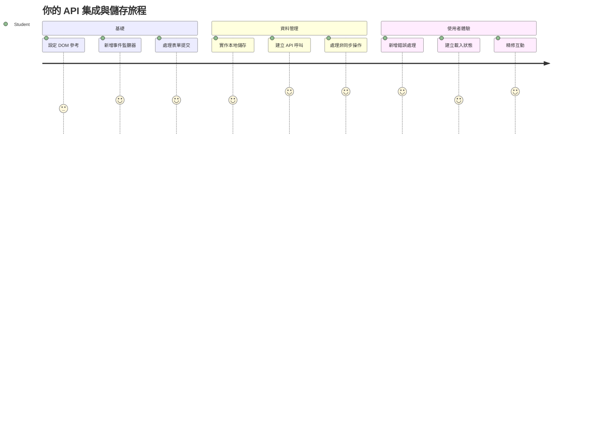
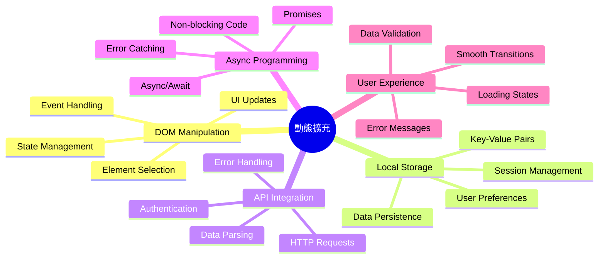
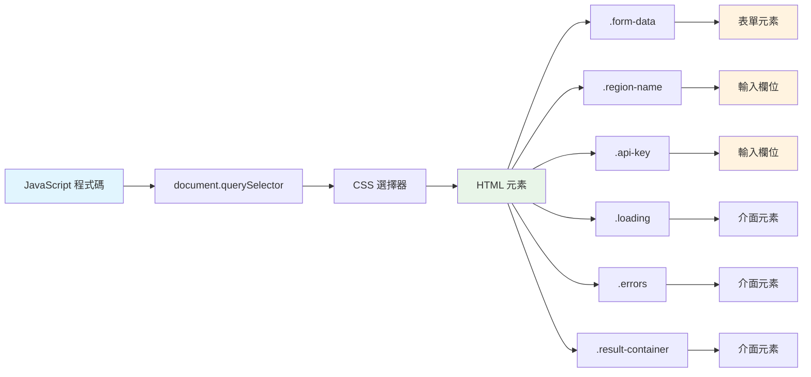
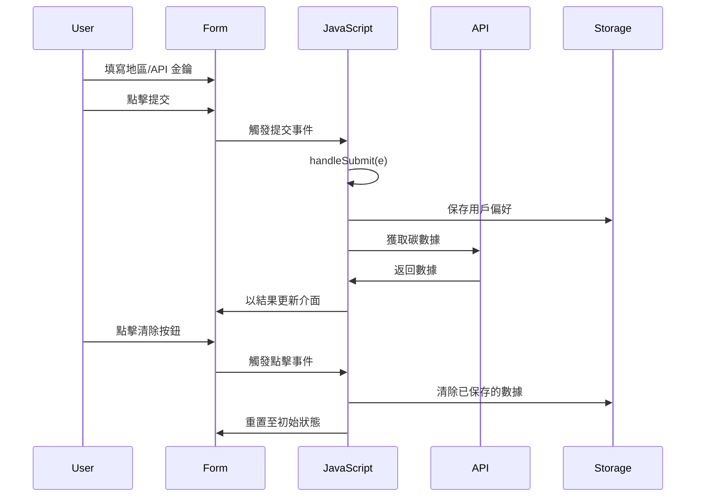
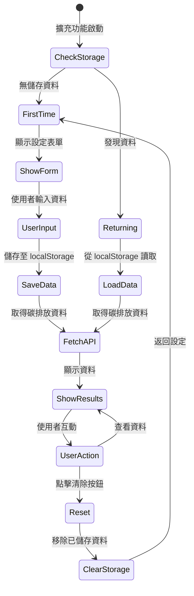
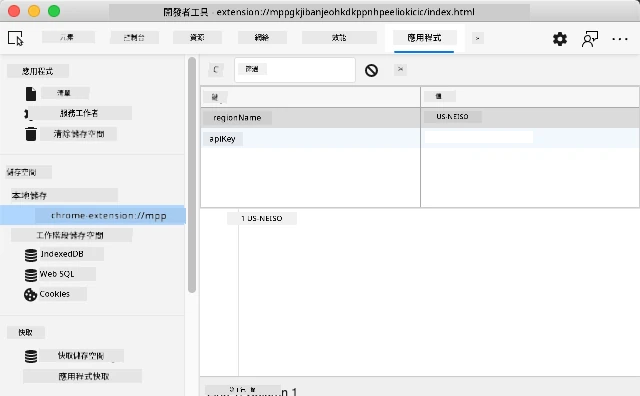
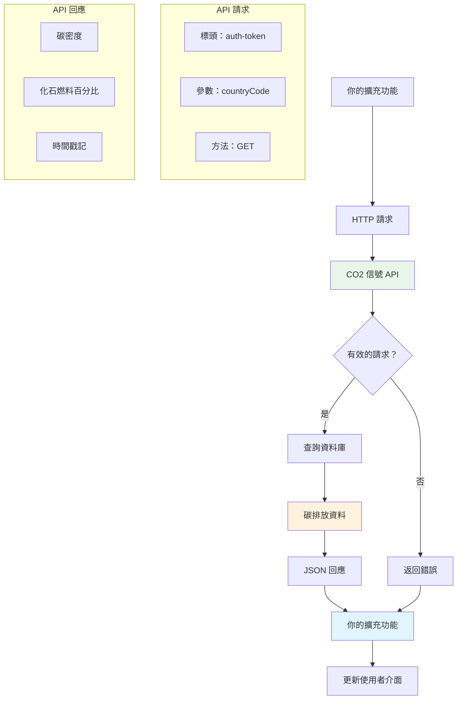
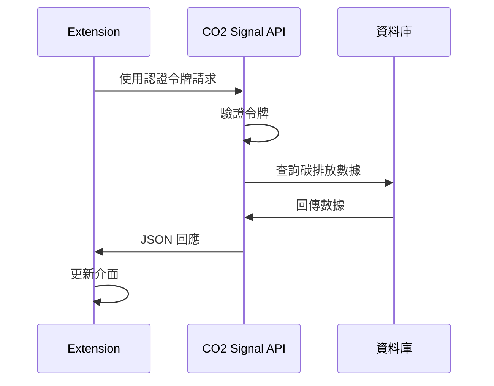
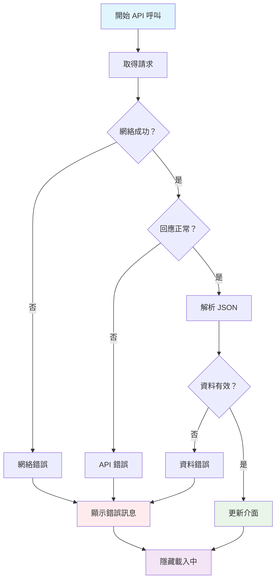
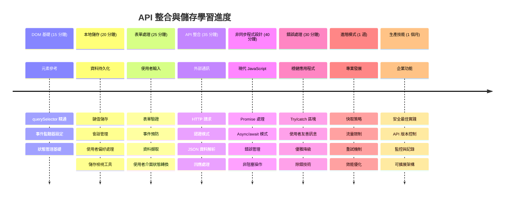

<!--
CO_OP_TRANSLATOR_METADATA:
{
  "original_hash": "2b6203a48c48d8234e0948353b47d84e",
  "translation_date": "2026-01-06T12:39:22+00:00",
  "source_file": "5-browser-extension/2-forms-browsers-local-storage/README.md",
  "language_code": "hk"
}
-->
# 瀏覽器擴充功能專案第二部分：呼叫 API，使用本地儲存


## 課前小測驗

[課前小測驗](https://ff-quizzes.netlify.app/web/quiz/25)

## 介紹

還記得你開始製作的瀏覽器擴充功能嗎？現在你有一個看起來不錯的表單，但它本質上是靜態的。今天我們將讓它活起來，連接真實資料並賦予它記憶。

想想阿波羅任務控制電腦 —— 它們不只是顯示固定資訊。它們不斷和太空船通訊，更新遙測資料，並記錄重要的任務參數。這正是我們今天要打造的動態行為。你的擴充功能將連接網路，取得真實的環境資料，並記錄你下次使用的設定。

API 整合乍聽很複雜，但實際上就是教你的程式怎麼跟其他服務溝通。無論你是抓取天氣資料、社群媒體資訊，還是像今天一樣取得碳足跡相關資訊，都是建立這些數位連結。我們也會探討瀏覽器如何持久保存資訊 —— 就像圖書館用卡片目錄記錄書本位置一樣。

上完本課後，你會有一個可抓取真實資料、儲存使用者偏好，並提供流暢操作體驗的瀏覽器擴充功能。開始吧！


✅ 遵循對應檔案中的編號段落，知道在哪裡放程式碼

## 建立要操作的擴充功能元素

在你的 JavaScript 操作介面前，需要先取得特定 HTML 元素的參考。這就像望遠鏡需要對準特定星體——伽利略在觀察木星衛星前，得先找到並對準木星。

在你的 `index.js` 檔案中，我們會建立 `const` 變數，捕捉每個重要表單元素的參考。這很像科學家標記他們實驗設備——不用每次翻找整個實驗室，就能直接存取需要的東西。


```javascript
// 表單欄位
const form = document.querySelector('.form-data');
const region = document.querySelector('.region-name');
const apiKey = document.querySelector('.api-key');

// 結果
const errors = document.querySelector('.errors');
const loading = document.querySelector('.loading');
const results = document.querySelector('.result-container');
const usage = document.querySelector('.carbon-usage');
const fossilfuel = document.querySelector('.fossil-fuel');
const myregion = document.querySelector('.my-region');
const clearBtn = document.querySelector('.clear-btn');
```

**這段程式碼做了什麼：**
- **捕捉** 用 `document.querySelector()` 搭配 CSS 類別選擇器取得表單元素
- **建立** 區域名稱和 API 金鑰輸入欄位的參考
- **連接** 顯示碳排放數據結果的元素
- **設定** 加載指示器和錯誤訊息等 UI 元素的存取
- **把** 每個元素參考存入 `const` 變數，方便在程式中重複使用

## 新增事件監聽器

現在我們要讓擴充功能響應使用者操作。事件監聽器是程式監控使用者互動的方式。就像早期電話交換手——監聽來電並在有人想連線時接通正確電路。


```javascript
form.addEventListener('submit', (e) => handleSubmit(e));
clearBtn.addEventListener('click', (e) => reset(e));
init();
```

**理解以下概念：**
- **附加** submit 監聽器到表單，當使用者按 Enter 或點擊送出時觸發
- **連接** 點擊監聽器給清除按鈕，用於重置表單
- **把** 事件物件 `(e)` 傳給處理函式以做額外控制
- **立即** 呼叫 `init()` 函式，設定擴充功能的初始狀態

✅ 注意這裡使用的箭頭函式語法（shorthand arrow function）。這是現代 JavaScript 的寫法，比傳統函式表達式更簡潔，但兩者都運作正常！

### 🔄 **教學檢核點**
**事件處理理解**：開始初始化前，請確認你能：
- ✅ 解釋 `addEventListener` 如何將使用者行為與 JavaScript 函式連結
- ✅ 理解為何將事件物件 `(e)` 傳給處理函式
- ✅ 辨識 `submit` 與 `click` 事件的差異
- ✅ 描述 `init()` 函式何時執行以及原因

**小自測**：如果忘記 `e.preventDefault()` 在表單送出時會發生什麼？
*答案：頁面會重新載入，導致所有 JavaScript 狀態消失並中斷使用者體驗*

## 編寫初始化和重置功能

讓我們建立擴充功能的初始化邏輯。`init()` 函式就像船隻的導航系統檢查儀器一樣——判斷當前狀態並相應調整介面。它會檢查是否首次使用你的擴充功能，並載入之前的設定。

`reset()` 函式則提供使用者重新開始的機會——就像科學家在不同實驗間重置儀器，確保資料乾淨。

```javascript
function init() {
	// 檢查用戶是否之前已儲存 API 認證資料
	const storedApiKey = localStorage.getItem('apiKey');
	const storedRegion = localStorage.getItem('regionName');

	// 將擴充功能圖示設為通用綠色（未來教學的佔位符）
	// 待辦事項：在下一課中實作圖示更新

	if (storedApiKey === null || storedRegion === null) {
		// 首次使用者：顯示設定表單
		form.style.display = 'block';
		results.style.display = 'none';
		loading.style.display = 'none';
		clearBtn.style.display = 'none';
		errors.textContent = '';
	} else {
		// 回歸使用者：自動載入其已儲存的資料
		displayCarbonUsage(storedApiKey, storedRegion);
		results.style.display = 'none';
		form.style.display = 'none';
		clearBtn.style.display = 'block';
	}
}

function reset(e) {
	e.preventDefault();
	// 清除已儲存的地區設定以允許用戶選擇新位置
	localStorage.removeItem('regionName');
	// 重新啟動初始化過程
	init();
}
```

**解析這裡發生了什麼：**
- **從** 瀏覽器本地儲存取回儲存的 API 金鑰與區域
- **判斷** 這是初次使用者（無儲存資料）還是回訪使用者
- **顯示** 新用戶的設定表單並隱藏其他元素
- **自動** 載入回訪用戶的資料並顯示重置選項
- **根據** 可用資料管理使用者介面狀態

**關於本地儲存的核心概念：**
- **資料持久**保存於瀏覽器會話之間（不同於 session storage）
- **以** 鍵值對方式利用 `getItem()` 和 `setItem()` 儲存資料
- **當** 指定鍵無資料時回傳 `null`
- **提供** 簡單方式記住使用者偏好和設定

> 💡 **理解瀏覽器儲存**：[LocalStorage](https://developer.mozilla.org/docs/Web/API/Window/localStorage) 就像給你的擴充功能持久記憶體。想像古代亞歷山大圖書館如何保存卷軸──資料即使學者離開再回來仍可取得。
>
> **主要特點：**
> - **資料持續存在**，即使關閉瀏覽器
> - **經得起** 電腦重新啟動和瀏覽器崩潰
> - **提供** 相當大的存儲空間以保存使用者偏好
> - **即時存取**，無需等網路響應

> **重要提醒**：你的瀏覽器擴充功能有獨立且隔離的本地儲存空間，不同於一般網站。這樣可提高安全性並防止網站間衝突。

你可以開啟瀏覽器開發者工具（F12），切換到 **Application** 分頁，展開 **Local Storage** 區域來查看儲存資料。




> ⚠️ **安全注意**：在正式應用中，將 API 金鑰儲存在 LocalStorage 有安全風險，因為任何 JavaScript 都能讀取。學習用途可以暫時使用，但實際應用應採用安全的伺服器端儲存敏感憑證。

## 處理表單提交事件

現在我們來處理使用者提交表單時的行為。瀏覽器預設表單送出會重整頁面，我們將攔截這個行為，創造更順暢的體驗。

這類似任務控制中心管理太空船通訊——不會為每次通訊重置整個系統，而是維持持續運作並同步處理新資訊。

建立一個函式來捕捉表單提交事件，並提取使用者輸入：

```javascript
function handleSubmit(e) {
	e.preventDefault();
	setUpUser(apiKey.value, region.value);
}
```

**上述程式碼中，我們：**
- **阻止** 預設的表單送出重整行為
- **擷取** API 金鑰與區域兩個輸入欄位的使用者值
- **傳遞** 表單資料給 `setUpUser()` 函式處理
- **保持** 單頁應用行為，不重新載入頁面

✅ 請記得你的 HTML 表單欄位包含 `required` 屬性，所以瀏覽器會自動驗證使用者必填 API 金鑰和區域，確保此函式執行時輸入值有效。

## 設定使用者偏好

`setUpUser` 函式負責儲存使用者憑證並啟動第一次 API 呼叫。這為從設定跳轉到顯示結果提供流暢體驗。

```javascript
function setUpUser(apiKey, regionName) {
	// 儲存用戶憑證以供未來使用
	localStorage.setItem('apiKey', apiKey);
	localStorage.setItem('regionName', regionName);
	
	// 更新用戶介面以顯示加載狀態
	loading.style.display = 'block';
	errors.textContent = '';
	clearBtn.style.display = 'block';
	
	// 使用戶憑證獲取碳排放使用數據
	displayCarbonUsage(apiKey, regionName);
}
```

**步驟解析：**
- **把** API 金鑰與區域名稱保存到本地儲存，未來使用
- **顯示** 加載指示器，告知使用者資料正在抓取中
- **清空** 先前可能出現的錯誤訊息
- **顯示** 清除按鈕，讓使用者後續可以重置設定
- **啟動** API 呼叫取得真實碳排放數據

這函式一次管理資料持久和介面更新，營造無縫使用者體驗。

## 顯示碳排放使用資料

現在我們將擴充功能連接到外部資料來源，透過 API 取得網路上即時資訊。

**認識 API**

[API](https://www.webopedia.com/TERM/A/API.html) 是不同應用程式間溝通的橋樑。可以把它想像成 19 世紀連接都市的電報系統——操作員發送請求到遠方站點，並回應所需資訊。每次你查看社群媒體、問語音助理問題、或用外送 App，背後都是 API 在交換資料。


**關於 REST API 的重要概念：**
- **REST** 代表「表述性狀態轉移」
- **使用** 標準 HTTP 方法（GET、POST、PUT、DELETE）操作資料
- **回傳** 通常是可預測的 JSON 格式
- **提供** 基於 URL 的一致端點，處理不同請求

✅ 我們使用的 [CO2 Signal API](https://www.co2signal.com/) 提供全球電網實時碳強度數據。幫助使用者了解用電的環境影響！

> 💡 **理解非同步 JavaScript**：[`async` 關鍵字](https://developer.mozilla.org/docs/Web/JavaScript/Reference/Statements/async_function) 讓你的程式同時處理多個操作。當你向伺服器請求資料時，不會讓整個擴充功能凍結——這就像航管不會為等待某飛機而停止所有作業。
>
> **優點：**
> - **保持** 擴充功能在資料讀取期間仍反應敏捷
> - **允許** 其他程式碼在網路請求時繼續執行
> - **提升** 程式可讀性，比傳統回呼更直觀
> - **能夠** 優雅處理網路錯誤

這裡有段關於 `async` 的短影片：

[](https://youtube.com/watch?v=YwmlRkrxvkk "Async and Await for managing promises")

> 🎥 點擊上圖觀看 async/await 教學影片。

### 🔄 **教學檢核點**
**非同步程式設計理解**：進入 API 函式前，請確認你理解：
- ✅ 為什麼用 `async/await` 而非阻塞整個擴充
- ✅ 如何用 `try/catch` 優雅處理網路錯誤
- ✅ 同步與非同步作業的差異
- ✅ 為何 API 呼叫可能失敗及錯誤處理方法

**現實生活類比**：想想日常非同步情境：
- **訂餐**：你不會在廚房等餐，拿到收據去做其他事
- **寄郵件**：郵件發送時 app 不會凍結，可以繼續寫新郵件
- **載入網頁**：圖片漸進式載入，你已可閱讀文字

**API 認證流程**：

建立抓取並顯示碳排放數據的函式：

```javascript
// 現代 fetch API 方法（無需外部依賴）
async function displayCarbonUsage(apiKey, region) {
	try {
		// 從 CO2 Signal API 獲取碳強度數據
		const response = await fetch('https://api.co2signal.com/v1/latest', {
			method: 'GET',
			headers: {
				'auth-token': apiKey,
				'Content-Type': 'application/json'
			},
			// 為特定地區添加查詢參數
			...new URLSearchParams({ countryCode: region }) && {
				url: `https://api.co2signal.com/v1/latest?countryCode=${region}`
			}
		});

		// 檢查 API 請求是否成功
		if (!response.ok) {
			throw new Error(`API request failed: ${response.status}`);
		}

		const data = await response.json();
		const carbonData = data.data;

		// 計算四捨五入的碳強度值
		const carbonIntensity = Math.round(carbonData.carbonIntensity);

		// 用獲取的數據更新使用者界面
		loading.style.display = 'none';
		form.style.display = 'none';
		myregion.textContent = region.toUpperCase();
		usage.textContent = `${carbonIntensity} grams (grams CO₂ emitted per kilowatt hour)`;
		fossilfuel.textContent = `${carbonData.fossilFuelPercentage.toFixed(2)}% (percentage of fossil fuels used to generate electricity)`;
		results.style.display = 'block';

		// TODO: calculateColor(carbonIntensity) - 於下一課實作

	} catch (error) {
		console.error('Error fetching carbon data:', error);
		
		// 顯示易明的錯誤訊息
		loading.style.display = 'none';
		results.style.display = 'none';
		errors.textContent = 'Sorry, we couldn\'t fetch data for that region. Please check your API key and region code.';
	}
}
```

**解析程式做了什麼：**
- **使用** 現代 `fetch()` API，摒棄外部函式庫（如 Axios），程式簡潔無依賴
- **實作** 判斷 `response.ok` 進行 API 呼叫錯誤偵測
- **用** `async/await` 處理非同步，提高程式流程易讀性
- **用** `auth-token` 標頭認證 CO2 Signal API
- **解析** JSON 資料並擷取碳強度資訊
- **更新** 多個介面元素，展示格式化後的環境資訊
- **提供** 當 API 呼叫失敗時的友善錯誤訊息

**示範重要現代 JavaScript 技術：**
- 使用 `${}` 字串模板字面量清晰格式化字串
- 用 try/catch 錯誤處理確保應用穩健
- 採用 async/await 模式優雅管理網路請求
- 利用物件解構賦值摘取 API 回傳資料
- 透過函式鏈式呼叫更新 DOM 多重元素

✅ 這支函式涵蓋多項關鍵網頁開發技能：與外部伺服器通訊、身份驗證、資料處理、介面更新及錯誤管理。專業開發者的基本功。


### 🔄 **教學檢核點**
**完整流程理解**：確認你對整體流程掌握：
- ✅ 為何 DOM 參考能讓 JavaScript 控制介面
- ✅ 為何本地儲存讓瀏覽器會話間資料持續存在
- ✅ async/await 如何讓 API 呼叫不中斷擴充功能
- ✅ API 呼叫失敗時會發生什麼及錯誤如何處理
- ✅ 使用者體驗中為何包含載入狀態和錯誤提示

🎉 **你已達成**：你建立了一支瀏覽器擴充功能，能：
- **連結** 網路，擷取真實環境數據
- **持久** 儲存使用者設定，跨會話保存
- **優雅** 處理錯誤而非崩潰
- **提供** 流暢且專業的用戶體驗

執行 `npm run build` 然後在瀏覽器重新載入擴充功能以測試。你現在擁有一個功能完整的碳足跡追蹤器。下一課會加上動態圖示功能讓擴充功能更完整。

---

## GitHub Copilot Agent 挑戰 🚀

使用 Agent 模式完成以下挑戰：
**描述：** 加強瀏覽器擴充功能，新增錯誤處理改進及用戶體驗功能。這個挑戰將幫助你練習使用現代 JavaScript 模式操作 API、本地儲存及 DOM 操作。

**提示：** 建立一個增強版的 displayCarbonUsage 函數，包括：1）失敗的 API 呼叫重試機制，搭配指數退避，2）呼叫 API 前對地區代碼進行輸入驗證，3）帶有進度指示的載入動畫，4）將 API 回應快取到 localStorage 並設定過期時間（快取 30 分鐘），及 5）顯示先前 API 呼叫的歷史資料功能。並加上適當的 TypeScript 風格 JSDoc 註解來記錄所有函數參數和回傳類型。

了解更多關於[agent 模式](https://code.visualstudio.com/blogs/2025/02/24/introducing-copilot-agent-mode)。

## 🚀 挑戰

擴展你對 API 的認識，探索豐富的瀏覽器 API 來進行網頁開發。從以下瀏覽器 API 選擇一個，並建立一個小型示範：

- [Geolocation API](https://developer.mozilla.org/docs/Web/API/Geolocation_API) - 取得使用者當前位置
- [Notification API](https://developer.mozilla.org/docs/Web/API/Notifications_API) - 發送桌面通知
- [HTML Drag and Drop API](https://developer.mozilla.org/docs/Web/API/HTML_Drag_and_Drop_API) - 建立互動式拖曳介面
- [Web Storage API](https://developer.mozilla.org/docs/Web/API/Web_Storage_API) - 進階本地儲存技巧
- [Fetch API](https://developer.mozilla.org/docs/Web/API/Fetch_API) - XMLHttpRequest 的現代替代方案

**研究時可思考的問題：**
- 這個 API 解決了哪些現實世界問題？
- API 如何處理錯誤及極端狀況？
- 使用此 API 有哪些安全考量？
- 這個 API 在不同瀏覽器中的支援度如何？

完成研究後，找出哪些特性讓 API 對開發者友善且可靠。

## 講課後測驗

[課後測驗](https://ff-quizzes.netlify.app/web/quiz/26)

## 複習與自學

你在本課學到了 LocalStorage 和 API，對專業網頁開發者非常有用。思考這兩者如何協同運作？試想如何架構一個網頁，讓 API 使用從中儲存的項目。

### ⚡ **接下來 5 分鐘你可以做到**
- [ ] 開啟 DevTools 的 Application 頁籤，探索任一網站的 localStorage
- [ ] 建立簡單的 HTML 表單，測試瀏覽器的表單驗證
- [ ] 嘗試在瀏覽器主控台使用 localStorage 存取資料
- [ ] 利用 Network 頁籤檢視送出的表單資料

### 🎯 **這一小時內你可完成**
- [ ] 完成課後測驗並理解表單處理概念
- [ ] 製作一個瀏覽器擴充功能表單，保存用戶偏好設定
- [ ] 實作用戶端表單驗證及友善的錯誤訊息
- [ ] 練習使用 chrome.storage API 來持久化擴充功能資料
- [ ] 建立一個介面，依據儲存的用戶設定做出反應

### 📅 **你的週長擴充功能開發**
- [ ] 完成具備表單功能的完整瀏覽器擴充功能
- [ ] 精通不同的儲存選項：local、sync 及 session storage
- [ ] 實作進階表單功能，如自動完成與驗證
- [ ] 新增匯入/匯出用戶資料功能
- [ ] 在多瀏覽器間徹底測試你的擴充功能
- [ ] 打磨擴充功能的用戶體驗與錯誤處理

### 🌟 **你的月長網頁 API 大師訓練**
- [ ] 使用各種瀏覽器儲存 API 建置複雜應用程式
- [ ] 學習離線優先開發模式
- [ ] 參與涉及資料持久化的開源專案
- [ ] 精通隱私導向開發與 GDPR 合規
- [ ] 建立可重用的表單處理與資料管理函式庫
- [ ] 分享網頁 API 與擴充功能開發相關知識

## 🎯 你的擴充功能開發大師時程表


### 🛠️ 你的全端開發工具總結

完成本課後，你已經擁有：
- **DOM 精通**：精準定位與操作元素
- **儲存專家**：使用 localStorage 管理持久資料
- **API 整合**：即時資料擷取與驗證
- **非同步程式設計**：使用現代 JavaScript 進行非阻塞作業
- **錯誤處理**：建構能優雅處理失敗的穩健應用
- **用戶體驗**：載入狀態、驗證與流暢互動
- **現代模式**：fetch API、async/await 與 ES6+ 功能

**專業技能提升**：你已實作以下模式於：
- **網頁應用程式**：使用外部資料源的單頁應用
- **行動開發**：具備離線能力的 API 驅動應用
- **桌面軟體**：Electron 應用與持久儲存
- **企業系統**：認證、快取與錯誤處理
- **現代框架**：React/Vue/Angular 的資料管理模式

**下一階段**：你已準備好探究更進階主題，如快取策略、即時 WebSocket 連接或複雜狀態管理！

## 作業

[採用 API](assignment.md)

---

<!-- CO-OP TRANSLATOR DISCLAIMER START -->
**免責聲明**：  
本文件乃透過 AI 翻譯服務 [Co-op Translator](https://github.com/Azure/co-op-translator) 進行翻譯。雖然我們致力於確保準確性，但請注意自動翻譯可能包含錯誤或不準確之處。原始語言文件應視為權威資料來源。對於重要資訊，建議採用專業人工翻譯。我們對於因使用本翻譯而導致的任何誤解或誤譯概不負責。
<!-- CO-OP TRANSLATOR DISCLAIMER END -->