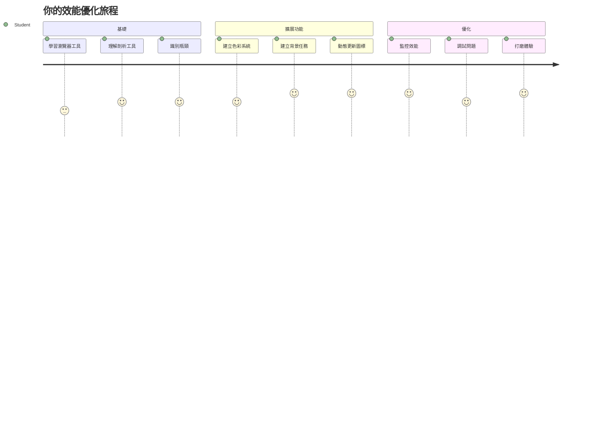
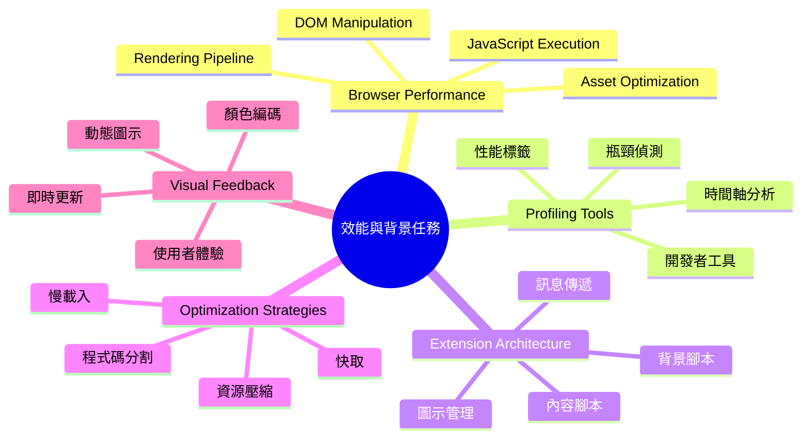
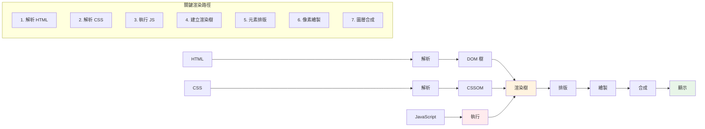
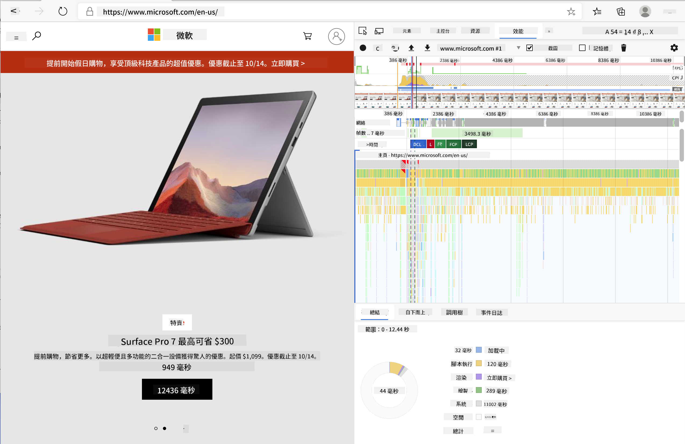
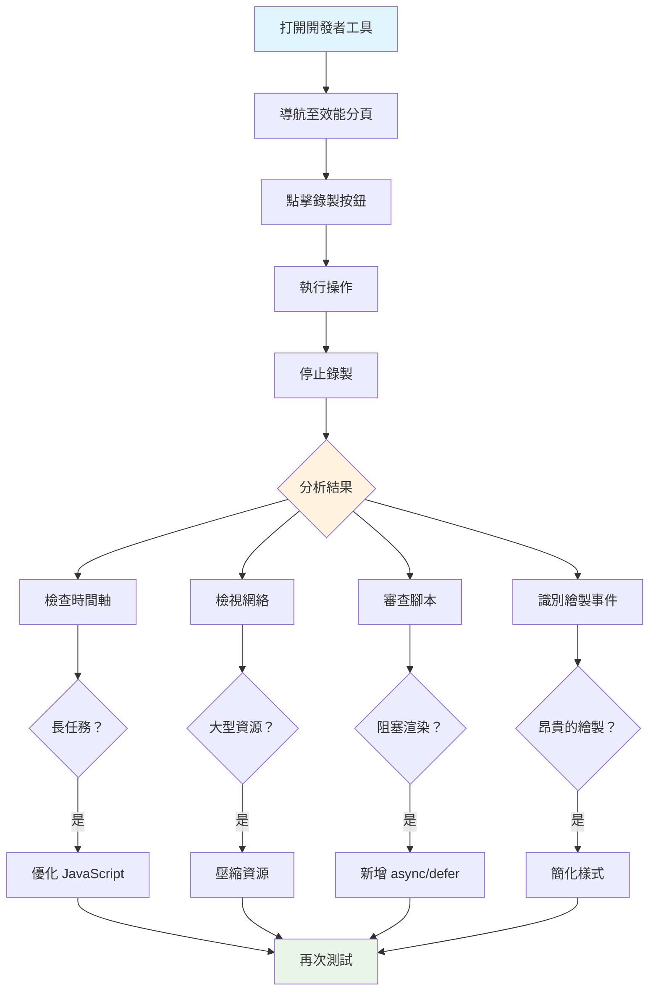
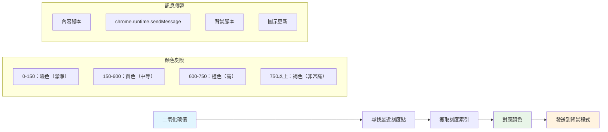
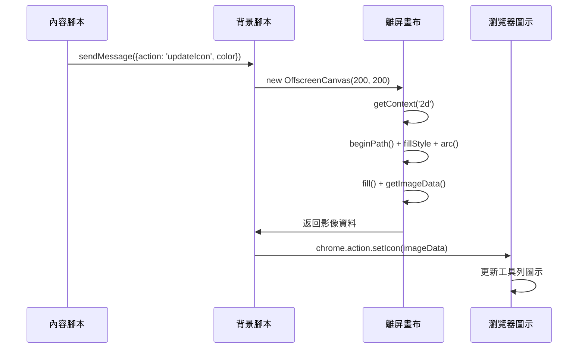
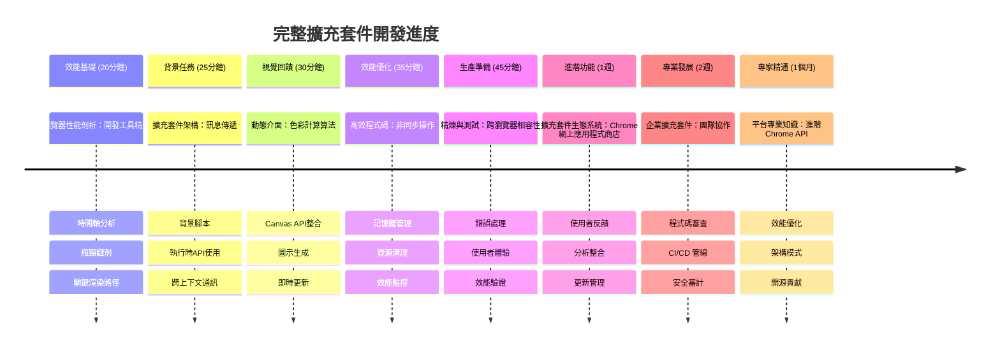

<!--
CO_OP_TRANSLATOR_METADATA:
{
  "original_hash": "b275fed2c6fc90d2b9b6661a3225faa2",
  "translation_date": "2026-01-06T12:41:45+00:00",
  "source_file": "5-browser-extension/3-background-tasks-and-performance/README.md",
  "language_code": "hk"
}
-->
# 瀏覽器擴充套件專案 第三部分：了解背景任務與效能


是否曾想過，為何有些瀏覽器擴充套件感覺反應靈敏，而有些則顯得遲緩？秘密就在背後正在發生的事情。當使用者在你的擴充套件介面中點擊時，背後有一整個世界的背景程序正悄悄管理資料擷取、圖示更新和系統資源。

這是我們瀏覽器擴充套件系列的最後一課，我們將讓你的碳足跡追蹤器順暢運作。你將新增動態圖示更新，並學會如何在效能問題成為麻煩前就發現它們。這就像調校賽車—小小的優化可以讓一切運行更順暢。

完成後，你會有一個磨練好的擴充套件，並了解區分好與優秀 Web 應用的效能原則。讓我們潛入瀏覽器優化的世界吧。

## 課前小測驗

[課前小測驗](https://ff-quizzes.netlify.app/web/quiz/27)

### 簡介

在我們之前的課程中，你建立了表單，連接到 API，並處理非同步資料擷取。你的擴充套件已經初具雛形。

現在我們需要添上最後的潤飾—像是讓擴充套件圖示根據碳數據變色。這讓我想起 NASA 必須優化阿波羅太空船上的每個系統。他們無法浪費任何處理週期或記憶體，因為性命攸關。雖然我們的瀏覽器擴充套件沒有那麼重要，但相同的原則適用—有效率的程式碼帶來更好的使用體驗。


## 網路效能基礎

當你的程式碼有效率地執行，人們真的能 *感覺到* 差異。你一定知道那種頁面瞬間載入或動畫流暢播放的時刻？那就是良好效能在運作。

效能不僅僅是速度—它關乎創造出自然、不笨重且不令人沮喪的網頁體驗。回到計算早期，Grace Hopper 著名地在桌上放了一根奈秒長度的導線（約一英尺長），來展示光在十億分之一秒內能走多遠。這是她說明在計算中每個微秒都重要的方式。讓我們一起探索能幫你找出拖慢速度原因的偵測工具。

>「網站效能是兩件事：頁面載入速度，以及程式碼執行速度。」-- [Zack Grossbart](https://www.smashingmagazine.com/2012/06/javascript-profiling-chrome-developer-tools/)

如何讓你網站在各種設備、使用者及狀況下都爆速，這主題毫不意外地龐大。以下是建構標準網頁專案或瀏覽器擴充套件時要記住的幾點。

優化網站的第一步是了解實際底層發生了什麼。幸運的是，你的瀏覽器已內建強大的偵測工具。


在 Edge 中打開開發者工具，點擊右上角的那三個點，然後去「更多工具」>「開發者工具」。或者使用快捷鍵：Windows 上是 `Ctrl` + `Shift` + `I`，Mac 是 `Option` + `Command` + `I`。進入後，點擊「效能」標籤頁—這裡就是你的調查現場。

**這是你的效能偵查工具包：**
- **打開** 開發者工具（作為開發者你會一直用到它！）
- **進入** 效能標籤頁—把它想像成你的網頁應用健身追蹤器
- **按下** 錄製按鈕，觀看你的頁面運作
- **分析** 結果以找出拖慢速度的原因

我們試試看。打開一個網站（Microsoft.com 很適合），點按「錄製」按鈕。現在刷新頁面，並觀看分析器捕捉整個過程。停止錄製後，你會看到詳細的瀏覽器如何「腳本執行」、「渲染」和「繪製」網站的分析報告。這讓我想到任務控制中心在火箭發射時監控每個系統—你會取得實時資料，知道到底發生了什麼、什麼時候發生。



✅ 若想深入學習，參考 [Microsoft 文件](https://docs.microsoft.com/microsoft-edge/devtools-guide/performance/?WT.mc_id=academic-77807-sagibbon) 裡有豐富細節

> 專家小撇步：測試前先清除瀏覽器快取，看看第一次造訪者的效能通常和重複造訪有何不同！

選取剖面時間軸的元素，可放大查看載入過程中發生的事件。

選取剖面時間軸的一部分，查看摘要面板，以獲取頁面效能快照：


查看事件紀錄面板，看看是否有事件耗時超過 15 毫秒：


✅ 熟悉你的剖析器！打開本網站的開發者工具，看看是否有哪些瓶頸。最慢載入的資源是什麼？最快的是什麼？


## 剖析時要注意什麼

執行剖析只是一開始—真正的技巧是了解那些彩色圖表實際告訴你什麼。別擔心，你會漸漸看懂。經驗豐富的開發者能在問題成真之前察覺警訊。

讓我們來談談常見嫌疑犯—那些會暗中拖慢網站專案效能的壞份子。就像 Marie Curie 必須仔細監控實驗室的輻射量，我們也要注意某些模式顯示問題正在醞釀。早期抓出它們能幫你（和使用者）避免很多挫折。

**資源大小**：網站近年愈來愈「重」，很多額外負擔來自圖片。就好像我們不斷往數位行李箱塞東西。

✅ 瀏覽 [Internet Archive](https://httparchive.org/reports/page-weight) 看看頁面大小隨時間的成長—非常發人深省。

**保持資源優化的做法：**
- **壓縮** 圖片！現代格式如 WebP 能大幅減少檔案大小
- **根據設備提供** 合適尺寸圖片—不須將巨大的桌機圖傳給手機
- **縮小** CSS 和 JavaScript 程式碼—每個位元都重要
- **使用** 懶載入，讓圖片只在使用者實際滾動看到時才下載

**DOM 遍歷**：瀏覽器建構文件物件模型（DOM）基於你的程式碼，因此為了良好效能，保持標籤最小且僅使用及樣式化頁面所需的東西相當重要。舉例來說，過多頁面不必要的 CSS 可以優化；只在一頁用到的樣式根本不該納入主要樣式表。

**DOM 優化策略要點：**
- **減少** HTML 元素數量及巢狀層級
- **刪除** 未使用的 CSS 規則並有效整合樣式表
- **組織** CSS 只載入每頁需要的部分
- **結構化** HTML，讓瀏覽器解析更高效

**JavaScript**：每個 JavaScript 開發者都要注意「阻塞渲染」的腳本，這些腳本必須先載入，瀏覽器才能繼續解析 DOM 並繪製網頁。考慮對內嵌腳本使用 `defer` 屬性（就像我們在 Terrarium 模組做的一樣）。

**現代 JavaScript 優化技巧：**
- **使用** `defer` 屬性在 DOM 解析後載入腳本
- **實作** 程式碼分割，僅載入必要 JS
- **應用** 懶載入以延遲非必要功能
- **盡量減少** 使用重量級函式庫和框架

✅ 在 [網站速度測試網站](https://www.webpagetest.org/) 上試試幾個網站，了解常見檢查項目如何衡量網站效能。

### 🔄 **教學檢核**
**效能理解**：在建立擴充套件功能前，確保你能：
- ✅ 解釋從 HTML 轉成像素的關鍵渲染路徑
- ✅ 辨識網頁應用中常見的效能瓶頸
- ✅ 使用瀏覽器開發者工具剖析頁面效能
- ✅ 理解資源大小與 DOM 複雜度如何影響速度

**快速自我測試**：當你有阻塞渲染的 JavaScript 時會發生什麼？
*回答：瀏覽器必須下載並執行該腳本，才能繼續解析 HTML 並渲染頁面*

**實際效能影響**：
- **100 毫秒延遲**：使用者感受到速度變慢
- **1 秒延遲**：使用者開始失去專注
- **3 秒以上**：40% 使用者放棄該頁面
- **行動網路**：效能更為重要

既然你對瀏覽器如何呈現你傳給它的資源已有概念，讓我們看完成擴充套件所需的最後幾步：

### 建立函數計算顏色

現在我們來寫一個函數，將數值資料轉成有意義的顏色。想像成交通號誌系統—綠色代表乾淨能源，紅色代表碳強度高。

此函數會根據我們 API 的 CO2 資料判斷最適合代表環境影響的顏色。這如同科學家利用熱度圖的色彩編碼來視覺化複雜數據模式—從海洋溫度到星體生成。把它加入 `/src/index.js`，就放在之前設定的那些 `const` 變數之後：


```javascript
function calculateColor(value) {
	// 定義二氧化碳強度範圍（每千瓦時克數）
	const co2Scale = [0, 150, 600, 750, 800];
	// 對應顏色從綠色（清潔）到深棕色（高碳）
	const colors = ['#2AA364', '#F5EB4D', '#9E4229', '#381D02', '#381D02'];

	// 尋找最接近輸入的強度數值
	const closestNum = co2Scale.sort((a, b) => {
		return Math.abs(a - value) - Math.abs(b - value);
	})[0];
	
	console.log(`${value} is closest to ${closestNum}`);
	
	// 找出顏色對應的索引
	const num = (element) => element > closestNum;
	const scaleIndex = co2Scale.findIndex(num);

	const closestColor = colors[scaleIndex];
	console.log(scaleIndex, closestColor);

	// 傳送顏色更新訊息到背景程式
	chrome.runtime.sendMessage({ action: 'updateIcon', value: { color: closestColor } });
}
```

**來拆解這個巧妙的小函數：**
- **建立** 兩個陣列—一個存放 CO2 等級，另一個存放顏色（綠代表乾淨，棕代表骯髒！）
- **用** 陣列排序找到最接近實際 CO2 數值的匹配
- **利用** findIndex() 方法抓出對應顏色
- **將** 選好的顏色訊息傳給 Chrome 背景腳本
- **使用** 樣板字串（就是反引號那種）讓字串格式更清晰
- **統一** 使用 const 聲明保持整潔有序

`chrome.runtime` [API](https://developer.chrome.com/extensions/runtime) 就像是你擴充套件的神經系統—負責所有幕後通訊和任務：

>「使用 chrome.runtime API 取用背景頁面、取得 manifest 詳細資訊，並監聽及回應應用或擴充套件生命週期事件。你也可以用此 API 將相對路徑 URL 轉換成完整 URL。」

**Chrome Runtime API 方便之處：**
- **讓** 擴充套件不同部分能互相對話
- **處理** 背景工作不會凍結使用者介面
- **管理** 擴充套件生命週期事件
- **簡化** 腳本間的訊息傳遞

✅ 如果你在為 Edge 開發這瀏覽器擴充套件，可能會驚訝你在使用 chrome API。新版 Edge 採用 Chromium 引擎，你因此可用這些工具。


> **專家小撇步**：若你要剖析瀏覽器擴充套件，請直接從該擴充套件中啟動開發者工具，因為它是獨立的瀏覽器實例。如此你能取得針對擴充套件的特定效能指標。

### 設定預設圖示顏色

在開始取用真實資料前，先給擴充套件一個起點。沒有人喜歡看著一個空白或壞掉的圖示。先設為綠色，讓用戶從安裝那刻起就知道擴充套件正常運作。

在你的 `init()` 函數裡設置預設的綠色圖示：

```javascript
chrome.runtime.sendMessage({
	action: 'updateIcon',
	value: {
		color: 'green',
	},
});
```

**這次初始化達到的效果：**
- **設定** 中性的綠色作為預設狀態
- **提供** 擴充套件啟動時立即的視覺回饋
- **建立** 與背景腳本的通訊模式
- **確保** 在資料載入前用戶能看到可用的擴充套件

### 呼叫函數，執行更新

現在將所有東西連結起來，當新 CO2 資料到達時，你的圖示會自動用正確顏色更新。就像電子裝置接通最後一條電路—各部分突然如一個系統般協同運作。

在取得 API 的 CO2 資料後，加入這行：

```javascript
// 從 API 取得二氧化碳數據後
// 讓 CO2 = data.data[0].intensity.actual;
calculateColor(CO2);
```

**這種整合具備：**
- **連結** API 資料流程與視覺指標系統
- **當新資料到達**，自動觸發圖示更新
- **確保** 依現行碳強度即時視覺回饋
- **保持** 資料擷取與顯示邏輯的職責分離

最後，在 `/dist/background.js` 加入監聽這些背景操作請求的事件監聽器：

```javascript
// 監聽來自內容腳本的訊息
chrome.runtime.onMessage.addListener(function (msg, sender, sendResponse) {
	if (msg.action === 'updateIcon') {
		chrome.action.setIcon({ imageData: drawIcon(msg.value) });
	}
});

// 使用 Canvas API 繪製動態圖示
// 借用自 energy lollipop 擴充功能 - 很好的功能！
function drawIcon(value) {
	// 建立一個離屏畫布以提升效能
	const canvas = new OffscreenCanvas(200, 200);
	const context = canvas.getContext('2d');

	// 繪製代表碳密度的彩色圓圈
	context.beginPath();
	context.fillStyle = value.color;
	context.arc(100, 100, 50, 0, 2 * Math.PI);
	context.fill();

	// 回傳瀏覽器圖示的影像資料
	return context.getImageData(50, 50, 100, 100);
}
```

**這段背景腳本負責：**
- **監聽** 主腳本訊息（如同接待員接電話）
- **處理** 那些「updateIcon」請求以更換工具列圖示
- **利用** Canvas API 動態創建新圖示
- **繪製** 表示當前碳強度的簡單彩色圓圈
- **更新** 你的瀏覽器工具列上的圖示
- **使用** OffscreenCanvas 以提供流暢效能（避免 UI 阻塞）

✅ 你會在 [太空遊戲課程](../../6-space-game/2-drawing-to-canvas/README.md) 中學到更多 Canvas API 的應用。


### 🔄 **教學檢核**
**完整擴充套件理解**：檢核你對整個系統的掌握度：
- ✅ 擴充套件不同腳本間訊息傳遞是怎麼運作的？
- ✅ 為何我們用 OffscreenCanvas 而非一般 Canvas 來提高效能？
- ✅ Chrome Runtime API 在擴充功能架構中扮演什麼角色？
- ✅ 顏色計算算法如何將資料映射到視覺反饋？

**效能考量**：你的擴充功能現在展現了：
- **高效訊息傳遞**：腳本語境間的乾淨通訊
- **優化渲染**：OffscreenCanvas 防止 UI 阻塞
- **即時更新**：基於即時資料動態改變圖示
- **記憶體管理**：適當的清理與資源處理

**現在是測試你的擴充功能的時候了：**
- **用** `npm run build` **編譯**所有內容
- **在瀏覽器重新載入**你的擴充功能（別忘了這一步）
- **打開**你的擴充功能，觀察圖示顏色變化
- **檢查**它如何對全球的實時碳排放資料反應

現在你一眼就能知道洗衣服是否適合時機，還是應該等更乾淨的能源。你剛完成了真正有用的東西，並且在過程中學習了瀏覽器效能。

## GitHub Copilot 代理人挑戰 🚀

使用代理人模式完成以下挑戰：

**描述：** 增強瀏覽器擴充功能的效能監控能力，新增追蹤並顯示擴充功能各組件載入時間的功能。

**提示：** 建立一個性能監控系統，用於測量和記錄從 API 抓取 CO2 資料、計算顏色及更新圖示所需的時間。新增名為 `performanceTracker` 的函式，利用 Performance API 來測量這些操作，並在瀏覽器控制台中顯示帶有時間戳和持續時間指標的結果。

在此了解更多 [agent mode](https://code.visualstudio.com/blogs/2025/02/24/introducing-copilot-agent-mode)。

## 🚀 挑戰

來個有趣的偵探任務：挑幾個存在多年的開源網站（想想 Wikipedia、GitHub、或 Stack Overflow），深入研究它們的提交歷史。能發現它們在哪些地方做了效能提升嗎？哪些問題屢次出現？

**你的調查方法：**
- **搜尋**提交訊息中「optimize」、「performance」或「faster」等字眼
- **尋找**模式—它們是否持續修正同類問題？
- **辨別**使網站變慢的常見問題根源
- **分享**你的發現—讓其他開發者從真實案例中學習

## 課後小測驗

[課後小測驗](https://ff-quizzes.netlify.app/web/quiz/28)

## 複習與自學

考慮訂閱 [效能電子報](https://perf.email/)

透過瀏覽器開發工具的效能分頁，探索瀏覽器如何衡量網頁效能。你發現哪些重大差異？

### ⚡ **你接下來 5 分鐘能做的事**
- [ ] 開啟瀏覽器任務管理員（Chrome 中使用 Shift+Esc）查看擴充功能的資源使用情況
- [ ] 使用 DevTools 的 Performance 分頁錄製並分析網頁效能
- [ ] 檢視瀏覽器的擴充功能頁面，看看哪些擴充會影響啟動時間
- [ ] 嘗試暫時停用擴充功能，看效能差異

### 🎯 **你這小時能達成的目標**
- [ ] 完成課後小測驗並理解效能概念
- [ ] 為你的瀏覽器擴充功能實作背景腳本
- [ ] 學習使用 browser.alarms 進行高效率背景任務
- [ ] 練習內容腳本與背景腳本之間的訊息傳遞
- [ ] 測量並優化擴充功能的資源使用

### 📅 **你一週的效能之旅**
- [ ] 完成具備背景功能的高效能瀏覽器擴充功能
- [ ] 精通 Service Workers 和現代擴充功能架構
- [ ] 實作高效資料同步和快取策略
- [ ] 學習進階的擴充功能效能除錯技巧
- [ ] 優化擴充功能的功能性與資源效率
- [ ] 建立擴充功能效能場景的全面測試

### 🌟 **你一個月內的優化大師之路**
- [ ] 建置企業級瀏覽器擴充功能，達到最佳效能
- [ ] 學習 Web Workers、Service Workers 與現代網路效能
- [ ] 貢獻專注於效能優化的開源專案
- [ ] 精通瀏覽器底層與進階除錯技巧
- [ ] 建立效能監控工具與最佳實務指南
- [ ] 成為幫助優化網路應用的效能專家

## 🎯 你的瀏覽器擴充功能精通時程


### 🛠️ 你的完整擴充功能開發工具箱

完成這系列後，你已精通：
- **瀏覽器架構**：深入瞭解擴充功能如何與瀏覽器系統整合
- **效能剖析**：能利用開發者工具辨識及修正瓶頸
- **非同步程式設計**：現代 JavaScript 模式，實現響應式非阻塞操作
- **API 整合**：外部資料擷取與驗證錯誤處理
- **視覺設計**：動態 UI 更新與以 Canvas 為基礎的圖形生成
- **訊息傳遞**：擴充架構中腳本間通訊
- **使用者體驗**：載入狀態、錯誤處理與直覺互動
- **生產技能**：測試、除錯與真實世界優化

**實務應用**：你的擴充功能開發技能可直接套用於：
- **漸進式網頁應用**：相似架構與效能模式
- **Electron 桌面應用**：使用網路技術的跨平台應用
- **行動混合應用**：Cordova / PhoneGap 以網頁 API 開發
- **企業網頁應用**：複雜儀表板與生產力工具
- **Chrome DevTools 擴充**：進階開發者工具與除錯
- **網頁 API 整合**：任何與外部服務通訊的應用

**職業影響力**：你現在能：
- **打造**從概念到部署的生產級瀏覽器擴充功能
- **優化**使用業界標準剖析工具的網頁應用效能
- **架構**具適切責任分離的可擴展系統
- **除錯**複雜的非同步操作與跨語境通訊
- **貢獻**開源擴充功能專案與瀏覽器標準

**下一階段機會：**
- **Chrome Web Store 開發者**：為數百萬用戶發布擴充功能
- **網頁效能工程師**：專注優化與使用者體驗
- **瀏覽器平台開發者**：參與瀏覽器引擎開發
- **擴充功能架構創作者**：打造幫助其他開發者的工具
- **開發者關係**：透過教學與內容創作分享知識

🌟 **成就解鎖**：你已建立一套完整、具備專業開發慣例及現代網頁標準的瀏覽器擴充功能！

## 作業

[分析網站效能](assignment.md)

---

<!-- CO-OP TRANSLATOR DISCLAIMER START -->
**免責聲明**：
本文件是使用 AI 翻譯服務 [Co-op Translator](https://github.com/Azure/co-op-translator) 翻譯而成。雖然我們盡力確保準確性，但請注意，自動翻譯可能包含錯誤或不準確之處。文件的原始語言版本應被視為權威來源。對於重要資訊，建議採用專業人工翻譯。本公司不會對使用本翻譯所引起的任何誤解或曲解負責。
<!-- CO-OP TRANSLATOR DISCLAIMER END -->