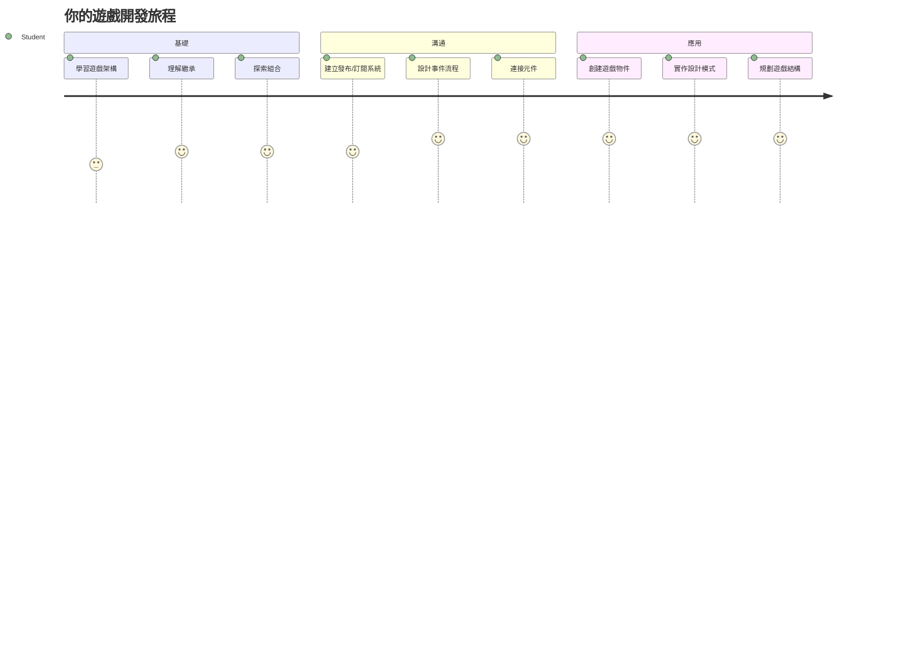
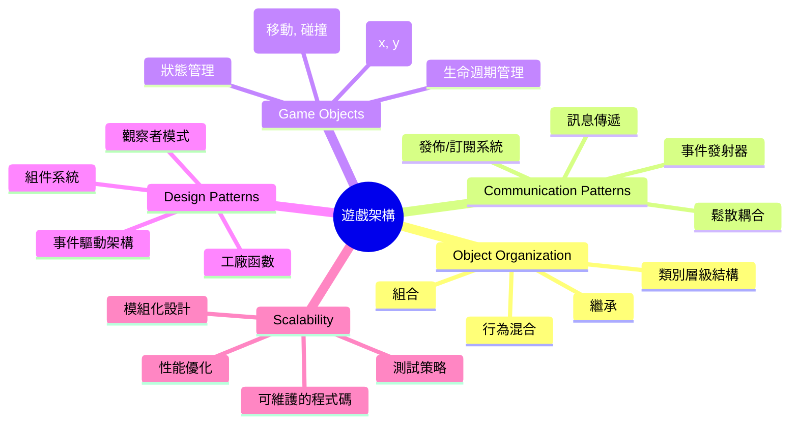
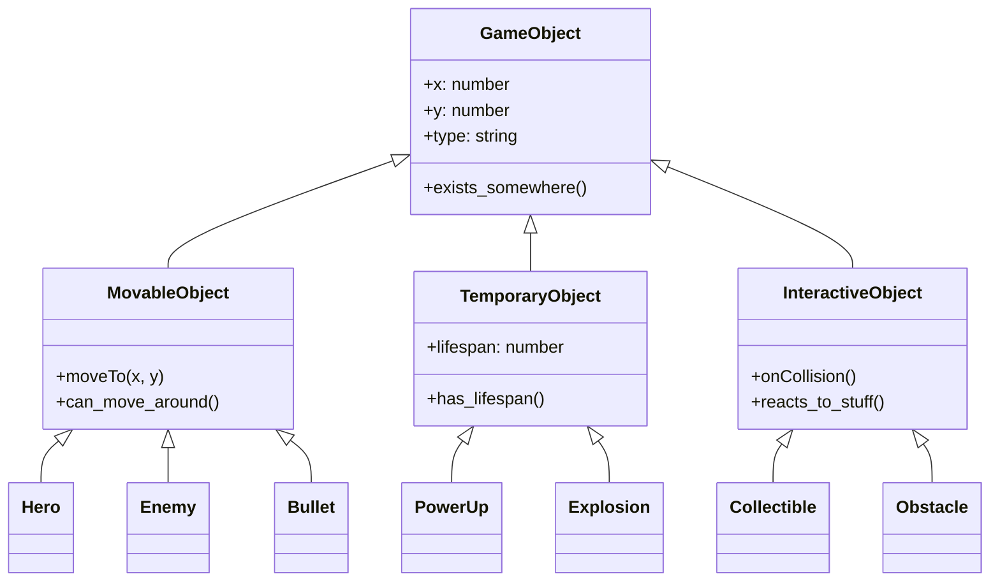
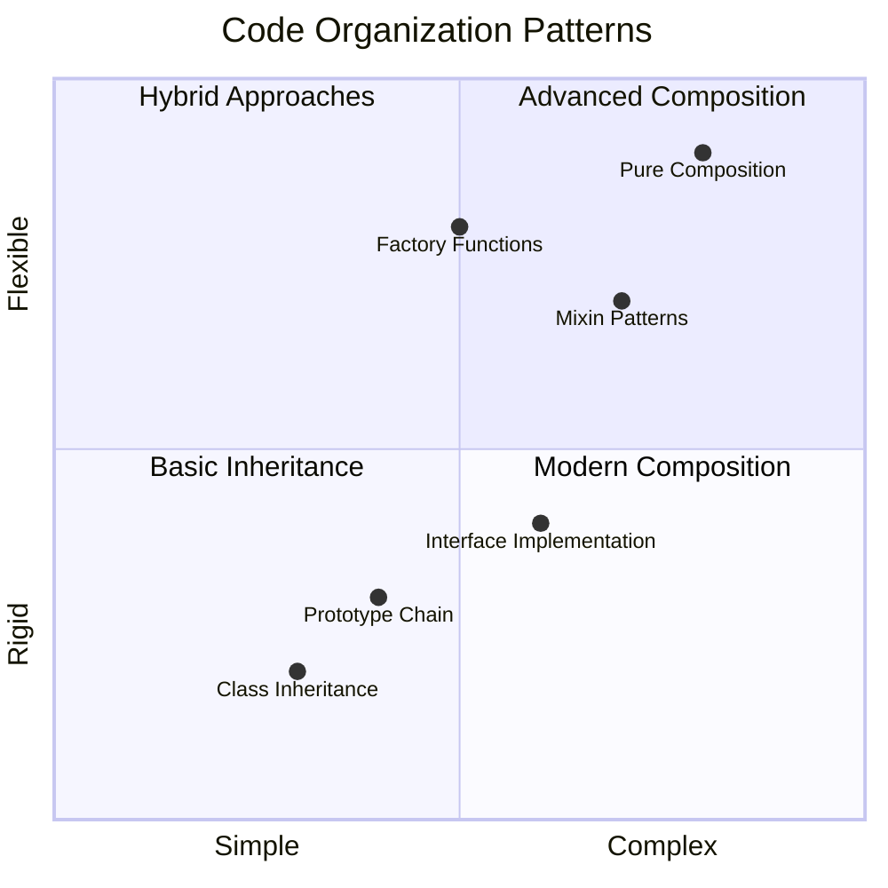
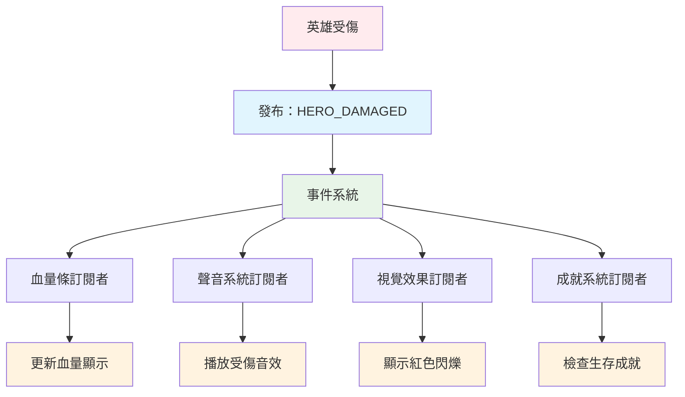
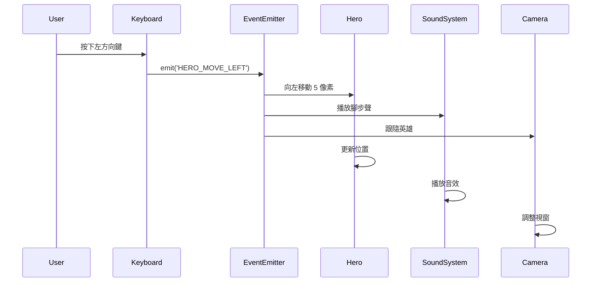

<!--
CO_OP_TRANSLATOR_METADATA:
{
  "original_hash": "a6332a7bb4d0be3bfd24199c83993777",
  "translation_date": "2026-01-06T12:35:19+00:00",
  "source_file": "6-space-game/1-introduction/README.md",
  "language_code": "hk"
}
-->
# 建立太空遊戲第一部分：介紹




就如同 NASA 的任務控制在太空發射時協調多個系統一樣，我們將建立一個太空遊戲，展示程式不同部分如何無縫協作。在創建一個你能實際玩到的作品的同時，你會學習到適用於任何軟件項目中的基本程式設計概念。

我們將探討組織程式碼的兩種基本方法：繼承與組合。這不僅是學術概念，這些模式正是從電子遊戲到銀行系統所採用的基礎。我們還將實現一個稱為 pub/sub 的通訊系統，類似於航天器中使用的通訊網絡，讓不同組件能分享信息而不產生依賴。

完成此系列後，你將理解如何建立可擴展且可演進的應用程式——無論是開發遊戲、網絡應用還是其他軟件系統。


## 課前測驗

[課前測驗](https://ff-quizzes.netlify.app/web/quiz/29)

## 遊戲開發中的繼承與組合

隨著專案複雜度增加，程式碼組織變得至關重要。從簡單的腳本開始，如果沒有適當結構，很快會變得難以維護——就像阿波羅任務需要在數千個組件之間進行細緻協調一樣。

我們將探討兩種基本的程式碼組織方法：繼承和組合。兩者各有明顯優勢，理解兩者能幫你在不同情境下選擇最合適的方法。我們將透過太空遊戲展現這些概念，裡面有英雄、敵人、強化道具和其他物件需要有效互動。

✅ 最著名的程式設計書之一是關於[設計模式](https://en.wikipedia.org/wiki/Design_Patterns)的。

在任何遊戲中，你會有「遊戲物件」——充滿互動元素的遊戲世界。英雄、敵人、強化道具和視覺效果都是遊戲物件。它們存在於特定的螢幕座標，用 `x` 和 `y` 值表示，類似在坐標平面繪點。

儘管視覺不同，這些物件常具備基本行為：

- **它們存在某處** —— 每個物件擁有 x, y 座標，遊戲藉此知道在哪裡繪製它
- **許多會移動** —— 英雄奔跑、敵人追逐、子彈飛過螢幕
- **它們有生命週期** —— 有些持續存在，有些（如爆炸）短暫出現然後消失
- **它們會對事件作出反應** —— 碰撞發生、強化道具被收集、血條更新

✅ 想想看看 Pac-Man 遊戲。你能識別出上述四種物件類型嗎？


### 透過程式碼表達行為

既然你了解遊戲物件共通的行為，接下來探討如何用 JavaScript 實現這些行為。你可以透過附加於類別或物件本身的方法來表達物件行為，且有多種方法可選。

**基於類別的方法**

類別與繼承提供一個結構化方式來組織遊戲物件。就像卡爾．林奈（Carl Linnaeus）所發展的分類系統一樣，你會從包含共同屬性的基底類開始，再建立專門的子類繼承這些基礎並添加專屬功能。

✅ 繼承是很重要的概念。可參考 [MDN 的繼承及原型鏈文章](https://developer.mozilla.org/docs/Web/JavaScript/Inheritance_and_the_prototype_chain) 了解更多。

這是使用類別與繼承實作遊戲物件的方式：

```javascript
// 第一步：建立基礎的 GameObject 類別
class GameObject {
  constructor(x, y, type) {
    this.x = x;
    this.y = y;
    this.type = type;
  }
}
```

**我們一步步拆解：**
- 我們建立一個基本範本，讓每個遊戲物件都可使用
- 建構函式儲存物件位置 (`x`, `y`) 和物件種類
- 這成為所有遊戲物件建立的基礎

```javascript
// 第2步：透過繼承新增移動能力
class Movable extends GameObject {
  constructor(x, y, type) {
    super(x, y, type); // 調用父類構造函數
  }

  // 新增移動到新位置的能力
  moveTo(x, y) {
    this.x = x;
    this.y = y;
  }
}
```

**在上述程式碼中，我們：**
- **擴充** GameObject 類來加入移動功能
- **使用** `super()` 呼叫父類建構子以初始化繼承的屬性
- **新增** `moveTo()` 方法更新物件位置

```javascript
// 第3步：創建特定遊戲物件類型
class Hero extends Movable {
  constructor(x, y) {
    super(x, y, 'Hero'); // 自動設定類型
  }
}

class Tree extends GameObject {
  constructor(x, y) {
    super(x, y, 'Tree'); // 樹木不需要移動
  }
}

// 第4步：使用你的遊戲物件
const hero = new Hero(0, 0);
hero.moveTo(5, 5); // 英雄可以移動！

const tree = new Tree(10, 15);
// tree.moveTo() 會導致錯誤 - 樹木無法移動
```

**理解這些概念：**
- **建立** 專門類型物件並繼承適合的行為
- **展示** 繼承允許選擇性包含特性
- **表示** 英雄可以移動但樹保持靜止
- **說明** 類別階層如何防止不當操作

✅ 花幾分鐘重新想像如何用 JavaScript 撰寫如 Pac-Man 中的英雄（例如 Inky、Pinky 或 Blinky）。

**組合的方法**

組合遵循模組化設計哲學，類似工程師設計航天器可替換組件。不是繼承父類，而是組合具體行為來創造具所需功能的物件。這種方法提供彈性，避免僵硬的階層限制。

```javascript
// 第一步：建立基本行為物件
const gameObject = {
  x: 0,
  y: 0,
  type: ''
};

const movable = {
  moveTo(x, y) {
    this.x = x;
    this.y = y;
  }
};
```

**這段程式碼做了什麼：**
- **定義** 一個有位置與類型屬性的基本 `gameObject`
- **建立** 分離的 `movable` 行為物件，具備移動功能
- **分離** 位置資料與移動邏輯，保持關注點分離

```javascript
// 第2步：透過組合行為來組成物件
const movableObject = { ...gameObject, ...movable };

// 第3步：為不同物件類型建立工廠函數
function createHero(x, y) {
  return {
    ...movableObject,
    x,
    y,
    type: 'Hero'
  };
}

function createStatic(x, y, type) {
  return {
    ...gameObject,
    x,
    y,
    type
  };
}
```

**在上述中，我們：**
- **結合** 基本物件屬性與移動行為，使用擴散語法
- **創建** 工廠函式回傳定製化物件
- **使** 物件建立具靈活性，無須嚴格階層結構
- **允許** 物件擁有正好需要的行為

```javascript
// 第4步：創建並使用你的組合物件
const hero = createHero(10, 10);
hero.moveTo(5, 5); // 運作完美！

const tree = createStatic(0, 0, 'Tree');
// tree.moveTo() 未定義 - 沒有組合任何移動行為
```

**要點回顧：**
- **透過組合** 混合行為而非繼承來構建物件
- **提供** 比嚴格繼承階層更大彈性
- **使** 物件有精確功能
- **運用** 現代 JavaScript 擴散運算符簡潔合併物件 
```

**Which Pattern Should You Choose?**

**Which Pattern Should You Choose?**



> 💡 **專業提示**：兩種模式在現代 Javascript 開發中各有用途。類別適用明確定義的階層，組合則在需要極致彈性時表現優異。
> 
**使用時機：**
- **選擇** 繼承當存在明確「是」關係（例如 Hero *是一個* 可移動物件）
- **挑選** 組合當需要「擁有」關係（例如 Hero *擁有* 移動能力）
- **考慮** 團隊偏好與專案需求
- **記得** 可以在同一專案中混用這兩種方法

### 🔄 **教學小檢核**
**物件組織理解**：在進入通訊模式前，請確保你能：
- ✅ 解釋繼承與組合的差別
- ✅ 分辨何時用類別或工廠函式
- ✅ 理解繼承中 `super()` 關鍵字的用途
- ✅ 認識每種方法對遊戲開發的好處

**快速自我測驗**：如何建立一個會移動且能飛行的 Flying Enemy？
- **繼承方法**: `class FlyingEnemy extends Movable`
- **組合方法**: `{ ...movable, ...flyable, ...gameObject }`

**真實應用連結**：這些模式無處不在：
- **React 元件**: Props（組合） vs 類別繼承
- **遊戲引擎**: 實體-組件系統採用組合
- **行動應用**: UI 框架常用繼承階層

## 通訊模式：Pub/Sub 系統

當應用程式變複雜，管理組件間通訊變困難。發佈-訂閱（pub/sub）模式解決此問題，原理類似無線電廣播——一個發射器可觸及多個接收器，且不需知道誰在聽。

想像英雄受到傷害會發生什麼：血條更新、音效播放、視覺反饋出現。Pub/sub 允許英雄廣播「受到傷害」訊息。任何需回應該事件的系統都可訂閱此訊息並對應處理，而非英雄直接連結到這些系統。

✅ **Pub/Sub** 是「發布-訂閱」的縮寫


### 理解 Pub/Sub 架構

Pub/sub 模式讓應用內各部分鬆散耦合，意即它們能合作而不直接相依。這種分離使程式碼更可維護、易測試且彈性高。

**pub/sub 主要角色：**
- **訊息** — 簡單的文字標籤，如 `'PLAYER_SCORED'`，描述事件（可附加額外資訊）
- **發佈者** — 發出「有事情發生！」訊息的物件
- **訂閱者** — 宣告「我關心這事件」並在事件發生時反應的物件
- **事件系統** — 中間人，確保訊息送達相應聽眾

### 建立事件系統

讓我們建立一個簡單卻強大的事件系統，展示這些概念：

```javascript
// 第一步：建立 EventEmitter 類別
class EventEmitter {
  constructor() {
    this.listeners = {}; // 儲存所有事件監聽器
  }
  
  // 為特定訊息類型註冊監聽器
  on(message, listener) {
    if (!this.listeners[message]) {
      this.listeners[message] = [];
    }
    this.listeners[message].push(listener);
  }
  
  // 向所有已註冊的監聽器發送訊息
  emit(message, payload = null) {
    if (this.listeners[message]) {
      this.listeners[message].forEach(listener => {
        listener(message, payload);
      });
    }
  }
}
```

**這裡發生的事情分解：**
- **建立** 使用簡單類別的中央事件管理系統
- **以訊息類型存儲** 聽眾於物件中
- **使用 `on()` 註冊** 新的監聽器
- **用 `emit()` 廣播** 訊息給所有關心的監聽者
- **支援** 選擇性資料載荷傳遞相關資訊

### 綜合應用示例

現在看到實作吧！我們建立一個簡單移動系統，展示 pub/sub 如何清晰且靈活：

```javascript
// 步驟 1：定義你的消息類型
const Messages = {
  HERO_MOVE_LEFT: 'HERO_MOVE_LEFT',
  HERO_MOVE_RIGHT: 'HERO_MOVE_RIGHT',
  ENEMY_SPOTTED: 'ENEMY_SPOTTED'
};

// 步驟 2：建立你的事件系統和遊戲物件
const eventEmitter = new EventEmitter();
const hero = createHero(0, 0);
```

**程式碼說明：**
- **定義** 常數物件避免訊息名稱錯誤
- **建立** 事件發射器實例處理所有通訊
- **初始化** 英雄物件於起始位置

```javascript
// 第3步：設置事件監聽器（訂閱者）
eventEmitter.on(Messages.HERO_MOVE_LEFT, () => {
  hero.moveTo(hero.x - 5, hero.y);
  console.log(`Hero moved to position: ${hero.x}, ${hero.y}`);
});

eventEmitter.on(Messages.HERO_MOVE_RIGHT, () => {
  hero.moveTo(hero.x + 5, hero.y);
  console.log(`Hero moved to position: ${hero.x}, ${hero.y}`);
});
```

**上述程式碼中，我們：**
- **註冊** 事件監聽器回應移動訊息
- **根據移動方向** 更新英雄位置
- **加入** 主控台日誌追蹤英雄位置變化
- **將** 移動邏輯與輸入處理分離

```javascript
// 第四步：將鍵盤輸入連接到事件（發布者）
window.addEventListener('keydown', (event) => {
  switch(event.key) {
    case 'ArrowLeft':
      eventEmitter.emit(Messages.HERO_MOVE_LEFT);
      break;
    case 'ArrowRight':
      eventEmitter.emit(Messages.HERO_MOVE_RIGHT);
      break;
  }
});
```

**理解這些概念：**
- **連結** 鍵盤輸入與遊戲事件，避免緊耦合
- **使** 輸入系統間接與遊戲物件通訊
- **允許** 多個系統同時回應鍵盤事件
- **方便** 更改按鍵綁定或新增輸入方式


> 💡 **專業提示**：這模式的美妙之處在於彈性！你可以輕鬆新增音效、螢幕震動或粒子效果，只需添加事件監聽器──不必更改現有鍵盤或移動程式碼。
> 
**為何你會喜愛此模式：**
- 新增功能變得超簡單──只要收聽你想關注的事件
- 多個系統可同時反應同一事件，互不干擾
- 測試更直觀，因各部分獨立運作
- 發生錯誤時知道確切檢查位置

### Pub/Sub 為何能有效擴展

Pub/sub 模式保持架構簡潔，即使應用變得龐大。無論管理數十個敵人、動態 UI 更新或音效系統，其模式均能應付規模提升而無需架構變更。新功能可整合進現有事件系統，不影響既有功能。

> ⚠️ **常見錯誤**：不要一開始就創建太多特定訊息類型。先從廣泛類別開始，隨遊戲需求漸明逐漸細化。
> 
**最佳實踐：**
- **將** 相關訊息分為合理類群
- **使用** 明確描述事件的名稱
- **保持** 訊息載荷簡潔且聚焦
- **為團隊** 製作訊息類型文件與說明

### 🔄 **教學小檢核**
**事件驅動架構理解**：確認你掌握整套系統：
- ✅ pub/sub 如何避免組件間緊耦合？
- ✅ 為何事件驅動架構更容易新增功能？
- ✅ EventEmitter 在通訊流程中扮演什麼角色？
- ✅ 訊息常數如何防止錯誤並提升可維護性？

**設計挑戰**：這些遊戲場景你會怎麼用 pub/sub 處理？
1. **敵人死亡**：更新分數、播放音效、產生強化道具、從螢幕移除
2. **關卡完成**：停止音樂、顯示 UI、保存進度、載入下一關
3. **強化道具收集**：增強能力、更新 UI、播放特效、啟動計時器

**專業連結**：此模式出現在：
- **前端框架**：React/Vue 事件系統
- **後端服務**：微服務通訊
- **遊戲引擎**：Unity 事件系統
- **行動開發**：iOS/Android 通知系統

---

## GitHub Copilot Agent 挑戰 🚀

使用 Agent 模式完成以下挑戰：

**描述：** 使用繼承和 pub/sub 模式創建一個簡單遊戲物件系統。你將實現一個基本遊戲，讓不同物件透過事件通訊，而不需彼此直接認識。

**提示：** 建立 JavaScript 遊戲系統，需求如下：1) 創建基底 GameObject 類，帶有 x, y 座標與類型屬性。2) 創建 Hero 類繼承自 GameObject，並能移動。3) 創建 Enemy 類繼承 GameObject，能追蹤英雄。4) 實作 EventEmitter 類作為 pub/sub 模式。5) 設置事件監聽器，當英雄移動時，附近敵人會收到 'HERO_MOVED' 事件，並更新位置朝英雄移動。加入 console.log 陳述顯示物件通訊。

想了解更多 [agent 模式](https://code.visualstudio.com/blogs/2025/02/24/introducing-copilot-agent-mode) 請點此。

## 🚀 挑戰
考慮 pub-sub 模式如何加強遊戲架構。識別哪些元件應該發出事件，以及系統應如何回應。設計一個遊戲概念並繪製其元件間的通訊模式。

## 課後小測驗

[課後小測驗](https://ff-quizzes.netlify.app/web/quiz/30)

## 複習與自學

透過[閱讀相關內容](https://docs.microsoft.com/azure/architecture/patterns/publisher-subscriber/?WT.mc_id=academic-77807-sagibbon)深入了解 Pub/Sub。

### ⚡ **你可以在接下來 5 分鐘做的事**
- [ ] 打開任何線上 HTML5 遊戲並用 DevTools 檢查其程式碼
- [ ] 創建一個簡單的 HTML5 Canvas 元素並繪製基本圖形
- [ ] 嘗試使用 `setInterval` 來製作一個簡單的動畫循環
- [ ] 探索 Canvas API 文件並嘗試繪製方法

### 🎯 **你這一小時可以完成的目標**
- [ ] 完成課後測驗並理解遊戲開發概念
- [ ] 建立遊戲專案架構（HTML、CSS、JavaScript 檔案）
- [ ] 製作基本遊戲迴圈，持續更新與渲染
- [ ] 在畫布上繪製你的第一批遊戲精靈
- [ ] 實作圖片與音效的基本資源加載

### 📅 **你的週度遊戲製作計劃**
- [ ] 完成具備所有計劃功能的完整太空遊戲
- [ ] 增加精緻的圖形、音效和流暢動畫
- [ ] 實作遊戲狀態（開始畫面、遊戲進行、遊戲結束）
- [ ] 製作計分系統與玩家進度追蹤
- [ ] 使你的遊戲適應各種裝置並具備可及性
- [ ] 在線分享遊戲並從玩家取得回饋

### 🌟 **你的月度遊戲開發規劃**
- [ ] 製作多款不同類型及機制的遊戲
- [ ] 學習 Phaser 或 Three.js 等遊戲開發框架
- [ ] 參與開源遊戲開發專案
- [ ] 精通進階遊戲編程模式與優化技巧
- [ ] 建立展示你的遊戲開發作品集
- [ ] 指導有興趣的遊戲開發者與互動媒體創作者

## 🎯 你的遊戲開發精通時間表

```mermaid
timeline
    title 遊戲架構學習進程
    
    section 物件模式（20分鐘）
        代碼組織：類別繼承
                 ：組合模式
                 ：工廠函數
                 ：行為混入
        
    section 通訊系統（25分鐘）
        事件架構：發布/訂閱實作
                 ：訊息設計
                 ：事件發射器
                 ：鬆耦合
        
    section 遊戲物件設計（30分鐘）
        實體系統：屬性管理
                 ：行為組合
                 ：狀態處理
                 ：生命週期管理
        
    section 架構模式（35分鐘）
        系統設計：元件系統
                 ：觀察者模式
                 ：命令模式
                 ：狀態機
        
    section 進階概念（45分鐘）
        可擴展架構：效能優化
                   ：記憶體管理
                   ：模組化設計
                   ：測試策略
        
    section 遊戲引擎概念（一週）
        專業發展：場景圖
                 ：資產管理
                 ：渲染管線
                 ：物理整合
        
    section 框架精通（兩週）
        現代遊戲開發：React遊戲模式
                     ：Canvas優化
                     ：WebGL基礎
                     ：PWA遊戲
        
    section 業界實務（一個月）
        專業技能：團隊協作
                 ：程式碼審查
                 ：遊戲設計模式
                 ：效能分析
```


### 🛠️ 你的遊戲架構工具組總結

完成本課程後，你已具備：
- **設計模式掌握**：理解繼承與組合的取捨
- **事件驅動架構**：Pub/sub 實作以支持可擴充通訊
- **物件導向設計**：類別階層與行為組合
- **現代 JavaScript**：工廠函式、展開語法與 ES6+ 模式
- **可擴充架構**：鬆耦合與模組化設計原則
- **遊戲開發基礎**：實體系統與元件模式
- **專業模式**：業界標準的程式碼組織方法

**實際應用**：這些模式直接適用於：
- **前端框架**：React/Vue 元件架構與狀態管理
- **後端服務**：微服務通訊與事件驅動系統
- **行動開發**：iOS/Android 應用架構與通知系統
- **遊戲引擎**：Unity、Unreal 與網頁遊戲開發
- **企業軟體**：事件源與分散式系統設計
- **API 設計**：RESTful 服務與即時通訊

**專業技能提升**：你現在能：
- **設計** 使用成熟模式的可擴充軟體架構
- **實作** 處理複雜互動的事件驅動系統
- **選擇** 適合不同情境的程式碼組織策略
- **除錯** 與維護鬆耦合系統
- **溝通** 使用業界標準術語說明技術決策

**下一階段**：你已準備好將這些模式套用於真實遊戲、探索進階遊戲開發議題，或將架構概念應用於網頁應用！

🌟 **成就解鎖**：你已精通從簡單遊戲到複雜企業系統核心架構模式！

## 作業

[設計一款遊戲](assignment.md)

---

<!-- CO-OP TRANSLATOR DISCLAIMER START -->
**免責聲明**：
本文件由 AI 翻譯服務 [Co-op Translator](https://github.com/Azure/co-op-translator) 所翻譯。雖然我們致力於達到準確性，但請注意自動翻譯可能包含錯誤或不準確之處。原始語言版本的文件應被視為權威來源。對於重要資訊，建議採用專業人工翻譯。我們對因使用本翻譯而引起的任何誤解或誤釋概不負責。
<!-- CO-OP TRANSLATOR DISCLAIMER END -->