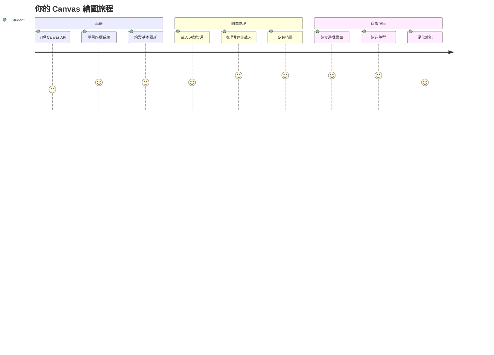
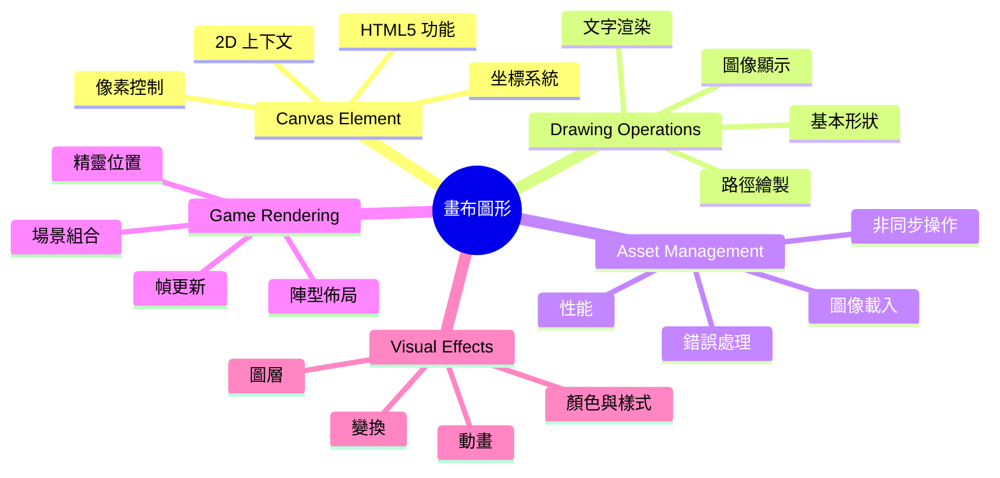
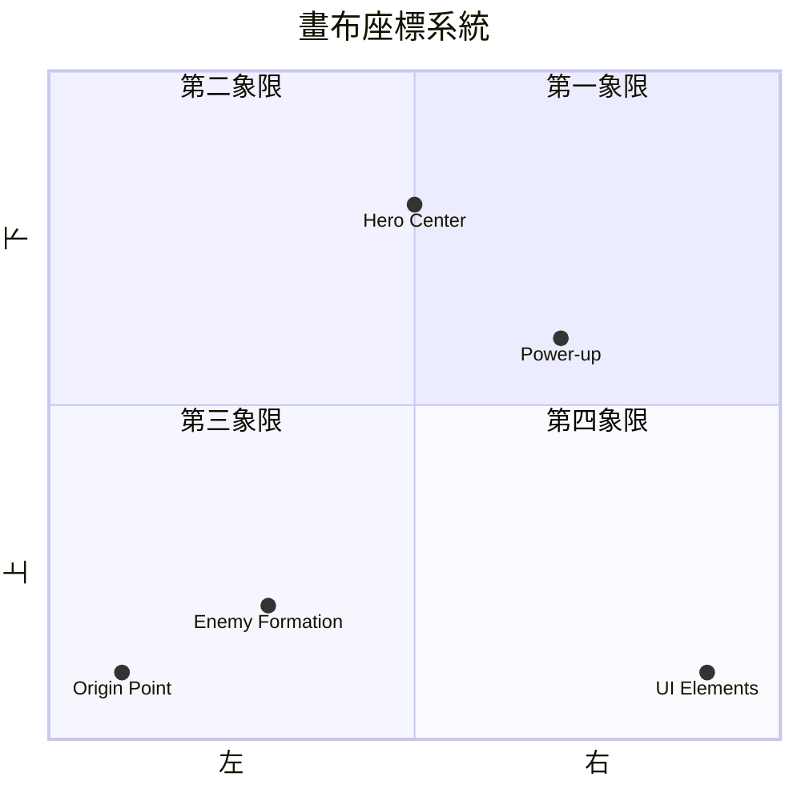
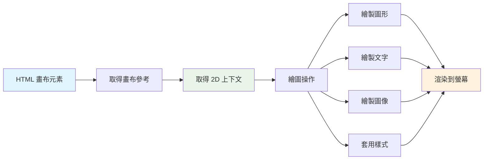
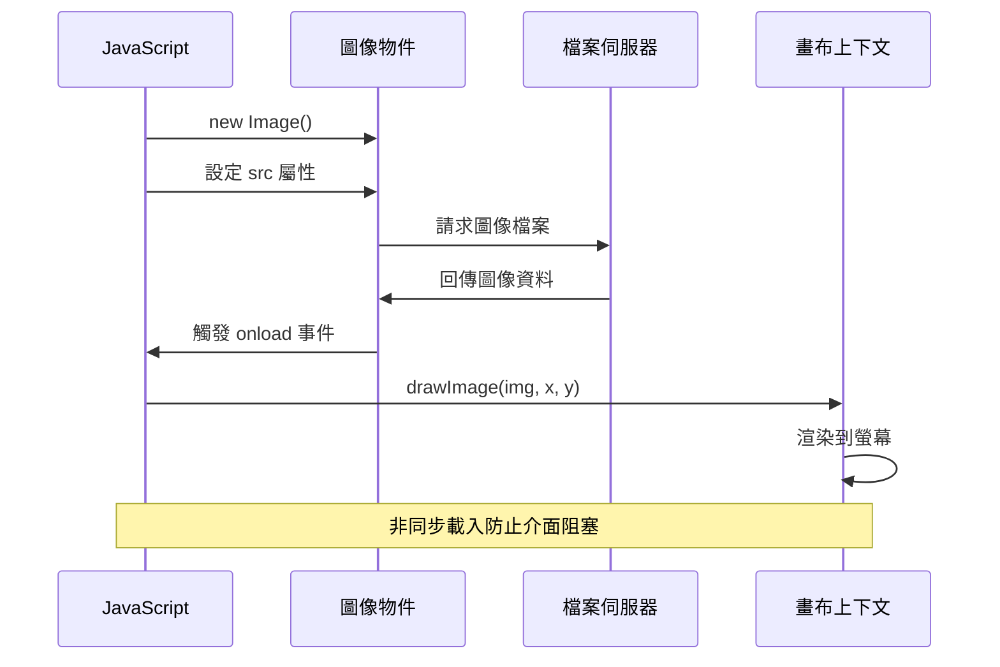
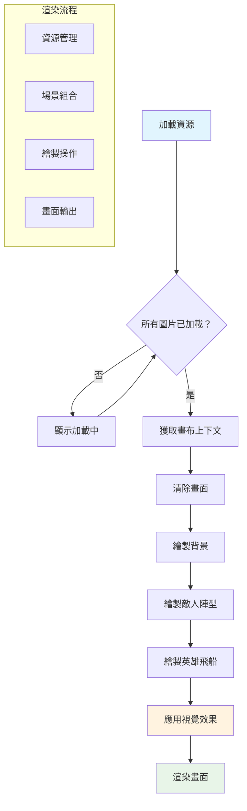
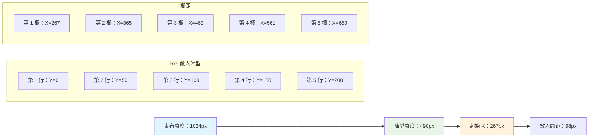
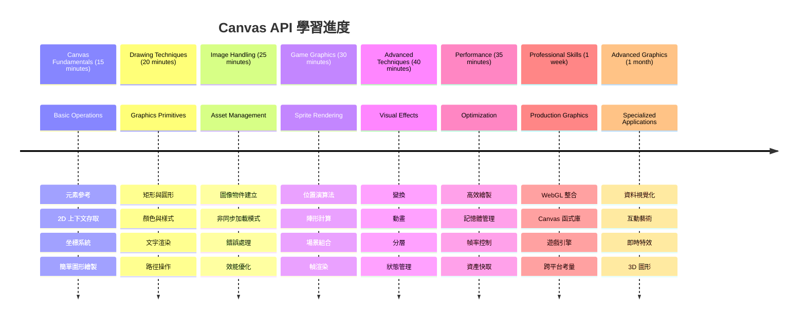

<!--
CO_OP_TRANSLATOR_METADATA:
{
  "original_hash": "7994743c5b21fdcceb36307916ef249a",
  "translation_date": "2026-01-06T12:29:28+00:00",
  "source_file": "6-space-game/2-drawing-to-canvas/README.md",
  "language_code": "hk"
}
-->
# 建立一個太空遊戲 第二部分：在畫布上繪製主角與怪物


Canvas API 是網頁開發中最強大的功能之一，能讓你在瀏覽器中直接創建動態且互動的圖形。在本課程中，我們將把空白的 HTML `<canvas>` 元素變成一個充滿英雄與怪物的遊戲世界。可以把畫布想像成你的數碼繪畫板，程式碼變成了視覺呈現。

我們將延續上一堂課所學的內容，現在深入視覺層面。你將學會如何載入並顯示遊戲精靈 (sprite)、精確定位元素，並為你的太空遊戲建立視覺基礎。這將連結靜態網頁與動態互動體驗之間的差距。

課程結束時，你將擁有一個完整的遊戲場景，主角飛船正確定位，敵軍陣型準備出擊。你會理解現代遊戲如何在瀏覽器中渲染圖像，並獲得創建互動視覺體驗的技能。一起探索畫布圖形，讓你的太空遊戲活起來吧！


## 課前小測驗

[課前小測驗](https://ff-quizzes.netlify.app/web/quiz/31)

## 什麼是 Canvas？

那這個 `<canvas>` 元素到底是什麼？它是 HTML5 用來在瀏覽器中建立動態圖形和動畫的解決方案。不同於靜態的圖片或影片，canvas 能讓你對螢幕上的每一個像素進行控制。這使它非常適合遊戲、數據視覺化以及互動藝術。它就像是一個可編程的繪畫表面，而 JavaScript 是你的畫筆。

預設情況下，canvas 元素看起來像是頁面上一個空白且透明的矩形。但潛力就在這裡！當你用 JavaScript 畫出形狀、載入圖片、創造動畫並讓畫面回應使用者互動時，它的力量就會顯現。這種方式類似於 1960 年代貝爾實驗室初期電腦圖形先驅，必須逐像素編寫程式來創造第一批數字動畫。

✅ 在 MDN 上閱讀[更多關於 Canvas API 的介紹](https://developer.mozilla.org/docs/Web/API/Canvas_API)。

它通常會這樣被宣告，在頁面主體中：

```html
<canvas id="myCanvas" width="200" height="100"></canvas>
```

**這段程式碼的作用是：**
- **設定** `id` 屬性，好讓你在 JavaScript 中引用這個特定的 canvas 元素
- **定義** 寬度，單位為像素，用來控制 canvas 的水平尺寸
- **建立** 高度，單位為像素，用來決定 canvas 的垂直大小

## 繪製簡單幾何圖形

現在你知道 canvas 元素是什麼了，讓我們來探索如何真正地在它上面繪製！canvas 使用的座標系你可能在數學課有聽過，唯獨有一個關於電腦圖形的特別地方。

canvas 使用的是笛卡爾座標系，有一條 x 軸（水平）和 y 軸（垂直）來定位你畫的所有東西。但關鍵差異在於：不同於數學課上的座標系，原點 `(0,0)` 是從左上角開始，x 值向右增長，y 值則向下增長。這個方法源自早期電腦顯示器，電子束從上往下掃描，因此左上角是自然的起點。



> 圖片來自 [MDN](https://developer.mozilla.org/docs/Web/API/Canvas_API/Tutorial/Drawing_shapes)

在 canvas 元素上繪圖，你會按照以下三個步驟，這是所有 canvas 圖形的基礎。練習幾次之後，你就能輕鬆習慣：


1. **從 DOM 取得** canvas 元素參考（就像取得其他 HTML 元素一樣）
2. **取得 2D 繪圖上下文** — 這提供了所有繪圖方法
3. **開始繪製！** 利用上下文的內建方法來創建你的圖形

程式碼看起來像這樣：

```javascript
// 第一步：獲取畫布元素
const canvas = document.getElementById("myCanvas");

// 第二步：獲取2D繪圖上下文
const ctx = canvas.getContext("2d");

// 第三步：設定填充顏色並繪製矩形
ctx.fillStyle = 'red';
ctx.fillRect(0, 0, 200, 200); // x, y, 寬度, 高度
```

**分解步驟：**
- 我們用 ID 取得 canvas 元素，並存入變數
- 取得 2D 繪圖上下文 — 這是裝滿繪圖方法的工具箱
- 告訴 canvas 使用 `fillStyle` 屬性設成紅色
- 繪製一個從左上角 (0,0) 開始、寬高皆為 200 像素的矩形

✅ Canvas API 主要聚焦於 2D 形狀，但你也可以在網站上繪製 3D 元素；這時可能會用到 [WebGL API](https://developer.mozilla.org/docs/Web/API/WebGL_API)。

你可以用 Canvas API 繪製各種東西：

- **幾何圖形**，我們已經示範過如何繪製矩形，但其實可以畫更多。
- **文字**，你可以使用任何字體和顏色繪製文字。
- **圖片**，你可以根據圖片資源，如 .jpg 或 .png，繪製圖像。

✅ 試試看！你知道如何畫矩形，能問問自己怎麼畫一個圓嗎？可以看看 CodePen 上一些有趣的 Canvas 畫作。這裡有個[特別令人印象深刻的範例](https://codepen.io/dissimulate/pen/KrAwx)。

### 🔄 **教學檢核點**
**Canvas 基礎理解**：在進入圖片載入前，請確保你會：
- ✅ 解釋 canvas 座標系如何與數學座標系不同
- ✅ 理解繪製 canvas 的三步驟流程
- ✅ 知道 2D 繪圖上下文提供什麼功能
- ✅ 描述 fillStyle 與 fillRect 是如何搭配使用

**快速自我測試**：如何在 (100, 50) 位置畫一個半徑為 25 的藍色圓形？
```javascript
ctx.fillStyle = 'blue';
ctx.beginPath();
ctx.arc(100, 50, 25, 0, 2 * Math.PI);
ctx.fill();
```

**你已經知道的 Canvas 繪圖方法：**
- **fillRect()**：繪製實心矩形
- **fillStyle**：設定顏色和圖案
- **beginPath()**：開始新的繪圖路徑
- **arc()**：繪製圓和曲線

## 載入與繪製圖片資源

繪製基本形狀很好入門，但大多數遊戲需要真正的圖片！精靈圖、背景和材質是遊戲視覺吸引力的關鍵。載入並顯示圖片與繪製幾何形狀的方法不同，但理解過程後相當簡單。

我們需要建立一個 `Image` 物件，載入圖片檔案（這是非同步過程，也就是「在背景進行」），然後一旦圖片準備好，就繪製到 canvas 上。這種方式可確保圖片正確顯示，且不會阻塞應用程式的運行。


### 基本的圖片載入

```javascript
const img = new Image();
img.src = 'path/to/my/image.png';
img.onload = () => {
  // 圖像已加載並準備好使用
  console.log('Image loaded successfully!');
};
```

**以下這段程式碼的運作原理：**
- 建立一個全新的 Image 物件來放置精靈或材質
- 指定要載入的圖片檔案路徑
- 監聽載入事件，確保圖片準備好後才使用

### 一個更好的圖片載入方法

這邊示範一個更健壯的圖片載入方式，專業開發者常用，將圖片載入包裝成 Promise 函式 — 這種方式在 ES6 讓 JavaScript Promises 標準化後廣受歡迎，程式碼更清晰也能優雅地處理錯誤：

```javascript
function loadAsset(path) {
  return new Promise((resolve, reject) => {
    const img = new Image();
    img.src = path;
    img.onload = () => {
      resolve(img);
    };
    img.onerror = () => {
      reject(new Error(`Failed to load image: ${path}`));
    };
  });
}

// 現代用法，配合 async/await
async function initializeGame() {
  try {
    const heroImg = await loadAsset('hero.png');
    const monsterImg = await loadAsset('monster.png');
    // 圖像現已準備好使用
  } catch (error) {
    console.error('Failed to load game assets:', error);
  }
}
```

**我們做了什麼：**
- 把整個圖片載入邏輯包裝進 Promise，方便更好的管理
- 加入錯誤處理，確保出錯時會通知
- 使用現代 async/await 語法，讓程式碼更易讀
- 用 try/catch 區塊優雅地處理載入問題

載入完成後，繪製到 canvas 實際上非常簡單：

```javascript
async function renderGameScreen() {
  try {
    // 載入遊戲資產
    const heroImg = await loadAsset('hero.png');
    const monsterImg = await loadAsset('monster.png');

    // 獲取畫布和上下文
    const canvas = document.getElementById("myCanvas");
    const ctx = canvas.getContext("2d");

    // 將圖像繪製到指定位置
    ctx.drawImage(heroImg, canvas.width / 2, canvas.height / 2);
    ctx.drawImage(monsterImg, 0, 0);
  } catch (error) {
    console.error('Failed to render game screen:', error);
  }
}
```

**逐步說明：**
- 使用 await 同步載入英雄與怪物圖片
- 取得 canvas 元素並抓取 2D 渲染上下文
- 利用簡單的座標數學把英雄圖片定位到正中間
- 把怪物圖片放在左上角，開始排列敵人陣型
- 捕捉載入或繪製過程中可能發生的錯誤


## 現在是開始建立你的遊戲的時候了

現在我們把所有東西整合，建立你的太空遊戲的視覺基礎。你已經對 canvas 基礎和圖像載入技術有所掌握，這個實作單元會引導你創建完整的遊戲畫面，並正確地擺放精靈。

### 要建立什麼

你將建立一個含有 Canvas 元素的網頁。它要呈現一個寬 1024px、高 768px、背景為黑色的畫面。我們已為你準備了兩張圖片：

- 英雄飛船

   

- 5×5 隻怪物

   

### 推薦開發步驟

在 `your-work` 子資料夾中你可以找到為你建立的入門檔案。你的專案結構應該包含：

```bash
your-work/
├── assets/
│   ├── enemyShip.png
│   └── player.png
├── index.html
├── app.js
└── package.json
```

**你手上的資源有：**
- **遊戲精靈** 存放於 `assets/` 資料夾，方便管理
- **主 HTML 檔案** 用於設定 canvas 元素並準備環境
- **JavaScript 檔案** 你將在這裡撰寫所有遊戲渲染程式碼
- **package.json** 用於設置開發伺服器，讓你能在本機測試

打開該資料夾於 Visual Studio Code 開始開發。你需要一個本機開發環境，包含 Visual Studio Code、NPM 以及 Node.js。如果你尚未安裝 npm，[可以點這裡了解如何安裝](https://www.npmjs.com/get-npm)。

透過命令行導航到 `your-work` 資料夾，啟動你的開發伺服器：

```bash
cd your-work
npm start
```

**這條命令能做什麼：**
- **啟動** 在 `http://localhost:5000` 的本機伺服器，方便你測試遊戲
- **正確服務** 你的所有檔案，確保瀏覽器可以順利載入
- **監控檔案** 變動，讓你開發時更順暢
- **提供** 專業的開發環境體驗

> 💡 **注意**：你的瀏覽器一開始會呈現空白頁面 — 這是正常的！隨著你添加程式碼，請刷新瀏覽器查看變動。這種反覆迭代開發的方式很像 NASA 構建阿波羅導航電腦時，先測試單一組件再整合到整體系統。

### 新增程式碼

在 `your-work/app.js` 中加入必要程式碼以完成下列任務：

1. **繪製黑色背景的 canvas**
   > 💡 **做法**：找到 `/app.js` 裡的 TODO 標記，增加兩行程式碼。設定 `ctx.fillStyle` 為黑色，然後用 `ctx.fillRect()` 繪製整個 canvas 大小。非常簡單！

2. **載入遊戲材質**
   > 💡 **做法**：用 `await loadAsset()` 載入玩家與敵人圖片，用變數保存。記得沒有繪製前是看不到的！

3. **將英雄飛船繪製於底部中間位置**
   > 💡 **做法**：利用 `ctx.drawImage()` 來定位英雄。x 座標用 `canvas.width / 2 - 45` 置中，y 座標用 `canvas.height - canvas.height / 4` 放在下方區域。

4. **繪製 5×5 的敵人隊形**
   > 💡 **做法**：找到 `createEnemies` 函式，設置巢狀迴圈。你需要計算間距和位置，但別擔心 — 我會帶你一步步完成！

首先，設定常數以安排敵人陣型位置：

```javascript
const ENEMY_TOTAL = 5;
const ENEMY_SPACING = 98;
const FORMATION_WIDTH = ENEMY_TOTAL * ENEMY_SPACING;
const START_X = (canvas.width - FORMATION_WIDTH) / 2;
const STOP_X = START_X + FORMATION_WIDTH;
```

**這些常數的功能分解：**
- 設定每列和每行均為 5 個敵人（漂亮的 5×5 格子）
- 定義敵人間距，避免擁擠
- 計算整個陣型的寬度
- 確定起始與結束點，讓陣型看起來置中


接著，創建巢狀迴圈繪製敵人陣型：

```javascript
for (let x = START_X; x < STOP_X; x += ENEMY_SPACING) {
  for (let y = 0; y < 50 * 5; y += 50) {
    ctx.drawImage(enemyImg, x, y);
  }
}
```

**這段巢狀迴圈的作用：**
- 外層迴圈從左到右移動陣型
- 內層迴圈從上到下建立列
- 在精準計算出的 x,y 座標繪製每隻敵人精靈
- 保持均勻間距，讓畫面專業且整齊

### 🔄 **教學檢核點**
**遊戲渲染精通**：請確認你理解整體渲染系統：
- ✅ 非同步圖片載入如何避免遊戲啟動時阻塞使用者介面？
- ✅ 為什麼用常數計算敵人陣型位置，比硬編碼更佳？
- ✅ 2D 繪圖上下文在繪圖過程中扮演什麼角色？
- ✅ 巢狀迴圈如何建立有組織的精靈陣型？

**效能考量**：你的遊戲現已展示：
- **有效的資源載入**：採用 Promise 管理圖片
- **有條理的渲染**：組織良好的繪製操作
- **精準的數學定位**：計算精靈擺放位置
- **錯誤管理**：優雅地處理載入失敗

**視覺程式設計概念**：你已學到：
- **座標系統**：將數學轉換為螢幕位置
- **精靈管理**：載入及顯示遊戲圖形
- **陣型演算法**：用於組織佈局的數學模式
- **非同步操作**：現代 JavaScript 以提供順暢的用戶體驗

## 結果

完成的結果應該看起來像這樣：


## 解決方案

請先試著自己解決，但如果卡住了，可以看看這個 [solution](../../../../6-space-game/2-drawing-to-canvas/solution/app.js)

---

## GitHub Copilot Agent 挑戰 🚀

使用 Agent 模式完成以下挑戰：

**描述：** 利用已學的 Canvas API 技術，通過加入視覺效果和互動元素來強化您的太空遊戲畫布。

**提示：** 建立一個名為 `enhanced-canvas.html` 的新檔案，裡面有一個畫布，背景顯示動畫星星，主角飛船有跳動的生命值條，敵機緩慢向下移動。加入 JavaScript 程式碼，使用隨機位置與透明度繪製閃爍星星，實作根據生命值改變顏色（綠 > 黃 > 紅）的生命值條，並讓敵機以不同速度向下動畫移動。

在這裡了解更多關於 [agent mode](https://code.visualstudio.com/blogs/2025/02/24/introducing-copilot-agent-mode)。

## 🚀 挑戰

你已學會使用 2D 專注的 Canvas API 畫圖，現在來看看 [WebGL API](https://developer.mozilla.org/docs/Web/API/WebGL_API)，試著繪製一個 3D 物件。

## 課後小測

[課後小測](https://ff-quizzes.netlify.app/web/quiz/32)

## 複習與自學

想了解更多 Canvas API，請參考 [Canvas API 文件](https://developer.mozilla.org/docs/Web/API/Canvas_API)。

### ⚡ **你可在接下來 5 分鐘完成的事**
- [ ] 開啟瀏覽器主控台並以 `document.createElement('canvas')` 建立一個畫布元素
- [ ] 嘗試用畫布上下文的 `fillRect()` 畫一個矩形
- [ ] 使用 `fillStyle` 屬性試驗不同顏色
- [ ] 用 `arc()` 方法畫一個簡單的圓形

### 🎯 **你可在這一小時完成的事**
- [ ] 完成課後測驗並理解 Canvas 基礎
- [ ] 實作一個多種形狀和顏色的畫布繪圖應用
- [ ] 實現圖片載入與精靈渲染功能
- [ ] 建立簡單動畫，讓物件在畫布上移動
- [ ] 練習畫布轉換如縮放、旋轉和平移

### 📅 **你一週的 Canvas 旅程**
- [ ] 完成具備細緻圖形與精靈動畫的太空遊戲
- [ ] 精通進階畫布技術，如漸層、圖案及合成
- [ ] 使用畫布實作互動數據視覺化
- [ ] 學習優化畫布效能技巧以提升流暢度
- [ ] 製作多功能繪圖或繪畫應用
- [ ] 探索創意編碼模式及利用畫布製作生成藝術

### 🌟 **你一個月的圖形大師路線**
- [ ] 利用 Canvas 2D 與 WebGL 建置複雜視覺應用
- [ ] 學習圖形編程概念與著色器基礎
- [ ] 貢獻開源圖形庫與視覺化工具
- [ ] 精通圖形高效能優化
- [ ] 製作教學內容分享 Canvas 編程與電腦圖學
- [ ] 成為協助他人創建視覺體驗的圖形編程專家

## 🎯 你的 Canvas 圖形大師時間表


### 🛠️ 你的 Canvas 圖形工具箱總結

完成本課後，你已具備：
- **Canvas API 精通**：完全理解 2D 圖形編程
- **座標數學**：精確定位與佈局演算法
- **資產管理**：專業圖片載入與錯誤處理
- **渲染流程**：有條理的場景組合方法
- **遊戲圖形**：精靈定位與陣型計算
- **非同步程式設計**：現代 JavaScript 模式確保流暢效能
- **視覺程式設計**：將數學概念轉換為螢幕圖形

**實務應用範圍廣泛**：你的 Canvas 技能可直接運用於：
- **資料視覺化**：製作圖表、圖形與互動儀表板
- **遊戲開發**：2D 遊戲、模擬與互動體驗
- **數位藝術**：創意編碼與生成藝術專案
- **介面設計**：自訂圖形與互動元素
- **教育軟體**：視覺學習工具與模擬器
- **網頁應用**：動態圖形與即時視覺化

**職場技能提升**：你現在能：
- **打造** 無需依賴外部函式庫的自訂圖形解決方案
- **優化** 渲染效能，打造順暢的用戶體驗
- **除錯** 使用瀏覽器開發工具解決複雜視覺問題
- **設計** 使用數學原理的可擴展圖形系統
- **整合** Canvas 圖形至現代網頁應用架構

**你已精通的 Canvas API 方法**：
- **元素管理**：getElementById、getContext
- **繪圖操作**：fillRect、drawImage、fillStyle
- **資產載入**：Image 物件、Promise 模式
- **數學定位**：座標計算、陣型演算法

**下一階段**：你已準備好加入動畫、用戶互動、碰撞偵測，或探索 WebGL 進行 3D 圖形！

🌟 **成就解鎖**：你已使用基礎 Canvas API 技術製作完整的遊戲渲染系統！

## 作業

[練習 Canvas API](assignment.md)

---

<!-- CO-OP TRANSLATOR DISCLAIMER START -->
**免責聲明**：  
本文件由 AI 翻譯服務 [Co-op Translator](https://github.com/Azure/co-op-translator) 進行翻譯。雖然我們力求準確，但請注意自動翻譯可能包含錯誤或不準確之處。原始文件的母語版本應被視為權威來源。對於關鍵資訊，建議採用專業人工翻譯。我們不對因使用此翻譯而引起的任何誤解或誤釋承擔責任。
<!-- CO-OP TRANSLATOR DISCLAIMER END -->