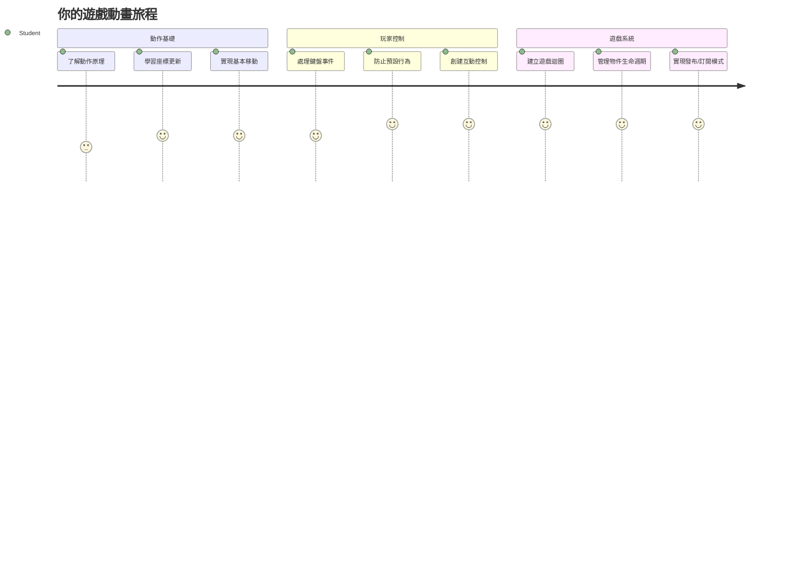
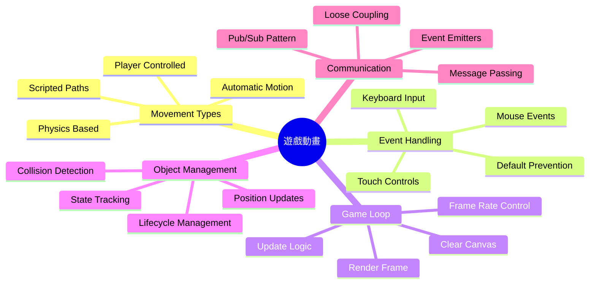
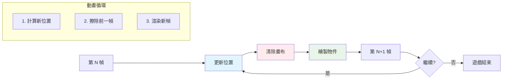
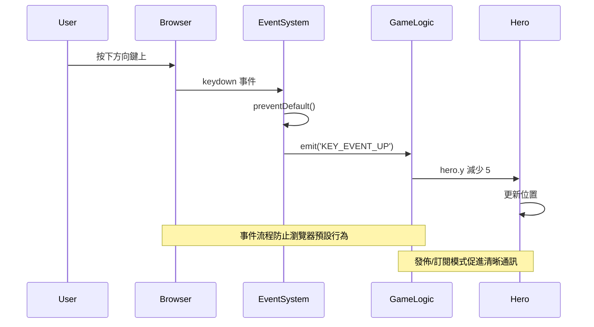
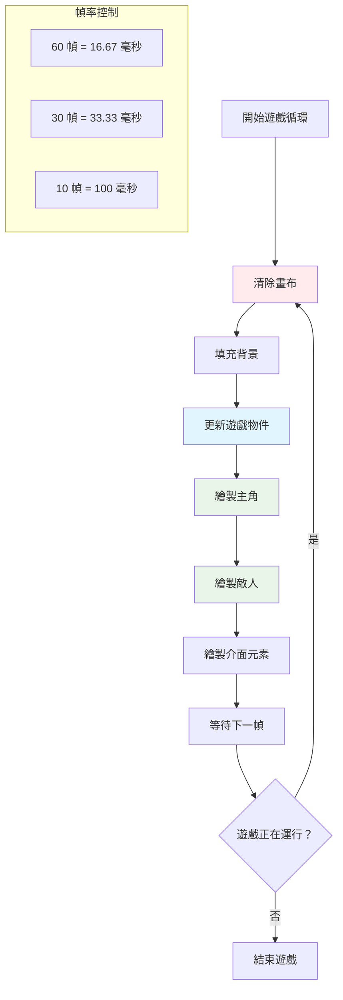
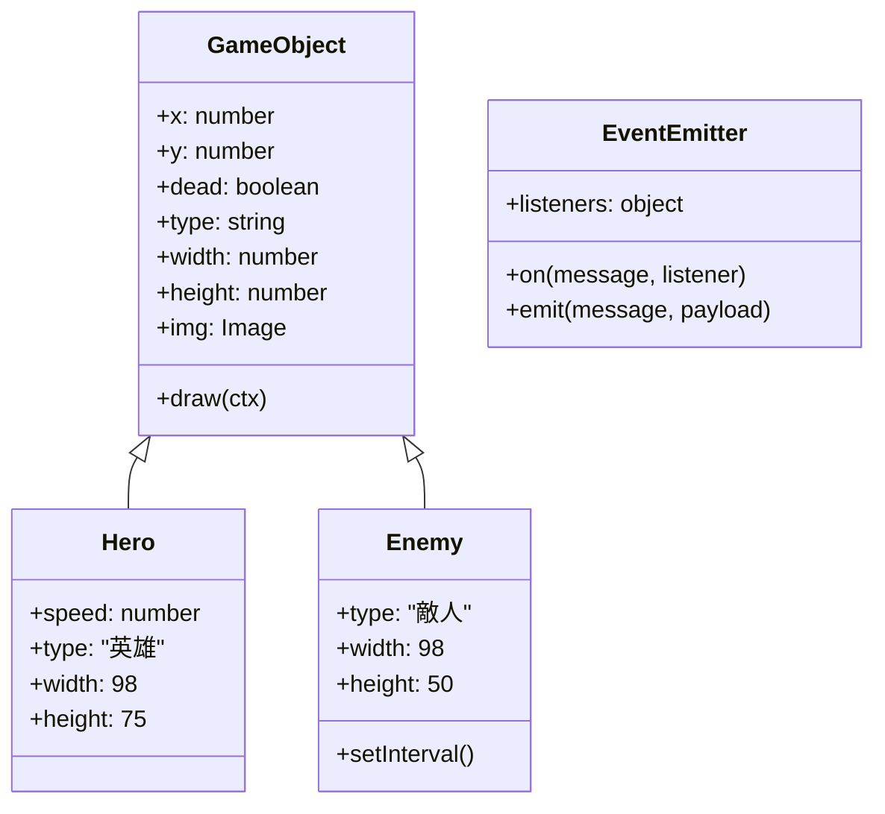
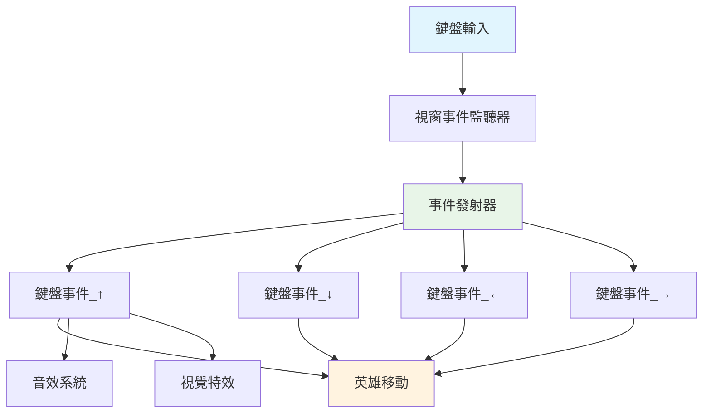
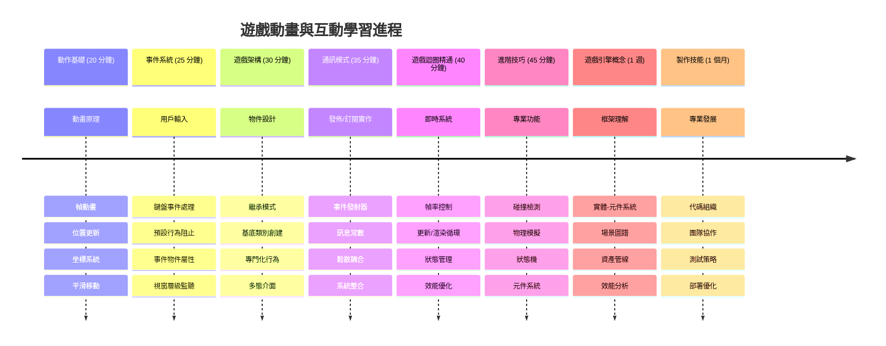

<!--
CO_OP_TRANSLATOR_METADATA:
{
  "original_hash": "8c55a2bd4bc0ebe4c88198fd563a9e09",
  "translation_date": "2026-01-06T12:37:20+00:00",
  "source_file": "6-space-game/3-moving-elements-around/README.md",
  "language_code": "hk"
}
-->
# Build a Space Game Part 3: Adding Motion


想想你最喜歡的遊戲 — 讓它們吸引人的不只是漂亮的圖像，而是所有東西隨著你的操作而移動和反應的方式。現在，你的太空遊戲就像一幅美麗的畫，但我們正要加入讓它活起來的動作。

當 NASA 的工程師為阿波羅任務編寫導航電腦程式時，他們面臨著類似的挑戰：如何讓太空船對飛行員輸入做出反應，同時自動維持航向修正？今天我們要學的原理正呼應那些概念 — 同時管理玩家操控的動作與系統自動行為。

在本課中，你將學習如何讓太空船在螢幕上滑動，回應玩家指令，並創造平滑的移動模式。我們會將所有內容拆解成可管理的概念，自然地一層層建立。

到最後，你將能讓玩家駕駛英雄飛船在螢幕上飛行，敵機則在上方巡邏。更重要的是，你將理解驅動遊戲移動系統的核心原理。


## 課前小測驗

[課前小測驗](https://ff-quizzes.netlify.app/web/quiz/33)

## 理解遊戲移動

當遊戲開始有東西移動起來，遊戲世界才會活過來，而這基本上有兩種方式：

- **由玩家控制的移動**：當你按下一個按鍵或點擊滑鼠，有物體移動。這是你與遊戲世界的直接連結。
- **自動移動**：遊戲本身決定移動東西 — 就像那些無論你是否在操作都需要巡邏螢幕的敵機。

讓物體在電腦螢幕上移動其實比你想像中簡單。還記得數學課上的 x 和 y 座標嗎？這正是我們現在使用的東西。早在 1610 年，伽利略追蹤木星的衛星時，基本上也是在做類似的事 — 隨時間繪製位置來理解運動模式。

在螢幕上移動東西就像製作翻頁動畫一樣 — 你需要遵循以下三個簡單步驟：


1. **更新位置** — 改變物件應該在的位置（比如往右移 5 個像素）
2. **清除舊的畫面** — 清空螢幕，避免出現鬼影拖尾
3. **繪製新的畫面** — 把物件放在新的位置

做得夠快，叭！你就有了流暢、自然的移動感。

以下是程式碼範例：

```javascript
// 設定英雄的位置
hero.x += 5;
// 清除承載英雄的矩形範圍
ctx.clearRect(0, 0, canvas.width, canvas.height);
// 重繪遊戲背景和英雄
ctx.fillRect(0, 0, canvas.width, canvas.height);
ctx.fillStyle = "black";
ctx.drawImage(heroImg, hero.x, hero.y);
```

**這段代碼做了什麼：**
- **更新**英雄在 x 軸的位置向右移 5 個像素
- **清空**整個畫布去除上一張畫面
- **填滿**黑色背景
- **重新繪製**英雄圖像在新位置

✅ 你能想出為什麼每秒重新繪製多幀英雄會造成效能問題嗎？請閱讀關於[這種模式的替代方案](https://developer.mozilla.org/en-US/docs/Web/API/Canvas_API/Tutorial/Optimizing_canvas)。

## 處理鍵盤事件

這就是把玩家輸入連接到遊戲行動的地方。當有人按下空白鍵發射雷射，或是用方向鍵閃避小行星時，遊戲需要偵測並回應這些輸入。

鍵盤事件在視窗級別發生，換句話說，整個瀏覽器視窗都在監聽這些鍵擊。滑鼠點擊則可以綁定到特定元素（像按鈕）。在我們的太空遊戲中，我們會專注於鍵盤控制，因為這給玩家經典的街機操作感。

這讓我想到 1800 年代電報操作員如何將摩斯密碼輸入轉換為有意義的訊息 — 我們在做的事情也類似，將按鍵轉換為遊戲指令。

要處理事件，你需要使用 window 的 `addEventListener()` 方法，並給它兩個參數。第一個是事件名稱，例如 `keyup`。第二個是當事件發生時要呼叫的函數。

範例如下：

```javascript
window.addEventListener('keyup', (evt) => {
  // evt.key = 鍵的字串表示
  if (evt.key === 'ArrowUp') {
    // 做某事
  }
});
```

**分解這裡發生的事：**
- **監聽**整個視窗的鍵盤事件
- **捕捉**事件物件，其中包含按下的按鍵資訊
- **檢查**是否被按下的鍵匹配特定按鍵（此處為向上箭頭）
- **當條件符合**時執行程式碼

在鍵盤事件中，你可以使用事件物件的兩個屬性來查看按了哪個鍵：

- `key` — 按鍵的字串表示，例如 `'ArrowUp'`
- `keyCode` — 按鍵的數字表示，例如 `37` 對應 `ArrowLeft`

✅ 操作鍵盤事件不只在遊戲開發有用，你還能想到這項技術的其他用途嗎？


### 特殊鍵：注意！

某些鍵有內建的瀏覽器行為，可能會干擾你的遊戲。箭頭鍵會滾動頁面，空白鍵會跳頁 — 這些行為本來是不希望玩家操作太空船時發生的。

我們可以阻止這些預設行為，讓遊戲自己處理輸入。這就像早期程式員必須覆寫系統中斷以實現自訂行為 — 我們現在是在瀏覽器層面做同樣的事。方式如下：

```javascript
const onKeyDown = function (e) {
  console.log(e.keyCode);
  switch (e.keyCode) {
    case 37:
    case 39:
    case 38:
    case 40: // 箭咀鍵
    case 32:
      e.preventDefault();
      break; // 空格鍵
    default:
      break; // 不要阻擋其他按鍵
  }
};

window.addEventListener('keydown', onKeyDown);
```

**解讀這段阻止預設行為的程式碼：**
- **檢查**可能會導致不想要瀏覽器行為的特定按鍵碼
- **阻止**箭頭鍵及空白鍵的預設瀏覽器行為
- **允許**其他按鍵正常運作
- **使用** `e.preventDefault()` 停止瀏覽器內建的行為

### 🔄 **教學檢視點**
**事件 Handling 理解**：在進入自動移動前，請確認你能：
- ✅ 解釋 `keydown` 與 `keyup` 事件差異
- ✅ 理解為何要阻止瀏覽器的預設行為
- ✅ 描述事件監聽器如何將用戶輸入連結到遊戲邏輯
- ✅ 識別哪些鍵可能會干擾遊戲控制

**快速自我測試**：如果你不阻止箭頭鍵的預設行為會怎樣？
*回答：瀏覽器會滾動頁面，干擾遊戲移動*

**事件系統架構**：你現在知道了：
- **視窗層監聽**：在瀏覽器層捕捉事件
- **事件物件屬性**：字串 `key` 與數字 `keyCode`
- **阻止預設行為**：阻止不想要的瀏覽器動作
- **條件邏輯**：針對特定按鍵組合回應行為

## 遊戲主導移動

現在講講沒有玩家輸入時物件自動移動。想像敵機在螢幕上巡航，子彈直線飛行，或者背景雲朵漂浮。這種自主移動讓遊戲世界有生命感，即使沒人操作。

我們使用 JavaScript 內建的計時器，在固定時間間隔更新位置。這概念和擺鐘運作相似 — 一個規律機制觸發一致定時動作。程式簡單長這樣：

```javascript
const id = setInterval(() => {
  // 在 y 軸上移動敵人
  enemy.y += 10;
}, 100);
```

**這段移動程式碼做了什麼：**
- **建立**每 100 毫秒執行一次的計時器
- **每次更新**敵機的 y 座標往下移 10 像素
- **儲存**計時器 ID，方便後續停止
- **讓敵機自動向下移動**

## 遊戲迴圈

這是整合所有東西的概念 — 遊戲迴圈。如果遊戲是一部電影，遊戲迴圈就是放映機，一幀一幀快速播放讓畫面看起來流暢移動。

每個遊戲背後都有這樣的迴圈。它是一個函式，負責更新所有遊戲物件、重繪畫面並連續重複。它追蹤英雄、所有敵人和各種雷射 — 整個遊戲狀態。

此概念讓我想到早期動畫師如沃爾特·迪士尼，需要逐格重畫角色創造運動幻覺。我們做的是同樣事情，只是用程式碼取代鉛筆。

典型的遊戲迴圈程式碼長這樣：


```javascript
const gameLoopId = setInterval(() => {
  function gameLoop() {
    ctx.clearRect(0, 0, canvas.width, canvas.height);
    ctx.fillStyle = "black";
    ctx.fillRect(0, 0, canvas.width, canvas.height);
    drawHero();
    drawEnemies();
    drawStaticObjects();
  }
  gameLoop();
}, 200);
```

**理解遊戲迴圈結構：**
- **清空**整個畫布以移除上一幀畫面
- **填充**背景色
- **繪製**所有遊戲物件在其當前位置
- **每 200 毫秒**重複此程序以創造流暢動畫
- **控制**畫面更新速率透過設定間隔時間

## 繼續太空遊戲

現在我們將為之前建立的靜態場景加入動作。我們要將它從靜態截圖轉成互動體驗。每一步都會詳細操作，確保彼此相連。

從上一課的程式碼基礎開始（如果想重新開始，請用 [Part II- starter](../../../../6-space-game/3-moving-elements-around/your-work) 資料夾的程式碼）。

**今天我們要做的是：**
- **英雄控制**：使用方向鍵駕駛太空船在螢幕上移動
- **敵機移動**：外星船開始推進

讓我們開始實作這些功能。

## 建議步驟

找到 `your-work` 子資料夾中已為你建立的檔案。它們應該包括：

```bash
-| assets
  -| enemyShip.png
  -| player.png
-| index.html
-| app.js
-| package.json
```

你從 `your-work` 資料夾啟動專案，指令如下：

```bash
cd your-work
npm start
```

**指令作用：**
- **切換**到你的專案目錄
- **啟動**一個位於 `http://localhost:5000` 的 HTTP 伺服器
- **提供**遊戲檔案，方便你在瀏覽器中測試

啟動後在瀏覽器輸入 `http://localhost:5000`，你將看到英雄和所有敵人出現，但還沒有動作！

### 新增程式碼

1. **新增專門物件**如 `hero`、`enemy` 和 `game object`，它們應該擁有 `x` 與 `y` 屬性。（記得之前關於[繼承與組合](../README.md)的部分）

   *提示* `game object` 應包含 `x` 及 `y` 並能將自己繪製到畫布。

   > **技巧**：先新增一個 `GameObject` 類別，建構函數如下，並畫出到畫布：

    ```javascript
    class GameObject {
      constructor(x, y) {
        this.x = x;
        this.y = y;
        this.dead = false;
        this.type = "";
        this.width = 0;
        this.height = 0;
        this.img = undefined;
      }
    
      draw(ctx) {
        ctx.drawImage(this.img, this.x, this.y, this.width, this.height);
      }
    }
    ```

    **理解此基類：**
    - **定義**所有遊戲物件共用的屬性（位置、尺寸、影像）
    - **包含**一個 `dead` 標記，用來追蹤物件是否應該被移除
    - **提供**一個 `draw()` 方法，在畫布上渲染物件
    - **設定**所有屬性的預設值，供子類別覆寫


    接著，擴展這個 `GameObject` 來創建 `Hero` 與 `Enemy`：
    
    ```javascript
    class Hero extends GameObject {
      constructor(x, y) {
        super(x, y);
        this.width = 98;
        this.height = 75;
        this.type = "Hero";
        this.speed = 5;
      }
    }
    ```

    ```javascript
    class Enemy extends GameObject {
      constructor(x, y) {
        super(x, y);
        this.width = 98;
        this.height = 50;
        this.type = "Enemy";
        const id = setInterval(() => {
          if (this.y < canvas.height - this.height) {
            this.y += 5;
          } else {
            console.log('Stopped at', this.y);
            clearInterval(id);
          }
        }, 300);
      }
    }
    ```

    **這些類別的主要概念：**
    - **繼承**自 `GameObject`，使用 `extends` 關鍵字
    - **呼叫**父類別建構函數 `super(x, y)`
    - **設定**每種物件的特定尺寸與屬性
    - **利用**`setInterval()` 實現敵人的自動移動

2. **新增鍵盤事件處理器**以處理方向鍵導航（上下左右移動英雄）

   *記得* 座標系統是直角座標系，左上是 `0,0`。也別忘了加程式碼阻止*預設行為*。

   > **技巧**：創建 `onKeyDown` 函式並附加到 window：

   ```javascript
   const onKeyDown = function (e) {
     console.log(e.keyCode);
     // 加入以上課程中的代碼以阻止默認行為
     switch (e.keyCode) {
       case 37:
       case 39:
       case 38:
       case 40: // 方向鍵
       case 32:
         e.preventDefault();
         break; // 空格鍵
       default:
         break; // 不阻擋其他按鍵
     }
   };

   window.addEventListener("keydown", onKeyDown);
   ```
    
   **這個事件處理器的作用：**
   - **監聽**整個視窗的 keydown 事件
   - **紀錄**按鍵代碼方便你除錯按了哪些鍵
   - **阻止**箭頭鍵及空白鍵的預設瀏覽器行為
   - **允許**其他按鍵正常運作
   
   此時查看瀏覽器主控台，觀察按鍵記錄。

3. **實作**[Pub sub pattern](../README.md) ，維持程式碼整潔並方便接下來的部分。

   發佈-訂閱模式能幫助你組織程式碼，分離事件偵測與事件處理，使程式更模組化且易維護。

   為了最後這步，你可以：

   1. **在視窗新增事件監聽器**：

       ```javascript
       window.addEventListener("keyup", (evt) => {
         if (evt.key === "ArrowUp") {
           eventEmitter.emit(Messages.KEY_EVENT_UP);
         } else if (evt.key === "ArrowDown") {
           eventEmitter.emit(Messages.KEY_EVENT_DOWN);
         } else if (evt.key === "ArrowLeft") {
           eventEmitter.emit(Messages.KEY_EVENT_LEFT);
         } else if (evt.key === "ArrowRight") {
           eventEmitter.emit(Messages.KEY_EVENT_RIGHT);
         }
       });
       ```

   **這個事件系統的功能：**
   - **偵測**鍵盤輸入並轉換為自定義遊戲事件
   - **分離**輸入偵測與遊戲邏輯
   - **方便**未來更改控制綁定而不影響遊戲程式碼
   - **允許**多個系統回應相同輸入


   2. **建立 EventEmitter 類別**來發布與訂閱訊息：

       ```javascript
       class EventEmitter {
         constructor() {
           this.listeners = {};
         }
       
         on(message, listener) {
           if (!this.listeners[message]) {
             this.listeners[message] = [];
           }
           this.listeners[message].push(listener);
         }
       
   3. **新增常數**並設置 EventEmitter：

       ```javascript
       const Messages = {
         KEY_EVENT_UP: "KEY_EVENT_UP",
         KEY_EVENT_DOWN: "KEY_EVENT_DOWN",
         KEY_EVENT_LEFT: "KEY_EVENT_LEFT",
         KEY_EVENT_RIGHT: "KEY_EVENT_RIGHT",
       };
       
       let heroImg, 
           enemyImg, 
           laserImg,
           canvas, ctx, 
           gameObjects = [], 
           hero, 
           eventEmitter = new EventEmitter();
       ```

   **理解這個設置：**
   - **定義**訊息常數以避免拼寫錯誤並方便重構
   - **宣告**圖片、畫布上下文和遊戲狀態等變數
   - **建立**一個全局事件發射器用於發布訂閱系統
   - **初始化** 一個陣列以保存所有遊戲物件

   4. **初始化遊戲**

       ```javascript
       function initGame() {
         gameObjects = [];
         createEnemies();
         createHero();
       
         eventEmitter.on(Messages.KEY_EVENT_UP, () => {
           hero.y -= 5;
         });
       
         eventEmitter.on(Messages.KEY_EVENT_DOWN, () => {
           hero.y += 5;
         });
       
         eventEmitter.on(Messages.KEY_EVENT_LEFT, () => {
           hero.x -= 5;
         });
       
4. **設定遊戲循環**

   重構 `window.onload` 函式以初始化遊戲並設置以適當間隔運行的遊戲循環。你還會新增雷射光束：

    ```javascript
    window.onload = async () => {
      canvas = document.getElementById("canvas");
      ctx = canvas.getContext("2d");
      heroImg = await loadTexture("assets/player.png");
      enemyImg = await loadTexture("assets/enemyShip.png");
      laserImg = await loadTexture("assets/laserRed.png");
    
      initGame();
      const gameLoopId = setInterval(() => {
        ctx.clearRect(0, 0, canvas.width, canvas.height);
        ctx.fillStyle = "black";
        ctx.fillRect(0, 0, canvas.width, canvas.height);
        drawGameObjects(ctx);
      }, 100);
    };
    ```

   **了解遊戲設定：**
   - **等待** 頁面完全載入後才開始
   - **取得** canvas 元素及其 2D 繪圖上下文
   - **非同步載入** 所有圖片資產，使用 `await`
   - **啟動** 遊戲循環，每 100 毫秒執行一次（10 FPS）
   - **清除** 並重繪每一幀的整個畫面

5. **新增代碼** 以在特定間隔移動敵人

    重構 `createEnemies()` 函式，用來建立敵人並將它們推入新的 gameObjects 類別：

    ```javascript
    function createEnemies() {
      const MONSTER_TOTAL = 5;
      const MONSTER_WIDTH = MONSTER_TOTAL * 98;
      const START_X = (canvas.width - MONSTER_WIDTH) / 2;
      const STOP_X = START_X + MONSTER_WIDTH;
    
      for (let x = START_X; x < STOP_X; x += 98) {
        for (let y = 0; y < 50 * 5; y += 50) {
          const enemy = new Enemy(x, y);
          enemy.img = enemyImg;
          gameObjects.push(enemy);
        }
      }
    }
    ```

    **敵人建立做了什麼：**
    - **計算** 位置使敵人置中於畫面
    - **用巢狀迴圈** 建立敵人網格
    - **設定** 敵人影像給每個敵人物件
    - **加入** 每個敵人到全域的遊戲物件陣列中
    
    並新增一個 `createHero()` 函式，用類似的程序為英雄建立物件。
    
    ```javascript
    function createHero() {
      hero = new Hero(
        canvas.width / 2 - 45,
        canvas.height - canvas.height / 4
      );
      hero.img = heroImg;
      gameObjects.push(hero);
    }
    ```

    **英雄建立做了什麼：**
    - **定位** 英雄於畫面底部中央
    - **指定** 英雄影像給英雄物件
    - **加入** 英雄到遊戲物件陣列以便渲染

    最後，新增一個 `drawGameObjects()` 函式開始繪製：

    ```javascript
    function drawGameObjects(ctx) {
      gameObjects.forEach(go => go.draw(ctx));
    }
    ```

    **了解繪圖函式：**
    - **對陣列中所有遊戲物件迭代**
    - **呼叫** 每個物件的 `draw()` 方法
    - **傳入** canvas 上下文讓物件自行渲染

    ### 🔄 **教學檢視點**
    **完整遊戲系統理解**：確認你對整個架構的掌握：
    - ✅ 繼承如何使 Hero 與 Enemy 共享共同的 GameObject 屬性？
    - ✅ 為什麼 pub/sub 模式使你的程式碼更易維護？
    - ✅ 遊戲循環在創造流暢動畫中扮演什麼角色？
    - ✅ 事件監聽器如何連結使用者輸入與遊戲物件行為？

    **系統整合**：你的遊戲現在展現了：
    - **物件導向設計**：基底類別與專門的繼承
    - **事件驅動架構**：pub/sub 模式實現鬆耦合
    - **動畫框架**：遊戲循環帶來一致的畫面更新
    - **輸入處理**：鍵盤事件並防止預設行為
    - **資源管理**：圖片載入與精靈繪製

    **專業設計模式**：你已實現：
    - **關注點分離**：輸入、邏輯及渲染分開
    - **多型**：所有遊戲物件共享相同繪製介面
    - **訊息傳遞**：模組間的乾淨溝通
    - **資源管理**：有效的精靈及動畫處理

    你的敵人應該會開始向你的英雄太空船推進！
      }
    }
    ```
    
    and add a `createHero()` function to do a similar process for the hero.
    
    ```javascript
    function createHero() {
      hero = new Hero(
        canvas.width / 2 - 45,
        canvas.height - canvas.height / 4
      );
      hero.img = heroImg;
      gameObjects.push(hero);
    }
    ```

    最後，新增一個 `drawGameObjects()` 函式開始繪製：

    ```javascript
    function drawGameObjects(ctx) {
      gameObjects.forEach(go => go.draw(ctx));
    }
    ```

    你的敵人應該會開始向你的英雄太空船推進！

---

## GitHub Copilot Agent 挑戰 🚀

這是一項能提升你遊戲質感的挑戰：加入邊界限制和平滑控制。目前你的英雄可以飛出畫面，而移動看起來有點卡頓。

**你的任務：** 讓你的太空船感覺更真實，實現畫面邊界與流暢移動。這類似 NASA 飛行控制系統防止太空船超出安全操作參數的方式。

**你要建立什麼：** 建立系統以保持英雄太空船不會飛出畫面，並讓操作觸感流暢。當玩家長按方向鍵時，飛船應持續滑行，而非一步步移動。考慮在船接近畫面邊界時給予視覺反饋 —— 例如微妙暗示已達遊戲區域邊緣的效果。

更多關於 [agent mode](https://code.visualstudio.com/blogs/2025/02/24/introducing-copilot-agent-mode) 的資訊。

## 🚀 挑戰

隨著專案成長，程式碼組織變得越來越重要。你可能會發現檔案裡函式、變數、類別混在一起，非常混亂。這讓我想到阿波羅任務工程師必須建立清楚、可維護系統，讓多個團隊可以同時協作。

**你的任務：**
扮演軟體架構師的思維。你會如何組織程式碼，讓六個月後你（或隊友）還能輕易理解？即使目前全部都在同一個檔案裡，也可以做更好的組織：

- **將相關函式分組**，並用清楚的註解標頭
- **分離關注點** - 保持遊戲邏輯與渲染分開
- **使用一致命名** 規範，變數與函式易於識別
- **創建模組或命名空間**，用來整理遊戲不同面向
- **添加文件說明**，解釋每個主要部分的功能

**反思問題：**
- 哪些部分的程式碼在回來時最難理解？
- 你如何組織程式碼使其他人更容易參與？
- 如果想新增像強化道具或不同敵人種類，該怎麼做？

## 課後測驗

[課後測驗](https://ff-quizzes.netlify.app/web/quiz/34)

## 複習與自學

我們一直從零開始構建，這對學習很棒，但這裡有個小秘密 —— 有些驚人的 JavaScript 框架可以幫你完成很多繁重工作。一旦你熟悉我們教的基本概念，可以考慮[探索可用框架](https://github.com/collections/javascript-game-engines)。

把框架想像成一個工具箱，不用自己手工打造每把工具，它們可以解決許多程式碼組織的難題，還提供你需要花好幾週才能做出的功能。

**值得探究的事項：**
- 遊戲引擎如何組織程式碼 — 你會驚訝它們使用的巧妙模式
- 性能技巧，讓 canvas 遊戲流暢運行
- 現代 JavaScript 功能，讓程式碼更清晰易維護
- 管理遊戲物件關係的不同方法

## 🎯 你的遊戲動畫精通路線圖


### 🛠️ 你的遊戲開發工具摘要

完成本課程後，你已經掌握：
- **動畫原理**：基於幀的移動與平滑過渡
- **事件驅動程式設計**：鍵盤輸入與事件管理
- **物件導向設計**：繼承階層與多型介面
- **溝通模式**：pub/sub 架構提升碼維護性
- **遊戲循環架構**：即時更新與渲染循環
- **輸入系統**：用戶控制對映與預設行為阻止
- **資源管理**：精靈載入與高效渲染技巧

### ⚡ **你接下來 5 分鐘能做什麼**
- [ ] 打開瀏覽器控制台，嘗試 `addEventListener('keydown', console.log)` 觀察鍵盤事件
- [ ] 建立簡單的 div 元素並用方向鍵移動它
- [ ] 試試 `setInterval` 來創造連續移動效果
- [ ] 嘗試使用 `event.preventDefault()` 阻止預設行為

### 🎯 **你這一小時能達成的事**
- [ ] 完成課後測驗並理解事件驅動程式設計
- [ ] 建置流暢鍵盤控制的移動英雄太空船
- [ ] 實作平滑的敵人移動模式
- [ ] 新增邊界防止遊戲物件飛出畫面
- [ ] 建立基本的遊戲物件碰撞偵測

### 📅 **你這周的動畫旅程**
- [ ] 完成完整太空遊戲，具有流暢移動與互動
- [ ] 加入進階移動模式，如曲線、加速度、物理效果
- [ ] 實作平滑過渡與緩動函式
- [ ] 創建粒子效果與視覺反饋系統
- [ ] 優化遊戲效能達成流暢 60fps
- [ ] 加入手機觸控控制與響應式設計

### 🌟 **你這月的互動開發**
- [ ] 建立復雜的互動應用與進階動畫系統
- [ ] 學習如 GSAP 的動畫函式庫或自製動畫引擎
- [ ] 參與開源遊戲與動畫開發專案
- [ ] 精通圖形密集應用的性能優化
- [ ] 創作遊戲開發與動畫的教育內容
- [ ] 建立展示高階互動程式設計技術的作品集

**實務應用**：你的遊戲動畫技能適用於：
- **互動式網頁應用**：動態儀表板與即時介面
- **資料視覺化**：動畫圖表與互動圖形
- **教育軟體**：互動模擬與學習工具
- **行動開發**：觸控遊戲與手勢處理
- **桌面應用程式**：Electron 應用平滑動畫
- **網頁動畫**：CSS 和 JavaScript 動畫函式庫

**專業技能獲得**：你現在能夠：
- **設計** 可擴展的事件驅動系統
- **實作** 使用數學原理的平滑動畫
- **除錯** 複雜互動系統利用瀏覽器開發工具
- **優化** 不同裝置與瀏覽器的遊戲效能
- **設計** 使用成熟模式的可維護程式碼結構

**遊戲開發核心概念掌握**：
- **幀率管理**：理解 FPS 與時間控制
- **輸入處理**：跨平台鍵盤及事件系統
- **物件生命週期**：建立、更新與銷毀模式
- **狀態同步**：保持遊戲狀態於各幀一致
- **事件架構**：遊戲系統間鬆耦合通訊

**下一階段**：你已準備好加入碰撞偵測、計分系統、音效，或探索 Phaser、Three.js 等現代遊戲框架！

🌟 **成就解鎖**：你已建立完整互動遊戲系統並運用專業架構模式！

## 作業

[註解你的程式碼](assignment.md)

---

<!-- CO-OP TRANSLATOR DISCLAIMER START -->
**免責聲明**：  
本文件由 AI 翻譯服務 [Co-op Translator](https://github.com/Azure/co-op-translator) 所翻譯。雖然我們致力於提供準確的翻譯，但請注意，自動翻譯可能包含錯誤或不準確之處。原始文件的母語版本應視為權威來源。對於重要資訊，建議使用專業人類翻譯。我們不對因使用此翻譯而引起的任何誤解或誤釋承擔責任。
<!-- CO-OP TRANSLATOR DISCLAIMER END -->